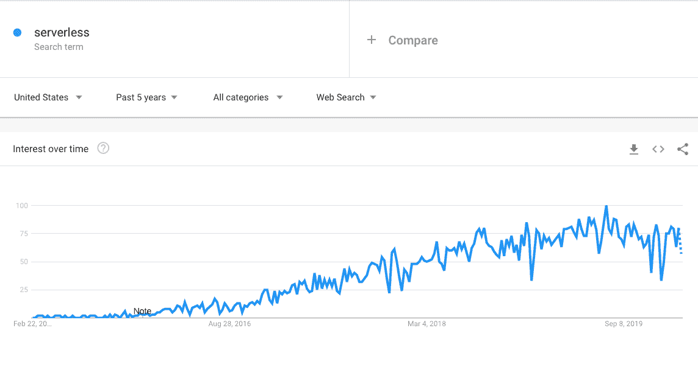

# 无服务器 PHP 简介:主要特性、用例以及如何开始使用 Lambda 上的 Bref

> 原文：<https://kinsta.com/blog/serverless-php/>

无服务器计算是一种基于云的执行模式，支持将应用程序托管为服务，无需维护服务器。

服务提供商维护服务器上的资源分配，用户根据实际使用情况付费。焦点转移到正在创建的核心应用程序，服务提供商处理基础设施。无服务器计算也被称为[功能即服务](https://kinsta.com/blog/function-as-a-service/) (FaaS)。

换句话说，无服务器 PHP 是无服务器计算的实现，用一个 [PHP 后端](https://kinsta.com/knowledgebase/what-is-php/)给你举个例子。

在本指南中，我们将仔细研究无服务器 PHP 的含义、它的主要特性及其优缺点，以便更好地理解这种实现云计算的方法。

具体来说，我们将看看无服务器计算的概念、它的用例、范围、优点和缺点、使用 Bref 的无服务器 PHP 的简单实现，以及无服务器 PHP 在三巨头([亚马逊](https://kinsta.com/blog/google-cloud-vs-aws/)、微软和[谷歌](https://kinsta.com/blog/google-cloud-hosting/))上的地位。

准备好了吗？开始吧！

## 为什么要使用无服务器计算？

传统上，你需要服务器的硬件来在互联网上设置应用程序。服务器机器(或机器)将物理地连接到因特网，以便有人访问您的应用程序。服务器维护是一件昂贵的事情。


> Kinsta 把我宠坏了，所以我现在要求每个供应商都提供这样的服务。我们还试图通过我们的 SaaS 工具支持达到这一水平。
> 
> <footer class="wp-block-kinsta-client-quote__footer">
> 
> 
> 
> <cite class="wp-block-kinsta-client-quote__cite">Suganthan Mohanadasan from @Suganthanmn</cite></footer>

[View plans](https://kinsta.com/plans/)

接下来，主机服务的发展允许网站管理员购买主机空间——每台服务器可以容纳多个应用程序。这降低了成本。

随着[云计算](https://kinsta.com/blog/cloud-market-share/)的兴起，规模经济进一步降低了成本，因为你可以在一个大型的远程服务器农场上租用少量的空间。事实上，无服务器计算允许你只为你使用的服务付费。不使用时，您实际上不会利用云上的任何空间或资源。

无服务器计算简化了软件开发过程:它允许组织专注于开发，而不用担心部署、服务器维护和扩展。

## **无服务器 PHP:基础知识**



Trends for the term “serverless” on Google


要部署一个无服务器的 PHP 应用程序，您应该首先探索无服务器计算的概念。虽然“无服务器”一词最早出现在 2012 年 ReadWrite 上关于软件开发未来的[这篇文章](https://readwrite.com/2012/10/15/why-the-future-of-software-and-apps-is-serverless/)中，但随着 2014 年 [AWS](https://kinsta.com/blog/google-cloud-vs-aws/) Lambda 的推出，它开始流行起来。

在本节中，让我们关注与无服务器计算相关的几个关键概念，并尝试回答围绕该技术的一个常见问题:它真的是“少服务器”吗？


### **无服务器 PHP 的特点**

部署是一项简单的任务，无需管理服务器。您只需将您的代码上传到服务器，剩下的工作就交给供应商了。无服务器技术允许你拥有独立于语言的功能，并且可以相互交流。

例如，如果您有一个消息应用程序，登录模块可能用一种语言编码，而更新您状态的功能可能用另一种语言编码。

虽然这在没有无服务器托管的情况下仍然是可能的，但肯定更难与之交互。每当一个动作触发了你的函数，就会产生一个实例来处理它。

这个生成实例的过程可能是“热”的，即使用现有的实例，也可能是“冷”的，即启动一个新的实例。与传统主机相比，这个过程会有一点延迟，尤其是冷启动，在传统主机中，服务器总是处于待机模式来处理请求。

然而，当您有许多请求要处理时，无服务器托管和传统托管之间的情况就相反了。无服务器技术固有的可扩展性。如果您突然需要一千个并发请求，供应商将会处理它们，而不需要您做任何额外的工作或配置。

### **无服务器 PHP 真的是无服务器吗？**

不要让“无服务器”这个术语迷惑了你。这并不意味着“服务器”不存在。当您使用无服务器应用程序时，有一个服务器在后台处理您的输入并计算必要的输出。

从从未接触过各种服务器元素的[开发人员](https://kinsta.com/blog/hire-wordpress-developer/)的角度来看，这个术语中存在“-less”。因此，如果您部署一个无服务器的 PHP 应用程序，一个运行在云上的实际服务器会满足请求。
T3】

## **BaaS 与无服务器架构**

虽然“无服务器计算”没有严格的定义，但它也可能指 BaaS(后端即服务)应用程序。BaaS 也指云计算模式，其中服务器操作外包给第三方，开发者只需要专注于创建和维护软件。

BaaS 和无服务器之间的主要相似之处在于，开发人员并不关注服务器管理。许多组织在同一保护伞下提供 BaaS 和 FaaS 软件包。

以下是 BaaS 和无服务器计算的主要差异:

*   组件:BaaS 应用程序与传统应用程序相似，开发人员可能不会改变其结构来适应 BaaS。在无服务器模式下，应用程序被分成称为函数的逻辑部分，每个函数响应一个事件并执行一个特定的任务。
*   可伸缩性:可伸缩性是无服务器应用程序中的一个重要组成部分——随着流量的增加，分配的资源也会增加。它不是 BaaS 应用程序的必要模块，尽管一些服务提供商将其作为附加模块提供。
*   触发器:无服务器应用程序是事件驱动的，这意味着特定的活动在每次发生时都会触发应用程序。另一方面，BaaS 应用程序可以像传统应用程序一样，持续利用资源在后台运行。
*   模块化体系结构:在无服务器体系结构中，应用程序的各种功能可以驻留在不同的服务器上并在不同的服务器上执行，但是由于它们的集成，可以无缝地运行。BaaS 应用程序可能会也可能不会遵循这种结构。

## **无服务器 PHP:用例**

我们已经讨论了无服务器计算的各个方面以及它与 BaaS 的不同之处。虽然我们已经介绍了无服务器计算的基础知识，但是让我们探索一下您可能希望采用这种架构的情况。

您可能已经意识到，在无服务器技术上托管复杂的应用程序可能不是一个好主意。然而，即使您决定不通过无服务器 PHP 部署完整的应用程序，您也可以部署模块。

在本节中，我们将讨论无服务器堆栈的两个实现示例:**数据库**和**文件存储**。

无服务器数据库是一种按需数据库，允许您在需要时执行查询。由于无服务器堆栈，扩展很容易，并且供应商只根据您使用资源的时间向您收费。

[亚马逊极光](https://aws.amazon.com/rds/aurora/)和[谷歌云数据存储](https://en.wikipedia.org/wiki/Google_Cloud_Datastore)是当今市场上可用的无服务器数据库的例子。无服务器文件存储系统被实现为[对象存储](http://jamesthom.as/blog/2018/04/27/managing-serverless-files-with-ibm-cloud-object-storage/)。文件不被视为文件系统中的层次结构，而是被视为包含文件数据和元数据的对象。存储和检索是通过一个类似 REST 的 API 进行的。

IBM Cloud 为你提供[一个对象存储](https://console.bluemix.net/docs/services/cloud-object-storage/about-cos.html)服务。无服务器应用程序的其他常见用例是 API 和移动后端，它们的设计基于小的、逻辑的、相互依赖的功能。

## **无服务器 PHP:优势**

在这一节中，我们来看看无服务器计算的主要优势，以及为什么它近年来越来越受欢迎。

### **降低服务器成本**

理论上，与传统主机相比，无服务器计算导致[更低的成本](https://kinsta.com/blog/sysadmin/)。内在原因很简单:您在特定的时间内使用该服务，在空闲时间没有维护成本。如果你面临[长时间](https://kinsta.com/blog/how-to-drive-traffic-to-your-website/)的恒定流量，采用无服务器架构可能不会导致太大的成本差异。

### **更轻松的部署**

无服务器服务的部署不需要[设置您的服务器并对其进行配置](https://kinsta.com/blog/how-to-use-ssh/)。无服务器应用程序的部署也是通过简单的函数实现的。创建应用程序的版本并使其在云上可用更容易。因此，整个部署过程更加容易和高效。

## 注册订阅时事通讯


### 想知道我们是怎么让流量增长超过 1000%的吗？

加入 20，000 多名获得我们每周时事通讯和内部消息的人的行列吧！

[Subscribe Now](#newsletter)

### **可扩展性**

在传统的设置中，需要付出很大的努力来[扩大规模以满足更高的流量](https://kinsta.com/knowledgebase/dedicated-server/)。另一方面，当流量增加时，服务提供商负责资源分配。因此，当您部署到无服务器架构时，更容易纵向扩展。

## **无服务器 PHP:缺点**

虽然无服务器计算有其优点，但在使用它之前，必须意识到它的潜在缺点。

### **性能**

用户对无服务器计算的主要问题是性能下降。虽然它是事件驱动的，但产生一个微实例来服务一个请求需要几百毫秒。

对于时间关键的应用程序来说，这种延迟可能会很明显。随着应用程序复杂性的增加，位于不同位置的组件会增加这种延迟。这种附加的时间延迟可能证明对用户体验是有害的。

(建议阅读:[用 Gatsby 和 WordPress 建立网站简介](https://kinsta.com/blog/gatsby-wordpress/))

### **供应商锁定**

虽然无服务器架构允许你只关注你的代码，但是供应商控制着基础设施。因此，如果您选择无服务器，就不能更换供应商，因为迁移可能会很困难。

### **调试**

供应商负责无服务器应用程序的端到端部署。因此，开发人员必须依赖供应商提供适当的[日志来调试](https://kinsta.com/knowledgebase/wordpress-error-log/)。调试无服务器应用程序以确定根本原因也很困难。

## **无服务器 PHP:Lambda 上的 Bref 入门**

虽然我们已经探索了无服务器架构，但现在我们将看到通过无服务器服务部署 PHP 应用程序需要什么。

正如您可能已经猜到的，无服务器应用程序的部署**高度特定于供应商**。因此，这篇文章讨论了在 Amazon AWS 上实现一个无服务器的 PHP 应用程序。Bref，或者法语中的 brief，是一个 Composer 包，允许你通过 Lambda 在 AWS 上部署 PHP 应用。

Bref 是不断发展的，所以你应该检查一下 Bref 的成熟度矩阵来评估将你的应用移植到无服务器架构上是否是一个好主意。

厌倦了你的 WordPress 站点缓慢的主机？我们提供超快的服务器和来自 WordPress 专家的 24/7 世界级支持。[查看我们的计划](https://kinsta.com/plans/?in-article-cta)

### **使用 Bref 的无服务器 PHP 的先决条件**

首先，进入[亚马逊 AWS](https://aws.amazon.com/) 并创建一个账户。您将需要它来部署应用程序。接下来，您需要安装[无服务器框架](https://serverless.com/)来管理您的部署。

```
npm install -g serverless 
```

接下来，[在 AWS 上生成您的公钥-私钥对](https://console.aws.amazon.com/iam/home?#/users%24new?step=details)，并在本地配置无服务器框架。

```
serverless config credentials --provider aws --key <key> --secret <secret> 
```

接下来，通过 Composer 安装 Bref:

`composer require bref/bref`

在部署之前，您需要安装 Composer 的依赖项。

```
composer install --prefer-dist --optimize-autoloader --no-dev
```

### 用 Bref 在无服务器 PHP 上创建一个 Hello World 应用程序

为了用 Bref 创建一个简单的 hello world 应用程序，我们将编写一个由事件触发的函数，并返回“Hello World”字符串。

首先，你必须包含 Bref 的 autoload.php 脚本，然后使用它的 lambda 函数。如果您想从上下文中访问数据，您可以选择将[声明为一个上下文变量](https://bref.sh/docs/runtimes/function.html#context)。

```
require __DIR__.'/vendor/autoload.php';
lambda(function ($event) {
 return 'Hello world');
}); 
```

当函数准备就绪时，您必须创建一个 serverless.yml 配置文件。这是 Bref 指南中的一个基本配置文件。

```
service: app
provider:
 name: aws
 runtime: provided
plugins:
 - ./vendor/bref/bref
functions:
 hello:
 handler: index.php
 layers:
 - ${bref:layer.php-73} 
```

当您运行以下命令时，Bref 会自动创建此配置文件。

```
vendor/bin/bref init
```

现在您已经准备好了您的函数和配置，您可以使用无服务器包的`invoke`命令调用函数来检查它是否按预期运行:

```
serverless invoke -f hello
```

这里有一个关于使用 AWS 的 sam 命令行工具在[本地部署无服务器应用程序](https://bref.sh/docs/local-development.html)的指南。一旦您的项目准备就绪，您就可以使用 serverless 的 deploy 命令来部署它。使用`--verbose`选项获取部署过程的详细信息:

```
serverless deploy
```

### **无服务器 PHP 的其他部署选项**

AWS Lambda 上的 Bref PHP 是一个流行的选择。然而，对于您的无服务器 PHP 应用程序，还有一些其他的选择。

[Vapor](https://vapor.laravel.com/) ，由 [Laravel](https://kinsta.com/blog/laravel-tutorial/) 于 2019 年 7 月推出，是 Laravel 在 AWS Lambda 上的无服务器部署平台。Vapor 将您的 Laravel 应用程序转换为一个 lambda 函数。虽然 Azure serverless [没有正式支持 PHP](https://docs.microsoft.com/en-in/azure/azure-functions/) ，但是您仍然可以使用[这个部署示例](https://github.com/kaz29/serverless-azure-php-example)来尝试一下。

[Serverless PHP is gaining more attention as weeks pass by. But what is it exactly? Is it really server-'less'? How does it work? Get all the answers to these - and more - questions in this in-depth guide! ☁️🔌Click to Tweet](https://twitter.com/intent/tweet?url=https%3A%2F%2Fkinsta.com%2Fblog%2Fserverless-php%2F&via=kinsta&text=Serverless+PHP+is+gaining+more+attention+as+weeks+pass+by.+But+what+is+it+exactly%3F+Is+it+really+server-%27less%27%3F+How+does+it+work%3F+Get+all+the+answers+to+these+-+and+more+-+questions+in+this+in-depth+guide%21+%E2%98%81%EF%B8%8F%F0%9F%94%8C&hashtags=serverless%2Cphp)

## **总结**

以下是你应该从无服务器 PHP 指南中吸取的关键方面:

*   在考虑为您的应用程序使用无服务器 PHP 之前，请确保您完全了解无服务器计算及其优缺点。
*   当您将应用程序移植到无服务器的 PHP 框架时，您应该考虑三个主要因素。考虑应用程序的复杂性、其组件的时间关键性以及未来的可伸缩性。
*   无服务器 PHP 对市场来说还是相当新的。在完全使用 Bref 之前，请确保在其中一个供应商上进行试验。

虽然无服务器正变得非常流行，但它也需要对该技术的工作原理有深刻的理解。

对于所有其他情况，使用像 Kinsta 这样的[管理的 WordPress 主机可以极大地简化你的工作流程。](https://kinsta.com/blog/managed-wordpress-hosting/)

* * *

让你所有的[应用程序](https://kinsta.com/application-hosting/)、[数据库](https://kinsta.com/database-hosting/)和 [WordPress 网站](https://kinsta.com/wordpress-hosting/)在线并在一个屋檐下。我们功能丰富的高性能云平台包括:

*   在 MyKinsta 仪表盘中轻松设置和管理
*   24/7 专家支持
*   最好的谷歌云平台硬件和网络，由 Kubernetes 提供最大的可扩展性
*   面向速度和安全性的企业级 Cloudflare 集成
*   全球受众覆盖全球多达 35 个数据中心和 275 多个 pop

在第一个月使用托管的[应用程序或托管](https://kinsta.com/application-hosting/)的[数据库，您可以享受 20 美元的优惠，亲自测试一下。探索我们的](https://kinsta.com/database-hosting/)[计划](https://kinsta.com/plans/)或[与销售人员交谈](https://kinsta.com/contact-us/)以找到最适合您的方式。