# Sucuri vs Wordfence: WordPress 安全插件对决

> 原文：<https://kinsta.com/blog/sucuri-vs-wordfence/>

[WordPress security](https://kinsta.com/blog/wordpress-security/) 就像一颗滴答作响的定时炸弹。你永远不知道它什么时候会爆炸。每天都有数千个 WordPress 网站被黑。这是一个严重的问题，应该在它发展成威胁之前就扼杀在萌芽状态。

有两个主要的方法来保护你的 WordPress 站点:第一，选择一个安全的托管服务，它有着遵循行业最佳实践的良好记录。第二，通过专门的第三方安全服务来加强网站的安全性。

有了 WordPress security，Wordfence 和 Sucuri 是两个最受欢迎的选项。它们都有一套强大的安全功能来保护您的网站安全。在许多方面，他们是相同的，但是不同的。

Wordfence 还是 Sucuri？如果你想知道这两者中哪一个最适合你的网站，这篇文章将帮助你做出决定性的决定。我广泛地使用了它们，一对一地比较了它们的各种功能、性能、定价和它们提供的总价值。

您可以使用这些信息来选择最适合您的选项。

听起来不错？我们开始吧！

## WordPress 安全性介绍

WordPress 是世界上最流行的内容管理系统。它如此受欢迎，以至于超过 35%的 T2 网站都使用它。大受欢迎就会带来大麻烦！

WordPress 一直受到黑客的威胁。根据 GoDaddy Security 的报告，[2018 年](https://blog.sucuri.net/2019/03/hacked-website-trend-report-2018.html)所有被黑的 CMS 平台中，90%是 WordPress 网站。仅谷歌[每天就将 10000 个托管和传播](https://money.cnn.com/2013/11/04/smallbusiness/google-blacklist/index.html)[恶意软件](https://kinsta.com/blog/types-of-malware/)的网站列入黑名单，这些[列入黑名单的网站会损失高达 95%的有机流量](https://uptime.com/blog/google-blacklist)。

[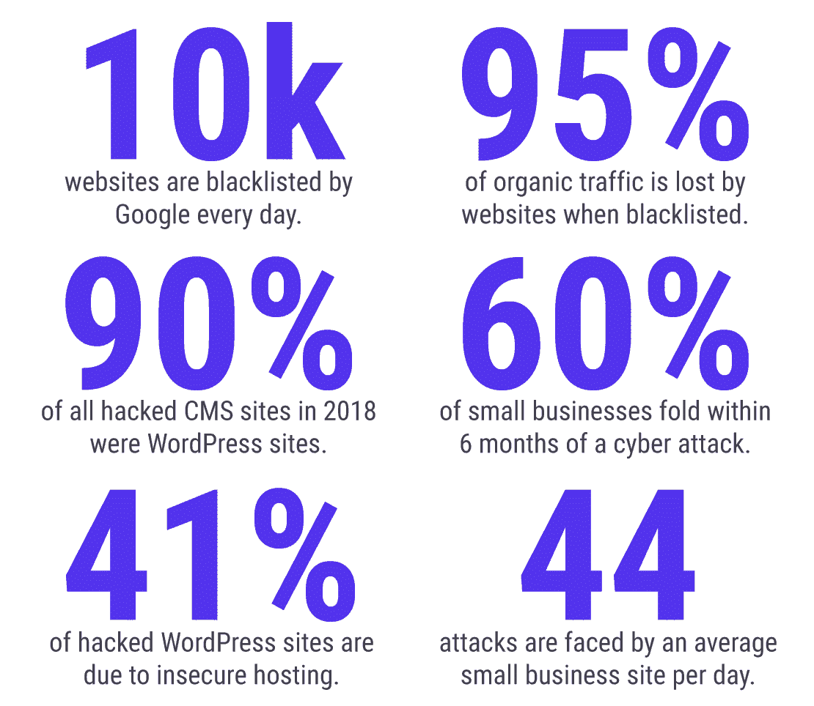](https://kinsta.com/wp-content/uploads/2020/01/WordPress-Security-Statistics.png)

WordPress Security Statistics

被黑的 WordPress 网站中有 41% 是因为托管平台中的漏洞而被[。因此，你可以从一开始就用](http://www.wptemplate.com/tutorials/safety-and-security-of-wordpress-blog-infographic.html)[安全的 WordPress 托管平台](https://kinsta.com/secure-wordpress-hosting/)避免很多麻烦。

更令人吃惊的是，[60%的小企业在网络攻击后的 6 个月内](https://www.inc.com/joe-galvin/60-percent-of-small-businesses-fold-within-6-months-of-a-cyber-attack-heres-how-to-protect-yourself.html)关闭。由于绝大多数黑客攻击都发生在中小型企业，因此保护您的网站更加重要。

## 黑客如何入侵 WordPress 网站

仅 [36.7%的 WordPress 网站被黑](https://blog.sucuri.net/2019/03/hacked-website-trend-report-2018.html)是由 WordPress 过时的易受攻击版本引起的。WordPress 网站的主要攻击媒介是它的可扩展组件，即插件和[主题](https://kinsta.com/best-wordpress-themes/)。

How WordPress is compromised (Image source: Wordfence)

外挂尤其是最大的风险！正如 Kinsta 的 [WordPress 安全文章](https://kinsta.com/blog/wordpress-security/#4-always-use-the-latest-version-of-wordpress-plugins-and-themes)中提到的，带有已知和未知漏洞的插件构成了 WordPress 黑客攻击的主体。[一项 Wordfence 研究](https://www.wordfence.com/blog/2016/03/attackers-gain-access-wordpress-sites/)发现它们代表了所有已知后门的 **55.9%** 。

猜测弱密码的暴力攻击是下一个大的攻击载体，占黑客攻击总数的 16.1%。同一项研究发现了另一个令人震惊的数据: **61.5%** 的被黑网站所有者甚至不知道他们的网站已经被入侵。

## 如何保护你的 WordPress 站点

有三个主要步骤来保护你的 WordPress 网站免受网络攻击:

[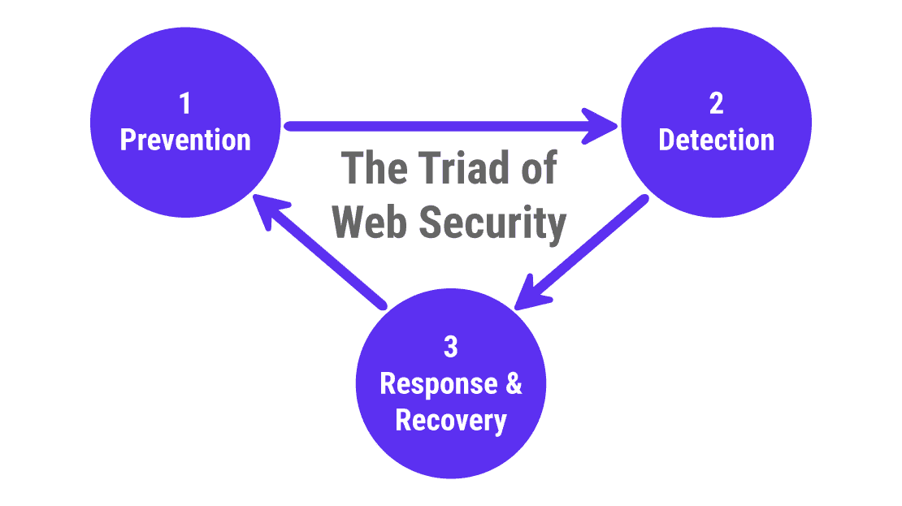](https://kinsta.com/wp-content/uploads/2020/01/The-Triad-of-Web-Security-Kinsta.png)

The 3 pillars of web security

### 预防

无论是生物疾病还是数字恶意软件，预防总是胜于治疗！

虽然 [WordPress 是免费的](https://kinsta.com/blog/is-wordpress-free/)，但是建立一个 WordPress 网站的[成本，然后保护和维护它，却不是。但可悲的是，在建设网站时，安全性往往是最不重要的。](https://kinsta.com/blog/wordpress-website-cost/)

WordPress 核心团队在保证 WordPress 安全方面做得非常好。但是如前所述，大多数 [WordPress 黑客](https://kinsta.com/blog/wordpress-hacked/)并不是来自其核心软件。

预防的重点是防止恶意代码进入你的 WordPress 站点。通常是通过防火墙、反病毒程序、电子邮件过滤解决方案、防御 T2 DDoS 攻击和不良机器人等来完成的。

### 侦查

检测的重点是在安全事件发生时立即意识到它们，以便您可以立即采取行动，并在任何重大损害发生之前保护您的网站。

包括入侵检测系统、网络扫描、[完整性监控](https://kinsta.com/blog/file-integrity-monitoring/)等工具。

许多被黑的 WordPress 网站的所有者甚至不知道他们网站的安全被破坏了。因此，拥有强大的检测系统至关重要，尤其是在托管级别。安全插件如 Sucuri 或 Wordfence 都是很好的插件。

### 响应和恢复

抱最好的希望，但要做最坏的打算！响应和恢复侧重于快速高效地解决安全事件。

一个好的恢复过程不仅应该在攻击后进行清理，还应该包括备份和取证功能。这可以确保您在类似事件发生之前阻止它们的发生。

这就是为什么你必须在与他们签约之前对你的托管公司的安全承诺进行彻底的研究的主要原因。例如，如果你的 WordPress 网站在 Kinsta 托管时遭到黑客攻击，Kinsta 的安全专家将[与你合作识别并移除恶意软件](https://kinsta.com/knowledgebase/malware-security/)。

Sucuri 或 Wordfence 等安全服务提供事故响应服务，作为其专业服务包的一部分。

[Sucuri vs Wordfence, who's the best security plugin? Find out in this thorough hands-on review! 🔐🏆Click to Tweet](https://twitter.com/intent/tweet?url=https%3A%2F%2Fkinsta.com%2Fblog%2Fsucuri-vs-wordfence%2F&via=kinsta&text=Sucuri+vs+Wordfence%2C+who%27s+the+best+security+plugin%3F+Find+out+in+this+thorough+hands-on+review%21+%F0%9F%94%90%F0%9F%8F%86&hashtags=wordpress%2Csecurity)

## Sucuri vs Wordfence

Sucuri 和 Wordfence 都可以帮助你保护你的 WordPress 站点，但是他们的方法不同。下面是他们之间的一个快速摊牌:

|  | 苏库里 | **文字围栏** |
| 防火墙定价(WAF) | 起价为每月 9.99 美元 | 起价 99 美元/年 |
| 恶意软件移除定价 | 起价 199.99 美元/年—无限制清理 | 每次清理 179 美元 |
| 可用的免费插件 | 是 | 是 |
| 网络应用防火墙(WAF) | 是的，但只针对高级客户 | 是的，它是免费的 |
| 网站完整性扫描 | 是 | 是 |
| SSL 证书支持(在 WAF 上) | 是 | 不 |
| DDoS 攻击防护 | 是 | 不 |
| 零日漏洞防范 | 是 | 不 |
| 用于提高性能的 CDN | 是 | 不 |
| 基于云的平台 | 是的，远程扫描 | 不 |
| 自托管平台 | 不 | 是的，本地扫描 |
| 系统安全调整 | 不 | 是 |

上表涵盖了 Sucuri 和 Wordfence 之间的主要区别。现在，让我们深入挖掘！

### 信息

两个插件都是兼容的，并允许在 Kinsta 主机上运行。

## Sucuri Review(摘要审阅)

[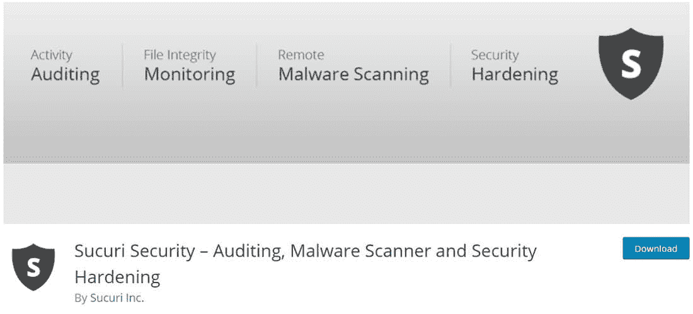](https://kinsta.com/wp-content/uploads/2020/01/Sucuri-Security-WordPress-Plugin.jpg)

Sucuri Security is a free security plugin for WordPress

### Intro to Sucuri

Sucuri 是一款基于云的网站安全工具，用于保护网站安全。它过滤所有[到你网站](https://kinsta.com/blog/how-to-drive-traffic-to-your-website/)的流量，甚至在它到达你的主机服务器之前。

其核心功能包括恶意软件检测、完整性监控和安全强化。Sucuri 远程扫描一切，因此它不会在服务器级别执行任何深度扫描。

Sucuri 承诺保护网站，提高性能，监控黑客的迹象，并为安全事件提供无限支持(仅限高级用户)。

Sucuri Security has 4.4-star rating with 600,000+ active installs

你应该注意到 Sucuri 并不是满足你所有网站安全需求的灵丹妙药。它旨在补充您现有的网络安全。然而，Sucuri 为您提供了许多降低风险的工具，让您更加安心，安全意识更强。

### Sucuri 如何工作

当谈到 Sucuri 如何工作时，最好区分一下它的三个层次:

1.  [**Sucuri Security**](https://wordpress.org/plugins/sucuri-scanner/) 是一个免费插件，带有标准的 WordPress 安全加固特性。该插件的免费版本不包括防火墙。
2.  [**【Sucuri 防火墙(WAF)**](https://sucuri.net/website-firewall/) 是一项付费服务，你可以与免费的 Sucuri 安全插件集成。你也可以使用没有插件的防火墙。它包括网站保护功能，如[网站应用防火墙](https://kinsta.com/blog/what-is-a-firewall/) (WAF)、用于性能优化的 CDN、用于高可用性的负载平衡、入侵检测系统(IDS)、DDoS 缓解以及一系列其他工具。
3.  [**Sucuri 平台**](https://sucuri.net/website-security-platform/) 是一套基于云的优质安全服务。它包括 Sucuri 防火墙的所有功能，以及其他重要功能，如监控、检测和事件响应。通过注册 Sucuri 平台，你可以要求 Sucuri 团队为你的网站“删除所有恶意软件&黑名单警告”。

[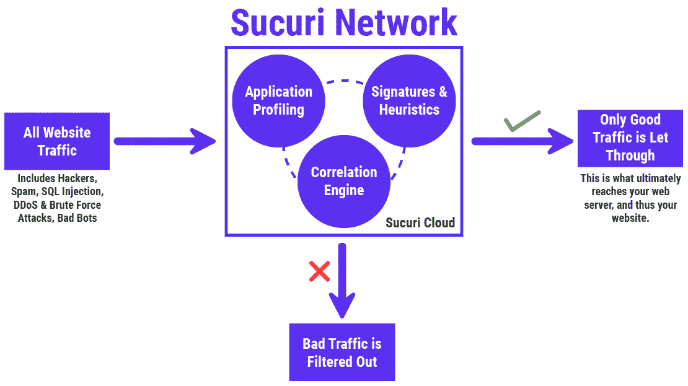](https://kinsta.com/wp-content/uploads/2020/01/Sucuri-Network-How-it-Works.png)

How the Sucuri Web Application Firewall (WAF) works

为了更好地理解，这里有一个苏库里工作时的简短视频:

Sucuri 跟踪你网站的每一个变化，并将日志保存到它自己的云服务器上。你可以[审核这些日志](https://kinsta.com/blog/wordpress-activity-log/)来找出到底哪里出了问题。这有助于快速有效地解决安全问题。

### 可用的安全设置和功能

你可以将 Sucuri 的 WordPress 产品分为两个主要产品:一个名为 **Sucuri Security** 的免费插件，和一个基于云的 [Sucuri 防火墙(WAF)](https://kinsta.com/blog/sucuri-firewall/) 。

我们先来看看免费插件。

Sucuri 安全仪表板有一个简单明了的界面，可以让你清楚地看到它的安全检查。

它的主要任务是通知你核心 WordPress 文件的完整性。如果发现任何受损的核心文件，它会给你一个警告。然后，您可以采取适当的措施:用原始文件替换受感染的文件，或者将它们标记为误报。

在这里的**审计日志**标签下，你会发现你的网站上发生的每一个变化。同样，在**iframe**、**链接、**和**脚本**标签下，你可以在你的网站上找到脚本和链接的每一个实例。

[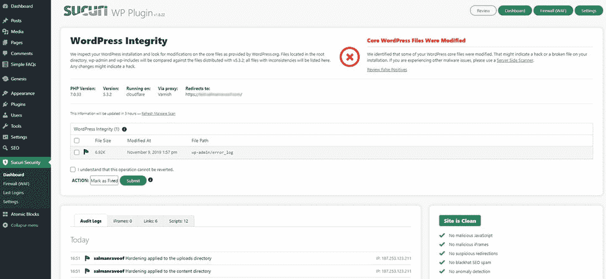](https://kinsta.com/wp-content/uploads/2020/01/The-Sucuri-Security-WordPress-Plugin-Dashboard.jpg)

The Sucuri Security dashboard. Note the warning on the top right

在我的情况下，警告是一个假阳性。所以，我标记为手动修复。Sucuri 将在下次执行扫描时记住此修复。

[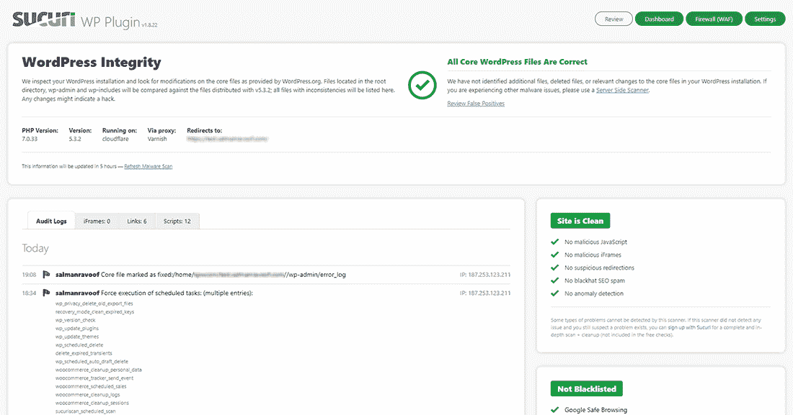](https://kinsta.com/wp-content/uploads/2020/01/Sucuri-Dashboard-All-Core-Intact.png)

You can teach Sucuri to ignore false positive warnings

**设置**面板有许多标签可以定制 Sucuri 如何保护你的网站。在**通用设置**选项卡下，可以找到您的 **API Key** 、**数据存储**目录，以及其他设置如**日志导出器**、[、**反向代理**、](https://kinsta.com/blog/reverse-proxy/)、 **IP 地址发现器**和**时区覆盖**。

您还可以从这里导入或导出 Sucuri 的整体设置。

[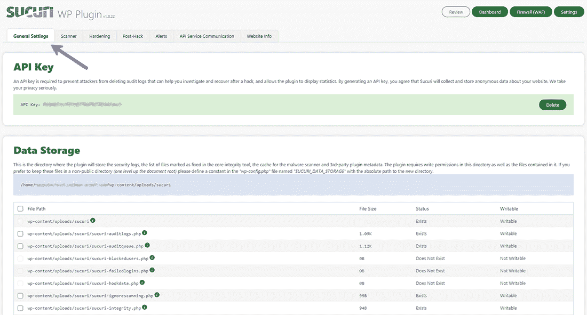](https://kinsta.com/wp-content/uploads/2020/01/Sucuri-Security-General-Settings.png)

The General Settings tab in Sucuri Security

接下来，让我们转到**扫描仪**选项卡。在这里，你可以看到 Sucuri 的**预定任务**， **WordPress Integrity Diff 实用程序**设置(将你服务器上的文件与原始文件进行比较)，以及一个**误报列表**。

如果你想忽略服务器上的某些文件和文件夹，你可以在这里设置。该工具有助于忽略与代码无关的文件和文件夹，这些文件和文件夹可能太重而无法扫描，例如包含大量[媒体文件](https://kinsta.com/blog/wordpress-media-library/)、[备份](https://kinsta.com/blog/wordpress-backup-plugins/)等的文件夹。

[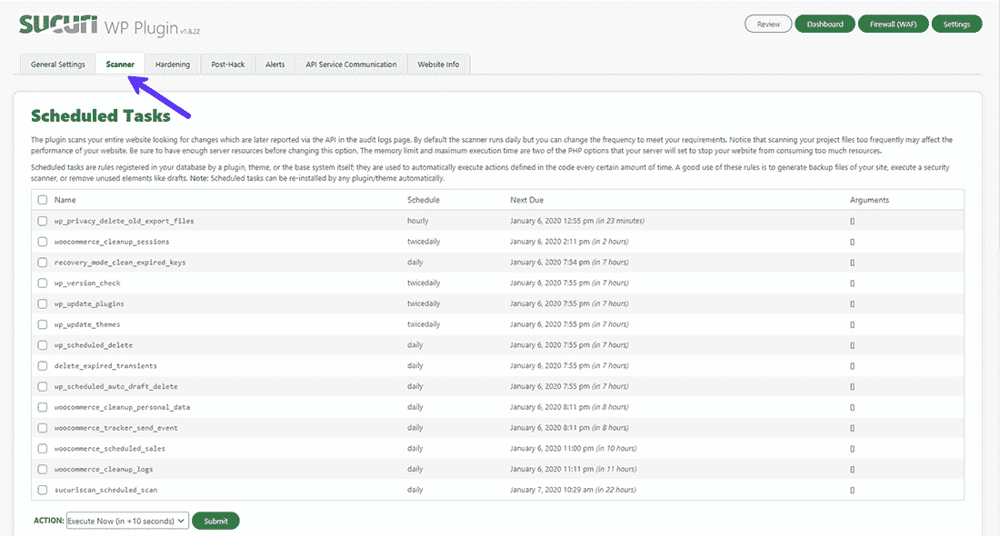](https://kinsta.com/wp-content/uploads/2020/01/Sucuri-Security-Scanner-Settings.png)

Set your scanner settings from here

**加固**标签允许你应用一套标准的 WordPress 和 PHP 安全加固方法。但是您可以使用**白名单阻止的 PHP 文件**设置来从这些严格的限制中省略某些 [PHP 文件](https://kinsta.com/knowledgebase/what-is-php/)。

[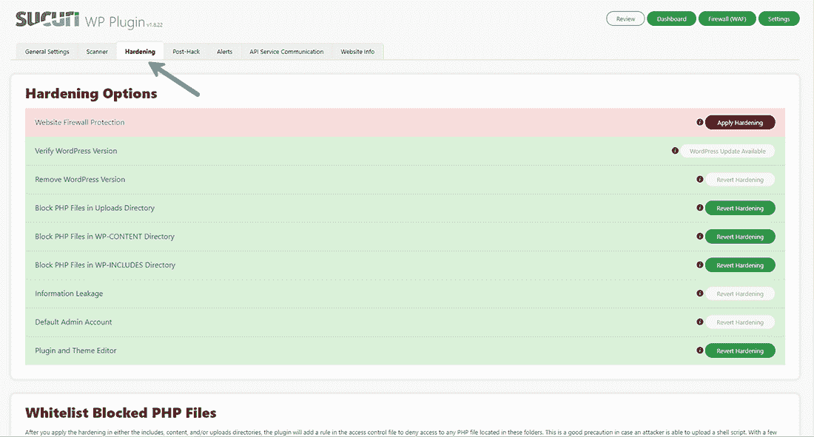](https://kinsta.com/wp-content/uploads/2020/01/Sucuri-Security-Hardening-Settings.png)

Applying standard security hardening rules

万一遭到攻击或破坏， **Post-Hack** 标签将会非常方便。在这里，你可以**更新密钥**，**重置用户密码**，**重置已安装的插件**，并应用任何**可用的插件和主题更新**。

[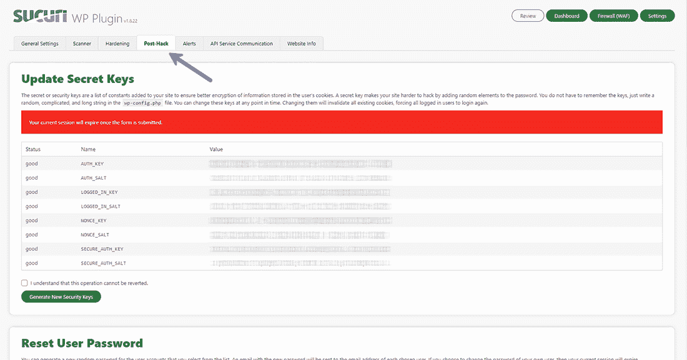](https://kinsta.com/wp-content/uploads/2020/01/Sucuri-Security-Post-Hack-Settings.png)

Quick tools to beef up security if you’ve been hacked

**警报**选项卡允许您设置**警报接收者**、**可信 IP 地址**、**警报主题**、**每小时警报**。您可以设置哪种**安全警报**将触发警报机制，以及它将忽略哪些类型(通常是第三方插件)。这是一个很棒的*检测*功能。

[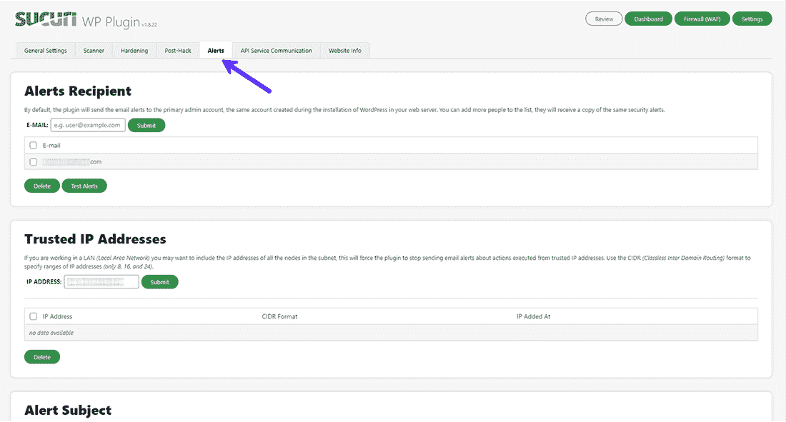](https://kinsta.com/wp-content/uploads/2020/01/Sucuri-Security-Alerts-Settings.png)

Sucuri Security lets you customize alerts

**API 服务通信**标签简单明了。主要是供开发者访问 Sucuri 的远程 API 服务。

[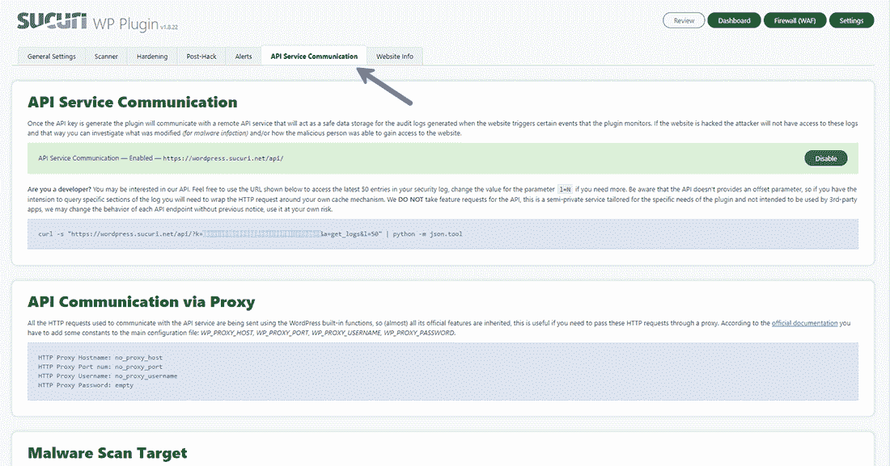](https://kinsta.com/wp-content/uploads/2020/01/Sucuri-Security-API-Service-Communication-Settings.png)

Communicate with Sucuri’s remote API service from here

最后，**网站信息**标签列出了几乎所有你想知道的关于你的网站和网站服务器的信息。在这里，在**访问文件完整性**部分下，您可以检查您的[的完整性。htaccess 文件](https://kinsta.com/knowledgebase/wordpress-htaccess-file/)。

如果你的网站是由像 Kinsta 这样的[托管平台驱动的，这不应该是一个担忧，因为 Kinsta 不使用](https://kinsta.com/blog/managed-wordpress-hosting/) [cPanel](https://kinsta.com/knowledgebase/what-is-cpanel/) ，而是使用自己的定制用户面板 [MyKinsta](https://kinsta.com/mykinsta/) 。

### 信息

想试试 MyKinsta 吗？你不需要成为 Kinsta 的用户，只需前往 [MyKinsta 演示并创建一个免费账户](https://demo.kinsta.com/register)。

[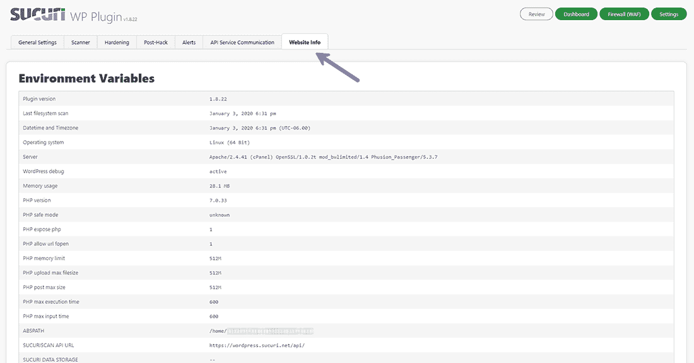](https://kinsta.com/wp-content/uploads/2020/01/Sucuri-Security-Website-Info-Tab.png)

The Website Info tab lists specs of your site and server

Sucuri 基于云的防火墙是一项高级服务。过滤垃圾流量、DDoS 攻击和不良僵尸程序非常有用。

即使没有插件，它也能发挥它的魔力(这是推荐的方式)。你只需要将你的主机的 [DNS](https://kinsta.com/knowledgebase/what-is-dns/) 指向它的域名服务器。

[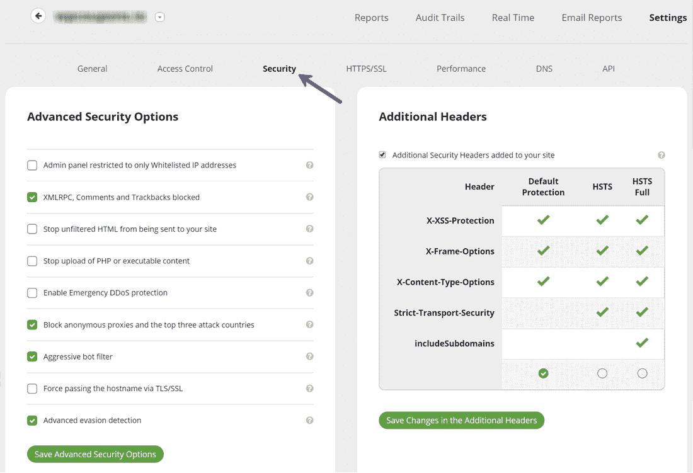](https://kinsta.com/wp-content/uploads/2020/01/Sucuri-Cloud-Based-Firewall-WAF-Security-Settings.png)

Sucuri WAF protects your sites from malicious attacks

阅读 Kinsta 的[深入的 Sucuri 防火墙指南](https://kinsta.com/blog/sucuri-firewall/)以了解更多关于它的所有特性。

包括 Kinsta 在内的大多数网络主机都有额外的安全功能来阻止和/或过滤垃圾 IP 地址和不良机器人。Kinsta 甚至有允许 IP 限制的安全设置。

然而，像 Sucuri 这样的专业 WAF 服务，其商业模式主要集中在清除不良流量上，将提供更精细的控制。

用户注册 Sucuri 的基于云的防火墙作为备份，只有在受到攻击时才切换到它，这并不罕见。Sucuri 让这一切变得超级简单。

[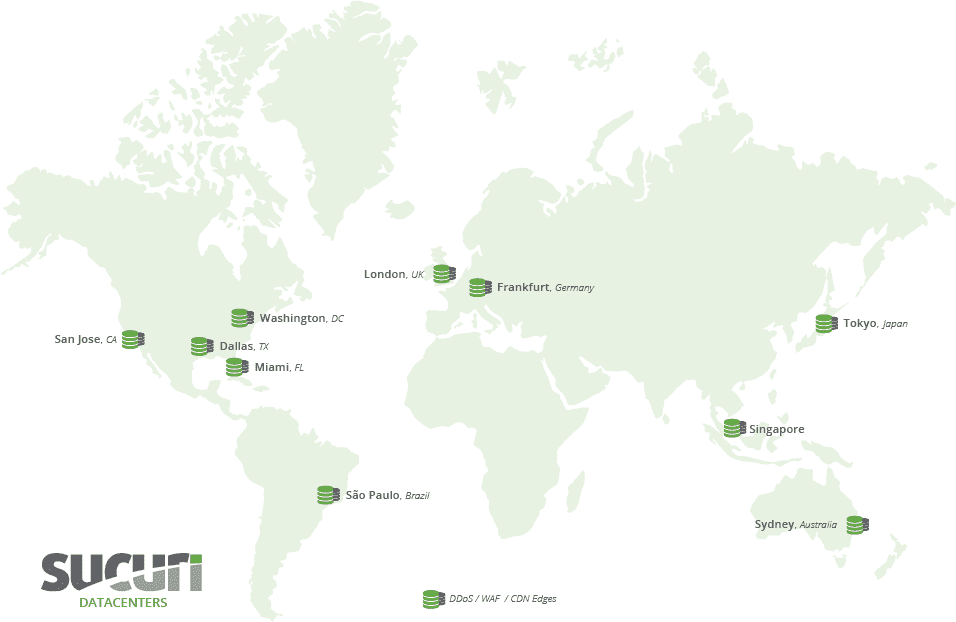](https://kinsta.com/wp-content/uploads/2020/01/Sucuri-CDN-POPs.png)

Sucuri CDN POPs are placed around the world (Image source: Sucuri)

总的来说，Sucuri 不仅仅是一个安全插件或防火墙。这是一个完整的网络安全解决方案，让您的网站免受几乎任何恶意攻击。

### 易用性

Sucuri 使用起来很简单。用户界面是重点。如果 Sucuri 建议您应用任何安全强化设置，只需单击一下就可以启用它们。

一旦你安装了插件，你需要生成它的免费 API 密匙，你可以直接在你的 WordPress 仪表盘上完成。

Sucuri 自动完成了它的大部分安全功能，所以你可以设置一次，然后永远忘记*。你也不必担心更新或维护插件。*

 *如果 Sucuri 检测到漏洞，它会提醒你。但是如果您想手动控制，它为您提供了许多选项。而且由于 Sucuri 的 WAF 是基于云的，所以不需要你方进行任何技术维护。

总的来说，我发现 Sucuri 的设置和使用非常容易。

### Sucuri 在网络安全上的表现

#### 预防

免费的 Sucuri 安全插件足够好，可以在你的 WordPress 网站上保持一个标签，并应用一些标准的安全措施。但它不是为了防止任何针对你的网站的重大攻击而构建的。

如果你正在寻找一个免费的 WordPress 安全解决方案，我不会推荐 Sucuri Security。不要依赖它来保护你的网站。

另一方面， **Sucuri 防火墙**在抵御 DDoS 攻击、恶意机器人和客户数据泄露方面表现出色。 **Sucuri 安全平台**更进一步，增加了更多的预防措施。

给你一个来自 Kinsta 的案例研究的例子，给一个遭受 DDoS 攻击的[小型电子商务网站](https://kinsta.com/blog/woocommerce-themes/)添加 Sucuri 防火墙，在激活后一小时内阻止了所有安全问题。

#### 侦查

Sucuri 的免费插件在嗅出你网站上最微小的变化方面做得很好。如果它发现任何异常，它会及时提醒你，以便你可以采取适当的行动。

即使一个黑客[把你锁在了你的网站](https://kinsta.com/blog/locked-out-of-wordpress-admin/)之外，你也可以审计保存在 Sucuri 的云服务器上的日志，找出发生了什么，以及你如何重新获得控制权。

然而，真正在监控和检测方面大放异彩的是高级的 Sucuri 安全平台。它具有各种附加功能，如定期服务器端安全扫描、[黑名单监控](https://sucuri.net/website-security-platform/blacklist-removal-and-repair/)、SSL 监控、即时通知和日志关联集成( [SIEM](https://en.wikipedia.org/wiki/Security_information_and_event_management) )。

#### 响应和恢复

一个网络安全平台是不完整的，如果它不能为你提供一个清理被黑网站的方法。

对我来说幸运的是，在苏库里保护我的网站期间，我的网站从未发生过安全事故。但是也有很多人有严重的问题，他们在 G2.com 这样的人群评论网站上分享了他们的经历。

[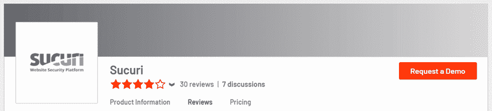](https://kinsta.com/wp-content/uploads/2020/01/Sucuri-G2-Review.png)

Sucuri enjoys a 4-star rating on G2.com

这里有一个网站的所有者分享了她对苏库里的积极评价。

> “当我突然意识到我的网站(主要供教师和儿童使用)遭到黑客攻击时，我需要尽快解决这个问题。在报告问题并注册服务后的半小时内，Sucuri 让我的网站恢复了正常。我再也不会让我的网站不受保护了，并且对 Sucuri 处理这种安全感到满意。”
> 
> — [海洋教育家贾尼斯·P](https://www.g2.com/products/sucuri/reviews/sucuri-review-326066)

这里有一位网页设计师分享了她和 Sucuri 一起帮助她清理客户 WordPress 网站的正面经验。

## 注册订阅时事通讯

### 想知道我们是怎么让流量增长超过 1000%的吗？

加入 20，000 多名获得我们每周时事通讯和内部消息的人的行列吧！

[Subscribe Now](#newsletter)

> “我的客户在使用他们的 wordpress 网站时遇到了问题。自从与我的客户签约以来，还没有出现任何网站被黑的问题。”
> 
> — [梅丽莎·C，企业主](https://www.g2.com/products/sucuri/reviews/sucuri-review-326004)

你应该注意到，有相当多的评论中，用户抱怨 Sucuri 响应票证所花费的时间。理解 Sucuri 的定价策略有助于解释这个问题。

### 苏库里定价

现在，到了最重要的一点，定价。

[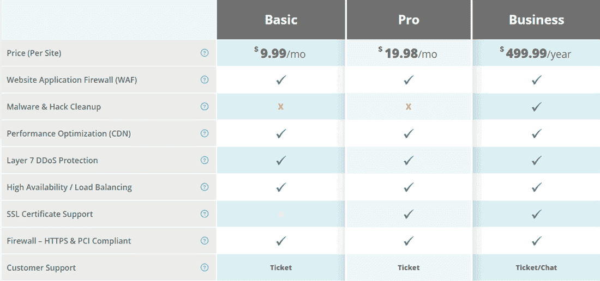](https://kinsta.com/wp-content/uploads/2020/01/Sucuri-Website-Firewall-WAF-Pricing.png)

Sucuri Firewall pricing and features breakdown

Sucuri 防火墙(WAF)9.99 美元/月起，Sucuri 平台 199.99 美元/年起。注册 Sucuri 平台还可以让你无限制地清除恶意软件和黑客攻击。

Sucuri 的所有保费计划都有 30 天退款保证。

Sucuri 并没有将任何安全特性排除在它的底层计划之外，除了原始服务器上的 SSL 证书支持(这是为第二便宜的计划保留的)。

相反，Sucuri 使用扫描和响应优先级作为激励，让你报名参加他们更高的计划。

[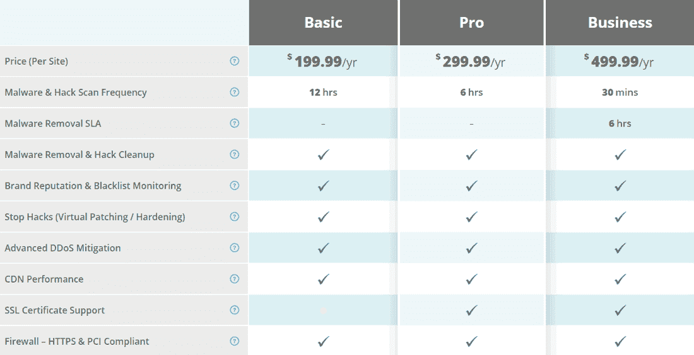](https://kinsta.com/wp-content/uploads/2020/01/Screens-Platform-Pricing-Plans.png)

Sucuri Platform pricing and features breakdown

这种定价策略为每个 Sucuri 客户提供了相同的预防和检测功能，但对于扫描和恶意软件删除，已注册更高计划的客户获得最高优先级。

每个人都会在适当的时候得到他们的票，但是如果你在最底层，在大多数情况下不会立即得到回应。如果您需要更快的解决方案，您可以选择他们更高的计划。相比之下，Cloudflare 的等效安全解决方案每月花费 200 美元。

我可以理解为什么这种方法会让一些用户感到沮丧，特别是当他们在处理一个被黑客攻击的网站并寻找快速修复的时候。但是考虑到从中获得的总价值，从长远来看，它对大多数 Sucuri 用户来说更好。

现在我们已经介绍了 Sucuri，让我们转到 Wordfence，看看它与它相比如何。

## Wordfence 评论

Wordfence Security is a free security plugin for WordPress

### Wordfence 简介

Wordfence 是一个免费的 WordPress 安全插件，包括一个端点防火墙(WAF)和一个恶意软件扫描器。

它还具有其他安全措施，如登录安全( [2FA](https://kinsta.com/feature-updates/two-factor-authentication-2fa-mykinsta/) 、[登录页面](https://kinsta.com/blog/wordpress-login-url/)、[验证码](https://kinsta.com/blog/wordpress-captcha/)，限制登录尝试)、实时流量和基于规则的高级阻止。

[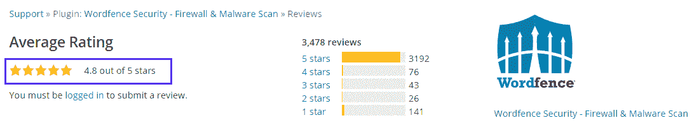](https://kinsta.com/wp-content/uploads/2020/01/Wordfence-Security-Plugin-Reviews.png)

Wordfence has a 4.8-star rating with 3+ million active installs

与 Sucuri 不同，Wordfence 是一款本地化的防火墙。它驻留在你的网络服务器上，而不是云服务。因此，它可以在更深的层次上执行服务器端扫描，并提供完整的端到端加密。

但是这种优势是以牺牲性能为代价的。

为什么？因为您的服务器资源将分析流量，检查任何恶意意图，并在必要时丢弃流量。如果你在一个资源较少的服务器上托管你的网站(例如共享托管和廉价托管计划)，你的网站会爬得很快。

在发生 [DDoS 攻击](https://kinsta.com/blog/what-is-a-ddos-attack/)的情况下，大量的恶意流量会淹没你的服务器资源。没有任何本地安全插件可以抵挡得住。与 Sucuri 相比，这是 Wordfence 最大的弱点。

相比之下，如果你启用了 Sucuri 的 WAF，任何恶意的流量在到达你的服务器之前都会被过滤掉。

但是 Wordfence 的本地化 WAF 是一个免费的内置功能，而 Sucuri 的 cloud WAF 是一个高级产品。

### Wordfence 如何工作

Wordfence 的防火墙由其*威胁防御馈送*提供支持，这是一个用于收集防火墙规则、恶意 IP 地址和恶意软件签名的花哨术语。

威胁防御 Feed 与你的 WordPress 网站上安装的 Wordfence 插件整合在一起。它由你的服务器驱动。

[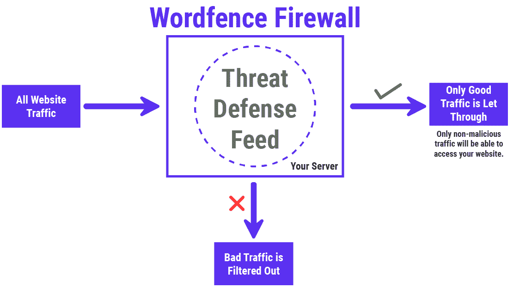](https://kinsta.com/wp-content/uploads/2020/01/Wordfence-Firewall-How-it-Works.png)

How the Wordfence Firewall (WAF) works

使用 Wordfence Premium，您可以获得对*威胁防御源*的实时更新。它包括以下功能:

*   实时 IP 黑名单、防火墙规则和恶意软件签名更新。
*   高级支持。
*   站点/IP 信誉检查。
*   国家级封杀。

免费用户只有在上线 30 天后才能获得关键任务更新。他们也不会得到实时的 IP 黑名单。虽然这对于个人网站来说似乎是一个不错的选择，但如果你是一个企业或电子商务网站，这可能会成为一个障碍。

与云防火墙相比，端点防火墙有一个优势。由于它完全由你的服务器供电，理论上它不能泄露任何数据，也不能被绕过。相比之下，云防火墙[可能会泄露数据](https://www.wordfence.com/blog/2017/02/cloudflare-data-leak/)，或者[被绕过](https://www.wordfence.com/blog/2016/10/endpoint-vs-cloud-security-cloud-waf-bypass-problem/)，如果攻击者知道你的服务器的 IP 地址。

[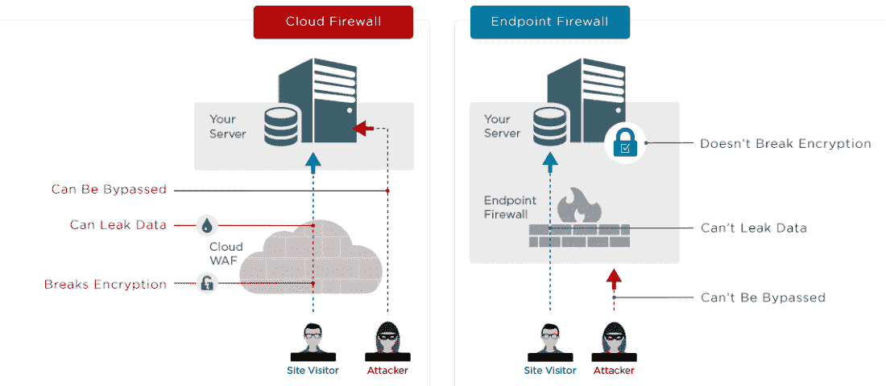](https://kinsta.com/wp-content/uploads/2020/01/Wordfence-Endpoint-Firewall-vs-Sucuri-Cloud-Firewall.png)

Cloud Firewall vs Endpoint Firewall (Image source: Wordfence)

### 可用的安全设置和功能

Wordfence 位于您的 web 服务器上。因此，你可以在你的 [WordPress 仪表盘](https://kinsta.com/knowledgebase/wordpress-admin/)中找到它的所有设置。

仪表板干净整洁，信息丰富。它为您提供关键信息和警告，一目了然。

[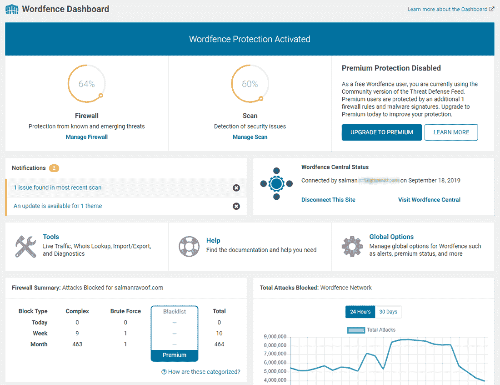](https://kinsta.com/wp-content/uploads/2020/01/Wordfence-Plugin-Dashboard-Screen.png)

The Wordfence dashboard

Wordfence 的扫描程序会对服务器上的每个文件进行完整性检查。如果它不是核心 WordPress 文件或官方主题/插件，它会提醒你。

你的新网站需要一流的、快速的、安全的主机吗？Kinsta 提供超快的服务器和来自 WordPress 专家的 24/7 世界级支持。[查看我们的计划](https://kinsta.com/plans/?in-article-cta)

它会将服务器文件中的文本与已知恶意软件的文本进行匹配。如果它发现任何类似的东西，即使只是一两行，它也会发出警告。如果你的主题或插件有更新，你也会收到通知。

现在，让我们转到 Wordfence 的**防火墙**面板。在这里，您可以管理 Wordfence 的 WAF 设置并优化其配置。

[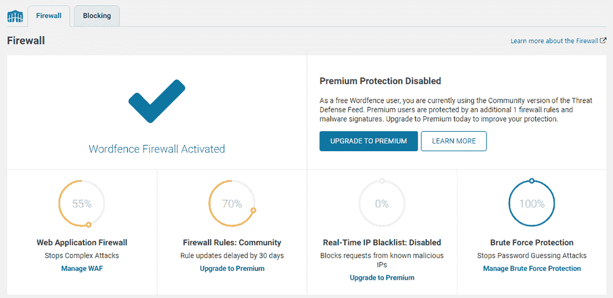](https://kinsta.com/wp-content/uploads/2020/01/Wordfence-Firewall-Panel.png)

Wordfence’s Firewall settings are mostly automated

当你第一次安装 Wordfence 的时候，默认情况下它的 WAF 会处于*学习模式*一周。这允许它彻底研究你的站点和访问者，所以它知道应用什么规则来只让合法的流量通过防火墙。

**实时 IP 黑名单**功能仅适用于高级用户。

启用**暴力保护**后，Wordfence 会在几次不成功的密码猜测尝试后锁定他们的帐户，从而保护您免受攻击者的攻击。如果它认为密码太弱，不容易猜到，它还会强迫你更改密码。

[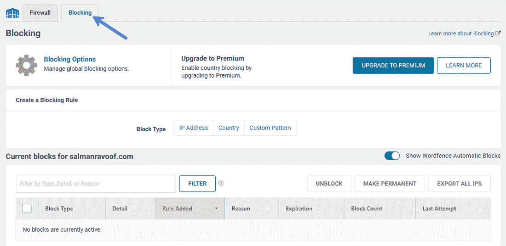](https://kinsta.com/wp-content/uploads/2020/01/Wordfence-Firewall-Blocking-Tab.png)

Manage  blocking rules for your site from the Blocking tab

在**拦截**选项卡下，您可以根据 IP 地址、IP 范围、浏览器、主机名和推荐人拦截流量。然而，国家级封锁是一个只有高级功能。您可以组合所有不同的封锁规则，并将其保存为**封锁类型**。

[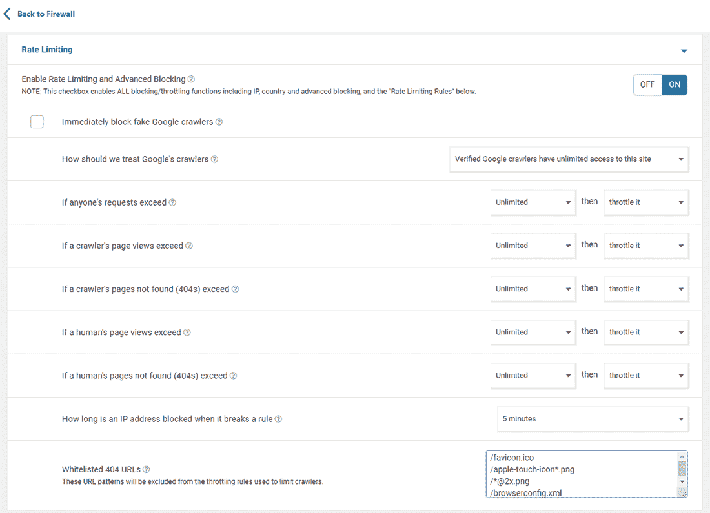](https://kinsta.com/wp-content/uploads/2020/01/Wordfence-Firewall-Options-Rate-Limiting.png)

Activate rate limiting and advanced blocking rules from here

在**防火墙选项**部分，您可以将 IP 地址和服务列入白名单，设置 WAF 警报要忽略的 IP 地址，配置速率限制，以及将 URL 列入白名单。

Wordfence 还允许您阻止访问某些 URL 的 IP。如果有人反复探查您的网站的已知漏洞，这将很有帮助。

接下来，让我们转到**扫描仪**设置选项卡。

[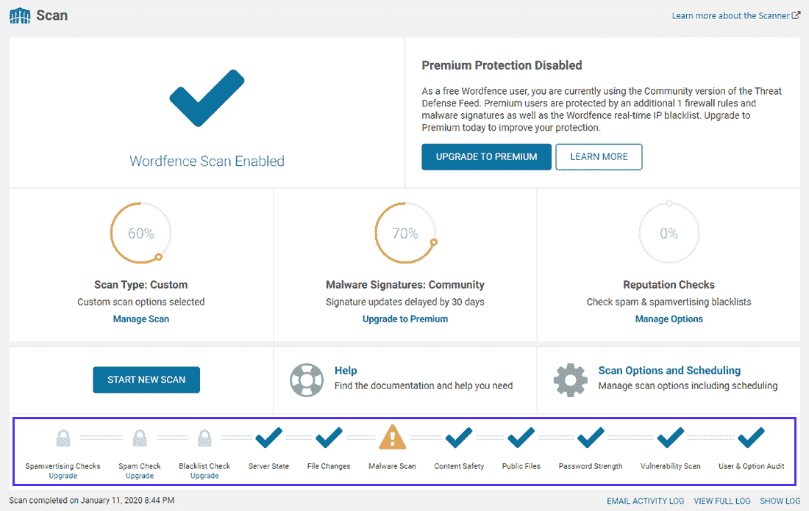](https://kinsta.com/wp-content/uploads/2020/01/Wordfence-Scan-Panel.png)

Manage your Wordfence scan settings from here

在这里，你会发现 Wordfence 的扫描任务。前三个测试是检查垃圾邮件和黑名单，它们只为高级用户保留。

如果扫描发现任何异常，它会给你一个警告。

在**扫描选项和调度**部分，您可以设置扫描灵敏度、扫描频率和白名单文件。您也可以在您的设置中优化扫描性能。

[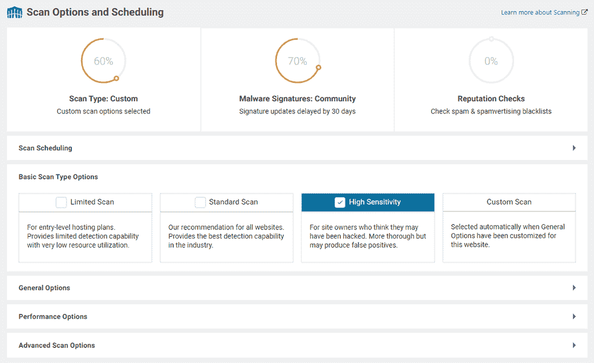](https://kinsta.com/wp-content/uploads/2020/01/Wordfence-Scan-Options-Scheduling-Panel.png)

Wordfence has extensive scan and scheduling options

Wordfence 附带了一堆其他方便的工具。

**实时流量**工具可以帮助你实时查看网站上发生的事情。您可以仅通过与安全相关的流量对其进行过滤。这将显示所有用户登录，黑客企图，和恶意请求。

[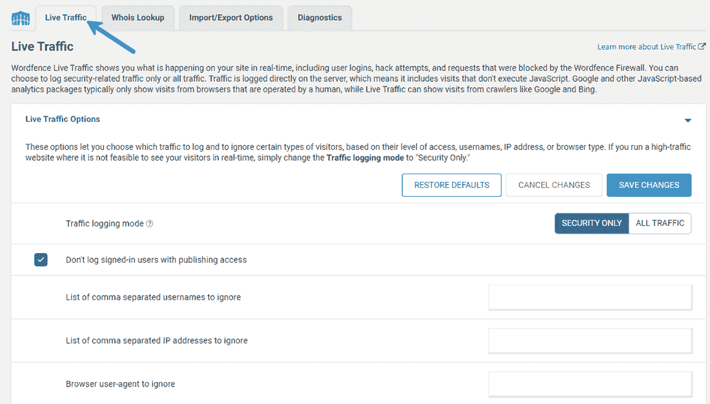](https://kinsta.com/wp-content/uploads/2020/01/Wordfence-Tools-Live-Traffic.png)

Live Traffic is Wordfence’s coolest yet resource-intensive feature

虽然这是一个很酷的功能，但**实时流量**会占用大量服务器资源。我建议你不用的时候关掉它。

其他工具包括 **Whois 查找**、**导入/导出选项**和**诊断**。

你也可以使用 Wordfence 的**登录安全**模块为你的 WordPress 站点上的所有登录启用**双因素认证(2FA)** 。它以前是一个只有高级用户才能使用的功能，但现在它是免费的。

[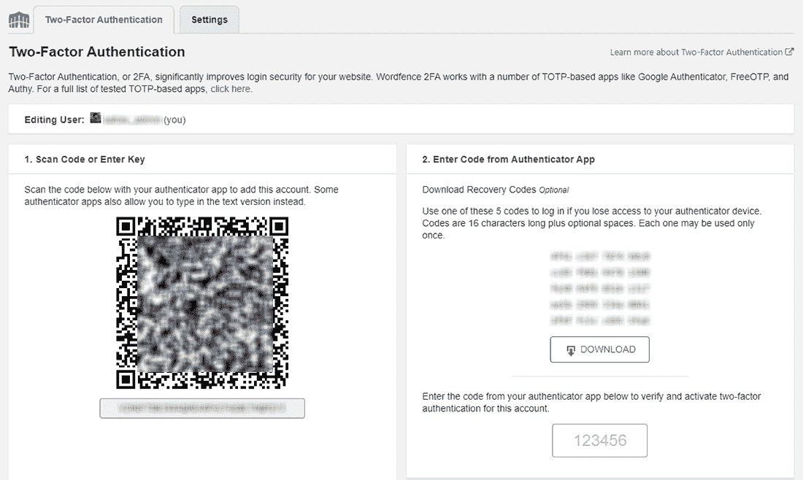](https://kinsta.com/wp-content/uploads/2020/01/Wordfence-Two-Factor-Authentication.png)

Enable Two-Factor Authentication on your site easily

你可以使用 Google Authenticator、FreeOTP 或 [Authy](https://authy.com/download/) (我个人推荐)等免费手机应用来设置 2FA。

[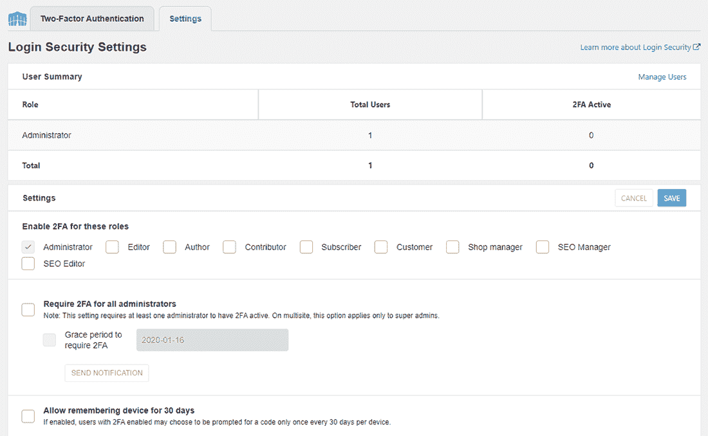](https://kinsta.com/wp-content/uploads/2020/01/Wordfence-Login-Security-Settings.png)

Wordfence’s Login Security Settings tab

您可以为所有用户角色启用 2FA。这是保护您自己和您的用户免受暴力攻击(如密码猜测和凭据填充)的好方法。

您可以为 2FA 设置一个 IP 白名单，以便某些 IP 在登录时不必经过额外的安全检查。如果您主要在一个地方工作，这个特性可以帮助您避免每次登录都要经过 2FA。

阻止暴力攻击的其他登录安全功能包括:

*   限制“忘记密码”尝试和登录失败的次数。经过一定次数的尝试后，用户将被锁定。
*   强制实施站点范围的强密码。
*   防止用户注册某些用户名(如 admin)
*   立即阻止试图使用特定用户名(如 admin、yoursite_admin 等)登录的人。).
*   禁用 XML-RPC 身份验证，这是一种用于注入恶意软件的常见攻击媒介。

最后，Wordfence 包括一个 **All Options** 面板，在这里你可以找到每一个 Wordfence 设置。考虑到 Wordfence 下的广泛选项，这是非常有用的。

[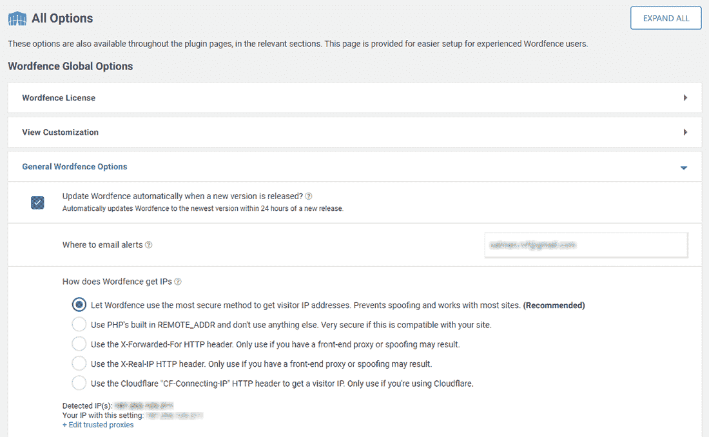](https://kinsta.com/wp-content/uploads/2020/01/Wordfence-All-Options-Panel.png)

View all of Wordfence’s options from the All Options panel

### 易用性

关于用户友好性，Wordfence 可以与 Sucuri Security 相媲美，并且使用起来超级简单。安装并激活插件后，Wordfence 会立即进入*学习模式*一周。

根据您的服务器设置和流量，它会自动应用推荐的防火墙和扫描设置。根据我的经验，这些设置足以保护您免受大多数攻击。

登录安全特性易于设置和实施。

如果你的网站受到 DDoS 攻击，Wordfence 可以让你的服务器爬行。在最极端的情况下，服务器可能会不堪重负，以至于它会锁定你访问你的 WordPress 管理仪表板。

由于 Wordfence 是一个本地化的解决方案，您可以完全控制它的设置。如果你精通技术，这可能会有所帮助，但对于大多数 WordPress 用户来说，这可能是一个麻烦。

总的来说，我发现 Wordfence 非常简单，只要它能按预期工作。

### Wordfence 在网络安全上表现如何

#### 预防

不像 Sucuri 的免费解决方案不包括防火墙，Wordfence 有一些牙齿来阻止大多数攻击。它不仅应用了标准的安全强化措施，而且还带有服务器端 WAF。

但是最新的威胁更新只提供给高级用户。免费用户在上线 30 天后获得更新。由于你的网络服务器支持 Wordfence(而不是云),即使有了 premium 选项，你也只能自己防御 DDoS 攻击。

我可以理解这一决定背后的业务需求，但为了安全起见，我认为 Sucuri 的全有或全无的方法更好。至少你不会认为你已经受到了保护，可以抵御最常见的威胁，而实际上你并没有。

也就是说，Wordfence 的高级版本在防止大多数安全攻击方面做得很好。他们的博客和 [YouTube 频道](https://www.youtube.com/channel/UChUNbUrIUgvLpzXJrGHhOPA)是让你了解最新 WordPress 安全威胁的绝佳资源。

#### 侦查

免费的 Wordfence 插件可以很好地检测大多数安全问题。但是你需要它的高级包来嗅出最新的威胁。

如果一个黑客成功地把你锁在了你的网站之外，那么就没有办法像 Sucuri 那样审计日志了。因此，调查黑客行为要困难得多。

除了联系你的主机提供商或第三方安全服务，你没有其他的办法，讽刺的是，这也包括 Wordfence。

与 Sucuri 相比，Wordfence 有一个基本的警报定制功能，它做得很好。一旦发现安全异常，它会及时提醒你。

#### 响应和恢复

如前所述，免费版的 Wordfence 让你自己照顾自己。但即使有了高级包，Wordfence 也不提供任何响应和恢复服务。

这里有一段话直接摘自 [Wordfence 的使用条款](https://www.wordfence.com/terms-of-use/):

> “我们为 Wordfence Premium 提供的支持仅限于每个事件 2 小时的支持。我们保留拒绝进一步支持或对超过 2 小时的额外支持收费的权利。”

要获得完整的解决方案，你必须去找他们独立的叫做 **WordPress 网站清理**的服务。它的定价是每个实例 179 美元(加上基于需求的激增费用)。

[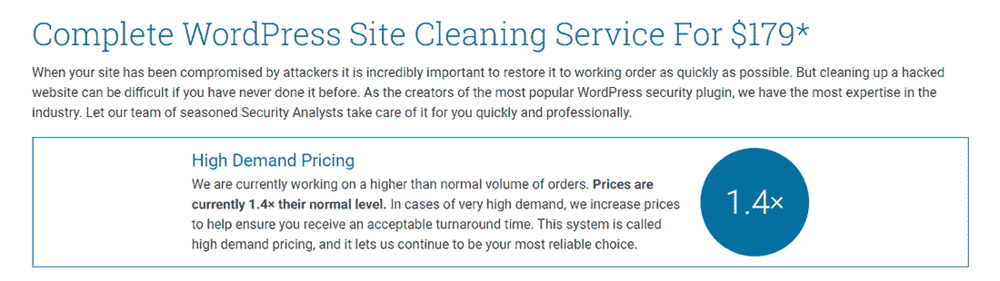](https://kinsta.com/wp-content/uploads/2020/01/Wordfence-Site-Cleaning-Service-Surge-Pricing.png)

Wordfence WordPress site cleaning service

他们的 WordPress 网站清理服务包括:

*   通过删除所有恶意代码和链接来清除受感染的站点。
*   调查网站是如何被感染的。
*   提供调查和感染清除的深入报告。
*   申请将该站点从反恶意软件和反垃圾邮件黑名单中删除。
*   提供一份清单，以避免未来的攻击。

我还没用过他们的场地清理服务，不过好像够全面了。以下是我在 Twitter 上找到的一些好评:

Dr. David Miles, Editor-in-Chief, Global Politics

Rachel Bustin, Family Lifestyle Blogger

与 Sucuri 的恶意软件清除和黑客清理服务(包含在高级 Sucuri 平台中)相比，Wordfence 的网站清理服务似乎更昂贵。

使用 Sucuri，你可以在订阅期内无限制地清除恶意软件，而 Wordfence 的恶意软件清除服务只针对一项工作。如果几个月后你的网站再次感染了恶意软件，你需要再次支付相同的费用来清除。

### 信息

Kinsta 向所有计划的所有用户提供安全保证。

#### 文字围栏定价

你可以免费下载 Wordfence 的安全插件。到目前为止，它是 WordPress 插件库中评价最高、安装最多的安全插件。

Wordfence Premium 个站点的起价为 99 美元/年。如果你在订单上添加额外的网站，你会得到折扣。添加的站点越多，折扣越大！

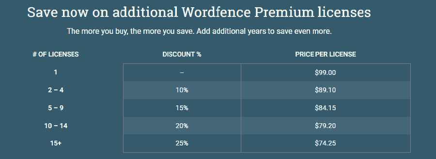

Wordfence Premium Pricing

## 安全插件如何影响网站性能

WordPress 插件不仅是最大的安全隐患，也是[的主要性能杀手](https://kinsta.com/blog/third-party-performance/)之一。安全插件尤其是罪魁祸首，这要归功于它们永远在线的需求和扫描功能。

然而，如果你需要额外的保护，特别是如果你面对机器人和代理流量，基于云的安全解决方案，如 Sucuri 防火墙或 [Cloudflare](https://kinsta.com/knowledgebase/install-cloudflare/) 是非常好的。

[Sucuri vs Wordfence, who's the best security plugin? Check out this thorough hands-on review and comparison to find out! 🔐🏆Click to Tweet](https://twitter.com/intent/tweet?url=https%3A%2F%2Fkinsta.com%2Fblog%2Fsucuri-vs-wordfence%2F&via=kinsta&text=Sucuri+vs+Wordfence%2C+who%27s+the+best+security+plugin%3F+Check+out+this+thorough+hands-on+review+and+comparison+to+find+out%21+%F0%9F%94%90%F0%9F%8F%86&hashtags=wordpress%2Csecurity)

## **总结**

苏库里 vs Wordfence。最好的选择是什么？

一方面，Sucuri 是 web 安全性和性能两者中更好的解决方案，尤其是如果你正在运行一个关键业务或电子商务网站。

但是，如果你正在寻找一个免费的网络防火墙，Wordfence 是一个更坚固的解决方案。如果这是你的选择，我建议将其与可靠的免费 CDN 配对，如 Cloudflare 。

在一天结束时，这一切都归结于你的主机。一个优秀的主机提供商会为你负责大部分的安全措施。他们明白，第三方插件给他们的服务器和服务带来的性能影响是不值得争论的。

理想情况下，您的主机应该锁定代码，使其只能在有限的位置和实例中执行。然后限制只将上载写入代码的相应文件夹。在服务器层面增加一些安全加固措施，这将使 WordPress 安全插件变得多余。

最终，网站安全是一个旅程，而不是目的地。我建议你走*最好的*道路前进！

* * *

让你所有的[应用程序](https://kinsta.com/application-hosting/)、[数据库](https://kinsta.com/database-hosting/)和 [WordPress 网站](https://kinsta.com/wordpress-hosting/)在线并在一个屋檐下。我们功能丰富的高性能云平台包括:

*   在 MyKinsta 仪表盘中轻松设置和管理
*   24/7 专家支持
*   最好的谷歌云平台硬件和网络，由 Kubernetes 提供最大的可扩展性
*   面向速度和安全性的企业级 Cloudflare 集成
*   全球受众覆盖全球多达 35 个数据中心和 275 多个 pop

在第一个月使用托管的[应用程序或托管](https://kinsta.com/application-hosting/)的[数据库，您可以享受 20 美元的优惠，亲自测试一下。探索我们的](https://kinsta.com/database-hosting/)[计划](https://kinsta.com/plans/)或[与销售人员交谈](https://kinsta.com/contact-us/)以找到最适合您的方式。*