# 下一个网站项目的网页设计最佳实践

> 原文：<https://kinsta.com/blog/web-design-best-practices/>

是什么导致了一些 WordPress 开发者的收费与其他开发者的收费之间的巨大差异？回答这个问题首先需要考虑你为什么想要一个网站。

一些开发人员关注字面上的最终产品:代码的组合产生一个足够令人愉快的网站设计。

但是有市场营销头脑的开发者更关心的是*而不仅仅是建造一些看起来不错的东西。他们充当客户的顾问，这些客户希望通过他们的网站实现特定的目标。*

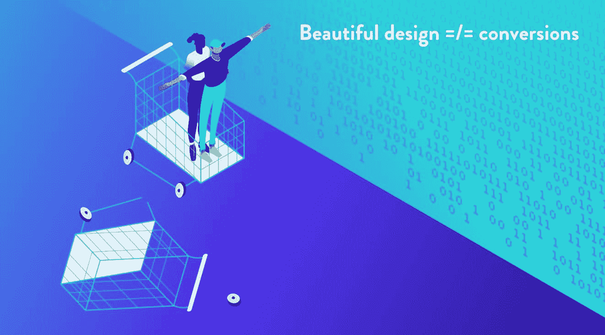

Web design is strictly connected to your business goals

考虑到这一点，[雇佣一个似乎对你的最终目标不感兴趣/不问问题的人来建立网站](https://kinsta.com/blog/hire-wordpress-developer/)**是一个危险信号**。重要的是要指出这样一个事实，当谈到让访问者转化为客户时，即使是最漂亮的网页设计也可能*不*理想。

也就是说，94%的人会根据你网站的设计来判断你的可信度。

因此，相反，你需要专注于使用你的设计来提供理想的用户体验。你必须让访问者在第一时间通过访问你的网站轻松找到他们想要的信息，同时引导他们进行[目标转换](https://kinsta.com/blog/conversion-tracking/)活动。

这些网页设计的最佳实践集中在创建一个漂亮的网站和为你的业务服务的网站之间的交叉点上。

### **更喜欢看[视频版](https://www.youtube.com/watch?v=uS9wnNsamzA)？**

## 什么定义了网页设计的最佳实践？

可以肯定的是，每个人和他们的妈妈对什么是一个设计良好的网站都有自己的看法。

> Kinsta 把我宠坏了，所以我现在要求每个供应商都提供这样的服务。我们还试图通过我们的 SaaS 工具支持达到这一水平。
> 
> <footer class="wp-block-kinsta-client-quote__footer">
> 
> 
> 
> <cite class="wp-block-kinsta-client-quote__cite">Suganthan Mohanadasan from @Suganthanmn</cite></footer>

[View plans](https://kinsta.com/plans/)

[Web design isn't just about aesthetics. It's a much more complicated world where UX, accessibility, and business goals all should connect. Check out these web design best practices! ✍️🔝Click to Tweet](https://twitter.com/intent/tweet?url=https%3A%2F%2Fkinsta.com%2Fblog%2Fweb-design-best-practices%2F&via=kinsta&text=Web+design+isn%27t+just+about+aesthetics.+It%27s+a+much+more+complicated+world+where+UX%2C+accessibility%2C+and+business+goals+all+should+connect.+Check+out+these+web+design+best+practices%21+%E2%9C%8D%EF%B8%8F%F0%9F%94%9D&hashtags=webdev%2Cux)

但是让我们通过听从专家来控制每个人的意见。

根据轨道媒体的说法，你可以将网页设计的最佳实践分成三个基本的标准类别:

*   品牌标准:你可能更熟悉“品牌”、“风格指南”或“情绪板”这些相同的概念。这些标准包括任何与网站外观有关的东西，包括颜色、排版和特定商业元素的使用。
*   编码标准:网站应该按照 W3C 同意的[编程标准](http://www.w3.org/standards/)来构建，W3C 是一个国际组织，致力于开发网络标准。
*   **无障碍标准:**获取信息是一项基本人权，得到了《联合国残疾人权利公约》的认可。除此之外，让你的网站具有可访问性有[的积极影响](https://www.searchenginejournal.com/accessibility-seo-and-sales/281899/)——不仅仅是销售，还有 [SEO](https://kinsta.com/blog/what-does-seo-stand-for/) 。W3C 分享了一个基本的标准列表，你需要遵循这些标准来设计一个可访问的网站。我们将在本文后面详细介绍更多相关的网页设计最佳实践。

让我们看看如何基于这些标准来开发网页设计实践:

## 品牌标准

缺乏一致品牌的网站可能会产生交互压力并导致混乱。因此，毫不奇怪，约 38%的访问者表示，如果内容或布局不吸引人，他们将[停止与网站](https://blogs.adobe.com/creative/files/2015/12/Adobe-State-of-Content-Report.pdf)接触。

请记住，外观并不代表一切，这里有一些基本的设计原则，可以帮助你创建一个人们愿意使用的网站:

### 保持平衡

*平衡*是规定如何有效分配视觉元素的设计原则。总的来说，一个平衡的设计看起来干净自然，有很好的对称性(虽然那是[不一定是平衡](https://wpamelia.com/visual-design-guide/)的 [*条件*](https://wpamelia.com/visual-design-guide/) [)。](https://wpamelia.com/visual-design-guide/)

你可以在网页设计中结合页面布局的平衡。

将文本或其他元素在页面上居中是一种简单的方法。一般来说，网页是建立在网格系统上的，这创造了一种平衡的形式。您可以使用 CSS *float* 属性来定位元素并在页面上平衡它们。

可以通过三种方式实现平衡:

#### 1.对称设计

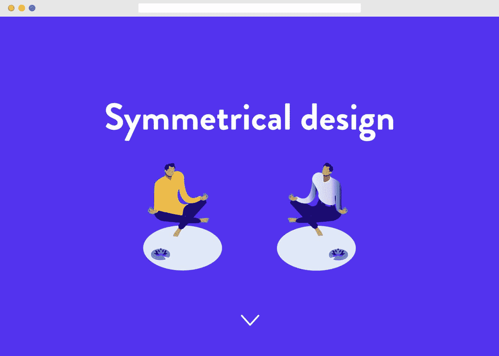

Example of symmetrical design

在网页上以均匀的方式排列元素。比如左边有重元素，右边也要有重元素。如上所述，居中是实现对称的最简单的方法，但有时会显得单调乏味。

为了避免使页面看起来单调，您可以使用不同的元素来创建平衡，例如用文本块来平衡大图像。还有一种对称平衡叫做*径向平衡*，物体从一个中心点向外辐射。

#### 2.不对称设计

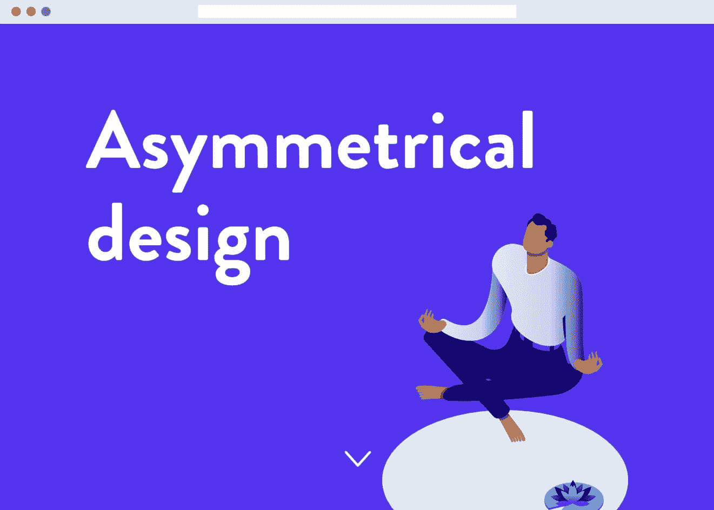

Example of asymmetrical design

要做好非对称设计更具挑战性，它包括页面上元素的不均匀分布。例如，你可能在中心有一个大元素，它被远处的一个小元素平衡。

你可以使用其他设计元素，如颜色或纹理，来平衡不对称的设计。

#### 3.不平衡

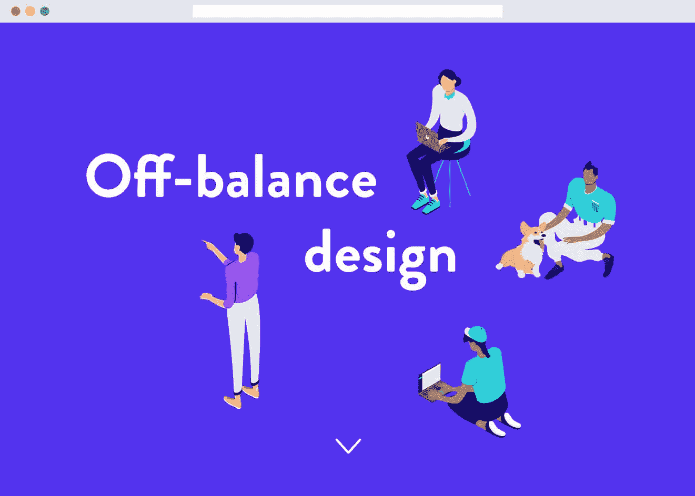

Example of off-balance design

这些类型的设计暗示了运动和动作，这会让人不舒服。如果你的网站想让人们思考，那么不平衡的设计是适合你的。

### 作文

术语*组合*是指设计元素的放置和组织。

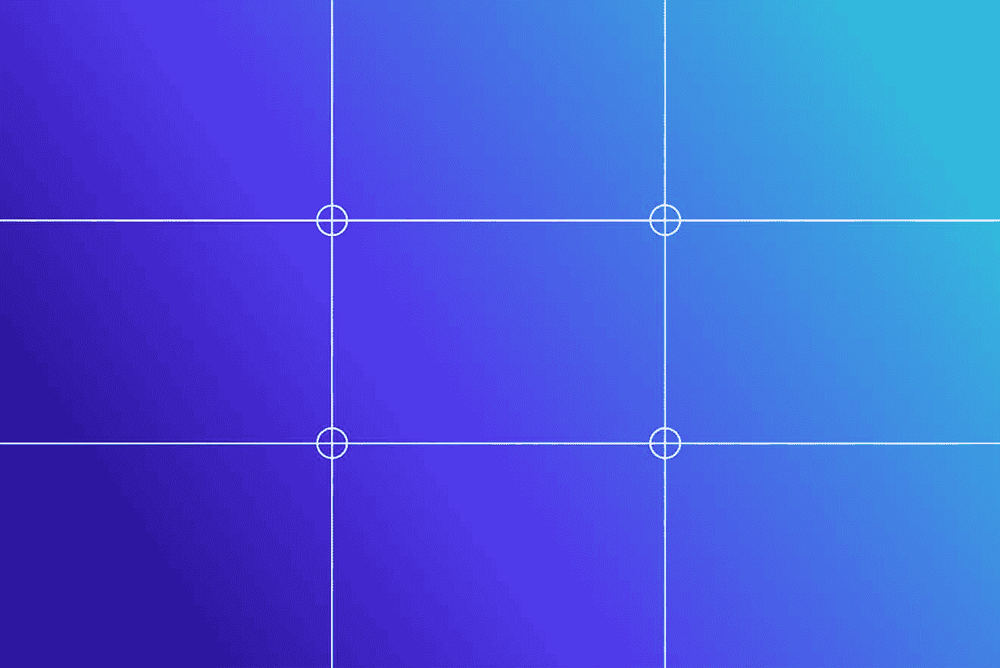

Composition

三分法则(T1)通常用于创造平衡的构图，尤其是照片。

### 间隔

元素的间距应该均匀，以便用户可以区分部分或块。

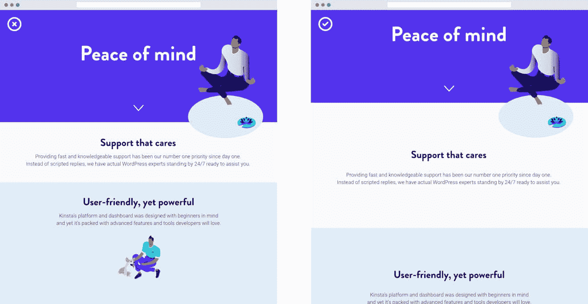

The role of spacing in web design

你还应该引入负空间或者图像主体之间和周围的空间。负空间可以减少视觉噪音，增加可读性，并带来平衡。

您可以通过在设计元素周围添加边距和填充来引入负空间。

### 焦点

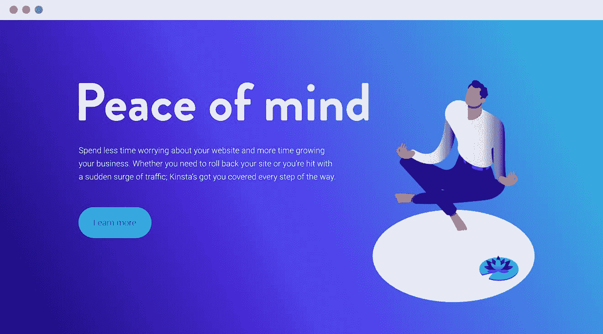

Draw attention on one element

创建一个你想要吸引注意力的焦点区域。它应该是你的页面中最重要的部分，理想情况下，每个页面应该只关注一个主要焦点。

### 颜色

颜色是品牌的一个重要设计元素。理想情况下，你在进入网页设计过程时，已经了解了你希望与你的品牌相关联的[网站配色方案](https://kinsta.com/blog/website-color-schemes/)。

特别是对于网页设计，从你的品牌的情绪板开始会有所帮助。

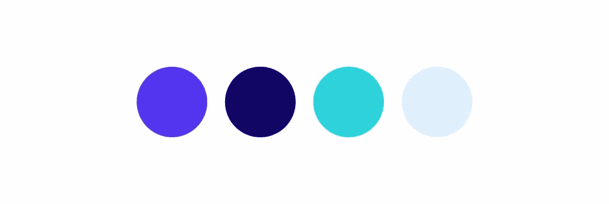

Example of Kinsta’s color palette

选择一种原色和二次色(二次色可以*补充*或者*对比*原色)，以及每种颜色较浅和较深的色调。限制你对颜色的使用，这样各种口音就不会成为眼中钉。

Adobe Color 提供了一个优秀的免费工具，用于测试各种颜色组合，为网站元素创建工作调色板。

此外，在决定颜色时，重要的是要考虑那些色盲的人，他们占世界人口的 4.5%。

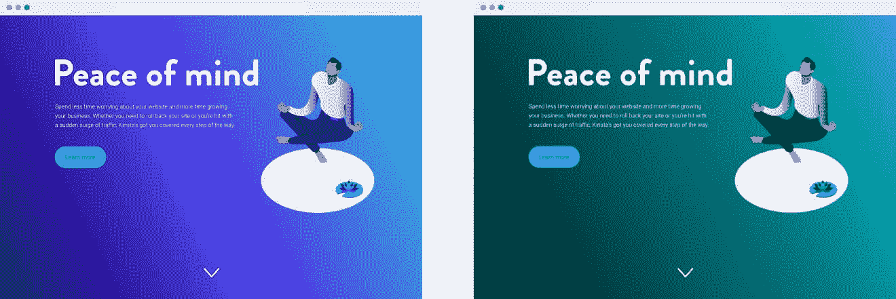

Example of how a regular design would look to color blind users

有三种类型的色盲(全色盲、双色视觉和色盲)，所以考虑到那些可能无法区分颜色的人，请确保您的设计仍然可用。

#### 对比

选择颜色时，重要的是要注意颜色比例和**对比度**。

*色彩对比*是指前景和背景之间的光线差异。使用充分对比的颜色可以让网站的可视性很容易区分。一般来说，使用高对比度的颜色选项——比如白底黑字——使你的网站可读性更好。

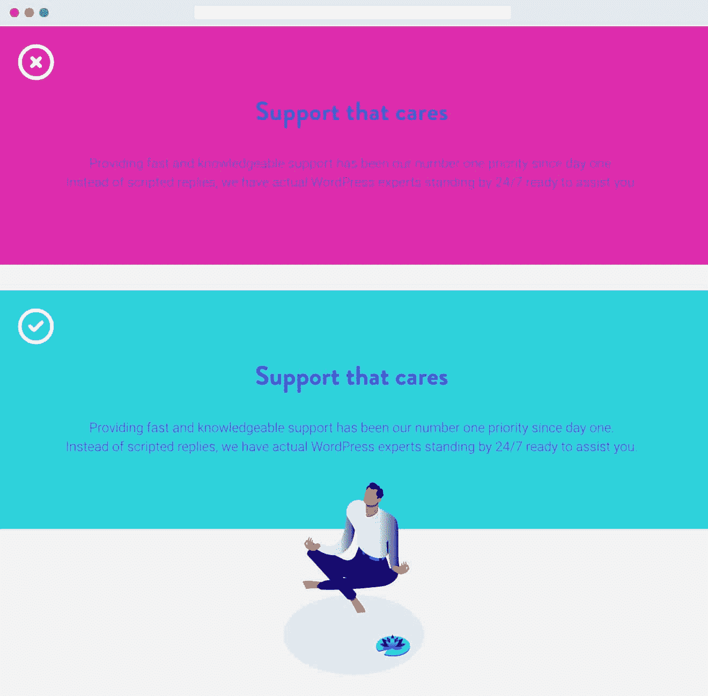

Bad contrast can be problematic

对比度*比率*是分配给页面元素之间对比度差异的数值。

[世界内容可访问性指南(WCAG) 2.0](https://www.w3.org/TR/WCAG20/) 建议普通文本的对比度为 4.5:1。WebAIM 分享了几个符合理想对比度的[预定组合](https://webaim.org/articles/contrast/#ratio)，来帮助你可视化这个网页设计最佳实践。

为了有助于使用这一比例，请确保在设计网站时，您考虑到了所有的受众(包括那些有可访问性问题的受众)。这样做比事后计划解决这些问题更容易。

考虑人们将与之交互的网站的所有方面，包括[页眉、页脚](https://kinsta.com/knowledgebase/add-code-wordpress-header-footer/)、[菜单](https://kinsta.com/blog/wordpress-menu-plugins/)——所有这些都需要容易看到才能使用。

一些可用于检查色彩对比度的工具包括:

*   [颜色对比检查器](https://www.levelaccess.com/color-contrast-checker/)逐级访问。
*   [对比度](https://contrast-ratio.com/)。
*   WCAG 2.0 AA & AAA 色彩对比检查器工具，基于 WCAG 2.0 指南。

### 排印

网站排版是另一个重要的品牌考虑因素。

虽然有许多不同的来源可以让[找到在你的网站上使用的潜在字体](https://kinsta.com/blog/modern-fonts/),但你首先要考虑的是，无论最终用户在他们的计算机上安装了什么字体，都可以一致地显示的选项。

[谷歌字体](https://kinsta.com/blog/wordpress-fonts/#google-fonts)提供各种各样的[免费网页安全字体](https://kinsta.com/blog/web-safe-fonts/)，不管用户安装了什么字体/程序，你都可以指望它们正常显示。确保你的心情板上有字体，看看它们是否符合你的色彩审美。

如果你在组合上有困难，谷歌字体可以推荐流行的搭配。你也可以使用像 [FontPair](https://fontpair.co/) 这样的网站来获得建议。

尽量限制你使用的字体粗细，因为加载太多文件会降低页面速度。就这一点而言，可以考虑在本地托管 Google 字体来引入额外的性能优势。

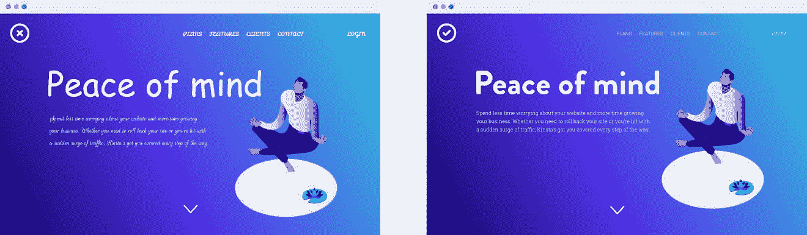

Poor typography vs ideal typography

当谈到根据网页设计最佳实践选择排版元素时，作为一般的经验法则，标题使用[无衬线字体，内容使用衬线字体。至少，不要在正文中使用装饰性字体，因为这很难阅读。](https://www.invisionapp.com/inside-design/best-practices-pairing-fonts/)

## 注册订阅时事通讯

### 想知道我们是怎么让流量增长超过 1000%的吗？

加入 20，000 多名获得我们每周时事通讯和内部消息的人的行列吧！

[Subscribe Now](#newsletter)

此外，不要试图在你的网站上使用各种不同的字体。一个很好的经验法则是使用一种字体作为你的标志，另一种用于你的菜单/标题，还有一种用于正文内容。关于这一点，请尝试将互补的字体配对，例如来自同一字体系列的字体。

### 元素层次结构

*层次*指展示相对重要性的设计元素的排列。这是通过操纵视觉对比度、大小和位置等元素来吸引注意力实现的。

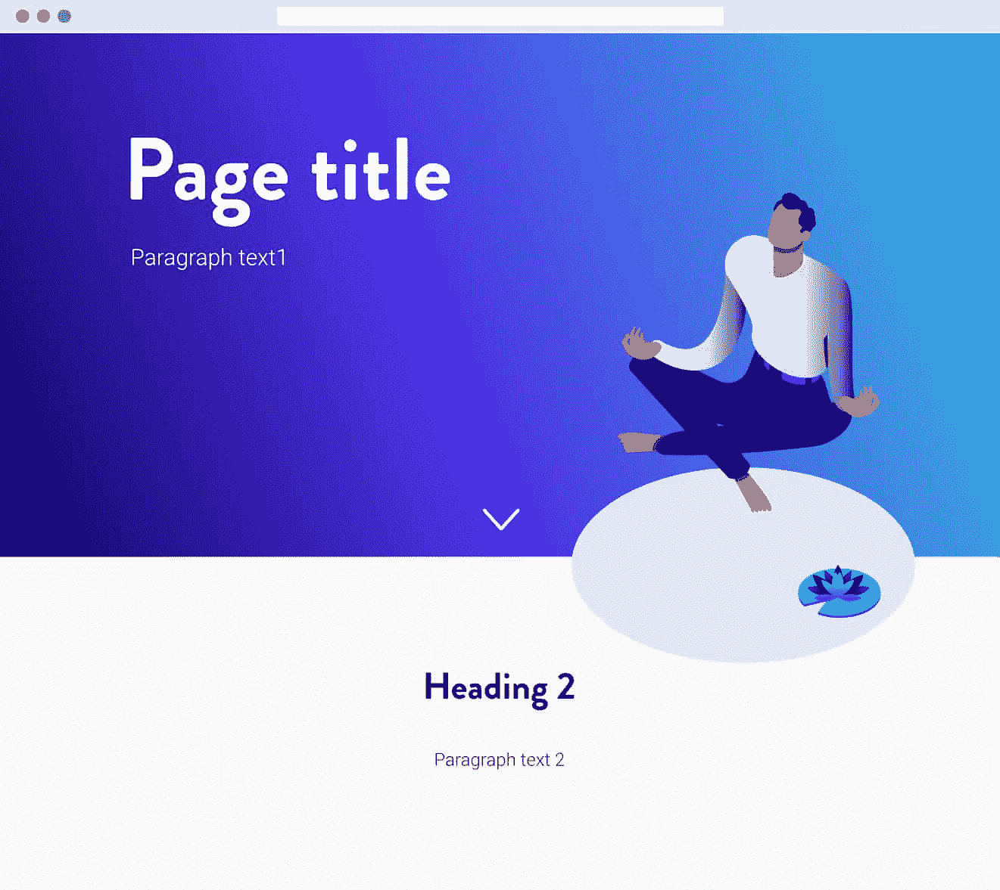

Example of element hierarchy

例如，[内容必须被分解成逻辑块](https://kinsta.com/blog/how-to-reduce-bounce-rate/#14-structure-your-content-wisely),这样用户就可以区分各个部分。

您可以通过使用**内容标题**来做到这一点，这不仅使用户可以轻松跳到他们想要阅读的部分，还可以将大量文本分成可读的块，以便屏幕阅读器能够确定每个部分的上下文。

如果你正在寻找这些设计概念的一些有用的视觉插图，Tilda Publishing 博客涵盖了一些最常见的网页设计错误以及如何修复它们。
T3】

## Web 最佳设计/格式实践

根据 Orbit Media 的[研究，在排名前 50 的营销网站中观察到一些通用的网页设计标准。](https://www.orbitmedia.com/blog/web-design-standards/)

Web design standards

所谓“标准”，他们指的是 80%的网站使用相似的设计方法:

*   左上角的标志。
*   横跨每页顶部的主要水平导航。
*   价值主张位于主页的“折叠上方”。注意，大多数网页设计师会告诉你，浏览器没有标准的像素高度，技术上也没有“折叠”。但是，一般来说，重要的设计元素应该出现在大多数访问者都能看到的页面的上方，即使不需要滚动。

以下是一些常见网站元素的网页设计最佳实践:

### 形象

使用图片的网页设计最佳实践可以激发出大量的建议，但是让我们把注意力集中在网页设计最佳实践的讨论中最基本的方面:

*   **添加替代文本。**图像*不能*使用屏幕阅读器处理，除非使用 ALT 文本。添加[替代文本也有助于 SEO](https://kinsta.com/blog/wordpress-seo/#9-image-alt-text) ，但是有些人使用替代文本只是为了补充他们的关键词策略。ALT 文本的一个更有用的用法是描述图像——尽管你可以用正确的方法同时满足搜索蜘蛛和屏幕阅读器。
*   使用具有人脸特征的图像比其他图形或动画更有效。它使人们更有可能参与到图像中，因为人类被他们感知的真正的共鸣和情感所吸引。
*   **使用响应图像，**根据浏览器大小放大或缩小**。**这有助于网站速度和搜索引擎优化。
*   永远不要忘记[图标](https://kinsta.com/knowledgebase/wordpress-favicon/)T3。收藏夹图标是显示在网站标题旁边和搜索结果中的小图标。它有助于品牌识别和提高网站的 UX。

### 网站导航

用户希望能够在网站上轻松找到他们想要的内容。因此，[网站导航](https://kinsta.com/blog/website-navigation/)简单明了是很重要的。

*网址导航*是泛指一个网站的[内部链接架构。别忘了导航的主要目的是*帮助*用户轻松找到你网站上的相关内容。](https://kinsta.com/blog/google-sitelinks/#6-build-internal-links)

你网站的内部链接架构构成了你网站地图的基础，这有助于搜索引擎更容易地访问你的内容。人们发现，拥有一个设计良好、内容易于查找的网站，会对你从搜索引擎获得的网站流量产生积极影响(同时[获得谷歌网站链接](https://kinsta.com/blog/google-sitelinks/)的几率也会更高)。

### 菜单导航

组成[网站导航](https://kinsta.com/blog/website-navigation/)的有几个方面，但是你的顶部/主菜单应该是一个主要焦点，因为它将是用户访问你的网站时首先交互的东西之一。

有不同的网站菜单设计试探法，但最流行的包括:

#### 导航菜单

理想情况下，这是位于网站的前端和中心。如果有几个类别，这可能涉及到下拉菜单的[使用。然而，下拉菜单是](https://kinsta.com/knowledgebase/wordpress-dropdown-menu/)[不推荐](https://www.websaucestudio.com/website-navigation-best-practices-and-seo-value/)，尤其是涉及到技术搜索引擎优化(他们更难抓取)。此外，人们发现大多数人[不喜欢下拉菜单](http://www.useit.com/alertbox/annoyances.html)。

这是因为人眼的工作速度比手快，所以当人们已经决定点击什么而其他东西落下来时，他们会觉得很烦——这可能会导致页面访问量的减少。

#### 汉堡菜单

汉堡菜单主要用于移动优化设计，通常位于页面的左上方或右侧。它显示为一个带有三条线的正方形，可以通过单击来展开。然而，许多设计师[鄙视汉堡菜单](https://speckyboy.com/analyzing-effectiveness-hamburger-menus-web-design/)，这启发了 web 开发者考虑新的方法，使移动网站导航有趣而实用。

厌倦了体验你的 WordPress 网站的问题？通过 Kinsta 获得最好、最快的主机支持！[查看我们的计划](https://kinsta.com/plans/?in-article-cta)

以下是一些基于网页设计最佳实践的导航设计技巧:

*   **添加一个搜索栏**帮助用户轻松找到内容(下面是[如何改进 WordPress 搜索功能](https://kinsta.com/blog/wordpress-search/))。这对于有很多内容的网站特别有用，比如新闻博客。
*   设计你的网站**遵循三次点击规则，**该规则规定用户只需点击不超过三次鼠标就能找到想要的信息。这是因为当可能的时候，用户实际上[更喜欢浏览一个网站](https://www.cludo.com/blog/search-vs-navigate-people-behave-websites-search-navigate/)，而不是浏览搜索结果。
*   使你的菜单标题具有描述性(记住关键词)，这有助于用户更容易地找到项目，也有助于 SEO。
*   菜单项的位置很重要。将最重要的页面放在菜单的最前面，这样就可以很容易地拿到。
*   保持最多 7 个菜单项，不仅是为了保持网站设计的整洁，也是因为太多的菜单项可能会影响你在搜索中的排名。谷歌可能会将这些看似不相关的类别解释为你的网站还没有确定特定的利基市场的标志。

为了更方便，这里有一个方便的信息图:

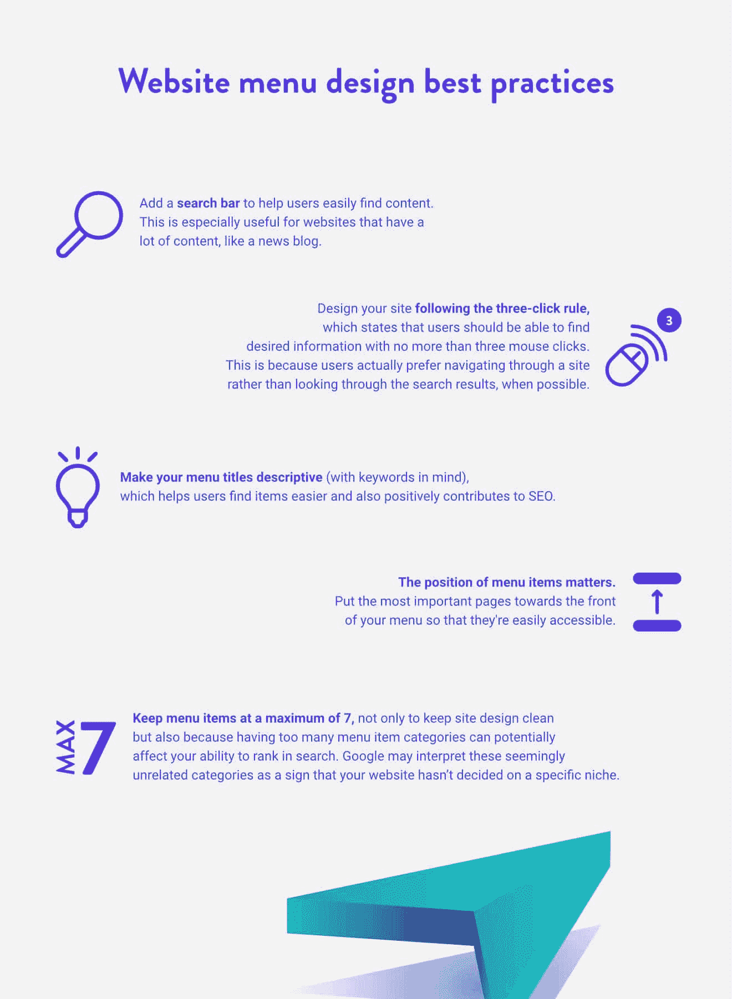

Web design best practices for menu navigation

## 编码标准

随着如此多的网站在全球范围内被创建和消费，我们当然需要一套标准化的编码原则。这些网络标准的一些方面包括:

### 搜索引擎优化

[SEO](https://kinsta.com/blog/what-does-seo-stand-for/) 可以用来有机地增加你网站*的访客数量*(不使用广告)。因为在一篇文章的一小段中充分挖掘 SEO 太复杂了，所以看看我们的 [SEO 清单](https://kinsta.com/blog/wordpress-seo/)和我们的关于 WordPress 的[最佳 SEO 插件的提示](https://kinsta.com/blog/best-seo-plugins-for-wordpress/)，让你自己熟悉网页设计最佳实践的这个方面。

请注意，以下编码标准技巧与 SEO 密切相关。

### 移动响应能力

[响应式设计](https://kinsta.com/blog/responsive-web-design/)致力于创造卓越的用户体验，无论使用何种设备或浏览器访问您的网站。

如今，设计一个响应迅速的网站比以往任何时候都重要，因为超过 60%的互联网用户通过手机访问互联网，T2 一半的电子商务交易通过移动平台完成。除此之外，谷歌的新搜索算法也[优先考虑移动友好网站](https://www.businessnewsdaily.com/7808-google-search-ranking-mobile.html)。

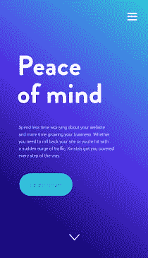

Example of responsive design

拥有一个响应迅速的网站不仅有助于用户更容易地浏览你的网站，也有助于提高参与度和转化率。[用户推荐他们有积极的移动响应网站体验的品牌](https://www.thinkwithgoogle.com/)，反过来，[不仅会停止购买移动网站体验不好的品牌](https://www.socpub.com/articles/the-5-mobile-marketing-mistakes-infographic-14849)，还会积极阻止其他人这样做。

然而，尽管有对响应网站的需求，估计 91%的小企业没有一个响应网站。他们应该——因为设计一个移动响应网站肯定会有回报。62%的公司[报告在设计了一个移动响应网站后](https://econsultancy.com/blog/11044-more-companies-are-designing-their-sites-for-tablet-and-mobile-stats/)销售额增加。

仔细阅读 Kinsta 关于如何[让你的网站更加手机友好](https://kinsta.com/blog/google-mobile-first-index/)的资源，其中包括一个最好的 [WordPress 移动插件](https://kinsta.com/blog/wordpress-mobile-plugin/)的下载列表，并确保查看这个最好的 WordPress 主题的策划[列表，在那里你可以浏览大量的响应主题。](https://kinsta.com/best-wordpress-themes/)

谷歌还提供了一些如何设计一个响应式网站的技巧。

### 网站安全

另一个重要的编码实践？创建安全的程序和网站，让用户可以信任他们的敏感个人信息。与普遍的看法相反，黑客不会主动寻找特定的网站进行攻击，这就是为什么即使是小网站也容易受到攻击。

### 信息

Kinsta 为每个计划提供了一个[恶意软件安全保证](https://kinsta.com/knowledgebase/malware-security/),如果发生了不好的事情，安全专家会修复你的网站。

总的来说，WordPress 一般来说是安全的，但是它有助于采取额外的预防措施来保护你的网站免受攻击。

以下是一些最佳的网站安全实践:

*   **获得 SSL 证书，**这对于处理支付和个人信息的网站尤其重要。 [SSL 证书](https://kinsta.com/knowledgebase/how-ssl-works/)对通过网络发送的信息进行加密，因此黑客很难破解。除此之外，它还是一个行业标准。当访问者访问的网站没有 SSL 证书时，Chrome 会提醒他们。除此之外，Chrome 现在[弃用传统 TLS 版本](https://kinsta.com/knowledgebase/err_ssl_obsolete_version/)，并开始显示额外的警告。启用 HTTPS (安装 SSL 证书的一部分)也是谷歌官方的排名因素。
*   **保护好您的登录凭证。**一些攻击是由黑客试图强行访问网站引起的。它有助于拥有一个[单独/隐藏的登录页面](https://kinsta.com/blog/wordpress-login-url/)(使用 [WP 隐藏登录](https://wordpress.org/plugins/wps-hide-login/)插件)并限制登录尝试的次数。使用[登录锁定](https://wordpress.org/plugins/login-lockdown/)插件，该插件记录每次失败登录尝试的 IP 地址和时间戳，并在短时间内达到相同 IP 范围的失败尝试次数时锁定登录功能。此外，创建一个超过 6 个字符的安全密码，由大小写字母、数字和特殊字符混合而成。经常更改您的密码。如果您希望获得额外的安全性，也可以使用双因素身份验证来登录。
*   保持 WordPress 核心、插件和主题的更新。不要忘记从一个有信誉的来源下载插件或主题。一个好的迹象是，如果插件/主题有多个安装，最近已经更新。你也应该阅读评论来决定这个插件是否值得信任(确保[检查这里列出的那些](https://kinsta.com/best-wordpress-plugins))。关于这一点，下载一个 WordPress 安全插件，如 [Wordfence](https://kinsta.com/blog/wordpress-security-plugins/#wordfence-security) 、 [Sucuri](https://kinsta.com/blog/wordpress-security-plugins/#sucuri) 或 [Defender](https://kinsta.com/blog/wordpress-security-plugins/#defender) ，因为 73.2%最受欢迎的 WordPress 安装漏洞可以使用免费的自动化工具检测到[。以下是更深入的最佳安全插件列表。](https://www.wpwhitesecurity.com/wordpress-security-news-updates/statistics-70-percent-wordpress-installations-vulnerable/)
*   使用安全的网络主机。对于那些不了解情况的人来说，你的网络主机似乎与网站安全没有任何关系，但是 [41%的攻击](https://www.wpwhitesecurity.com/state-of-security-of-wordpress-blogs-and-websites/)是通过主机平台上的安全漏洞发生的。寻找一个托管服务提供商，包括如下功能:[服务器端防火墙](https://kinsta.com/blog/what-is-a-firewall/)和加密， [NGINX 或 Apache web 服务器](https://kinsta.com/blog/nginx-vs-apache/)，防病毒和反恶意软件软件，现场安全系统，以及 SSL 证书和 CDN 的可用性。

关于 WordPress 安全的更多信息，请查看我们关于如何保护你的 WordPress 网站安全的综合资源。

### 页面速度

大约一半的用户希望网站在 [2 秒或更少](https://www.bluecorona.com/blog/20-web-design-facts-small-business-owners/)内加载，如果花费的时间超过这个时间，40%的人会毫不犹豫地退出页面，(很可能)永远不再返回。

除了网站访问量，页面速度也很重要，因为它也会影响转化率和收入。页面加载速度每增加一秒，销售额就会下降 27%。提高网站速度可以防止损失 [7%的可能转化率](https://www.infront.com/blog/the-blog/8-statistics-that-prove-responsive-web-design-is-essential-to-seo)。

以下是一些加快网页加载速度的方法:

*   使用一个**内容交付网络(CDN)** ，它获取静态文件，如图像、[、CSS](https://kinsta.com/blog/wordpress-css/) 和 JavaScript，[将它们交付到离用户的物理位置最近的服务器上](https://kinsta.com/blog/wordpress-cdn/)。
*   考虑你如何使用图像。一般网站使用 1.8MB 的图片，这代表了[一个网站大小的 60%](https://speedcurve.com/blog/web-performance-page-bloat/)。为了有助于这一点，重新考虑你如何布局你的网页。如果你想保持较快的页面速度，尽量减少设计中使用的大图片数量，并确保[优化它们](https://kinsta.com/blog/optimize-images-for-web/)。
*   如果你的网站需要使用大量的大图片，**使用插件**，包括 [GZIP 压缩](https://kinsta.com/blog/enable-gzip-compression/)，缓存，或者图片优化的功能，比如 [WP Rocket](https://wp-rocket.me/) 和 [Imagify](https://imagify.io/) 。它们可以帮助你的文件变得更小(而不牺牲质量)，这样它们可以更快地加载。
*   考虑你保存在 WordPress 数据库中的插件和文件的数量，因为它们也会影响页面加载速度。清理那些你不用的。当你这么做的时候，保持你的 PHP、 [WordPress 核心和插件更新到最新版本](https://kinsta.com/blog/wordpress-maintenance/#keeping-your-wordpress-site-updated)。

查看我们关于[网站速度优化](https://kinsta.com/learn/page-speed/)的综合资源。

## 无障碍标准

互联网旨在为所有人服务，不管他们使用的具体硬件、软件、语言、能力或位置。然而，许多人为了漂亮的设计牺牲了可访问性。

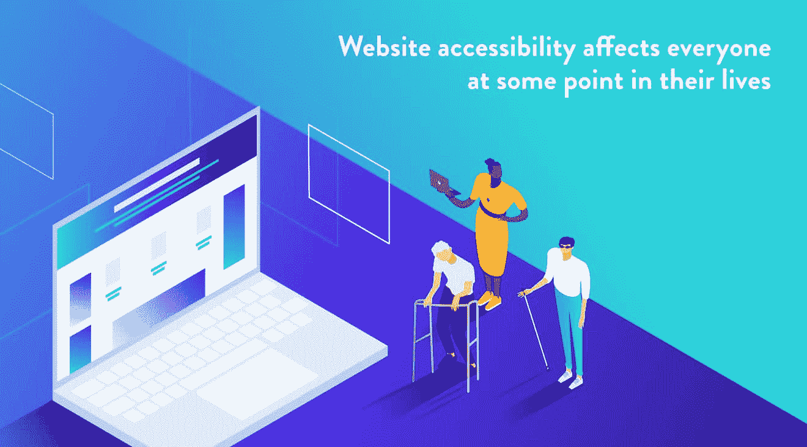

Accessibility is key for every website

*可访问性*指的是让*每个人*都能使用你的网站。

除了那些影响访问的残疾人士， [W3](https://www.w3.org/WAI/intro/accessibility.php) 表示，网站的可访问性也有利于:

*   那些使用小屏幕、不同输入模式等设备的用户。
*   老年人。
*   有“暂时性残疾”的人，包括断肢、失去眼镜或身体状况。
*   具有“环境限制”的用户，例如在明亮的阳光下或在无法收听音频的环境(如公共交通)中通过设备访问互联网的用户。
*   网速慢的人。

可访问性应该是每个人都关心的问题，因为我们都在某种程度上受到它的影响。

### 使您的网站易于访问的原因

仍然不确定在这个关于网页设计最佳实践的讨论中花时间在可访问性上是否值得？

考虑这些原因:

*   这是美国残疾人协会的要求。美国残疾人法案(ADA)于 1990 年通过，旨在保护残疾人的公民权利不受歧视。它涵盖了交通，电信，就业，甚至建筑法规。由于这部法律是在近 30 年前通过的——那时互联网还没有普及——立法者们正在寻求对其进行修改。
*   它促进包容性。皮尤研究中心(Pew Research Center)的一项调查显示，残疾人上网的可能性[比非残疾人少三倍](http://www.pewresearch.org/fact-tank/2017/04/07/disabled-americans-are-less-likely-to-use-technology/)，这是一个耻辱，因为统计数据显示，约 [30%的专业人士](http://www.talentinnovation.org/_private/assets/DisabilitiesInclusion_PressRelease.pdf)有残疾，其中 62%的残疾人因害怕负面偏见而“躲在雷达下”。
*   这会帮你赢得更多的生意。通过更加包容，你将引入一个残疾人网络，这代表着[7 万亿美元的可支配收入](https://www.boia.org/blog/how-to-prevent-a-web-accessibility-lawsuit)
*   **SEO 的好处。**搜索引擎奖励符合可访问性的网站，以鼓励更多的网站具有可访问性。

### 如何让你的网站更容易访问

让你的网站更容易访问的一个简单方法是安装 [WP Accessibility](https://wordpress.org/plugins/wp-accessibility/) 插件，它增加了一些辅助功能，包括:

*   一个工具栏，用户可以在其中调整字体大小并以高对比度和灰度查看您的站点。
*   比较颜色对比以检查它是否符合 ADA 的标准。
*   从插入内容的图像中删除标题属性。大多数屏幕阅读器不能感觉到这一点，而是阅读锚文本。
*   启用跳过链接，这是允许用户直接跳到内容的内部页面链接，这对使用屏幕阅读器的人很有用。

要采取的一些额外步骤:

*   **如果你的网站制作了诸如[音频](https://kinsta.com/blog/wordpress-audio-players/)、有声读物、视频、[播客](https://kinsta.com/blog/wordpress-podcast/)等媒体，添加字幕或文字记录**，以使聋哑人以及那些想消费你的内容但不能在公共场合消费媒体的人受益。
*   为那些有运动障碍、只能使用键盘(而不是鼠标)浏览你的网站的人创建键盘可访问的链接和菜单。下拉菜单是不被鼓励的，但是你可以通过为每个下拉菜单指定快捷方式来补救(例如:按“1”进入主页，按“2”进入“关于”页面，等等。).
*   最后，**测试你的网站的可访问性。**Web Accessibility Initiative 并没有认可任何特定的工具，而是提供了一个[工具列表](https://www.w3.org/WAI/ER/tools/)，你可以用它来审核你的工作。

## 最后的想法:你下一个网站项目的网页设计最佳实践

好的网站不应该用客观上好的设计来定义。同样重要的是网站的可用性、导航的便利性和可访问性。有了这些网页设计的最佳实践，你就拥有了**创造外观和功能都很好的东西**。

[Web design isn't just about aesthetics. It's a much more complicated world where UX, accessibility, and business goals all should connect. Check out these web design best practices! ✍️🔝Click to Tweet](https://twitter.com/intent/tweet?url=https%3A%2F%2Fkinsta.com%2Fblog%2Fweb-design-best-practices%2F&via=kinsta&text=Web+design+isn%27t+just+about+aesthetics.+It%27s+a+much+more+complicated+world+where+UX%2C+accessibility%2C+and+business+goals+all+should+connect.+Check+out+these+web+design+best+practices%21+%E2%9C%8D%EF%B8%8F%F0%9F%94%9D&hashtags=webdev%2Cux)

请记住，这些是网页设计的最佳实践。根据网站的性质，你很可能无法完全理解每一条。但是在你打破规则之前，至少了解它们存在的原因是有帮助的。

我们错过了什么重要的事情吗？在下面的评论中分享你的网页设计最佳实践！

推荐阅读:[最佳网页设计在线课程](https://kinsta.com/blog/web-design-courses/)

* * *

让你所有的[应用程序](https://kinsta.com/application-hosting/)、[数据库](https://kinsta.com/database-hosting/)和 [WordPress 网站](https://kinsta.com/wordpress-hosting/)在线并在一个屋檐下。我们功能丰富的高性能云平台包括:

*   在 MyKinsta 仪表盘中轻松设置和管理
*   24/7 专家支持
*   最好的谷歌云平台硬件和网络，由 Kubernetes 提供最大的可扩展性
*   面向速度和安全性的企业级 Cloudflare 集成
*   全球受众覆盖全球多达 35 个数据中心和 275 多个 pop

在第一个月使用托管的[应用程序或托管](https://kinsta.com/application-hosting/)的[数据库，您可以享受 20 美元的优惠，亲自测试一下。探索我们的](https://kinsta.com/database-hosting/)[计划](https://kinsta.com/plans/)或[与销售人员交谈](https://kinsta.com/contact-us/)以找到最适合您的方式。