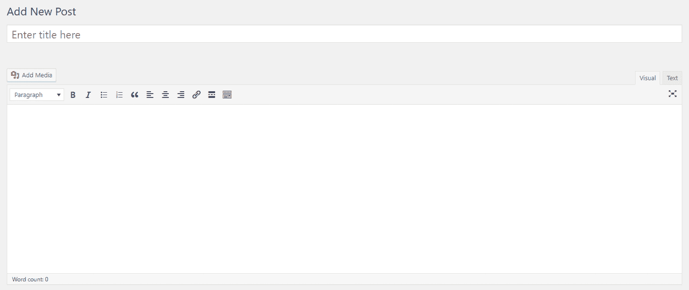
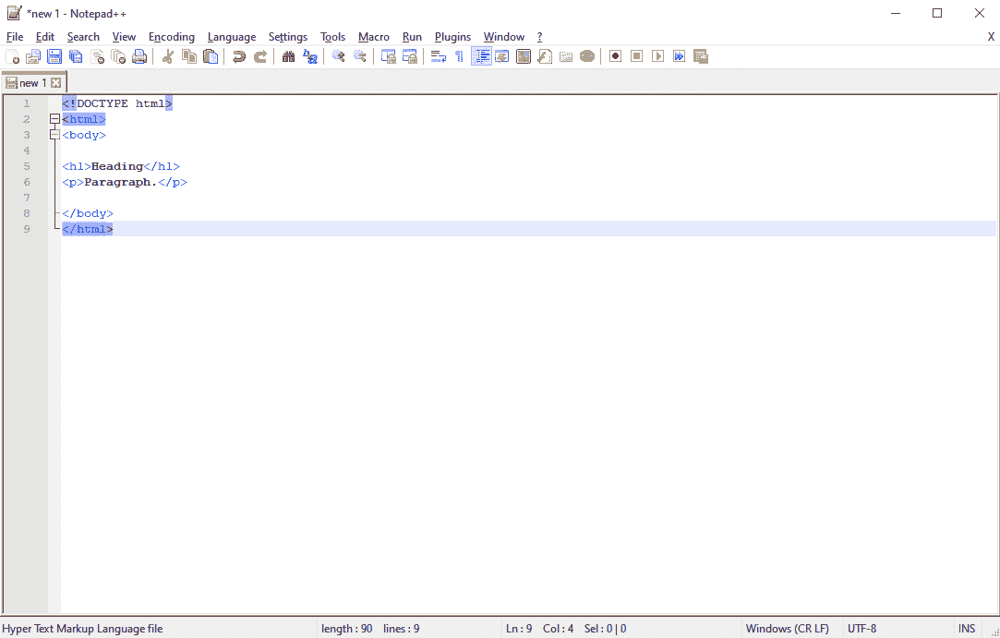
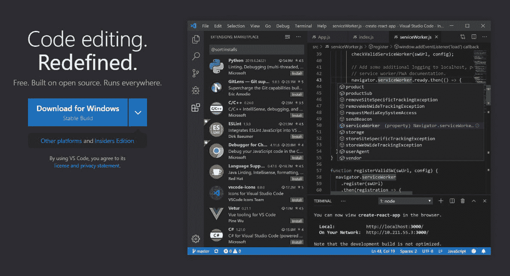
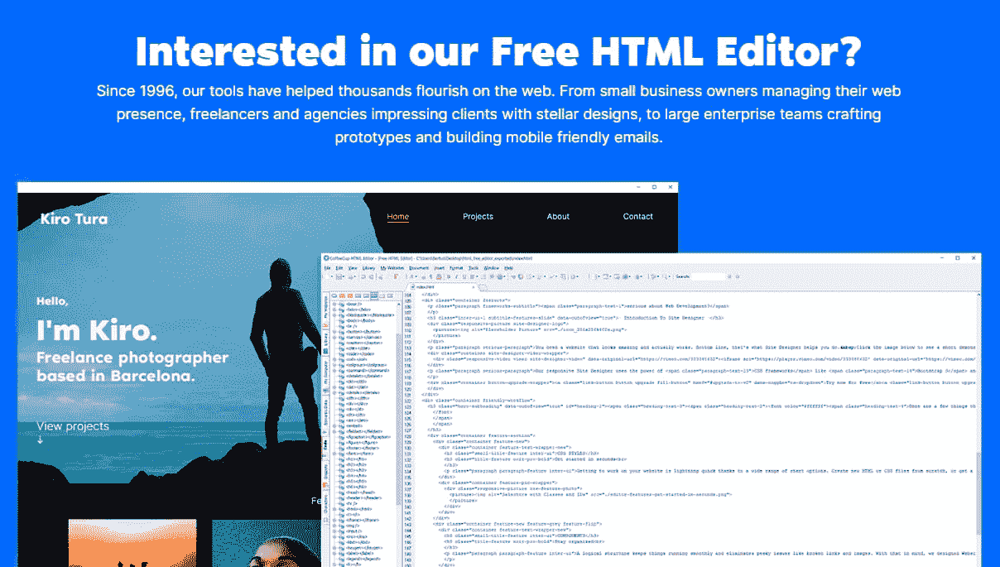
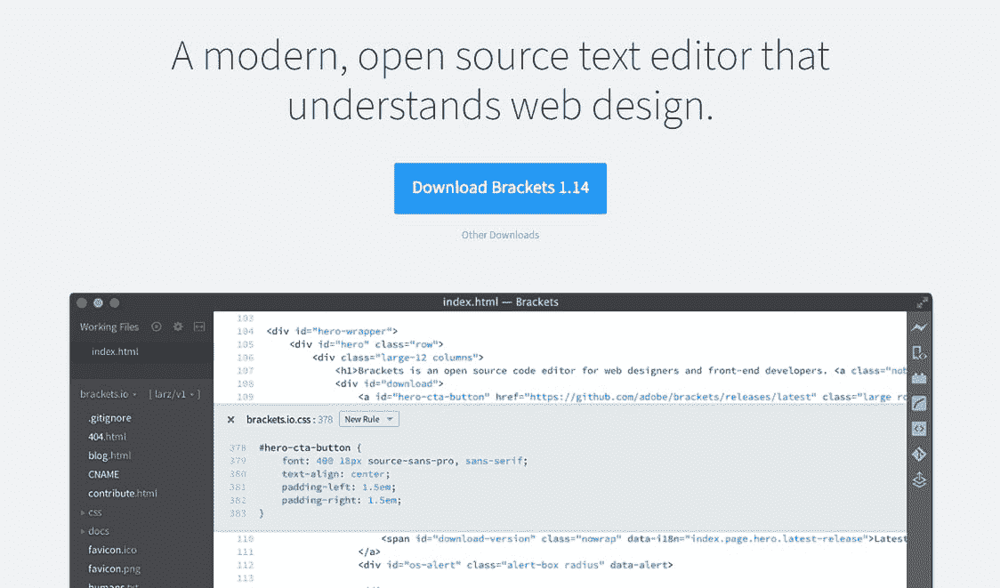
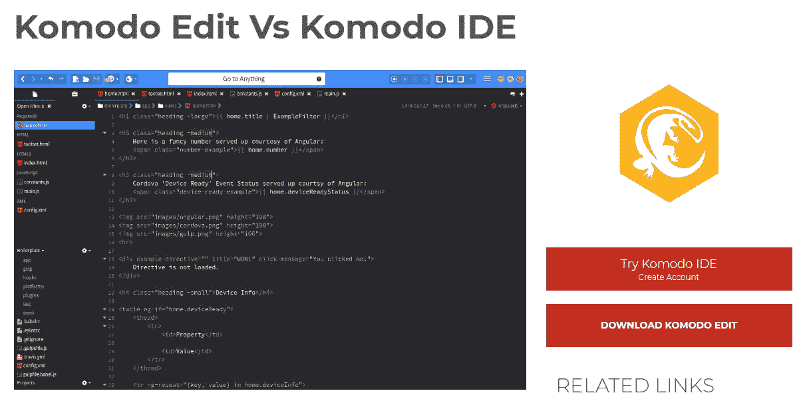
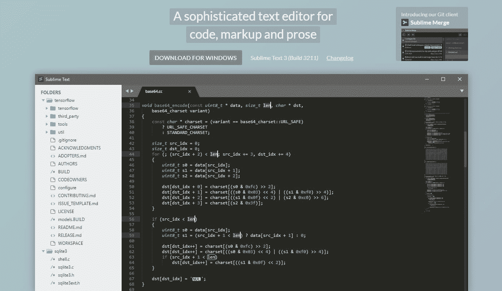
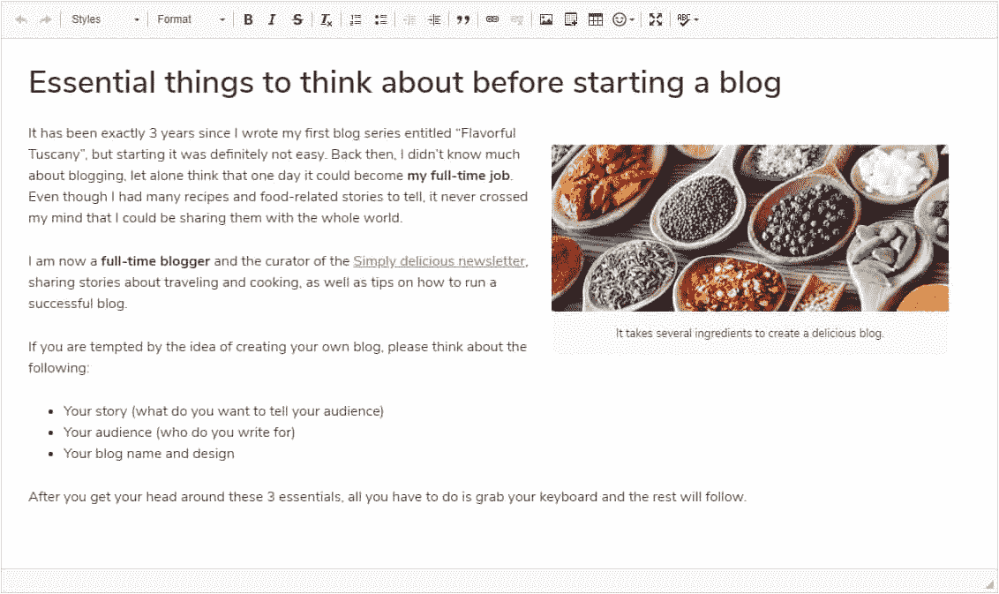

# 市场上为开发者和高级用户提供的 10 款免费 HTML 编辑器

> 原文：<https://kinsta.com/blog/free-html-editor/>

你计划定期编辑文件还是创建你自己的插件和主题？如果你想使用 [HTML](https://kinsta.com/knowledgebase/what-is-html/) 和 CSS，你需要一个代码编辑器。

当您处理大量代码时，HTML 编辑器可以让您的生活变得更加轻松。编程已经够难的了，但是糟糕的界面使得编程几乎不可能有效。安装一个免费的 HTML 编辑器可以让你获得更多的特性，更好的 UI，以及高效处理代码的能力。

准备好在更高效的环境中开始编码并实现更好的工作流程了吗？

我们将向您展示最好的 HTML 编辑器，并帮助您选择适合您需求的编辑器。

## 什么是 HTML 编辑器？

HTML，或超文本标记语言，是运行互联网的代码。它是一种标记语言，这意味着它使用标签来定义元素，如将文本标记为粗体或用代码显示图像。

HTML code snippet

HTML 被设计成易于使用、学习和阅读，并且经常与 CSS 和 JavaScript 一起使用。大多数 web 开发人员从学习 HTML 开始，因为与其他语言相比，它的学习曲线很短。

编写 HTML 非常简单，只需在计算机上打开记事本，键入一些标记，然后将其保存为。html 文件。你甚至可以把文件放到你的浏览器里看看它是什么样子。

但是如果你想做严肃的开发，那并不是一个好的解决方案。在一个糟糕的编辑器中编码会很快变成一场令人头痛的噩梦。一个简单的文字处理软件在这里是做不到的。

这就是为什么这么多开发人员创建了代码编辑程序。这些工具带有额外的特性，如语法高亮、自动完成和错误检测，这使得用大量复杂代码编程变得不那么麻烦。

特别是 HTML 编辑器，是为 web 开发人员构建的，包含适合他们的特殊功能。它们通常也与其他 web 语言一起工作，如 JavaScript、 [PHP](https://kinsta.com/knowledgebase/what-is-php/) 和 [CSS](https://kinsta.com/blog/wordpress-css/) ，并且是您的 web 开发工具包的必要组件。

### 为什么需要 HTML 编辑器？

如果你有一个 WordPress 网站，它有自己的 [HTML 界面](https://kinsta.com/blog/wordpress-text-editor/)，它的工作方式类似于独立的代码编辑应用程序。所以如果你只是偶尔[改变你网站上的代码](https://kinsta.com/knowledgebase/edit-wordpress-code/)，你不需要下载一个专用的 HTML 编辑器。

WordPress editor

但是只有当你直接修改网站上的现有页面时，这才是一个可行的解决方案。如果你想创建新的 HTML 页面/元素或者甚至编写你自己的[主题](https://kinsta.com/blog/wordpress-free-vs-paid-themes/)和[插件](https://kinsta.com/best-wordpress-plugins/)该怎么办？这种基于浏览器的界面是行不通的。

如果你想开始 web 开发，独立的、可下载的 HTML 编辑器是你所需要的。他们有一个漂亮的，可定制的界面和功能，可以帮助开发者很多。一些编辑器也支持 [FTP](https://kinsta.com/blog/best-ftp-clients/) ，所以你可以编辑网站文件，然后[自动上传](https://kinsta.com/knowledgebase/how-to-upload-html-file-to-wordpress/)修改到你的网站。

实话实说:在记事本中创建插件和主题是不可行的。如果你想从零开始做一些东西，WordPress 编辑器是行不通的。你需要一个专业的程序来完成这项工作。

### 在 HTML 编辑器中寻找什么

每个开发人员都有自己的风格，所以选择一个合适的 HTML 编辑器是一个独立的过程。在你找到一个你喜欢的人之前，你可能需要尝试几个。现在，这里有一些你应该在每个编辑界面中检查的特性。

你想要寻找的两件大事是平台/操作系统和主动开发。

请记住您的工作环境:有些编辑器只适用于 Linux 或 Windows，对 Mac 的支持可能不稳定。总是检查程序支持什么平台，特别是如果你喜欢在多台装有不同操作系统的计算机上工作。

你几乎总是想选择一个正在开发的 HTML 编辑器。HTML 是一种标准不断发展的语言，因此多年没有更新的编辑器将不再有效。此外，没有开发人员维护它意味着不会发布错误修复。最好使用经过维护的工具。

HTML 编辑器还可能附带许多修饰性的功能。并非所有这些都是绝对必要的，有些你可能根本不喜欢或不需要。找一个有你想用的编辑器。

*   **语法高亮/颜色编码:**由于 HTML 基于标签的标记语言，高亮几乎是必需的。语法突出显示照亮了标记，这样您一眼就可以识别它们，并且它使得处理代码块更加容易。
*   **版本控制:**如果你想要回滚一个变更或者查看你代码的前一个版本，寻找[版本控制](https://kinsta.com/blog/wordpress-version-control/)特性来存储旧的副本。当与其他开发人员一起工作时，这几乎是必要的。
*   自动保存:丢失工作很糟糕，所以寻找包含自动保存功能的编辑器，以防程序崩溃。
*   自动完成和建议:在 HTML 编辑器中，当弹出一个建议时，通过按下一个按钮，自动完成将让您快速填充更长的代码。它还可以自动创建结束标记。
*   **代码折叠:**当你处理一个大文档时，代码折叠可以让你关闭文档中不相关的部分，专注于特定的区域。
*   **多光标/同时编辑:**多光标功能允许你一次在多个地方编写代码。这在添加相同标签的副本时非常有用。
*   **[查找并替换](https://kinsta.com/knowledgebase/wordpress-search-and-replace/) :** 没有一个代码编辑器是完整的，它不能找到某些字符串并用其他的替换它们。随着 HTML 标准的不断更新和对低效标签的弃用，这变得尤为重要。
*   **错误检测:**由于 HTML 是标记语言而不是编程语言，所以不编译。这意味着你没有机会测试你的代码。实时错误检查是至关重要的，这样当你写错了什么的时候你就可以立即知道。
*   FTP 支持:一个支持 FTP 的 HTML 编辑器将能够连接到 WordPress 并上传你所做的任何修改。例如，每次你做任何事情时，不必登录 FileZilla 或你的[首选 FTP 客户端](https://kinsta.com/blog/best-ftp-clients/)。

如果您正在寻找一个包含高级功能和与其他平台集成的代码编辑器，您将需要一个 IDE(集成开发环境)而不仅仅是一个文本编辑器。这些类似于 HTML 编辑器，但本质上是为高级开发人员提供的这些工具的增强版本。

另外，留意[所见即所得编辑器](https://kinsta.com/blog/gutenberg-wordpress-editor/)。不需要手工编码，只需编辑一个界面就可以创建一个网站并生成 HTML 代码。

请记住，所有浏览器处理代码的方式都不同，所以它看起来不会和编辑器中的完全一样。仍然需要多浏览器测试和优化。但是如果你喜欢可视化工作而不是写 HTML，它仍然有帮助。

## 最好的免费 HTML 文本编辑器

文本编辑器是简单而集中的程序，为处理 HTML 提供了一个干净的界面。比起所见即所得(WYSIWYG)编辑器的实时界面，或者 IDE 杂乱的 UI 和不必要的功能，许多开发人员更喜欢它们。文本编辑器针对其简单的目的进行了完美的优化，让您可以完全控制您的工作。

### 记事本++

Notepad++

[Notepad++](https://notepad-plus-plus.org/) 以其轻量级的设计而闻名，是一个用于 Windows 的文本和代码编辑器。这通常是开发人员将使用的第一个工具，因为它非常简单，也不难学，而且附带了许多功能，使您的生活更加轻松。

Notepad++可以处理几十种语言，但它支持 HTML、CSS、 [PHP 和 JavaScript](https://kinsta.com/blog/php-vs-javascript/) 。因此，它适用于开发人员需要的所有语言。自 2003 年发布以来，它一直在积极地更新，因此您知道它将在未来几年得到可靠的维护。

该程序包括自动保存、查找和替换、分屏显示、同步编辑和许多其他漂亮的功能，如第三方插件支持。Notepad++对于初学者来说是很棒的，但是它的质量足以支撑你的 web 开发职业生涯。

### Visual Studio 代码

Visual Studio Code

作为最受欢迎的代码编辑器之一， [Visual Studio Code](https://code.visualstudio.com/) 是许多开发人员的首选，尽管它在 2015 年才发布。它非常健壮，可定制，有一个你可以根据自己的喜好个性化的界面，以及添加更多功能的扩展。

编辑器支持 HTML、CSS、JavaScript 和 PHP，因此您永远不必切换工具。它使用 smart IntelliSense 进行语法突出显示和自动完成，并包括 [Git/Github](https://kinsta.com/knowledgebase/what-is-github/) 版本控制支持和 FTP 功能。

## 注册订阅时事通讯

### 想知道我们是怎么让流量增长超过 1000%的吗？

加入 20，000 多名获得我们每周时事通讯和内部消息的人的行列吧！

[Subscribe Now](#newsletter)

请务必阅读我们的 Git vs Github 指南。

最后，VSC 可以与 Windows、Mac 和 Linux 兼容，所以几乎任何人都可以使用它。这个程序有很多特性，所以对于新开发人员来说，它可能是势不可挡的。但是学会使用它，你将拥有几乎所有你需要的工具。

### 咖啡杯免费编辑器

CoffeeCup Free Editor

寻找一个专门用于 HTML 的工具？CoffeeCup Software 创建了一个面向网络开发者的商业程序 [HTML 编辑器](https://www.coffeecup.com/html-editor/)，但也发布了一个完全免费的精简版本。

一些功能，如无限制的 FTP 连接、HTML/CSS 验证和代码清理，仅作为试用软件提供。但是它提供了 UI/工具栏定制、代码完成和模拟浏览器中的 HTML 预览。你需要的所有核心东西都在那里。

另外，它与 CSS 和 JavaScript 一起工作，所以总的来说，你得到了整个网站创建工具包。

### 括号

Brackets

你喜欢 Notepad++的轻量级设计，但是想要一个专门针对 web 开发的程序吗？[括号](http://brackets.io/)是完美的解决方案。它可以在 Windows、Mac 和 Linux 上运行，并提供了恰到好处的功能，让您在不碍事的情况下获得出色的体验。

HTML、JavaScript 和 CSS 编辑器包括实时预览、预处理器支持、高亮显示和用于添加任何缺失内容的免费扩展。它是为 web 开发而构建的，所以你知道你将拥有你需要创建的一切。

对于喜欢最小化和整洁的工作空间的开发人员来说，括号是一个很好的选择，不要让他们永远不会使用的不必要的功能过载。

### Komodo Edit

Komodo Edit

ActiveState 创建了 Komodo IDE，这是一个集成开发环境，具有高级功能，如调试和与其他平台的集成。但是如果你只是想要一个更简单，更容易使用的 HTML 编辑器，试试 [Komodo Edit](https://www.activestate.com/products/komodo-edit/) 。它可以在大多数操作系统上运行，包括 Windows、Mac 和 Linux 的各种发行版。

厌倦了体验你的 WordPress 网站的问题？通过 Kinsta 获得最好、最快的主机支持！[查看我们的计划](https://kinsta.com/plans/?in-article-cta)

编辑器是多语言的，支持 HTML、PHP 和 CSS。您可以完全自定义其外观，并且它具有自动完成、多重选择和更改跟踪功能。这是一个简单而又强大的解决方案。

### 崇高的文本

Sublime Text

圆滑和复杂， [Sublime Text](http://www.sublimetext.com/) 是一个用于 Windows、Linux 和 Mac 的代码和文本编辑器。它内置了 23 个主题，界面完全定制，支持各种标记和[编程语言](https://kinsta.com/blog/scripting-languages/)。

Sublime Text 允许您跳转到字符串或符号，定义各种语法，突出显示代码，选择多行，以及进行拆分编辑。它还通过可搜索的命令面板保持界面整洁，因此您不必处理不常用的功能。如果你喜欢你的编码界面没有杂乱和完全可定制，你会喜欢崇高的文本。它绝对提供了最流畅的体验(这是我个人的选择，btw)。

### 原子

Atom

由互联网上最大的软件和 web 开发社区中心 GitHub 开发的 [Atom](https://atom.io/) 是为协作而构建的。它带有内置的 Git/Github 版本控制支持，最显著的是支持实时代码协作。再也不用来回发送文件了。在一个统一的项目上合作。

Atom 可以在所有主流操作系统上工作，支持主题、第三方插件，甚至可以用 HTML 和 CSS 对界面进行编码。它时尚、可扩展、功能丰富，如果您需要与您的队友无缝协作，这是一个必要的学习工具。

### HTML 编码最常用的 HTML 编辑器

受欢迎程度通常能很好地分辨出什么是好软件，什么不是。当然有一些宝石相对不为人知，但事情获得牵引力是有原因的。如果一个程序被成千上万的人使用，就质量而言，这是一个安全的选择。

根据 [Stack Overflow 开发者调查 2018](https://insights.stackoverflow.com/survey/2018#technology-most-popular-development-environments) 和 [2019](https://insights.stackoverflow.com/survey/2019#technology-_-most-popular-development-environments) ，以下是最受欢迎的 HTML 编辑器。

*   **Visual Studio Code** 是这两年使用率最高的程序，2019 年有 55.6%的受访开发者使用它。它显然是最常用的 web 开发程序。
*   记事本++ 两年都位居第二，两年都有大约 35%的受访者使用它。这可能是由于它的简单性和多功能性。
*   **Sublime Text** 在 2018 年被 30%的受访者使用，因此它显然是 HTML 编辑工具的首要竞争对手。每个开发人员都喜欢时尚的编辑器和干净的体验。
*   **Atom 的**受欢迎程度在 2019 年从 18.6%降至 12.7%，但其协作功能使其成为团队工作人员的热门选择。

数字不会说谎，但是如果它对你更有吸引力，不要犹豫尝试一个不太知名的 HTML 编辑器。某样东西不流行并不意味着它不好。

## 最好的免费所见即所得的 HTML 编辑器

你更喜欢用视觉界面工作吗？所见即所得编辑器可能是你更好的选择。这些工具提供了一个可视化的界面，甚至可以在不学习 HTML 的情况下使用，尽管许多工具也允许你手工编码。

缺点是您对代码的控制较少，因为编辑可视界面会自动插入标签。这可能会困扰那些喜欢完全控制自己工作空间的开发人员，并可能导致混乱的代码。

如果你有一个 WordPress 网站，记住它已经内置了一个所见即所得的 HTML 编辑器: [TinyMCE](https://kinsta.com/blog/wordpress-tinymce-editor/) 。这可能是创建新页面和定制网站最简单的方法。但是如果出于某种原因，你对 TinyMCE 的界面不满意，这里有几个可供选择的编辑器。

*   基于 Firefox 的渲染引擎，BlueGriffon 是一个流行的所见即所得编辑器，支持编辑 HTML 和 CSS 源代码。它还能帮助你使用像 WAI-ARIA 这样的网络标准。
*   HTML 记事本:一个可下载的编辑器，用来处理结构化文档。它可以在 Windows、Mac 和 Linux 上运行，还附带了一个无需安装的便携版本。
*   [cke editor](https://ckeditor.com/):与 TinyMCE 非常相似，cke editor 是一个 HTML/rich text 编辑器，支持插件和源代码编辑。它可以免费下载，而且它的最小界面很容易上手。

CKEditor

此外，CoffeeCup、括号和 Atom 主要是文本编辑器，但带有可视化代码的内置工具。大多数支持插件的编辑器也有一个第三方的 HTML 预览插件。如果您不想主要使用 WYSIWYG 界面，但确实需要一种简单的方法来预览代码，请尝试这些方法。

[Working with HTML all day long? Then, you'll need a powerful code editor to keep your workflow efficient. Here are the best free HTML editors on the market!👩‍💻🏅Click to Tweet](https://twitter.com/intent/tweet?url=https%3A%2F%2Fkinsta.com%2Fblog%2Ffree-html-editor%2F&via=kinsta&text=Working+with+HTML+all+day+long%3F+Then%2C+you%27ll+need+a+powerful+code+editor+to+keep+your+workflow+efficient.+Here+are+the+best+free+HTML+editors+on+the+market%21%F0%9F%91%A9%E2%80%8D%F0%9F%92%BB%F0%9F%8F%85&hashtags=code%2Chtml)

## 摘要

WordPress 默认的所见即所得编辑器 TinyMCE，对于大多数只想编辑网站页面的用户来说是一个很好的解决方案。但是如果你需要处理大量的 HTML 代码，你将需要一个更好的解决方案。选择一个你喜欢的代码编辑器，使用主题和插件将会轻而易举。

不知道该选哪一个？

如果你喜欢简单干净的界面和一系列像样的功能，Notepad++，Komodo Edit 和 Sublime Text 是很好的选择。Visual Studio 代码非常重视这些特性，工作方式类似于 IDE，所以选择它来获得最大的功能。CoffeeCup 和 Brackets 是专门为 HTML web 开发而构建的，所以如果你想要一个集中的解决方案，它们是很棒的。如果您需要协作功能或只想完全控制您的工作空间，Atom 绝对是您的不二之选。

你最喜欢的 HTML 编辑器是什么？在评论里告诉我们吧！

* * *

让你所有的[应用程序](https://kinsta.com/application-hosting/)、[数据库](https://kinsta.com/database-hosting/)和 [WordPress 网站](https://kinsta.com/wordpress-hosting/)在线并在一个屋檐下。我们功能丰富的高性能云平台包括:

*   在 MyKinsta 仪表盘中轻松设置和管理
*   24/7 专家支持
*   最好的谷歌云平台硬件和网络，由 Kubernetes 提供最大的可扩展性
*   面向速度和安全性的企业级 Cloudflare 集成
*   全球受众覆盖全球多达 35 个数据中心和 275 多个 pop

在第一个月使用托管的[应用程序或托管](https://kinsta.com/application-hosting/)的[数据库，您可以享受 20 美元的优惠，亲自测试一下。探索我们的](https://kinsta.com/database-hosting/)[计划](https://kinsta.com/plans/)或[与销售人员交谈](https://kinsta.com/contact-us/)以找到最适合您的方式。