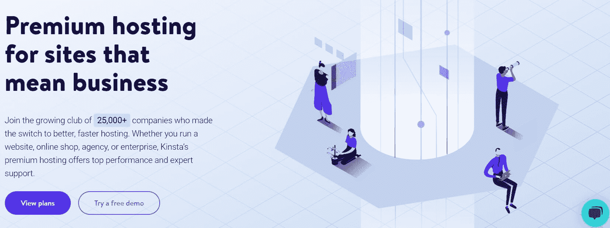
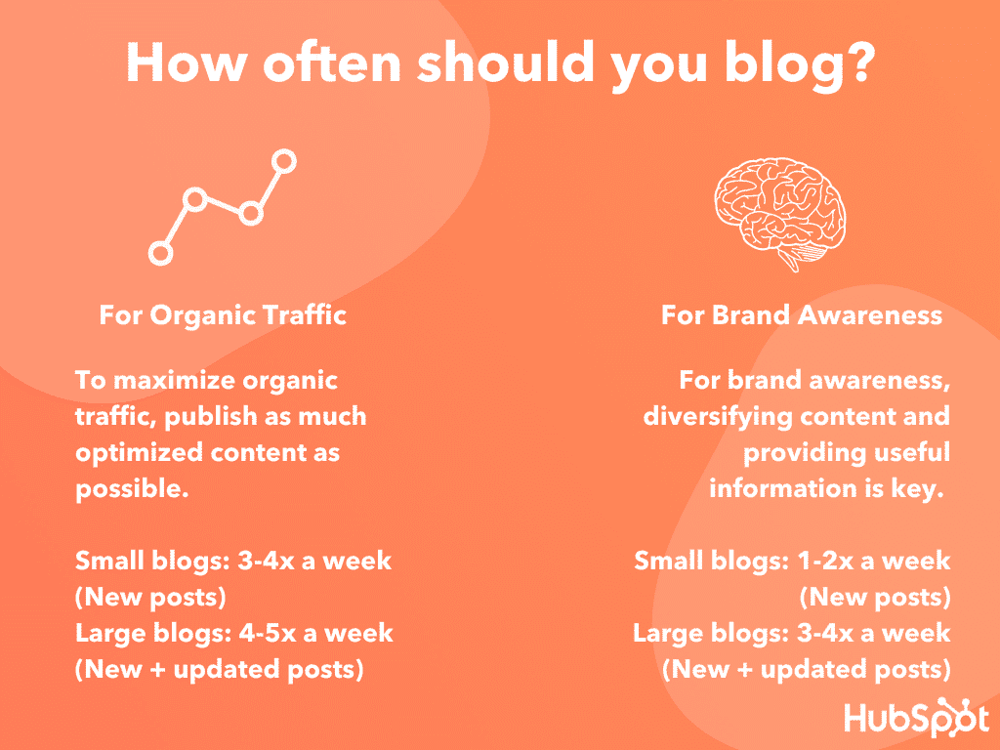
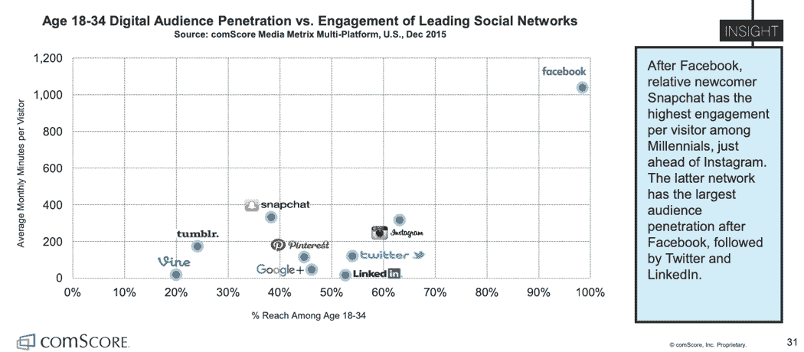

# 如何在 2022 年开一个时尚博客

> 原文：<https://kinsta.com/blog/how-to-start-a-fashion-blog/>

时尚博客正在流行，现在是你创建自己的博客的好时机。你只需要知道如何开始一个。

只要有一点点诀窍和一些额外的努力，你就可以创建自己的时尚博客，甚至 T2 也可以通过它赚钱。

所以，下面是怎么做的！

## 如何开始一个时尚博客

这一切都始于你的博客的基础。这意味着你的域名和主机。

### 选择一个容易记忆的域名

域名是用户用来连接到你的博客的网址，比如 www.domain-name.com。这也是为什么[仔细选择你选择的名字](https://kinsta.com/blog/choose-domain-name/)是至关重要的:它代表你的博客。

以下是优秀域名的特征:

> 需要在这里大声喊出来。Kinsta 太神奇了，我用它做我的个人网站。支持是迅速和杰出的，他们的服务器是 WordPress 最快的。
> 
> <footer class="wp-block-kinsta-client-quote__footer">
> 
> 
> 
> <cite class="wp-block-kinsta-client-quote__cite">Phillip Stemann</cite></footer>

[View plans](https://kinsta.com/plans/)

*   它的长度相对较短。
*   记忆起来毫不费力。
*   有人一听，直接知道怎么拼。
*   它是独特的

有时你可能不知道你的博客的确切名字，但是一个相近的变体通常仍然是一个非常合适的选择。

您可以选择一个故意拼错的域名或一个虚构的单词。有时候，它可以工作。只要确保你仔细考虑了具有这些特征的名字的利弊。

虽然它适用于 Reddit 和 Pinterest，但可能不适合你的时尚博客。原因是上述两个网站都是严格在线的。

如果你追随他们的脚步，计划在未来的时装周上亲自亮相，或者你想成为播客的嘉宾，甚至参加电视节目，那么有一个容易记住的域名会有所帮助，因为它的拼写会很明显。

这样，人们实际上可以在听说你的博客后访问它。

当你决定了一个域名，你可以从域名注册商那里购买。

查看[一个域名要多少钱？4 个影响你期望支付更多费用的关键因素](https://kinsta.com/blog/how-much-does-a-domain-name-cost/)了解详情。

A domain name is your site’s address and represents your blog.

### 挑选可靠的主机

主机是存储你的博客的地方，所以它可以被访问，有各种各样的计划，你可以从各种各样的主机提供商中选择。

如果你想知道如何开始一个时尚博客，这一切都从选择一个托管计划开始，并在其上建立你的博客。

选择正确的计划至关重要。如果你选择了一个没有足够资源的博客，你的博客就像病毒一样传播，你的网站可能会被关闭，直到你升级你的计划，或者你可能最终支付一大笔超龄费。

另一方面，如果你得到了一个对你的需求来说过于强大的计划，你会为你根本不需要的资源付出过高的代价。

如果你不选择[托管](https://kinsta.com/blog/managed-wordpress-hosting/)，你也可能会被困在[自己维护你的博客](https://kinsta.com/blog/wordpress-maintenance/)和托管环境。有时候，它本身看起来就像一份全职工作，尤其是出了差错的时候。

底线是，如果你想知道如何开始一个时尚博客，特别是如果你想把它变成一项业务，你需要得到正确的托管计划。

否则，就像在你即将见到拉尔夫·劳伦的时候，却被一条三季前就不合身的裤子卡住了。

无论哪种情况，你都不想冒险。

#### 为什么免费博客平台不理想

获得免费的托管服务可能很诱人，这样你就可以免费学习如何创建一个时尚博客，[但是有几个理由说明为什么这不是一个好主意，尤其是如果你打算通过你的博客赚钱的话。](https://kinsta.com/blog/best-blogging-platform/#best-selfhosted-blogging-platforms-in-2020)

首先，免费主机提供商会在你的博客上展示广告，以弥补成本。这似乎不是一个问题，除非你考虑到访问者可能会点击离开你的博客，不再返回。

在某些情况下，广告可能与你的品牌联系在一起，而且不是以一种好的方式。

免费托管也是以不能完全控制你的博客为代价的，因为计划通常有限制的特性和功能，所以它们在经济上是可行的。

这意味着你在定制网站的设计、布局、功能和其他类似元素时会受到限制。

虽然刚开始可能没什么问题，但是一旦你的博客增长了，免费托管就没用了。

因此，如果你计划快速发展，自主经营你的时尚博客是最好的选择。

#### 如何挑选一个靠谱的主机

你需要一个可靠的主机，有强大的客户支持，还能处理[流量激增](https://kinsta.com/knowledgebase/dedicated-server/)以确保你处于正确的立足点。这是你需要知道如何开始一个时尚博客的技术方面的一部分。

有了稳定的主机和强大的支持，您可以高枕无忧，知道任何可能出现的问题很少发生，并很快得到解决。

一个可靠的主机不仅稳定，而且运行速度快，安全可靠。

如果你的博客需要帮助，托管是一个很好的选择，因为管理你的博客的许多重要方面都为你考虑到了，比如安全和更新。

例如，像 Kinsta 这样的一个[应用程序](https://kinsta.com/application-hosting/)、[数据库](https://kinsta.com/database-hosting/)和[管理的 WordPress 主机](https://kinsta.com/wordpress-hosting/)具备所有这些品质。

Kinsta has reliable, stable, and fast application, database, and managed WordPress hosting.

### 选择一个好的 WordPress 主题

当谈到如何开始一个时尚博客时，选择一个坚实的主题是必不可少的。这意味着一个良好编码的主题可以帮助你的时尚博客加载得更快。但是，你也需要一个引人注目的。

得到一个两者兼备的主题，你将创造一个更好的用户体验。这有助于访客留在你的博客上，因为超过 46%的人根据网站的设计来判断网站的可信度，比如布局、字体大小、排版和 T2 配色方案。

你可以找到免费的、看起来很棒的 WordPress 主题，但是高级的主题看起来更专业、更惊艳。他们也倾向于拥有更多快速定制和支持的选项。

无论你选择免费的还是付费的 WordPress 主题，确保它在视觉上引人注目。

### 选择和设置插件和工具

学习如何创建时尚博客的下一步是创建一个网站，并添加你需要的插件和工具。

以下是常见的插件类型:

*   [安全](https://kinsta.com/blog/wordpress-security-plugins/)
*   [缓存](https://kinsta.com/blog/wordpress-caching-plugins/)
*   [图像优化](https://kinsta.com/blog/optimize-images-for-web/)
*   [备份](https://kinsta.com/blog/wordpress-backup-plugins/)
*   [反垃圾邮件](https://kinsta.com/blog/wordpress-spam-comments/)
*   [社交媒体](https://kinsta.com/blog/wordpress-social-media-plugins/)
*   [SEO](https://kinsta.com/blog/best-seo-plugins-for-wordpress/)
*   [照片库](https://kinsta.com/blog/wordpress-photo-gallery-plugins/)
*   [电子商务](https://kinsta.com/blog/wordpress-ecommerce-plugins/)
*   [性能](https://kinsta.com/blog/wordpress-performance-plugins/)
*   您可能需要的其他类型，如[联盟营销、销售线索生成、会员和广告](https://kinsta.com/best-wordpress-plugins/)

这些类型的插件中有许多是确保你的博客运行和维护顺畅所必需的，而其他的插件如照片库插件则完全是可选的。

使用[插件来提高你的博客](https://kinsta.com/blog/debugging-wordpress-performance/)的性能也是一个好主意，可以帮助你的网站在搜索引擎结果中排名靠前，这样人们就可以找到你的博客。

[使用缓存](https://kinsta.com/blog/wordpress-caching-plugins/)以及速度和[图像优化插件](https://kinsta.com/blog/optimize-images-for-web/#image-optimization-wordpress-plugins)可以帮助你的博客加载更快，这是一个帮助用户保持对你的博客兴趣的好方法。

[根据 Pingdom](https://royal.pingdom.com/page-load-time-really-affect-bounce-rate/) :

> “从上面的图表中，我们可以看到，页面在 2 秒内加载的平均跳出率为 9%。只要页面加载时间超过 3 秒，跳出率就会飙升，到 5 秒时会达到 38%。”

虽然速度优化插件可以极大地提高你的网站的性能，但也有必要确保你的主机也很快。这样，你就两面都被覆盖了。

如果寻找一个主机提供商仍然在你的“如何开始一个时尚博客”的待办事项列表中，考虑寻找已经优化了速度的主机。

例如，通过用 Kinsta 托管你的站点，你的站点将会自动提高 200%的速度。

值得注意的是，一些主机提供商可能会因为安全或不兼容问题禁止某些 WordPress 插件。请务必检查你的主机是否有任何已知会导致问题的插件。

详情请查看[网站速度优化初学者指南](https://kinsta.com/learn/page-speed/)、[如何正确运行网站速度测试(你做错了)](https://kinsta.com/blog/website-speed-test/)和[如何加快你的 WordPress 网站(终极指南)](https://kinsta.com/learn/speed-up-wordpress/)。

### 选择合适的位置

可能有很多时尚博客，但没有一个有你独特的观点。缩小你的定位可以帮助你在人群中脱颖而出。

如果你做一些研究，你可以看看其他时尚博客在做什么。然后，当你熟悉竞争对手在做什么时，你就可以考虑你的时尚博客会有什么不同，并选择一个合适的位置。

决定你的写作风格也很有价值，因为这有助于进一步提升你的品牌，让你在竞争中脱颖而出。

无论你选择什么，确保你的内容是真实可信的。这将有助于吸引人们并保持他们的参与。

### 你的时尚博客的内容策略

内容策略本质上是一个计划，你想用你的博客内容做什么，然后开发，管理和营销它。

一个好的内容策略包括:

*   竞争对手研究和分析
*   [关键词研究](https://kinsta.com/blog/keyword-research/)
*   编辑日历
*   市场调查
*   选定的利基市场

一旦你分析了所有这些领域，你就可以计划在你的博客上发布的内容类型，以最大限度地吸引和转化访问者为客户。

## 注册订阅时事通讯

### 想知道我们是怎么让流量增长超过 1000%的吗？

加入 20，000 多名获得我们每周时事通讯和内部消息的人的行列吧！

[Subscribe Now](#newsletter)

详情请查看[对你的内容来说比内容长度更重要的 5 件事](https://kinsta.com/blog/content-length/)、[如何创造持久的常青内容(17 个技巧和诀窍)](https://kinsta.com/blog/evergreen-content/)和 [77 个提高网站流量的有效策略。](https://kinsta.com/blog/how-to-drive-traffic-to-your-website/)

### 创建一个博客日程表

现在你真的开始想办法开一个自己的时尚博客了。一旦你有了一个内容策略，并且开始想出博客帖子的点子，你就需要制定一个发布时间表。

为此，你需要决定多久发布一次博客文章。

研究其他时尚博客，看看他们发布文章的频率，可以帮助你决定你应该发布文章的频率。

理想情况下，你应该比你的竞争对手更频繁或更频繁地推出内容。

Blogging frequency (Image source: Hubspot.com)

你的发布频率越高，你的流量就越高。根据 Hubspot 的数据，每月发表 11 篇或更多文章的博客的流量是每月只发表一到两篇文章的博客的两倍。

当你比竞争对手更频繁地发表文章时，搜索引擎会注意到你的博客，并认为你的博客是活跃的、相关的。这会将你的帖子放在搜索引擎结果的更高位置，这样会有更多的人看到它们。

为了帮助你快速有效地安排文章，你可以使用编辑插件，比如[编辑日历](https://wordpress.org/plugins/editorial-calendar/)或者[出版出版社](https://wordpress.org/plugins/publishpress/)。

Creating a publishing schedule will help you post articles frequently.

### 内容营销和搜索引擎优化

在你准备开始写博文之前，熟悉一下内容营销和 SEO 是个好主意。

内容营销需要撰写引人入胜的文章，这些文章信息丰富，有助于自然地推广品牌，并且听起来不那么虚假。

[搜索引擎优化(SEO)](https://kinsta.com/blog/what-does-seo-stand-for/) 就是改善和优化你的网站及其内容，让它在搜索引擎结果中排名靠前。

这有助于引导更多的流量到你的博客，而不需要你为广告付费。

以下是一些更详细的资源:

*   [内容营销要领](https://kinsta.com/learn/content-marketing/)
*   [如何用 WordPress 做一个单人内容营销忍者](https://kinsta.com/blog/content-marketing-ninja/)
*   [什么是集客营销？(以及为什么它如此有效)](https://kinsta.com/blog/inbound-marketing/)
*   [WordPress SEO 清单——13 个月内增加 571%流量的 45 个技巧](https://kinsta.com/blog/wordpress-seo/)
*   [如何在 WordPress 上使用 Yoast SEO:完整教程](https://kinsta.com/blog/yoast-seo/)
*   [如何诊断排名下降(我们见过的最疯狂的 SEO 问题)](https://kinsta.com/blog/decline-seo-rankings/)

#### 关键词研究

在你的时尚博客上实现 SEO 的方法之一就是做一些关键词研究。

在 SEO 领域，关键字指的是在 Google 和其他搜索引擎中最常搜索到的术语。当你选择一个热门关键词，并多次将其添加到一篇文章中时，它会告诉 [Google(和其他搜索引擎)](https://kinsta.com/blog/alternative-search-engines/)这是你博客文章的主题。

这有助于谷歌知道，当有人搜索该关键字时，你的网站应该列在结果中。

给你的内容添加关键词是有用的，因为它可以帮助更多的人找到你的文章和博客。

有三种类型的关键字:

厌倦了 WordPress 的问题和缓慢的主机？我们提供世界一流的支持，由 WordPress 专家提供 24/7 服务和超快的服务器。[查看我们的计划](https://kinsta.com/plans/?in-article-cta)

*   短尾关键字(Short-tail)——只有一个词的关键字，通常很难与它们一起排名，因为它们在许多不同的网站上被频繁使用
*   **中尾**–长度约为两到三个单词的关键词
*   **长尾**–可能包含冠词的几个单词或短语，如“at，a，to，or，”等

长尾关键词通常是最好的选择，因为它们更具体，更具描述性，并且不太受欢迎，所以不是每个人都围绕它写内容。但是，它也足够受欢迎，以至于数百人或更多的人定期搜索它。

如果你真的想知道如何创建一个成功的时尚博客，内容营销和搜索引擎优化应该是重点关注的领域。

你可以查看[一步一步的关键字研究指南(奖金:最佳关键字研究工具比较)](https://kinsta.com/blog/keyword-research/)了解详情。

#### 写博客时考虑到 SEO 和用户

当你选择了要包含在内容中的关键词后，一定要自然地写出来。否则，搜索引擎会认为你的内容只是垃圾邮件。

为 SEO 写作的核心是确保你的博客文章能够回答用户在搜索你的主题和关键词时提出的问题。

这是绝对必要的，因为这将有助于你的排名，也有助于你被读者视为值得信赖和可靠的。

## 如何从你的时尚博客中赚钱

当你想知道如何开始一个时尚博客时，很大一部分是技术细节，但同样重要的是知道你打算如何从你的博客中赚钱。

这里有几个想法:

*   [联盟营销](https://kinsta.com/affiliate-academy/affiliate-marketing-business/)–链接到在线商店中的产品，该链接会被跟踪，这样你就可以从你推荐的每个通过你的链接购物的人那里获得信用和佣金。

### 销售数码产品

*   电子书——你可以写一本书来提高你的可信度，或者计划将来把你的博客文章变成电子书，然后在你的博客上销售和推广。
*   在线课程——教授与时尚相关的各种技能，从如何正确设计服装和实用时尚指南，到时尚达人如何在时尚行业找到工作或开始职业生涯。
*   其他数码产品–你也可以出售实用的物品，比如可下载的服装款式。
*   会员网站-建立一个付费墙，用户必须注册才能观看优质的独家内容，例如如何设计和创造自己的衣服和服装系列。
*   **数字杂志或时尚书籍**–你可以让你的用户了解最新的时尚趋势，并出售广告空间以获得额外收入。
*   **广告**——直接在你的博客上展示广告，分享广告带来的收入。

### 提供服务

*   时尚顾问——你可以让客户直接在你的网站上预约咨询，并通过 Skype 等免费视频聊天应用或高级选项进行会面，以增强专业感。
*   **活动和活动门票**–如果你想远离电脑，亲自与粉丝互动，你可以计划活动和会议，并在你的博客上向他们出售门票。如果你喜欢呆在家里，你甚至可以使用网上研讨会工具来创建数字活动。

要了解更多想法，[查看 4 个为你的在线副业提供的成熟网站想法](https://kinsta.com/blog/website-ideas/)，[为什么你的业务应该基于经常性收入模式](https://kinsta.com/blog/recurring-revenue-model/)，以及 [11 个 WordPress 会员插件来获取经常性收入](https://kinsta.com/blog/wordpress-membership-plugins/)。

### 社交媒体营销

一旦你开始了你的时尚博客，并且你对如何开始一个时尚博客的知识越来越熟悉，你可以做一些社交媒体营销，通过在社交媒体平台上建立网络和发布相关内容来帮助你的博客获得流量。

更多想法，请查看: [6 种利用脸书获得营销成功的方法](https://kinsta.com/blog/facebook-marketing/)、 [8 种利用 LinkedIn 获得营销成功的方法](https://kinsta.com/blog/linkedin-marketing/)、 [Twitter 增强社交游戏的营销策略](https://kinsta.com/blog/twitter-marketing/)，以及 [Pinterest 为 WordPress 用户提供的营销技巧和策略](https://kinsta.com/blog/pinterest-marketing/)。

#### 创建社交媒体日历

社交媒体日历是一个文档或电子表格，你可以在其中计划你的社交媒体帖子。

这包括您希望安排每篇帖子的日期和时间、您希望发布的内容(包括文本、链接和图像)以及将要发布帖子的社交媒体网站。

社交媒体日历很有用，因为它们让你有条理，并帮助你定期发布内容，这样你的博客就更容易被人们看到。越多人看到你的帖子，就越有可能访问你的博客。

这也有助于提高品牌知名度。

社交媒体日历应该创建不同类型的帖子，让读者保持警觉，关注你的内容。

如果你只发布一种类型的帖子，它会变得很无聊，很快，人们会在某个时候自动跳过你的帖子。这就是为什么你不应该只在发表博客文章时才发帖。

以下是你可以计划的不同类型的社交媒体帖子:

*   信息性文章，如用户指南和实用技巧
*   最近发表的一些细节会激起人们好奇心的文章
*   推广与你的博客相关的其他人的文章
*   励志名言或短语
*   笑话、趣闻等搞笑帖子
*   引人注目的图片，尤其是伴随其他类型的社交媒体帖子
*   你的日常生活和惯例
*   你喜欢的日常时尚选择和风格
*   向你的粉丝提问

确保[也加入对话，回复评论](https://kinsta.com/blog/how-to-create-a-facebook-page/#following)和推文。也可以找相关的对话，补充你的两分钱。

只要你加入到对话中，而不是压制它或发送垃圾邮件，你就可以增加帖子的参与度。互惠也导致了品牌认知度的提高。

虽然社交媒体网站的数量看起来多得让人应接不暇，但你不必加入所有的网站。找到你的潜在粉丝所在的平台，并坚持使用这些平台。

根据一般经验，如果你希望你的目标受众在 18 岁到 35 岁之间，那么 ComScore 的调查结果显示你应该把注意力放在脸书、Instagram、Twitter 和 Pinterest 上。

The most valuable social media platforms for millennials.

#### 建立关系网，进一步推广你的博客

学习如何开一个时尚博客的最后一步是什么？是网络。它可以通过传播你的博客来帮助你。

以下是你可以利用社交网络和其他促销创意的方法:

*   写文章并提交给时尚杂志和博客。
*   加入博客和商业团体，等待机会。你可能会遇到需要客人的播客，或者你最喜欢的时尚偶像正在访问你的地区，你可以要求与他们会面或采访。你也可以从自己的营销活动中获得灵感。
*   寻找时尚事件和会议来传播你的博客。你也可以在你的博客中报道这些事件，因为写一些流行的、当前的事件有助于提高你被关注的机会。

考虑**计划营销活动**也是如此。

这些计划包括多种营销策略，你可以在很长一段时间内制定内容、广告和其他促销项目的时间表。他们专注于与你的品牌和受众产生共鸣的特定信息。

如果做得好，营销活动可以提高积极的品牌知名度，增加参与度和转化率。它也能带来更多的销售。

详情请看[营销活动终极指南](https://blog.hubspot.com/marketing/marketing-campaigns)，[用这 5 个步骤制定营销计划](https://www.entrepreneur.com/slideshow/299487)，以及[在预算紧张的情况下制定有效营销活动的 13 种方法](https://www.forbes.com/sites/forbescommunicationscouncil/2017/08/31/13-ways-to-create-an-effective-marketing-campaign-on-a-tight-budget/#4a7af4924605)。

[Do you live and breathe fashion? 👠🤵Well, now it's a perfect time to turn your passion into a future business by launching your own fashion blog. Check out how! 🤑Click to Tweet](https://twitter.com/intent/tweet?url=https%3A%2F%2Fkinsta.com%2Fblog%2Fhow-to-start-a-fashion-blog%2F&via=kinsta&text=Do+you+live+and+breathe+fashion%3F+%F0%9F%91%A0%F0%9F%A4%B5Well%2C+now+it%27s+a+perfect+time+to+turn+your+passion+into+a+future+business+by+launching+your+own+fashion+blog.+Check+out+how%21+%F0%9F%A4%91&hashtags=fashion%2Cblogging)

## 摘要

如果你想写关于时尚的博客，现在开始比过去更容易。

要创建自己的时尚博客，你需要:

*   挑选一个域名和一个可靠的主机
*   选择一个主题
*   设置插件和工具
*   选择一个合适的位置
*   全力以赴，采用可靠的内容策略(编辑日历、搜索引擎优化、社交媒体),涵盖所有领域和渠道，让你的潜在客户参与进来

现在，轮到你了:你打算开一个时尚博客吗？你曾经开通过新的博客吗？在评论中分享你的经验吧！

* * *

让你所有的[应用程序](https://kinsta.com/application-hosting/)、[数据库](https://kinsta.com/database-hosting/)和 [WordPress 网站](https://kinsta.com/wordpress-hosting/)在线并在一个屋檐下。我们功能丰富的高性能云平台包括:

*   在 MyKinsta 仪表盘中轻松设置和管理
*   24/7 专家支持
*   最好的谷歌云平台硬件和网络，由 Kubernetes 提供最大的可扩展性
*   面向速度和安全性的企业级 Cloudflare 集成
*   全球受众覆盖全球多达 35 个数据中心和 275 多个 pop

在第一个月使用托管的[应用程序或托管](https://kinsta.com/application-hosting/)的[数据库，您可以享受 20 美元的优惠，亲自测试一下。探索我们的](https://kinsta.com/database-hosting/)[计划](https://kinsta.com/plans/)或[与销售人员交谈](https://kinsta.com/contact-us/)以找到最适合您的方式。