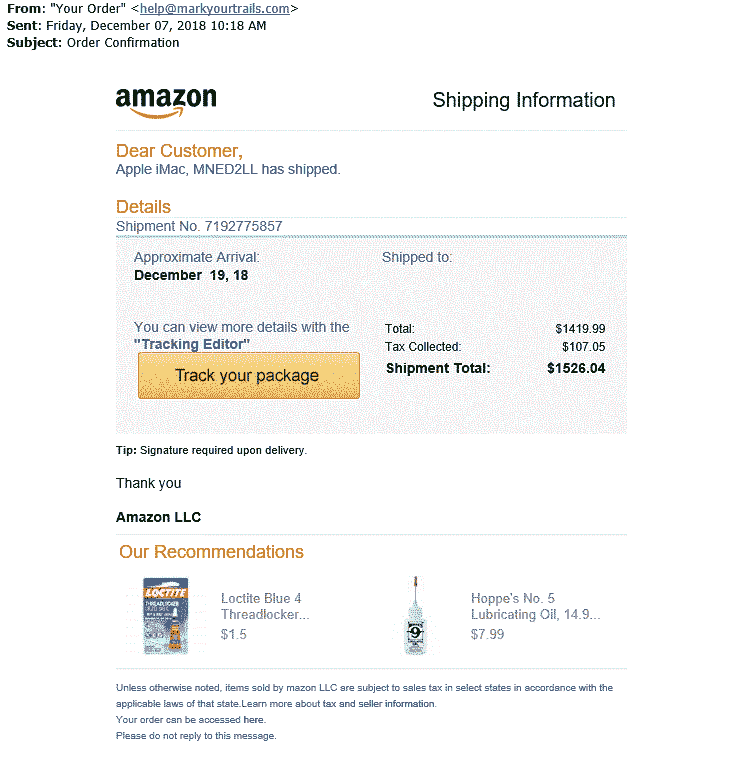
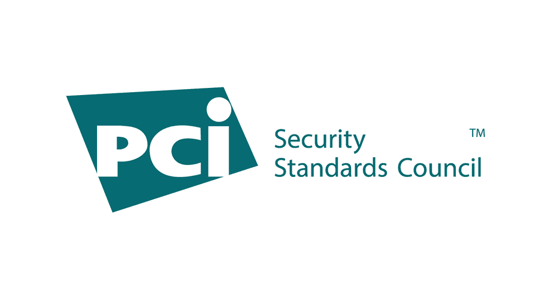
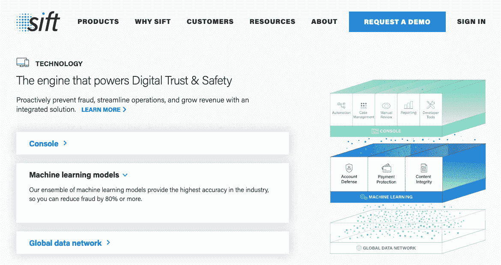
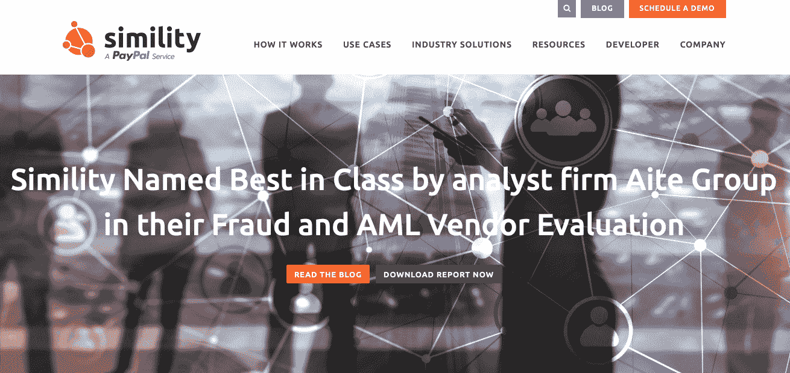
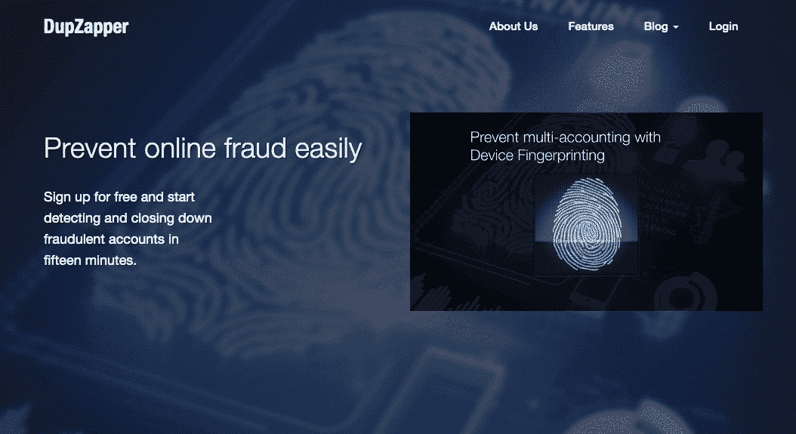
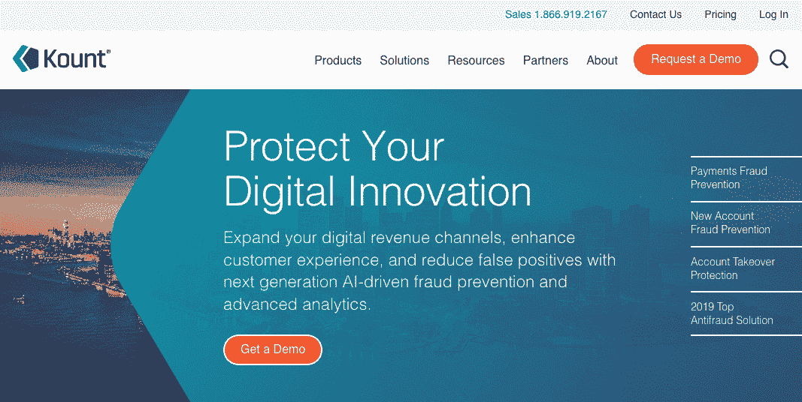
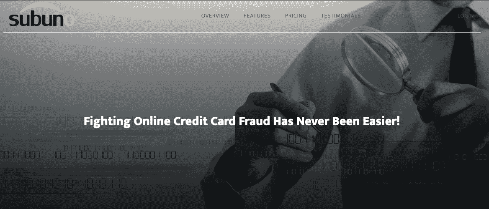
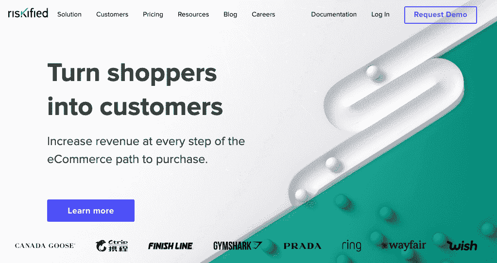
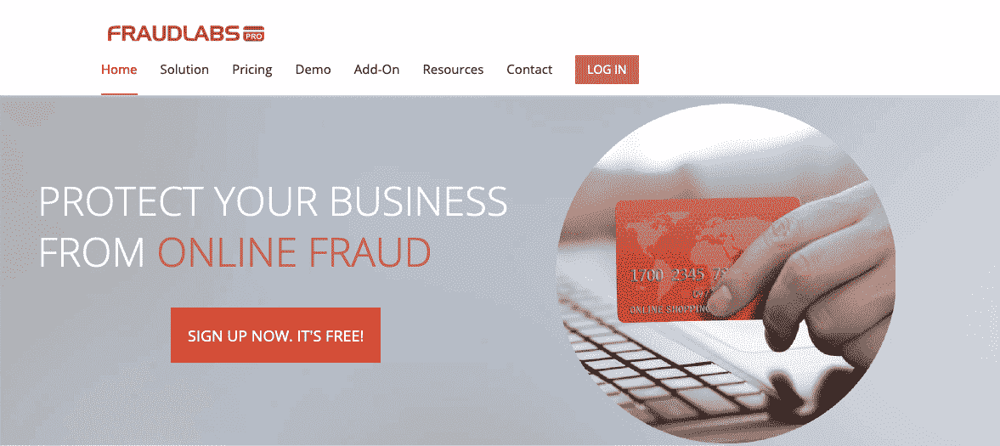
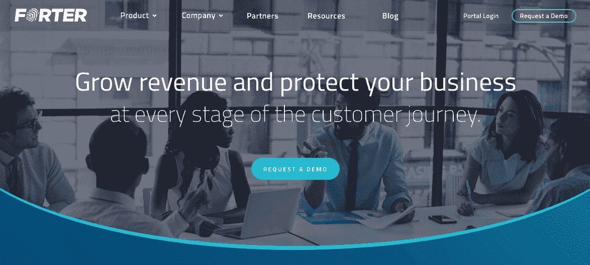

# 电子商务欺诈预防:7 种最糟糕的骗局以及如何阻止它们(10 种预防工具)

> 原文：<https://kinsta.com/blog/ecommerce-fraud-prevention/>

你的怀疑是正确的:电子商务欺诈正在上升。根据 LexisNexis Risk Solutions 的一项年度研究，确切的数字是将近 30%的增长。更麻烦的是:根据来自[数字商务 360](https://www.digitalcommerce360.com/2018/04/24/e-commerce-fraud-rose-nearly-twice-as-fast-as-e-commerce-sales/) 的数据，这个数字几乎是*电子商务销售额增长的两倍*。

更糟糕的是，电子商务商家不得不在两条不同的战线上打击欺诈。首先，你必须保护自己免受专门针对商家的计划，如欺诈性退款或网站模仿(见下文)。

但除此之外，你还必须保护你的客户免受诈骗。在你的网站上窝藏骗子是对网上商店的死亡之吻，即使你和你的顾客一样是受害者。

幸运的是，**电子商务欺诈防范**也在*和*上升，其方法与他们挫败的骗局一样复杂。在这篇文章中，我们概述了 7 个最糟糕和最常见的电子商务欺诈骗局:它们是如何工作的，需要注意什么警告信号，你最好的防御措施，以及 10 个电子商务欺诈预防工具来优化安全性。

我们开始吧！

## 7 个最糟糕的电子商务欺诈骗局值得警惕

你对电子商务欺诈的第一道防线就是知道要提防什么。以下是网上商店最容易受到的 7 种最常见的骗局。

### 1.电子邮件帐户网络钓鱼

大多数人都熟悉电子邮件[网络钓鱼诈骗](https://kinsta.com/blog/email-deliverability-manager/#5-antiphishing-verification)，所以让我们从这里开始。这些和互联网本身一样古老，所以你们中的许多人可能已经打开了一封陌生人的电子邮件，询问敏感的帐户信息。

然而，最近我们看到越来越多的骗子不是伪装成尼日利亚王子，而是伪装成电子商务商店。他们发送伪装成订单/交付确认的电子邮件，目的是提取敏感账户数据或将受害者引向欺诈网站。

Example of a phishing email posing as Amazon (Image Source: SecureWorld)

在最好的情况下，这些会导致意想不到的广告页面，而不是官方商店页面。其他时候，它不是那么无害；网络钓鱼邮件中的链接通常指向带有病毒、恶意软件或其他与黑客攻击相关的不幸事件的陷阱网站。这就是为什么总是建议将鼠标悬停在可疑链接上，而不是点击它们。

### 2.身份盗窃

如果某个可怜的人因为网络钓鱼邮件而丢失了账户信息，接下来会发生什么？骗子利用这些信息为自己买了一堆昂贵的礼物，猜猜谁会买单。冒充他人并使用他们的财务信息进行购买被称为身份盗窃。

听起来很奇怪，[零售商通常是身份盗窃的最大受害者](https://kinsta.com/blog/credit-card-fraud-stripe/):信用卡公司通常代表受害者发起退款，但没有义务返还商品。即使零售商设法回收产品，它们也不再是新的了。零售商毫发无损地逃脱身份盗窃的唯一方法是在它开始之前阻止它。

同样值得一提的是，网店也需要警惕在不知情的情况下成为身份盗窃的帮凶。如果[你的网站不安全](https://kinsta.com/blog/wordpress-security/)，黑客可以从你眼皮底下窃取你客户的信息——正如 2013 年[塔吉特黑客攻击](https://www.businessinsider.com/target-credit-card-hackers-2013-12)中的百万美元案例。

### 3.页面劫持

你现在在一个你已经使用过几百次的网站上，但是这次，在这个特殊的页面上，有些东西似乎不太对劲。可能是该网站的某个页面被劫持了。网页劫持是指黑客创建一个模仿现有网站的欺诈性网页。

更高级的案例包括劫持一个排名靠前的网站，并窃取其搜索引擎流量。劫持页面通常也与“鼠标陷阱”有关，即页面阻止用户退出，例如，每次用户试图关闭浏览器时打开一个新窗口，或者用无休止的弹出窗口淹没他们的计算机。

但就电子商务而言，页面劫持是另一种有效的网络钓鱼技术，例如模仿[网站的登录页面](https://kinsta.com/blog/wordpress-login-url/)来收集用户名和密码。一个电子商务品牌最不希望的事情就是，客户每次登录时都要质疑自己的合法性。

### 4.退款欺诈

退款欺诈简单得令人痛苦，也普遍得令人悲哀。基本上，骗子购买大量电子商务订单，然后在发货后取消付款。当商品到达时，他们会免费保存。

方法各不相同，虽然它可以像骗子自己打电话给信用卡公司，说他们的身份被盗一样简单。

另一种流行的技巧是声称货物从未到达，这样骗子就可以免费收到一份重复的订单。即使骗局被及时识破，即使在最好的情况下，商家仍然要调查虚假索赔。

更糟糕的是，商家必须区分“友好欺诈”和真正的退款欺诈。

友好型欺诈是指合法客户意外导致退款欺诈，例如错过包裹递送或输入错误的付款细节。商家被蒙在鼓里，不知道退款是出于恶意还是仅仅是一个意外，他们害怕用欺诈的指控冒犯一个善意的顾客。

在订阅模式下运营的电子商务品牌经常遭遇善意的欺诈，因为客户声称他们不知道这些费用会重复出现。订阅品牌最好在客户签约前*把收费说清楚、说明白。*

### 5.三角欺诈

让我们进入更高级的诈骗计划，留给更聪明和更有经验的骗子。为了解释三角欺诈是如何工作的，让我们把它分解成几个步骤。

1.  骗子为真正的产品创建一个虚假的[列表，并大幅加价。这也不总是那么具有欺骗性；像易贝这样的网站允许用户未经验证就发布和出售商品。](https://kinsta.com/blog/wordpress-directory-plugins/)
2.  客户从虚假列表中“购买”产品，向骗子提供所有个人数据。
3.  骗子获取客户的数据，在不同的网站上以更低的价格为他们购买相同的商品。他们将物品运送给客户。
4.  顾客收到他们购买的商品，但没有意识到他们多付了钱。骗子保留加价利润。

这个骗局中最狡猾的部分之一是**受害者甚至不一定知道他们被骗了**。

此外，成功的三角欺诈者会积累一长串帐户数据和信用卡号。通常情况下，他们在第三步使用不同的信用卡来分散注意力。

这意味着三角测量欺诈的受害者可能在几个月或几年后在一个不相关的骗局中再次使用他们的数据。

### 6.关联欺诈

代销商欺诈专门针对拥有[代销商计划](https://kinsta.com/affiliate-academy/what-is-affiliate-marketing/)的电子商务商家，指的是骗子操纵或滥用代销商链接来获取更大的回报。换句话说，如果代销商从他们发送给网站的每个访问者那里获得报酬，骗子就可以让他们看起来发送了比实际更多的访问者，从而获得更高的薪水。

代销商欺诈通常涉及黑客和自动化系统，但在某些情况下，它可以简单到使用一系列伪造的个人资料。骗子通常必须有一定水平的计算机技能，以巧妙地避免检测。

### 7.供应商身份欺诈

最后，另一种针对特定商家的欺诈方案:骗子伪装成制造商、批发供应商或其他 B2B 企业，承诺提供他们从未打算提供的服务。网店注册，交一些钱，但再也没有供应商的消息。

这些骗局借鉴了很多其他骗局，如网络钓鱼，甚至可能是网页劫持，最大的区别是它们针对的是企业而不是消费者。这也是我们一直建议彻底调查你在和谁做生意的原因之一。

## 电子商务欺诈警告标志:在骗局开始前阻止它们

一盎司的预防抵得上一磅的治疗。

预防电子商务欺诈最有效的方法是尽早识别警告信号，以避免它们。以下是每个在线商店都应该留意的一些危险信号:

*   **送货地址和帐单地址不同。**就像通常的身份盗窃和三角欺诈一样，卡的所有者没有收到货物。
*   **同一商品的多个订单。**电子商务欺诈者倾向于锁定高价商品，当他们找到喜欢的商品时，就会反复使用。通常情况下，商品是被隔离的，所以更多的是货币价值而不是实际产品。
*   **同一地址不同卡的多个订单。**过度使用相同的被盗卡号会带来不必要的关注和怀疑，因此经验丰富的骗子喜欢更换卡号……使用不同的信用卡号比将商品运送到不同的地址更容易(请务必查看我们的指南[如何使用条纹雷达防止和减少 98%的信用卡欺诈](https://kinsta.com/blog/credit-card-fraud-stripe/))。
*   可疑的大订单(尤其是加急运输)。与大多数犯罪一样，诈骗者希望确保回报值得冒险。这就是为什么电子商务诈骗经常涉及大额订单，以防这是欺诈者的最后一单。他们还希望交易能在受害者发现之前尽快完成，从而加快运输。
*   **可疑的电子邮件地址或电话号码。**身份盗窃很少是万无一失的——通常有一两个漏洞。保持警惕那些看起来不相符的电子邮件地址(不同的名字，冒充个人的公司，等等。)以及可疑的电话号码(即与账单地址不同的国家或地区代码)。
*   **多次被拒绝的交易。**交易被拒绝一次或两次的情况每个人都会遇到，但重复被拒绝的交易是一个危险信号。虽然有时是无辜的，但这可能是有人试图猜测他们没有合法权限访问的敏感信息的迹象。

## 电子商务欺诈防范:您的铁甲防御

现在你知道了所有可能发生在你身上的不幸，让我们继续你在这里的真正原因:确保它不会发生！以下是关于电子商务欺诈预防和保护您的在线商店免受欺诈的最佳建议。

### 信息

Kinsta 实施硬件防火墙、主动和被动安全以及其他高级功能，以防止访问您客户的数据。[点击此处查看更多信息](https://kinsta.com/secure-wordpress-hosting/)。

### PCI 合规性

首先，从预防电子商务欺诈的官方指南开始:支付卡行业安全标准委员会(PCI SSC)。基本上，世界上最大的信用卡品牌聚集在一起，列出了避免诈骗的最佳做法。请将这些视为电子商务欺诈防范的最低要求，也是一个良好的起点。

幸运的是，许多支付网关可以为您处理 PCI 合规性，因此您可以通过选择更安全的网关来直接解决问题。我们[在这里解释如何遵守 PCI 指南](https://kinsta.com/knowledgebase/pci-compliant-hosting/)或者你可以通过 [PCI SSC 博客](https://blog.pcisecuritystandards.org/topic/educational-resource#)直接找到来源。

PCI security standards council

### AVS 和 CVV

打击欺诈更容易的方法是:地址验证服务(AVS)和卡验证价值(CVV)。这些标准的安全措施更接近于规则而不是建议。

AVS 确保输入的账单地址与文件上的账单地址相匹配，而 CVV 要求客户输入卡背面的三位数代码(以防身份窃贼只窃取了卡号，而不是实际的卡)。

这两种安全措施通常都包含在支付处理器中，所以在选择您的之前，请确保它们都存在。

## 注册订阅时事通讯

### 想知道我们是怎么让流量增长超过 1000%的吗？

加入 20，000 多名获得我们每周时事通讯和内部消息的人的行列吧！

[Subscribe Now](#newsletter)

### 交货时要求签名

有如此多的电子商务诈骗涉及假身份，一个物理签名可以承载很大的重量。尽管根据您的运输情况，此选项可能需要额外的费用，但它是对身份盗窃、欺诈性退款和三角测量方案的一个很好的防御。

如果骗子试图让你相信他们是别人，或者货物从未送达，一个必要的签名会把他们诱入陷阱。

### 亲自跟进

骗子喜欢懒惰的受害者。他们从不多看一眼。

一个成功的骗局包括事情的败露，所以最有效的预防措施之一就是追踪可疑之处。如果你有多余的时间，一点额外的关注和努力可以揭示骗子不想让你看到的东西。考虑这些选项:

*   亲自给客户发电子邮件，看看他们的电子邮件地址是否真实可信。如果你礼貌地解释你的怀疑，无辜的客户不会介意，但骗子不会知道该怎么办。注意他们回答中的 T2 语法和拼写，看看英语是否是他们的第二语言。
*   **在社交媒体上验证此人。**搜索他们的姓名和/或用户名，查看他们是否真实，以及他们的个人资料是否与他们的其他信息匹配。
*   **拨打客户的电话。**这是验证某人身份的最快途径。
*   延期装运。正如我们所说，诈骗者希望尽快完成他们的操作，以降低被抓的几率。如果你故意推迟发货，并告诉他们，这可能会吓跑他们。这对诚实的购物者来说很不方便，所以只有在必要时才使用。

当然，你没有时间为每个订单做所有这些，所以一个好的开始是发展你的直觉。学会尽早识别可疑订单，如果你觉得有些不对劲——哪怕只是一点点——无论如何，不要忽视它。

### 永远用 HTTPS

HTTP 和 HTTPS 有什么区别？总之，*加密*。HTTPS 使用另一种协议，[安全套接字层(SSL)](https://kinsta.com/knowledgebase/tls-vs-ssl/) ，来保护在互联网上“移动”的数据。HTTP (no *S* 没有，所以 HTTPS 总是更好地避免黑客。可以把它想象成 *S* 代表*安全。*

HTTPS 还有其他好处，比如更好的搜索引擎优化排名和更准确的推荐数据。如果你正在使用 WordPress，[阅读我们关于如何从 HTTP 切换到 HTTPS 的深入指导。如果你正在管理一个网上商店，这里告诉你如何](https://kinsta.com/blog/http-to-https/)[安装一个 SSL 证书](https://kinsta.com/knowledgebase/woocommerce-ssl/)。

### 更安全的密码

最后但同样重要的是，您可以通过要求客户使用更安全、更精细的密码来与他们分担安全负担。当然，没有人喜欢那些烦人的密码要求，尤其是如果他们在很多网站上都有账户的话……但是真的，成为信用卡骗局的受害者比记住新密码要麻烦得多。

目前行业标准是八个字符，一个大写字母，一个特殊字符。另一个小于这个的是一个风险，为了额外的安全，你可以添加更多的要求，比如一个数字，甚至随机生成的密码。

## 预防电子商务欺诈的十大最佳工具

在打击欺诈的斗争中，你不是一个人，如果你知道去哪里找，还有很多盟友。这里有 10 个最好的电子商务欺诈防范软件。

### 1.显著地

Signifyd

[Signifyd](https://www.signifyd.com/) 是寻找防欺诈软件的首选之地，其规模可适应大型和小型企业。它在你商店的后端运行，根据欺诈的可能性给每一笔购买分配一个“分数”。

用户可以选择自己处理案件，也可以向重大团队寻求帮助。他们还为精选的订单提供保险，以防出现你无法确定的可疑情况，让你更加安心。

你的电子商务网站需要一个超快的、可靠的、完全安全的主机吗？Kinsta 提供所有这些服务，并由 WooCommerce 专家提供 24/7 的世界级支持。[查看我们的计划](https://kinsta.com/plans/?in-article-cta)

### 2.撒

Sift

以前的 Sift Science，欺诈预防工具 [Sift](https://sift.com/) 针对的是高端商店——更多的功能，更多的钱。虽然您可以购买单独的套装，但全套套装提供:

*   订单评估
*   虚假账户防范
*   防止帐户被接管
*   防止滥用促销
*   内容的垃圾邮件防护
*   设备指纹 API

Sift 吹捧其机器学习是业内最好的之一，所以也许这一点，加上其他功能，证明了价格的合理性。

### 3.相似性

Simility

[similarity](https://simility.com/)专门从事“设备指纹识别”，识别设备并评估其威胁级别。通过监控设备的数据—位置、操作系统、语言、网络浏览器、用户名，甚至电池电量！—相似性将设备与任何黑名单进行交叉引用，并确定其威胁级别。

### 4.杜普扎珀

Dupzapper

易于使用，快速安装，不需要 API 集成， [DupZapper](https://dupzapper.com/) 是一个低维护，高回报的软件。他们的算法旨在监管在线游戏，检测重复账户、地理位置一致性、cookie 拦截和代理使用等情况。如果你正在寻找无痛和轻松的欺诈防范工具，这是我们的建议。

### 5.昆特

Kount

作为全球企业如大通银行和 GNC 的最爱， [Kount](https://www.kount.com/) 是另一个高成本、高质量的选择。如果你有预算，Kount 利用 200 多个数据变量，利用一些最先进的技术来评估交易的风险。他们的系统也是最快的系统之一，响应时间不到一秒钟(准确地说是 300 毫秒)。对于预算可观的大公司来说，这种速度在处理日常订单时会很有用。

### 6.苏布诺

Subuno

Subuno 的低价提供了很多东西:20 多种欺诈检测工具，可以分析 100 多种风险因素。对于那些预算不多但仍然优先考虑网站安全的人来说，这是一个首选，特别是考虑到它可以与像 [Shopify 和 WooCommerce](https://kinsta.com/blog/woocommerce-vs-shopify/) 这样的电子商务网站一起工作。

### 7.风险化

Riskified

Riskified 在几个方面与其他电子商务欺诈防范软件有所不同。首先，他们使用闪电般的实时报告。如果您想要像 Kount 这样的高端软件的速度，但没有企业级的价格，这是一个不错的选择。

抛开“欺诈得分”模型，Riskified 为每个订单提供了清晰的“批准/拒绝”分析。它也适用于滑动比例，即你只为产生销售的批准订单付费，这是较小的在线商店的明智选择。

### 8.FraudLabs Pro

FraudLabs Pro

[FraudLabs Pro](https://www.fraudlabspro.com/) 与列表中的其他欺诈防范工具相比，有几个强大的优势。也就是说，它使用独特的检测方法，包括对电子邮件(如电子邮件域名年龄)、社交媒体、ISP 和用户名的真实性检查。

但是另一个优势更吸引人:一个可行的免费计划，每月接受多达 500 个查询。对于刚上线的小店或品牌来说，这是网安的幸运发现。

### 9\. Forter

Forter

[Forter](https://www.forter.com/) 针对移动交易进行了优化，为几乎所有交易提供广泛、全面的覆盖，无论地理位置或支付方式如何。其最受欢迎的功能之一是定制选项，允许用户专注于特定的风险概况或[支付网关](https://kinsta.com/blog/woocommerce-payment-gateways/)。它还使用快速、实时的报告，提供简单的“是/否”报告，而不是欺诈评分。

### 10.拴住

Bolt

从技术上来说， [Bolt](https://www.bolt.com/) 更像是一个结账 UI 解决方案，而不是一个防欺诈解决方案…然而，因为防欺诈是内置于其系统中的，所以它可以兼而有之。Bolt 是一个针对欺诈检测和用户体验进行优化的结账系统，旨在通过可用性增加销售和减少废弃。

Bolt 在结账时扫描了 200 多个行为数据点来评估风险。这一点，加上其可用性优势，使其成为在线商店的绝佳选择，这些在线商店不仅需要在线安全方面的帮助。

[Ecommerce fraud is booming. What can you do to keep your store and users safe? Identify the trickiest scams and use fraud prevention tools! Your business is at risk 🦹‍♂️💰Click to Tweet](https://twitter.com/intent/tweet?url=https%3A%2F%2Fkinsta.com%2Fblog%2Fecommerce-fraud-prevention%2F&via=kinsta&text=Ecommerce+fraud+is+booming.+What+can+you+do+to+keep+your+store+and+users+safe%3F+Identify+the+trickiest+scams+and+use+fraud+prevention+tools%21+Your+business+is+at+risk+%F0%9F%A6%B9%E2%80%8D%E2%99%82%EF%B8%8F%F0%9F%92%B0&hashtags=onlinestore%2Cscam)

## 摘要

您的防欺诈安全措施直接提高了您的电子商务品牌的成功，或者更准确地说，您未能防止欺诈计划直接阻碍了您的成功。随着电子商务欺诈的增加，现在在线商店比以往任何时候都更加重视安全性。

幸运的是，如果你保持警惕，你可以避开它。回顾一下上面列出的 7 个最常见的骗局，这样你就可以“了解你的敌人”，并为将要发生的事情做好准备。同样，回顾一下我们概述的警告信号和危险信号，这样您就可以在欺诈企图还只是“企图”时就抓住它们

我们列出了有效的、DIY 的电子商务欺诈防范方法——任何在线店主都可以自己从头开始实施的技术。但你的电子商务品牌越大，你需要的外部帮助就越多。十大防欺诈工具为每个人都提供了一些东西，所以看看我们的评估，找到最符合您的需求、目标和限制的工具。

* * *

让你所有的[应用程序](https://kinsta.com/application-hosting/)、[数据库](https://kinsta.com/database-hosting/)和 [WordPress 网站](https://kinsta.com/wordpress-hosting/)在线并在一个屋檐下。我们功能丰富的高性能云平台包括:

*   在 MyKinsta 仪表盘中轻松设置和管理
*   24/7 专家支持
*   最好的谷歌云平台硬件和网络，由 Kubernetes 提供最大的可扩展性
*   面向速度和安全性的企业级 Cloudflare 集成
*   全球受众覆盖全球多达 35 个数据中心和 275 多个 pop

在第一个月使用托管的[应用程序或托管](https://kinsta.com/application-hosting/)的[数据库，您可以享受 20 美元的优惠，亲自测试一下。探索我们的](https://kinsta.com/database-hosting/)[计划](https://kinsta.com/plans/)或[与销售人员交谈](https://kinsta.com/contact-us/)以找到最适合您的方式。