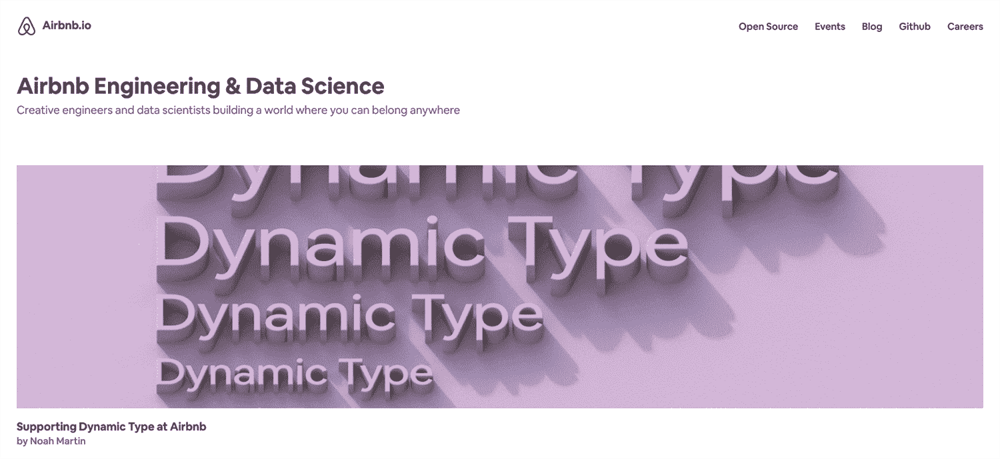
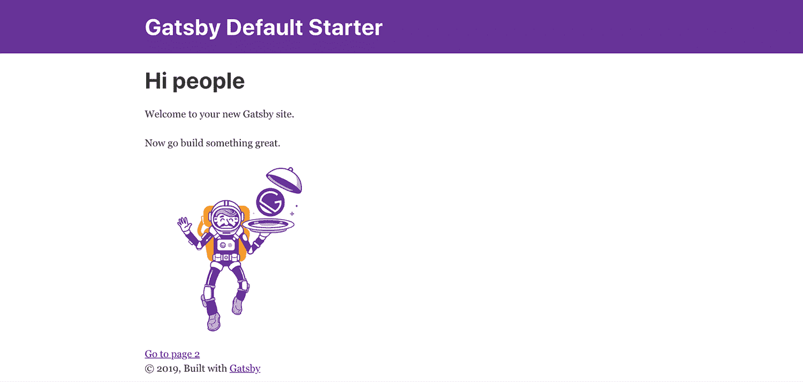
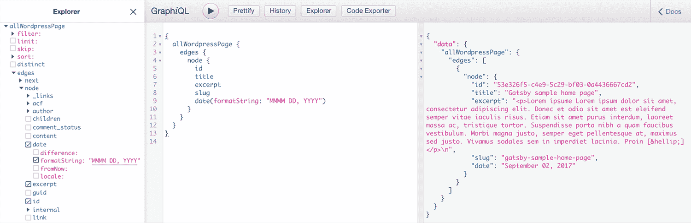
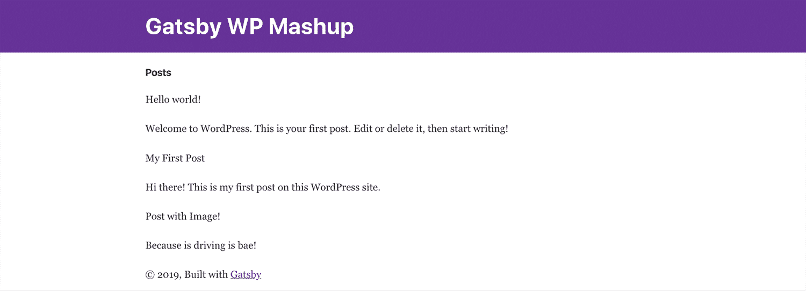
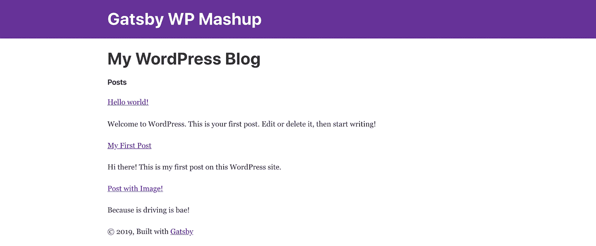
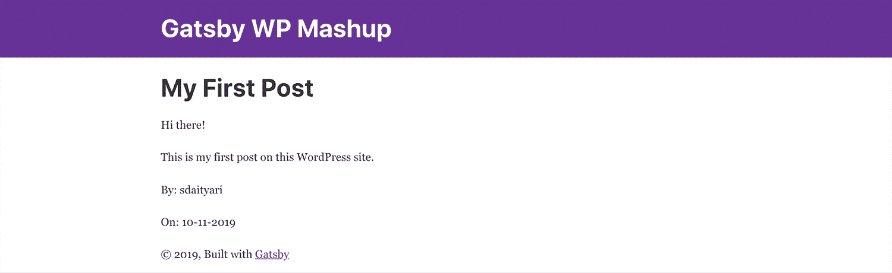
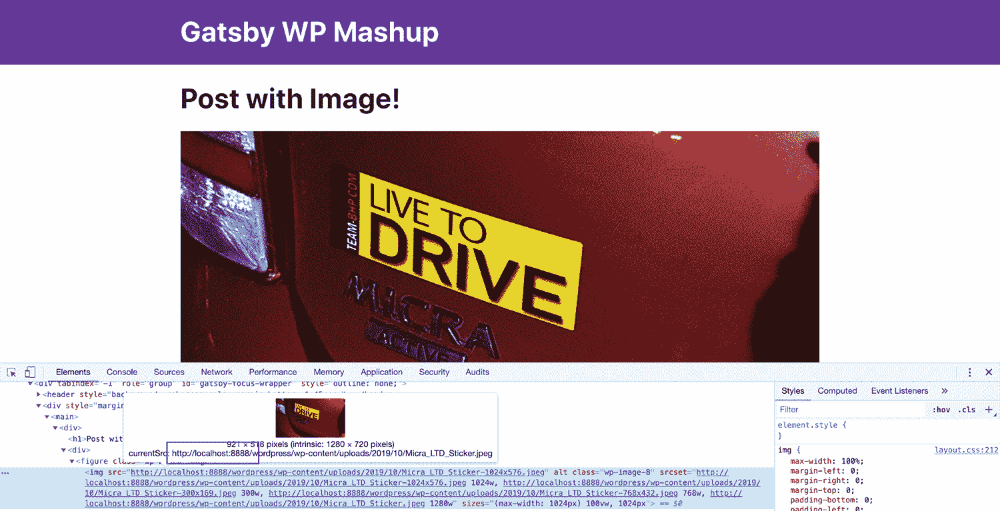
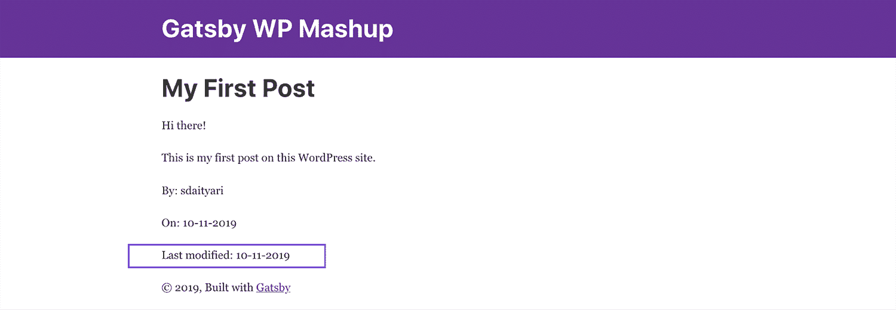

# 介绍如何用 Gatsby 和 WordPress 构建网站(快速和静态)

> 原文：<https://kinsta.com/blog/gatsby-wordpress/>

一个典型的动态网站，比如那些基于 WordPress 的网站，是如何工作的？当访问者在浏览器上输入 URL 或通过链接访问您的网站时，会向您的 web 服务器发送一个请求。

服务器通过必要的数据库查询收集所需的数据，并生成一个 [HTML 文件](https://kinsta.com/knowledgebase/how-to-upload-html-file-to-wordpress/)供您的浏览器显示。另一方面，静态网站将这些响应存储在服务器上的平面文件中，然后立即发送给访问者。

静态站点生成器已经存在很长时间了，但是最近越来越受欢迎。在这个分步指南中，我们来看一下 WordPress 与静态站点生成器 Gatsby 的**集成。**

## 盖茨比是什么？

WordPress 创建动态网站，需要服务器上有一堆 [PHP](https://kinsta.com/blog/is-php-dead/) 、 [MySQL](https://kinsta.com/knowledgebase/what-is-mysql/) 、 [Apache 或 Nginx](https://kinsta.com/blog/nginx-vs-apache/) 才能运行。通过为你网站上的所有内容生成一个 HTML 页面列表，可以创建一个静态版本的 WordPress。


> 需要在这里大声喊出来。Kinsta 太神奇了，我用它做我的个人网站。支持是迅速和杰出的，他们的服务器是 WordPress 最快的。
> 
> <footer class="wp-block-kinsta-client-quote__footer">
> 
> 
> 
> <cite class="wp-block-kinsta-client-quote__cite">Phillip Stemann</cite></footer>

[View plans](https://kinsta.com/plans/)

这个静态版本的 WordPress 被称为 headless WordPress 或 [serverless](https://kinsta.com/blog/serverless-php/) WordPress。这种转换过程只需进行一次，这样就可以多次向访问者提供相同的页面。如何将你的 WordPress 站点转换成静态版本？这就是盖茨比出现的原因。

[盖茨比](http://gatsbyjs.com/)或 GatsbyJS，是一个静态站点发电机，由 [ReactJS](https://reactjs.org) 建造，由 [GraphQL](https://graphql.org/) 供电。盖茨比允许任何人创建功能丰富、引人入胜的网站和应用程序。Gatsby 通过 GraphQL 从各种来源为您的站点获取数据，包括现有网站、API 调用和平面文件，并根据您指定的配置设置构建静态站点。

《盖茨比》才开发一年，但是大量用户都在给《盖茨比》试一试。盖茨比在各种场合都得到了认可。Airbnb 的数据科学和工程博客的主页由 Gatsby 提供支持，尽管实际的博客文章是在 Medium 上发布的。



Airbnb’s Engineering & Data Science Blog


Braun 是消费品公司 P&G 的一个品牌。它的[加拿大网站](https://ca.braun.com/en-ca)由 Gatsby 托管，而网站上的搜索功能由 React 提供。


Braun’s Canadian Website


此外，盖茨比也激起了自由职业开发者对他们的[投资组合](https://kinsta.com/blog/wordpress-portfolio-plugins/)的兴趣。像 Jacob Castro 的[这样的作品集](https://jacobdcastro.com/)主要是静态内容，带有作品链接和通过电子邮件联系，因此静态网站非常适合他的需求。


Jacob D. Castro’s Portfolio


### 为什么选择盖茨比？

**快速网站:**用 Gatsby 构建静态网站的首要好处是[速度](https://kinsta.com/learn/speed-up-wordpress/)，自从谷歌宣布[在网页搜索排名中使用站点速度](https://webmasters.googleblog.com/2010/04/using-site-speed-in-web-search-ranking.html)以来，站长们一直在努力优化。加载时间也会影响页面浏览量和转化率。据估计，现场加载时间[延迟一秒钟会导致转化率下降 7%](https://kinsta.com/learn/page-speed/#slow-how-slow)。

安全:你还可以在一个静态的站点上增加[安全](https://kinsta.com/blog/wordpress-security/)。因为提供的是一堆静态文件，所以没什么好侵入的。此外，如果静态文件丢失，您可以随时重新生成它们。

**服务器成本:**托管动态网站要求您的服务器与您的技术相兼容。如果你正在处理一个静态站点，你可以在几乎任何服务器上托管它，这也降低了与托管相关的成本。

在每次更改时用 Gatsby 生成静态站点确实需要 JavaScript，这也可以在将静态文件传输到站点之前在本地机器上完成。

### 为什么要避开盖茨比？

**没有内置的动态内容:**如果你想使用 Gatsby，你需要重新考虑如何控制和提供动态内容，也就是说，你需要创建一个静态/动态的[混合体](https://www.gatsbyjs.org/docs/data-fetching/)来实现这一点(下面将详细介绍)。

例如，[评论](https://kinsta.com/blog/wordpress-comment-plugins/)需要通过像 [Disqus](https://kinsta.com/blog/disqus-ads/) 这样的服务在外部托管。

[联系表格](https://kinsta.com/blog/wordpress-contact-form-plugins/)也需要通过像[谷歌表格](https://kinsta.com/blog/google-forms-alternative)这样的外部合作伙伴重新路由。简而言之，您将失去对这些动态内容的直接控制，因为它们的响应并不存储在您的服务器上。

频繁构建不方便:静态站点也有频繁重新转换的问题。您在站点上所做的任何更改只有在您重新生成页面并将其重新上传到服务器后才会反映出来。

**技术专长:** Gatsby 建立在 ReactJS 和 GraphQL 之上。因此，需要掌握一些 JavaScript 知识和 GraphQL 的基本概念，才能使用 Gatsby 并将网站移植到 Gatsby。

静态网站适合那些寻求低成本解决方案的人，安全性高。一些用例是自由职业者的组合网站和产品演示网站。

如果你觉得利大于弊，那太好了！我们现在将尝试设置 Gatsby 来与我们的 [WordPress 站点](https://kinsta.com/blog/wordpress-site-examples/)集成。

我们在本教程中构建的 Gatsby 站点的最新版本[可以在 GitHub](https://github.com/sdaityari/gatsby-wordpress) 上找到供您使用。
T3】

## 第一步:建立盖茨比

在这一节中，我们将看看如何安装 Gatsby 并使用 Gatsby 创建一个基本的静态站点。

### 先决条件

《盖茨比》入门的第一步是检查它的先决条件。Gatsby 是通过 NPM(NodeJS 包安装程序)提供的。因此，在安装 Gatsby 之前，您的环境中需要 NodeJS 和 npm。另外，Gatsby 要求你安装源代码管理系统 [Git](https://kinsta.com/blog/wordpress-version-control/#git) 。


### 信息

目前，Kinsta 不能托管 NodeJS 服务器，这些服务器应该安装在其他地方。然而，你可以使用 Kinsta 来安装你的 WordPress，或者使用 [REST API](https://kinsta.com/blog/wordpress-rest-api/) 或者 [GraphQL](https://kinsta.com/blog/wordpress-revolution-with-graphql/) 来获取数据。


如果运行的是 Windows，可以通过下载页面的安装程序安装 NodeJS 和 Git。在 Mac 上，你可以下载它们的安装程序或者使用自制软件。

```
brew install nodejs
brew install git
```

如果运行的是 Linux OS，可以通过 apt 这样的包安装程序来安装 NodeJS。

```
sudo apt update
sudo apt install nodejs git
```

### 安装盖茨比

一旦成功安装了 NodeJS 和 Git，就可以安装 Gatsby 了！最简单的方法是在终端上运行以下命令(在 Windows 上使用`npm`命令行):

```
npm install -g gatsby-cli
```

安装程序首先安装依赖项，然后安装 Gatsby。现在您已经准备好创建您的第一个 Gatsby 站点了。

### 构建和部署您的 Gatsby 站点

运行以下命令创建一个 Gatsby 站点。

```
gatsby new gatsby-wordpress
```

Gatsby 通过克隆 [Gatsby starter 模板](https://github.com/gatsbyjs/gatsby-starter-default.git)在目录/gatsby-wordpress 中创建一个站点。您可以提供不同的起始模板进行克隆。一旦克隆完成并安装了依赖项，您就可以使用以下命令运行站点的开发版本。

```
cd gatsby-wordpress
gatsby develop
```

然后，您可以访问该网站的开发版本，网址为 http://localhost:8000。



Gatsby Starter Site


最后一步是构建您的静态站点。以下命令在公共目录中创建静态文件。要将其上传到服务器，只需将该目录的内容上传到服务器的根目录。你可能希望添加一个路径前缀，比如 www.example.com/blog/，作为你构建的根 URL。

```
gatsby build
```

要在本地启动一个 HTML 服务器来显示网站的静态形式，您需要使用`serve`命令。请注意，它仅在运行 build 命令后才起作用。

```
gatsby serve
```

现在你已经成功地从 Gatsby 创建了一个基本的静态站点，让我们试着把它与 WordPress 集成起来。

## 第二步:如何将 Gatsby 连接到 WordPress

在这一部分，你将**将你的 WordPress 站点与 Gatsby** 集成。您可以将 Gatsby 指向您的 WordPress 博客的地址，使它能够在您运行开发服务器或生成静态页面时获取最新的数据。

## 注册订阅时事通讯


### 想知道我们是怎么让流量增长超过 1000%的吗？

加入 20，000 多名获得我们每周时事通讯和内部消息的人的行列吧！

[Subscribe Now](#newsletter)

将 Gatsby 连接到 WordPress 的过程是获取您的 WordPress 数据，这是由一个构建触发的。一旦 Gatsby 获取了 WordPress 数据，它就基于当前模板创建静态站点。

该程序使用的 WordPress 站点有一个关于盖茨比的帖子的源码。为了促进这种交换，您需要通过以下命令安装 Gatsby 的 WordPress 插件:

```
npm install gatsby-source-wordpress
```

### 配置盖茨比

接下来，将这个插件添加到 Gatsby 的配置文件 gatsby-config.js 中。

然后，将下面的代码添加到文件中，将 Gatsby 连接到您的 WordPress 源代码。在这个例子中，我们使用了 MAMP 本地托管的 WordPress 站点。另外，您可能希望在 siteMetadata 中编辑站点的标题和描述。

```
module.exports = {
  siteMetadata: {
    ...
  },
  plugins: [
    ...
    {
        resolve: `gatsby-source-wordpress`,
        options: {
            // Specify the URL of the WordPress source
            baseUrl: `localhost:8888/wordpress`,
            protocol: `http`,
            // Indicates if a site is hosted on WordPress.com
            hostingWPCOM: false,
            // Specify which URL structures to fetch
            includedRoutes: [
              '**/posts',
              '**/tags',
              '**/categories'
            ]
        }
    } 
```

### 用 GraphQL 获取帖子

一旦你在你的配置文件中指定了 WordPress 站点的源，你需要指定需要从 WordPress 站点提取什么数据。Gatsby 使用 GraphQL，一种用于 API 的开源查询语言，来批量获取 WordPress 的帖子。

在您最终确定要选择的查询之前，您可以交互地选择您需要从 WordPress 获取的内容。运行开发服务器并转到 URL:http://localhost:8000/_ _ _ graphql 以打开 graph QL 编辑器。



Query data with GraphQL


当您完成了要提取的内容后，您可以将 GraphQL 查询添加到 index.js 文件中。

现在让我们只从每篇文章中提取标题和摘录。我们可以稍后添加更多的字段。

```
import React from "react"
import { graphql } from "gatsby"
import Layout from "../components/layout"
import SEO from "../components/seo"

export default ({ data }) => {
  return (
    <Layout>
      <SEO title="home" />
      <h4>Posts</h4>
      {data.allWordpressPost.edges.map(({ node }) => (
        <div>
          <p>{node.title}</p>
          <div dangerouslySetInnerHTML={{ __html: node.excerpt }} />
        </div>
      ))}
    </Layout>
  )
}
export const pageQuery = graphql`
  query {
    allWordpressPost(sort: { fields: [date] }) {
      edges {
        node {
          title
          excerpt
        }
      }
    }
  } 
```

当你查看开发网站时，你会注意到所有来自 WordPress 的文章都已经被调出，并显示了它们的标题和摘录:



Gatsby home page with WordPress posts


虽然这看起来不太好，但你已经成功地从 WordPress 中提取了相关数据。下一步是为每篇文章创建一个新页面。


## 步骤 3:创建一个基本的页面模板

在这一节中，你将触发 Gatsby 为你的 WordPress 站点的每个页面创建一个帖子，并通过 [slug](https://kinsta.com/knowledgebase/what-is-a-wordpress-slug/) 包含这些帖子的链接。

### 为每篇文章创建一个页面

从 WordPress 源代码中提取所有帖子后的第一步是指示 Gatsby 为每个帖子创建一个页面。这是一个使用`createPage`动作完成的动作。

厌倦了你的 WordPress 站点缓慢的主机？我们提供超快的服务器和来自 WordPress 专家的 24/7 世界级支持。[查看我们的计划](https://kinsta.com/plans/?in-article-cta)

将以下代码添加到 gatsby-node.js 中。请注意，我们还会获得每篇文章的内容、作者、日期和段落:

```
const path = require(`path`)

exports.createPages = ({ graphql, actions }) => {
  const { createPage } = actions
  return graphql(`
    {
      allWordpressPost(sort: {fields: [date]}) {
        edges {
          node {
            title
            excerpt
            slug
            date(formatString: "MM-DD-YYYY")
            author {
              name
            }
          }
        }
      }
    }

  `).then(result => {
    result.data.allWordpressPost.edges.forEach(({ node }) => {
      createPage({
        // Decide URL structure
        path: node.slug,
        // path to template
        component: path.resolve(`./src/templates/blog-post.js`),
        context: {
          // This is the $slug variable
          // passed to blog-post.js
          slug: node.slug,
        },
      })
    })
  })
```

从 GraphQL 中提取数据后，代码为每篇文章创建一个页面。在 post 中，您可以使用 path 根据 slug 指定页面的 URL 结构。

或者，您可以获取文章的 ID，并在 URL 中指定。组件变量指向需要通过其呈现文章的模板。最后，我们将 slug 作为模板的上下文来传递。这是模板从获取的文章列表中查询正确文章所必需的。

理想情况下，您需要传递一个变量，该变量唯一地将一篇文章标识为上下文。

对 gatsby-node.js 文件进行更改后，重新启动开发服务器，以使更改生效。

### 创建显示帖子的模板

在 src 目录下创建一个目录模板。在 templates 目录中创建一个新文件 blog-post.js，并输入以下代码:

```
import React from "react"
import Layout from "../components/layout"
import { graphql } from "gatsby"

export default ({ data }) => {
  const post = data.allWordpressPost.edges[0].node
  console.log(post)
  return (
    <Layout>
      <div>
        <h1>{post.title}</h1>
        <div dangerouslySetInnerHTML={{ __html: post.content }} />
        <p> By: {post.author.name} </p>
        <p> On: {post.date} </p>
      </div>
    </Layout>
  )
}

export const query = graphql`
  query($slug: String!) {
    allWordpressPost(filter: { slug: { eq: $slug } }) {
      edges {
        node {
          title
          content
          slug
          date(formatString: "MM-DD-YYYY")
          author {
            name
          }
        }
      }
    }
  }
```

GraphQL 查询获取日期和作者姓名，显示在文章末尾。您可以使用 [GraphQL 编辑器](http://localhost:8000/___graphql)获得额外的字段，并将它们显示在 post 页面上。

### 链接到索引中的页面

您已经为每篇文章创建了一个新页面。但是，您需要从索引页面添加到这些文章的链接。转到 index.js 并修改代码，为每篇文章添加一个链接:

```
import React from "react"
import { Link, graphql } from "gatsby"
import Layout from "../components/layout"
import SEO from "../components/seo"

export default ({ data }) => {
  return (
    <Layout>
      <SEO title="home" />
      <h1>My WordPress Blog</h1>
      <h4>Posts</h4>
      {data.allWordpressPost.edges.map(({ node }) => (
        <div>
          
            <p>{node.title}</p>
          
          <div dangerouslySetInnerHTML={{ __html: node.excerpt }} />
        </div>
      ))}
    </Layout>
  )
}

export const pageQuery = graphql`
  query {
    allWordpressPost(sort: { fields: [date] }) {
      edges {
        node {
          title
          excerpt
          slug
        }
      }
    }
  }
```

以下是索引页面的状态:



Index page after adding links of posts


当点击一篇文章的链接时，这里是由 blog-post.js 呈现的博客文章页面:



Blog post with title, content, created date and author


## 步骤 4:高级迁移任务

虽然你可能已经成功地导入了每一篇 WordPress 文章，但是让我们执行一些高级任务来确保你在将来不会遇到问题。在这一部分中，您可以有效地处理图像，并将最后修改日期时间戳添加到数据中。

### 图像路径转换

我们的一个原帖，“有图贴！”里面有一张图片。如果你移动到 Gatsby 上相应的页面，你会注意到显示了图片，但是图片的来源和 WordPress 是一样的。在这个例子中，它指向本地托管的 WordPress 图片。



Gatsby post with an image and its source


如果您在外部托管图像，这不会造成问题，因为您将继续指向您的图像服务器。然而，如果你把图片存储在你的 WordPress 安装中，你也需要把图片和文章放在一起！

这是由[内嵌图像](https://github.com/TylerBarnes/gatsby-wordpress-inline-images)插件解决的。首先，安装
`gatsby-image`，然后安装`gatsby-wordpress-inline-images`插件。

```
npm install gatsby-image
npm install gatsby-wordpress-inline-images
```

接下来，将下面几行添加到您的`gatsby-config.js`文件中。

```
module.exports = {
  siteMetadata: {
    ...
  },
  plugins: [
    ...
    {
      resolve: `gatsby-source-wordpress`,
      options: {
        ...
        // If useACF is true, then the source plugin will try to import the WordPress ACF Plugin contents.
        // This feature is untested for sites hosted on WordPress.com
        useACF: true,
        plugins: [
          {
            resolve: `gatsby-wordpress-inline-images`,
            options:
            {
              baseUrl: `localhost:8888/wordpress`,
              protocol: `http`
            }
          }
        ]
      }
    }
  ],
}
```

在做了这些改变之后，重启开发服务器将会从 WordPress 站点下载图片，并把它们存储在本地。您可以从同一图像的路径中验证这一点。

### 显示上次修改日期

如果你管理着一个定期更新文章的博客，你可能希望通知读者文章最后一次更新的时间。尽管您在前面的 GraphQL 查询中提取了“创建日期”,但是本节也将告诉您如何提取“最后修改时间”时间戳。

要将 WordPress 的最后修改时间戳添加到您的 Gatsby 帖子中，您需要将 modified 字段添加到 GraphQL 查询的条目列表中。它是一个类似于`date`的时间戳，所以还需要添加参数`formatString`。下面是修改后的`blog-post.js`文件:

```
...
<Layout>
  <div>
    ...
    <p> On: {post.date} </p>
    <p> Last modified: {post.modified} </p>
  </div>
</Layout>
...

export const query = graphql`
  query($slug: String!) {
  {
    allWordpressPost {
      edges {
        node {
          ...
          modified(formatString: "MM-DD-YYYY")
        }
      }
    }
  } 
```

一旦您添加了这个，您将能够在 Gatsby 的博客文章页面上看到最后修改的时间戳:



Post with the last modified timestamp


[Everyone's talking about #Gatsby.. but what is it?🤷‍♂️ Learn how to create fast websites powered by Gatsby + WordPress in this in-depth tutorial! 🕴🚀Click to Tweet](https://twitter.com/intent/tweet?url=https%3A%2F%2Fkinsta.com%2Fblog%2Fgatsby-wordpress%2F&via=kinsta&text=Everyone%27s+talking+about+%23Gatsby..+but+what+is+it%3F%F0%9F%A4%B7%E2%80%8D%E2%99%82%EF%B8%8F+Learn+how+to+create+fast+websites+powered+by+Gatsby+%2B+WordPress+in+this+in-depth+tutorial%21+%F0%9F%95%B4%F0%9F%9A%80&hashtags=gatsbyjs%2Creact)

## 摘要

决定利用 Gatsby 将你的 WordPress 站点转换成静态站点是一项具有挑战性的任务。为此，您应该执行以下步骤:

*   安装 Gatsby 来构建一个入门站点
*   通过 GraphQL 将 Gatsby 连接到 WordPress 源代码
*   为博客文章创建模板
*   从 WordPress 导入所有图片
*   显示 WordPress 上一次修改的时间戳

现在，该你了:你在盖茨比身边玩过吗？你对它有什么体验？在评论里告诉我们吧！

* * *

让你所有的[应用程序](https://kinsta.com/application-hosting/)、[数据库](https://kinsta.com/database-hosting/)和 [WordPress 网站](https://kinsta.com/wordpress-hosting/)在线并在一个屋檐下。我们功能丰富的高性能云平台包括:

*   在 MyKinsta 仪表盘中轻松设置和管理
*   24/7 专家支持
*   最好的谷歌云平台硬件和网络，由 Kubernetes 提供最大的可扩展性
*   面向速度和安全性的企业级 Cloudflare 集成
*   全球受众覆盖全球多达 35 个数据中心和 275 多个 pop

在第一个月使用托管的[应用程序或托管](https://kinsta.com/application-hosting/)的[数据库，您可以享受 20 美元的优惠，亲自测试一下。探索我们的](https://kinsta.com/database-hosting/)[计划](https://kinsta.com/plans/)或[与销售人员交谈](https://kinsta.com/contact-us/)以找到最适合您的方式。