# WordPress 面包屑:如何在你的 WordPress 站点上启用它们

> 原文：<https://kinsta.com/blog/wordpress-breadcrumbs/>

尽管名字很普通，但面包屑是改善网站用户体验(UX)和[搜索引擎优化(SEO)](https://kinsta.com/blog/what-does-seo-stand-for/) 的非常有用的工具。借助插件或少量定制代码，启用它们很简单。

在这篇文章中，我们将向你介绍 **WordPress breadcrumbs** 并解释它们是如何工作的。然后，我们将向您展示如何将它们添加到您的站点，对它们进行样式化，以及移除它们。有很多内容要介绍，所以让我们开始吧！

## 什么是 WordPress 面包屑？

面包屑，因为它们与 WordPress(或任何网站)相关，是出现在帖子或页面顶部的导航链接。它们向用户显示[更高层次的类别](https://kinsta.com/knowledgebase/what-is-taxonomy/#whats-the-difference-between-categories-and-tags)，引导他们找到当前正在查看的内容，还可以轻松导航回之前查看过的页面。

例如，考虑下面的例子:


Breadcrumbs on the Kinsta blog


在左侧，标题的正下方，可以看到**Home>Resource Center>Kinsta Blog**的字样。每个都是一个链接，链接到当前文章中相应的页面。这使得我们博客上的读者[只需点击一下就可以导航到这些关键内容区域，而不是必须使用**后退**按钮、](https://kinsta.com/blog)[菜单](https://kinsta.com/blog/wordpress-menu-plugins/)或搜索功能。

这就是面包屑的名字由来:它们创造了一条线索，引导用户回到“家”。它们对博客、[网上商店](https://kinsta.com/blog/wordpress-ecommerce-plugins/)等网站特别有帮助，在这些网站上，访问者可能希望在个人帖子、[产品页面](https://kinsta.com/blog/conversions-woocommerce-product-pages/)和类别档案之间移动，在这些网站上他们可以找到类似的内容。


> Kinsta 把我宠坏了，所以我现在要求每个供应商都提供这样的服务。我们还试图通过我们的 SaaS 工具支持达到这一水平。
> 
> <footer class="wp-block-kinsta-client-quote__footer">
> 
> 
> 
> <cite class="wp-block-kinsta-client-quote__cite">Suganthan Mohanadasan from @Suganthanmn</cite></footer>

[View plans](https://kinsta.com/plans/)

## WordPress 面包屑是如何工作的？

有三种不同类型的 WordPress 面包屑。如上所述，它们都包含导航链接，但方式略有不同:

*   这些面包屑向用户展示了他们在你的站点结构中的位置，就像上面的例子一样。
*   基于属性:主要用于电子商务网站，这些面包屑显示用户搜索的属性，引导他们找到当前正在查看的产品。
*   **基于历史:**当用户在你的网站上从一个页面移动到另一个页面时，这些面包屑会带你回到他们来的地方。

每种面包屑都有不同的用途。然而，所有这些都可以改善航海技术，进而改善 UX。

它们也有利于搜索引擎优化的目的。面包屑清楚地显示了网站上不同内容之间的关系。这样，它们使得搜索引擎爬虫或“机器人”更容易理解你的网站是如何构建的。

这使得这些机器人能够更准确地索引你的网站页面。搜索引擎也可能在结果列表中显示你的[面包屑，这样用户就可以在你的网站上看到与他们正在寻找的信息相关的额外内容。](https://kinsta.com/blog/google-sitelinks/)

## 如何将 WordPress 面包屑添加到你的网站(4 种方法)

无论你是编码高手还是 WordPress 初学者，只需几个步骤，你就可以快速方便地将面包屑添加到你的网站上。这里有四种不同的方法可以完成这项任务。

### 1.在 Yoast SEO 中启用面包屑

Yoast SEO 是一个流行的插件，可以帮助 WordPress 用户接近他们的搜索引擎排名，并相应地优化他们的内容。它还包括一些其他功能来提高您的网站的可见性，包括面包屑。

如果你还没有，在你的 [WordPress 仪表盘](https://kinsta.com/knowledgebase/wordpress-admin/)中安装并激活插件:

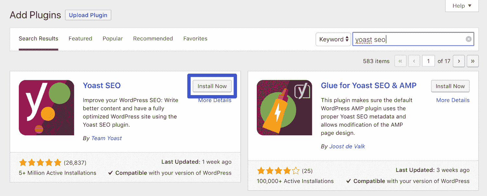

Installing the Yoast SEO plugin


接下来，你需要将这个代码片段添加到你的主题中:

```
 <?php
if ( function_exists('yoast_breadcrumb') ) {
  yoast_breadcrumb( '<p id="breadcrumbs">','</p>' );
}
?>
```

具体在哪里添加由你决定。如果你想在你的博客文章中使用面包屑，你可以把它添加到你的**single.php**模板文件中。

或者，把它粘贴在你的**header.php**文件的末尾，会给你的整个网站添加面包屑:

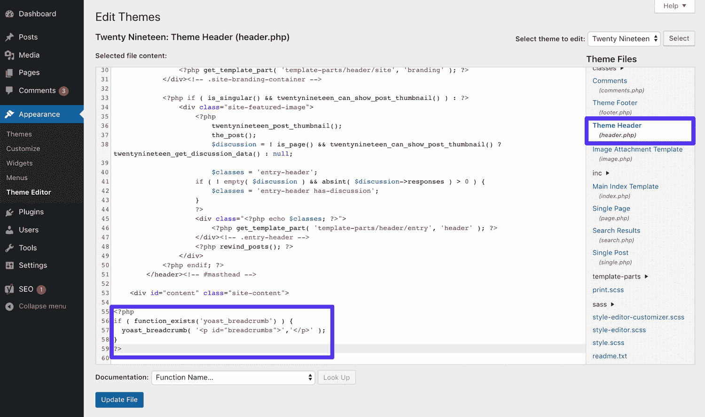

Adding the Yoast breadcrumb activation code


请记住，未来的主题更新可能会覆盖这个自定义代码。你需要联系你的主题开发者来获得如何避免这个问题的信息，或者简单地使用一个子主题。片段就绪后，在您的仪表板中导航到 **SEO >搜索外观>面包屑**:


The Yoast SEO breadcrumb settings


将**面包屑设置**开关切换到**启用。**然后，预览您的网站:

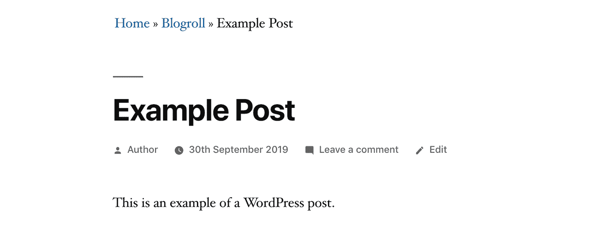

Live breadcrumbs added with Yoast SEO


现在，根据您添加代码片段的位置，您应该可以在站点的相关部分看到面包屑。


### 2.使用 WordPress 面包屑插件启用面包屑

如果您已经在使用 Yoast 插件进行 SEO，那么用 Yoast 添加面包屑会非常方便。然而，如果你更喜欢用不同的插件来优化你的内容，上面的方法就没那么有用了。幸运的是，有几个其他的插件是专门用来给 WordPress 添加面包屑的。

#### 面包屑导航文本

除了 Yoast 之外，向 WordPress 添加面包屑最流行的插件是 [Breadcrumb NavXT](https://wordpress.org/plugins/breadcrumb-navxt/) :


The Breadcrumb NavXT plugin


这个插件提供了一个面包屑窗口小部件，你可以把它添加到你的主题提供的任何窗口小部件区域，比如侧边栏或者页脚。它是高度可定制的，使你能够选择在踪迹中显示哪些页面和类别。Breadcrumbs NavXT 还包括用于改进 SEO 的模式标记。

要使用这个插件添加面包屑，导航到**外观>部件**。您将看到一个新的 **Breadcrumb NavXT** 小部件，您希望将它拖到您希望它出现的小部件区域:

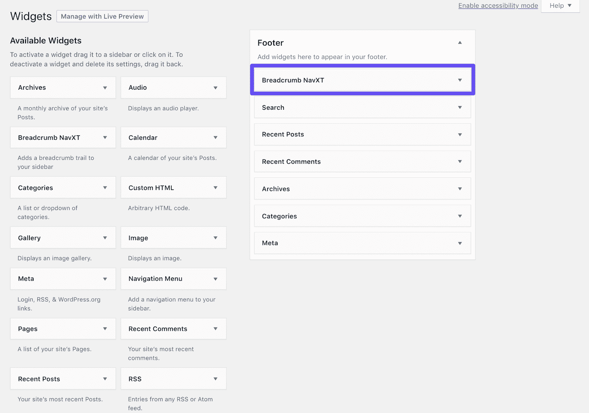

Adding the Breadcrumb NavXT widget to the footer area


单击下拉箭头打开小部件设置，然后填写必要的字段:

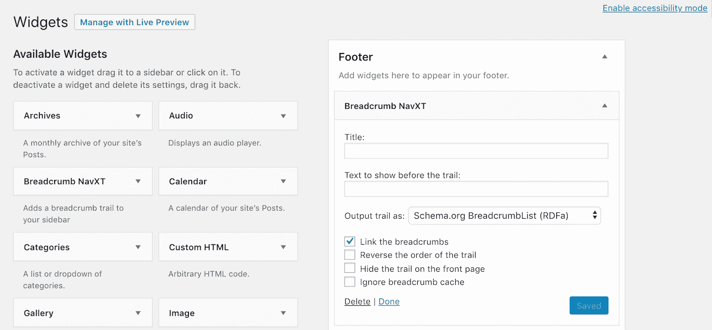

The Breadcrumb NavXT widget options


确保根据需要选择复选框，将链接添加到您的面包屑，确定它们的顺序，在首页隐藏它们，并忽略缓存。当你完成后，点击**保存**按钮，然后检查你的网站的前端:

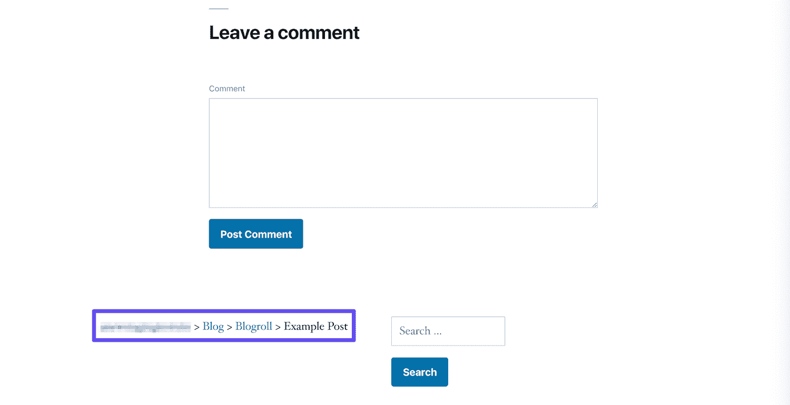

Breadcrumbs created with the Breadcrumb NavXT widget


您的面包屑现在应该在您为它们选择的小部件区域中可见。

#### 柔软的面包屑

另外， [Flexy Breadcrumb](https://wordpress.org/plugins/flexy-breadcrumb/) 是给 WordPress 添加面包屑评价最高的插件:


The Flexy Breadcrumb plugin


当这个插件被安装并激活后，你可以使用[flexy_breadcrumb]短代码将面包屑添加到你的站点中。这给了你更多的灵活性，你的踪迹会出现在哪里。你还可以对样式组件有更多的控制，比如字体大小、颜色和图标。

安装 Flexy Breadcrumbs 后，您将在 dashboard 侧栏中看到一个新项目:

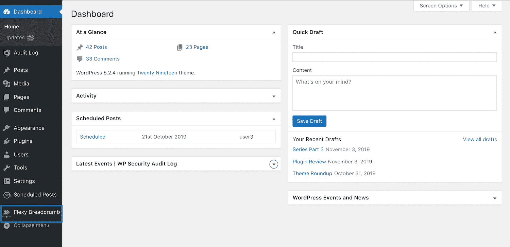

The Flexy Breadcrumb link in WordPress dashboard sidebar


然后，您需要配置一些设置。在 **General** 选项卡中，您可以更改主页的文本和图标，设置字符限制，并确定层级:

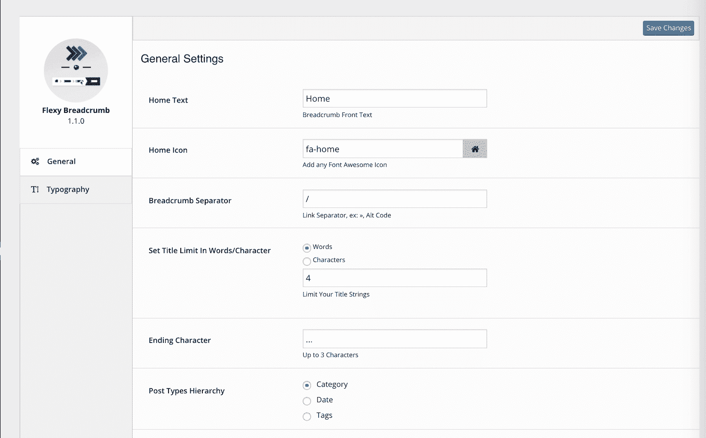

The Flexy Breadcrumb General settings


在**排版**选项卡中，您还可以调整面包屑的字体颜色和大小:

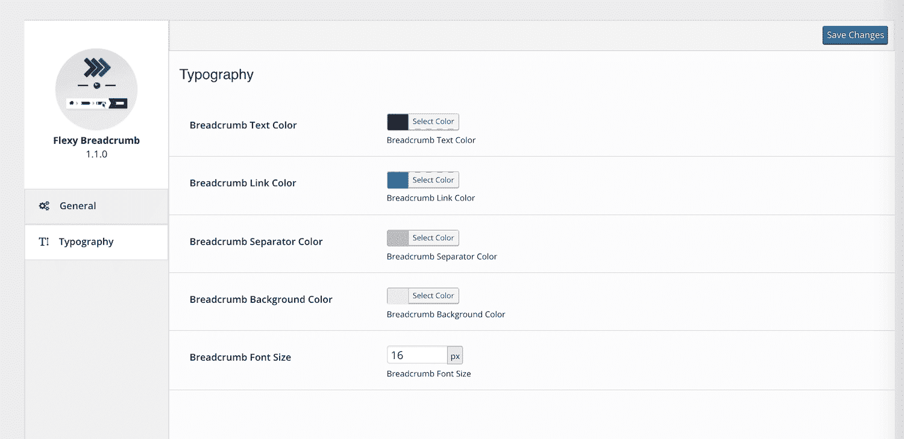

The Flexy Breadcrumb Typography settings


在您定制了您的踪迹之后，您将需要在您希望面包屑出现的任何地方添加[flexy_breadcrumb]短代码。虽然你可以在你网站上发布的每一篇文章中这样做，但是将短代码添加到一个 [WordPress 小部件](https://kinsta.com/blog/wordpress-widgets/)中会更有效:

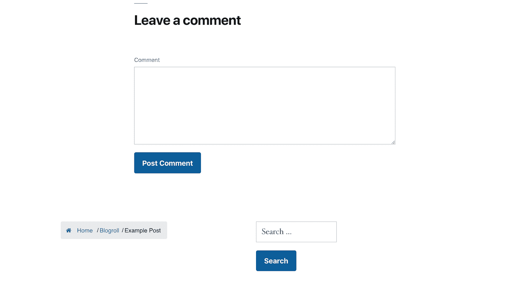

A Flexy Breadcrumb trail on the frontend


如果你检查你的网站的前端，你应该能够看到你的面包屑显示在你添加短代码的地方。

### WooCommerce 面包屑

对于在线零售商来说， [WooCommerce Breadcrumbs](https://wordpress.org/plugins/woocommerce-breadcrumbs/) 是一种向产品页面添加导航链接的简单方法:


The WooCommerce Breadcrumbs plugin


如果你用流行的 WooCommerce 插件运行你的在线商店，这可能是你最好的选择。它使您能够激活产品页面的面包屑，以改善网站上的客户导航。

安装和激活后，您可以导航到**设置> WC 面包屑**来定制您的面包屑轨迹:

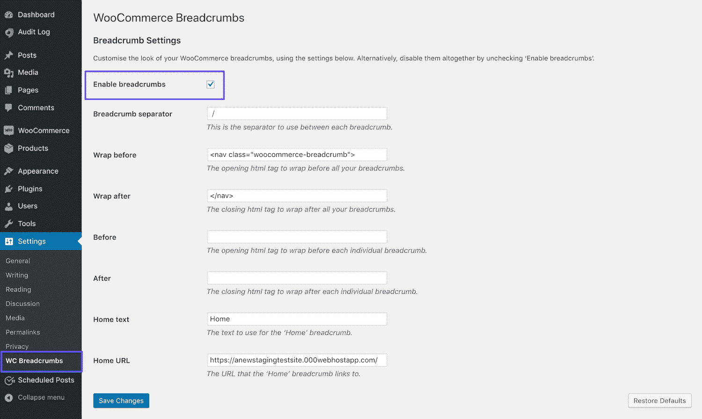

The WooCommerce Breadcrumbs settings page


要考虑的最重要的设置是**启用面包屑**复选框。你必须确保它被选中，才能显示你的面包屑。然后，查看您的产品页面:

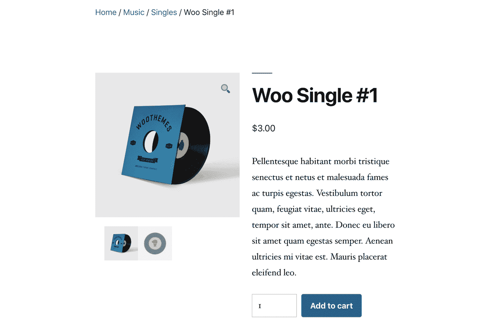

WooCommerce product page with breadcrumbs enabled


你的面包屑痕迹应该在页面顶部可见。

#### 面包屑

最后， [Breadcrumb](https://wordpress.org/plugins/breadcrumb/) 是一个轻量级插件，它使您能够使用短代码在站点的任何地方添加 Breadcrumb:

## 注册订阅时事通讯


### 想知道我们是怎么让流量增长超过 1000%的吗？

加入 20，000 多名获得我们每周时事通讯和内部消息的人的行列吧！

[Subscribe Now](#newsletter)


The Breadcrumb plugin


这个插件拥有本帖中列出的最广泛的设置。你可以通过点击 WordPress dashboard 侧边栏中的**面包屑**来访问它们:

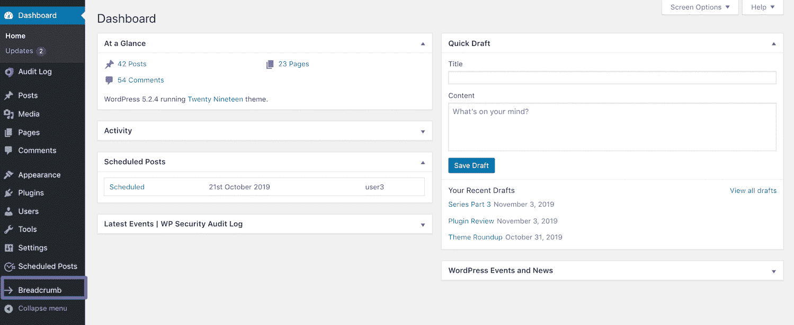

The Breadcrumb link in the WordPress dashboard sidebar


第一个选项卡标记为**选项**，包括一些常规设置，如自定义文本、分隔符和字符限制:

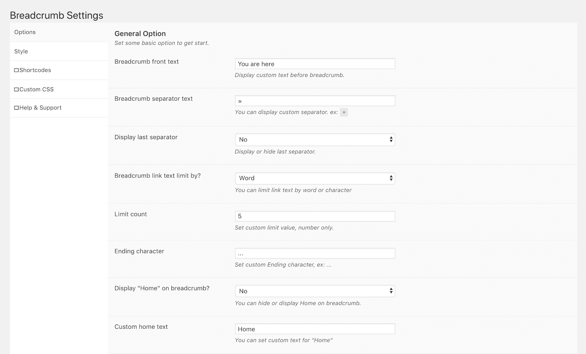

The Breadcrumb plugin settings page


还有一个专门用于样式选项的选项卡。有几个箭头按钮可供选择，还有字体大小和颜色:

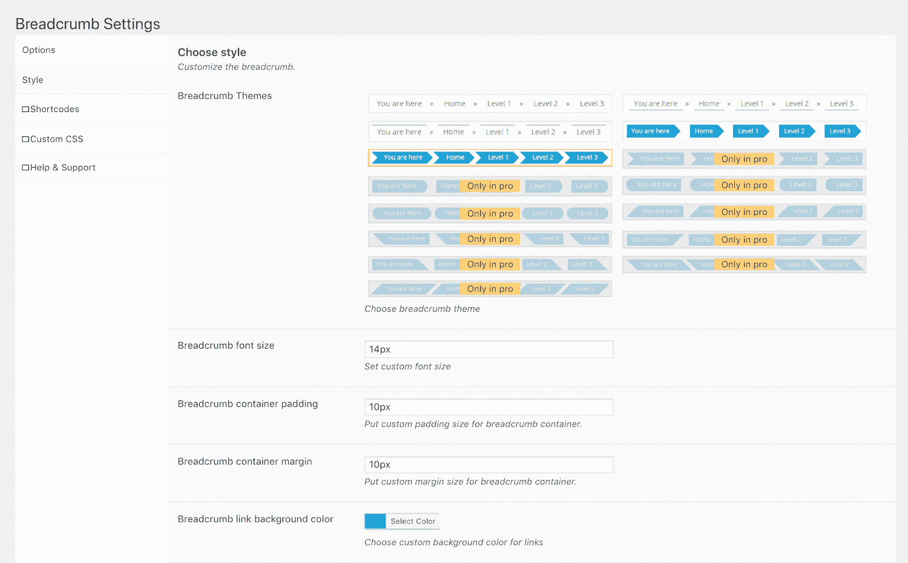

The Breadcrumb plugin styling options


如果你有一些编码技能并且想要更多的控制你的样式，你也可以使用**自定义 CSS** 标签:

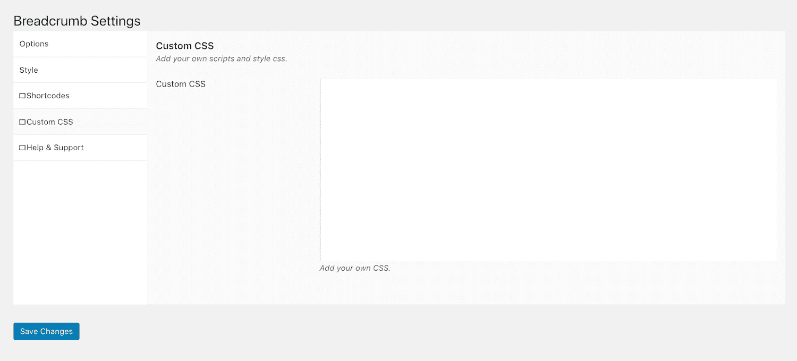

The Breadcrumb plugin Custom CSS field


最后，访问**短代码**标签以将你的面包屑添加到你的站点是很重要的:

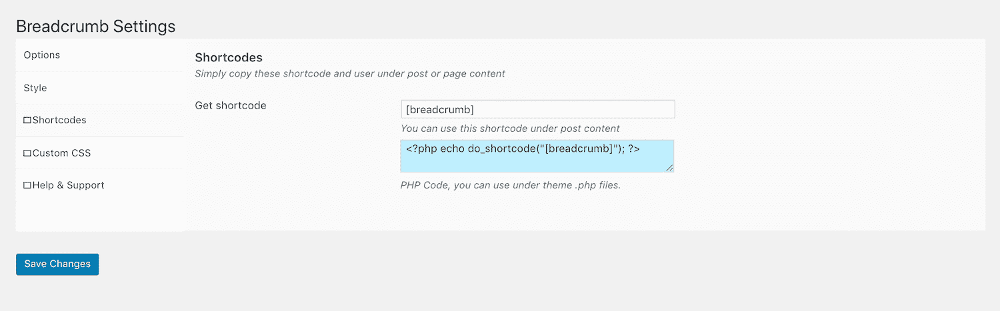

The Breadcrumb plugin shortcode and snippet options


你可以在你网站的任何地方使用这个短代码，就像我们讨论过的其他插件一样。然而，Breadcrumb 还提供了一个代码片段，您可以将它添加到一个模板文件中，以便在页眉、页脚或其他地方加入您的踪迹。

### 3.使用包含面包屑的主题

虽然 WordPress 主题通常被认为是控制你的网站的外观，但是它也会影响你网站的功能。一种方法是在你的页面上添加面包屑。

使用 WordPress 主题向现有的 WordPress 站点添加面包屑的缺点是，它还涉及到改变网站的外观。如果你有一个已建立的品牌和网站身份，这不是一个实际的解决方案，你可能会更好地利用一个插件。

然而，如果[你正在开始一个新的 WordPress 网站](https://kinsta.com/blog/why-use-wordpress/)或者正在执行一个网站重新设计，[选择一个包含面包屑的主题](https://kinsta.com/blog/how-to-install-a-wordpress-theme/#how-choose)是一个将它们添加到你的网站的省力方法。另外，在 [WordPress 主题目录](https://wordpress.org/themes/)中有几个免费选项。

### OceanWP

OceanWP 是最受欢迎的多用途 WordPress 主题之一:


The OceanWP theme


它包括一个短代码，您可以使用它轻松地将面包屑应用到您的页面。还有几个结合了面包屑的演示可用于 OceanWP。要使用短代码，只需将[oceanwp_breadcrumb]添加到帖子、页面或文本小部件中:

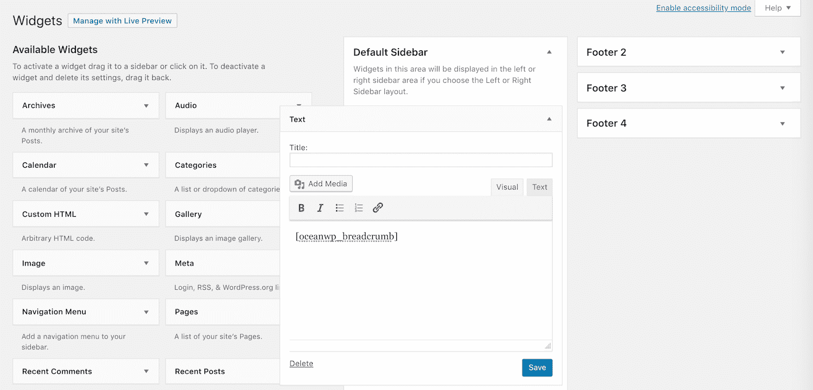

Adding the OceanWP breadcrumbs shortcode to a text widget


您可以使用以下参数自定义面包屑:

*   Class:包含一个自定义 CSS 类。
*   颜色:更改文本的颜色。
*   悬停颜色:当用户悬停在你的面包屑上时改变文本的颜色。

只需在短代码括号中添加任意或所有这些参数:

与宕机和 WordPress 问题做斗争？Kinsta 是一款考虑到性能和安全性的托管解决方案！[查看我们的计划](https://kinsta.com/plans/?in-article-cta)

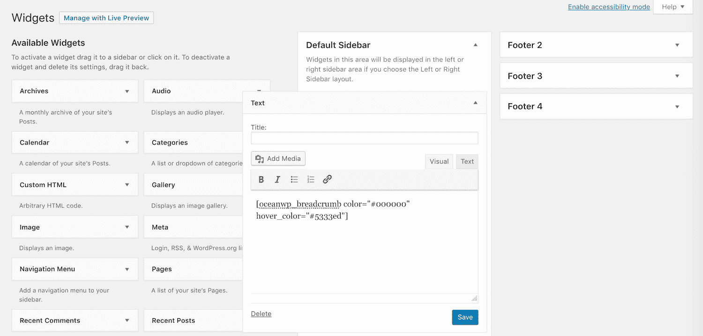

Customizing OceanWP breadcrumbs with shortcode parameters


现在，您应该可以在相关页面上看到您的面包屑。

### 阿斯特拉

同样地， [Astra](https://wordpress.org/themes/astra/) 也使得向你的网站添加面包屑变得容易:


The Astra theme


用 Astra 启用面包屑最直接的方法是通过定制器。安装并激活主题后，导航至**外观>定制**:

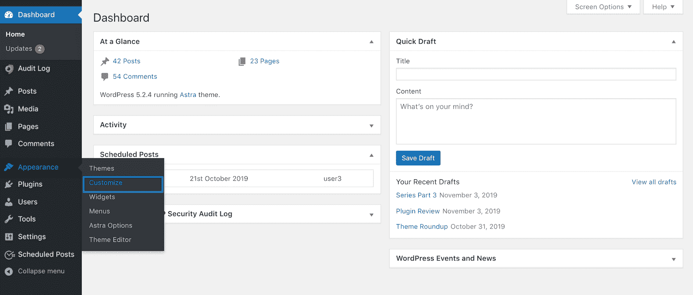

Accessing the Customizer from the WordPress dashboard


然后，选择**面包屑**标签:

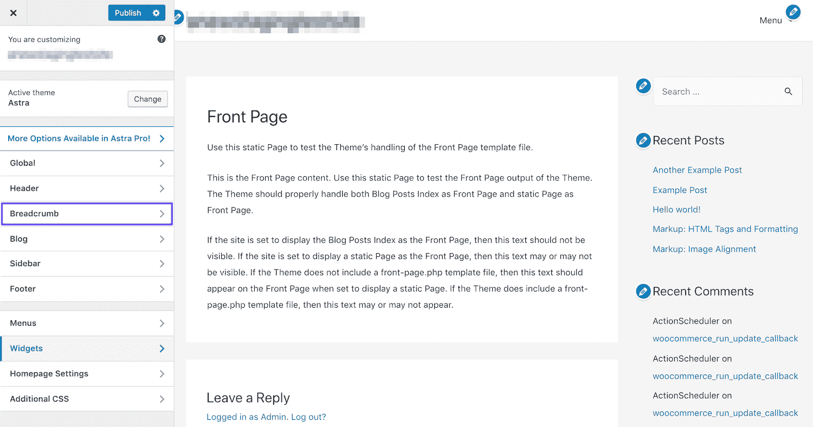

The Astra breadcrumbs tab in the Customizer


在这里，您将看到一个下拉菜单，允许您选择要在页面上显示面包屑的位置:

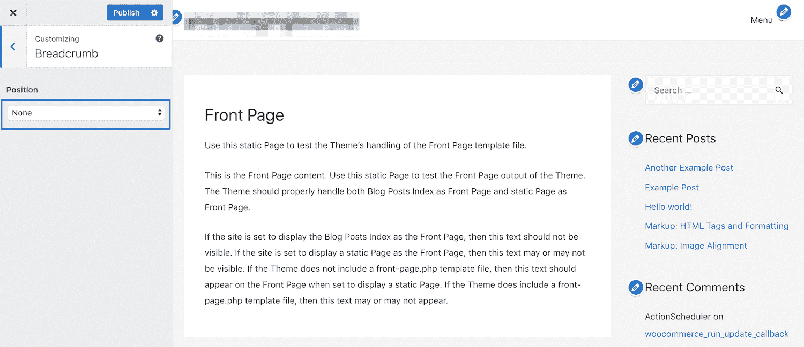

Selecting the breadcrumb position for the Astra theme


做出选择后，一些样式选项也会出现:

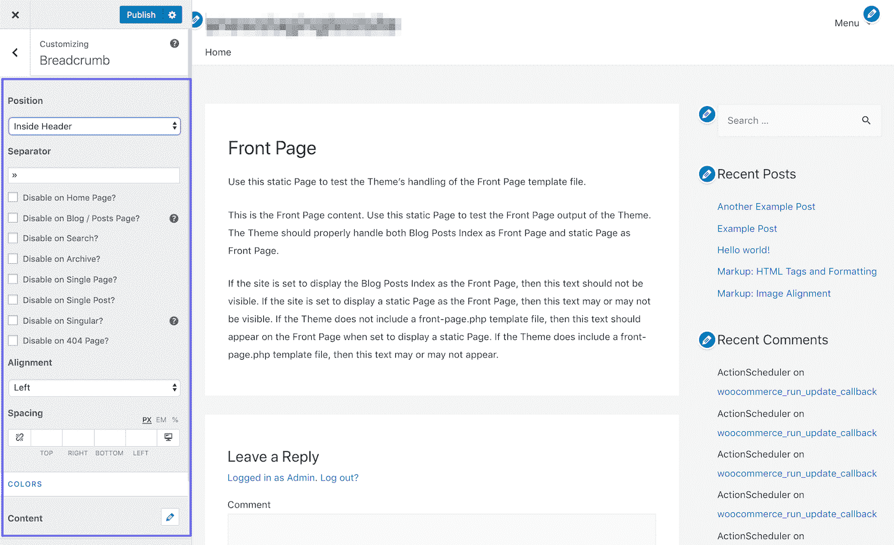

The Astra breadcrumb styling options in the Customizer


确保点击定制器**发布**按钮保存您的更改。

### 4.手动添加面包屑

插件和主题是让 WordPress 成为一个用户友好且易于访问的平台的部分原因。然而，对于一些更高级的用户和开发人员来说，他们可能会感到受到限制。代码可以是一种非常有创造性的媒介，拥有自由编写自己的面包屑的能力可能会吸引你。

要手动显示面包屑，您需要做两件事。首先，你必须给你的**functions.php**文件添加一个函数来启用它们。这里有一个[你可能会用到的代码的例子](https://www.codexworld.com/wordpress-how-to-display-breadcrumb-without-plugin/):

```
 function get_breadcrumb() {
	echo ‘<a href="”’.home_url().’”" rel="”nofollow”">Home</a>’;
	if (is_category() || is_single()){
		echo “  »  ”;
		the_category (‘ • ‘);
			if (is_single()) {
				echo “  »  ”;
				the_title();
			}
} elseif (is_page()) {
		echo “  »  ”;
		echo the_title();
	} elseif (is_search()) {
		echo “  »  ”;Search Results for…
		echo ‘“<em>’;
		echo the_search_query();
		echo ‘</em>”’;
	}
} 
```

一旦添加了该函数，您将需要在您希望面包屑出现的模板文件中调用它。调用**single.php**中的函数会让面包屑出现在你的帖子上，调用**header.php**中的函数会在你的标题出现的任何地方显示面包屑，等等。

您将使用的代码应该如下所示:

```
 <div class="breadcrumb"><?php get_breadcrumb(); ?></div> 
```

修改这些文件将会在你的站点上显示面包屑，但是不能让你设置它们的样式来匹配它的设计。为此，您还需要接触一些 CSS。


## 如何设计你的 WordPress 面包屑

如果你自己编码的话，设计面包屑的样式是必要的。然而，如果你使用一个插件或者一个主题来添加它们，这也会很有帮助。这些工具提供的默认样式可能不太适合您的站点，在这种情况下，您可能需要调整它们以保持一致性。

您可以[添加自定义 CSS](https://kinsta.com/knowledgebase/edit-wordpress-code/) 来在您的主题样式表(style.css)或定制器的附加 CSS 区域中设置您的面包屑样式:

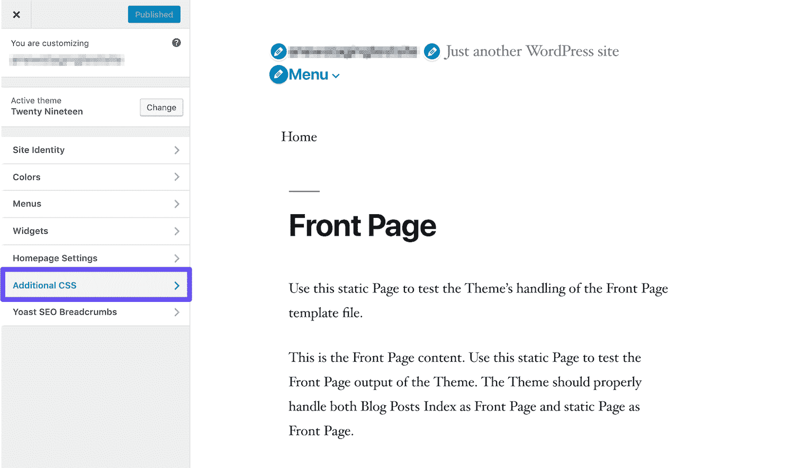

Incorporating additional CSS to style breadcrumbs via the Customizer


有很多方法可以让你的面包屑与你的网站设计相匹配，比如调整它们的字体、大小和颜色。您还可以考虑诸如边距、填充、边框和图标等元素。

下面是一些可以用来设计面包屑样式的 CSS 示例:

```
 .breadcrumb {
	padding: 8px 15px;
	margin-bottom: 20px;
	list-style: none;
	background-color: #f5f5f5;
	border-radius: 4px;
}
.breadcrumb a {
	color: #428bca;
	text-decoration: none;
} 
```

说到 CSS 有[多种可能性。所以可能需要做一些实验来让你的面包屑看起来完全符合你的要求。](https://kinsta.com/blog/wordpress-css/)

## 如何从你的网站中移除 WordPress 面包屑

尽管在你的网站上添加面包屑有很多好处，但这并不意味着它们适合所有人。有些人可能会觉得它们令人困惑，或者觉得它们使网站的页面过于混乱。

如果你想从你的 WordPress 站点上移除面包屑，你可以根据你最初添加它们的方式使用任何有意义的方法。例如，如果您定制了面包屑，您可以简单地从您的主题文件中删除您添加的代码。

禁用用插件添加的面包屑通常和停用插件一样简单。在 Yoast SEO 的情况下，您可以在**搜索外观**设置中导航到**面包屑**标签，并将相关开关切换到**禁用**。

这同样适用于通过设置或 [WordPress shortcodes](https://kinsta.com/blog/wordpress-shortcodes/) 启用面包屑的主题。但是，有些主题会默认添加面包屑。移除这些可能有点棘手，尤其是如果您对代码不是很有经验的话。

如果这是你的情况，你需要导航到你站点的**header.php**文件。在那里，运行“breadcrumb”的搜索命令。这应该会突出显示调用将面包屑添加到您的站点的函数的代码(如果这里存在的话):

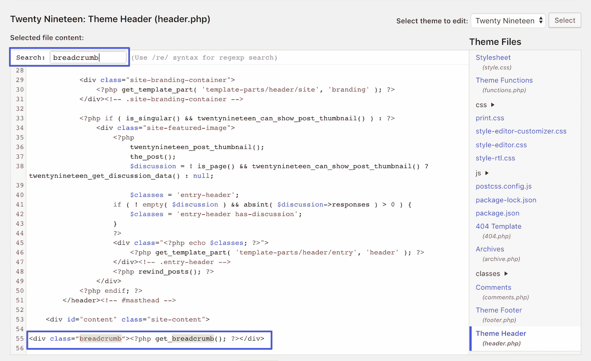

Finding breadcrumbs code in the theme header template file


删除这一行代码，从您的网站中删除面包屑。如果你没有找到正确的代码，你可以在你的**single.php**和**page.php**文件中再次尝试这个过程，看看这个函数是否在那些模板中被调用。

如果其他都失败了，联系你的[主题的开发者](https://kinsta.com/blog/hire-wordpress-developer/)寻求支持。请注意，[更新你的 WordPress 主题](https://kinsta.com/blog/how-to-update-wordpress-theme/)可能会覆盖你对其文件所做的任何更改。这就是为什么最佳实践建议使用[子主题](https://kinsta.com/blog/wordpress-child-theme/)的原因，以便无限期地保存您的定制。

[Breadcrumbs are teeny-tiny elements with an enormous impact on your UX and SEO. Learn how to add them to your #WordPress site with this guide! 🍞👣Click to Tweet](https://twitter.com/intent/tweet?url=https%3A%2F%2Fkinsta.com%2Fblog%2Fwordpress-breadcrumbs%2F&via=kinsta&text=Breadcrumbs+are+teeny-tiny+elements+with+an+enormous+impact+on+your+UX+and+SEO.+Learn+how+to+add+them+to+your+%23WordPress+site+with+this+guide%21+%F0%9F%8D%9E%F0%9F%91%A3&hashtags=seo%2Cux)

## 摘要

强大的 UX 和搜索引擎优化都是成功网站的关键。启用 WordPress breadcrumbs 可以让访问者更容易地浏览你的网站，同时也有助于搜索引擎理解它的结构并准确地索引你的页面。

在这篇文章中，我们介绍了四种向你的 WordPress 站点添加面包屑的方法:

1.  在 [Yoast SEO](https://wordpress.org/plugins/wordpress-seo/) 中打开面包屑。
2.  安装并配置一个 WordPress breadcrumbs 插件。
3.  使用包含面包屑的主题。
4.  使用代码手动添加面包屑。

你对 WordPress breadcrumbs 或者如何使用它们有什么问题吗？请在下面的评论区告诉我们！

* * *

让你所有的[应用程序](https://kinsta.com/application-hosting/)、[数据库](https://kinsta.com/database-hosting/)和 [WordPress 网站](https://kinsta.com/wordpress-hosting/)在线并在一个屋檐下。我们功能丰富的高性能云平台包括:

*   在 MyKinsta 仪表盘中轻松设置和管理
*   24/7 专家支持
*   最好的谷歌云平台硬件和网络，由 Kubernetes 提供最大的可扩展性
*   面向速度和安全性的企业级 Cloudflare 集成
*   全球受众覆盖全球多达 35 个数据中心和 275 多个 pop

在第一个月使用托管的[应用程序或托管](https://kinsta.com/application-hosting/)的[数据库，您可以享受 20 美元的优惠，亲自测试一下。探索我们的](https://kinsta.com/database-hosting/)[计划](https://kinsta.com/plans/)或[与销售人员交谈](https://kinsta.com/contact-us/)以找到最适合您的方式。