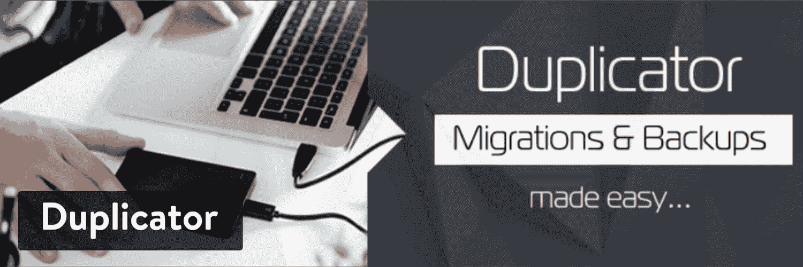
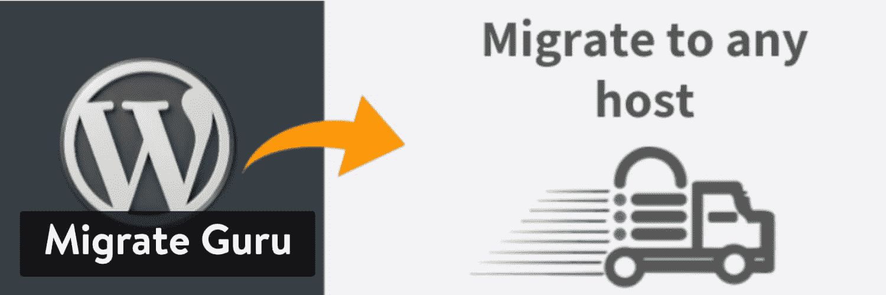
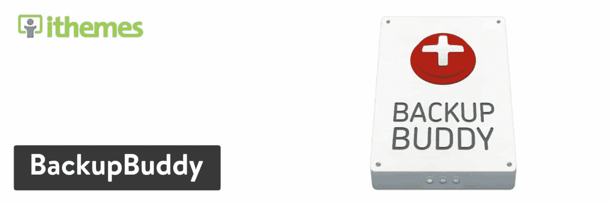
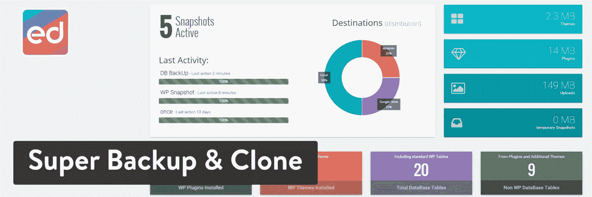
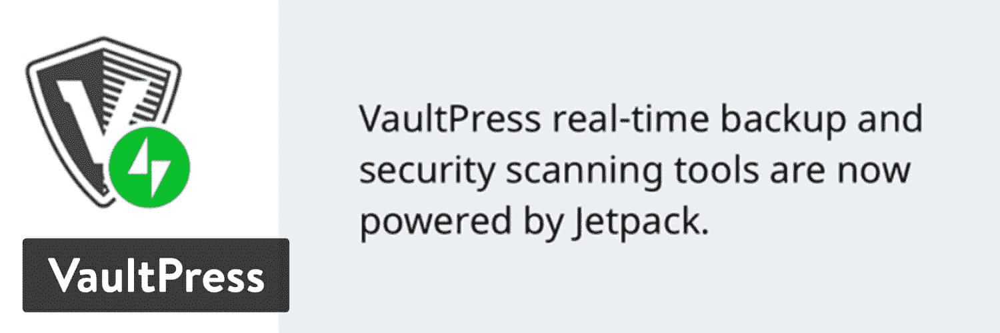
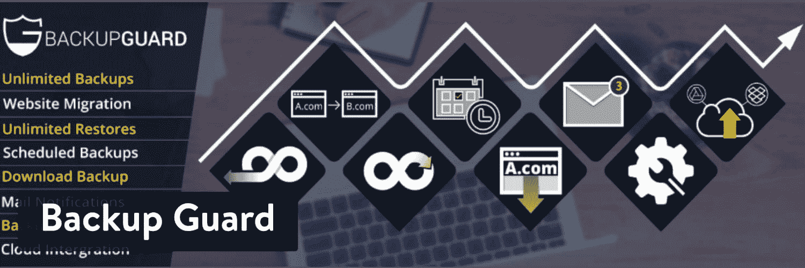

# 9 个强大的 WordPress 迁移插件(2022 年安全迁移你的网站)

> 原文：<https://kinsta.com/blog/wordpress-migration-plugins/>

你是不是该和现在的托管公司分手了？有时你可能会发现你已经超越了你的主机，或者客户支持没有那么好。其他时候，它与性能问题或缺乏特性有关。不管是什么问题，总有一天你可能需要[转移到另一个主机](https://kinsta.com/wordpress-migration/)。这就是为什么我们覆盖了市场上最好的 WordPress 迁移插件来[迁移你的 WordPress 站点](https://kinsta.com/blog/migrate-wordpress-site/)。

这些插件下载并传输你所有的站点文件，从表格到[媒体文件](https://kinsta.com/knowledgebase/bulk-upload-files-wordpress-media-library-ftp/)，从[主题](https://kinsta.com/blog/how-to-install-a-wordpress-theme/)到你整个[用户数据库](https://kinsta.com/knowledgebase/wordpress-export-users/)。如果没有快速迁移工具，您可能很难克隆网站，使其显示和运行与以前完全一样。

最好的 WordPress 迁移插件提供了漂亮的界面，一键迁移按钮，以及其他用于备份和移动文件的工具。

## 与您的主机一起免费迁移

有时你不需要迁移插件，这取决于你的主机。例如，在 Kinsta，我们为所有的计划提供[免费 WordPress 迁移](https://kinsta.com/wordpress-migration/)。这样，你就减少了网站上插件的数量，而且你也不必担心自己要完成迁移。

只需与 Kinsta 代表沟通，即可从旧主机上转移所有文件，完成免费迁移。

## 你的迁移插件会导致性能问题吗？

WordPress 插件的一个缺点是它们中的一些会导致[与其他插件或主题](https://kinsta.com/knowledgebase/the-site-is-experiencing-technical-difficulties/#step-2-troubleshoot-for-a-plugin-or-theme-conflict)冲突。此外，一些插件为你的主机服务器制造了[性能问题](https://kinsta.com/blog/debugging-wordpress-performance/)。

迁移插件通常是罪魁祸首，因为它们处理站点文件。因此，您必须记住，您可能无法使用我们下面讨论的所有迁移插件。检查你的主机以确保你的插件是兼容的。

举个例子，Kinsta hosting 有一个被禁插件列表,因为它们会在我们的服务器上产生问题。
T3】

## 最佳 WordPress 迁移插件(测试和评论)

话虽如此，我们已经测试了最好的迁移插件，并发现以下插件在功能、接口和价格方面最有用:

 现在我们已经了解了迁移文件是如何工作的，以及在这个过程中你可能会遇到的一些冲突，请继续阅读，了解更多关于我们最喜欢的 WordPress 迁移插件的信息。

### 1.复印机(目前与 Kinsta 不兼容)

到目前为止，Duplicator 是将 WordPress 站点文件迁移到新位置的最流行的插件之一。该插件包含的一些选项包括复制、移动和克隆，以及整个网站的传统迁移。这确实是一个在本地机器上备份文件的绝妙解决方案，尤其是考虑到只需点击一下就可以选择你想要下载的项目。

之后，Duplicator 有几个简单的步骤将所有这些文件转移到一个新的服务器/主机上。您甚至可以将一个活动的站点放到本地环境中进行进一步开发。备份也是等式的一部分，手动和自动选项可确保您的文件始终安全。

Duplicator WordPress plugin

随着功能的升级，主题重用，并删除混乱的进口/出口，Duplicator 站在一个最好的迁移和备份插件的所有技能水平。

许多主要功能都包含在免费插件中，但是你可以选择升级以获得更多功能。例如，高级计划中包括计划备份，以及云存储和电子邮件通知。我们也喜欢多站点迁移选项。Duplicator Pro 有一个 59 美元的个人许可证。这将为您提供三个站点许可证。如果您需要更多网站的支持，您也可以支付更多费用。

最后，我们有一个关于如何使用复制插件迁移你的网站的深入教程。请随意阅读本指南，快速轻松地完成过渡过程。

#### 使复印机成为最佳选择的特性:

*   Duplicator 有免费版和高级版，这两个版本对于不同的技能水平都非常有用。
*   使用 Duplicator，您可以做的不只是迁移。它还提供了移动和克隆的功能。
*   它是最好的插件之一，可以很容易地将一个现场直播的网站下载到本地环境中。
*   只需点击几下，WordPress 的传输就完成了。这是目前最简单的迁移工具。
*   这取决于您的版本，但 Duplicator 包括手动和定期备份，以保护您的网站内容。
*   站点复制也是可能的，无论是一个正在运行的站点还是一个正在开发的站点。
*   不需要担心复杂的导入和导出脚本。只需点击几个按钮，您的整个站点就会迁移。
*   高级版在一些最受欢迎的第三方选项上有云存储，如 Google Drive、Dropbox 和亚马逊 S3。
*   您可以配置电子邮件通知。
*   Duplicator Pro 为多站点迁移提供了难以置信的支持。实际上，只需点击几下，您就可以移动整个多站点网络。

#### 谁应该考虑这个 WordPress 迁移插件？

每个人都应该考虑 Duplicator，因为它是移动或复制 WordPress 网站的最快和最容易的插件之一。至于具体的个人，我们喜欢复印机，为那些谁想要云存储或移动一个多站点网络没有任何麻烦。

### 2.迁移大师

在多站点和文件大小方面，Migrate Guru 比竞争对手有一些优势。该插件设法简化迁移过程，即使您有一个大型多站点网络。此外，大小不超过 200 GB 的站点是可转让的。

该插件提供了所谓的真正的一键式集成。这使得它成为将网站转移到其他服务器的快速解决方案之一。更重要的是，所有的网站传输都是在 Migrate Guru 服务器上管理的。这意味着你不必担心迁移会给你的网站带来太大的压力，甚至会使网站崩溃。

Migrate Guru WordPress plugin

Migrate Guru 不需要您自己的服务器提供任何存储空间或能源。这是一个整洁、简单的过程，如果你的站点太大或者文件太多，你就不用担心了。不需要附加组件，而且似乎几乎每个网络主机都能够支持 Migrate Guru 插件。

一个限制是 Migrate Guru 没有任何备份站点的特性，而这些特性通常包含在迁移工具中。话虽如此，整个 Migrate Guru 插件是完全免费的，没有任何升级或 pro 版本。

#### 使 Migrate Guru 成为最佳选择的特性:

*   迁移大师对所有用户都是免费的。
*   所有迁移都在 Migrate Guru 服务器上完成。这意味着在迁移过程中，您的网站崩溃的可能性极小。
*   这绝对是一个更快的迁移插件，因为你可以在 30 分钟内克隆一个 1GB 的站点。
*   Migrate Guru 是一个真正的一键式迁移插件，这意味着您所有的迁移只需要您点击迁移按钮。
*   插件包含了自动搜索和替换功能。
*   迁移发生时会发出警报。这样做是为了警告您是否有问题，或者只是告诉您移动需要多长时间。
*   该插件支持全球超过 5000 台主机。考虑到许多主机不能使用一些迁移插件，这很好。
*   这是移动整个多站点网络的一种更简单的迁移工具。

#### 谁应该考虑这个 WordPress 迁移插件？

Migrate Guru 对那些拥有大型网站的人来说最有意义。使用 Migrate Guru，迁移过程会更快，而且您永远不用担心迁移是否会使您的网站崩溃。此外，不需要存储空间，这使得在您自己的服务器上更容易。

也是 Kinsta 用户的绝佳选择。看看[如何在迁移大师](https://kinsta.com/help/migrate-guru/)的帮助下将你的 WordPress 站点迁移到 Kinsta。

### 3.WP 迁移(以前的 WP 迁移数据库)

WP Migrate 在 2.3 版本发布后从 [WP Migrate DB](https://wordpress.org/plugins/wp-migrate-db/) 重新命名，它有一个更复杂的迁移站点的解决方案，但对于那些想要更多控制迁移如何进行的人来说，这是一个很好的选择。简而言之，WP Migrate 为许多高级用户提供了帮助。

核心插件完成一个 [MySQL](https://kinsta.com/knowledgebase/what-is-mysql/) 数据转储，[导出你的网站数据库](https://kinsta.com/knowledgebase/export-wordpress-site/#manually-phpMyAdmin-SFTP)。该插件通过替换文件路径和 URL 以及管理序列化数据来为您完成大部分工作。在这个过程的最后，您会在您的计算机上得到一个 SQL 文件。

为了进行迁移，您需要利用 [phpMyAdmin](https://kinsta.com/help/wordpress-phpmyadmin/) 将 SQL 文件导入到正确的数据库中。这些步骤确保开发者有一个好的方法来根据他们自己的需要来回移动本地和活动站点。

WP Migrate WordPress plugin (previously WP Migrate DB)

到目前为止，我们讨论的所有内容都可以在免费插件中获得。如果你愿意，139 美元可以让你进入高级插件。这允许四个活动站点和一个用户。

升级后，您不仅可以获得高级电子邮件支持，还可以获得广泛的功能，这些功能对于在两个站点之间提取数据库和同步媒体至关重要。我们最喜欢的一些工具包括排除帖子类型、从多站点迁移到单个站点的能力，以及暂停和取消迁移的选项。

总的来说，高级版为你提供了一个更加用户友好的迁移插件，一些很酷的特性让事情变得更简单。

#### 使 WP 迁移成为最佳选择的特性:

*   它为开发者提供了一种下载完整数据库并将其转移到其他地方的可靠方法。
*   对于大多数想要下载文件并将其迁移到其他服务器的开发人员来说，免费版本已经足够了。
*   所有文件路径、URL 路径和序列化数据都在后台处理。然后插件会提供一个完整的 SQL 文件供您下载。
*   专业版可以让你拉或推数据库。
*   WP Migrate 被认为是更安全的迁移插件之一。
*   您可以选择在两个网站之间同步整个媒体库。这一点以及以下大多数功能都包含在高级版中。
*   WP Migrate 有一个独特的功能，可以将一个站点从[多站点网络](https://kinsta.com/blog/wordpress-multisite/)移动到单个站点。这也可以反过来。
*   您可以选择排除某些文章类型。
*   WP Migrate 允许您选择要迁移的表。决定移动你所有的桌子，或者选择最重要的桌子。

#### 谁应该考虑这个 WordPress 迁移插件？

开发者最有可能使用 WP Migrate 插件。这样做的原因是，在选择特定的迁移项目(如表)时，您可以获得更大的灵活性。此外，您可以将一个站点从几乎任何环境迁移到另一个环境。所有这些都是通过 SQL 文件下载完成的，这对于初学者来说通常有点复杂。

### 4.多合一 WP 迁移(目前与 Kinsta 不兼容)

名单上的下一个是[一体式 WP 迁移](https://wordpress.org/plugins/all-in-one-wp-migration/)插件，它拥有令人印象深刻的追随者，拥有数百万的安装量和数千的好评和评论。这个插件的全部目的是下载你的 WordPress 文件，而不需要任何技术知识。

多合一 WP 迁移的有趣之处在于它提供了一个拖放界面，可以将你的站点上传到一个新的位置，这是一个非常棒的界面。在导出过程中可以使用查找和替换选项，它还可以修复序列化的任何问题。

All-in-One WP Migration WordPress plugin

当谈到与托管公司合作时，一体化 WP 迁移开发人员已经做了一些很好的工作。这样，你通常不必考虑是否会发生冲突或[性能问题](https://kinsta.com/blog/wordpress-performance-new-relic/)。

更重要的是，这个插件很好地绕过了 WordPress 上的一些上传大小限制。它通过分块迁移你的站点来做到这一点，把所有的块都保持在 2MB 以下。一体式 WP 迁移是开源软件，但一个高级插件的价格是 69 美元/生命周期。

高级版中的附加功能包括排除文件、恢复备份和使用 [WP CLI 命令](https://kinsta.com/blog/wp-cli/)的选项。

#### 使一体化 WP 迁移成为最佳选择的功能:

*   一体式 WP 迁移提供了一个免费插件，包含下载网站和上传到其他位置所需的所有基本功能。
*   完成转移不需要任何技术知识。事实上，上传部分包含了一个简单的拖放界面。
*   提供了无限的查找和替换以及序列化解决方案。
*   插件有一个很长的主机提供商列表，插件可以很好地与之合作。
*   你可以上传更大的网站，因为插件上传你的网站，超越了保持整个文件在一定大小的需要。
*   较大的站点可以选择上传到 premium，这将为您提供客户支持以及排除文件和恢复备份的选项。
*   数十个扩展可用于链接到第三方云存储服务。其中包括 OneDrive、Dropbox、 [Google Drive](https://kinsta.com/blog/google-workspace/#google-drive) 。

#### 谁应该考虑这个 WordPress 迁移插件？

一体式 WP 迁移适用于想要干净、拖放式界面的初学者。对于那些只想从头到尾都有一个简单过程的人来说，这也很好。你不必担心文件大小的问题。不用担心托管问题。你不必担心上传一个复杂的文件。

## 注册订阅时事通讯

### 想知道我们是怎么让流量增长超过 1000%的吗？

加入 20，000 多名获得我们每周时事通讯和内部消息的人的行列吧！

[Subscribe Now](#newsletter)

### 5.UpdraftPlus

[UpdraftPlus](https://wordpress.org/plugins/updraftplus/) 主要用作备份工具。但是还可以做更多的事情:它不仅能够将文件恢复到新的位置，而且简化了整个过程。例如，它只需要你点击一下[按钮来备份你的站点文件](https://kinsta.com/help/wordpress-backups/)。之后，可以在同一站点或其他地方进行恢复。而且都是一键完成的。

UpdraftPlus 对迁移有吸引力的原因是，它在 Dropbox 和 Google Drive 等云存储服务的帮助下完成了最快的备份之一。

UpdraftPlus WordPress plugins

使用 UpdraftPlus 可以实现自动备份计划。免费版本中提供了此标准备份过程。升级到特优解决方案提供了更多的功能，如增量备份、复制和快速迁移。

您还可以访问更多云存储选项，如 Azure 和 OneDrive。两个许可证的 UpdraftPlus Premium 标价为 70 美元。你可以花 95 美元升级到 10 个许可证，然后继续升级。网站上出售诸如更平滑的迁移和多个存储目的地之类的插件。

#### 使 UpdraftPlus 成为最佳选择的功能:

*   UpdraftPlus 为您的所有网站创建快速安全的备份。这些都是在核心插件中免费完成的。
*   该插件既备份又恢复。还可以手动或利用网站上的一键迁移扩展将文件移动到其他位置。
*   UpdraftPlus 拥有最长的云集成列表之一。其中包括 [Rackspace](https://kinsta.com/rackspace-alternative/) Cloud、Openstack Swift 和微软 OneDrive。
*   该插件的免费版本有自动备份，这通常不是迁移和备份插件的情况。
*   增量备份是可能的。您可以备份和迁移多站点网络。你可以将非 WordPress 文件转移到其他服务器上。
*   迁移扩展有助于克隆和将文件从本地移动到实时环境。

#### 谁应该考虑这个 WordPress 迁移插件？

首先，UpdraftPlus 是一个备份插件。但是，如果您愿意为 Migrator 扩展付费，这是一种经济实惠的方式。因此，我们向那些希望获得最佳备份的人推荐 UpdraftPlus，它还提供了迁移网站的选项。

### 6.BackupBuddy(目前与 Kinsta 不兼容)

[BackupBuddy](https://ithemes.com/backupbuddy/) 有能力备份你的 [WordPress 网站](https://kinsta.com/blog/wordpress-site-examples/)，[恢复文件](https://kinsta.com/blog/restore-wordpress-from-backup/)，并将其移动到一个完全不同的位置。这个备份和迁移插件是由 iThemes 的人开发的，自从发布以来，它已经被安装在超过 50 万个网站上。

与 UpdraftPlus 类似，BackupBuddy 主要用作备份和保护站点文件的一种方式。因此，你可以安装它来恢复你的旧文件，以防你删除文件、[被黑、](https://kinsta.com/blog/wordpress-hacked/)或遇到用户错误。

BackupBuddy WordPress plugin

话虽如此，您下载的所有文件都可以迁移到另一个位置。最简单的方法是，你可以通过使用 Google Drive、 [Dropbox](https://kinsta.com/blog/best-tools-for-freelancers/#3-dropbox) 或亚马逊 S3 远程存储备份文件。然后，ImportBuddy 集成确保您的所有文件都在同一个站点上恢复或迁移到其他地方。

BackupBuddy 确实有一个专用的迁移功能，允许您更改主机和服务器。你也可以一步调整域名和替换网址。还为开发人员提供了克隆，以及一个工具，用于从登台站点推送或拉出。

BackupBuddy 没有免费版本，但是 52 美元可以让你在一个网站上实现这个插件。83 美元的计划适用于 10 个网站，130 美元的计划适用于无限量的网站。

#### 使 BackupBuddy 成为最佳选择的功能:

*   BackupBuddy 只作为高级备份和迁移插件出售。因此，你会得到更好的客户支持，因为你是付费的。
*   该插件提供了在临时网站和直播网站之间推送和拉取内容的多种选择。
*   你可以点击一个按钮来克隆你的 WordPress 站点。
*   在临时域上构建任何站点，然后使用 BackupBuddy 将该站点迁移到活动域。
*   BackupBuddy 的迁移部分有出色的 URL 替换、[域名更改](https://kinsta.com/blog/wordpress-change-domain/)和主机交换，所有这些都在后台为你完成。
*   该插件提供的不仅仅是迁移功能。例如，您可以通过序列化数据、[恶意软件](https://kinsta.com/blog/types-of-malware/)扫描和备份来获得站点保护。
*   当您需要恢复文件或将文件移动到其他服务器时，备份非常有用。备份的一些功能包括电子邮件通知、定时备份和远程存储。

#### 谁应该考虑这个 WordPress 迁移插件？

对于那些想要全套保护、迁移和备份工具的人，我们喜欢 BackupBuddy。这个插件减少了你的站点需要的插件数量，并且你总是知道站点文件是受保护的。此外，您可以根据需要随时移动文件。

厌倦了 WordPress 的问题和缓慢的主机？我们提供世界一流的支持，由 WordPress 专家提供 24/7 服务和超快的服务器。[查看我们的计划](https://kinsta.com/plans/?in-article-cta)

### 7.超级备份和克隆

超级备份&克隆插件是你可以在 WordPress 插件目录中找到的移植插件的替代解决方案。这里有一个只在 CodeCanyon 上出售的插件。目前的价格是 35 美元，你可以享受 6 个月的高级客户支持。之后，您可以选择支付额外的支持。

顾名思义，这个插件可以帮助备份、克隆和迁移。它链接到第三方云服务，如亚马逊 S3、Google Drive 和 Rackspace。您可以创建网站的快照，并随时恢复这些文件。

Super Backup & Clone WordPress plugin

计划备份是可能的，你甚至可以设置他们自动下载备份。自定义迁移意味着您可以根据站点的大小和文件的去向来调整设置。

除了上述功能之外，Super Backup & Clone 还提供多站点支持，用于备份多个网络网站，并可能将它们迁移到其他服务器。随着漂亮的报告和最佳的系统性能，超级备份和克隆插件做了一个伟大的工作，简化了整个迁移过程。

#### 使超级备份和克隆成为最佳选择的功能:

*   超级备份和克隆采取“快照”您的文件，这基本上是下载和保存您的网站文件在不同的位置。这些快照用于迁移。
*   像 Google Drive 和 Dropbox 这样的云连接可以确保你的所有文件夹都存储在其他地方，从而提高你的文件安全性。
*   历史修订显示在仪表板上，以防您想要恢复您的站点或从过去的版本进行迁移。
*   可以为简化的流程安排和自动化备份。
*   您可以从备份中排除某些文件和文件夹。
*   您有机会选择要从数据库中备份哪些表。选择全部或几个。
*   多站点功能允许网络所有者完全迁移其网络站点或从备份中恢复。

#### 谁应该考虑这个 WordPress 迁移插件？

超级备份和克隆看起来像一个多任务的可靠插件。您可以备份文件、克隆站点以及迁移到不同的地点。我们喜欢它作为一个低成本的套件，消除了对所有这些功能的多个插件的需求。

### 8.VaultPress

VaultPress 在 WordPress 的世界里是一个受称赞的名字，因为它不仅是一个有用的迁移插件，而且是由 Automattic 开发和拥有的。

VaultPress 可以单独安装，但它由流行的 [Jetpack 插件](https://kinsta.com/knowledgebase/wordpress-jetpack/)驱动。因此，您最好安装 Jetpack 并获得 VaultPress 之外的更多功能。

VaultPress 的第一步是备份网站上的所有文件。它还抵御恶意软件和黑客，并混合了一些工具来警告你意外损坏。

VaultPress WordPress plugin

VaultPress 只有高级计划-一个每年 39 美元，其他商业计划每年 99 美元和 299 美元。该插件主要是一个备份和安全插件，但它有一个坚实的功能，可以轻松地从备份网站迁移。这是在一键按钮的帮助下完成的。

除了迁移工具之外，您还可以利用自动备份、归档和垃圾邮件保护来保护评论。

#### 使 VaultPress 成为最佳选择的特性:

*   这是一个优质的客户支持插件。
*   该插件包含在 Jetpack 插件中，因此您还可以获得一整套用于社交媒体、营销等的工具。
*   VaultPress 支持自动备份和定时备份。
*   您的所有备份都有无限的存储空间。
*   存档显示 30 天。
*   该插件包括一个简单、直观的迁移按钮，可以将您的备份恢复到您的站点或发送到其他服务器。
*   VaultPress 提供垃圾邮件保护，以防止大量评论和 pingbacks 进入您的网站。
*   该插件通过持续监控来监视暴力攻击。
*   商业计划包括一些令人印象深刻的功能，如安全扫描、广告收入生成和无限制的视频托管。

#### 谁应该考虑这个 WordPress 迁移插件？

对于那些已经安装了 Jetpack 插件的人来说，VaultPress 看起来是一个很好的选择。它还能从各个角度保护你的网站。迁移功能是额外的好处。

### 9.后备保护装置

正如你所看到的，许多最好的 WordPress 迁移插件被打包成带有备份和安全插件的包。这也适用于处理备份、迁移和文件恢复的[备份保护](https://wordpress.org/plugins/backup/)插件。它不像一些竞争对手那样受欢迎，但它的功能集令人印象深刻，干净的界面吸引了许多用户。

首先，Backup Guard 提供免费和付费插件。免费版可以让你备份文件，恢复网站，并将这些文件上传到 Dropbox 和其他一些地方。

只有升级到 Pro，您才能利用迁移功能。话虽如此，这也是市场上较为昂贵的迁移选项之一，起价为每月 9.95 美元，以后还会继续上涨。所以，你被每月重复的成本所困。

Backup Guard WordPress plugin

虽然成本较高，但功能弥补了。所有计划都包括无限制的站点、备份和恢复。您还可以根据需要迁移任意数量的数据，并计划将来进行备份。允许多个计划备份，您可以上传到 Dropbox、亚马逊 S3 和 OneDrive 等地方或从这些地方导入。

#### 是什么让它成为最好的 WordPress 迁移插件之一？

*   Backup Guard 包括一整套工具，用于迁移、安全、备份和恢复等工作。
*   支持力度很大。随时都有紧急支援。
*   您可以指定希望在服务器上保留多少备份。
*   所有计划都允许无限制的备份、站点和迁移。
*   在迁移和备份方面，支持多站点网络。
*   您可以决定在迁移过程中备份和使用数据库中的哪些表。
*   导入备份时，不需要获得 [FTP 客户端](https://kinsta.com/blog/best-ftp-clients/)。
*   每当备份完成或迁移完成时，都会发送电子邮件通知。

#### 使 Backup Guard 成为最佳选择的特性:

这是备份和迁移插件的最佳接口之一。如果你想要任何人都能理解的东西，这可能是适合你的移植插件。与其他插件相比，Backup Guard 拥有一些最好的客户支持，这也很好。

[Need to move your site to a new host or simply migrate your files away? We've put together a list of the very best WordPress plugins for you. Check them out! 🔜❓ #migrating siteClick to Tweet](https://twitter.com/intent/tweet?url=https%3A%2F%2Fkinsta.com%2Fblog%2Fwordpress-migration-plugins%2F&via=kinsta&text=Need+to+move+your+site+to+a+new+host+or+simply+migrate+your+files+away%3F+We%27ve+put+together+a+list+of+the+very+best+WordPress+plugins+for+you.+Check+them+out%21+%F0%9F%94%9C%E2%9D%93+%23migrating+site&hashtags=wpplugins)

## 哪个最好的 WordPress 迁移插件适合你？

不是所有的迁移插件都适合每个网站。有时候最好找一个链接到云存储的。有时候最好找一个有自动备份和安全工具的。

我们浏览了许多最好的 WordPress 迁移插件，但这里是我们最后的建议:

*   如果你想要最好的全面迁移插件，就用这个插件。
*   迁移大师–我们喜欢这个用于迁移非常大的网站。
*   **WP Migrate(以前的 WP Migrate DB)**–这个最适合那些不仅仅想要一个点击迁移按钮的开发者。这样你可以更好地控制整个过程。对于初学者来说，这也可能是令人困惑的。
*   一体式 WP 迁移-这个插件对于想要一个干净、轻量级界面的人来说是个好东西。
*   如果你想用一个好的迁移工具进行一流的备份，可以考虑这个插件。
*   **backup buddy**–如果您对更多全套工具感兴趣，请选择这一款。
*   超级备份&克隆——这是一个低成本的高级迁移插件。
*   如果你有 Jetpack 插件，考虑把它作为一个特性添加进来。
*   我们认为这个插件拥有最好的客户支持和最好的界面。

这就是我们最好的 WordPress 迁移插件！你喜欢哪一个？请在下面的评论区告诉我们。

* * *

让你所有的[应用程序](https://kinsta.com/application-hosting/)、[数据库](https://kinsta.com/database-hosting/)和 [WordPress 网站](https://kinsta.com/wordpress-hosting/)在线并在一个屋檐下。我们功能丰富的高性能云平台包括:

*   在 MyKinsta 仪表盘中轻松设置和管理
*   24/7 专家支持
*   最好的谷歌云平台硬件和网络，由 Kubernetes 提供最大的可扩展性
*   面向速度和安全性的企业级 Cloudflare 集成
*   全球受众覆盖全球多达 35 个数据中心和 275 多个 pop

在第一个月使用托管的[应用程序或托管](https://kinsta.com/application-hosting/)的[数据库，您可以享受 20 美元的优惠，亲自测试一下。探索我们的](https://kinsta.com/database-hosting/)[计划](https://kinsta.com/plans/)或[与销售人员交谈](https://kinsta.com/contact-us/)以找到最适合您的方式。