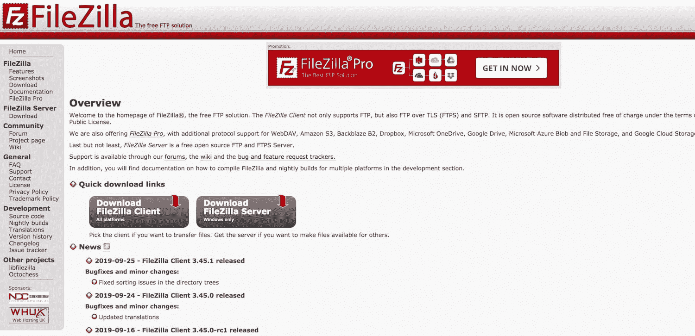
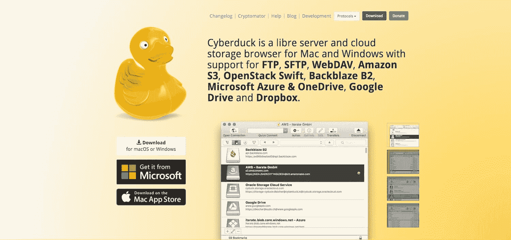
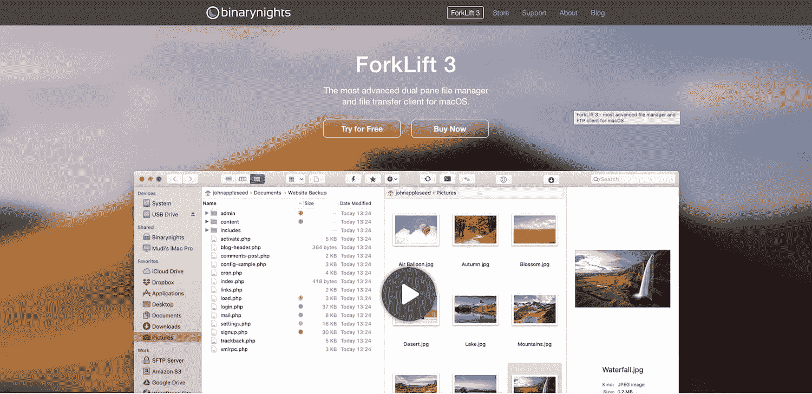
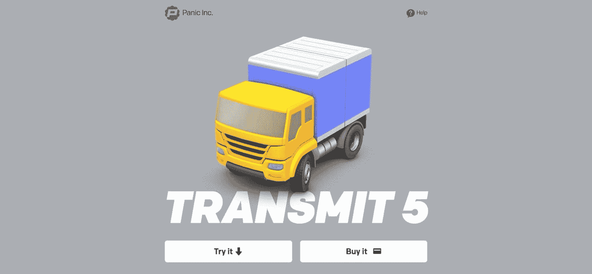
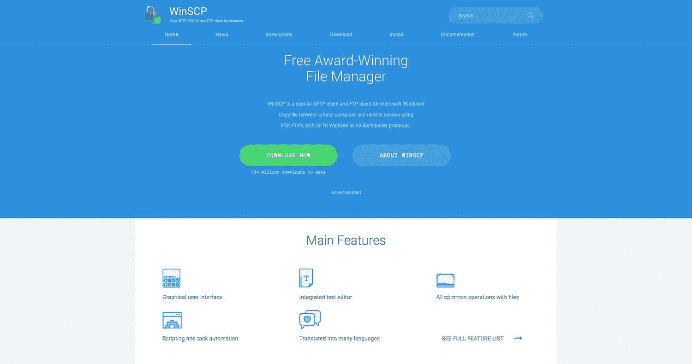
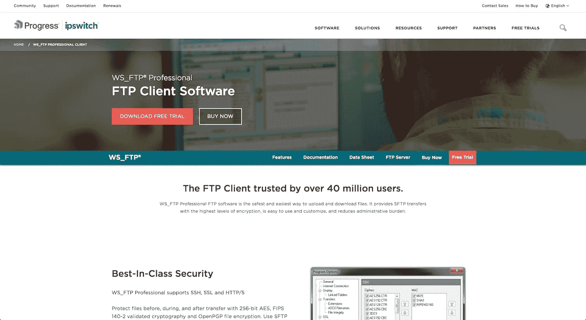
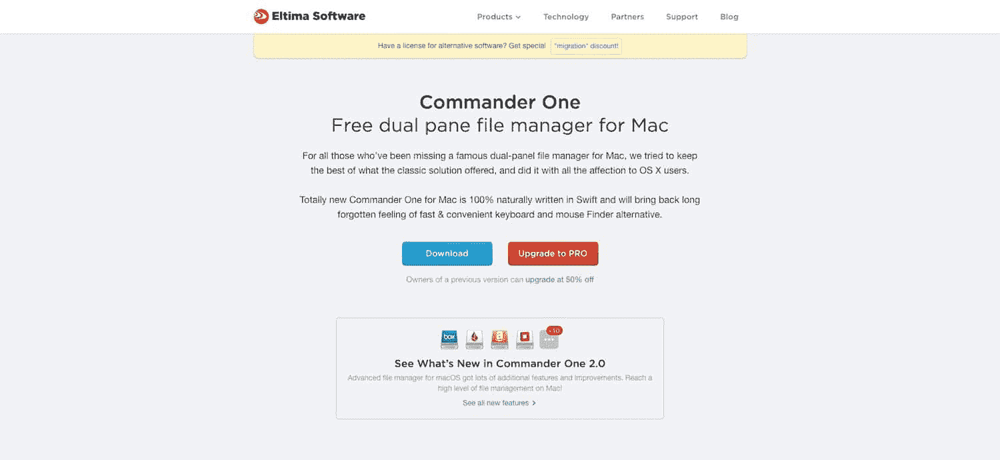
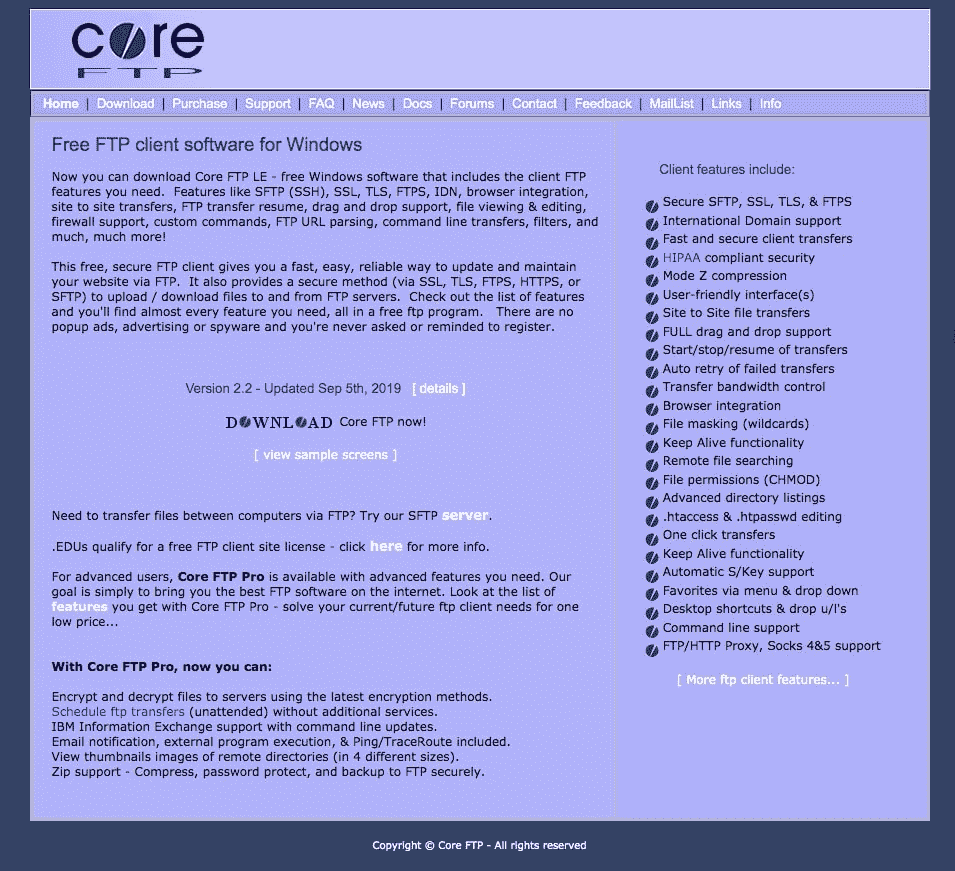
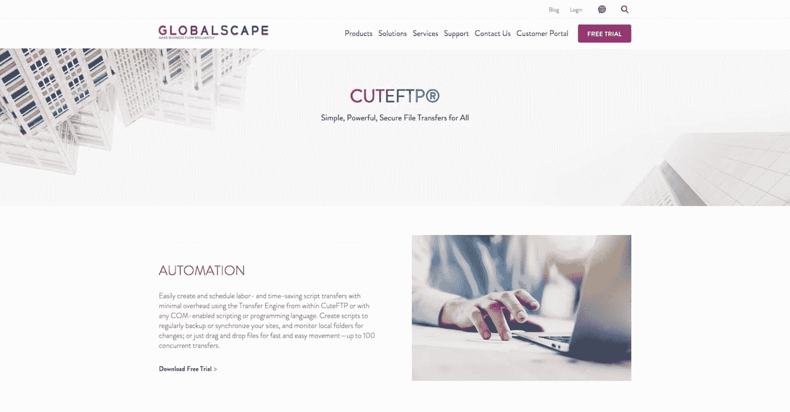
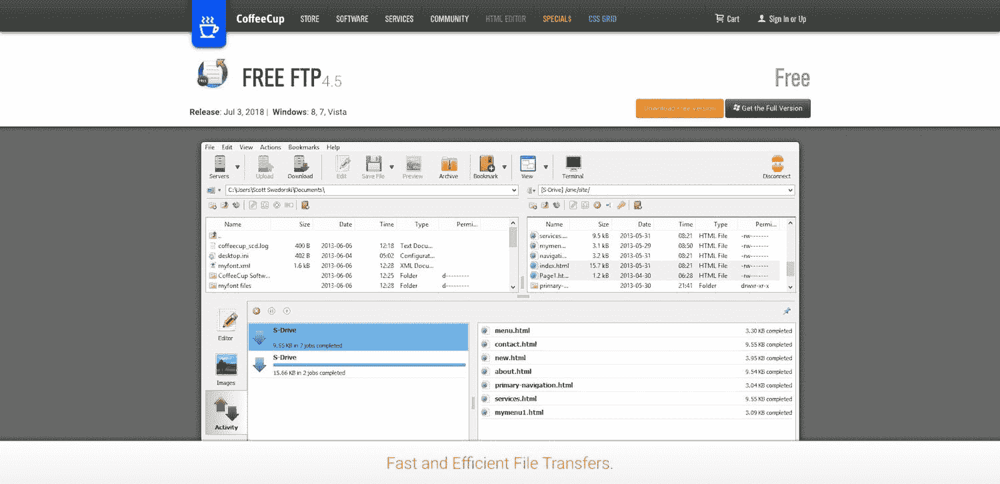

# WordPress 用户的 10 个最佳 FTP 客户端(Mac 和 Windows)

> 原文：<https://kinsta.com/blog/best-ftp-clients/>

建立一个网站需要文件和文件夹。建立一个复杂的网站需要无穷无尽的文件和文件夹。如果你是一名开发人员或设计师，它会变得令人难以置信。你可能[忘记了一个媒体文件](https://kinsta.com/knowledgebase/bulk-upload-files-wordpress-media-library-ftp/)被移动到了哪里，或者一个[主题文件夹](https://kinsta.com/blog/how-to-install-a-wordpress-theme/)丢失了或者没有正确传输到服务器。不管你有什么问题，你都需要一个最好的 FTP 客户端来帮助你保持有序。

## FTP 客户端有什么意义？

FTP 代表文件传输协议，它允许你[将电脑上的本地文件连接到在线服务器](https://kinsta.com/knowledgebase/how-to-use-sftp/)。例如，你可能正在创建一个 WordPress 站点。在这种情况下，你可以[使用](https://kinsta.com/blog/install-wordpress-locally/) [DevKinsta](https://kinsta.com/devkinsta/) 之类的工具在你的电脑上建立一个网站，然后最终将所有文件转移到你的服务器上，并启动你的网站让全世界看到。简而言之，它让你有机会组织你的文件，在一个私人的环境中进行编辑，并且检查是否有什么出错。

所有的 FTP 客户端都是不同的，但重要的是要知道，你想要一个在你的操作系统上工作的客户端，并且你正在寻找一个易于移动和整理文件夹的用户界面。

如今，托管公司通常有[个一键式按钮，用于在 WordPress 等平台上安装](https://kinsta.com/help/staging-environment/)这些文件。然而，对于那些初学者和高级开发人员来说，FTP 客户端仍然是一个极好的培训和[故障排除](https://kinsta.com/blog/wordpress-maintenance-mode/)工具。在电脑上保存网站的本地版本也是明智的。

## 在最好的 FTP 客户端中寻找的特性

FTP 客户端在某些方面非常相似，但有时你会发现其中一个客户端有一个小特性，它对你来说非常有用。也就是说，这些是您应该主要考虑的功能:

*   你必须首先弄清楚 FTP 客户端是否能在你的操作系统上工作(比如 Windows、 [Mac](https://kinsta.com/blog/speed-up-mac/) 或者 Linux)。
*   另外，看看你的操作系统支持哪些版本。就操作系统支持而言，一些 FTP 客户端比其他客户端好得多。
*   使用[拖放功能](https://kinsta.com/blog/wordpress-page-builders/)寻找漂亮的界面。
*   最好的 FTP 客户端有书签和搜索工具来定位你的文件，即使你有成千上万的文件。
*   查找哪些客户端连接到特定类型的服务器。其中一些仅用于从本地传输到在线服务器。其他人连接到第三方存储服务器，如 [Dropbox](https://kinsta.com/blog/best-tools-for-freelancers/#3-dropbox) 和 [Google Drive](https://kinsta.com/blog/best-tools-for-freelancers/#4-google-drive) 。
*   确保客户端支持您需要的协议。其中一些可能是 FTP、 [SSL 和 SSH](https://kinsta.com/help/cant-connect-delete-ssh-known-hosts/) 。
*   快速文件传输是必须的。
*   并排目录比较看起来很棒。
*   大多数开发人员需要确保大文件可以通过他们的 FTP 客户端传输。
*   [选择 FTP 客户端时，安全性应该是您最优先考虑的事项之一](https://kinsta.com/blog/wordpress-security/)。

## 当今市场上最好的 FTP 客户端

1.  [FileZilla](#Filezilla)
2.  [Cyberduck](#Cyberduck)
3.  [叉车](#ForkLift)
4.  [发送](#Transmit)
5.  [WinSCP](#WinSCP)
6.  [WS_FTP 专业版](#WS_FTP)
7.  [指挥官一号亲](#Commander-One-PRO)
8.  核心 FTP LE
9.  [CuteFTP](#CuteFTP)
10.  [免费 FTP](#Free-FTP)

### 最佳 FTP 客户端的深度评论

一些最好的 FTP 客户端在功能和界面方面极其相似。有些截然不同。我们鼓励您从查看您的操作系统支持哪些 FTP 客户端开始。然后，考虑我们下面的深入评论！

我们开始吧。

### 1.FileZilla (Windows、Mac 和 Linux)

FTP 游戏中最受欢迎的名字之一是 [Filezilla](https://filezilla-project.org) 。FileZilla 不仅免费且易于下载，而且不需要很长时间就能理解整个系统的内部工作原理。虽然 FileZilla 的界面有点过时，但所有用户都可以链接到他们的网站文件，并将它们放在计算机上存储的文件旁边。

大多数 FileZilla 用户使用 Windows 系统，但你也可以下载所有操作系统的软件，包括 Windows 7 等旧版本。

FileZilla

FileZilla 界面提供了一个主窗口(在这里你会花很多时间)、一个站点管理器和一个文件名过滤区。您可以在文件中搜索某些元素，并通过在主菜单上的选项卡之间切换来配置设置。如前所述，大部分工作都是在主窗口上完成的，在这里您会看到一个并排的显示，本地站点文件在左边，远程站点在右边。

使用你的主机、用户名和[密码](https://kinsta.com/help/connecting-with-sftp/)进行简单的[登录](https://kinsta.com/blog/wordpress-login-url/)，你可以将文件添加到传输队列中，甚至可以将你的文件从一边拖放到另一边。状态报告显示在几个区域，它通常会很快提供一个错误，让您知道是否做错了什么。

有时 Filezilla 不会默认显示所有文件。如果你想[看到隐藏文件，我们有一个简短的教程](https://kinsta.com/knowledgebase/filezilla-show-hidden-files/)你可以遵循并解决这个问题。

### 重要提示

*有几份报告称，有人从 SourceForge 网站(提供 FileZilla 下载)下载了包含恶意软件和病毒的内容。你最好的办法是直接去 FileZilla 网站下载最安全可靠的文件。*

#### FileZilla 为何是绝佳选择:

*   FileZilla 是一款完全免费的开源软件。
*   对于不同的操作系统和不同的版本，它有几个选项。FileZilla 是为数不多的与机器类型无关的 FTP 客户端之一。
*   FileZilla 社区非常活跃，这意味着更新是常见的，您可以与用户和开发人员进行交互
*   支持文档非常丰富，有完整的开发帮助部分、常见问题解答、支持页面和论坛。
*   主屏幕上的并排显示便于理解文件的移动位置和传输状态。
*   FTP 客户端支持多种协议，如 SFTP、FTPS 和 FTP。
*   该客户端有多种语言版本，可在世界各地使用。
*   远程文件搜索功能确保您不必四处扫描来手动定位它们。
*   您可以接收远程文件编辑，这样您就不必总是登录到您的主机帐户。
*   提供书签是为了保存您的位置并记住文件的位置。
*   您可以传输大文件。大多数情况下，它支持大于 4GB 的文件，这优于一些竞争对手。
*   借助拖放工具，目录比较模块变得更加有用。

#### 这个 FTP 客户端适合你吗？

FileZilla 是市场上最好的全方位 FTP 客户端之一。适应这个界面可能需要一点时间，但它支持所有操作系统和许多旧版本。它肯定更有可能被 Windows 用户使用，但 Mac 和 Linux 用户的选择是存在的。此外，我们喜欢 FileZilla，因为它适合那些想要进行并排拖放比较的人。

### 2.赛博鸭(Windows 和 Mac)

Cyberduck 不支持 Linux，但 Mac 和 Windows 用户发现它使用起来相当简单，在本地和远程位置之间传输文件也很快。你可以随意从 Cyberduck 网站下载 FTP 客户端，也可以选择在微软和 Mac 应用商店下载。

这是一个免费的开源软件，但是如果你愿意向开发者捐赠超过 10 美元，你可以摆脱捐赠提示，甚至可以收到一个注册码。

Cyberduck

与其他 FTP 客户端(包括 FileZilla)相比，Cyberduck 界面更加现代，它将您的网站链接到外部存储位置，如 Google Drive 和 Dropbox。

Cyberduck 的一个好处是“cryptomator”，它在您的传输过程中增加了额外的加密，以增加安全性。除此之外，我们还喜欢 Cyberduck 将你连接到云上，同时让你有机会在快速网址的帮助下分享文件。

#### 是什么让赛博达克成为一个很好的选择:

*   Cyberduck 作为一个开源项目免费运行。
*   您可以下载适用于 Windows 和 Mac 电脑的客户端。
*   它允许你通过多种协议连接，如 [FTP 和 SFTP](https://kinsta.com/knowledgebase/ftp-vs-sftp/) 。
*   Cyberduck 还包括对一些最受欢迎的第三方云存储平台的传输支持，如 Microsoft Azure、Google Drive 和 Dropbox。
*   Cryptomator 功能确保您的所有文件和传输都是加密和安全的，通过单独加密每个文件增加了一个额外的层。也没有后门，因为你不必注册或创建任何类型的帐户。
*   您可以使用外部文件编辑器对所有文档进行更改。
*   在 URL 生成器的帮助下，共享文件很容易。
*   书签工具具有记录历史、导入、文件等功能。
*   您可以通过利用快速查看功能或检查为大型文件夹结构提供的一般大纲来轻松浏览。
*   任何东西都可以通过 Cyberduck 转移。这是在拖放模块的帮助下完成的。您还可以同步、复制和粘贴。
*   Cyberduck 附带了几个集成，如钥匙链密码保护器和 Bonjour 自动发现平台。

#### 这个 FTP 客户端适合你吗？

如果你在 Linux 上，你不能使用 Cyberduck。然而，Windows 和 Mac 用户更喜欢 Cyberduck 提供的现代、简洁的界面。

此外，对于那些希望与替代的第三方云服务(如 Google Drive 或 Dropbox)同步的用户来说，这非常好。真的，如果你对链接到云存储更感兴趣，这是适合你的 FTP 客户端(也是我个人的偏好)。

### 3.叉车(Mac)

[叉车](https://binarynights.com/)是一个 Mac 专用的文件管理器和传输客户端，具有两个窗格，用于比较多个文件位置并来回移动它们。像 T2、亚马逊 S3 和谷歌驱动这样的东西都可以使用远程连接。更不用说，你有能力同时连接到多个服务器，如果你有一个以上的传输要完成，给你更多的多功能性。

叉车有免费试用，但核心软件需要支付 29.95 美元的单一许可证。家庭许可证可以在三台电脑上使用，价格为 49.95 美元，而小型企业许可证最多可以在五台 MAC 上使用，价格均为 99.95 美元。叉车还为教师和学生提供教育折扣。

ForkLift

主文件管理器将您的远程服务器链接到本地环境，使用具有良好视觉效果的拖放系统，以便您可以看到哪些文件正在被管理。此外，通过并排比较，您可以在一个窗口中看到所有内容，并将它们从一个文件移到另一个文件。这是一个全新的界面，应该符合 Mac 用户习惯的时尚风格。

#### 是什么让 ForkList 成为一个伟大的选择:

*   虽然叉车不是免费的，但它为学生和教师提供了一些合理的终身价格和折扣。
*   双窗格界面将文件的位置分割在两个独立的窗口中，为您提供了将文件从一个区域拖到另一个区域的工具。
*   您可以使用 Dropbox 在电脑之间同步您的所有收藏夹。
*   叉车让您复制 Dropbox 文件与右键单击，并立即将它们放入叉车文件。
*   各种远程连接都是可用的，包括 WebDAV、亚马逊 S3 和谷歌驱动。
*   叉车支持 SFTP 和 FTP 传输。
*   传输模块包括一个预览面板，用于检查所有文件的重要细节。例如，您可能想要播放音频文件或查看图像。
*   多重重命名工具允许您选择一大组文件，并同时对它们进行重命名。
*   你可以将你的界面切换到“黑暗模式”以避免工作时眼睛疲劳。
*   叉车有选项来设置您的首选编辑器。这意味着所有文件编辑都是在叉车外部完成的，但随后会与软件同步。

#### 这个 FTP 客户端适合你吗？

铲车只适用于 Mac 用户，所以 Windows 和 Linux 用户应该看看其他的 FTP 客户端。至于选择基于功能的叉车，如果你想访问许多远程连接，其中一些包括 Google Drive，SMB 和 NFS，请考虑它。这也是一个高级软件，所以如果你不想支付 FTP 客户端，那么你需要寻找其他东西。

### 4.传输(Mac)

如果你是一名 Mac 用户，正在寻找不同于叉车的东西， [Transmit](https://panic.com/transmit/) 有一些独特的功能，使它脱颖而出。从表面上看，Transmit 提供了一个很好的界面来管理你的文件，并同时将它们链接到几个服务器上。您可以从一个地方上传、管理和下载所有内容，同时还可以连接到 Box、Google Drive 和 Backblaze 等收藏夹。

和许多 Mac FTP 客户端一样，Transmit 有一个免费试用版可以测试。然而，主软件售价为 45 美元。这仅适用于一个许可证，但是您购买的许可证越多，就可以获得折扣。例如，10 份 Transmit 的成本是每份 43 美元。这不是一个很大的折扣，但对于需要额外拷贝的公司来说是相当不错的。

Transmit

Transmit 的一个主要卖点是，与其他 FTP 客户端相比，它拥有显著的速度提升。它还提供了一个并排的模块，你的文件的视觉效果，以及快速找到你的文件的快捷方式。总的来说，Transmit FTP 客户端似乎在云支持和文件搜索工具方面更胜一筹。

#### 是什么让传输成为一个很好的选择:

*   Transmit 没有免费版本，但价格合理，并且购买的许可证越多，您就可以获得折扣。
*   它提供了一个惊人的界面，符合大多数 Mac 用户的习惯。
*   它处理 FTP、WebDAV 和 SFTP 等基本功能。然而，你也可以获得与 Rackspace、Dropbox 和 Backblaze 等服务的服务器集成。
*   Transmit 有一个拖放系统，可以在几秒钟内上传和同步文件。
*   您可以同时管理多台服务器上的文件。
*   Transmit 有一个“紧急同步”工具，[可以安全地将你的数据](https://kinsta.com/blog/wordpress-hacked/)锁定在一个单独的位置，以防你的远程服务器或计算机出现问题。
*   它是市场上最快的客户端之一，在复杂的文件夹中智能搜索，快速多线程。
*   在边栏中查看文件信息。
*   批量编辑您的许多文件，方法是选择您想要编辑的文件，然后选择您想要将它们更改为的文本。
*   您可以使用“键”选择一个文件的名称，并直接转到该位置。
*   传输支持超大亚马逊 S3 文件传输。

#### 这个 FTP 客户端适合你吗？

如果你是 Mac 用户，你应该只考虑传输。除此之外，我们建议比较 Transmit 和叉车，看看哪一个拥有您需要的远程服务器。除此之外，Transmit 是为那些想要干净的界面和快速的上传和传输速度的人设计的。这些快捷方式对于改善您的工作流程也很有帮助。

### 5.WinSCP (Windows)

[WinSCP](https://winscp.net/eng/index.php) ，顾名思义，只在 Windows 电脑上运行。这是一个免费的文件管理器和 FTP 客户端，连接您的远程和本地环境。到本文发表时，开源项目已经有超过 1.24 亿次下载，它的受欢迎程度似乎还在增加。用户界面看起来有点类似于 FileZilla，有一个用于传输文件的双窗格模块。

## 注册订阅时事通讯

### 想知道我们是怎么让流量增长超过 1000%的吗？

加入 20，000 多名获得我们每周时事通讯和内部消息的人的行列吧！

[Subscribe Now](#newsletter)

您还可以使用多个选项卡、不同的命令和会话来自定义您的主页。同一个屏幕上可能有多个会话，允许您一次完成更多的工作。

WinSCP

WinSCP 的功能库看起来丰富且易于使用。此外，您可以在 WinSCP 网站上找到有关该产品的各种信息。一些资源包括深入的文档、用户论坛和获得客户支持的选项。

#### WinSCP 为何是绝佳选择:

*   WinSCP 是一个免费的 FTP 客户端。
*   文档和支持工具优于一些竞争产品。
*   客户端允许使用 WebDAV、S3、SFTP、SCP、FTPS 和 FTP 进行传输。
*   图形用户界面使您的工作更加直观和易于理解。
*   你可以集成你选择的文本编辑器。
*   任务和脚本可以通过制定规则来实现自动化。
*   客户端翻译成多种语言，以便在许多国家获得支持。
*   所有文件在通过 WinSCP 发送时都是加密的。
*   如果您计划为您的公司使用该客户端，或者如果您不希望某些人访问某些文件或功能，您可以设置管理限制。
*   您可以更改用户界面来满足您的任何需求。
*   WinSCP 总是连接到您当前的工作区。如果您丢失了某些东西，WinSCP 会恢复整个工作区。

#### 这个 FTP 客户端适合你吗？

WinSCP 不是 Mac 或 Linux 用户的选择。对于那些想要严格基于 Windows 的 FTP 客户端的人来说，这是有意义的。我们喜欢它主要是因为它的界面简洁。如果你只想要基本的必需品，WinSCP 看起来是个不错的选择。

### 6.WS_FTP 专业版

[WS_FTP Professional](https://www.ipswitch.com/ftp-client) 拥有超过 4000 万用户。其中一个原因是因为 WS_FTP 提供了高级别的加密、简单的定制和高级管理工具。从安全性开始，WS_FTP 保护传输过程中所有点的所有文件。这包括文件传输之前和之后。多种形式的加密被用来确保你所有的文件在 WS FTP 中得到保护。

这种类型的安全性使 WS_FTP 成为高级 FTP 客户端。因此，您必须为单个用户支付每个许可证 49.95 美元。如果您升级到起价为 89.95 美元的专业版，您可以利用社区和电子邮件支持。

WS_FTP® Professional

除了加密之外，WS_FTP 还有其他一些方法来保护你的文件免受伤害。首先，每个文件都是根据时间表[备份的](https://kinsta.com/help/wordpress-backups/)。您还可以压缩其中的一些备份，将其存储在其他机器或 USB 驱动器上。同步也是自动完成的，所以你可以将这些文件发送到远程服务器，而不用担心它们在其他地方丢失。

#### WS_FTP 为什么是一个很好的选择:

*   WS FTP 是 Windows 的高级 FTP 客户端，价格合理。
*   主要的好处是优越的安全性。这包括文件加密、签名密钥、备份、FIPS 140-2 验证加密等。
*   所有传输都保证到达正确的文件夹。
*   您可以将文件与各种服务器和设备同步。
*   直接从 WS_FTP 窗口压缩文件。
*   您可以设置电子邮件通知，以便在发生转移时发送给您或您组织中的其他利益相关者。
*   你可以获得[高级客户支持](https://kinsta.com/help/wordpress-support-ticket/)，而不仅仅是一个社区论坛或者给一个可能需要一段时间才能回复的开发者的电子邮件。

#### 这个 FTP 客户端适合你吗？

安全性是 WS FTP 游戏的名字。FIPS 140-2 验证加密和集成文件加密相结合，为所有重要文件提供终极保护。将它与备份和同步配合使用，您应该可以轻松锁定您的文件。正因为如此，我们最喜欢 WS FTP 为 Windows 用户谁想要最好的安全性。

### 7.指挥官一号专业版

指挥官一号有一个免费版本，非常欢迎你下载。然而，出于几个原因，我们更关注高级[Commander One PRO](https://mac.eltima.com/ftp-manager.html)FTP 客户端。首先，当您升级到 Pro 版本时，功能集要优越得多。其次，Pro 的个人授权只要 29.99 美元。之后，你可以花 99.99 美元(5 个许可)获得团队版本，或者花 149.99 美元获得公司计划(50 个许可)。

Commander One

Commander One PRO 支持 FTP、SFTP 和 FTPS 传输。这是一个可靠且相当快速的客户端，可以在服务器之间快速传输、上传和移动项目。多个连接是可能的，选项卡式浏览肯定会使您的工作流程更加高效。

开发商也有一个新的版本称为指挥官一亲 2。这引入了许多云同步机会，如 Backblaze B2、Box Cloud 和亚马逊 S3。所有这些服务器都在一个漂亮的连接管理器的帮助下连接在一起。因此，您总是可以在一个地方访问您的连接，即使您同时有五个或十个连接。

厌倦了体验你的 WordPress 网站的问题？通过 Kinsta 获得最好、最快的主机支持！[查看我们的计划](https://kinsta.com/plans/?in-article-cta)

#### 为什么 Commander One PRO 是一个很好的选择:

*   指挥官一号有一个光工作的免费版本。它还提供了一个非常实惠的高级版本，充满了独特的功能。
*   Commander One PRO 支持多种语言，如波兰语、西班牙语和法语。
*   您可以从广泛的颜色主题中进行选择。
*   客户端帮助压缩您的文件。一些压缩版本包括 ZIP、RAR 和 TGZ 文件。
*   它允许您安装到 Android 设备上，以便在智能手机或平板电脑上进行文件管理。
*   所有 iOS 设备都可以安装。
*   Commander One PRO 提供了一个文件查看器来查看哪些媒体项目实际上在您的文件中。这也有助于分析元数据。
*   您可以指定热键来改进您的工作流程并加快查找某些文件的过程。
*   加密服务在所有传输过程中保护您的文件。这是在本地、云和远程服务器之间完成的。
*   FTP 客户端有一个很大的连接列表可以利用，包括亚马逊 S3、Dropbox 和 OneDrive。

#### 这个 FTP 客户端适合你吗？

Windows 和 Linux 用户可以完全跳过 Commander One PRO。如果你是一个 Mac 用户，需要多种连接和高度可定制的界面，Commander One PRO 可能就是你的选择。它也非常支持压缩文件。

### 8.核心 FTP LE (Windows)

核心 FTP LE 并不总是免费的，但现在你可以选择付费购买 Pro 版或 LE 版。在我们看来，Core FTP LE 的基本界面、双面板布局以及与 FileZilla 惊人的相似性，对大多数用户来说应该很好。主要区别在于 Core FTP LE 只致力于 Windows 软件的开发，所以你可能会发现它更专注于这种类型的体验。

话虽如此，文件管理器提供了传输和拖放模块，以及一个状态部分，以了解您的文件是否以及何时将从本地站点转移到远程站点。您的大部分任务都在同一个窗口中执行，允许您在一个较长的层次结构中搜索文件，并将对您最重要的项目加入书签。

Core FTP LE

如前所述，您需要的核心 FTP LE 的主要功能是免费的。不过，你可以花 24.95 美元升级到专业版。至于网站，你可以找到许多支持你自己研究的资源或者和其他社区成员交流。

例如，您可以选择向开发人员发送电子邮件，或者您可以在论坛上发布相同的问题，并听取其他用户的意见。网站上的其他一些选项卡包括常见问题解答、功能列表和文档。

#### 什么使核心 FTP 阿乐成为最佳选择:

*   它类似于 FileZilla，有一些你在那里找不到的独特特性。
*   核心的 FTP LE 主客户端是完全免费的，可供您下载。
*   如果你想要一些工具，如文件同步、加密和自定义屏幕设置，还有一个专业版。
*   免费版提供对安全 FTPS、 [TLS、SSL](https://kinsta.com/knowledgebase/tls-vs-ssl/) 和 SFTP 的支持。
*   模式 Z 压缩提高了您的传输速率，有助于加快您的工作进程。
*   您可以将所有文件元素拖放到其他文件夹中。
*   核心 FTP LE 提供了一个独特的功能，在失败的情况下自动重试所有传输。
*   文件屏蔽和文件权限可以从管理员级别实现。
*   您可以创建自己的桌面快捷方式。
*   核心 FTP LE 允许一次向多个站点传输多个文件。

#### 这个 FTP 客户端适合你吗？

您只能在 Windows 机器上使用核心 FTP LE。我们觉得核心 FTP LE 是 FileZilla 的一个很好的替代品。也许你不喜欢 FileZilla 上的一些快捷方式或整体界面。在这种情况下，试试这个，看看它是否能缓解疼痛。传输既快又安全，所以你应该能在两者之间找到一个解决方案。

### 9.CuteFTP (Windows)

CuteFTP 属于一家名为 Globalscape 的公司。它只能在 Windows 平台上使用，并且需要每年支付 59.99 美元。大多数年，开发者都会推出一个新版本。那样的话，你可以花 29.99 美元升级。CuteFTP 还有一年的维护和支持服务，费用为 30 美元。

CuteFTP 的基础是为 FTP 客户端提供一个易于使用的界面、大量的自动化和业界领先的安全性。通过使用密码认证、强大的加密和密码管理器，安全性肯定是有保障的。

CuteFTP

什么是伟大的保费 FTP 文件管理器是你收到了大量的在线资源和实际的，人类的客户支持。Globalscape 提供完整的支持知识库、在线帮助文件和用户指南。

您可以通过电话或聊天室联系客户支持团队。简而言之，有时 FTP 传输会给你的组织带来大问题。这时候和一个真实的人说话是很好的。这就是为 FTP 客户支付少量费用的时候。

#### 是什么让 CuteFTP 成为一个伟大的选择:

*   该公司提供了一个漂亮的 FTP 客户端，具有全面的电话和电子邮件支持。这是以非常低的价格提供给你的。
*   您可以从主窗口安全地备份和同步您的站点文件。
*   CuteFTP 有一个密码管理器，用于记录你决定设置的所有密码。
*   使用 FTP/S、HTTP/S 和 SFTP 发送传输。
*   有一个密码认证协议来为系统提供更高的安全性。
*   您的传输可以手动完成，也可以设置为自动运行。
*   所有的转移都受到监控，让你知道什么时候事情看起来很奇怪。
*   你可以通过 CuteFTP 管理音频文件，甚至创建播客 [RSS feeds](https://kinsta.com/blog/wordpress-rss-feed/) (以下是如何[使用 WordPress](https://kinsta.com/blog/wordpress-podcast/) 开始播客)。
*   拖放界面允许您在文件夹和服务器之间来回移动文件。
*   CuteFTP 有创建脚本的选项，可以让你在将来节省时间。
*   在软件内部的逐步向导的帮助下，连接到您的所有站点。

#### 这个 FTP 客户端适合你吗？

如果你用的是 Windows 电脑，CuteFTP 可能适合你。这是为数不多的高级 Windows FTP 客户端之一，因此您可以获得难以置信的客户支持和一些在 FileZilla 或其他开源项目中找不到的不寻常的功能。因此，如果你想在 Windows 机器上获得卓越的自动化、安全性和客户支持，我们可以使用 CuteFTP 客户端。

### 10.免费 FTP (Windows)

免费 FTP 有免费和付费两种版本供你测试，如果你需要的话，还可以升级。高级版标价 39 美元，如果你愿意尝试而不是坚持免费版，它确实有免费试用。目前，Windows 10、8、7 和 Vista 支持免费 FTP。

高级软件实际上被称为直接 FTP，但它是由同一批开发者开发的，只是在免费软件的基础上做了改进。

从这些高级功能开始，如果你想为直接 FTP 付费，你可以使用标准的文件传输和编辑工具。它通过提供一个完整的 web 设计工具集来快速编辑和组织文件，使界面更进了一步。一切都可以在您的服务器上编辑，所有上传都是可靠和快速的，以确保最高的性能。总的来说，高级版本(直接 FTP)增加了一些小功能，如更安全的文件传输、可定制的语法高亮显示和文件夹的文件权限。

Free FTP

许多人甚至不会考虑为 FTP 付费，所以让我们来看看真正的免费 FTP 软件。这个特殊的工具专门用于超级简单和快速上传到您的服务器。提供了拖放功能，以及其他一些对初学者和高级用户都非常有用的工具。所有文件传输的状态在一个漂亮的列表中排序，以准确地看到哪些已经传输，哪些正在上传。

书签简单直观，文件管理都在程序内部进行，例如添加、启动和移动文件。备份工具也很好，这样你只需点击一个按钮就可以保存网站文件的 ZIP 文件夹。

#### 是什么让免费 FTP 成为一个伟大的选择:

*   免费 FTP 有免费和付费两个版本。
*   可以通过 SFTP、SSH、FTPS、HTTP 和 TLS 进行安全的文件传输。
*   文件权限可用于保护您的工作，并确保正确的用户可以查看和操作他们需要的内容。
*   免费的 FTP 包括一个简单的拖放编辑器，可以并排比较查看远程和本地服务器上的所有文件夹。
*   快速存档功能确保您能够备份所有文件和文件夹，而不必担心丢失任何东西。
*   完整版提供了一个代码完成解决方案，其中 HTML 标签和属性等项目会被建议并为您完成，从而最大限度地减轻您手指的压力。
*   所有浏览和传输操作都记录在历史模块中。这意味着，如果您忘记了将文件放在哪里，您可以随时回到过去找到它。
*   FTP 客户端的底部会显示一个状态栏，这样您就可以知道文件何时正在传输或者是否发生了错误。
*   与其他竞争对手相比，免费 FTP 实际上提供了更多的 FTP 变体支持。例如，你获得了对 TSL、HTTPS、SFTP、宋承宪和 FTPS 的支持。
*   该界面对所有用户来说都是简单而有效的，尤其是考虑到在主窗口中标记书签和查看文件进度是多么容易。

#### 这个 FTP 客户端适合你吗？

对于那些想要一个干净、简单的工作空间的人来说，免费 FTP 应该很好用。您获得了基本的功能，而没有一般用户通常不需要的额外功能。此外，如果你支付高级版本没有问题，你可以获得代码完成功能和对 HTTPS 和 TSL 的支持。

[Managing site files is a serious task for site owners. Here's a list of the 10 best FTP clients WordPress users can take advantage of!Click to Tweet](https://twitter.com/intent/tweet?url=https%3A%2F%2Fbit.ly%2F2AvIPTq&via=kinsta&text=Managing+site+files+is+a+serious+task+for+site+owners.+Here%27s+a+list+of+the+10+best+FTP+clients+WordPress+users+can+take+advantage+of%21&hashtags=ftp%2Cwordpress)

## 你应该选择哪个最好的 FTP 客户端？

希望我们的建议能让你减少你的 FTP 客户列表并做出选择。如果你需要更多的帮助，这里有一些最后的建议:

*   如果你想要一个支持所有操作系统的免费解决方案，考虑这个 FTP 客户端。我们还认为这是最佳的全方位解决方案。
*   Cyberduck(赛博鸭)——我们喜欢这款应用于 Windows 和 Mac 用户，他们希望与 Google Drive 和 Dropbox 等存储服务同步。
*   **叉车式**–这个 FTP 客户端是为那些想要远程连接的 Mac 用户设计的，比如 SMB 和 Google Drive。
*   **传输**–这是一个非常适合 Mac 用户和快速上传速度的方法。
*   如果你有一台 Windows 系统的机器，并且你渴望最大的简单性，那么考虑一下这个。
*   **WS _ FTP Professional**–仅适用于希望 FTP 客户端具有最佳安全性的 Windows 用户。
*   **Commander One PRO**–如果你是一个正在寻找多个连接的 Mac 用户，请考虑一下这个客户端。
*   **核心 FTP LE**–这个只针对 Windows 机器。这是 FileZilla 的一个很好的替代品，所以测试一下它们，看看你更喜欢哪一个。
*   CuteFTP–如果您想从所有这些 FTP 客户端中获得最好的客户支持，请尝试 cute FTP。另外，要知道你必须为此付费，而且你需要一台 Windows 机器。
*   免费 FTP–如果您使用 windows，并且想要简单性和对 TSL 和 HTTPS 的潜在支持，我们喜欢免费 FTP。

这就是我们为最好的 FTP 客户所做的一切！如果您有任何进一步的问题，或者想让我们知道您最喜欢的客户，请在下面的部分写下评论。

* * *

让你所有的[应用程序](https://kinsta.com/application-hosting/)、[数据库](https://kinsta.com/database-hosting/)和 [WordPress 网站](https://kinsta.com/wordpress-hosting/)在线并在一个屋檐下。我们功能丰富的高性能云平台包括:

*   在 MyKinsta 仪表盘中轻松设置和管理
*   24/7 专家支持
*   最好的谷歌云平台硬件和网络，由 Kubernetes 提供最大的可扩展性
*   面向速度和安全性的企业级 Cloudflare 集成
*   全球受众覆盖全球多达 35 个数据中心和 275 多个 pop

在第一个月使用托管的[应用程序或托管](https://kinsta.com/application-hosting/)的[数据库，您可以享受 20 美元的优惠，亲自测试一下。探索我们的](https://kinsta.com/database-hosting/)[计划](https://kinsta.com/plans/)或[与销售人员交谈](https://kinsta.com/contact-us/)以找到最适合您的方式。