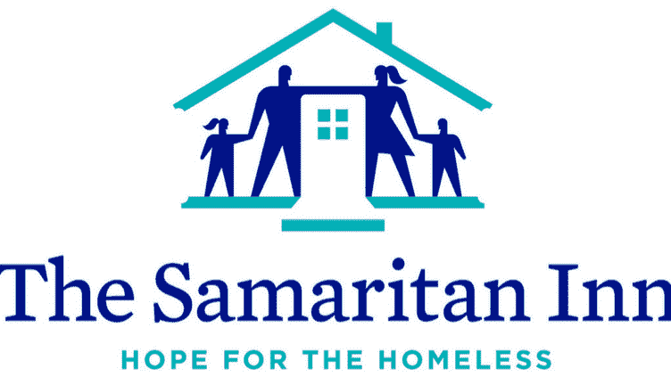
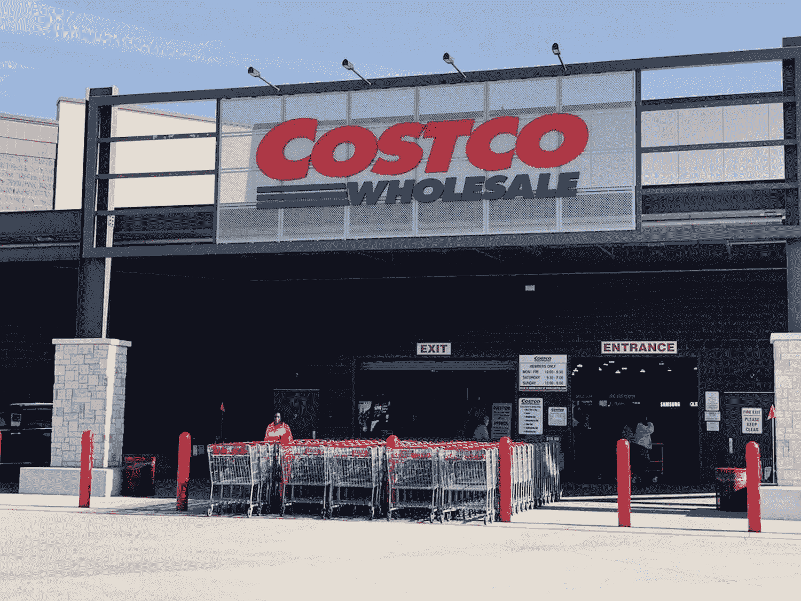

# 金斯塔在感恩节回馈无家可归者

> 原文：<https://kinsta.com/blog/giving-back-2019/>

在金斯塔，我们尽力回馈社区。仅今年一年，我们就在全球赞助了 28 个世界夏令营:赫尔辛基、波尔多、都灵、鹿特丹、巴黎、巴里、马那瓜、阿什维尔、柏林( [WCEU](https://twitter.com/kinsta/status/1141983107530145792) )、渥太华、蒙特利尔、新加坡、圣何塞、苏黎士、奈梅亨、蓬特韦德拉、香港、巴拿马、达拉斯、东京、圣路易斯( [WCUS](https://twitter.com/kinsta/status/1190459239300550657) )、斯图加特、悉尼、米兰、乌代普尔、马赛、大阪和艾哈迈达巴德。

但有时我们也会回馈非 WordPress 社区。尤其是在假期前后，有许多人需要额外的帮助。哪怕只是很小的事情。

今年，我们决定通过向撒马利亚人酒店捐赠食物和物资来帮助德克萨斯州达拉斯地区的无家可归者。他们有积极的计划，试图让人们重新站起来。

The Samaritan Inn

我们选择这个项目的原因是我们热爱他们的使命和他们为社区所做的工作。正如他们在网站上所说:

> 撒玛利亚客栈不仅仅是一个过夜的地方。这是一个综合项目，教授自给自足和生活技能，以满足无家可归的个人和家庭的需求。我们**帮助有意愿的人获得尊严和独立。**在一个特定的夜晚，大约有 160 人睡在客栈，其中三分之一是儿童。

实际上，我们在德克萨斯州有一些 Kinsta 团队成员，所以这不仅仅是我们随机选择的一个组织。上周末，我们的首席客户办公室，汤姆·塞普去了好市多。

Costco

汤姆在购物车里装满了以下物品:

*   204 盎司咖啡
*   20 打鸡蛋
*   8 加仑牛奶
*   40 磅面粉
*   40 磅糖
*   320 个泡沫塑料杯
*   180 液体盎司洗碗液
*   520 止咳糖
*   20 液体盎司咳嗽药
*   1060 片抗酸剂

Costco cart

想做类似的事情？这里有一些提示:

1.  看看庇护所的[需求清单](https://saminn.org/needs-list/)或者给他们打个电话，了解他们的需求。我们做到了，而且效果很好。
2.  如果你的团队中有人有好市多或山姆的卡，无论你的预算是多少(我们花了几百)，它都会让你得到比一般杂货店多得多的食物。
3.  如果你要提前购买，一定要检查保质期，以确保食物至少能保存到感恩节之后的几天。
4.  你很可能会想把注意力集中在不需要冷藏的物品上，除非他们特别列出了这些物品。像火鸡这样的东西通常是由专业的大型供应商在当天送达的。许多避难所缺乏额外的冷藏空间。

[As our company culture, we try to give back to the community as much as we can. This year we donated to @SamaritanInnOrg to help the homeless. 🙏🤝Click to Tweet](https://twitter.com/intent/tweet?url=https%3A%2F%2Fkinsta.com%2Fblog%2Fgiving-back-2019%2F&via=kinsta&text=As+our+company+culture%2C+we+try+to+give+back+to+the+community+as+much+as+we+can.+This+year+we+donated+to+%40SamaritanInnOrg+to+help+the+homeless.+%F0%9F%99%8F%F0%9F%A4%9D&hashtags=givingback%2Chelppeople)

你或你的公司会在假期回馈社会吗？我们很想听听！

如果你想了解更多关于撒马利亚人酒店的事情，一定要查看他们的网站:saminn.org。

* * *

让你所有的[应用程序](https://kinsta.com/application-hosting/)、[数据库](https://kinsta.com/database-hosting/)和 [WordPress 网站](https://kinsta.com/wordpress-hosting/)在线并在一个屋檐下。我们功能丰富的高性能云平台包括:

*   在 MyKinsta 仪表盘中轻松设置和管理
*   24/7 专家支持
*   最好的谷歌云平台硬件和网络，由 Kubernetes 提供最大的可扩展性
*   面向速度和安全性的企业级 Cloudflare 集成
*   全球受众覆盖全球多达 35 个数据中心和 275 多个 pop

在第一个月使用托管的[应用程序或托管](https://kinsta.com/application-hosting/)的[数据库，您可以享受 20 美元的优惠，亲自测试一下。探索我们的](https://kinsta.com/database-hosting/)[计划](https://kinsta.com/plans/)或[与销售人员交谈](https://kinsta.com/contact-us/)以找到最适合您的方式。