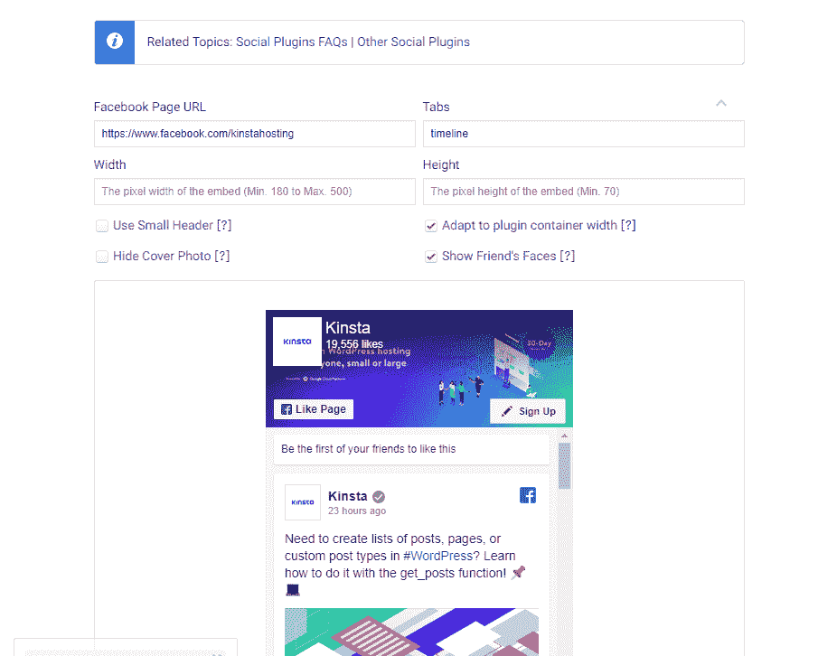
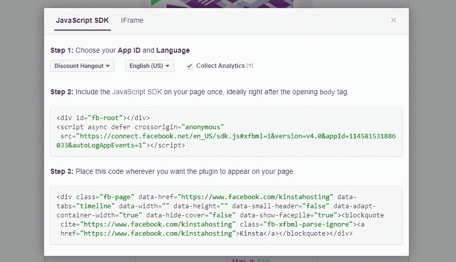
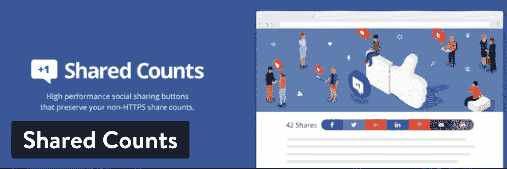
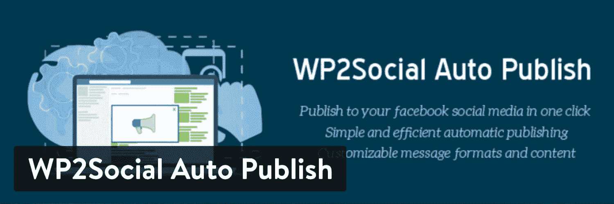
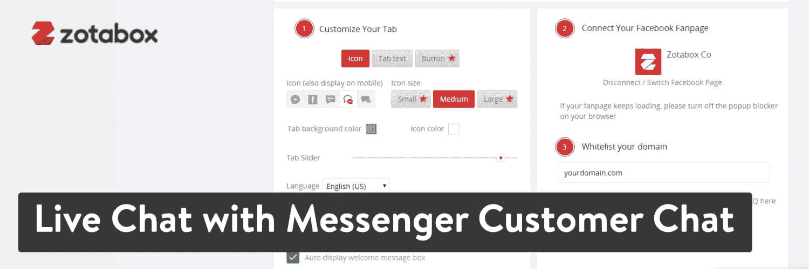
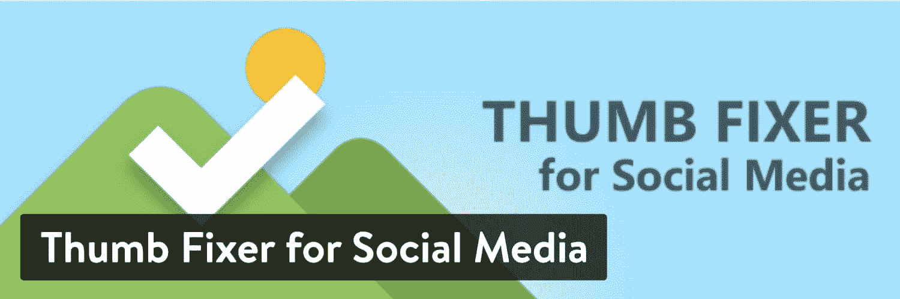
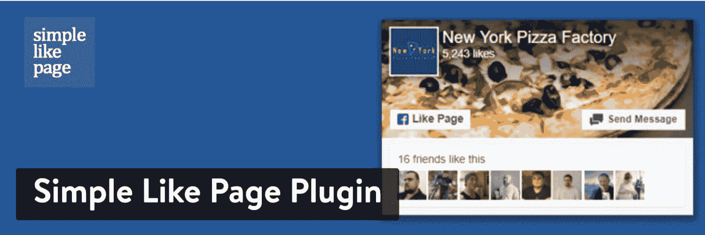
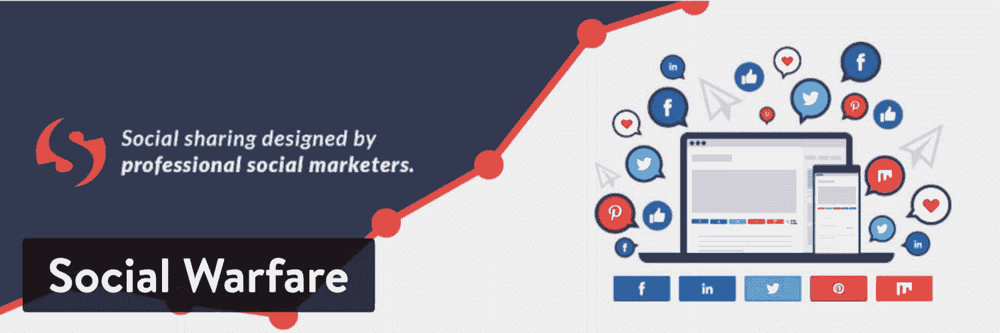

# 9 个最好的 WordPress 脸书插件来提升你的社交策略

> 原文：<https://kinsta.com/blog/wordpress-facebook-plugins/>

“你需要上脸书”。关于你的生意，你听过多少次了？这可能有点烦人，但脸书是连接用户和向大众传播内容的重要部分。

无论你是否已经有了大量的追随者，找到最好的 WordPress 脸书插件来支持你的商业页面并促使追随者分享内容也是很重要的。

## 为什么你应该考虑使用 WordPress 脸书插件

脸书插件的目的各不相同，考虑到他们中的一些是为了分享，一些是为了建立关注计数，一些是为了显示图片。以下是首先安装脸书插件的一些优势:

*   它们可以很好地向用户展示你有一个[脸书页面](https://kinsta.com/blog/how-to-create-a-facebook-page/)并且他们应该跟随它。
*   可以透露内容，让人们先睹为快。
*   一些插件允许用户在脸书上与其他用户分享你的博客文章和页面。
*   您可能需要调整图像的大小并更改共享帖子的内容。
*   您可能需要一个小部件来在页面上放置一个 Like 按钮。
*   你可以通过脸书提升你的搜索引擎优化。
*   你甚至可以通过脸书提供客户服务。
*   一些脸书插件通过图片库使你的网站更加直观。

## 使用脸书插件时，有一个警告

请记住，[脸书](https://kinsta.com/blog/facebook-statistics/)是第三方服务。它与 WordPress 或任何开发 WordPress 插件的开发者无关。因此，如果一些插件侵犯了脸书的商标或版权，就有可能被意外停用。也就是说，所有的开发者都被告知不要展示脸书商标，所以你应该没问题。

此外，脸书可能会有[服务器问题](https://kinsta.com/blog/nginx-vs-apache/)，如果脸书花太长时间来响应插件的提示，这可能会使你的网站瘫痪或显示错误。

您应该如何避免这种情况？

你可以冒险并希望一切顺利，但是《粉碎气球》有一个很好的教程可以帮助你几乎完全避免脸书的所有问题。本教程将带您了解如何在脸书上创建一个开发者账户和一个应用程序。这可以让你避开一些你可能会遇到的问题。

(建议阅读:[如何修复 WordPress](https://kinsta.com/blog/facebook-oembed/) 中的脸书 oEmbed 问题)

## 如何在 WordPress 添加新的脸书页面插件

实际上，脸书有自己的选项，可以给你的 WordPress 站点添加一个小的[部件。如果你想走这条路，下面是完成它的步骤:](https://kinsta.com/blog/wordpress-widgets/)

Adding Facebook plugin

1.  转到[这个脸书页面](https://developers.facebook.com/docs/plugins/page-plugin)。
2.  将[您的脸书页面 URL](https://www.facebook.com/kinstahosting) 粘贴到适当的字段。如果您登录到该页面，这将自动完成。
3.  选择要在小部件上显示的选项卡。
4.  调整小部件的宽度和高度等细节。
5.  选择其他设置，如页眉、封面照片的大小，以及是否应该向朋友显示。
6.  点击获取代码按钮。

然后脸书向你展示了两位代码，让你复制并粘贴到你的 [WordPress 网站](https://kinsta.com/blog/why-use-wordpress/)。复制第一个，粘贴到你的[子主题](https://kinsta.com/blog/wordpress-child-theme/)或[常规主题](https://kinsta.com/blog/change-wordpress-theme/)的[header.php 文件](https://kinsta.com/knowledgebase/add-code-wordpress-header-footer/)中。找到`<body>`标签，然后粘贴代码。

第二段代码可以粘贴到网站上您希望模块出现的任何地方。随意把它放在文章或页面中，或者考虑把它包含在文本小部件中，这样它就可以显示在所有的边栏或页脚中。

## 最好的 WordPress 脸书插件可供选择

如果你不喜欢脸书自己集成的外观，或者如果你需要一个更独特的工具(像脸书分享按钮)，看看下面一些我们最喜欢的 WordPress 脸书插件。

### 1.社交页面订阅源的小部件

我们喜欢的下一个脸书插件叫做[社交页面订阅工具](https://wordpress.org/plugins/facebook-pagelike-widget/)。类似于 Smash Balloon，这个插件把你的脸书 feed 放到你的网站上。然而，它是以一个简单的[小部件](https://kinsta.com/blog/wordpress-widgets/)的形式出现的。有些人喜欢短代码，而有些人不知道没有小部件该怎么办。所以，如果你的网站上已经有很多小工具，这可能是一个很好的解决方案。

简而言之，你可以进入 [WordPress dashboard](https://kinsta.com/knowledgebase/wordpress-admin/) 的 Widgets 部分，在页脚、页眉和侧边栏等地方实现这个模块。这是一个简单的过程，不超过一分钟。只需连接您的脸书页面，并在您选择的位置激活小工具。

Widget for Social Page Feeds WordPress plugin

小部件通常比其他可选的显示选项要轻便得多。社交页面订阅插件的小部件就是这种情况。显示一个基本框，其中包含您最近的一些帖子。之后，你有足够的设置来隐藏和显示某些文章，改变标题、语言和宽度等项目。

这个脸书插件中也有短码，所以你可以拥有两个世界的精华。哦，是的，它是完全免费的，没有任何提示支付升级！

#### 是什么让它成为最好的 WordPress 脸书插件之一？

*   这个插件有一个主要的功能，就是在 WordPress 上显示你的整个脸书 feed(部分)。这都是在一个轻量级小部件的帮助下完成的。
*   你也可以使用[短代码](https://kinsta.com/blog/wordpress-shortcodes/)将脸书画廊放在你网站的其他地方。
*   配置需要几秒钟，要求您的脸书应用程序 ID 和页面 URL。
*   Widget 定制设置包括尺寸、语言、封面、标题等。
*   您可以包含喜欢该页面和与脸书上的其他人共享的按钮。
*   有几个选项可以调整显示在脸书提要上的帖子数量。例如，你可能想隐藏一些不再相关的帖子，甚至完全去掉封面。
*   众所周知，客户支持部门反应非常迅速。

#### 谁应该考虑这个 WordPress 的脸书插件？

社交页面订阅插件的最终结果与 Smash Balloon 没有太大的不同。然而，这个插件用最少的设置提供了一个轻量级得多的解决方案。这样，你几乎可以立即在你的网站上获得你的脸书帖子，而不必担心定制。拥有短代码和小部件的选项也是一个很好的优势。

### 2.Nextend 社交登录和注册

[Nextend 社交登录和注册](https://wordpress.org/plugins/nextend-facebook-connect/)在你的 WordPress 网站上生成一个区域，供新用户用他们已有的社交资料创建个人资料。当前用户也可以返回并使用相同的凭据登录。脸书被包括在社交网络列表中，所以某人所要做的就是简单地点击“用脸书登录”按钮并登录他们的账户。之后，通过在你的网站上创建一个快速的个人资料，他们的工作就完成了。

其他几个社交登录按钮也是可用的，比如 Google 和 Twitter。在你的网站上有这样一个工具的好处是用户不再需要经历创建一个新账户的繁琐过程。这通常会加速这个过程，增加你的网站的用户数量。这对于会员网站和在线社区尤为重要，在这些网站和社区中需要用户资料，或者你需要[用户快速注册](https://kinsta.com/blog/wordpress-user-registration-plugins/)。

Nextend Social Login and Register WordPress plugin

免费版对小企业来说足够强大，提供登录窗口小部件和短代码、可编辑按钮和脸书个人资料图片。如果你想要 10 个域名许可，你可以花 50 或 200 美元购买 Pro 插件。这个高级插件提供了一些有趣的功能，比如整合了 WooCommerce 和 T2、LinkedIn 和一些登录布局。

#### 是什么让它成为最好的 WordPress 脸书插件之一？

*   这是一个社交登录插件，直接集成了默认的 [WordPress 登录页面](https://kinsta.com/blog/wordpress-login-url/)。它只是在标准登录和帐户创建表单下面添加了社交按钮。
*   有一个免费版本，几乎包含了大多数企业需要的所有功能。免费版中提供了脸书登录按钮。
*   短代码和小部件都是为那些喜欢使用其中一种的人提供的。
*   其他几个社交网站也可以使用，比如 Twitter、Google 和 LinkedIn。
*   自定义重定向网址是可能的，一旦有人用他们的脸书个人资料信息创建了一个帐户。
*   所有的社交按钮都是可定制和可翻译的。
*   WooCommerce 兼容性在高级版中可用。
*   你可以选择让用户仍然输入他们的电子邮件地址和用户名以及他们的社交资料。
*   相当多的登录布局可用于测试您的社交登录的配置。
*   插件附带了不同的图标和按钮。
*   当有人在您的网站上注册时，您可以分配特定的用户角色。您还可以考虑根据登录您网站的用户来限制用户角色。

#### 谁应该考虑这个 WordPress 的脸书插件？

如果你经营一个会员制网站，比如论坛、社区、门户网站或类似的网站，脸书登录是提高订阅率的必备工具。

### 3.共享计数–社交媒体共享按钮

传播你的在线产品或博客文章的最快方法之一是在你的网站上实现 T2 社交分享按钮。通过这种方式，用户阅读一篇博客文章，然后点击脸书、Twitter 或 Pinterest 分享按钮，让其他人知道这件事。[共享计数](https://wordpress.org/plugins/shared-counts/)插件允许你在自己的 WordPress 网站上实现这个功能。

该插件不仅提供了分享按钮，而且还统计了每个网络的分享数量。通过这种方式，用户可以看到有多少人喜欢这个页面，给你一些社会证明。

虽然我们主要关心的是在您的网站上获得一个脸书共享按钮，但也包括其他几个社交共享按钮:

*   脸书。
*   [Pinterest](https://kinsta.com/blog/pinterest-marketing/) 。
*   推特。
*   电子邮件。
*   美味。
*   电子邮件共享。
*   印刷。
*   LinkedIn。

Shared Counts WordPress plugin

Share Counts 如此受欢迎的很大一部分原因是因为按钮在所有主题上都看起来很棒，而且[它们比我们测试过的一些其他竞争对手](https://kinsta.com/blog/wordpress-performance-new-relic/)加载得更快。它是一个轻量级的包，有多种风格选择来匹配您的品牌。整个插件都是免费的，升级或扩展不需要额外付费。

话虽如此，还是有一些附加功能，比如 Pinterest 图片上传和[缓存](https://kinsta.com/blog/wordpress-caching-plugins/)状态。这两个都是免费的，但是你必须从 [GitHub](https://kinsta.com/knowledgebase/what-is-github/) 下载文件，然后手动安装到你的网站上。

#### 是什么让它成为最好的 WordPress 脸书插件之一？

*   几分钟之内，你就可以看到社交分享按钮，以提高你的影响力，让人们谈论你的产品页面和博客帖子。
*   不需要付款。这个插件是完全免费的，包括附加组件。
*   从各种颜色、按钮和布局中进行选择。例如，一些布局更细，而另一些更圆更大。
*   按钮模块显示你从社交媒体网络获得的分享数量。这样，人们会认为你的内容很受欢迎。
*   你会收到 Twitter、脸书、LinkedIn 甚至 Pinterest 图片等选项的分享按钮。
*   这些按钮重量轻，速度快，最大限度地减少了网站的延迟。
*   该插件检索页面以前可能拥有的旧 HTTP 共享。这样，你就不会失去你之前建立起来的社会证明。
*   可以通过改变按钮在博客文章中出现的位置来完成样式设计。
*   你可以利用一个短代码来确保你所有的社交分享按钮都出现在正确的地方。

#### 谁应该考虑这个 WordPress 的脸书插件？

有时候你没有理由安装这样的插件，因为你的 WordPress 主题已经提供了社交分享按钮。[页面生成器](https://kinsta.com/blog/wordpress-page-builders/)通常也有这些模块。然而，如果你的博客文章、产品页面和网站上的其他页面缺少社交分享工具，安装分享计数。

### 4.wp2 社交自动发布

[WP2Social Auto Publish](https://wordpress.org/plugins/facebook-auto-publish/) 通过链接到您的博客并在发布后直接分享到脸书，将您的博客帖子发布变成一项自动化任务。该插件的特色是可定制的格式和内容选项，以及改变脸书帖子标题和描述的工具。

你可以选择将你发布的 WordPress 帖子发送到脸书。之后，您可以[决定给帖子添加图片](https://kinsta.com/blog/social-media-image-sizes/)、附件或链接。

WP2Social Auto Publish WordPress plugin

如前所述，您已经设置了应该发送到脸书的帖子。这是在过滤器项目的帮助下完成的。例如，你可以根据类别或[自定义文章类型](https://kinsta.com/blog/wordpress-custom-post-types/)进行过滤，只过滤那些从 WordPress 发布到脸书的文章。最酷的是，你不仅仅需要分享博客文章。您可以通过简单的文本、链接、图片等发布到脸书，在仪表盘上运行您的社交策略。

## 注册订阅时事通讯

### 想知道我们是怎么让流量增长超过 1000%的吗？

加入 20，000 多名获得我们每周时事通讯和内部消息的人的行列吧！

[Subscribe Now](#newsletter)

正如我们到目前为止概述的许多脸书插件一样，WP2Social 插件也是免费的。

#### 是什么让它成为最好的 WordPress 脸书插件之一？

*   WP2Social 很容易安装，它有一个简单的界面，可以将你的内容自动发布到脸书。
*   页面和帖子都可以从你的 WordPress 站点发布到脸书。您也可以添加自己的常规文本或图像帖子。
*   这个插件让你决定一个[类别](https://kinsta.com/knowledgebase/what-is-taxonomy/#what-types-of-taxonomies-does-wordpress-support-by-default)或者文章类型，这样只有特定的 WordPress 条目被分享到脸书。
*   有一些独特的功能，如为摄影师添加信用链接，并启用溢价广告。
*   你会收到一份与你的追随者分享的所有脸书帖子的日志。
*   您可以选择向《脸书邮报》添加附件或链接。
*   你发出的每一条信息都是完全可定制的，有改变图像和文本的选项。
*   每篇分享的帖子都有一些可以在《脸书邮报》上展示的元素。其中一些包括文章标题和描述。

#### 谁应该考虑这个 WordPress 的脸书插件？

对一些组织来说，在脸书上自动发布你的博客文章和新的网页有点棘手。例如，你不应该分享你网站的大部分页面。每次更新时都把你的“关于我们”页面放在脸书上是没有任何意义的。所以，如果你没有博客，你应该忘记这个插件。

然而，我们建议所有拥有博客的公司和个人使用它。重要的是要记住，你会希望[常青内容](https://kinsta.com/blog/evergreen-content/)被自动分享，因为一个关于你三年前发布的新软件的帖子是没有意义的。

### 5.通过 Messenger 客户聊天进行实时聊天

[用 Messenger 实时聊天客户聊天](https://wordpress.org/plugins/fb-messenger-live-chat/)是一个连接你的 WordPress 站点和脸书实时聊天的插件。越来越多的公司开始通过脸书聊天模块(或其他[聊天插件](https://kinsta.com/blog/wordpress-live-chat-plugin/))提供客户支持。

添加这个插件的好处包括脸书上有数十亿人。你很可能会在脸书上找到新客户，所以为什么不在那里回答问题呢？此外，您还有机会在聊天框中快速分享产品信息、社交按钮和评论。这是提供最佳客户服务的一个很好的组合。

Live Chat with Messenger Customer Chat WordPress plugin

这个插件是由 Zotabox 制作的，所以大多数时候你会看到以这个名字命名的工具。**这只是一个高级解决方案**。你可以试用 14 天，但之后，你需要选择一个付款计划。它不像大多数脸书插件那样便宜，但是它确实有一些优秀的特性来扩展你的脸书聊天模块的功能。

入门包的起价为每月 9.99 美元。如果你需要超过 1500 个推送通知或更多支持的网站，价格就会上涨。请记住，Zotabox 不仅仅是一个实时聊天工具。它提供了更多的套件，包括用于联系表单、社交按钮和横幅的工具。

#### 是什么让它成为最好的 WordPress 脸书插件之一？

*   Zotabox 让您可以在仪表板上快速回复脸书实时聊天消息。
*   您可以查看以前的聊天记录。
*   您可以通过 Messenger 移动应用程序与客户聊天。
*   您可以随意自定义您的聊天框的外观，更改大小、颜色、图标和按钮。
*   当用户试图通过脸书联系你时，插件有一个调整欢迎信息的字段。
*   您可以选择使用您的聊天框来锁定特定的客户。例如，您可能决定只在某些页面上显示它，或者根据某人的位置显示它。
*   Zotabox 为你的网站增加了其他几个工具，比如[登陆页面生成器](https://kinsta.com/blog/wordpress-landing-page-plugins/)，弹出标签，标题栏等等。
*   您可以利用推送通知，它收集您网站上的订阅者并向他们发送消息。社交按钮可以让更多的人分享你的内容并喜欢你的页面。
*   你可以从脸书等地获取社会评论，向你的客户展示你的产品和服务有多棒。
*   包括几个社交移动工具，以便您的客户可以通过手机上的脸书联系到您。您还可以在自己的设备上与用户聊天。

#### 谁应该考虑这个 WordPress 的脸书插件？

如果你想要一整套工具来搭配你的脸书实时聊天模块，可以考虑 Zotabox。如果你正在寻找一个免费的插件，简单地跳过它。

### 6.Yoast SEO

对某些人来说，Yoast SEO 可能看起来不像脸书插件，但它实际上有一些优秀的功能，可以让[改进你在 WordPress](https://kinsta.com/blog/yoast-seo/#yoast-seo-social-media-tab) 上的脸书帖子。Yoast 背后的想法很大一部分是为了吸引更多来自 [SEO 有机流量](https://kinsta.com/blog/what-does-seo-stand-for/)以及社交网络的访客。它通过优化你的帖子并确保你的内容在脸书和其他网络上分享时有吸引力来做到这一点。

许多 Yoast SEO 用户使用免费版本，通过在 WordPress 页面和帖子上改进他们的搜索引擎优化，看到了令人难以置信的结果。它允许你锁定某些关键词，并检查可读性统计数据，这只是它的几个 SEO 工具。总的来说，Yoast 主要关注 SEO，这也包括帮助人们通过脸书找到你的内容。

Yoast SEO WordPress plugin

这个插件的免费版本很可能对大多数公司都很有效。但是，为了获得最好的脸书功能，您需要升级到高级版本。一个网站的高级插件起价为 89 美元，10 个网站的价格会涨到 750 美元左右。

厌倦了低于 1 级的 WordPress 托管支持而没有答案？试试我们世界一流的支持团队！[查看我们的计划](https://kinsta.com/plans/?in-article-cta)

一旦你注册了高级版本，你将获得一些有趣的脸书功能，如社交预览，以便你知道当用户在脸书上分享时，你的内容会是什么样子。你也可以链接到 WooCommerce 来改进社交和搜索引擎优化。

#### 是什么让它成为最好的 WordPress 脸书插件之一？

*   Yoast 是 WordPress 最好的 SEO 插件之一。
*   高级版有一些优秀的功能，可以确保你的社交帖子看起来不错。例如，在用户开始分享帖子之前，您希望确保特色图片看起来是正确的。
*   你可以选择升级到 WooCommerce SEO 插件，该插件链接到你的在线商店，并在脸书的帮助下更容易吸引访客。
*   Yoast 有能力为 SEO 和社交网络优化独特的元素。这些包括新闻文章、本地页面和视频。
*   主要的 SEO 区域是您可以配置元数据的地方。这对脸书来说很重要，因为你的标题和描述也会和特色图片一起显示。
*   这个插件有一个可读性分数，告诉你你写得有多好，用户是否容易筛选你的内容。
*   Yoast 提供一流的客户支持，尤其是付费客户。
*   这是一个完整的 SEO 套件，有一些额外的功能，如洞察力，识别最佳关键词，和推荐的内部链接。

#### 谁应该考虑这个 WordPress 的脸书插件？

毫无疑问，Yoast 是你创建 WordPress 网站后应该安装的第一批插件之一。对于任何试图通过搜索引擎获得吸引力的人来说，这是一个必备的工具，比如谷歌及其替代品。这也很好，因为当你为搜索引擎优化的时候，如果人们选择分享你的文章，你也让脸书的帖子看起来很好。

### 7.用于社交媒体的拇指固定器

从 WordPress 向脸书分享帖子时，最令人烦恼的问题之一是当一张[图片的缩略图要么没有出现在脸书](https://kinsta.com/knowledgebase/facebook-debugger/)上，要么太小，要么就是变形了。这就是社交媒体插件[拇指固定器发挥作用的地方。这块宝石确保了脸书的图片仅仅是从 WordPress 特色图片中提取出来的。这样你就不会在同一个页面上看到另一个随机的图片。](https://wordpress.org/plugins/facebook-thumb-fixer/)

Thumb Fixer for Social Media WordPress plugin

使用这个插件是免费的，只需要花一些时间来配置和开始使用它。一般来说，这个过程是通过指定您希望为脸书调整哪些文章和页面类型来实现的。之后，所有分享的帖子都会有正确的内容和一些好看的特色图片。

#### 是什么让它成为最好的 WordPress 脸书插件之一？

*   它总是免费的，没有任何支付附加组件或其他功能的提示。
*   插件主要在后台运行，所以你不需要做任何事情。
*   最低配置是在安装后立即完成的，然后您就不必再考虑它了。
*   该插件检测到某些页面在脸书上共享时不能正确显示缩略图。然后，它通过选择特色图像并使其大小适合共享来纠正这一问题。
*   它支持多种类型的内容，比如你的主页、文章、页面等等。

#### 谁应该考虑这个 WordPress 的脸书插件？

尽管对某些人来说这是一个功能强大的插件，但是如果你的脸书缩略图没有问题，就没有理由安装它。然而，如果你发现你的图片在脸书上有错误、丢失或大小不合适，考虑下载并安装社交媒体插件的 Thumb Fixer。

### 8.简单的页面插件

简单的页面插件告诉你的客户或用户，他们应该在脸书上关注你的品牌。它没有非常复杂的界面，这才是重点。简而言之，这个插件在你的网站上展示了一个小模块，类似于你的脸书商业页面，但是以一种微缩的方式。

从封面图片到一些喜欢这个页面的人，你都可以看到。还有一个按钮，人们可以立即点击页面并喜欢它，而完全不必访问脸书页面。这特别方便，因为它减少了获得追随者所需的步骤。

Simple Like Page Plugin WordPress plugin

这个简单的 Like 页面插件就像一个小部件，所以你可以在你的 WordPress 仪表盘上的小部件部分调整设置。这个小部件有一个极简风格，只提供了一些改变框大小的设置，并隐藏了一些元素，如封面照片。特别是这个插件是免费的，但是开发者也有一些[高级插件](http://topdevs.net/smart-grid-gallery/)，其中一些可以很好地处理简单的页面插件。

#### 是什么让它成为最好的 WordPress 脸书插件之一？

*   这是在脸书获得更多追随者的简单方法。
*   简单如页面插件是一个小部件，这意味着你可以把它放在你的边栏或页脚。
*   它不会在你的网站上占据太多空间。
*   小部件提供了 Like 按钮供客户点击。他们甚至没有必要访问你的脸书页面。
*   这里有几个定制元素，比如封面图片和跟随页面的用户。
*   你可以选择显示一些你最近的帖子，让用户了解你分享的内容类型。
*   页面事件也可以通过这个应用程序发布。
*   用户可以选择向页面发送消息。这都是通过小部件完成的，所以客户不需要去脸书页面。
*   它是免费的。
*   开发者有几个图库插件可以很好地与 Like 按钮配对。

#### 谁应该考虑这个 WordPress 的脸书插件？

如果你热衷于小部件，这可能是最好的选择。这是一个有用的工具，有一个快速的喜欢按钮，可以建立你的追随者。一些主题已经有了类似的功能，所以你应该首先确定你需要它。

### 9.WordPress 社交分享插件——社交战争

如果你在你的分享插件后面寻找更多的功能，来自 social share 的 WordPress 社交分享插件有一个漂亮的前端部分，用于添加社交分享按钮。不仅如此，它还通过每个按钮上的共享号码来建立社交证明。

在其他一些脸书分享插件中，所有社交网络的总分享数是累积的。《社会战争》将它分解开来，这样用户就能看到到底有多少份额流向了脸书或其他网络。

WordPress Social Sharing Plugin Social Warfare WordPress plugin

顶级社交网络都受到支持，包括脸书、 [Twitter](https://kinsta.com/blog/twitter-marketing/) 、谷歌和 Pinterest。你可以选择分享按钮的位置，比如放在文章的开头或者内容的下面。你可以定制所有进入共享模块的信息，然后发送到脸书。例如，它允许您修改缩略图大小、自定义主题和文本大小等项目。

有一个包括脸书的免费版本，但你可以升级到专业版获得更多的功能和支持的按钮。

#### 是什么让它成为最好的 WordPress 脸书插件之一？

*   社交战包括漂亮的社交分享按钮(包括脸书),这样你就可以让你的用户分享内容，并为你的品牌做一种[营销。](https://kinsta.com/blog/facebook-marketing/)
*   它支持广泛的社交网络，包括脸书、Twitter、Reddit 和 Mix。
*   您可以选择将按钮放在哪里。有些人喜欢把它们放在文章内容的上面和下面，或者选择一个。
*   所有的社交按钮上都可以有计数器。通过这种方式，份额被计数并显示给其他用户。这有助于他们意识到你的一些内容非常受欢迎，他们应该阅读。
*   该插件带有一个小部件，所以你可以自定义从文章缩略图大小到自定义视觉主题的一切。
*   插件也提供了短代码。
*   社会战争提供了一个额外的功能，在你的内容中显示一个“点击发微博”按钮。
*   Social war 中的内容保护功能阻止内容劫持者将他们的内容链接到你的内容[或直接窃取它](https://kinsta.com/blog/trademark-infringement/)。
*   对于那些希望客户将某些图片分享到 Pinterest 的人，可以使用大头针按钮。
*   链接缩短、点击跟踪和其他分析在仪表板中是可能的。

#### 谁应该考虑这个 WordPress 的脸书插件？

《社交战争》并不适合所有人，但它确实在免费版中加入了不少功能。如果你的主题中没有社交分享按钮，我们建议你试用几个。从社会战争开始，然后转移到这里和其他地方建议的其他一些。大多数时候，这取决于个人喜好以及按钮如何与你当前的主题相结合。

说了这么多，每个人的博客和网店上应该都有这些分享按钮，所以至少要考虑一下社交战。

[Looking for an effective way to connect your site to Facebook? Search no more 🔎✋Here's an awesome list of the best Facebook plugins you can use! 📣Click to Tweet](https://twitter.com/intent/tweet?url=https%3A%2F%2Fkinsta.com%2Fblog%2Fwordpress-facebook-plugins%2F&via=kinsta&text=Looking+for+an+effective+way+to+connect+your+site+to+Facebook%3F+Search+no+more+%F0%9F%94%8E%E2%9C%8BHere%27s+an+awesome+list+of+the+best+Facebook+plugins+you+can+use%21+%F0%9F%93%A3&hashtags=facebook%2Cwordpress)

## 哪个最好的 WordPress 脸书插件最适合你？

很多时候，在做任何事情之前，最好先测试几个插件，尤其是如果你打算购买个人或代理许可证的话。对于脸书插件，功能变化很大，所以看看我们下面的最终建议，以确保你安装的是正确的。

*   **社交页面订阅的小工具**–使用小工具插件在你的网站上获取脸书订阅。这个小部件的优点是它非常轻便，不占用太多空间。
*   **Nextend 社交登录和注册**——使用这样的插件来增加你网站的用户数量。例如，会员网站可以通过让人们使用他们的脸书登录信息来加快注册和登录过程。
*   **分享计数–社交媒体分享按钮**–如果你的主题中还没有分享按钮，请使用这个社交分享插件。
*   如果你有一个包含常青树内容的博客，像这样的自动发布工具是让你的内容在脸书上发布的绝佳方式。
*   **使用 Messenger 客户聊天工具进行实时聊天**–我们喜欢这种通过脸书实时聊天模块提供客户服务的工具。这个特别的插件还有一整套工具，比如社会评论和登陆页面。
*   Yoast SEO——每个人都应该在 WordPress 上安装 Yoast。这对于提升你的网站和脸书页面的搜索引擎优化很有帮助。
*   **社交媒体的拇指固定器**–当有人在脸书上分享你的博客文章和网页时，查看它们的样子。如果你缺少一个图像缩略图，或者它看起来不太对，安装这个插件。
*   简单的赞页面插件-如果你的主题还没有这个插件，考虑安装简单的赞插件来显示你最近的脸书帖子，并提示用户关注你的页面。
*   WordPress 社交分享插件-社交战-我们向那些目前没有主题分享按钮的人推荐社交战。该插件还具有大量其他功能，类似于[喷气背包插件](https://kinsta.com/knowledgebase/wordpress-jetpack/)。你可以通过社交战来消除你当前的许多插件。

这就是我们市场上最好的 WordPress 脸书插件！如果你有任何问题或者想推荐一些其他的脸书插件，请在下面的评论中告诉我们。

* * *

让你所有的[应用程序](https://kinsta.com/application-hosting/)、[数据库](https://kinsta.com/database-hosting/)和 [WordPress 网站](https://kinsta.com/wordpress-hosting/)在线并在一个屋檐下。我们功能丰富的高性能云平台包括:

*   在 MyKinsta 仪表盘中轻松设置和管理
*   24/7 专家支持
*   最好的谷歌云平台硬件和网络，由 Kubernetes 提供最大的可扩展性
*   面向速度和安全性的企业级 Cloudflare 集成
*   全球受众覆盖全球多达 35 个数据中心和 275 多个 pop

在第一个月使用托管的[应用程序或托管](https://kinsta.com/application-hosting/)的[数据库，您可以享受 20 美元的优惠，亲自测试一下。探索我们的](https://kinsta.com/database-hosting/)[计划](https://kinsta.com/plans/)或[与销售人员交谈](https://kinsta.com/contact-us/)以找到最适合您的方式。