# WordPress 维护 101(从+ 23 高级 WordPress 服务获取帮助)

> 原文：<https://kinsta.com/blog/wordpress-maintenance/>

创建一个 WordPress 网站是不够的。你还需要注意一些好的 ol' WordPress 维护。

当你在[创建你的网站](https://kinsta.com/blog/zero-carbon-websites/)上投入了大量的时间，想到工作还没有结束，你会感到沮丧。事实上，这才刚刚开始。但不一定是负担。

在这篇文章中，我将介绍一些 WordPress 维护的最佳实践，并给你一些让它更有效的建议。我还会附上一份指南，告诉你如何付钱给别人来做这件事，并回顾一些最好的 WordPress 支持服务提供商。

## 将你的 WordPress 站点置于维护模式

你为维护你的 WordPress 站点所做的大量工作不会涉及到将它置于维护模式，但是有时候你需要这样做——所以知道它的意思是值得的。

当你的网站处于[维护模式](https://kinsta.com/blog/wordpress-maintenance-mode/)时，这意味着你在告诉访问者和[搜索引擎](https://kinsta.com/blog/what-does-seo-stand-for/)它目前不可用，但这种不可用是有计划的和暂时的(即你的网站没有关闭)。

当你[更新 WordPress](https://kinsta.com/knowledgebase/wordpress-core/) ，或者你[更新一个主题](https://kinsta.com/blog/how-to-update-wordpress-theme/)或者插件，WordPress 会自动进入维护模式([卡在维护模式？用这个导轨](https://kinsta.com/knowledgebase/wordpress-stuck-in-maintenance-mode/)固定。您可能已经看到了这样做时出现的屏幕:它可能会令人困惑。

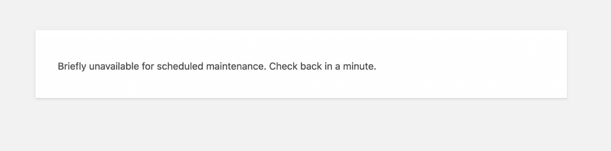

WordPress maintenance mode

WordPress 使用一个名为。维护”来显示一条消息，说明“计划维护暂时不可用。请尽快重试。”

> Kinsta 把我宠坏了，所以我现在要求每个供应商都提供这样的服务。我们还试图通过我们的 SaaS 工具支持达到这一水平。
> 
> <footer class="wp-block-kinsta-client-quote__footer">
> 
> 
> 
> <cite class="wp-block-kinsta-client-quote__cite">Suganthan Mohanadasan from @Suganthanmn</cite></footer>

[View plans](https://kinsta.com/plans/)

这条消息有点稀疏，在空白页上，如果让人放心。但是如果它能告诉访问者更多的信息，如果它能与你的网站相匹配，那就更好了。

这就是为什么当你在工作的时候，使用维护模式插件将你的网站置于维护模式是一个好主意，并为访问者提供更多的信息。

[即将到来的页面&维护模式](https://wordpress.org/plugins/coming-soon/)插件将让你创建一个维护模式页面，反映你的品牌，并给访问者提供更多关于正在发生的事情的信息。你也可以在开发你的网站时使用它来建立一个“即将到来”的页面，并收集[的电子邮件地址](https://kinsta.com/blog/find-email-address/)，以便在网站上线时通知人们。

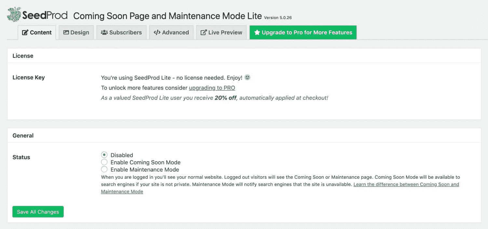

Maintenance Mode plugin

如果你在你的网站上做任何维护工作(包括运行更新)，我建议首先激活维护模式，这样你的网站看起来就不会坏了。如果你的网站被破坏了，把它设置成维护模式，这样当你试图修复它的时候，外界就看不到你在做什么。

## 备份你的 WordPress 站点

维护你的 WordPress 站点最重要的一个方面就是保持它的备份。

如果你用的是 Kinsta，你的网站会定期自动备份，如果有问题，你可以很容易地重新安装旧版本的网站。

如果你没有这个权限，你需要[安装并配置一个备份插件](https://kinsta.com/blog/wordpress-backup-plugins/)，这样你就可以定期自动备份。

然后，如果你的 WordPress 网站被黑了或者瘫痪了，你知道你可以很容易地恢复一个你知道有效的版本。这给你的内心平静是很重要的。

如果你在你的网站上做维护工作——运行更新、[编辑主题](https://kinsta.com/blog/wordpress-child-theme/)、安装插件或任何设置——最安全的做法是在开始之前进行[手动备份](https://kinsta.com/help/wordpress-backups/#create-wordpress-backup)，或者通过 [MyKinsta 仪表板](https://kinsta.com/blog/manage-multiple-wordpress-sites/)或者使用你的备份插件。然后，如果你做的工作破坏了你的网站，你可以回滚。

## 保持你的 WordPress 站点更新

维护你的 WordPress 站点的另一个重要方面是保持它的更新。这包括定期更新主题和插件以及 WordPress 本身。

### 为什么更新很重要

这样做有三个原因:

*   大多数更新包括[安全](https://kinsta.com/blog/wordpress-security/)补丁。如果你安装了这些，你的网站会更安全。
*   更新你的主题或插件可以确保你获得最新的功能。
*   一些主题和插件的更新是为了确保与最新版本的兼容性，所以更新可以确保你的网站不会有任何问题。

您可以手动定期更新，也可以设置自动更新来节省时间和麻烦。

无论哪种方式，在你的活动站点之前在你的临时站点上运行任何更新都是一个好主意，以确保它们不会引起任何问题。Kinsta 在其所有托管计划中包括了[暂存站点](https://kinsta.com/help/staging-environment/)，这意味着你可以在将插件和主题更新以及[核心更新](https://kinsta.com/knowledgebase/wordpress-core/)推送到你的实时站点之前，在一个安全的环境中测试它们。

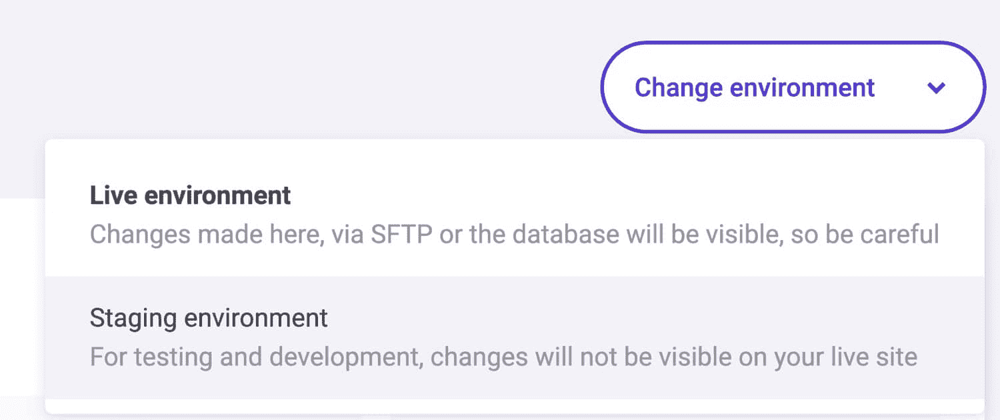

Kinsta staging

### 移除未使用的主题和插件

如果你删除了任何不活跃的主题或插件，保持你的网站更新会更容易。你在网站上安装的每个主题或插件都是潜在的不兼容或不安全的额外来源，所以只安装那些你实际使用的主题和插件是有意义的。

因此，如果你安装了一个主题或插件来测试它，然后为了另一个而停用它，确保你尽快删除它。
T3】

## 保证你的 WordPress 站点的安全

为了避免黑客和其他安全漏洞，保证你的 WordPress 站点的安全是很重要的。

有了 Kinsta hosting，您可以确信安全性是非常重要的。以至于 Kinsta 为每个计划提供了一个[恶意软件安全保证](https://kinsta.com/knowledgebase/malware-security/),万一发生不好的事情，安全专家会修复你的网站。

采取措施保护自己的网站也是值得的。始终使用安全的密码，保持你的插件和主题最新，不要从官方插件或主题目录之外的来源下载免费的主题或插件，并确保你网站上的其他用户帐户也得到良好的管理(稍后会有更多)。

如果你不在 Kinsta 主机上，一个[安全插件](https://kinsta.com/blog/wordpress-security-plugins/)将帮助你监控安全风险或漏洞，并确定你需要做什么来修复它们。确保你[加固了你的 WordPress 站点](https://kinsta.com/blog/wordpress-security/)，使其不那么容易受到攻击。

## 提高你的 WordPress 网站的性能

如果你的站点是安全的，是最新的，并且有备份，你就可以放心了，因为基本的东西都处理好了。但是努力提高网站的性能和页面速度也是值得的。

这有两个好处:

*   一个快速的网站将享有更高的搜索引擎排名，这将促进你的搜索引擎优化。
*   一个快速的网站意味着在第一页加载之前离开的访问者更少。

为了提高你的网站的性能，确保你使用的主机性能和正常运行时间的承诺。只安装信誉良好的插件和主题。使用性能插件和/或外部工具，如 [Google Page Speed Insights](https://kinsta.com/blog/google-pagespeed-insights/) ，定期测试你网站的性能。

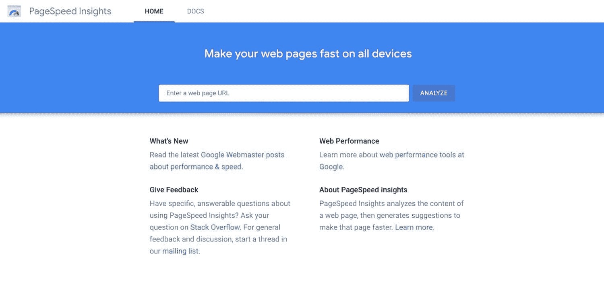

Page Speed Insights

如果性能没有达到应有的水平，你可以采取措施[加速你的网站](https://kinsta.com/learn/speed-up-wordpress/)，这可能包括切换到性能更好的插件，编辑你的主题中的代码，打开缩小，优化图像和其他资产。

[Kinsta 客户](https://kinsta.com/plans/?plan=visits-business1&interval=month)在这个过程中获得了额外的帮助，因为[代码缩减功能](https://kinsta.com/help/kinsta-cdn/#code-minification-1)内置在 [MyKinsta 仪表板](https://kinsta.com/mykinsta/)中。这使得客户只需点击一个按钮，就可以轻松实现 CSS 和 JavaScript 的自动缩小，从而有效地加速他们的网站，而无需手动操作。

您的站点中可以提高性能的方面包括:

*   您的数据库–[优化数据库表](https://kinsta.com/knowledgebase/wp-options-autoloaded-data/),以便 WordPress 可以更快地从中读取数据。
*   修订—[优化修订](https://kinsta.com/blog/wordpress-revisions/)将减少数据库中不需要的内容并提高性能。
*   资产——确保你[在你的主题和插件中正确地](https://kinsta.com/blog/wp-enqueue-scripts/)排列脚本和样式表。
*   图片–[避免加载比所需尺寸](https://kinsta.com/blog/optimize-images-for-web/)更大的图片，在上传前编辑图片或使用图片优化插件。并考虑使用[内容交付网络](https://kinsta.com/blog/wordpress-cdn/) (CDN)来交付它们。

### Info

Kinsta 使用[最先进的技术](https://kinsta.com/features/)来提高性能。与其他主机提供商相比，客户的网站速度提升了 200 %。

## WordPress 站点的疑难解答

有时候你的 WordPress 站点会出现问题。这些可能是严重的，例如，如果您的网站被黑客攻击或更新破坏了网站。或者它们可能是小的[常见的 WordPress 错误](https://kinsta.com/blog/wordpress-errors/)，比如断开的链接或者图片不能正确加载。

以下是一些有助于您识别和解决问题的资源:

*   [修复 404 错误](https://kinsta.com/blog/error-404-not-found/)未找到页面。
*   [修复断开的链接](https://kinsta.com/blog/broken-links/)而不必手动搜索你的网站。
*   [修复向媒体库上传图像时的 http 错误](https://kinsta.com/blog/wordpress-http-error/)。
*   如果图像没有加载，使用[修复媒体库](https://wordpress.org/plugins/wow-media-library-fix/)插件来修复图像的数据库条目。

## 审核评论和管理用户

遗憾的是，用户可能会给你的网站带来不安全性和性能问题。

*   拥有管理员权限的用户可能会安装不安全或编码错误的插件或主题，
*   有权限在你的站点中创建和编辑内容的用户可以上传图片或其他媒体，这会降低你站点的速度。
*   用户在你的网站上留下评论会给你的网站带来垃圾链接或内容，这会影响你的搜索引擎优化，甚至会把你列入黑名单。

所有管理员用户都需要了解安全性和性能的重要性，以及他们应该做些什么来保持您的网站正常运行。确保他们知道只使用安全密码，并添加来自可靠来源的软件。一个安全插件会让你强制使用强密码，或者你可以安装一个插件，比如 [WC 密码强度设置](https://wordpress.org/plugins/wc-password-strength-settings/)，这是专门针对这个的。

投稿人和编辑也需要强密码，这样没人能用他们的账号黑你的网站，上传你不想要的内容。强制使用强密码将使您不必再培训他们。

使用一个[插件来压缩图片](https://kinsta.com/learn/page-speed/#improve-website-speed)，这样如果你的用户上传大图片，就不会有性能问题。

在某些情况下，评论会给你的网站带来垃圾信息，降低速度。[通过编辑您的讨论设置或使用插件来阻止垃圾评论](https://kinsta.com/blog/wordpress-spam-comments/)。您可以通过使用第三方评论系统或再次编辑您的讨论设置来防止评论降低性能。

你还需要对你网站上的评论进行调节和回复。您可以编辑讨论设置，以便在添加评论时通知您，还可以配置设置，以便在您对评论进行审核之前不发布评论。

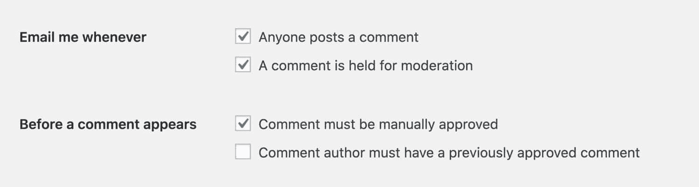

WordPress discussion settings

在每一条评论发布前对其进行审核是非常耗时的。你可能更喜欢这样设置，如果有人的评论在过去被批准，他们可以再次评论而无需审核。这在阻止垃圾邮件和鼓励讨论之间给了你一个平衡，同时也节省了你的时间。如果你想更好地控制垃圾评论， [Akismet](https://wordpress.org/plugins/akismet/) 插件会阻止垃圾评论，甚至不会通知你进行审核。

## 审核你网站的搜索引擎优化

仅仅创建一个 WordPress 网站并把它放在互联网上还不足以让你拥有追随者或者帮助你销售产品或者 T2 服务。你需要吸引访问者到你的网站。

这就是 SEO 的用武之地。一个 [SEO 插件](https://kinsta.com/blog/best-seo-plugins-for-wordpress/)将帮助你提高你的 SEO，使用[SEO 最佳实践](https://kinsta.com/blog/wordpress-seo/)将会给你额外的提升。但它也有助于如果你审计你的搜索引擎优化，并定期监测。

## 注册订阅时事通讯

### 想知道我们是怎么让流量增长超过 1000%的吗？

加入 20，000 多名获得我们每周时事通讯和内部消息的人的行列吧！

[Subscribe Now](#newsletter)

谷歌搜索控制台是搜索引擎优化的最佳工具之一。它可以帮助你诊断搜索引擎优化问题，也给你数据，你可以用它来确定你的最佳表现内容，查看[你的关键词排名](https://kinsta.com/blog/keyword-research/)，并检查你所有的内部和[外部链接](https://kinsta.com/blog/negative-seo/#how-to-check-backlinks)。

它经常被网站所有者忽略，但是它是完全免费的，它将为你提供数据，帮助你提高搜索引擎优化，使你的内容策略更具战略性。请务必查看这篇关于 Bing 网站管理员工具的[深度指南。](https://kinsta.com/blog/bing-webmaster-tools/)

像 [Accuranker](https://www.accuranker.com/cases/kinsta) 这样的工具将帮助你监控你的搜索引擎排名，这样你就可以发现任何问题并[修复它们](https://kinsta.com/blog/decline-seo-rankings/)。它还会帮助你确定你排名的关键词，以及你需要投入更多精力的关键词。

你也可以进行一次技术搜索引擎优化审计来帮助你确定什么对你的搜索引擎优化有效，什么需要改进。

## 监控活动和错误日志

最后，监控你的网站的最不光彩的方面之一:监控网站上的活动和检查错误日志。

[监控你网站上的活动](https://kinsta.com/blog/wordpress-activity-log/)意味着你会知道什么时候发生了不应该发生的事情，比如意外添加了新用户，或者上传了不应该上传的文件。它还将帮助你管理你的内容，并确信文章在应该发表的时候被发表了。

WP 安全审计日志插件给你的管理员增加了一个记录你网站上所有活动的界面。

WordPress activity log

这样，您可以一眼看出发生了什么，并立即发现任何潜在的问题。

您还应该监控站点上的错误，以便尽快修复它们。有一些工具可以帮助您做到这一点，包括:

*   MyKinsta analytics 将帮助您监控您的网站并解决任何问题。
*   Query Monitor 将调试你的站点，识别诸如缓慢的数据库查询、REST API 请求、钩子触发等等。这可以帮助您确定任何问题的原因。
*   查看原始的 WordPress 错误日志或者在[wp-config.php 文件](https://kinsta.com/blog/wp-config-php/)中启用错误日志将帮助你[解决和调试任何 WordPress 问题](https://kinsta.com/blog/wordpress-debug/)。

使用这些工具可以帮助你避免任何问题，因此，当你的网站出现问题或停止正常工作时，你可以采取预防措施来保持正常运行，而不是采取追溯措施来修复网站。

## 为高级 WordPress 支持付费

所有这些听起来像是很多工作。的确，维护网站的大部分工作都可以自动化。您可以计划自动备份，配置自动运行的更新，并对您的存储运行自动安全检查，这将提醒您任何问题。

但是你仍然需要设置好这一切。你必须花时间检查任何问题。你可能也要修理它们。

这就是为什么雇佣 WordPress 维护专家是有帮助的。

### 付费支持的利与弊

支付[高级 WordPress 支持](https://kinsta.com/blog/wordpress-support/#premium-wordpress-support)和维护费用将减轻你的负担。它会让你安心，因为你知道专家正在监控你的网站，并修复任何出现的问题。

它不需要你了解网站安全、错误日志或 404 页面。这意味着你可以把时间投入到你最擅长的事情上:[为你的网站创作内容](https://kinsta.com/blog/content-length/)和[经营你的业务](https://kinsta.com/blog/recurring-revenue-model/)。

但是它也有不好的一面。

首先，它可能很贵。这也意味着你失去了更好地理解你的网站和掌握它如何工作的机会。如果你喜欢拥有控制权，那么将你珍贵的网站托付给一个陌生人可能会令人望而生畏。

因此，你可能会决定外包一些工作，或者选择像 Kinsta 这样的托管服务提供商，他们会为你做一些工作。你可能会决定将你所知最少的网站维护工作外包出去，或者如果你不这样做，将会给你的网站带来最大的风险。

### Kinsta 提供的维护和支持服务

如果你有一个 [Kinsta 托管计划](https://kinsta.com/features/)，你的一些 WordPress 维护和安全需求将会得到照顾，这样你就不必雇佣另一个提供商。

*   一个[恶意软件安全保证](https://kinsta.com/knowledgebase/malware-security/)意味着你的网站不太可能被黑客攻击，因为有最先进的保护。如果被黑了，金斯塔会帮你修好的。
*   [自动备份](https://kinsta.com/help/wordpress-backups/)意味着您知道如果出现问题，您可以将您的网站恢复到以前的版本，只需点击一下就可以轻松恢复您的网站。
*   [暂存环境](https://kinsta.com/help/staging-environment/)意味着你可以对你的站点进行更改并测试它们，而不会有任何风险:首先测试暂存环境中的所有东西，然后将其复制到现场。
*   速度至上的架构意味着你的网站会很快，只要你管理得当，你就不需要担心性能。
*   定期运行时间检查(每两分钟一次)意味着你可以确信你的网站不会在没有人注意到的情况下关闭。
*   [24/7 多语言支持](https://kinsta.com/help/multilingual-support/)，这意味着您可以提出问题，我们将帮助您解决问题或告诉您如何解决。

当涉及到你的站点(客户站点)的 WordPress 维护时，这些特性将会节省你大量的时间，并且帮助你避免站点维护的麻烦。

### WordPress 支持和维护服务的顶级提供商

如果你决定雇佣专业人士，找到一个你可以信任的供应商是很重要的。这就是为什么我们编辑了一份 WordPress 维护和支持提供商的名单，我们和他们合作过，并且对他们有信心。

下面的一个或多个提供商可能会满足您的需求:每个人都是不同的，但您应该在这里找到可以帮助您的人。

#### 1.WP Buffs

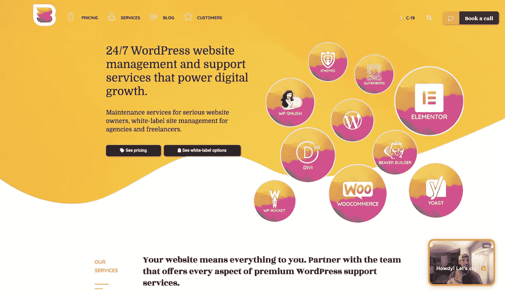

WP Buffs

WP 爱好者将他们的服务描述为“为严肃的网站所有者提供 24/7 WordPress 网站维护服务&白标合作伙伴”。

他们提供网站监控和支持，增强的安全性，速度优化，每周主题和插件更新，以及对 WooCommerce 和更复杂网站的高级支持。他们还提供 WordPress 培训，[运营播客](https://kinsta.com/blog/wordpress-podcast/)，并有一个很棒的 WordPress 博客。

WordPress 机构、自由职业者和专业人士也可以使用他们的白标支持程序为他们的客户提供 24/7 的支持，同时还可以获得每月的经常性收入。WP Mastery 的简·科赫(Jan Koch)通过他们的白标项目获得了 4 位数的月利润(T1)，而里奇·梅塔(Rich Mehta)或严谨的数字公司(strict Digital)的 T2 将其代理公司的利润率提高了 23%(T3)。

推荐阅读:[你开始和经营一个成功的 WordPress 代理公司的指南](https://kinsta.com/blog/wordpress-agency/)。

#### 2.暴涨 WP

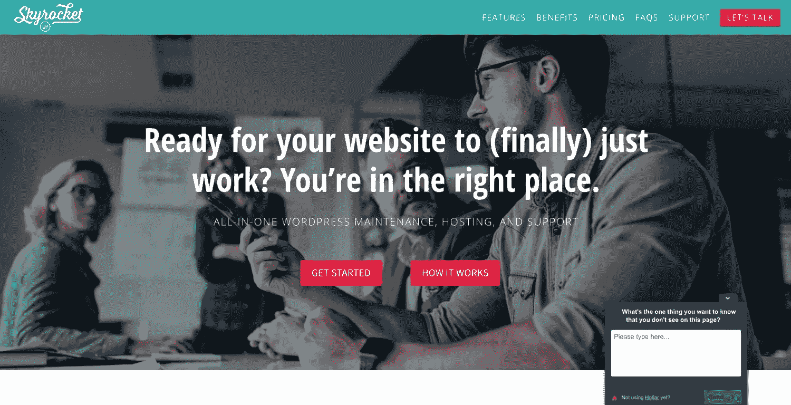

SkyRocketWP

除了 Kinsta 提供的托管服务，SkyRocketWP 还提供维护和支持服务。这种托管是完全管理的，有 24/7 的监控和支持，一旦出现任何安全问题，他们会立即修复。

它们还提供每日备份、网站优化、性能和正常运行时间监控、黑客防护、恶意软件扫描和删除，以及页面加载速度保证。

注册 SkyRocketWP，你将获得 Kinsta 主机，并在上面提供完整的网站管理。

#### 3.可编码的

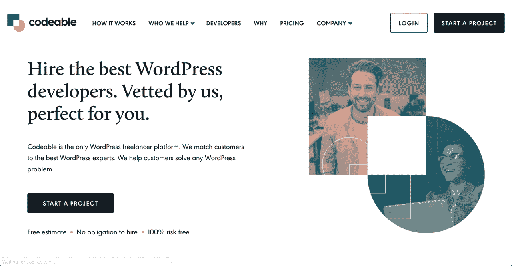

Codeable

可编码的提供了一些不同的东西。他们不是一家支持和维护公司，而是让你接触到 WordPress 自由职业者，他们可以帮助你维护和开发你的网站。

无论你需要主题开发、定制插件、主题定制还是定制集成，他们都可以帮你联系到一个能够提供帮助的 WordPress 开发者。

当你找到一个自由职业者时，你把项目的价格存入 Codeable，只有当你把项目标记为完成时，它才会支付给自由职业者。

#### 4.点击 WP

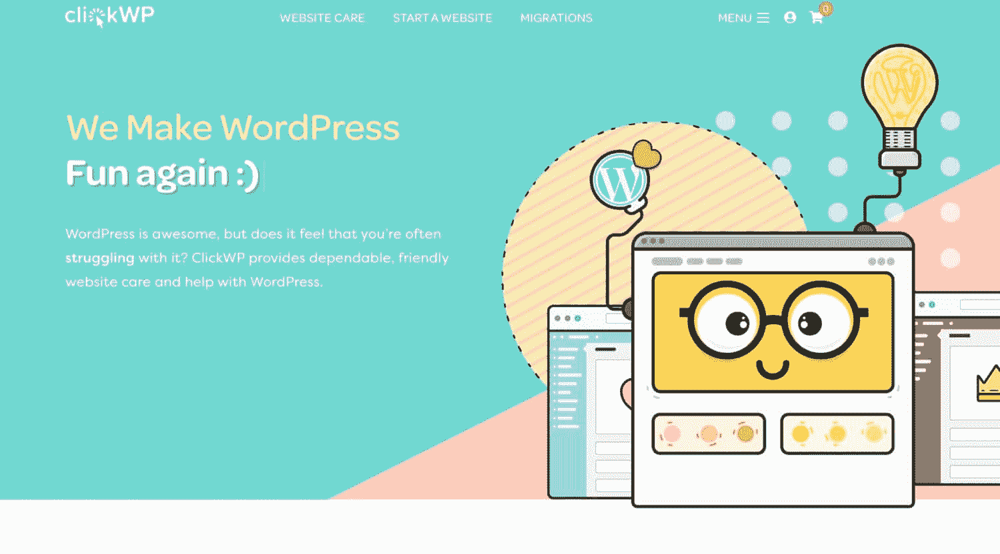

ClickWP

ClickWP 提供 WordPress 支持，这样你就可以继续运营你的网站，称他们“让 WordPress 再次变得有趣”。

他们提供网站启动包托管，使设计更容易。他们有预先制作的设计(以主题的形式)，您可以自定义并添加您自己的内容，或者让他们为您添加标准页面。他们的服务旨在为网站创建新手提供便利。

他们还提供支持:他们会回答你的 WordPress 问题，并帮助完成不需要编码的任务或开发任务，每月收取固定费用。

#### 5.服侍

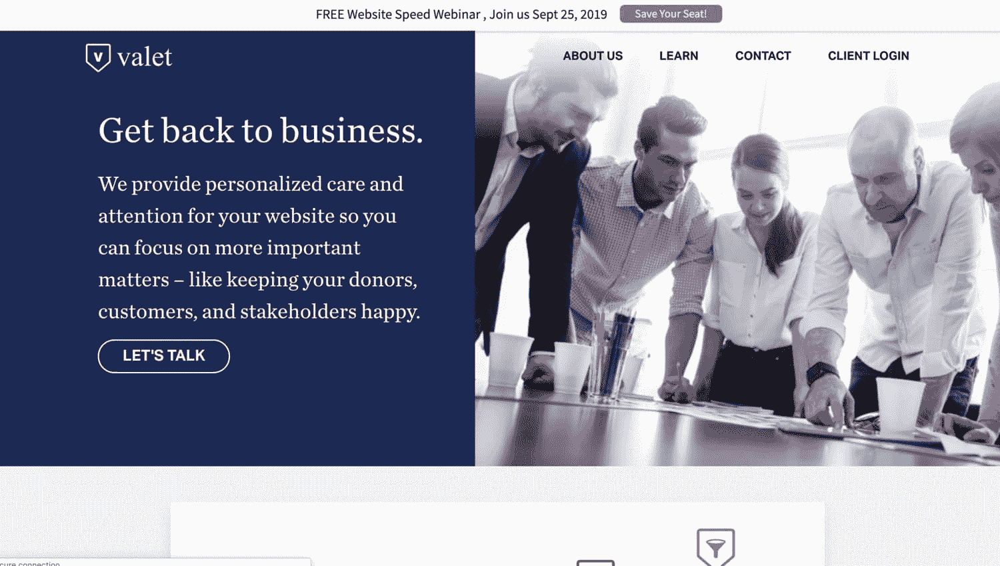

Valet

代客服务提供一项服务，旨在帮助你拥有一个“健康、富有、明智”的网站。他们提供一项定制服务，目标是那些想要摆脱运行和维护 WordPress 网站的麻烦的大型企业。

当你雇佣他们时，会根据你的需求分配给你一个专家团队:开发人员、工程师、WordPress 专家和其他数字专业人士。

#### 6.WordXpress

WordXpress

WordPress 提供 24/7 的 WordPress 支持和维护。除了管理更新和安全之类的事情，他们还会在你请求时对你的网站进行编辑，并为你的 SEO 工作。

他们提供三个级别的支持和不断增加的服务，从基本的安全和监控到完整的网站维护。

#### 7.mintWP

[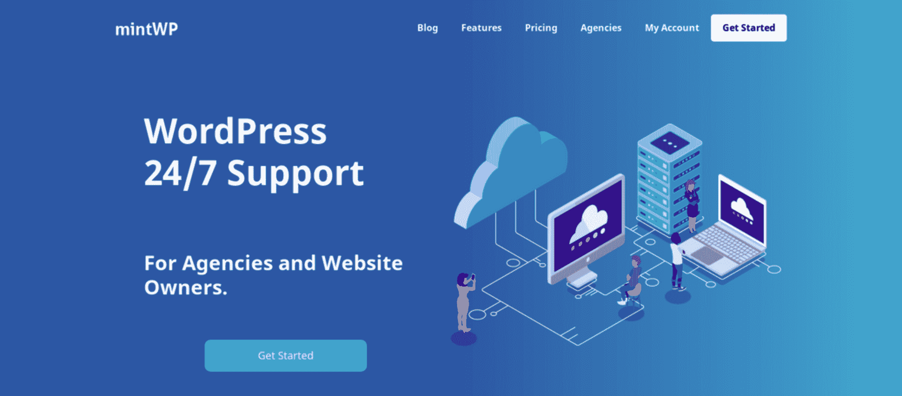](https://mintwp.com/)

mintWP

mintWP 提供完整的 WordPress 维护服务，将 Kinsta 主机作为他们所有计划的标准。

他们和个人或自由职业者一起工作，不管是什么类型的 WordPress 网站。他们还提供完整的白标代理解决方案，包括 Kinsta 的站点设置、持续维护和 24/7 支持。这给了网站所有者和代理机构空间来专注于他们的核心业务。

mintWP 继续增加价值，每月增加新功能作为计划的标准，降低全球自由职业者和机构的成本。

#### 8.纽特实验室

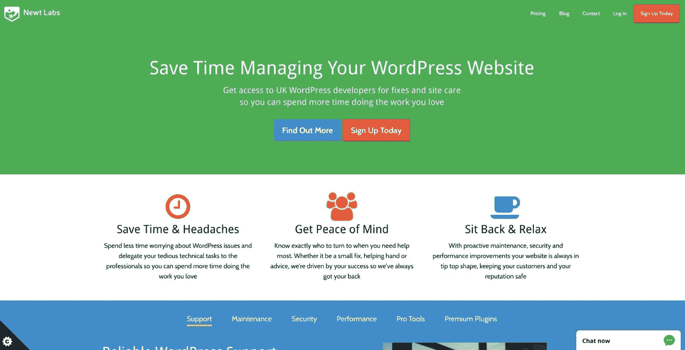

Newt Labs

Newt Labs 是一家总部位于英国的公司，其服务旨在节省你管理 WordPress 网站的时间。

服务包括修复网站问题，保持网站更新和备份，以及修补和监控安全问题。他们的计划还包括旨在提高网站性能的托管 WordPress 主机，以及有助于提高网站效率的优质插件。

与宕机和 WordPress 问题做斗争？Kinsta 是一款考虑到性能和安全性的托管解决方案！[查看我们的计划](https://kinsta.com/plans/?in-article-cta)

#### 9.GoWP

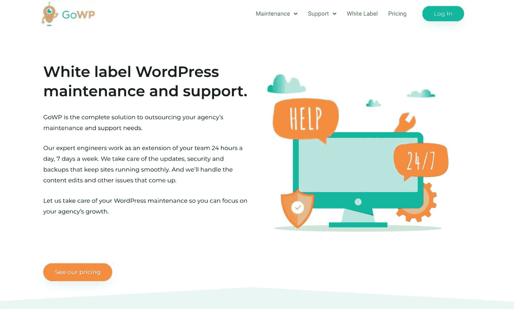

GoWP

GoWP 提供白色标签 WordPress 的维护和支持。他们的服务是针对代理机构的，他们把自己描述成你团队的延伸。

他们将帮助您管理和维护客户网站，提供内容编辑、备份、安全扫描、恶意软件修复和一个白色标签维护仪表板插件，您可以定制该插件以反映您的品牌。

如果你是一家网站设计或开发机构，其客户需要托管和支持，但你没有时间或资源来提供，GoWP 可以帮助你。

#### 10.WP 曲线

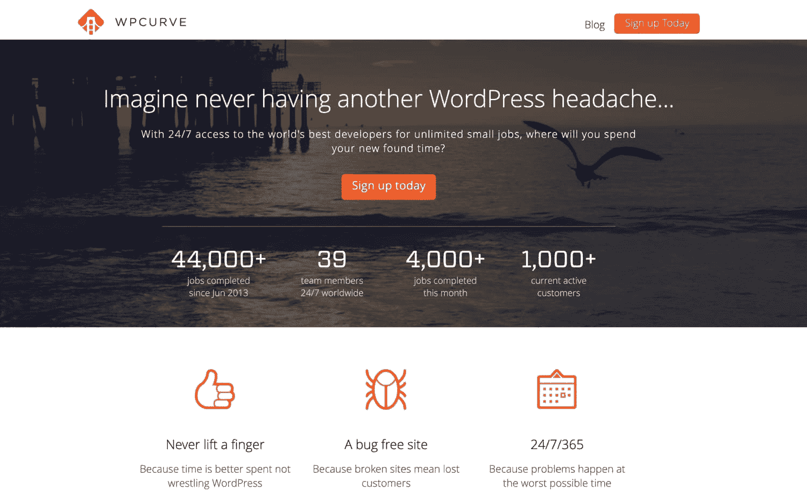

WPCurve

WPCurve 的服务包括定期维护和安全，但也会帮助你更有效地使用你的网站。

除了提供漏洞修复、监控和更新，他们还会建议你如何提高网站的转化率，降低跳出率，增加流量。他们在世界各地都有团队成员，可以回复你通过电子邮件发送的工作请求，并帮助你使你的网站更加努力、更加可靠。

#### 11.维护

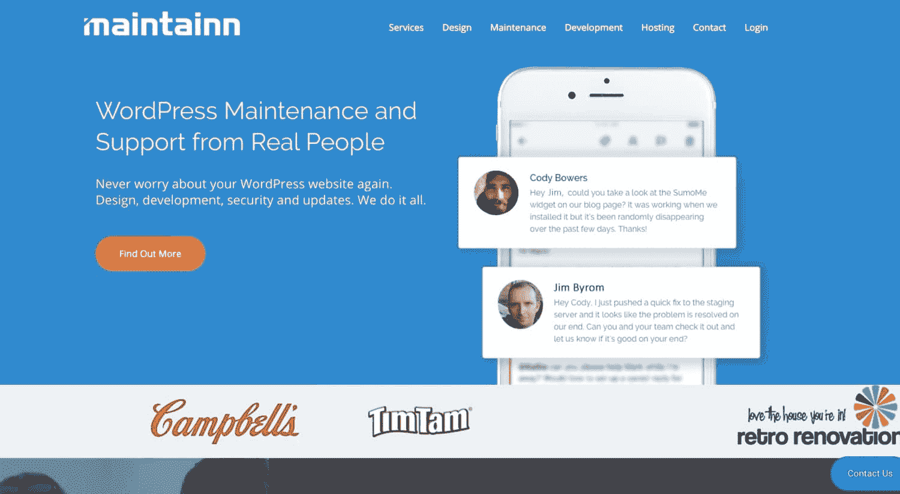

Maintainn

maintain 提供 WordPress 维护和支持‘来自真人’。

他们提供备份、定期更新、安全监控和修复。他们还会修复你的网站内容或配置的任何问题。他们的团队包括公认的 WordPress 专家，除了维护，他们还提供开发和托管。

#### 12.WPSiteCare

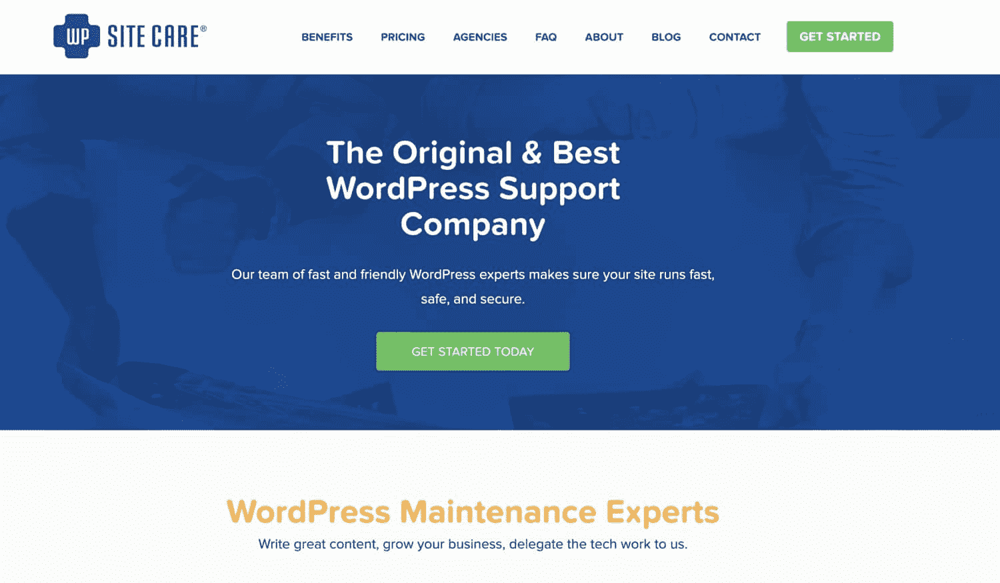

WPSiteCare

WPSiteCare 的团队将自己描述为“最初的&最佳 WordPress 支持公司”(这是一个大胆的说法！).

他们的服务包括安全监控、自动备份、性能优化和 SEO 支持。他们还提供指导，旨在帮助你从你的 WordPress 网站中获得最大收益，并有一个为机构设计的项目，旨在帮助客户网站管理。

#### 13.FixRunner

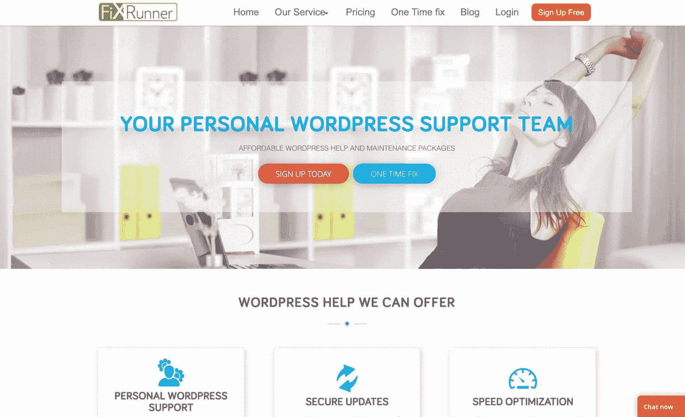

FixRunner

FixRunner 提供自动云备份、正常运行时间、安全监控、速度优化和个人 WordPress 支持。他们会回应并解决你网站上的任何问题，而且在完成之前你不需要支付费用。

#### 14.WPMaintainer

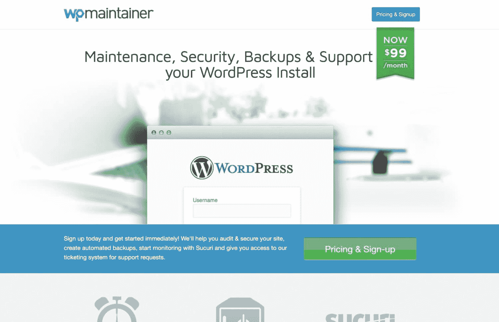

WPMaintainer

[WPMaintainer](https://wpmaintainer.com/) 的计划包括主题和插件更新、自动备份、使用 Sucuri 的安全监控、免费的[迁移](https://kinsta.com/blog/migrate-wordpress-site/)、对主题和插件的兼容性支持以及打折的开发成本(建议阅读:[强大的 WordPress 迁移插件](https://kinsta.com/blog/wordpress-migration-plugins/))。

如果你和他们签订了一个常规计划，你也可以以较低的价格雇佣他们的开发人员做额外的工作，这样你可以灵活地持续维护你的网站，也可以在你需要的时候开发它。

#### 15.WP 技术支持

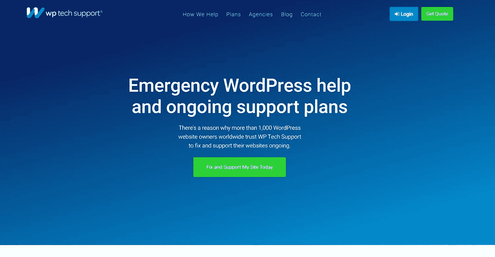

WPTechsupport

WP 技术支持为你的 WordPress 站点提供紧急援助。如果您遇到安全漏洞，他们会找出问题的原因并为您修复。

他们还提供持续的维护计划，重点是网站安全。除了保持您的网站更新和备份，他们还会定期对您的网站进行人工审查，以确保它不容易受到攻击。您可以通过他们的客户门户网站查看这些评论的报告。他们也和代理机构合作。

#### 16.WPSitePlan

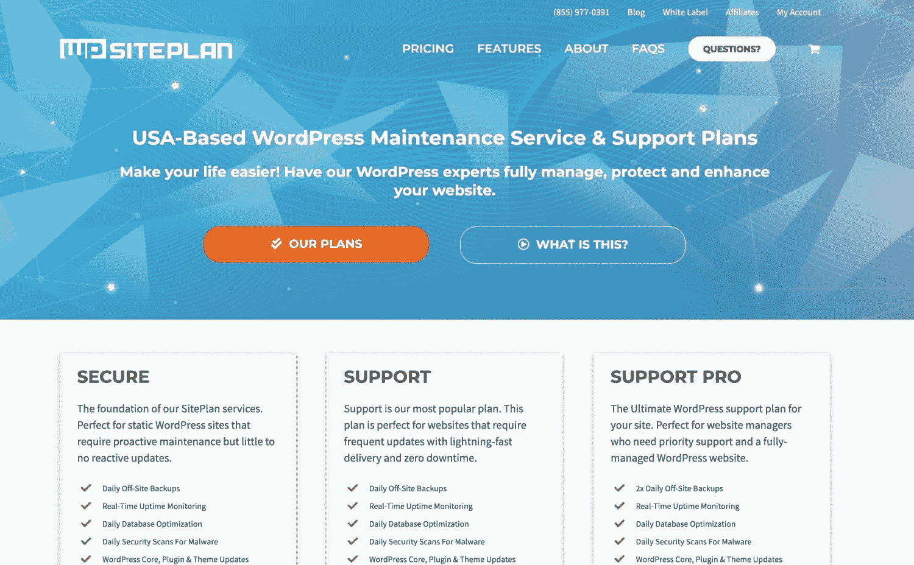

WPSitePlan

WPSitePlan 是一家总部位于美国的维护和支持提供商。他们提供分层计划，从基本计划开始，包括每日备份、正常运行时间监控、[数据库](https://kinsta.com/knowledgebase/wordpress-database/)优化、安全扫描、更新和每月报告。

他们的顶级计划还包括无限制的服务台支持、WooCommerce 支持、完全的恶意软件删除和每日站点扫描。

#### 17.WPFixIt

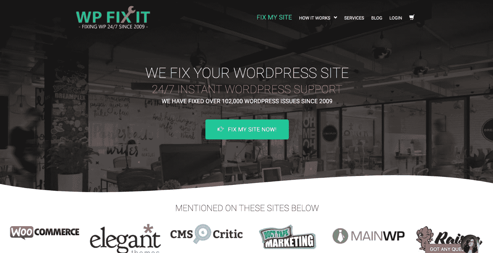

WPFixIt

WPFixIt 提供 24/7 即时 WordPress 支持。除了正在进行的计划之外，他们还有一系列固定收费的服务。

服务包括一般支持、感染清除、速度优化、网站调试和网络商务检查。

他们还提供每月支持服务，包括全面的网站管理、安全监控、每日备份和网站更新。

#### 18.WPButler

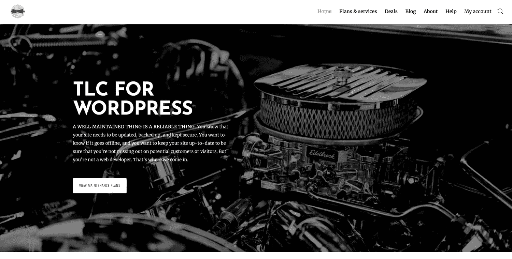

The WPButler

WPButler 将他们的服务描述为“WordPress 的 TLC”。他们为您的网站提供定期维护、支持和监控，并将修复任何问题。

服务包括在站点出现问题时从备份中恢复站点、增强安全性、正常运行时间监控和自动备份。

他们有一系列针对不同业务的计划。最高计划包括网站审查和每月 30 分钟的开发时间。他们还提供一个月聘计划，你可以提前支付开发时间。

#### 19.固定矿

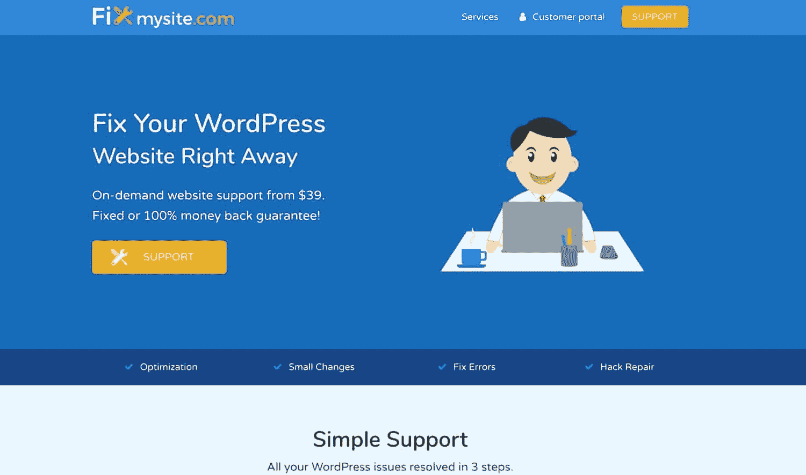

FixMySite

FixMySite 的服务旨在帮助你快速修复你的 WordPress 站点的任何问题。

他们提供按需网站支持，并保证退款。修复包括对你的网站做一些小的改动，修复被黑的网站，迁移网站，解决 T2 主题或插件冲突。

#### 20.FixMyWP

FixMyWP

FixMyWP 还提供按需服务，旨在修复你的 WordPress 网站的问题。

他们会修复一个被黑的网站，编辑一个坏的主题，或者修复一个不工作的插件。他们还提供定期维护计划，包括更新、垃圾邮件清理、数据库优化、备份和电子邮件支持。

#### 21.TotalWPSupport

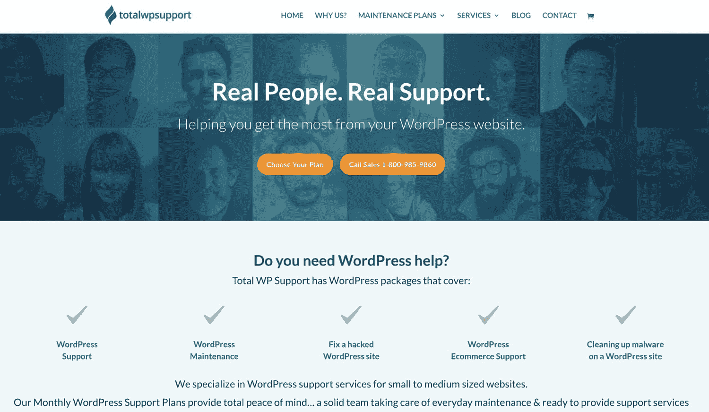

TotalWPSupport

TotalWPSupport 提供一系列的 WordPress 支持和维护服务。他们会加固你的网站，修复潜在的威胁，备份你的网站，更新主题，插件和 WordPress 核心，24/7 监控你的网站。

他们提供了一系列计划，其中最高的包括托管、实时备份、暂存、CDN、 [SSL](https://kinsta.com/knowledgebase/how-ssl-works/) 和一个专门的客户经理。

延伸阅读:管理一家网店？请务必查看我们关于如何向 WooCommerce 添加 SSL 证书的深入指南[。](https://kinsta.com/knowledgebase/woocommerce-ssl/)

#### 22.WP 骑士

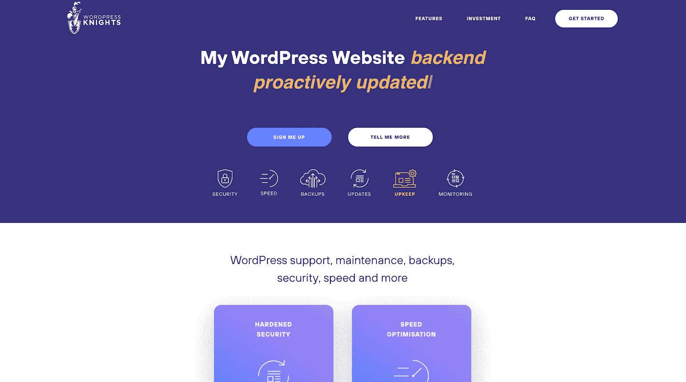

WPKnights

WPKnights 是一个 WordPress 维护和支持服务，由一群 WordPress 极客运营——或者他们喜欢称自己为 Knights。

除了备份、更新和监控等常见服务之外，他们的服务还注重速度和安全性的提高。最重要的是，他们通过三个自助服务计划(每月 49 美元起)来吸引各级 WordPress 网站所有者，让他们完全放心。

他们为自己响应迅速、亲力亲为的客户服务感到自豪，并与每位客户建立了长期关系。

[The hardest (and most important) part of managing a #WordPress site is keeping it in shape 🏋️ Learn all you need to do to take care of your site (and where to get professional help)!👨🏻‍🏭🛠Click to Tweet](https://twitter.com/intent/tweet?url=https%3A%2F%2Fbit.ly%2F2AqHv42&via=kinsta&text=The+hardest+%28and+most+important%29+part+of+managing+a+%23WordPress+site+is+keeping+it+in+shape+%F0%9F%8F%8B%EF%B8%8F+Learn+all+you+need+to+do+to+take+care+of+your+site+%28and+where+to+get+professional+help%29%21%F0%9F%91%A8%F0%9F%8F%BB%E2%80%8D%F0%9F%8F%AD%F0%9F%9B%A0&hashtags=maintenance%2Cwptips)

#### 23.TemplateMonster 网站维护服务

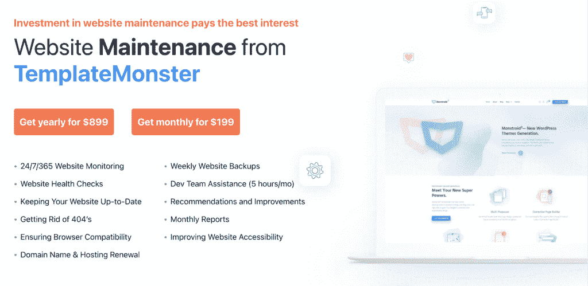

TemplateMonster 承诺提供由专家执行的高质量[维护服务](https://www.templatemonster.com/website-maintenance-services/?utm_campaign=maintenance_services&utm_source=kinsta&utm_medium=referral)。

它们提供无障碍正常运行时间监控、定期网站健康检查和每周备份。还有就是安全防护。换句话说，团队尽一切努力保护网站免受恶意软件问题的影响。除此之外，开发团队将每月为您提供 5 个小时的帮助。

这项服务的其他好处包括域名和主机更新、推荐和改进、浏览器兼容性和网站可访问性。在月底，你会得到一份报告，突出显示所有已完成的任务。

## 摘要

WordPress 的维护对任何网站来说都是必不可少的。

你可以选择花时间自己维护和更新你的网站，用插件自动完成一些过程，或者出租。你选择哪一个取决于你的技能、资源和预算。

但是无论你做什么，不要忽视网站维护:没有它，你的网站可能会变得脆弱。因此，它会停止吸引游客，并赢得你的转换。

* * *

让你所有的[应用程序](https://kinsta.com/application-hosting/)、[数据库](https://kinsta.com/database-hosting/)和 [WordPress 网站](https://kinsta.com/wordpress-hosting/)在线并在一个屋檐下。我们功能丰富的高性能云平台包括:

*   在 MyKinsta 仪表盘中轻松设置和管理
*   24/7 专家支持
*   最好的谷歌云平台硬件和网络，由 Kubernetes 提供最大的可扩展性
*   面向速度和安全性的企业级 Cloudflare 集成
*   全球受众覆盖全球多达 35 个数据中心和 275 多个 pop

在第一个月使用托管的[应用程序或托管](https://kinsta.com/application-hosting/)的[数据库，您可以享受 20 美元的优惠，亲自测试一下。探索我们的](https://kinsta.com/database-hosting/)[计划](https://kinsta.com/plans/)或[与销售人员交谈](https://kinsta.com/contact-us/)以找到最适合您的方式。