# 找到某人电子邮件地址的 13 种方法(提升你的拓展游戏)

> 原文：<https://kinsta.com/blog/find-email-address/>

所以你想找到某人的电子邮件地址。

也许你想接触一位[有影响力的人](https://kinsta.com/blog/instagram-stats/#staggering-stats-of-instagrams-influencer-marketing)，寻找潜在的销售线索，或者你只是想问某人一个简短的问题。

有很多原因可以让你寻找一个特定的电子邮件地址。幸运的是，也有很多不同的(聪明的)方法来找到它们。

### 更喜欢看[视频版](https://www.youtube.com/watch?v=6MLQpmuvX7s)？

## 为什么找到正确的电子邮件地址很重要

如果你正在发送一封重要的电子邮件，你需要把它送到正确的人面前。为什么？因为很难引起人们的注意。要知道[只有 8.5%的外展邮件](https://backlinko.com/email-outreach-study)收到回复。

让合适的人阅读你的邮件会增加你得到想要的回复的机会。所以花时间**找到某人的电子邮件地址**并修改你的信息是 100%值得的。

如果你想联系一个你不认识的人或者你以前从未说过话的人，这一点尤其正确。

现在，让我们去搜索邮件……

> Kinsta 把我宠坏了，所以我现在要求每个供应商都提供这样的服务。我们还试图通过我们的 SaaS 工具支持达到这一水平。
> 
> <footer class="wp-block-kinsta-client-quote__footer">
> 
> 
> 
> <cite class="wp-block-kinsta-client-quote__cite">Suganthan Mohanadasan from @Suganthanmn</cite></footer>

[View plans](https://kinsta.com/plans/)

## 如何找到某人的邮箱地址？

以下是我过去使用过的一些最可靠的方法和工具——现在仍然在使用——来寻找一个人的电子邮件地址。开始吧！

### 1.使用电子邮件查找工具

查找电子邮件地址最简单的方法之一是使用电子邮件查找服务。你只需要输入一个人的名字和/或网址，工具就会为你搜索相关的地址。

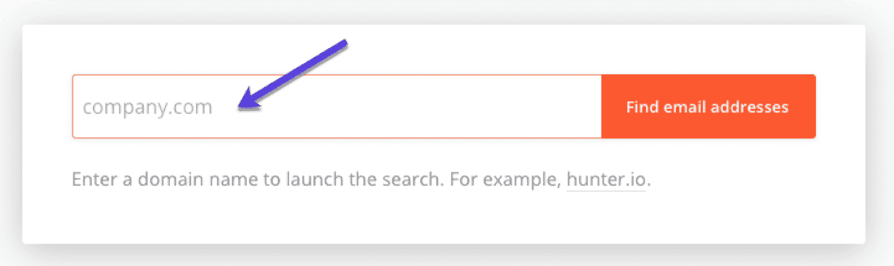

Use an email lookup service (like Hunter)

虽然它们非常有用，但不能保证每次使用时都能获得成功的结果。免费搜索是有限的，付费搜索可能会非常昂贵，尤其是如果你没有得到你想要的地址。

好消息是网上有几乎无穷无尽的电子邮件查找工具列表，所以你有很多选择来看看哪些对你有用。

电子邮件查找服务的工作方式几乎都是一样的:你输入一个名字，试着尽可能地精简它，然后这个工具就会找到最好的电子邮件。

话虽如此，还是有一些不同的定价选项和工具类型可供选择。

下面是一些最流行的电子邮件查找工具，可以帮助你入门(以及它们的价格):

*   [找到那封邮件](https://findthat.email/)–每月 50 次免费搜索。付费账户每月 29 美元，500 次搜索(0.058 美元/次搜索)。
*   [寻找专家](https://finder.expert/)–每月 300 次免费搜索。付费账户每月 39 美元，可搜索 5000 次(0.008 美元/次)。
*   snov . io–每月 50 次免费搜索。1，000 次单次搜索或 500 次批量搜索的付费账户为 29 美元起(0.029 美元/次搜索)。
*   [瞧，诺贝特](https://www.voilanorbert.com/)–50 次免费搜索的免费试用。1000 次搜索的付费账户每月 49 美元起(0.049 美元/次搜索)。
*   来自 Hunter 的[Email Finder](https://hunter.io/email-finder)-每月 50 次免费搜索。1000 次搜索的付费账户每月 49 美元起(0.049 美元/次搜索)。
*   每月 50 次免费搜索。5000 次搜索的付费账户每月 49 美元起(0.0098 美元/次搜索)。
*   [eMail-Prospector Pro](https://www.egrabber.com/emailprospector/)–50 次免费搜索的免费试用。付费账户每年 1195 美元起，限 4000 次搜索(0.299 美元/次搜索)。
*   [FindEmails.com](https://www.findemails.com/)–50 次免费搜索的免费试用。500 次搜索每月收费 19 美元(0.038 美元/次)。
*   [contact out](https://contactout.com/email-finder)–每月 40 次免费搜索。1800 次搜索的付费账户每月 29 美元起(每次搜索 0.0161 美元)。

#### 如何免费找到别人的邮箱？

如果你的预算紧张，这里有三种免费快速查找邮件的方法:

*   Clearbit Connect 是一个 Gmail 和 Outlook 插件，它从各种来源以及他们自己的数据库中寻找一个人的电子邮件(相关:查看[最佳 Gmail 插件和扩展](https://kinsta.com/blog/gmail-add-ons/)以提高您的工作效率)。
*   GetProspect 是一个 Chrome 扩展，允许你通过名字和域名找到某人的电子邮件地址。
*   RocketReach 可以快速为你找到电子邮件，尤其是当你的目标相当高调的时候。只需注册一个免费帐户，并开始电子邮件狩猎。

### 2.在 DuckDuckGo 上使用“@domainname.com”

这个鲜为人知的技巧是一个很好的方法，只需使用另一个搜索引擎就可以找到电子邮件地址。

在 DuckDuckGo 中对“@domainname.com”进行精确匹配搜索，将会得到与该域相关的任何公开的电子邮件地址的结果。

如果你想联系某个特定的人，你可以在搜索中包括你的潜在客户的名字，或者只是保持它的一般性。

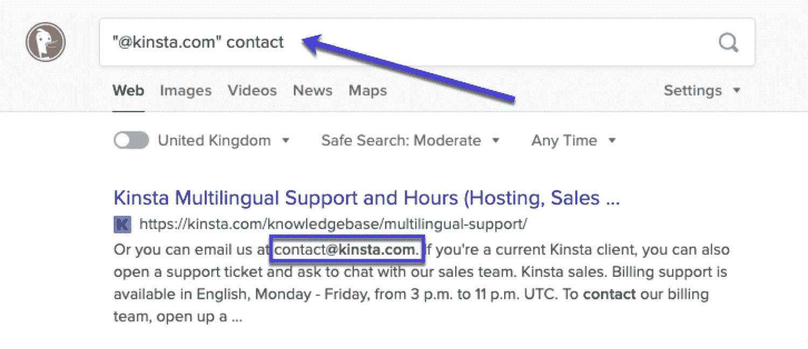

Finding emails on DuckDuckGo

这是一个很方便的技巧，在 DuckDuckGo 和其他几个搜索引擎中非常有效。不幸的是，谷歌使用“@”作为社交媒体标签，所以这一招不管用，在[必应](https://kinsta.com/blog/bing-webmaster-tools/)中也不管用。

### 3.使用 Twitter

人们有时会在他们的推文或 Twitter 个人信息中包含他们的电子邮件地址，但试图通过使用“点”和“在”而不是“在”来隐藏它们。还有“@”。

前往 [Twitter 高级搜索](https://twitter.com/search-advanced)，在潜在客户的推文中搜索“at”和“dot”。

你可以选择要查找的确切短语、要忽略的单词、标签、具体账户和时间范围。在这里玩一下输入。尝试包含诸如“电子邮件”、“接触”或“联系”等词，以更好地过滤结果。

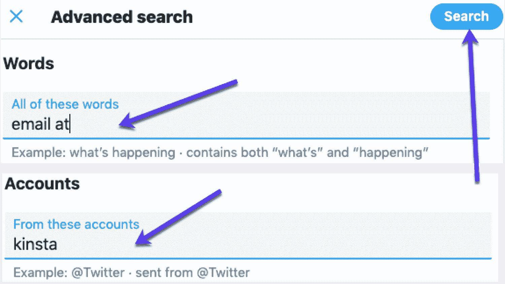

Use Twitter advanced search to find emails

这听起来很大胆，但你也可以试着简单地在 Twitter 上问他们的电子邮件地址。

为了让你的推文最有可能被注意到并得到回应，请保持简洁，并包括一个令人信服的理由让他们回复:

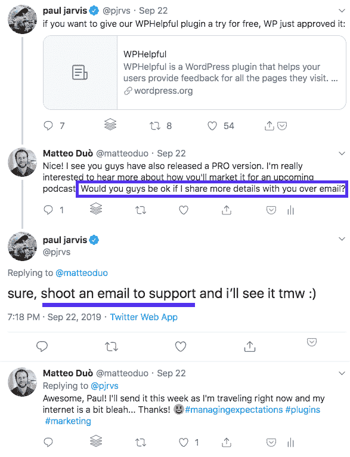

Sometimes you just have to ask directly to get their email address

你也可以通过他们的直接信息来接近他们，比起他们的回复或提及，你的潜在客户更有可能看这些信息。根据他们的隐私设置，您可能需要先关注对方，然后才能向他们发送 DM。

#### 如何查看任何人的旧推文？

实际上，你可以尝试使用 Twitter 的最后一个策略来检查用户过去的推文。通过使用[我的所有推文](https://www.allmytweets.net/connect/)应用程序，你可以免费生成一个多达 3200 条任何人过去推文的列表。

下面是它的使用方法:

前往[我的所有推文](https://www.allmytweets.net/connect/)并使用您的 Twitter 帐户登录。

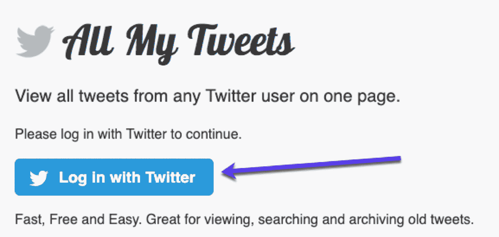

View all tweet from a user on one page via All My Tweets

然后输入你想联系的网站或个人的 Twitter 账号，以获取他们的推文。

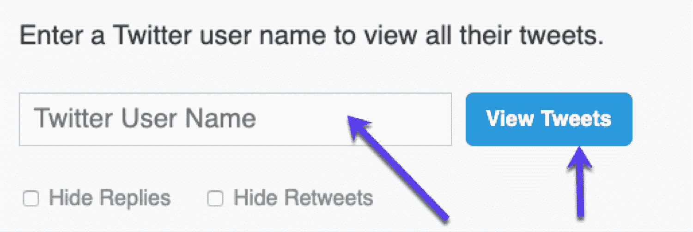

Add a username to view all tweets

一旦你列出了这些，只需点击 Ctrl/Cmd+F，搜索类似于*@域名*、*、【联系人】、*、【电子邮件】、*、*、*的东西，以及其他可能显示电子邮件地址的变体。*

### 4.订阅您的潜在客户电子邮件列表

大多数网站都会有一个[邮件列表](https://kinsta.com/blog/how-to-build-an-email-list/)。

Subscribe to an email list

如果你的潜在客户的网站或博客有一个[时事通讯](https://kinsta.com/wordpress-newsletter/)，订阅他们的邮件列表，因为许多时事通讯都是从个人电子邮件地址发送的。这可能是获取您正在寻找的电子邮件地址的一种快速而简单的方法。

即使它是从一个普通的[【电子邮件保护】](/cdn-cgi/l/email-protection)地址发送的，试着回复一个时事通讯来分享一个观点或问一个有见地的问题，你可能会得到回应。

这可以帮助你与潜在客户建立关系，并让你将来有更好的机会获得他们的个人电子邮件地址。

## 注册订阅时事通讯

### 想知道我们是怎么让流量增长超过 1000%的吗？

加入 20，000 多名获得我们每周时事通讯和内部消息的人的行列吧！

[Subscribe Now](#newsletter)

### 5.通过通用电子邮件地址或联系方式询问

大多数网站在其网站上都有一个[联系表](https://kinsta.com/blog/wordpress-contact-form-plugins/)或者提供一个通用的[【电子邮件保护】](/cdn-cgi/l/email-protection)电子邮件地址用于一般查询。

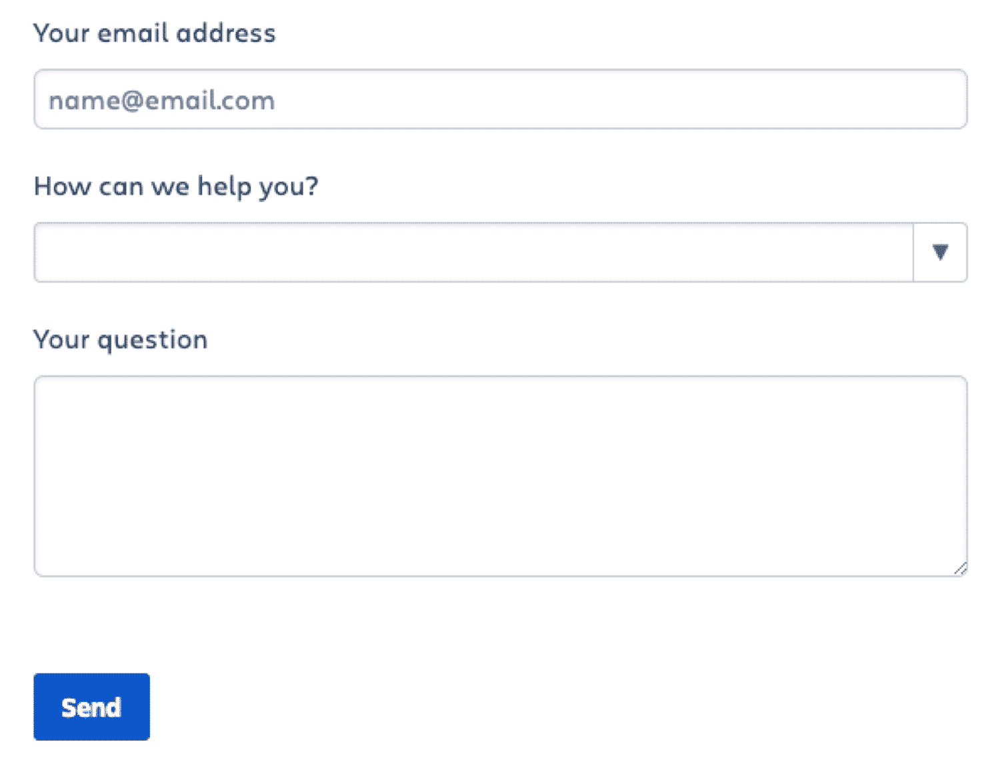

A standard contact form example

虽然这些可能是由管理人员操作的，但你可以试着用它们来询问如何与你理想的潜在客户取得联系。

### 6.查看联系人和关于我们的页面

有时候最简单的解决方案是最好的。许多网站在[联系人](https://kinsta.com/contact-us/)、[关于我们](https://kinsta.com/about-us/)或团队会面页面上包含个人电子邮件地址。

然而，在网站的导航中，这些页面往往很难找到。如果您看不到您要查找的内容，请检查页脚或尝试以下常见的 URL 格式:

*   *example.com/contact*
*   *example.com/contact-us*
*   *example.com/contact-me*
*   *example.com/about*
*   *example.com/about-me*
*   *example.com/about-us*
*   *example.com/team*
*   *example.com/our-team*
*   *example.com/meet-the-team*

### 7.查看作者页面

另一个简单的起点是你的潜在客户的博客或网站上的作者页面，这是从他们写的任何文章的名字链接到的。

这个页面上经常会有很多信息，特别是如果他们使用了默认的 WordPress 主题和设置。

### 8 .从 WHOIS 查找

如果你试图找到一个有网站的人的电子邮件地址(可能是一个[独立企业主](https://kinsta.com/blog/website-ideas/)、[企业家](https://kinsta.com/blog/recurring-revenue-model/)或[作家](https://kinsta.com/blog/grammar-checker-tools/))，你有时可以在他们网站的 [WHOIS 信息](https://kinsta.com/blog/best-domain-registrar/#free-whois-protection)中找到他们的联系信息。

注册域名时会用到 WHOIS 数据，这些数据是公开的，为您提供域名所有者的信息。法律要求每个有网站的人都要分享他们的联系方式。只需前往 [who.is](https://who.is/) 并搜索您正在寻找的电子邮件的域名:

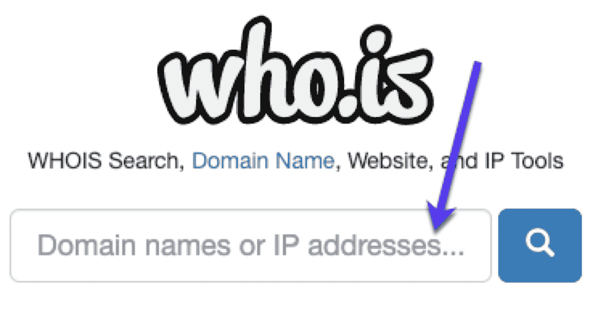

WHOIS lookup

顺便说一下，还有其他 WHOIS 查找工具，如:

*   [命名便宜](https://kinsta.com/blog/how-much-does-a-domain-name-cost/#namecheap)
*   域工具
*   名义上
*   [DMCA0s 自由人工具](https://kinsta.com/blog/dmca-takedown-notice/#1-find-the-person)

使用哪种工具并不重要。如果你幸运的话，你可能会看到用来注册这个域名的电子邮件。然而，WHOIS 提供了一个选项来从他们的公共数据中隐藏您的公共信息，所以这可能并不总是有效。

### 9.使用谷歌(和搜索运营商)

道歉:这是显而易见的，但仍可能被忽略。将谷歌用于其预期用途:搜索。

厌倦了你的 WordPress 站点缓慢的主机？我们提供超快的服务器和来自 WordPress 专家的 24/7 世界级支持。[查看我们的计划](https://kinsta.com/plans/?in-article-cta)

键入你的潜在客户的名字和“电子邮件地址”,你可能会走运。

然而，如果你要找的人有一个普通的名字，这可能会很困难。即使他们有一个独特的名字，你可能也走不远。

你可以通过一些谷歌搜索运营商来帮助缩小搜索范围。这些都超级好用。只需在谷歌中输入运营商，然后搜索:

*   [姓名] +电子邮件(或)电子邮件地址
*   [姓名] +联系人(或)联系信息(或)联系我
*   [姓名] +“家乡”
*   [姓名] +“他们工作的公司”
*   [姓名] + LinkedIn
*   [姓名] + ZoomInfo
*   [姓名] +电子邮件
*   [姓名] +联系人

如果你对你的潜在客户有更多的了解(比如他们在哪里工作)，你可以试试这些:

*   站点:company website . com+[姓名] +电子邮件
*   站点:company website . com+[姓名] +联系人
*   site:company website . com+first name . last name[at]companyname.com
*   site:company website . com+first name last name[at]companyname.com
*   site:company website . com+first name[at]companyname.com
*   site:company website . com+first name _ last name[at]companyname.com

### 10.使用脸书

当建立一个脸书网页时，人们经常尽可能多地输入信息，然后就忘记了。

只要转到个人资料的“关于”页面，您就可以看到他们添加的电子邮件地址:

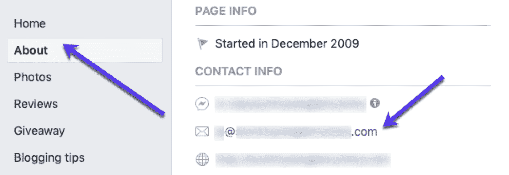

Find emails on Facebook

这使得[脸书](https://kinsta.com/blog/facebook-statistics/)成为一个为你的潜在客户搜索电子邮件地址的好地方，很可能会给你他们最常用的电子邮件地址，而不是更通用的地址。

### 11.检查你自己的电子邮件列表

根据你在行业内的知名度，你可能会发现一些潜在客户已经订阅了你的时事通讯。

快速搜索一下你的电子邮件列表，就能毫不费力地找到你想要的东西。

大多数[电子邮件营销软件](https://kinsta.com/blog/email-marketing-software/)将允许你搜索你的联系人列表。下面是它在 [Mailchimp](https://kinsta.com/blog/how-to-use-mailchimp/) 中的样子，例如:

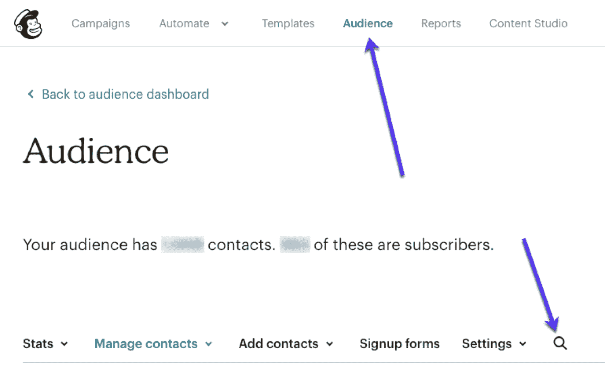

Look for emails in your email marketing software (like MailChimp)

### 12.导出你的 LinkedIn 关系

你知道 LinkedIn 允许你输出你的关系吗？

因此，如果你和你的潜在客户有联系，你也许可以得到他们的电子邮件地址。

#### 如何导出 LinkedIn 连接？

**第一步**——点击 LinkedIn 主页顶部的 **Me** ，然后从下拉菜单中选择**设置&隐私**。

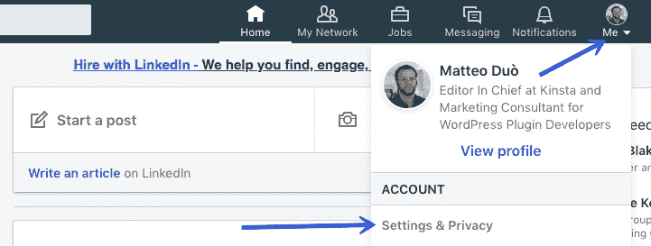

Export emails from LinkedIn

**步骤 2**–点击**隐私**标签，向下滚动到**获取你的数据副本**(在 LinkedIn 如何使用你的数据部分下):

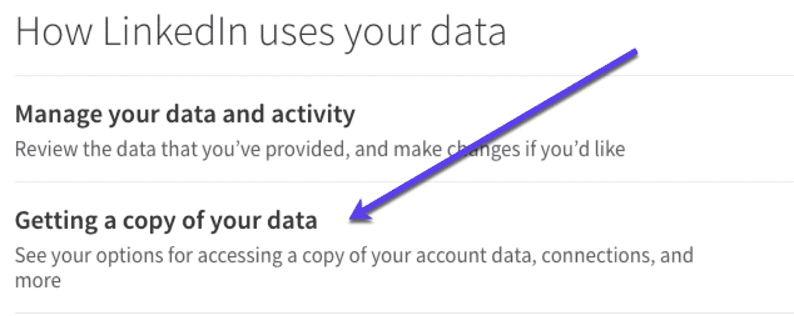

Download email data from LinkedIn

**步骤 3**–勾选连接框并点击**请求存档**。

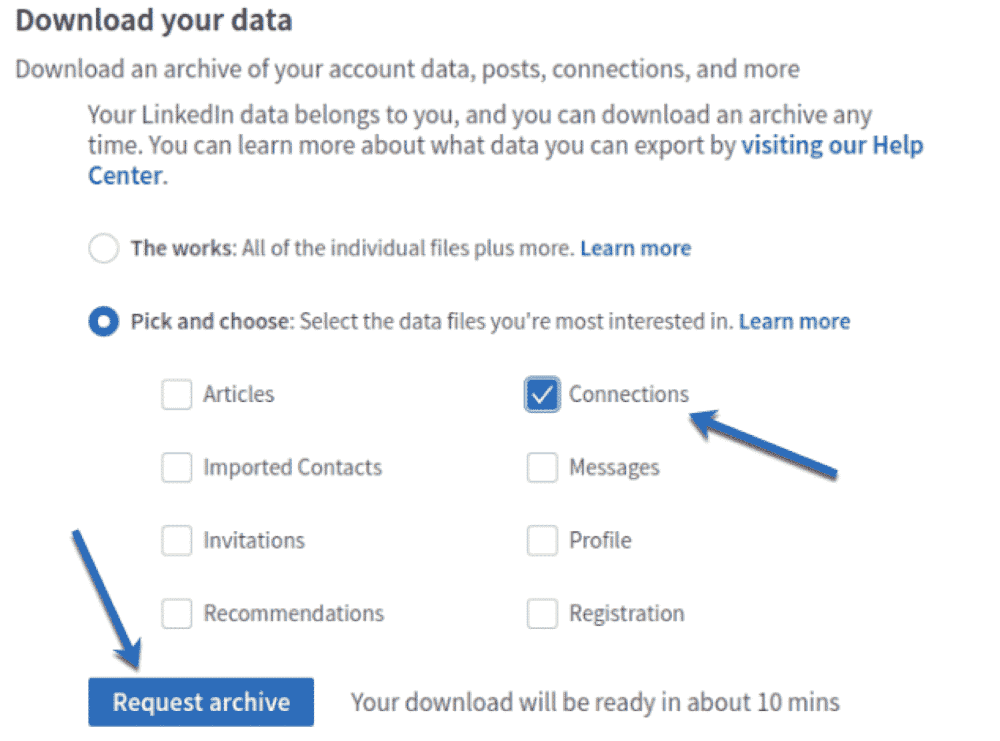

Copy LinkedIn data to get email addresses

大约 10 分钟后，你会收到一封电子邮件，里面有你所有联系人的电子邮件地址。

这个方法要负责任的使用，防止你失去 [LinkedIn 账号](https://kinsta.com/blog/linkedin-statistics/)。

### 13.进行有根据的猜测

仔细想想，几乎所有的电子邮件地址都遵循相同的模式。它们通常基于非常简单的格式。

因此，如果你知道你的潜在客户的名、姓和域名，你就能猜出他们的电子邮件地址。

如果你已经有了同一家公司其他人的电子邮件地址，你大概就能知道他们用的是哪种结构。

如果没有，请尝试以下常用公式:

*   [name]@example.com
*   [name].[surname]@example.com
*   [name][surname]@example.com
*   [initial].[surname]@example.com

[Need to start an outreach campaign but missing some email addresses? Find anyone's email address using one of these 13 pro tactics and tools! 🕵️🔦Click to Tweet](https://twitter.com/intent/tweet?url=https%3A%2F%2Fkinsta.com%2Fblog%2Ffind-email-address%2F&via=kinsta&text=Need+to+start+an+outreach+campaign+but+missing+some+email+addresses%3F+Find+anyone%27s+email+address+using+one+of+these+13+pro+tactics+and+tools%21+%F0%9F%95%B5%EF%B8%8F%F0%9F%94%A6&hashtags=emailtips%2Coutreaching)

## 摘要

现在我们知道了，如何找到某人的电子邮件地址。请记住:权力越大，责任越大。

所以明智地使用这些邮件查找方法。[不要给人发垃圾信息](https://kinsta.com/blog/email-authentication/)！不要出售别人的电子邮件地址。不要惹恼你联系的人…你只是错过了一个联系和建立(商业)联系的好机会。

* * *

让你所有的[应用程序](https://kinsta.com/application-hosting/)、[数据库](https://kinsta.com/database-hosting/)和 [WordPress 网站](https://kinsta.com/wordpress-hosting/)在线并在一个屋檐下。我们功能丰富的高性能云平台包括:

*   在 MyKinsta 仪表盘中轻松设置和管理
*   24/7 专家支持
*   最好的谷歌云平台硬件和网络，由 Kubernetes 提供最大的可扩展性
*   面向速度和安全性的企业级 Cloudflare 集成
*   全球受众覆盖全球多达 35 个数据中心和 275 多个 pop

在第一个月使用托管的[应用程序或托管](https://kinsta.com/application-hosting/)的[数据库，您可以享受 20 美元的优惠，亲自测试一下。探索我们的](https://kinsta.com/database-hosting/)[计划](https://kinsta.com/plans/)或[与销售人员交谈](https://kinsta.com/contact-us/)以找到最适合您的方式。