# 13 个可靠的电子商务策略，在 2022 年假日季节大幅提升销售额

> 原文：<https://kinsta.com/blog/ecommerce-strategies/>

假期即将来临:黑色星期五、网络星期一、感恩节、圣诞节。是一个接一个的事件！随之而来的是顾客的激增。你的网上商店准备好了吗？

今天，我们将与您分享一些独特的电子商务策略，您可以立即在您的网站上实施。希望你能在这里找到一些你以前没见过的东西，它可以[帮助你准备你的网站](https://kinsta.com/webinars/website-prep-black-friday-cyber-monday/)在 2022 年假日季获得破纪录的销售额！

准备好开始了吗？

## 零售业继续消亡，电子商务蓬勃发展

黑色星期五和第三季度/第四季度的其他购物季传统上与实体店连锁有关。你可能会想象排长队和疯狂的顾客争夺有限的空间和资源。

但是越来越多的消费者选择呆在家里，避开潜在的暴力人群，转向网上商店购买节日商品。2020 年，黑色星期五创造了创纪录的 90 亿美元在线销售额，2021 年达到 81 亿美元，其中许多来自移动设备。对于实体店来说，他们的黑色星期五净销售额[下降了 4%到 7%。随着整个世界开始更喜欢在智能手机上购物，这个数字预计只会增长。](https://www.reuters.com/article/us-usa-holidayshopping/on-black-friday-more-u-s-shoppers-chose-the-computer-over-the-mall-idUSKCN1NT0WK)

在假期投资在线电子商务可能会为你的企业带来巨大的销售额。只关注你的实体店是一个巨大的错误。

而且不仅仅是在黑色星期五。由于销售额下降和来自亚马逊等在线卖家的竞争加剧，传统零售业中一些最大的品牌[仅在 2017 年就关闭了 5000 多家店铺](http://clark.com/shopping-retail/major-retailers-closing-2017/)，亚马逊在 2018 年占据了 [49%的电子商务销售额](https://techcrunch.com/2018/07/13/amazons-share-of-the-us-e-commerce-market-is-now-49-or-5-of-all-retail-spend/)。[2019 年将有超过 7000 家店铺关闭](https://www.cnbc.com/2019/05/28/heres-a-running-list-of-retail-store-closures-announced-in-2019.html)。


> 需要在这里大声喊出来。Kinsta 太神奇了，我用它做我的个人网站。支持是迅速和杰出的，他们的服务器是 WordPress 最快的。
> 
> <footer class="wp-block-kinsta-client-quote__footer">
> 
> 
> 
> <cite class="wp-block-kinsta-client-quote__cite">Phillip Stemann</cite></footer>

[View plans](https://kinsta.com/plans/)

当传统零售业继续消亡时，幸运的是，[电子商务销售正在蓬勃发展](https://kinsta.com/blog/ecommerce-statistics/)！根据 2019 年 [eMarketer 报告](https://www.emarketer.com/content/holiday-shopping-2019)，美国零售电子商务支出将增长 13.2%，达到 1353.5 亿美元，并预测美国零售总额将首次突破万亿美元的假日季大关，增长 3.8%，达到 1.008 万亿美元。

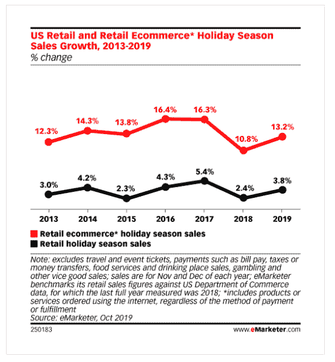

Ecommerce holiday season sales growth


那么 WordPress 空间呢？

通常，当人们研究电子商务选项时，脑海中会出现两个大的选项: [WooCommerce](https://kinsta.com/blog/woocommerce-tutorial/) 和 [Easy Digital Downloads](https://kinsta.com/blog/easy-digital-downloads/) 。这个市场也在快速增长。WooCommerce 的负责人 Todd Wilkens 估计，WooCommerce 商店在 2017 年的总销售额将超过[100 亿美元，并表示这一数字可能高达 150 亿美元。Owler 目前估计其年收入为 120 亿美元，所以这些说法似乎是准确的。](https://wptavern.com/woocommerce-stores-on-track-to-surpass-10b-in-sales-this-year)

看看 [WooCommerce](https://trends.builtwith.com/shop/WooCommerce) 和 [Easy Digital Downloads](https://trends.builtwith.com/shop/Easy-Digital-Downloads) 的内置数据也很有趣:

*   截至 2019 年 11 月，使用 WooCommerce 的网站数量已超过 380 万个，高于 2018 年的 220 万个。
*   截至 2019 年 11 月，现在有超过 43，000 个网站使用轻松数字下载，高于 2018 年的 40，000 个。

如果我们看一下[谷歌趋势](https://trends.google.com/trends/explore?date=today%205-y&q=woocommerce,easy%20digital%20downloads)，我们肯定可以看到在过去五年中“WooCommerce”搜索词的稳步增长。不幸的是,“简易数字下载”仍然没有足够的市场份额在这里成为一个亮点。但请放心，两者每天都在抢夺更多的用户。

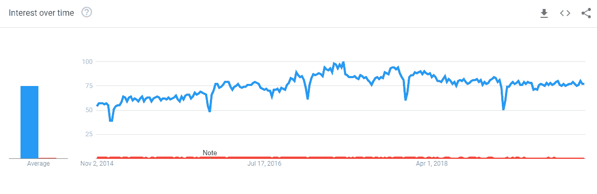

Google Trends for the term “WooCommerce”


许多人甚至没有意识到这两者实际上仍然只是 WordPress 的[插件。因为它们实际上已经变成了成熟的电子商务解决方案。他们都有自己完整的生态系统，包括插件、扩展、支付网关、网络挂钩、在线社区等等。然而，受欢迎并不总是一件好事。由于任何人现在都可以轻松地推出自己的商店，在线竞争比以往任何时候都更难！](https://kinsta.com/best-wordpress-plugins)

尤其是在这个假期，你将面临一些大的竞争，你的企业需要做好应对的准备。


## 13 个强有力的电子商务策略和技巧来促进你的假日销售

无论企业或团队的规模如何，每个人都在寻找更多的方法来优化他们的电子商务网站，并提高转化率。以下这些电子商务策略可以应用于大型网上 [WooCommerce 商店，甚至是刚刚开始销售他们第一件优质产品的 EDD 小网站](https://kinsta.com/blog/woocommerce-vs-easy-digital-downloads/)。

不管你的店有多大，你都需要为即将到来的顾客潮做好准备。希望下面的一些建议能让你在竞争中领先一点！

### 1.关注电子邮件

电子邮件营销是任何企业成功的关键。无论你是手动创建一份时事通讯，还是在大型活动中投入大量资金，任何规模的成功企业都做过一定数量的营销。

凭借 122% 的[投资回报率](https://www.emarketer.com/Article/Email-Continues-Deliver-Strong-ROI-Value-Marketers/1014461) [，这里是投资的最佳去处之一。如此高的投资回报率意味着你投入的每一美元都会翻倍…甚至更多！另外，它很便宜，容易上手。全新的创业公司和长期运行的巨头都有充分的理由使用电子邮件营销。](https://www.emarketer.com/Article/Email-Continues-Deliver-Strong-ROI-Value-Marketers/1014461)

另外，顾客喜欢它。[欢迎邮件](https://www.campaignmonitor.com/resources/infographics/how-effective-are-welcome-emails/)可以有高达 91%的打开率和 26.9%的点击率。想想有这样的数字的[潜在商机](https://kinsta.com/blog/b2b-lead-generation/)。说服人们订阅你的时事通讯，并通过持续不断的特别折扣和优惠让他们参与进来，你就会建立起一个忠实客户的粉丝群。

随着这个假期所有客户的到来，确保你的电子邮件营销活动准备好接收他们。

#### 自动化假日电子邮件活动

在疯狂的假日购物热潮中，自动化的电子邮件营销是绝对必要的。在 2018 年网络星期一奥运会期间，[电子邮件带来了 24.2%的收入](https://news.adobe.com/press-release/experience-cloud/adobe-analytics-data-shows-cyber-monday-broke-online-sales-record-79)。换句话说，近 25%的流量可能来自电子邮件活动。

自动化基本上消除了电子邮件营销的所有工作。你所需要做的就是创建你的电子邮件模板，设置什么样的触发会导致电子邮件被发送给用户(经过的时间，购买的产品，注册，等等。)，并根据活动和人口统计数据定义用户群。请务必查看我们的指南[如何开始使用 MailChimp](https://kinsta.com/blog/how-to-use-mailchimp/) ，这是最好的电子邮件营销工具之一(我们在 Kinsta 使用它)。你可以在这里阅读 [Mailchimp 的替代品](https://kinsta.com/blog/mailchimp-alternatives/)。

每当您的客户激活这些触发器时，该程序都会向他们发送电子邮件。想想看:这不是你想在假期手工做的事情。让自动化软件迎接新的季节性购物者，用折扣吸引他们，并在假期结束后锁定他们。

查看我们的综合列表[电子邮件营销软件推荐](https://kinsta.com/blog/email-marketing-software/)，其中列出了每种软件的关键特性。你一定会在那里找到你喜欢的。或者，如果你想专注于夺回失去的用户，我们有一些特别适合[废弃购物车恢复](https://kinsta.com/blog/abandoned-cart-email/#abandoned-cart-email-templates)的建议。


#### 回收废弃的购物车，并自动捕捉失去的销售

接下来的几个月将会是你不得不应对的最高弃车率。特别是在黑色星期五期间， [75%的购物车被丢弃](https://www.fierceretail.com/digital/75-us-digital-carts-abandoned-black-friday)。这是一笔巨大的收入损失！

到了假日季节，顾客可能会去各种商店看看，比较价格，看看每个人都提供什么。但是在新产品的热潮中，在他们的电脑上打开标签，他们可能会忘记他们在你的网站上装满的购物车。如果他们忘记退房，很有可能他们再也不会回来了。

你需要的是电子邮件营销软件，[瞄准那些被遗弃的购物车](https://kinsta.com/blog/shopping-cart-abandonment/)并把它们带回来，所有这些你都不用动一根手指。

如果你需要一个与你的 WooCommerce 或 Easy Digital Downloads 商店配合使用的高质量电子邮件重定向工具，你可以尝试使用免费的 [WooCommerce 扩展](https://kinsta.com/blog/wordpress-statistics/)的[废弃购物车 Lite](https://wordpress.org/plugins/woocommerce-abandoned-cart/) ，它可以让你跟踪和恢复废弃的购物车，包括客人购物车，并使用可定制的模板对它们进行个性化设置。还有一个专业版，具有自动生成优惠券代码和高级分析等额外功能。

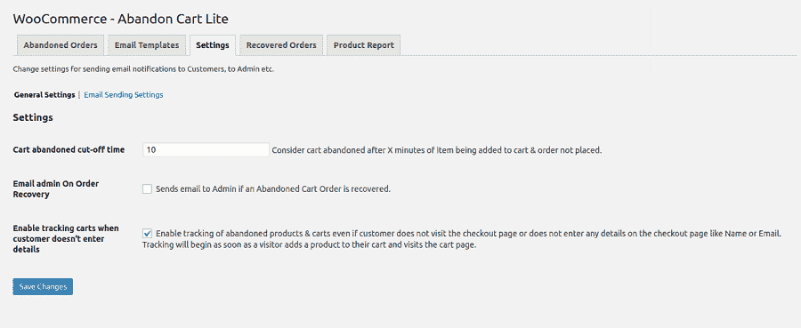

Abandoned Cart Lite


下面是一些公司使用这种策略的很好的例子，以及巧妙的信息传递。

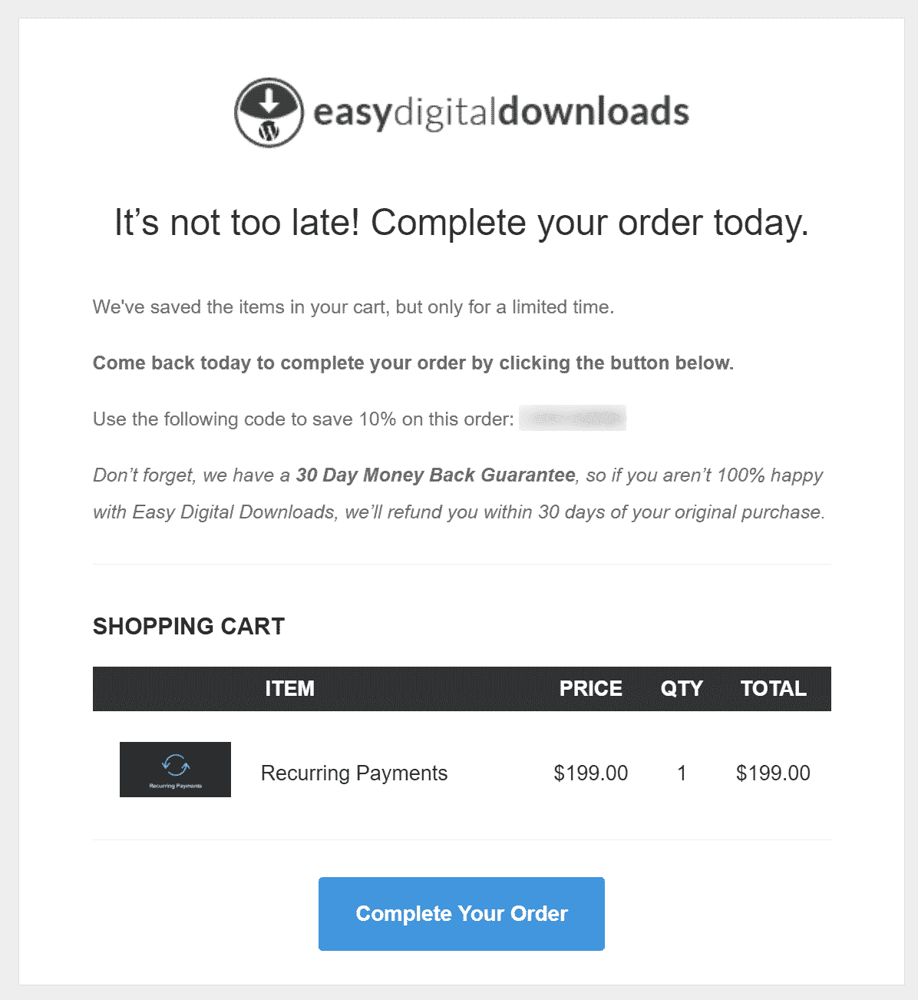

Easy Digital Downloads discount code


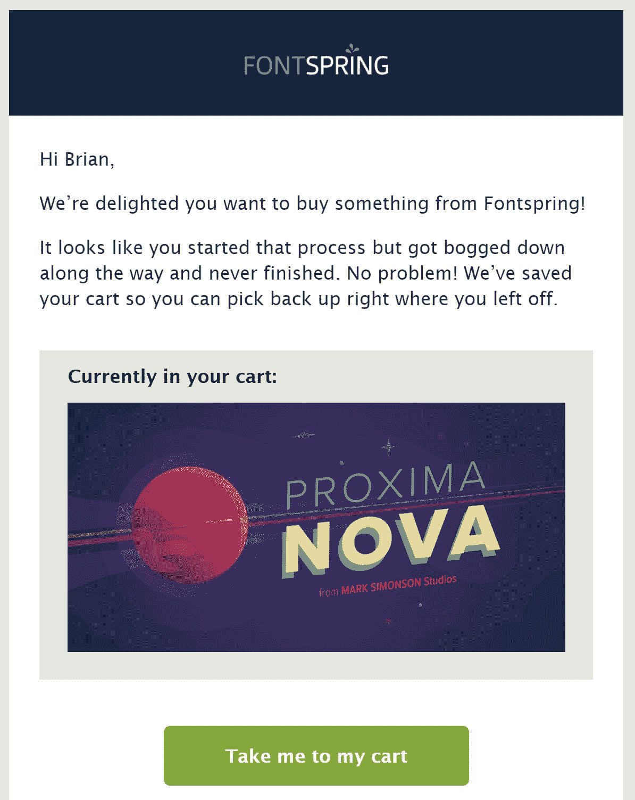

Fontspring discount code


An example of a Google Store discount code


时间是至关重要的，所以确保在假期，你运行一个更积极的购物车恢复运动。黑色星期五到网络星期一只有 3 天时间，所以不要担心一天发一封邮件给流失的客户。不要犹豫，提前推出那些有利可图的折扣。

下面是一个你可能为黑色星期五发起的活动的例子:

*   3 小时后自动发送一封标题为“[名字]，你忘了什么吗？”
*   1 天后自动发送一封电子邮件，标题为“我们仍保留您的物品，不要错过这个黑色星期五的折扣。”在这封电子邮件中，自动生成一个 15%的折扣代码。
*   3 天后自动发送一封标题为“立即完成交易，享受巨大的网络星期一折扣！”在这封电子邮件中，自动生成一个 20%的折扣代码。

在节奏较慢的 12 月购物季，你可以将邮件分散在 5-7 天内发送。

这种模式的最大好处是产品可以收回成本！你以前可能会失去这些客户，现在你可以为服务付费，同时获得更多的销售。

还有许多其他伟大的废弃手推车夺回服务也要考虑。Conversio 是你绝对应该尝试的。它会自动生成折扣券来迅速吸引用户的注意力。但其更好的功能之一是如何利用社交证明，提供客户截图和产品评论，以说服他们再试一次。这个社会证明给了他们 12%的回收率。

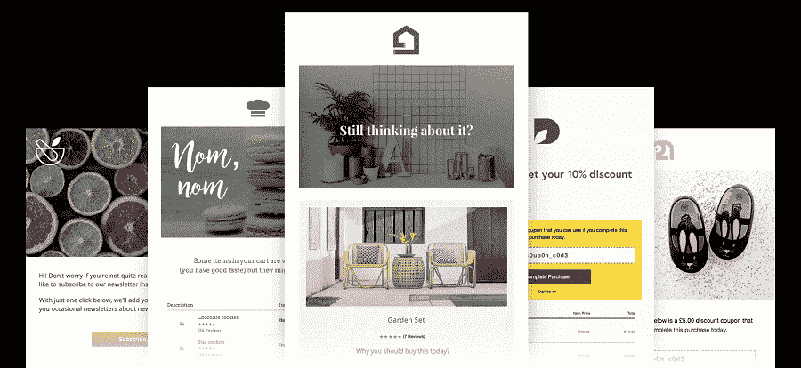

Conversio


无论你选择什么工具来自动化你的假日电子邮件活动，那几个月都会带来许多浏览器和许多废弃的购物车。你将需要帮助重新吸引他们，这样的软件将是无价的资产。

### 2.利用你的电子邮件列表

如果你已经有一份时事通讯(这是[金斯塔时事通讯](https://kinsta.com/wordpress-newsletter/))，是时候利用它来推动销售了。你的用户订阅你是因为他们忠于你的品牌，他们有兴趣看看你能提供什么。奖励他们大量的折扣和赠品。

如果你还没有建立简讯，现在就开始吧。随着季节性购物的到来，你仍然会让你的订户记忆犹新，所以这是整理电子邮件列表的好时机。

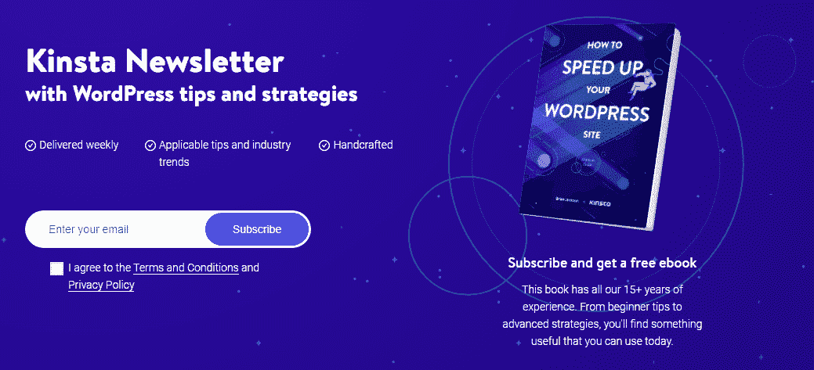

Kinsta newsletter signup


每封邮件都应该有点击的动机。无论是提前获得销售价格还是可兑换的礼物，打开每一封电子邮件，你的参与率将会飙升。为您的订户提供独家优惠；这既是一种表达感谢的好方式，也是向那些还没有注册的人展示的东西。

创建一个清晰的电子邮件发送时间表，完全按照假期的节奏来安排发送时间。使用[细分](https://mailchimp.com/features/segmentation/)向最有可能点击它们的人发送报价。

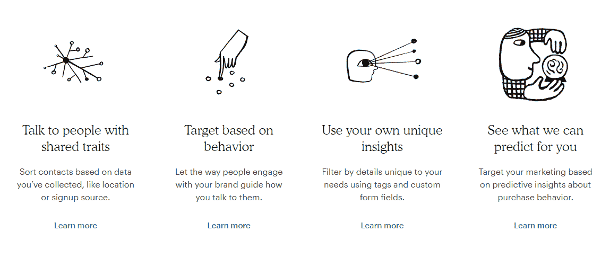

MailChimp segmentation


记住[表现最好的黑色星期五主题行](https://www.omnisend.com/blog/subject-lines-for-black-friday-campaigns/)，这样你可以获得更高的打开率。你的主题是电子邮件中最重要的部分——糟糕的主题会被完全忽略。

因为你将会有大量的新访客涌入，记得优化那封欢迎邮件，并提供未来购买的折扣或其他礼物。你不想让数以千计的注册变成无效。不断激励他们参与你的品牌。

不要仅仅依赖随机的访问者。让这些促销邮件贯穿整个假期，利用你现有的邮件列表来获得更多的销售。


### 3.使用社交证明来促进购买

当消费者在进行倒计时销售时，他们没有时间做研究，但这并不意味着真实性对他们来说不重要。他们会选择一眼就觉得最可靠的公司。你需要一种快速沟通的方式，证明你是值得选择的商店。

让用户相信这一点的一个方法是使用社会证据。据[维基百科:](https://en.wikipedia.org/wiki/Social_proof)

> 社会证明是一种心理现象，人们假设他人的行为，试图反映给定情境下的正确行为。

你以前已经见过它的作用了。这就是为什么如此多的商店在首页展示推荐或者允许顾客评论产品。用户信任其他用户，所以知道人们从你这里购买往往足以让他们相信你的真实性。

[72%的用户在阅读评论](https://hostingtribunal.com/blog/online-review-statistics/)之前不会采取行动，根据同一来源，在线[产品评论](https://kinsta.com/blog/best-wordpress-review-plugins/)可以将其转化率提高 270%。人们希望在愿意购买之前看到其他顾客的反馈。

提示:[带图评论](https://kinsta.com/clients/)已经被证明做的更好！下面是我们在 Kinsta 网站上使用的一个例子。请注意，我们不只是使用网站的照片，而是实际获得公司员工的照片。这给了它一种更加个人化的感觉，你可以与之联系起来。

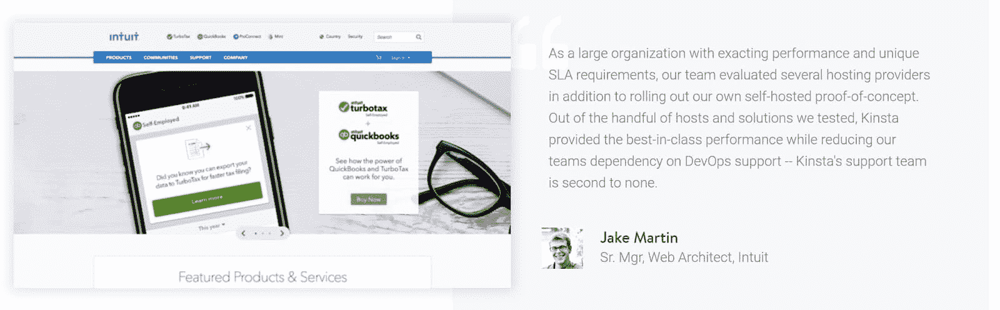

An example of reviews with pictures


你们中的一些人可能也听说过 FOMO 这个术语。这就是“错过的恐惧”。通过利用带有紧迫感的社交证明，你可以提高你的转化率！

> FOMO 被定义为一种普遍的恐惧，即别人可能会有一个人不在的有益体验，其特点是希望与别人正在做的事情保持持续的联系。–[科学指导](http://www.sciencedirect.com/science/article/pii/S0747563213000800)

如果你想利用 FOMO，我们推荐 [HollerWP](https://hollerwp.com/) 。这是一个很棒的[线索生成工具](https://kinsta.com/blog/wordpress-lead-generation/)，它有很多很酷的功能，比如 lightbox 弹出窗口和仿实时聊天，但展览的明星是销售通知弹出窗口。这些是完全可定制的，只要有人在你的商店购买产品，它们就会出现，从而让新访客相信你值得信赖，值得购买。是的，它完全集成了 WooCommerce 或简单的数字下载。

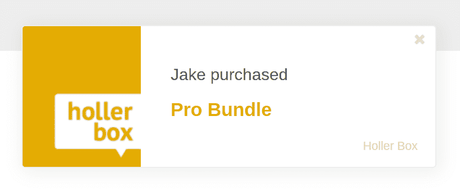

HollerWP


没有人喜欢最后一个参加聚会，如果他们看到在黑色星期五这样的活动中有大量的销售，他们会在你缺货之前迅速跟上潮流。

FOMO 的另一个例子是 24 小时网络星期一特卖，在你的网站上用倒计时钟做广告，并通过紧急邮件发送给老客户。再加上有限库存商品的进货信息，人们会争先恐后地结账。

HollerWP 由 Scott Bolinger 开发，他也创建了流行的 AppPresser 插件。我们喜欢来自致力于 WordPress 社区的开发者的插件，Scott 就是其中之一！其实我们也对他做了[采访](https://kinsta.com/blog/interview-scott-bolinger/)。

如果你喜欢 FOMO，你可能也想看看这个网站。它是由 IdeaBox Creations 开发的，目的是让网站所有者更好地利用社交证据。和 HollerWP 一样，它也集成了 WooCommerce 和简单的数字下载，可以显示客户购买的商品或限时优惠。

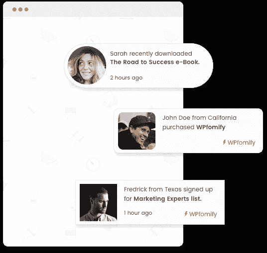

WPfomify


最后但并非最不重要的一点是，使用社交分享号来建立受客户欢迎的社交网络。[盈利网站](https://sitesforprofit.com/truth-about-share-buttons)在他们的页面上做了一个 A/B 测试来确定这一点。他们实际上测试了一个没有计数器的按钮，一个有零股计数器，一个有超过 1000 股。你猜怎么着？拥有 1000 份股票的按钮的点击率比拥有零份股票的按钮高 60%。

social share 有一个关于[社交分享证明和分享按钮](https://warfareplugins.com/psychology-social-proof/)的很棒的帖子。事实上，他们发现不显示股份数比显示低股份数要好。

我们为 WordPress 开发了一些最好的[社交媒体插件，你可以在你的网站上使用它们来](https://kinsta.com/blog/wordpress-social-media-plugins/)[提高流量](https://kinsta.com/blog/how-to-drive-traffic-to-your-website/)，分享和转化率。列出的大部分插件都有显示分享数量的能力。

请记住，社交分享计数不一定只是针对博客帖子，它们也可以用于你的 WooCommerce 和 EDD 产品！热门产品的份额统计可以让潜在客户知道这种商品可能很快就要卖光了。在 FOMO 的推动下，他们更有可能在失去机会之前拿起这个项目。

人们非常关心他们在社交媒体上的朋友和同龄人在购买什么。通过利用社交证明和社交分享，你会产生更多的兴趣。

### 4.提高优惠券/折扣的可见性

每个人都知道，在节日期间创造更多销售的一个好方法是创造促销活动以及优惠券或折扣。然而，很多电子商务网站失败的地方在于推广优惠券本身。

就像有了[好内容](https://kinsta.com/blog/content-length/)一样，需要花时间推广！为了让你的优惠券吸引更多的眼球，一些小技巧也可以发挥作用。

我们最喜欢的方法之一是在你的电子商务网站顶部临时使用一个通知栏。你可以在你的假日促销期间运行这个。想出巧妙的信息来制造一种紧迫感，比如“限时九折”或者“从现在起到黑色星期五七折”。此外，让他们点击你的销售。

我们鼓励你运行你自己的 A/B 测试，但是你会惊讶于网站顶部产生的点击量！购买礼物的人也不会给予太多的关注；你可能正在进行闪购，他们需要尽快结账。但是 CTA 条很难被忽视，它让优惠券代码和假日公告等重要信息不容错过。

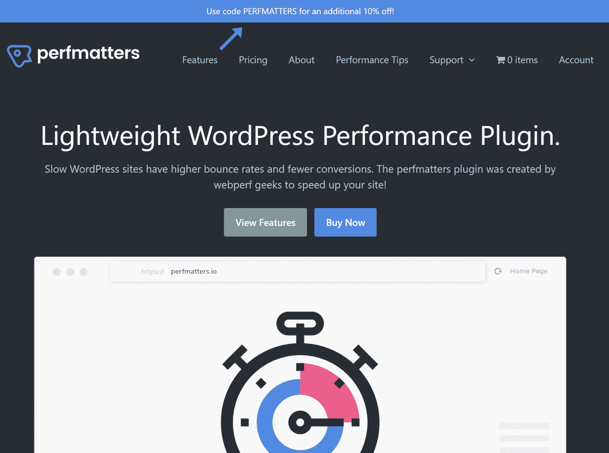

Perfmatters example


它也是非常轻量级的，不会因为额外的脚本和弹出窗口而使你的网站膨胀。

有几个简单的方法可以在你的 WooCommerce 或 Easy Digital 下载网站上添加通知栏。我们推荐以下插件，因为它们提供了简单的方法来定制通知栏的外观，创建 CTA 按钮/链接，以及创建过滤器和规则来决定何时何地显示通知栏:

*   简易通知栏:由 WPExplorer 开发，它提供了大量的功能，并且是 100%免费的！
*   WP 通知栏:由 MyThemeShop 开发。有免费版和高级版。
*   [HollerWP](https://hollerwp.com/) :我们上面提到过这个插件。除了 FOMO，它还包括一个创建折扣标题横幅的方法。这是一个非常好的解决方案。

你也可以很容易地创建一个通知栏，就像上面截图中显示的那样，根本不需要任何插件。只需将下面的代码添加到您的 header.php 文件中，就在标签的下面。

```
<div id="dabar">Your website message.</div>
```

然后将下面的 CSS 添加到主题的样式表中。如果你的主题没有添加 CSS 的[方式，你可以在 WordPress 定制器中添加，或者用一个免费插件，比如](https://kinsta.com/blog/wordpress-css/)[简单定制 CSS 和 JS](https://wordpress.org/plugins/custom-css-js/) 。

```
#dabar{
background: #2c3644;
color: #fff;
font-size:16px;
top: 0px;
left: 0px;
width: 100% !important;
padding: 10px 0px;
text-align: center;}
#dabar a {color: #ffffff; border-bottom: 1px dotted;} 
```

你可以采取的另一种方法是实施一些人所说的“社会奖励”这是一种策略，你给客户的购买额外折扣，以换取脸书的股份或推文。

根据一项研究，54%的购物者会购买放在购物车里的产品，如果这些产品价格更低的话。所以给客户一个降低价格的方法。你得到了销售和一些免费的社会营销！

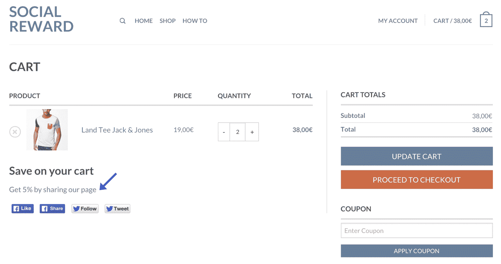

Social Reward


这是一个不用动一根手指就能显著提高你在社交媒体上的参与度的好方法。你可能会看到，每个人都很乐意分享一些东西，如果他们能在购买时立即省钱的话。

这里有几个我们推荐的 WordPress 插件，可以帮助你在你的电子商务网站上实现社交奖励:

*   [EDD 社会折扣](https://easydigitaldownloads.com/downloads/edd-social-discounts/)

需要更多的想法吗？看看这些额外的 [WooCommerce 推广技巧](https://xlplugins.com/woocommerce-promotions-tips-tricks/)来推动更多的销售。不要让你的活动优惠券白白浪费——好好营销它们，你会带来数百名感兴趣的顾客。

#### 创建大量节日和季节性优惠券

你知道假期到来时的惯例:市场上的每家商店都提供可笑的交易，如“高达 95 折”。拒绝降价的商店将会错过很多客流量，因为几乎可以肯定别处有更好的价格。

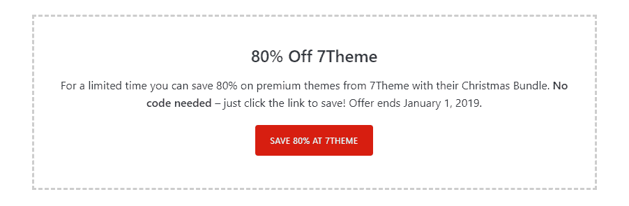

Coupon example. (Image source: WPExplorer.com)


现在是时候来一次大促销了。巨大的折扣，免费礼品卡，忠诚度积分计划。尽你所能引起兴趣并推动销售。

当然，你需要在实际上放弃你的商店和由于缺乏折扣而失去很多顾客之间找到一个平衡点。但是，即使你不打算让你店里的所有东西都打五折，至少制作一个像样的优惠券代码并通过各种渠道传播也是一个好主意。


A Coupons.com tweet


节假日是创造大量优惠券以鼓励销售的好时机，但是如果没有人看到它，它就没有多大用处。花点时间在社交媒体上做广告，在你的网站上醒目地展示，给你的时事通讯收件人发邮件，告诉他们这笔大买卖。

记得使用 FOMO，并提醒他们这种优惠券是暂时的。给你现有的订户送一张精美的礼品卡，吸引他们，如果他们在 Twitter 上宣传你，下次购买时还会有更大的折扣。

### 5.利用代销商促进假日销售

任何时候开始会员制计划都不算晚。[联盟营销](https://kinsta.com/affiliate-academy/what-is-affiliate-marketing/)实际上是为自己买单；你的分支机构在他们的社交媒体和网站上发布链接，当你获得点击或销售时，你向他们支付费用。这样，你只有在潜在客户感兴趣的时候才会付钱。在大型促销活动期间，这可能会带来相当大的流量。

即使[你在最后一秒推出了你的联盟计划](https://kinsta.com/blog/affiliate-system/)，一个大的优惠券代码也可以在网上人群全面涌入之前成为一个有效的激励因素。利用你的代销商为特殊产品或大减价做广告，为你的网上商店增加流量。给他们你创造的大量优惠券代码，你肯定会看到人们涌入使用它。

这几个月是你的联盟营销计划的关键时刻。给你的分支机构一个赠品，折扣代码，或礼品卡，看看你的流量迅速上升。

#### 推出加盟计划

加盟计划是一个很好的方式，可以迅速让你的品牌或产品的话。大家都知道口碑是提高销量的最好方法之一，而联属营销可以看作是口碑的一种形式。联盟计划可以为公司带来高达 30%的收入。

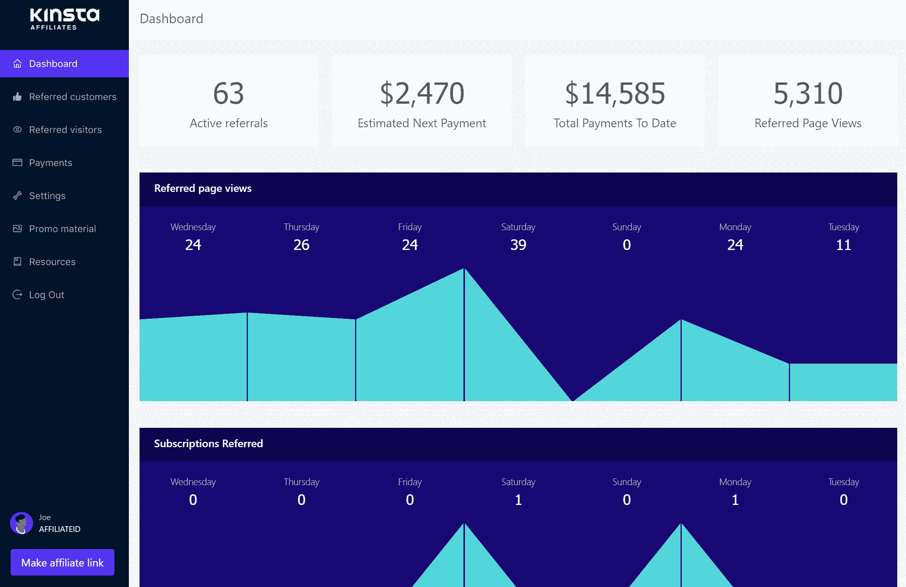

Kinsta affiliate dashboard


然而，AM Navigator 的另一个有趣的事实是，在大多数代销商项目中，只有 10%的代销商负责 90%的活动。这很可能是因为你会让很多人带着赚钱的想法或梦想签约，但事实上，他们永远不会坚持到底。

通常情况下，大多数电子商务网站的代销商销售额来自少数高质量的代销商。肯定有好的代销商和坏的。

但这不应该阻止你前进。立即启动联盟计划的最好理由之一是它是免费推广！运行 it 通常不需要或很少需要成本[，除了一些时间。让博客帮助传播你的品牌或产品。](https://kinsta.com/affiliate-academy/affiliate-marketing-business/)

随着时间的推移，当你与行业中产生大量流量的更高权威人物发展关系时，你真的可以磨练这一点。

我们在金斯塔有一个[会员计划](https://kinsta.com/affiliates/)，可以免费加入！我们有全职开发人员，所以我们从头开始创建我们的仪表板和整个系统。查看我们的顶级[联盟营销技巧](https://kinsta.com/affiliate-academy/affiliate-marketing-tips/)！

然而，对大多数人来说，这是不可能的，因为外包或时间的成本。在这种情况下，我们强烈推荐 premium [AffiliateWP](https://affiliatewp.com/) 插件。

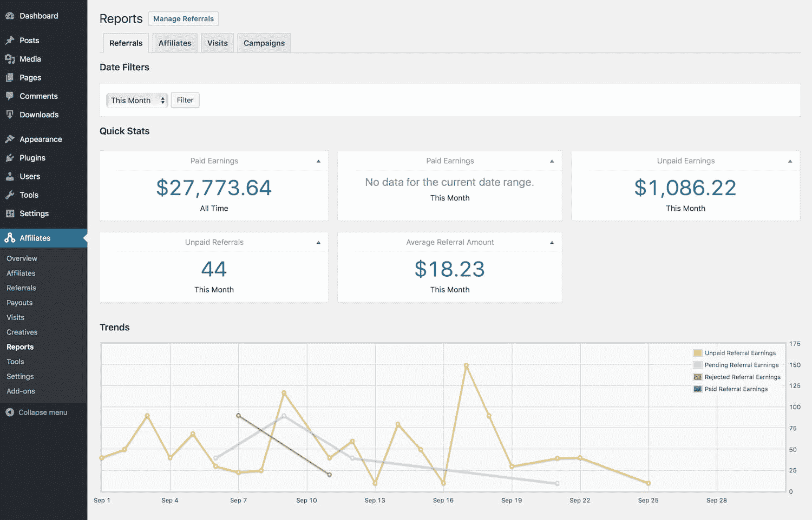

AffiliateWP


AffiliateWP 与 Easy Digital Downloads 由相同的开发人员创建。但是不要担心，它在 WooCommerce 上也很好用！如果你担心它的复杂性，不要担心。我们已经自己设置了多次，你可以在几分钟内接受新的会员。

查看我们的[行之有效的技巧，增加你的代销商销售额](https://kinsta.com/affiliate-academy/affiliate-sales-tips/)。

### 6.尝试推送通知

如果有一个电子商务战略被分享到死，它可能是“钱在清单上”。不要误解我们，你应该在客户购买时获取他们的电子邮件，因为这是一种与他们沟通的低成本方式。

创建简讯或产品订阅是吸引回头客的好方法，但请记住，在添加任何人到任何类型的定期电子邮件营销简讯之前，你需要得到许可。向人们发送不请自来的广告是将垃圾邮件列入黑名单的好方法，所以只向有意愿的客户推销。

有几个简单的插件可以用来将你的电子商务清单推送给你最喜欢的[电子邮件营销软件](https://kinsta.com/blog/email-marketing-software/):

## 注册订阅时事通讯


### 想知道我们是怎么让流量增长超过 1000%的吗？

加入 20，000 多名获得我们每周时事通讯和内部消息的人的行列吧！

[Subscribe Now](#newsletter)

*   [WooCommerce 电子邮件集成](https://woocommerce.com/product-category/woocommerce-extensions/marketing-extensions/email-marketing-extensions/)
*   [轻松数字下载电子邮件集成](https://easydigitaldownloads.com/downloads/category/extensions/email/)
*   [轻松数字下载邮件整合](https://wordpress.org/plugins/edd-mailerlite/#description)

电子邮件营销可能会非常成功，但推送通知也取得了广泛的成功和高参与度。

推送通知是出现在浏览器中的弹出窗口，直接发送到手机的消息，或者出现在应用程序中的提醒。由于其直接的性质，客户更有可能与他们接触。

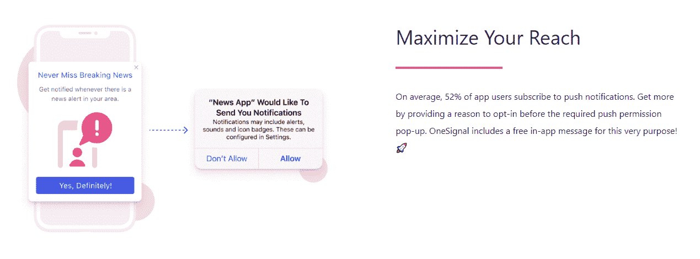

Push notifications


让某人启用推送通知需要更多的说服力，但是你的推送用户是你最忠实的用户之一。不像那些可以几天不读的邮件，它们在你发出提醒的那一刻就能立即察觉。

您还可以随时发送预定义的消息，这就是它真正强大的地方。您的客户可以获得即将开始的大减价的最新信息，或者他们看过的降价产品的最新信息。查看我们关于如何在您的网站上安装推送通知的深入指南。

如果你还没有使用推送通知，那你就错过了！记住，即使你没有订阅通知，也不意味着你的访问者就是这么想的。永远不要想当然地认为，在营销你的电子商务网站时，测试是获得具体数据的最佳方式。

我们过去使用过 [OneSignal](https://onesignal.com/) ，我们强烈推荐它用于任何在线商店，无论规模大小。它可以向手机、网络、应用程序和电子邮件发送通知。定价从免费开始，有无限的通知，多达 30，000 网络订户，和无限的电子邮件订户。完全没有理由不去尝试一下。

我们在一个全新的网站上添加了一个信号，在不到 48 小时的时间里，我们有超过 140 个推送通知订阅者(见下文)。

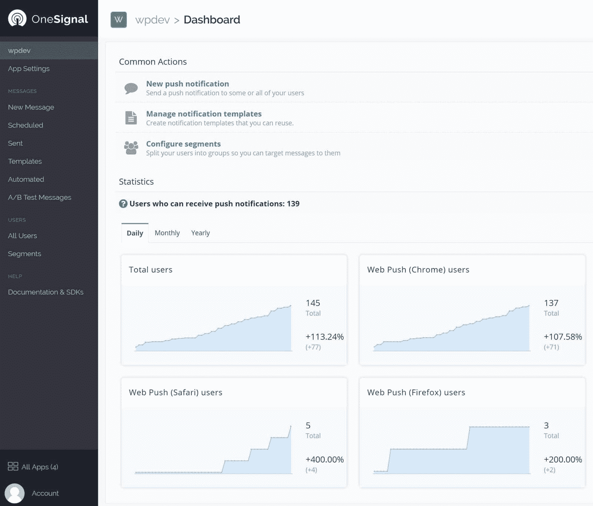

OneSignal


在使用 OneSignal 不到 3 个月的时间里，它已经是我们排名第三的有机流量来源！我们得到了非常一致的流量峰值，这与我们的内容发布相吻合。随着我们 OneSignal 用户群的增长，我们的流量也在增长。您可以在我们的 [OneSignal 案例研究](https://onesignal.com/case-studies/kinsta)中看到更多统计数据。

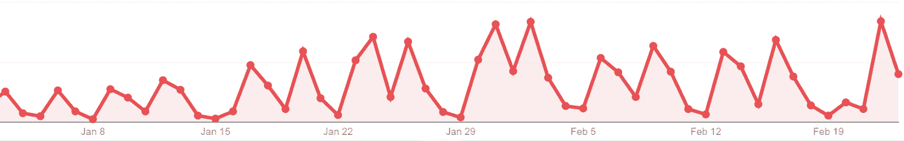

Some stats from our OneSignal case study


虽然推送通知往往用于[博客内容](https://kinsta.com/blog)，但你也可以轻松地发送关于新的电子商务产品或你正在进行的假期大减价的通知！请记住，你需要一个推送计划，就像你需要一个电子邮件营销计划一样。

重要的是，你不要发送太多的提醒，以避免打扰用户，你发出的东西需要优化，以最大限度地提高打开率。

人们也会对个性化反应良好，OneSignal 可以对其用户群做到这一点。根据行为、设备和位置进行个性化，人们会更感兴趣。

在进入下一个策略之前，我必须说:这个方法对一些店主来说有点太麻烦了。尽管如果实现得好的话，推送通知会有很大的帮助，但是有些用户并不喜欢推送通知。最好是测试一下它在规模较小、影响力较低的活动中的表现。把你的大实验留到假期结束后。

### 7.在社交媒体上推广

黑色星期五及其后的几个月在社交媒体上很受欢迎。每个人都在谈论销售和炒作，这是你加入的好时机。推出优惠券，宣传你的促销活动，让人们谈论你的品牌。

首先，你需要一份假期社交媒体营销计划。创建一个[社交媒体日历](https://offers.hubspot.com/social-media-content-calendar),准确地列出你将在哪天发布什么，尽早把它写出来，并充满多样性。在促销和赠品之间，通过提问和投票来吸引社区。今天是假期，所以要开心点！

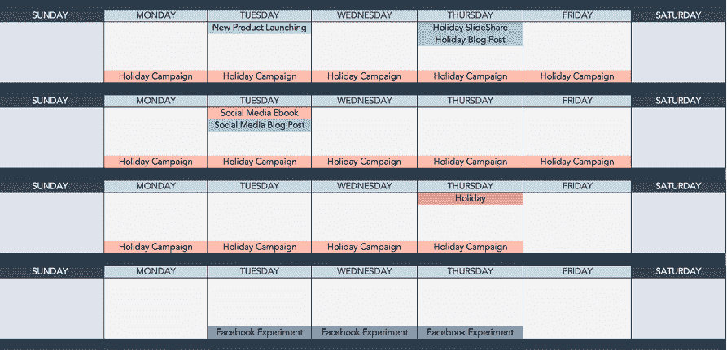

HubSpot social media calendar


记得回复任何提及你品牌的人。总是在 [Twitter](https://kinsta.com/blog/twitter-marketing/) 和[脸书](https://kinsta.com/blog/how-to-create-a-facebook-page/)上分享积极的反馈，尤其是来自在这个领域拥有大量追随者的有影响力的人。它能够也将会为你的企业带来新的商机和销售。考虑采用一种[影响者策略](https://www.socialtoaster.com/social-media-influencers-drive-holiday-sales/)来获得一些大曝光，并确保你的分支机构在他们的社交媒体页面上放置链接。

以下是我们收到并再次分享的关于 Kinsta 的反馈的几个例子。

[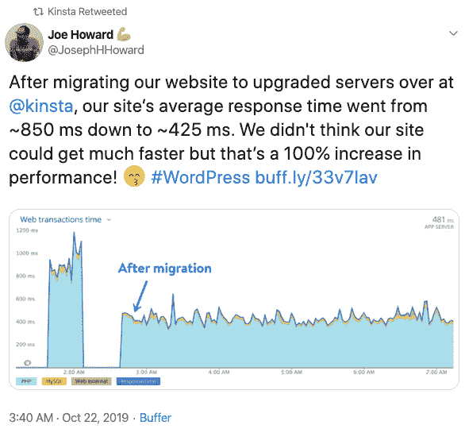](https://twitter.com/JosephHHoward/status/1186457319296700416)

Joe from WPbuff.com


[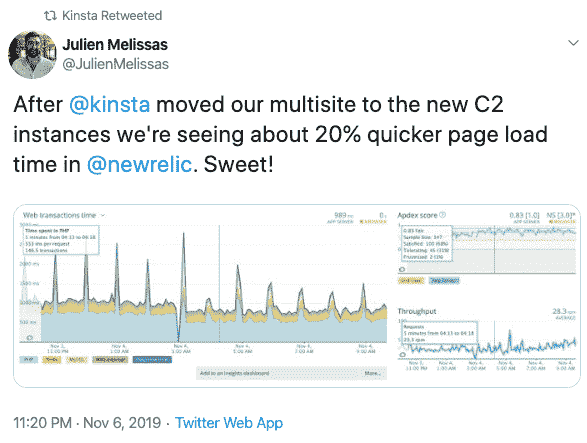](https://twitter.com/JulienMelissas/status/1192205128813686786)

Julien from Craftpeak & Roots


在大型节日促销期间，人们会在社交媒体上寻找最划算的交易，积极的社交证明可以将他们直接推向你的商店。尽你所能让人们谈论你的品牌。

#### 利用产品搜寻

这种电子商务策略确实更适用于新企业，但如果你正在推出一种新产品，也很容易奏效。而那就是利用[产品猎取](https://www.producthunt.com/products/kinsta)！

我们一次又一次地看到这项工作。这会带来巨大的流量，尤其是当你成为每日产品的时候。以 Draftsend 为例。这是最近在产品搜索上发布的一款新产品，引起了轰动！他们仅在 24 小时内就收到了 900 多张赞成票。

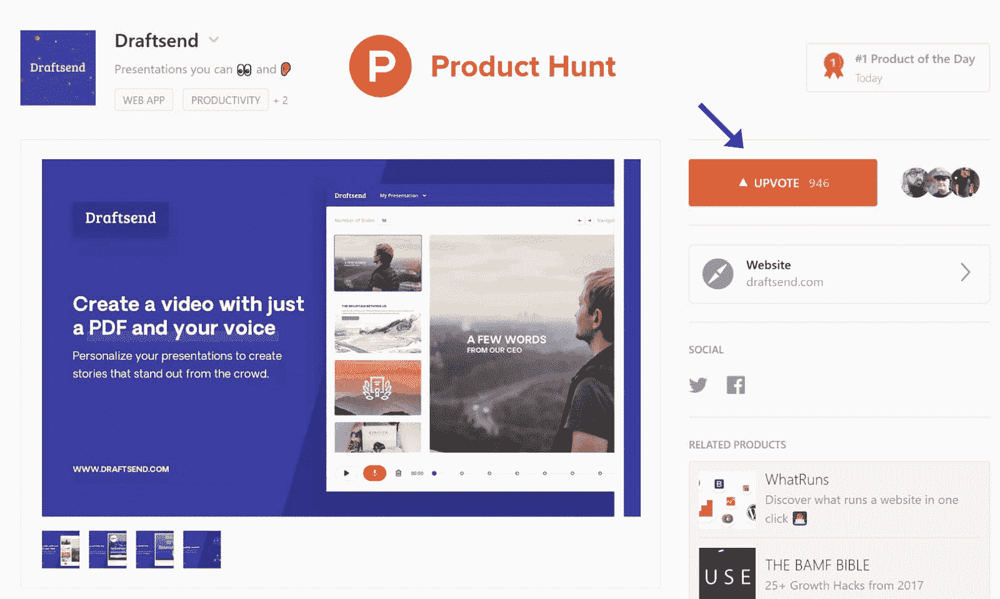

Product Hunt


你几乎可以保证这导致了他们产品的大量注册和关注。最棒的是，你可以免费在产品搜索中列出你的商品。这绝对是你应该引入你的在线电子商务战略向前发展。

这可能有点像 Reddit 的赌博，因为你不知道你的产品是否会在那里起飞，但你可以做一些事情来提高你的胜算。查看关于[如何开始寻找产品](https://hackernoon.com/launching-on-product-hunt-what-works-and-what-doesnt-guide-case-study-776c77d56e26)的完整指南。

### 8.考虑托管

预计今年会有大量顾客涌入？如果你还没有，你真的应该考虑让[托管](https://kinsta.com/features/)。如果你的网站在一次大抢购中宕机，可能会对你的销售产生灾难性的影响。托管主机配备了处理大量并发访问者的系统，以及管理资源和减少压力的专业知识。

一个[快速的主机和网站](https://kinsta.com/blog/boosting-wordpress-performance/)在高流量的季节期间变得更加重要，在这期间你的网站将会承受很大的负载，同时，你还要应对激烈的竞争。如果你坚持不住，你肯定会失去销售。如果客户甚至不能快速完成交易，他们会很快将业务转移到其他地方。

我们在 Kinsta 提供[应用托管](https://kinsta.com/application-hosting/)、[数据库托管](https://kinsta.com/database-hosting/)和[托管 WordPress 托管](https://kinsta.com/wordpress-hosting/)，即使在重负载时也能实现高速运行。

我们的架构经久耐用，完全可扩展以满足您的流量需求。我们每 2 分钟检查一次您的正常运行时间，如果出现问题，我们的快速支持将帮助您解决问题。

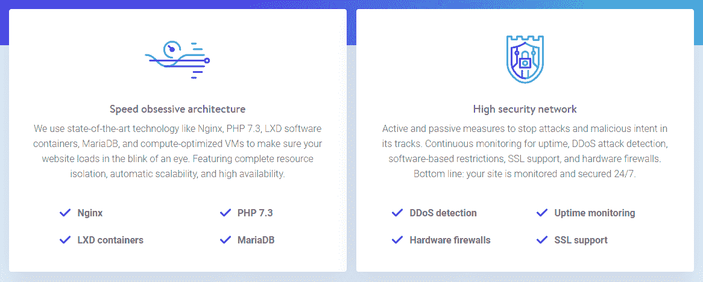

Kinsta features


你知道 40%的用户会放弃一个加载时间超过 3 秒的网站吗？2018 年假日季，移动端占电子商务流量的 66%。假期可能会让人们更加不耐烦。你需要保证闪电般的加载时间，否则你可能会失去客户。

如果你担心你的主机可能不具备处理所有你期待的访客的能力，托管可以消除你的这种担心。我们会处理一切，这样你就可以专注于经营你的商店。

当客户开始涌入的时候，你的网站有崩溃的趋势吗？许多系统在一年的大部分时间里都是完全可持续的，但就是无法应对假日高峰。为一年中除了两三个月之外没有使用的资源付费是一种浪费。

Kinsta 的计划由可扩展的虚拟机提供支持，这些虚拟机能够处理偶尔出现的流量高峰，但如果你知道即将发生的大事件会使你的网站变慢，请查看我们为处理大流量激增而设计的临时[专用服务器产品](https://kinsta.com/knowledgebase/dedicated-server/)。我们可以保护你的网站不崩溃，直到你的大拍卖结束，一旦结束，你不需要继续为资源付费。总的来说，你赢了。

不确定是否需要？你可以尝试像 [loader.io](https://loader.io/) 这样的负载测试，看看你的网站在高流量下如何支撑。想象一下，如果你的网站连压力测试都经受不住，在黑色星期五或网络星期一会发生什么。如果它在挣扎，相应地计划并暂时增加你的资源。

### 9.减少加载时间

虽然减少加载时间对任何人来说都不是什么新鲜事(这是我们关于如何加速你的网站的大量指南)，我们把它包括在内，因为它可能是你能为你的电子商务商店做的最重要的优化！

你的电子商务网站需要一个超快的、可靠的、完全安全的主机吗？Kinsta 提供所有这些服务，并由 WooCommerce 专家提供 24/7 的世界级支持。[查看我们的计划](https://kinsta.com/plans/?in-article-cta)

我们有很多 WooCommerce 和 Easy Digital Download 客户端来找我们，因为它们以前的主机速度太慢或无法承受负载。毫无疑问，你的电子商务网站的速度与转化率和用户互动有着直接的关系。以下是一些快速统计数据:

*   全球速卖通[在一次演讲](https://edge.akamai.com/ec/us/highlights/keynote-speakers.jsp#edge2016futureofcommercemodal)中透露，通过减少 36%的页面加载时间，他们的订单增加了 10.5%，新客户的转化率增加了 27%。
*   在渲染时间提高了 68%，页面重量提高了 46%，加载时间提高了 64%之后，Ancestry.com 的转化率提高了 7%。
*   波特发现，每过一秒，你的网站转化率[就会下降 2-4%](https://www.portent.com/blog/analytics/research-site-speed-hurting-everyones-revenue.htm) 。
*   根据谷歌双击的[研究，53%的移动网站访问在 3 秒钟后被放弃。](https://www.doubleclickbygoogle.com/articles/mobile-speed-matters/)

WooCommerce 站点要求特别高，因为它们会产生大量数据以及无法缓存的请求，这意味着你需要强大的 PHP 和数据库资源。在选择 WooCommerce hosting 时，重要的是你要使用一个基于容器的主机，它是为可伸缩性和独立资源而构建的。

当你运行一个要求很高的电子商务网站时，你可能会考虑转向托管平台。把你的主机交给合适的人可以极大地优化你的速度，减少你的加载时间。一个知道自己在做什么的托管主机可以让一切变得不同。

说到高流量的网络商务网站，这是我们在金斯塔的专长。我们知识渊博的支持工程师逐个研究每个案例，并习惯于与各种设置合作，从大型 WooCommerce 解决方案到小型 EDD 商店。

以前，我们帮助 DartDrones 等公司准备他们的 WooCommerce 网站，以应对他们在热门电视节目《鲨鱼坦克》中出现的大量流量。

不出所料，他们的流量在东部时间晚上 8 点左右暴涨(如下图所示)。在播出后的 6 小时内，总共有 1，263，233 个请求，使用了 2 TB 的缓存带宽，只有 3 GB 的未缓存带宽。我们能够提供 100%的正常运行时间，同时提供比他们之前的主机更快的页面加载时间。

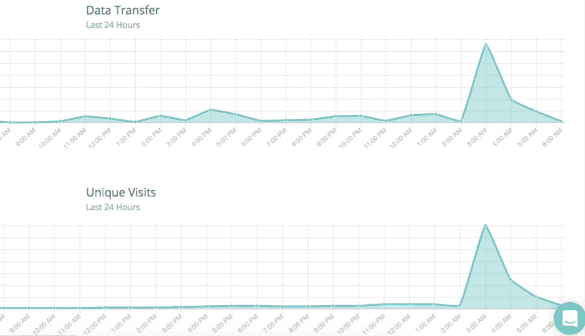

Data transfer analytics


以下是 Kinsta 进一步寻找电子商务网站性能和功能之间的完美平衡的几种方法:

*   快速的服务器级缓存和规则确保了 WooCommerce 和 EDD 的正常运行。
*   如果需要，能够在更高的计划上提供额外的 PHP 工作人员。额外的 PHP 工作器允许多个请求同时执行。
*   默认情况下，某些 WooCommerce 和 EDD 页面，如 cart、my-account 和 checkout，被排除在缓存之外。
*   当检测到“woo commerce _ items _ in _ cart cookie”或“edd_items_in_cart”时，用户会自动绕过缓存，以确保顺利和同步的结账过程。

我们还利用 [Kinsta APM](https://kinsta.com/apm-tool/) 来帮助客户轻松诊断可能导致其网站异常加载时间的原因。通常这可能来自第三方插件、缓慢的查询或糟糕的代码。

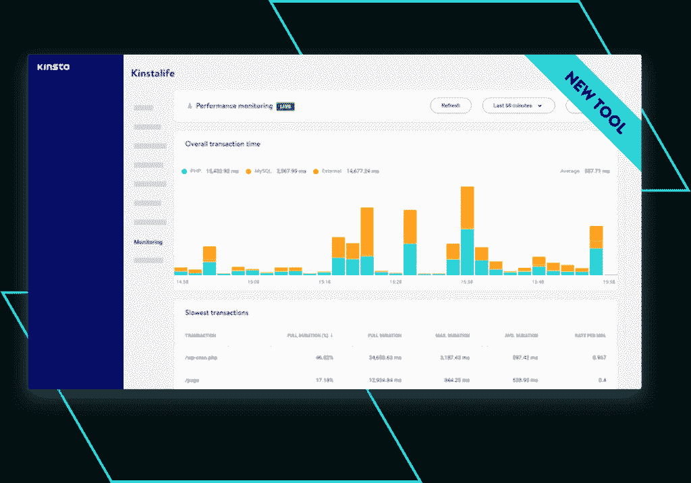

Kinsta APM Tool


除了转移到一个快速的主机，还有很多其他的优化可以减少你的加载时间。以下是您可以采取的一些附加步骤:

*   根据 [HTTP Archive 的数据，](https://httparchive.org/reports/state-of-the-web?start=latest)图片平均占网页总权重的 66%。由于产品目录的原因，这通常在电子商务网站上更糟糕！所以[优化你的图片](https://kinsta.com/blog/optimize-images-for-web/)是必不可少的。
*   [卸载并缓存附加文件](https://kinsta.com/knowledgebase/pdf-mp3-hosting/)，如 MP3、pdf 等。
*   利用[内容交付网络](https://kinsta.com/blog/wordpress-cdn/) (CDN)在全球范围内快速交付您的资产。在我们的测试中，各大洲的网站页面加载时间减少了 50%以上。
*   在您的站点上实现缓存。我们在服务器级别为客户端处理缓存，但是如果你的没有，你可以[安装一个缓存插件，比如 Cache Enabler WP Rocket](https://kinsta.com/blog/wordpress-cache/) 。
*   禁用和限制不需要的脚本，以确保更快的页面加载时间。WooCommerce 因收到来自(wc-ajax=get_refreshed_fragment)的 AJAX 请求而闻名。你可以确保它只加载在 WooCommerce 页面上，而不会拖累你网站的其他部分。你可以使用像 [perfmatters](https://perfmatters.io/) 这样的高级插件，只需点击一下就可以做到这一点，或者深入研究我们关于[如何在每页/每篇文章的基础上禁用脚本和插件](https://kinsta.com/blog/disable-wordpress-plugins-loading/)的深入教程。
*   优化你的数据库。如果您的数据库太大，有数千个表，它会降低您站点上的查询速度。我们总是建议[限制你的帖子修订](https://kinsta.com/blog/wordpress-revisions/#how-to-limit-revisions-in-wordpress)，删除旧的，清除瞬变，将表格从 [MyISAM 转换为 InnoDB](https://kinsta.com/knowledgebase/convert-myisam-to-innodb/) ，以及[清理你的 wp_options 表格](https://kinsta.com/knowledgebase/wp-options-autoloaded-data/)。
*   努力降低你的电子商务网站的时间到第一个字节( [TTFB](https://kinsta.com/blog/ttfb/) )。
*   正确地诊断和修复任何[高 Admin-AJAX 使用率](https://kinsta.com/blog/admin-ajax-php/)。

别忘了手机！每年越来越多的流量来自移动设备，谷歌现在正在运行其移动优先指数。

还要注意的是:并不是每个人都在使用 4G 这样的快速连接。重要的是装载时间要快，这样你才不会失去客户。在你失去他们之前，你有三秒钟的时间来留下印象，所以不要错过潜在的销售机会。

以上所有的建议也将帮助你提高移动速度，或者你可以在你的网站上测试谷歌放大器。AMP 提供了一种以闪电般的速度提供当前网页精简版的方法。一些大的电子商务网站已经在使用它，并看到了巨大的成果！

我们在我们的网站上尝试了 Google AMP，但结果并不令人满意。而且目前没有 SEO 优势(暂时)。您可以在我们的[案例研究](https://kinsta.com/blog/disable-google-amp/)中了解更多信息。然而，每个站点都是不同的。

所以我们总是建议在你自己的网站上测试。尤其是当你的网站被广告或第三方脚本所困扰的时候。AMP 可以真正让你受益，在某些方面，加速优化过程！在这个新的领域，新的插件不断涌现。这里有几个例子可供参考:

*   [AMP WooCommerce](https://wordpress.org/plugins/amp-woocommerce/)
*   [WP 放大器](https://codecanyon.net/item/wp-amp-accelerated-mobile-pages-for-wordpress-and-woocommerce/16278608)
*   weeblrAMP(包括 WooCommerce 和 EDD 支持)

### 10.简化、优化和安全

节假日是你销售的关键时期，他们会带来一批不寻常的顾客。在季节性大减价期间，人们会比平时更不耐烦。现在是时候优化你的网站设计，增加一些可以加速购买过程的功能了。

为了获得最佳效果，请简化一切，使您的产品页面尽可能易于访问。过于复杂的用户界面会让顾客失去兴趣。

移除或重新放置任何对你的销售漏斗没有贡献的东西，突出显示指向你的促销和产品页面的链接。使用图像和横幅链接来吸引眼球。确保您的[导航不再混乱](https://kinsta.com/blog/wordpress-custom-menu/)并且出行方便。

另外，考虑简化你的[导航菜单](https://kinsta.com/blog/wordpress-menu-plugins/)。使搜索栏和你的核心类别易于查看和访问，并确保“添加到购物车”按钮在他们到达你的产品时易于到达。消除混乱，使用巧妙的网页设计来突出你的商店区域的链接。

从你的主页，用户应该能够开始浏览一个类别，选择一个产品，并添加到他们的购物车在 3-5 次点击或更少。

你可以在网上得到最优惠的价格，但是如果你的网站是一个导航的噩梦，你将不会得到任何销售。

不要忘记采取额外的安全措施。这是攻击者试图窃取用户信息的黄金时间，因此您需要确保您和您的客户得到保护。

*   [备份你的网站](https://kinsta.com/help/wordpress-backups/)，现在就做。
*   更新你的主题和插件。过时的扩展是 WordPress 被黑的主要原因。
*   将你的 PHP 升级到最新版本。
*   如果你正在接受敏感的客户信息，你应该已经有了一个 SSL 证书。
*   投资[安全托管](https://kinsta.com/knowledgebase/malware-security/)以防止服务器漏洞。
*   保护[您的管理员登录](https://kinsta.com/blog/wordpress-login-url/)(将您的用户名改为“admin”并选择一个包含大写、小写、符号和数字的密码)并使用[双因素认证](https://kinsta.com/blog/wordpress-two-factor-authentication/)。

你可以采取很多更高级的步骤，所以看看我们的[WordPress 安全指南](https://kinsta.com/blog/wordpress-security/)和[电子商务欺诈防范](https://kinsta.com/blog/ecommerce-fraud-prevention/)。

#### 消除结账过程中的障碍

人们总是匆匆忙忙，比 10 年前多了很多。因此，消除结账过程中的任何障碍可以极大地增加你的销售额。如果结账是一个五步流程，他们会放弃购物车。

[根据一项研究](https://neilpatel.com/blog/5-ecommerce-stats/)，如果不得不创建一个新的用户账户，23%的用户会放弃他们的购物车。太多了！这里有三个建议。第一个是为新客户创建一个客人结帐。

通过这种方式，他们可以快速地将产品添加到购物车，购买，然后上路。在很多情况下，你仍然可以为他们创建一个帐户，它只是自动生成，而不是提示他们所有的信息。这样，当他们有更多的时间时，可以通过电子邮件重置密码。

在 WooCommerce 中，您可以在“结账”标签下启用客人结账。在轻松数字下载中，客人结帐实际上是默认启用的。


Enable guest checkout in WooCommerce


第二个建议是利用社交登录进行结账。出于安全考虑，一些客户可能不喜欢这样，而另一些客户可能对此没有意见。最棒的是，你可以同时提供这两种服务来加快每个人的结账过程。

官方 [WooCommerce 社交登录](https://woocommerce.com/products/woocommerce-social-login/)扩展由 SkyVerge 开发。还有[社交登录](http://docs.easydigitaldownloads.com/article/1280-social-login)扩展，方便数字下载。

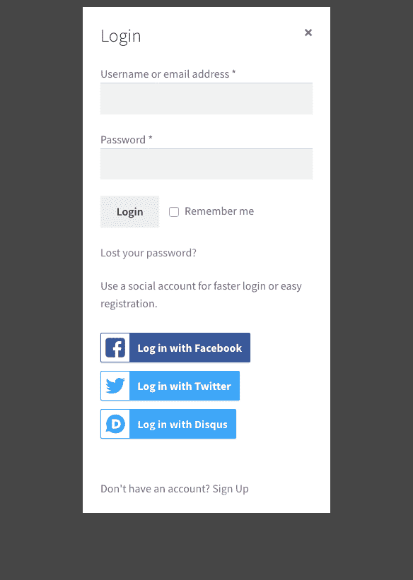

Social Login for Easy Digital Downloads


而第三个建议是给那些有实物的，那就是去掉那些运费！根据同一项研究，如果出现意外的运输费用，28%的购物者会放弃他们的购物车。

因此，最好的建议是，要么从一开始就告诉他们运费是多少，要么想出一种方法来给你的产品定价，包括运费。你有没有试过免费送货，看看它如何影响你的转换？

你也可以完全跳过冗长的结帐过程，使用插件实现更快的结帐系统。你可以通过一个[立即购买按钮](https://docs.easydigitaldownloads.com/article/1080-buy-now-buttons)在简单的数字下载中做到这一点，或者尝试一个 WooCommerce 扩展，[压缩产品和结账页面](https://woocommerce.com/products/woocommerce-one-page-checkout/)或者为注册用户提供[一键结账](https://yithemes.com/themes/plugins/yith-woocommerce-one-click-checkout/)。

### 11.测试一切

这个很简单，但是很多人都忘记了。浏览你的网站，点击所有内容。仔细阅读每一页，点击每一个链接，浏览你的关键文本，测试你的导航。注册一个帐户，将产品添加到您的购物车中，并在点击“购买”之前停止测试结账。

忽视这一步是很常见的，但是你会惊讶地发现这么做有多少小问题。这里有一个[断开的链接](https://kinsta.com/blog/broken-links/)或一个[的打字错误](https://kinsta.com/blog/proofreading-tips/)，那里有一个购物车的小故障……你想要尽早测试，以便有足够的时间来纠正任何问题，然后在你的第一次季节性促销即将推出之前再次测试。

自己测试，在多种设备和浏览器上测试，也请朋友测试。即使你什么都没发现，如果你发现了一些会损害许多客户体验的东西，你也会觉得很幸运。

#### 利用 A/B 测试

当谈到电子商务策略时， [A/B 测试](https://kinsta.com/blog/google-optimize/)应该总是排在列表的最前面。这是许多营销人员讨论的事情，但通常很少有后续行动。如果你在网上销售产品，底线是你应该不断地运行 A/B 测试。

把这变成一个每周或每月的习惯，你应该能够看到你的销售，点击率，网站时间，甚至搜索引擎优化的改善。

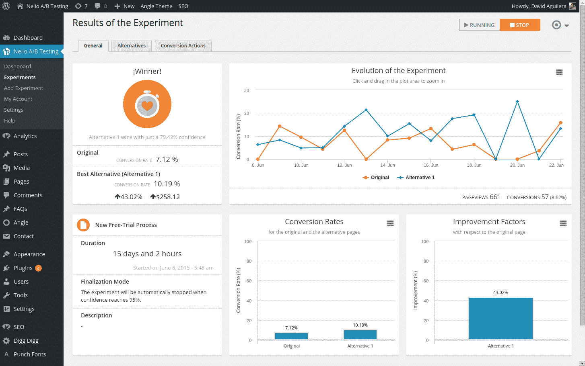

A/B Testing example with Nelio


A/B 测试，也称为分割测试，本质上是在面对面的场景中让两个页面元素相互竞争，告诉你读者对哪个元素的反应更大。例如，如果你想测试一个新的产品标题，你可以设计两个相同的网页，使用不同的标题，将流量导向每个网页，看看哪个标题会带来更多的页面浏览量、停留时间、更高的转化率等等。

然后你只需拿走获胜者，冲洗并重复这个过程。还有其他类型的测试，比如多元测试。

在大销售前的几周和几个月里，A/B 测试变得尤其重要。你要准备好保证为你赢得最多转化率的元素。

假期考 A/B 要小心。在流量激增时运行测试是可行的，但这往往会扭曲数据。客户往往行为不规则，许多不是你的目标受众，你的其他销售活动可以人为地夸大紧迫性。

假日 A/B 测试是快速获得大量结果的好时机，但是一旦事情平静下来，您需要运行相同的测试，否则您可能会因为数据失真而最终实施实际上损害您业务的更改。

这里有一些我们推荐的最好的 A/B 测试插件和工具。大多数，如果不是全部的话，都集成了 WordPress，可以用来运行你的 WooCommerce 和/或 Easy Digital Downloads 商店的 A/B 实验。

*   [谷歌优化](https://kinsta.com/blog/wordpress-ab-testing-tools/#google-optimize)
*   [内利奥 A/B 测试](https://kinsta.com/blog/wordpress-ab-testing-tools/#nelio-ab-testing)
*   [简单页面测试器](https://kinsta.com/blog/wordpress-ab-testing-tools/#simple-page-tester)
*   [A/B 压力优化器](https://kinsta.com/blog/wordpress-ab-testing-tools/#ab-press-optimizer)

*   [解锁](https://unbounce.com/)

并且记住没有 A/B 测试是太小的！Brian Massey 进行了一项研究，他对电子商务网站导航进行了 A/B 测试。

他发现，你在主导航上使用的词语可能比主导航的工作方式更能影响你的访问者。例如，他将导航项目“产品类别”替换为“商店产品”,发现整个网站的转化率下降了 13%。

如果你能简单地改变一个词，并看到更多的销售，这不是很好吗？嗯，很可能就是这么简单。没有办法知道，除非你 A/B 测试，然后 A/B 测试更多。

### 12.使用实时聊天即时联系

发送一张支持票并等待某人回复需要很长时间。当顾客争先恐后地购买礼物，以免为时过晚时，他们就不会为这个繁琐的过程而烦恼了。

但是如果你的网站包含了即时快速的实时聊天，那就完全不同了。如果客户有问题，他们更有可能联系你，然后完成销售。如果你没有任何方法可以立即取得联系，他们有可能会弃船。

在 eMarketer 的一项研究中， [62%的用户](https://99firms.com/blog/live-chat-statistics/)表示他们可能会回到提供实时聊天的网站。为什么？因为客户喜欢知道他们可以马上得到答案。对销售有帮助吗？当然了。

Drift 能够简单地通过在他们的网站上进行实时聊天，将他们的呼入销售线索增加 200%。

从金斯塔的第一天起，我们就开始使用对讲机，它对我们来说非常有效。Intercom 为我们提供了一种简单的方法，将聊天和支持票证(如下所示)集成到我们的控制面板中，这样客户就知道我们随时随地都是一键操作。

尽管如此，直到今天，我们还是得到了对我们的聊天解决方案印象深刻的客户的称赞。您可以根据自己的情况决定是只让已登录的客户访问聊天，还是让所有人访问。我们建议测试这两种方法！


At Kinsta we use Intercom


值得庆幸的是，由于聊天解决方案和插件的工作方式，它们几乎都支持 WooCommerce 或某种形式的简易数字下载。以下是我们推荐的几个例子:

*   [对讲机](https://www.intercom.com/)(如上图)
*   [漂移](https://wordpress.org/plugins/drift/)
*   [WP 实时聊天支持](https://wordpress.org/plugins/wp-live-chat-support/)

如果你正在寻找更多的比较，不要错过我们关于 WordPress 的 [11 个聊天解决方案的深度文章。](https://kinsta.com/blog/wordpress-live-chat-plugin/)

不要因为你没有给人们一个简单的联系方式，就让销售从你的手指间溜走。实施实时聊天将帮助您跟上购物者的快节奏。

### 13.通过营销自动化保持买家回头客

当您处理成千上万的并发用户时，您需要一种方法来简化推荐产品、跟踪销售和应用激励性折扣的过程。如果你在顾客紧张的假日购物期间给他们无缝的体验，你可以肯定他们会回来。

通过采用营销自动化和人工智能将更多的客户转化为收入，你可以将你的电子商务网站提升到一个新的水平。如果你有网上商店，我们建议你去看看。

这让你基本上把你的商店类固醇，并采用行之有效的营销策略，点击一个按钮，如推荐有针对性的产品添加到购物车。

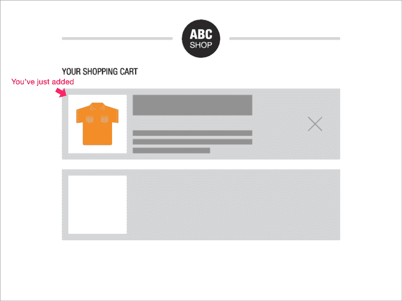

Beeketing


Beeketing WordPress 插件有超过 700 条评论，令人印象深刻的 5 星评价。以下是它们包含的一些其他令人惊叹的功能，可以真正微调您的商店:

*   在产品页面上添加销售倒计时钟和低库存指示器，以制造紧迫性和稀缺性。
*   在移动网络版:当用户浏览时，在顶部或底部增加一个立即购买按钮。
*   追加销售和交叉销售相关产品(支持手动产品选择和自动推荐)。
*   捆绑经常一起购买的产品，并以折扣价出售。
*   销售游戏化:激励客户花费更多以达到购物车价值阈值并获得奖励折扣。
*   如果客户完成订单，提供购物车级别的折扣、免费送货或免费礼品。
*   结账后追加销售更多产品以吸引重复购买(提供优惠券以激励)。
*   发送购物车& [浏览废弃邮件](https://kinsta.com/blog/shopping-cart-abandonment/)。
*   展示有多少人查看并购买了产品，以建立社交证明。

你也应该努力接触假日购物者。黑色星期五、网络星期一和 12 月的庆祝活动往往会带来巨大的收入增长。但是你的许多新客户只是暂时在这里利用你的大优惠，他们不打算逗留。

但是你已经抓住了他们的兴趣，并让他们中的许多人注册了一个帐户。这是一个留住大量新客户的巨大机会。不要让它溜走。

诀窍是说服他们[在正确的时间重新与](https://kinsta.com/blog/customer-retention/)合作。人们往往会在圣诞节期间花很多钱，所以过早开始的活动可能无效，但如果太晚，你可能会完全失去他们的兴趣。时机至关重要。

然而，你要为你的下一次晋升安排好时间，让球滚动起来，并在新的一年里一直运转下去。在最初的几个月里，让一个大事件进行下去。它可以重燃人们的兴趣，带回那些在季节性购物期间对你的品牌有过良好体验的顾客。

一些更小的重新吸引假日顾客的方法是给他们回头客优惠券，要求他们评论以换取一些东西，或者使用自动化推荐与他们购买的产品相似的产品。这是一个很好的方法，可以伸出手，提醒他们你的存在，同时给他们回来的动力。

有了正确的策略，一年中最后几个月新访客的激增不一定是暂时的。这是吸引一些永久顾客并把他们变成你商店的忠实长期粉丝的好时机。

[The holiday season is approaching and you need to capitalize on it. Get these 13 solid ecommerce strategies to grow your sales! 🎅🤖🤑Click to Tweet](https://twitter.com/intent/tweet?url=https%3A%2F%2Fbit.ly%2F3eXH7sX&via=kinsta&text=The+holiday+season+is+approaching+and+you+need+to+capitalize+on+it.+Get+these+13+solid+ecommerce+strategies+to+grow+your+sales%21+%F0%9F%8E%85%F0%9F%A4%96%F0%9F%A4%91&hashtags=woocommerce%2Csales)

## 摘要

在假期到来之前，你能负担得起的每一个小小的改变都可能带来不同。这是一年中你销售最多的时候，但是你需要准备好适应新客户的涌入。用正确的方法，你甚至可以说服他们留下来。

但你必须给人留下好印象。如果你的网站很难使用，优化很差，并且不断下降，你可能会赶走新的长期客户，也会让你现在的客户失望。确保你的 WooCommerce 和 Easy Digital Downloads 商店准备好了，不要磨蹭:你可以肯定你的竞争对手不会！

我们错过了什么重要的提示吗，或者你有其他独特的提示可以分享吗？我们希望听到一些电子商务网站的所有者。欢迎在下面留下你的评论。

* * *

让你所有的[应用程序](https://kinsta.com/application-hosting/)、[数据库](https://kinsta.com/database-hosting/)和 [WordPress 网站](https://kinsta.com/wordpress-hosting/)在线并在一个屋檐下。我们功能丰富的高性能云平台包括:

*   在 MyKinsta 仪表盘中轻松设置和管理
*   24/7 专家支持
*   最好的谷歌云平台硬件和网络，由 Kubernetes 提供最大的可扩展性
*   面向速度和安全性的企业级 Cloudflare 集成
*   全球受众覆盖全球多达 35 个数据中心和 275 多个 pop

在第一个月使用托管的[应用程序或托管](https://kinsta.com/application-hosting/)的[数据库，您可以享受 20 美元的优惠，亲自测试一下。探索我们的](https://kinsta.com/database-hosting/)[计划](https://kinsta.com/plans/)或[与销售人员交谈](https://kinsta.com/contact-us/)以找到最适合您的方式。