# Bing 网站管理员工具:完整的分步指南

> 原文：<https://kinsta.com/blog/bing-webmaster-tools/>

你可能已经知道 [Bing](https://kinsta.com/blog/alternative-search-engines/#1-bing) 是第二大搜索引擎，对吗？所以你肯定已经设置了**必应站长工具**。

或者也许你还没有，因为你从来没有真正考虑过它。

虽然你可能不会像关注谷歌那样关注必应，但你至少应该设置必应网站管理员工具。为什么？因为这样做很简单，而且可以帮助你为你的网站获得额外的 SEO 流量。

让我展示给你看。

## Bing 站长工具是什么？

Bing 网站管理员工具(Bing WMT)是一项免费的微软服务，允许网站管理员将他们的网站添加到 Bing 爬虫中，这样他们的网站就会出现在搜索引擎中。

它还有助于监控和维护网站的存在。必应站长工具之于必应搜索引擎，就好比[谷歌搜索控制台](https://kinsta.com/blog/google-search-console/)之于谷歌。

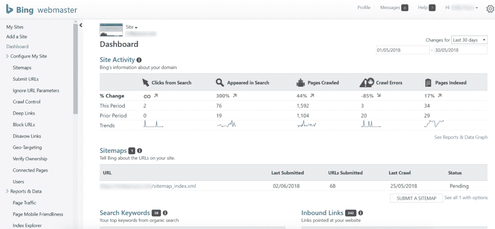

Bing Webmaster Tools dashboard

任何运营网站的人都可以从使用 Bing 网站管理员工具中受益，无论你是网站所有者、[网站管理员](https://kinsta.com/knowledgebase/wordpress-admin/)、[营销人员](https://kinsta.com/blog/b2b-vs-b2c/)还是[网站开发者](https://kinsta.com/blog/hire-wordpress-developer/)。

> 需要在这里大声喊出来。Kinsta 太神奇了，我用它做我的个人网站。支持是迅速和杰出的，他们的服务器是 WordPress 最快的。
> 
> <footer class="wp-block-kinsta-client-quote__footer">
> 
> 
> 
> <cite class="wp-block-kinsta-client-quote__cite">Phillip Stemann</cite></footer>

[View plans](https://kinsta.com/plans/)

### 为什么你不应该忽视冰

首先也是最重要的:必应在美国最大的搜索引擎中排名第二。所以你想让你的网站在上面排名。

为什么？因为它拥有多样化的受众。而[根据现有数据](https://www.statista.com/topics/4294/bing/)，必应的搜索引擎市场份额为 9.41%；

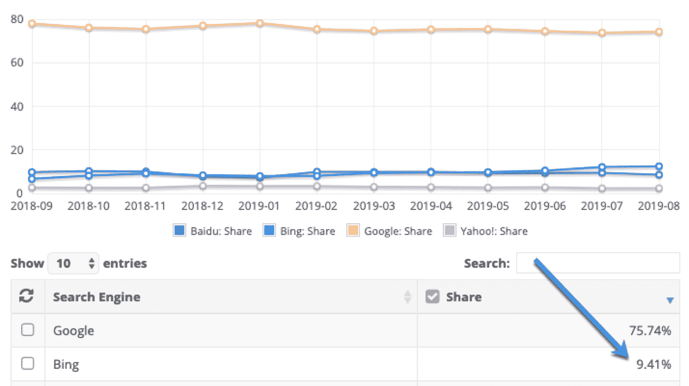

Bing usage statistics

现在，9.41%可能听起来不那么令人印象深刻，除非你考虑实际数字:

*   每月有 13 亿全球游客到访 Bing.com。
*   全球每月 120 亿的搜索量。
*   美国每月 5 亿的搜索量。

### 为什么要用必应站长工具？

Bing 网站管理员工具允许您监控网站的整体健康状况，并帮助您了解客户是如何找到您的网站的。您可以使用工具和报告[来查找推动流量的关键词](https://kinsta.com/blog/keyword-research/)以及这些术语的印象和点击量，并找到链接到您的网站。您还可以:

*   监控[你网站的表现](https://kinsta.com/blog/boosting-wordpress-performance/)，看看你的关键词排名。
*   查看 Bing 如何抓取和索引您的站点。
*   提交您的网站/新页面进行抓取。
*   删除任何不想被编入索引的内容。
*   [否认链接](https://kinsta.com/blog/content-scraping/#step-3)。
*   监控并解决潜在的[恶意软件或垃圾邮件问题](https://kinsta.com/blog/wordpress-hacked/)。

所有这些都有助于你了解必应如何看待你的网站(以及[你的内容](https://kinsta.com/blog/content-length/))，这样你就可以做出任何调整来提高你的排名，从而[增加你网站的流量](https://kinsta.com/blog/how-to-drive-traffic-to-your-website/)。

## 如何设置 Bing 网站管理员工具

### 1.创建一个网站管理员工具帐户

为此，请前往 [Bing 网站管理员工具](https://www.bing.com/webmasters/about)并点击“注册”:

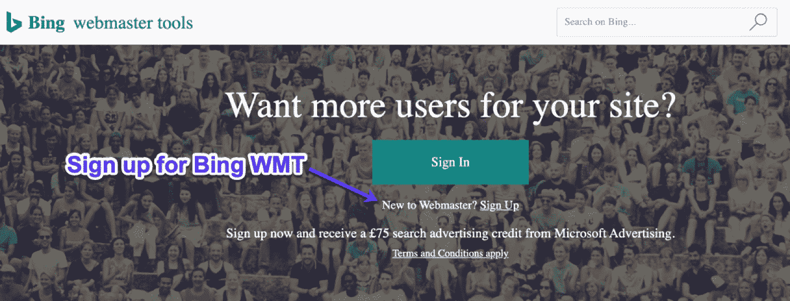

Sign up page for Bing Webmaster Tools

系统会提示您通过微软、谷歌或[脸书](https://kinsta.com/blog/how-to-create-a-facebook-page/)的现有账户创建阿炳·WMT 账户。

创建帐户后，您会看到一个空的仪表板:

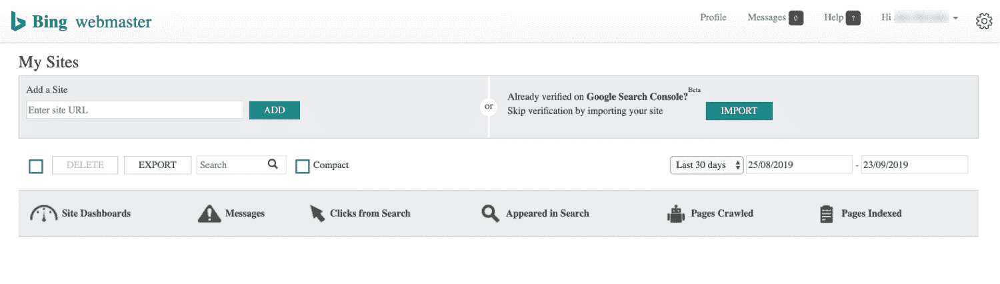

An empty Bing site dashboard

但是一个空的仪表板对任何人都没有用。让我们将您的网站添加到 Bing。

### 2.向 Bing 提交 URL

首先，我们需要添加一个 URL。

将你网站的网址添加到框中，点击“添加”

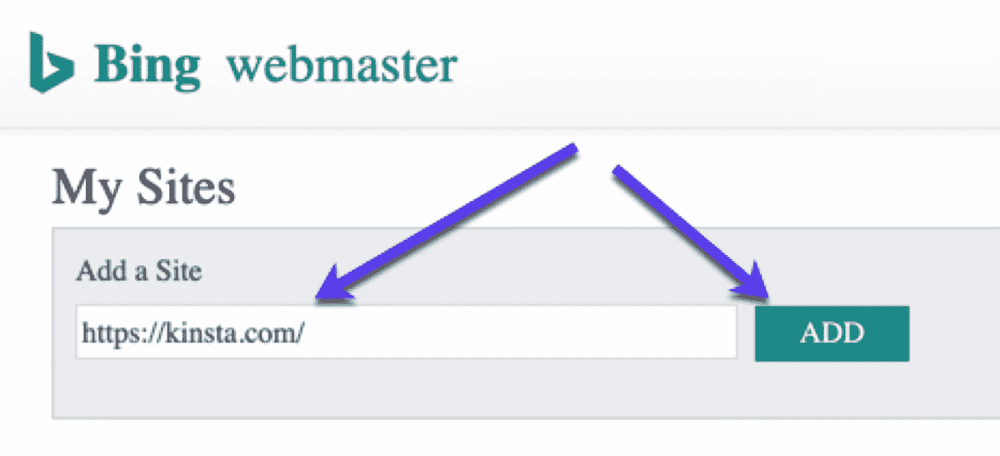

My sites in Bing Webmaster Tools

现在你将被带到一个页面，在这里你可以添加更多关于你的网站的信息。让我们在这里浏览一下您想要添加的内容:

### 3.将网站地图提交给 Bing

这里最重要的一点可能是将您的 [XML sitemap](https://kinsta.com/blog/wordpress-sitemap/) 添加到 Bing。

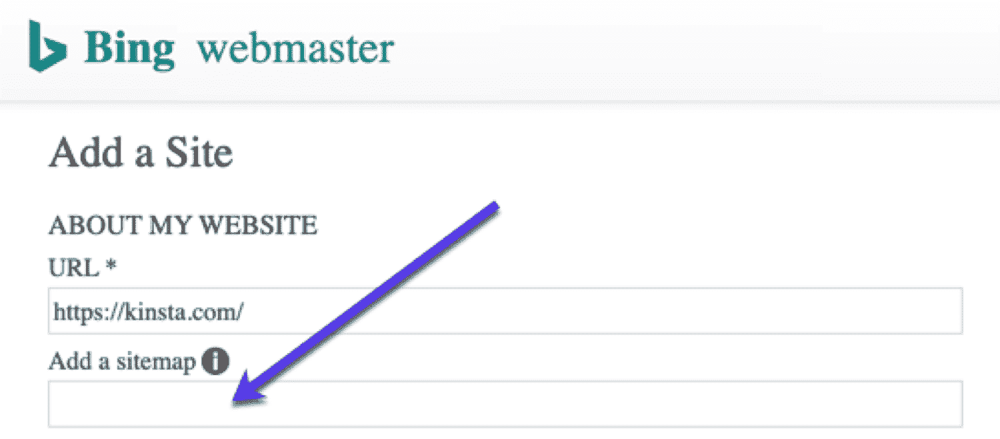

Adding an XML sitemap to Bing

找到你的站点地图并把它粘贴到框中。

一旦你添加了这个选项，你可以让剩下的选项保持原样，向下滚动，点击 **Save** 。

现在该开始 Bing 验证了。

## 如何验证 Bing 站长工具

有三种方法可以验证您的个人资料:

### 1.XML 文件

要通过 XML 文件进行验证:

*   下载 Bing XML 文件。
*   将其上传到您的域的根文件夹。

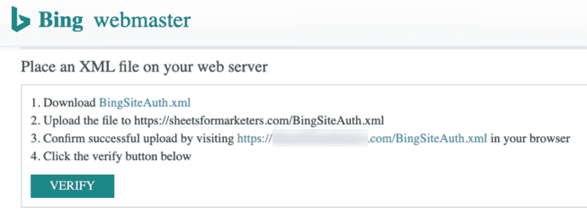

Bing XML file verification

这将创建 URL:**YOURDOMAIN.com/BingSiteAuth.xml**

您需要[通过 FTP](https://kinsta.com/knowledgebase/bulk-upload-files-wordpress-media-library-ftp/) 上传该文件。如果您没有权限，这种验证方法可能不太合适。

### 2\. Meta Tag

下一步是在你的网站主页上添加一个 meta 标签。这只是一个简单的 HTML，就像一个元描述。

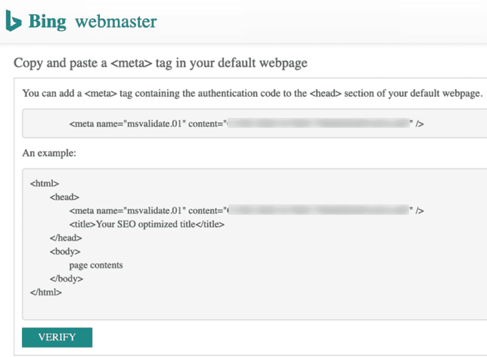

Meta tag to verify Bing Webmaster Tools

如果你使用的是有[定制 HTML](https://kinsta.com/knowledgebase/edit-wordpress-code/) 部分的 [CMS](https://kinsta.com/knowledgebase/content-management-system/) ，你可以把它放在那里进行直播。

为了让 Bing 网站管理员工具得到验证，你需要保留这个 meta 标签

### 3.托管提供商:CNAME

最后一个选项允许你通过你的[主机提供商](https://kinsta.com/)添加一个 [CNAME 记录](https://kinsta.com/knowledgebase/what-is-dns/#dns-records)。

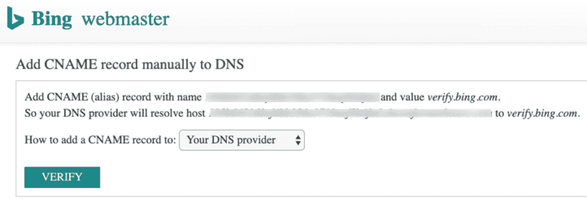

这通常是验证您的个人资料的最快和最可靠的方法。但取决于你的宿主，这可能是最棘手的。

遵循这三种方法中你喜欢的(或者实际上可以做到的)任何一种，它们基本上都是一样的。

我知道我说过只有三种方法来验证必应 WMT，但是如果你在你的网站上使用 WordPress，你实际上有更多的选择:

### 用 WordPress 验证 Bing 网站管理员工具

WordPress 网站的验证过程非常简单。确保你已经安装了这些 [SEO 插件](https://kinsta.com/blog/best-seo-plugins-for-wordpress/)中的一个:

*   [Yoast SEO](#yoast)
*   [全在一个 SEO 包](#aiosp)
*   [排名数学](#rank-math)

它们做的大致相同，都有助于提高你的搜索引擎优化。但是，如果你需要帮助来决定选择哪一个，请查看我们对 [Rank Math vs Yoast SEO](https://kinsta.com/blog/rank-math-vs-yoast/) 的深入分析。

以下是如何在每个插件上验证 Bing 网站管理员工具:

#### 约斯特

登录到你的 WordPress 后端，然后在左边的菜单中进入 SEO。从主 [Yoast 仪表盘](https://kinsta.com/blog/yoast-seo/)中，点击网站管理员工具选项卡。

现在你会看到一个框，你可以在里面放入你的 Bing 验证码(以及百度、谷歌和 T2 的验证码):

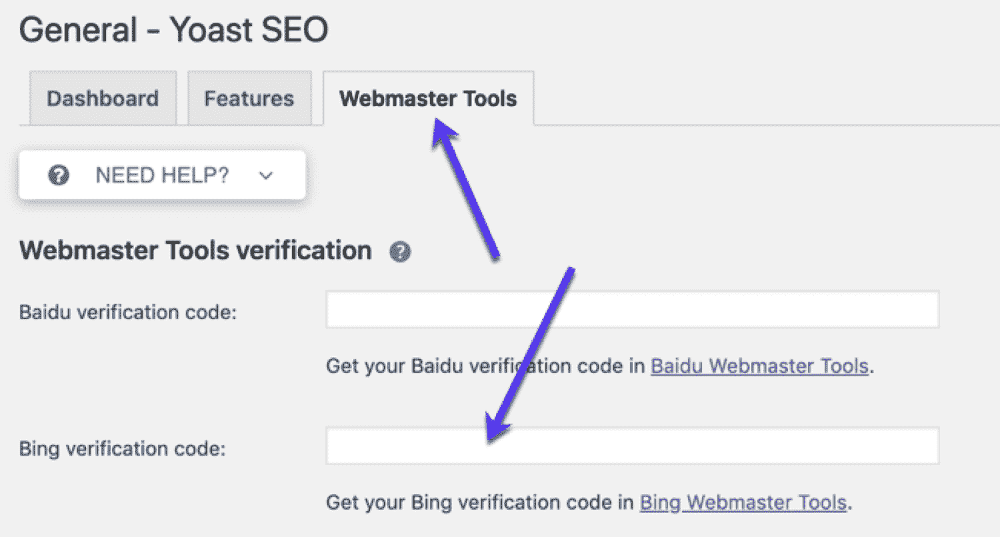

Yoast SEO Bing Webmaster Tools setup

还记得本指南前面的 HTML meta 标签吗？

以防你忘记:

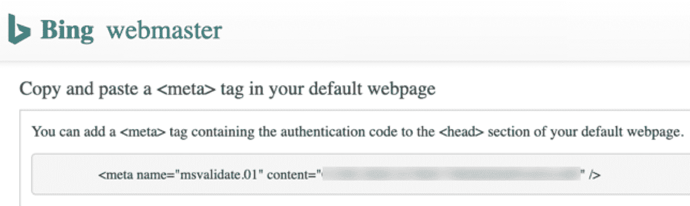

Meta tag for Bing

复制代码并粘贴到 Yoast 中。

完成后，只需点击“**保存更改**”，然后返回 Bing 网站管理员工具并验证(使用 HTML 标签方法)。

#### 所有在一个搜索引擎优化包

一个 SEO 包的过程没有太大的不同。

## 注册订阅时事通讯

### 想知道我们是怎么让流量增长超过 1000%的吗？

加入 20，000 多名获得我们每周时事通讯和内部消息的人的行列吧！

[Subscribe Now](#newsletter)

转到搜索引擎优化，然后一般设置，滚动，直到你看到“网站管理员验证”部分:

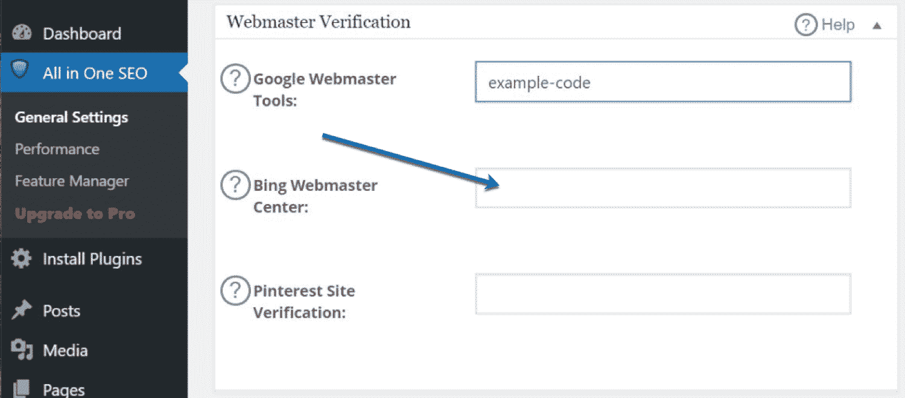

All-in-One SEO Bing Webmaster Tools setup

粘贴你的 HTML 标签，滚动到页面底部，点击“更新选项”按钮保存。

#### 排名数学

转到[等级数学](https://kinsta.com/blog/best-seo-plugins-for-wordpress/#rank-math)中的通用设置选项卡。

在这个 SEO 设置页面上，你会在子菜单中看到网站管理员工具，点击它并将你的 meta 标签粘贴到 Bing 框中:

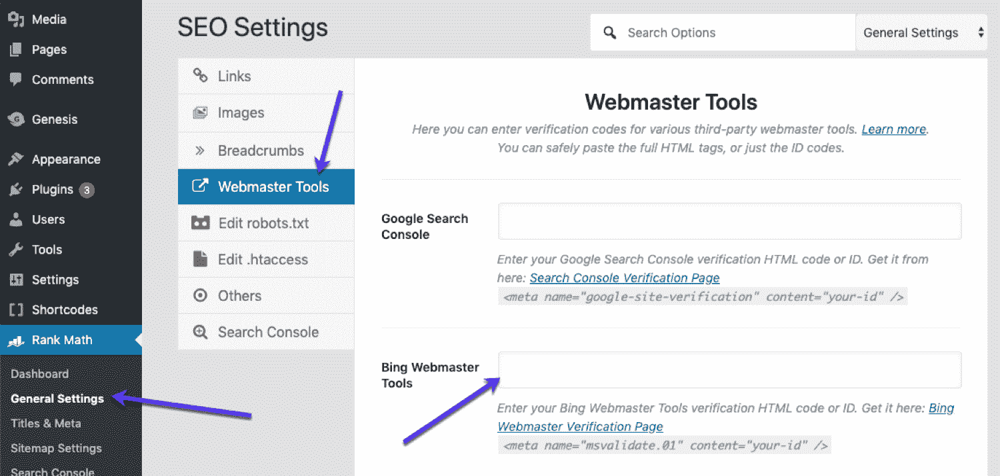

RankMath Bing Webmaster Tools setup

好了，你的 Bing 网站管理员工具已经设置好并通过验证了。

但是你能用你的新仪表板做什么呢？

让我们来探索一下:

## 使用 Bing 网站管理员工具

在我们开始探索 Bing 网站管理员工具之前，让我们先绕个弯，看看如何给 Bing 添加网址:

### Bing 索引

在本指南的设置部分，我们已经了解了如何向 Bing 提交 URL。但是你知道吗，你实际上可以把你的网址提交给 Bing 来加快抓取和索引的速度。

你可以，而且非常简单。方法如下:

转到“配置我的站点”并从下拉列表中选择“提交 URL”。然后，只需粘贴你的网址，点击提交，并坐下来知道必应正在索引你的网页。

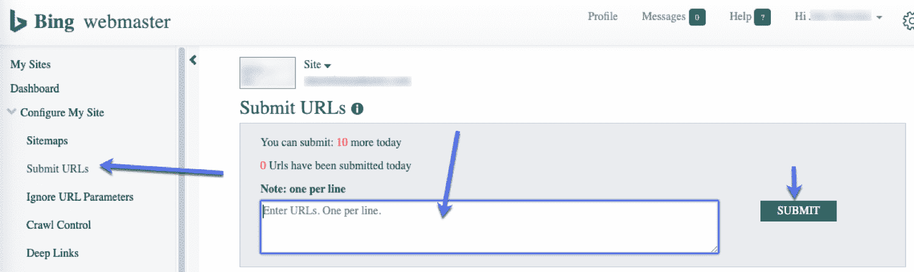

Submit URLs to Bing

在您的必应 WMT 仪表盘中，您可以配置您的网站、提交网址、阻止网址、管理用户等。但是让我们把注意力集中在不同的报告和工具上，这些报告和工具使必应 WMT 成为一个有用和有效的搜索引擎优化工具:

### 报告和数据

这是 Bing 中任何网站活动的摘要。站点活动图显示了您选择的日期的趋势。

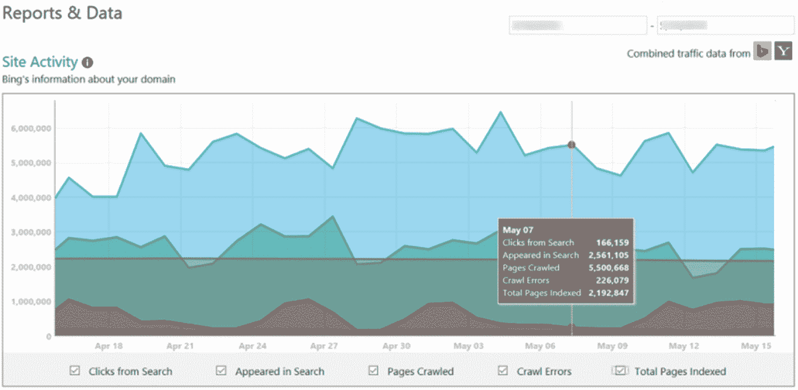

Bing Reports and Data

在里面，您还可以找到其他工具和报告:

*   页面流量。
*   索引浏览器。
*   搜索关键词。
*   SEO 报告。
*   入站链接。
*   爬网信息。

让我们快速看一下这些:

### 页面流量

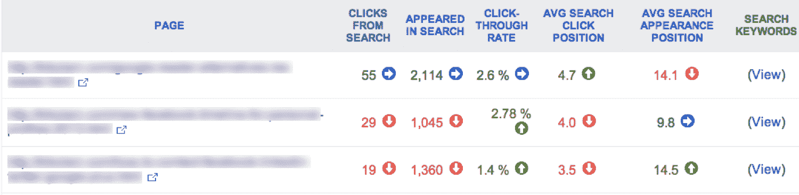

Page traffic report in Bing

这显示了在 Bing 搜索结果中出现的排名靠前的网址，以及它们的位置、点击量和点击率。您可以单击“查看”来查看每个 URL 的关键字并导出数据。

如果你想让你的 SEO 更上一层楼，你不能依靠一个慢主机。我们提供超快的服务器和来自 WordPress 专家的 24/7 世界级支持。[查看我们的计划](https://kinsta.com/plans/?in-article-cta)

### 索引浏览器

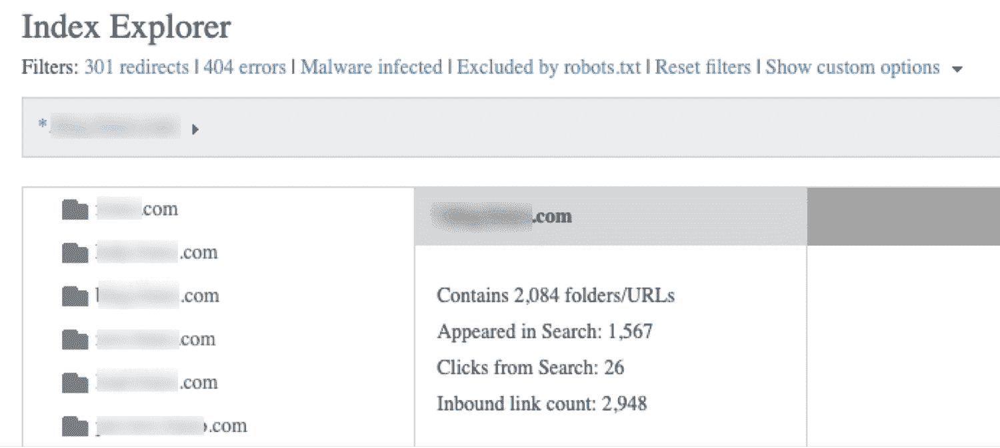

Index explorer in Bing

索引浏览器可以让你看到 Bing 已经抓取(或试图抓取)了哪些页面。它给你的数据，如发现的网址数量，有多少出现在搜索中，点击次数和入站链接计数。您可以滚动浏览文件夹并查看站点特定区域的数据。

### 搜索关键字

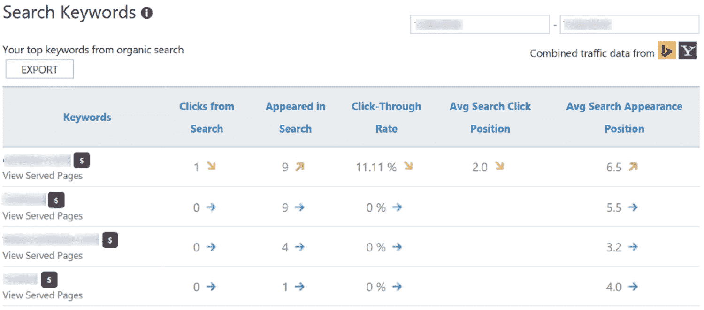

Search keywords report in Bing

搜索关键词报告向您显示您获得印象和点击的有机关键词。基本上是 Bing 中出现的排名靠前的网址。你也可以看到你的网站在 CTR 方面的表现。

### SEO 报告

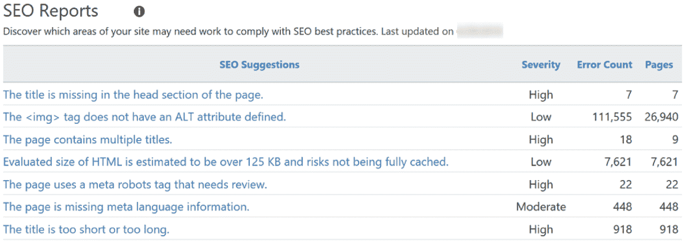

SEO reports in Bing

SEO 报告会给你一些建议，帮助你确保你的网站遵循 SEO 最佳实践。只需点击一个建议，查看错误的进一步解释，甚至修复它的建议。如果你想知道，这份报告会每隔一周自动运行一次，并扫描你帐户中任何经过验证的网站。

### 入站链接

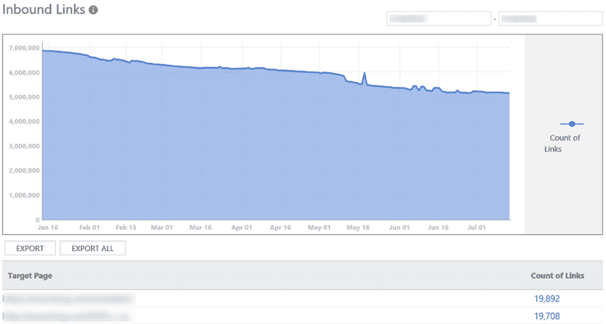

Inbound links report in Bing

入站链接报告显示…嗯，Bing 找到的指向你的站点的所有入站链接。这对于查看是否有任何地方你随着时间的推移获得或失去链接是有用的。

### 爬网信息

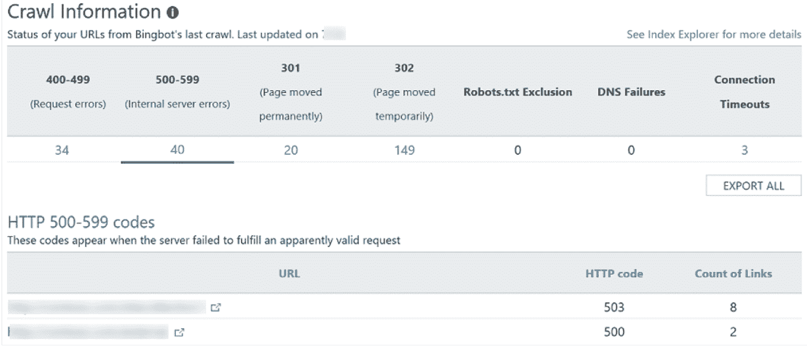

Crawl information in Bing

爬网信息提供了网站上所有爬网错误的概述。你可以看到诸如 Bing 在访问页面时遇到的错误，任何被 robots.txt 阻止的项目，以及任何被恶意软件感染的网址。

## 诊断和工具

在这一节中，你会发现 Bing 提供了一系列诊断工具，帮助你修复网站问题，提高网站的 SEO 可见性。

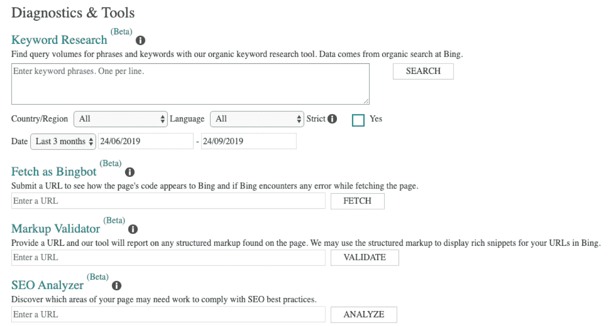

Bing diagnostic tools

在里面你会发现:

T3】

让我们快速看一下这些:

### 1.移动友好测试工具

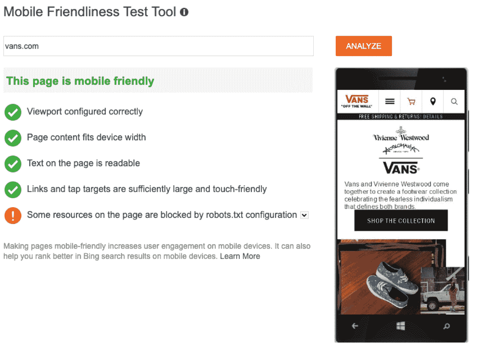

Bing’s mobile friendliness test tool

每个人都知道拥有一个手机友好网站的重要性。甚至必应。要使用这个工具，只需输入一个网址，然后点击“分析”。然后你就可以知道 Bing 是否认为该页面适合移动设备，以及它在移动设备上的外观。

### 2.关键词研究

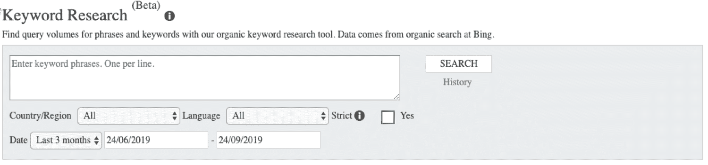

Doing keyword research in Bing Webmaster Tools

Bing 的关键词搜索工具允许你在仪表盘内快速进行关键词搜索。它使用 Bing 的关键词研究数据来显示 Bing 上关键词(以及相关关键词)的搜索量。您可以同时研究多达 20 个关键词，按国家或语言排序，并可以导出所有关键词数据。免费的还不错。

### 3.作为 Bingbot 获取

Fetch as Bingbot report

Bingbot 允许你在 Bing 的搜索引擎爬虫上看到你的站点。这是一个很有用的工具，可以帮助你解决搜索中可能会伤害你的网站的错误。只要输入你的网址，就能像 Bingbot 一样看到你的页面源代码。

### 4.标记验证器

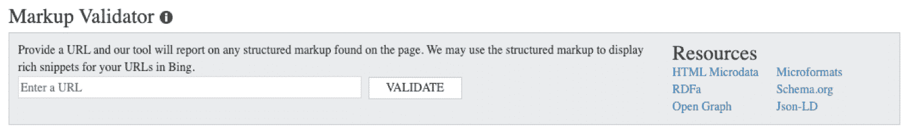

Schema/structured data markup validator in Bing

标记验证器会告诉你[模式](https://kinsta.com/blog/best-wordpress-review-plugins/)是否已经被正确实现。如果你在你的网站上使用[模式标记](https://kinsta.com/blog/schema-markup-wordpress/) (Schema.org、RDFa、微格式、HTML 微数据或 Open Graph)，来自扫描页面的代码将出现在 Bing 的报告中。

### 5.搜索引擎优化分析器

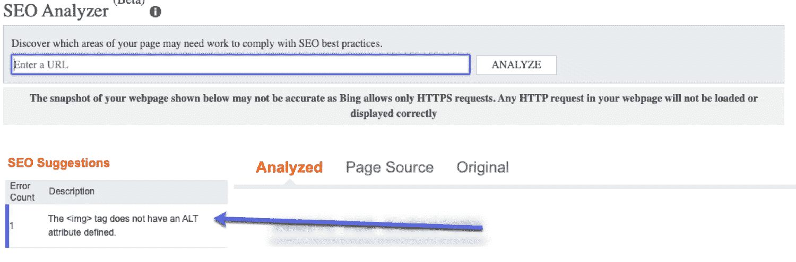

Bing’s SEO analyzer

搜索引擎优化分析器做它所说的:它分析你的网页搜索引擎优化性能。它扫描任何 URL，并突出显示页面是否符合最佳搜索引擎优化实践，并给出建议。

### 6.验证 Bingbot

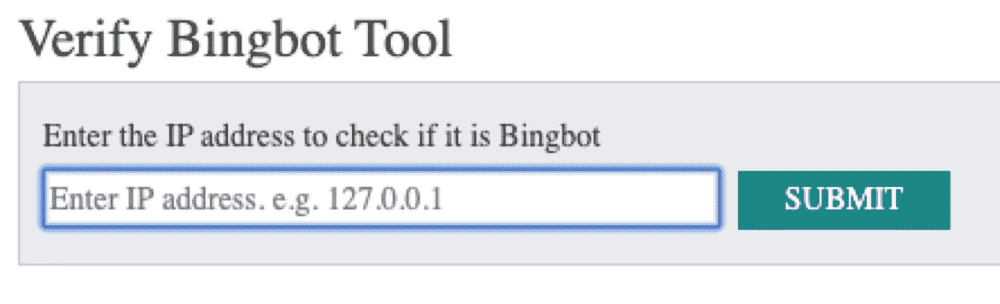

Verify Bingbot

验证 Bingbot 工具允许您研究日志文件中的 IP，以查看它们是否属于 Bingbot。如果 IP 地址不是真实的，这表明发出请求的服务器是非法的。

### 7.站点移动

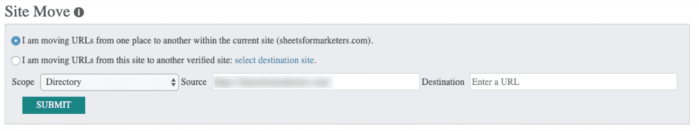

Tell Bing if you move your site to a new domain

站点移动让你直接告诉 Bing 你的站点是否已经移动到一个新的域。通常，Bing 会选择[重定向](https://kinsta.com/help/redirect-rules/)并改变索引，但是站点移动功能可以加快速度并确保没有问题。

你可以在 Bing 网站管理员工具中找到很多有用的报告和工具。但不止于此。Bing 团队还收集了一些有用的资源。

## 进一步阅读

以下是 Bing 收集的工具、资源和进一步阅读材料，可以帮助你理解他们的算法(并加以利用):

*   Bing 网站管理员指南——阅读这些指南是让你快速上手的最快方法。当谈到 Bing SEO 时，你会学到你需要知道的一切。
*   微软搜索引擎优化工具包(Microsoft SEO Tool Kit)–这款鲜为人知的 100%免费搜索引擎优化工具是一款易于使用的桌面应用程序，可以抓取你的网站来查找任何搜索引擎优化问题。
*   [必应站长博客](https://blogs.bing.com/webmaster/)——和谷歌一样，必应也有博客。通读并订阅搜索引擎新闻。
*   Bing 搜索质量博客–Bing 的搜索质量博客提供了搜索领域的最佳实践和见解。
*   [联系 Bing 网站管理员团队](https://support.microsoft.com/)——这不是一个真正的工具，但仍然有用。如果你的网站有问题，你可以直接联系 Bing 团队解决问题。

[When it comes to improving your SEO, great tools are never enough. Check out this step-by-step tutorial on how to use Bing Webmaster Tools and optimize for the 2nd biggest search engine! 📈🚀Click to Tweet](https://twitter.com/intent/tweet?url=https%3A%2F%2Fkinsta.com%2Fblog%2Fbing-webmaster-tools%2F&via=kinsta&text=When+it+comes+to+improving+your+SEO%2C+great+tools+are+never+enough.+Check+out+this+step-by-step+tutorial+on+how+to+use+Bing+Webmaster+Tools+and+optimize+for+the+2nd+biggest+search+engine%21+%F0%9F%93%88%F0%9F%9A%80&hashtags=wordpress%2Cseo)

## 摘要

这就是你需要知道的关于 Bing 网站管理员工具的一切。

Bing 网站管理员工具几乎提供了谷歌搜索控制台的所有功能，虽然你可能不会经常使用它，但它绝对应该被包含在你的整个 T2 搜索引擎优化策略中。

* * *

让你所有的[应用程序](https://kinsta.com/application-hosting/)、[数据库](https://kinsta.com/database-hosting/)和 [WordPress 网站](https://kinsta.com/wordpress-hosting/)在线并在一个屋檐下。我们功能丰富的高性能云平台包括:

*   在 MyKinsta 仪表盘中轻松设置和管理
*   24/7 专家支持
*   最好的谷歌云平台硬件和网络，由 Kubernetes 提供最大的可扩展性
*   面向速度和安全性的企业级 Cloudflare 集成
*   全球受众覆盖全球多达 35 个数据中心和 275 多个 pop

在第一个月使用托管的[应用程序或托管](https://kinsta.com/application-hosting/)的[数据库，您可以享受 20 美元的优惠，亲自测试一下。探索我们的](https://kinsta.com/database-hosting/)[计划](https://kinsta.com/plans/)或[与销售人员交谈](https://kinsta.com/contact-us/)以找到最适合您的方式。