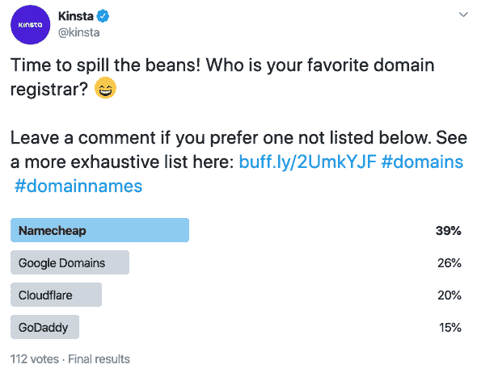
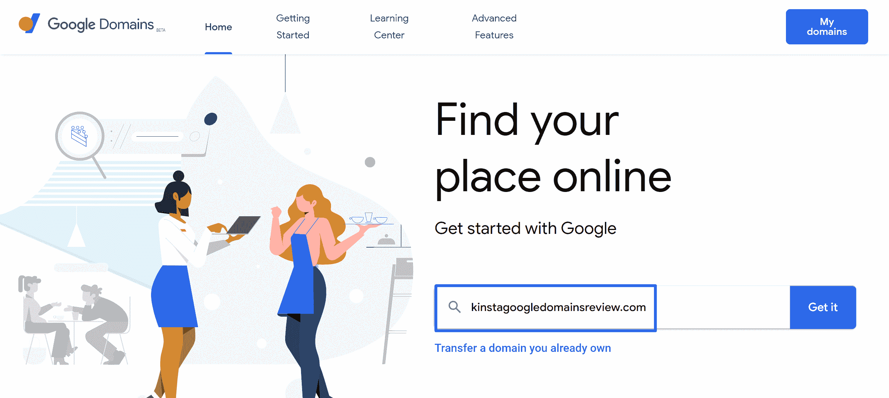
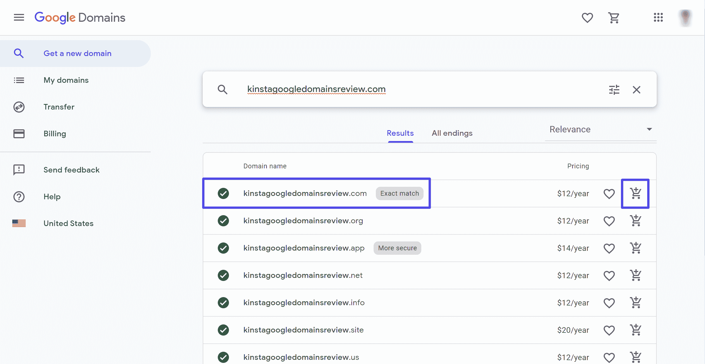
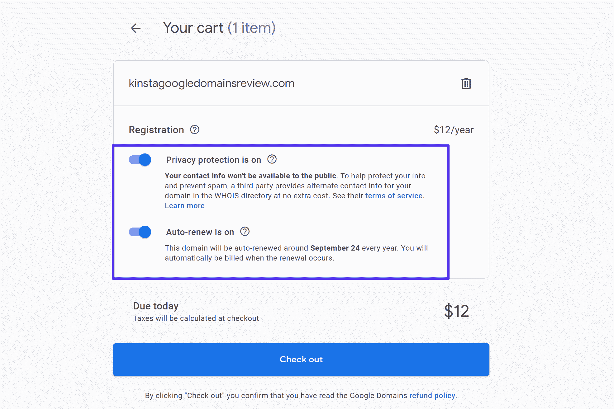
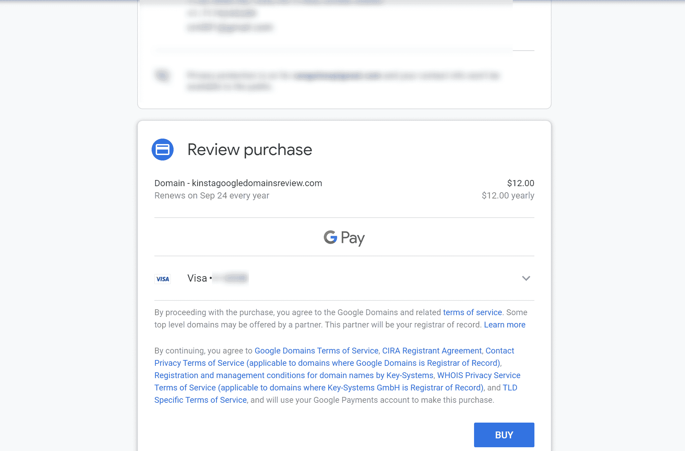
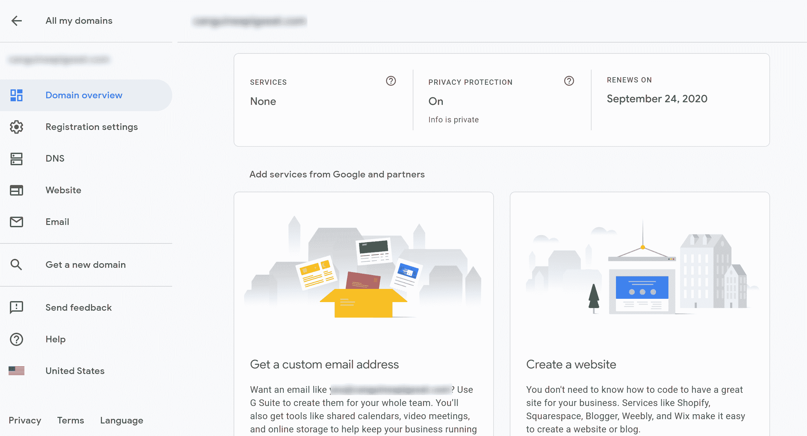
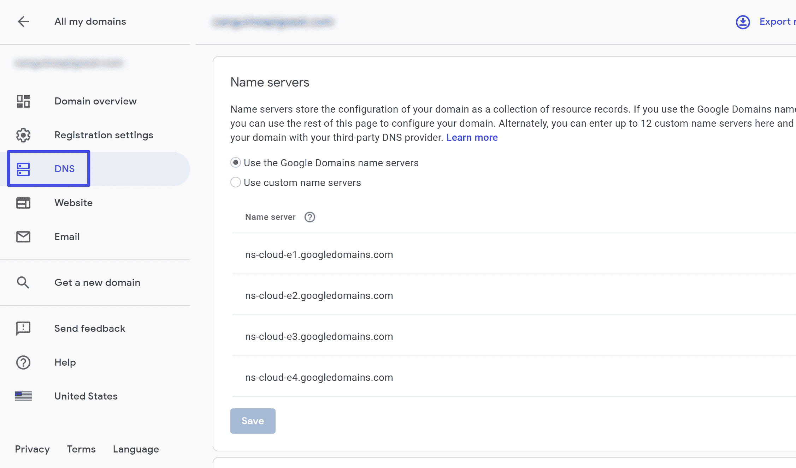
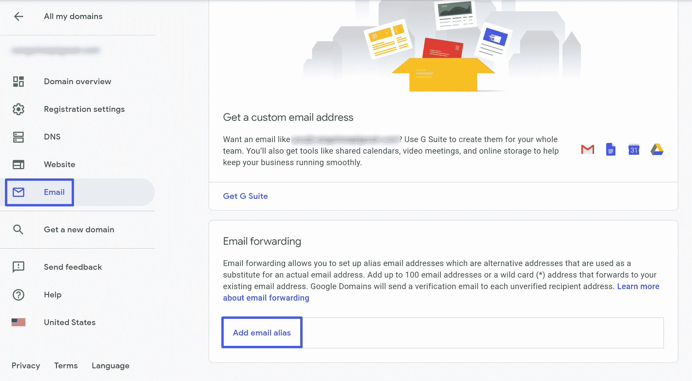
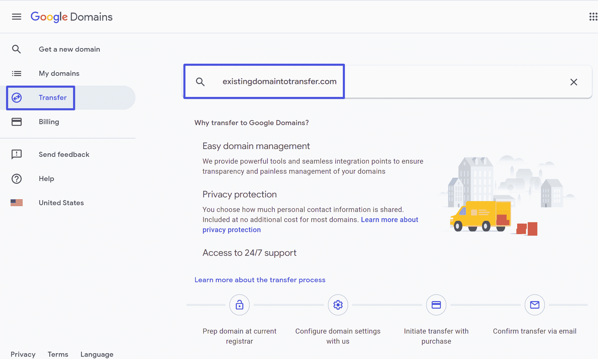
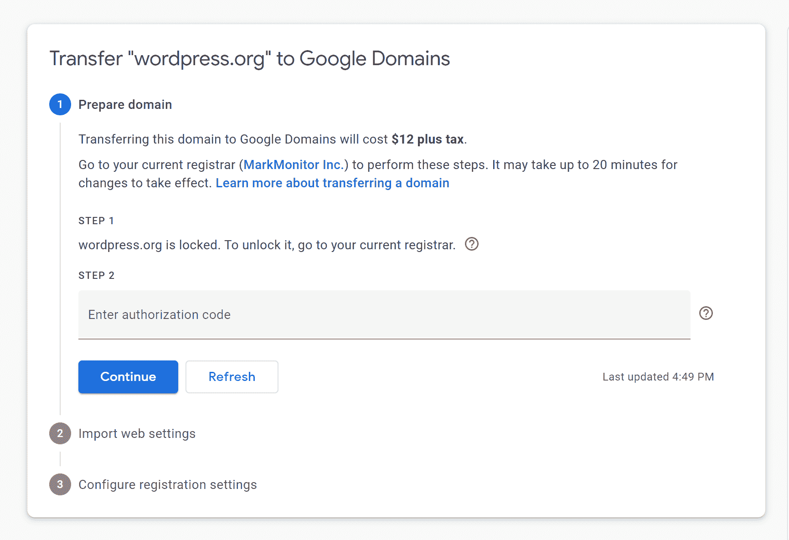

# 谷歌域名评论:利弊(+如何注册域名)

> 原文：<https://kinsta.com/blog/google-domains-review/>

如果你正在寻找一项服务来帮助你注册域名，谷歌域名是你能找到的最好的服务之一。在这篇 Google Domains 评论中，我们将通过全面介绍这项 Google 服务所能提供的内容来帮助您理解为什么[我们推荐 Google Domains](https://kinsta.com/blog/best-domain-registrar/#google-domains) 。以下是我们将在这篇评论中涉及的所有内容:

## 什么是谷歌域名？

[Google Domains](https://domains.google/) 是谷歌在 2015 年 1 月推出的域名注册服务。

Google Domains 帮助你[注册你在网站上使用的域名](https://kinsta.com/blog/choose-domain-name/)。

与许多其他流行的域名注册商不同，谷歌域名不提供任何类型的托管服务。这意味着你需要单独购买主机。例如，你可以从谷歌域名购买你的域名，然后[将它连接到 Kinsta 来托管](https://kinsta.com/plans/)。

Google Domains 还可以轻松连接到其他 Google 服务，如 [Google Workspace](https://kinsta.com/blog/google-workspace/) 、 [Google Search Console](https://kinsta.com/blog/google-search-console/) 等，您可以使用用于其他服务的相同 Google 帐户来访问 Google Domains。

### 谷歌域名的特点审查

*   注册新域。
*   从其他注册服务商转移现有域名。
*   您的购买包含免费隐私保护。
*   谷歌驱动的域名系统。
*   与其他谷歌服务相匹配的简单管理仪表板。
*   你现有的谷歌帐户的一部分，没有单独登录。还支持[双因素认证](https://kinsta.com/blog/wordpress-two-factor-authentication/)。
*   电子邮件转发(最多 100 个别名)。
*   域和子域转发。
*   与其他谷歌服务的内置集成/验证。

## 谷歌域名常见问题

### 你能用 WordPress 使用谷歌域名吗？

是啊！你仍然需要 [WordPress 主机](https://kinsta.com/wordpress-hosting/)来为你的网站提供动力，但是 Google Domains 让你的域名很容易连接到任何 WordPress 主机(包括 Kinsta)。

我们甚至有关于如何将你的域名指向与谷歌域名完美配合的 Kinsta 的[说明。](https://kinsta.com/help/dns/)

### 谷歌域名是主机吗？

不，与许多其他域名注册商不同，谷歌域名不提供任何补充网站托管服务(*不包括谷歌网站，这是相当有限的*)。

如果你想建立一个网站，你需要单独购买主机。然后，您可以使用 Google Domains 界面将您的域名指向您的托管服务。

### 谷歌域名适用于电子邮件吗？

是啊！谷歌域名是创建你自己的定制电子邮件地址的一个很好的选择。顺便问一下，你需要找到某人的电子邮件地址吗？下面是几个实招。

通过谷歌域名使用电子邮件有两种方式:

*   **内置电子邮件转发:**免费，创建多达 100 个电子邮件别名，并转发到您现有的帐户。您可以使用 Gmail 或任何其他电子邮件客户端从这些别名发送电子邮件。
*   **通过谷歌工作空间托管电子邮件**——每月 6 美元起——你可以轻松地与谷歌工作空间集成托管电子邮件、30 GB 存储空间等功能，让[拥有一个专业的电子邮件地址](https://kinsta.com/blog/professional-email-address/)。 [Google Workspace 是 Kinsta 推荐的电子邮件托管解决方案](https://kinsta.com/blog/google-workspace/)。

### 谷歌域名提供隐私保护吗？

是啊！虽然许多域名注册商向你收取隐私保护费，但谷歌域名免费提供隐私保护。

### 我可以通过电话联系谷歌域名吗？

不幸的是，没有谷歌域名的联系电话。然而，通过他们的[支持门户](https://domains.google/support/)联系 Google Domains 还有其他选择，包括他们的在线聊天或填写联系表格。还有很多资源可以帮助回答你的任何问题。

## 使用谷歌域名的优势

### 设计良好、熟悉的界面和单点登录

谷歌域名就像任何其他谷歌服务一样:

*   它使用你现有的谷歌用户账户。
*   仪表盘的风格符合谷歌的审美。

这有两大优势:

首先，你不必创建一个新帐户，因为我们几乎可以保证你有一个谷歌帐户。只需确保使用强密码和双重认证锁定您的帐户，因为这会产生单点故障。

第二，你将能够很快掌握这个界面，因为它感觉上与你可能正在使用的现有工具相似，比如[谷歌分析](https://kinsta.com/blog/how-to-use-google-analytics/)。

### 有竞争力的透明定价

Google Domains 并不总是最实惠的选择(稍后会有更多介绍)，但它确实有最透明的定价。而且它比许多流行的域名扩展竞争对手更实惠。

有了谷歌域名，你将确切地知道[你现在和将来的域名成本](https://kinsta.com/blog/how-much-does-a-domain-name-cost/)。也就是说，你注册域名的价格和续费是一样的。

其他一些域名注册商在你续约时提高价格之前，用第一年的大折扣来吸引你。例如， [GoDaddy](https://kinsta.com/godaddy-alternative/) 对一个. com 域名的第一年收费 11.99 美元，但之后在你续费时收费 17.99 美元。另一方面，谷歌域名总是 12 美元。

### 免费隐私保护

当你注册域名时，你必须提供你自己的个人信息，比如你的地址和电话号码。

默认情况下，所有这些信息在 Whois 注册管理机构中都是公开的，这使您容易受到垃圾邮件或其他烦人/恶意活动的攻击。

隐私保护通过将您的信息隐藏在一般隐私信息后面来改变这种情况。

许多域名注册商向你收取隐私保护费，有时高达每年 10 美元。

谷歌域名，但是，包括隐私保护免费作为您购买的一部分。

### 谷歌驱动的 DNS 服务器

[DNS，域名系统](https://kinsta.com/knowledgebase/what-is-dns/)的缩写，是连接你的域名和你的网络服务器的东西。它通常被称为“互联网电话簿”。

每个域名注册机构都有自己的 DNS 服务，许多主机也是如此。

但是事情是这样的:

[不是所有的域名都是一样的](https://kinsta.com/blog/premium-dns/)，你使用的域名会影响你的[页面加载时间](https://kinsta.com/blog/ttfb/)。

有了谷歌域名，你可以使用谷歌的云域名系统，这是由谷歌自己的基础设施支持的。这为您提供了顶级的速度，而无需额外的费用。

旁注:如果你在 Kinsta，[我们通过 Amazon Route 53](https://kinsta.com/features/) 提供高级域名服务，这也是一个很好的选择。

### 两步认证保护您的帐户

保护你在域名注册商的账户是很重要的，因为恶意的行为者很想染指你的域名。

有了谷歌域名，这很容易做到，因为你可以访问所有的谷歌两步验证选项。您可以使用短信、智能手机应用程序、物理按键等等。

### 电子邮件转发

如果你想使用自己的自定义电子邮件地址(如[【电子邮件保护】](/cdn-cgi/l/email-protection))，谷歌域名可以让你创建多达 100 个电子邮件别名，你可以发送到你现有的电子邮件帐户，如 Gmail。

或者，将谷歌域名连接到谷歌工作空间进行电子邮件托管也非常容易，尽管你需要为谷歌工作空间支付额外的费用。

### 使用其他 Google 产品进行自动验证

如果你经营一个网站，你几乎肯定需要用一些谷歌产品来验证你的网站。

最流行的场景是[用谷歌搜索控制台](https://kinsta.com/blog/google-site-verification/)验证你的站点，但也有其他属性，比如谷歌应用引擎、云运行等。

当你用谷歌域名注册你的域名时，谷歌可以自动用这些属性验证你的域名，从而节省你的时间和精力。

## 使用谷歌域名的缺点

### 你仍然可以找到更便宜的替代品

虽然谷歌域名的透明定价很有竞争力，但你仍然可以找到一些域名扩展的更便宜的替代方案。不过，这确实取决于扩展。比如 Google Domains 就是**最实惠的选项之一。org** 域名，但对[T3 来说相当昂贵。io 域](https://kinsta.com/knowledgebase/what-is-io/)。

让我们来看一些例子，这样你就可以知道谷歌域名是如何排列的了:

**。com 域名:**

## 注册订阅时事通讯

### 想知道我们是怎么让流量增长超过 1000%的吗？

加入 20，000 多名获得我们每周时事通讯和内部消息的人的行列吧！

[Subscribe Now](#newsletter)

*   谷歌域名——12 美元
*   名称便宜——10.98 美元(第一年 8.88 美元)
*   go daddy——17.99 美元(第一年 11.99 美元)
*   Domain.com——9.99 美元(隐私保护大幅追加销售)

**。组织域**:

*   谷歌域名——12 美元
*   名称便宜——12.98 美元(第一年 9.98 美元)
*   go daddy——20.99 美元(第一年 9.99 美元)
*   Domain.com——14.99 美元

**。io 域:**

*   谷歌域名——60 美元
*   名称便宜——32.88 美元(第一年 25.88 美元)
*   go daddy——59.99 美元(第一年 44.99 美元)
*   Domain.com——49.99 美元

### 没有那么多更小的扩展

Google Domains 支持 100 多个域名扩展，包括所有流行的选项。然而，其他域名注册商甚至支持更多。

例如，Namecheap 提供 400+扩展。

这种差异重要吗？对大多数人来说不是，因为大多数人会购买主流域名扩展(Google Domains 支持)。

但是如果你在市场上寻找像**这样的“存在”的东西。伏特加**域名，你可能需要去谷歌域名之外。
T3】

## 谷歌域名与竞争对手

那么谷歌域名与其他流行的域名注册商相比如何呢？我们将看看两个最受欢迎的选项来找出答案: [GoDaddy](https://kinsta.com/blog/best-domain-registrar/#godaddy) 和 [Namecheap](https://kinsta.com/blog/best-domain-registrar/#namecheap) 。

### 谷歌域名 vs GoDaddy

如果你试图在 Google Domains 和 GoDaddy 之间做出选择，Google Domains 会更受欢迎。

对于大多数流行的域名扩展，Google Domains 比 GoDaddy 便宜得多。虽然 GoDaddy 可能有一些扩展的第一年价格更实惠，但 GoDaddy 的续订价格通常比谷歌域名高得多。

总而言之，很少有理由考虑 GoDaddy over Google Domains 进行域名注册。

### 谷歌域名 vs 廉价域名

如果你试图在谷歌域名和廉价域名之间做出选择，情况就不那么明朗了。

Namecheap 提供具有竞争力的服务，包括:

*   与谷歌域名相比仍有竞争力的常规价格，同时还提供慷慨的第一年折扣。
*   免费收录[域名隐私](https://kinsta.com/blog/domain-privacy/)，就像谷歌域名一样。
*   补充托管服务(如果你想的话)，
*   更多的域扩展选择。

谷歌域名仍有很多优势，比如它与其他谷歌服务和谷歌域名系统的整合。但是说实话，你不会在域名便宜或者谷歌域名上出错。

事实上，当我们对我们的 Twitter 追随者进行民意调查，询问他们最喜欢的注册商时，Namecheap 实际上击败了 Google Domains:

Kinsta poll about favorite registrars

## 如何在谷歌域名注册域名

如果你准备好用 Google Domains 购买你的第一个域名，这里有一些方法:

厌倦了体验你的 WordPress 网站的问题？通过 Kinsta 获得最好、最快的主机支持！[查看我们的计划](https://kinsta.com/plans/?in-article-cta)

### 1.选择您的域名

首先，[前往 Google Domains](https://domains.google/) ，搜索您想要购买的域名:

Search for your domain at Google Domains

然后，Google 会向您显示可用的域名扩展列表。如果一切顺利，您应该会看到您想要的域名旁边有一个绿色的勾号，这意味着它是可用的。单击购物车图标，将其添加到您的购物车中:

Check domain availability

如果您的域名不可用，您可能需要使用不同的域名或选择不同的域扩展名。

### 2.检查并购买您的域名

将域名添加到购物车后，请打开购物车结账。

Google Domains 将向您显示购物车的摘要，以及两个选项，这两个选项在默认情况下都是启用的:

*   **隐私保护:**这项 100%免费的服务会保护您个人信息的隐私。我们建议让它开着。
*   **自动续费:**自动续费确保您不会意外忘记续费而丢失域名。这完全取决于你，但是如果你对你的域名有长期的计划，我们建议你不要关闭它。

做出选择后，点击**结账**按钮:

Choose add-ons

在结帐页面上，您需要输入您的联系信息。但是请记住:只要你启用了免费隐私保护功能，这些信息就不会公开。

Enter contact information

然后，输入您的付款信息以完成您的购买:

Enter payment information

### 3.将您的域指向您的主机

一旦您完成购买，Google Domains 将为您的域打开仪表板:

The Google Domains dashboard

要[将你的域名指向一个主机](https://kinsta.com/help/dns/)(比如 Kinsta)，进入 **DNS** 标签。

在那里，您可以:

*   将您的[名称服务器](https://kinsta.com/knowledgebase/what-is-a-nameserver/)更改为您主机的名称服务器。
*   将资源记录添加到您的 Google 名称服务器。

How to edit Google Domains nameservers

### 4.设置电子邮件转发(可选)

如果你想通过谷歌域名使用电子邮件转发(而不是通过你的主机或谷歌工作空间等服务设置电子邮件)，你可以前往**电子邮件**标签，然后点击**添加电子邮件别名**开始:

How to create Google Domains email aliases

## 如何将域名转移到谷歌域名

如果您已经在另一个域名注册机构注册了您的域名，您也可以将您的域名从该注册机构转移到 Google Domains。

这个过程非常相似，但是你也需要在你的域名当前注册的注册商那里执行一些操作。

首先，[打开你的谷歌域名仪表板](https://domains.google.com/m/registrar/)，点击**转移**标签。然后，输入您要转移的域名:

Enter the domain that you want to transfer

Google Domains 将自动检测您的域名当前的注册位置，并提供一个逐步向导来指导您完成迁移过程:

The Google Domains transfer wizard

一旦你完成转让，你就可以管理你的域名，就像你直接通过谷歌域名注册一样。

[Need to register a new domain? Read our review of Google Domains and see how it stacks against competition 🌐🆚 #domain names #domain registrarClick to Tweet](https://twitter.com/intent/tweet?url=https%3A%2F%2Fkinsta.com%2Fblog%2Fgoogle-domains-review%2F&via=kinsta&text=Need+to+register+a+new+domain%3F+Read+our+review+of+Google+Domains+and+see+how+it+stacks+against+competition+%F0%9F%8C%90%F0%9F%86%9A+%23domain+names+%23domain+registrar)

## 摘要

谷歌域名绝对是注册域名的最佳地点之一。

Google Domains 为大多数流行的域名扩展提供透明、有竞争力的价格。对于某些扩展来说，比如**，它可能会很贵。io**——但它接近或低于像**这样的扩展的竞争。com** 和**。org** 。

它提供了一个设计良好的界面，以及免费的隐私保护、Google DNS、自动 Google 搜索控制台验证和强大的双因素身份验证等优秀功能。

如果你在获取一个特定的域名时遇到了麻烦，那么这个[域名可能会被停在](https://kinsta.com/knowledgebase/parked-domain/)上。在我们的帖子中了解更多信息。

如果你正在寻找托管、[数据库](https://kinsta.com/database-hosting/)和[托管 WordPress】的](https://kinsta.com/wordpress-hosting/)[应用程序，给 Kinsta 看看。](https://kinsta.com/application-hosting/)

* * *

让你所有的[应用程序](https://kinsta.com/application-hosting/)、[数据库](https://kinsta.com/database-hosting/)和 [WordPress 网站](https://kinsta.com/wordpress-hosting/)在线并在一个屋檐下。我们功能丰富的高性能云平台包括:

*   在 MyKinsta 仪表盘中轻松设置和管理
*   24/7 专家支持
*   最好的谷歌云平台硬件和网络，由 Kubernetes 提供最大的可扩展性
*   面向速度和安全性的企业级 Cloudflare 集成
*   全球受众覆盖全球多达 35 个数据中心和 275 多个 pop

在第一个月使用托管的[应用程序或托管](https://kinsta.com/application-hosting/)的[数据库，您可以享受 20 美元的优惠，亲自测试一下。探索我们的](https://kinsta.com/database-hosting/)[计划](https://kinsta.com/plans/)或[与销售人员交谈](https://kinsta.com/contact-us/)以找到最适合您的方式。