# 谷歌云平台网络:高级层与标准层

> 原文：<https://kinsta.com/blog/google-cloud-network/>

在今天加快网站加载时间的竞赛中，每一毫秒都很重要。Kinsta 的团队测试并研究了[网站速度](https://kinsta.com/learn/page-speed/)对销售、转化率、用户体验和用户参与度的影响。

但是有一个警告。虽然现场优化对提高速度很重要，但这不是我们应该关注的唯一方面。硬件和网络基础设施支持我们的网站，并连接到我们的访问者也很重要。很多。

今天，我们将讨论为什么谷歌在他们的网络基础设施上投入了大量资金，以及谷歌云平台的高级层网络和标准层网络的一些差异。

## 带宽和延迟(托管基础设施性能的关键标准)

在深入研究 Google Cloud 网络的细节之前，首先理解以下两个概念是很重要的:带宽和延迟。

带宽是网络的吞吐量，以 Mbps 为单位；而延迟是指不同路由器对我们的 web 请求和响应造成的延迟或所有延迟的总和。

形象地说，带宽或吞吐量可以被描述为每秒钟允许一定量的水通过的水管容量。等待时间可以比作从水管打开的那一刻到它开始喷涌的延迟。

由于在不同路由器之间建立连接的开销很小，沿途的每一“跳”都会给最终的请求和响应增加少量的延迟。

> Kinsta 把我宠坏了，所以我现在要求每个供应商都提供这样的服务。我们还试图通过我们的 SaaS 工具支持达到这一水平。
> 
> <footer class="wp-block-kinsta-client-quote__footer">
> 
> 
> 
> <cite class="wp-block-kinsta-client-quote__cite">Suganthan Mohanadasan from @Suganthanmn</cite></footer>

[View plans](https://kinsta.com/plans/)

所以，访问者离网站所在的服务器越远，延迟就越大。此外，网络越分散，延迟就越大。

我们可以通过在 windows 上使用一个叫做 [traceroute](https://www.unix.com/man-page/redhat/8/traceroute/) 或 [tracert](https://support.microsoft.com/en-us/help/314868/how-to-use-tracert-to-troubleshoot-tcp-ip-problems-in-windows) 的工具来描绘这个场景。在接下来的截图中，我们用它来检查来自欧洲的两个请求的路由延迟。具体:
一至 weibo.com:

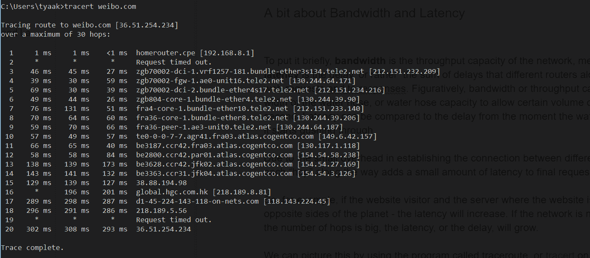

Weibo.com

另一封给 bbc.co.uk:

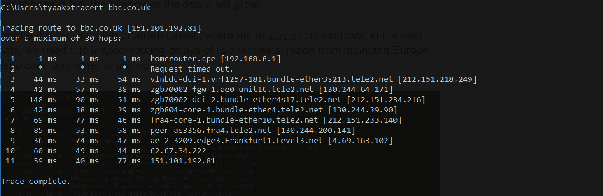

Bbc.co.uk

正如我们所料，中国网站的跳转次数几乎是欧洲网站的两倍。因此，与对英国网站的请求相比，这是额外的延迟。

tracert 显示的三列代表三次往返(RTT)。每行代表一路上不同的路由器或跳。它们通常有 URL 来帮助我们确定特定路由器的位置。

到中国/香港路由器的往返时间接近三分之一秒。

我们使用 [pingdom tools](https://kinsta.com/blog/pingdom-speed-test/) 从 pingdom 的澳大利亚位置加载一个托管在伦敦的网站，试图建立网络在网站总加载时间中的份额。

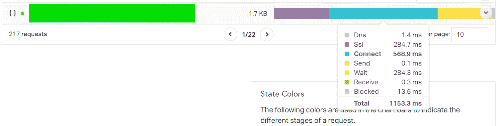

Example of load times

这是在这个测试场景中加载的一个小 CSS 文件的数据。Connect 部分在加载该资源方面的份额最高，其次是 SSL 和 Wait。包括等待时间在内的所有时间也称为首字节时间( [TTFB](https://kinsta.com/blog/ttfb/) )，其中包括网络延迟。

当互联网服务提供商宣传互联网连接速度时，他们通常会宣传他们的带宽(还记得“软管的宽度”吗？)实际上并不是速度的[度量。增加管道的宽度只能在一定程度上提高网站速度。当我们需要每秒发送大量数据时，例如当我们传输高清视频内容时，它会更有用。但是对于那些在线玩实时多人游戏的用户来说，等待时间更重要。](https://kinsta.com/blog/website-speed-test/)

[HTTP/2](https://kinsta.com/learn/what-is-http2/) 规范和 SPDY 协议[的合著者之一 Mike Belshe 对增加带宽对网站加载速度的影响和减少延迟对网站加载速度的影响进行了分析](http://www.belshe.com/2010/05/24/more-bandwidth-doesnt-matter-much/)。

以下是贝尔舍的调查结果，整理成一张漂亮的图表:

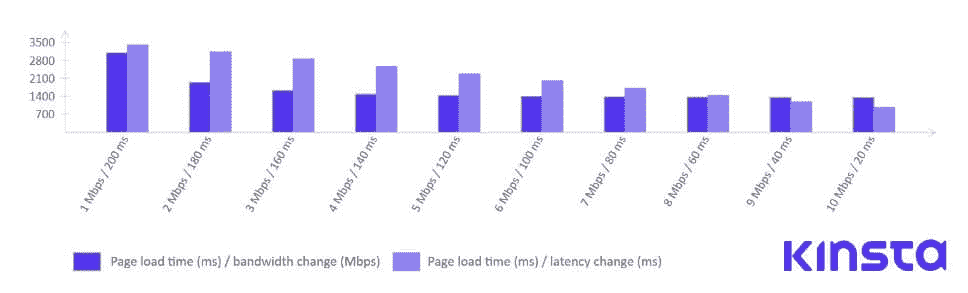

Load time/bandwidth change vs Load time/latency changes

很明显，通过增加带宽来提高网站速度并不是达到更好性能的最有效的方法。另一方面，通过减少 RTT(往返时间)或延迟，我们可以看到[页面加载时间](https://kinsta.com/learn/speed-up-wordpress/)的持续改善。

## 网络与互联网对等与转接

为了更好地理解我们的主题，我们需要解释一下互联网拓扑的基础知识。全球互联网的核心由多个全球、地区和本地网络组成。

截止 2018 年，[有超过 6 万个](https://bgp.he.net/report/netstats) AS(自治系统)。这些网络属于政府，大学，互联网服务提供商。

在这些网络中，我们区分第 1 层、第 2 层和第 3 层网络。这些层代表互联网上每个网络作为一个整体的独立性。

*   第 1 层网络是独立的，从某种意义上说，它们不必付费就可以连接到互联网上的任何其他点。
*   第二层网络与其他 ISP 有对等协议，但他们也支付中转费。
*   第三层网络，即最低层，通过从更高层购买传输来连接到互联网的其余部分。他们实际上就像必须付费才能访问互联网的消费者。

对等关系是指两个网络在平等的基础上交换流量，这样它们中的任何一个都不用为传输向另一个支付费用，并且免费返回相同的流量。

对等的主要好处是大大降低了延迟。

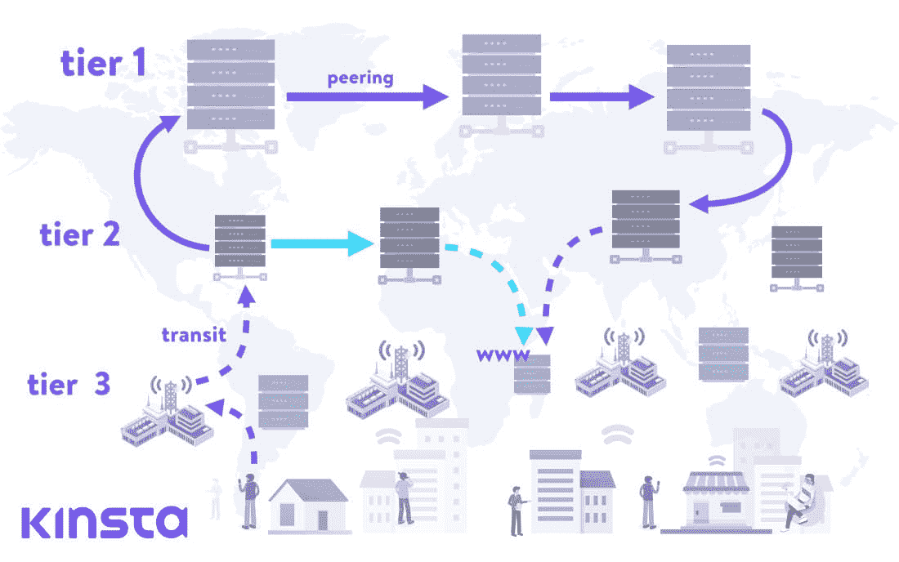

How web requests go through the hierarchical network of ISPs

在上图中，我们看到了一个经典的场景，其中 web 请求通过第 1 层、第 2 层和第 3 层 ISP 的分层网络，以检索位于远程位置的[数据中心](https://kinsta.com/knowledgebase/google-cloud-data-center-locations/)中托管的网站。

箭头代表 web 请求之旅。虚线箭头表示转接连接，实线箭头表示对等连接。

一旦到达第 1 级提供者，它与同一级别上的另一个提供者的关系就是对等关系。第 1 层网络连接到其他网络，并通过对等伙伴专门中继它们的请求。他们可以访问互联网上的所有其他网络，而无需支付中转费用。

我们还可以看到另一个场景，两个第 2 层提供商有一个对等协议，用蓝绿色表示。这种情况下的跳转次数更少，网站加载时间也更短。

## 边界网关协议

BGP 是一个很少被谈论的协议，除非是在非常技术性的上下文中。然而，正如我们今天所知，这个协议是互联网的核心。它是我们访问互联网上几乎所有内容的基础，也是互联网协议栈中最脆弱的环节之一。

边界网关协议是在 2006 年的 IETFs [第 4271 号征求意见稿](https://tools.ietf.org/html/rfc4271)中定义的，此后有过几次更新。正如 RFC 所说:

> “BGP 发言系统的主要功能是与其他 BGP 系统交换网络可达性信息。”

简而言之，BGP 是一种负责决定网络请求的确切路由的协议，通过成百上千个可能的节点到达其目的地。

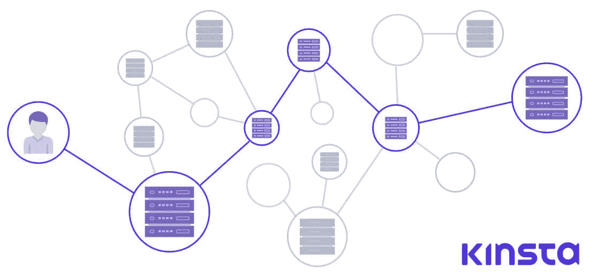

Border Gateway Protocol

我们可以把每个节点想象成一个自治系统或一个由多个节点或路由器、服务器和与之相连的系统组成的网络。

在 BGP 协议中，没有自动发现算法(一种机制或协议，通过该机制或协议，每个新连接的节点可以发现要连接的相邻节点)，相反，每个 BGP 对等体必须手动指定其对等体。至于路径算法，要[引用思科专家](https://community.cisco.com/t5/routing/how-bgp-works-just-basic-concept/td-p/2811536)的话:

> “BGP 没有简单的度量标准来决定哪条路径是最佳路径。相反，它会公布每条路线的大量属性，并使用由多达 13 个步骤组成的[复杂算法](http://www.cisco.com/c/en/us/support/docs/ip/border-gateway-protocol-bgp/13753-25.html)来决定哪条路径是最佳路径。”

自治系统向它们的对等体传输路由数据，但是，没有关于路径选择的硬性规则。BGP 是一个隐含地基于信任的系统，这可能是当今互联网最大的安全缺陷之一。2018 年的盗窃案，当时[MyEtherWallet.com 交通被劫持](https://www.forbes.com/sites/thomasbrewster/2018/04/24/a-160000-ether-theft-just-exploited-a-massive-blind-spot-in-internet-security/)，200 多台以太被盗(价值 15.2 万美元)暴露了这个漏洞。

实际上，BGP 的这一弱点经常导致各种网络(AS)在发送 BGP 数据时考虑的是其他利益，而不是最终用户的效率和速度。这些可能是商业利益，如付费公交，甚至是政治或安全考虑。

## 云计算、CDN 和边缘市场的发展

由于 IT 市场的需求不断增长，从 web 行业、在线游戏到物联网等，解决延迟问题的服务提供商和产品的市场空间变得显而易见。

年复一年，我们看到越来越多的基于云的产品将静态资源缓存在靠近访问者([内容交付网络](https://kinsta.com/help/kinsta-cdn/))的地方，或者将实际计算带到离最终用户更近的地方。其中一个产品是 Cloudflare 的 Workers，它在 Cloudflare 的边缘节点网络上执行 [V8 javascript](https://v8.dev/) 引擎兼容代码[。这意味着即使是 WebAssembly 或 GO 代码也可以在离访问者很近的地方执行。](https://developers.cloudflare.com/workers/about/how-workers-work/)

亚马逊的 [【电子邮件受保护】](https://aws.amazon.com/lambda/edge/) 是这一趋势的另一个例子，以及英特尔和阿里云合作推出针对物联网市场的联合边缘计算平台。

另一个值得一提的是，谷歌的全球缓存节点网络既是 CDN，也是其子公司 YouTube 的视频缓存和交付网络。

为了说明云产业已经变得多么完善和先进，以及它已经在多大程度上成功地减少了最终用户的[网络延迟](https://kinsta.com/blog/network-latency/)，让我们来看看 GaaS。

GaaS 是游戏即服务的缩写。它是一种云产品，让用户能够玩在云中托管和执行的游戏。[本文](https://hosting.review/comparison/cloud-gaming-services/)比较了 GaaS 领域的一些杰出产品。

每个曾经购买电视或视频投影仪进行游戏，或者花一些时间在电视和另一个设备之间设置 Miracast 或其他 casting 连接的人都会知道延迟有多重要。然而，现在有砷化镓供应商提供 4k 分辨率和 60Hz 刷新率的游戏流，玩家不必在硬件上投资。

美国最近对华为的禁令引起了人们对 5G 网络问题的关注，以及迫切需要一条清晰的路径来升级世界网络基础设施。

以最小的延迟实时传递大量信息以协调智能城市、智能住宅和自动驾驶汽车的传感器将依赖于边缘设备的密集网络。[延迟是自动驾驶汽车等事物的当前上限](https://www.orcad.com/jp/node/6591)，具有不同的传感器信息、激光雷达数据、该数据的处理以及其他车辆的数据。

内容交付网络和[云计算提供商](https://kinsta.com/blog/types-of-cloud-computing/)处于这场竞赛的最前沿。我们已经讨论过由能够控制请求-响应周期的行业领导者推出的 [QUIC / HTTP3 协议](https://kinsta.com/blog/http3/)。

## 云提供商如何解决延迟问题？

从市场份额来看，AWS 可能是最大的[云提供商](https://kinsta.com/blog/cloud-market-share/)。2016 年，他们投资了夏威夷跨太平洋海底电缆系统，旨在提供更大的带宽并减少夏威夷、澳大利亚和新西兰之间的延迟，这是他们[在海底基础设施方面的第一笔投资](https://www.marinetechnologynews.com/news/hawaiki-submarine-cable-532845)。2018 年 It [上线](https://www.zdnet.com/video/hawaiki-subsea-cable-goes-live/)。

Submarine fiber optic cables (Image source: [NEC](https://www.nec.com/))

到那时，谷歌已经在铺设海底主干网方面遥遥领先于竞争对手。在亚马逊第一笔投资的一年前，ITWorld 发表了一篇题为“谷歌的数据中心对于普通网络来说增长太快了，所以它建立了自己的数据中心”的文章。

## 注册订阅时事通讯

### 想知道我们是怎么让流量增长超过 1000%的吗？

加入 20，000 多名获得我们每周时事通讯和内部消息的人的行列吧！

[Subscribe Now](#newsletter)

事实上，早在 2005 年，科技记者马克·史蒂芬斯(Mark Stephens)就在他为《PBS.org》撰写的[专栏中，评论了谷歌对](https://web.archive.org/web/20110102050944/http://www.pbs.org/cringely/pulpit/2005/pulpit_20051117_000873.html)[暗光纤](https://www.ragingwire.com/blog/tech-primer-dark-fiber-lit-fiber-and-wavelengths)(已规划但未使用的光纤基础设施)的疯狂采购:

> “这不仅仅是另一个阿卡迈，甚至是一个服用类固醇的阿卡迈。这是一个动态驱动的智能热核 Akamai，具有专用的反向通道和专用硬件。会有互联网，然后会有谷歌互联网，叠加在上面。”

Google’s Cloud Network Cable Infrastructure (source: [Google](https://cloud.google.com/about/locations/#network-tab))

2010 年，在一篇关于 zdnet.com 的文章中，汤姆·福雷姆斯基说:

> “谷歌是那些拥有大量互联网的公司之一”，并继续说:“谷歌一直专注于建立最高效、运营成本最低的私人互联网。这个基础设施是谷歌的关键，也是理解谷歌的关键。”

当时，克林利的文章引发了一些关于谷歌试图接管互联网的担忧，但当该公司推出谷歌光纤时，事情变得更加清晰，谷歌试图征服美国最大城市的 ISP 市场。该项目此后放缓，以至于 TechRepublic [在 2016 年发表了该项目的事后分析](https://www.techrepublic.com/article/why-google-fiber-failed-5-reasons/)，但如今在全球范围内，[的基础设施投资并没有放缓](https://venturebeat.com/2019/04/06/google-and-other-tech-giants-are-quietly-buying-up-the-most-important-part-of-the-internet/)。

谷歌的最新投资将于今年上线，是连接美国洛杉矶和智利瓦尔帕莱索的主干网，未来还将有一个分支连接到巴拿马。

> “互联网通常被描述为一朵云。事实上，它是一系列潮湿脆弱的管子，谷歌即将拥有数量惊人的管子。”— VentureBeat

## 为什么谷歌在网络基础设施上投入了这么多？

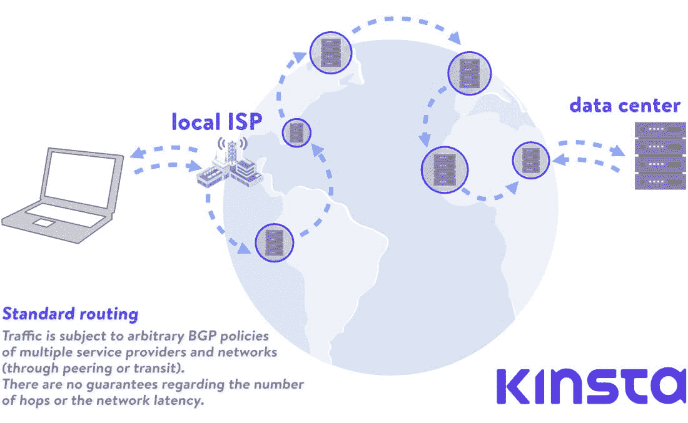

Standard routing

我们都知道[谷歌是头号搜索引擎](https://kinsta.com/blog/alternative-search-engines/)，但它也:

*   拥有最大的视频平台
*   是最大的电子邮件提供商(Gmail 和 Google Workspace)
*   在云计算产品上赚了不少钱(年运营率超过 80 亿美元)

这就是为什么它需要尽可能小的延迟和尽可能大的带宽。谷歌还希望拥有实际的基础设施，因为它对更多带宽和延迟的“贪得无厌”使谷歌及其同行亚马逊或微软等大型公司处于一个需要拿出完全定制的硬件和软件解决方案的位置。

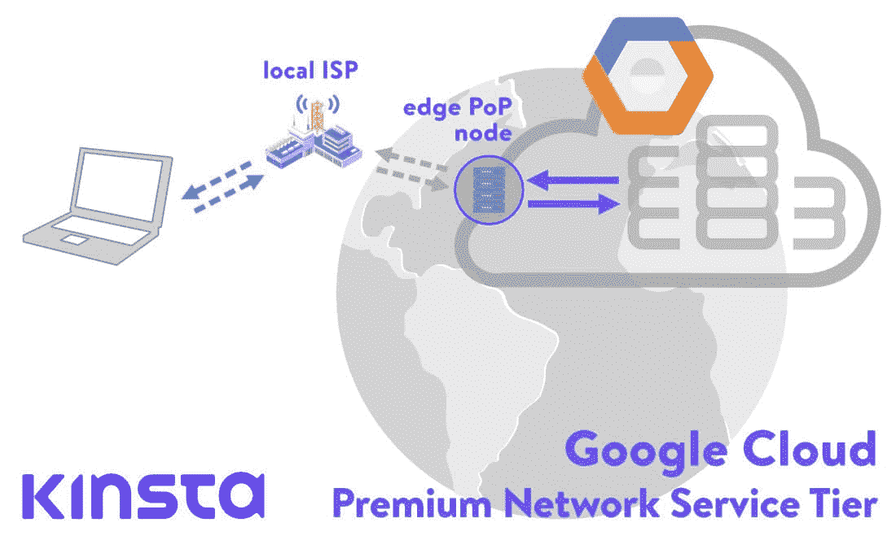

PoP nodes

存在点或边缘 PoP 节点位于谷歌全球专用有线网络的边缘。在那里，它们充当连接到谷歌数据中心的流量的入口和出口。

摩尔定律是英特尔的联合创始人戈登·摩尔的观察结果，他指出，每两年，我们可以在集成电路上放置的晶体管数量就会增加一倍。几十年来，这种期望一直是正确的，但是现在，计算机行业将要对摩尔定律进行一次严峻的考验，也许在不远的将来，摩尔定律就要终结了。仅供参考， [NVIDIA 首席执行官在今年早些时候宣布摩尔定律死亡](https://www.cnet.com/news/moores-law-is-dead-nvidias-ceo-jensen-huang-says-at-ces-2019/)。

那么，这与云计算产业以及谷歌的网络基础设施有什么关系呢？

在 2018 年 12 月的开放网络基金会连接活动上，谷歌副总裁兼网络技术主管阿明·瓦达特(Amin Vahdat)承认了摩尔定律的终结，并解释了该公司的难题:

> “我们的计算需求正以惊人的速度持续增长。我们将需要加速器和更紧密耦合的计算。网络结构将在将这两者结合起来的过程中发挥关键作用。”

云提供商跟上不断增长的计算能力需求的一种方式是集群。简单地说，集群意味着将多台计算机放在一起处理一个问题，执行一个应用程序的进程。显然，受益于这种设置的一个先决条件是低延迟或大的网络容量。

2004 年，当谷歌[开始](https://www.wired.com/2015/06/google-reveals-secret-gear-connects-online-empire/)设计自己的硬件时，网络硬件供应商考虑的是盒子，路由器和交换机需要通过命令行单独管理。在此之前，谷歌一直从思科等供应商那里购买大量交换机，每台交换机都要花一大笔钱。但是设备仍然跟不上增长。

厌倦了低于 1 级的 WordPress 托管支持而没有答案？试试我们世界一流的支持团队！[查看我们的计划](https://kinsta.com/plans/?in-article-cta)

谷歌需要一个不同的网络架构。对谷歌基础设施的需求呈指数增长(谷歌 2015 年的一篇研究论文称他们的网络容量在十年内增长了 100 倍),他们的增长如此之快，以至于购买现有硬件的成本也促使他们创建自己的解决方案。谷歌开始从商用硅芯片制造定制交换机，采用一种不同的网络拓扑结构，这种网络拓扑结构更加模块化。

谷歌的工程师们开始在一个名为 [Clos Network](https://www.networkworld.com/article/2226122/clos-networks-what-s-old-is-new-again.html) 的旧电话网络模型上进行构建，该模型减少了每个交换机所需的端口数量:

> “Clos 网络的优势在于，您可以使用一组相同且廉价的设备来创建树，并获得高性能和弹性，否则将需要更多成本来构建。”— Clos Networks:旧的又是新的，网络世界

对于这种新的模块化硬件，谷歌的团队还必须重新定义现有的协议，并建立一个定制的网络操作系统。他们所面临的挑战是如何将大量的交换机和路由器当作一个系统来运行。

定制网络堆栈以及对重新定义协议的需求导致谷歌转向软件定义网络(SDN)。这是谷歌副总裁、工程研究员兼网络基础设施团队负责人 Amin Vahdat 在 2015 年发表的主题演讲，他解释了所有挑战以及他们提出的解决方案:

对于最好奇的人来说，有[这篇有趣的博文](https://cloudplatform.googleblog.com/2015/06/A-Look-Inside-Googles-Data-Center-Networks.html)值得一读。

### 浓咖啡

Espresso 是谷歌 SDN 的最新支柱。它允许谷歌的网络超越物理路由器的限制，学习和协调进出谷歌对等合作伙伴的流量。

Espresso 使谷歌能够实时测量连接的性能，并根据实时数据决定特定访问者的最佳访问点。这样，谷歌的网络可以对其对等/ ISP 合作伙伴的不同拥塞、减速或中断做出动态响应。

最重要的是，Espresso 使得利用谷歌的分布式计算能力来分析其所有同行的网络数据成为可能。所有的路由控制和逻辑不再驻留在单独的路由器和边界网关协议中，而是转移到谷歌的计算网络中。

> “我们利用我们的大规模计算基础设施和来自应用本身的信号来了解单个流的表现，这取决于最终用户对质量的感知。”— [Espresso 让谷歌云更快](https://www.blog.google/products/google-cloud/making-google-cloud-faster-more-available-and-cost-effective-extending-sdn-public-internet-espresso/)，2017 年

## 这些与谷歌云网络有什么关系？

到目前为止，我们所涵盖的内容强调了谷歌在组建当今可能是最好的全球私有网络时所经历的所有问题和挑战(包括基于硬件和软件的问题和挑战)。

说到市场份额，[谷歌云平台](https://kinsta.com/blog/google-cloud-hosting/)是全球第三大厂商(排在 [AWS 市场份额](https://kinsta.com/aws-market-share/)和微软 [Azure 市场份额](https://kinsta.com/azure-market-share/)之后)。但就其优质的专用网络基础设施而言，它将竞争对手远远甩在身后，正如来自宽带的数据所示:

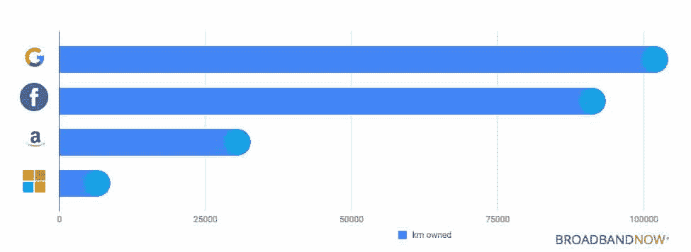

Submarine cable ownership, September 2018\. (source: [BROADBANDNOW](https://broadbandnow.com/report/google-content-providers-submarine-cable-ownership/), Centerfield BBN LLC)

2014 年，GigaOM 发表了[一篇文章](https://gigaom.com/2014/02/03/8-things-google-cloud-could-do-to-freak-amazon-out/)比较 AWS 和谷歌云平台，但仅仅一周后，他们又发表了[另一篇文章](https://gigaom.com/2014/02/07/what-i-missed-in-the-google-vs-amazon-cloud-debate-fiber/)，标题为:“在谷歌与亚马逊云辩论中我错过了什么——光纤！”他们认识到谷歌在基础设施方面领先数年。

> “为您和您的客户的流量提供大而快速的管道是一件大事。”—芭芭拉·律界英豪，GIGAOM

## 谷歌的高级与标准层网络

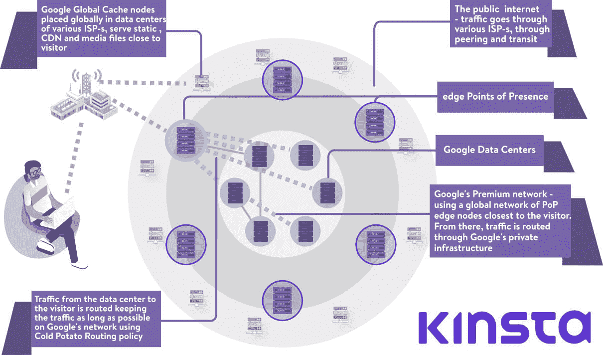

Google Cloud Network platform

谷歌云平台提供了两种不同的网络层，它们在价格和性能上都有所不同。

### 谷歌高级层网络

通过谷歌的高级网络，用户可以利用全球光纤网络，以及全球分布的接入点。从客户到谷歌数据中心的所有入口(入站)流量都被路由到最近的存在点，这些点分布在全球，然后请求 100%通过谷歌的专用主干路由。正如我们在之前的文章中提到的[，这意味着 30%的延迟改善或 50%的带宽提升。](https://kinsta.com/blog/google-cloud-hosting/)

在返回的路上，所有从数据中心发送到访问者的数据都使用[冷土豆](https://www.usenix.org/legacy/publications/library/proceedings/usenix02/full_papers/subramanian/subramanian_html/node28.html)策略进行路由。与在标准层网络上使用的[烫手山芋](https://www.usenix.org/legacy/publications/library/proceedings/usenix02/full_papers/subramanian/subramanian_html/node28.html)路由相反，在标准层网络上，流量尽可能早地被移交(或丢弃)给其他 ISP，高级层路由意味着出口流量在谷歌自己的光纤上保持尽可能长的时间，并被移交给尽可能靠近访问者的对等网络或中转 ISP。

通俗地说。优质层数据包在谷歌网络上花费更多时间，来回跳动更少，因此性能更好(但成本更高)。

对于我们当中的科幻迷来说，它可以被比作一个[宇宙虫洞](https://en.wikipedia.org/wiki/Wormhole)，它将我们的流量直接传输到我们的目的地，而无需通过互联网漫游。

**在 Kinsta，我们利用谷歌云的高级层网络**来实施我们所有的托管计划。这最大限度地减少了距离和跳跃，从而更快、更安全地进行数据的全球传输。

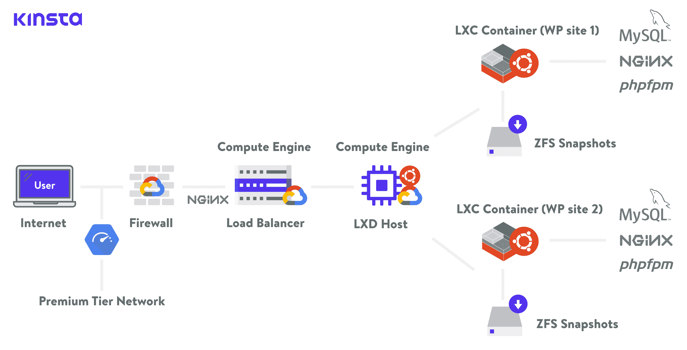

Kinsta hosting architecture

### 谷歌标准层网络

另一方面，标准层网络使用我们的内容或 web 应用所在的数据中心附近的存在点。这意味着我们的访问者的流量将通过许多不同的网络，自治系统，ISP，并通过许多跳，直到它到达目的地。在这种情况下，速度会受到影响。

在标准层上传播的内容将无法充分获得谷歌 SDN 的好处以及动态计算最佳路线的巨大计算能力。流量将受到谷歌和访问者之间的所有系统的 BGP 政策。

通俗地说。标准层数据包花在谷歌网络上的时间更少，花在公共网络上的时间更多，因此性能更差(但成本更低)。

此外，高级层使用全局负载平衡，而标准层仅提供区域负载平衡，这为标准层上的客户端带来了更多的复杂性和更多的“步法”。

Premium Tier Network 提供全球服务水平协议(SLA)，这意味着 Google 接受提供特定服务水平的合同责任。它就像一个质量保证标志。标准网络层不提供此级别的 SLA。

对于那些想了解更多的人来说，在谷歌云网站上有关于这两层[的大量比较和文档。他们甚至提供了一个方便的图表来帮助您更容易地确定应该使用哪个网络层:](https://cloud.google.com/network-tiers/docs/overview)

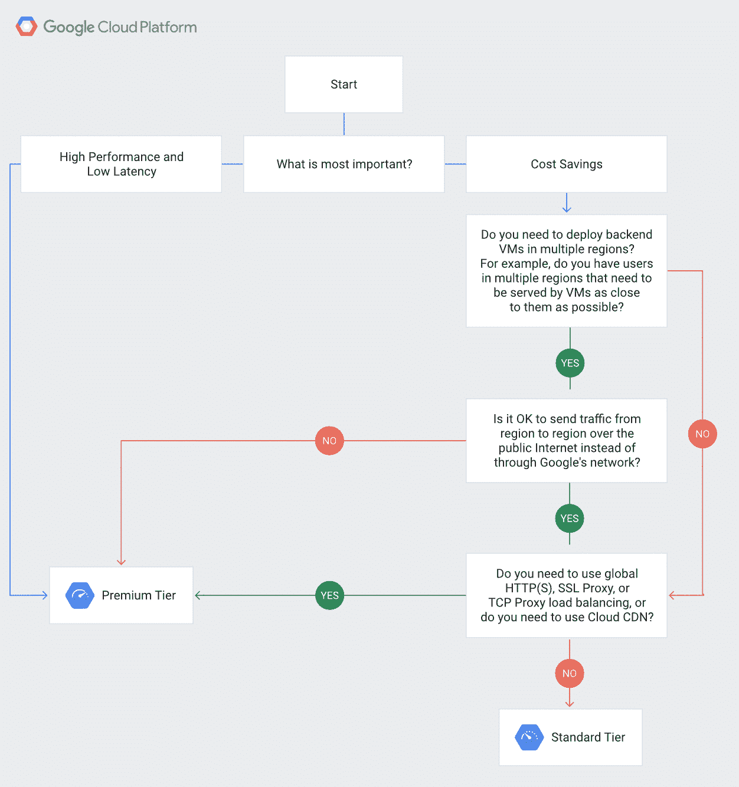

Network Service Tiers decision tree. (source: Google Cloud Platform)

[Want to know what's making Google Cloud Network one of the fastest stack available today? Take a deep dive in our in-depth Premium vs Standard tiers comparison. 🚀☁️ #google cloud networkClick to Tweet](https://twitter.com/intent/tweet?url=https%3A%2F%2Fkinsta.com%2Fblog%2Fgoogle-cloud-network%2F&via=kinsta&text=Want+to+know+what%27s+making+Google+Cloud+Network+one+of+the+fastest+stack+available+today%3F+Take+a+deep+dive+in+our+in-depth+Premium+vs+Standard+tiers+comparison.+%F0%9F%9A%80%E2%98%81%EF%B8%8F+%23google+cloud+network&hashtags=speed)

## 摘要

多年来，谷歌投资创建了一个全球网络基础设施，部署了自己的协议和定制的硬件和软件网络堆栈。在摩尔定律似乎逐年变弱的时候，谷歌的基础设施使该公司能够跟上对云资源不断增长的需求。

尽管就市场份额而言，谷歌仍然落后于亚马逊云和微软的 Azure 云，但谷歌已经获得了一些关键优势，包括其拥有的光纤，以及其工程师部署的尖端硬件和软件解决方案。

我们可以预计谷歌将在物联网、智能城市、无人驾驶汽车的技术中发挥关键作用，对边缘计算的需求将继续增长。

Google Cloud Network Premium Tier 是第一款利用 Google 创新网络成果的产品。它允许客户利用谷歌的网络和整个堆栈，以极高的速度传送内容。谷歌对延迟的保证。

Kinsta 致力于在全球范围内提供最好的[应用托管](https://kinsta.com/application-hosting/)、[数据库托管](https://kinsta.com/database-hosting/)和[托管 WordPress 托管](https://kinsta.com/wordpress-hosting/)性能。这就是为什么 Kinsta 配备了谷歌云托管服务，并且我们使用谷歌的高级网络来实施我们所有的托管计划。

* * *

让你所有的[应用程序](https://kinsta.com/application-hosting/)、[数据库](https://kinsta.com/database-hosting/)和 [WordPress 网站](https://kinsta.com/wordpress-hosting/)在线并在一个屋檐下。我们功能丰富的高性能云平台包括:

*   在 MyKinsta 仪表盘中轻松设置和管理
*   24/7 专家支持
*   最好的谷歌云平台硬件和网络，由 Kubernetes 提供最大的可扩展性
*   面向速度和安全性的企业级 Cloudflare 集成
*   全球受众覆盖全球多达 35 个数据中心和 275 多个 pop

在第一个月使用托管的[应用程序或托管](https://kinsta.com/application-hosting/)的[数据库，您可以享受 20 美元的优惠，亲自测试一下。探索我们的](https://kinsta.com/database-hosting/)[计划](https://kinsta.com/plans/)或[与销售人员交谈](https://kinsta.com/contact-us/)以找到最适合您的方式。