# 做不可思议的事情——Kinsta 将每个人的表现提高了 200%

> 原文：<https://kinsta.com/blog/boosting-wordpress-performance/>

你的 WordPress 站点的性能一直是我们团队的重中之重。这是客户今天选择我们而不是竞争对手的主要原因之一，我们已经一次又一次地证明了这一点。我们一直是业内第一批发布最新软件的公司之一，如 [PHP 8](https://kinsta.com/feature-updates/php-8/) ，Review Signal 连续五年授予我们[“顶级”性能](https://kinsta.com/blog/wordpress-performance-benchmarks/)。

Kinsta 也是第一个独家使用[谷歌云平台](https://kinsta.com/blog/google-cloud-hosting/) (GCP)的托管 WordPress 主机，我们密切关注他们新发布的基础设施。我们总是试图突破界限，今天我们把它带到了一个全新的高度。我们很高兴地宣布，我们**将转向 GCP 的下一代计算优化虚拟机(C2)** 。

我们已经将 WordPress 托管平台开发成完全可扩展的，从我们的初始计划一直到我们的企业计划。这意味着我们不仅仅是将精选的几个迁移到这种新硬件上，或者将它们的使用限制在我们的更高层计划中。我们正在为 Kinsta 的每个人提供新的 GCP 机器。无论你是一个普通的博客写手还是财富 500 强公司，你都将收获这一变化带来的好处。

这对你有什么影响？在过去的一个月里，我们一直在内部测试这些新机器，并被它们的性能所震撼。这取决于网站的类型，但是我们看到了从 30%到 200%的性能提升！

你不仅会看到更快的加载时间，而且你可能还会注意到你的 WordPress 管理仪表板的响应能力的不同。对于那些经常在 WordPress 网站上工作的人来说，这应该有助于让你的工作流程更加愉快。

Our agency has worked with all the major hosting platforms. Kinsta is [crazy fast and the support is stellar](https://kinsta.com/kinsta-support/)! We moved all our clients to Kinsta and haven’t looked back.Brent Martel, Co-Founder
Inkline Media ## Kinsta 的基础架构和新的 GCP 计算优化虚拟机(C2)

对于那些可能不熟悉我们平台的人来说，了解它不属于任何传统的托管类别是很重要的。我们的整个基础设施都建立在[谷歌云](https://kinsta.com/blog/google-cloud-hosting/)之上，不同于传统的共享、VPS 或专用基础设施。

> Kinsta 把我宠坏了，所以我现在要求每个供应商都提供这样的服务。我们还试图通过我们的 SaaS 工具支持达到这一水平。
> 
> <footer class="wp-block-kinsta-client-quote__footer">
> 
> 
> 
> <cite class="wp-block-kinsta-client-quote__cite">Suganthan Mohanadasan from @Suganthanmn</cite></footer>

[View plans](https://kinsta.com/plans/)

我们平台上的每个站点都运行在一个**隔离的软件容器**中，该容器包含运行站点所需的所有软件资源(Linux、Nginx、PHP、MySQL)。这意味着运行每个站点的软件是 **100%私有的，即使在你自己的站点之间也不会共享**。我们使用 [Linux 容器](https://linuxcontainers.org/)作为我们基础设施的底层容器技术。

每个站点容器运行在一个大容量的虚拟机上，在本例中，是新的**计算优化(C2)虚拟机**。它位于 GCP 的多个数据中心之一，受 GCP 防火墙保护。硬件资源(RAM/CPU)由我们的虚拟机自动分配给每个站点容器。

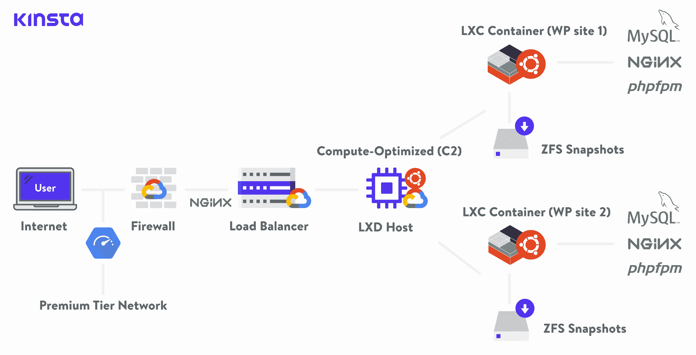

Kinsta hosting infrastructure with GCP C2 VM

[计算优化虚拟机(C2)](https://cloud.google.com/blog/products/compute/introducing-compute-and-memory-optimized-vms-for-google-compute-engine) 是 GCP 上的一个新的计算家族，具有高的每线程性能和内存速度，有利于大多数计算密集型工作负载。计算优化虚拟机非常适合高性能计算、电子设计自动化(EDA)、游戏、单线程应用等。

这些机器类型还利用了第二代英特尔可扩展处理器(Cascade Lake)和高达 3.8 GHz 的持续全核睿频技术。此外，C2 虚拟机提供底层服务器平台架构的完全透明性，支持高级性能调整。

换句话说，这些机器甚至能够处理最苛刻的 WordPress 网站！

我们基础设施的每一部分都同样重要。这就是为什么 Kinsta 的所有网站都通过高度可靠的[谷歌云平台的“高级层”网络相互连接，而不仅仅是它们的“标准层工作”](https://kinsta.com/blog/google-cloud-network/)。这是为了最大限度地减少距离和跳跃，从而实现更快、更安全的数据全球传输。

## GCP 计算优化虚拟机的基准测试(C2)

现在是有趣的部分，数据！我们进行了大量的测试，以便您可以看到这些新的 GCP 机器类型带来的不同。对于每个测试，我们用 15 个并发用户对主页进行一分钟的基准测试。下面是我们测试环境的细节。

*   **新 C2 机器:**由 GCP 提供动力、运行在隔离容器中的层叠湖英特尔可扩展处理器。
*   **N1 机器:** Skylake 英特尔处理器，由 GCP 提供动力，运行在一个隔离的容器中。
*   LTS Ubuntu 16 . 04 . 6
*   **集装箱栈:** [Nginx](https://kinsta.com/knowledgebase/what-is-nginx/) 1.15.12， [MariaDB](https://kinsta.com/blog/mariadb-vs-mysql/) 10.4.6
*   PHP 版本: 7.3
*   **页面缓存:**我们运行了多个测试，一个命中 Kinsta 缓存，一个绕过 Kinsta 缓存。

测试是由 WordPress 撰稿人、Kinsta 网站开发人员 Thoriq Firdaus 进行的。他为 WordPress Core 和 WordPress Indonesia 的[翻译编辑器做出了贡献，并开发了一个免费的 MailChimp 订阅插件](https://translate.wordpress.org/locale/id/default/wp/dev) [WP Chimp](https://wordpress.org/plugins/wp-chimp/) 。

下面的数据是以每秒请求数来衡量的。要求越多越好。

### WordPress 5.2.3(跳过 Kinsta 缓存)

在我们的第一轮测试中，我们有意绕过了 Kinsta [页面缓存](https://kinsta.com/blog/wordpress-cache/)。原因是我们想使用下面的栈来测试 CPU 的性能: **Nginx、PHP-FPM 和 MySQL** 。每个对站点的未缓存请求都由一个 [PHP 工作器](https://kinsta.com/blog/php-workers/)处理。

我们使用了 [WordPress 5.2.3](https://kinsta.com/blog/wordpress-5-2/) 和[2019 主题](https://kinsta.com/blog/twenty-nineteen-theme/)。我们的网站上充斥着来自 [WP 测试](http://wptest.io/)的虚拟数据。它包含各种大小(小、中、大)的图片以及一条嵌入的 tweet。

我们不太关心虚拟数据，只要它在两台机器上都匹配。测量 GCP 机器的性能差异才是我们真正感兴趣的。拥有更多虚拟数据会影响性能吗？是的，但是我们也测试了下面的一些重客户端站点，所以你也可以看到影响。

我们对有 15 个并发用户的站点进行了一分钟的基准测试。

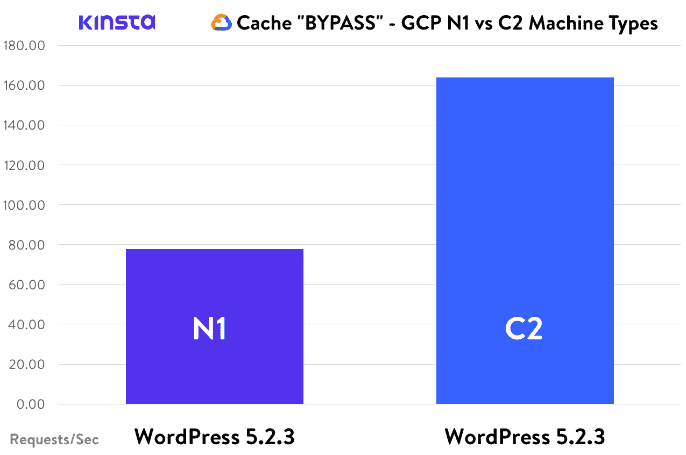

Cache BYPASS – WordPress, GCP N1 vs C2

#### 基准测试结果

*   GCP N1 机器上的 WordPress 5 . 2 . 3:77.82 请求/秒
*   GCP C2 机器上的 WordPress 5 . 2 . 3:**163.89 请求/秒** **🏆**

当谈到绕过缓存时，新的 GCP C2 机器平均快了 2.1 倍。
T3】

### WordPress 5.2.3(命中 Kinsta 缓存)

在第二轮测试中，我们有意让它命中我们的页面缓存。尽管缓存的请求总是比未缓存的请求快得多，我们还是很想看看结果。这里真正测试的是我们栈的 **Nginx 部分，因为这是处理我们页面缓存的部分。**

该站点与上述测试中使用的站点相同。我们对有 15 个并发用户的站点进行了一分钟的基准测试。

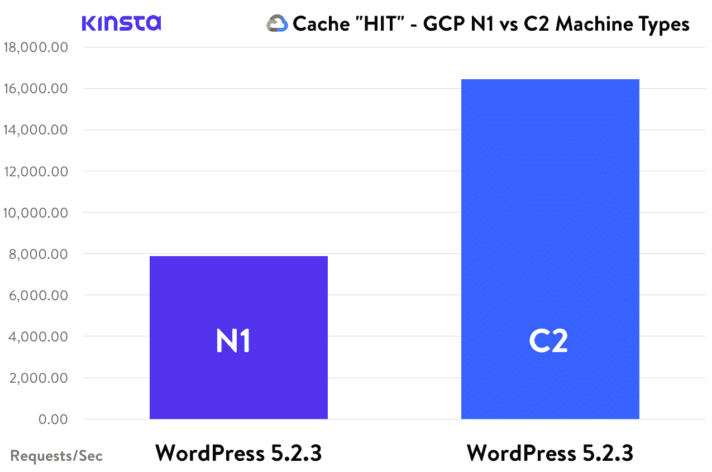

Cache HIT – WordPress, GCP N1 vs C2

#### 基准测试结果

*   GCP N1 机器上的 WordPress 5 . 2 . 3:7，886.16 请求/秒
*   GCP C2 机器上的 WordPress 5 . 2 . 3:**16426.32 请求/秒** **🏆**

当谈到我们的 Nginx 页面缓存时，新的 GCP C2 机器平均快了 2.08 倍。

### WordPress 5 . 2 . 3+woo commerce 3 . 7 . 0(绕过 Kinsta 缓存)

在第三轮测试中，我们再次绕过了 Kinsta 页面缓存。

我们使用了 WordPress 5.2.3、 [WooCommerce 3.7.0](https://kinsta.com/blog/woocommerce-tutorial/) ，以及 Twenty 主题。我们的网站上充斥着来自 [WP 测试](http://wptest.io/)的虚拟数据。与虚拟的 WordPress 网站相比，它包含的图片和内容略少。

我们对有 15 个并发用户的站点进行了一分钟的基准测试。

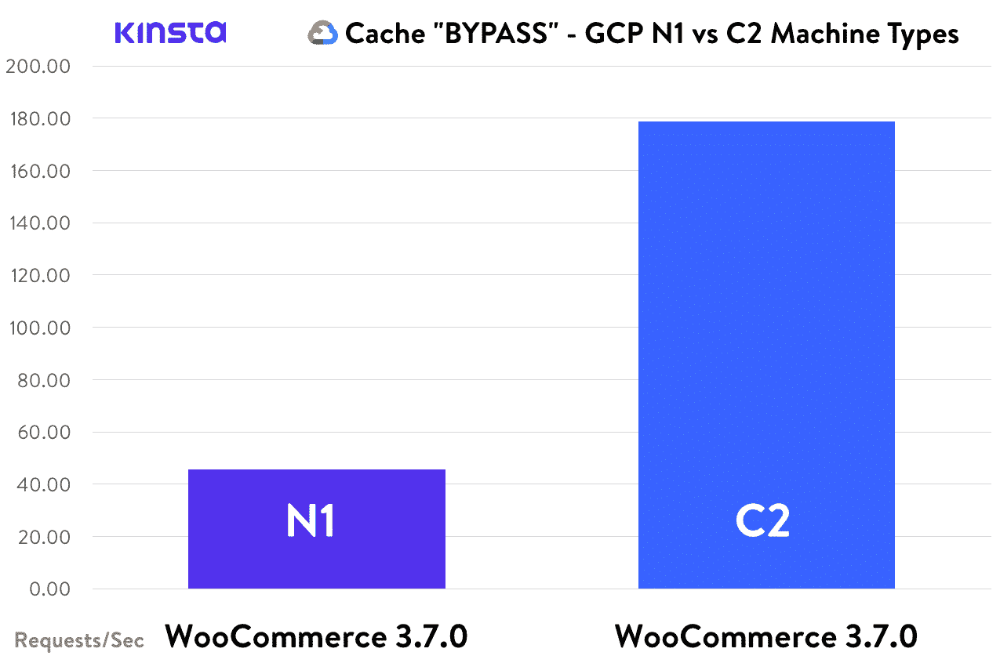

Cache BYPASS – WooCommerce, GCP N1 vs C2

#### 基准测试结果

*   在 GCP·N1 的机器上:45.67 请求/秒
*   GCP C2 机器上的 WordPress 5 . 2 . 3+woo commerce 3 . 7 . 0:**178.62 请求/秒** **🏆**

在绕过缓存时，新的 GCP C2 机器平均快了 3.9 倍。

### WordPress 5 . 2 . 3+woo commerce 3 . 7 . 0(命中 Kinsta 缓存)

在第四轮测试中，我们再次有意让它命中我们的 Kinsta 页面缓存。该站点与上述测试中使用的站点相同。我们对有 15 个并发用户的站点进行了一分钟的基准测试。

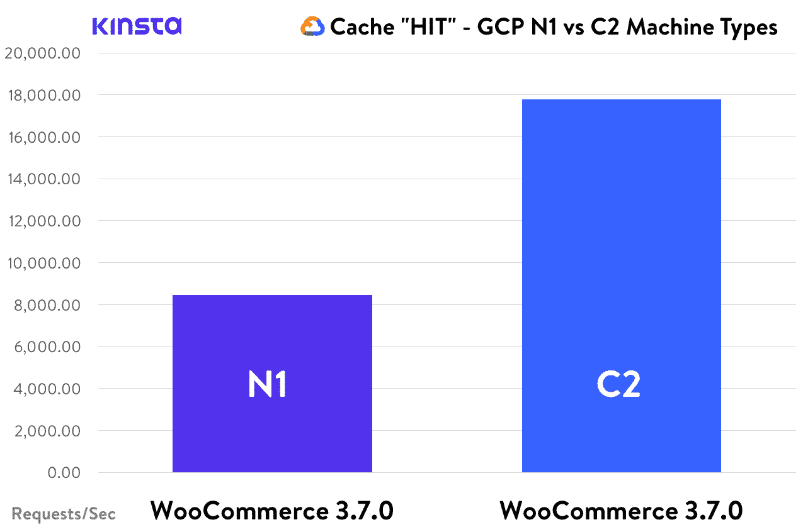

Cache HIT – WooCommerce, GCP N1 vs C2

#### 基准测试结果

*   GCP N1 机器上的 WordPress 5 . 2 . 3:8，448.57 请求/秒
*   GCP C2 机器上的 WordPress 5 . 2 . 3:**17790.20 请求/秒** **🏆**

当谈到我们的 Nginx 页面缓存时，新的 GCP C2 机器平均快 2.1 倍。

## 我们在客户网站上看到的性能结果

我们已经开始将客户的 WordPress 站点迁移到新的 C2 机器上。下面，我们将与您分享我们在 Kinsta 托管的真实网站上看到的性能改进。如果您对何时迁移感到好奇，请跳到我们的[迁移时间表](#migration-timeline-for-your-wordpress-sites)。

在我们开始之前，理解这些图表的含义是很重要的。我们使用一个名为 [Kinsta APM](https://kinsta.com/apm-tool/) 的工具来衡量 Kinsta 站点的性能。这比标准的一次性速度测试工具好得多，因为其中许多工具都有延迟问题或共享带宽。

本质上，我们下面测量的是 **PHP 和 MySQL 响应时间**，或者说一个 PHP 工作人员平均处理一个请求需要多少时间。图表上的绿色区域表示对外部网络服务的响应时间，如谷歌分析或营销像素，这些都是 Kinsta 无法控制的。

### 客户端 1-高流量新闻网站(数百个请求/分钟)

我们的第一个客户是一个高流量的新闻 WordPress 网站，每分钟处理数百个 PHP 请求。在我们将他们迁移到新的计算优化的 C2 机器后，他们站点的平均响应时间从大约 250 毫秒下降到大约 80 毫秒。这在性能上增加了**212.5%**！

## 注册订阅时事通讯

### 想知道我们是怎么让流量增长超过 1000%的吗？

加入 20，000 多名获得我们每周时事通讯和内部消息的人的行列吧！

[Subscribe Now](#newsletter)

Client 1 migration to GCP C2 machine

### 客户 2–流行的营销博客

我们的第二个客户是一个受欢迎的营销博客，也获得了大量的流量。迁移之后，他们站点的平均响应时间从大约 300 毫秒下降到大约 100 毫秒。这意味着性能提高了**200%**!

Client 2 migration to GCP C2 machine

### 客户 3-WordPress 社区博客

我们的第三个客户是一个流行的 WordPress 社区博客。迁移之后，他们站点的平均响应时间从大约 400 毫秒减少到大约 185 毫秒。这在性能上增加了**116.22%**！

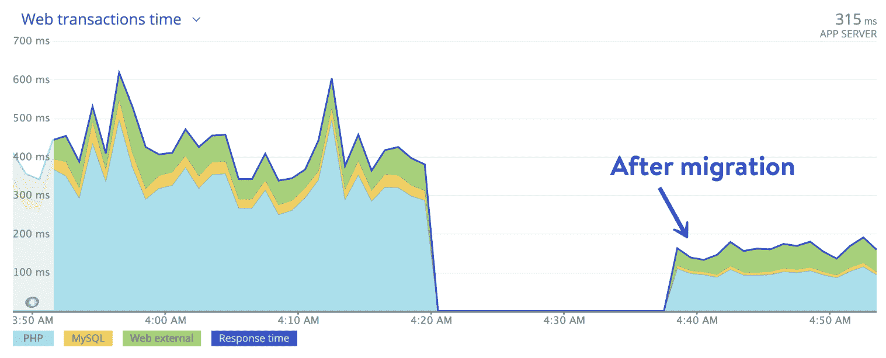

Client 3 migration to GCP C2 machine

### 客户 4-WordPress 代理

我们的第四个客户是 [Neuralab](https://www.neuralab.net/) ，这是一家数字设计、网络和移动开发机构，专门开发电子商务网络应用。在技术方面，他们在 WordPress 和 WooCommerce 的基础上进行生产。

(建议阅读:[你启动和运行一个成功的 WordPress 代理公司的指南](https://kinsta.com/blog/wordpress-agency/))。

Neuralab team hosts all of our WooCommerce projects at Kinsta and we’ve seen ten-fold loading improvements while migrating applications from other hosts to Kinsta. Their DevOps team pushes LEMP stack to its limits and this is a true partnership that benefits our clients, our team and most of all, our end-users of eCommerce solutions. As we all know, web performance is the new black and we’re eager to see what’s planned from the Kinsta team in the future.Krešimir Končić, Director
Neuralab

在迁移 Neuralab 之后，他们站点的平均响应时间从大约 450 毫秒下降到大约 250 毫秒。这在性能上增加了**80%**!

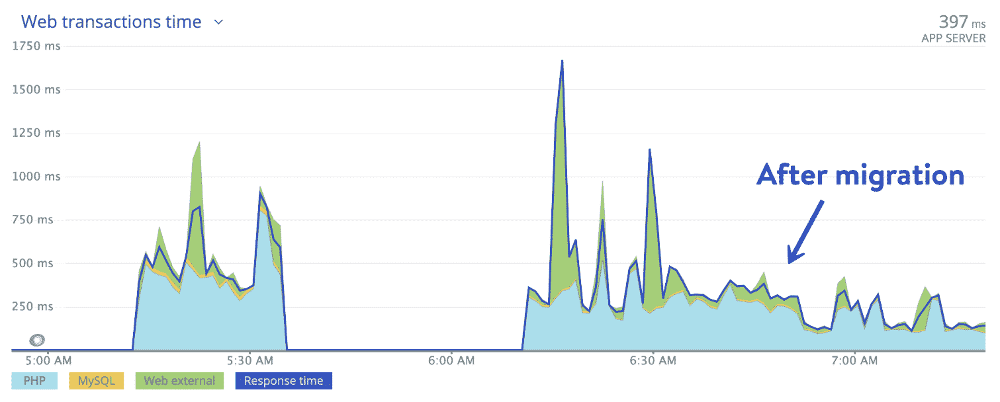

Client 4 migration to GCP C2 machine

### 客户 5–健康和保健博客

我们的第五个客户是健康博客。这个网站已经进行了大量的优化，所以我们不期望看到太大的差异。但是在迁移之后，他们站点的平均响应时间从大约 250 毫秒下降到大约 130 毫秒，性能提高了**92.3%**！因此，即使客户已经很好地优化了网站，也会看到影响。

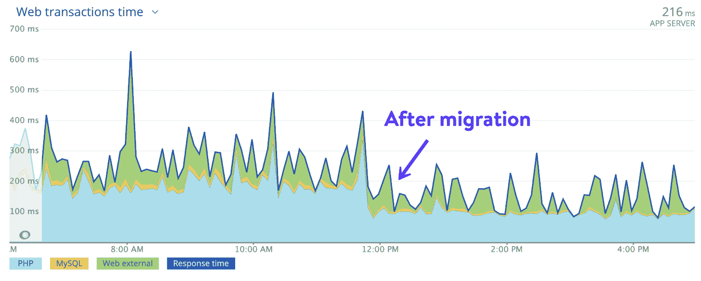

Client 5 migration to GCP C2 machine

### 客户 6–服务提供商市场

[Credo](https://www.getcredo.com/) 是一个市场，帮助公司(尤其是电子商务、[、SaaS](https://kinsta.com/blog/saas-marketing/) 和 B2B 公司)从 Credo 审查过的人才网络中寻找、雇用经过审查的数字营销公司和顾问，并与之良好合作。他们[搬到 Kinsta](https://kinsta.com/clients/credo/) 是因为他们当前的前一个提供商的成本和性能问题。

I’ve known for a long time that site speed is incredibly important to rankings and conversions, but it’s such a technical undertaking and impossible to find developers good at optimizing for it that I’ve never prioritized it. It’s great to have a host like Kinsta that prioritizes it and takes the initiative to do what’s right for their customers like me.John Doherty, CEO
Credo

在迁移 Credo 之后，他们站点的平均响应时间从大约 1600 毫秒下降到大约 1100 毫秒，性能提高了**45.45%**！

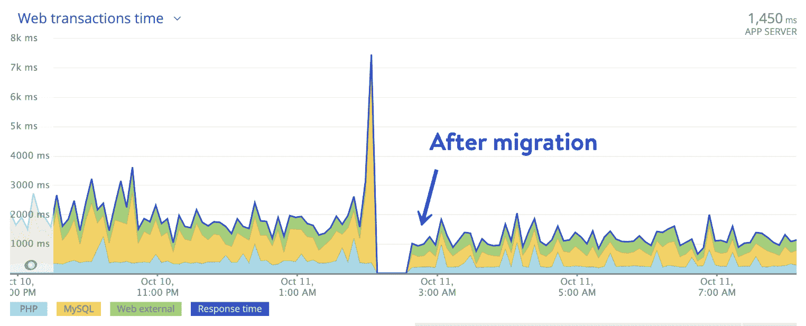

Client 6 migration to GCP C2 machine

### 客户端 7–WP buff，WordPress 维护/服务

我们的第七个客户， [WP Buffs](https://wpbuffs.com/) ，是 [Kinsta 合作伙伴](https://kinsta.com/clients/wp-buffs/)，为任何拥有 WordPress 网站的个人、企业或组织提供 24/7 技术支持和 [WordPress 维护](https://kinsta.com/blog/wordpress-maintenance/%E2%80%8E)服务。他们处理无限制的编辑、性能增强、日常健康维护和定期安全故障排除，因此他们的客户不必这样做。

Struggling with downtime and WordPress problems? Kinsta is the hosting solution designed to save you time! [Check out our features](https://kinsta.com/features/)

在迁移 WP Buffs 之后，他们网站的平均响应时间从大约 850 毫秒下降到大约 425 毫秒。这是一个 100%的性能提升！

Client 7 migration to GCP C2 machine

### 客户端 8——WordPress 开发者博客

我们的第八个客户是 WordPress 开发者的博客。迁移之后，他们站点的平均响应时间从大约 225 毫秒下降到大约 125 毫秒。这意味着性能提高了**80%**!

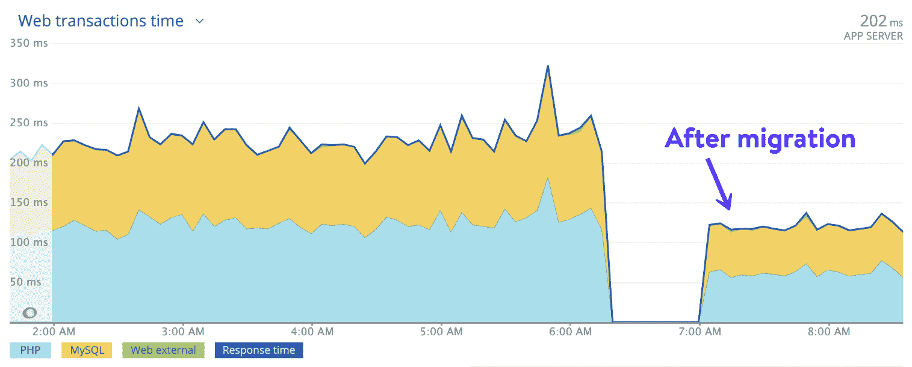

Client 8 migration to GCP C2 machine

### 客户端 9-电子商务网站(简单的数字下载)

我们的第九个客户是一个电子商务网站，使用简单的数字下载。迁移之后，他们站点的平均响应时间从大约 665 毫秒下降到大约 500 毫秒。这意味着性能提高了**33%**!

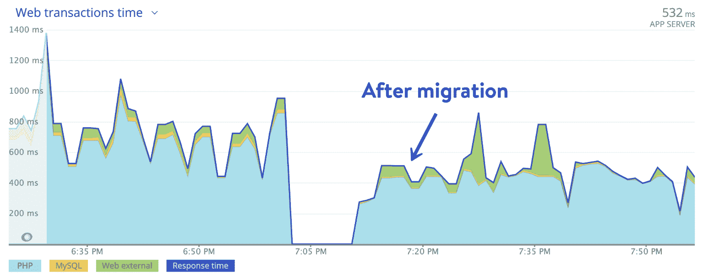

Client 9 migration to GCP C2 machine

### 客户 10–高流量体育娱乐博客

我们的第十个客户是 [Superluchas](https://superluchas.com/) ，这是一家墨西哥在线杂志，专门刊登职业摔跤(Lucha Libre)的评论、文章和新闻。

Wow, this terrific upgrade was unexpected! We are still amazed by Kinsta’s commitment to customer satisfaction.Jorge Ocampo, Media Director
Superluchas

迁移之后，他们站点的平均响应时间从大约 1，100 毫秒减少到大约 560 毫秒。这在性能上增加了**96.43%**！

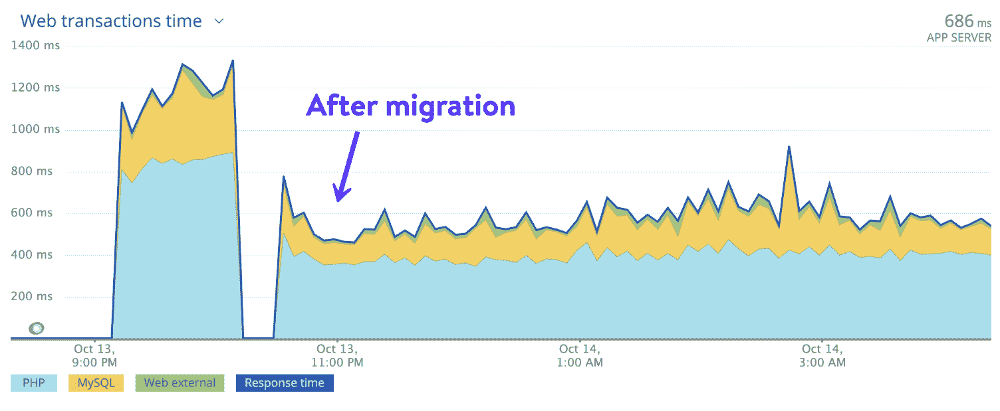

Client 10 migration to GCP C2 machine

## 从基准测试结果中获得的信息

我们的团队一直在想办法提高你的 WordPress 网站的性能。事实上，在过去的几个月里，我们还发布了令人惊叹的新特性，比如自动优化数据库、自我修复 PHP、TLS 1.3 和 PHP 8.1。

然而，自从我们在 2016 年[迁移到谷歌云平台](https://cloud.google.com/customers/kinsta/)以来，我们可以毫无疑问地说，这是迄今为止我们平台在性能方面最令人兴奋和最有影响力的变化。

[Kinsta is moving to Google Cloud's new compute-optimized VMs. Performance gains so fast you're going to feel them! 🚀Click to Tweet](https://twitter.com/intent/tweet?url=https%3A%2F%2Fkinsta.com%2Fblog%2Fboosting-wordpress-performance%2F&via=kinsta&text=Kinsta+is+moving+to+Google+Cloud%27s+new+compute-optimized+VMs.+Performance+gains+so+fast+you%27re+going+to+feel+them%21+%F0%9F%9A%80&hashtags=googlecloud%2Cwebhosting)

看看这些数据，你可以从新的 C2 机器中得到一些东西:

*   简单地将您的站点迁移到新的架构将会导致**更快的加载时间**，而不需要您做任何工作或测试。
*   由于 C2 机器的工作方式，**较重的站点将比那些已经优化的站点有更大的性能提升**。但是正如我们在上面看到的，即使是优化的网站也注意到了不同。
*   这种变化不仅仅影响你网站的前端。当在你的 WordPress 管理面板上工作时，你会看到后端更快的加载时间。

对我们来说，每个人，不管他们有什么样的主机方案，都能从相同的高性能架构中获益，来支持他们的 WordPress 站点，这一点一直很重要。这使得各种规模的企业，从博客到财富 500 强公司，在成长过程中都能轻松地与 Kinsta 一起扩展。

转移到谷歌云平台的新的计算优化(C2)机器已经把我们已经很快的平台带到了一个全新的水平。我们看到性能全面大幅提升，这为我们的客户提供了成功所需的竞争优势。

Mark Gavalda, CEO
Kinsta

## 你的 WordPress 站点的迁移时间表

提醒一下，从起步计划到企业计划，每个人都可以使用新的**计算优化的 C2 机器**。即使是定制计划。它们将是我们基础设施向前发展的支柱，也是你创建的新 WordPress 网站的默认设置。

### 信息

截至 2020 年 1 月 13 日，所有客户端站点都已成功迁移到可用区域中新的计算优化 C2 实例**。随着谷歌在更多地区推出 C2 实例，我们也将推出！**

### C2 实例的可用区域

虽然我们正在向所有人推出新机器，但它们目前仅在谷歌云平台的以下地区可用:

1.  台湾彰化县(东亚 1)
2.  香港(东亚 2)
3.  日本东京(亚洲东北部 1)
4.  日本大阪(亚洲东北部 2)
5.  韩国首尔(东北亚 3)
6.  印度孟买(亚洲南部 1)
7.  印度德里(亚洲-南方 2)
8.  新加坡裕廊西(东南亚 1)
9.  印度尼西亚雅加达(东南亚 2)
10.  澳大利亚墨尔本(澳大利亚东南部 2)
11.  比利时圣吉斯兰(欧洲-西方 1)
12.  英国伦敦(欧洲-西方 2)
13.  德国法兰克福(欧洲-西方 3)
14.  荷兰 Eemshaven(欧洲-西方 4)
15.  瑞士苏黎世(欧洲-西方 6)
16.  加拿大蒙特利尔(北美-东北 1)
17.  加拿大多伦多(北美-东北 2)
18.  巴西圣保罗(南美-东方 1)
19.  美国爱荷华州康瑟尔布拉夫斯(美国中部 1)
20.  美国南卡罗来纳州蒙克斯角(美国东部 1)
21.  美国弗吉尼亚州阿什本(美国东部 4)
22.  美国俄亥俄州哥伦布市(美国东部 5 区)
23.  美国俄勒冈州达拉斯市(美国西部 1)
24.  美国加利福尼亚州洛杉矶(美国西部 2)
25.  美国犹他州盐湖城(美国西部 3)
26.  美国内华达州拉斯维加斯(美国西部 4)

如果你想知道你现有的网站托管在哪里，你可以在 MyKinsta 仪表盘的“信息”标签下找到。您还可以将其与我们的数据中心位置列表进行比较。

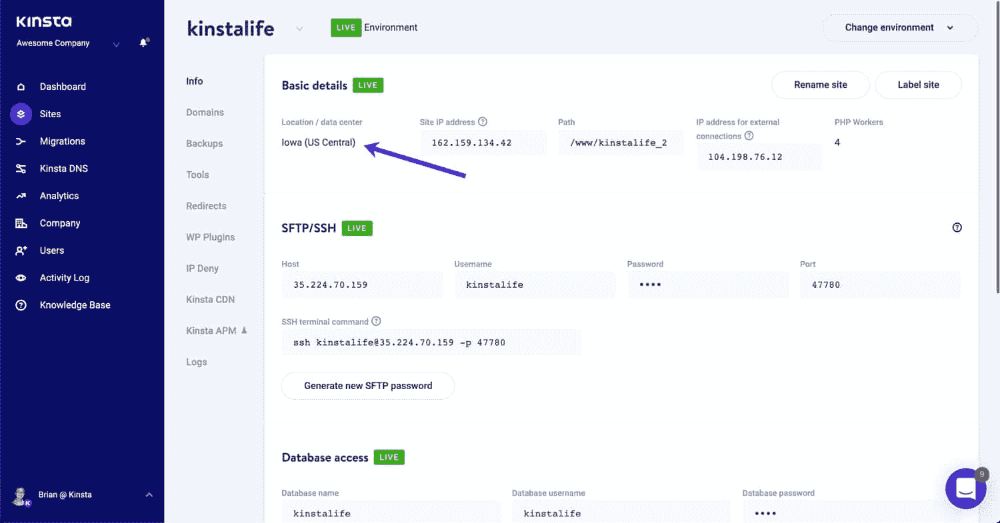

MyKinsta data center location.

### 你需要知道的是

可用区域中的所有客户端站点都已成功迁移到 C2 实例。随着谷歌云平台使 C2 实例在其他地区可用，我们的团队将继续迁移到新的基础设施。如果您目前是 Kinsta 的客户，以下是您需要了解的关于未来 C2 迁移的信息。

*   我们将把整个机器迁移到新的架构上，而不是实时迁移单个站点(这需要几个月的时间)。这将允许每个人尽快利用性能收益。
*   When migrated, there will be a small amount of downtime per machine (5-15 minutes). But this will be **performed during our maintenance windows**, or rather off-peak hours based on the region your site is in. Scheduled maintenance will be posted for all affected locations in advance on our [Status Page](https://status.kinsta.com/). You can **subscribe for updates** on each individual data center.

    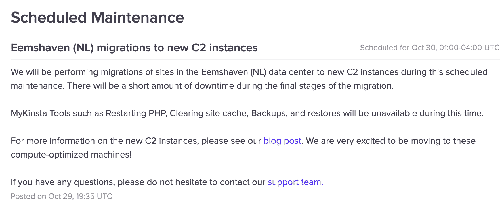

    定期维护

    

*   在此过程中，IP 地址不会改变。
*   对于我们的专用计划中想要迁移的人，您需要与我们的销售团队交谈，因为这些是逐案处理的。
*   如果你所在的地区没有 C2 机器，而你想搬家，这是可能的。但是，请给我们的系统管理员团队一些时间，首先完成向新机器的平台范围的迁移。我们会随时通知你最新进展。请记住，你应该总是把你的网站放在离大多数客户和访问者最近的地方。这有助于减少[网络延迟](https://kinsta.com/blog/network-latency/)和 [TTFB](https://kinsta.com/blog/ttfb/) 。

[Kinsta is moving everyone to Google Cloud Platform's compute-optimized VMs (C2) to achieve speeds unrivaled in the WordPress hosting industry. 💥Click to Tweet](https://twitter.com/intent/tweet?url=https%3A%2F%2Fkinsta.com%2Fblog%2Fboosting-wordpress-performance%2F&via=kinsta&text=Kinsta+is+moving+everyone+to+Google+Cloud+Platform%27s+compute-optimized+VMs+%28C2%29+to+achieve+speeds+unrivaled+in+the+WordPress+hosting+industry.+%F0%9F%92%A5&hashtags=googlecloud%2CWordPress)

## 摘要

对我们的团队来说很重要的一点是，我们要继续履行我们的承诺，为速度最快的 WordPress hosting 提供高性能的解决方案。我们完全理解，对你们中的许多人来说，这是你们选择我们而不是竞争对手的主要原因之一。这就是为什么**我们很高兴向每个人推出计算优化的 C2 机器**；不管你有什么计划。

无论你有一个低流量的博客还是一个高要求的 WooCommerce 网站，你都可以和 Kinsta 一起成长，并以超乎你想象的速度发展。

还有一个通过缩减代码来提升整体优化的选项。Kinsta 在 [MyKinsta 仪表板](https://kinsta.com/mykinsta/) 中内置了一个 [代码缩小功能](https://kinsta.com/help/kinsta-cdn/#code-minification-1) ，允许客户只需简单点击即可实现 CSS 和 JavaScript 的自动缩小。

我们意识到你们中的一些人可能仍有疑问。如果您是 Kinsta 的客户，您可以通过我们的支持团队[开一张票](https://kinsta.com/help/wordpress-support-ticket/)，我们将非常乐意提供帮助。如果您对在金斯塔[选择合适的托管方案有任何疑问，请联系我们的销售团队](https://kinsta.com/contact-us/)。

请务必查看我们已经发布的所有其他精彩的[功能更新](https://kinsta.com/feature-updates/)，并且[订阅我们的时事通讯](https://kinsta.com/wordpress-newsletter/)以了解所有最新的变化。

* * *

让你所有的[应用程序](https://kinsta.com/application-hosting/)、[数据库](https://kinsta.com/database-hosting/)和 [WordPress 网站](https://kinsta.com/wordpress-hosting/)在线并在一个屋檐下。我们功能丰富的高性能云平台包括:

*   在 MyKinsta 仪表盘中轻松设置和管理
*   24/7 专家支持
*   最好的谷歌云平台硬件和网络，由 Kubernetes 提供最大的可扩展性
*   面向速度和安全性的企业级 Cloudflare 集成
*   全球受众覆盖全球多达 35 个数据中心和 275 多个 pop

在第一个月使用托管的[应用程序或托管](https://kinsta.com/application-hosting/)的[数据库，您可以享受 20 美元的优惠，亲自测试一下。探索我们的](https://kinsta.com/database-hosting/)[计划](https://kinsta.com/plans/)或[与销售人员交谈](https://kinsta.com/contact-us/)以找到最适合您的方式。