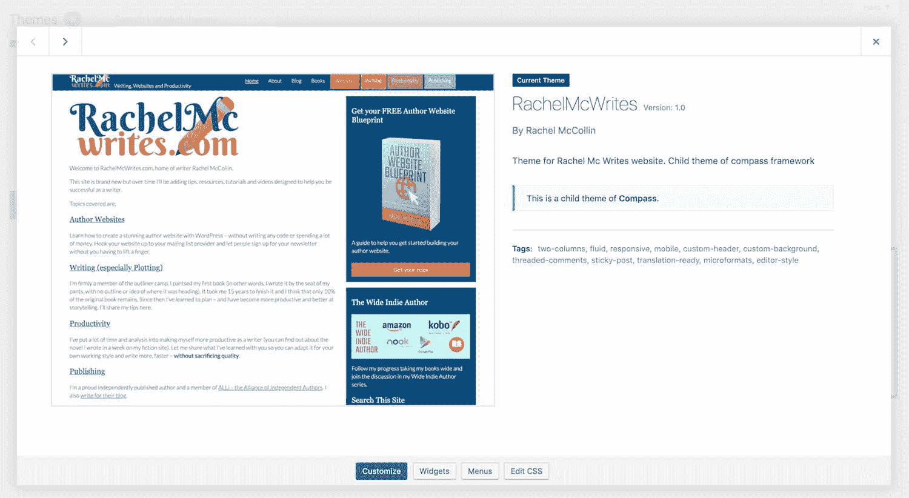
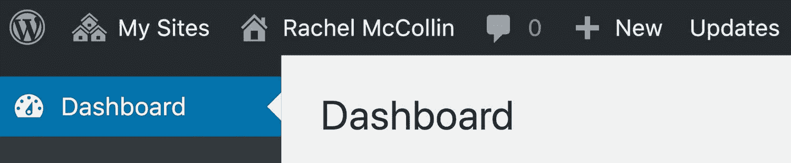
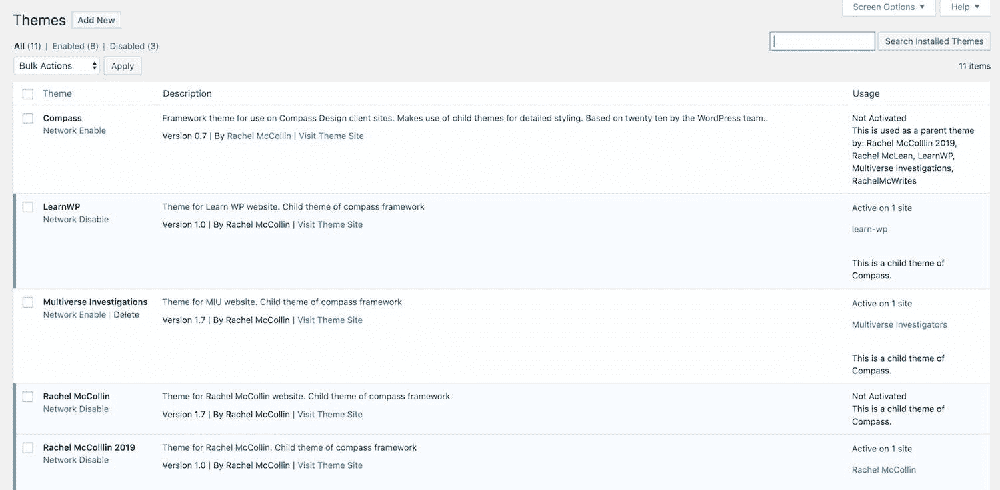
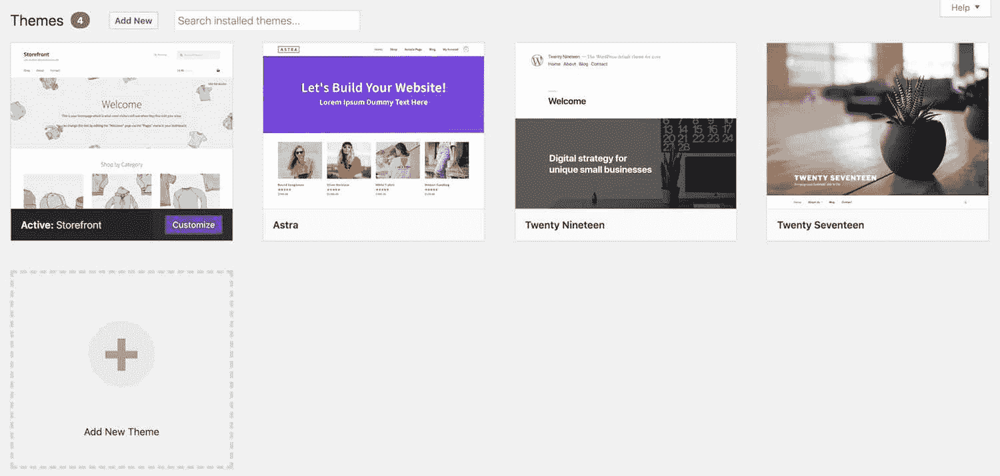
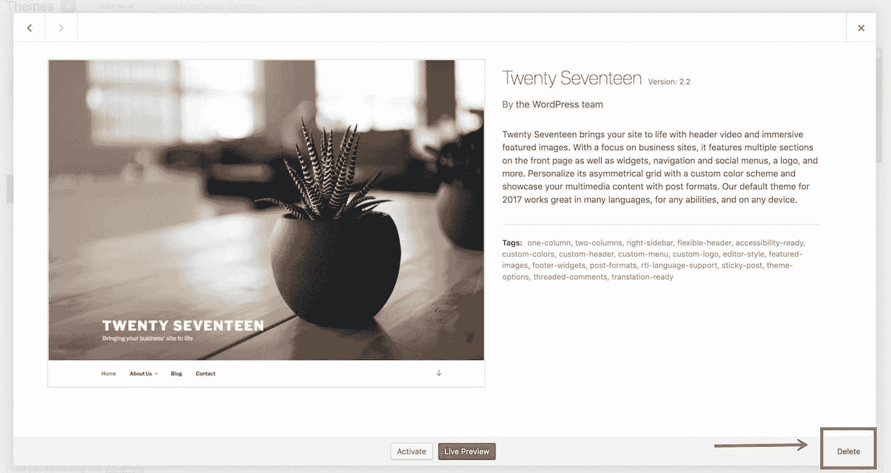
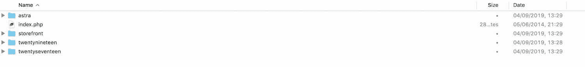
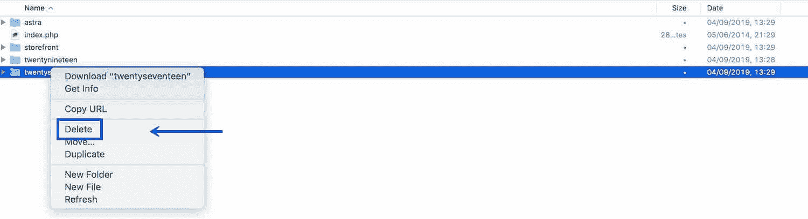
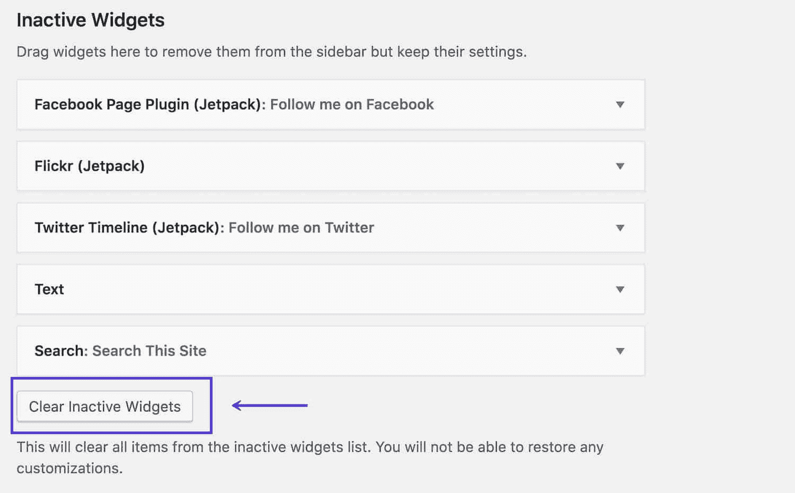
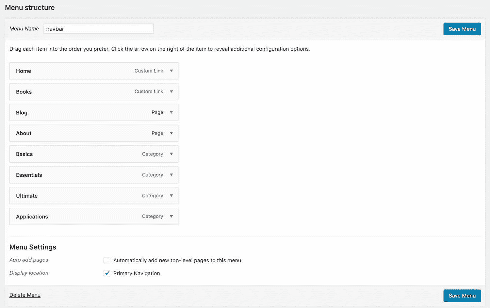
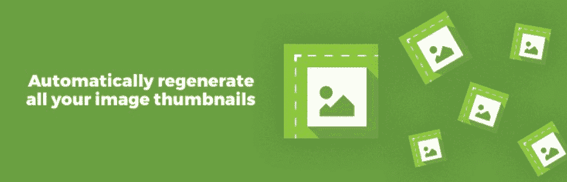

# 如何删除 WordPress 主题(3 种有效的方法)

> 原文：<https://kinsta.com/blog/wordpress-delete-theme/>

有时，你会发现自己在你的网站上切换到一个新的主题。当你这么做的时候，删除旧的 [WordPress 主题](https://kinsta.com/best-wordpress-themes/)是个好主意，一旦你确定你不会切换回它。

从你的网站上移除你不用的主题或插件是一个很好的做法:这会让你的网站更加安全，T2 会让它更快。在本指南中，我将向你展示你可以用来**删除一个 WordPress 主题**的方法，这样你就知道如何安全彻底地删除。

### 更喜欢看[视频版](https://www.youtube.com/watch?v=yB75-qVsUb4)？


## 当你想删除一个 WordPress 主题时

在一些情况下，你可能会发现自己想要删除一个 WordPress 主题:

*   你已经安装了一个新的 WordPress 主题，并希望删除旧的主题。
*   你为测试安装了一个主题，但后来发现它不适合你。
*   你没有使用[默认主题](https://kinsta.com/blog/twenty-nineteen-theme/),想从你的 WordPress 安装中删除它。

无论在什么场景下，删除主题的方式都是一样的。


> 需要在这里大声喊出来。Kinsta 太神奇了，我用它做我的个人网站。支持是迅速和杰出的，他们的服务器是 WordPress 最快的。
> 
> <footer class="wp-block-kinsta-client-quote__footer">
> 
> 
> 
> <cite class="wp-block-kinsta-client-quote__cite">Phillip Stemann</cite></footer>

[View plans](https://kinsta.com/plans/)

### 为什么删除不用的 WordPress 主题是最佳实践

你可能会想抓住那个你不再使用的主题:毕竟，它不会造成任何伤害，你可能会决定在将来再次使用它。

但是从你的 WordPress 安装中删除任何你不用的代码是一个好习惯，这适用于主题和插件。

您应该删除不使用的主题和插件的原因包括:

*   安全:你安装的主题越多，黑客渗透你网站的机会就越多。
*   [更新](https://kinsta.com/blog/how-to-update-wordpress-theme/):你不需要更新你已经删除的主题。跳过网站上不活跃主题的更新可能很诱人，但是出于安全原因，更新不活跃主题和插件与更新活跃主题和插件一样重要。
*   [性能](https://kinsta.com/learn/speed-up-wordpress/) : 你的 WordPress 网站的后端，管理面板，是受不活跃主题影响的主要区域。这主要是由于更新。当 WordPress 中的更新过程运行时，它将查询每一个已安装的主题，活动的或不活动的，看看是否有更新。因此，虽然这是名义上的，20 个不活跃的主题检查更新，是一些加起来。在大多数情况下，你的 WordPress 站点的前端应该是 [从缓存中提供](https://kinsta.com/blog/wordpress-cache/) 并且不会受到不活跃主题的影响。
*   [空间](https://kinsta.com/blog/disk-space-wordpress-hosting/):每一个你不用的文件都在你的 [WordPress 主机上占据了宝贵的空间](https://kinsta.com/wordpress-hosting/)。这可能会导致性能问题，或者最终会让您为更昂贵的计划付出更多成本。
*   [数据库性能](https://kinsta.com/blog/wordpress-revisions/#how-to-optimize-the-revisions-database-in-wordpress):如果一个主题处于非活动状态，并且当它处于活动状态时，已经向[数据库](https://kinsta.com/knowledgebase/wordpress-database/)添加了数据，这些数据仍然会存储在数据库中，以防你再次激活它。如果删除该主题，数据将被删除。

### 删除和卸载一个主题

理论上，卸载一个主题和删除它应该是一回事。在这两种情况下，主题的代码文件都将从服务器上删除。在这两种情况下，任何数据也应该被删除。但是在某些情况下，简单地卸载一个主题可能不会删除所有相关的内容。我们将在本指南的后面部分研究如何做到这一点。

理解删除或卸载一个主题和停用它之间的区别也是值得的。

如果您激活了另一个主题，则该主题将被停用。不像插件，你必须手动停用任何你不想运行的插件，这个过程是自动的。这是因为一个站点上只能有一个主题是活动的。

因此，当您通过激活一个新主题来停用当前主题时，新主题会变为活动的，但旧主题不会从系统中删除。您配置的任何设置都保存在数据库中，以备您再次激活主题时使用(这样您就不必再做一次)。你添加到你的主题中的窗口小部件区域的任何窗口小部件都会被保存，但是会被移动到**窗口小部件**的**非活动窗口小部件**部分。您添加到主题中的任何菜单都会保留，但是您必须指定您希望它们出现在新主题中的什么位置。

如果你想永久删除一个主题及其所有设置等。，需要删除。要了解如何做到这一点，请继续阅读！


## 什么时候不删除主题

有时候一个主题可能在你的网站上不活跃，但是你仍然不能删除它。其中包括:

*   该主题是当前活动主题的父主题。
*   您的站点位于多站点网络上，而该主题在网络中的另一个站点上处于活动状态。
*   您需要保留主题用于测试或在测试当前主题后重新激活。

### 父主题

被用作父主题的主题不会在你的站点上被激活，但是没有它，[子主题](https://kinsta.com/blog/wordpress-child-theme/)会被破坏。

WordPress 会在**主题**屏幕中通知你当前主题是否是子主题。或者，你可以用我们的 [WordPress 主题检测工具](https://kinsta.com/tools/what-is-my-ip/wordpress-theme-detector/)来检查你的站点，以确定你的站点是否使用了子主题。



The active theme is a child theme


在删除站点中的非活动主题之前，请检查活动主题:它是否使用了父主题？如果是，那就不要删除那个主题！

### WordPress 多站点

如果你的站点是 WordPress 多站点网络的一部分，而你只有站点的管理员权限，那么你将不能删除(或安装)主题。这是因为唯一可以管理主题的用户是网络管理员。

您可以通过查看顶部的管理栏来检查您的站点是否是网络的一部分。如果有一个**我的网站**项，那么这是一个网络而不是一个独立的网站:



My Sites admin menu item


你不能安装或删除主题，但是你可以激活网络管理员已经安装在网络上的主题。

如果你是[网络管理员](https://kinsta.com/blog/wordpress-multisite/#adding-users-as-a-network-admin-aka-super-admin)，并且你已经在网络中你自己的一个站点上停用了一个主题，小心删除你不再使用的主题。可能有另一个用户在他们的网站上激活了这个主题。

这并不意味着不值得不时清理你的主题(和插件),移除那些在网络上不被使用的。要查看网络中使用的主题，您可以安装 [Multisite Enhancements](https://wordpress.org/plugins/multisite-enhancements/) 插件并激活它。它会在网络管理中的**主题**和**插件**屏幕上增加一栏，告诉你哪些主题和插件在你网络中的不同站点上是活跃的。



The Multisite Enhancements plugin


### 测试主题

有时你或你的同事可能安装了一个用于测试的主题。如果你想在你的网站上测试一个新主题，最好的方法是使用 [WordPress staging](https://kinsta.com/wordpress-staging/) 。但是如果这不是一个选项，你可以决定安装一个主题来测试。

如果你是团队的一员，并且打算删除一个主题，一定要先和你的同事商量。如果你已经测试了一个主题，并且将来有可能需要重新激活它，那么不要删除它。


## 删除 WordPress 主题之前要做的事情

所以你已经检查了主题没有被使用，它不是一个父主题，并且它不需要在将来被重新激活。你知道你想删除它。

在你删除主题之前，请耐心等待。现在是时候做两件事情中的一件或两件了:在你的临时站点上测试主题被删除的站点，并做一个备份。如果您正在进行多站点安装，这里有一个关于[多站点备份插件](https://kinsta.com/blog/wordpress-multisite-plugins/)的指南。

### 暂存站点

临时网站是同一台服务器上实时网站的镜像。所有的 Kinsta 托管计划都有一个免费的临时站点，你可以很容易地复制你的站点，然后用它来测试。

如果您可以访问您的临时站点，最好先删除该站点上的主题，这样您可以 100%确定它不会引起任何问题。这时，如果发现被删除的主题是活动主题的父主题，你会诅咒自己，然后当你意识到你没有在你的活动网站上删除它时，你会松一口气。

### 回投

在你从你的网站上删除任何东西之前，[首先做一个备份](https://kinsta.com/help/wordpress-backups/)，就像你在更新之前做的那样。

Kinsta 在它的 [WordPress 托管计划](https://kinsta.com/wordpress-hosting/plans/)中包含了一个[一键式备份选项](https://kinsta.com/feature-updates/downloadable-backups/)，所以你可以在删除主题之前快速备份，然后[在出现问题时快速恢复它](https://kinsta.com/blog/restore-wordpress-from-backup/)。

如果你的主机计划中没有一键式备份，你可以安装一个备份插件并使用它。

无论哪种方式，都不要跳过这一步。

## 如何删除 WordPress 主题

所以你已经检查了你的主题可以安全删除，并且做了备份。现在是时候删除那个主题了。

有三种方法可以做到这一点:

1.  [通过 WordPress 仪表盘](#dashboard)
2.  [使用 FTP/SFTP](#ftp-sftp)
3.  [使用 WP-CLI](#wp-cli)

让我们依次来看一下其中的每一项。

### 1.通过 WordPress 仪表盘删除 WordPress 主题

通过 [WordPress 仪表盘](https://kinsta.com/knowledgebase/wordpress-admin/)删除主题是最简单的方法。如果您可以访问管理屏幕，那么这是推荐的方法。

在你的 WordPress 网站中，进入**外观>主题**。您将看到所有已安装的主题显示在列表中，活动的主题排在第一位。



The Themes screen


从列表中，单击要删除的主题以查看其详细信息。

## 注册订阅时事通讯


### 想知道我们是怎么让流量增长超过 1000%的吗？

加入 20，000 多名获得我们每周时事通讯和内部消息的人的行列吧！

[Subscribe Now](#newsletter)



The Twenty Seventeen theme


在右下角，有一个**删除**链接。点击它，WordPress 会检查你是否真的想要删除这个主题。点击弹出窗口中的**确定**按钮，主题将被删除。

### 2.通过 FTP/SFTP 删除 WordPress 主题

如果你没有访问 WordPress 仪表盘的权限，但是可以通过 [FTP/SFTP](https://kinsta.com/knowledgebase/how-to-use-sftp/) 访问网站，你可以在里面删除主题的文件夹(这里是 [FTP 和](https://kinsta.com/knowledgebase/ftp-vs-sftp/)SFTP 的区别)。

你可以通过[你的 FTP 客户端](https://kinsta.com/blog/best-ftp-clients/)来完成。打开你的 FTP 客户端，导航到你网站上的 **wp-content/themes** 目录。



Themes via FTP


你会看到所有已安装的主题列表。你无法知道哪一个是活跃的，所以这可能是删除主题的最危险的方法，这也是为什么首先备份是重要的。但是如果主题本身被破坏了，阻止你进入管理界面，这可能是你唯一的选择。

将鼠标悬停在包含您要删除的主题的文件夹上，然后右键单击它以访问快捷菜单(大多数 FTP 客户端会允许您这样做，但您的可能会有所不同)。



Deleting a theme via FTP


点击快捷菜单中的**删除**。您的 FTP 客户端将要求您确认是否确实要删除该文件夹。选择**是**或**确定**。该主题将被删除。

### 3.通过 WP-CLI 删除主题

如果你熟悉使用命令行来管理你的站点，使用 WP-CLI 是第三个也是最快的选择。如果你以前没有使用过 WP-CLI，这可能不是开始的最佳时机，因为如果你犯了一个错误，你可能会删除错误的文件。

首先，使用 WP-CLI 通过命令行访问您的站点。

要查看所有已安装主题的列表，请键入以下内容:

```
$ wp theme list
```

然后你会看到一个所有已安装主题的列表。如果您想获得更多有用的信息，您可以请求一个非活动主题列表:

```
$ wp theme list --status=inactive
```

然后，您将看到所有非活动主题的列表，因此您知道哪些主题可以安全删除(除非其中一个是子主题或在多站点网络中的另一个站点上是活动的)。

要删除主题，请键入以下内容:

```
$ wp theme delete twentyseventeen
```

请注意，最后一个参数是主题文件夹的名称，而不是您在管理屏幕上看到的主题名称。

然后，您会看到一条消息，告诉您该主题已被删除:

厌倦了 WordPress 的问题和缓慢的主机？我们提供世界一流的支持，由 WordPress 专家提供 24/7 服务和超快的服务器。[查看我们的计划](https://kinsta.com/plans/?in-article-cta)

```
Deleted 'twentytwelve' theme.

Success: Deleted 1 of 1 themes.
```

如果你熟悉使用 WP-CLI，这是删除主题最快的方法，但也有风险。因为你没有在管理界面中得到的关于主题的信息，所以很容易删除错误的主题。所以要小心，先在你的 [WordPress 暂存站点](https://kinsta.com/blog/wordpress-staging-site/)上测试一下，确保你有备份。

### 删除主题后测试您的站点

一旦你删除了你的 WordPress 主题，测试你的站点是很重要的。在浏览器中访问它，确保你[清除了缓存](https://kinsta.com/blog/wordpress-clear-cache/)并检查一切都正常工作。

如果你不小心删除了一个主题，它是当前主题的父主题，你会发现一些或者所有的 [CSS](https://kinsta.com/knowledgebase/edit-wordpress-code/) 都不见了，这意味着你的网站看起来没有风格。如果你不小心删除了当前主题，WordPress 会找到另一个主题来代替(假设你已经安装了另一个主题)。

如果你不小心删除了一个主题，你需要重新安装它。你可以通过**主题**屏幕来完成，如果你最初是从主题目录中获得主题的话，或者从你开始之前的备份中再次上传主题。
T3】

## 删除主题相关内容

一旦你删除了主题，你可能会发现你的网站上仍然有特定于你删除的主题的内容。

这可能包括:

*   [Widgets](#widgets)
*   [菜单](#menus)
*   [虚拟内容](#dummy)如帖子、页面或自定义帖子类型的帖子(如果主题已注册)
*   [图像](#images)

要清理您的网站并使其尽可能好地运行，您应该删除此内容或重新分配它，以便它在您的新主题中工作。

### 小工具

[Widgets](https://kinsta.com/blog/wordpress-widgets/) 只有在被添加到 widget 区域时才起作用。如果你停用的主题中有插件，你可以在**插件**屏幕的**非活动插件**区域找到它们。



Inactive widgets


将它们拖到新主题中的小部件区域，如果不再需要，可以删除它们。您可以单独删除它们，或者单击**清除不活动的小部件**按钮将其全部删除。

### 菜单

所有的主题都包含至少一个位置让你放置一个[菜单](https://kinsta.com/blog/wordpress-menu-plugins/)，通常在标题中或者标题的正下方。有些在页脚或侧边栏等地方有额外的菜单位置。

当你激活一个新主题时，你为旧主题创建的菜单仍然可用，但是你必须告诉 WordPress 你希望每个菜单出现在哪个菜单位置。



Navigation menu location


如果您在以前的主题中使用了多个菜单位置，而您的新主题没有额外的导航位置，您可以使用自定菜单 widget 将任何菜单添加到边栏或页脚中的 widget 区域。

### 虚拟内容

如果你上传或导入虚拟内容来测试你的主题，你会想从你的网站上删除它。

删除主题后，你添加的任何文章和页面都可以从 WordPress admin 的**文章和** **页面**中删除。或者您可以将它们留在原处，以便在新主题中使用。

如果你之前的主题注册了一个[自定义帖子类型](https://kinsta.com/blog/wordpress-custom-post-types/)(这不是一个好的做法:你应该通过插件来做这件事)，那么你需要删除任何自定义帖子类型的帖子，除非你的新主题也注册了相同的自定义帖子类型，或者(更好)你添加了一个插件来做这件事。

在删除旧主题之前，您需要删除任何自定义帖子类型的帖子，因为一旦注册自定义帖子类型的代码消失，您将无法看到它们。

### 形象

不同的主题有不同的图像设置。一些网站比其他网站更多地使用特色图片，一些网站使用额外的媒体尺寸来适应主题的布局。

你也可能有[上传的图片](https://kinsta.com/blog/optimize-images-for-web/)用于主题中包含的[滑块或转盘](https://kinsta.com/blog/wordpress-slider/)。

删除你的主题后，清理你的图片是个好主意。这有两个方面:

*   [调整图像大小](https://kinsta.com/blog/optimize-images-for-web/#resizing-images-to-scale)以适应新的主题设置。
*   移除未使用的图像。

要调整图像大小，请安装[重新生成缩略图](https://kinsta.com/blog/regenerate-thumbnails/#how-to-regenerate-thumbnails-in-wordpress)插件。



The regenerate thumbnails plugin


安装并激活后，进入**工具>重新生成缩略图**。

在重新生成缩略图屏幕上，单击**为所有 X 个附件重新生成缩略图**按钮，其中 **X** 是您站点中的图像数量。

该插件将为您重新生成图像，创建由您的主题注册的任何自定义大小的新图像。它还会询问您是否要删除任何不再使用的图像。您应该选择此选项。

如果你上传了以前主题的滑块或其他功能的图像，重新生成图像插件通常会删除新主题不再需要的尺寸的图像，但不会删除原来上传的图像文件。

在 WordPress 管理器中进入[媒体库](https://kinsta.com/blog/wordpress-media-library/),在永久删除它们之前找出你不再需要的图片。或者，您可以在停用旧主题之前，从主题包含的任何滑块或转盘的管理屏幕中执行此操作。具体如何做将取决于主题设置的配置。

[Need to delete your WordPress theme? Easier said than done! There are lots of things to consider... and 3 ways to do it! Check them out here 💥📝Click to Tweet](https://twitter.com/intent/tweet?url=https%3A%2F%2Fbit.ly%2F2W13y7D&via=kinsta&text=Need+to+delete+your+WordPress+theme%3F+Easier+said+than+done%21+There+are+lots+of+things+to+consider...+and+3+ways+to+do+it%21+Check+them+out+here+%F0%9F%92%A5%F0%9F%93%9D&hashtags=wpthemes%2Cwordpress)

## 摘要

删除一个 WordPress 主题不仅仅是进入**主题**屏幕并点击**删除**这么简单。

确保安全彻底地删除任何主题是很重要的。额外的步骤，比如备份，首先测试你的临时站点，以及处理旧主题的任何内容，将有助于你的站点顺利运行新主题。按照上面的步骤，你就能正确地做这件事。

* * *

让你所有的[应用程序](https://kinsta.com/application-hosting/)、[数据库](https://kinsta.com/database-hosting/)和 [WordPress 网站](https://kinsta.com/wordpress-hosting/)在线并在一个屋檐下。我们功能丰富的高性能云平台包括:

*   在 MyKinsta 仪表盘中轻松设置和管理
*   24/7 专家支持
*   最好的谷歌云平台硬件和网络，由 Kubernetes 提供最大的可扩展性
*   面向速度和安全性的企业级 Cloudflare 集成
*   全球受众覆盖全球多达 35 个数据中心和 275 多个 pop

在第一个月使用托管的[应用程序或托管](https://kinsta.com/application-hosting/)的[数据库，您可以享受 20 美元的优惠，亲自测试一下。探索我们的](https://kinsta.com/database-hosting/)[计划](https://kinsta.com/plans/)或[与销售人员交谈](https://kinsta.com/contact-us/)以找到最适合您的方式。