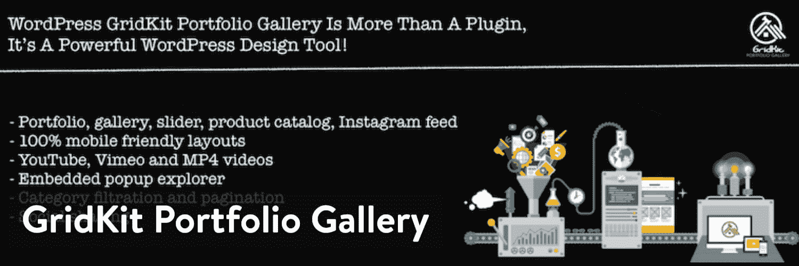
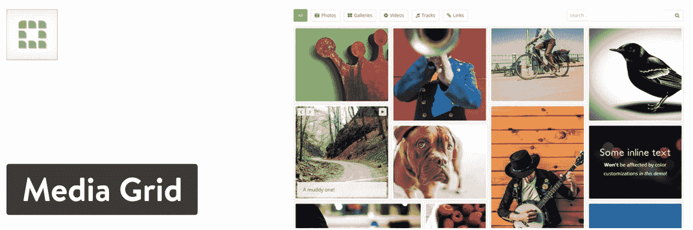
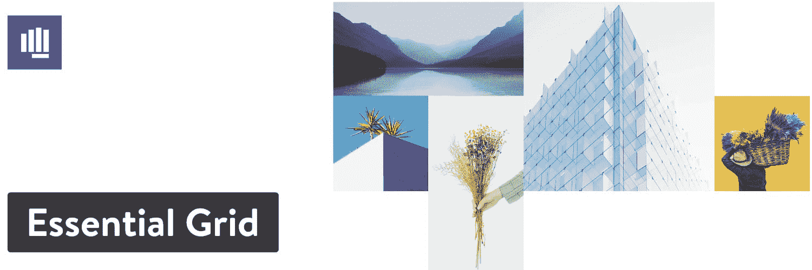
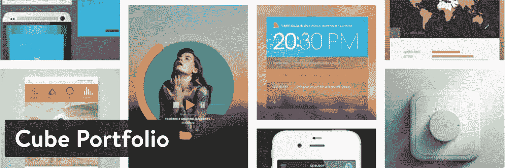

# 展示你作品的 12 个最佳 WordPress 组合插件选项

> 原文：<https://kinsta.com/blog/wordpress-portfolio-plugins/>

没有作品集的专业摄影师算什么？艺术家、[机构](https://kinsta.com/blog/wordpress-agency/)或者自由作家呢？随着内容创作而来的是在网上展示你的作品的[任务](https://kinsta.com/blog/portfolio-website/)，以便找到最合适的客户。投资组合是你的第一道防线。一个展示精英中精英的地方。一个准确说明你关注哪些类型的利基市场的中心。建立文件夹的一个简单方法是[找到一个 WordPress 主题](https://kinsta.com/blog/how-to-install-a-wordpress-theme/)，创建一个网站，然后添加一个 WordPress 文件夹插件。

这种配置不仅便宜而且简单，而且最好的 WordPress 组合插件提供了一系列额外的功能，这些功能是你在 WordPress 之外的其他[平台上找不到的。](https://kinsta.com/knowledgebase/what-is-wordpress/)

那么，现在有哪些最好的 WordPress 组合插件选项呢？这里有一个快速列表让你开始:

1.  [作品集图库](#portfolio-gallery)
2.  [WP 组合](#wp-portfolio)
3.  [GridKit 作品集图库](#gridkit)
4.  [投资组合帖子类型](#post-type)
5.  [视觉作品集](#visual)
6.  [次世代画廊](#nextgen)
7.  [媒体网格](#media)
8.  [围棋组合](#go)
9.  [基本网格](#essential)
10.  [立方体组合](#cube)
11.  [网格](#grid)
12.  环境画廊

## 在 WordPress 文件夹插件中寻找什么

当然，你可以阅读我们关于最佳组合插件的建议，但是在你的研究中你应该寻找什么特性呢？请考虑以下情况:

*   支持无限的投资组合、列和行。
*   免费或廉价建立投资组合的选择。没有理由在投资组合插件上花那么多钱。
*   多种组合布局，如[滑块](https://kinsta.com/blog/wordpress-slider/)、网格和砖石风格。
*   预制模板的集合，以便您在开发投资组合时不必从头开始。
*   在点击发布按钮之前，一个可视化构建器来查看图库的外观。
*   激活过滤器和搜索栏的设置。
*   动画，使您的投资组合看起来更有吸引力。
*   用于调整颜色、大小和图标等内容的设置。
*   与许多[主题和页面生成器](https://kinsta.com/blog/wordpress-page-builders/)的集成。
*   在你的网站上实现投资组合的简单选项，例如短代码和[小部件](https://kinsta.com/blog/wordpress-widgets/)。
*   看到各种各样的来源来获取你的内容也很不错，[比如 Instagram](https://kinsta.com/blog/wordpress-instagram-plugin/) 、博客帖子和 Dropbox。

现在，这里是最好的 WordPress 组合插件的深度评论！

## 1.作品集画廊

组合图库插件是 WordPress 插件库中排名最高的免费图库/组合插件之一。这是在您的网站上获得作品集并在响应、过滤器和灯箱选项的帮助下推出漂亮画廊的最简单方法之一。

一些免费功能包括多栏布局和编号，以及标题和间距工具。我们喜欢这样的事实，你可以使用不同的格式，如砖石和灰度，使您的投资组合美丽和灵活。

Portfolio Gallery plugin

这个插件有一个功能强大的免费版本，大多数小企业都可以利用。我想大多数摄影师或艺术家会发现它很有用，不需要付费升级。话虽如此，作品集插件的高级版个人许可证起价 25 美元。您还可以选择更贵的商业和开发者许可，以及开发者提供的所有高级插件的个人许可。

高级计划中的一些功能包括无限制的过滤器、排序控件和自定义 CSS 工具。您甚至可以扩展到网站的不同区域，为帖子、页面和小部件提供图库。

### 作品集画廊为什么脱颖而出？

*   作品集展示了一个令人印象深刻的免费版本，它提供了大多数普通艺术家需要的作品集工具。
*   如果你经营一家代理机构或者计划扩展你的投资组合功能，这个高级插件足够便宜，并且给你更多的工具。
*   投资组合是干净和现代的，具有多种格式，如多列和列大小。
*   效果和动画包括像灰度和悬停效果的行动。
*   您可以选择上传图片或视频在您的投资组合。
*   所有投资组合布局都包含过滤器，让客户和顾客有机会以一种有组织的方式筛选你的作品。
*   核心插件使用一个短代码来发布你的作品集，而高级版本也提供页面和帖子类型和小部件。
*   Bootstrap lightbox 添加了一个重要的效果，可以在所有移动设备上很好地工作。
*   你可以选择如何对你的投资组合进行排序，比如降序或按日期排序。

#### 谁应该考虑这个 WordPress 组合插件？

因为免费版本，我们喜欢所有初创公司和自由职业者的作品集插件。对于那些希望通过简单的方式在带有过滤器的网站上获得作品的机构、大牌艺术家和设计师来说，这也是有意义的。

## 2.WP 投资组合

WP 作品集是一个在 WordPress 网站上快速建立作品集的付费解决方案。它有三个版本可供选择:网站作品集、图片作品集或视频作品集。所以，你可以选择上传虚拟网站，并把它们组织成一个文件夹。对[网站设计者和开发者](https://kinsta.com/blog/hire-wordpress-developer/)来说很棒。此外，艺术家和摄影师可以利用图像组合，而摄像师有视频选项。

价格按年确定，所有功能都包含在一次性费用中。但是，全面的客户支持每年都需要续订。终身计划是最超值的，起价 199 美元。但你也可以选择支付一个年度计划，从每年 39 美元开始，到每年 199 美元的代理捆绑包。

WP Portfolio plugin

这完全取决于你决定的计划，但所有付费用户都将收到一个简单的[短码](https://kinsta.com/blog/wordpress-shortcodes/)来实现投资组合和超过 48 个虚拟投资组合。这让你有机会在几分钟内设计你的投资组合。除此之外，您还会收到可排序的类别、对 [REST API](https://kinsta.com/blog/wordpress-rest-api/) 的访问，以及一个漂亮的投资组合设计器。一些价格较高的计划有坚实的插件，如[元素](https://kinsta.com/blog/wordpress-elementor/)和[海狸建设者](https://kinsta.com/blog/wordpress-page-builders/#beaver-builder)。

### WP 组合为什么脱颖而出？

*   这是一个高级插件，大部分功能包含在每年 39 美元的计划中。
*   你只需要按年付费，你还可以选择获得终身会员资格。
*   所有计划都可以访问 REST API，允许您定制投资组合的任何方面，并与不同的平台集成。
*   虚拟投资组合模板对于在没有任何设计经验的情况下启动投资组合来说是惊人的。这对需要与许多客户打交道的机构也很有帮助。
*   您的投资组合中的所有类别都可以使用过滤器进行排序。
*   你可以借助一个方便的短代码在你的网站上插入一个文件夹。
*   一些昂贵的代理捆绑包包括有用的插件，如页面生成器和其他高级 WordPress 插件。
*   代理计划提供 Astra Pro 主题，这是制作大型投资组合的绝佳主题。
*   开发商往往有频繁的销售，让你节省一点钱。
*   该产品组合支持从网站截图到视频的所有内容。
*   你可以实现有趣的效果和格式，比如砖石网格、无限滚动和[延迟加载](https://kinsta.com/blog/wordpress-lazy-load/)(这对[加速你的网站](https://kinsta.com/learn/speed-up-wordpress/)非常有用)。

#### 谁应该考虑这个 WordPress 组合插件？

代理商应该考虑 WP 组合插件的合理定价，包括组合主题，以及与页面生成器的轻松集成。个人计划对个人来说并不坏，考虑到你实际上只需要一次性付款，然后插件的所有功能都会给你。

## 3.GridKit 作品集图库

GridKit Portfolio Gallery 插件拥有一批忠实的 WordPress 用户，他们渴望的不仅仅是标准的图片组合。例如，该插件具有一个 [YouTube 视频图库](https://kinsta.com/blog/embed-youtube-video-wordpress/)，能够快速将 YouTube 链接粘贴到图库中。你还可以从客户标识、团队成员图片、地图和[音频剪辑](https://kinsta.com/blog/wordpress-audio-players/)等项目中进行选择。当然，包括一个常规的图像滑块和文件夹，但是你有比其他插件更多的选择。

GridKit 有两种形式，免费和高级。免费选项具有响应投资组合、图像滑块和插入投资组合的短代码的功能。您还可以访问产品目录、客户演示文稿等等。

GridKit Portfolio Gallery plugin

高级插件起价 29.99 美元，这是一次性付款，除非你想在年底升级以获得更多支持。如果你喜欢小额支付，你也可以考虑每月标准许可。这每月花费 4.99 美元，但这似乎没有意义，因为一次性费用将在六个月内收回。

另一个付费计划叫做终身扩展许可，价格为 49.99 美元(一次性费用)，可以让你在五个网站上使用插件。

### 为什么 GridKit Portfolio Gallery 脱颖而出？

*   GridKit 是一个高级组合插件的定义，它有显著的网格组合布局和几个过滤选项。你通常只需要上传你的视频就能得到很棒的结果。
*   该插件附带了几个预定义的模板和选项，包括团队成员的作品集、照片、视频和徽标。
*   有一个功能相当不错的免费版本。
*   GridKit 有动画、悬停风格等多种效果，都是你可以自定义的。您的作品集包含社交分享按钮，以提示客户和其他用户分享您的作品。
*   您可以使用短代码在您的网站上插入投资组合。
*   包括独特的布局，如砖石和拼图形式。
*   通过直接链接到你的页面，你可以创建一个漂亮的 Instagram feed。
*   幻灯片放映是可能的，用户不必用鼠标滚动或点击文件夹。
*   惰性加载只帮助加载屏幕上的图像。

#### 谁应该考虑这个 WordPress 组合插件？

如果你想拥有令人惊叹的预定义模板，这个 GridKit 是一个可靠的组合插件。如果您想为 MP3 片段或客户徽标等更独特的物品准备一个作品集，这也是一个很好的解决方案。

## 4.投资组合帖子类型

[Portfolio Post Type](https://wordpress.org/plugins/portfolio-post-type/) 插件采用了一种完全不同的方法来创建和管理投资组合。它[为你上传到网站的所有投资组合项目生成一个定制的帖子类型](https://kinsta.com/blog/wordpress-custom-post-types/)。这允许你更好地组织你的作品集，并为每个作品集注册特定的标签和类别。这是一个简单、轻便的插件，安装后不需要任何调整就可以开始工作。

Portfolio Post Type plugin

Portfolio Post 类型插件是完全免费的，对于对快速识别 Portfolio 项目感兴趣的开发者来说非常有用。但是，请记住，插件与调整你的作品集项目在网站上的显示方式无关。为了让事情看起来漂亮，你需要找到另一个插件或主题来支持漂亮的投资组合布局。

### 为什么投资组合岗位类型脱颖而出？

*   它是免费的，没有任何追加销售。
*   该插件允许为您的投资组合项目生成自定义帖子类型。
*   你可以为你所有的自定义文章类型添加标签和类别。
*   这个插件不会以任何方式限制你的设计。

#### 谁应该考虑这个 WordPress 组合插件？

Portfolio Post 类型插件对于拥有大型投资组合或大量客户投资组合的开发人员来说很好。它提供了一种组织良好的方式来分类和查找您的投资组合项目，而不需要太多的工作。如果你有编码经验，或者你已经有一个高质量的组合主题或插件，你会喜欢这个。

## 5.视觉作品集

作为一个免费的作品集 WordPress 插件，Visual Portfolio 拥有相当多的追随者。这是一个开源软件，所以你不必为了更好的功能而升级。该插件提供了一个可视化的构建器，让你在发布前就能准确地看到你的图库将会是什么样子。构建器的工作方式类似于 WordPress 帖子，除了你会收到一个完整的预览，以及调整布局、查找简码和改变文件夹中的图片的设置。

有几种布局可供选择，包括一直流行的砖石结构。您还可以为无限数量的投资组合项目添加过滤器和无限滚动工具。

Visual Portfolio plugin

自定义颜色和自定义帖子类型也是可能的，更不用说让用户轻松滚动浏览你的图库的传送带了。考虑到您的许多客户希望以更大的格式查看您的照片，弹出式图库也非常有用。最后，开发者拥有定制 CSS 和从头开始创建模板的工具。

### 为什么视觉作品集脱颖而出？

*   视觉作品集没有任何费用。
*   它对开发者友好，有用于 [CSS](https://kinsta.com/knowledgebase/combine-external-css/) 和保存模板的区域。
*   一个视觉预览显示在后端，这样你就可以看到投资组合是什么样子。
*   短码用于将你的照片收藏放在你网站的任何地方。
*   它有四种预定义的布局，包括瓷砖、滑块、网格和砖石。
*   一些悬停效果看起来相当专业，有飞入、浮现和淡出的选项。
*   过滤和排序由“加载更多”按钮补充。
*   您会收到一个弹出式图库，支持来自 Vimeo 和 YouTube 的照片和视频。
*   该插件支持几个集成，如[Gutenberg WordPress builder](https://kinsta.com/blog/gutenberg-wordpress-editor/)和 WPBakery。

#### 谁应该考虑这个 WordPress 组合插件？

视觉组合有相当多的视觉和动画功能，包括免费的。不仅如此，结果看起来与你从优质替代品中找到的非常相似。如果你想让一个可视化的构建者制作干净的没有价格标签的投资组合，考虑一下可视化投资组合插件。

## 6.下一代画廊

下一代画廊宣称它是由摄影师为摄影师打造的。它似乎是这个列表中下载量最大的插件之一。这个插件提供了从批量上传到图像分类的所有功能。此外，前端有三个不同版本的投资组合可供选择和定制。免费版可以找到这三种设计，包括图像浏览器图库、缩略图和幻灯片。

NextGEN Gallery 的 Plus 版本售价 79 美元，但它提供了一系列令人印象深刻的附加演示供您开始使用。

NextGEN Gallery plugin

NextGEN Gallery 确实有漂亮的设计选项，使其成为艺术家和摄影网站的理想选择。你可以播放一个基本的幻灯片，或者将数百张照片放入一个基于网格的图库中。该组合在后端管理，支持元数据和照片命名。定制工具也很强大，使用缩略图大小、隐藏图像和幻灯片链接等选项。

### 为什么 NextGEN Gallery 会脱颖而出？

*   NextGEN Gallery 有免费和付费两个版本，每个版本都提供了好看的模板。
*   相当多的扩展可用于添加功能，如图像深度链接或图像社交共享。
*   大多数用户会发现制作作品集只需要几分钟，因为它提供批量上传和模板。
*   高级版增加了独特的布局，如专业照片库和博客订阅源。
*   点击 Lightbox 元素可以让你的图片变大。
*   一些计划有图片评论和深层链接。
*   你也可以选择与 WooCommerce 整合，通过接受 T2 Stripe 和 PayPal 的付款来出售照片。
*   有几个主题出售给你来匹配下一代画廊插件与一个著名的摄影主题。

#### 谁应该考虑这个 WordPress 组合插件？

我们向想要更漂亮的展示的摄影师和艺术家推荐 NextGEN Gallery。我们也喜欢它为那些谁想要一个更大的模板集合选择之前，设计一个投资组合。总的来说，这对专业人士来说是最好的，因为你可以选择出售印刷品，分发数字下载或制作样张。

## 注册订阅时事通讯

### 想知道我们是怎么让流量增长超过 1000%的吗？

加入 20，000 多名获得我们每周时事通讯和内部消息的人的行列吧！

[Subscribe Now](#newsletter)

## 7.媒体网格

[Media Grid](https://codecanyon.net/item/media-grid-wordpress-responsive-portfolio/2218545) 插件有多种用途，从开发 Instagram 上的照片库到将你最重要的作品集组织成一个优雅的基于列的设计。Media Grid 的一些亮点包括与 [WooCommerce](https://kinsta.com/woocommerce-hosting/) 集成的能力，用户对你的照片发表评论的选项，以及对图像、音频和视频等项目的完全媒体支持。

Media Grid 主要在 CodeCanyon 网站上销售，这意味着它只作为一个高级插件提供，但定价是一次性费用，也是合理的。特别是这个插件，标价 25 美元，如果你想扩展你的客户支持，还需要额外支付一些费用。

Media Grid plugin

和许多高级的组合插件一样，你不必考虑错过任何最好的特性。这 25 美元的付款提供了开发人员提供的一切，包括 10 个组合预设样式，定制网格的工具，以及一个用于构建美丽的组合并能够在发布前看到它们的可视化生成器。

### 媒体网格为什么脱颖而出？

*   媒体网格是一个高级插件，但价格非常合理。
*   所有的网格文件夹都有过滤器选项。
*   它支持从图像到视频的所有内容。你甚至可以用音频剪辑制作一个文件夹。
*   电子商务商店可以选择与插件集成，支持作品集或图库下的评论区。
*   你可以上传自己的媒体元素，或者将作品集链接到你的博客文章或页面。
*   它提供了一个可视化的网格生成器，可以在将演示文稿发布到您的网站之前查看它的外观。对投资组合进行排序和调整元素大小是在没有编码的帮助下完成的。
*   灯箱模式有五种不同的布局，可以清楚地展示你的投资组合项目。
*   这个插件有短代码和 HTML 代码，可以在你的网站上的任何地方嵌入图库。
*   它提供了多语言能力和移动响应能力。
*   社交分享按钮可以放在作品集下面，更好的曝光。

#### 谁应该考虑这个 WordPress 组合插件？

除了价格较低之外，媒体网格插件对于拥有电子商务功能的公司来说也不错。WooCommerce 的集成是相当独特的，你还可以在你的图片下面放置一个评论线程，以获得顾客和客户的一些反馈。

## 8.Go 投资组合

[Go Portfolio](https://codecanyon.net/item/go-portfolio-wordpress-responsive-portfolio/5741904) 以 Portfolio 插件的美丽提供优雅和交互性。Go Portfolio 售价 26 美元，如果你考虑在过去六个月内获得客户支持，需要支付更多费用。相当多的独特设计是通过插件提供的，有方形和圆形的照片。它允许您在投资组合中包含过滤工具，并与电子商务工具集成，因此客户可以点击并购买产品。

拥有无限数量的颜色和格式组合，Go Portfolio plugin 可以为您的文件夹添加 pop，并创建滑块和基于列的网格等布局。

Go Portfolio plugin

Go Portfolio 看起来像一个有前途的 WordPress portfolio 插件的另一个原因是因为它强大的效果和动画。例如，您可以考虑在用户滚动文件夹对象时显示带有链接和动画的标题。随意显示一个项目的价格，甚至显示一个图标来表明它是什么类型的媒体。

### 为什么 Go Portfolio 会脱颖而出？

*   Go Portfolio 是一个高级插件，但它有一个非常公平的价格。
*   如果您有许多投资组合，您可以批量导入和导出项目。
*   提供超过 38 个入门模板，让您有机会跳过编码，在几分钟内启动您的产品组合。许多模板专用于某些行业。例如，它为摄影师、设计机构和餐馆提供作品集和画廊。
*   投资组合有无限的颜色和布局设置，这意味着你可以自定义你的投资组合。
*   如果你想通过拖动元素来管理你的文件夹，这个插件与 Visual Composer 是兼容的。
*   该插件提供了两种类型的过滤，一种改变图像的不透明度，另一种作为经典的同位素运行。
*   自定义帖子类型在后端是可能的。
*   Go Portfolio 与 WooCommerce 很好地集成在一起，用于在网格中组织和列出产品。
*   支持多种媒体元素，包括图像、视频和音频剪辑。
*   您可以根据大小、颜色和形状彻底定制所有缩略图和灯箱图像。

#### 谁应该考虑这个 WordPress 组合插件？

如果你对完整的投资组合定制和漂亮的结果感兴趣，Go Portfolio 插件是一个很好的选择。投资组合的多种变化令人震惊，你可以选择改变缩略图的颜色、形状和位置。对于独特性和美观性来说，这确实是最好的选择，无需任何代码即可实现。

## 9.基本网格

Essential Grid 可能是市场上最流行的组合插件。正如这个列表中的许多插件一样，Essential Grid 在 CodeCanyon 上出售，价格为 34 美元。也就是说，检查你的 WordPress 主题是否带有 Essential Grid 是值得的，因为开发者倾向于与主题创建者合作。同样值得注意的是，Essential Grid 是更强大和复杂的网格制造商之一，它不仅仅用于投资组合。

厌倦了体验你的 WordPress 网站的问题？通过 Kinsta 获得最好、最快的主机支持！[查看我们的计划](https://kinsta.com/plans/?in-article-cta)

事实上，许多公司利用 Essential Grid 来发布产品列表、图库和 Instagram 照片。这是一个多用途的图库插件，可以扩展您未来使用图像和其他媒体的能力。

Essential Grid plugin

使用 Essential Grid 构建网格的过程是通过选择内容源(比如 WordPress gallery 或 Instagram)来实现的。然后，你选择你的布局作为鹅卵石，砖石，甚至。然后实现导航、过滤和排序，最后可以选择决定一个皮肤。

### Essential Grid 为什么脱颖而出？

*   列表中所有图库/作品集插件的大部分功能都包含基本的网格包，而且价格都很低。
*   它包括用于从网格向皮肤导入和导出任何内容的开发工具。您还可以导入计划放入您的作品集的内容。
*   您会收到一个可视化的皮肤生成器，这样您就可以在发布之前看到后端的投资组合元素。调整项目设置，如行高、字体系列、来源等。
*   许多预制的皮肤都带有基本的网格，其中大多数提供了完全不同的动画、颜色和格式。
*   导航、过滤和排序是可选的。
*   包括三种主要布局，但您也可以更改列数以生成独特的布局。
*   从各种内容来源获取，包括 Instagram、 [WordPress](https://kinsta.com/knowledgebase/what-is-wordpress/) 、 [YouTube](https://kinsta.com/blog/youtube-seo/) 、NextGen Gallery、WooCommerce 或定制来源。Essential Grid 提供了许多其他来源。

#### 谁应该考虑这个 WordPress 组合插件？

Essential Grid 是您能找到的最强大、最灵活的图库生成器。对于渴望无需代码就能定制任何东西的开发人员来说，这是非常好的。如果你想支持独特的内容源和漂亮的模板，它也是一个可靠的插件。只要你通过了有点吓人的界面，初学者应该对 Essential Grid 没有问题。

## 10.立方体组合

在 CodeCanyon 上，Cube Portfolio 被标记为 19 美元，它为所有作品集和画廊提供了一个实时模板生成器。关于立方体组合的伟大部分是许多预置，如 22 个动画和 8 个入门模板。这是一个完全可定制的 WordPress portfolio 插件，但是大部分工作都是通过预置完成的。

提供了图库排序，以及一些类别，用于只过滤对客户最有意义的项目。

Cube Portfolio plugin

Cube Portfolio 插件的一些主要好处包括关注各种媒体上传，如图像、YouTube、Vimeo 和自托管视频。对于那些不想使用代码或混乱设置的人，我们提供了一个实时模板生成器。你还可以找到超过 22 个动画，让你的作品流行起来，在客户面前脱颖而出。一些流行的布局包括砖石，滑块，博客帖子和灯箱画廊。

### Cube Portfolio 为什么脱颖而出？

*   Cube Portfolio 有大量的模板供您开始创作过程，并知道您最终将获得专业的结果。
*   可视化构建器确保您的投资组合中的一切都是完全可定制的。更改颜色、字体和尺寸等设置。
*   包括一些独特的布局，如会见团队页面和直接链接到您的博客提要的文件夹。
*   该插件提供的 CSS3 动画不会拖累你的网站，但仍能让你的图库看起来更具互动性和趣味性。
*   14 字幕动画可以让你告诉客户一个项目意味着什么。
*   提供了一个加载更多按钮，以及为更快的网站实现延迟加载的选项。

#### 谁应该考虑这个 WordPress 组合插件？

Cube Portfolio 是一个出色的组合生成器，如果您正在考虑为您的画廊使用一种更不寻常的格式，或者如果您希望生成一个专注于您公司某个特定部分的网格(如“会见团队”页面)，它将非常有用。

## 11.网格

网格的价格是 29 美元，它拥有先进的工具来轻松创建高度可视化的投资组合。博客，代理，和电子商务商店应该没有问题实现这一点，并利用插件。皮肤构建器类似于基本的网格界面，使用大量的设置来改变诸如行高、字体和颜色之类的东西。网格允许您使用可视化构建器来拖放模块，并随意调整它们的大小。

The Grid plugin

如果您计划让许多客户在移动设备上搜索您的投资组合，这也是一个很好的投资组合选择。该插件提供了一个真正的触摸滑块，具有响应能力和各种格式，使用户更容易触摸滑动。从 WooCommerce 支持到超过 30 种预定义的独特皮肤，在构建在线投资组合时，使用 Grid 插件不会出错。

### 为什么网格会脱颖而出？

*   考虑到解决方案中包含的惊人数量的特性，网格插件的售价很低。
*   您可以使用可视化构建器来拖放项目组合项并调整它们的大小。
*   提供了几十个动画，以及 30 多个皮肤和对投资组合中多达 12 列的支持。
*   该插件链接到各种各样的流媒体，如 Instagram、Flickr、 [Twitter](https://kinsta.com/blog/twitter-stats/) 和 YouTube。当然，它连接到你的博客文章。
*   WooCommerce 集成使在线商店能够共享装满产品图片和链接的图库。
*   Grid 插件可以很好地与几个第三方高级插件一起工作，比如 Visual Composer、Shortcode 和 Cornerstone。
*   您可以使用一键导入和导出按钮来引入您自己的内容或保存模板以供以后使用。

#### 谁应该考虑这个 WordPress 组合插件？

任何类型的企业都可以使用网格插件，考虑到它的工作方式类似于 Essential Grid，在 Essential Grid 中，如果你投入时间，你可以构建任何类型的画廊或作品集。和 Essential Grid 一样，这个界面对初学者来说可能有些吓人，但是开发人员会喜欢它，普通消费者应该能够习惯后端。

## 12.Envira 画廊

Envira Gallery 有一群狂热的追随者，用户享受着无需任何编码的响应照片和视频库。获得 Envira Gallery 插件的唯一方法是选择一种支付方案。基本版的大部分功能和一年的客户支持费用为 29 美元。如果您对社交共享、电子商务或水印等功能感兴趣，您可以升级到其他定价包之一。

核心插件拥有高质量的工具，可以输入你自己的 CSS，添加幻灯片，保护你的照片不被下载。唯一不幸的是，基本图库没有你在其他插件中会找到的一些标准功能(除非你升级)，如视频支持、相册和 Instagram 集成。

Envira Gallery plugin

Envira Gallery 的全部意义在于，你可以不使用任何代码就推出令人惊叹的作品集。虽然你必须为一个更贵的计划(高达 99 美元)付费，但它有相当多的功能，你很难在其他地方找到。例如，深度链接是 Envira Gallery 独有的，Dropbox 导入和 EXIF 数据也是如此。

### Envira Gallery 为什么脱颖而出？

*   Envira Gallery 为那些寻找现成定制选项的人提供了一套不寻常的工具。一些例子包括[分页](https://kinsta.com/blog/wordpress-pagination/)，水印，以及安排图像的能力。
*   Instagram 集成从社交网络中提取你的内容，这样你就不必更新作品集了。
*   核心插件包含图像保护、幻灯片和无限图库。
*   Envira Gallery 对于需要保护和标记照片的摄影师来说很有意义。这可以通过水印、照片锁定、EXIF 数据和标签来实现。
*   你可以选择社交分享、深度链接、电子商务和视频。

#### 谁应该考虑这个 WordPress 组合插件？

摄影师和艺术家将享受 Envira Gallery 提供的保护和数据记录。它不是最便宜的，也不是最容易使用的插件，但是你不能击败广泛的功能列表。

[Need to showcase your work? Build a kickass portfolio with these powerful WordPress portfolio plugins! 🎨👨‍🎨Click to Tweet](https://twitter.com/intent/tweet?url=https%3A%2F%2Fkinsta.com%2Fblog%2Fwordpress-portfolio-plugins%2F&via=kinsta&text=Need+to+showcase+your+work%3F+Build+a+kickass+portfolio+with+these+powerful+WordPress+portfolio+plugins%21+%F0%9F%8E%A8%F0%9F%91%A8%E2%80%8D%F0%9F%8E%A8&hashtags=portfolio%2Cwpplugins)

## 哪个 WordPress 组合插件适合你？

当在谷歌或 WordPress 插件目录上搜索时，你肯定会找到数百个 WordPress 组合插件选项。这就是为什么我们减少了列表，让你更容易做出决定。

作品集对于许多类型的工作都是必不可少的，所以在购买或下载之前，请随意从这个列表中挑选一些来测试演示。

以下是我们建议的最后总结:

1.  作品集——最适合希望作品集简洁的自由职业者和初创公司。
2.  WP 投资组合-代理商的明智选择。
3.  grid kit Portfolio Gallery–非常适合独特的内容类型，如客户徽标和 MP3 剪辑。
4.  Portfolio Post 类型——非常适合想要组织 Portfolio 片段的[开发人员](https://kinsta.com/blog/wordpress-developer-salary/)。
5.  视觉作品集——如果你想要一个漂亮的免费作品集，可以考虑这个插件。
6.  次世代画廊-专业摄影师和艺术家的最佳选择。
7.  媒体网格–我们喜欢这个用于电子商务商店的网格。
8.  go Portfolio——这是我们在美观和时尚方面的最爱。
9.  essential Grid——功能最丰富的组合插件之一。
10.  立方体组合-非常适合不寻常的布局。
11.  网格——这个功能非常丰富，就像基本网格一样。
12.  Envira Gallery 专业摄影师应该考虑这个插件的保护和组织功能。

如果你有其他喜欢的 WordPress 组合插件，请在评论中告诉我们！

* * *

让你所有的[应用程序](https://kinsta.com/application-hosting/)、[数据库](https://kinsta.com/database-hosting/)和 [WordPress 网站](https://kinsta.com/wordpress-hosting/)在线并在一个屋檐下。我们功能丰富的高性能云平台包括:

*   在 MyKinsta 仪表盘中轻松设置和管理
*   24/7 专家支持
*   最好的谷歌云平台硬件和网络，由 Kubernetes 提供最大的可扩展性
*   面向速度和安全性的企业级 Cloudflare 集成
*   全球受众覆盖全球多达 35 个数据中心和 275 多个 pop

在第一个月使用托管的[应用程序或托管](https://kinsta.com/application-hosting/)的[数据库，您可以享受 20 美元的优惠，亲自测试一下。探索我们的](https://kinsta.com/database-hosting/)[计划](https://kinsta.com/plans/)或[与销售人员交谈](https://kinsta.com/contact-us/)以找到最适合您的方式。