# 非营利组织的 WordPress:最好的主题、插件和工具来支持你的项目

> 原文：<https://kinsta.com/blog/wordpress-for-nonprofits/>

非营利组织的 WordPress？嗯，它可能是这类组织中最受欢迎的平台[。首先，](https://kinsta.com/blog/wordpress-site-examples/#open-source--nonprofit-wordpress-sites)[是免费的](https://kinsta.com/blog/is-wordpress-free/)。但事实远不止如此。WordPress 将为你的非营利组织提供所有你需要的工具和灵活性，来创建一个强大的、专业的网站来接触新的支持者，筹集资金并[参与你的社区](https://kinsta.com/blog/wordpress-social-media-plugins/)。

在本帖中，我们将看看非营利组织如何从 WordPress 中获得最大收益。我们将确定为什么 WordPress 是非营利组织的最佳网站平台，看看非营利组织的一些最佳主题，并向您展示如何使用插件来添加额外的功能，以帮助您的非营利组织取得成功。

所以让我们开始吧！

## 什么是非营利组织？

根据[维基百科](https://en.wikipedia.org/wiki/Nonprofit_organization)，非营利组织是:

> “致力于推进特定社会事业或倡导共同观点的组织”和“使用其收入盈余来进一步实现其最终目标，而不是将其收入分配给该组织的股东、领导人或成员。”

因此，非营利组织没有为股东赚取利润，而是将任何收入投资到自己的活动中，这些活动可以是提高意识或为某项事业筹集资金。

非营利组织包括小型社区团体，一直到国际运动组织。国家非营利组织理事会报告称，超过 35%的非营利组织专注于“人类服务”，包括帮助人们解决住房、法律支持、就业等问题的团体。17%的人关注教育，13%的人关注健康。

> 需要在这里大声喊出来。Kinsta 太神奇了，我用它做我的个人网站。支持是迅速和杰出的，他们的服务器是 WordPress 最快的。
> 
> <footer class="wp-block-kinsta-client-quote__footer">
> 
> 
> 
> <cite class="wp-block-kinsta-client-quote__cite">Phillip Stemann</cite></footer>

[View plans](https://kinsta.com/plans/)

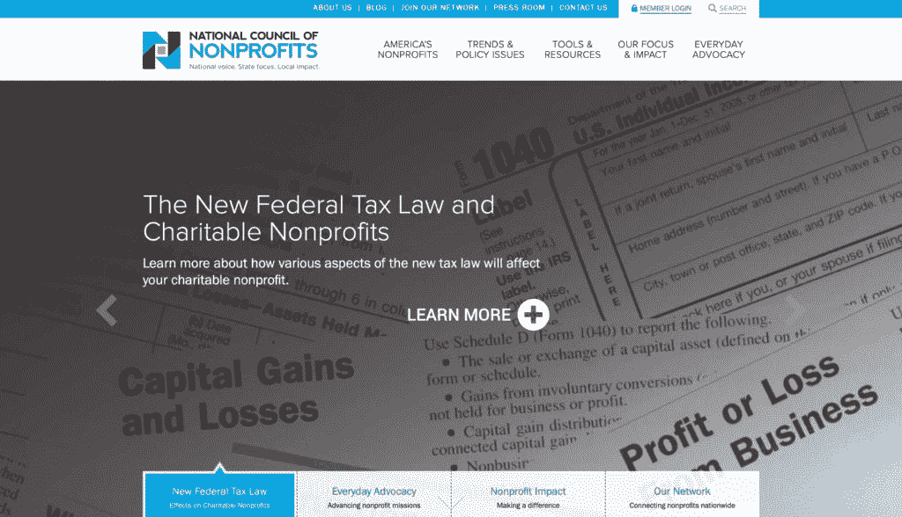

National Council of Nonprofits

非营利组织的目标因组织而异:有些是为了提供服务，有些是为了提高意识，还有一些是为了支持社区。

现代非营利组织使用各种工具来提升形象和提供服务，包括互联网和社交媒体，这就是为什么非营利组织拥有一个有效的网站如此重要。

让我们看看为什么 **WordPress 是非营利组织的完美平台**。

## 为什么非盈利网站要使用 WordPress？

作为世界上最受欢迎的内容管理系统，WordPress 占据了互联网 34%的份额，它是一个 T2 内容管理系统，你的非营利组织员工可能已经在个人网站、其他组织或雇主那里使用过。此外，互联网上有丰富的[资源](https://kinsta.com/resources/)可以帮助你和你的员工学习 WordPress。这可以最大限度地减少你花在培训上的时间。

### WordPress 对非营利组织的好处

让我们更详细地看看 WordPress 对非营利组织的一些具体好处。

#### 1.WordPress 免费

WordPress 软件是免费的，并将永远免费。如果你用 WordPress 创建一个网站，你只需要支付一些费用，比如你的托管计划和域名。你可以[安装插件](https://kinsta.com/best-wordpress-plugins/)为你的网站添加额外的功能和设计主题，所有这些都是免费的。

### 信息

Kinsta 为慈善机构的所有计划提供高达 15%的月循环折扣，你能想到的任何功能都可以在盈利机构、教堂和 501(c)(3)组织中使用。

或者，如果你有一些预算，有优质的主题和插件，可能会使你的网站更有效或节省你的时间。在这篇文章的后面，我会看看一些最好的免费主题和插件，这样你就可以衡量一下是否值得花钱。

#### 2.WordPress 是开源的

WordPress 使用一种叫做开源的软件开发模式。这意味着代码是公开的:任何人都可以下载、复制和修改它。没有任何限制，只要你不用它做任何非法的事情。

这意味着将来没有人可以拿走你网站的底层代码。这也意味着 WordPress 不太可能去任何地方:你不会发现自己必须切换到一个不同的平台。

#### 3.WordPress 有一个庞大的开发者和用户社区

作为一个开源项目，而且是一个庞大的项目，WordPress 拥有一个由世界各地数十万开发者组成的社区，以及数百万用户。

这个社区对 WordPress 和开源精神充满热情。有许多经验丰富的 WordPress 开发者在非营利网站上做志愿工作，你可能会找到以这种方式支持你的人。

### 非营利组织关于 WordPress 的神话

作为一个非盈利组织，你可能会对使用 WordPress 有一点警惕，因为[你已经听说它不安全](https://kinsta.com/blog/is-wordpress-secure/)，或者它不如其他系统专业或者更难使用。让我们来看看这些神话，这样你就可以区分事实和虚构。

#### WordPress 只是一个博客平台

诚然， [WordPress 最初是一个博客平台](https://kinsta.com/learn/wordpress-history/)。但从那时起，它经历了重大的发展，现在不仅是 T2 最好的博客平台，也是 T4 成熟的内容管理系统。

WordPress 是非常可定制和灵活的，允许你通过安装插件来添加几乎任何你能想到的功能。当然，这对博客来说很棒，但它肯定不再局限于此。想想 [WooCommerce](https://kinsta.com/blog/woocommerce-tutorial/) 就知道了。

#### WordPress 不安全

WordPress 在过去因易受攻击而声名狼藉。而且不可否认的是，因为它太大了，所以它是黑客很可能瞄准的平台。

但是 WordPress 并不比其他任何网站平台更不安全。它被大量组织使用，包括[政府部门](https://kinsta.com/blog/wordpress-site-examples/#the-white-house--whitehousegov)、[大型媒体机构](https://kinsta.com/blog/wordpress-site-examples/#the-new-york-times--nytcocom)和非营利组织(下面列出了其中一些)。如果他们习惯使用 WordPress，你没有理由不习惯。

你可以采取额外的措施使你的网站更加安全。如果你用 Kinsta 托管你的网站，你将享受到[额外的安全功能](https://kinsta.com/secure-wordpress-hosting/)和[恶意软件安全承诺](https://kinsta.com/knowledgebase/malware-security/)，这意味着如果你的 [WordPress 网站被黑了，](https://kinsta.com/blog/wordpress-hacked/)我们会为你修复它。

#### WordPress 不专业

人们有时认为 WordPress 不适合想要专业网站的人。这大概有三个原因:

*   它是免费的。
*   它最初是一个博客平台，现在仍被许多爱好博客的人使用。
*   它与 WordPress.com 相混淆，后者是针对博客作者和小企业的。

对于非营利组织来说，WordPress 是免费的这一事实是一个好处，而不是一个缺点(你的预算很紧张；不妨让它伸展得更远)。我们揭穿了 WordPress 是博客平台的神话。但是 WordPress.com 呢？

WordPress.com 是 WordPress 的一个版本，托管在 WordPress.com 的服务器上，功能有限。作为一个非营利组织，这不是你应该使用的平台。取而代之的是，给自己一个自托管的 WordPress 站点，它是你从托管提供商那里租用的托管空间上安装的。

自托管的 WordPress 给了你创建一个现代化的专业网站所需的灵活性，而且通常比 WordPress 便宜。

#### 你需要雇佣一个开发者来创建一个 WordPress 网站

这是一个仍然存在的神话。但事实是，你不需要雇佣一个开发者来为你的非营利组织创建一个专业的 WordPress 网站。

如果你真的决定[雇佣一个开发者](https://kinsta.com/blog/hire-wordpress-developer/)，那将会减轻你的一些工作量，并且使定制你的网站变得更容易。但是如果你没有足够的预算，有成千上万的免费主题和插件可以让你的网站看起来更棒，并增加你需要的功能。

在这篇文章的后面，我会列出一些非营利组织的最佳主题和插件，你会很高兴地知道其中许多都是免费的。这并不意味着它们的效率会降低。

## 使用 WordPress 的非营利组织

WordPress 已经被许多非营利组织使用。这里只是其中的几个。

### 简·古道尔研究所

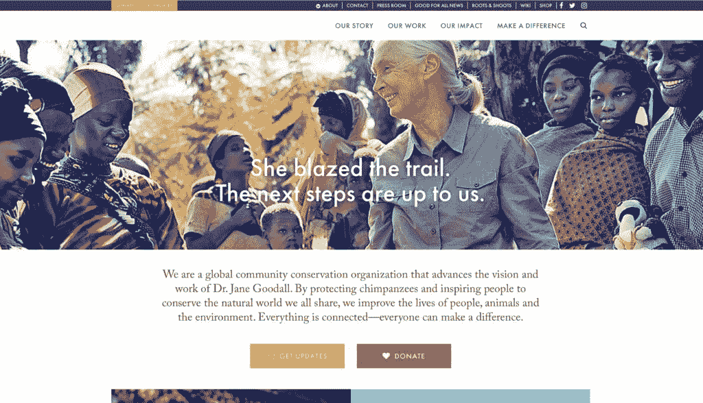

Jane Goodall Institute

珍·古道尔研究所致力于自然保护和环境保护，继续珍·古道尔在黑猩猩身上的工作。

他们的 WordPress 网站包括:

*   主页上的全幅横幅立即清楚地表明了该研究所的情况。
*   一个关于该研究所的信息和更多信息链接的静态主页。
*   主页和其他地方的时事通讯注册。
*   有新闻稿和新闻包的新闻区。
*   探索该研究所项目的交互式地图。
*   基于页面的结构，包含节和故事。
*   捐赠、会员和订阅页面。
*   清除每页上的行动号召按钮。
*   一个有趣的基于黑猩猩的 404 页面。

### 卢比肯团队

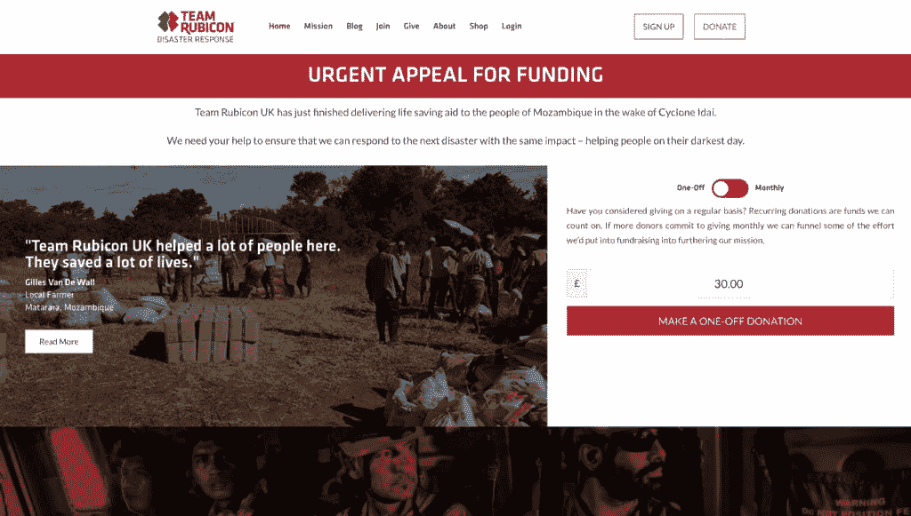

Team Rubicon

Rubicon 团队是一个全球性组织，在灾难发生后提供人道主义援助并支持退伍军人。

他们的 WordPress 网站包括:

*   一个博客。
*   捐款。
*   案例研究。
*   时事通讯注册

### 独立作者联盟

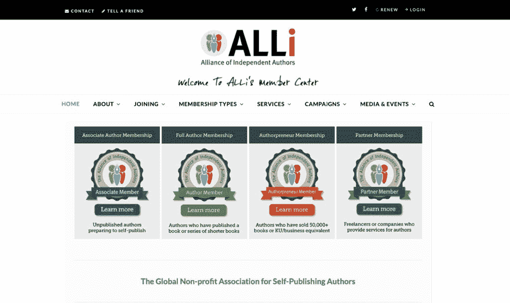

Alliance of Independent Authors

独立作者联盟是一个支持和倡导独立作者的非营利组织。它为自己的网站使用了一个定制的 WordPress 主题，并鼓励其成员为自己的网站使用 WordPress。

他们的 WordPress 网站包括:

*   会员贡献的博客。
*   提供服务和折扣的会员区。
*   注册、订阅和加入选项。
*   多媒体内容包括在线会议和播客(建议阅读:如何使用 WordPress 开始播客)。
*   成员目录。

### 国际治愈组织

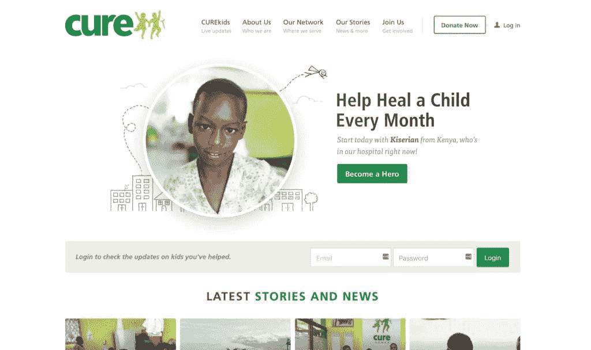

CURE International

国际治愈组织是一个为发展中国家的儿童提供医疗保健的基督教非营利组织。他们的 WordPress 网站包括:

*   一个静态的主页，有行动号召和大量的空白空间。
*   使用帖子更新其工作的新闻部分。
*   医院信息和个人儿童故事的自定义页面模板。
*   嵌入式视频。
*   具有登录权限的成员部分。

### 大捐赠

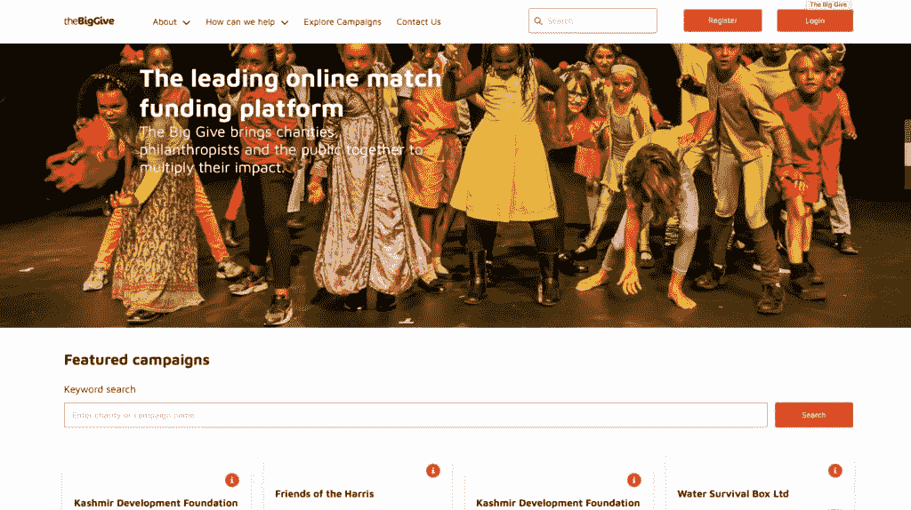

The Big Give

大捐赠为社区和慈善组织筹集资金。它旨在成为慈善筹款的中心，让人们更容易捐款。

他们的 WordPress 网站包括:

*   慈善注册。
*   慈善机构会员区。
*   竞选搜索。
*   捐款。

### 拯救非洲历史

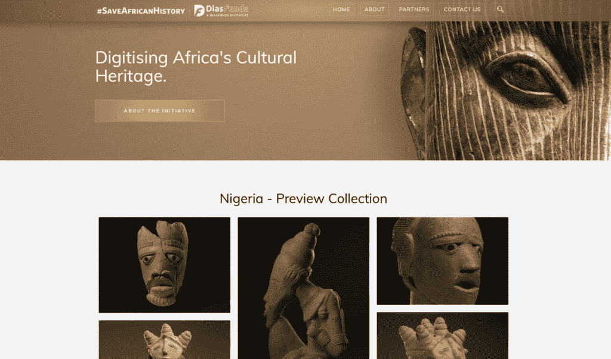

Save African History

[拯救非洲历史](https://saveafricanhistory.org/)是一项旨在记录和数字化非洲文物的计划，这样它们就不会消失在历史中。

该网站是基于图库的，在主页和存档页面上有大量图片。点击其中一个文物，你可以找到更多关于它和它的历史。

该网站的特点包括:

*   档案页面无限滚动。
*   单个工件的自定义布局。
*   一个视觉的，基于图像但干净的设计。
*   关于图像信用和使用的信息。
*   在页脚注册时事通讯。

### 宗教间住房联盟

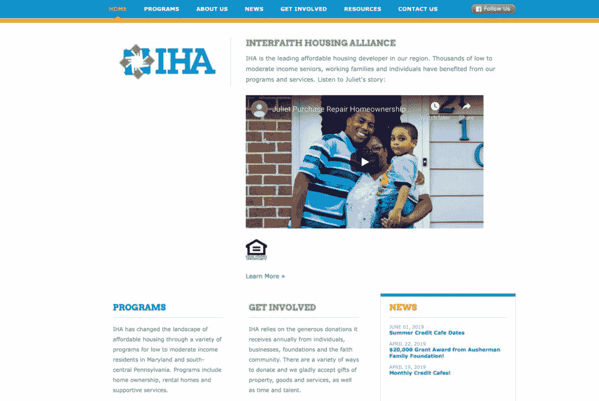

Interfaith Housing Alliance

宗教间住房联盟是一个非营利组织，在马里兰州和宾夕法尼亚州中南部提供经济适用房项目。

他们的 WordPress 网站包括:

*   一个主页，主要由来自网站其他地方的片段组成，链接到更多信息，包括最新新闻列表。
*   使用帖子进行更新的新闻部分。
*   在网站的每一页都有一个“捐赠”行动按钮，将访问者带到一个收集捐赠的外部平台(这个按钮在你可以捐赠之前会介绍一些步骤，这可能会让潜在的捐赠者感到不快)。
*   关于提供支持的其他组织的信息的资源部分。

### 受到威胁的人民

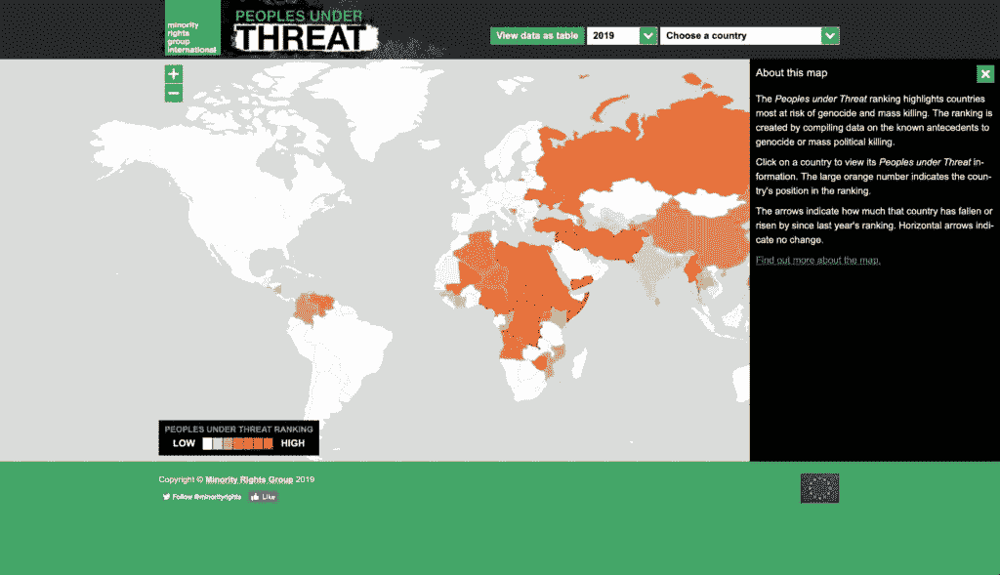

Peoples Under Threat

[受威胁的人们](https://peoplesunderthreat.org/)是一个为少数权利团体开发的单页网站。这是一个互动地图，旨在提供该组织年度“受到威胁的人民”报告的在线版本。

该网站提供了一张地图，其中突出显示了群体受到威胁的国家。点击这个国家，会出现一个弹出窗口，显示受威胁群体和受影响人数的数据。

### 对死亡的同情

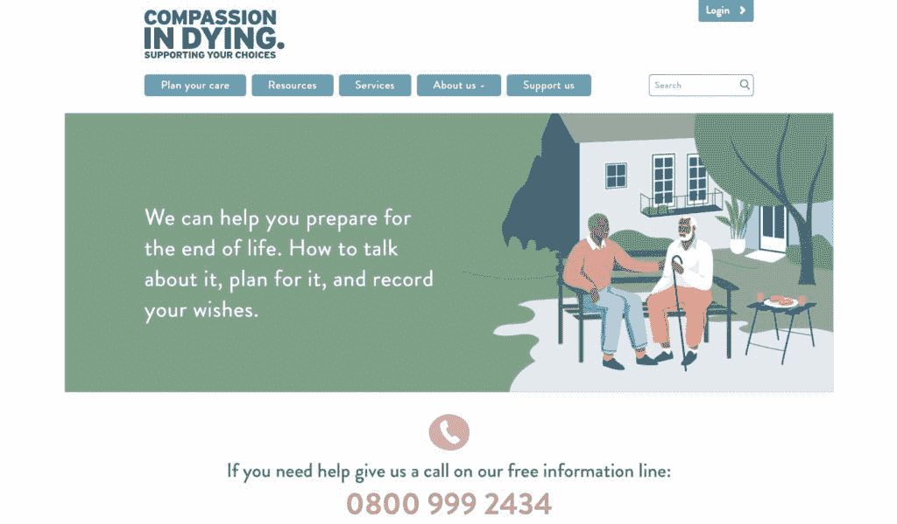

Compassion in Dying

死亡同情组织是一个非营利组织，帮助人们为死亡做准备，无论是在实践上还是情感上。

他们的 WordPress 网站包括:

*   网上生活将创造。
*   资源部分有组织的信息为死亡做准备。
*   通过给予来捐赠。
*   使用定制页面模板规划临终关怀的结构化指南。

## 非营利组织的 WordPress 主题

有很多为非营利组织设计的主题，有些是免费的，有些是收费的。

当选择一个主题时，不要太担心功能，因为你可以用插件来添加。相反，要看布局和定制选项的范围。可定制的主题将允许您添加自己的品牌、徽标等。此外，确保[主题是快速的](https://kinsta.com/blog/fastest-wordpress-theme/)，因为性能很重要！

这里有一些非营利组织可用的最好的主题综述。

### 非营利组织的 6 个最佳免费 WordPress 主题

免费主题的最大好处是免费，但可能比高级主题功能更少，支持速度更慢。如果你的需求是基本的，你的预算紧张，或者你刚刚开始，这可能是你最好的选择。

#### 1.NGO 慈善 Lite

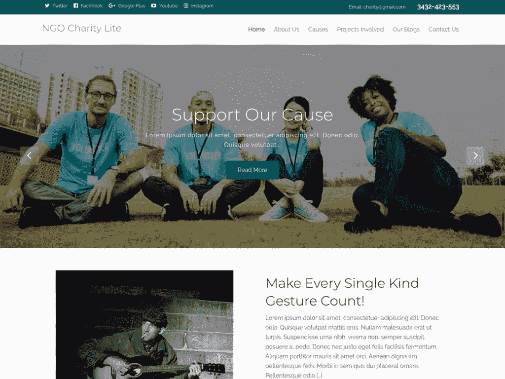

NGO charity lite theme

非政府组织慈善简装主题是为非盈利、众筹&筹款组织设计的。

功能包括:

*   定制选项:背景，颜色，标题，标志，菜单。
*   全宽模板以及带有侧边栏的模板。
*   网格布局。

#### 2.促进慈善事业

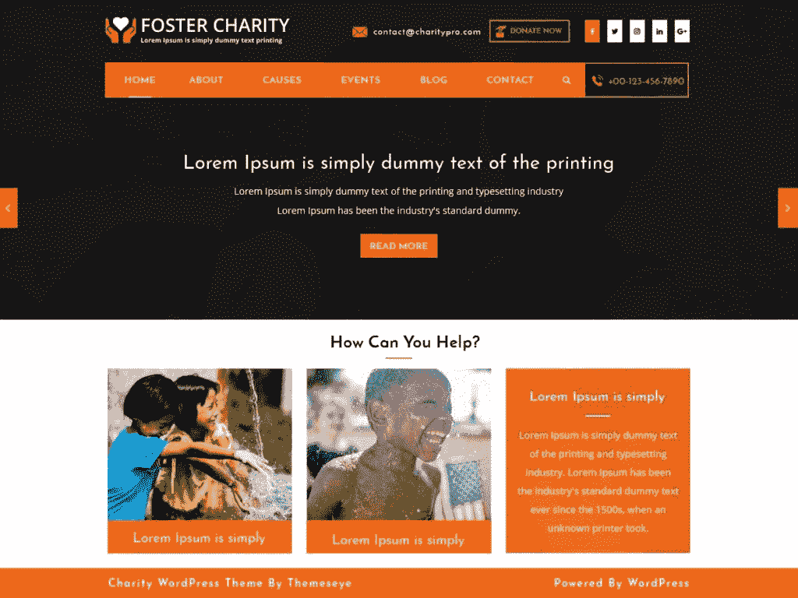

Foster charity theme

[Foster Charity](https://wordpress.org/themes/foster-charity/) 主题基于 Bootstrap 框架，包括行动号召、[滑块](https://kinsta.com/blog/wordpress-slider/)和一个可定制的布局。

## 注册订阅时事通讯

### 想知道我们是怎么让流量增长超过 1000%的吗？

加入 20，000 多名获得我们每周时事通讯和内部消息的人的行列吧！

[Subscribe Now](#newsletter)

功能包括:

*   定制:背景，颜色，标题，标志，菜单。
*   模板选项包括模板和网格布局。
*   [投资组合部分](https://kinsta.com/blog/wordpress-portfolio-plugins/)。
*   即将举办的活动部分。
*   滑块。
*   行动号召按钮。

#### 3.FinRelief

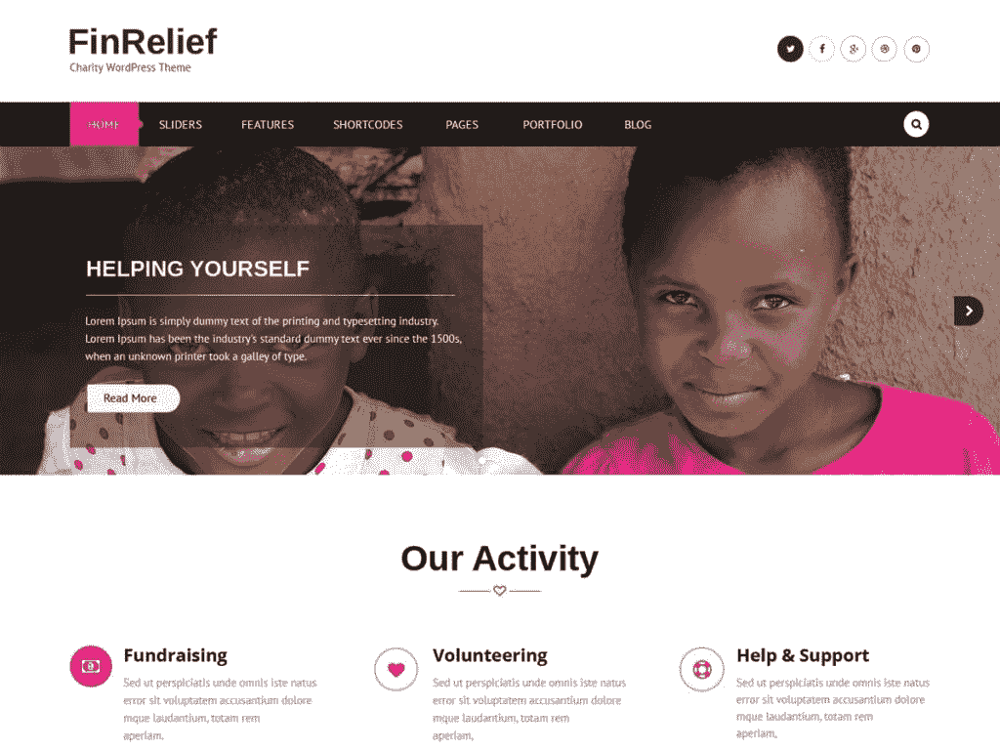

FinRelief theme

FinRelief 主题是为慈善机构和非营利组织设计的。它包括四个页脚小部件区域和主页定制。

功能包括:

*   定制:背景，页眉，徽标，菜单。
*   模板选项包括全幅模板和右侧栏。
*   主页区域突出你的活动。

#### 4.GivingPress Lite

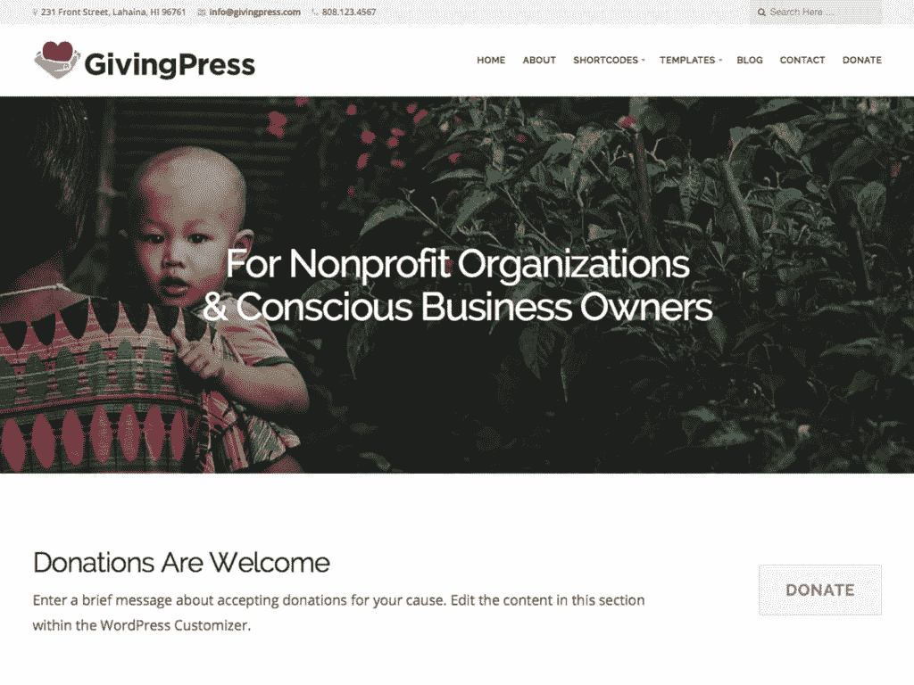

GivingPress Lite theme

GivingPress Lite 主题是高级主题的免费版本，因此如果您将来需要升级，您可以在不丢失工作的情况下进行升级。

功能包括:

*   定制:背景，页眉，徽标，菜单。
*   模板选项包括全幅模板，右侧栏，两个或三个栏。

#### 5.大众慈善 NGO

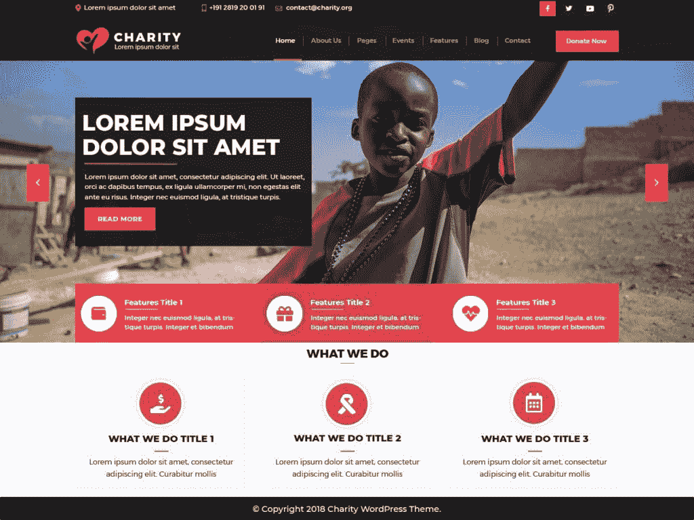

VW Charity NGO theme

大众慈善非政府组织主题旨在展示你的非营利组织的活动，用于筹款或博客。

功能包括:

*   定制:背景，颜色，标题，标志，菜单。
*   电子商务选项。
*   模板选项包括全幅模板、网格布局、右侧或左侧边栏。
*   投资组合部分。
*   推荐部分。

#### 6.仁慈的

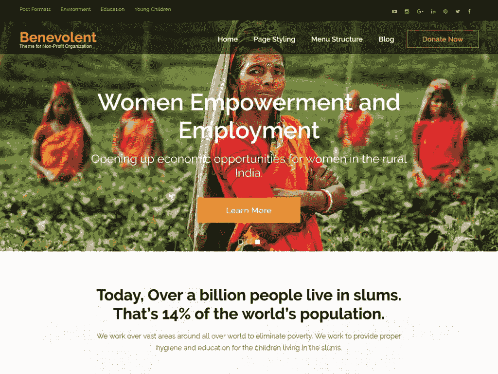

Benevolent theme

[慈善](https://wordpress.org/themes/benevolent/)主题是为非营利组织设计的，并针对 [SEO](https://kinsta.com/blog/what-does-seo-stand-for/) 进行了优化。

功能包括:

*   菜单中的调用操作按钮。
*   全宽滑块。
*   带有行动号召按钮的横幅。
*   客户部分。
*   [自定义小工具](https://kinsta.com/blog/wordpress-widgets/)。
*   多种布局。

### 非营利组织的 7 个最佳 WordPress 主题

如果你在寻找更多的功能和更直观的用户界面，以及更好的支持，你可能会决定花钱购买一个高级的 WordPress 主题。

你不必购买一个专门为非营利组织设计的主题:有时你会发现一个构建良好的通用主题会满足你的需求，并且有更多的灵活性。但是有很多专为非营利组织设计的高级 WordPress 主题你可能想看看:

#### 1.慈善基金会

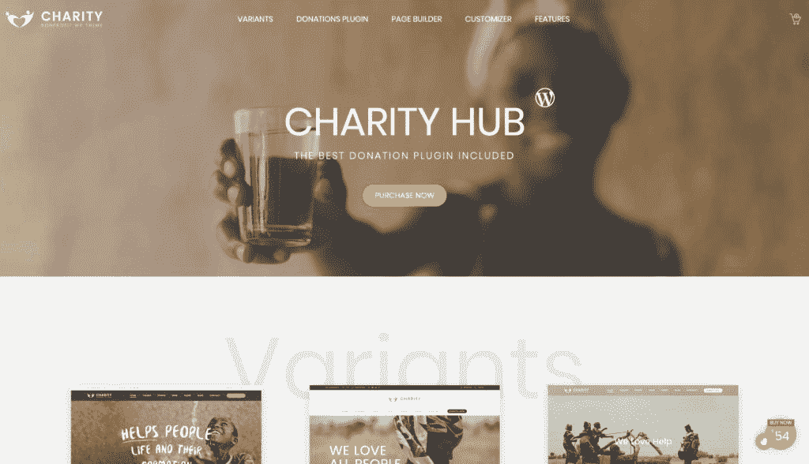

Charity Foundation theme

主题供应商 ThemeForest 的慈善基金会主题是为非营利组织设计的。

功能包括:

*   活动日历。
*   通过贝宝捐款。
*   “原因”自定义帖子类型。
*   有签到的捐助者区域。
*   可视化页面生成器。
*   一个滑块。

#### 2.行动

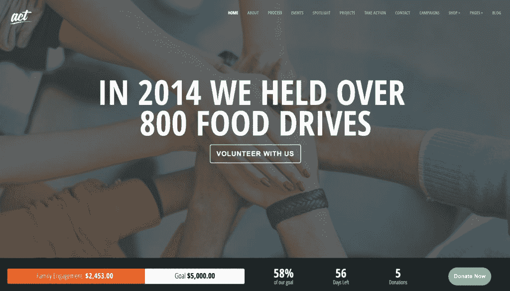

Act theme

同样来自 ThemeForest 的 [Act](https://themeforest.net/item/act-multipurpose-nonprofit-theme/10447911) 主题是为非营利组织设计的，包括一个滑块和可视化页面生成器。

功能包括:

*   可视化编辑器页面生成器。
*   一个滑块。
*   可定制的颜色和字体(与谷歌字体)。
*   一个主页号召捐款的功能。
*   图标库。
*   活动日历。
*   设计中的视差滚动。

#### 3\. Zeko

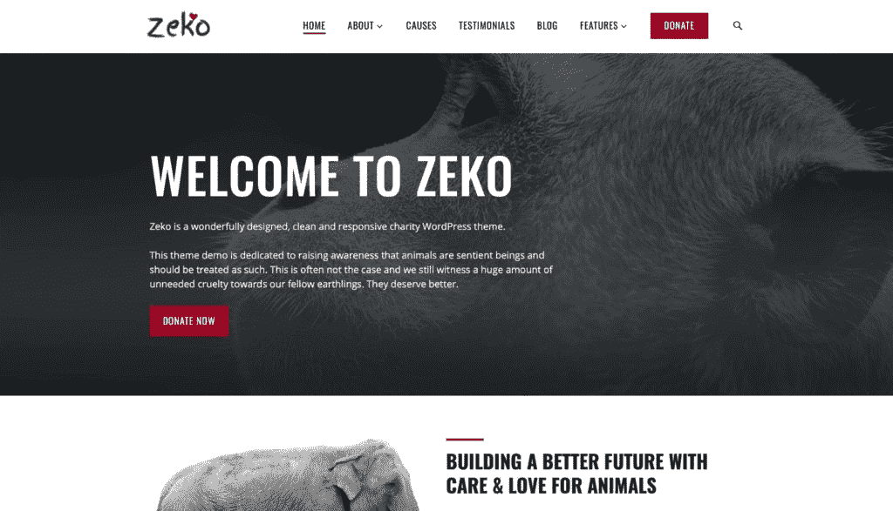

Zeko theme

Zeko 是 Anariel Design 的三个慈善主题之一。

厌倦了体验你的 WordPress 非营利网站的问题？我们提供世界一流的 WordPress 专家全天候支持，并为非营利组织提供每月 15%的折扣。[查看我们的计划](https://kinsta.com/plans/?in-article-cta)

功能包括:

*   捐赠内置。
*   为您的商店整合 WooCommerce。
*   订阅时事通讯。
*   社区特色。
*   基于面板的主页，便于定制。
*   为慈善机构和非营利组织设计的六页模板。
*   页面生成器支持。
*   多个小部件区域。

#### 4.从不施舍

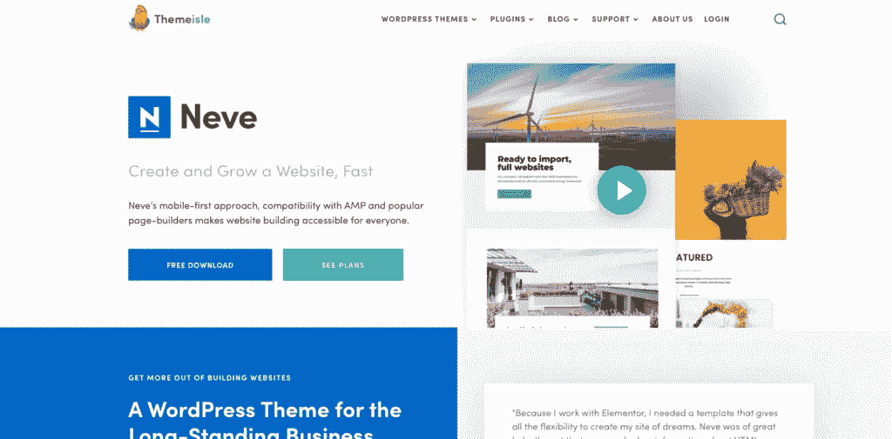

Neve Charity theme

Neve Charity 主题是专门为慈善机构设计的。它与 Elementor 页面生成器配合使用，旨在提高速度。

功能包括:

*   可自定义的页眉和页脚。
*   多种布局选项。
*   加速网站创建的入门库。
*   专为 WooCommerce 设计。
*   拖放博客布局生成器。

#### 5.麦莎

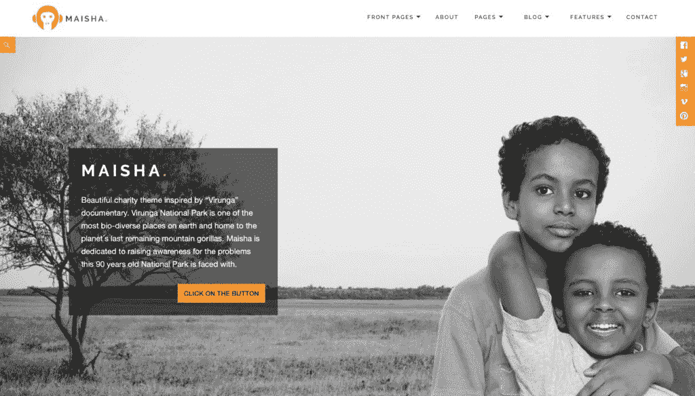

Maisha theme

麦莎是安娜瑞尔的另一个主题。它具有社交媒体图标和基于块的主页设计，您可以定制以突出关键内容。

功能包括:

*   著名的社交媒体图标。
*   基于面板的主页，便于定制。
*   捐赠功能。
*   WooCommerce 整合。
*   订阅时事通讯。
*   社区特色。
*   为慈善机构和非营利组织设计的七页模板。
*   页面生成器支持。
*   多个小部件区域。

#### 6.单独的

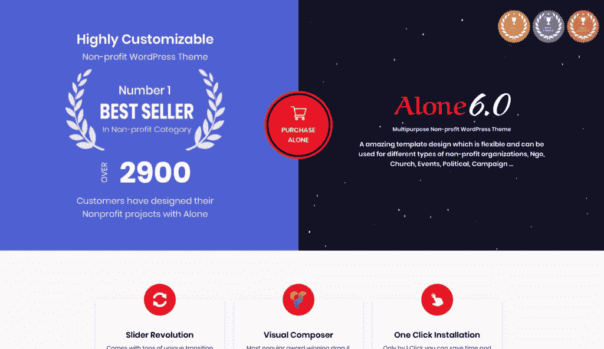

Alone theme

单独的主题是 ThemeForest 最畅销的慈善主题之一。它具有大胆的设计和可定制的内容区域。

功能包括:

*   9 个演示页面帮助你快速设计你的网站。
*   可视化编辑器拖放界面。
*   表格。
*   捐款，包括一个捐款弹出框。
*   基于网格的布局。
*   滑块。
*   可定制的颜色，字体和部件区域。

#### 7.希望

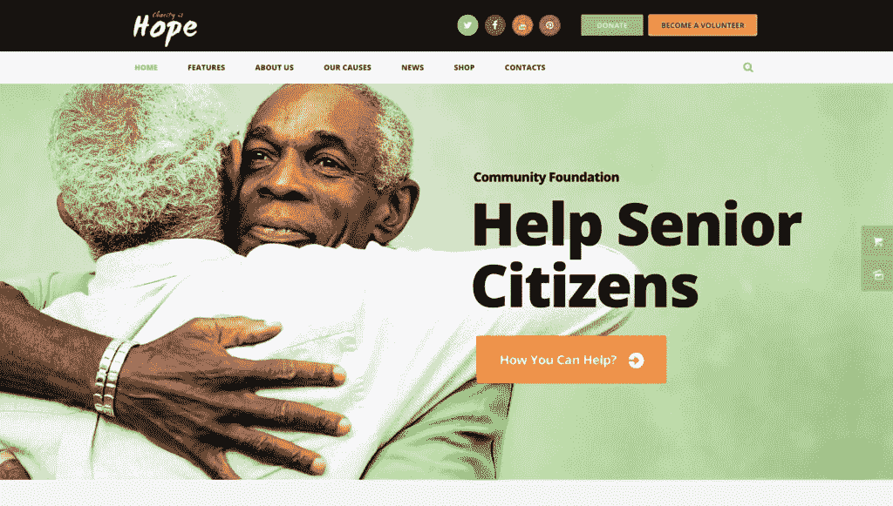

Hope theme

希望是一个来自 ThemeIsle 的非营利性慈善主题。

功能包括:

*   可定制的滑块。
*   可定制的颜色和字体。
*   捐款。
*   加速网站创建的预建演示。
*   拖放式可视页面生成器。
*   活动日历。

## WordPress 非营利网站的基本插件

一旦你建立了你的非营利网站并且安装了你的主题，是时候添加一些插件了。WordPress 开箱即用，但添加一些插件会给你带来更强大的功能。

非营利网站包括一个为非营利组织提供的免费主题和插件的综述，以及对非营利组织使用 WordPress 的建议，是一个有价值的信息来源。

这里有一些每个非营利 WordPress 网站都需要的基本插件。然后，我将继续关注那些添加了与非营利组织特别相关的特性的插件。

### 搜索引擎优化

Yoast [WordPress SEO](https://kinsta.com/blog/wordpress-seo/) 插件可以让你加强搜索引擎优化，增加你的网站被在谷歌和[其他搜索引擎上搜索的人找到的机会](https://kinsta.com/blog/alternative-search-engines/)。

你可能没有在做生意或者卖东西，但是如果人们找不到你的网站，你的网站将会失效，这就是为什么 T2 搜索引擎优化如此重要。

以下是一些提高非营利网站 SEO 的技巧:

*   [定期更新你网站的内容](https://kinsta.com/blog/evergreen-content/)。搜索引擎更喜欢不会停滞不前的网站。用新闻条目和博客文章向您的站点添加常规文章。这些将告诉人们你做什么，并为搜索引擎提供更多的内容。
*   在社交媒体上分享你所有的新内容，如[脸书、](https://kinsta.com/blog/how-to-create-a-facebook-page/)T2、LinkedIn 或 [Twitter](https://kinsta.com/blog/twitter-marketing/) 。有大量的插件,可以让你将你的 WordPress 站点连接到你的社交媒体账户，当你在站点上添加新的帖子时，可以自动向他们发帖。这将有助于让人们注意到你在做什么。
*   考虑人们在搜索什么，然后[写有针对性的内容](https://kinsta.com/blog/featured-snippets/)。当人们来到你的网站时，他们很可能会寻找一些主题的信息。[确保你写的内容旨在回答他们的问题](https://kinsta.com/blog/keyword-research/)。你可以将它添加到博客文章中，或者你可以在你的网站上创建一个充满信息页面的部分，类似于[金斯塔的知识库部分](https://kinsta.com/knowledgebase/)。
*   使用插件来优化你添加的所有内容的标题和描述。标题是谷歌在搜索结果中显示一个网站时显示的可点击链接。描述是下面的文字，它应该被设计成吸引人们点击进入。
*   使用[谷歌搜索控制台](https://kinsta.com/blog/google-search-console/)跟踪与你的网站相关的关键信息和问题。
*   使用网站地图和简洁的结构来提高你的可索引性，最终获得更好的点击率和谷歌网站链接。

### 备份

如果你的网站托管在 Kinsta 上，你不需要备份插件，因为所有 Kinsta 用户都有他们网站的每日自动备份。但是，如果你没有使用 Kinsta，一个[备份插件](https://kinsta.com/blog/wordpress-backup-plugins/)意味着你可以对你的网站进行定期快照，如果有问题，你可以恢复在问题出现之前备份的旧版本。

[UpdraftPlus](https://www.wordpress.org/plugins/updraftplus/) 插件是免费的，可以让你根据需要随时安排自动备份。这是一个好主意，尽可能频繁地备份你的网站内容。这意味着，如果你必须从上次备份中恢复网站，你不会丢失你最新的博客文章。

您可以使用 Dropbox 或 Google Drive 等云存储服务将备份存储在站点之外。在你开始向你的网站添加任何内容之前，确保你设置了自动备份，这样你就知道你总是有一个[备份来依靠](https://kinsta.com/blog/restore-wordpress-from-backup/)。

### 安全性

如果你和 Kinsta 在一起，你就不需要一个[安全插件](https://kinsta.com/blog/wordpress-security-plugins/)，因为 Kinsta 已经提供了顶级的安全特性。

但是如果你和另一个主机提供商在一起，你可能需要让你的 [WordPress 站点更加健壮](https://kinsta.com/blog/wordpress-security/)。WordFence 安全插件将帮助您强化您的网站，降低攻击风险。

你可以使用这个插件[建立一个防火墙](https://kinsta.com/blog/sucuri-firewall/)来使你的网站更加安全，并扫描你的网站是否有漏洞。如果有任何安全问题，插件会通知你。它还会告诉你什么时候你需要更新你的主题或插件，或者什么时候 WordPress 本身需要更新。保持你的软件更新将对[保持你的网站安全](https://kinsta.com/blog/wordpress-hacked/)大有帮助，因为旧的主题和插件可能会有漏洞，这些漏洞已经被后来的版本修复了。

### 表演

[性能](https://kinsta.com/blog/wordpress-performance-benchmarks/)之所以重要，有两个原因。首先，它会增强你的搜索引擎优化，因为谷歌更喜欢加载速度快的[网站。其次，这将减少](https://kinsta.com/learn/speed-up-wordpress/)[人们在完全浏览你的网站](https://kinsta.com/blog/how-to-reduce-bounce-rate/)之前离开的机会，因为一个缓慢加载的网站不会吸引人们逗留。

## 如何在你的非营利 WordPress 网站上创建一个社区

### 为社区参与添加 BuddyPress

BuddyPress 插件允许你创建一个社交媒体，在这里你的成员可以互相交流，计划活动或筹款。

您可以激活您需要的任何模块，这意味着您有一定程度的灵活性，不需要激活您不需要的模块。

### 添加成员插件

如果你不想在你的网站上有完整的社区参与，你可以使用一个[会员插件](https://kinsta.com/blog/wordpress-membership-plugins/)让人们在线加入你的组织并获得额外的资源和交流。

像 [WP-Members](https://www.wordpress.org/plugins/wp-members/) 这样的插件可以让你给你的网站添加不同等级的会员，这意味着你可以授权更高等级的会员访问额外的资源。你可以将会员资格与捐赠或订阅联系起来，激励人们成为你事业的固定捐赠者。

## 如何在你的 wordpress 非营利网站上筹集资金

你可以使用你的非营利 WordPress 网站通过两种方式中的一种或两种来赚钱:通过[在你的网站上增加一个商店](https://kinsta.com/blog/woocommerce-vs-shopify/)或者通过[通过你的网站接受捐款](https://kinsta.com/blog/wordpress-donation-plugins/)。

WooCommerce 是世界上最受欢迎的电子商务平台，上面列出的许多主题都是为了与它结合而设计的。大多数 [WordPress 主题将与 WooCommerce](https://kinsta.com/best-wordpress-themes/#woocommerce) 一起工作，并很好地展示你的商店。

你可以使用 WooCommerce 商店出售你支持的社区创造的商品或货物，并为你的非营利网站增加额外的收入来源。

你也可以在[中添加一个捐赠插件，在你的网站](https://kinsta.com/blog/stripe-donate-button/)中添加一个“捐赠”页面或[按钮，这是上面列出的大多数优质非营利主题中包含的内容。这应该设计得尽可能明显，这样人们就不会错过为你的事业捐款的机会。](https://kinsta.com/blog/paypal-donate-button-wordpress/)

像 [Give](https://wordpress.org/plugins/give/) 这样的插件将允许你通过连接到主要的支付网关在你的网站上接受捐款，使你更容易接受捐款。

该插件将允许您构建[自定义捐赠表格](https://kinsta.com/blog/wordpress-forms/)，因此您可以收集关于您的捐赠者的数据，将生成收据并衡量活动的绩效，帮助您制定捐赠战略。
需要[接受比特币捐赠](https://kinsta.com/blog/bitcoin-donate-button/)？你也可以这样做！

## 非营利组织的 WordPress Multisite

如果你正在为特定的活动运行 Multisite，或者你的组织由需要单独的网络存在的多个部门组成，WordPress Multisite 将使你的生活更加简单。你甚至可以使用一个父主题和[子主题](https://kinsta.com/blog/wordpress-child-theme/)来给你的网站相似(但不完全相同)的品牌，或者在其他网站上显示一个网站的内容。

WordPress Multisite 允许你在你的 WordPress 安装上创建一个网络，这意味着你可以创建你需要的任意多的站点，而不必多次安装 WordPress。这节省了存储空间，也节省了更新的时间，因为你只需要更新插件和主题一次。

使用 WordPress Multisite 并不意味着你的所有网站都必须使用相同的域名:你可以使用[域映射](https://kinsta.com/knowledgebase/wordpress-multisite-domain-mapping/)来告诉每个网站，就像它托管在一个单独的域上一样。或者，如果你愿意，你可以使用主站点的[子域](https://kinsta.com/blog/wordpress-subdomain/#how)或子目录。子域上的站点是 newsite . main site . com，其中“new site”是微型站点，“mainsitecom”是您的主站点。一个子目录下的网站将在 mainsite.com/newsite.

## 非营利组织的 WordPress CRM

WordPress 是管理非营利组织的捐赠者、支持者和成员的有用工具，一些建立在 WordPress 上的非营利网站包括成员和支持者区域。

为了帮助你做到这一点，你可以在你的非营利 WordPress 网站上安装一个 CRM 插件,用它来管理关系，让人们了解你的最新活动。

对非营利组织特别有用的 CRM 和社区插件包括:

*   巴德普雷斯。使用 BuddyPress 在你的网站上创建一个社区，并为你的支持者或活动家提供一个类似社交媒体的界面。BuddyPress 将允许用户添加活动、群组等，并启用私人消息，这样您就可以管理活动和建立网络。
*   Zero BS CRM 为您提供了一个灵活的 CRM 系统，您可以对其进行定制，以创建符合您需求的 CRM。它由经验丰富的 WordPress 开发者构建，并定期更新。
*   是专门为非营利组织设计的 WordPress CRM。它可以让你管理会员数据，发送有针对性的通信，并接受付款。

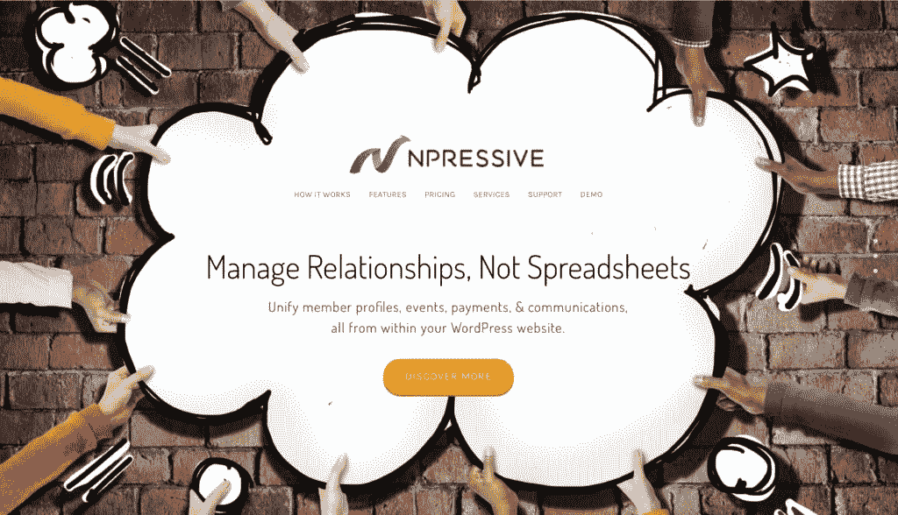

NPressive CRM

非营利网站向非营利组织推荐 CRM 的方法，并定期更新对非营利组织最有用的插件列表。

[Running a WordPress nonprofit site? Check out our list of the best 13 themes (free + paid) and what plugins you'll need to create a vibrant community! 🙌✌️Click to Tweet](https://twitter.com/intent/tweet?url=https%3A%2F%2Fbit.ly%2F2YZQ93b&via=kinsta&text=Running+a+WordPress+nonprofit+site%3F+Check+out+our+list+of+the+best+13+themes+%28free+%2B+paid%29+and+what+plugins+you%27ll+need+to+create+a+vibrant+community%21+%F0%9F%99%8C%E2%9C%8C%EF%B8%8F&hashtags=nonprofit%2CWordPress)

## 摘要

WordPress 是非营利组织的绝佳工具。它可以免费下载和使用，它有一个令人敬畏的用户和开发者社区，以及广泛的主题和插件，非常适合非营利组织，包括免费和付费的。

许多非营利组织已经在使用 WordPress 建立一个专业的、吸引人的网站，帮助他们传播信息，联系捐赠者和会员。通过使用上面的一个主题和一些插件，你可以用相对较少的成本为你的非营利组织创建一个 WordPress 网站( [Kinsta 为非营利组织、慈善机构、教堂和 501(c)(3)组织提供 15%的折扣](https://kinsta.com/web-hosting-for-nonprofits/))。

* * *

让你所有的[应用程序](https://kinsta.com/application-hosting/)、[数据库](https://kinsta.com/database-hosting/)和 [WordPress 网站](https://kinsta.com/wordpress-hosting/)在线并在一个屋檐下。我们功能丰富的高性能云平台包括:

*   在 MyKinsta 仪表盘中轻松设置和管理
*   24/7 专家支持
*   最好的谷歌云平台硬件和网络，由 Kubernetes 提供最大的可扩展性
*   面向速度和安全性的企业级 Cloudflare 集成
*   全球受众覆盖全球多达 35 个数据中心和 275 多个 pop

在第一个月使用托管的[应用程序或托管](https://kinsta.com/application-hosting/)的[数据库，您可以享受 20 美元的优惠，亲自测试一下。探索我们的](https://kinsta.com/database-hosting/)[计划](https://kinsta.com/plans/)或[与销售人员交谈](https://kinsta.com/contact-us/)以找到最适合您的方式。