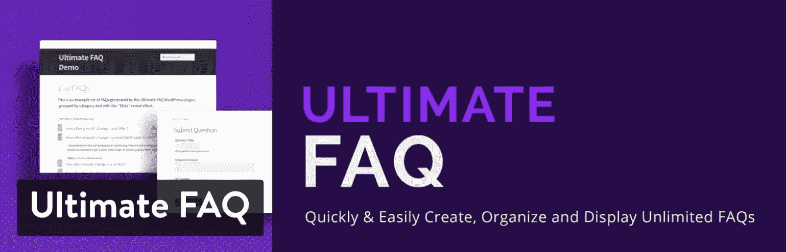
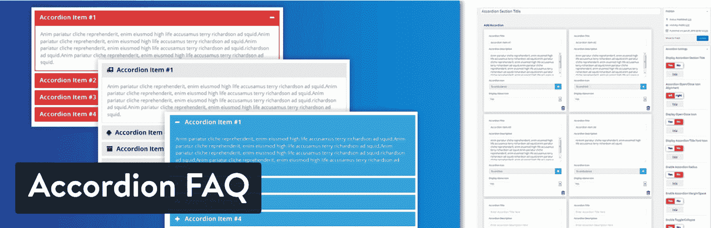
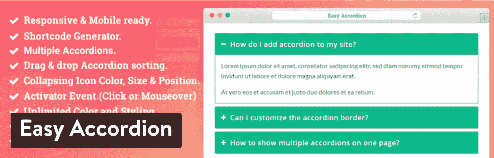
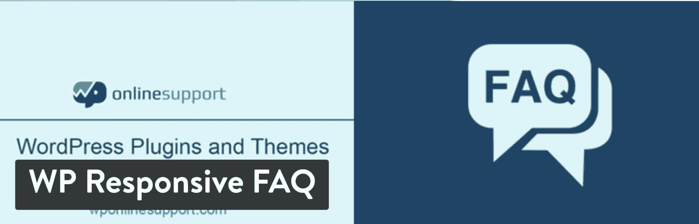
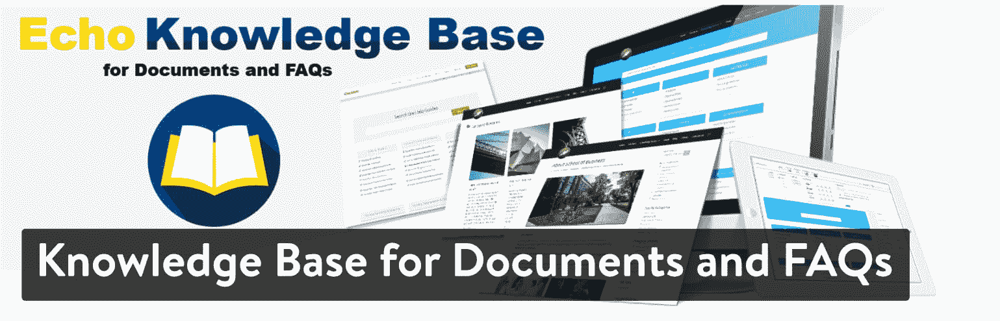
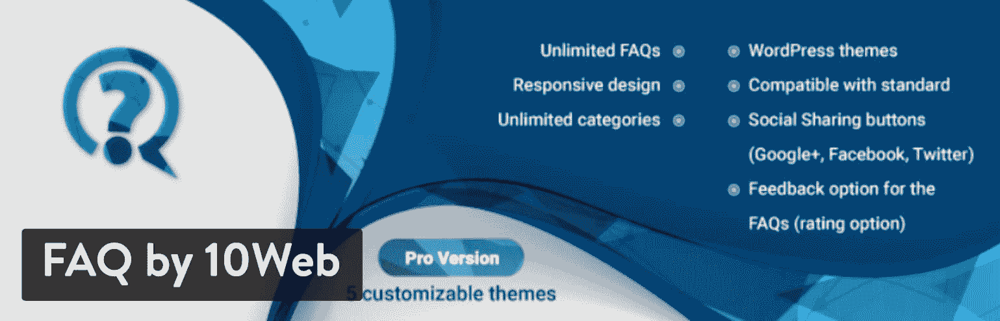
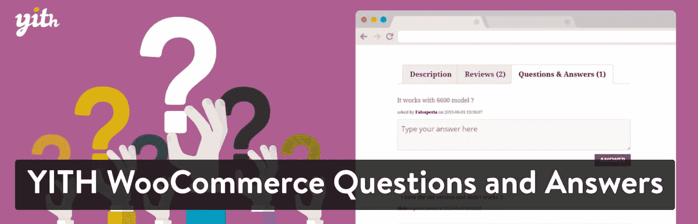
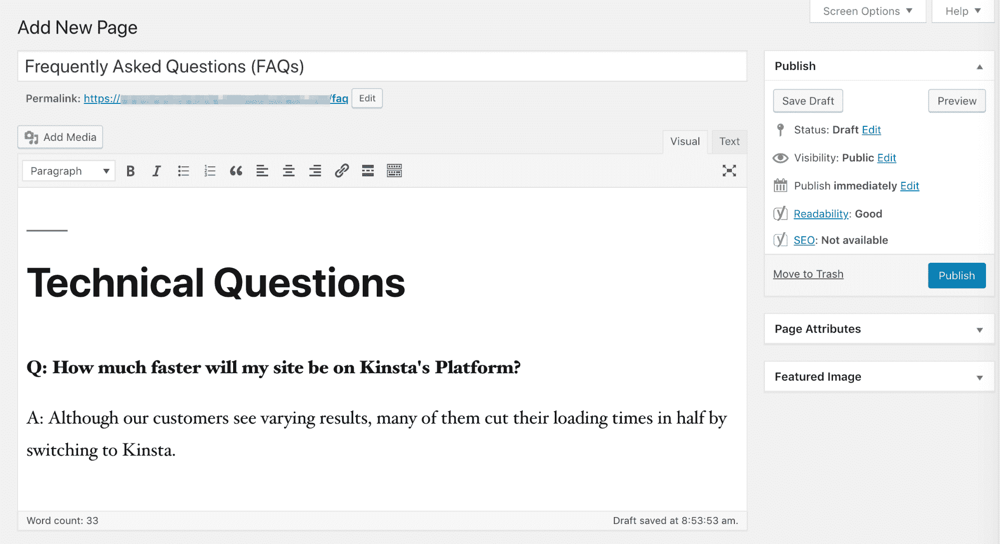
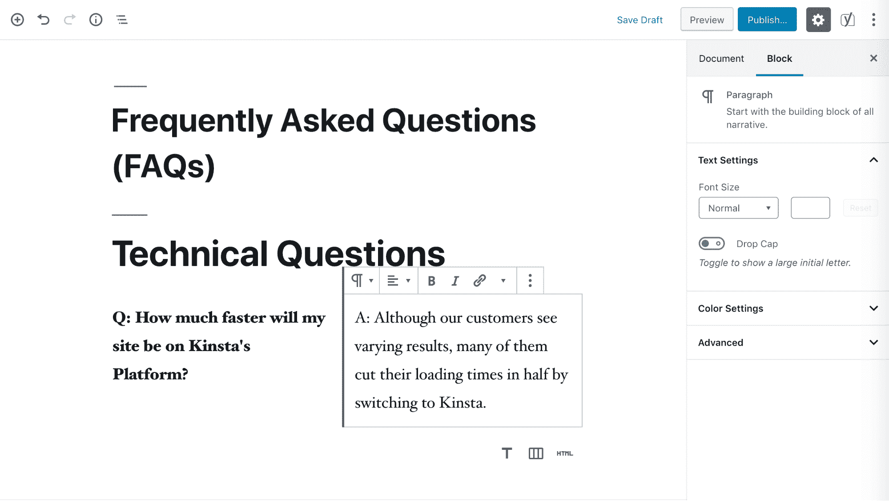

# 10 个最好的 WordPress FAQ 插件(如何手动创建 FAQ 部分)

> 原文：<https://kinsta.com/blog/wordpress-faq-plugins/>

提供高质量的客户支持是保持业务成功的关键。然而，处理查询会变得耗时且重复。这就是 WordPress FAQ 插件出现的地方。

为了最大限度地减少重复回答相同问题的时间，您可能需要在网站上添加一个常见问题(FAQ)部分。虽然你总是可以手工创建一个，使用插件可以简化过程，并融入先进的风格。

在这篇文章中，我们将深入探讨在你的 WordPress 网站上包含一个 FAQ 页面的好处。然后我们将分享一些市场上最好的 WordPress FAQ 插件，并讨论如何在没有任何额外工具的情况下创建 FAQ 部分。我们开始吧！

## 为什么你的网站需要一个 FAQ 页面

不可否认客户支持的重要性。当使用你的产品或服务的人遇到问题时，帮助他们有助于提高你的企业的声誉，并增加它继续成功的机会。

此外，如果你的客户对你的业务有良好的体验，你就更有可能成功留住他们。由于招募新客户的成本是保持现有客户成本的六到七倍(T2)，这对稳定你的收入大有帮助。

快乐的顾客也更有可能向朋友和家人推荐你的公司。这是一个免费宣传你的品牌的绝好机会。你的客户可以成为你最大的拥护者，只要他们继续对你的业务有积极的体验。

尽管如此，管理支持请求并不总是容易的。尤其是如果你刚刚起步或者你的公司还很小，很难找到时间来回答问题。对许多企业主来说，建立一个 24/7 的客户支持是非常困难和耗费资源的。

这就是为什么主动提供答案是明智的，这样客户就不必联系你了。

您的网站上提供了常见问题的答案，这确保了无论客户身在何处，何时使用您的产品或服务，他们都能够自行解决基本问题。这样，你可以不费吹灰之力迅速减轻他们的挫败感。

## 10 个最好的 WordPress FAQ 插件

对于 WordPress 用户来说，使用插件在他们的网站上添加 FAQ 部分是相当容易的。有几种可供选择:

1.  [终极常见问题解答](#ultimate-FAQ)
2.  [手风琴常见问题解答](#accordion-FAQ)
3.  [简易手风琴](#easy-accordion)
4.  [WP 响应常见问题解答](#wp-responsive-FAQ)
5.  [文档和常见问题知识库](#knowledge)
6.  [HTML5 响应常见问题解答](#html5-responsive-FAQ)
7.  [10 网常见问题解答](#FAQ-by-10Web)
8.  [蜘蛛常见问题解答](#spider-FAQ)
9.  [快速简单的常见问题解答](#quick)
10.  [YITH WooCommerce 问答](#yith)

让我们仔细看看！

### 1.终极常见问题

Ultimate FAQ plugin

顾名思义，[终极常见问题解答](https://wordpress.org/plugins/ultimate-faqs/)插件在常见问题解答方面力求做到一切。通过 WooCommerce 集成和 Block Editor 优化，Ultimate FAQ 非常灵活，可以适应几乎任何网站和用户能力水平。

一些关键特性包括:

*   三个常见问题相关模块
*   WooCommerce 产品页面的 FAQ 标签
*   常见问题类别和标签
*   [自定义 CSS 样式选项](https://kinsta.com/blog/wordpress-css/)

你可以从插件目录中免费下载终极常见问题，或者购买插件的高级版本。许可证起价为每年 30 美元，您将获得高级样式选项和功能。
T3】

### 2\. Accordion FAQ

Accordion FAQ plugin

FAQ 页面的困难之一是它们会很快变得又长又乱。可折叠的、手风琴式的布局是解决这个问题的一种流行的方法，因为它们使用户不必过度滚动。

[Accordion FAQ](https://wordpress.org/plugins/responsive-accordion-and-collapse/) 让实现这一功能变得简单。使用此插件，您可以:

*   创建多个常见问题解答
*   用简码合并常见问题列表
*   使用各种颜色选择定制您的手风琴
*   访问和添加字体真棒图标
*   使用拖放构建器组织您的问题

如果你预算紧张，这也是一个明智的选择。你可以免费下载 Accordion FAQ 或者使用 [Accordion Pro](https://wpshopmart.com/plugins/accordion-pro/) 访问动画、 [Google 字体](https://kinsta.com/blog/best-google-fonts/)和其他高级效果。这个高级插件非常便宜，6 个月的许可证只需 9 美元，在无限制的网站上终身使用只需 27 美元。

### 3.简易手风琴

Easy Accordion plugin

考虑到 FAQ 页面使用折叠式布局的优势，有多个插件专门帮助您整合这一特性就不足为奇了。 [Easy Accordion](https://wordpress.org/plugins/easy-accordion-free/) 与 Accordion FAQ 非常相似，提供类似的拖放构建体验和[响应式设计](https://kinsta.com/blog/web-design-best-practices/#mobile-responsiveness)。

然而，Easy Accordion 也为您的 FAQ 样式提供了独特的主题。你可以在免费版本中访问一个主题，或者你可以升级到 [Easy Accordion Pro](https://shapedplugin.com/plugin/easy-accordion-pro/) 以获得 16 个高级主题选项。这一层提供了更广泛的造型选择，起价 29 美元。

### 4.WP 响应常见问题

WP Responsive FAQ plugin

随着移动互联网使用的增加，响应能力在这些日子里是必须的。 [WP 响应式常见问题](https://wordpress.org/plugins/sp-faq/)通过其可折叠的常见问题设计将该功能列为优先选项。此外，其独特的短码系统使您能够在最佳位置显示正确的问题。

其他功能包括:

*   像创建 WordPress 帖子一样创建个人常见问题的能力
*   用于定制显示的短代码参数
*   用于组织和显示常见问题的类别
*   WooCommerce 产品常见问题解答(仅限高级版)

除了改进的 WooCommerce 集成，[这个插件的高级版本](https://www.wponlinesupport.com/wp-plugin/sp-responsive-wp-faq-with-category-plugin/)包括 15 个额外的短码参数，在定制方面更加灵活。您可以购买每年 69 美元起的许可证。
T3】

### 5.文档和常见问题知识库

Knowledge Base FAQs plugin

选择一个 WordPress FAQ 插件可能特别困难，因为它们中的许多是如此相似。关于[文档和常见问题知识库](https://wordpress.org/plugins/echo-knowledge-base/)的一个好处是它带来了一些不同的东西。这个插件不是仅仅创建一个手风琴式的 FAQ 列表，而是构建你的站点和整个知识库。

这意味着您可以:

## 注册订阅时事通讯

### 想知道我们是怎么让流量增长超过 1000%的吗？

加入 20，000 多名获得我们每周时事通讯和内部消息的人的行列吧！

[Subscribe Now](#newsletter)

*   整合可下载文档以共享用户指南和其他信息
*   让用户能够搜索您的文档和常见问题，找到他们需要的内容
*   使用预先构建的主题来设计您的知识库

如果一个简单的 FAQ 页面不能解决问题，或者你想为你的产品提供详细的手册，这个插件可能比列表中的其他插件更有效。插件本身是免费的，但是有几个[高级附加组件](https://www.echoknowledgebase.com/wordpress-add-ons/)可以用来扩展它。价格从每年 15 美元到 80 美元不等。

### 6.HTML5 响应常见问题

HTML5 Responsive FAQ plugin

在你的网站上添加一个 FAQ 部分时，你最不想看到的就是它像一个疼痛的拇指一样突出。如果你想让你的网站看起来更专业，将这个特性与你当前的主题和风格相结合是必须的。

[HTML5 响应式常见问题解答](https://wordpress.org/plugins/html5-responsive-faq/)提供了有助于解决这一问题的功能，包括:

*   轻松定制颜色、字体大小等，以匹配您的主题
*   自定义排序选项，让用户能够控制
*   常见问题类别和个性化类别标题
*   在你喜欢的任何地方合并常见问题的简码
*   用于整洁页面的手风琴样式

这个插件完全免费使用，没有高级版本。

### 7.10Web 常见问题解答

FAQ by 10Web plugin

提供自助式客户支持的缺点是，可能更难确定您的回答是否有效。我们列表中的下一个插件，[10 web](https://wordpress.org/plugins/faq-wd/)的 FAQ，提供了一些可以帮助解决这个问题的关键特性。

您可以:

*   在每个问题的末尾加入一个反馈行动要求(CTA ),这样用户可以对它的有用性进行评分
*   提供一个评论区，这样用户可以对你的问题和答案做出回应
*   启用社交共享，让访问者传播你的内容，为你的网站吸引更多的流量
*   还可以访问所有 FAQ 插件基础，包括折叠样式、移动响应、拖放重新排序、类别和搜索功能

你可以通过插件的免费版本获得所有这些。如果您选择升级到[高级许可](https://web-dorado.com/products/wordpress-faq-wd.html)，您将能够通过主题系统获得额外的支持和定制选项。六个月的许可证起价为 20 美元。

### 8.蜘蛛常见问题

Spider FAQ plugin

有时候，谈到 WordPress 插件，越简单越好。 [Spider FAQ](https://wordpress.org/plugins/spider-faq/) 关注任何问答页面最重要的功能，包括类别、搜索功能和可折叠部分，以节省空间和改善组织。

厌倦了低于 1 级的 WordPress 托管支持而没有答案？试试我们世界一流的支持团队！[查看我们的计划](https://kinsta.com/plans/?in-article-cta)

这个插件的独特之处包括收集用户反馈的“喜欢/不喜欢”按钮和一个广泛的主题系统。为了访问内置主题，你需要一个[高级许可](https://web-dorado.com/products/wordpress-faq-plugin.html)。六个月起价 20 美元。

### 9.快速简单的常见问题

Quick and Easy FAQs plugin

[快速简单的常见问题解答](https://wordpress.org/plugins/quick-and-easy-faqs/)展示了一个熟悉的自定义帖子类型和短代码系统，您可以使用它来添加和显示您的问题和答案。像我们探索的许多其他插件一样，它提供了一个可过滤的、可折叠的显示。

另外，有了这个插件就不用担心倾家荡产了。没有高级版本可用。

### 10.YITH WooCommerce 问答

YITH WooCommerce Questions and Answers plugin

WooCommerce 的店主们对于在他们的网站上添加 FAQ 有着特殊的需求。例如，能够添加关于特定项目的问题和答案，并在产品页面上轻松显示常见问题，这很重要。

我们已经看到了一些不同的插件可以完成这些任务，但是 [YITH WooCommerce 问答](https://wordpress.org/plugins/yith-woocommerce-questions-and-answers/)更进了一步。使用该插件，您可以:

*   使用户能够就单个项目提问和回答问题
*   在前端显示用户的问题和答案，这样潜在的买家可以阅读反馈
*   将问题创建限制在您网站的后端，这样只有授权用户才能编辑它们

这样，您可以保持对常见问题的控制，同时也让您的客户更多地参与进来。你将节省回答问题的时间，因为其他有经验的用户可以插话。此外，来自你的问题和答案的反馈可能类似于产品评论，并说服潜在买家继续购买。

有了这个插件的高级版本，你还可以让用户投票决定答案，要求他们登录或提交他们的电子邮件地址来回答，设置电子邮件通知，等等。许可证每年起价 69.99 美元。

## 如何在没有插件的情况下给你的 WordPress 站点添加一个 FAQ 部分

虽然插件可以提供许多便利的特性，但有时构建 FAQ 页面最简单的方法是手工操作。这个方法有几个优点和缺点。

主要的好处是你不必担心你的 FAQ 部分与你当前的主题不协调。FAQ 将简单地继承您站点的样式，就像任何其他页面一样。然而，除非你对自己的编码能力有信心，否则你也可能会错过一些选项，比如折叠布局和动画。

如果你想让事情变得简单，并认为手工创建你的页面是你的路线，你所要做的就是在你的 WordPress 仪表盘中导航到*页面>添加新的*。然后，您可以输入并格式化您的所有问题和答案，就像您向任何其他帖子或页面添加内容一样:

WordPress editor

然而，*有可能*使用[块编辑器](https://kinsta.com/blog/gutenberg-wordpress-editor/)来改进这个过程。有几个模块可以帮助您实现令人印象深刻的布局，包括*列*模块:

Block editor

你也可以考虑使用*引用*、*表格*或*媒体&文本*块，以实现一个专业且可读的 FAQ 页面。

[FAQ sections are a great way to scale customer support requests. Learn how to create one for your #WordPress site with and without a plugin! 💬👨‍⚕️Click to Tweet](https://twitter.com/intent/tweet?url=https%3A%2F%2Fkinsta.com%2Fblog%2Fwordpress-faq-plugins%2F&via=kinsta&text=FAQ+sections+are+a+great+way+to+scale+customer+support+requests.+Learn+how+to+create+one+for+your+%23WordPress+site+with+and+without+a+plugin%21+%F0%9F%92%AC%F0%9F%91%A8%E2%80%8D%E2%9A%95%EF%B8%8F&hashtags=faq%2Cwpplugins)

## 摘要

虽然向客户提供支持是留住他们甚至增加收入的明智之举，但你可能不想花一整天来回答问题。在你的 WordPress 网站上建立一个 FAQ 区(或者更好的是一个资源中心)可以帮助你的客户解决他们自己的问题。

WordPress FAQ 插件可以让以这种方式支持你的客户变得更加简单。除了许多工具可以帮助您建立一个基本的可折叠 FAQ 部分，您还可以将手册和其他文档与[文档和 FAQ 知识库](#knowledge)结合起来，或者通过 [YITH WooCommerce 问答](#yith)吸引您商店的顾客。

请务必查看我们策划的[最佳 WordPress 调查插件](https://kinsta.com/blog/wordpress-survey-plugins/)列表。

关于设置你的 WordPress FAQ 页面，你有什么问题吗？请在下面的评论区告诉我们！

* * *

让你所有的[应用程序](https://kinsta.com/application-hosting/)、[数据库](https://kinsta.com/database-hosting/)和 [WordPress 网站](https://kinsta.com/wordpress-hosting/)在线并在一个屋檐下。我们功能丰富的高性能云平台包括:

*   在 MyKinsta 仪表盘中轻松设置和管理
*   24/7 专家支持
*   最好的谷歌云平台硬件和网络，由 Kubernetes 提供最大的可扩展性
*   面向速度和安全性的企业级 Cloudflare 集成
*   全球受众覆盖全球多达 35 个数据中心和 275 多个 pop

在第一个月使用托管的[应用程序或托管](https://kinsta.com/application-hosting/)的[数据库，您可以享受 20 美元的优惠，亲自测试一下。探索我们的](https://kinsta.com/database-hosting/)[计划](https://kinsta.com/plans/)或[与销售人员交谈](https://kinsta.com/contact-us/)以找到最适合您的方式。