# 二十二十:新的默认 WordPress 主题介绍

> 原文：<https://kinsta.com/blog/twenty-twenty-theme/>

220 是 WordPress 5.3 最新版本的[的新默认主题](https://kinsta.com/blog/wordpress-5-3/)。像它的前身[二十十九](https://kinsta.com/blog/twenty-nineteen-theme/)一样，二十二十被设计成特别关注[古腾堡](https://kinsta.com/blog/gutenberg-wordpress-editor/)。不过，这两者之间有一个很大的区别:220 不是从头开始建造的；相反，它是基于 WordPress 社区的现有主题设计的。

由于我们热爱 WordPress 的一切，我们仔细研究了新的 Twenty Twenty 主题，查看了 function.php 文件、样式表和模板。

即使 Twenty Twenty 还远未稳定——在我写这篇文章的时候——许多问题还没有解决，今天我们将与你分享我们对新的默认 WordPress 主题的最初想法。

让我们深入到 Twenty Twenty WordPress 主题！

 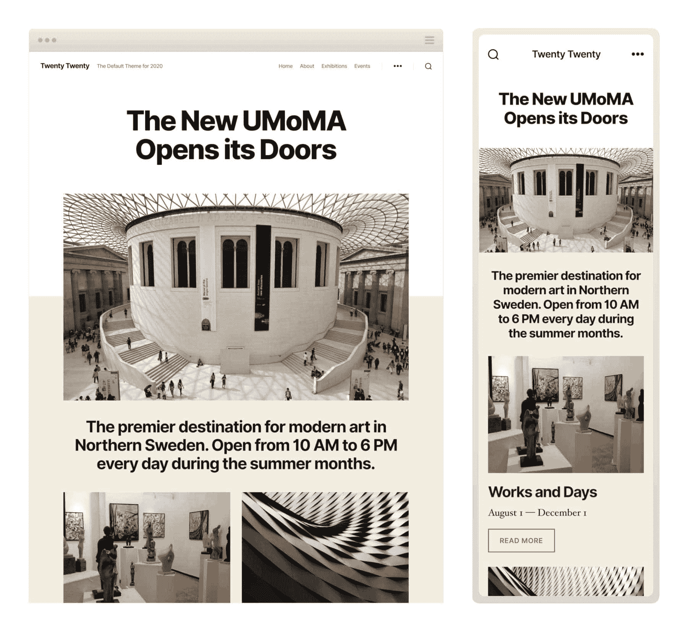

二十二十 WordPress 主题预览(图片来源:[制作 WordPress 核心](https://make.wordpress.org/core/2019/09/06/introducing-twenty-twenty/) )


## 快速介绍 2220 主题

Twenty Twenty 建立在 Chaplin T1 的基础上，这是一个免费的 WordPress 主题，由 T2 的 Anders norén T3 设计，他也是 WordPress 5.3 的默认主题设计负责人。

Chaplin 可以在 WordPress.org 的[库](https://wordpress.org/themes/chaplin/)中下载，据 Anders 称，它是在考虑了块编辑器的情况下构建的:


> 需要在这里大声喊出来。Kinsta 太神奇了，我用它做我的个人网站。支持是迅速和杰出的，他们的服务器是 WordPress 最快的。
> 
> <footer class="wp-block-kinsta-client-quote__footer">
> 
> 
> 
> <cite class="wp-block-kinsta-client-quote__cite">Phillip Stemann</cite></footer>

[View plans](https://kinsta.com/plans/)

> Chaplin 是一个功能丰富的 WordPress 主题，可以让你完全控制网站上的 HTML 字体和颜色。它是从零开始构建的，考虑到了新的块编辑器，可以很容易地在帖子和页面上创建好看的布局。

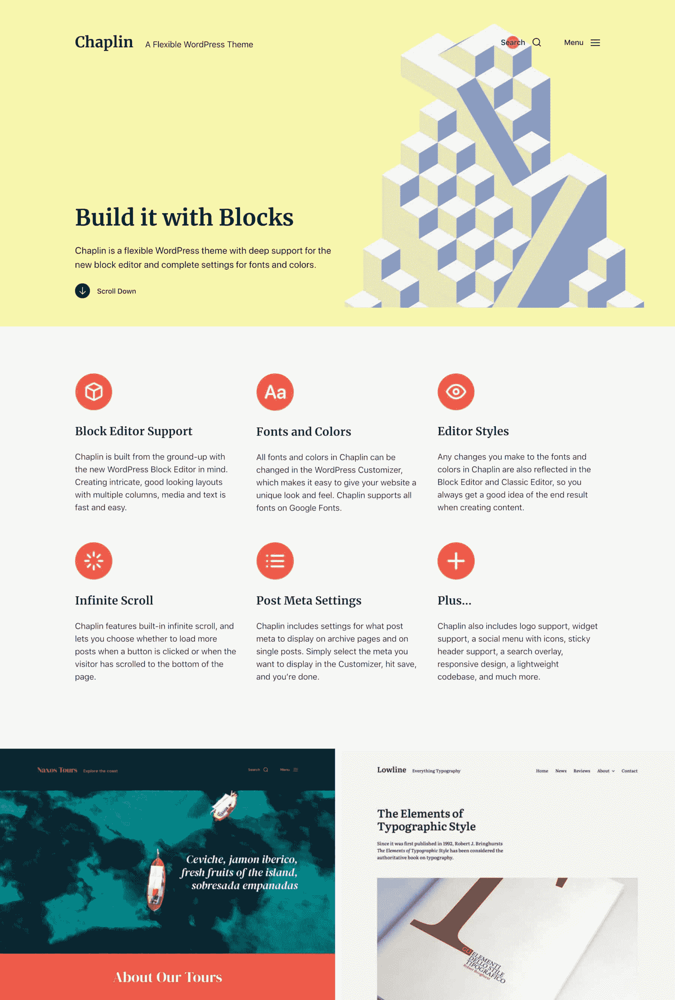

Chaplin WordPress theme


同样的理念也存在于 Twenty Twenty 的背后:**灵活性**、**清晰、**和**可读性**是新主题的重点关键词。

Twenty Twenty 带有一个单列布局和三个帖子/页面模板，旨在让 [WordPress 管理员](https://kinsta.com/blog/wordpress-user-roles/)和设计者**自由地直接在块编辑器**中创建他们的定制布局，利用宽和全对齐的块元素，如列、图像和古腾堡 5.5 引入的[组块](https://make.wordpress.org/core/2019/04/17/whats-new-in-gutenberg-17th-april/)。

正如安德斯解释的那样:

> Twenty Twenty 的设计核心是灵活性。如果您想将其用于组织或企业，您可以将栏、组和媒体与宽对齐和完全对齐相结合，以创建动态布局来展示您的服务或产品。如果你想把它用于传统的博客，居中的内容栏也非常适合。

除此之外，Twenty Twenty 还有一个新的字体: [Inter](https://rsms.me/inter/) 。这是一个由 Rasmus Andersson 设计的[免费开源字体系列](https://github.com/rsms/inter)，专门用于混合大小写文本的可读性，尤其是小字体。

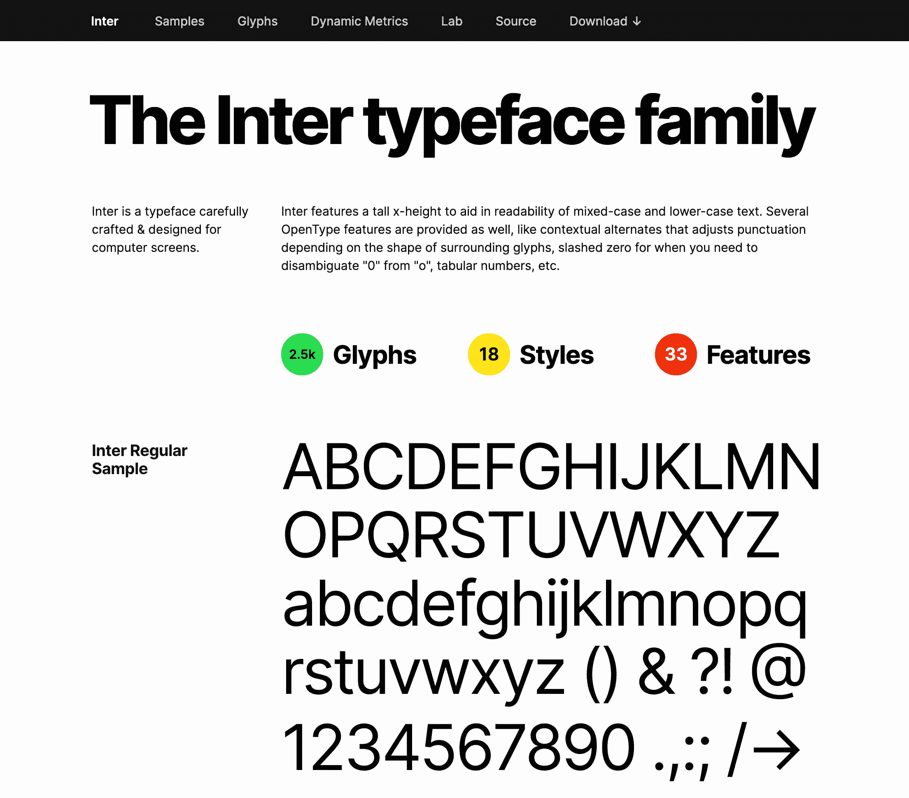

The Inter typeface family


国际米兰赋予了大标题更强的个性，但当你使用交替的文本大小时，你会得到最大的好处，正如 WordPress.org 博客帖子的主题预览所示:

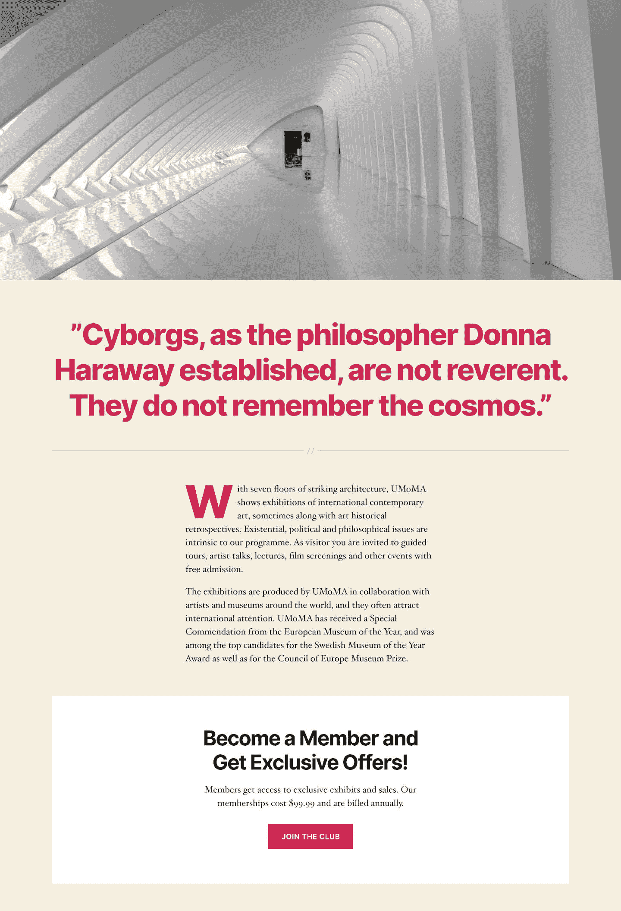

Twenty Twenty typography: impact and readability


Twenty Twenty 不仅仅是一个功能齐全的主题，还是一个标志着 WordPress 编辑界面未来发展的重要新步骤的主题。Twenty Twenty 主要依靠块编辑器来编辑和布局内容，并依靠主题定制器来进行页眉、页脚和其他定制。

也就是说，是时候让我们[安装这个 WordPress 主题](https://kinsta.com/blog/how-to-install-a-wordpress-theme/)并运行它了。
T3】

## 如何安装 two two

即将到来的默认主题将遵循 [WordPress 5.3 发布计划](https://make.wordpress.org/core/5-3/)。这意味着，在我写这篇文章的时候，Twenty Twenty 仍然不能在 WordPress 主题目录中下载。

反正你可以在 GitHub 上下载一个正在进行中的 Twenty Twenty 版本，安装在 WordPress 当前的稳定版本中或者用 WordPress 5.3 获取。一旦主题合并到[核心](https://kinsta.com/knowledgebase/wordpress-core/)中，Github 储存库将被弃用。同时，你可能想保存 WordPress 5.3 发布时间表中的以下日期:

*   2019 年 9 月 23 日:Beta 1
*   2019 年 9 月 30 日:Beta 2
*   2019 年 10 月 7 日:Beta 3
*   2019 年 10 月 15 日:发布候选 1
*   2019 年 10 月 22 日:发布候选 2
*   2019 年 10 月 29 日:发布候选 3
*   2019 年 11 月 5 日:发布候选 4(如果需要)
*   2019 年 11 月 12 日:WordPress 5.3 发布的目标日期。

要开始使用 Twenty Twenty，请遵循以下步骤:

1.  从 [GitHub](https://github.com/WordPress/twentytwenty) 获取压缩包。
2.  在 [WordPress 仪表盘](https://kinsta.com/knowledgebase/wordpress-admin/)或通过 [SFTP 上传 zip 文件到你的开发安装中。](https://kinsta.com/knowledgebase/how-to-use-sftp/)
3.  浏览到**外观→主题**，点击主题预览图像上的**激活**按钮。
4.  进入**外观→自定义**配置二十二十。

就是这样！你现在可以开始在你的[试运行网站](https://kinsta.com/help/staging-environment/)或者你的[本地环境](https://kinsta.com/blog/install-wordpress-locally/)上运行你的测试。


### 重要的

Twenty Twenty 目前正在开发中，许多问题还没有解决。你不应该在生产中使用它。


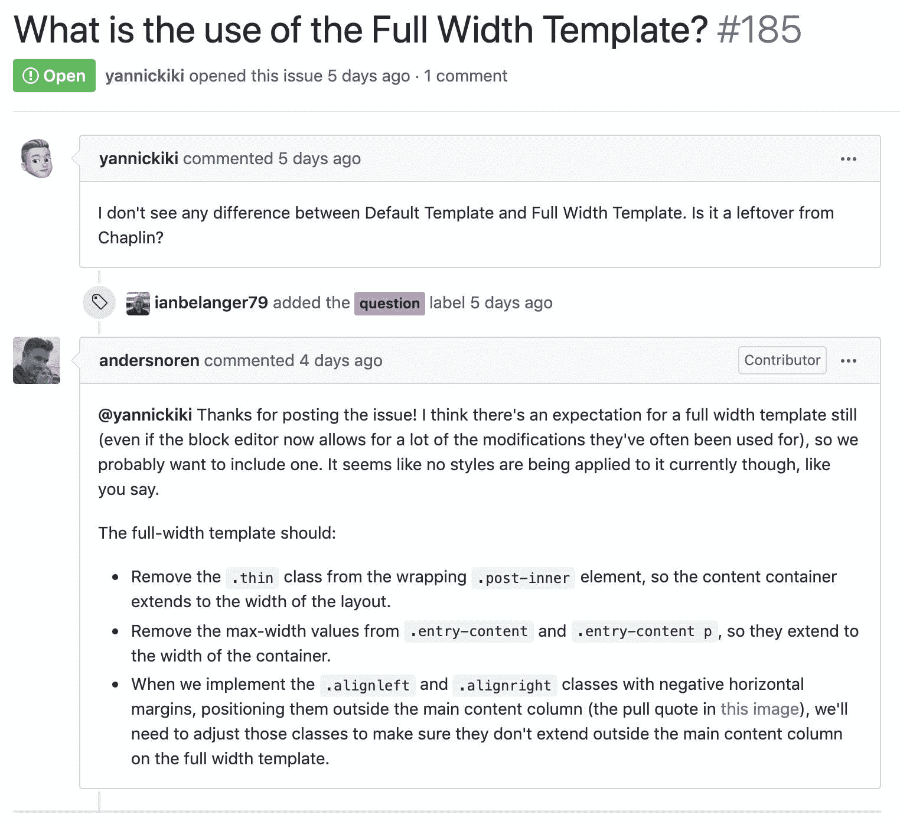

An open issue on GitHub


现在你已经准备好了，让我们继续前进，进入主题。

在发布到产品之前，使用我们的发布网站轻松测试 WordPress 主题。[免费试用 kin sta](https://hubs.ly/H0pklC_0)。【T7

## Twenty Twenty 的主题功能

Twenty Twenty 不是一个功能齐全的主题，而是一个精简的最小化主题，旨在给 T2 开发者和网站管理员为他们的帖子和页面建立自定义内容布局的自由。与[Twenty Twenty 19](https://kinsta.com/blog/twenty-nineteen-theme/)一样，Twenty Twenty 也是为古腾堡打造的，主要取决于古腾堡的生命周期(关于这个主题的更多信息，请参见 WCEU 2019 上马特·莫楞威格的[视频](https://wordpress.tv/2019/07/04/matt-mullenweg-matt-on-wordpress/))。

## 注册订阅时事通讯


### 想知道我们是怎么让流量增长超过 1000%的吗？

加入 20，000 多名获得我们每周时事通讯和内部消息的人的行列吧！

[Subscribe Now](#newsletter)

该主题支持许多[主题特性](https://codex.wordpress.org/Theme_Features)，如内容宽度(`580`)、自动提要链接、文章缩略图、标题标签和一些 [HTML5](https://kinsta.com/blog/html-vs-html5/#what-is-html5) 元素(搜索表单、评论表单、评论列表、图库和标题)。

其他功能为[主题定制器](https://developer.wordpress.org/themes/customize-api/customizer-objects/)增加了选项。其中包括[定制背景](https://developer.wordpress.org/reference/functions/add_theme_support/#custom-background)和[定制 logo](https://developer.wordpress.org/reference/functions/add_theme_support/#custom-logo) 。下面的代码片段展示了主题的函数文件中启用的这些特性:

```
// Custom background color
add_theme_support(
	'custom-background',
	array(
		'default-color'	=> 'F5EFE0'
	)
);
```

```
// Custom logo
add_theme_support(
	'custom-logo',
	array(
		'height'      => 240,
		'width'       => 320,
		'flex-height' => true,
		'flex-width'  => true,
		'header-text' => array( 'site-title', 'site-description' ),
	)
);
```

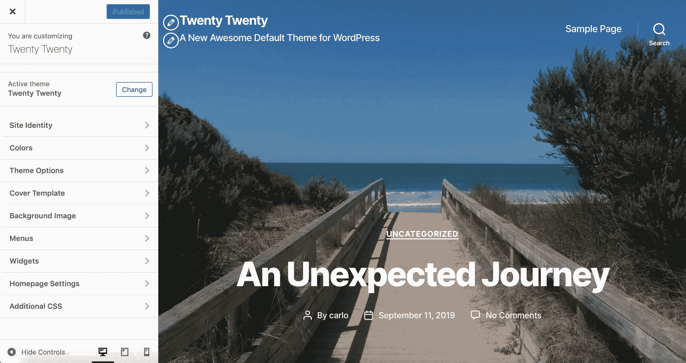

The Theme Customizer in Twenty Twenty


Twenty Twenty 还支持一些[古腾堡的特定功能](https://developer.wordpress.org/block-editor/developers/themes/theme-support/)。首先，主题支持**宽和全幅对齐**:

```
// Add support for full and wide align images.
add_theme_support( 'align-wide' );
```

如果用户在定制器中设置了强调色，则**编辑器调色板**被启用(默认启用):

```
// If we have accent colors, add them to the block editor palette
if ( $editor_color_palette ) {
	add_theme_support( 'editor-color-palette', $editor_color_palette );
}
```

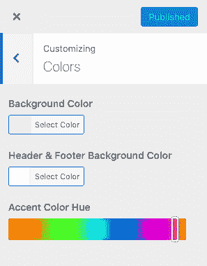

Customizing colors in Twenty Twenty


Twenty Twenty 主题带有四种**编辑器字体大小**，在块编辑器中可用:

```
// Gutenberg Font Sizes
add_theme_support( 'editor-font-sizes', array(
	array(
		'name' 		=> _x( 'Small', 'Name of the small font size in Gutenberg', 'twentytwenty' ),
		'shortName' => _x( 'S', 'Short name of the small font size in the Gutenberg editor.', 'twentytwenty' ),
		'size' 		=> 16,
		'slug' 		=> 'small',
	),
	array(
		'name' 		=> _x( 'Regular', 'Name of the regular font size in Gutenberg', 'twentytwenty' ),
		'shortName' => _x( 'M', 'Short name of the regular font size in the Gutenberg editor.', 'twentytwenty' ),
		'size' 		=> 18,
		'slug' 		=> 'regular',
	),
	array(
		'name' 		=> _x( 'Large', 'Name of the large font size in Gutenberg', 'twentytwenty' ),
		'shortName' => _x( 'L', 'Short name of the large font size in the Gutenberg editor.', 'twentytwenty' ),
		'size' 		=> 24,
		'slug' 		=> 'large',
	),
	array(
		'name' 		=> _x( 'Larger', 'Name of the larger font size in Gutenberg', 'twentytwenty' ),
		'shortName' => _x( 'XL', 'Short name of the larger font size in the Gutenberg editor.', 'twentytwenty' ),
		'size' 		=> 32,
		'slug' 		=> 'larger',
	),
) );
```

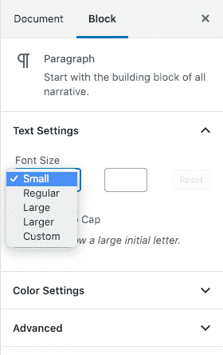

Font sizes in the editor’s block Text settings


仅此而已。这个主题在功能上也很简单，但是它可以很容易地用一个子主题来扩展，我们一会儿将深入讨论这个主题。

## 如何定制二十个二十的外观

Twenty Twenty 没有任何花哨的功能，但在与 Gutenberg(或一个好的页面生成器)配合使用时，它提供了很大的灵活性。

### 定制 Twenty Twenty 主题

**站点标识**处理[站点标题](https://kinsta.com/knowledgebase/hide-page-title-wordpress/)以及标语、徽标和图标。您可以在定制器的**站点标识**部分启用/禁用所有这些元素:

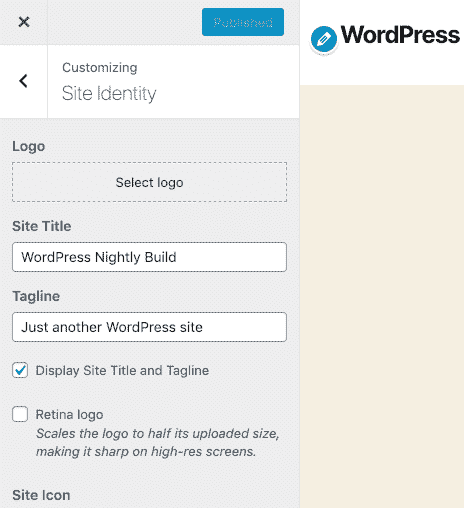

Site Identity in Customizer’s settings


定制器的**封面模板**部分处理**封面模板**页面模板的定制设置。在那里，你会发现:

*   在[背景图像](https://kinsta.com/blog/wordpress-background-image/)(固定背景图像)上启用视差效果的选项。
*   颜色选择器，为特色图像覆盖设置自定义背景颜色和文本颜色。
*   控制叠层不透明度的滑块。

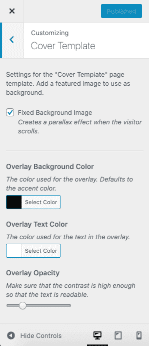

The Cover Template section in the Customizer


**菜单**部分提供了五个菜单位置。您可以在标题中包含常规水平菜单(**桌面水平菜单**)和/或可切换导航菜单(**桌面扩展菜单**)。**移动菜单**为移动设备专用菜单，**页脚菜单**和**社交菜单**位于页面页脚。

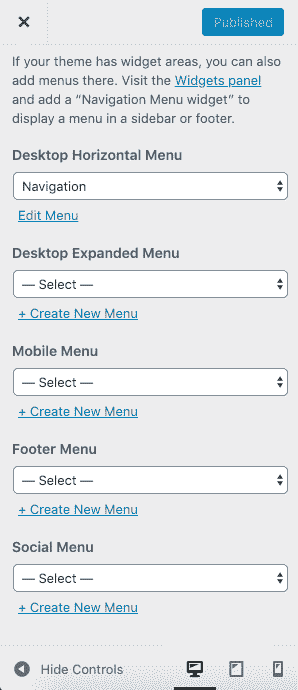

Menu locations in Twenty Twenty


页脚处理页脚菜单和社交菜单位置以及两个小部件区域。下图显示了主题的页脚及其所有元素:

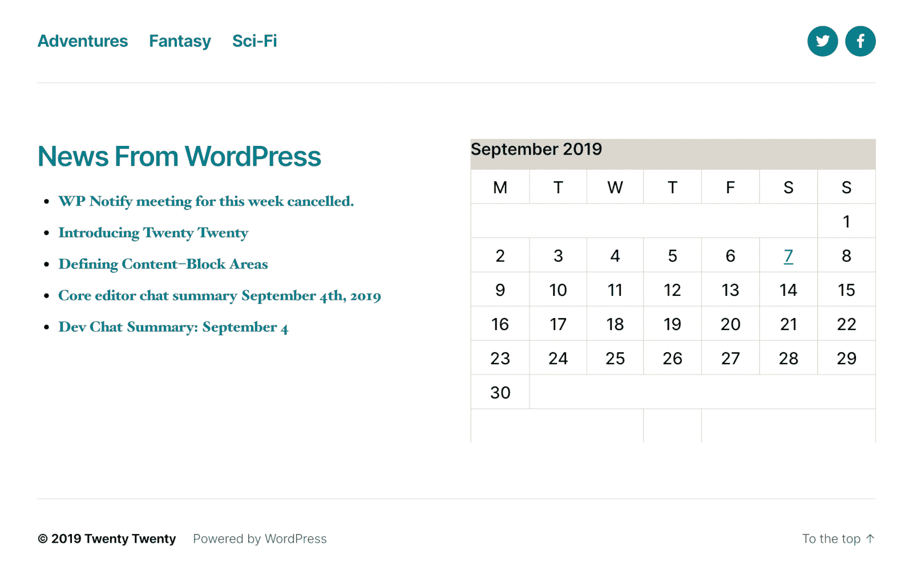

Template footer in Twenty Twenty


最后，**附加 CSS** 部分允许您包含自定义样式。

### 单个帖子/页面模板

说到文章和页面布局，您可以从三个不同的模板中进行选择。除了默认模板之外，Twenty Twenty 还提供了一个**封面模板**和一个**全幅模板**，你可以使用它们来自定义你的内容的外观和感觉。

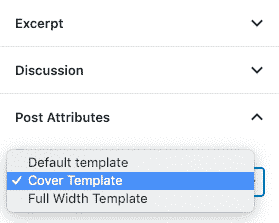

Single Post/Page templates in Twenty Twenty


### 2020 年的街区编辑

由于其最小化的方法，Twenty Twenty 的外观主要依赖于块编辑器。我们使用 Gutenberg 版本 6.4.0 在 Twenty Twenty 上运行我们的测试。这个版本提供了大量的新特性、增强功能和错误修复，极大地改善了编辑体验。

在发布到产品之前，使用我们的发布网站轻松测试 WordPress 主题。[免费试用 kin sta](https://hubs.ly/H0pklC_0)。

有些块会派上用场，尤其是在构建单页网站的时候。像**媒体&文字**和**封面**这样的区块已经得到改进，现在在展示产品和/或专业[作品集](https://kinsta.com/blog/portfolio-website/)时看起来很棒:

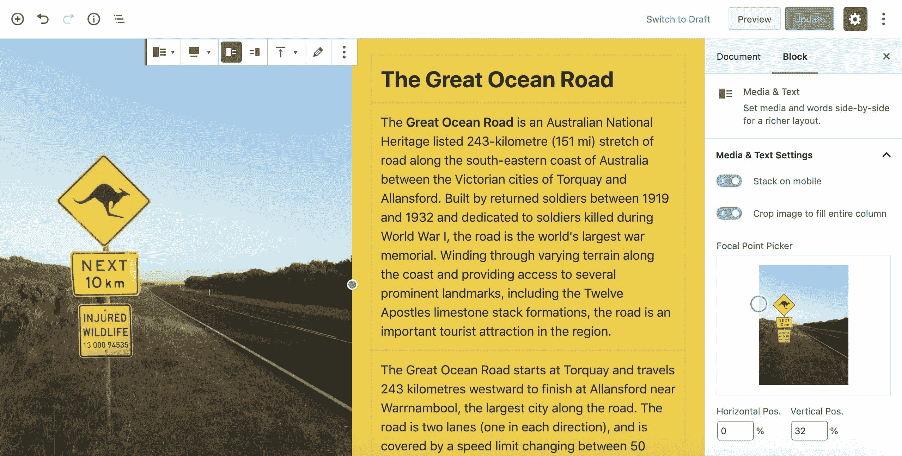

Media & Text block (full-with alignment)


尽管如此，由于 Gutenberg 是一个正在进行的项目，你可能想看看一些最流行的插件，允许在编辑器中添加更多的块。

以下是值得一试的插件列表:

*   [古腾堡街区](https://wordpress.org/plugins/ultimate-addons-for-gutenberg/)
*   [coblock](https://wordpress.org/plugins/coblocks/)
*   [可堆叠](https://wordpress.org/plugins/stackable-ultimate-gutenberg-blocks/)
*   [原子块](https://wordpress.org/plugins/atomic-blocks/)。
*   [高级古腾堡](https://wordpress.org/plugins/advanced-gutenberg/)

主题定制器和块编辑器在外观和布局定制方面做得很好，但是子主题可以让您更好地控制页面的外观和感觉。

## 如何为 Twenty Twenty 主题创建子主题

为 WordPress 构建子主题可能很有趣，也是开始职业生涯的一个好方法，作为一个 WordPress 主题开发者，Twenty Twenty 可能是一个很好的父主题。那么，你为什么不试试呢？😉

如果你不知道从哪里开始创建子主题，一定要看看我们的扩展指南[如何在 WordPress](https://kinsta.com/blog/wordpress-child-theme/) 中创建子主题。

现在，让我们为 2020 建立我们的第一个孩子主题！

在`wp-content/themes`下创建一个新目录，并将其命名为`twentytwenty-child`或任何您喜欢的名称。

浏览到`wp-content/themes/twentytwenty-child`并创建一个新的`style.css`文件，标题如下:

```
/*
Theme Name: My Twenty Twenty Child Theme
Theme URI: https://example.com
Description: A child theme for Twenty Twenty.
Author: Your Name
Author URI: https://example.com/
Template: twentytwenty
Version: 1.0
License: GNU General Public License v2 or later
License URI: https://www.gnu.org/licenses/gpl-2.0.html
*/
```

接下来，我们必须包含父主题的样式表。在同一个目录中，创建以下`functions.php`文件:

```
<?php
/* enqueue scripts and style from parent theme */        
function twentytwenty_styles() {
	wp_enqueue_style( 'parent', get_template_directory_uri() . '/style.css' );
}
add_action( 'wp_enqueue_scripts', 'twentytwenty_styles');
```

现在进入**外观→主题**并激活您的儿童主题。现在，您可以开始进行定制了。

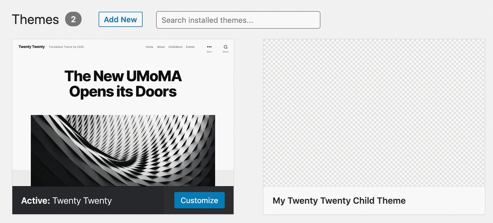

Activate the child theme


在 Twenty Twenty 中你几乎可以改变任何东西，从添加自定义模板到添加你的自定义样式或者改变主题的默认样式。

在这里，我将向您展示如何为单个帖子和页面创建一个新的自定义模板。

### 在 Twenty Twenty 中添加自定义帖子/页面模板

到目前为止，我们已经为 Twenty Twenty 创建了一个子主题，并将父样式附加到子主题的样式表中。在下面的例子中，我们将去掉页眉和页脚，为 post/page 模板文件中的页面主体腾出空间。

### 第一步

将下列文件从父主题复制并粘贴到子主题的目录中:

*   templates/template-full-width . PHP
*   header.php
*   footer.php

### 第二步

将`template-full-width.php`改名为`template-canvas.php`(或者你喜欢的任何名字)。打开文件，删除当前内容，然后粘贴以下内容:

```
<?php
/*
Template Name: Canvas Template
Template Post Type: post, page
*/
get_template_part( 'singular' );
```

**模板名称**设置你将在块编辑器中看到的模板文件的名称，而**模板帖子类型**定义支持该模板文件的帖子类型。`get_template_part`函数从父主题中加载`singular.php`文件(在我们的子主题中不需要这个文件的副本)。

转到 WordPress 仪表盘，创建一个新帖子。现在你应该在**文章属性**部分找到一个额外的页面模板。

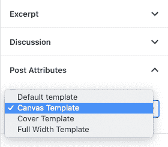

A new template is available in Post Attributes


### 第三步

现在有趣的部分来了。在您最喜欢的[文本编辑器](https://kinsta.com/blog/best-text-editors/)中打开`header.php`，并将`header`元素包含在下面的`if`语句中:

```
<?php
if ( ! is_page_template( array( 'templates/template-canvas.php' ) ) ) {
?>
	<header id="site-header" class="header-footer-group" role="banner">
		...
	</header><!-- #site-header -->

	<?php 
	// Output the menu modal
	get_template_part( 'template-parts/modal-menu' );
}
```

这段代码检查页面模板的[是否不是`templates/template-canvas.php`。如果页面模板**是** `templates/template-canvas.php`，那么它不会包含站点页眉和模态菜单。](https://developer.wordpress.org/reference/functions/is_page_template/)

类似地，当活动页面模板是我们的画布时，我们可以从文章页面中移除页脚。只需在`footer.php`中添加相同的条件，如下所示:

```
<?php
if ( ! is_page_template( array( 'templates/template-canvas.php' ) ) ) {
?>
	<footer id="site-footer" role="contentinfo" class="header-footer-group">
	...
	</footer><!-- #site-footer -->
<?php } ?>
	<?php wp_footer(); ?>

    </body>
</html>
```

你可以在这里下载这个例子的代码。
现在创建一个新的帖子或页面，在**帖子/页面属性**中选择画布模板，查看前台页面。

[We took a closer look at the new WordPress default theme Twenty Twenty. Check out all the main features you need to know about! 🆕②⓪②⓪Click to Tweet](https://twitter.com/intent/tweet?url=https%3A%2F%2Fkinsta.com%2Fblog%2Ftwenty-twenty-theme%2F&via=kinsta&text=We+took+a+closer+look+at+the+new+WordPress+default+theme+Twenty+Twenty.+Check+out+all+the+main+features+you+need+to+know+about%21+%F0%9F%86%95%E2%91%A1%E2%93%AA%E2%91%A1%E2%93%AA&hashtags=wpthemes%2Ctwentytwenty)

## 摘要

Twenty Twenty 是一个极简主义的 WordPress 主题，采用单列布局。我们使用它的方式主要取决于块编辑器的发展。正如安德斯富于表情地说:

> “块编辑器的承诺是让用户自由地设计和构建他们认为合适的站点”。

继[Twenty 19](https://kinsta.com/blog/twenty-nineteen-theme/)之后，新的 Twenty 20 默认主题是新一代主题中的第二个，旨在“允许无需手动代码编辑即可构建网站”。由 Twenty Twenty 主题驱动的 WordPress 网站有各种形状和大小。要想知道一个主题是否在使用 Twenty Twenty，请查看我们方便的 [WordPress 主题检测工具](https://kinsta.com/tools/what-is-my-ip/wordpress-theme-detector/) 。

如果你认为 Gutenberg 对你的项目来说还不完全可靠，你可以添加你需要的插件，比如上面列出的插件。或者，简单地说，你可以拥抱一个第三方页面生成器。

现在由你决定:安装新的默认 WordPress 主题，使用它，并在评论中告诉我们你的想法！

* * *

让你所有的[应用程序](https://kinsta.com/application-hosting/)、[数据库](https://kinsta.com/database-hosting/)和 [WordPress 网站](https://kinsta.com/wordpress-hosting/)在线并在一个屋檐下。我们功能丰富的高性能云平台包括:

*   在 MyKinsta 仪表盘中轻松设置和管理
*   24/7 专家支持
*   最好的谷歌云平台硬件和网络，由 Kubernetes 提供最大的可扩展性
*   面向速度和安全性的企业级 Cloudflare 集成
*   全球受众覆盖全球多达 35 个数据中心和 275 多个 pop

在第一个月使用托管的[应用程序或托管](https://kinsta.com/application-hosting/)的[数据库，您可以享受 20 美元的优惠，亲自测试一下。探索我们的](https://kinsta.com/database-hosting/)[计划](https://kinsta.com/plans/)或[与销售人员交谈](https://kinsta.com/contact-us/)以找到最适合您的方式。