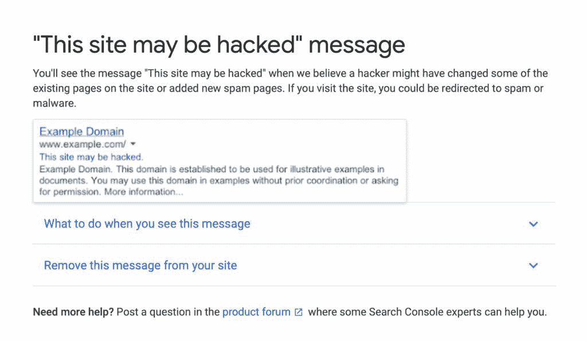
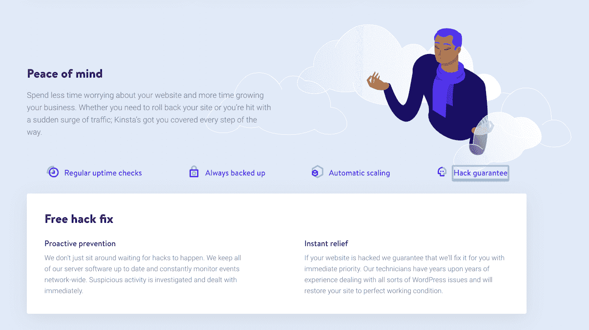
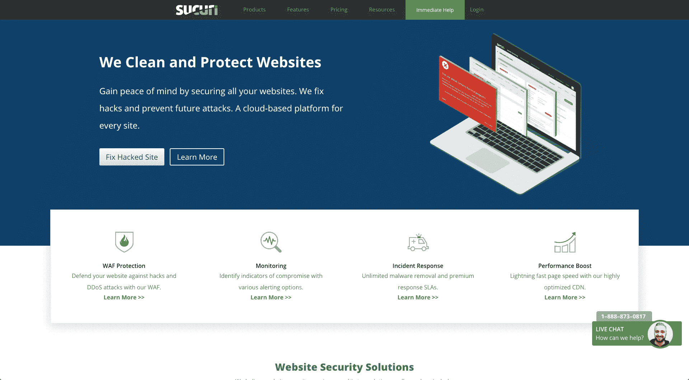

# WordPress Hacked:当你的网站陷入困境时该怎么办

> 原文：<https://kinsta.com/blog/wordpress-hacked/>

WordPress 网站被黑。如果发生在你身上，很容易引起恐慌。在这篇文章中，我将帮助你确定你的网站是否被黑客攻击，带你完成清理你的网站的步骤，并帮助你使它更加安全。

最后，我会给你一些建议，防止你的 WordPress 站点将来再次被黑。

 准备好了吗？深呼吸，让我们开始吧。

## WordPress 被黑:标志着你的 WordPress 网站处于危险之中

你的 WordPress 站点没有正常运行。但是您如何知道问题是由黑客造成呢？让我们来看看你的网站被黑的一些迹象:

*   您[无法登录](https://kinsta.com/blog/locked-out-of-wordpress-admin/)。
*   您的站点在您没有做任何事情的情况下发生了变化(例如，主页被一个静态页面所替换，或者添加了新的内容)。
*   您的网站正在重定向到另一个网站。
*   当您或其他用户试图访问您的网站时，您会在浏览器中收到警告。
*   当你搜索你的网站时，谷歌会警告你网站可能被黑客攻击了。
*   您收到了来自您的[安全插件](https://kinsta.com/blog/wordpress-security-plugins/)的通知，告知您发生了违规或意外变化。
*   您的主机提供商已经警告您，您的帐户上有异常活动。

让我们更详细地看一下其中的每一项。

### 你不能登录

如果你不能登录你的网站，这可能是你的网站被黑客攻击的迹象。然而，更有可能的是你刚刚忘记了你的密码。所以在你认为自己被黑客攻击之前，试着[重置你的密码](https://kinsta.com/blog/change-wordpress-password/)。如果你不能，那是一个警告信号。即使你可以，你仍然可能已经被黑了，你将不得不做更多的调查。

黑客有时会移除用户或更改用户密码来阻止访问。如果您无法重置密码，您的用户帐户可能已被删除，这是黑客攻击的迹象。

### 您的网站已经更改

黑客攻击的一种形式是用静态页面替换主页。如果你的网站看起来完全不同，并且没有使用你的主题，那么它可能已经被黑客攻击了。

变化可能更微妙，可能会添加虚假内容，或链接到令人讨厌的网站。如果你的页脚充满了你没有添加的链接，尤其是那些链接是隐藏的或者字体很小，你可能已经被黑客攻击了。

在你假设你被黑了之前，和其他网站的管理员或编辑核实一下，确保他们没有不小心做了改动。

如果你的主题不是来自一个著名的来源，并且你最近更新了它，那可能是罪魁祸首。

### 您的站点正在重定向

有时黑客会添加一个脚本，当人们访问你的网站时，它会将他们重定向到另一个网站。这可能是一个你不希望你的用户被带到的网站。

当我管理的一个学校网站重定向到一个约会网站时，我就遇到了这种情况。你可以想象，我的客户很不高兴，不得不放下我正在做的其他事情，马上解决它。原来是服务器上的不安全，而不是我的网站，这是只使用[质量托管](https://kinsta.com/)的一个原因。我尽快更换了主机提供商，并几乎立即修复了黑客攻击。
T3】

### 浏览器警告

如果你的浏览器警告你的网站被入侵，这可能是你的网站被入侵的信号。这也可能是由于你需要删除主题或插件中的一些代码，或者域或 [SSL](https://kinsta.com/blog/mixed-content-warnings/) 的问题。

请参考浏览器中的警告所给出的建议，以帮助您诊断问题。

### 搜索引擎警告

当你搜索你的网站时，如果它被黑了，谷歌可能会显示一个警告。这可能意味着[网站地图](https://kinsta.com/blog/wordpress-sitemap/)已经被黑客攻击，这将影响谷歌抓取你网站的方式。或者这可能是一个更大的问题:你需要做下面的诊断来找出到底发生了什么。

Google alert – this site may have been hacked

## 为什么 WordPress 网站会被黑

WordPress 网站被黑有很多原因，但是这里有一个关于 T2 最常见因素的概述。

### 1.不安全的密码

这是黑客攻击最常见的原因之一。世界上最常用的密码是“密码”。安全的密码不仅对你的 WordPress 管理员账户是必要的，对你的所有用户和你网站的所有方面都是必要的，包括 FTP 和主机。

### 2.过时的软件

插件和主题，以及 WordPress 本身，都需要更新到你的网站上。如果你不[保持你的主题、插件和 WordPress 版本的最新](https://kinsta.com/blog/is-wordpress-secure/)，你会让你的网站变得脆弱。

### 3.不安全的代码

不是来自知名来源的插件和主题可能会给你的网站带来漏洞。如果你需要免费的 WordPress 主题或插件，从官方主题目录安装它们。

当[购买高级主题和插件](https://kinsta.com/blog/wordpress-free-vs-paid-themes/)时，一定要检查供应商的声誉，并从你信任的人和来源那里获得推荐。永远不要安装[无效插件](https://kinsta.com/blog/nulled-wordpress-plugins-themes/)，这是免费网站的高级插件，旨在造成伤害或收集信息。

## WordPress 是如何被黑的？

如果你想知道更多关于 WordPress 网站如何被黑的信息(如果你自己的网站被黑了，你不会急于采取措施)，这里有黑客进入你网站的主要途径:

*   后门——这些绕过正常的方法访问你的网站，例如通过脚本或[隐藏文件](https://kinsta.com/blog/show-hidden-files/)。一个例子是 2013 年的[提姆拇指漏洞](https://kinsta.com/blog/wordpress-security/)。
*   制药黑客——用来将流氓代码插入 WordPress 过期版本的漏洞。
*   暴力登录尝试——黑客利用自动化来利用弱密码并访问您的网站。
*   恶意重定向-当后门被用来添加恶意重定向到您的网站。
*   跨站点脚本(XSS)——WordPress 插件中最常见的漏洞，这些插件注入脚本，然后允许黑客向用户的浏览器发送恶意代码。
*   拒绝服务(DoS)-当网站代码中的错误或漏洞被用来淹没网站，使其不再运行。

如果你正在运营一个电子商务网站，请务必阅读我们关于[电子商务欺诈防范的深入指南。](https://kinsta.com/blog/ecommerce-fraud-prevention/)

这些听起来都很可怕，但是你可以采取一些措施来保护你的 WordPress 站点免受它们的攻击。首先，让我们来看看当你的网站被黑时你需要采取的步骤。

## WordPress 网站被黑:做什么(分步指南)

如果你的网站是由 Kinsta 托管的，我们有[无黑客保证](https://kinsta.com/knowledgebase/security-guarantee/)，这意味着我们将通过你的网站工作，并消除黑客攻击。如果你和另一个主机提供商在一起，你需要让他们参与进来，但是你可能需要自己做很多事情。

Kinsta’s hack-free guarantee

您需要采取的步骤将取决于您的网站被黑客攻击的方式，您可能不需要完成所有这些工作。我们将经历的步骤是:

1.  [不要惊慌](#panic)
2.  [将您的站点置于维护模式](#maintenance)
3.  [重置密码](#reset)
4.  [使用 Kinsta 恶意软件删除服务](https://kinsta.com/knowledgebase/malware-security/)
5.  [更新插件和主题](#update)
6.  [删除用户](#users)
7.  [删除不需要的文件](#files)
8.  [清理你的网站地图](#sitemap)
9.  [重新安装插件和主题](#reinstall)
10.  [重新安装 WordPress 核心](#core)
11.  [清理你的数据库](#database)

### 第一步:不要惊慌

我知道，对惊慌失措的人，你能说的最糟糕的话就是“不要惊慌”。但是如果你想诊断和解决问题，你需要有一个清醒的头脑。

如果你不能清醒地思考，简单地把你的网站置于[维护模式](https://kinsta.com/blog/wordpress-maintenance-mode/)并让它保持几个小时，直到你感觉更平静。再说一遍，说起来容易做起来难，但这在这里是至关重要的。

### 步骤 2:将你的站点置于维护模式

你不希望访问者发现你的网站处于被破坏的状态，你也不希望他们看到你的网站在你修复时的样子。

因此，如果可以的话，请将其置于维护模式。

如果你现在不能[登录你的 WordPress 网站](https://kinsta.com/blog/wordpress-login-url/)，这将是不可能的，但是一旦你可以，回来做这件事。

像即将推出的[页面&维护模式](https://kinsta.com/blog/wordpress-maintenance-mode/#2-coming-soon-page--maintenance-mode-by-seedprod)这样的插件将会让你的网站进入维护模式，让它看起来像是正在进行定期维护，而不是在被黑客攻击后被修复。

Coming Soon Page & Maintenance Mode plugin

一旦你做到了这一点，你就可以放松一点，因为人们看不到正在发生的事情。

你可以配置插件来添加一个标志和自定义颜色，或者你可以只输入一些快速的解释文本，然后就这样了。

现在你可以看到你的破网站，但其他人看不到。

### 步骤 3:使用 Kinsta 恶意软件删除服务

为了省去下面所有步骤的麻烦，您可以在迁移到 Kinsta 时一次性支付 100 美元购买 [Kinsta 恶意软件删除服务](https://kinsta.com/knowledgebase/security-guarantee/)。重要提示:如果您是 Kinsta 客户，这将包含在您的计划中！

如果你不想这样做，或者负担不起，请继续阅读，了解更多关于如何清理你被黑的网站。

### 第四步:重置密码

因为你不知道哪个密码是用来访问你的网站的，所以重要的是改变所有的密码以防止黑客再次使用它们。这不仅限于你的 WordPress 密码:重置你的 [SFTP 密码](https://kinsta.com/help/connecting-with-sftp/)，你的[数据库密码](https://kinsta.com/help/db-access/)，还有你的主机提供商密码。

您需要确保其他管理员用户也重置他们的密码。

## 注册订阅时事通讯

### 想知道我们是怎么让流量增长超过 1000%的吗？

加入 20，000 多名获得我们每周时事通讯和内部消息的人的行列吧！

[Subscribe Now](#newsletter)

### 步骤 5:更新插件和主题

下一步是确保你所有的插件和主题都是最新的。去**仪表板>更新**你的网站，更新所有过时的东西。

你应该在尝试任何其他修复之前这样做，因为如果一个插件或主题使你的网站易受攻击，你所做的任何更多的修复都可能被漏洞撤销。因此，在继续之前，请确保所有内容都是最新的。

### 步骤 6:删除用户

如果你的 WordPress 站点上添加了你不认识的管理员帐号，是时候移除它们了。在你这样做之前，检查任何授权的管理员，他们没有改变他们的帐户细节，你只是不认识他们。

在你的 WordPress admin 中进入**用户**界面，点击用户列表上方的**管理员**链接。如果有不应该出现的用户，点击他们旁边的复选框，然后在**批量操作**下拉列表中选择**删除**。

### 步骤 7:删除不需要的文件

为了找出你的 WordPress 安装中是否有任何不应该存在的文件，你需要安装一个安全插件，比如 [WordFence](https://wordpress.org/plugins/wordfence/) ，它会扫描你的网站并告诉你是否有任何不应该存在的文件，或者使用一个安全服务，比如 [Sucuri](https://sucuri.net/) 。

### 信息

如果你使用的是 Kinsta 主机方案，你不需要安装额外的安全插件。这将干扰您站点的配置，并可能影响性能。相反，提出一个支持票，并支持我们将修复您的网站。

### 第八步:清理你的网站地图并重新提交给谷歌

网站被搜索引擎标记的一个原因可能是你的 sitemap.xml 文件被黑客攻击。在我们解决的一个案例中，一个网站地图被虚假链接和外来字符感染。

你可以使用你的搜索引擎优化插件重新生成你的网站地图，但是你也需要告诉谷歌这个网站已经被清理了。将你的网站添加到[谷歌搜索控制台](https://kinsta.com/blog/google-search-console/)，并向谷歌提交一份网站地图报告，告诉他们你需要这个网站被抓取。这并不能保证你的网站会立即被抓取，可能需要两周时间。你无法加快这个速度，所以你必须有耐心。

### 步骤 9:重新安装插件和主题

如果你的网站仍然有问题，你需要重新安装你还没有更新的插件和主题。从你的**主题**(以下是如何安全[删除一个 WordPress 主题](https://kinsta.com/blog/wordpress-delete-theme/))和**插件**页面中停用并删除它们，然后重新安装。如果您还没有将您的站点置于维护模式，请先这样做！

如果你从一个插件或主题供应商那里买了一个插件或主题，而你不确定它有多安全，现在是时候考虑你是否应该继续使用它了。如果你从 WordPress 插件或主题目录以外的地方下载了免费的主题/插件，**不要重新安装它**。相反，从主题或插件目录安装它或购买合法版本。如果你买不起，[用一个免费的主题](https://kinsta.com/blog/change-wordpress-theme/)/插件替换它，这个插件来自做相同或相似工作的主题或插件目录。

如果这不能解决问题，[检查你所有主题和插件的支持页面](https://kinsta.com/blog/wordpress-support/#how-to-use-wordpressorg-support)。可能是其他用户遇到了问题，在这种情况下，您应该卸载该主题或插件，直到漏洞被修复。

### 步骤 10:重新安装 WordPress 核心

如果所有这些都失败了，你需要[重新安装 WordPress](https://kinsta.com/blog/reinstall-wordpress/) 本身。如果 WordPress 核心中的文件已经受损，你需要用一个干净的 WordPress 安装来替换它们。

通过 SFTP 上传一套干净的 WordPress 文件到你的网站，确保你覆盖了旧的文件。最好备份一下你的 wp-config.php 和[。首先是 htaccess 文件](https://kinsta.com/knowledgebase/wordpress-htaccess-file/)，以防它们被覆盖(尽管它们不应该被覆盖)。

如果你使用了自动安装程序来安装 WordPress，不要再使用它，因为它会覆盖你的数据库，你会丢失你的内容。相反，使用 SFTP 只上传文件。如果你在 Kinsta 上使用了我们的 [WordPress 安装程序](https://kinsta.com/help/new-site/)，你不需要担心这一步，因为我们会为你更换 WordPress core，作为我们 hack fix 服务的一部分。

### 步骤 11:清理你的数据库

如果你的数据库被黑了，你也需要把它清理掉。清理你的数据库是一个好主意，因为一个干净的数据库会有更少的陈旧数据，占用更少的空间，使你的网站更快。

担心来自主机的低质量、DIY 安全性？Kinsta 的构建考虑到了安全性和性能，并提供 24/7/365 的 WordPress 专家支持。[查看我们的计划](https://kinsta.com/plans/?in-article-cta)

怎么知道自己的数据库有没有被黑？如果你使用的是安全插件或服务，通过运行扫描会告诉你数据库是否已经受损(或者你可能已经收到警报)。或者，你可以使用像 NinjaScanner 这样的插件来扫描你的数据库。

WP 优化插件将让你清理你的数据库，并为将来优化它。

## 如何防止你的 WordPress 网站被黑

你已经清理了你的网站，重置了你的密码，所以它比以前更安全了。

但你可以做更多的事情来防止未来的黑客攻击，避免同样的事情再次发生。

### 1.确保所有密码安全

如果你还没有，确保所有与你的网站相关的密码，不仅仅是你的 WordPress 管理员密码，都被重置，并且你使用的是强密码。

一个安全插件可以让你强制用户使用安全密码，或者如果你使用的是 Kinsta，它会内置在你的主机方案中。

你也可以在你的网站上添加[双因素认证](https://kinsta.com/blog/wordpress-two-factor-authentication/)，让黑客更难创建账户。

### 2.保持你的网站更新

让你的网站保持最新是很重要的。每次你的主题、插件或 WordPress 本身更新时，你都应该运行更新，因为它通常会包含安全补丁。

你可以[通过编辑你的](https://kinsta.com/blog/wordpress-automatic-updates/)[wp-config.php 文件](https://kinsta.com/blog/wp-config-php/)或者安装一个插件来启用自动更新。如果你不想这样做，因为你想先测试更新，一个安全插件会在你需要运行更新时通知你。

当你更新你的网站时，确保[你做得正确](https://kinsta.com/blog/how-to-update-wordpress-theme/)，创建一个备份并在一个临时服务器上测试更新，如果你有一个的话。Kinsta 计划包括用于所有站点的[自动备份](https://kinsta.com/help/wordpress-backups/)和[暂存环境](https://kinsta.com/help/staging-environment/)。

### 3.不要安装不安全的插件或主题

将来安装 WordPress 插件时，确保它们已经过你的 WordPress 版本的测试，并且你是从一个有信誉的来源下载的。

总是通过主题和插件目录安装免费的插件和主题:不要试图从第三方网站获得它们。如果你正在购买高级主题或插件，检查插件供应商的信誉并寻求建议。

### 4.清理你的 WordPress 安装

如果你已经安装了任何主题或插件，但没有激活，删除它们。如果你的主机环境中有你不使用的文件或旧的 WordPress 安装，是时候移除它们了。也删除任何你不使用的数据库。

如果你的服务器上有旧的、未使用的 WordPress 安装，它们将特别容易受到攻击，因为你不太可能让它们保持最新。

### 5.在您的网站上安装 SSL

SSL 将为你的网站增加一层安全保护，并且是免费的。 [Kinsta 计划包含 SSL，无需额外费用](https://kinsta.com/help/how-to-install-ssl-certificate/)。如果你的主机提供商不提供免费的 SSL，你可以使用 [SSL Zen](https://wordpress.org/plugins/ssl-zen/) 插件来添加免费的加密 SSL。

### 6.避免廉价托管

便宜的主机服务意味着你将与数百个其他客户端共享服务器空间。这不仅会降低你网站的速度，还会增加其他网站给服务器带来不安全因素的机会。

廉价的主机提供商不太可能严格监控服务器安全，或者在你的网站被黑客攻击时帮助你。像 Kinsta 这样的优质主机提供商会给你一个免黑客攻击的保证，并努力保证你的网站安全。

### 7.设置防火墙

像 [Cloudflare](https://kinsta.com/knowledgebase/install-cloudflare/) 或 [Sucuri](https://kinsta.com/blog/sucuri-firewall/) 这样的安全插件或服务会让你为你的网站配置一个[防火墙](https://kinsta.com/blog/what-is-a-firewall/)。这将为黑客增加一道额外的屏障，并降低你的网站遭受黑客攻击和 DDoS 攻击的几率。

在金斯塔，我们所有客户的 WordPress 网站都受到谷歌企业级防火墙的保护。我们还在 MyKinsta 中为用户提供了一个易于使用的 [IP 拒绝工具](https://kinsta.com/knowledgebase/block-ip-address/)来阻止恶意 IP 地址。

### 8.安装安全插件

如果你在网站上安装了安全插件，它会通知你任何可疑的活动。这可能包括未经授权的登录或添加不应该存在的文件。

同样，参考插件提供的警告来找出问题所在。

*提醒:如果你的站点是用 Kinsta 托管的，就不需要安装安全插件。这是因为 Kinsta 提供了您需要的所有安全功能。*

### 9.考虑一个安全服务

如果你不是 Kinsta 的用户，你可能会考虑一个像 [Sucuri](https://sucuri.net/) 这样的安全服务，它会监控你的网站，并在你再次遭到黑客攻击时修复它。

Sucuri

这并不便宜，但是如果你的网站对你的商业收入是必不可少的，它可以为自己买单。有不同的计划为安全修复提供不同的周转时间。Sucuri 会监控你的网站，如果有安全漏洞会提醒你，并为你修复。这意味着您不必再次亲自清理您的站点。

或者，Kinsta 托管计划带有[安全功能](https://kinsta.com/features/)，包括 [DDoS 检测](https://kinsta.com/blog/what-is-a-ddos-attack/)，正常运行时间监控，硬件墙和免黑客攻击保证，这意味着如果你的网站被黑客攻击，我们将为你清理。如果你换成 Kinsta，我们会[为你免费迁移你的网站](https://kinsta.com/wordpress-migration/)，如果以后被黑了还会清理掉。请务必查看我们精选的[最佳 WordPress 迁移插件](https://kinsta.com/blog/wordpress-migration-plugins/)列表。

[OMG... Your site has been hacked! 😭😱What should you do next to clean it up? Here are all the steps you should mark off your recovery list to get your site 100% hack-free ✅Click to Tweet](https://twitter.com/intent/tweet?url=https%3A%2F%2Fkinsta.com%2Fblog%2Fwordpress-hacked%2F&via=kinsta&text=OMG...+Your+site+has+been+hacked%21+%F0%9F%98%AD%F0%9F%98%B1What+should+you+do+next+to+clean+it+up%3F+Here+are+all+the+steps+you+should+mark+off+your+recovery+list+to+get+your+site+100%25+hack-free+%E2%9C%85&hashtags=wphacks%2Csecurity)

## 摘要

你的网站被黑是一次不愉快的经历。这意味着您的网站对用户不可用，这可能会影响您的业务。这意味着你必须迅速采取行动，这会影响到你的其他活动。

如果你的网站被黑了，以下是你需要采取的步骤:

*   重置密码。
*   更新插件和主题。
*   删除不应该在那里的用户。
*   删除不需要的文件。
*   清理你的网站地图。
*   重新安装插件和主题，以及 WordPress 核心。
*   如有必要，清理你的数据库。

记住:遵循上面的步骤来防止黑客攻击将会避免你将来不得不再次做所有这些事情:尽可能地保持你的站点安全是值得的。

* * *

让你所有的[应用程序](https://kinsta.com/application-hosting/)、[数据库](https://kinsta.com/database-hosting/)和 [WordPress 网站](https://kinsta.com/wordpress-hosting/)在线并在一个屋檐下。我们功能丰富的高性能云平台包括:

*   在 MyKinsta 仪表盘中轻松设置和管理
*   24/7 专家支持
*   最好的谷歌云平台硬件和网络，由 Kubernetes 提供最大的可扩展性
*   面向速度和安全性的企业级 Cloudflare 集成
*   全球受众覆盖全球多达 35 个数据中心和 275 多个 pop

在第一个月使用托管的[应用程序或托管](https://kinsta.com/application-hosting/)的[数据库，您可以享受 20 美元的优惠，亲自测试一下。探索我们的](https://kinsta.com/database-hosting/)[计划](https://kinsta.com/plans/)或[与销售人员交谈](https://kinsta.com/contact-us/)以找到最适合您的方式。