# trello vs Asana——2022 年在哪里管理你的项目

> 原文：<https://kinsta.com/blog/trello-vs-asana/>

Trello 和 Asana 是目前最流行的两种项目管理工具。那么问题来了:特雷罗 vs 阿萨纳，你该选择哪一个来经营？

下面就随着我们的深入对比一探究竟吧！

## 特雷罗

Trello

Trello 最初是一个[的雾溪软件](https://medium.com/glitch/fog-creek-is-now-glitch-5a57dab604e3)产品。

据 Trello 的创始人 Joel Spolsky 称，他们在 2011 年 1 月为这款产品编写了第一行代码。

他说，经过三个月的工作，该软件已经足够有用，可以推出了，但他们决定在向公众展示之前再对其进行一些润色。Fog Creek software [于 2011 年 9 月在 Tech Crunch 的 Disrupt 大会上推出了 Trello](https://www.joelonsoftware.com/2011/09/13/announcing-trello/)。

这是一个基于[看板生产力系统](https://www.atlassian.com/agile/kanban)的创新项目管理产品。

看板系统是由日本工业工程师大野泰一(Taiichi Ohno)开发的，旨在改善丰田的制造流程。

这是如此的成功，以至于这个系统从汽车制造业扩展到了其他行业，如零售、软件，甚至电影。

它也吸引了一些人的注意，他们认为这是提高生产力的一种方式。

下面是最基本的看板[看起来像](https://simpaticodesignstudio.com/kanban-board/)的样子:

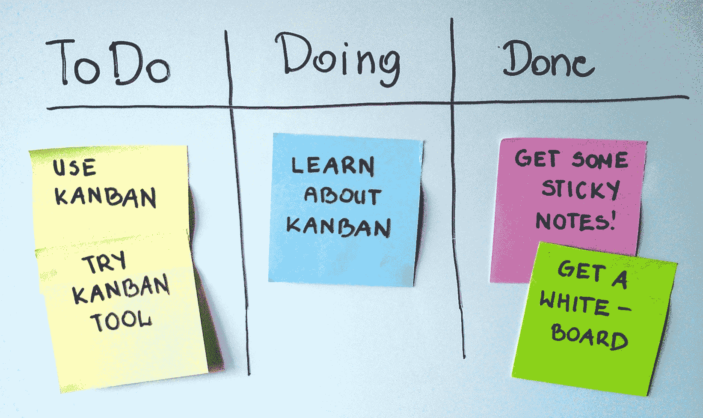

Kanban board (Image source: Simpaticodesignstudio.com)

当然，一个大型组织的看板要比这复杂得多，但是你明白了。

Fog Creek Software 开发了一个工具，允许公司创建数字看板。

这是乔尔·斯波尔斯基[在他的 Disrupt 演示文稿](https://techcrunch.com/video/trello-finalist-startup-battlefield-presentation/)中使用的一家名为 Artist Exploitation，Inc .的虚构公司的董事会:

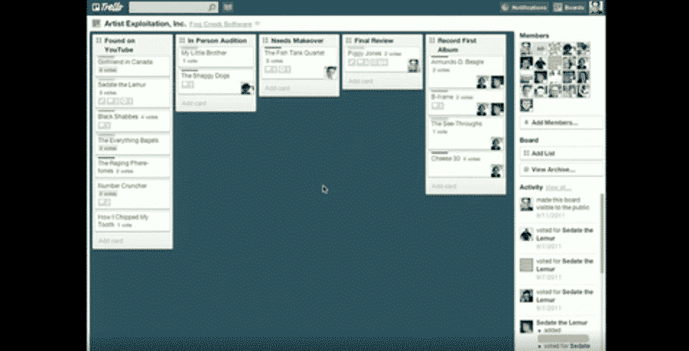

Trello’s pitch at Disrupt San Fransisco 2011

现在，你需要记住这是十年前的事了。

当时，在项目管理软件中使用看板是一个革命性的想法，而且创建它是一个严重的技术挑战。

乔尔·斯波尔斯基的演讲很成功:他成功地 [*“利用 6 分钟的名气吸引 13 万眼球”*](https://www.joelonsoftware.com/2011/09/15/should-you-launch-at-a-conference/) ，其中 22%的人注册了特雷罗。

Trello capitalizing on media attention

Spolsky 将这一成功归因于他们拥有一款可靠的产品:

> “如果我们让 3 个月大的 Trello 上场，那就不会这么棒了。甚至可能是我。我不要 131000 个眼球在 MEH 上。”

从此，Trello 爆发式增长，2015 年达到 1000 万用户。

然而，正如 Hiten Shah 在他的文章 [*“为什么 Trello 未能建立 10 亿美元以上的业务”*](https://blog.usejournal.com/why-trello-failed-to-build-a-1-billion-business-e1579511d5dc) 中指出的，他们的竞争对手正在努力工作看板。很快，一个曾经革命性的想法最终变成了老生常谈。

Asana [在 2016 年](https://blog.asana.com/2016/11/introducing-boards/)推出了他们自己的看板功能(更多信息见下文)，受到 Trello 的“极大启发”:

> “我们完全信任特雷罗。很明显，这款产品很好地开创了这一观点。[……]我们将 Trello 视为一种功能，而不是一种产品。”

Asana 的联合创始人贾斯汀·罗森斯坦说。

反正 Trello 一直在增长，2017 年达到了 2500 万用户。同年，[被 Atlassian](https://www.forbes.com/sites/alexkonrad/2017/01/09/atlassian-acquires-popular-team-productivity-app-trello-for-425-million/#3ff5da947c76) 以 4.25 亿美元收购。

如今，Trello 拥有超过 3500 万用户，是项目管理领域最受尊敬的公司之一。

### 关键特征

好吧，那么特雷罗到底给用户提供了什么？

看板系统仍然是 Trello 的核心。它为项目提供了一个很好的视觉进程，因为你可以看到每张卡片随着任务的进展从左向右移动。

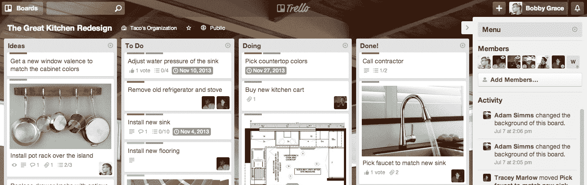

A Trello board

正如你所看到的，用户界面与 2011 年时几乎一样，只是现在它在视觉上更有吸引力。

你可以免费邀请尽可能多的人加入你的董事会，如果你和一个大团队一起工作，这很好。

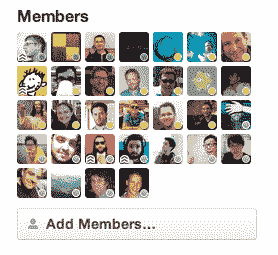

Trello members

您可以通过为每项任务创建白板、列表和卡片来组织您的工作，然后随着任务的进展在列表中移动卡片。

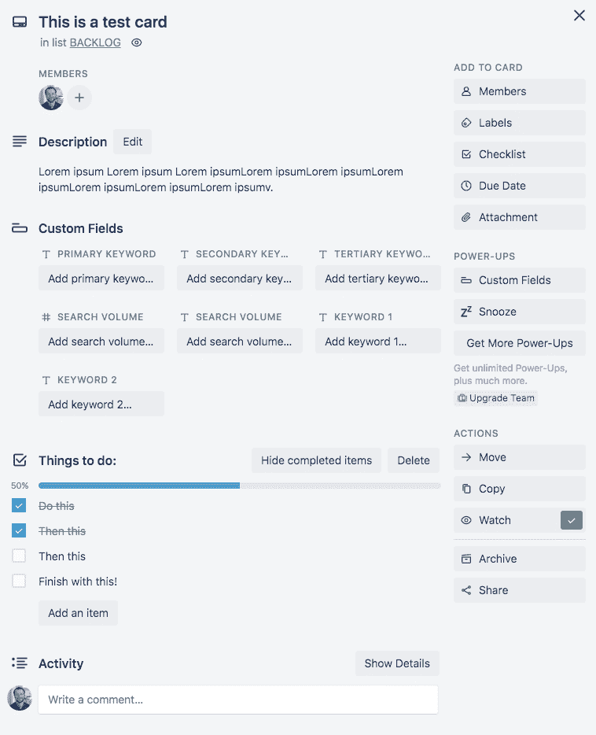

Trello cards

这些卡片不仅仅是数字版的便利贴。你可以给它们添加很多信息，比如任务描述、截止日期、标签、进度清单、附件等等。

顺便说一下，谈到清单和截止日期，Trello 有一个日历功能，可以让你在日历上查看有截止日期的卡片。

Trello 缺乏一个任务依赖系统。但是，您可以使用卡片中的某些元素(如清单和附件)来表示任务相关性。你可以在这里阅读更多关于管理任务相关性的信息[。](https://help.trello.com/article/1165-task-dependencies)

卡片还有一个评论功能，所以如果你需要讨论一些与任务相关的事情，你可以在卡片里讨论:

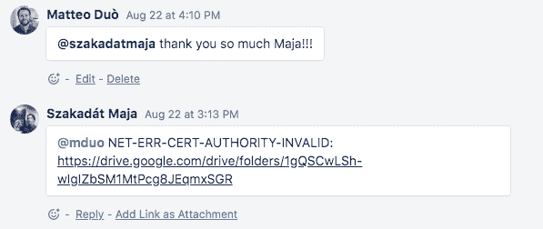

Trello comments

这很方便，因为它允许你在一个地方进行交流，而不是分散在几个渠道(电子邮件、即时消息、文本消息等)。).

Trello 还有一个通知系统，通过电子邮件、浏览器和手机向你发送通知，让你随时了解最新情况。

这些通知会在所有设备上同步，这样你就不必为阅读显示为未读的通知而烦恼。如果你收到电子邮件通知，你可以通过电子邮件直接回复。

还有一个强大的搜索功能，可以帮助你快速找到你想要的东西。

如果你想和一群以上的人一起使用 Trello，你可以使用 Trello 团队(这样，你可以有一个家庭团队，一个朋友团队，一个工作团队，等等。).

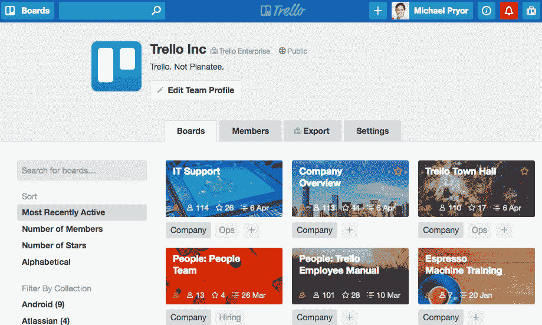

Trello boards

特雷罗有各种各样的电源。它们允许您在主板上启用附加功能，并将软件与您喜爱的应用程序集成。

例如，一些最受欢迎的开机包括前面提到的日历开机，以及 Google Drive 和 Slack 开机:

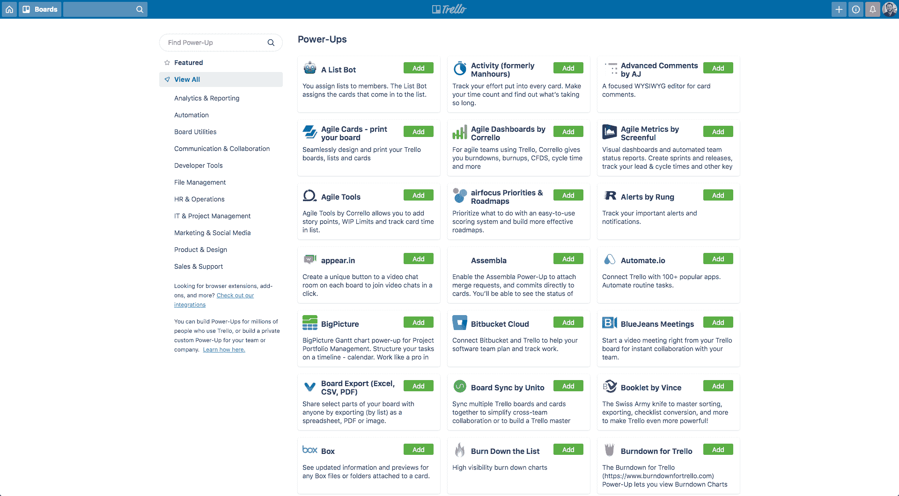

Trello power-ups

您可以在此查看所有加电的列表[。他们有很多人！](https://trello.com/power-ups/all)

Trello 还提供了各种浏览器扩展，当您经常使用 Trello 时，这些扩展会很方便。例如，使用 PopClip 扩展，您可以将选定的文本保存到 Mac 上的 Trello。你可以在这里看到所有浏览器扩展列表[。](https://trello.com/en/integrations#/extensions)

此外，值得注意的是，特雷罗非常重视隐私。您可以完全控制谁可以查看您的公告板。另外，他们使用 SSL/HTTPS 连接。

### 定价

Trello 有三个定价等级:

*   免费。这是最基本的计划。他们承诺它将永远免费。
*   商务舱。这是一个 9.99 美元/用户的月计划。它是为那些需要比免费版本更多功能的中小型企业准备的。
*   企业。这是一个起价为 20.83 美元/用户/月的计划，但价格取决于你需要多少座位(你的团队越大，每个用户的成本越低)。

这三个计划都提供无限的董事会、无限的名单和无限的卡，这使得它成为创业公司的一个伟大工具。

然而，当涉及到更先进的功能，如自动化和电源，免费计划是相当有限的。

此外，免费计划在安全性方面没有提供太多。如果您希望能够设置高级管理权限，发送域限制的邀请或停用成员，您将需要升级到商务级或企业级。

此外，保费计划提供 100 多个集成，使用这些集成可以显著提高您的团队的工作效率。

### 特雷罗的强项是什么？

特雷罗的主要优势在于其简单性。

这很重要，因为您向团队介绍的每个工具都需要人们投入时间来掌握它。简单性减少了培训新团队成员所需的时间。

此外，特雷罗是令人难以置信的多才多艺。它是为企业设计的，所以可以肯定的是，它们最常见的用例是小型企业的项目管理。

然而，它也可以用来管理你能想到的几乎任何项目，从计划度假到组织聚会到翻新房子。

事实上，在他的[*“2500 万！庆祝 4 个最受欢迎的 Trello 新功能“*](https://blog.trello.com/25-million-users)”Trello 的联合创始人 Michael Pryor 分享说，团队经常对他们看到的用例感到惊讶。他对用户说:

> 你开创了我们做梦都想不到的利用特雷罗的方法。从至关重要的销售渠道到度假板，从看板到垃圾桶，从路线图到食谱板:你创造性地使用 Trello 来提高工作和家庭的生产力，继续让我们惊叹。”

这很好，因为你可以使用相同的工具来管理个人和专业项目。

### 特雷罗最适合谁？

Trello 最适合拥有清晰的线性流程，并且希望团队成员能够快速掌握简单、直观的软件的小型企业。

你需要做的是问问你自己，如果你的整个团队在同一个办公室工作，你是否可以用物理看板来管理你的业务。

大多数小企业主都可以这样做，这意味着他们可能会从使用 Trello 中受益，特别是如果他们正在从事简单的项目。

## 注册订阅时事通讯

### 想知道我们是怎么让流量增长超过 1000%的吗？

加入 20，000 多名获得我们每周时事通讯和内部消息的人的行列吧！

[Subscribe Now](#newsletter)

然而，如果你的团队太大，你的项目太复杂，那么特雷罗很可能不会削减它。

## 阿萨纳

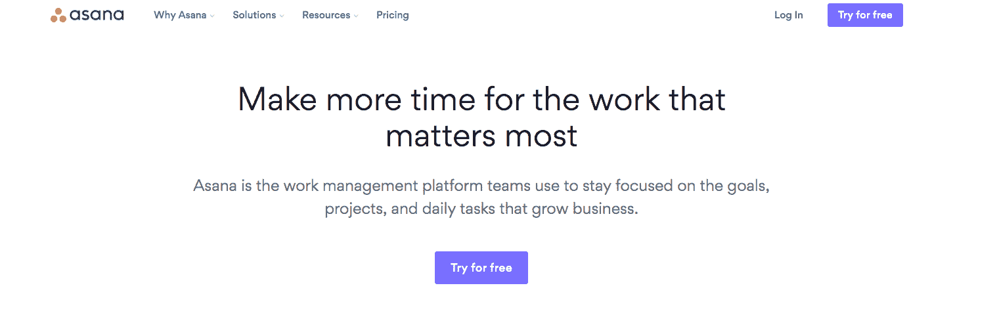

Asana

阿萨纳由贾斯汀·罗森斯坦和达斯汀·莫斯科维茨于 2008 年创立。莫斯科维茨是脸书的联合创始人，罗森斯坦是前谷歌和前脸书工程师。

他们都致力于改善项目管理和提高脸书员工的生产力。

这一经历让他们意识到，聪明得令人难以置信的人通常会把大部分时间花在“围绕工作的工作”上，他们指的是电子邮件交流、追踪信息以及确保每个人都在同一页上。

在脸书时，莫斯科维茨和罗森斯坦合作开发了一个名为 Tasks 的内部项目管理工具，该工具很快在公司内部流行起来。他们当时并不这么认为，但他们现在把这个软件视为 Asana 的原型。任务的流行让他们意识到需要这样的产品。

2008 年，他们离开脸书开始练习 Asana。创始人在向公众提供产品之前花了很多时间来开发产品。他们在 2011 年 11 月推出了免费的测试版。正式商业推出是在 2012 年 4 月。

Asana 在推出之前就获得了投资者的关注，这可能至少部分是由于创始人在科技行业的关系。

他们在 2011 年春季首次筹集了 120 万美元的天使轮资金，随后在 2011 年 11 月进行了 900 万美元的首轮融资。值得注意的是，最初的投资者包括彼得·泰尔([后来加入 Asana 的董事会](https://www.reuters.com/article/us-venture-funding-asana-idUSBRE86M0M920120723))和肖恩·帕克。

Asana 很快成为一个流行的项目管理工具。但是这个团队并没有固步自封。他们通过倾听客户意见和开发最受欢迎的功能，坚持不懈地改进他们的产品。

结果，在莫斯科维茨和罗森斯坦离开脸书创办 Asana 十年后，该公司达到了 15 亿美元的估值，如今它拥有超过 60，000 名付费用户。此外，公司的创始人对他们的产品如此自信，以至于他们最近宣布[所有 500 名 Asana 员工都放弃内部电子邮件](https://www.forbes.com/sites/jilliandonfro/2019/04/09/why-15-billion-startup-asana-ditched-email-to-prove-its-own-work-management-strategy/#5ea7136e4547)。

这意味着人们仍然可以通过电子邮件联系到 Asana 的员工，但不会用于公司内部的交流。莫斯科维茨说:

> *“对于每个人来说，围绕实际工作组织他们的对话是非常自然的事[…]* *大多数时候，当你和同事通过电子邮件交流时，实际上是关于你正在做的一些项目，或者一些行动项目，或者目标。在体式中，这些都被组织在“项目”或“任务”中，每一个都可以有围绕它们的对话线索。所以我们的对话发生在那里。”*

这是一个大胆的举动，增加了 Asana 的可信度。毕竟，如果软件对一家 15 亿美元的公司来说足够好，那么它对你的业务来说可能也足够好。

### 关键特征

Asana 是一个复杂的项目管理工具，允许你处理复杂的项目。

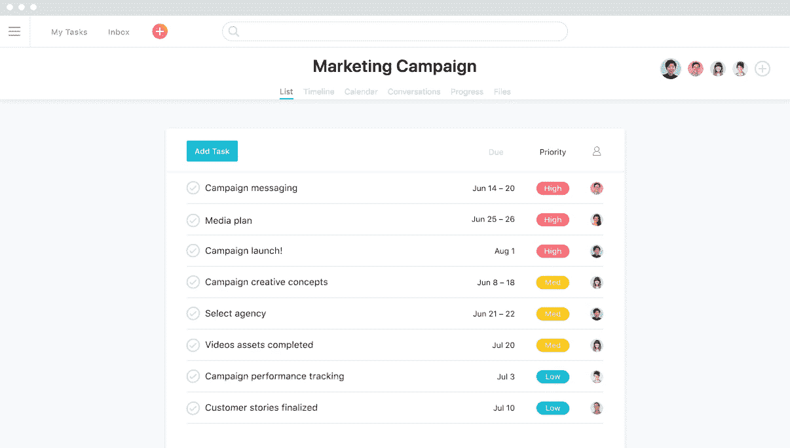

Asana overview

Asana 有一个基于看板系统的板功能，允许你用类似于 Trello 的视觉进度来可视化你的工作。

然而，虽然板是 Trello 产品的核心，但在 Asana 中它只是功能之一(你可能记得，Asana 直到 2016 年才推出它)。

同样值得注意的是，与 Trello 不同，Asana 有一个合适的[任务依赖管理系统](https://asana.com/guide/help/tasks/dependencies):

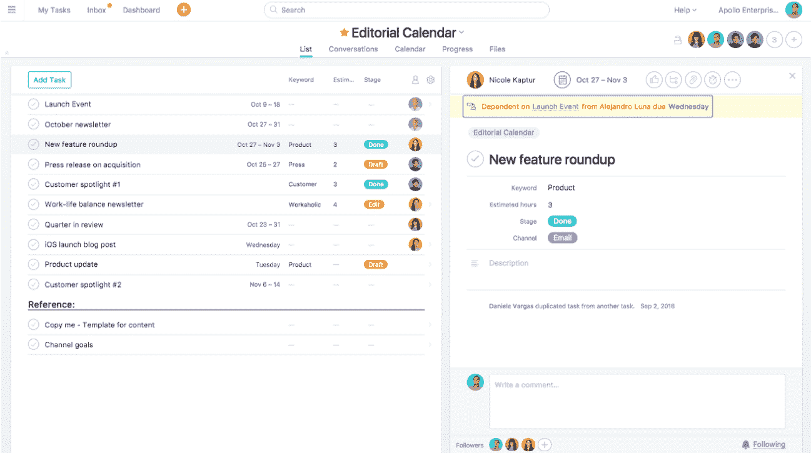

Asana task dependency feature

例如:您可以将一项任务标记为等待另一项任务。然后，一旦第一个任务完成，等待它的人将收到通知，并继续他们自己的任务。

请记住，单个任务可以依赖于多个其他任务，而多个任务可以仅依赖于一个其他任务。

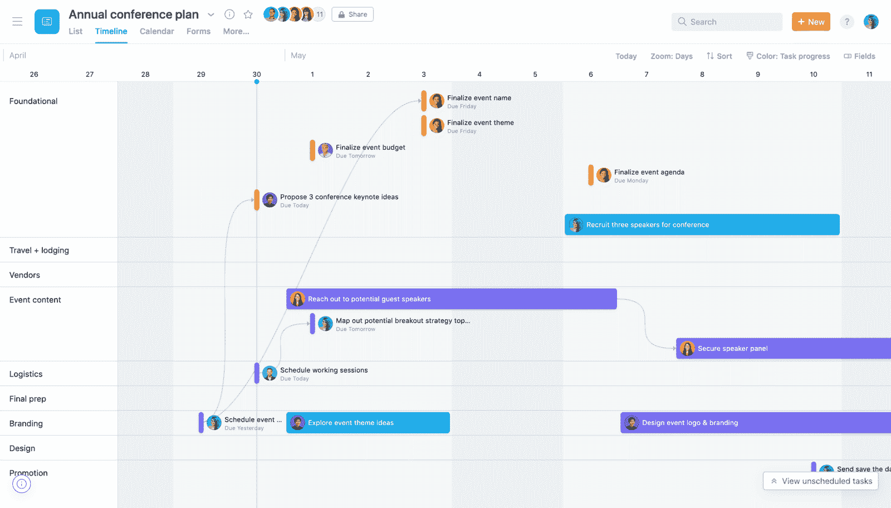

Asana timeline

另一个关键特性是时间线，你可以用它来创建一个计划，显示你的项目的各个部分是如何组合在一起的。这是可视化进度的另一种方式。这有助于你在截止日期前完成工作:

厌倦了体验你的 WordPress 网站的问题？通过 Kinsta 获得最好、最快的主机支持！[查看我们的计划](https://kinsta.com/plans/?in-article-cta)

如果有任何变化，您可以轻松地调整时间线，并查看变化如何影响整个项目。顺便说一下，您可以在时间线上绘制任务依赖关系，这使得跟踪复杂项目中正在进行的一切变得更加容易。

还有日历功能，允许您在日历上查看您的工作，使您能够发现日程冲突，例如:

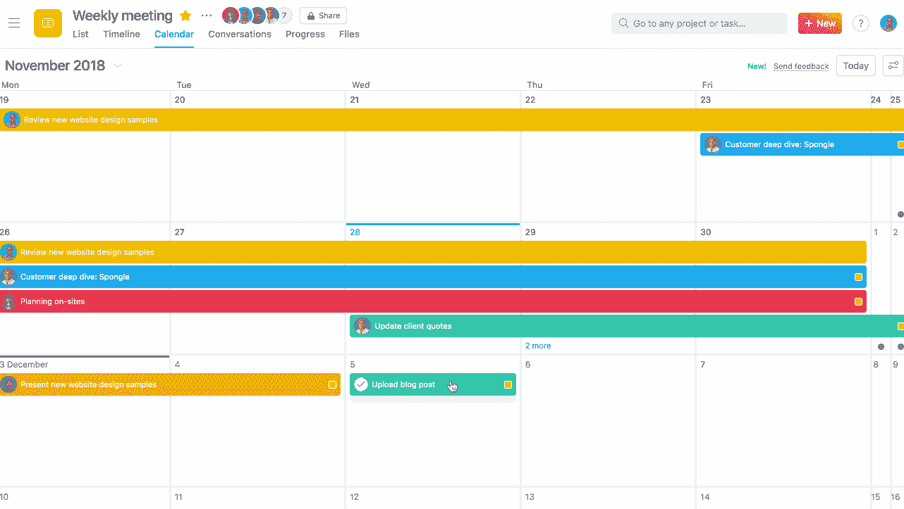

Asana calendar

投资组合功能是一种在一个地方监控你所有计划的简单方法，当你同时处理几个主要项目时，这是很方便的。您还可以实时检查投资组合中的 KPI 和关键信息，以便在任何重大问题发生之前预测它们。

然而，更有趣的是工作负载特性，它使得管理每个团队成员的工作负载变得很容易:

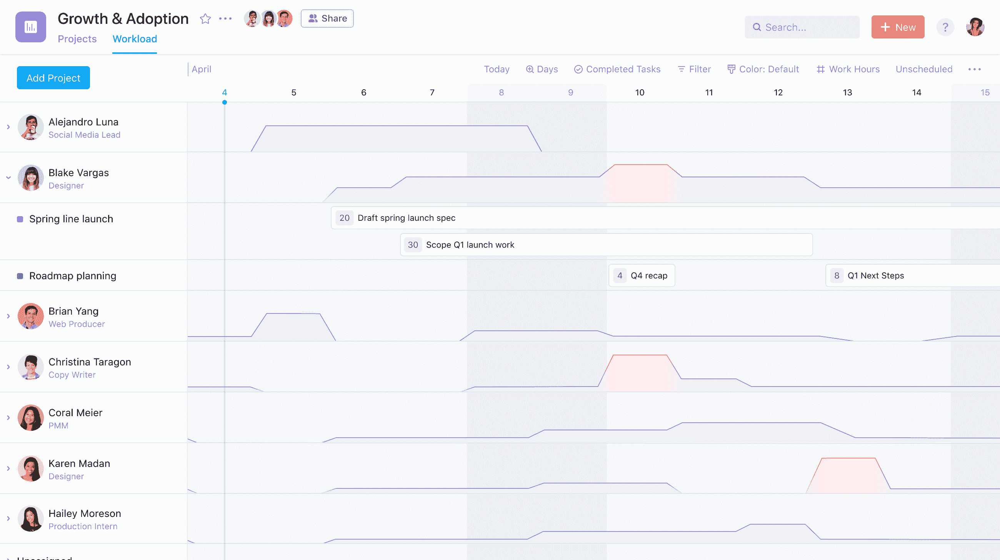

Asana workload

当你管理一个大团队或几个团队时，这是很有价值的。你需要照顾的人越多，就越容易不经意地让某人工作不足或过度劳累。

偶尔出现停工期和紧急时刻是正常的，但长期的工作量管理不善会导致员工不满。这可能会通过降低生产率和员工保留率而使公司损失大量资金。

Asana 还允许您将常见流程转换为模板，这意味着您不必每次都重新发明轮子:

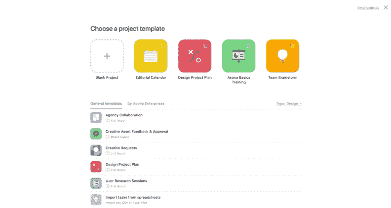

Asana default templates

这一点很重要，因为随着业务的增长，你希望尽可能地简化事情。

您可以通过隐私设置来控制谁可以访问哪些信息，从而确保安全性。

你的团队越大，尤其是如果你使用[自由职业者](https://kinsta.com/blog/best-tools-for-freelancers/)，这个功能就变得越重要，因为你不想让刚进门的人接触到敏感信息。谈到安全性，管理功能允许您控制诸如身份验证和密码强度之类的事情，此外，如果出现安全漏洞，您可以重置所有密码。

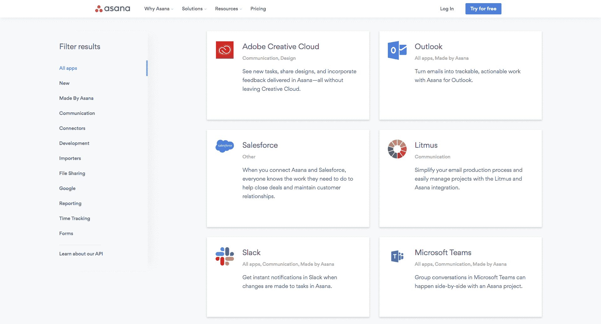

Asana integrations

最后， [Asana 提供了超过 100 个与其他流行工具的集成](https://asana.com/apps)，包括 [Slack](https://kinsta.com/blog/how-to-use-slack/) ，Google Drive，Zapier…甚至 Trello！

### 定价

Asana 有四个定价等级:

*   免费基本计划。它最适合刚刚开始项目管理的个人或团队。
*   保费计划。它最适合想要超越项目管理基础的团队。如果按年计费，费用为 9.99 美元/用户/月，如果按月计费，费用为 11.99 美元/用户/月。
*   商业计划。它最适合需要跨多个项目管理工作的团队和组织。如果按年计费，费用为 19.99 美元/用户/月，如果按月计费，费用为 23.99 美元/用户/月。
*   企业计划。最适合需要额外支持、安全性和控制的组织。如果你想知道价格，你需要联系 Asana 的销售团队。

基本计划非常非常基本。它只包括 Asana 的核心功能，如任务、列表视图、公告板视图、日历视图和截止日期。如果选择此选项，您最多可以与 15 个人合作。

其他计划根据公司的规模与公司的需求相对应:高级计划适用于小型企业，商业计划适用于中型企业，企业计划适用于大型企业。

你可以根据你的团队规模选择一个最适合你公司的计划。

### 体式的优点是什么？

Asana 的主要优势在于它的复杂性和对项目的精细控制。

您拥有管理一个大型团队或几个团队(处理一个复杂项目或同时处理几个复杂项目)所需的所有功能。

对于需要完成的任务之间的关系不直接的情况，它也是理想的，因为它有助于你看到全局。

### 体式最适合谁？

体位法最适合大型组织，在那里几个团队同时进行多个复杂的项目。

对于那些必须监督有很多活动部件的项目的经理来说，这尤其有价值。

然而，如果你有一个小团队，这个软件可能有点大材小用。

## 特雷罗 vs 阿萨纳:顶级差异

特雷罗和阿萨纳的辩论可以归结为简单和复杂。哪个对你更重要？

使用 Trello，您可以获得一个简单、直观、易于使用的软件，并且没有太多的学习曲线。这样做的缺点是，当涉及到真正复杂的项目时，这个工具可能会受到限制。

例如，对于任务间关系复杂的项目来说，缺乏适当的任务依赖系统是一个很大的缺点。

此外，虽然您可以在 Trello 上管理几个简单的项目，但使用该软件同时处理几个复杂的项目可能会很困难。

Trello 的多功能性非常好，因为你可以用它来做任何你能想到的事情(个人待办事项、工作项目、CRM 等等)。).然而，这也意味着它并没有像它应该的那样为业务项目管理进行优化。

另一方面，有了 Asana，你就有了复杂的软件，它有各种各样的功能，让你的生活变得更简单，尤其是当你需要管理复杂的项目和大型团队的时候。

你得到了看板，所以你得到了 Trello 的主要好处，但你也得到所有的附加功能，如时间线、[投资组合](https://kinsta.com/blog/wordpress-portfolio-plugins/)等。这可以帮助您同时管理多个计划。

任务依赖系统是一个巨大的优势，因为没有它很难管理复杂的项目。当然，这也有一个缺点，所有这些特性意味着你需要花一些时间来熟悉这个软件。

额外的复杂性带来了额外的脆弱性。一个人因为还没有完全弄清楚软件而犯错误，可能会对整个项目产生负面影响。

这也可能发生在 Trello 身上，但可能性要小得多，因为 Trello 要简单得多。

## Trello vs Asana:你应该使用哪个项目管理软件？

从财务的角度来看，你会得到更多的帮助。

但是，您还需要考虑学习使用该软件所需的时间投入。

警惕“更多功能，更好产品”的陷阱也很重要。你想要的是以最简单的方式完成工作的软件。如果产品功能足够强大，能够满足您的需求，那么选择功能较少的产品可能是有意义的。

简而言之，对于流程简单的小型企业来说，Trello 可能是更好的选择，而 Asana 则适用于需要额外功能来处理复杂问题的大中型企业。如果你是一家[远程公司](https://kinsta.com/blog/working-remotely/)，这两个工具都是完成工作的完美选择。

最终，这完全取决于你的具体情况。这就是为什么你可能会考虑注册 Asana 和 Trello 的免费计划，并探索产品，看看哪个更能引起你的共鸣。除了这两种，市场上还有很多其他的 Trello 替代品。

[Here's the burning question: @Trello vs @Asana, how do they stack up against each other? Check out our in-depth comparison and pick the best one for your needs! 📌🗂️Click to Tweet](https://twitter.com/intent/tweet?url=https%3A%2F%2Fbit.ly%2F2Zwj2Tv&via=kinsta&text=Here%27s+the+burning+question%3A+%40Trello+vs+%40Asana%2C+how+do+they+stack+up+against+each+other%3F+Check+out+our+in-depth+comparison+and+pick+the+best+one+for+your+needs%21+%F0%9F%93%8C%F0%9F%97%82%EF%B8%8F&hashtags=productivity%2Cprojectmanagement)

## 摘要

特雷罗 vs 阿萨纳:什么是最好的选择？

市场上的每种工具都有其优点和缺点。没有“完美的”项目管理软件。或者，如果你想从另一个角度看问题，最好的项目管理工具是你能自然使用的跟踪你工作的工具。

也许是特雷罗。可能是 Asana 吧。也许是别的原因。重要的是这对你和你的团队有用。

要做到这一点，你需要了解你的业务的真正需求是什么，然后选择满足它们的软件。

* * *

让你所有的[应用程序](https://kinsta.com/application-hosting/)、[数据库](https://kinsta.com/database-hosting/)和 [WordPress 网站](https://kinsta.com/wordpress-hosting/)在线并在一个屋檐下。我们功能丰富的高性能云平台包括:

*   在 MyKinsta 仪表盘中轻松设置和管理
*   24/7 专家支持
*   最好的谷歌云平台硬件和网络，由 Kubernetes 提供最大的可扩展性
*   面向速度和安全性的企业级 Cloudflare 集成
*   全球受众覆盖全球多达 35 个数据中心和 275 多个 pop

在第一个月使用托管的[应用程序或托管](https://kinsta.com/application-hosting/)的[数据库，您可以享受 20 美元的优惠，亲自测试一下。探索我们的](https://kinsta.com/database-hosting/)[计划](https://kinsta.com/plans/)或[与销售人员交谈](https://kinsta.com/contact-us/)以找到最适合您的方式。