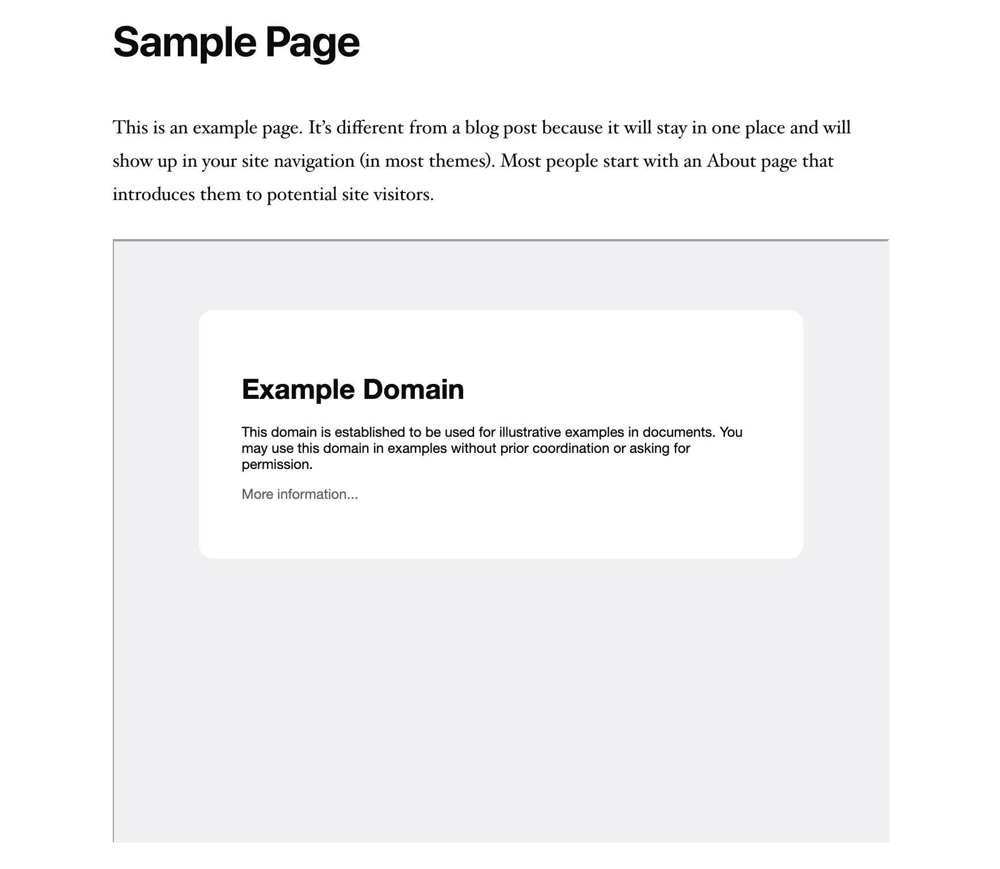
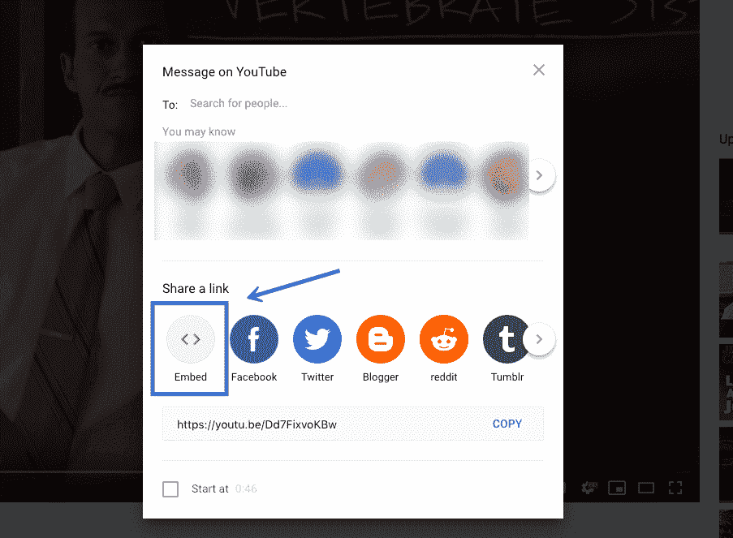
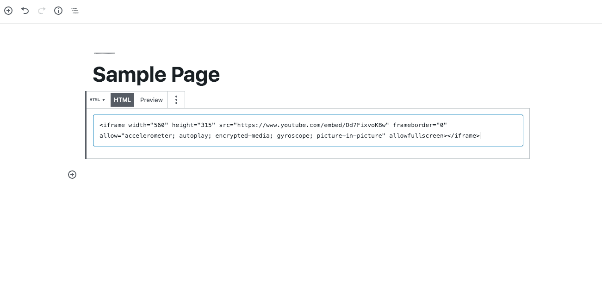
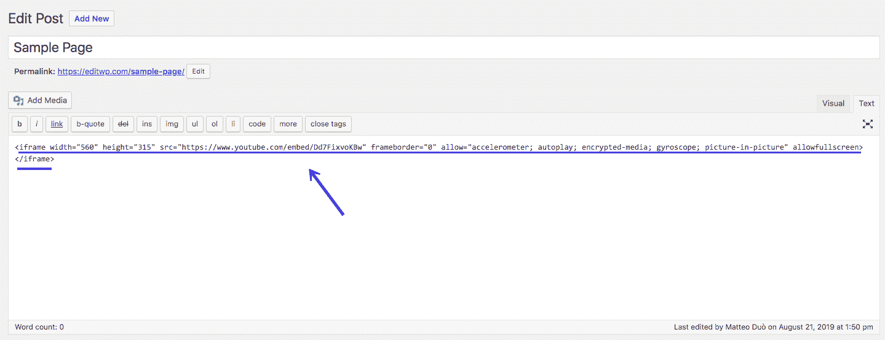
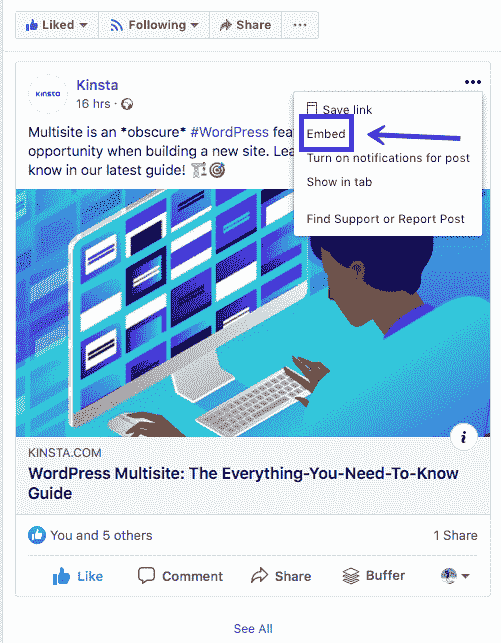
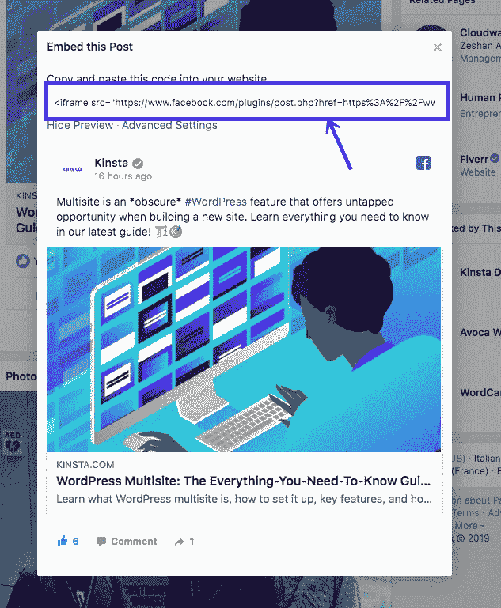
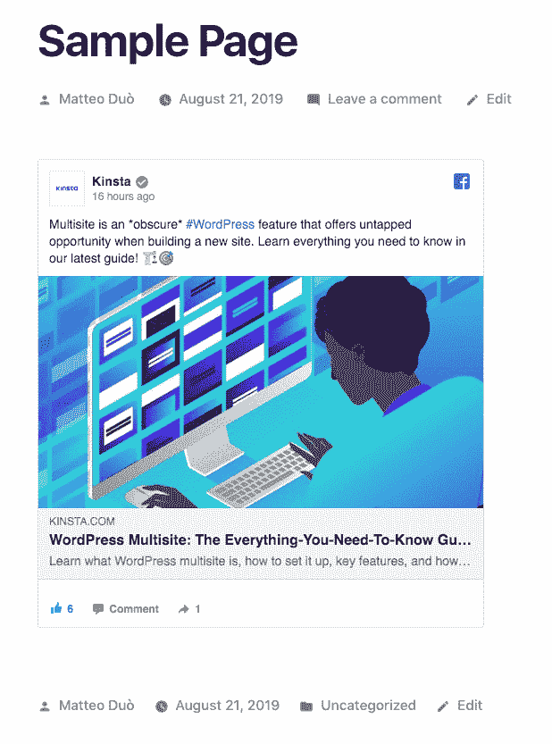

# 如何在你的 WordPress 站点上嵌入 iFrame 代码(手动和使用插件)

> 原文：<https://kinsta.com/blog/wordpress-iframe/>

共享内容是一种相当常见的做法。然而，在你的网站上展示另一个创作者的内容有潜在的法律后果，而托管大的[文件如视频](https://kinsta.com/blog/embed-youtube-video-wordpress/)会损害[你网站的性能](https://kinsta.com/blog/wordpress-performance-benchmarks/)。幸运的是，iFrames 为这些问题提供了一个简单的解决方案。

在这篇文章中，我们将解释什么是 iFrames，以及如何在你的 WordPress 站点上使用它们。

准备好开始了吗？让我们开始吧！

## 什么是 iFrames(以及它们为什么有用)？

iFrame 是一种将网页嵌入到另一个页面内容中的方法。这是通过使用 HTML 标签、外部页面的 URL 以及关于窗口应该如何出现在您的站点上的规范来完成的。

iFrames 通常在两种情况下有用。

第一种是当你希望分享不属于你的内容。在大多数情况下，通过 iFrame 嵌入内容[不被认为是侵犯版权](http://www.dmlp.org/legal-guide/linking-copyrighted-materials)(也参见[欧盟裁决](https://policyreview.info/articles/news/eu-ruling-embedding-does-not-equal-copyright-infringement/337))。因此，与大多数其他选择相比，这通常是一种合法且更道德的分享方式。此外，不能直接访问 iFrame 中的代码。这意味着网站的访问者不能复制嵌入的内容并在其他地方分享。

第二个原因是为了共享大文件，比如视频、音频甚至图像。YouTube 就是一个很好的例子。


> 需要在这里大声喊出来。Kinsta 太神奇了，我用它做我的个人网站。支持是迅速和杰出的，他们的服务器是 WordPress 最快的。
> 
> <footer class="wp-block-kinsta-client-quote__footer">
> 
> 
> 
> <cite class="wp-block-kinsta-client-quote__cite">Phillip Stemann</cite></footer>

[View plans](https://kinsta.com/plans/)

有了 iFrame，你可以在你的网站上显示一个文件的内容，而不必把它放在你的 [WordPress 媒体库](https://kinsta.com/blog/wordpress-media-library/)中。这很重要，因为这些类型的媒体文件通常会占用大量的存储空间，甚至会[拖慢你网站的速度](https://kinsta.com/learn/speed-up-wordpress/)。

通过在 YouTube 等平台上托管你的视频，然后用 iFrames 把它们嵌入你的 WordPress 网站，你可以避免直接上传到你的网站的缺点。这种技术将帮助你成为网络社区中更有道德的一员，并且[保持你的网站快速](https://kinsta.com/blog/third-party-performance/)且易于使用。

## 如何在 WordPress 中使用 iFrames 种方法)

正如您可能希望在各种场景中使用 iFrame 一样，实现一个 iFrame 也有多种方法。下面，我们将探索三种最常见的方法来添加 iFrames 到你的 WordPress 站点。

### 1.手动在 WordPress 中添加 iFrames

向页面添加 iFrame 的基本代码相当简单。您只需要开始和结束的 HTML 标记，以及您希望嵌入的网页的 URL:

```
<iframe src="example.com"></iframe>
```

关于源 URL，有一些限制需要注意。首先，iFrames 只能显示与你使用相同超文本传输协议的网站的内容。换句话说，如果你的网站使用 HTTPS，你只能嵌入其他 HTTPS 网站的内容。同样，如果您使用 HTTP，您只能嵌入也使用 HTTP 的 URL。

此外，一些受欢迎的网站——如[脸书](https://kinsta.com/blog/how-to-create-a-facebook-page/)和 YouTube——禁止手动嵌入 iFrame。试图显示来自不允许内嵌 iFrame 的站点的页面将在您的窗口中显示一个错误:


iFrame embedding disabled


如果您能够使用这种方法，那么知道您也可以定制您的 iFrames 来满足您的站点的需求是很重要的。这就是 iFrame 参数发挥作用的地方。一些最常见的包括:

*   **Width:** 该参数使您能够以像素为单位设置 iFrame 的特定宽度。
*   **Height:** 和 width 参数一样，Height 决定了网页上 iFrame 窗口的像素大小。
*   **Allow:** 使用此参数，您可以为您的 iFrame 设置某些默认行为或功能，例如全屏查看或支付处理。
*   **重要性:**您可以使用该参数来指定 iFrame 应该何时加载。

例如，下面是一个窗口大小为 900 像素×700 像素的 iFrame 的代码，启用了全屏查看，并设置为在网页的其余部分之后下载:

```
<iframe src="example.com" width="900" height="700" allow="fullscreen"></iframe>
```

在前端，iFrame 可能是这样的:



How an iFrame looks on the frontend


还有[其他参数](https://developer.mozilla.org/en-US/docs/Web/HTML/Element/iframe#Attributes)你也可以考虑使用。然而，上面列出的那些应该能够让你创建基本的 iFrames，用于在你的站点上共享 YouTube 视频或其他内容。

### 2.使用嵌入代码创建 iFrames

有些网站限制您是否可以在 iFrames 中手动嵌入它们的内容。这可能会使某些类型的内容难以显示，如脸书的帖子或 YouTube 视频。然而，这并不意味着您不能在 iFrames 中显示来自这些来源的内容。

相反，你只需要访问必要的嵌入代码就可以了。让我们以 YouTube 为例来看看这是如何工作的。去看看你想嵌入的视频，不管是你的还是其他创作者的。在视频播放器下方，您应该会看到一个**分享**按钮:


YouTube’s share feature


点击此按钮，将会打开一个窗口，显示各种可用的共享选项。其中一个是**嵌入**:

## 注册订阅时事通讯


### 想知道我们是怎么让流量增长超过 1000%的吗？

加入 20，000 多名获得我们每周时事通讯和内部消息的人的行列吧！

[Subscribe Now](#newsletter)



YouTube embed feature


当您选择**嵌入**选项时，YouTube 将显示一个 HTML 片段，您可以使用它将视频添加到 iFrame 中。它包括某些 iFrame 参数，如果您愿意，可以复制和使用这些参数。否则，您也可以选择简单地复制源 URL:


YouTube’s embed code


当您使用嵌入代码时，视频将显示在您的 iFrame 中，而不是您尝试使用标准 URL 时会看到的错误。

要在块编辑器中将它添加到页面或文章中，您可以使用一个**自定义 HTML** 块:



Embedding iframe as a custom HTML block


在经典编辑器中，您需要切换到[文本编辑器](https://kinsta.com/blog/best-text-editors/)并在相关点添加代码:



Embedding iframe as a custom HTML in Classic Editor


结果应该是一个正常工作的 iFrame:


iFrame properly added in WordPress


你可以按照类似的过程在你的网站上嵌入一篇脸书的文章。导航到你想分享的文章，点击文章右上角的三点图标:


Facebook’s embed feature


然后，选择**嵌入**选项:

厌倦了低于 1 级的 WordPress 托管支持而没有答案？试试我们世界一流的支持团队！[查看我们的计划](https://kinsta.com/plans/?in-article-cta)



Select Facebook’s embed feature


这将显示一个 HTML 片段，与我们之前看到的 YouTube 视频非常相似。同样，源 URL 是这段代码中最重要的部分，尽管您也可以使用预先确定的参数:



Facebook’s iframe code


将此代码添加到您的网页中，帖子应该会正常显示:



Facebook’s iframe embedded on WordPress


许多流行的社交媒体网站，包括 LinkedIn、Instagram 和 Twitter，也为他们的帖子提供嵌入代码。你通常会在每个帖子的设置中找到这个选项。

(建议阅读:[如何修复 WordPress](https://kinsta.com/blog/facebook-oembed/) 中的脸书 oEmbed 问题)

### 3.使用插件将 iFrames 添加到 WordPress

当然，WordPress 开发者总是致力于简化任务，比如通过使用插件来嵌入 iFrames。如果您计划经常在站点上嵌入外部内容，那么您可能需要考虑两个选项。最流行的解决方案是 iFrame 插件:


iframe WordPress plugin


这个插件允许你使用短代码添加 iFrames 到你的 [WordPress 站点。您可以指定所有与通过 HTML 手动添加 iFrame 时相同的参数。但是，您不必担心直接处理页面代码。](https://kinsta.com/blog/wordpress-shortcodes/)

或者，你也可以试试[高级 iFrame](https://wordpress.org/plugins/advanced-iframe/) 插件:


Advanced iFrame WordPress plugin


同样，这个插件允许你使用短代码添加 iFrames 到你的站点。但是，它还包括几个额外的特性，比如防止其他用户未经您的允许嵌入 iFrames 的安全代码、自定义样式选项等等。

花 20 美元，你就可以升级到一个[高级 iFrame Pro](https://codecanyon.net/item/advanced-iframe-pro/5344999) 六个月的许可证。这个版本产生响应性 iFrames，并支持缩放功能和延迟加载等特性。根据您计划在站点上使用 iFrames 的频率，这些选项可能值这个高价。

[Need to feature a video, audio clips, or someone's else content on your site? Learn how to embed iFrame code in WordPress with this in-depth guide! 📹🖼️Click to Tweet](https://twitter.com/intent/tweet?url=https%3A%2F%2Fkinsta.com%2Fblog%2Fwordpress-iframe%2F&via=kinsta&text=Need+to+feature+a+video%2C+audio+clips%2C+or+someone%27s+else+content+on+your+site%3F+Learn+how+to+embed+iFrame+code+in+WordPress+with+this+in-depth+guide%21+%F0%9F%93%B9%F0%9F%96%BC%EF%B8%8F&hashtags=iframe%2Cwordpress)

## 摘要

保持你的网站运行良好并符合法律是至关重要的。iFrames 不仅可以帮助你以一种合乎道德的方式分享他人的内容，还可以让你显示视频和音频文件，而不必将它们放在你的网站上。在这篇文章中，我们看到了在 WordPress 中使用 iFrames 的三种方法:

1.  手动合并 WordPress 站点和 iFrames。
2.  使用嵌入代码创建 iFrames。
3.  使用 WordPress 插件添加 iFrame，比如 iFrame 或 Advanced iFrame。

关于 iFrames 或者如何在你的 WordPress 网站上使用它们，你有什么问题吗？请在下面的评论区告诉我们！

* * *

让你所有的[应用程序](https://kinsta.com/application-hosting/)、[数据库](https://kinsta.com/database-hosting/)和 [WordPress 网站](https://kinsta.com/wordpress-hosting/)在线并在一个屋檐下。我们功能丰富的高性能云平台包括:

*   在 MyKinsta 仪表盘中轻松设置和管理
*   24/7 专家支持
*   最好的谷歌云平台硬件和网络，由 Kubernetes 提供最大的可扩展性
*   面向速度和安全性的企业级 Cloudflare 集成
*   全球受众覆盖全球多达 35 个数据中心和 275 多个 pop

在第一个月使用托管的[应用程序或托管](https://kinsta.com/application-hosting/)的[数据库，您可以享受 20 美元的优惠，亲自测试一下。探索我们的](https://kinsta.com/database-hosting/)[计划](https://kinsta.com/plans/)或[与销售人员交谈](https://kinsta.com/contact-us/)以找到最适合您的方式。