# 如何安装 WordPress 主题(3 个简单的方法)

> 原文:[https://kinsta.com/blog/how-to-install-a-wordpress-theme/](https://kinsta.com/blog/how-to-install-a-wordpress-theme/)

WordPress 是世界上[最广泛使用的内容管理系统](https://kinsta.com/wordpress-market-share/)，用于建立自托管网站。如果你还没有，你可能已经决定在你自己的网站上使用 WordPress。但是你知道**如何安装一个 WordPress 主题**吗？

理解如何将主题添加到你的网站上一点也不复杂，不管你选择使用哪种方法——*，这里有一些！*最棒的是，一旦你的主题安装完毕，你就可以马上开始创建一个出色的网站了。

在今天的帖子中，我们将深入探讨如何安装 WordPress 主题。具体来说，我们将涵盖:

 <kinsta-auto-toc heading="Table of Contents" exclude="last" list-style="arrow" selector="h2" count-number="-1">我们开始吧！

### 更喜欢看[视频版](https://www.youtube.com/watch?v=_Rd9LTGvb2A)？

<kinsta-video src="https://www.youtube.com/watch?v=_Rd9LTGvb2A"></kinsta-video>

## 在哪里可以找到 WordPress 主题(免费和付费)

学习如何在你的网站上安装 WordPress 主题并不难。然而，困难的是为你的需求选择正确的主题。但是在我们看你需要什么来成功地实现它之前，让我们快速地看一下你能在哪里找到 WordPress 主题。

<link rel="stylesheet" href="https://kinsta.com/wp-content/themes/kinsta/dist/components/ctas/cta-mini.css?ver=2e932b8aba3918bfb818">

> Kinsta 把我宠坏了，所以我现在要求每个供应商都提供这样的服务。我们还试图通过我们的 SaaS 工具支持达到这一水平。
> 
> <footer class="wp-block-kinsta-client-quote__footer">
> 
> 
> 
> <cite class="wp-block-kinsta-client-quote__cite">Suganthan Mohanadasan from @Suganthanmn</cite></footer>

[View plans](https://kinsta.com/plans/)

现在，WordPress 知识库是最常见的地方之一，可以找到可靠的免费插件和[主题](https://wordpress.org/themes/)来扩展你的 WordPress 网站的设计和功能。事实上，仅在 WordPress 知识库中就有超过 7400 个主题。

除此之外，WordPress 用户还可以在 MOJO Marketplace、CSS Igniter 和 StudioPress 等市场上找到数千种免费和付费主题。也就是说，迄今为止最著名的主题市场是 [Themeforest](https://kinsta.com/blog/themeforest-pros-cons/) ，目前有超过 46000 个 WordPress 主题可供选择。

## 如何选择合适的主题

> 那么，你怎么知道哪个 WordPress 主题适合你呢？

这里有一些小技巧可以帮忙:
<kinsta-advanced-cta language="en_US" type-int-post="53771" type-int-position="0"></kinsta-advanced-cta>

### 1.决定是免费的还是付费的 WordPress 主题

[免费 vs 付费 WordPress 主题辩论](https://kinsta.com/blog/wordpress-free-vs-paid-themes/)由来已久。这使得很难知道你是应该省钱去买一个免费的主题，还是投资一小笔钱买一个高级的主题，然后[就能从中获益。如果你遇到一个主题你喜欢的 WordPress 网站，你可以使用我们的](https://kinsta.com/blog/spend-money-to-make-money/)[主题检测工具](https://kinsta.com/tools/what-is-my-ip/wordpress-theme-detector/)来找出它使用的主题。

这确实取决于您的预算，在做出最终选择之前，有一些事情需要考虑:

#### **使用免费主题的好处**

使用免费的 WordPress 主题有很多好处:

*   它们可以免费使用，这意味着如果你最终不喜欢它，并想[改变你的 WordPress 主题](https://kinsta.com/blog/change-wordpress-theme/)，你尝试一下也不会损失什么钱。
*   WordPress 知识库中的免费主题在经过严格的审核过程后被正式批准。
*   在 WordPress.org 发现的免费主题将与在同一个地方发现的所有免费插件兼容。

也就是说，免费主题也有一些缺点。

例如，它们通常具有有限的功能集，被许多人使用(这使得创建一个独特的网站很难)，并且如果出现问题，通常很少甚至没有提示支持。更不用说，在 WordPress 库之外找到的免费主题可能编码很差，这将使你的网站暴露于[漏洞和攻击](https://kinsta.com/blog/wordpress-security/)。

#### **使用高级 WordPress 主题的好处**

就像使用免费主题一样，高级主题也有自己的好处:

*   你得到支持来帮助你解决问题、技术问题和定制(建议阅读:[如何定制你的 WordPress 主题](https://kinsta.com/blog/how-to-customize-wordpress-theme/))。
*   您将收到[个频繁更新](https://kinsta.com/blog/how-to-update-wordpress-theme/)，这些更新增加了安全性和功能。
*   功能集的范围从温和到狂野，所以你可以设计你的站点来做你想做的任何事情。
*   如果来自一个可信的主题市场、公司或开发者，你会知道你的高级主题是最新版本的 WordPress、HTML、 [CSS](https://kinsta.com/blog/wordpress-css/) 和 PHP。

然而，高级主题是要花钱的。有些付费主题需要按年付费，有些则需要一次性付费。这意味着如果你买了一个，然后决定换一个，你就失去了所有的钱。
<kinsta-advanced-cta language="en_US" type-int-post="53771" type-int-position="1"></kinsta-advanced-cta>

### 2.了解你的定位

[WordPress 迎合各种网站](https://kinsta.com/blog/wordpress-site-examples/)，所以你可以期待 WordPress 主题也是如此。在你决定一个主题之前了解你的定位会帮助你找到你需要的设计和功能的主题。

例如，如果[你正在创建一个 WordPress 美食博客](https://kinsta.com/blog/how-to-start-a-food-blog/)，你会想要寻找一个迎合美食网站的 WordPress 博客主题。更好的是，如果你认为你可能想要[向像你一样的美食爱好者出售产品和服务](https://kinsta.com/blog/wordpress-ecommerce-plugins/)，你可能想要查看一些电子商务主题，这些主题带有启动在线食品业务和博客的功能。

为了做出一个好的决定，考虑你要发布的内容类型，你的主题需要的关键特征，你的目标受众，以及你想从事的行业，这样你就可以缩小你的选择范围，让决定变得更容易一些。

### 3.使用可靠的来源

任何能开发 WordPress 主题并从中获利的人都会。但问题是，仅仅因为有人创建了一个 WordPress 主题并不意味着它没有恶意代码、病毒，甚至垃圾链接。

如果你决定使用免费的 WordPress 主题，最好的地方是 WordPress 知识库。如果您需要高级主题或想要使用第三方主题公司的免费主题，请检查以下内容:

*   作者声誉
*   更新频率
*   正面的客户评价
*   销售数量

最后，你需要什么类型的 WordPress 主题并不重要。真正重要的是你[避免使用空的 WordPress 主题](https://kinsta.com/blog/nulled-wordpress-plugins-themes/)，这样你在未来就不会有网站安全、[停机](https://kinsta.com/blog/website-downtime/)和失去网站访问者的问题。

### 4.保持简单

人们很容易被流行的多用途 WordPress 主题的吸引力所吸引，例如 Avada 或 x。虽然这些主题可能有一些人需要的功能和设计，但事实是，简单往往更好。

对于那些刚刚起步的人来说尤其如此。有时候多用途主题有太多的特性，有很高的学习曲线，并且影响你网站的速度和性能。

最好使用一个主题，这个主题只包含你需要的东西，别无其他。
<kinsta-advanced-cta language="en_US" type-int-post="53771" type-int-position="2"></kinsta-advanced-cta>

### 5.寻找响应式设计

不要与手机友好型设计混淆，[响应式设计](https://kinsta.com/blog/responsive-web-design/)对于给你的移动网站访问者带来卓越的用户体验是必要的。

拥有一个手机友好的 WordPress 主题意味着无论你的网站访问者从什么设备访问你的网站，它都是一样的。网站访问者将能够看到您网站的所有内容，轻松地浏览网站，并单击您希望他们单击的 CTA 按钮。也就是说，无论访问网站的设备或屏幕大小如何，网站上的元素都不会改变。

为了检查手机友好性，使用谷歌的手机友好测试。

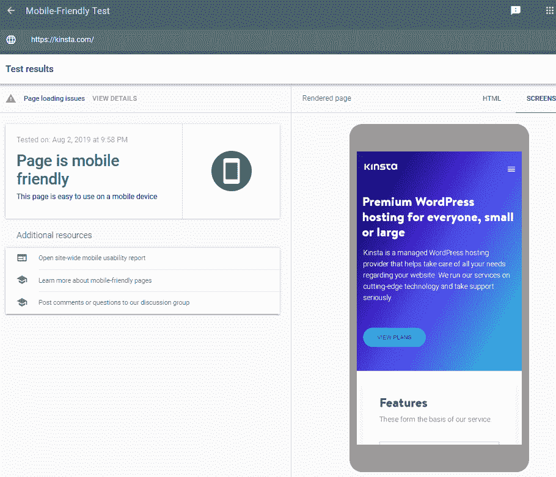

Google mobile-friendly test

另一方面，有一个带有响应式设计的 WordPress 主题意味着当你的网站访问者使用移动设备点击你的网站时，你的网站会根据屏幕大小进行调整。您网站上的元素将发生变化，以无缝呈现给网站访问者，使他们可以轻松访问您的网站内容。

要检查响应式设计，请使用免费的[响应式检查工具](https://www.websiteplanet.com/webtools/responsive-checker/):

Responsive Checker

这个在线工具的优点是，你可以使用多种设备类型来评估你的网站，包括笔记本电脑、平板电脑和手机。此外，您可以像使用移动设备一样浏览站点，以确保站点的外观和功能符合站点访问者的要求。

### 6.评估主题支持

当你使用你的 WordPress 主题时，可能会有一段时间[需要支持。这就是为什么能够与主题开发者或他们的支持团队取得联系是至关重要的。](https://kinsta.com/blog/wordpress-support/)

在决定 WordPress 主题之前，先弄清楚它提供了什么样的支持。记住，大多数免费的 WordPress 主题几乎没有支持，如果有的话。

### 7.考虑特征

最后，你一定要考虑你的 WordPress 主题的特性。以下是您选择的任何主题中的一些最佳内容，无论是免费主题还是高级主题:

*   [社交媒体分享](https://kinsta.com/blog/wordpress-social-media-plugins/)
*   内置 [SEO 优化](https://kinsta.com/blog/what-does-seo-stand-for/)
*   跨浏览器兼容性
*   兼容的 [WordPress 页面生成器](https://kinsta.com/blog/wp-page-builder/)更容易创建网站
*   [热门 WordPress 插件](https://kinsta.com/best-wordpress-plugins/)兼容性
*   [多语言和翻译就绪](https://kinsta.com/blog/wordpress-multilingual/)
*   [电子商务支持](https://kinsta.com/knowledgebase/migrating-dynamic-wordpress-sites/)

当然，每个人对自己的网站都有不同的需求。然而，上述考虑将有助于为您指出正确的方向，并帮助您做出决定。

现在，让我们来看看在你选择了一个完美的主题后，如何在你的网站上安装一个 WordPress 主题。

## 如何安装免费的 WordPress 主题

如果你想在你的网站上使用 WordPress 知识库中的主题，最简单的方法是在你网站的后端。

 ## 注册订阅时事通讯

### 想知道我们是怎么让流量增长超过 1000%的吗？

加入 20，000 多名获得我们每周时事通讯和内部消息的人的行列吧！

[Subscribe Now](#newsletter)

首先，登录你的 WordPress 网站，进入 WordPress 仪表盘中的**外观** > **主题**，点击**添加新的**。

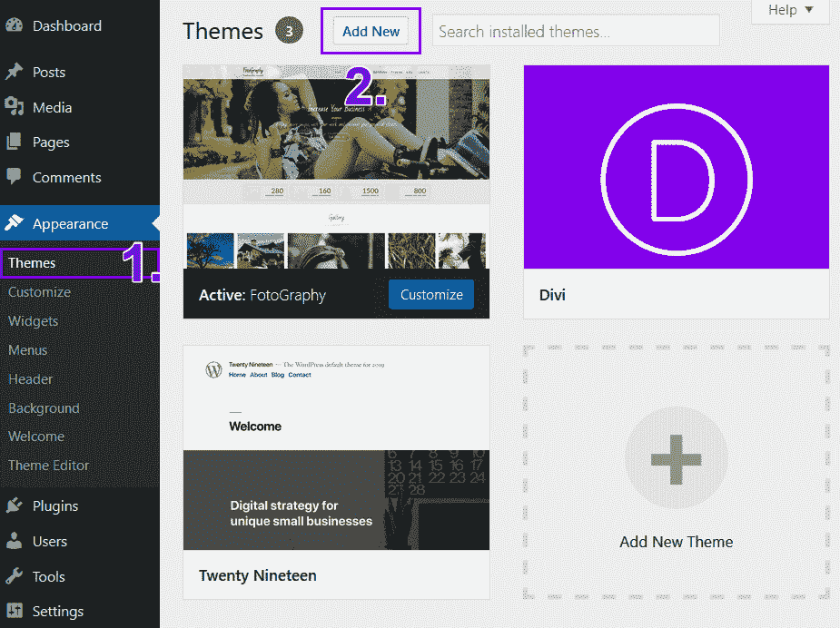

Adding a new WordPress theme

在那里，您可以根据以下条件过滤结果:

*   作为特色的
*   流行的
*   最近的
*   收藏夹

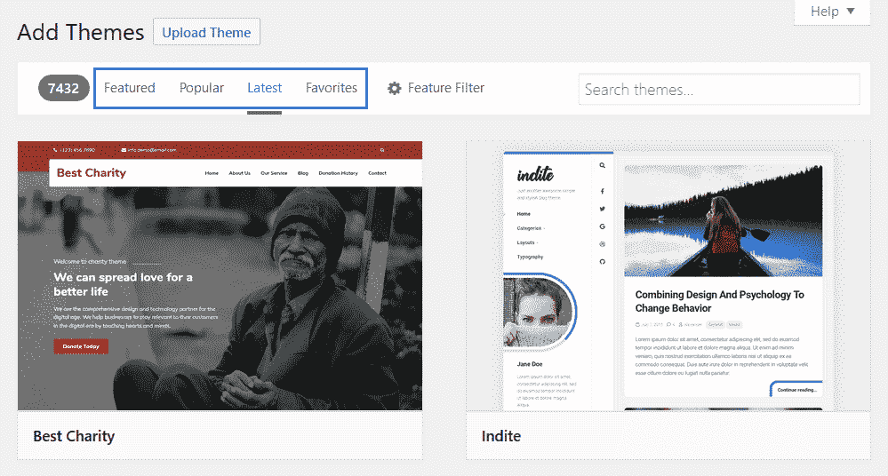

Filter theme results

或者，您可以使用**功能过滤器**按钮根据特定功能过滤主题结果。

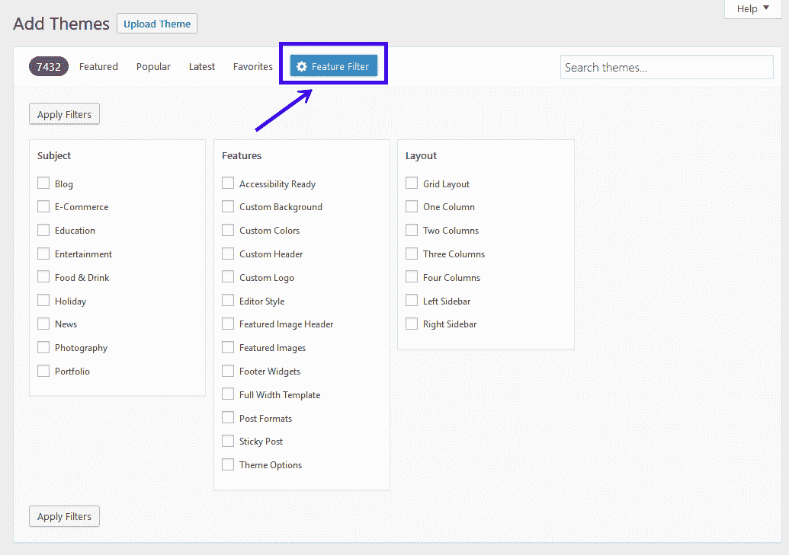

Feature filter

最后，如果你知道主题的名字，你可以通过在搜索栏中输入主题的名字来搜索特定的主题:

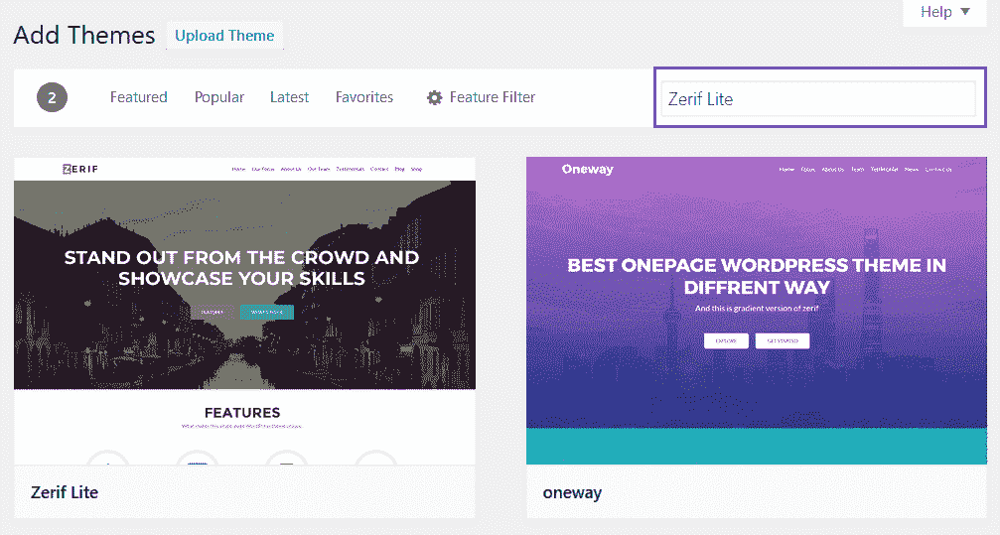

一旦你找到了你可能想要使用的主题，你可以点击**细节和预览**来查看关于主题的更多信息，点击**预览**来查看主题的预览，或者点击**安装**来将主题安装到你的 WordPress 站点上:

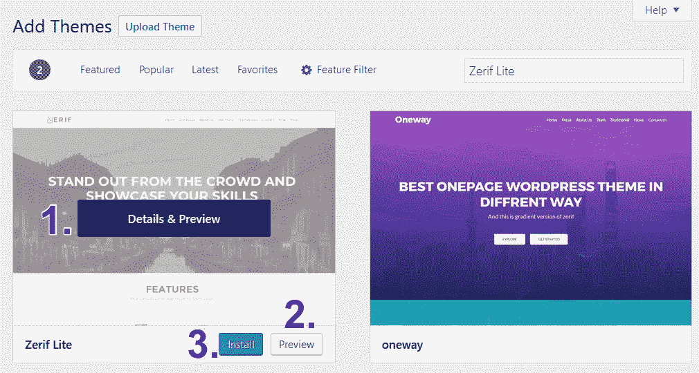

Preview or install a WordPress theme

当你决定使用 WordPress 知识库中的主题时，点击**安装**。

然后，首先点击**实时预览**，看看你的网站使用这个主题会是什么样子。这让你更容易决定你感兴趣的主题是否适合你。做出决定后，点击**激活**完成将其添加到您的网站。

你的 WordPress 主题现在已经安装在你的网站上，你可以马上开始发布内容了。

## 如何安装高级 WordPress 主题

如果你已经购买了一个高级的 WordPress 主题，你需要从你的 WordPress 仪表盘使用上传方法来安装你的主题。

首先，从主题市场或购买公司下载您购买的主题。将下载的 zip 文件保存到您的计算机上。

接下来，登录你的 WordPress 网站，进入 WordPress 仪表盘中的**外观** > **主题**，点击**添加新的:**

Adding a new WordPress theme

接下来，点击**上传主题**将你的高级 WordPress 主题的 zip 文件从你的电脑上传到你的网站:

与宕机和 WordPress 问题做斗争？Kinsta 是一款考虑到性能和安全性的托管解决方案！[查看我们的计划](https://kinsta.com/plans/?in-article-cta)

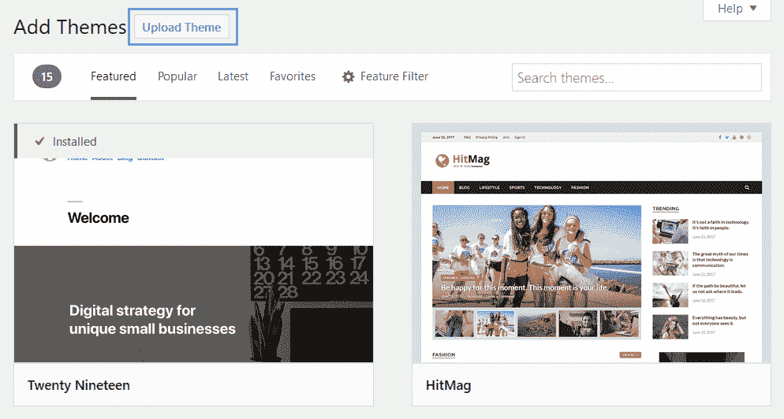

Upload theme feature in WordPress

点击**浏览**从您的电脑中选择 zip 文件。

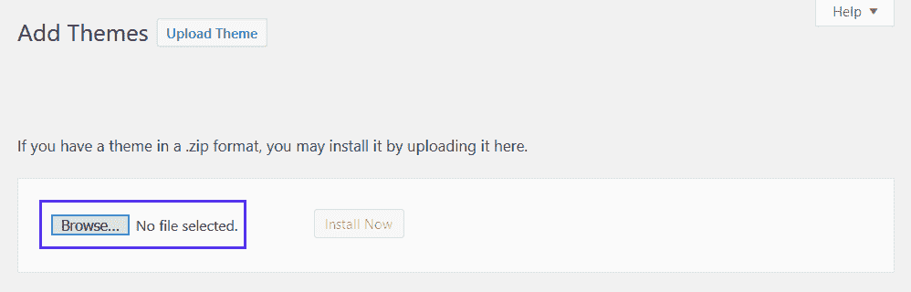

Upload your zip file

然后，点击**立即安装**将主题添加到您的网站。

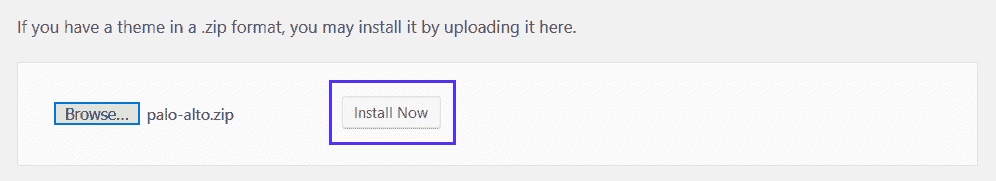

Install a premium WordPress theme

WordPress 会在你的网站上安装你的高级主题。如果你想看看你的网站将如何使用上传的主题，点击**实时预览**。

最后，点击**激活**,使主题可以在你的网站上运行。

上传方法适用于任何你保存为 zip 文件的高级 WordPress 主题。当您需要从 ThemeForest 导入主题时，它也可以工作。只需下载保存在您计算机上的 zip 文件，并遵循上述相同的步骤。

## 如何使用 FTP 安装 WordPress 主题

我们将向您展示的最后一种方法是使用 FTP ( *文件传输协议*)，这是用于在计算机网络上的客户端和服务器之间传输计算机文件的标准网络协议。换句话说，FTP 帮助你在你和你网站的服务器之间上传文件。

有几个 FTP 客户端你可以使用，但我们将使用 [FileZilla](https://kinsta.com/blog/best-ftp-clients/#Filezilla) ，它很容易在你的电脑上下载。它可以免费使用，界面简单。但是，请记住，这是在你的网站上安装 WordPress 主题的一种高级方式，不建议初学者使用。

### 步骤 1:保护 FTP/SFTP 凭据

首先，你需要获得你的 FTP 或 [SFTP 凭证](https://kinsta.com/knowledgebase/how-to-use-sftp/)进入 FileZilla，这样它就可以连接到你网站的服务器(了解 [FTP 和](https://kinsta.com/knowledgebase/ftp-vs-sftp/)SFTP 的区别)。这些信息通常可以在你的虚拟主机账户中找到。如果你找不到它，联系你的主人，让他们帮助你。

如果您使用 Kinsta 主机，首先登录您的 [MyKinsta 帐户](https://my.kinsta.com)，点击仪表板中的**站点**，然后点击**信息**，获取所需的凭证:

当你这样做的时候，你应该在 **SFTP/SSH** 下看到你的凭证。您需要您的用户名、密码和端口:

### 步骤 2:在 FileZilla 中输入凭证

找到 FTP/SFTP 凭证后，打开 FileZilla。

以下是您需要输入的信息:

*   **Host** :来自你的 MyKinsta dashboard(或者你的站点的 IP 地址前面加上“sftp://”,用于其他主机提供商)
*   **用户名**:来自你的 MyKinsta 仪表盘
*   **密码**:来自你的 MyKinsta 仪表盘
*   **端口**:从你的 MyKinsta 仪表盘

这是它在 FileZilla 屏幕顶部的外观:

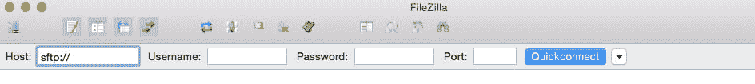

Using SFTP in FileZilla

输入凭证后，点击**快速连接**。然后 FileZilla 会连接到你网站的服务器。

### 步骤 3:上传 WordPress 主题文件

当你连接到你的 FTP 后，是时候在你的网站上安装一个 WordPress 主题了。请记住，FileZilla 的左边是您访问计算机文件的方式，FileZilla 的右边是您访问存储在主机服务器上的站点文件的方式。

要打开你网站的文件，点击右边面板中的文件夹，直到你找到标有**主题:**的文件夹

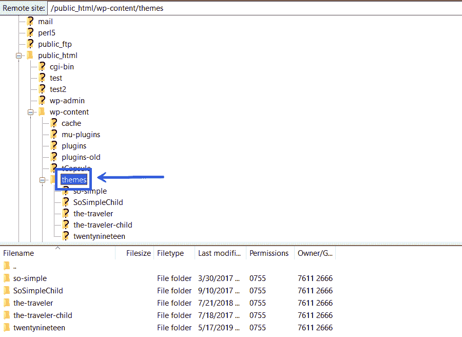

WordPress themes folder

当你这样做的时候，任何已经安装在你网站上的 WordPress 主题都会出现在文件夹下面。

接下来，进入 FileZilla 的左侧面板，搜索你想要安装的 WordPress 主题的 zip 文件。找到后，点击右键，选择**上传:**

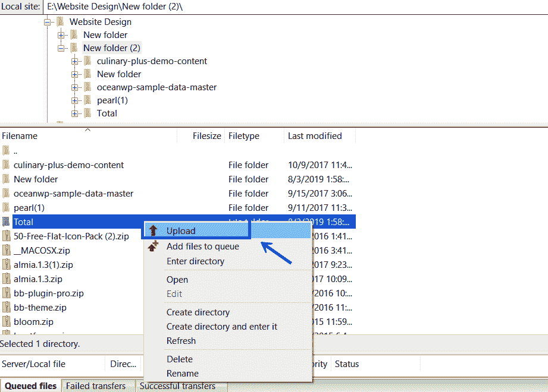

Uploading WordPress theme via FTP

当文件上传到你站点的服务器后(这可能需要一段时间，取决于文件的大小)，你会在 FileZilla 的右边面板看到这些文件。

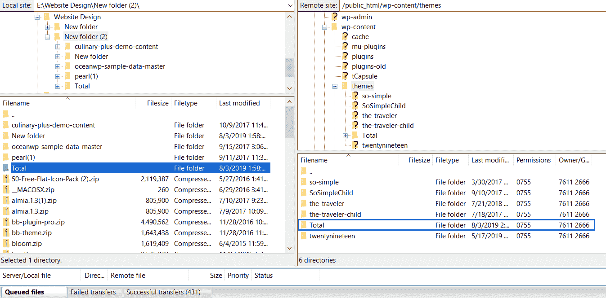

最后，登录你的 WordPress 网站，进入**外观** > **主题**。你会注意到你新上传的主题就在那里，等着你激活并在你的网站上使用。

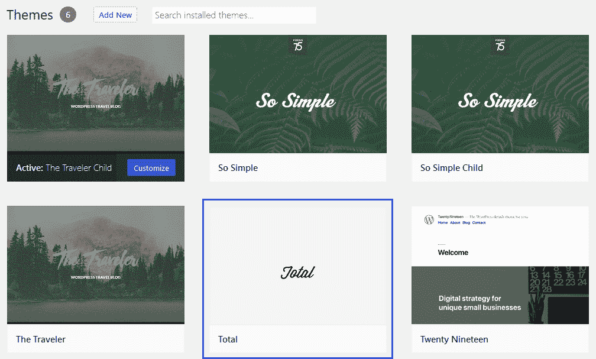

[Installing a new theme is always a crucial moment! Learn 3 different ways you can use with this step-by-step tutorial and get your site a new look in minutes 👀🔜Click to Tweet](https://twitter.com/intent/tweet?url=https%3A%2F%2Fkinsta.com%2Fblog%2Fhow-to-install-a-wordpress-theme%2F&via=kinsta&text=Installing+a+new+theme+is+always+a+crucial+moment%21+Learn+3+different+ways+you+can+use+with+this+step-by-step+tutorial+and+get+your+site+a+new+look+in+minutes+%F0%9F%91%80%F0%9F%94%9C&hashtags=wordpresshelp%2Cthemes)

## 摘要

如果你打算用 WordPress 作为你的[内容管理系统](https://kinsta.com/knowledgebase/content-management-system/)，你需要知道如何安装一个 WordPress 主题。很有可能，你会浏览几个 WordPress 主题，直到你找到你喜欢的并且拥有你需要的一切。

幸运的是，安装 WordPress 主题不仅有几种方法可供选择，而且 all‌ ‌of‌ ‌them‌ ‌are 也相对简单，即使对于网站新手来说也是如此:

1.  你可以直接在 WordPress 中通过**外观** > **主题** > **添加新的**选项来安装主题。
2.  您可以通过**上传主题**功能将主题上传为 zip 文件来安装。
3.  您可以使用 FTP 客户端安装主题。

所以，做一点研究，为你的[博客](https://kinsta.com/blog/best-wordpress-themes-for-blogs/)、在线商务或者[电子商务商店](https://kinsta.com/blog/woocommerce-tutorial/)找到完美的 WordPress 主题。然后，把它安装到你的 WordPress 网站上，这样你就可以开始建立一个代表你品牌的独特网站。

* * *

让你所有的[应用程序](https://kinsta.com/application-hosting/)、[数据库](https://kinsta.com/database-hosting/)和 [WordPress 网站](https://kinsta.com/wordpress-hosting/)在线并在一个屋檐下。我们功能丰富的高性能云平台包括:

*   在 MyKinsta 仪表盘中轻松设置和管理
*   24/7 专家支持
*   最好的谷歌云平台硬件和网络，由 Kubernetes 提供最大的可扩展性
*   面向速度和安全性的企业级 Cloudflare 集成
*   全球受众覆盖全球多达 35 个数据中心和 275 多个 pop

在第一个月使用托管的[应用程序或托管](https://kinsta.com/application-hosting/)的[数据库，您可以享受 20 美元的优惠，亲自测试一下。探索我们的](https://kinsta.com/database-hosting/)[计划](https://kinsta.com/plans/)或[与销售人员交谈](https://kinsta.com/contact-us/)以找到最适合您的方式。</kinsta-auto-toc>