# 2022 年你的网站应该考虑的 21 个最佳 AdSense 替代品

> 原文：<https://kinsta.com/blog/adsense-alternatives/>

Google AdSense 是一个流行的工具，可以通过你的网站或博客上的广告赚钱，但它不是唯一的选择。有很多可供选择的 Adsense，你可能想看看。

无论你还没有建立一个 AdSense 帐户，你已经很难获得批准，或者你想多样化你的收入，有许多不同的替代广告程序提供很大的功能，并允许你从你的网站赚取额外的收入。

## 什么是 Google Adsense？

如果你不知道，Adsense 是谷歌运营的一个广告项目。该网站于 2003 年推出，是最受博客作者和网站管理员欢迎的在线广告网络之一。

你可能在网上看到过它们。它们看起来有点像这样:

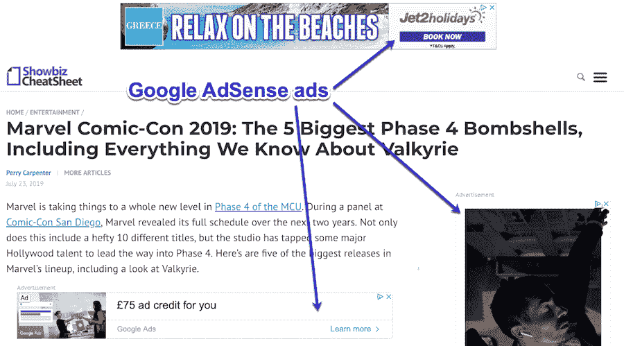

Google AdSense examples

### 哪种类型的网站最适合做 Adsense？

任何类型的网站都可以使用 Google AdSense。但是有一些类型更适合在上面运行 Adsense 广告

> 需要在这里大声喊出来。Kinsta 太神奇了，我用它做我的个人网站。支持是迅速和杰出的，他们的服务器是 WordPress 最快的。
> 
> <footer class="wp-block-kinsta-client-quote__footer">
> 
> 
> 
> <cite class="wp-block-kinsta-client-quote__cite">Phillip Stemann</cite></footer>

[View plans](https://kinsta.com/plans/)

让我们快速看一下哪种类型的网站最适合 Adsense:

*   **博客**——最常见的一种。如果你是一个[的博客写手](https://kinsta.com/blog/category/blogging/)，并且你一直在向观众发布高质量的内容，广告可能是一个将你的内容货币化的好方法。
*   **论坛**——论坛不是写博客，而是人们围绕一个话题进行互动的好方法，同时也产生一些 Adsense 收入。
*   **免费在线工具**——如果你经营[一个提供免费工具或服务的网站](https://kinsta.com/blog/website-ideas/)，抵消成本的一个方法就是广告。

这里的要点是[任何有固定流量的网站](https://kinsta.com/blog/how-to-drive-traffic-to-your-website/)都非常适合 Adsense。

但是如果你不想在你的网站上使用 Adsense 广告呢？

## 我为什么要寻找 Adsense 的替代品？

多年来，Google Adsense 一直是博客作者从他们的网站赚钱的主要方式之一。

事实上，有了合适的定位、好的内容和积极参与的观众，你的网站就能产生大量的收入。看看这张 [AdSense 收入](https://www.authorityhacker.com/display-ads-income/)的截图:

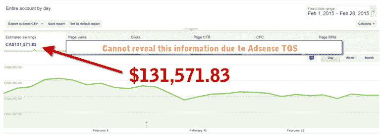

AdSense earnings

但这并不意味着这是唯一的选择。

有许多替代方案(事实上有 21 个)和寻找替代广告平台的理由。

也许你已经有一个 Adsense 帐户，但你想多样化你的收入来源。或者你可能想让 Adsense 广告继续运行，并增加一些额外的流。

也许你再次期待从你的广告空间赚更多的钱，而不是你现在用 Adsense 赚的钱。

但是你从哪里开始呢？别担心，我们会保护你:

## 最佳谷歌广告替代方案

让我们来看看这些 Google AdSense 的替代品，了解更多关于如何进一步利用你的网站或博客赚钱的信息:

 让我们更详细地探讨这些。

### 1.Media.net

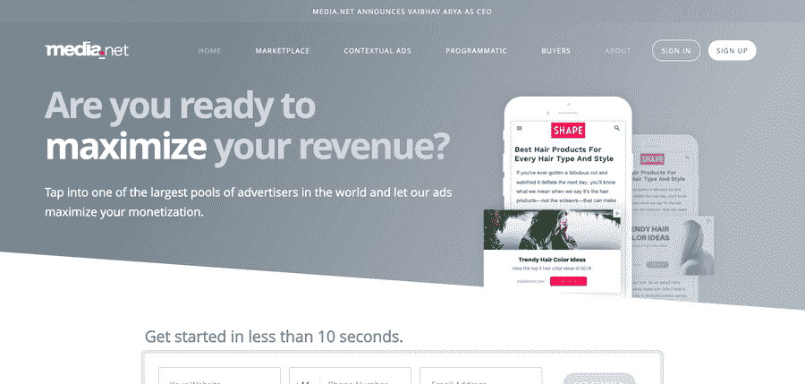

Media.net

Media.net 是雅虎和必应的直接竞争对手。它是世界上最大的上下文广告网络之一，被全世界家喻户晓的名字所使用。

它的上下文广告允许你通过独家访问来自雅虎的搜索来赚钱。 [兵](https://kinsta.com/blog/alternative-search-engines/#1-bing)网。市场让你接触到内容驱动的出版商，所以你可以最大化你的广告收入，并利用一个巨大的搜索市场。

Media.net 是第一个开发服务器端表头竞价平台的，可以完全管理，让你用最少的努力，最大限度的程序化展示。

建议阅读:[必应站长工具:完整的分步指南](https://kinsta.com/blog/bing-webmaster-tools/)。

### 2.螺旋桨推进器

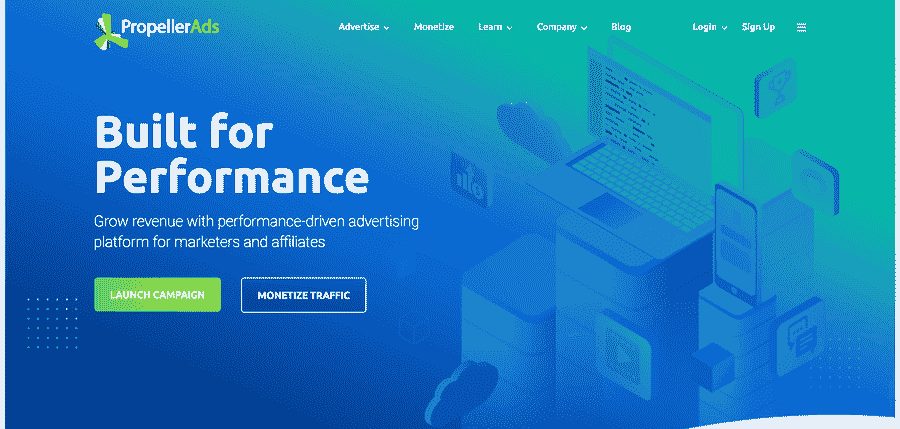

PropellerAds

PropellerAds 是一家大型广告网络，提供一系列广告，如横幅广告、赞助商链接、[推送通知](https://kinsta.com/blog/wordpress-push-notifications/)，让你接触到 10 亿用户。

自助服务平台易于使用，并配有简化的广告制作工具，可让您轻松开展活动。借助大量目标选项和实时绩效评估，您可以被动地改进您的营销活动。

它还具有自动化广告优化功能，通过人工智能对您的设置进行微调，无需人工干预，即可为每个广告提供最佳的转换数量。

### 3.亚马逊原生购物广告

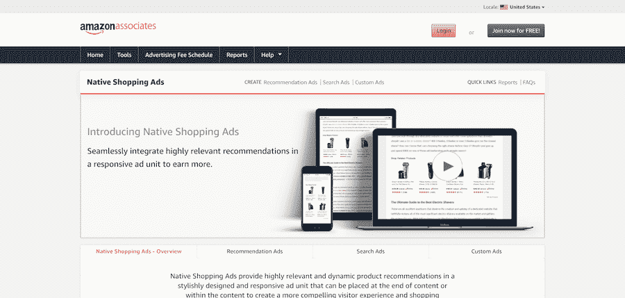

Amazon Native Shopping Ads

博主和其他网站所有者长期以来一直在使用亚马逊的联盟计划来产生额外的收入，但 T2 亚马逊原生购物广告提供了另一种高回报的方式来赚钱。

与 AdSense 广告类似，亚马逊原生购物广告是上下文相关的，因此它们根据页面内容和关键字显示相关产品。如果用户在点击广告后继续购买，你就可以从这笔销售中获得佣金，而不管它是否是针对被点击的商品。

[亚马逊是世界上最大的电子商务网站](https://kinsta.com/blog/ecommerce-statistics/#ecommerce-market-share-us-vs-global-trends)，他们的转化率远远高于几乎任何其他电子商务竞争对手。你可以利用这种无与伦比的流量和转换率，不费吹灰之力获得被动收入。

### 4.对抗性的

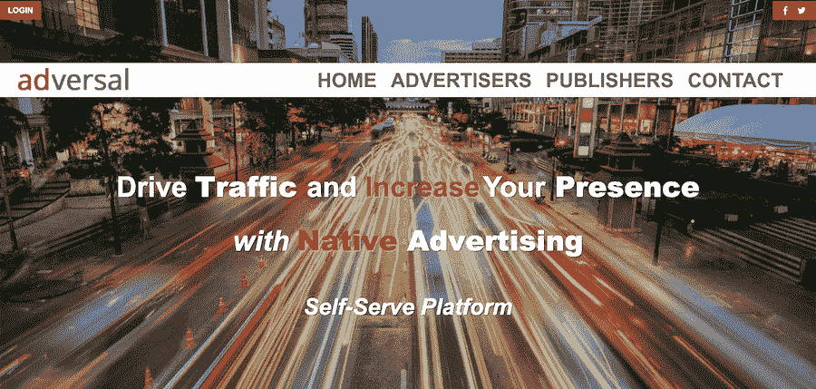

Adversal

[Adversal](https://www.adversal.com/) 是一个自助广告平台，让你在几分钟内就能设置好广告。

它的智能界面允许您开始、停止和暂停活动，使用起来简单直观。一旦你设置好了一切，你就可以让它去工作了。

## 注册订阅时事通讯

### 想知道我们是怎么让流量增长超过 1000%的吗？

加入 20，000 多名获得我们每周时事通讯和内部消息的人的行列吧！

[Subscribe Now](#newsletter)

值得注意的是，要获得 Adversal 的资格，你的网站必须有自己的域名，每月至少有 50，000 的浏览量，并且不应该受到登录的限制。

### 5.Sovrn //Commerce(前 VigLink)

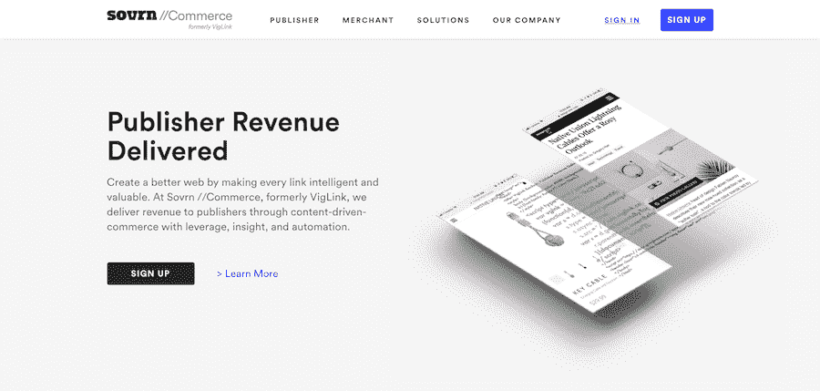

Sovrn //Commerce (Formerly VigLink)

[Sovrn //Commerce](https://www.viglink.com/) 利用杠杆、洞察力和自动化，通过内容驱动的商务为出版商带来收入。

通过将常规产品链接转化为附属链接，Sovrn //Commerce 允许你[从点击和销售中获得被动收入](https://kinsta.com/blog/recurring-revenue-model/)。

货币化工具为你的流量创造了广告商之间的竞争，让你得到最好的价格。深入的见解让你知道哪些产品和广告商为你赚了最多的钱，这样你就可以优化你的表现。这一过程的自动化意味着你可以专注于创造伟大的内容，而不是跟踪联盟收入。

还有来自 Sovrn.com 的子午线广告公司，这是一个 CPM 广告网络，按印象付费给出版商。这意味着无论你的广告是否被点击，你都会收到钱。

### 6.浏览链接

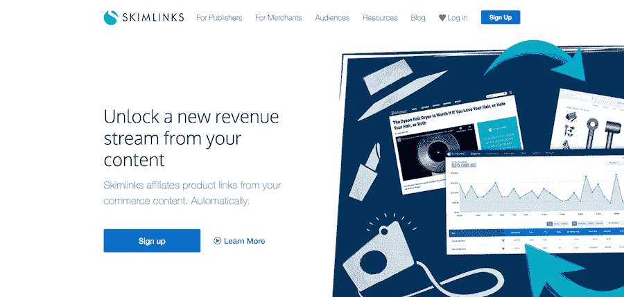

Skimlinks

[Skimlinks](https://skimlinks.com/) 自动加入你的商务内容，让你专注于[运营你的网站](https://kinsta.com/blog/wordpress-maintenance-mode/)而不用担心设置附属链接。

通过自动更新您的商务内容和会员链接，该工具能够增强您所有的商务策略，包括网站、手机、社交媒体和电子邮件。

加入 Skimlinks 可让您直接访问由 48，500 个商家和 50 个需求合作伙伴组成的全球网络。你也可以找到通过 VIP 和首选合作伙伴计划向 Skimlinks 出版商提供特别佣金的商家。

### 7.纪念碑

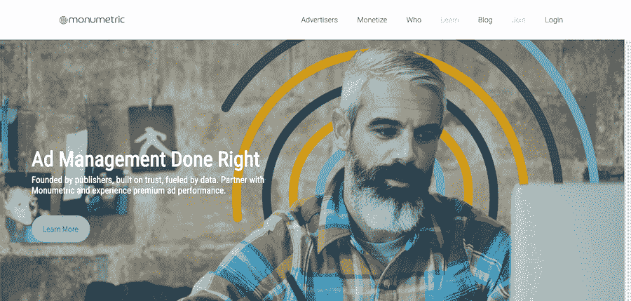

Monumetric

前身是 Blogger Network， [Monumetric](https://www.monumetric.com/) 是一家提供全方位服务的广告收入合作伙伴，让您在增加网站收入的同时，为您的访问者提供最佳的用户体验。

他们使用 CPM 而不是 CPC，所以你可以从每一个印象中获得报酬，他们的报酬率是 CPM 活动中最好的。据报道，收入经常比 AdSense 高得多，这是增加你的被动收入的一个很好的选择。

然而，最低流量要求是每月 10，000 次浏览，10，000 到 80，000 次浏览的网站需要支付 99%的安装费，所以你需要确信你能带来足够的流量，使投资物有所值。

### 8.信息链接

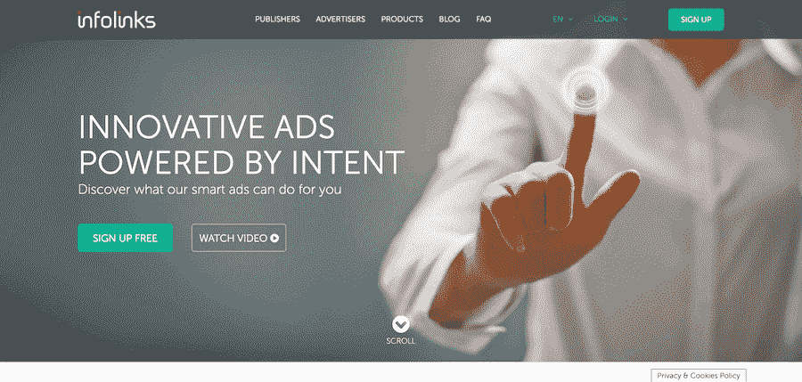

InfoLinks

Infolinks 是一个全球广告平台，旨在向参与用户传递品牌信息。

广告是完全可定制的，并提供独特的位置来提高[点击率](https://kinsta.com/blog/wordpress-ab-testing-tools/)而不影响网站的外观和感觉。通过使用智能算法来确定相关性和意图，让他们在优化的时刻投放相关广告。

Infolinks 支持在 128 个国家运营的超过 100，000 个网站的市场，可以在几分钟内集成到一个网站中。

### 9.ylliX

ylliX

一些人寻找谷歌广告的替代品来获得更高的报酬，而 ylliX 绝对符合要求。这是一个为桌面和移动提供各种广告类型的广告网络，包括弹出广告、移动重定向、[滑块](https://kinsta.com/blog/wordpress-slider/)、分层广告和整页广告。

它提供即时帐户批准、公平费率、详细报告、每日付款和 100%填充率，以及精确的活动目标和自助服务平台，让您完全控制您的活动。流量来自经过验证的来源，以确保质量和增加转化率，出版商不会为使用 ylliX 支付任何费用。

他们还提供慷慨的推荐计划，为你推荐的每一个新的活跃出版商或广告商支付高达 100 美元，外加他们一生收入或支出的 2%。

### 10.埃瓦达夫

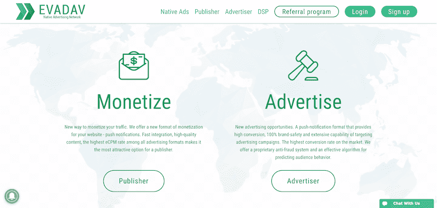

Evadav

Evadav 是一家专注于推送通知的广告网络，但他们也提供许多广告选项，包括横幅广告、视频滑块以及桌面和移动原生广告。

当一个用户订阅你的推送通知系统时，他们会保持与你的账户的联系，从他们的注册中为你赚取固定的每日收入。Evadav 也有一个推荐项目，付给你被推荐出版商收入的 5%,用很少的工作给你带来更多的被动收入。

所有网站都经过批准，以确保广告是品牌安全的，因此您可以从高质量的流量和值得信赖的广告中受益。

### 11.流行现金

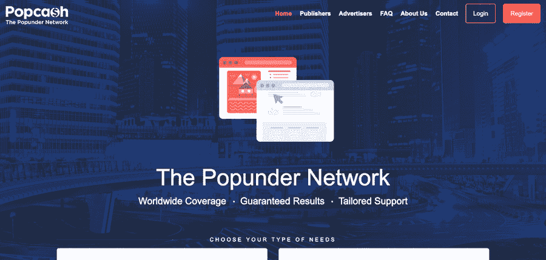

PopCash

PopCash 是一个覆盖全球的 popunder 网络，每月有 8 . 5 亿访问者和 50，000 个活跃出版商。

您只需支付 5 美元定金，就能快速获得批准，迅速开始您的活动。详细的统计数据和定位功能使您能够不断提高广告的效果。出版商可以在几分钟内开始赚取额外的收入，实现所需页面的弹出代码，并提交他们的域进行审查。

PopCash 可以与 AdSense 或其他广告选项一起使用，让你充分利用网站的收入流潜力。

### 12.PopAds

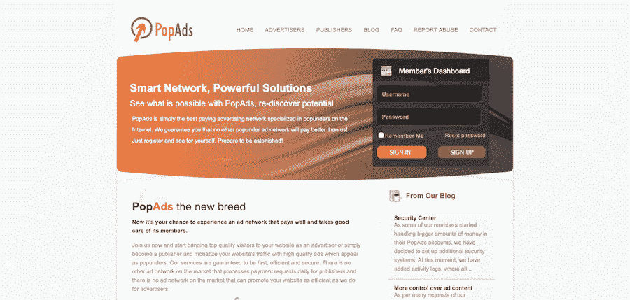

PopAds

顾名思义， [PopAds](https://www.popads.net/) 专门投放 popunder 广告，号称是这类广告收入最高的广告网络。

他们的网络包括来自 50 多个国家的广告商，他们为广告商和出版商提供推荐方案。有很多目标选择，让你可以改善你的活动，你可以完全控制你想要支付的费用。

它使用最先进的竞价系统，允许你选择你想为每个广告人支付多少钱。出价越低，你得到的流量就越少。所有的出版商网站都由人工审查，以确保它们符合某些质量标准。

### 13.RevContent

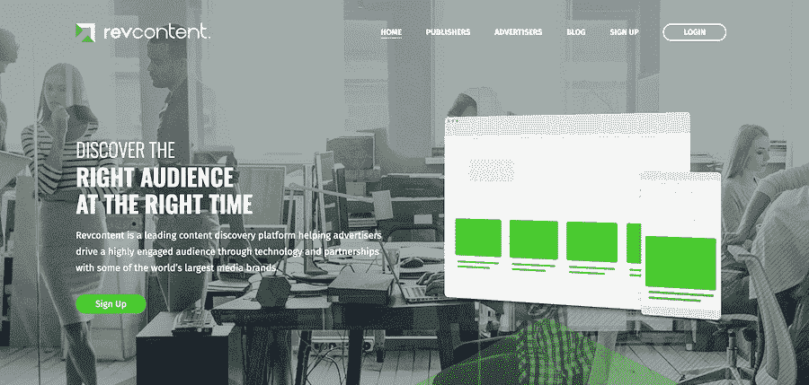

RevContent

[RevContent](http://www.revcontent.com/) 通过技术和与一些世界上最大的媒体品牌合作，帮助广告商利用高度参与[的观众](https://kinsta.com/blog/wordpress-quiz-plugins/)。

这是一个原生广告网络，提供一些行业内最高质量的广告和审批流程，所以你可以确保你的流量是高质量和参与。广告看起来就像[相关的文章](https://kinsta.com/blog/how-to-reduce-bounce-rate/#6-add-related-posts-to-your-site)，使它们与你的网站融合得很好，对你的设计造成最小的干扰，并提高点击率。

他们提供了一个伟大的点击付费率，你也可以受益于他们的推荐计划。事实上，如果你通过推荐链接注册，Revcontent 会更快地批准你，并付给你更多的钱。

### 14.阿德斯特拉

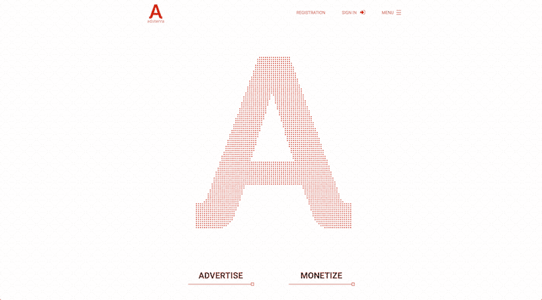

Adsterra

Adsterra 为出版商和广告商提供了很好的广告选择，允许他们尝试不依赖谷歌的不同方式。

这是一个发展迅速、备受尊重的网络，每月创造超过 100 亿次的印象。凭借其用户友好的平台，Adsterra 可以非常容易地将您的网站流量货币化，这也是它成为世界领先的数字广告公司之一的原因。

除了显示横幅这样的标准广告[，它还提供创新的广告格式，如弹出式广告、前置视频和桌面和移动推送通知。](https://kinsta.com/blog/banner-ad-sizes/)

### 15.社传媒

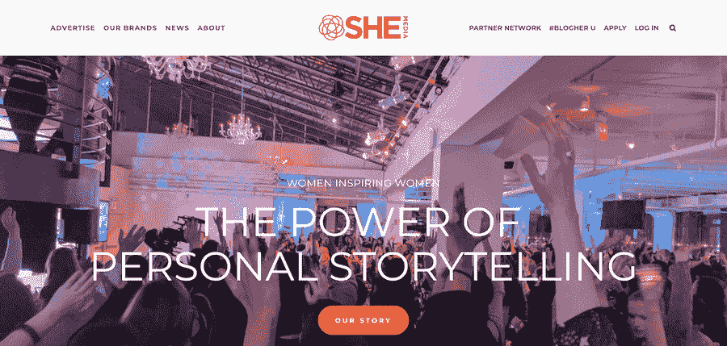

SHE Media

SHE Media 的合作伙伴网络专注于针对女性受众的博客和网站的盈利。

SHE 媒体合作伙伴网络由女性创建并为女性服务，每月有超过 5000 万的独立访问者，为出版商提供了大量受众。通过其旗舰网站，如 SheKnows.com 和#博客，以及包括#女性广告和年度之声在内的主要项目，该网络旨在为各个年龄和人生阶段的女性创建一个优质内容社区。

除了广告，他们还提供赞助帖子和付费产品评论，为出版商提供更多优秀内容和盈利的选择。

### 16.AdRecover

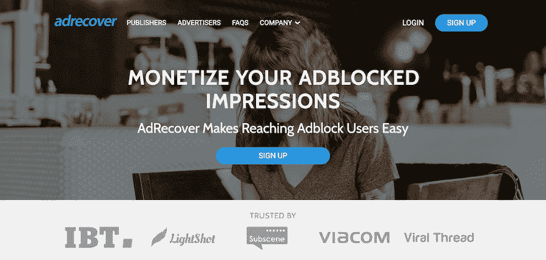

AdRecover

Adblock 给那些依赖广告收入的人带来了许多问题。 [AdRecover](https://www.adrecover.com/) 旨在通过与广告拦截器提供商合作，向使用这些广告拦截器的人提供静态、非侵入性、符合 UX 标准的广告，从而推翻这一局面。

这意味着，您将能够接触到极具辨识度且难以接触到的用户，而这些用户通常因使用广告拦截器而无法接触到。

对于出版商来说，你的每日流量需要包括至少 10k 的使用 adblock 的访问者，你才会被接受。你需要安装一个星期的 AdRecover，这样在你的网站被批准之前，你的流量可以被分析。

### 17.MadAds 媒体

MadAds Media

与 100 多家广告网络和互联网上最知名的品牌广告商合作， [MadAds](http://www.madadsmedia.com/) 提供了巨大的填充率和高质量的流量。

有各种各样的广告活动，包括 CPC，CPM，CPA 和 CPL，这使它成为 Adsense 最通用的替代品之一。您还可以与优化专家合作，以确保您的广告定位和投放能够产生尽可能高的收入。

你需要至少 10，000 日浏览量，你的网站必须是家庭友好型的，设计良好，才能被接受。

### 18.投标人

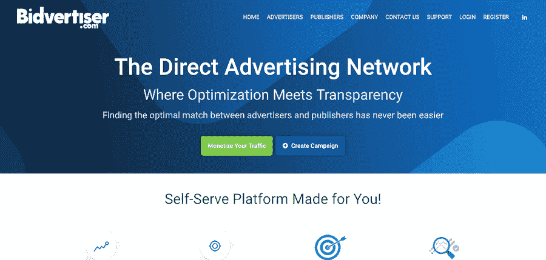

Bidvertiser

Bidvertiser 是一个直接广告网络，帮助寻找广告商和出版商之间的最佳匹配。

通过使用旨在产生转化的预先筛选的流量来源，Bidvertiser 允许您充分利用您的广告。所有的流量被完全分割，以控制和优化您的广告定位。

它还提供一个推荐计划，为广告商和出版商的推荐付费，这意味着你的广告网络将继续带来被动收入。

### 19.Adbuff

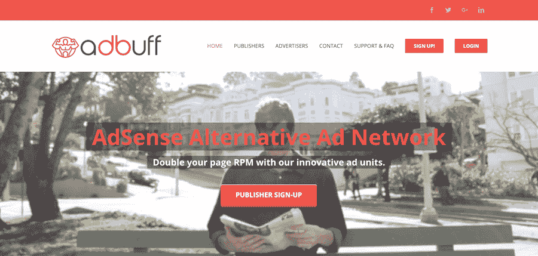

Adbuff

这个广告网络通过 CPC 或 CPM 向你付费，所以访问者不必点击广告就能获得报酬。一旦提供了 CPM 广告，你就可以因为他们观看它而获得收入。

如果你正在寻找 AdSense 的替代品，提供更高的付费率，Adbuff 是一个很好的选择。出版商获得 90%的广告收入，这是在线广告收入的最佳支出之一。所有的广告都适合家庭观众，所以你可以在你的网站上看到品牌安全的广告。

Adbuff 只接受流量主要来自美国、加拿大、澳大利亚和英国的英语网站。你还需要有至少 2000 个月的访问者才能被接受。仅接受每月预算为 1000 美元或以上的全国性广告客户。

### 20.BuySellAds

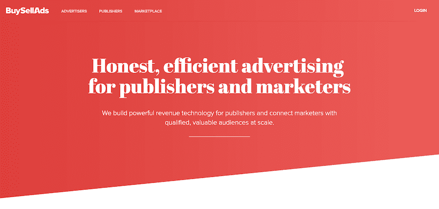

BuySellAds

[BuySellAds](https://www.buysellads.com/) 是一个在你的网站上为你出售广告位的平台。虽然你可以控制你的广告空间的价值，但重要的是避免因定价过高而被挤出市场。

通过展示、本地表演、赞助内容和[电子邮件](https://kinsta.com/blog/email-marketing-best-practices/)等广告渠道，BuySellAds 提供了尊重、品牌安全的位置，而不是侵入性或分散注意力的广告。通过向他们的高素质受众网络投放广告，你可以从每一次印象中获得最大收益。

当您提交网站进行审批时，会对其质量进行审查。只有每月至少有 100，000 浏览量的高质量英语网站被接受。

### 21.广告点击媒体

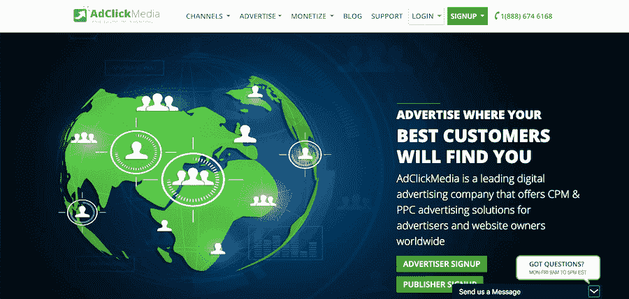

AdClickMedia

AdClickMedia 是一家数字广告公司，为全球广告商和网站所有者提供 CPM & PPC 广告解决方案。

它拥有超过 6，200 家出版商，113 个电子邮件列表合作伙伴和 1.1 亿的月浏览量，因此您可以从广泛的受众中受益。他们还提供订阅广告，允许你在数千个有影响力的博客和网站上展示你的广告，每月只需 49 美元。

没有最低流量要求，这使得它成为新网站或访客较少的网站增加收入的一个很好的选择。

## sidemote: youtube 货币化替代方案

如果你使用视频内容，不要忘记 YouTube 的货币化。

一般来说，人们将他们的 YouTube 频道与 Google AdSense 集成，以获得广告收入。但是你也可以使用下面提到的 Youtube 的 Adsense 替代品。

这些替代网络是将您的视频内容货币化的有效方式:

*   [AdRev](https://adrev.net/)–这种替代方案有助于推广您的 YouTube 频道，并保护您的视频内容。你可以很容易地监控你的收入和最低支出是 10 美元通过贝宝。
*   [自由](https://www.freedom.tm/)-这与你的 YouTube 频道和多个平台相结合，并把你和其他创作者联系起来，以促进你的业务。没有合同，也没有通过贝宝支付的最低限额。
*   [全屏媒体](https://fullscreenmedia.co/)–这一全球网络利用各种广告形式为品牌提供机会，以获得适合您内容的交易。在你能得到支付之前有一个 50 美元的门槛。
*   [Maker Studio](https://ddn.disney.com/)–这是一个数字网络，与迪士尼网络相结合，通过促销机会提升您的渠道。没有承诺加入和付款是通过贝宝发送。
*   [Machinima](https://console.machinima.com/)–这旨在将您的内容传递给目标受众，并利用品牌广泛传播内容。付款是通过贝宝，但有一个 3 年的合同加入这项服务。

## 哪个 Adsense 替代方案是最好的？

那么哪个 Adsense 替代品最适合你的网站或博客呢？

嗯，答案是:视情况而定。但是如果你想最大化你的广告收入，你可能会考虑 **Mediavine** 。

Mediavine 是一个私人 AdSense 替代品，只接受高质量的网站和每月至少有 30，000 次浏览量或 25，000 次会话的网站。

他们管理你的广告服务器，帮助你优化广告投放，进行更好的价格控制，消除中间商，代表你直接与广告商合作。

由于他们不只是接受任何人，他们能够谈判更好的交易，与 AdSense 相比，大多数网站在使用 Mediavine 时收入都有所增加。

这里有一些关于它们的好资源:

*   [Mediavine for Bloggers](https://www.mediavine.com/mediavine-big-bloggers/)
*   [什么是 Mediavine？](https://www.mediavine.com/what-is-mediavine-ad-management-and-so-much-more/)
*   [Mediavine 评论](https://www.nichepursuits.com/mediavine-review/)

当谈到切换广告网络时，在完全转向 Adsense 替代品之前，总是值得尝试一下，看看哪一个最适合你的网站。

[Who doesn't want to make more money? Check out these 21 AdSense alternatives to make additional income from your site! 💰💻Click to Tweet](https://twitter.com/intent/tweet?url=https%3A%2F%2Fkinsta.com%2Fblog%2Fadsense-alternatives%2F&via=kinsta&text=Who+doesn%27t+want+to+make+more+money%3F+Check+out+these+21+AdSense+alternatives+to+make+additional+income+from+your+site%21+%F0%9F%92%B0%F0%9F%92%BB&hashtags=makemoneyonline%2Cadsense)

## 摘要

AdSense 可能是你的网站最广为人知的赚钱方法之一。尽管有很多 Google AdSense 的替代品，但是如果你没有得到你想要的结果，或者你正在寻找多样化的收入来源，你应该尝试一下。

* * *

让你所有的[应用程序](https://kinsta.com/application-hosting/)、[数据库](https://kinsta.com/database-hosting/)和 [WordPress 网站](https://kinsta.com/wordpress-hosting/)在线并在一个屋檐下。我们功能丰富的高性能云平台包括:

*   在 MyKinsta 仪表盘中轻松设置和管理
*   24/7 专家支持
*   最好的谷歌云平台硬件和网络，由 Kubernetes 提供最大的可扩展性
*   面向速度和安全性的企业级 Cloudflare 集成
*   全球受众覆盖全球多达 35 个数据中心和 275 多个 pop

在第一个月使用托管的[应用程序或托管](https://kinsta.com/application-hosting/)的[数据库，您可以享受 20 美元的优惠，亲自测试一下。探索我们的](https://kinsta.com/database-hosting/)[计划](https://kinsta.com/plans/)或[与销售人员交谈](https://kinsta.com/contact-us/)以找到最适合您的方式。