# 一步一步的关键字研究指南(奖金:最佳关键字研究工具比较)

> 原文：<https://kinsta.com/blog/keyword-research/>

想象一下，每个月有超过 25 万的访问者访问你的网站。我们做到这一点多亏了关键词研究:

Monthly SEO Traffic

这张截图来自我的一个名为[流浪房车](https://www.thewanderingrv.com)的网站。我和我的妻子在仅仅三年的时间里，用不到 30 篇文章，把这个网站从一个全新的网站发展到每月 25 万的访问量。

是的，你还必须[创造伟大的内容](https://kinsta.com/blog/content-length/)并建立到这些内容的链接，但是这些行动是在你知道最佳的目标关键词之后。每一次成功的 [SEO 战役](https://kinsta.com/blog/what-does-seo-stand-for/)都是从**关键词调研**开始的；跳过这一步，后果自负。

准备好开始了吗？

## 如何进行关键词研究(快速步骤):

好的关键词决定了 SEO 营销活动的成败。以下是开始**关键词研究**的关键步骤:

**第一步**:根据关键词、相关搜索、长尾关键词、LSI 找到关键词创意。
**第二步**:查看真实关键词难度和搜索量。
**第三步**:确定用户意图。

Support

在今天的指南中，我分享了一个一步一步的关键词研究指南，不仅涵盖了如何找到数百个伟大的关键词，还包括如何告诉你哪些可以为你的业务移动针，哪些不值得你的时间。让我们开始吧！

## 关键词研究基础

在我谈论为你的搜索引擎优化活动寻找关键词的具体步骤之前，让我们简单地了解一下什么是关键词研究，以及为什么你应该关注它。

### 什么是关键词研究？

关键词研究是在搜索引擎优化活动中寻找和审查关键词的行为。

这是通过使用一些免费和/或付费的工具来完成的，这些工具会向你展示人们在谷歌和其他搜索引擎上搜索的内容。

建议深度指南:[谷歌搜索控制台](https://kinsta.com/blog/google-search-console/)和[必应站长工具](https://kinsta.com/blog/bing-webmaster-tools/)。

### 关键词研究在数字营销中的作用

正如你将在下一节学到的，关键词的质量是成功营销活动和浪费时间的区别。你挑选的关键词会从头到尾决定你的 SEO 营销策略。

让我们看看怎么做。

### 关键词研究有多重要？(不要跳过这个！)

SEO 可能很复杂，但它可以归结为三个基本要素:

1.  关键词研究
2.  [内容](https://kinsta.com/learn/content-marketing/)
3.  [链接建筑](https://kinsta.com/blog/what-does-seo-stand-for/#5-get-links-from-other-relevant-sites)

这三者中，关键词研究是最重要的。

为什么？因为你可以创造最好的内容，建立令人难以置信的链接，使你在谷歌排名中名列第一，但如果你瞄准了错误的关键词，在业务增长或收入方面仍然没有任何好处。

例如，假设你想在你网站的博客上写一些内容，这样你就可以出现在谷歌的第一页。你有一个博客帖子的想法，并认为你有一个好的关键词来瞄准。你制作惊人的内容，通过客座博文和电子邮件推广建立链接(这里是[如何找到任何人的电子邮件地址](https://kinsta.com/blog/find-email-address/)，并最终出现在谷歌的[首页](https://kinsta.com/blog/featured-snippets/)。你每个月都有数百次访问…

但是你从那篇文章中获得的收入仍然是一大笔钱。

那是因为你没有提前研究好你的关键词。你可能找到了一个关键词，但是找到一个关键词和做关键词研究是完全不同的两码事。

正确地研究一个关键词意味着了解它的收入潜力，它的竞争力，甚至你需要创建的内容的确切类型，以便能够为它排名。在本指南结束时，你会明白我的意思。

简而言之:恰当的关键词研究可能是一场疯狂成功的搜索引擎优化活动和一场完全浪费时间和金钱的搜索引擎优化活动的区别。

## 搜索量和长尾关键词

关于关键词要理解的第一个概念是**搜索量**。

这是大多数人第一次开始研究关键词时看的，也是最糟糕的指标之一。

高搜索量非常具有欺骗性，原因有二:

1.  搜索某样东西的原始人数与你实际能从流量中赚多少没有太大关系。例如，如果你对一个每月被搜索 10，000 次的关键词进行排名，但如果人们只是在寻找信息，并不准备购买(提示:你需要定义搜索意图。更多见下文。)，这对你的底线没有任何帮助。
2.  仅仅因为 10，000 人搜索一个关键词并不意味着所有 10，000 人实际上都点击了一个结果。以“特朗普多大了”这个关键词为例，它每个月会被搜索 3 万次，但只有 13%的人会点击任何东西。这是因为人们在谷歌上就能找到正确的答案，不需要点击就能找到。

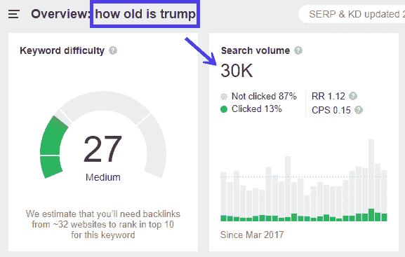

Keyword Search Volume to Click-Ratio

Bad keyword example

另一方面，低搜索量并不意味着一个关键词是不好的，或者你看到的数字就是你将获得的访问者数量。事实上，所有在谷歌上对一个关键词进行排名的页面也会对几十个、几百个，有时甚至几千个其他关键词进行排名。

这些其他关键字通常是同义词和长尾变体。还有潜在的语义索引(LSI)关键字，我将在下面的一节中介绍。

例如，看看我妻子 Kayla 为流浪房车写的这篇文章。她瞄准的关键词是“最佳露营装备”，根据 Ahrefs 的数据，这个关键词每个月会被搜索 2700 次。但正如你在下面的截图中所看到的，它还在 1912 个其他关键词中排名，甚至在第一页的“露营装备”中排名每月 32000 次搜索！

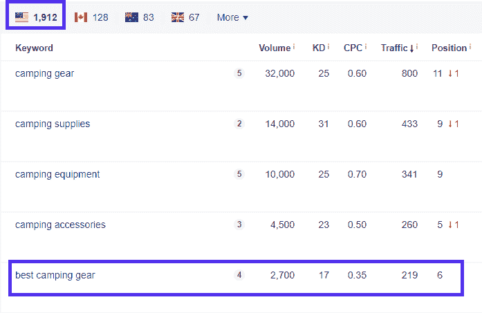

Ahrefs Keywords

故事的重点？虽然搜索量是一个重要的指标，但你不应该把你的目标关键词仅仅建立在每月有多少人搜索它的基础上(除非你只关注品牌知名度和/或每次印象的广告收入)。

## 搜索意图

搜索意图就像它听起来的那样——搜索给定关键字的人的意图。类似于营销概念“买家意图”。

换句话说:用户在寻找什么？

他们是否正在寻找一件他们现在就准备购买的商品？他们在做出购买决定之前是否做了调查？或者他们只是在寻找与购买无关的信息，而是寻找他们可能需要解决的问题？

让我们来看一个例子。

**高购买意愿**:高购买意愿关键词可能是一个产品名称，如“RV rental las vegas”。如果你在谷歌上输入这个，看看结果，你会看到一堆房车租赁广告和一张显示拉斯维加斯房车租赁公司的地图。有人搜索这可能是准备购买，或非常接近。

![High Search Intent]](img/aa05e0106937312fce959fca2adb4667.png)

High Buying Intent

**研究意图**:这些是人们仍在研究解决方案，但可能很快就会购买的关键词。“最佳”和“评论”关键词往往属于这一类，比如“最佳房车租赁公司”。

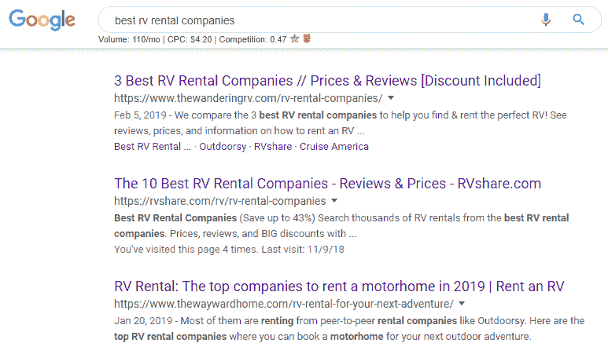

Medium Buying Intent

**信息意图**:这些关键词是给那些严格地寻找信息，但还没有准备好或者甚至还没有考虑购买任何东西的人的。“特朗普多大了”的例子就属于这一类。另一个适合房车租赁的例子可能是“如何带着宠物在全国旅行”。

但是，不要以为买了意向关键词就应该只去。信息关键词可以帮助你[建立你的电子邮件列表](https://kinsta.com/blog/how-to-build-an-email-list/)，让人们进入你的营销漏斗，最终向你购买。

了解搜索意图也很重要，因为它会影响内容在谷歌上的排名。如果你试图[创建一个登陆页面](https://kinsta.com/blog/wordpress-landing-page-plugins/)来对一个信息关键词进行排名，而谷歌正在对长篇博客内容进行排名，即使有完美的[页面搜索引擎优化](https://kinsta.com/blog/best-seo-plugins-for-wordpress/)和大量的反向链接，你可能也不会排名，因为这根本不是用户正在搜索的。

比如说你要给“小营员”排名。所以你创建了一个拥有小型露营车的指南。然而，当我们查看谷歌时，我们可以看到人们并不是在寻找指南，而是在寻找一份小型露营者的购买清单。

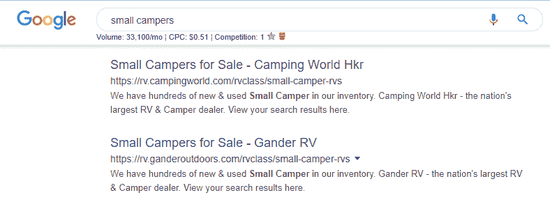

Search Intent Example

这就是为什么**即使在你找到好的关键词创意**、**之后，你也应该总是手动将它们输入谷歌，并查看当前的排名**，以了解你需要创造什么。当人们只是想要一个快速的答案时，不要写大量的指南，当人们想要购买一个产品时，不要试图对一篇博客文章进行排名。

## LSI 和同义词的作用

前面我提到了 LSI 关键字。这代表潜在语义索引，这是谷歌说“同义词和相关关键词”的一种奇特方式。它们是在同一个主题中经常出现的单词，并且在语义上相互关联。

他们告诉搜索引擎你的内容是关于什么的是很重要的，因为同一个关键词可能有多种含义。

例如，假设你正在写一篇关于汽车的文章。你可以谈论五种不同的潜在“汽车”:

1.  汽车，车辆
2.  迪士尼动画电影《汽车总动员》
3.  汽车，加拿大拉力运动协会
4.  汽车，加拿大航空条例
5.  汽车，美国 20 世纪 70 年代的乐队

谷歌怎么知道你说的是哪个版本的“汽车”？靠 LSI 关键词！看一看:

1.  使用“车辆”、“二手”、“新”、“购买”、“出售”等词语。
2.  使用“电影”、“电影”、“迪士尼”等字眼。
3.  使用“协会”、“集会”、“运动”等词语。
4.  使用“航空”、“管理”、“行政”等词语。

虽然 LSI 关键词在你的关键词研究中不一定重要，但在开发你的实际内容时却很重要。你应该在你的内容中自然地包含各种 LSI 关键字，而不是把它们塞进去，包括在标题和图片替换文本中。

你可以用类似于 [LSI Graph](https://lsigraph.com/) 的工具找到 LSI 关键字(并了解更多)。
T3】

## 你是怎么做关键词研究的？(逐步指南)

好了，现在你已经对关键词研究背后的重要指标有了一个明确的理解，是时候真正找到你自己的关键词了！当我为一个新网站做关键词研究时，我会遵循三个步骤，还有一个可选的、更高级的第四步:

1.  查找关键词创意
2.  检查真实关键词难度和搜索量
3.  确定他们的搜索意图
4.  (可选)查找和利用关键字仓库

让我们开始吧！

### 第一步:找到关键词想法

找到关键词想法是容易的部分。有很多工具，只要点击一个按钮，就会产生数百个想法。审查他们需要努力，但我们会做到这一点。

现在，去看看下面的“最佳关键词研究工具”部分，选择你的毒药。我将在示例中使用 Ahrefs，因为它是我最喜欢的工具，具有所有的功能，但其他工具也可以工作。

我最喜欢的方式来寻找伟大的关键字机会是刺探我的竞争对手。你可以将他们的网站插入任何关键词工具，然后查看他们的关键词。Ahrefs 有一个很棒的工具，叫做内容差距分析。

它是这样工作的:

1.将你的网站插入 Ahrefs，然后点击左边菜单中的**内容间隙**链接。

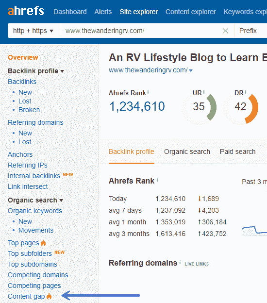

Ahrefs Content Gap

2.插入 1-10 个在谷歌上为你想要排名的关键词排名的竞争者。你可以通过谷歌搜索这些关键词，从谷歌上抓取网址，或者使用 Ahrefs 的竞争域名工具，就在内容差距链接的上方。运行该工具。

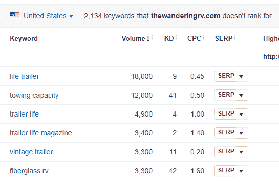

Ahrefs Keyword Research

3.如果愿意，您可以从这里将列表导出到 excel 电子表格。我喜欢在 Ahrefs 中梳理列表。如果我看到一个我可能想锁定的关键字，我会在一个新标签页中打开它，并使用右上角的+ Add to 按钮将其添加到关键字列表中。

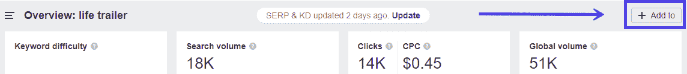

Keyword List

如果你无法使用 Ahrefs 或其他关键字工具来查看竞争对手的关键字，你也可以使用 Keyword Shitter 这样的工具来给你大量的想法，然后使用其他免费工具如优步建议来审查它们。

## 注册订阅时事通讯

### 想知道我们是怎么让流量增长超过 1000%的吗？

加入 20，000 多名获得我们每周时事通讯和内部消息的人的行列吧！

[Subscribe Now](#newsletter)

### 第二步:查看真实关键词难度和搜索量

一旦你有了一个你可以放心使用的关键词列表(我的目标是一次 50-100 个，但你可以做得更多)，是时候根据关键词难度(KD)和搜索量来看看哪些是值得追求的了。

只有一个警告…你在大多数关键词研究工具中看到的搜索量和 KD 通常相差甚远。Ahrefs 中的 KD 仅仅基于链接到顶级结果的域的数量，这并不能 100%准确地描述一个关键词的真正排名难度。

这是因为 SEO 是一个复杂的野兽，像域名评级(我将很快介绍)和[内部链接](https://kinsta.com/blog/broken-links/)这样的事情会对排名产生巨大的影响。反向链接只是图片的一部分。

搜索量呢？那还不包括 LSI 和长尾关键词！

还记得我在本文开头给你看的那个露营装备的例子吗？main 关键字每月只有 2700 次搜索，但这篇文章每月的访问量超过 5000 次。那是因为它是针对主关键词之外的其他关键词的排名。

因此，如果你看到一个关键词每月有 200 次搜索，如果你包括相关的关键词，你的排名可能会达到 500 或 1000 次。

要确定真实的搜索量，在谷歌上抓取该关键词的#1 结果，并将其输入 Ahrefs 或优步建议，看看该页面实际获得了多少流量。这应该会给你一个给定关键字的搜索量的更准确的图片。

以下是排名第一的“小营员”页面的流量，这个关键词每月被搜索 3400 次:

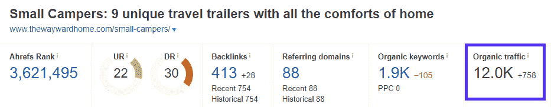

True Search Volume

看看这个页面是如何获得超过 10k 的流量的，尽管主关键词只有它的三分之一？这才是真正的搜索量潜力。

另一个指标，关键词难度，也不是 100%准确。但是，找出真正的困难通常就像查看首页域名权威(DA)或域名评级(DR)一样简单，如果你使用 Ahrefs 的话。让我解释一下。

如果一个关键词的难度分数为 8，但排名靠前的页面都是 DR 80+，那么如果你的 DR 较低，尽管难度分数较低，但为这些关键词对你的网站进行排名可能会很困难。

我的建议是，如果你的 DR 在 40 以下，目标是 30 KD 或更低的关键词，然后随着你建立更多的链接和获得更高的权威而扩展。随着你的 DR 攀升，你的内部链接更有“链接价值”(或者传递更多的“页面权威”，取决于你听的是什么来源)。

但是这不是一篇关于技术性搜索引擎优化的文章，所以我现在就不写了！

### 步骤 3:确定搜索意图

在这一点上，你应该有一个相当不错的关键词列表，有一个你能轻松应对的困难和一个你乐于捕捉的潜在搜索量。现在是时候弄清楚人们在搜索这些术语时到底想要什么，以及它是否符合你的营销和收入目标。

这一部分就像谷歌搜索你列表中的每个关键词并查看前 3-5 个结果一样简单。查看他们的元标题和描述，点击他们查看页面，并检查他们在页面上采取的角度。

*   它们主要是列表文章吗？怎么做？[终极指南](https://kinsta.com/learn/speed-up-wordpress/)？登陆页面？还有别的吗？
*   他们似乎是如何将页面货币化的？他们[在使用展示广告](https://kinsta.com/blog/how-to-use-google-adwords/)吗？销售产品作为解决问题的方法？[联盟营销](https://kinsta.com/affiliate-academy/affiliate-marketing-business/)？只是获取电子邮件，实际上不卖任何东西？
*   看看评论吧。人们在问文章中没有回答的问题吗？他们看起来是高兴、愤怒还是中立？

所有这些问题将帮助你了解你需要创建的帖子/页面的类型，你如何将其货币化(或使用它来捕捉电子邮件/推送通知订阅者/社交关注者)，以及你可以做些什么来改善它。

当你浏览每一个关键词时，把你对这些问题的答案保存在一个电子表格或 word 文档中，以便跟踪你感兴趣的问题。你的最终清单是你可以开始追求的清单！

为了让你更好地了解如何确定搜索意图，下面是一些来自 Moz 帖子的例子:

信息意图:

*   [产品名称]
*   什么是[产品名称]
*   [产品名称]是如何工作的
*   如何使用[产品名称]

商业意图(又名研究意图):

*   最佳[产品名称]
*   [产品名称]评论
*   比较[产品名称]
*   什么是顶级[产品名称]
*   [颜色/款式/尺寸][产品名称]

交易意向(又名购买意向):

*   [产品名称]的价格是多少
*   [位置]中的[产品名称]
*   在线订购[产品名称]
*   [产品名称]我的附近
*   实惠的[品牌名称][产品名称]

来自 Ahrefs 的图表[也有帮助:](https://ahrefs.com/blog/search-intent/)

厌倦了你的 WordPress 站点缓慢的主机？我们提供超快的服务器和来自 WordPress 专家的 24/7 世界级支持。[查看我们的计划](https://kinsta.com/plans/?in-article-cta)

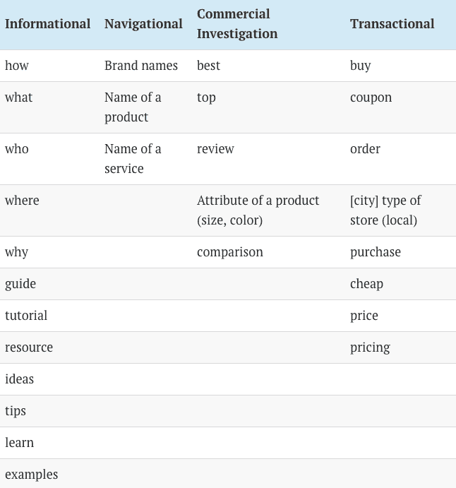

Ahrefs Search Intent Chart

现在拿着你的清单，去做一些内容吧！或者，您可以遵循最后一个步骤。

### 步骤 4:(高级)找到并利用关键词仓库

如果你真的想做得更好，你可以有选择地更进一步，在你的网站上寻找关键字筒仓来创建相应的内容筒仓。

关键词仓是一个高度相关的关键词列表，您可以围绕它创建内容，以便在您的站点上相互链接(也称为“中心辐射”方法)。这是我制作的一个视频来帮助你理解:

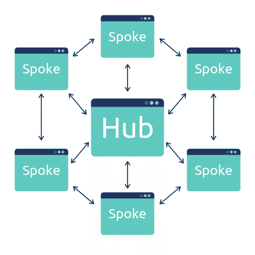

Hub and Spoke Method of Content Marketing

本质上，你创建一个针对你想要排名的主要头项的中心页面，然后基于相关和长尾关键词创建“分支”页面。

例如，在为我妻子 Kayla 的素食食品博客做关键词研究时，我发现了一系列相关的关键词，问“是 __ 素食主义者吗”。人们想知道普通食物，如百吉饼、油炸圈饼或奥利奥是否是纯素食者。

为了对这些关键词进行排名，我们创建了[这个中心页面](https://thesustainableharvest.com/is-it-vegan/)，链接到她所有的“Is ___ vegan”文章。这些文章相互链接，并返回到主页面。

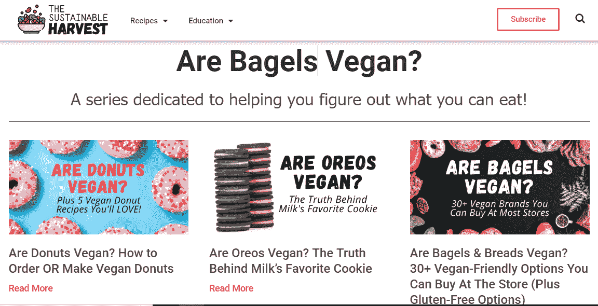

Content Silo

这种相互链接被称为内容孤岛，它之所以如此有效有两个原因:

1.  因为所有的页面都是相互链接的，所以如果你建立了到任何一个页面的链接，就会提高所有其他页面的权威性。
2.  谷歌在它的算法中使用了相关性，因为这些主题彼此高度相关，它可以进一步提高你的排名。

那么如何找到关键词筒仓呢？没有灵丹妙药——你必须善于发现模式并注意相关性。然而，有一个技巧可以让你试着找到它们:书。

在亚马逊上寻找与你的主题相关的书籍，并浏览目录。通常情况下，书籍充满了关键词筒仓:这就是为什么他们是一本书！把装订看作是中心页面，把章节看作是分支页面。

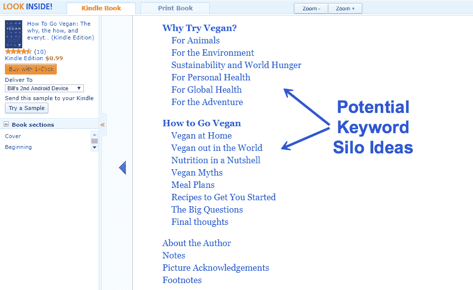

Keyword Silo Ideas

当然，正如你在上面的例子中看到的，这些关键词并不完全是人们在谷歌上搜索的。人们输入的不是“世界上的素食主义者”，而是“如何在餐馆吃素食”或“如何在家庭聚会上吃素食”。所以你可能需要做一些调查，找出与你找到的书的章节标题相对应的关键词。

一旦你发现一个潜在的筒仓，在你提交之前，一定要通过步骤 2 和 3 运行关键字！仅仅因为你发现了一个筒仓，并不意味着你应该追求它。从逻辑上思考所有这些内容如何适合你的业务，以及你将来如何扩展这些内容。

## 最好的关键词研究工具是什么？

有几十个，如果不是数百个关键词研究工具在市场上今天。有些非常独特，但大多数只是在相同的想法上略有不同。那么最好的是哪一个呢？让我们用免费和付费工具来分解一下。

### 免费关键词研究工具

我用过并推荐两个免费的关键词研究工具:

1.  Ubersuggest
2.  关键词快门

#### Ubersuggest

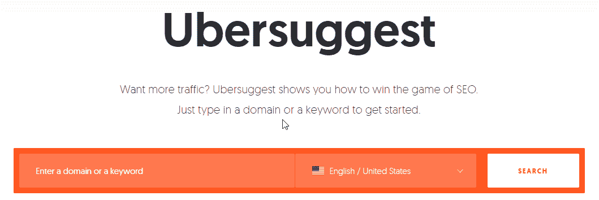

Ubersuggest

让我们暂时搁置所有关于尼尔·帕特尔的转换。这个工具完成了它的工作，如果你预算有限，它可以帮助你开始 SEO。

Ubersuggest 基本上是 Ahrefs 或 Moz 的免费缩小版。它可以让你窥探竞争对手的反向链接，看看他们的关键字排名，并做一些像样的关键字研究。如果你在预算范围内做搜索引擎优化，它可以完成工作。

#### 关键词快门

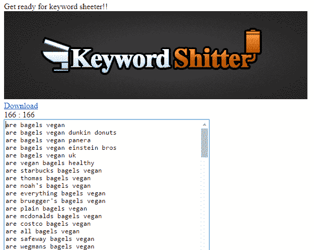

Keyword Shitter

关键字 Shitter 听起来很像。你输入一个关键词，就会得到数百个关键词建议。如果你只是需要大量的想法，这是很好的，但它通常只会吐出与你输入的关键词相关的关键词，而不是独特的、独立的想法。

### 付费关键词研究工具

现在我们进入大男孩(或女孩)工具！如果你对 SEO 很认真，并且有预算，这些是你想要使用的工具。

1.  Ahrefs
2.  塞姆拉什
3.  关键词洞察
4.  关键词无处不在

#### Ahrefs

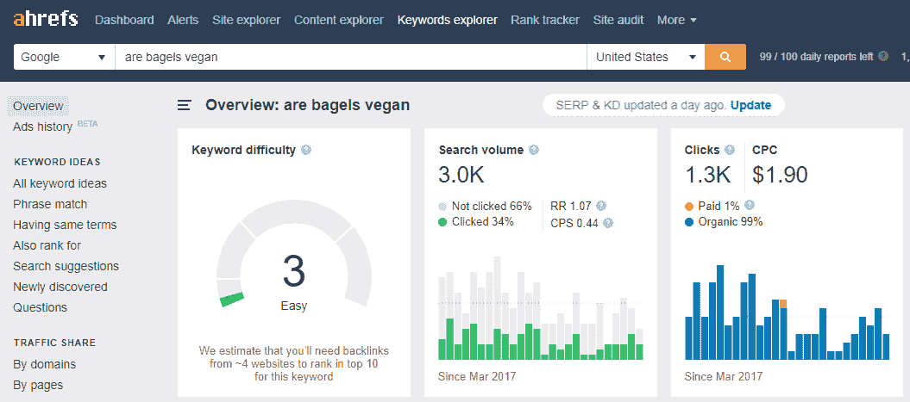

Ahrefs

Ahrefs 是我最喜欢的 SEO 工具；不仅仅是关键词研究，还包括链接建设、排名跟踪、内容创意等等。它拥有所有的功能，是市场上最好的全方位搜索引擎优化工具。然而，它的价格很高，仅基本工具每月就要 99 美元。

#### 塞姆拉什

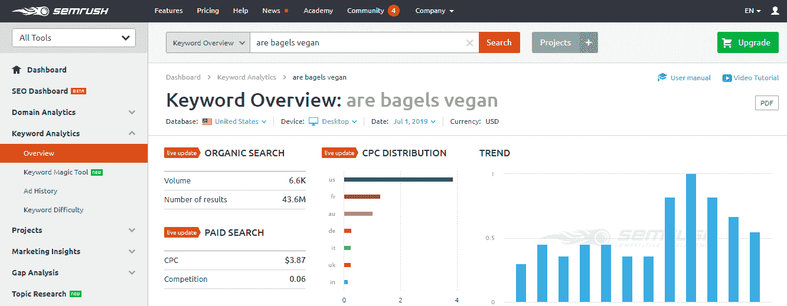

SEMrush

SEMrush 是另一个伟大的关键词研究工具。它比 Ahrefs 更实惠，但没有那么多功能。它更倾向于[搜索引擎](https://kinsta.com/blog/submit-website-to-search-engines/)营销和点击付费(因此 SEM 在 SEMrush)。然而，如果你想要一个很棒的付费工具，但不想为 Ahrefs 支付额外费用，这是一个有效的选择。它甚至让你免费试用产品！

#### 关键词洞察

[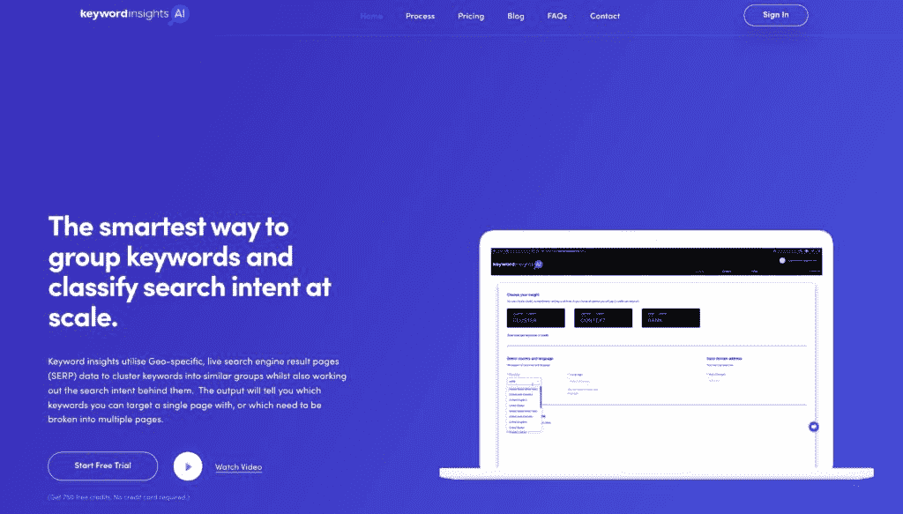](https://kinsta.com/wp-content/uploads/2019/08/keyword-insights.jpg)

Keyword Insights

[Keyword Insights](https://www.keywordinsights.ai/) 声称是“对关键字进行分组并对搜索意图进行大规模分类的最聪明的方法”…这是有充分理由的。该工具利用特定地理位置的实时搜索引擎结果页面数据将关键词聚类到相似的组中，同时还可以计算出它们背后的搜索意图。

用户只需上传一个关键词列表(你想上传多少就上传多少)，该工具就会给出一个预先格式化的 Google sheets 文档，其中包含聚集的关键词和意图。其最近的更新还将分组的关键词分类为“顶级主题”，这样你就可以看到它们的内容枢纽应该是什么，以及它们的发言内容可能是什么样子。洞察还会告诉你哪些关键词可以作为单个页面的目标，或者哪些关键词需要分成多个页面。

#### 关键词无处不在

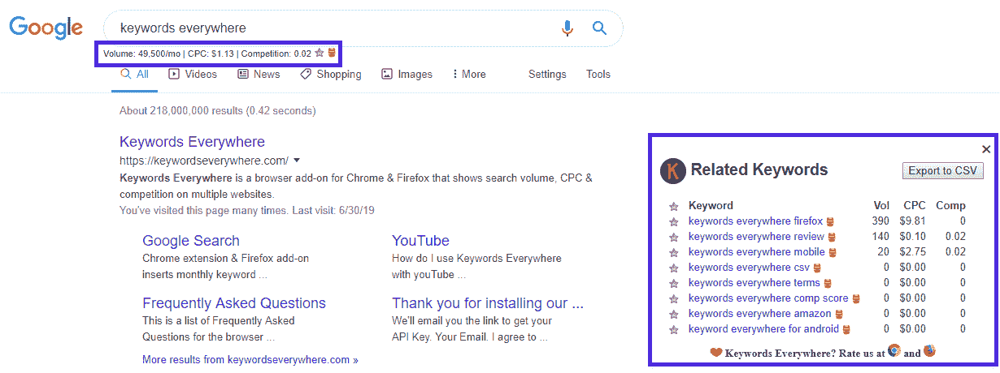

Keywords Everywhere

[关键词无处不在](https://keywordseverywhere.com/)是一个很棒的工具，以前是免费的，现在是基于信用的。每当你输入一些东西，这个工具就会显示你在谷歌上的搜索量、竞争对手和平均点击费。它还显示了相关关键词和“人们也搜索”关键词的统计数据。不管你使用其他什么工具，我都强烈推荐使用这个工具。

想要更多的 SEO 工具？查看 Kinsta 为 WordPress 列出的[必备 SEO 插件列表。](https://kinsta.com/blog/best-seo-plugins-for-wordpress/)

### 建议的堆栈

那么应该获得哪些关键词研究工具呢？我建议的堆栈是 Ahrefs 和 Keywords Everywhere。Ahrefs 是一个完整的 SEO 软件，它将帮助你对你的网站进行排名，而不仅仅是查找关键词。“关键词无处不在”让你在谷歌上搜索的任何时候都能看到搜索量和关键词的想法。再加上是免费的，有什么不喜欢的呢？

[SEO without keyword research is useless. Learn how to do it once and for all to unleash a flood of organic traffic towards your site! 🌊🏄Click to Tweet](https://twitter.com/intent/tweet?url=https%3A%2F%2Fkinsta.com%2Fblog%2Fkeyword-research%2F&via=kinsta&text=SEO+without+keyword+research+is+useless.+Learn+how+to+do+it+once+and+for+all+to+unleash+a+flood+of+organic+traffic+towards+your+site%21+%F0%9F%8C%8A%F0%9F%8F%84&hashtags=seo%2Cgrowth)

## 摘要

以下是我们所学内容的快速回顾:

1.  关键词研究对任何搜索引擎优化活动都非常重要，不应该被忽略或轻视。
2.  搜索量和关键词难度可能具有欺骗性。做一些更深入的研究，在你做决定之前，在谷歌上输入关键词并查看结果。
3.  不要被低搜索量所迷惑。通过使用 Ubersuggest 或 Ahrefs 查看热门页面搜索流量来检查真实的搜索量。
4.  搜索意图才是王道。确保你创建的内容与人们想看的内容(以及谷歌已经在展示的内容)相匹配。
5.  寻找关键词筒仓。它们可以成为快速排列网页的捷径。

这就是全部了！如果你有任何问题，欢迎在下面留言或发邮件给我。要获得更多关于 SEO 的帮助，[点击这里阅读我的逐步指南](https://billwidmer.com/white-hat-seo-case-study/)和这个关于[如何给你的网站带来更多流量的很棒的深度指南。](https://kinsta.com/blog/how-to-drive-traffic-to-your-website/)

祝你好运！

* * *

让你所有的[应用程序](https://kinsta.com/application-hosting/)、[数据库](https://kinsta.com/database-hosting/)和 [WordPress 网站](https://kinsta.com/wordpress-hosting/)在线并在一个屋檐下。我们功能丰富的高性能云平台包括:

*   在 MyKinsta 仪表盘中轻松设置和管理
*   24/7 专家支持
*   最好的谷歌云平台硬件和网络，由 Kubernetes 提供最大的可扩展性
*   面向速度和安全性的企业级 Cloudflare 集成
*   全球受众覆盖全球多达 35 个数据中心和 275 多个 pop

在第一个月使用托管的[应用程序或托管](https://kinsta.com/application-hosting/)的[数据库，您可以享受 20 美元的优惠，亲自测试一下。探索我们的](https://kinsta.com/database-hosting/)[计划](https://kinsta.com/plans/)或[与销售人员交谈](https://kinsta.com/contact-us/)以找到最适合您的方式。