# WordPress Multisite:WordPress 网络的一切你需要知道的指南

> 原文：<https://kinsta.com/blog/wordpress-multisite/>

如果你使用 WordPress 已经有一段时间了，你可能会有很多网站在运行。如果您的站点有一些共同点，您可能会想:是否有比将它们作为单个安装来管理更有效的方式来运行它们？

WordPress Multisite 可能是你正在寻找的。它允许你在你的 WordPress 安装上创建一个[网络，这意味着你可以在那个网络上运行任意多的网站，所有的都在 WordPress 的一个实例上。想想这个:WordPress 的](https://kinsta.com/knowledgebase/multisite/)是一个运行数百万网站的 WordPress 多站点安装的很好的例子。

在这篇文章中，我将指导你安装 WordPress Multisite 所需要知道的一切，并从中获得最大收益。我来盖:

 WordPress Multisite is a big topic with lots of aspects. But it isn’t difficult to get to grips with, and once you’ve worked through this article, you’ll know everything you need to run a Multisite network in WordPress.

因此，让我们从明确什么是 WordPress Multisite 开始。

## 什么是 WordPress Multisite？

WordPress Multisite 是向 WordPress 安装添加多个站点的一种方式。这是一个你可以添加到你现有的或者新创建的 WordPress 站点的功能。要激活 WordPress Multisite，你需要在你的 WordPress 安装中的几个文件中添加几行代码(我将很快向你展示)。然后你在你的网络中创建站点。现有的网站留在那里，它的 [URL 保持不变](https://kinsta.com/knowledgebase/wordpress-change-url/)，而新的网站被添加到上面。

### WordPress 安装与 WordPress Multisite(主要区别):

*   单个站点的数量。
*   [WordPress 用户角色](https://kinsta.com/blog/wordpress-user-roles/)–激活多站点添加网络管理员角色。
*   访问主题和插件-只有网络管理员可以安装它们。
*   管理屏幕–多站点添加了一些用于管理网络的屏幕。
*   媒体的存储方式——Multisite 为上传到每个站点添加额外的文件夹。
*   数据存储方式–多站点为每个站点创建额外的数据库表，但存储整个网络的一些数据(如用户)。

让我们仔细看看它们。


### WordPress 多站点用户角色:从管理员用户到网络管理员

当您安装 WordPress Multisite 时，您将成为网络管理员，对您在网络上创建的任何网站拥有管理员权限。您还可以允许其他人在网络中创建自己的站点，并让他们成为该站点的管理员。

网站管理员的访问级别低于网络管理员。作为网络管理员，你可以安装主题和插件，而站点管理员可以为他们的站点激活它们，但是他们不能安装新的。这有助于你保持[你的网络安全](https://kinsta.com/blog/wordpress-security/)，因为你不希望网站管理员添加可能危及网络的代码。

站点管理员可以添加新用户，但是这些用户只能访问他们添加到的单个站点，而不能访问网络上的所有站点。整个网络的用户只存储一次，因此您可以让现有用户访问更多网站，而无需添加另一个帐户。在这篇文章的后面，我将向你展示 WordPress Multisite 是如何存储用户数据和其他数据的。

### 多站点和域名

标准 WordPress 系统和多站点网络的另一个关键区别是域名的不同。您的网络与您设置它的网站具有相同的 url。所以，如果你的站点在 mysite.com，网络也在那个地址。

当您激活多站点时，您可以指定站点是使用[子域(site1.mysite.com)](https://kinsta.com/blog/wordpress-subdomain/)还是子目录(mysite.com/site1)。你也可以[将其他域映射到你的网络](https://kinsta.com/knowledgebase/wordpress-multisite-domain-mapping/)，这样各个站点就像在自己的域上一样:对于站点用户来说，站点看起来就像在使用自己独立的 WordPress 安装。

世界上最大的 WordPress 多站点网络的例子是 WordPress。它托管了数百万个不同规模的网站，从妈妈博客到大公司，并通过一些定制和复杂的方式管理数据来做到这一点，你不需要担心。还有其他组织使用 WordPress Multisite 的方式，你将能够更好地理解，我将在这篇文章中向你展示一些例子。

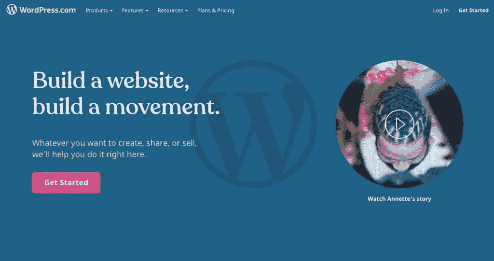

The WordPress.com signup page


你可能会认为这增加了额外的复杂性，运行多个 WordPress 安装会更容易。但是 Multisite 确实有很多优点，所以让我们更详细地看看这些优点。


## WordPress Multisite 的优势

我必须承认:我有偏见。我是 WordPress Multisite 的忠实粉丝，多年来我一直用它来创建个人和客户网站。

但是这种偏见是有原因的，因为 WordPress Multisite 是一个很好的工具。如果[你在运行多个 WordPress 网站](https://kinsta.com/blog/wordpress-multisite-plugins/)，这会节省你的时间，让你更有效率。

多站点可能适合您，如果您曾经:

*   在你启动的每个网站上安装相同的插件(例如，性能，安全，搜索引擎优化)。
*   在多个网站上使用框架主题作为父主题。
*   为一个组织的不同分支机构开发了多个具有相同元素(如品牌或结构)的网站。
*   当你宁愿花时间开发或管理多个网站时，却花了比你所希望的更多的时间来更新它们。

让我们更详细地看看这些好处。

### 更高效的代码

在一个网络上运行多个站点意味着更少的代码。不管它们在多少网站上被激活，都只有一套核心 WordPress 文件，每个主题和插件只有一个副本。

这意味着你的网络比你为每个网站运行一个单独的 WordPress 系统占用更少的服务器空间。你添加的网站越多，累积的就越多。它可以节省你的托管费用和保持代码更新的时间。

### 更高效的开发

如果你正在开发带有[自定义主题](https://kinsta.com/blog/wordpress-free-vs-paid-themes/)的网站，你可能会有一个基本主题作为你的起点。这可能是一个框架主题，一个简单的父主题，或者一个启动主题(建议阅读:[如何定制你的 WordPress 主题](https://kinsta.com/blog/how-to-customize-wordpress-theme/))。

通过在 Multisite 中工作，你可以[安装那个 WordPress 主题](https://kinsta.com/blog/how-to-install-a-wordpress-theme/)一次，使用它作为你的网络中单独站点上激活的主题的父主题，并且节省你自己的时间。

当我开始做客户工作时，我为我所有的网站开发了一个框架主题。我曾经为每个客户在每个新的 WordPress 安装中安装它，然后[创建一个子主题](https://kinsta.com/blog/wordpress-child-theme/)，它将为站点激活。现在，我在我的多站点网络中只有框架主题，每个站点都有自己的子主题。

如果你的网站有共同的设计元素，这是非常有用的。例如，如果您正在为公司的多个部门创建站点，您可以创建一个包含所有通用设计和布局元素的父主题，然后为每个站点开发一个子主题，并为相关站点激活每个主题。

这不仅节省了存储(和更新)父主题的多个实例，还意味着您可以显示网络中其他站点的内容。这让你创建的东西不仅仅是单个站点的集合。

### 更高效的管理

保持你的 WordPress 多站点网络更新将比在多个 WordPress 安装上做同样的事情更有效率。

你只需要[更新你网络中的所有主题](https://kinsta.com/blog/how-to-update-wordpress-theme/)和插件一次，不管它们在多少网站上活跃。

当你在多个站点上运行一个主题或插件时，严格的测试将尤其重要，因为你需要在所有相关的站点上进行测试。你可以使用 [Kinsta 的 staging environment](https://kinsta.com/help/staging-environment/) 来测试你的 staging 网络上的更新，然后当你对一切正常感到满意时，再将它投入使用。
T3】

## WordPress Multisite:最常见的用例

有很多不同的方式可以使用 WordPress Multisite。让我们看一些例子。

### 个人网站

如果您运行多个个人网站，将它们迁移到一个多站点安装会节省时间。这是我做的事情。我把自己所有的网站都放在一个多站点网络上，原因有三:

*   它们有共同的代码(父主题和一些插件)。
*   它节省了主机空间和更新时间。
*   我希望能够在我的网络中的一个站点上显示另一个站点上的数据。

我使用域名映射将单个域名映射到每个网站，所以就用户而言，他们是独立的网站。

### 托管客户网站

当我开始建立客户网站时，我有一个 WordPress 插件清单，我会在每个插件上安装。我还会为它们中的每一个使用相同的父主题。

当我发现 WordPress Multisite 时，我意识到我可以通过将所有这些网站迁移到一个网络并在那里保持代码更新来提高效率。这也意味着我只有一个 WordPress 安装来保证安全和备份。所有这些都节省了时间和麻烦。

您可以使用域映射将客户端的域映射到他们的站点，这将适用于管理屏幕以及公共站点。这样，你的客户就不需要担心你使用 Multisite 来托管他们的网站(虽然我的客户肯定不会反对)。

### 商业网站

如果你为一个企业的不同部门运行网站，那么使用 WordPress Multisite 会更有效率。

你只需要更新一个 WordPress 安装，你可以跨站点共享数据和用户，你可以在网络上使用相同的父主题和插件。这将节省时间时，开发网站和管理它以后。

BBC 美国公司就是一个为越来越多的站点使用多站点网络的企业的例子:每个节目在一个网络中都有自己的站点。


The BBC America website


### 内联网

即使对面向公众的站点使用 Multisite 不适合你，你可能会发现对公司内部网使用 Multisite 比拥有一个大的 WordPress 站点或多个小的要好。

对公司内部网使用多站点意味着您可以:

*   为每个部门添加单独的站点，并允许员工访问相应的站点。
*   只需将每个员工添加为用户一次，并授予他们访问所需网站的权限。
*   跨站点共享内容，例如在各个站点的主页上显示来自中心站点的更新。

仅用户管理一项就能使这种方法比其他任何方法都更有效。

### 社区网络

社区团体和组织需要一个在线的存在，但是会发现它很昂贵。使用多站点网络托管多个团体的站点将节省资金，并增加这些团体相互联系的机会。

你可以安装插件，让网站用户关注彼此的博客，并在管理屏幕上相互交流，你也可以在网站之间共享内容。

只需安装一个 WordPress 软件[来为](https://kinsta.com/blog/cheap-wordpress-hosting/)购买主机，你就能省下一大笔钱。

WordPress Multisite 被慈善机构、[非营利组织和教育机构所使用:一个例子是不列颠哥伦比亚大学，它使用 Multisite 为教师和学生托管一个博客网络。](https://kinsta.com/blog/wordpress-for-nonprofits/)

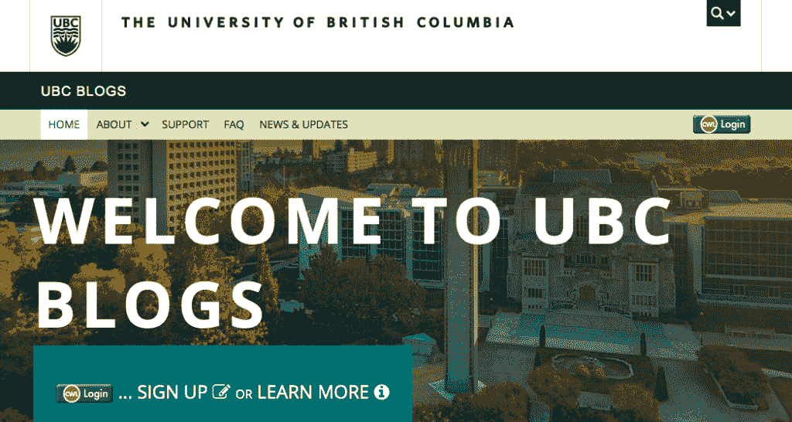

UBC Blogs


### 货币铸造

运营一个多站点网络是一个赚钱的好方法。WordPress.com 是一个通过在网络中为人们提供网站来赚钱的企业，还有其他一些企业，如 edublogs，它提供教育网站和博客。

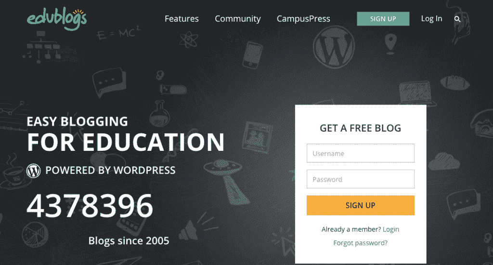

edublogs


您可以使用您的基本站点(您最初激活 Multisite 的站点)运行一个页面，允许人们在您的网络上创建自己的站点，您可以免费或收费。然后你可以向博客所有者提供计划，从免费到高级，级别介于两者之间。

您可以使用网络管理为博客所有者提供支持，通过通知和更新与他们交流，并建立一个用户社区。

以上是使用 Multisite 的一些方法。现在让我们看看如何在你的 WordPress 站点上激活它。


## 如何设置和激活 WordPress Multisite

当你设置 WordPress Multisite 时，你有两个选择:你可以在一个全新的网站上激活它，或者你可以把它添加到一个现有的网站上。两者同样有效，但会有一些不同。

让我们从第一个选项开始:如何在一个全新的网站上激活 WordPress Multisite。

### 用 Kinsta 自动安装程序激活 WordPress Multisite

如果你使用你的主机公司提供的自动安装程序来安装 WordPress，你可以选择同时激活 Multisite。

当您在 MyKinsta 中安装 WordPress 时，您可以选择同时激活 Multisite。检查**我们应该激活 WordPress Multisite 吗？**复选框和多站点将在您的新站点中激活。您还可以选择子域和子目录——稍后会有更多的选择。


Activating Multisite when installing WordPress in MyKinsta


### 手动激活多站点

为此，你需要访问 WordPress 安装中的文件。使用 [SFTP 和一个代码编辑器](https://kinsta.com/knowledgebase/how-to-use-sftp/)来访问你的文件。您将要编辑的两个文件是[。htaccess](https://kinsta.com/knowledgebase/wordpress-htaccess-file/) 和 wp-config.php，它们都在你的 WordPress 安装的基本文件夹中。在开始之前，请对这两个文件进行备份。(这也是一个好主意[备份你的整个网站](https://kinsta.com/help/wordpress-backups/)。)


### 重要的

如果您的站点托管在 Kinsta 上，您不需要配置。htaccess 规则，因为我们的主机栈不使用 Apache web 服务器。然而，如果你想建立一个**子目录子站点**，你需要联系我们的支持团队来编辑 Nginx 配置。


首先，在你的代码编辑器中打开 wp-config.php 文件(查看 [10 个最好的免费 HTML 编辑器](https://kinsta.com/blog/free-html-editor/))。在该文件中，找到这一行:

```
/* That's all, stop editing! Happy blogging. */
```

在它的正上方，添加这行代码:

```
define( 'WP_ALLOW_MULTISITE', true );
```

现在保存您的文件。

在你的浏览器中进入你的站点管理。转到已经为您创建的网络设置屏幕(通过**工具>网络设置**)。

你会看到一个屏幕，询问你想如何设置你的网络，使用子域或子目录。

如果您可以选择，请选择您想要使用的选项(请参阅下面的部分以找出不同之处)。在相关字段中输入您网络的标题和管理员电子邮件地址，然后单击**安装**按钮。

您将被带到网络设置屏幕。这个屏幕将包含一些代码，然后您需要复制并粘贴到两个文件中:wp-config.php 文件和。htaccess 文件。

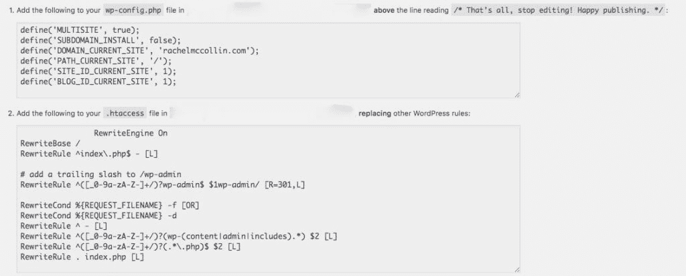

The Network Setup screen


打开这两个文件，粘贴屏幕上的代码，确保覆盖它告诉你的任何内容。

*注意:您的代码将与上面截图中的代码不同，因为您的网站与我的不同。*

保存并关闭这两个文件，并返回到您的网站管理员。点击**网络设置**屏幕中的链接，登录您的网络。使用您一直使用的登录凭据。

你会发现你的管理界面有了一点变化。你会在顶部的工具栏中有一个名为**我的网站**的新项目，另一个名为**网络管理**。

将鼠标悬停在**我的网站**链接上，您会看到一个新菜单，带您进入网络管理屏幕。点击**仪表板**链接进入网络仪表板。

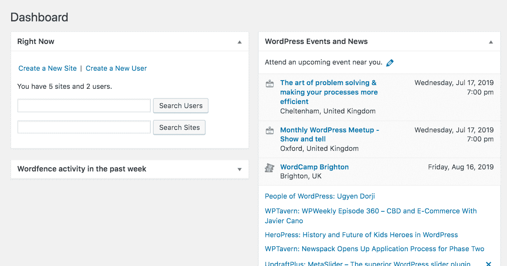

The Network Dashboard


这个仪表板看起来非常类似于标准 WordPress 站点的仪表板。不会有任何博客帖子、快速编辑或任何与内容相关的东西——因为网络没有内容。这都是在个别网站。

左边的管理菜单也不同。您将拥有一个名为 Sites 的新项目，它允许您访问站点创建和管理。其他一些菜单略有不同。花些时间去探索和了解他们。在这篇文章的后面，我们将看看你如何使用这些屏幕来管理你的网络。

### 在现有的 WordPress 安装上激活 WordPress Multisite

要在现有的 WordPress 站点上激活 Multisite，您可以按照上面相同的手动步骤操作。只有一个区别:**如果网站超过一个月了**，你将不能使用子目录。

这是因为你添加到网站上的内容越多，现有文章和网页的 URL 与网络中新网站的 URL 之间发生冲突的风险就越大。

假设您为一家名为“麦考林涂料”的公司创建了一个网站，该公司有一个名为“麦考林清漆”的分部。你可能已经在 mccollin-paints.com/mccollin-varnishes.创建了一个网页，然后在你的新网络中为麦考林清漆创建一个站点。如果您使用子目录，那么该站点可能位于完全相同的 URL。当用户访问那个 URL 时，WordPress 不知道显示哪个内容。因此，相反，你的网络将使用子域，它将在 mccollin-varnishes.mccollin-paints.com。(如果有一家叫麦考林涂料的公司，我很抱歉！)

### 多站点:子域 vs 子目录

我已经提到了子域和子目录。如果你在一个新的 WordPress 安装上激活 Multisite，你可以选择使用哪一个。区别如下:

## 注册订阅时事通讯


### 想知道我们是怎么让流量增长超过 1000%的吗？

加入 20，000 多名获得我们每周时事通讯和内部消息的人的行列吧！

[Subscribe Now](#newsletter)

*   使用子域名意味着每个网站都会有一个类似 https://site1.yournetwork.com 的 URL。如果您希望允许其他人在您的网络上创建站点，这是更可取的。
*   如果你选择子目录，每个网站都会有一个类似 https://yournetwork.com/site1.的 URL。如果你的网站已经运行了一个多月，你就没有这个选项了:你必须使用子域。

当然，你可能打算使用[域名映射](https://kinsta.com/knowledgebase/wordpress-multisite-domain-mapping/)来将一个独立的域名映射到你的网络中的每个站点，就像我在我自己的网络上所做的那样。如果是这种情况，你使用哪个子域或子目录真的无关紧要，因为它们永远不会被看到。

## 如何修复 WordPress 多站点 Cookies 错误

在某些情况下，当您登录到 WordPress 多站点安装时，您可能会遇到与 cookies 相关的错误。

> 您的浏览器阻止或不支持 Cookies。您必须启用 cookies 才能使用 WordPress。

这种常见错误出现在某些多站点配置中，尤其是带有自定义域映射的配置。要修复这个错误，请将下面的代码添加到您的*wp-config.php*文件中。

```
define('ADMIN_COOKIE_PATH', '/'); 
define('COOKIEPATH', ''); 
define('SITECOOKIEPATH', ''); 
define('COOKIE_DOMAIN', false);
```

## 如何管理 WordPress 多站点网络中的站点

现在你已经建立了你的网络，下一步是开始添加一些网站。有两种方法可以做到这一点:通过管理屏幕或通过你的主网站的前端。让我们从你如何通过管理开始。

### 通过 WordPress 管理添加一个站点

从网络[管理仪表板](https://kinsta.com/knowledgebase/wordpress-admin/)中，点击左侧菜单中的**站点**链接。这将显示您网络中的站点列表，假设您已经添加了一些站点。当你第一次开始，它会是空的。

要创建新站点，点击**添加新站点**按钮，进入**添加新站点**屏幕:

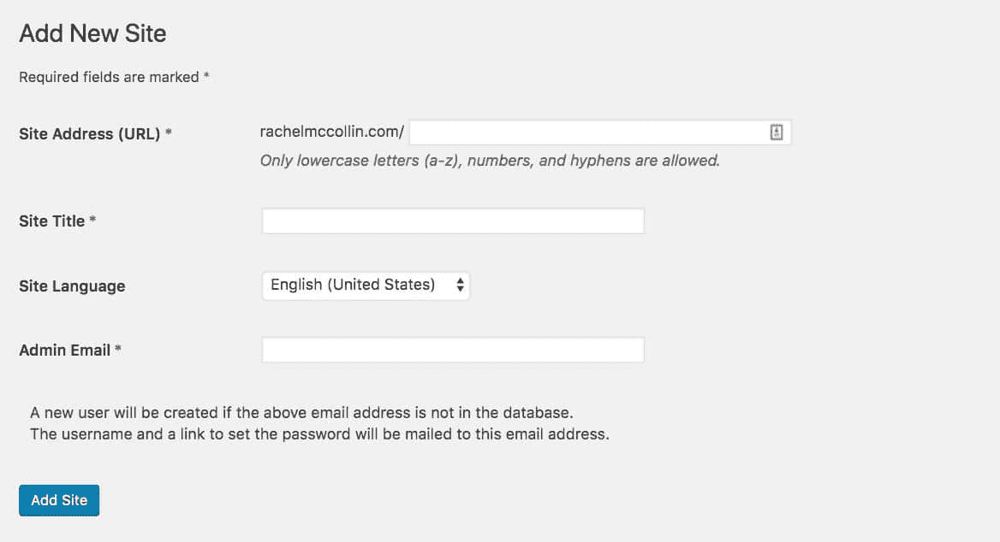

Add new site


填写新站点的详细信息，并点击**添加站点按钮**。当您返回站点屏幕时，将显示您的新站点。如果您将鼠标悬停在其名称上，您将看到几个可用的链接:

*   **编辑**–编辑站点设置(不是内容)。
*   **仪表板**–访问站点仪表板，在这里您可以添加新的帖子和页面，并对站点进行配置。
*   **停用**–停用网站，这样就没有人可以访问它。
*   **存档**–使访问者和网站管理员无法访问网站，但不要删除它。
*   **垃圾邮件**–标记为垃圾邮件，这样创建该网站的用户就不能再创建其他网站了。
*   **删除**–删除站点及其所有数据。
*   **参观**——参观现场前端。

这个阶段最有用的选项是**编辑**。点击它可以看到网站编辑界面。

以下是我网络中现有站点的一个示例:

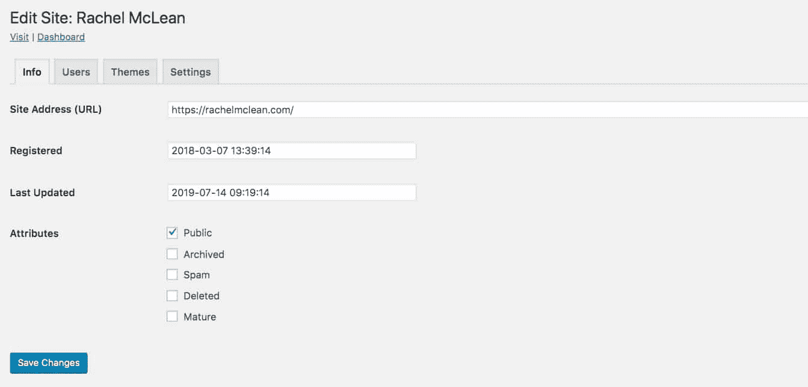

The Edit Site screen in Multisite


您可以在这里更改网站的主要设置，如域名和标题。您还可以访问主题屏幕，在那里您可以指定将为此站点启用哪些主题。

如果你有自己的站点或客户站点，你可能只想为每个站点启用一个主题。对于一个允许人们创建他们自己的网站的网络，你会希望网络支持多个主题。您可以在网络管理的主主题屏幕中完成此操作。

在这篇文章的后面，我们将仔细看看你如何在你的网络中管理主题和插件，因为它不同于一个标准的 WordPress 站点。

### 从前端创建一个网站

如果你允许用户创建他们自己的站点，他们可以在主站点的/wp-signup.php 屏幕上创建。

这将显示一个屏幕，允许某人使用现有用户帐户登录并创建一个站点，或者同时创建一个站点和一个用户帐户。

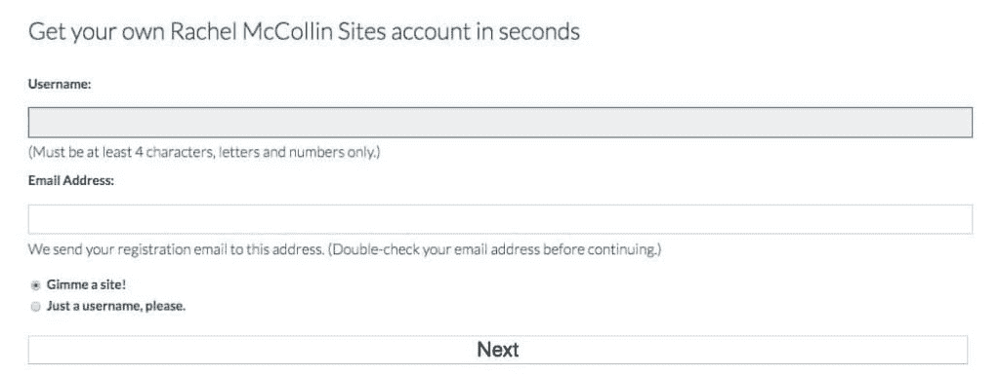

The wp-signup screen


如果你只是想通过管理界面自己创建网站，你可以禁用注册。进入**网络管理>网络设置**并选择**注册被禁用**单选按钮。

如果您从管理屏幕创建一个网站，您将拥有该网站的管理员权限，它将出现在**我的网站** [下拉菜单](https://kinsta.com/knowledgebase/wordpress-dropdown-menu/)中。如果其他人创建了该站点，您将没有站点管理员权限，也不会出现在列表中(尽管您可以通过站点屏幕将自己作为站点管理员添加到任何站点)。

### WordPress 多站点和域映射

域名映射是我最喜欢的 Multisite 特性之一。它可以让你将一个域映射到网络中的一个站点，并让它的行为就像是托管在那个域上一样。

注意:在 WordPress 版本之前，你需要一个插件来完成这项工作。你不再是了。


要将一个域映射到一个站点，首先，您需要确保它指向您的网络。在 MyKinsta 中，[添加域并使其指向您的站点](https://kinsta.com/knowledgebase/wordpress-multisite-domain-mapping/)。

一旦域指向您的网络，您需要将域名添加到站点的设置中。在网络管理屏幕中，进入**站点**，点击您想要映射的站点下的**编辑**。在站点编辑屏幕中，添加域名。

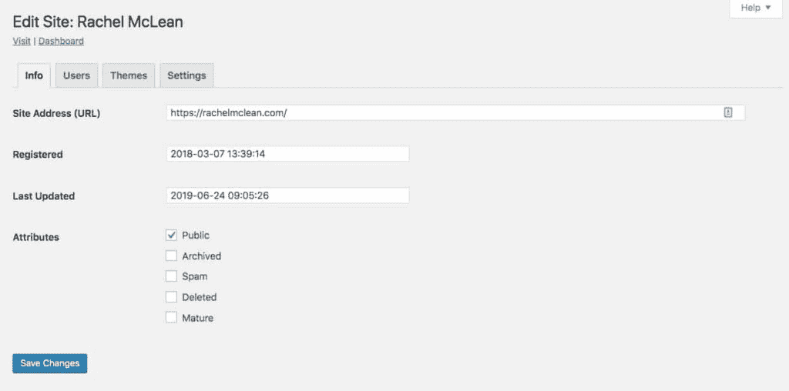

The Edit Site screen in Multisite


点击**保存更改**按钮，该网站现在将使用新域，而不是您网络的子域或子目录。

### 在 WordPress 多站点网络中克隆站点

当在你的网络中创建一个新的站点时，有时它可以加速[克隆一个现有的站点](https://kinsta.com/knowledgebase/clone-wordpress-site/)。为此，安装并通过网络激活一个插件，如[多站点克隆复印机](https://www.wordpress.org/plugins/multisite-clone-duplicator/)或 [NS 克隆-站点复印机](https://www.wordpress.org/plugins/ns-cloner-site-copier/)。

厌倦了你的 WordPress 站点缓慢的主机？我们提供超快的服务器和来自 WordPress 专家的 24/7 世界级支持。[查看我们的计划](https://kinsta.com/plans/?in-article-cta)

当你将鼠标悬停在站点设置界面中的站点名称上时，会出现一个**克隆**或**复制**链接。点击此处复制网站。

### 停用或删除 WordPress 多站点网络中的站点

有时，您需要让网络上的某个站点停止服务。也许这是一个你不再使用的个人网站。也许它属于一个取消了托管计划的客户。

从网络中删除站点有几个选项，您可以通过转到站点屏幕并单击站点名称下的相关链接来访问所有选项:

*   **停用:**此选项停用网站，这样就没有人可以访问它，但不会删除文件或数据。仍然可以访问站点管理。
*   **存档:**此选项使访问者和站点管理员无法访问站点，但不会删除它。
*   **垃圾邮件:**该选项将该站点标记为垃圾邮件，将其删除，并确保创建该站点的用户不能再创建其他站点。
*   **删除:**该选项删除站点及其所有数据。

## 多用户 WordPress: 在 WordPress Multisite 中使用用户

多用户 WordPress 的安装和标准的 WordPress 安装非常相似，只有一些不同。

多用户 WordPress 站点允许站点管理员和网络管理员创建和管理用户。区别在于站点管理员只能删除他们站点的用户特权:他们不能从网络中删除用户。

### 将用户添加为网络管理员(也称为超级管理员)

要将用户添加为网络管理员，请转到网络管理员屏幕中的**用户>添加新用户**。

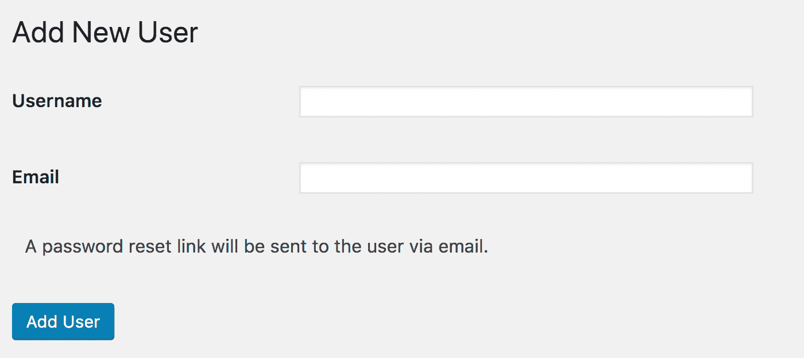

Add New User screen


在这里你填写用户名和电子邮件地址。用户将收到一封电子邮件，邀请他们设置密码并登录。

一旦你添加了一个用户，你可以通过用户界面编辑用户，就像在标准的 WordPress 安装中一样。然后，您可以授予用户一个名为“超级管理员”的特殊权限。

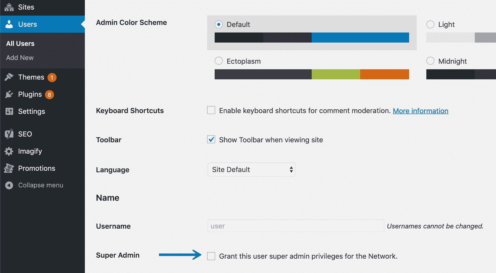

Multi User WordPress super admin privileges


### 将用户添加为站点管理员

网站管理员也可以向他们的网站添加用户。他们可以添加网络中的现有用户或全新用户。要做到这一点，从网站管理屏幕，前往**用户>添加新的**。

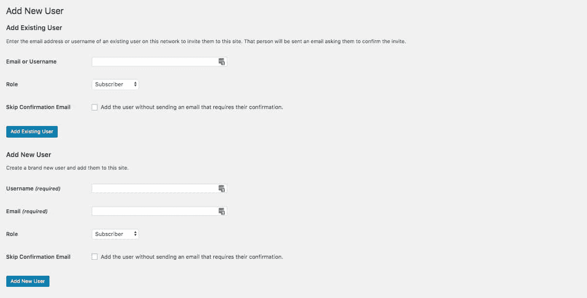

Adding a user as a site admin


对于现有用户，只需填写电子邮件地址或用户名以及他们在该网站上的角色。对于刚接触网络的用户，您需要一个用户名(必须是唯一的)和一个电子邮件地址。如果你跳过了确认邮件，你需要通过他们的用户管理界面自己给他们分配一个密码:让 WordPress 来帮你处理会更容易。

### 设置和管理用户角色(站点管理员和网络管理员)

站点管理员和网络管理员(也称为超级管理员)都可以添加用户，编辑他们的权限和信息，尽管网络管理员可以做更多的事情。

作为网络管理员，您可以通过进入**用户**屏幕来与用户打交道。在这里，您可以看到每个用户拥有哪些站点的权限，并访问他们的编辑屏幕。

要更改用户对某个站点的权限，或者将其删除或添加到某个站点，您需要转到该站点的编辑屏幕。转到站点屏幕，点击该站点的**编辑**，并选择**用户**选项卡。

在这里，您可以更改站点上的用户角色，删除用户和添加新用户。

作为站点管理员，您可以编辑站点上每个用户的用户详细信息或删除他们。进入用户界面，点击用户进入编辑界面。在这里，你可以编辑他们的详细信息，改变他们的角色，就像你在标准的 WordPress 安装中一样。

### 删除用户(站点管理员与网络管理员)

网络管理员可以从单个站点或整个网络中删除用户。网站管理员可以从他们的网站上删除用户。

作为网络管理员，进入用户屏幕，选中该用户记录旁边的复选框，然后选择用户列表上方的**批量操作**下拉列表。在这里，您可以删除用户和/或将其标记为垃圾邮件。如果您将他们标记为垃圾邮件，他们将无法再次注册您的网络。

作为站点管理员，您可以通过用户屏幕从您的站点中删除用户。选中用户名旁边的复选框，点击**批量操作**下拉列表中的**移除**选项。

### 用户和安全性

由于人们可以在您的网络上创建帐户，然后创建他们自己的网站，因此您可能会对安全性有些担心。

好消息是，您可以根据需要的访问级别来配置网络设置，并且可以通过阻止电子邮件域来增强安全性。

在网络管理屏幕中，转到**设置>网络设置**。在这里您可以找到**注册设置**部分的字段，您可以使用这些字段来增强安全性和限制访问。

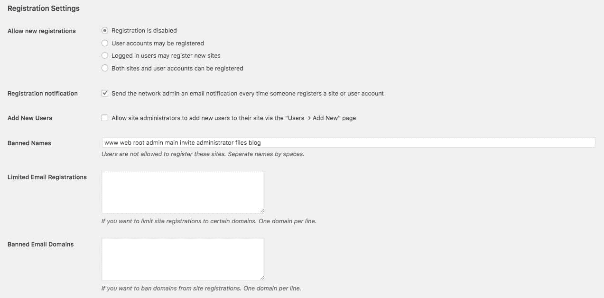

Registration settings


*   **允许新注册**:指定新用户是否可以注册，以及站点是可以由首次注册的人创建，还是仅由现有的登录用户创建。或者你可以关闭网站注册，这样只有你作为网络管理员可以这样做。
*   **注册**:我建议保持这个通知，这样当有人注册了一个网站或账户时你就知道了。它可以帮助你跟踪正在发生的事情，并给你一个接触新客户的机会。
*   **添加新用户**:如果您取消选中此框，您可以阻止站点管理员向网络添加新用户。相反，他们只能将网络上的现有用户添加到他们的网站上。
*   **禁止的名字**:在这里你可以添加你不想包含在用户名中的单词。
*   **有限的电子邮件注册:**列出可用于新用户帐户的电子邮件域。对内部网、公司或教育网络有用。
*   **禁止的电子邮件域**:如果你担心垃圾邮件或恶意帐户，禁止某些电子邮件域。

## 在 WordPress Multisite 中使用插件和主题

Multisite 的一大好处是你的插件和主题只存储一次。这意味着更少的存储空间和更新时间。让我们进一步了解如何在 Multisite 中管理插件和主题。

### 插件和主题是如何存储的

主题和插件存储在 WordPress 安装的 wp-content 目录中，就像在标准站点中一样。这意味着每个插件和主题只被存储一次，不管它被使用了多少次。

### 安装和激活插件

只有网络管理员才能[安装主题](https://kinsta.com/blog/how-to-install-a-wordpress-theme/)；网站管理员没有权限。根据您配置网络的方式，您也可以通过在网络设置屏幕中选择此项来防止站点管理员激活插件。

要安装插件，请在网络管理中进入**插件>添加新插件**并以常规方式安装。然后，您可以选择网络激活它。如果您不这样做，个人站点管理员可以在他们的站点上激活它。

网络激活的插件将在所有站点上运行，并在这些站点的插件屏幕上可见。但是网站管理员不能停用它们。他们可以激活任何其他已安装的插件。

### 安装和启用主题

你只能通过网络管理界面安装一个主题。要做到这一点，进入网络管理中的主题屏幕，并以与普通网站相同的方式安装它。

当谈到启用主题时，WordPress Multisite 的工作方式有所不同。您可以为整个网络或单个站点启用主题。

注意:多站点包括启用站点主题的能力，而不是激活它。这是因为你只能为每个网站激活一个主题，而且是通过网站设置而不是网络设置来实现的。

要启用网络主题，请进入网络管理中的主题屏幕，找到主题，然后单击其下方的**网络启用**链接。

要启用单个站点的主题，请转到站点屏幕并单击相关站点的**编辑**链接。点击**主题**标签，点击主题名称下的**启用**链接。

这将使主题对站点管理员可见，因此他们可以选择激活它。任何没有为网络或个人站点启用的主题对站点管理员都是不可见的。

这意味着主题和插件在 Multisite 中的激活方式有着本质的区别:

*   一个网络激活插件将在网络中的所有站点上运行，站点管理员将无法停用它。网站管理员可以选择激活一个网络主题。
*   网站管理员可以选择激活一个没有网络激活的插件。未启用网络的主题只有在该站点启用后才可用于该站点。网站管理员看不到未启用网络功能或未启用网站功能的主题。

建议阅读:[如何删除一个 WordPress 主题](https://kinsta.com/blog/wordpress-delete-theme/)。

## 多站点如何存储媒体

WordPress 多站点网络存储[媒体](https://kinsta.com/blog/wordpress-media-library/)与标准站点不同。

当你上传附件到页面和个人网站的文章时，界面的工作方式和普通网站一样，所以网站管理员或编辑看不到任何区别。区别在于文件的存储方式。

当你在你的 WordPress 安装上激活 Multisite 时，在 wp-content/uploads 目录中会创建一个新的文件夹，名为“sites”。这将保存所有上传到您网络中站点的媒体。

每当你在网络上创建一个新的站点(或者一个用户创建)，WordPress 会在“站点”文件夹中创建一个新的文件夹，其名称等同于站点的 ID。基本站点的 ID 为 01，因此您在网络中创建的第一个新站点的 ID 将为 02。这意味着 WordPress 将在 wp-content/uploads/sites/02 创建一个新文件夹。该网站的所有上传都将存储在该文件夹中，与标准网站中使用的基于年份和月份的结构相同。

上传到基本站点的内容以与标准站点相同的方式存储在 wp-uploads 文件夹中:多站点不会为这些内容创建额外的文件夹。

## 多站点如何存储数据

Multisite 存储数据的方式也略有不同。

激活多站点时，会创建七个新的数据库表。这些将存储与网络相关的数据。

它们是:

*   wp _ 博客
*   wp _ 博客 _ 版本
*   wp _ 注册 _ 日志
*   wp _ 注册
*   wp_site
*   WP _ siteid
*   wp_sitecategories(可选)

存储整个网络数据的其他表是 wp_users 和 wp_usermeta，因为用户是为网络而不是为单个站点存储的。不会创建这些表，因为在标准站点的[数据库](https://kinsta.com/knowledgebase/wordpress-database/)中已经有了它们。

当你在网络上创建一个新站点时，WordPress 会为该站点创建 11 个新表格。它们被赋予一个与站点 ID 相对应的前缀。因此，对于站点 02，将创建以下表格:

*   wp _ 2 _ 帖子
*   wp_2_postmeta
*   wp _ 2 _ 注释
*   wp _ 2 _ 评论元数据
*   wp _ 2 _ 用户
*   wp _ 2 _ 用户元
*   wp _ 2 _ 链接
*   wp _ 2 _ 术语 _ 关系
*   wp _ 2 _ 术语 _ 分类
*   wp _ 2 _ 术语
*   wp _ 2 _ 选项

如果你激活一个插件，在一个站点上创建额外的数据库表，它将使用相同的前缀，并为每个被激活的站点创建表。

随着网络的发展和更多站点的添加，将会添加更多的数据库表。这使得 WordPress 可以将每个网站的数据分开保存，这样网站管理员就没有机会访问另一个网站的数据。

[Multisite is an *obscure* WordPress feature that offers untapped opportunity when building a new site. Learn everything you need to know in our latest guide! 🏗🎯Click to Tweet](https://twitter.com/intent/tweet?url=https%3A%2F%2Fkinsta.com%2Fblog%2Fwordpress-multisite%2F&via=kinsta&text=Multisite+is+an+%2Aobscure%2A+WordPress+feature+that+offers+untapped+opportunity+when+building+a+new+site.+Learn+everything+you+need+to+know+in+our+latest+guide%21+%F0%9F%8F%97%F0%9F%8E%AF&hashtags=wordpress%2Cwebdev)

## 摘要

WordPress Multisite 是一个非常强大的工具。如果你正在为自己、社区或客户创建多个网站，它可以节省磁盘空间，让你更有效率。

WordPress Multisite 有很多用途:你可以把它用于你的个人网站，托管客户网站或社区网站，用于商业网站，或者运行一个类似 WordPress.com 的人们自己创建的博客系统。从长远来看，花时间去掌握 Multisite 将会获得巨大的回报。

* * *

让你所有的[应用程序](https://kinsta.com/application-hosting/)、[数据库](https://kinsta.com/database-hosting/)和 [WordPress 网站](https://kinsta.com/wordpress-hosting/)在线并在一个屋檐下。我们功能丰富的高性能云平台包括:

*   在 MyKinsta 仪表盘中轻松设置和管理
*   24/7 专家支持
*   最好的谷歌云平台硬件和网络，由 Kubernetes 提供最大的可扩展性
*   面向速度和安全性的企业级 Cloudflare 集成
*   全球受众覆盖全球多达 35 个数据中心和 275 多个 pop

在第一个月使用托管的[应用程序或托管](https://kinsta.com/application-hosting/)的[数据库，您可以享受 20 美元的优惠，亲自测试一下。探索我们的](https://kinsta.com/database-hosting/)[计划](https://kinsta.com/plans/)或[与销售人员交谈](https://kinsta.com/contact-us/)以找到最适合您的方式。