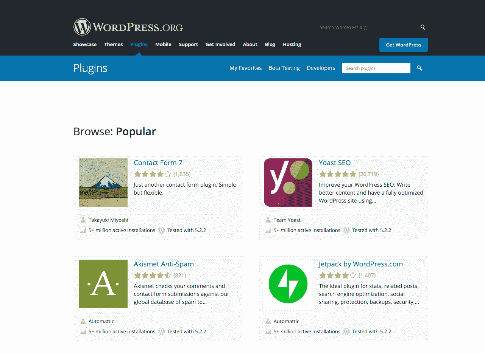
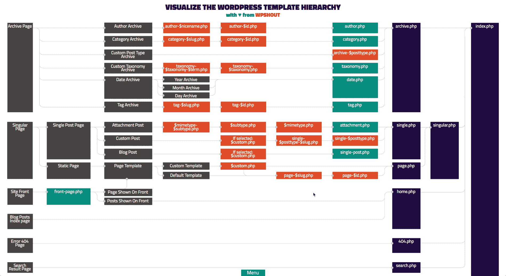
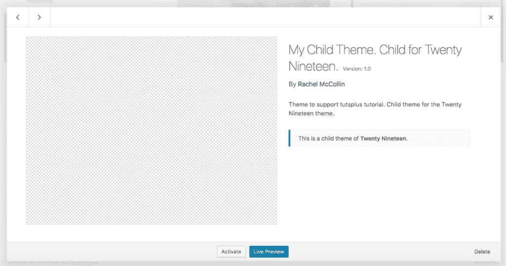
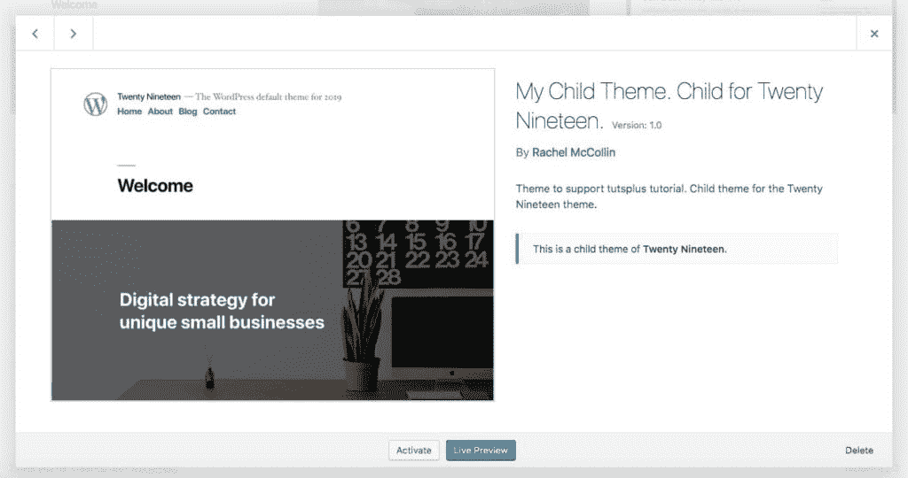
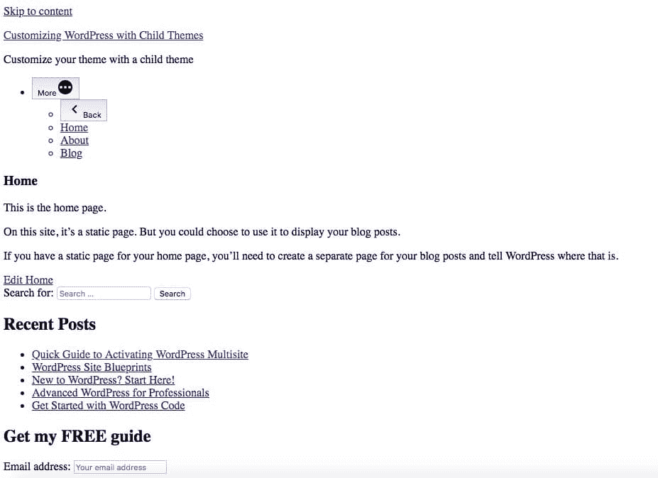
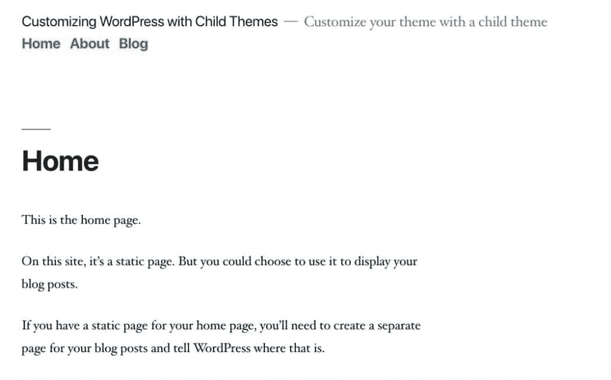

# 如何在 WordPress 中创建子主题(扩展指南)

> 原文：<https://kinsta.com/blog/wordpress-child-theme/>

你已经[运行你的 WordPress 网站](https://kinsta.com/blog/website-ideas/)有一段时间了，它一直在做你需要它做的事情。但是现在，您决定需要定制它。

或者也许你正在创建一个你从[主题目录下载的主题或者一个你购买的主题，你意识到它并不完全按照你需要的方式工作。](https://kinsta.com/blog/wordpress-free-vs-paid-themes/)

那你是做什么的？

你可以找到一个插件来提供你需要的定制或者切换到一个新的主题。但是如果你对当前的主题很满意，却找不到一个插件来添加你所需要的功能，那该怎么办呢？

回答:[你需要定制你的主题](https://kinsta.com/knowledgebase/edit-wordpress-code/)。最佳实践是:你可以通过(WordPress)子主题来实现。

在这篇文章中，我将向你展示如何在 WordPress 中创建一个子主题，如何使用它来定制你的站点，以及子主题是如何工作的。我还将解释父主题的概念，并描述站点上的父主题如何与子主题交互:

 Before we dive into creating a child theme, let’s identify the 3 methods you can use to customize your WordPress site. [If you don't want to lose all your customizations, child themes are your best bet. 👶 Learn how to create them with our extensive guide!Click to Tweet](https://twitter.com/intent/tweet?url=https%3A%2F%2Fkinsta.com%2Fblog%2Fwordpress-child-theme%2F&via=kinsta&text=If+you+don%27t+want+to+lose+all+your+customizations%2C+child+themes+are+your+best+bet.+%F0%9F%91%B6+Learn+how+to+create+them+with+our+extensive+guide%21&hashtags=wordpress%2Cdevelopment)

## 定制 WordPress 的方法

定制一个主题[伴随着风险](https://kinsta.com/blog/how-to-update-wordpress-theme/)。如果你在第三方主题中编辑代码(比如你从市场买的[，那么当你下一次更新主题时，你所有的修改都将丢失。这意味着不仅你的网站会回复到原来的样子，而且你所有的工作都白费了。](https://kinsta.com/blog/themeforest-pros-cons/)


有三种方法可以定制你的 WordPress 站点:

*   [直接编辑你的主题](https://kinsta.com/knowledgebase/edit-wordpress-code/)。
*   [安装插件](https://kinsta.com/knowledgebase/how-to-install-wordpress-plugins/)。
*   创建当前主题的子主题。

让我们依次来看一下其中的每一项。


## 什么是 WordPress 子主题(词汇表):

WordPress 子主题是与另一个主题(称为父主题)协同工作的主题，它继承了父主题的所有功能和样式。

开发最佳实践推荐使用子主题来编辑、更新或定制现有的 WordPress 主题，这是维护其设计和代码的一种安全方式。

Support

### 编辑您的主题

如果你的站点正在运行一个自定义的 WordPress 主题，这意味着它是专门为你的站点开发的，你可以选择安全地编辑它，因为下次主题更新时没有丢失你的自定义的风险。

相反，如果您或您的开发人员将来对主题进行了更改，您将编辑的是主题的自定义版本，而不是更改前的原始版本。

这并不意味着编辑你的主题没有风险。如果你在主题编码方面没有经验，那么[创建一个子主题](https://developer.wordpress.org/themes/advanced-topics/child-themes/)可能会更安全(我们一会儿就会看到如何实现)。这是我做的事情:我有一个基本主题，我用在我所有的网站上，有标准的布局，[钩子，和功能](https://kinsta.com/blog/wordpress-hooks/)，然后我用一个子主题在每个网站上定制它。

如果你直接编辑你的主题，确保[你保留了原始主题](https://kinsta.com/help/wordpress-backups/)的备份，不要在现场编辑主题(使用一个开发或[暂存站点](https://kinsta.com/help/staging-environment/)代替)，并使用[版本控制](https://kinsta.com/blog/wordpress-version-control/)来跟踪你的更改。

如果你使用第三方主题，你不应该直接编辑它。相反，使用插件或创建一个子主题。

### 添加插件

定制 WordPress 主题的第二个选择是安装或编码一个插件。

如果你想做的定制是功能性的，而不是与设计相关的，插件是更合适的方式。所以如果你想添加额外的代码，最好创建一个插件。

插件不必太大或太复杂:如果你需要在你的主题中的[functions.php 文件中添加额外的代码，创建一个简单的插件来为你的站点添加几行代码。一个很好的例子是注册一个](https://developer.wordpress.org/themes/advanced-topics/child-themes/#using-functions-php)[自定义帖子类型](https://codex.wordpress.org/Function_Reference/register_post_type)。

向主题的 functions.php 添加代码可能很诱人，但是添加文章类型是对网站功能的改变，而不是设计的改变。如果[你将来要切换主题](https://kinsta.com/blog/change-wordpress-theme/)，你不会想丢失那些帖子类型和你用它们创建的所有帖子。这就是为什么你应该[安装](https://kinsta.com/knowledgebase/how-to-install-wordpress-plugins/)或者创建一个插件。

有时候你可以找到一个现有的插件来做你需要的事情，但是有时候你可能需要自己编写插件。



The WordPress repository


如果你不确定是否应该创建一个插件或者定制你的主题(或者子主题)，问问你自己:如果我想在未来改变我的网站的设计并且[安装了一个新的 WordPress 主题](https://kinsta.com/blog/how-to-install-a-wordpress-theme/)，我会希望这个改变保持吗？如果答案是肯定的，这意味着改变是功能性的，而不是美观的，它应该放在插件中。

### 创建子主题

定制 WordPress 主题的第三个选项是[创建一个子主题](https://developer.wordpress.org/themes/advanced-topics/child-themes/https://developer.wordpress.org/themes/advanced-topics/child-themes/)。

以下是一些使用子主题的场景:

*   你想改变网站的设计，而不是功能。
*   您的站点正在运行第三方主题或您希望在当前状态下再次使用的主题。
*   你不想直接编辑你现有的主题，以免引起问题(也许你不是一个有经验的主题开发者)。
*   您的站点正在运行一个设计为父主题的主题，例如框架主题。这些主题有很多定制选项[，比如钩子](https://kinsta.com/blog/wordpress-hooks/)，它们是为你添加自己的子主题而设计的。

因此，子主题是向您的站点添加自定义内容的有效且安全的方法。所以让我们更深入地看看它们。


## 什么是 WordPress 子主题？

那么，到底什么是 WordPress 中的子主题呢？它是如何工作的？

子主题是与另一个主题协同工作的主题，它被称为[父主题](https://developer.wordpress.org/themes/advanced-topics/child-themes/#what-is-a-parent-theme)。

它包含了一些具体的说明，告诉 WordPress 这是一个子主题，以及父主题是什么。然后 WordPress 在大多数情况下使用父主题的代码，但是会用子主题的代码覆盖它(如果需要的话)。如果你遇到一个使用你喜欢的子主题的网站，使用我们的[主题检测工具](https://kinsta.com/tools/what-is-my-ip/wordpress-theme-detector/)来找出父主题是什么。

### WordPress 子主题中的文件

每个 WordPress 子主题必须至少有两个文件:一个样式表和一个函数文件。样式表将在顶部包含注释掉的文本，告诉 WordPress 这是一个子主题，以及父主题是什么。functions 文件将包含一个函数，[将父主题](https://developer.wordpress.org/themes/advanced-topics/child-themes/#3-enqueue-stylesheet)中的样式表加入队列。

注意:您可能会遇到一些指南，告诉您从子主题的样式表中调用父主题样式表。这不再是正确的做法，您应该在函数文件中使用入队。我将很快向您展示如何做到这一点。

你的子主题不需要包含任何其他文件。与父主题不同，如果主题中没有任何更具体的文件，它不需要一个 index.php 的 T2 文件作为后备。这是因为如果子主题中不存在模板文件，WordPress 将使用父主题中的文件。

因此，根据您希望子主题做什么，您可以向样式表、函数文件添加额外的代码，或者在子主题中创建额外的文件来覆盖父主题。这些可能包括以下一项或多项:

*   [模板文件](https://developer.wordpress.org/themes/basics/template-files/)覆盖来自父主题的相同文件，例如 page.php 当你想定制静态页面的显示时。
*   模板部件，如 header.php 或 footer.php，当您想要自定义这些部分的网站设计。
*   您从子主题中的模板文件调用的额外模板部件。因此，如果您想在显示静态页面时定制标题，您可以在子主题中创建一个名为 header-pages 的文件，以及一个名为 pages 的模板文件，它将覆盖父主题中的 page.php。这个模板文件将与父主题中的模板文件完全相同，除了对头文件的调用，它将调用 header-page.php 而不是 header.php。
*   功能的额外包含文件。如果你想添加大量的函数代码并组织它们，你可以为每组函数创建包含文件，然后在你的子主题的 functions.php 文件中调用它们。例如，如果您想添加额外的定制器选项，您可以在您的子主题中添加一个名为 Customizer 的包含文件，然后从子主题中的函数文件调用该文件。

但是如果你添加了额外的文件和功能，WordPress 如何知道使用哪一个呢？来自父主题的还是来自子主题的？这就是我们接下来要讨论的。

### WordPress 如何选择模板文件

当在你的网站上显示内容时，WordPress 从你的主题中选择模板文件的方式是参照[模板层次结构](https://wphierarchy.com/)。



The WordPress template hierarchy


WordPress 使用这种层次结构来处理你的主题中的[模板文件](https://developer.wordpress.org/themes/basics/template-files/)，并在显示给定类型的内容时找到合适的模板文件。它将从顶部开始(在上图的左侧)，依次查找给定内容类型的每个文件。当它找到一个可以显示该内容的文件时，就会使用它。

假设您的主题有一个 archive.php 文件和一个 category.php 文件，但没有 tag.php 文件。当显示分类档案时，WordPress 将使用 category.php，因为它更具体的内容类型。当显示标签档案时，它将使用 archive.php。

如果 WordPress 找不到给定内容类型的模板文件，它将默认为无所不包的 index.php 文件，这就是为什么每个独立主题(即不是子主题)都必须有一个 index.php 文件。

这同样适用于单个帖子和页面。假设你的主题有一个 singular.php 文件，这个文件包含了所有帖子类型(包括页面和自定义帖子类型)的单个帖子。它还有一份 page.php 的档案。当显示一个页面时，它会使用 page.php。显示帖子时，它会使用 singular.php。如果你注册了一个自定义帖子类型，但没有为该帖子类型添加模板文件，它将再次使用 singular.php。

当您使用子主题时，WordPress 仍然使用模板层次结构来决定在您的站点上输出内容时使用哪个文件。它查看父主题和子主题中的文件，并使用它遇到的第一个文件。

假设你的子主题有 singular.php 和 post.php，你的父主题有 page.php 和 index.php。当输出一篇文章时，WordPress 将使用子主题中的 post.php。当输出一个页面时，它将使用父主题中的 page.php。当输出自定义帖子类型的单个帖子时，它将使用子主题中的 singular.php。

但是如果你的子主题和父主题都有同一个文件的实例呢？

让我们假设您在前面的示例中向子主题添加了一个 page.php 文件。因为该主题位于子主题中，所以它覆盖了父主题中的同一个文件。所以当显示一个页面时，WordPress 会使用子主题中的新 page.php 文件。

这就是为什么创建子主题可以让您定制父主题。如果您将父主题中的模板文件副本添加到子主题中，然后编辑它以包含您想要进行的自定义，WordPress 将使用这个新的模板文件，而不是父主题中的模板文件。这意味着您的定制将在显示内容时使用，而无需编辑父主题。不错！

### WordPress 如何运行父主题和子主题的功能

如果您不想对主题中的模板文件进行定制，而是对函数进行定制，该怎么办呢？

你也可以这样做。首先，你需要确信正确的方法是通过子主题而不是插件。一个例子可能是你想要编辑一个已经在父主题中的函数，例如，[在页脚](https://kinsta.com/knowledgebase/remove-powered-by-wordpress/)中输出跋的函数。

然后，将新函数添加到子主题的函数文件中，或者添加到从函数文件中调用的包含文件中。

为了确保您的新函数覆盖父主题的功能，您需要了解如何覆盖函数。有三种方法可以做到这一点:

*   通过在你的父主题中编写一个与可插入函数同名的新函数。
*   通过将父主题中的函数从它所依附的钩子上解钩，然后编写一个新的函数来替换它。
*   通过编写一个比原始函数优先级更高的新函数，并通过相同的钩子调用它，这意味着它在原始函数之后被调用，因此可以覆盖或扩充它。

在这篇文章的后面，我们将研究你是如何做到这些的。但是首先，让我们来看看在什么情况下你会使用或者不会使用子主题。


## 什么时候在 WordPress 中使用子主题(优点)

您现在知道了什么是子主题，以及如何使用它们来覆盖父主题中的模板文件或函数。

简单回顾一下，如果你在你的站点上运行一个主题，并且你想做以下一个或多个事情，你应该使用一个子主题:

*   编辑一个或多个模板文件。
*   添加与显示而非功能相关的额外功能。
*   覆盖父主题中的一个或多个函数。
*   添加额外模板文件。

一些优势包括:

*   很明显，子主题扩展了其父主题的功能。你已经有了一个现成的父主题模板，你需要做的就是[为你的子主题创建一个单独的 style.css 文件](https://kinsta.com/blog/wordpress-css/#how-to-customize-your-wordpress-theme-with-css)，并根据你的需要添加定制调整。
*   随着 WordPress 的发展，主题和[插件需要经常更新](https://kinsta.com/knowledgebase/manually-update-wordpress-plugin/)。如果您对您的主主题进行定制调整和更改，您可能会在更新主题时丢失所有更改。因此，对一个子主题进行这样的修改是明智的，这样即使你需要更新父主题，你也不用担心丢失你的修改。

当你不使用儿童主题的时候呢？

## 何时不使用 WordPress 子主题(缺点)

有时候你不会使用子主题，而应该使用不同的方法来定制你的站点。这些是:

*   如果你的主题是你自己开发的(或者[别人为你写的](https://kinsta.com/blog/hire-wordpress-developer/))并且不需要在其他地方使用。只需编辑主题，确保[使用版本控制](https://kinsta.com/knowledgebase/what-is-github/)。
*   如果您希望进行的自定义是功能性的，例如添加自定义帖子类型，并且您希望在将来更改主题时保留它们。请改用插件。

一些缺点包括:

*   **挑选理想的父母主题:**不是所有的主题都能充当好父母！例如，某些 WordPress 主题可能不会定期更新，因此往往缺乏最新的功能。类似地，并不是所有的 WordPress 主题都是在考虑子主题的情况下创建的，因此，可能会成为父主题的糟糕候选。你需要选择一个完美的父主题，以便恰当地扩展它，使它成为你的子主题的基础。
*   定制工作:子主题主要是寻求扩展和定制现有的模板设计。因此，如果你已经围绕你的父主题创建了一个网站，你可能需要重新考虑元素的定制，比如菜单、主题选项、侧栏、标题等等。当移动到子主题时。

既然你已经知道什么时候(什么时候不)使用子主题，是时候开始学习如何在 WordPress 中创建子主题了。

## 如何创建 WordPress 子主题

在 WordPress 中建立一个基本的子主题需要创建两个文件:样式表**和 T2 函数文件**。让我们来看看他们两个。

### 样式表

在你创建你的文件之前，你需要创建一个文件夹来存放你的主题。这放在你的 WordPress 安装的 wp-content/themes 文件中。

记住:不要在你的网站上这样做。首先将代码添加到开发站点，然后在您的临时站点上测试它。一旦你对它满意了，你就可以把它转移到你的网站上。所有 Kinsta 托管计划包括 [*分期*](https://kinsta.com/help/staging-environment/) *。*

在新主题的文件夹中，创建一个名为 style.css 的文件。

```
/*
Theme Name:  My Child Theme. Child for Twenty Nineteen.
Theme URI:  https://rachelmccollin.com
Description:  Theme to support tutsplus tutorial. Child theme for the Twenty Nineteen theme.
Author:  Rachel McCollin
Textdomain:  mccollin
Author URI:  https://rachelmccollin.com/
Template:  twentynineteen
Version:  1.0
License:  GNU General Public License v2 or later
License URI: https://www.gnu.org/licenses/gpl-2.0.html                 
*/
```

这段文字被注释掉了。它不是在你的站点上运行任何东西或者提供任何功能的代码。相反，它告诉 WordPress 主题。每个主题中都需要这样的文字，否则 WordPress 无法将其识别为主题。

## 注册订阅时事通讯


### 想知道我们是怎么让流量增长超过 1000%的吗？

加入 20，000 多名获得我们每周时事通讯和内部消息的人的行列吧！

[Subscribe Now](#newsletter)

让我们仔细研究每一行，以确定它们是做什么的:

*   主题名称:主题的唯一名称。
*   主题 URI:用户可以在这里找到主题的代码或文档。
*   描述:帮助用户理解主题的描述性文字..
*   作者:你的名字
*   Textdomain:这是用于国际化的。在任何国际化函数中使用文本域作为第二个参数。
*   作者 URI:作者的网站。
*   模板:存储父主题的文件夹。使用文件夹名称，而不是主题名称。没有这一行，你的主题就不能作为子主题。
*   版本:版本号
*   许可证:许可证，必须是 GNU。[链接]
*   URI 许可证:许可证信息的链接。

子主题中最重要的一行是模板:line。没有这个，主题就不能作为子主题。只有子主题才会包含这一行。

将它添加到你的主题的样式表中，编辑它来添加你自己的细节而不是我的。您需要编辑 Template:行来添加存储现有主题的文件夹，因为这将是您的父主题。

现在保存文件。如果您现在查看站点中的主题详细信息屏幕，您会看到显示的所有内容:



The theme page in WordPress with no screenshot


这看起来并不精彩，因为没有截屏。这是一张展示主题外观的图片。除非你的主题看起来和父主题很不一样，只要把 screenshot.png 文件从你的父主题复制到你的子主题就可以了。



The theme page in WordPress with screenshot


### 函数文件

下一步是向您的子主题添加一个函数文件。您需要这样做，以便可以将父主题中的样式表排入队列。没有它，你的站点将没有任何风格，看起来会像这样:



Our home page with no CSS


不好，我相信你会同意的！因此，让我们添加样式，使它看起来像它应该的那样。

在你的子主题文件夹中，添加一个名为 functions.php 的文件。打开它并添加以下代码:

```
<?php
/* enqueue script for parent theme stylesheeet */        
function childtheme_parent_styles() {

 // enqueue style
 wp_enqueue_style( 'parent', get_template_directory_uri().'/style.css' );                       
}
add_action( 'wp_enqueue_scripts', 'childtheme_parent_styles');
```

它使用`wp_enqueue_style()`函数将父主题中的样式表排队，`get_template_directory_uri()`函数定位文件的存储位置。该函数位于我创建的名为`kinsta_parent_styles()`的函数中，该函数与`wp_enqueue_scripts`挂钩。

你可能想知道为什么它使用一个叫做`wp_enqueue_scripts`的函数而不是`wp_enqueue_styles`。这是因为`wp_enqueue_scripts`同时用于脚本和样式，没有像`wp_enqueue_styles`这样的挂钩。

请随意编辑我的代码，在函数名前添加您自己的前缀。我使用“childtheme”作为前缀，以确保我的函数不会与父主题或任何插件中的任何其他函数冲突。

现在保存您的文件。


## 如何激活你的 WordPress 子主题

一旦你的孩子主题准备好了，你需要激活它。如果你担心激活子主题会关闭父主题，不要担心:WordPress 会知道使用父主题中的文件，除非你在子主题中添加新文件覆盖它们。到目前为止，您还没有向子主题添加任何额外的文件或函数，所以您的站点将会像父主题被激活时一样工作。

*记住:首先在[你的开发或筹备地点](https://kinsta.com/help/push-staging-live/)完成这项工作。在测试之前，不要在您的 live 站点上激活您的儿童主题。*

在 WordPress admin 中，进入**外观>主题**。你会发现你的孩子主题列在你网站上安装的主题中。

将鼠标悬停在主题上，点击**激活**按钮。这将激活您的儿童主题。现在，当您访问您的实时网站时，它将与以前一样:



The site home page


它看起来是一样的，因为您还没有添加任何定制。但是现在你有了一个童工主题。干得好！

## 如何在 WordPress 自定义你的孩子主题

现在你已经有了 WordPress 站点的工作子主题，是时候添加你的定制了。在这里，我将向您展示如何添加模板文件来覆盖父主题上的模板文件，如何向子主题添加样式，以及如何添加新功能。

让我们从模板文件开始。

厌倦了 WordPress 的问题和缓慢的主机？我们提供世界一流的支持，由 WordPress 专家提供 24/7 服务和超快的服务器。[查看我们的计划](https://kinsta.com/plans/?in-article-cta)

### 如何给你的 WordPress 子主题添加模板文件

我们已经了解了 WordPress 在你的网站上显示内容时是如何选择模板文件的。有两件事要记住:

*   WordPress 将使用层次结构中最先出现的[文件，无论是来自子主题还是父主题。](https://developer.wordpress.org/themes/basics/template-hierarchy/)
*   如果父主题和子主题中存在同名的模板文件(或模板部件，如 header.php ), WordPress 将使用子主题中的模板文件。

要添加定制，我发现从父主题制作相关文件的副本，添加到子主题，然后编辑它更容易。

这适用于子主题中的文件是否与父主题中的文件同名，或者它是否是用于显示不同内容类型的新文件，或者是层次结构中更高的文件。

因此，如果我将 page.php 的新版本添加到我的子主题，这将覆盖我的父主题中的 page.php，我将从我的父主题复制 page.php 到我的子主题，然后编辑它。确保您复制了文件:不要移动它，因为您不想对父主题做任何更改。

例如，如果我希望在我的子主题中有一个自定义页面模板，我会将 page.php 复制到我的子主题中，重命名它，然后编辑它。

这样，您可以确保文件中不需要自定义的所有方面仍然可以正常工作。这同样适用于模板部件。

### 如何给你的 WordPress 子主题添加样式

您还可以将样式添加到子主题的 style.css 文件中，这将增加或覆盖父主题样式表中的样式。

WordPress 将首先从父主题调用样式表，然后从子主题调用样式表。这意味着如果您将样式添加到子主题中，而子主题的目标元素与父主题中的样式相同，那么只要您使用相同的选择器，它就会覆盖父主题中的样式。

假设你想改变网站标题的颜色。在父主题中，它的样式可能是这样的:

```
h1.site-title {
 color: #000;
}
```

要在您的子主题中覆盖这一点，您应该添加以下内容:

```
h1.site-title {
 color: #303030;
}
```

由于浏览器会在父主题中的样式化之后遇到这种情况，所以它会覆盖这种情况并被使用。

### 如何给你的 WordPress 子主题添加功能

所以，你在 WordPress 中创建了一个子主题，不是因为你想要编辑任何模板文件，而是因为你想要添加额外的功能或者覆盖父主题中的一个或多个功能。

在您的子主题中编写函数比添加模板文件稍微复杂一些，但是这是可能的。

如果你想添加一个新的功能，它不与你的父主题中的任何功能交互，你可以直接去做。只需将该函数添加到您的孩子主题中的 functions.php 文件中，将其与相关的动作或过滤器挂钩，就可以了。

但是，如果您计划在父主题中覆盖或编辑一个函数，您需要了解您可以使用的方法。有三种方法可以覆盖子主题中的父主题功能:

*   如果父主题中的主题是可插拔的，你只需在你的子主题中写另一个同名的函数，WordPress 就会运行那个函数，而不是父主题中的函数。
*   如果你想让父主题中的函数完全停止运行，你可以在你的子主题中写一个函数，让它从它所连接的钩子上脱钩。
*   如果您想增加一个功能，您可以在您的子主题中添加另一个功能(使用不同的名称),并确保它在父主题中的功能之后运行。

让我们仔细看看你是如何做到的。

#### 覆盖可插拔函数

一个可插入的函数通过包装在它周围的条件检查来识别。这将检查是否有另一个同名的函数已经被触发。如果是，它不运行该函数。

WordPress 会在父主题的函数之前触发子主题的函数。如果它在父主题中遇到一个可插入的函数，而你已经在你的子主题中添加了一个同名的函数，那么这个可插入的函数就不会运行。

一个例子是在 WooCommerce 站点的店面主题中输出跋的函数。下面是没有内容的函数:

```
if ( ! function_exists( 'storefront_credit' ) ) {
 function storefront_credit() {
  // contents for function here
 }
}
```

如果你想覆盖它，你可以写另一个同名的函数(`storefront_credit()`)并把它挂在父主题中的钩子上。

#### 从父主题中分离一个函数

如果父主题的函数不可插拔，您仍然可以阻止它运行。假设你的父主题有一个名为`parent_function()`的函数，它被挂接到优先级为`20`的`init`钩子上。您希望阻止它运行，以便用您自己的函数替换它。

父主题函数可能是这样的:

```
function parent_function() {
 //contents of function here
}
add_action( ‘init’, ‘parent_function’, 20 );
```

要解开它，你应该在你的子主题中编码:

```
function remove_parent_function() {
 remove_action( ‘init’, ‘parent_function’, 20 );
}
add_action( ‘wp_head’, ‘remove_parent_function’ );
```

请注意，您将第二个函数与运行在每页顶部的 wp_head 挂钩，并且您必须为 priority 参数包含与原始函数相同的值。如果最初的`add_action()`函数没有优先级，你可以从子主题的`remove_action()`函数中忽略它。

*注意:如果原始函数被挂钩到一个过滤器挂钩，而不是一个动作挂钩，你可以以同样的方式使用`remove_filter()`。*

#### 用另一个函数扩充一个函数

有时，您可能想添加一个函数，而不是覆盖或删除一个函数。在这种情况下，您可以用不同的名称编写一个新函数，并将其附加到同一个钩子上。

让我们想象一下，在你的父主题中有一个名为`parent_footer`的页脚动作钩子。你附加到那个钩子上的任何函数都将在钩子所在的地方运行。

在父主题中，已经有一个名为`parent_footer_content()`的函数填充页脚。但是，如果你想添加一些额外的代码呢？

下面是`parent_footer_content()`函数在父主题中的样子:

```
function parent_footer_content() {
 // content of function here
}
add_action( ‘parent_footer’, ‘parent_footer_content’ );
```

现在，如果您想在此之后添加额外的内容，您可以在您的子主题中创建一个函数，该函数与同一个 action 挂钩，优先级意味着它在第一个函数之后运行。因为没有为父主题的功能设置优先级，所以默认为 10。所以你需要使用一个更大的数字，这样它就会在那之后启动。

```
function child_footer_extra_content() {
 // contents of function here
}
add_action( ‘parent_footer’, ‘child_footer_extra_content’, 20 );
```

这将把子主题函数的代码添加到父主题函数的代码之后。

## 如何解决子主题和父主题的问题

现在你知道了如何在 WordPress 中创建一个子主题，以及如何使用它来覆盖模板文件，添加额外的样式，以及为你的站点添加功能。

但是如果你的孩子主题不像你期望的那样工作呢？如果内容没有按照您预期的方式显示，或者某个功能没有启动，该怎么办？

使用此清单对您的子主题进行故障排除:

1.  检查您是否已经激活了您的子主题，并且您的父主题不再运行。忘记这一步出奇的容易！
2.  刷新你的浏览器缓存和你站点上任何插件创建的缓存。
3.  在你的子主题的 wp-config.php 文件中设置 wp-debug 为真。如果你看到一个白屏，应该会有一条消息告诉你是什么代码导致了这个问题，以及它在哪个文件中。这将有助于您识别 bug 和正在使用的文件。
4.  检查您的页面、帖子或存档的输出代码。找到 body 元素，看看它有哪些类。这些将告诉您正在查看什么类型的内容，这将帮助您识别正在使用哪个模板文件。有时它不是你所期望的。例如，主博客页面从不使用 archive.php，即使它显示了你的文章的存档。
5.  检查您的文件名称是否正确。请参考模板层次结构，以确保您使用了正确的语法。
6.  如果您从父主题复制了一个文件并将其添加到子主题，请检查您是否保存了更改。
7.  如果覆盖可插拔函数的函数不起作用，请检查您是否给它起了与可插拔函数完全相同的名字，并且父主题中的函数确实是可插拔的。
8.  如果你删除的一个函数仍然在运行，检查你是否添加了正确的优先级，以及你的拼写是否与父主题中的函数和钩子的拼写一致。
9.  如果您使用优先级来覆盖或增加一个函数，请尝试增加优先级值，这样您就可以绝对确定它是最后触发的。检查该钩子上没有其他函数干扰你的代码。

希望这些步骤中的一个或多个能帮助你识别问题并在你的孩子主题中修复它。记住:**不要直接编辑父主题**。

## 使用 WordPress 子主题时的有用提示

唷！儿童主题是一个话题，也是 WordPress 的一个非常有价值的特性。我在我建立的每个网站上都使用它们。

为了帮助您找到最有效地使用子主题的方法，以下是我的建议:

*   如果您需要编辑第三方主题，请始终使用子主题。这样，当您更新主题时，您的更改不会丢失。
*   每个子主题都需要一个样式表和一个函数文件。
*   WordPress 将使用模板层次结构来决定输出内容时使用哪个模板文件。如果它找到两个同名的文件，它将使用子主题中的一个。
*   您可以通过在子主题中编写同名的函数来覆盖父主题中的可插拔函数。
*   您可以在子主题中使用带有`remove_action()`或`remove_filter()`的函数，然后编写一个新的函数，从父主题中取消一个函数。
*   您可以在父主题中增加一个函数，方法是在子主题中编写一个函数，并将其与同一个动作或过滤器挂钩。
*   上传后，不要忘记激活您的孩子主题。并且确保没有人从你的 WordPress 安装中删除父主题:没有它，子主题将无法工作。

## 摘要

子主题是 WordPress 的一个有用的特性，它让你不用直接编辑代码就可以定制主题。您可以使用它来为主题添加额外的功能，定制样式，或者创建/编辑模板文件。

如果你遵循上面的建议，你将能够按照最佳实践在 WordPress 中创建子主题，并利用它们完成各种任务。当您更新父主题时，不会丢失您的更改和自定义。

* * *

让你所有的[应用程序](https://kinsta.com/application-hosting/)、[数据库](https://kinsta.com/database-hosting/)和 [WordPress 网站](https://kinsta.com/wordpress-hosting/)在线并在一个屋檐下。我们功能丰富的高性能云平台包括:

*   在 MyKinsta 仪表盘中轻松设置和管理
*   24/7 专家支持
*   最好的谷歌云平台硬件和网络，由 Kubernetes 提供最大的可扩展性
*   面向速度和安全性的企业级 Cloudflare 集成
*   全球受众覆盖全球多达 35 个数据中心和 275 多个 pop

在第一个月使用托管的[应用程序或托管](https://kinsta.com/application-hosting/)的[数据库，您可以享受 20 美元的优惠，亲自测试一下。探索我们的](https://kinsta.com/database-hosting/)[计划](https://kinsta.com/plans/)或[与销售人员交谈](https://kinsta.com/contact-us/)以找到最适合您的方式。