# WordPress 自定义文章类型:创建和使用它们的一体化指南

> 原文：<https://kinsta.com/blog/wordpress-custom-post-types/>

WordPress 自定义文章类型是强大的功能。它们将 WordPress 从一个不起眼的博客工具提升为一个内容管理系统，并给你创建一个定制网站所需要的最重要的灵活性。

但是它们会引起混淆:WordPress 自定义帖子类型到底是什么？它们与标准的帖子和页面有什么不同？你是如何创造它们的？一旦你创建了一个自定义的文章类型，你如何添加它，在你的网站上显示它，WordPress 是如何存储它的？

在这篇文章中，我将向你展示 WordPress 自定义文章类型是如何工作的。我将它们与您可能更熟悉的文章类型进行比较，教您如何创建它们，并向您展示如何使用主题模板文件在您的站点中显示它们。

具体来说，我将介绍:

 So let’s get started!

## WordPress 中有哪些自定义帖子类型？

通过解释一个更广泛的概念:文章类型，可能更容易解释什么是 WordPress 中的自定义文章类型。

文章类型是对 WordPress 中不同类型的内容进行分类的方式。我假设你已经熟悉了两种最常见的文章类型:文章和页面。但是你可能不知道的是，WordPress 还捆绑了一些其他类型的文章。


> 需要在这里大声喊出来。Kinsta 太神奇了，我用它做我的个人网站。支持是迅速和杰出的，他们的服务器是 WordPress 最快的。
> 
> <footer class="wp-block-kinsta-client-quote__footer">
> 
> 
> 
> <cite class="wp-block-kinsta-client-quote__cite">Phillip Stemann</cite></footer>

[View plans](https://kinsta.com/plans/)

### WordPress 附带的文章类型

WordPress 有七种[文章类型](https://wordpress.org/support/article/post-types/):

*   邮件
*   页
*   附件
*   修订
*   导航菜单
*   自定义 CSS
*   变更集

你可能从未听说过变更集，你可能在你的站点中使用[自定义 CSS](https://kinsta.com/knowledgebase/edit-wordpress-code/) ，但是你没有想到这些可能是 post 类型。

对于大多数 WordPress 用户和开发者来说，你只需要关注前五种类型的文章:文章、页面、附件、修改和导航菜单。

让我们来看看每一种帖子类型，这样我们就能更好地了解它们。

#### 文章类型:文章

“文章”是你在 WordPress 中使用最多的文章类型。帖子是动态的内容:被设计成定期更新。你可以给它们添加类别和标签，这意味着它们会显示在多个[档案页面中，也会显示在你的主页或博客页面上。通常，你的文章会构成你网站的大部分内容。](https://kinsta.com/blog/archive-a-website/)

*注意:在 WordPress 中，“post”有两个意思。在数据库中，帖子是任何帖子类型的帖子，因此它将包括页面、附件和其他所有内容。当我们大多数人谈论帖子时，我们指的是我们博客中的帖子，属于“帖子”帖子类型。*

#### WordPress 文章类型:页面

如果你已经有了一个 WordPress 站点，页面是你熟悉的另一种内容类型。它们是静态内容，旨在比帖子保留更长时间，并提供不经常改变的信息。很好的例子是你的联系方式或商业网站上的[“关于我们”页面](https://kinsta.com/about-us/)。

页面不能有类别或标签，也不能显示在存档页面上。相反，访问者将通过你的导航菜单访问它们。

注意:在互联网术语中，一个页面可以指你网站上的任何一种页面。当互联网刚刚发展起来的时候，它仅仅由静态内容组成，这些静态内容必须通过编写 HTML 来直接编码。所以“网页”可以是你网站上的任何一种页面，包括 WordPress 术语中的静态页面、存档页面或帖子。在本文中，当我提到页面时，我指的是 WordPress 术语中的页面，即静态页面。有时我会提到存档页面，但它们不是您创建页面来存储它们的那种意义上的页面。WordPress 为你做到了。

#### WordPress 文章类型:附件

附件是上传到您站点的媒体项目。在 [WordPress 数据库](https://kinsta.com/knowledgebase/wordpress-database/)中，这不是媒体文件本身，而是与之相关的数据。因此，每个附件都有一个惟一的 ID 和元数据，比如标题、描述、可选文本等等。

每个附件也有自己的带有唯一 URL 的附件页面。您可以通过该附件的媒体编辑屏幕找到其 URL:

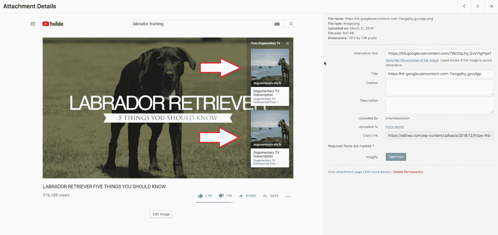

The attachment editing screen in WordPress


[附件可以是任何上传类型](https://kinsta.com/blog/wordpress-media-library/):图片、视频、pdf 文件等等。你可以通过 WordPress 管理菜单中的**媒体**项来访问和编辑它们，或者你可以在编辑它们的时候直接上传到帖子/页面。你上传到帖子的任何附件都可以通过**媒体**菜单进行编辑和查看。

#### 文章类型:修订

现在我们开始讨论稍微晦涩的帖子类型。

每次你保存一个新版本的文章、页面、附件，或者任何自定义的文章类型，WordPress 都会创建一个版本来反映文章(或页面等)的版本。).

您可以通过进入相关的编辑屏幕并打开右侧的**文档**选项卡来查看您站点中任何帖子或页面的修订。这里你会看到一个通知，告诉你这篇文章有多少次修改。下面你可以看到我正在编辑的一篇文章的截图，这篇文章目前有五处修改。

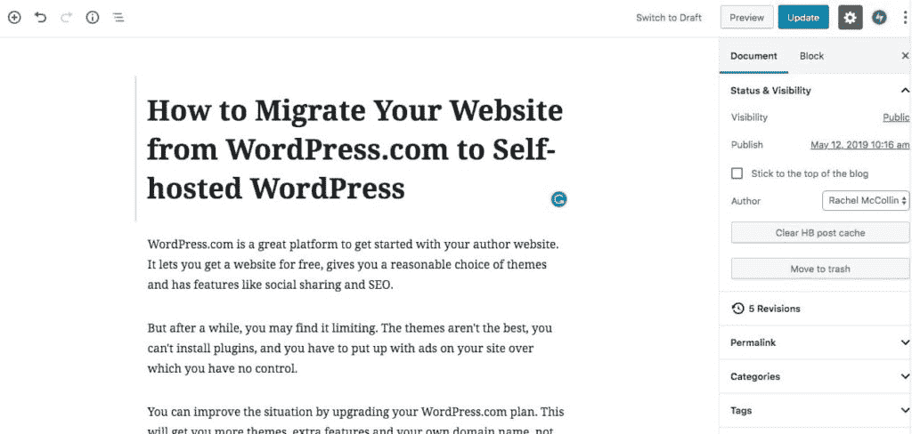

Revisions in the WordPress post editing screen


如果你没有使用[古腾堡编辑器](https://kinsta.com/blog/gutenberg-wordpress-editor/)，你可以通过滚动到编辑屏幕的底部并在这里找到它们的列表来访问修订:

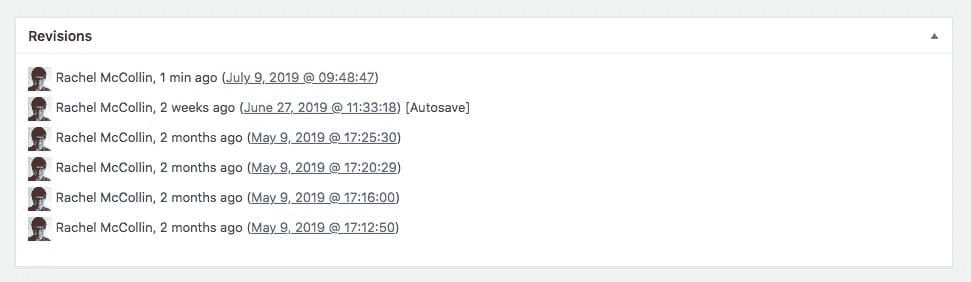

Revisions in the classic WordPress post editing screen


如果你点击**修订**框，你会被带到一个屏幕，显示你文章的最新两个版本。从这里你可以查看修改，并恢复到文章的早期版本。

随着时间的推移，WordPress 将会为你的网站创建大量的修改，这意味着数据库将会充满这些修改(这里是 Kinsta 关于如何处理修改以获得更快性能的指南)！但是修订和任何其他类型的文章一样，也是一种文章类型，它们以同样的方式存储——稍后会有更多的存储。

#### WordPress 文章类型:导航菜单

导航菜单，或者更准确地说，导航菜单中的项目，也是一种 post 类型。

导航菜单中的每个项目都作为一个项目存储在数据库中。由于它的元数据，WordPress 知道这是一个导航菜单项，确切地知道它应该出现在导航菜单的什么位置，以及它链接到什么地方。

您不能像编辑其他文章类型一样编辑导航菜单项。相反，您可以通过定制器或菜单屏幕来编辑它们。

#### WordPress 文章类型:自定义 CSS

如果您通过定制器[添加定制 CSS](https://kinsta.com/blog/wordpress-css/) ，您的工作将使用这个定制的文章类型保存。一个新的帖子(“自定义 CSS”帖子类型)将被保存为与你的站点中的每个主题相关的自定义 CSS，WordPress 将只使用当前活动主题的那个。

#### WordPress 文章类型:变更集

变更集有点像修订版，但是它们不是应用于帖子，而是应用于定制器。当您使用定制器进行更改时，它将被保存为变更集，与草稿的方式类似。

现在我们已经了解了 WordPress 文章类型的全部，让我们继续寻找更多关于 WordPress 自定义文章类型的信息。


## 帖子和自定义帖子类型的区别

让我们快速回顾一下:一篇文章可以是两件事情中的一件。

帖子类型是给定内容项所属的一种帖子类型(广义而言)。“帖子”是一种帖子类型，就像“页面”、“附件”或您注册的任何自定义帖子类型一样(我知道这很混乱，但我一会儿会深入探讨)。

另一方面，您的自定义帖子类型不是博客帖子意义上的“帖子”类型。从存储在数据库中的所有帖子(所有帖子类型)的意义上来说，这是一种帖子类型。

### WordPress 自定义帖子类型:常用

现在我们知道了什么是自定义帖子类型。但是什么时候你可能需要使用它呢？答案是，当你想在你的网站上添加不适合内置文章类型的内容时。

自定义帖子类型的一些常见示例如下:

*   一个电子商务网站的产品。
*   [组合项目](https://kinsta.com/blog/wordpress-portfolio-plugins/)或[组合网站的项目](https://kinsta.com/blog/portfolio-website/)。
*   一个[绘图站点](https://kinsta.com/blog/wordpress-google-maps/)的地图。
*   一个[预订站点](https://kinsta.com/blog/wordpress-booking-plugins/)的事件。

这些是一些最常见的用例，但绝不是唯一的。在决定是否对任何新类型的内容使用自定义帖子类型时，我的建议是问自己这个问题:

> 我是想在主博客页面还是静态页面上显示我的新内容，还是想在单独的存档页面上显示它？

在某些情况下，使用一个类别来分离出你的新内容可能就足够了:也许你正在运行一个博客，并希望[包括案例研究](https://kinsta.com/clients/)，你可以在他们自己的页面上显示(使用你创建的“案例研究”类别)，也可以在主博客上显示。但是如果你想把你的新内容和你的博客文章分开，那么为它创建一个自定义的文章类型是有意义的。

### WordPress 是如何存储文章类型的

自定义帖子类型的帖子以与标准帖子(和页面等)相同的方式存储。)被存储。让我们更详细地看看这个。

你的 WordPress 站点有许多数据库表来存储内容和设置。表格的最小数量是 12 个，但是如果您的站点运行 [Multisite](https://kinsta.com/blog/wordpress-multisite/) 或者您安装了添加更多表格的插件，那么您的站点可能会有更多的表格。

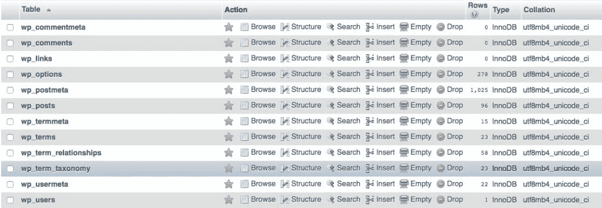

WordPress database tables


在上面的截图中，你可以看到有两个表看起来好像与帖子有关:wp_posts 和 wp_postmeta。

wp_posts 表存储了所有类型的文章的所有内容。因此，不管我们谈论的是一篇博客文章、一个页面、一个修订、一个附件还是一个定制的文章类型，它们都将存储在这个 wp_posts 表中。

WordPress 知道每篇文章的类型，因为它在 wp_posts 表的 post_type 字段中有一个值。该值将对应于文章类型的名称。所以当你添加一篇新的博客文章时，WordPress 会在 wp_posts 表中添加一篇文章，文章类型为“post”。例如，如果您注册了一个名为“product”的自定义文章类型，那么您创建的每个新产品都会在 wp_posts 表中生成一行，其中“product”作为 post_type 字段中的值。

wp_postmeta 表用于存储关于文章的元数据。它有四个字段:

*   meta _ id:WP _ postmeta 表中该项目的 id。
*   post_id:此项元数据对应的帖子。一篇文章在 wp_postmeta 表中可以有多行。
*   meta_key:这种特定类型的元数据的键。例如，对于一个静态页面，一个潜在的键可能是 page_template，它将记录正在使用哪个页面模板。
*   meta_value:字段的值。如果一个页面(再次使用这个例子)使用默认的页面模板，这里的 meta_value 将是‘default’。

因此，根据文章类型的不同，为给定文章存储的元数据种类也会不同。

你不需要担心哪些数据存储在 wp_posts 中，哪些数据存储在 wp_postmeta 中:但是理解所有的文章类型都存储在同一个地方是很有用的，因为这意味着 WordPress 可以以几乎相同的方式处理它们。


## 自定义文章类型存储在 WordPress 的什么地方？

你的 WordPress 站点有许多数据库表来存储内容和设置。例如，如果您注册了一个名为“案例研究”的自定义帖子类型，那么您创建的每个新案例研究都会在 **wp_posts 表**中生成一行，其中“产品”作为 post_type 字段中的值。

WordPress 知道每篇文章的类型，因为它在 wp_posts 表的 post_type 字段中有一个值。

Support

### 自定义帖子类型如何与自定义分类和自定义字段交互

在我们继续讨论如何在 WordPress 中注册一个自定义的文章类型之前，让我们先来确定一个自定义的文章类型将如何与其他自定义内容类型交互，即[自定义分类](https://kinsta.com/knowledgebase/what-is-taxonomy/)和自定义字段。

#### 自定义分类法

WordPress 中的分类法用于对任何帖子类型的帖子进行分类。对于标准文章，使用的两种分类法是类别和标签。

当您注册您的自定义文章类型时，您可以选择将任何现有的分类法分配给它。当您注册分类法时，您可以将“category”分类法添加到其中。我将在演示创建定制文章类型的技术时向您展示如何做到这一点。

或者，您可以为您的定制文章类型创建全新的分类法，这也是一种常见的方法。

因此，举例来说，如果你正在为一个电子商务网站创建一个[“产品”帖子类型，你可能会创建一个“部门”分类来将你的产品分类到你的商店中的各个部门。](https://kinsta.com/blog/conversions-woocommerce-product-pages/)

如果您正在创建一个[“事件”帖子类型](https://kinsta.com/blog/wordpress-events-plugin/)，您可能会创建一个“事件类型”的分类，它可以指定这是一场音乐会，一场诗歌朗诵，还是一场喜剧之夜。

您创建的分类法由您自己决定，并取决于您希望从自定义帖子类型中对帖子进行排序和显示的方式。

#### 自定义字段

WordPress 中的另一个自定义内容类型是自定义字段，也称为帖子元数据。自定义字段是附加的元数据，只要文章类型支持，您就可以添加到任何文章中。当您注册自定义帖子类型时，您可以通过以下行包括自定义字段支持:

```
supports => array( ‘custom-fields’ );
```

这是作为一个数组传递的，因此您可以[添加对多个选项](https://codex.wordpress.org/Function_Reference/register_post_type#Arguments)的支持。

因此，如果您想将元数据添加到您的自定义帖子类型中，比如带有“产品”帖子类型的服装店中的尺寸或颜色，您可以使用一个自定义字段来完成这项工作。

自定义字段不同于自定义分类法，因为您不会使用它们来输出归档页面。

这里有一个服装店的例子。您将有一个“部门”分类的每个例子的存档页面，例如“女性的”，“男性的”等。假设您还有一个名为“大小”的自定义字段。您不会为每个尺寸创建一个存档页面，因为这不是您的客户所期望看到的。

遵循这条规则可以帮助您确定是否需要使用自定义分类或自定义字段来为您的帖子添加更多数据:您是否需要在归档页面中显示它？

稍后我将向您展示如何为您的定制文章类型和定制分类法输出归档页面。


## 如何用插件添加自定义文章类型

所以你知道什么是自定义帖子类型，你知道你的网站需要一个:你如何添加它？

有两种方法:使用插件，手工编码。先说外挂路线。

有两种类型的插件可以用来注册一个自定义的文章类型:第一种将注册一个自定义的文章类型，以便添加插件附带的功能，第二种将为您提供一个界面，您可以使用它来创建自己的文章类型。

第一个例子包括各种插件，包括电子商务插件、活动插件等等。先说最流行的 WordPress 插件之一， [WooCommerce](https://kinsta.com/learn/woocommerce-guide/) 。

### 如何使用 WooCommerce 注册自定义帖子类型

WooCommerce 是一个注册自定义帖子类型以便工作的插件的例子。在这种情况下，它是“产品”文章类型。

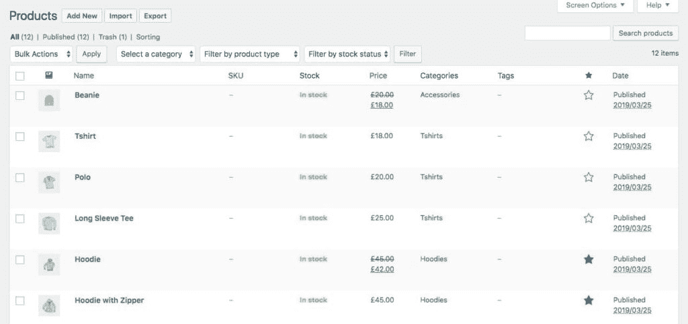

Products listed in WooCommerce


WooCommerce 还为你注册了一些自定义分类和自定义字段来组织你的商店，包括产品类别和产品标签。这些不同于你在博客文章中使用的类别和标签。

### 如何使用事件日历插件注册自定义帖子类型

[事件日历](https://kinsta.com/blog/wordpress-events/#1-the-events-calendar)插件是另一个使用自定义文章类型的插件。在这种情况下，它是“事件”帖子类型。

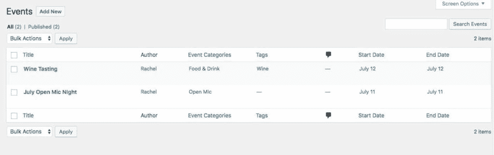

Events created by the Events Calendar plugin


该插件添加了一个事件特有的分类:“事件类别”。它还将普通标签应用于事件，因此您可以使用与博客文章相同的标签。

## 注册订阅时事通讯


### 想知道我们是怎么让流量增长超过 1000%的吗？

加入 20，000 多名获得我们每周时事通讯和内部消息的人的行列吧！

[Subscribe Now](#newsletter)

### 如何使用 WP 谷歌地图注册自定义帖子类型

就像 WooCommerce 和 Events Calendar 一样， [WP 谷歌地图](https://wordpress.org/plugins/wp-google-maps/)是一个 [WordPress 地图插件](https://kinsta.com/blog/wordpress-map-plugin/)，它为你的地图注册了一个定制的帖子类型。

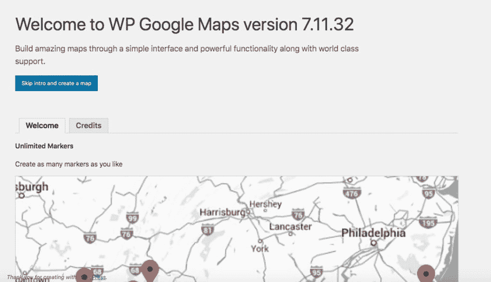

A map created by the WP Google Maps plugin


“地图”帖子类型与之前插件中的产品或事件帖子类型不同，因为您不会显示所有地图的存档页面:相反，插件会为您创建的每个地图提供一个短代码，您可以将它嵌入到站点的帖子或页面中。但是，尽管您不能像查看其他帖子类型那样查看地图，但它仍然是一种帖子类型。

### 如何使用自定义帖子类型 UI 插件

如果你想注册自己的自定义帖子类型，而不是像 WooCommerce 这样的插件提供的更广泛的功能的一部分，你可以使用一个插件，它为你提供了一个界面，使注册自定义帖子类型变得容易。

一个这样的插件是[自定义文章类型 UI](https://www.wordpress.org/plugins/custom-post-type-ui/) 插件。

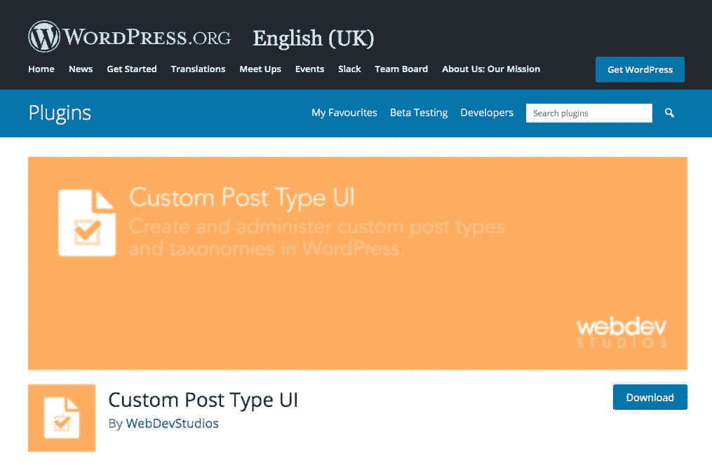

The Custom Post Type UI plugin


这个插件允许你使用管理界面注册你自己的自定义文章类型，而不需要写任何代码。

它提供了一组屏幕，让您添加注册文章类型的所有元素，您将在使用`register_post_type()`函数时添加这些元素。要使用插件添加新的文章类型，请前往 **CPT IU >添加/编辑文章类型**。

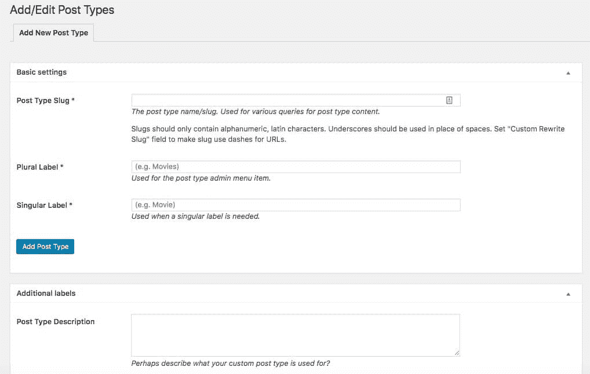

Adding a post type with The Custom Post Type UI plugin


在这里，你可以添加一个新的文章类型或者编辑任何你已经注册的文章类型。

您可以编辑文章类型的设置，也可以保留默认设置。你可以在 WordPress Codex 中找到关于文章类型的所有[设置和选项的完整文档。](https://codex.wordpress.org/Function_Reference/register_post_type#Parameters)

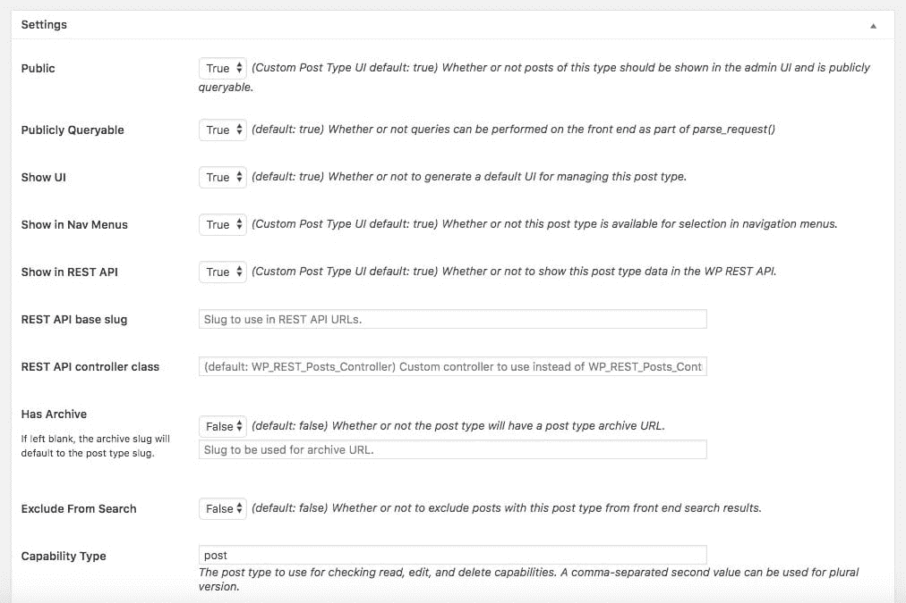

Settings for the Custom Post Type UI plugin


您还可以使用插件注册一个自定义分类，并将其分配到您的新帖子类型或任何现有的帖子类型。当你使用插件注册一个文章类型时，你可以为它分配任何现有的分类法。

### 如何使用 Pods 插件注册自定义帖子类型

[Pods](https://www.wordpress.org/plugins/pods/) 插件是另一个插件，它给你一个界面，让你不用写代码就可以注册一个自定义的帖子类型。

Pods 也允许你扩展你现有的文章类型。因此，您可以向现有的文章类型或分类添加额外的字段，并编辑它们的设置。

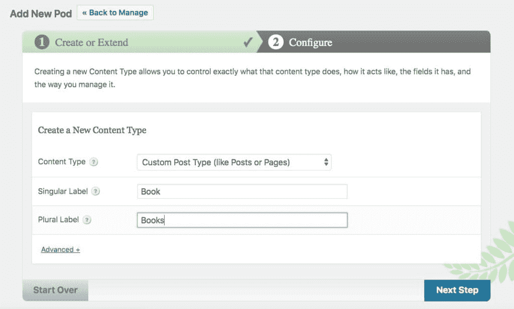

Creating post types with the Pods plugin


Pods 插件使用一个帖子类型(“pod”)来存储您的所有定制，并允许您注册自己的帖子类型，有点像自定义帖子类型 UI 插件，但有一个旨在引导您完成整个过程的界面。这意味着插件可以使这个过程变得更容易，但是与你自己编写文章类型相比，它会给你的站点增加更多的代码(和数据)。

或者，如果你不想安装插件来管理注册文章类型的过程，你可以自己编码。

## 如何在 WordPress 中注册你自己的自定义文章类型

如果你喜欢写代码，你可以利用 [`register_post_type()`](https://codex.wordpress.org/Function_Reference/register_post_type) 函数来注册你的自定义文章类型。这是做这件事最有效的方法。

最佳实践告诉我们将自定义文章类型的代码放在插件中，而不是主题中。这是因为如果你将来改变了你的主题，你不会想要丢失你的文章类型和你用那个文章类型创建的所有文章。这也意味着，如果你以后更新主题，你不会失去你的帖子类型。

让我们完成在 WordPress 中注册你自己的自定义文章类型的步骤。

### 创建您的插件

第一步是创建你的插件。在你的[开发或登台站点](https://kinsta.com/help/staging-environment/)(还不是你的实时站点)的 wp-content/plugins 文件夹中，为你的插件添加一个文件夹。在该文件夹中，添加一个 PHP 文件。我把我的名字叫做 kinsta-register-posttype.php。

提示:我总是喜欢在一个文件夹中创建一个插件，而不是仅仅在 wp-content/plugins 文件夹中添加一个插件文件。这样，如果我需要添加更多的文件到我的插件中，比如包含文件，脚本或者样式，我已经准备好了一个文件夹来保存它们。

现在，在新的 php 文件中，为插件添加开始注释掉的文本:

```
<?php
/*
Plugin Name: Register Custom Post Types
Plugin URI: http://rachelmccollin.com
Description: Plugin to register the book post type
Version: 1.0
Author: Rachel McCollin
Author URI:[http://rachelmccollin.com](http://rachelmccollin.com/)
Textdomain: kinsta
License: GPLv2
*/
```

这告诉 WordPress(和用户)一些关于插件的关键信息:

*   它叫什么
*   您可以在那里找到更多信息
*   它的作用
*   版本号
*   谁开发了它，在哪里可以找到关于他们的更多信息
*   国际化的文本域
*   许可证，[应该总是 GPL](https://kinsta.com/blog/is-wordpress-free/) 。

现在你的插件已经设置好了，如果你愿意，你可以在管理界面激活它。如果你做了，它也不会做任何事。

厌倦了低于 1 级的 WordPress 托管支持而没有答案？试试我们世界一流的支持团队！[查看我们的计划](https://kinsta.com/plans/?in-article-cta)

### 为您的文章类型设置功能

现在让我们开始创建注册你的文章类型的函数。在我的例子中，我将创建一个名为“book”的帖子类型，因为这是一个虚构的书评网站。你使用的内容显然会有所不同，这取决于你使用自定义文章类型的目的。

在注释掉的文本下方，添加以下内容:

```
function kinsta_register_post_type() {

}
add_action( 'init', 'kinsta_register_post_type' );
```

这个函数将包含你的自定义文章类型的所有代码。您可能希望更改它的名称，添加您自己的前缀，而不是 kinsta_。在你所有的函数上使用一个前缀是一个好习惯，这样你就不会与你的主题或者你正在运行的其他插件所提供的任何函数的名字相冲突。

其余的代码将被添加到该函数的括号内。

### 为您的自定义帖子类型定义标签

现在是时候为你的自定义文章类型定义标签了，在那些花括号里，加上这个:

```
$labels = array(
 'name' => __( ‘Books’, ‘kinsta’ ),
 'singular_name' => __( 'Book', ‘kinsta’ ),
 'add_new' => __( 'New Book', ‘kinsta’ ),
 'add_new_item' => __( 'Add New Book', ‘kinsta’ ),
 'edit_item' => __( 'Edit Book', ‘kinsta’ ),
 'new_item' => __( 'New Book', ‘kinsta’ ),
 'view_item' => __( 'View Books', ‘kinsta’ ),
 'search_items' => __( 'Search Books', ‘kinsta’ ),
 'not_found' =>  __( 'No Books Found', ‘kinsta’ ),
 'not_found_in_trash' => __( 'No Books found in Trash', ‘kinsta’ ),
);
```

如果您的自定义帖子类型不是“图书”，您需要更改您的帖子类型。你可以使用更多的标签，但是我发现上面的这些已经足够满足我的需求了。

请注意，我在我的标签中使用了[国际化](https://codex.wordpress.org/I18n_for_WordPress_Developers)，因此它们将被翻译成用户的本地语言。

### 定义自定义帖子类型的参数

下一步是定义参数，其中之一将是我们已经添加的标签数组。

在标签下面，仍然在括号内，添加以下内容:

```
$args = array(
 'labels' => $labels,
 'has_archive' => true,
 'public' => true,
 'hierarchical' => false,
 'supports' => array(
  'title',
  'editor',
  'excerpt',
  'custom-fields',
  'thumbnail',
  'page-attributes'
 ),
 'taxonomies' => 'category',
 'rewrite'   => array( 'slug' => 'book' ),
 ‘show_in_rest’ => true
);
```

让我们来看看所有这些都是干什么的。

*   labels 参数是我们已经定义的标签数组。
*   `'has_archive' => true`为自定义帖子类型启用帖子类型存档。这默认为 false，所以我想覆盖它，给自己一个使用 post 类型存档的选项(稍后我将向您展示如何使用)。
*   `'public' => true`允许文章类型包含在搜索结果和自定义查询中。同样，默认值是 false，这是我想要覆盖的。
*   “等级”值将取决于您希望如何使用您的自定义帖子类型。如果您将此设置为 true，那么文章类型将像页面一样，具有可能的层次结构以及您的文章类型的任何文章的父和子文章。如果你设置为 false，它的行为就像文章一样，没有层次结构。
*   “supports”数组定义了许多文章类型的功能，您可以让此文章类型支持这些功能。我喜欢确保像特色图片和自定义字段这样的功能是打开的。
*   “分类法”参数定义了适用于此文章类型的现有分类法。这里我使用的是“类别”分类法。如果您想使用一个定制的分类法，并且还没有注册它，只需跳过这一行，然后将分类法注册到 post 类型。如果您已经[注册了一个自定义分类](https://kinsta.com/knowledgebase/what-is-taxonomy/)，那么您可以使用这一行将它添加到文章中。
*   我使用“rewrite”参数是因为我将为分类法取一个不同于我想为其 slug 使用的名称。我稍后会更详细地解释这一点。
*   `‘show_in_rest’ => true`确保 post 类型对 REST API 和 Gutenberg 接口可用。它默认为 false，这对我来说毫无意义——我希望我的所有帖子类型都使用相同的编辑界面！

这些就是所有的论点。但是我们实际上还没有注册帖子类型。是时候弥补了。

### 添加 register_post_type()函数

最后一步是将所有这些整合到`register_post_type()`函数中。

在您的参数下面，仍然在括号内，添加以下内容:

```
register_post_type( ‘kinsta_book', $args );
```

这用我们已经定义的参数注册了‘kin sta _ book’post 类型。

现在你可能会更容易理解为什么我之前使用了“重写”的说法。我喜欢给我的帖子类型的名字加上前缀，这样我可以确保它们不会与任何第三方插件添加的任何帖子类型冲突，但我不希望前缀被公开。

默认情况下，当 WordPress 显示文章类型的例子时，它会在 URL 中使用文章类型的名称。所以我的名为《我的好书》的书会有一个 mysite.com/kinsta_book/my-wonderful-book.的 url，我不希望这样，所以我使用“重写”参数将 URL 改为 mysite.com/book/my-wonderful-book.看起来更好，嗯？

现在保存你的文件并在 WordPress 管理器中激活你的插件。你会发现一个新的文章类型出现在管理菜单中。

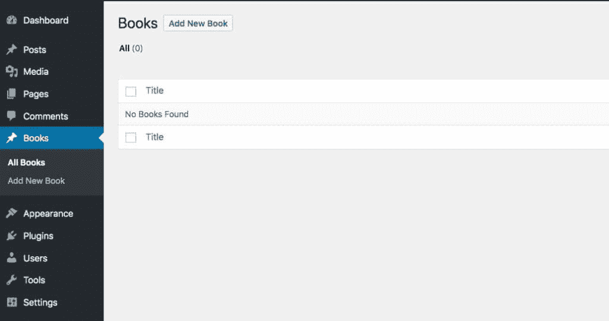

The “books” post type in the admin screens


帖子类型现在已经注册，可以在您的站点上使用了。花些时间给它添加一些文章(记住，你的自定义文章类型的文章，而不是博客文章——WordPress 有时会让人困惑！)然后我们将看看如何在站点的前端显示来自自定义帖子类型的帖子。

## 如何在你的站点中显示 WordPress 自定义文章类型

您添加到站点的大多数自定义帖子类型将像帖子一样工作，这意味着它们被设计为显示在归档页面中。也许你正在使用一个定制的分类法来显示它们，或者也许你已经像我一样添加了“类别”分类法。

或者，如果你使用了像 WooCommerce 这样的插件来添加自定义帖子类型，以便为你的网站添加特定的功能，那么这个插件可能会添加一些特定的页面(如“商店 2”页面)来输出你的自定义帖子类型。

显示自定义帖子类型的四个选项是:

*   显示单个帖子(在我的例子中是书)
*   显示完整的文章类型档案，列出所有的书籍。
*   显示自定义分类归档，使用您为自定义文章类型注册的分类。
*   将来自自定义帖子类型(例如书籍)的帖子集成到现有分类(例如“类别”)的归档中，或者集成到主博客页面中。

让我们依次来看一下其中的每一项。

*警告！如果在这个过程中的任何一点，你不能访问你的自定义文章类型的档案或个人文章，那是因为 WordPress 还没有为它们写永久链接。要解决这个问题，进入**设置>永久链接**，点击**保存更改**按钮。这将告诉 WordPress 检查任何新的文章类型，并为它们创建 URL。*

### 显示文章类型存档

您的第一个选择是在您的自定义帖子类型存档中创建一个所有帖子的存档页面。

如果你在注册文章类型时定义了“has_archive”为真，WordPress 将自动为你的文章类型生成一个存档页面。您可以使用定制器将它添加到导航菜单中。

#### 将帖子类型存档添加到菜单中

打开定制器并选择**菜单**选项。选择您的主菜单并点击**添加项目**按钮向您的菜单添加额外的项目。

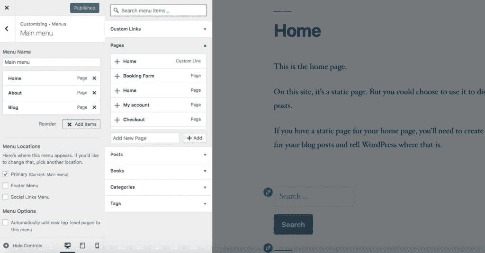

Adding a menu item in the WordPress customizer


从出现的选项中选择文章类型，然后单击文章名称右侧的向下箭头。这将显示一个列表，包括你添加的每篇文章，还有一个选项，在我的例子中叫做 **All Books** 。点击它，它将被添加到您的菜单。

如果您点击菜单中的项目，您可以编辑标签。我不喜欢称我的书为“所有的书”，而只是“书”。

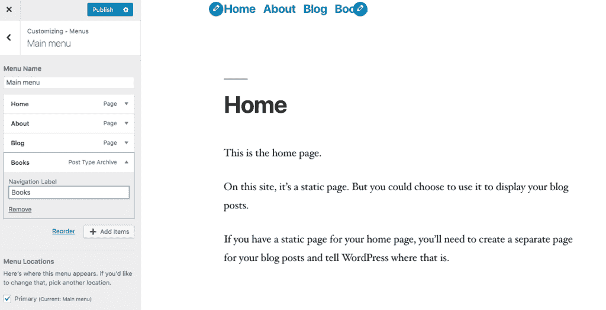

Editing the Books menu item


请注意，您只能通过定制器来完成此操作——在菜单屏幕中是不可能的。因此，请确保使用定制器将您的自定义帖子类型归档添加到您的菜单中。

### 自定义文章类型存档

WordPress 将使用[模板层次结构](https://wphierarchy.com/)来识别你的主题中使用哪个模板文件来显示定制的文章类型档案。

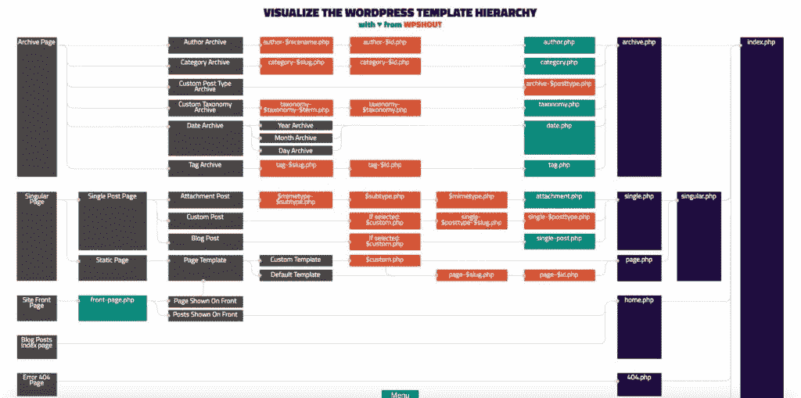

The WordPress template hierarchy


如果你的主题有一个 archive.php 文件，它将使用它，如果没有，它将使用 index.php。

如果您想要编辑自定义帖子类型存档的输出方式，则可以为自定义帖子类型存档创建一个模板文件。

对于特定的定制文章类型，您需要创建一个名为 archive-$posttype.php 的模板文件，其中$posttype 是您的文章类型的名称。所以对于我的 books post 类型，我会创建一个名为 archive-kinsta_book.php 的文件。

创建这个文件最简单的方法是在你的主题中复制 archive.php 文件。重命名并编辑它，使它以你想要的方式显示你的文章类型存档。

### 显示单个帖子

使用自定义帖子类型创建的单个帖子也将使用模板层次结构中找到的第一个相关模板文件显示。

对于单个帖子，您可以比归档更进一步:不仅可以为帖子类型创建一个模板文件(single-$posttype.php)，还可以使用该帖子的 slug 为该帖子类型的特定帖子创建一个文件(single-$ posttype-slug . PHP)。

因此，如果我将 *Great Expectations* 添加到我的书评网站，我可以为所有书评创建一个名为 single-kinsta_book.php 的文件，或者我可以为那本书创建一个名为 single-kin sta _ book-Great-Expectations . PHP 的目标文件。如果我没有创建这两个文件，WordPress 将默认使用 single.php 或(如果不存在的话)singular.php 或 index.php。

### 将自定义文章类型添加到主博客页面

默认情况下，你的主博客页面将只包含“文章”类型的文章。但是，如果您还想在页面上包含自定义的文章类型，与博客文章混在一起，该怎么办呢？

你可以通过使用 WordPress 中的 [pre_get_posts](https://codex.wordpress.org/Plugin_API/Action_Reference/pre_get_posts) 钩子来实现。

在你注册文章类型的插件中，添加以下内容:

```
<?php
function kinsta_books_on_blog_page() {

 if ( $query->is_home() && $query->is_main_query() ) {
  $query->set( ‘post_type', array( ‘post’, ‘kinsta_book’ );
 }

}
add_action( 'pre_get_posts', 'kinsta_books_on_blog_page' ); ?>
```

这将检查我们是否在“主页”(即博客页面，即使它不是站点的首页)上，以及主查询是否正在运行(例如，因为您不希望在小部件中这样做)。如果是，它会将文章和书籍都添加到查询中。

请注意，您必须在数组中包含“post”post 类型以及新的 post 类型。

[Custom post types provide you with infinite ideas to extend your WordPress site. Learn how to use them in our in-depth guide! 🔁 💡Click to Tweet](https://twitter.com/intent/tweet?url=https%3A%2F%2Fkinsta.com%2Fblog%2Fwordpress-custom-post-types%2F&via=kinsta&text=Custom+post+types+provide+you+with+infinite+ideas+to+extend+your+WordPress+site.+Learn+how+to+use+them+in+our+in-depth+guide%21+%F0%9F%94%81+%F0%9F%92%A1&hashtags=wordpress%2Cdevelopment)

## 摘要

WordPress 自定义文章类型的特点是将它从一个简单的[博客平台](https://kinsta.com/blog/best-blogging-platform/)提升为一个真正的内容管理系统。它们让你创建复杂的定制网站，可以作为商店、参考中心、媒体网站或任何你需要的东西。

你可以用三种方式之一来添加自定义文章类型到你的 WordPress 站点。你可以使用一个插件，比如 WooCommerce，注册一个与插件功能相关的自定义帖子类型。你可以使用像 CPT UI 或 Pods 这样的插件来添加你自己定制的文章类型。或者你可以编写自己的插件，使用`register_post_type()`函数用代码注册文章类型。无论你使用哪种方法，你都可以从你的 WordPress 站点获得更多。

* * *

让你所有的[应用程序](https://kinsta.com/application-hosting/)、[数据库](https://kinsta.com/database-hosting/)和 [WordPress 网站](https://kinsta.com/wordpress-hosting/)在线并在一个屋檐下。我们功能丰富的高性能云平台包括:

*   在 MyKinsta 仪表盘中轻松设置和管理
*   24/7 专家支持
*   最好的谷歌云平台硬件和网络，由 Kubernetes 提供最大的可扩展性
*   面向速度和安全性的企业级 Cloudflare 集成
*   全球受众覆盖全球多达 35 个数据中心和 275 多个 pop

在第一个月使用托管的[应用程序或托管](https://kinsta.com/application-hosting/)的[数据库，您可以享受 20 美元的优惠，亲自测试一下。探索我们的](https://kinsta.com/database-hosting/)[计划](https://kinsta.com/plans/)或[与销售人员交谈](https://kinsta.com/contact-us/)以找到最适合您的方式。