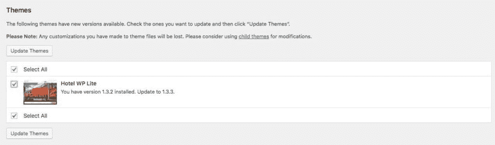
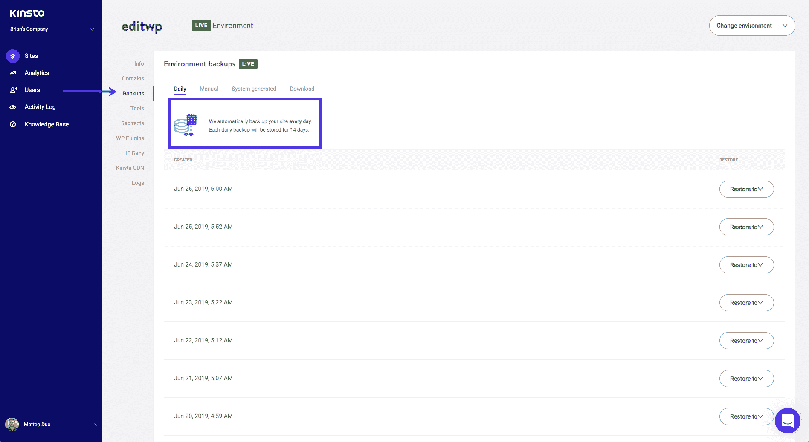
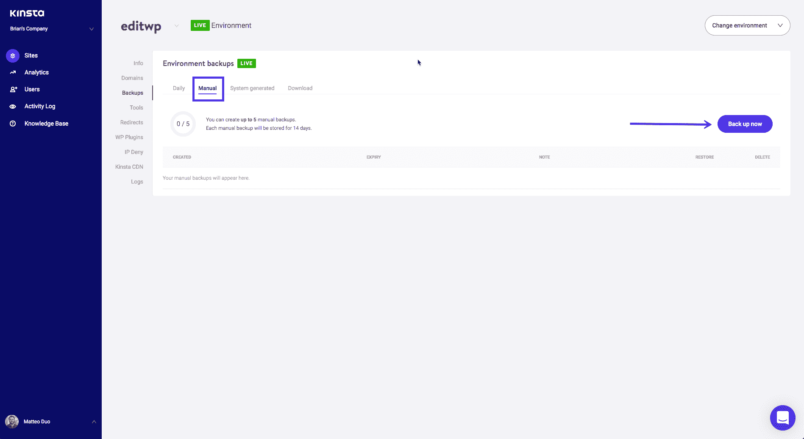
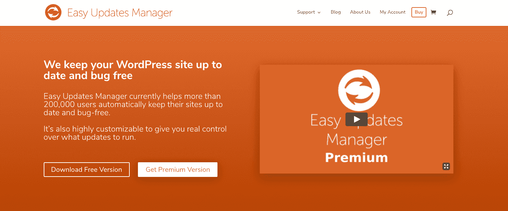
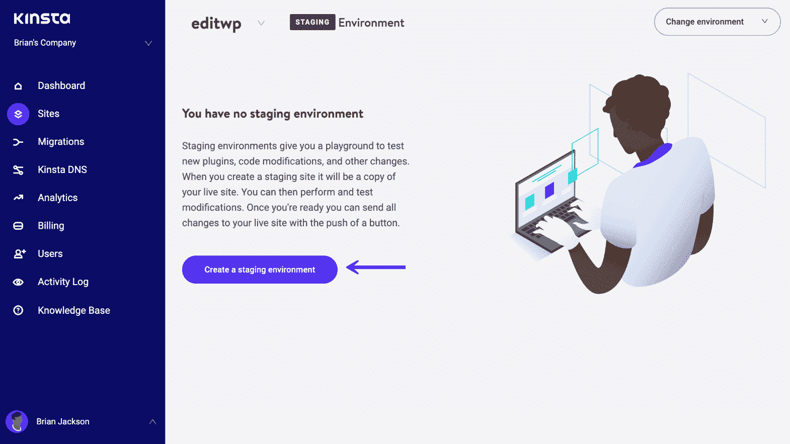
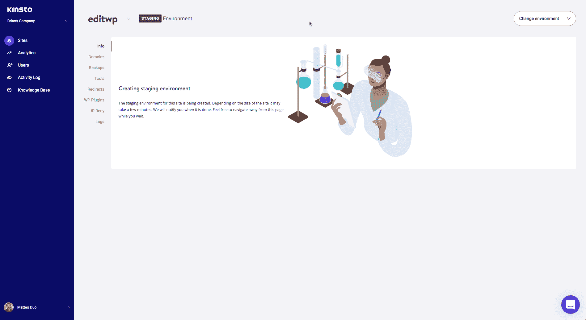
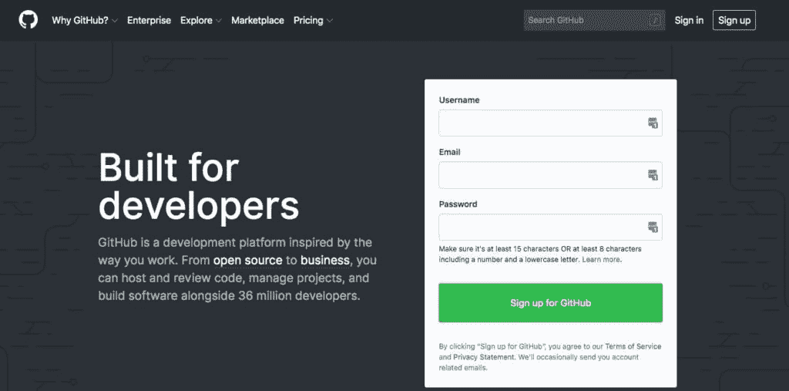

# 如何更新 WordPress 主题:你安全而深入的指南

> 原文：<https://kinsta.com/blog/how-to-update-wordpress-theme/>

你的主题是你的 WordPress 网站最重要的方面之一。它控制着你的网站的外观，你的内容是如何显示的，让你的网站看起来更现代，更专业，更有品牌效应。

这就是为什么保持你的主题更新是很重要的，并确保它总是像它应该的那样工作。

但有时这并不完全简单。如果你已经定制了一个 WordPress 主题，更新它意味着你可能会丢失你的工作。如果你站点中的插件与新版本的主题不兼容，你需要决定哪些代码需要更新，哪些不需要。[如果你在经营一家主题为你定制的网上商店](https://kinsta.com/blog/woocommerce-tutorial/)，你需要确保这个主题在更新后仍然有效。

### 看看这个更新 WordPress 主题的视频指南

在这篇文章中，我将带你经历**如何更新 WordPress 主题**的过程。我将介绍:

 准备好了吗？我们开始吧！

## 为什么你应该保持 WordPress 主题更新

保持你的 WordPress 站点中的[代码最新是非常重要的](https://kinsta.com/knowledgebase/wordpress-core/)。插件、主题和 WordPress 本身的新版本发布是有原因的。不利用更新可能会给你的网站带来风险。让我们来看看你应该经常更新你的站点的三个原因:安全性、兼容性和特性。

> 需要在这里大声喊出来。Kinsta 太神奇了，我用它做我的个人网站。支持是迅速和杰出的，他们的服务器是 WordPress 最快的。
> 
> <footer class="wp-block-kinsta-client-quote__footer">
> 
> 
> 
> <cite class="wp-block-kinsta-client-quote__cite">Phillip Stemann</cite></footer>

[View plans](https://kinsta.com/plans/)

### 头号安全性

确保站点中的代码总是更新的最重要的原因是[安全性](https://kinsta.com/blog/wordpress-security/)。

主题、插件和 WordPress 核心更新的很大一部分是安全补丁:旨在克服任何安全漏洞的小版本。

因为 WordPress 是一个开源系统，有一个活跃的社区来监控软件的安全问题和其他问题，任何弱点都会被公开讨论，并尽快修复。

这是 WordPress 的好处之一:活跃的社区确保了漏洞可以被很快地识别和修复。

但是也有不利的一面:这一切的公开性意味着[任何想要攻击你的网站](https://kinsta.com/blog/ddos-attack/)的人都会知道某个主题的某个版本有问题。他们可以锁定使用该版本主题的网站。

所以你需要在更新发布后尽快更新主题、插件和 WordPress 核心，以避免成为攻击目标。

如果你安装了一个[好的安全插件](https://kinsta.com/blog/wordpress-security-plugins/)，当有新版本的主题时，你会得到提醒，所以你没有借口不运行更新。下面，我将看看如何安全地做到这一点，以便您的网站在更新期间和更新后仍能平稳运行。

但是，到现在为止，你应该相信:保持你的站点更新将会增强它的安全性。

### #2 兼容性

主题也被更新，以确保与 WordPress 的最新版本兼容。这可能会在新的 WordPress 发布后马上发生，也可能会在一段时间后发生。一个好的主题开发者会根据 WordPress 的新版本(以及正在创建的开发版本)测试他们的主题，并为兼容性做任何必要的修改。

但是，随着时间的推移，WordPress 的新版本将会发布，你的主题可能会出现兼容性问题。以我的经验来看，主题变得不兼容比插件不兼容要少得多，但这仍然是你需要注意的事情。

当更新你的主题时，你应该确保你首先运行的是 WordPress 的[最新版本。](https://kinsta.com/blog/wordpress-5-3/)

### #3 特点

让你的主题保持最新的第三个原因是充分利用开发者可能添加的新特性。

有时，主题会更新新的功能，要么是因为用户要求额外的功能，要么是因为主题可以利用 WordPress 本身的新功能(我说的是你 [Gutenberg](https://kinsta.com/blog/gutenberg-wordpress-editor/) )并为主题添加额外的功能。

如果你的主题有新的特性可以增强你的网站，为什么不利用它们呢？

## 如何在 WordPress 中更新主题(两种方式):

更新你的主题是网站日常维护的一项重要任务。在运行任何更新之前，请务必对您的网站进行备份。

以下是如何在 WordPress 中更新你的主题:

1.  如果您的主题没有自定义，请转到:外观>主题>在您的活动主题上单击“立即更新”。
2.  如果您的主题包含自定义代码，用最新版本更新它将覆盖您的所有自定义。若要安全地更新自定义主题，请使用子主题。

Support
## 如何安全地更新 WordPress 主题

在 WordPress 中更新你的主题对你来说非常简单。只需进入**仪表板>更新**并选择你的主题，然后点击**更新主题**按钮。

Updating a theme

但是等等！你可能认为你所需要做的就是点击**更新**按钮就完成了，对吗？当然，这将更新你的主题。**但是这样做不安全**。

每次[你更新 WordPress 网站的任何元素](https://kinsta.com/knowledgebase/manually-update-wordpress-plugin/)(主题、插件或 WordPress 核心)，你都应该[对你的网站](https://kinsta.com/blog/wordpress-backup-plugins/)做一个备份，并测试更新的软件，检查是否一切正常。要做到这一点而不触及你的实时 WordPress 站点，你应该首先在你站点的 [WordPress staging](https://kinsta.com/wordpress-staging/) 版本上运行更新。

让我们更详细地看看您是如何做到这一点的。

### 首先备份

停下来。在你更新你的网站之前，你必须做好备份。这样，如果更新破坏了您的站点，您就有东西可以恢复您的站点。

如果你遵循下面的建议，并且总是首先在一个临时服务器上测试，那么你不太可能会遇到任何问题:毕竟，你已经测试过了。但是安全总比后悔好。

Kinsta daily automated backups

有了 Kinsta hosting，你可以访问网站的[每日自动备份](https://kinsta.com/help/wordpress-backups/)。但是您也可以在更新前立即进行手动备份。这是我推荐的，因为自上次自动备份以来，您的站点可能已经发生了变化。

要进行手动备份，请在您的 Kinsta 仪表板中访问您的站点，在菜单中选择**备份**选项，然后选择**手动**选项卡。从这里，您最多可以进行五次手动备份，每次备份将保留 14 天。

Kinsta manual backups

如果在更新过程中出现任何问题，并且您需要恢复您的站点，您可以通过一次单击来恢复您的备份。

访问 Kinsta 仪表盘中的**备份**屏幕，选择备份并点击**恢复到**按钮。您可以选择恢复到临时站点或实时站点。请确保快速完成此操作，因为您不想在运行备份后丢失对站点所做的任何更改(例如其他用户添加的内容)。

如果你不是 Kinsta 的用户，并且你的主机提供商没有提供简单的网站备份，那么你需要使用一个备份插件。免费的 [Updraft Plus](https://en-gb.wordpress.org/plugins/updraftplus/) 插件让你可以运行自动和手动备份，并使恢复相对简单。但是如果你用的是 Kinsta，你就不需要备份插件，因为所有的 Kinsta 计划都包括自动备份。

### 何时运行更新

首先，确定运行更新的最佳时间是值得的。您希望[最大限度地减少对网站访问者的任何停机或中断](https://kinsta.com/blog/website-downtime/)，这意味着在一天中(或一周中的某一天)访问者数量最少的时候运行更新是有意义的。

不要假设这是一天中你最不可能使用你的网站的时间:如果你有大量的海外访问者，那么当你睡觉的时候，这个数字可能会激增。

使用类似于 [Google analytics](https://analytics.google.com/analytics/web/) 的工具来确定你的网站何时访问量最少，并相应地安排更新。

一旦有了这些信息，您就可以安排在一天中的那个时间或一周中的哪一天进行站点更新。此时，您不需要在试运行站点上进行测试:您可以在方便的时候进行测试。但是对实时站点的更新会导致一些停机时间，所以把它安排在中断最少的时候。

高级版的[简易更新管理器](https://easyupdatesmanager.com/buy/?utm=eum-advanced-tab)插件可以让你自动更新或手动安排更新。

Easy Updates Manager plugin

### 使用临时站点进行更新

在对你的主题进行更新之前，你应该总是测试更新是否正常工作，是否与你的站点中的任何其他代码冲突，以及更新后站点是否仍然工作。

要做到这一点，你需要一个公众看不见的网站副本，并且你可以安全地破坏它而不会有任何不必要的后果。

## 注册订阅时事通讯

### 想知道我们是怎么让流量增长超过 1000%的吗？

加入 20，000 多名获得我们每周时事通讯和内部消息的人的行列吧！

[Subscribe Now](#newsletter)

测试的最佳地点是在中转现场。这是因为一个临时站点和你的实时站点在同一个服务器上，并且是它的副本。这意味着在你的临时站点上工作的任何东西也将在你的实时站点上工作。

Kinsta staging environment

Kinsta 为您的每个站点提供了一个登台环境，如果您需要更多，您可以添加多达五个额外的[高级登台环境](https://kinsta.com/help/premium-staging-environments/)。在测试主题更新之前，您需要刷新您的临时站点。您可以通过删除现有的并创建一个新的来实现这一点。或者，您可以使用刚刚对活动站点进行备份，并将其恢复到临时站点。

Staging site created in MyKinsta

一旦你在 staging 中有了一个[你的 live 站点的副本，你将需要使用 URL**https://staging-sitename . kinsta . cloud**，其中 **sitename** 是你的站点的名称。这将把您带到试运行站点，您可以在那里登录、更新和测试。](https://kinsta.com/blog/wordpress-staging-site/)

一旦你在暂存站点上测试了更新(稍后会有更多)，你就可以返回到 MyKinsta dashboard 中的暂存环境，然后点击 **Push Staging to Live** 按钮。这将把您对临时站点所做的所有更改复制到活动站点。别忘了对你的实时网站进行最后的检查，以 100%确定一切正常。

### 测试更新

所以你已经创建了你的升级站点，你已经准备好安装主题更新了，你想要测试它。接下来呢？

遵循这些步骤。

1.  检查主题是否与你的 WordPress 版本兼容。如果没有，你可能需要更新 WordPress(它总是优先)。请遵循该更新的测试流程，使用您的临时站点来测试更新，然后将其投入使用。
2.  在 WordPress admin 的主题屏幕上更新主题，或者点击主题名称下面的**更新**链接，或者上传新版本(如果你是从第三方提供商那里购买的)。
3.  测试网站的临时版本是否正常工作。测试不同的内容类型(主页、单个帖子和页面、存档页面、任何自定义帖子类型或分类)。检查[小工具](https://kinsta.com/blog/wordpress-widgets/)或[菜单](https://kinsta.com/blog/wordpress-menu-plugins/)是否有任何问题。测试流程，如表单提交或采购。你到底需要测试什么将取决于你的站点，但重要的是要彻底；如果你快速浏览你的网站，不测试所有的内容类型和流程，你会发现你的用户在你之前发现任何问题，可能是在他们购物或填写表格的时候。
4.  如果主题更新破坏了网站，[检查主题的支持论坛](https://kinsta.com/blog/wordpress-support/)以查看是否有任何已知问题。你可以在你的管理中打开主题界面，点击主题来访问相关信息。点击这个版本的详细信息的链接，然后在右边栏，你会发现一个**查看支持论坛**按钮。检查一下，看看是否还有其他人遇到了问题。
5.  如果你有一个问题，而其他人没有报告过，那就向主题开发者报告。这将有助于他们解决问题。然后，当他们发布主题的后续版本时，你需要重复这个过程，希望有一个修正。
6.  如果一切都正常工作，您就可以将临时站点投入使用，因为您已经对它进行了彻底的测试。

## 如何更新自定义的 WordPress 主题

但是，如果您已经编辑了主题，并希望在不丢失更改的情况下更新它，该怎么办呢？

处理起来有点棘手，但不是不可能，只要你能记住修改了什么，或者更具体地说，你编辑了哪些文件。

### 使用子主题来避免在更新你的自定义主题时出现问题

更新自定义 WordPress 主题最安全的方法是通过[创建一个子主题](https://kinsta.com/blog/wordpress-child-theme/)并在那里添加你的自定义。如果你不确定你的网站是否使用了子主题，你可以用我们的 [WordPress 主题探测器](https://kinsta.com/tools/what-is-my-ip/wordpress-theme-detector/)工具来检查你的网站。

为此，您需要用您编辑过的主题文件创建一个子主题。在您的临时站点中遵循这些步骤(如果您没有做到 100%正确，您可能会破坏您的实时站点)。

1.  制作父主题的备份，并将其复制到您的本地机器。这意味着你有一份修改后的主题副本，以防万一你错过了什么，不得不在更新主题后进行编辑。
2.  为现有主题创建一个子主题。添加包含父元素详细信息的样式表(见上文)和一个函数文件，该文件将父元素中的样式进行排队。
3.  确定您对父主题的函数文件所做的任何更改。将新函数复制到子主题的函数文件中。
4.  确定您对父主题的样式表所做的任何更改。将这段代码复制到子主题的样式表中。这将覆盖父主题中相同元素、类或 id 的样式。
5.  识别您编辑过的任何模板文件或包含文件。将它们复制到子主题中，如果子目录中有任何文件，确保使用相同的文件结构。
6.  激活子主题而不是父主题。
7.  测试你的网站。检查您对主题进行的任何自定义，特别是检查使用您编辑和复制的模板文件显示的页面。
8.  仔细检查你的文件，确保你没有漏掉任何你编辑过的文件。
9.  更新您的临时站点中的父主题，或者通过主题屏幕，或者通过上传主题(如果您没有从主题目录中获得主题)。
10.  再次测试站点。确保您编辑的任何模板文件仍能正常工作。如果缺少了什么，重新访问父主题的编辑版本的备份，并根据需要将任何内容复制到子主题中。
11.  再次测试。当您对您的临时站点的运行感到满意时，您可以将您的临时更改发布到 live(确保您首先备份了您的 live 站点)。测试你的网站，你就可以开始了。

一旦你做到了这一点，你就不需要在下次更新父主题时重复它。但是请记住:如果您需要在将来进行更多的更改，**将这些更改添加到子主题，而不是父主题**。在做任何改变之前备份你的孩子主题，在你的登台站点上测试所有东西，为了彻底，使用一个[版本控制系统](https://kinsta.com/blog/wordpress-version-control/)，比如 [Github](https://kinsta.com/knowledgebase/git-vs-github/) 。

The GitHub website

### 更新父主题:对子主题进行任何更改

有时你可能会发现你更新了一个父主题，由于你对子主题的修改，它破坏了你的站点。

厌倦了 WordPress 的问题和缓慢的主机？我们提供世界一流的支持，由 WordPress 专家提供 24/7 服务和超快的服务器。[查看我们的计划](https://kinsta.com/plans/?in-article-cta)

也许你在父主题的钩子上附加了一个功能，但这个功能已经被修改甚至删除了。也许你的子主题模板文件与父主题模板文件不再一致，这意味着你的子主题生成的页面与站点的其他部分不一致。

如果发生这种情况，您需要做两件事之一:

*   通过从子主题中移除相关文件，停止使用子主题中的相关文件。有时父主题的更新意味着它的工作方式比你在子主题中所做的更好，所以你不再需要那个文件。一旦你从子主题中移除文件，WordPress 将使用父主题中的文件。
*   编辑子主题中的文件，使它们与父主题保持一致。

如果您选择第一个选项，请确保在您的临时站点上进行测试，并且在编辑子主题之前对其进行备份。同样，使用 Github 将帮助你掌握你的变化。

如果您需要使用第二种方法并编辑您的子主题文件，您将需要准确地确定您做了什么更改，对父主题做了什么更改，以及它们是如何交互的。比较父主题的先前版本和新版本的代码，以及子主题的代码是值得的。这样你就可以看到哪里出现了问题并解决它们。

阅读父主题的这个版本的文档:主题存储库的发行说明，或者开发者网站上的任何更详细的文档。这将有助于您识别影响您的子主题的任何主题更改。

同样，请确保您保留备份并彻底测试。

## 如何定制一个 WordPress 主题，以便你将来可以安全地更新它

如果你还没有定制一个主题，但是正在计划这样做，你可以通过从开始添加你的定制到一个子主题[来简化事情。](https://kinsta.com/blog/wordpress-website-cost/)

如果您直接从[主题目录或主题供应商](https://kinsta.com/blog/wordpress-free-vs-paid-themes/)编辑主题，那么当您更新主题时，您对主题所做的任何更改都将丢失。新的主题文件将覆盖您编辑过的文件，您的所有工作都将消失。

这就是为什么你不应该直接编辑第三方主题。编辑第三方主题的正确方法是创建该主题的子主题，并在其中添加您的编辑内容。

让我们更详细地看看子主题:它们是如何工作的，以及你如何使用它们来安全地更新(和编辑)你的自定义主题。

### 使用子主题来避免更新主题时出现问题

子主题是与父主题协同工作来运行站点的主题。它向父主题添加额外的功能，如设计元素和功能，而不覆盖父主题。相反，您可以在子主题中创建特定的文件，这些文件将覆盖父主题中具有相同名称的特定文件。这与 WordPress 模板层次结构相结合，告诉 WordPress 使用哪个主题模板文件来显示站点上的给定页面。

如果你对主题模板文件一无所知，并且感到困惑，让我用一个例子来说明。

您现有的主题有三个用于显示归档页面的文件:

*   category.php 文件，它将显示类别的归档页面。
*   archive.php 文件，它将显示所有归档类型，除非存在更具体的文件(如 category.php)。这意味着这个文件将用于(例如)标签存档，而不是类别存档。
*   index.php 文件，它是任何没有更具体文件的内容类型的后备文件。在这种情况下，因为有一个 archive.php 文件，所以没有归档页面会使用 index.php 文件。

当在你的网站上显示一个文档时，WordPress 会遍历这个层次结构并选择它首先到达的文件。就档案类别而言，这将是 category.php。在标签存档的情况下，它将是 archive.php，因为主题没有 tag.php 文件。

但是如果你创建了一个子主题，WordPress 将总是选择子主题中层级最高的文件，而不是父主题中的文件。

这意味着如果您使用 archive.php 文件创建了一个子主题，将会发生以下情况:

*   对于[类别](https://kinsta.com/knowledgebase/what-is-taxonomy/)，WordPress 将使用父主题中的 category.php，因为它在层级中更高。
*   对于[标签](https://kinsta.com/knowledgebase/wordpress-tags/)，它将使用子主题中的 archive.php，因为子主题中同名的文件会覆盖父主题中同名的文件。

这意味着，如果您想要编辑主题中的文件，您需要创建一个子主题，将该文件从父主题复制到子主题，然后编辑它。父主题中的原始文件没有被修改，所以当你更新主题时，你不会丢失任何工作。这也意味着即使在更新之后，WordPress 也会使用你的子主题中的 archive.php 文件，而不是父主题中更新的 archive.php 文件。

这对于更新主题有两个含义:

*   创建子主题意味着您可以更新您的父主题而不会丢失您的编辑。
*   当您更新父主题时，您需要检查任何与您的子主题冲突的代码更改。

我们很快就会谈到第二点。但是如何使用子主题来保存您可能想要对主题进行的任何编辑呢？让我们来看看。

1.  创建您的子主题，这将需要一个样式表和一个函数文件，您可以从中将父主题中的样式加入队列。
2.  确定要编辑父主题中的哪些文件。
3.  如果要编辑的文件是函数文件或样式表，不要复制它们，而是将新代码添加到已经在子主题中创建的样式表和函数文件中。
4.  如果您想要编辑的主题是模板文件或包含文件，那么在子主题中复制这些文件，完全从父主题中复制它们。使用相同的文件结构复制它们，例如，如果循环文件位于 parent-theme-folder/includes/loop . PHP，则将其复制到 child-theme-folder/includes/loop . PHP。
5.  编辑子主题中的文件。
6.  在你的 WordPress 管理界面中激活子主题，而不是父主题。

就是这样！唯一的额外工作是创建儿童主题，这是快速和容易的。现在，每当您需要对主题进行更改时，您只需编辑子主题即可。这样当你更新父主题时，你不会丢失你的工作。

## 如何在 WooCommerce 网站上更新 WordPress 主题

如果你正在使用 WooCommerce ，那么你可能已经编辑了你的主题，使其与 WooCommerce 兼容[。](https://docs.woocommerce.com/document/third-party-custom-theme-compatibility/)

只有当你使用的是 WooCommerce 之前的版本时，才需要这样做。WooCommerce 团队的建议是升级插件，然后你会发现你的主题不需要额外的代码来确保兼容性。

但是如果由于某种原因，你无法更新到 WooCommerce 的当前版本(我不建议这么做)，你需要将你对主题所做的修改复制到一个子主题中，然后才能更新主题。

您需要以两种方式之一来解决这个问题:

*   如果您将 woocommerce_content()函数添加到您在主题中创建的 woocommerce.php 文件中，只需将该文件复制到子主题中，使用当前主题作为父主题。
*   如果你使用了 [WooCommerce 钩子](https://kinsta.com/blog/wordpress-hooks/#working-with-custom-hooks-from-thirdparty-developers)，将代码从你的主题的函数文件复制到你的子主题的函数文件中。不要复制整个文件；只有那个代码。

一个更常见的情况是，你在主题中添加了额外的模板文件来覆盖 WooCommerce 的模板文件。这与任何版本的 WooCommerce 都有关系。

如果您已经完成了这些，您将需要创建一个子主题，然后将这些模板文件复制到您的子主题中。确保使用与原始主题相同的文件结构。然后按照上面的说明激活子主题，测试并更新父主题。

一旦你做到了这一点，你将需要进行比没有商店的[站点更彻底的测试。除了更全面地测试你的网站(见上文)，你还应该测试你的商店的运作情况。测试主店铺页面；产品类别页面；单个产品页面；和结帐过程。在将您的更改发布到实时网站之前，请确保一切正常。](https://kinsta.com/blog/wordpress-vs-static-html/)

## 摘要

你现在知道了为什么保持你的 WordPress 主题更新是重要的，最重要的是，如何根据不同的场景更新它。一个最新的主题将更加安全，将与 WordPress core 兼容，并将受益于任何新功能。

但是适当更新很重要。在运行更新之前，一定要做好备份([如果你和 Kinsta](https://kinsta.com/help/wordpress-backups/) 在一起，你就不必担心这个问题了)，首先在你的临时站点上测试，只有这样你才应该将更改发布到现场。

如果你对你的主题做了任何改变，将会有额外的工作。首先创建一个子主题，然后添加您已经做的或需要做的任何更改。这样，当您更新父主题时，您的更改不会丢失。

* * *

让你所有的[应用程序](https://kinsta.com/application-hosting/)、[数据库](https://kinsta.com/database-hosting/)和 [WordPress 网站](https://kinsta.com/wordpress-hosting/)在线并在一个屋檐下。我们功能丰富的高性能云平台包括:

*   在 MyKinsta 仪表盘中轻松设置和管理
*   24/7 专家支持
*   最好的谷歌云平台硬件和网络，由 Kubernetes 提供最大的可扩展性
*   面向速度和安全性的企业级 Cloudflare 集成
*   全球受众覆盖全球多达 35 个数据中心和 275 多个 pop

在第一个月使用托管的[应用程序或托管](https://kinsta.com/application-hosting/)的[数据库，您可以享受 20 美元的优惠，亲自测试一下。探索我们的](https://kinsta.com/database-hosting/)[计划](https://kinsta.com/plans/)或[与销售人员交谈](https://kinsta.com/contact-us/)以找到最适合您的方式。