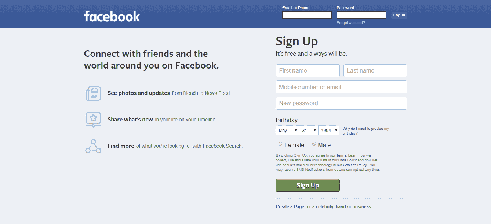
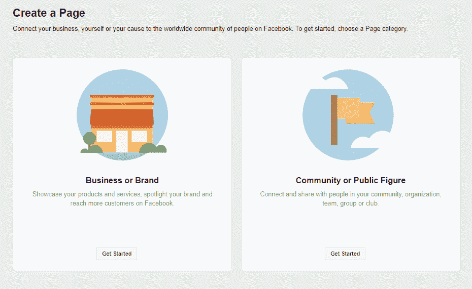
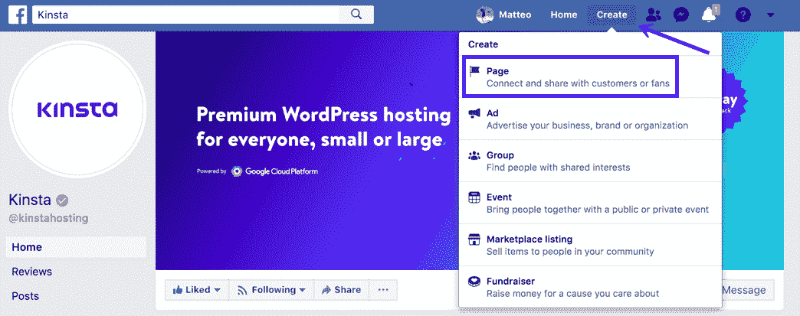
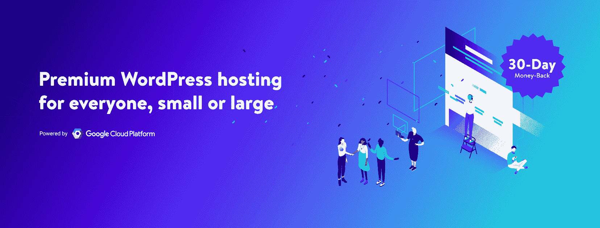
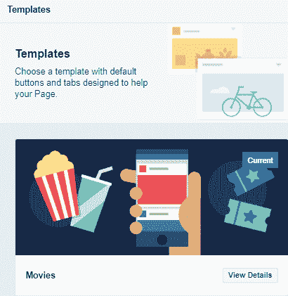
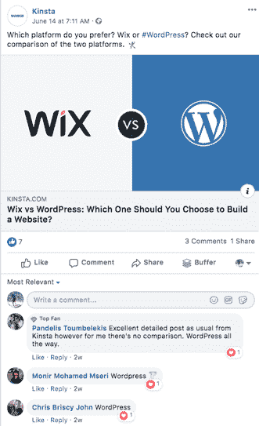
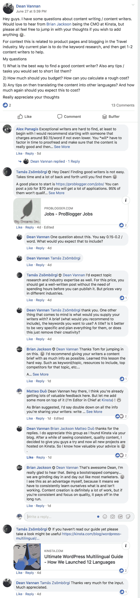
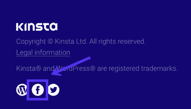

# 如何创建一个脸书网页(为什么你想要一个)

> 原文：<https://kinsta.com/blog/how-to-create-a-facebook-page/>

脸书是世界上最大的社交网络，拥有超过 23 亿用户。那么，你应该为你的企业创建一个脸书网页吗？

可以肯定地说，营销人员对脸书有着复杂的感情(我们不都是吗？).

一方面，它拥有庞大的用户群和无与伦比的广告系统，而且人们习惯于关注脸书的商业页面。

另一方面，[它在年轻人中不再流行了](https://kinsta.com/blog/facebook-statistics/#digging-into-facebook-demographics)，而且它不断卷入隐私丑闻，侵蚀了公众对它的信任。

有些人甚至认为它会步 Myspace 的后尘。所以，你应该费心在脸书上创建一个商业页面吗？

*   [世界最大社交网络背后的故事](#story)
*   为什么你的公司需要脸书商务页面？
*   [如何为您的公司创建脸书页面](#how-to)
*   [在脸书上建立一个追随者](#following)
*   [创建一个内容时间表并坚持下去](#schedule)
*   [如何有机推广贵公司的脸书页面](#promote)
*   给你一个警告:脸书并不像它看起来那么可靠
*   [你的逃跑路线:从脸书转移到一个电子邮件列表](#email-list)

的确，脸书不再像过去那样时髦了。但在这一点上，我们太习惯使用它了，很难想象一个没有它的世界。而且短期内不会有任何进展。

这就是为什么脸书商业网页是绝对必须的。

## 我如何创建一个脸书网页？(4 个步骤)

脸书页面可以自定义故事、事件等内容。如果你想快速创建一个脸书页面，请遵循以下 4 个步骤:

1.  去 facebook.com/pages/create.
2.  点按以选择页面类型。
3.  填写所需信息。
4.  单击继续并按照屏幕上的说明进行操作。

Support
## 世界最大社交网络背后的故事

2003 年，哈佛学生马克·扎克伯格建立了一个名为 FaceMash 的网站，向用户展示了两张哈佛学生的照片，并要求他们判断哪个学生更有吸引力。

> Kinsta 把我宠坏了，所以我现在要求每个供应商都提供这样的服务。我们还试图通过我们的 SaaS 工具支持达到这一水平。
> 
> <footer class="wp-block-kinsta-client-quote__footer">
> 
> 
> 
> <cite class="wp-block-kinsta-client-quote__cite">Suganthan Mohanadasan from @Suganthanmn</cite></footer>

[View plans](https://kinsta.com/plans/)

Facemash

该网站取得了成功，在最初四个小时内吸引了 450 名访问者，产生了 22 000 次照片浏览。

然而，正如你所想象的那样，大学管理部门对此不以为然，并在几天后将其关闭。扎克伯格发现自己面临被驱逐。

他当时不知道的是，FaceMash 不仅让他想到了脸书，而且他还因此认识了他未来的妻子(他们是在他的朋友为他举办的告别派对上认识的，当时他们以为他会被开除)。

在他的哈佛毕业典礼演讲中，扎克伯格说 FaceMash 对创建脸书并不像人们想象的那样重要:

> “而且，你知道，这部电影让人们觉得 Facemash 对创造脸书如此重要。不是的。但如果没有 FaceMash，我就不会遇到 Priscilla，她是我生命中最重要的人，所以你可以说这是我在这里的时间里建立的最重要的东西。”

无论如何，脸书(后来成为脸书)的想法是受到哈佛大学关于 FaceMash 的报纸社论的启发。

当时，人们正在谈论数字化的哈佛脸书，扎克伯格意识到他可以自己创造它。

> “在哈佛，每个人都在谈论一本通用的面孔手册。…我认为大学要花几年时间来解决这个问题有点傻。我能比他们做得更好，而且我能在一周内完成。”

发布会后，扎克伯格对哈佛报纸说。

扎克伯格和他的朋友爱德华多·萨维林讨论了这个想法，他们同意共同创建脸书，每人投资 1000 美元。2004 年，扎克伯格和萨维林发起了脸书，最初仅限于哈佛学生，但很快就开始扩展到波士顿地区的学生和常春藤盟校的学生。

发布六天后，哈佛的同学卡梅隆·文克莱沃斯、泰勒·文克莱沃斯和迪维娅·纳伦德拉[指控扎克伯格](https://www.theguardian.com/technology/2009/feb/12/facebook-mark-zuckerberg-ex-classmates)涉嫌窃取他们的想法——最初叫做 Harvard connection——并开发了一款与之竞争的产品。他们后来起诉了扎克伯格，并以 120 万股(脸书 IPO 时价值 3 亿美元)达成和解。

脸书发展迅速，达斯汀·莫斯科维茨、安德鲁·麦科勒姆和克里斯·休斯很快加入了联合创始人的行列。

Facebook founders (Image source: [Le Journal de Montréal](https://www.journaldemontreal.com/2015/06/18/decouvrez-le-visage-des-fondateurs-de-grandes-entreprises-web))

同年，脸书获得了他们的第一笔投资，来自 PayPal 联合创始人彼得·泰尔的 50 万美元，使公司估值达到 490 万美元。

2006 年 9 月 26 日，脸书向公众开放，允许任何年满 13 岁的人在该平台上创建账户。一年后，2007 年 10 月，微软宣布他们以 2.4 亿美元收购了脸书 1.6%的股份，这使该公司的估值达到 150 亿美元。

2010 年，脸书宣布他们达到了 5 亿用户。当年年底，该公司的价值约为 410 亿美元。2012 年，脸书以每股 38 美元的价格首次公开募股，使该公司的估值达到 1040 亿美元(当时最大的估值)。同年，脸书宣布他们达到了 10 亿用户。

2017 年，脸书的用户达到了 20 亿。2019 年的今天，它拥有超过 23 亿用户，并继续增长。

## 为什么你的公司需要一个脸书商业网页？

脸书向公众开放已经 13 年了(是的，我们都在变老，不是吗？).

在这一点上，[人们习惯了在脸书](https://kinsta.com/blog/facebook-statistics/#facebook-statistics-bout-businesses)上与商家互动，每个人都熟悉在这个平台上关注一个品牌的概念。

你应该利用这一点，努力与脸书的潜在客户建立联系。

The homepage of Facebook

你甚至可以将有机线索从脸书直接发送到你的 CRM 或销售系统。例如，在 Kinsta，任何到达我们脸书业务页面的消息都会自动通过 Intercom 发送给我们的销售团队。有很多不同的方法可以让脸书网页变得有创意，并为你的团队而制作。

## 如何为你的公司创建一个脸书网页

首先，进入[这一页](https://www.facebook.com/pages/creation)。

How to Create a Facebook Page

或者，您可以登录脸书，点击右上角的“创建”按钮，然后点击“页面”。

the “Create” button when logged in

然后，选择“企业或品牌”并点击“开始”按钮:

### 1.提供一般商业信息

您将被要求提供有关您企业的一般信息:

*   页面名称。
*   类别。
*   地址。
*   电话号码(可选)。

您可以勾选一个方框，不显示您的地址，只显示城市、州和地区。

### 2.添加个人资料图片

公司页面的个人资料图片与个人页面的个人资料图片工作方式相同。

当您发表评论或发布更新时，它将作为图标出现在公司名称旁边。

个人资料图片最好是 170 x 170 像素。

### 3.添加封面照片

封面照片是贵公司页面的特色图片，就像我们在 Kinsta 的照片一样:

Kinsta’s Facebook cover image

封面照片最好是 820 x 462 像素的。

### 4.向您的公司页面添加更多详细信息

一旦基本的都处理好了，是时候给你的公司页面添加更多的细节了。

首先，转到“关于”页面，添加您认为对潜在客户有价值且感兴趣的信息。

然后，转到[照片](https://www.facebook.com/pg/kinstahosting/photos/)并添加一些照片，这样人们可以看到你的全部(记住，一张照片胜过千言万语！).

然后去社区[创建一个群组](https://www.facebook.com/pg/kinstahosting/groups/)围绕你的页面建立一个社区。

### 5.为您的公司页面选择模板

脸书为商业页面提供了十种模板。

点击“设置”，然后“模板和标签”，然后“编辑”按钮。

## 注册订阅时事通讯

### 想知道我们是怎么让流量增长超过 1000%的吗？

加入 20，000 多名获得我们每周时事通讯和内部消息的人的行列吧！

[Subscribe Now](#newsletter)

Facebook page templates

选择最适合您业务的模板(您可以通过单击“查看详细信息”来查看)。

恭喜你！你的公司在脸书。干得好！

## 在脸书身上建立追随者

创建一个脸书网页是不够的，现在你需要让人们关注你。

就像任何社交媒体平台一样，在脸书建立追随者的关键是提供价值。

Provide value to your Facebook followers and engage with them

你不能指望人们无缘无故地跟着你。

激励人们关注你的一个简单方法是张贴特别优惠和折扣，并且只对脸书的粉丝开放。但从长远来看，这对大多数企业来说都不是一个可持续的方法。

如果你想与现有和潜在客户建立有意义的关系，你应该给他们更多的东西。

从哪里开始？两个关键方面:内容监管和主动性。

弄清楚你的目标受众每天都在纠结什么，然后分享内容——无论是内部创作的还是从其他网站策划的——帮助他们解决问题。简言之，这就是“提供价值”的含义。

此外，确保在你的公司页面上与人们互动。你的目标应该是在脸书建立一个社区。鼓励讨论，提出问题，倾听答案，并尽力提供帮助。

一个很好的例子是[这个帖子](https://www.facebook.com/groups/263423794308573/permalink/378525076131777/)，其中一个小组成员提出了一个很好的问题，许多人补充了他们的答案:

Engage with your community on Facebook

这个例子显示了一个组，而不是我所知道的脸书页面。然而，在脸书经营和发展一个团队的动力和方法，非常接近于发展一个脸书页面。这里的关键是:提供有用的信息，对那些对你的产品/服务感兴趣的用户采取主动。

## 创建一个内容时间表并坚持下去

当人们决定在社交媒体上建立一个受众群时，他们犯的第一个错误是他们没有创建一个内容时间表。

你看，当你刚刚推出你的页面时，你都很兴奋，每天发布十次，但在一两周内，最初的热情不可避免地消退了。

当这种情况发生时，[发布频率](https://kinsta.com/learn/content-marketing/#length-and-frequency-of-publishing)逐渐下降，接下来你知道你已经 3 个月没有更新你的公司页面了，因为你“很忙”。

但是说实话:你并不忙，你只是分心了，失去了注意力。

当然，问题是，如果你那样做，你将永远不会建立任何有意义的东西。

厌倦了 WordPress 的问题和缓慢的主机？我们提供世界一流的支持，由 WordPress 专家提供 24/7 服务和超快的服务器。[查看我们的计划](https://kinsta.com/plans/?in-article-cta)

就像任何有价值的事情一样，[在脸书](https://kinsta.com/blog/facebook-marketing/#customer-reviews)上建立追随者需要时间，所以你需要战略性地接近它:

*   在你每周的时间表中找一个时间段，你可以用来发展你的脸书主页。这包括制定你的内容策略，写文章，推广你的网页。
*   在你每天的日程安排中找一个时间来维护/检查你的脸书页面，回复评论和问题。
*   [创建内容日历](https://kinsta.com/blog/facebook-marketing/#regularly-post-original-content)。它不需要任何花哨的东西，谷歌电子表格就足够了。放上 10/15 个与你的观众相关的链接(或者更多，如果可以的话),并为每个链接做一个简短的介绍。利用像 Buffer 这样的工具来提前安排你的链接。

所有这些听起来可能很简单，但是毫无疑问，你做得越多就会越难，因为你可能会打破你的出版计划，你可能无法找到和/或创建有用的内容，等等。但是如果你坚持不懈，你可能会惊讶于你所能取得的成就！

记住:你正试图在脸书上建立一个追随者，所以你需要明白这是一个永无止境的项目。您正在构建一项有价值的资产，这将有助于您挖掘潜在客户。所以要有耐心。玩长线游戏。

## 如何有机推广贵公司的脸书页面

既然你已经花费了所有的时间和精力来创建一个伟大的脸书商业网页，不推广它将是一种耻辱。

你可以这样传播信息:

*   邀请您的脸书朋友[关注您的公司页面](https://www.facebook.com/kinstahosting/)(有一个功能可以帮助您做到这一点)。
*   Put a link to your Facebook page on the company’s website and encourage website visitors to follow you.

    

    我们在页脚链接了我们的脸书页面

    

*   向你的电子邮件列表发送一封电子邮件，让他们知道你现在有一个脸书页面，并提供至少一个理由让他们喜欢/关注它。
*   在您的其他社交媒体个人资料中分享您的脸书页面链接。

“建造它，他们就会来”是一个老生常谈，听起来很棒，但实际上绝对是可怕的建议。

不要等着别人来找你，主动去邀请他们查看你的脸书页面。钓他们的最好方法是什么？为他们提供坚实的理由，使他们的选择更容易。

## 一个警告:脸书并不像它看起来那么可靠

你可能听说过脸书不时禁止或删除网页和群组。如果你认为这仅限于政治，并不像最近的 [CrossFit 和脸书/Instagram 的故事告诉](https://www.theverge.com/tldr/2019/5/24/18638670/crossfit-facebook-instagram-suspends-delete)的那样。

那么你能做些什么来保护你的生意呢？不要把所有的鸡蛋放在一个篮子里，利用你在社交媒体之外的渠道！

## 你的逃跑路线:从脸书转移到电子邮件列表

在任何社交媒体平台上建立粉丝的问题在于，你并不拥有这个平台。你可以在任何时候被禁赛而无需解释。可能性不大，但还是。

唯一的解决办法是使用社交媒体将人们发送到你的电子邮件列表中，因为这样你就建立了一份无法从你身边拿走的资产。

我知道，为了做到这一点，你需要使用电子邮件营销软件供应商的服务，所以你仍然容易受到攻击。

然而，尽管社交媒体平台最近一直在禁止人们左右逢源，但电子邮件营销软件提供商迄今为止仍在努力克制自己。

据推测，这是因为电子邮件列表比社交媒体档案更有价值，这意味着删除某人的电子邮件列表会开创一个危险的先例。

毕竟，如果你有一项资产每月产生数千、数万、甚至数十万美元的收入，那么你可能无法很好地处理这项资产随时可能被夺走的消息。

这意味着不打破客户对安全的幻想是最符合电子邮件营销软件提供商的利益的。

所以，开始考虑如何将你的脸书追随者转化为电子邮件订阅者。

很明显，人们不会因为你要求他们订阅你的邮件列表就去订阅。同样，你需要给他们一个这样做的理由。

以下是一些开始的想法:

### 提供选择性贿赂

选择加入贿赂是指你提供一个电子邮件地址来换取的东西。它可以是折扣，可以是电子书，可以是视频课程等等。

确保你的选择加入贿赂是为你的客户提供价值的东西。

### 分享专属于您的电子邮件列表订阅者的内容摘要

在一封新邮件发出之前，先在你的脸书页面上分享一瞥，并告诉人们如果他们想阅读它，他们需要现在订阅，它很快就会发出！

想想电影。你知道你看到一个预告片，然后说“是的，我要看这部！”？嗯，这就是你想通过电子邮件达到的目的。你希望人们说“我需要读这本书，我在哪里订阅？?"

### 分享电子邮件列表订阅者的积极反馈

如果你为你的邮件列表订阅者提供价值，你将开始收到积极的反馈。

当这种情况发生时，请求那个人允许在你的脸书页面上分享反馈，并分享他们的电子邮件截图(确保通过模糊他们的个人信息来保护发件人的隐私！).

### 定期在你的脸书页面上推广你的邮件列表

不要羞于在你的脸书页面上推广你的邮件列表。

确保在您的内容日历中包含电子邮件列表推广。你可以从每周发表一两篇文章开始。然后试着逐渐增加邮件列表推广频率。看看人们的反应。如果有人抱怨，那就放松一点，如果没人介意，那就继续做你正在做的事情。

不要忘记，在推广你的邮件列表时，你有更多的回旋余地。毕竟，这是免费的，所以你的追随者不会像反对以同样频率发布的推销广告那样反对电子邮件列表推广。

但是，不要忘记运用常识:没有人喜欢垃圾邮件，即使在脸书也没有！

将你的追随者从脸书转移到电子邮件列表，可以让你与你的追随者建立更牢固的关系，并完全控制媒体。

[Love it or hate it, #Facebook is the biggest social network with 2.3+ billion users. That's where most of your customers are... 🎣 go catch 'em all with a shiny Facebook page!Click to Tweet](https://twitter.com/intent/tweet?url=https%3A%2F%2Fkinsta.com%2Fblog%2Fhow-to-create-a-facebook-page%2F&via=kinsta&text=Love+it+or+hate+it%2C+%23Facebook+is+the+biggest+social+network+with+2.3%2B+billion+users.+That%27s+where+most+of+your+customers+are...+%F0%9F%8E%A3+go+catch+%27em+all+with+a+shiny+Facebook+page%21)

## 摘要

让我概括一下:(一些)你现在和潜在的客户都在脸书。如果你不在那里，你将无法拦截他们并与他们直接交战。因此，至少在一段时间内，你应该在脸书接触他们，并把它作为一个收购渠道进行测试。

我知道，脸书，它不再是最热门的社交媒体网络，但它是最成熟的，你的客户希望你有一个商业页面。给它一个尝试，因为你现在知道如何建立一个脸书网页。

* * *

让你所有的[应用程序](https://kinsta.com/application-hosting/)、[数据库](https://kinsta.com/database-hosting/)和 [WordPress 网站](https://kinsta.com/wordpress-hosting/)在线并在一个屋檐下。我们功能丰富的高性能云平台包括:

*   在 MyKinsta 仪表盘中轻松设置和管理
*   24/7 专家支持
*   最好的谷歌云平台硬件和网络，由 Kubernetes 提供最大的可扩展性
*   面向速度和安全性的企业级 Cloudflare 集成
*   全球受众覆盖全球多达 35 个数据中心和 275 多个 pop

在第一个月使用托管的[应用程序或托管](https://kinsta.com/application-hosting/)的[数据库，您可以享受 20 美元的优惠，亲自测试一下。探索我们的](https://kinsta.com/database-hosting/)[计划](https://kinsta.com/plans/)或[与销售人员交谈](https://kinsta.com/contact-us/)以找到最适合您的方式。