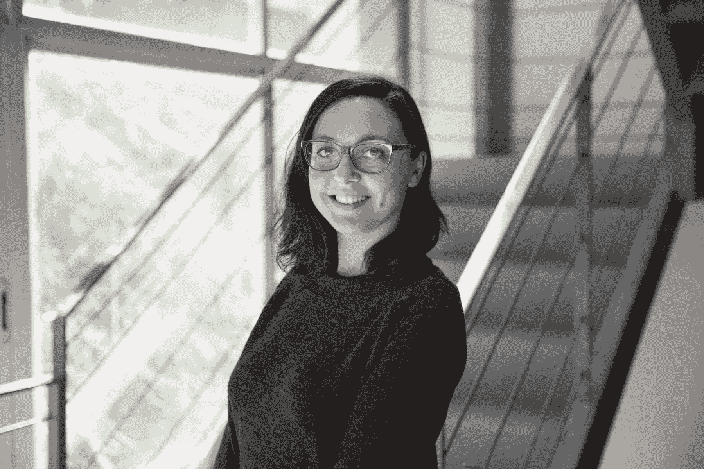
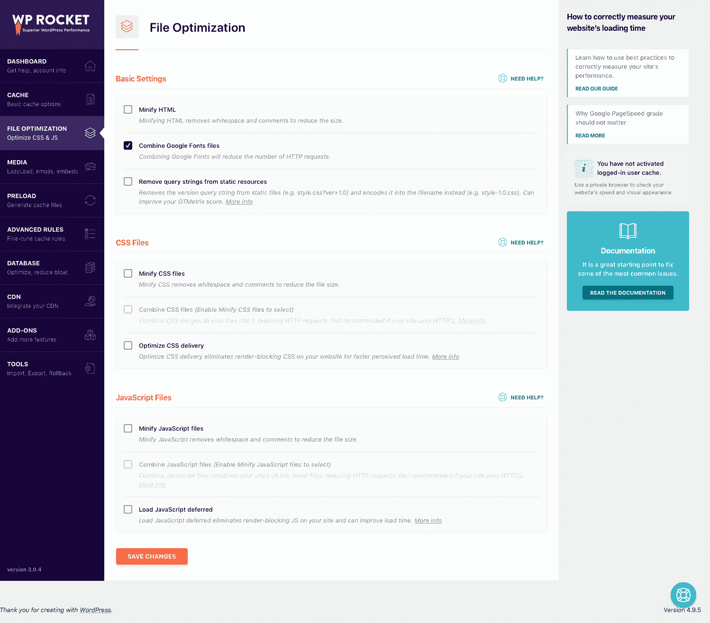
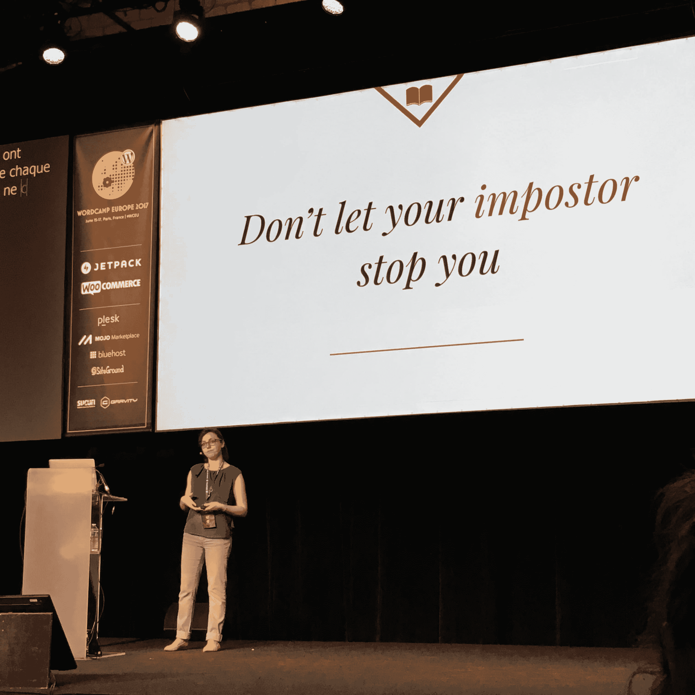

# 金斯塔·金并:爱丽丝·奥柔访谈

> 原文：<https://kinsta.com/blog/interview-with-alice-orru/>

Alice Orr 是一个 WordPress 爱好者，WordPress 社区的活跃成员，也是 WP Rocket T1 的内容作者，WP Rocket T1 是一个受欢迎的 WordPress 一体化高级缓存插件，拥有超过 95，000 名快乐的客户，T2 完全兼容 kin sta T3。

你可以通过推特联系她。

如果你喜欢采访，请务必查看我们的[金斯塔·金并](https://kinsta.com/?post_type=post&s=kingpin)系列了解更多！

### Q1:你的背景是什么，你是如何开始使用 WordPress 的？

我是一名经济学家，对文字和外语充满热情。毕业后，在法国接受了一段时间的培训，我回到了意大利，在几个跨国公司的营销部门工作了五年多:我对我在米兰追求的生活并不满意，因此在 2012 年，我决定是时候改变一下了。

我收拾好行李，搬到了西班牙的巴塞罗那，在那里我开始为一家生育诊所的国际病人做翻译和助手。那段经历持续了三年，之后——被那份工作的心理负担弄得筋疲力尽——我决定回到我以前的爱好:网络。

Alice Orrù

那时我偶然发现 WP Media 为他们的缓存插件 WP Rocket 提供多语言支持代理。

那时我已经使用 WordPress 几年了，但只是为了好玩和个人博客项目。不过，WP Rocket 的职位让我很好奇，即使我没有技术知识，我还是申请了:他们信任我，这就是我开始靠 WordPress 谋生的原因！

从那以后，我很快就开始了解这个社区，并被围绕着它的协作精神所吸引。我在 WordPress 意大利语团队中找到了自己的位置，并结交了许多好朋友。

### Q2:读者应该知道你最近在 WordPress 做了些什么？

目前我正在用 WordPress 做很多事情。我是一名内容作家，在 WordPress 的缓存领域工作了四年之后，写关于 web 性能优化的文章是我的专长。

WP Rocket settings

同时，我也是 WordPress 社区的活跃成员:我是意大利语团队的翻译编辑。我们是翻译一切与 WordPress 相关的东西的人:主题、插件、元数据、应用程序等等。

当我感到有灵感并想到一个好话题时，我喜欢在单词营演讲。单词营是一个从内部了解社区的绝佳机会，被列在演讲者之列总是一种特权。如果我没有心情发言，我通常会申请成为志愿者，帮助组织者顺利举办活动。

由于写作是我的第一爱好，我还策划了一个关于我在巴塞罗那生活的个人生活方式博客，我是“Viaggio da Sola Perché”的编辑人员，这是第一个致力于女性独自旅行的意大利多作者博客。

## 注册订阅时事通讯

### 想知道我们是怎么让流量增长超过 1000%的吗？

加入 20，000 多名获得我们每周时事通讯和内部消息的人的行列吧！

[Subscribe Now](#newsletter)

### Q3:在职业生涯中，你遇到了哪些挑战？

到目前为止，我不得不面对的主要挑战是在技术支持工作中克服我的冒名顶替综合症。这并不容易，但现在我可以说这是值得的。学习 WordPress 的幕后工作并学习成为一名 web 性能专家是一次真正的旅程，但它使我成为一名更好的专业人员。

Alice Orrù WCEU in Paris

如今，我想说跟上 WordPress 和 web 性能周围发生的所有事情可能是一个挑战。但这也是我怀着好奇心和不断提高技能的愿望所拥抱的东西，所以这很好:我不喜欢变得无聊。

### 在 WordPress 的世界里，有没有什么让你感到惊讶的事情？

我对 WordPress 社区的力量感到惊讶。这是一种微观世界，人们在这里一起工作，讨论，见面，即使他们在现实生活中从来没有机会看到对方。向社区外的人解释这是一件复杂的事情:直到你生活在其中，你才会明白！

[I've been amazed by the WordPress community's strength. 💪 People who never met talk, discuss, and work together so easily! — @Alice_RidiceClick to Tweet](https://twitter.com/intent/tweet?url=https%3A%2F%2Fbit.ly%2F3e3fj5f&via=kinsta&text=I%27ve+been+amazed+by+the+WordPress+community%27s+strength.+%F0%9F%92%AA+People+who+never+met+talk%2C+discuss%2C+and+work+together+so+easily%21+%E2%80%94+%40Alice_Ridice&hashtags=wordpress%2Ccommunity)

### Q5:你认为 WordPress 世界的未来会是怎样的？

我乐观地看待它。我的愿望是继续为社区做贡献并在专业上成长，将内容写作和软件本地化放在我职业生涯的中心。

与宕机和 WordPress 问题做斗争？Kinsta 是一款考虑到性能和安全性的托管解决方案！[查看我们的计划](https://kinsta.com/plans/?in-article-cta)

与此同时，我对围绕女性在科技领域的主题的一切都非常感兴趣，我认为 WordPress 社区正在成为包容性的一个很好的例子。我计划更多地参与其中，并能够让更多的女性接近这个社区。

### 你在 WordPress 主机中寻找什么？

在我看来，一个优秀的主持人会提供灵活的计划和出色的支持。作为一名多年的支持代理，我无法避免首先对一家公司提供的支持进行评价。对于一个主机来说，这甚至更重要，因为我想象大多数客户没有足够的技术技能来自己解决最终的问题。

### 问题 7:当你离开笔记本电脑时，你喜欢做什么？

很多东西！作为一个狂热的读者，我会在那个时候开始读几本书:一本在午饭后读，一本在公共交通工具上读，一本在睡觉前读。😋我也深深爱上了巴塞罗那和它的美食。闲暇时，我会在城市里闲逛，最好是骑自行车，去发现新的社区、博物馆或餐馆。我认为在外面吃饭是我最经常给予自己的奢侈之一:尝试新的口味，品尝异国风味的食物，或者只是吃镇上最好的蛋糕！

我也喜欢独自旅行，我是女性独自旅行的大使:我试图花一些时间独自旅行，至少每年一次。

最后，我最近加入了一个在巴塞罗那帮助难民的非政府组织:这是一个旨在帮助难民在城市中建立新生活、学习语言并促进他们融入我们社会的项目。

### 问题 8:接下来我们应该采访谁&为什么？

德国 WordPress 社区的元老之一 Caspar Hübinger 。他是鼓励我申请在 2016 年我的第一个单词营演讲的人之一。Caspar 是一个善良、聪明的人，对 WordPress 环境有着非常有趣的看法:绝对是一个值得了解的人。

* * *

让你所有的[应用程序](https://kinsta.com/application-hosting/)、[数据库](https://kinsta.com/database-hosting/)和 [WordPress 网站](https://kinsta.com/wordpress-hosting/)在线并在一个屋檐下。我们功能丰富的高性能云平台包括:

*   在 MyKinsta 仪表盘中轻松设置和管理
*   24/7 专家支持
*   最好的谷歌云平台硬件和网络，由 Kubernetes 提供最大的可扩展性
*   面向速度和安全性的企业级 Cloudflare 集成
*   全球受众覆盖全球多达 35 个数据中心和 275 多个 pop

在第一个月使用托管的[应用程序或托管](https://kinsta.com/application-hosting/)的[数据库，您可以享受 20 美元的优惠，亲自测试一下。探索我们的](https://kinsta.com/database-hosting/)[计划](https://kinsta.com/plans/)或[与销售人员交谈](https://kinsta.com/contact-us/)以找到最适合您的方式。