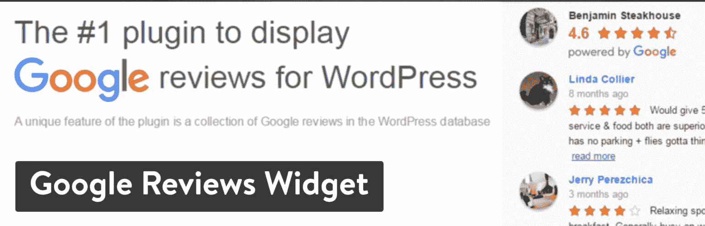
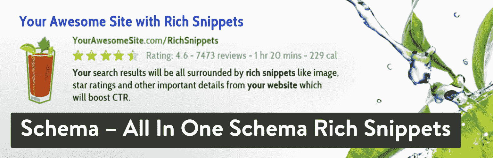
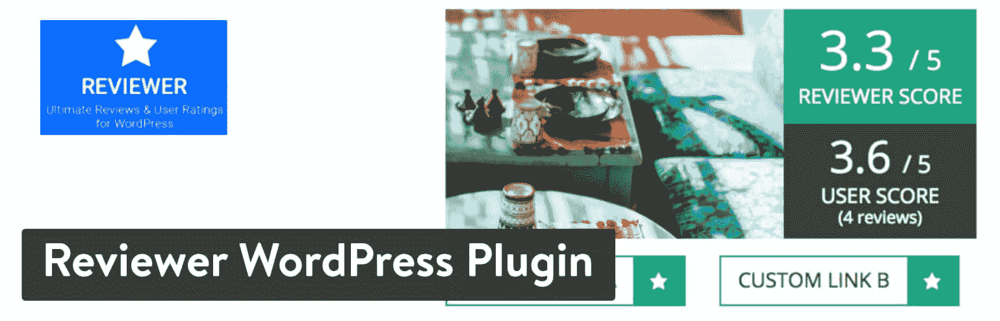
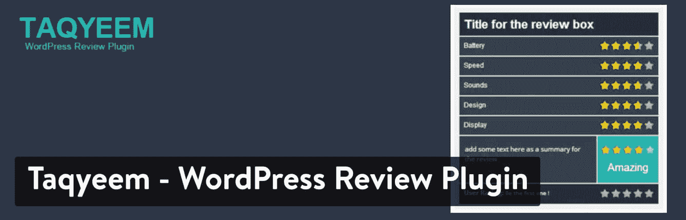

# 10 个最好的 WordPress 评论插件(评级和模式)

> 原文：<https://kinsta.com/blog/best-wordpress-review-plugins/>

寻找提高转化率的方法是一项永无止境的任务。但是让你的客户工作的方法呢？

我们谈论的是[顾客评论](https://kinsta.com/kinsta-reviews/)——那些为你的产品增加社会证明并敦促你的顾客购买你的服务的小词和评级。

这是宣传你的品牌的最简单的方法之一，所以这就是为什么我们想向你展示一些最好的 WordPress 评论插件。

## 在你的 WordPress 网站上放评论的好处

客户评论的好处多少取决于你经营的是什么类型的业务。例如，一家在线服装店可能想要显示在每件产品下面的直接顾客评论。另一方面，本地五金店可能希望分享谷歌评论，并向其他客户展示在哪里张贴这些评论。

不管怎样，所有公司都应该知道一些共同的好处:

*   评论是免费的广告。无论是在谷歌评论上还是在你的产品页面上，你的客户都在宣传你的公司。根据[明镜研究中心](https://spiegel.medill.northwestern.edu/_pdf/Spiegel_Online%20Review_eBook_Jun2017_FINAL.pdf)的数据，近 95%的购物者在购物前会阅读网上评论。
*   **你收到顾客的反馈并建立关系**-一些评论会提供有用的信息，你可以利用这些信息来改变你的业务。另外，人们喜欢你回复他们的评论。
*   **社会证据**–[研究显示](https://www.nielsen.com/ug/en/press-room/2015/recommendations-from-friends-remain-most-credible-form-of-advertising.html)当消费者看到朋友或其他人认可产品或服务时，他们更有可能购买。
*   你提高了你的搜索引擎优化。谷歌可以显示[丰富的片段](https://kinsta.com/blog/featured-snippets/)，在搜索结果中有互动的视觉效果。它们经常受到谷歌的青睐。在这种情况下，您的搜索引擎列表会有星级。
*   你开始实现完全透明。在线评论可以填补你网站上可能没有显示的信息空白。例如，您可能遗漏了产品描述中的一些规格，但可能有一位乐于助人的客户在评论中谈到了它。

## 在完美的 WordPress 评论插件中寻找什么

有些插件有不同的功能，但是你可以在所有的插件中找到相似的标准特性。那么，我们应该寻找哪些特征呢:

> Kinsta 把我宠坏了，所以我现在要求每个供应商都提供这样的服务。我们还试图通过我们的 SaaS 工具支持达到这一水平。
> 
> <footer class="wp-block-kinsta-client-quote__footer">
> 
> 
> 
> <cite class="wp-block-kinsta-client-quote__cite">Suganthan Mohanadasan from @Suganthanmn</cite></footer>

[View plans](https://kinsta.com/plans/)

*   能够[在你的网站上嵌入评论](https://kinsta.com/blog/embed-google-reviews/)，并为客户提供一个写评论的表格。
*   评级系统，如星级或拇指向上/向下。
*   上传更多视觉内容的选项，如图片或视频。
*   一个排序功能，首先看到坏的或好的评论。
*   搜索栏，以便客户可以在某些评论中找到关键词。
*   一个干净的仪表板，用于查看和调节收到的评论。
*   从谷歌和 Yelp 等地方收集在线评论的选项。
*   将[与 WooCommerce 插件](https://kinsta.com/blog/woocommerce-plugins/)整合的可能性。这对于获取单个产品的评论非常有用。
*   在你的网站上显示评论的几个选项，包括短代码和小部件。
*   用于自定义审核中字段的设置。例如，一些公司可能希望有一个利弊区。

[Customer reviews are free ads for your business: they help boost your sales and brand reputation. Check out these WordPress review plugins! ⭐️⭐️⭐️⭐️⭐️Click to Tweet](https://twitter.com/intent/tweet?url=https%3A%2F%2Fkinsta.com%2Fblog%2Fbest-wordpress-review-plugins%2F&via=kinsta&text=Customer+reviews+are+free+ads+for+your+business%3A+they+help+boost+your+sales+and+brand+reputation.+Check+out+these+WordPress+review+plugins%21+%E2%AD%90%EF%B8%8F%E2%AD%90%EF%B8%8F%E2%AD%90%EF%B8%8F%E2%AD%90%EF%B8%8F%E2%AD%90%EF%B8%8F&hashtags=wordpress%2Cwpplugin)

## 最好的 WordPress 评论插件

现在我们明白了为什么顾客评论如此重要，继续阅读看看我们最喜欢的一些 WordPress 评论插件。

T3】

### 1.海星评论

如果你想增加你在谷歌、Trustpilot、脸书或任何第三方评论平台上的评论， [Starfish Reviews](https://starfish.reviews/) 是你可能不知道自己需要的插件。

Starfish Reviews WordPress plugin

海星评论在 WordPress.org 有非常有限的免费版本，或者起价 47.88 美元的“商业”计划，包括更多的功能、全面支持、5 个漏斗和一个站点上的安装。一个“营销者”计划可用于 10 个网站，每个网站有 10 个漏斗，一个“网站管理员”计划可用于多达 100 个网站，每个网站有无限的漏斗。

这个令人敬畏的插件消除了向顾客或追随者询问评论的恐惧。如果你要求每个人都给你一个评价，你可能会让那些有不好经历的人给你留下负面评价。通过使用海星评论，你再也不用担心了。当你要求评论时，只需发送你的海星创造的漏斗。我们鼓励有负面经历的人直接向您提交负面反馈！

与此同时，爱你、爱你的产品或业务的人会收到“留下评价”表格，在那里他们可以给你留下有价值的 5 星评价和有帮助的评价。

#### 是什么让它成为最好的 WordPress 评论插件之一？

*   易于设置和配置熟悉的 WP 界面。
*   发送相同的链接给每个人评论:你所有的客户，追随者，播客听众，电子书读者，等等！不要试图猜测他们会留下什么样的评论。
*   与 MailChimp 和 MailPoet 等电子邮件营销平台整合，实现自动跟进。
*   使用短代码在页面或帖子中嵌入漏斗，或使用页面构建器设计自己的漏斗布局，如 [Divi、Elementor](https://kinsta.com/blog/divi-vs-elementor/) 、Beaver Builder 和 Block Editor。
*   对您的表现进行高水平评估的分析。
*   导入和显示评论的新特性。

#### 谁应该考虑将评论放在他们的网站上？

任何企业或个人都可以使用海星评论在在线评论平台上为他们的产品、服务、[播客](https://kinsta.com/blog/what-is-a-podcast/)、业务等获得更多高质量的评论。不要让你的评论碰运气！让积极主动变得简单和自动化。让海星将负面和正面评论分类，并最大限度地发挥它们的潜力。
T3】

### 2.网站评论

站点评论插件提供了一种简单而有效的方法来收集你网站的评分和评论。这个插件有几个选项来显示你的评论，包括短代码、小部件和块。评论以默认顺序显示，但是您可以通过将一些最好的评论放在最上面来自定义。

Best WordPress Review Plugins: Site Reviews

这是在你的网站上整合评论的最简单的方法之一，所以如果你喜欢整洁的外观和标准的评论格式，这绝对是一个可以考虑的插件。此外，它是完全免费的，一路上没有追加销售。

#### 是什么让它成为最好的 WordPress 评论插件之一？

*   它可以让你在网站的任何地方显示你的评论。这是通过小部件、块和短代码完成的。
*   标记您的最佳评论，使它们出现在列表的顶部。
*   该插件与 Akismet 集成，因此您可以摆脱垃圾邮件。
*   它带有备份和恢复功能，以防丢失任何数据。
*   发布评论时，可以使用自定义通知。
*   丰富的片段显示在您的搜索引擎结果上，带有评级和星级。
*   出口或进口评论，使他们不只是停留在一个网站上。

#### 谁应该考虑将评论放在他们的网站上？

Site Reviews 是一个轻量级的、干净的插件，适合那些想要最基本的东西的人。它也是开源和免费的，所以那些预算有限的人仍然可以在他们的网站上享受客户评论。

### 3.WP 客户评论

作为另一个免费评论插件， [WP 客户评论插件](https://wordpress.org/plugins/wp-customer-reviews/)是一个在你的网站上任何地方接受评论的伟大解决方案。这是一个开源项目，开发者得到的唯一资金就是捐款。这个插件以两种方式工作。首先，你可以收集顾客对你的业务的总体评价，或者你可以把评价模块放在你的个人产品页面上。

Best WordPress Review Plugins: WP Customer Reviews

很多人会很高兴知道你不用支付任何费用就可以使用 WP 客户评论插件。它的配置也很简单，有一个接受或拒绝评论的基本仪表板。除了评论框显示的几个选项之外，该插件还提供了在一个页面上显示一定数量评论的设置。

#### 是什么让它成为最好的 WordPress 评论插件之一？

*   这是你能使用的最干净、最简洁的评论插件之一。
*   您可以使用短代码将您的评论放在网站的几个区域，包括侧栏。
*   您可以自定义所有字段，包括您想询问的关于产品的问题。
*   所有提交的内容都会在 WordPress 仪表盘中得到审核。
*   管理员能够回复来自客户的所有评论。
*   这个插件一直在开发中，你不需要为它支付任何费用。
*   丰富的片段会显示在搜索引擎上，以改善您的搜索结果，并提供更直观的评级视图。
*   您可以限制每个页面上显示的评论数量。

#### 谁应该考虑将评论放在他们的网站上？

这个 WordPress 评论插件对于预算有限的公司或者刚刚起步的在线商店很有意义。对于那些想要一个没有任何复杂功能的极简评论部分的人，我们也推荐它。

### 4.谷歌评论小工具

与本文中的许多其他插件相比， [Google Reviews Widget](https://wordpress.org/plugins/widget-google-reviews/) 具有完全不同的功能。这个插件不是让客户在你的网站上写评论，而是把你当前所有的谷歌商业评论显示在你的网站上。它是一个小部件，所以所有这些评论都可以放在页眉、页脚或侧边栏中。

这个插件是免费的，但是你可以选择升级到每年 85 美元的商业许可证。

Best WordPress Review Plugins: Google Reviews Widget

免费插件可能对一些小品牌有用，但它限制你只能获得五个谷歌评论和三个 Yelp 评论。就我个人而言，我觉得这对大多数企业来说已经足够了，但商业计划也支持更多的平台，如脸书。您还可以获得一些有趣的功能，如过滤器、丰富的片段和合并某些评论的能力。

#### 是什么让它成为最好的 WordPress 评论插件之一？

*   该插件有一个基本的免费版本，允许小公司分享他们的一些谷歌和 Yelp 评论。
*   尽管许多评论插件只在浅色网站上看起来不错，但谷歌评论插件也支持深色网站。
*   提供了几个主题供您自定义在线评论的显示方式。
*   支持多种语言，让你可以接受来自世界各地的评论。
*   一些格式包括独特的元素，如[滑块](https://kinsta.com/blog/wordpress-slider/)、网格和信任徽章。
*   万一您不想使用这个小部件，您可以访问短代码。
*   Google Rich 片段可以提高你的 SEO 效率。
*   三个评论平台与该插件集成，包括谷歌、Yelp 和脸书。

#### 谁应该考虑将评论放在他们的网站上？

对于那些只想发布一些谷歌或 Yelp 评论的小公司来说，谷歌评论小工具看起来不错。商业计划也不贵，所以如果你想获得脸书的评论，我们也喜欢这个插件。

最后，我们主要向喜欢使用小部件的人推荐这个插件。

## 注册订阅时事通讯

### 想知道我们是怎么让流量增长超过 1000%的吗？

加入 20，000 多名获得我们每周时事通讯和内部消息的人的行列吧！

[Subscribe Now](#newsletter)

### 5.WooCommerce 的客户评论

在线商店通常是你看到顾客评论的地方。如果[你当前的主题](https://kinsta.com/blog/change-wordpress-theme/)没有一个好看的评论部分，WooCommerce 插件的[顾客评论正好有你需要的。它建立在为你的客户登陆](https://wordpress.org/plugins/customer-reviews-woocommerce/)[你的电子商务产品页面](https://kinsta.com/blog/conversions-woocommerce-product-pages/)创造社交证明的基础上。

Best WordPress Review Plugins: Customer Reviews for WooCommerce

WooCommerce 的顾客评论有几个特别吸引人的特点。例如，它会向最近购买了该产品但尚未发表评论的顾客发送通知。当顾客确实通过你的商店购买产品时，它还可以通过核实评论来提高你的社会证明。

有两种计划可供选择:免费和专业。专业版售价为每年 49.99 美元，并为您提供额外的功能和专门的支持。

#### 是什么让它成为最好的 WordPress 评论插件之一？

*   免费版本包括几个对所有企业都有用的功能，如信任徽章、评论提醒和导入评论的能力。
*   客户评论提醒提供了一种方式，让客户知道他们可以回到您的网站，并撰写关于他们购买的产品的评论。
*   所有评论都经过认证，以确保真正的购物者正在撰写评论。这使得评论看起来更值得未来的客户信赖。
*   您可以选择接受来自客户的内容，如视频和照片。
*   向顾客发送一份单页评论表，其中包含您商店中几种产品的字段。
*   在你所有的评论中加入丰富的片段，这样你的客户评级就会显示在谷歌上。
*   借助 [reCAPTCHA](https://kinsta.com/blog/wordpress-captcha/) 从您的评论中删除垃圾邮件。
*   可以根据评级和其他标准过滤所有评论。
*   分享商店特定区域的信任徽章，帮助顾客对他们的购物场所更有信心。
*   将您的评论与谷歌购物整合，在搜索结果中显示星级。
*   给那些在你的网站上写评论的人发送折扣和优惠券。

#### 谁应该考虑将评论放在他们的网站上？

这个评论插件只适用于在线商店。如果你经营一家 WooComerce 商店，我们建议你看看这个评论选项。我们最喜欢那些希望接受客户图片和视频的品牌，以及那些不介意为评论者提供折扣的品牌。

### 6.WP 商业评论

如果你正在寻找一个严肃的、强大的评论插件，看看 [WP 商业评论](https://wpbusinessreviews.com/)就知道了。

WP 商业评论每年起价 99.50 美元，包括一个站点许可和基本支持。如果你需要更多网站的支持，并想节省一点钱，你可以跳到其他计划。它没有免费版本，但这是因为 WP 商业评论插件充满了广泛的功能，与列表中的其他插件相比非常突出。

Best WordPress Review Plugins: WP Business Reviews

这个插件背后的主要好处是，从技术上讲，你不需要做任何工作就可以在你的网站上显示客户评论。你所要做的就是在你的 WordPress 网站上安装插件，并连接 Yelp、脸书和谷歌等平台。

在那之后，WP 商业评论接管，在那些平台上拉任何当前的和新的评论。你也可以添加自己的自定义评论，过滤掉一些负面评论。

#### 是什么让它成为最好的 WordPress 评论插件之一？

*   WP 商业评论摘录了一些最受欢迎的评论网站的评论，如 Yelp、谷歌和脸书。甚至还有一个名为 Zomato 的网站，这是一个全球餐厅平台，顾客可以在这里发表评论。
*   该插件能够添加您单独收集的自定义评论。客户也可以访问你的网站并分享评论，而不是跳转到像谷歌这样的网站。
*   过滤掉任何低于某一星级的评论或评级。这些并没有完全删除，而是隐藏在复习模块的顶部。
*   将您最喜欢的评论标记在列表顶部。
*   自定义您使用的评级系统类型及其在评论中的显示方式。例如，您可能会显示一个 5.0，或者五个蓝色或橙色的星形图标。
*   调整评论的风格，以适应你的深色或浅色网站。
*   利用有趣的格式，如列表和图库。
*   准确显示所有评论的来源，突出客户姓名和头像。

#### 谁应该考虑将评论放在他们的网站上？

任何类型的企业都可以利用 WP 商业评论工具。对于那些想自动化他们的评论系统，而不担心从过去的客户那里寻找评论的人来说，这是有意义的。人们可能会在脸书和谷歌上发帖，所以你可以从这些地方获取内容。

厌倦了慢热的主持人？Kinsta 的设计考虑了速度和性能。[查看我们的计划](https://kinsta.com/plans/?in-article-cta)

### 7.模式——在一个模式中包含丰富的片段

[模式插件](https://wordpress.org/plugins/all-in-one-schemaorg-rich-snippets/)有一个主要功能:在搜索引擎上展示你的产品的丰富片段。所以，如果你正在寻找一种在你的网站上获得评论的方法，这不是你想要的插件。

Best WordPress Review Plugins: Schema – All In One Schema Rich Snippets

Schema 采用了一种不同的方法，它结合了你当前的评论系统，并为搜索引擎添加了视觉效果。例如，你可能想在谷歌上给你的评级系统或者你的食谱的简化版标上星星。

#### 是什么让它成为最好的 WordPress 评论插件之一？

*   Schema 插件对所有用户都是免费的，并且没有任何你需要担心的升级。
*   这是一个轻量级的插件，不会拖累你的网站，也不会占用任何前后空间。
*   支持几种类型的模式。其中一些包括评论、事件、人物和食谱。评论是你最关注的，但是一个美食博客可以在谷歌上显示食谱的元素。
*   该插件的工作原理是，只有最重要和最相关的信息才会显示在丰富的片段中。
*   当客户试图在他们的[脸书页面](https://kinsta.com/blog/how-to-create-a-facebook-page)上分享链接时，最重要和最相关的信息也会显示出来。

#### 谁应该考虑将评论放在他们的网站上？

只有当你想用丰富的片段来改善你的评论时，才选择这个插件。你可能想提高你的搜索引擎排名，或者你可能只是注意到你的 WordPress 主题没有能力显示丰富的片段。如果您想要独特的内容片段，如视频或食谱，它也很棒。

### 8.WooCommerce 图片评论

这是你能为 WooCommerce 找到的最强大的评论插件之一。你可能知道，允许顾客在他们的产品评论上贴图片已经成为一种趋势。这是[这个插件](https://wordpress.org/plugins/woo-photo-reviews/)的主要目的，这样你的所有客户只需上传他们购买的物品的快速图片并发布到你的网站上。

Best WordPress Review Plugins: Photo Review for WooCommerce

这一定会提高你的社会证明，并开辟一种新的营销形式，让你的客户分享比你更多的产品信息。

这个插件有一个免费版本，拥有你需要的大部分功能。[高级版](https://codecanyon.net/item/woocommerce-photo-reviews/21245349?ref=villatheme)售价 26 美元，包括一个相当长的附加功能列表，如砖石弹出窗口，多语言功能，以及发送评论优惠券的选项。

#### 是什么让它成为最好的 WordPress 评论插件之一？

*   它提供了一个免费版本，其中包括一些相当先进的工具，如电子邮件设计和照片评论优惠券。
*   您可以指定所有客户评论都必须包含照片。此功能也可以关闭。
*   显示评分，并允许您的客户在您的网站上比较评分。
*   让人们可以选择根据已验证的购买、评分等来过滤您的评论。
*   如果评论是由经过验证的购买者撰写的，专业版可以选择只发放优惠券。
*   您也可以从全球速卖通导入评论。
*   专业版提供了从管理面板添加评论的工具。

#### 谁应该考虑将评论放在他们的网站上？

如果你经营一家网上商店，并且想在你的顾客评论中加入照片，WooCommerce 照片评论插件就派上用场了。对于那些想开始向人们发送优惠券以换取评论的人来说，这也很棒。

### 9.评论者 WordPress 插件

[Reviewer](https://codecanyon.net/item/reviewer-wordpress-plugin/5532349) 是一款价格为 28 美元的高级解决方案。这是一个相当受欢迎的插件，因为它允许很多像照片和徽章这样的视觉效果。这绝对是这个列表中功能最丰富的插件之一，所以价格看起来并不是那么糟糕。

例如，如果你想让你的用户给 5 分，或者你只是想让他们写下优点和缺点，你可以自定义。这个插件的另一个很大的优点是，你可以为你的客户指定多个评分标准。这方面的一个例子是让他们评价一件衬衫的尺寸或款式。

Best WordPress Review Plugins: Reviewer WordPress Plugin

总的来说，这是一个更加可视化的用户评论插件，具有广泛的定制选项，适合任何类型的网站。提供了无限的模板，您可以实现任何类型的格式，如比较表或带有标准的评论。

#### 是什么让它成为最好的 WordPress 评论插件之一？

*   Reviewer 插件帮助你制作一些你能找到的最华丽的评论框。设计是现代的，高度可定制的，有各种各样的图标可以玩。
*   自定义项目，如标准、优点和缺点、评论列表，甚至评分标准。
*   为您的客户制作比较表，并将两个评论放在一起。
*   所有用户都可以在评论中上传自己的产品图片。
*   您可以在分级系统中选择条形和星形。
*   该插件附带了几个小部件，用于显示评论列表、最高分数和最高评论者。
*   你所有的搜索结果上都有谷歌富片段。
*   你也可以在评论中加入联盟链接。

#### 谁应该考虑将评论放在他们的网站上？

我们为那些想要市场上最漂亮的顾客评论模块的品牌推荐评论插件。它也非常适合定制，并为您的用户提供了一个比较评论和产品的选项。这不是一个免费的插件，但是它的特性证明了它的低价是值得的。

### 10.塔克耶姆

尽管 Taqyeem 插件在这个列表中有着最奇怪的名字，但它在显示在线评论方面却毫不逊色。该插件的主要目的是提供无限的定制选项，这样你就可以完全按照你想要的方式匹配你的网站品牌。所以，你可能有一个酒吧评级系统，人们指定一个从 1 到 10 的数字。另一方面，你可以选择星级系统，从一到五分。

Best WordPress Review Plugins: Taqyeem

Taqyeem 插件支持多种格式。29 美元的价格只是一次性费用，除非您计划在下一年升级您的客户支持。它在 CodeCanyon marketplace 上有卖，所以你也可以查看一下这个开发者的一些用户评论。

#### 是什么让它成为最好的 WordPress 评论插件之一？

*   它是为数不多的支持无限颜色和无限评论标准的在线评论插件之一。
*   排版和网络字体集足以让每个企业找到适合自己品牌的格式。
*   Taqyeem 插件为通过搜索引擎查看你的列表的潜在客户显示 Google Rich 片段。
*   百分比也可以用于您的客户进行评论的时候。
*   您的复习模块可以放在网站的几个区域，如帖子和页面。

#### 谁应该考虑将评论放在他们的网站上？

我们喜欢 Taqyeem 插件，它适用于那些需要让他们的评论模块的品牌尽可能接近网站的公司。无限量的颜色应该有助于你到达那里。此外，该插件让你有不同的评级系统脱颖而出。

## 哪个 WordPress 评论插件最适合你？

这是一个很大的进步，所以这里是我们最后建议的一个快速总结:

*   站点评论(Site Reviews)–考虑将这个插件作为一个免费且功能丰富的评论模块。
*   [WP 客户评论](https://wordpress.org/plugins/wp-customer-reviews/)——如果你喜欢免费和干净，就用这个吧。
*   [谷歌评论小工具](https://wordpress.org/plugins/widget-google-reviews/)–如果你想自动从谷歌和 Yelp 获取评论，这是你的选择。
*   WooCommerce 的顾客评论-如果你有一个在线商店，并且想要接受评论中的照片，试试这个插件。
*   WP 商业评论-自动化谷歌和脸书评论的好选择。
*   [Schema–全在一个模式丰富的片段中](https://wordpress.org/plugins/all-in-one-schemaorg-rich-snippets/)–仅在您需要独特的模式丰富的片段时使用。
*   【WooCommerce 的照片评论-非常适合获取照片评论和发送优惠券。
*   [Reviewer WordPress 插件](https://codecanyon.net/item/reviewer-wordpress-plugin/5532349)–获得最佳审核模块设计。
*   Taqyeem–考虑使用这个插件进行终极定制。

这就是我们现在能为你做的！如果你对最好的 WordPress 评论插件有任何疑问，请在评论中告诉我们。

* * *

让你所有的[应用程序](https://kinsta.com/application-hosting/)、[数据库](https://kinsta.com/database-hosting/)和 [WordPress 网站](https://kinsta.com/wordpress-hosting/)在线并在一个屋檐下。我们功能丰富的高性能云平台包括:

*   在 MyKinsta 仪表盘中轻松设置和管理
*   24/7 专家支持
*   最好的谷歌云平台硬件和网络，由 Kubernetes 提供最大的可扩展性
*   面向速度和安全性的企业级 Cloudflare 集成
*   全球受众覆盖全球多达 35 个数据中心和 275 多个 pop

在第一个月使用托管的[应用程序或托管](https://kinsta.com/application-hosting/)的[数据库，您可以享受 20 美元的优惠，亲自测试一下。探索我们的](https://kinsta.com/database-hosting/)[计划](https://kinsta.com/plans/)或[与销售人员交谈](https://kinsta.com/contact-us/)以找到最适合您的方式。