# 为什么你的业务应该基于经常性收入模式

> 原文：<https://kinsta.com/blog/recurring-revenue-model/>

一次性销售是最直接的商业模式。

你有产品，客户给你钱，你给他们产品。简单吧？

这并不像看起来那么简单。事实上，从长远来看，在一次性销售的基础上建立一个可持续的业务是非常困难的。但是有什么选择呢？

回答:经常性收入模式，即[客户向你支付月费或年费](https://kinsta.com/blog/wordpress-membership-plugins/)。

让我们来讨论一下为什么你应该将你的业务建立在这种模式上，以及你如何做到这一点。

## 为什么经常性收入胜过一次性销售

的确，你可以用一次性销售模式建立一个可持续发展的企业。事实上，有一些成功的公司将这一点发挥到极致，销售你一生中只需要购买一次的产品。

## 什么是经常性收入模式？

**经常性收入模式**是一种基于可预测收入的商业模式，这种收入以相对较高的确定性定期发生。

经常性收入模式对于关注保持持续稳定的收入流的企业来说非常重要。然而，不能保证经常性收入会无限期持续下去。

Support
For example, take a look at [Minaal](https://www.minaal.com/pages/we-believe), a travel gear company. They produce bags that they hope will last you a lifetime. And they have done very well for themselves. So you don’t *need* recurring revenue to have a successful business.

Example of one-off sales business model (Image source: minaal.com

然而，尽管发展任何业务都是一场艰苦的战斗，但一次性销售模式比经常性收入模式更难攀登。为什么？

因为前者你获得了一个客户，并且只卖一次产品，而后者你获得了一个客户，并且反复地卖你的产品。

当然，通过一次性销售，你每次销售可能会赚更多的钱，但是你需要获得新的客户来进行下一次销售。

与此同时，在循环收入模式下，你每次销售可能会赚更少的钱，但要获得另一笔销售，你需要做的就是[留住那个客户](https://kinsta.com/blog/customer-retention/)，这比获得一个新客户要容易得多。

经常性收入也提供了急需的稳定性。当你依赖一次性销售时，你很容易受到逐月收入大幅波动的影响，但经常性收入的情况更容易预测。当你有账单，尤其是员工工资要付时，这就很重要了。

最后，投资者喜欢经常性收入，所以如果你决定出售你的企业，你将能够获得更高的倍数。

例如，[在 Smart Passive Income 播客](https://www.smartpassiveincome.com/podcasts/how-to-buy-and-sell-websites-with-empire-flippers-founder-justin-cooke/)的采访中，Empire Flippers marketplace 的联合创始人贾斯汀·库克(Justin Cooke)解释说，他们通过将月利润乘以倍数来评估企业。

通常，倍数在 20 倍到 60 倍之间，所以如果你的业务每月产生 1000 美元的利润，你可以期望以 20000 美元到 60000 美元的价格出售。但是到底是什么决定了确切的倍数呢？

最终，这归结于风险，业务风险越大，倍数越低，正如 Justin 所分享的:

> "现在，要想达到较高水平，你需要更多地关注经常性收入."

这是有道理的，因为正如我们刚刚讨论的，有经常性收入的企业更稳定。

当然，经常性收入并不是唯一重要的因素，但如果你想以高倍数出售你的业务，这一点很重要。

## 你应该卖什么来使经常性收入模式起作用？

当谈到经常性收入时，有四种类型的产品可以通过每月或每年的订阅来销售:内容、软件、物理产品和产品化服务。

### 经常性收入商业模式的第一个想法:内容

内容可能是最容易获得经常性收入的方式，因为它是生产成本最低的产品。但是不要误解我的意思，[创造高质量的内容](https://kinsta.com/blog/content-marketing-ninja/)仍然会花费很多，无论是在金钱上还是在时间上。

事实上，如果[你可以写](https://kinsta.com/blog/evergreen-content/)，[做播客](https://kinsta.com/blog/wordpress-podcast/)，或者[制作 Youtube 视频](https://kinsta.com/blog/youtube-stats/)，那么只要你愿意投入大量的时间和精力，你就可以用很少的财务投资建立一个经常性的收入流。

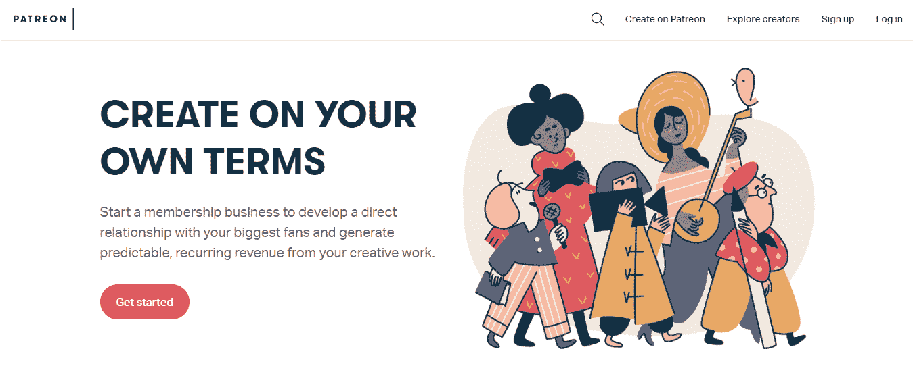

Patreon

Patreon 是一个平台，允许粉丝通过每月捐款来支持他们喜欢的在线创作者。

依赖捐款可能看起来不是一个好的商业想法，但是如果你建立了足够多的观众，它会非常有效。

例如，[Easy alliances](https://www.patreon.com/EasyAllies)团队主要创建视频游戏流和节目，拥有 9000 多名顾客，在撰写本文时每月收入 50656 美元。

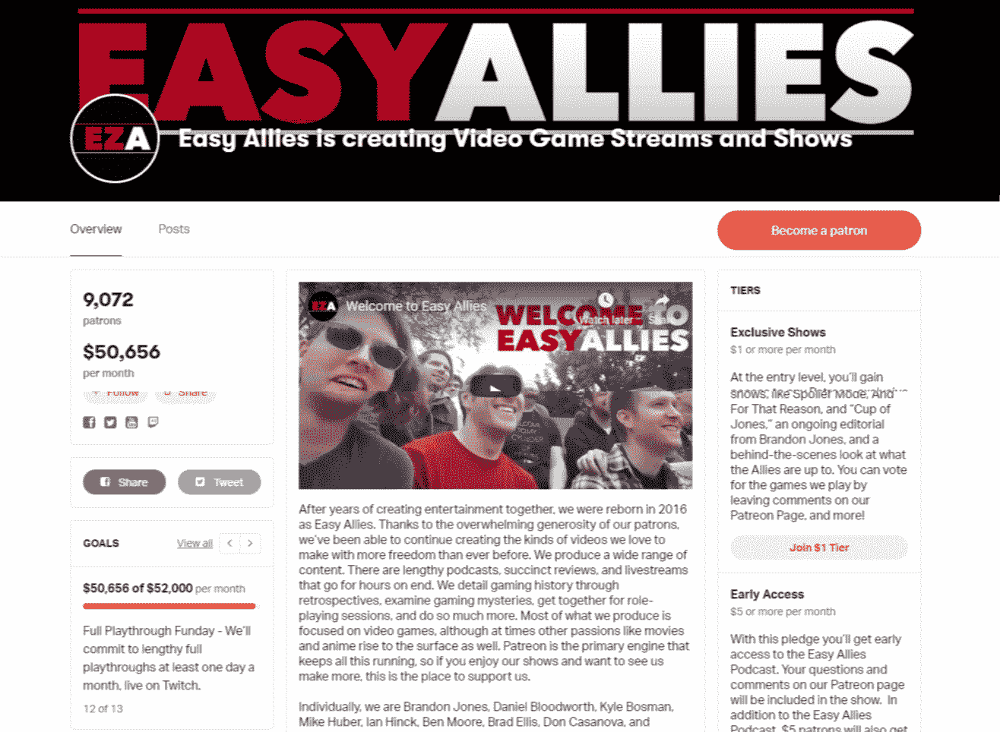

Easy Allies on Patreon

与此同时，真正的犯罪痴迷播客有 9200 多名顾客:

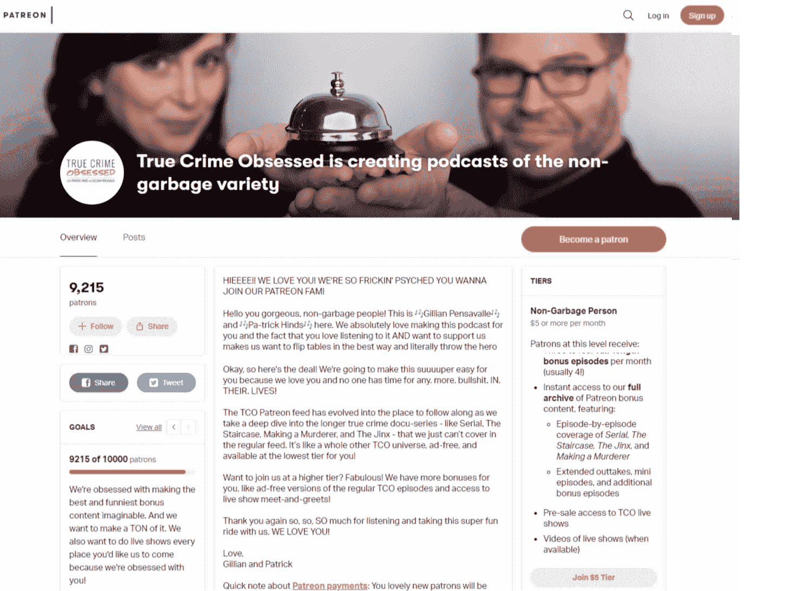

True Crime Obsessed podcast on Patreon

左倾记者劳里·佩妮有 640 多名赞助人，在写作时每月收入 3848 美元。

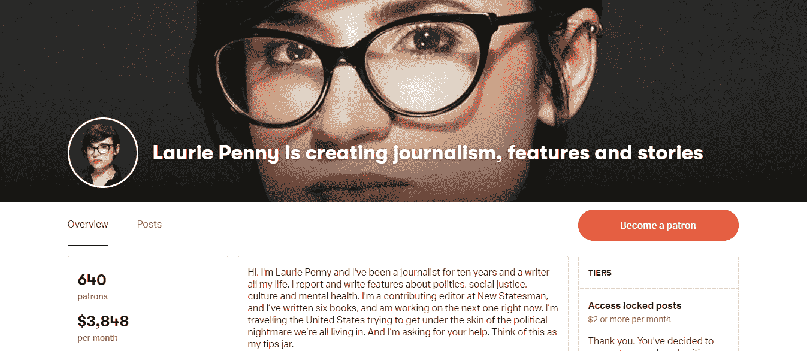

Laurie Penny on Patreon

如您所见，文字、音频和视频内容可以通过 Patreon 实现货币化，并转化为持续的收入流。

例如，公共知识分子山姆·哈里斯在他的网站上有一个订阅系统，允许粉丝通过每月捐款直接支持他，并获得相关的额外津贴。

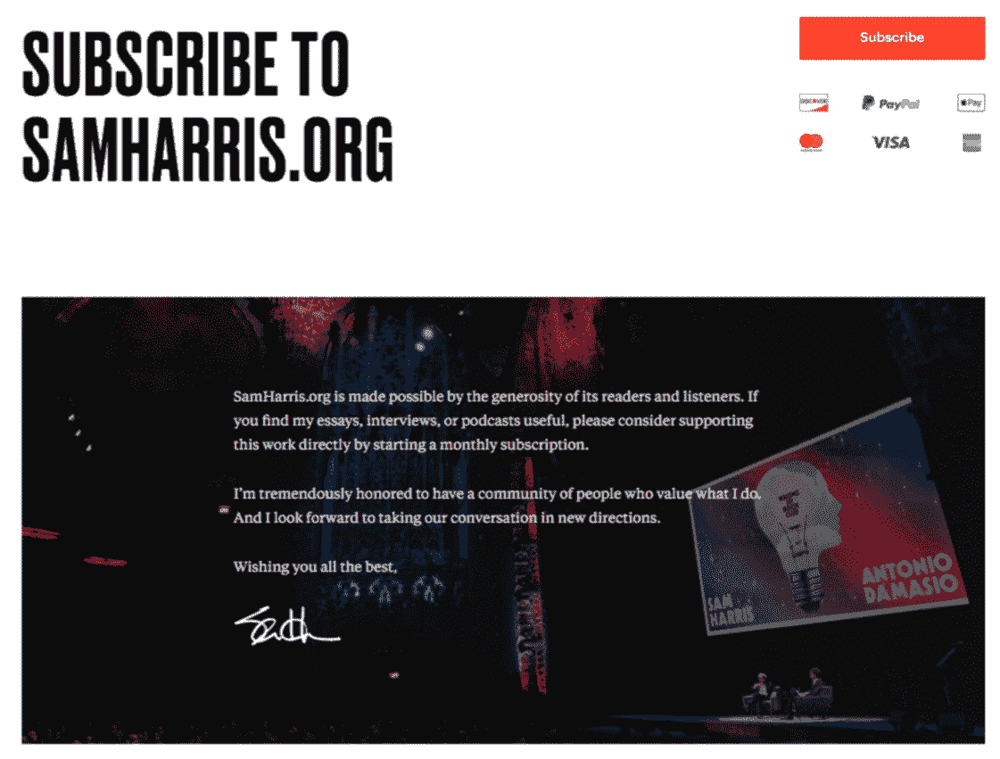

Sam Harris’ website

然而，开发自己的订阅系统是一项资源密集型任务，因此对于刚刚起步的创作者来说是不可行的。

然而，捐赠并不是将你的内容货币化的唯一途径。还有一种选择是将你的内容放在付费墙后面，并收取每月订阅费(而不是要求每月捐赠，同时让人们在不捐赠的情况下消费你的内容)。

然而，这很难实现，因为我们都习惯了免费的文章、播客和视频，所以让人们付费访问可能会比你想象的更具挑战性。

不过，这是有可能的。例如，Brian Krogsgard，[Post Status](https://poststatus.com)的创始人，为 WordPress 专业人士创建了一个成功的 Post Status 会员俱乐部，费用为 99 美元/年。

但是，请记住，会员俱乐部会员不仅可以访问独家内容，还可以访问专业社区和会员专属交易。

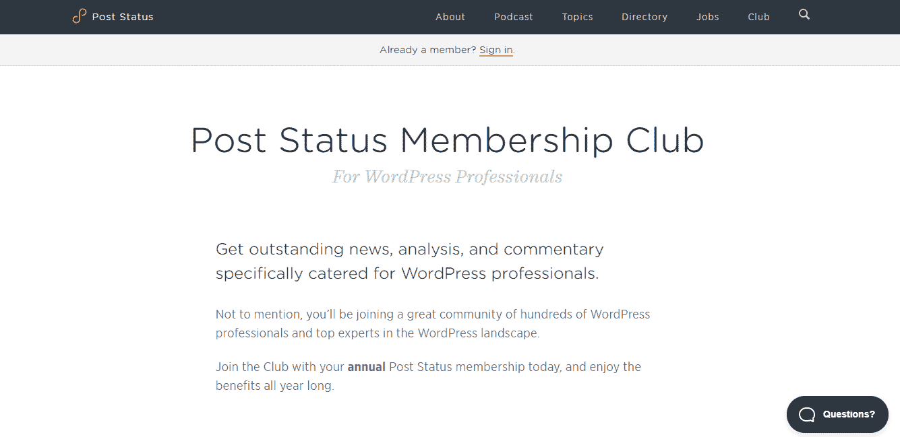

Post Status Membership

此外，当谈到内容货币化时，重要的是要明白竞争是疯狂的。

例如，如果你想在 Youtube 上创建政治内容，你的观点是什么并不重要。有很多频道从相同的角度讨论相同的问题，你的目标受众已经有了比他们有时间消费的更有趣的内容。

这适用于任何事情，无论你想写关于社会公正的文章，创建一个科学播客，流式视频游戏，还是你能想到的任何事情。

确保你有一个计划，如果你决定建立一个基于内容的经常性收入业务，你将如何脱颖而出，抓住你的目标受众的注意力。

此外，请记住，虽然通过内容获得六位数的收入肯定是可能的，但要建立一个基于内容的七位数业务却是极不可能的。

所以问问你自己你想要什么。是舒适灵活的生活方式还是成为千万富翁？

如果是后者，那么如果你建立软件、实体产品或产品化服务业务，你的机会会高得多。

只要明白，野心越高，那野心的代价就越高，失败的风险也一样。

### 经常性收入商业模式的第二个想法:软件

创造软件产品比创造内容要昂贵得多，但它们也有潜力产生更多的钱。

此外，与通常与个人品牌相关的内容不同，你最终可以以每月 20-40 倍的收入出售软件业务。

开始使用 SaaS(软件即服务)产品最直接的方式是[引导](https://kinsta.com/blog/bootstrapping-startup/)它们，这意味着你自己创造一个产品，而不需要任何外部投资。务必阅读:[SaaS 营销的 7 个关键原则](https://kinsta.com/blog/saas-marketing/)。

为此，你需要要么能够自己开发产品，要么有钱雇一个开发者为你开发。

即使你认为你有一个伟大的想法，雇佣一个开发者也是有风险的，因为你会把你的积蓄投入到一个很有可能失败的东西上(这不是针对你个人的，这适用于任何 SaaS 的产品，尤其是那些由第一次创业的人推出的产品)。

这就是为什么如果你发现自举很有吸引力，但不知道如何编码，你可能会想考虑学习它并成为一名独立黑客(一名独立企业家自举软件产品)。

现在，作为一名独立黑客取得成功似乎是不可能的，因为你要与资金雄厚的风险投资创业公司竞争。

然而，也有这样的例子，一个单独的企业家在 SaaS 建立了一个成功的企业，在同一领域击败了风险投资支持的公司。

例如，Pieter Levels 是 RemoteOK 和 NomadList 的创始人，由于他令人难以置信的成功而在独立黑客社区中享有名人地位([一年前，他作为一名独立企业家每月收入超过 5 万美元)](https://www.youtube.com/watch?v=Jxvk0E19qA0)，他在谈到与风险投资支持的 NomadList 模仿者的竞争时这样说(摘自他的书*《Make】*):

> “现在已经有大约 5 个大的 direct Nomad List 竞争对手来来去去，我们得到了 100 万到 1000 万美元的风险投资，团队由 10 到 30 人组成，他们制作了和我一样的网站。但是他们都没有去任何地方。
> 
> 当我一个人穿着内衣在酒店的床边拿着我的 MacBook 和咖啡工作时，我能够在旧金山的一个办公室里用 Aeron 椅、oakwood 会议桌、价值 2 万美元的浓缩咖啡机、豆袋和乒乓球桌击败由 30 多人组成的百万美元风投资助的团队。
> 
> 这是我们生活的时代中非常酷的一件事。这是一场相当公平的比赛。你只需要比别人做得更好，就会得到回报。"

此外，没有人说你应该从不知道如何直接编码到建立一个七位数的 SaaS 业务。事实上，如果你以前从未构建过软件产品，那么最好从小处着手。你的目标应该是创造一些可以一次性以 5 美元的价格出售的东西。仅此而已。

你会从中赚很多钱吗？不会。但是你会学习，随着你在软件产品运输方面获得更多的经验，你将获得作为独立黑客推出一个成功的 SaaS 产品所需的编码、设计和营销技能。

## 注册订阅时事通讯

### 想知道我们是怎么让流量增长超过 1000%的吗？

加入 20，000 多名获得我们每周时事通讯和内部消息的人的行列吧！

[Subscribe Now](#newsletter)

例如，Andrey Azimov 受到 Pieter Levels 的启发，学会了编码，开发了几个应用程序……然后决定辞去工作，全职从事独立黑客工作。

他给了自己一年的时间从自己的软件产品中获得每月 1000 美元的经常性收入。这是在 2018 年 3 月，所以一年过去了。怎么样了？

安德烈发布了一系列小型产品，收购了他的 Macbook Alarm 应用程序，并被任命为 Product Hunt 的年度制造商。他没能及时实现每月 1000 美元的经常性收入，但两个月后，也就是 2019 年 5 月[，他实现了收入目标。](https://medium.com/@AndreyAzimov/hardcore-year-is-done-my-journey-from-quitting-my-job-to-building-7-apps-and-1-000-mrr-3a3d2aa69b63)

你可以通过观看 Pieter Levels 的演讲来了解更多关于独立黑客的知识，他称之为他一生中最重要的演讲:

Pieter Levels 还写了一本关于独立黑客的书，名为[*【Make】*](https://makebook.io)，他在书中讲述了他所知道的关于自举的一切。

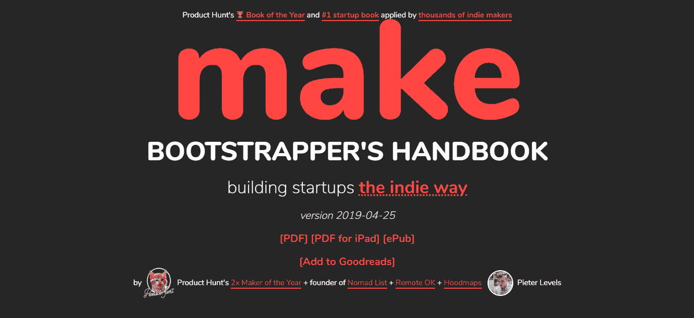

Pieter Level’s “Make”

如果你想要一个支持性的独立黑客社区(包括有抱负的和现实中的),可以去看看独立黑客论坛。

你可能还会喜欢独立黑客播客，其中科特兰·艾伦采访了成功的创业者。

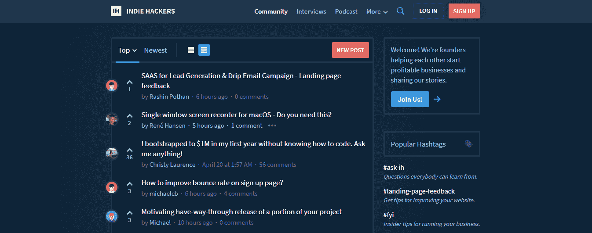

Indie Hackers

当然，成为一名独立创业者并不是唯一可行的途径，用自己的钱投资企业会有回报，但你需要小心谨慎。

例如，电子邮件营销软件公司 ConvertKit 的创始人内森·巴里(Nathan Barry)将他的一切都投入到了他的初创公司中。

2012 年，他宣布了网络应用挑战赛，目标是从零开始打造一款 SaaS 产品，并在六个月内实现每月 5000 美元的经常性收入，同时每周工作时间不超过 20 小时，并且只给自己 5000 美元的启动资金。

六个月后，在 2013 年 6 月 1 日，他有了一个名为 ConvertKit 的应用程序，每月产生 2480 美元的经常性收入，所以尽管从技术上来说他没有通过挑战，但他仍然认为这是一个巨大的成功。

他继续将 ConvertKit 作为一个副业项目，但当每月经常性收入在 2014 年 10 月下降到 1207 美元时，他意识到这种方法不起作用了。

他想起了 2014 年 4 月朋友给他的建议。Hiten Shah 告诉他要么全职专注于 ConvertKit，要么干脆放弃。于是在 2014 年 10 月，他决定全押。

2015 年 1 月 1 日，Nathan 向 ConvertKit 投资了 5 万美元，并聘请了一名全职开发人员:

> “做这样的投资很难。我们刚刚购买并装修了一所房子，所以当时我们并没有很多额外的现金…事实上，那 50k 是我的最后一点钱，之后就没有钱了。因此，投资 ConvertKit 是一件大事，"

他冒的风险得到了回报，现在他拥有了一家每月收入超过 130 万美元的公司。

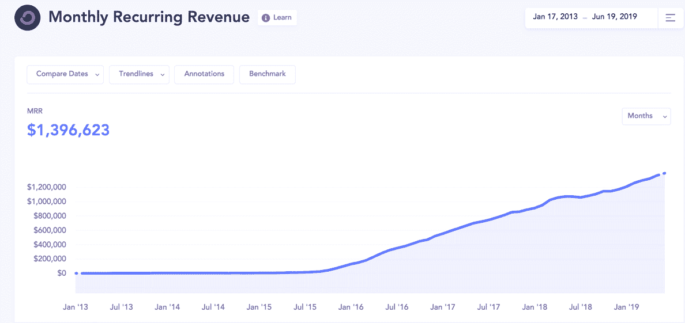

Convertkit’s Monthly Recurring Revenue

然而，重要的是要明白，当 Nathan 冒这个风险时，他已经有了一个很好的企业家记录(在 ConvertKit 之前，他已经通过应用程序和书籍赚了相当多的钱)和一个产生收入的产品。

当你有了业绩记录、有利可图的产品和将业务提升到下一个水平所需的技能时，大胆地去尝试，这与在没有成功记录的情况下，把所有的钱都押在一个未经证实的想法上是完全不同的。前者合理，后者愚蠢。

例如，Anchor Hosting 的创始人奥斯汀·金德(Austin Ginder)通过转售 Kinsta Hosting 每月赚了近 2 万美元。

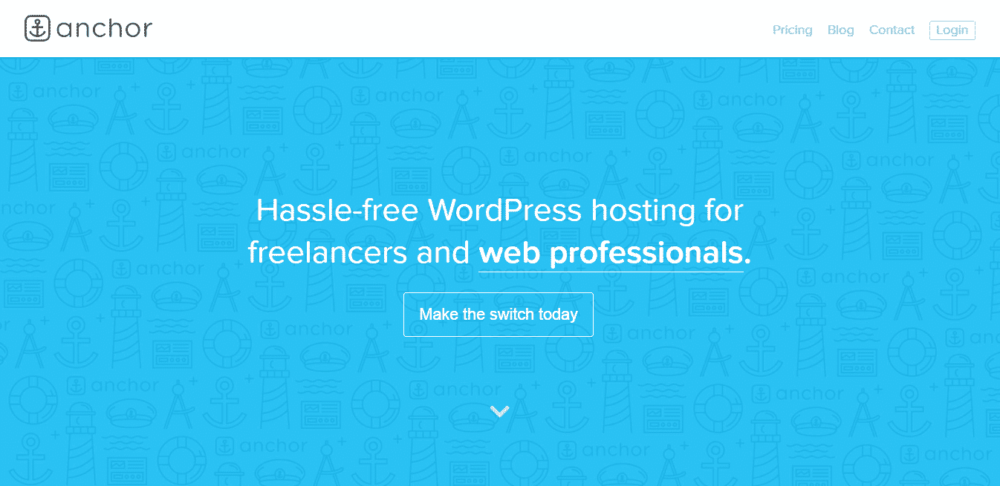

Austin Ginder, founder of Anchor Hosting

他通过在兼职开发 WordPress 业务的同时从事技术工作，然后全职从事开发业务，然后慢慢从全职开发过渡到全职托管，从而达到了现在的位置。

厌倦了慢热的主持人？Kinsta 的设计考虑了速度和性能。[查看我们的计划](https://kinsta.com/plans/?in-article-cta)

他不需要将一生的积蓄投资到自己的企业中，也不需要筹集资金，因为他都是逐步完成的。另外，他还选择了一个伟大的商业模式，他的托管业务是有利可图的，因为第二个客户！奥斯汀在接受独立黑客采访时解释道:

> 诀窍是在通过一份全职工作或其他咨询服务获得报酬的同时，慢慢适应事情。从我宣布主播主持，到我被网络主持完全持续，这是三年的时间。”

这种冷静而有分寸的方法并不像“有一天我醒来，有了一个商业想法，然后辞职去追求它”那样浪漫，但这是着手创业的负责任的方式，尤其是如果你有财务义务的话。

所以别傻了。仅在以下情况下投资自己的资金:

*   这不是你第一次表演了。
*   你已经验证了你的想法，没有比收入更好的验证了。
*   你信任你的产品、营销和销售技巧。

最后，还有为你的 SaaS 产品寻求资金的选择，但是这非常难得到。尤其是当你只有一个想法的时候。最好先专注于打造一个能盈利的产品，有需要再寻求投资。你知道吗？仔细考虑一下。筹集资本并不像你想象的那么迷人，因为这些钱是有附加条件的。

SaaS 业务可能是你能建立的最有利可图的业务类型，因为与实物产品业务和产品化服务业务相比，维护成本相对较低，出售时你能获得的倍数较高。

### 经常性收入商业模式的第三个想法:实物产品

在所有四种类型的产品中，按月或按年收费销售实物产品是最难实现的。

与内容和软件相比，利润率要低得多，因为你需要制造产品、包装产品、储存产品、运输产品等等。

这也需要更多的启动资金，因为你不能只靠自己创造产品。

然而，建立一个实体产品订阅业务肯定是可能的，所以如果你对电子商务感兴趣，你可能要考虑这条路线。

事实上，在他的书*中，Tanner Larsson 认为经常性收入应该是你的电子商务业务的核心。*

 *> 大多数电子商务企业没有利用经常性收入，因为他们不认为自己是订阅业务。相反，他们专注于一次性销售。在我与数以千计的学生、辅导客户和策划成员打交道的多年经验中，我已经了解到，这种方法是 ***有缺陷的，最终对你的业务是致命的*** *。*

他说，如果你的企业没有某种形式的经常性收入，那么是时候改变了，否则你将难以维持下去。

拉尔森警告称，你应该预料到短期的成长阵痛，但他表示，一旦经常性收入成为你业务的核心，你就会想，如果没有它，你的公司是如何生存的。

> “你的公司会稳定下来，现金流会改善，利润会增长，你的业务压力也会小很多。这对可持续发展的企业至关重要。”

MeUndies 是一家销售内衣的电子商务公司，是实体产品经常性收入业务的一个很好的例子。

例如，如果你想买平角裤，你可以花 24 美元买一条*或者*你可以每月花 16 美元订阅，这样你每个月就能以 33%的折扣买到一条平角裤。

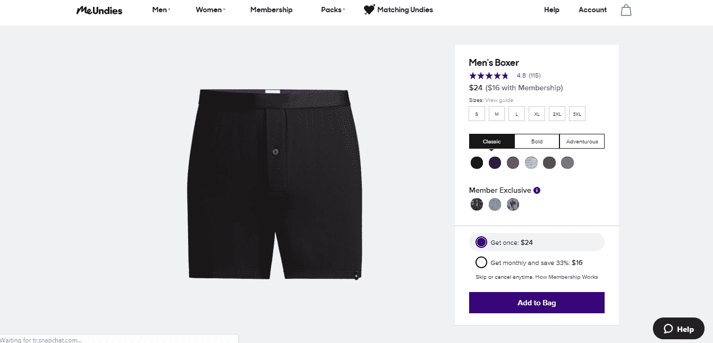

Meundies.com

如果你对电子商务感兴趣，你应该围绕经常性收入开展业务，同时为客户提供一次性购买的选择。

然而，在涉足实体产品之前，你真的应该好好想想，因为销售实体产品远不如销售软件或服务利润丰厚。

只有当你对某个产品充满热情，或者你觉得无论出于什么原因，销售软件或服务都不适合你时，才进入电子商务领域。

### 经常性收入商业模式的想法 4:产品化服务

您可以使用产品化服务模式，通过销售服务来产生经常性收入。

例如， [Design Pickle](https://designpickle.com/) 是最成功的产品化服务公司之一。

2018 年是他们开业的第四年，[他们的年度经常性收入有望达到 1000 万美元](https://databox.com/design-pickle-ground-up)。

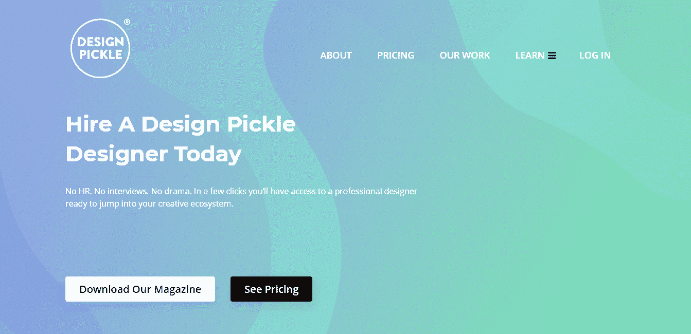

Designpickle.com

他们以 399 美元/月(基本计划)或 995 美元/月(专业计划)的价格出售无限请求和无限修改的无限图形设计。

对于经常需要传单、海报、脸书广告、YouTube 缩略图等平面设计的人来说，这是一笔不可思议的交易。

您可以使用相同的商业模式:

*   确定定期需要的服务(技术支持、内容创作、付费广告等)。).

*   通过将提供服务的整个过程系统化，使其产品化。

*   收取月租费。

重要的是要明白，为了将服务产品化，你需要创造一个明确的“要么接受，要么放弃”的提议。

设计泡菜提供无限的平面设计，每月收费，没有别的。

正如他们在定价页面上解释的那样:

> “我们的服务范围很广，但目前主要是平面设计。如果你需要动画、文案或一杯拿铁咖啡，很不幸，我们会缺少。

不要屈服于诱惑，满足随机的客户要求，只是为了赚一些额外的钱。从长远来看，这只会阻碍你的成长。不要什么都懂，什么都不懂。

发现问题，提出解决问题的方案，然后专注于扩大你的业务。

## 一次性销售比经常性收入更容易

记住，让别人一次付给你 10 美元比让他们每个月付给你 7 美元要容易得多。

这意味着，如果你之前专注于一次性销售，并决定转向经常性收入模式，那么你可能需要进行相当大的调整。

一旦你经历了这种调整，你会发现虽然短期内很难实现销售，但从长期来看，建立一个可持续发展的企业还是比较容易的。

## 摘要

在一次性销售的基础上建立一个成功的企业绝对是可能的，但这不是最好的选择。

因此，如果你想自己创业，从四种产品中选择一种适合循环收入模式的产品，并努力去做。

如果你有一家专注于一次性销售的企业，想办法增加经常性收入。

是的，让经常性收入模式发挥作用并不容易，但一旦你做到了，你会很高兴你选择了这条路。

* * *

让你所有的[应用程序](https://kinsta.com/application-hosting/)、[数据库](https://kinsta.com/database-hosting/)和 [WordPress 网站](https://kinsta.com/wordpress-hosting/)在线并在一个屋檐下。我们功能丰富的高性能云平台包括:

*   在 MyKinsta 仪表盘中轻松设置和管理
*   24/7 专家支持
*   最好的谷歌云平台硬件和网络，由 Kubernetes 提供最大的可扩展性
*   面向速度和安全性的企业级 Cloudflare 集成
*   全球受众覆盖全球多达 35 个数据中心和 275 多个 pop

在第一个月使用托管的[应用程序或托管](https://kinsta.com/application-hosting/)的[数据库，您可以享受 20 美元的优惠，亲自测试一下。探索我们的](https://kinsta.com/database-hosting/)[计划](https://kinsta.com/plans/)或[与销售人员交谈](https://kinsta.com/contact-us/)以找到最适合您的方式。*