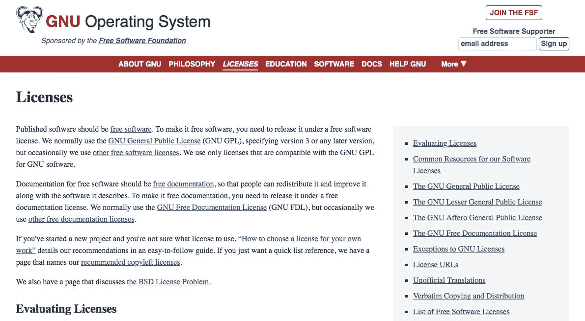
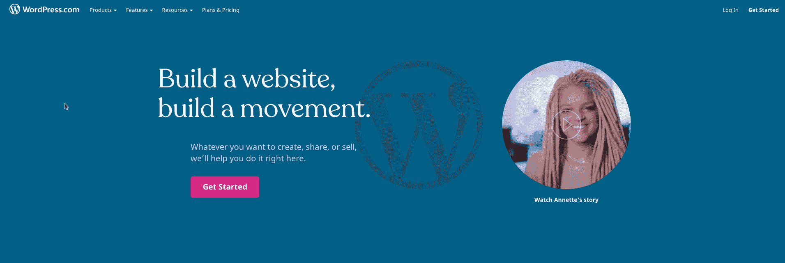
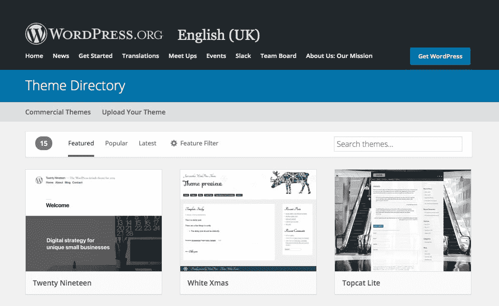
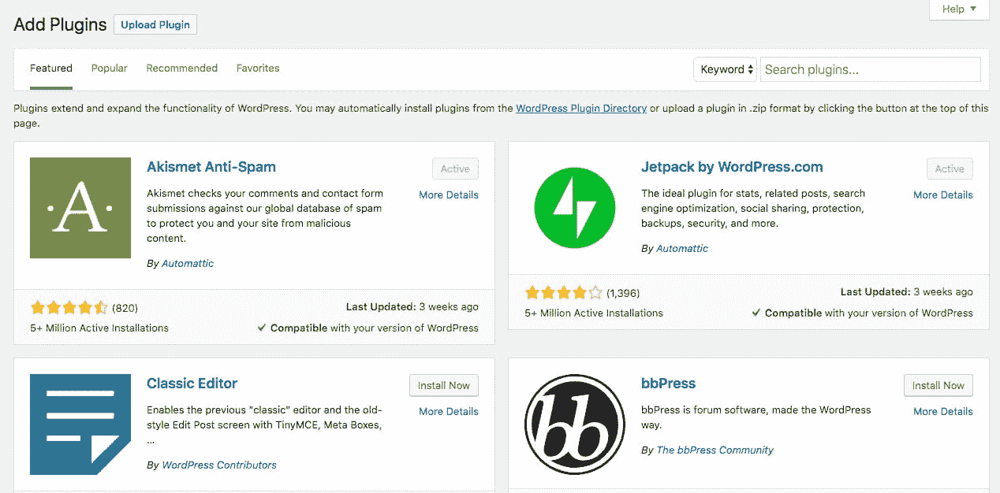

# WordPress 是免费的吗？这是独家新闻

> 原文：<https://kinsta.com/blog/is-wordpress-free/>

[WordPress](https://kinsta.com/knowledgebase/what-is-wordpress/) 能让人困惑的一个方面就是**WordPress 是否免费**。

答案可能很复杂，这可能是人们感到困惑的原因。一个 WordPress 网站可以是免费的，也可以附加一些费用(比如 [WordPress 插件](https://kinsta.com/best-wordpress-plugins/)和 [WordPress 主题](https://kinsta.com/best-wordpress-themes/))。但是 WordPress 软件本身——被称为 WordPress 核心——是免费的，并且将永远免费。这不仅仅是关于[WordPress](https://kinsta.com/blog/wordpress-website-cost/)的财务成本:从某种意义上来说，它也是免费的，你可以随意修改、扩展和使用它。

## WordPress 是免费的吗？需要了解的要点:

WordPress 是在 GNU 通用公共许可证(GPL)下发布的，这意味着任何人都可以下载、编辑、定制、使用甚至出售代码，只要他们在 GPL 许可证下发布。

软件本身是免费的，但你最终可能要为以下项目付费:

*   主办；主持
*   高级支持
*   高级插件/主题的更新
*   高级主题
*   高级插件

Support

在这篇文章中，我将揭开这些问题的神秘面纱:

*   WordPress 真的免费吗？
*   为什么 WordPress 是免费的？
*   WordPress 的哪些方面不是免费的？

我将解释免费的两种含义，我将指出你可以免费获得 WordPress 网站的主要情况，以及你可以选择免费获得和付费获得的 WordPress 的具体方面。

所以，让我们开始吧！

## 免费应用于 WordPress 的两层含义

在我们看 WordPress 是否免费之前，理解免费这个词的两个意思是有帮助的。

> Kinsta 把我宠坏了，所以我现在要求每个供应商都提供这样的服务。我们还试图通过我们的 SaaS 工具支持达到这一水平。
> 
> <footer class="wp-block-kinsta-client-quote__footer">
> 
> 
> 
> <cite class="wp-block-kinsta-client-quote__cite">Suganthan Mohanadasan from @Suganthanmn</cite></footer>

[View plans](https://kinsta.com/plans/)

这些有时被称为“啤酒中的自由”和“演讲中的自由”。

当大多数人问 WordPress 是否免费时，他们想到的第一个意思是金钱上的:免费就像啤酒一样。一杯啤酒在金钱上是免费的，意味着它不会花你一毛钱。不过，它永远不会像言论一样自由。

自由的第二个含义是言论自由。换句话说，如果你有一个 WordPress 软件的拷贝，你可以不受限制地随意使用它吗？这个问题的答案是肯定的“是！”你马上就会看到。

所以让我们更深入地看看 WordPress 免费的方式。

### 像在演讲中一样自由

WordPress 软件在两种意义上都是免费的。你可以免费下载一份 WordPress，一旦你有了它，你可以随意使用或修改。

该软件是在 GNU 通用公共许可证(GPL)下发布的，这意味着它不仅可以免费下载，还可以自由编辑、定制和使用。这是一个被称为[开源](https://en.wikipedia.org/wiki/Open_source)的软件模型。

该许可证的主要特点可以总结如下:

*   你可以不受限制地以任何你喜欢的方式使用 WordPress。
*   你可以不受限制地在 WordPress 中自定义、添加或删除任何东西。
*   你可以无限制地重新包装、重新命名、销售和发布 WordPress，除非它也是在 GPL 许可下发布的。

第三点很重要。这意味着你可以使用 WordPress，修改它，重新包装它，并出售给其他人获利，只要你也申请 GPL 许可。换句话说，你的客户可以为代码付费，但是你必须给他们访问代码的权限，这样他们才能自己修改代码。

我知道，对于习惯于与非开源软件公司打交道的人来说，这可能会令人震惊。但这是真的！

所以你可以下载 WordPress 并修改代码，让它以不同的方式工作。事实上，WordPress 的起步很像这样，在 2003 年，马特·莫楞威格和迈克·利特尔采用了另一个叫做 b2/cafelog 的开源博客系统，并对其进行了改造。他们建立的变成了 WordPress:最初是另一个[博客平台](https://kinsta.com/blog/best-blogging-platform/)，但是多年来它已经发展成为一个内容管理系统，用于所有[类型的网站](https://kinsta.com/blog/wordpress-enterprise/)。

就算你能[编辑 WordPress](https://kinsta.com/knowledgebase/edit-wordpress-code/) 的核心代码，也不是什么好主意。如果你想定制 WordPress，最佳实践告诉你将你的定制“打包”到一个新的插件中，或者使用一个已经可用的插件。这意味着当你更新你的 WordPress 版本时，你的定制不会丢失，因为它们存储在你插件的文件中。

正如我们将会看到的，有些插件是免费的，比如在 beer 中，有些不是:但它们都是免费的，比如在 speech 中。

### 像啤酒一样免费

WordPress 现在是而且将继续是免费的，因为它不归一家公司所有。相反，它归非营利的 WordPress 基金会所有，成立该基金会是为了“确保永久免费使用我们支持的软件项目”。它的使命是为下一代提供一个稳定的代码库，并[教育人们](https://kinsta.com/blog/learn-wordpress/)关于 WordPress 和相关的开源软件。WordPress 基金会并没有从开发或分发 WordPress 中获得任何利润:这都是自愿的工作。

WordPress 有[成千上万的插件](https://kinsta.com/best-wordpress-plugins/)，有些是免费的，有些是你必须付费的，但是它们都像在 speech 中一样是免费的。如果你下载或购买一个插件，你可以自由地修改、改编和出售代码，就像你使用 WordPress core 一样，只要你在 GPL 许可下发布它们。最好的方法是编写另一个插件来扩展原来的插件，但是有很多这样的例子，人们用一个插件编写一个基于它的新插件。因为这是开源软件，这是允许的。

GNU operating system

所以这里有一个想法:WordPress，插件和主题都是开源的，在 GPL 许可下发布。你可以自由地使用和适应它们。但是当涉及到你的 WordPress 网站的财务方面时，事情就有点复杂了。

该软件本身是免费的，但如果你想运营一个网站，你需要[服务器空间来托管它](https://kinsta.com/knowledgebase/wordpress-hosting-plans/)。除非你有自己的服务器(以及使用它们托管网站的技能)，否则这意味着要为托管付费。像 Kinsta 这样的[主机提供商会在他们的服务器上出租空间给你，让你用来托管你的 WordPress 站点。他们并不拥有你的网站:它仍然是你的，你可以随时编辑、定制或移动它。](https://kinsta.com/features/)

管理服务器和提供主机服务需要成本:包括物理基础设施和支持需求。但是，它不会花费你太多，当然不会比网站建设者提供少得多的灵活性。

## 那么 WordPress 是怎么资助的呢？

了解到 WordPress 是由一个非盈利基金会运营的，并且有数百名开发者免费为其贡献代码库，你可能想知道这怎么可能发生。

毕竟，托管 WordPress.org 网站本身是要花钱的。运行使大型团队能够在 WordPress 上协作的基础设施是要花钱的。人们参与进来需要时间。

事实是，数以千计的公司、开发者和爱好者从 WordPress 中受益。他们认识到，没有像他们这样的人的支持，WordPress 就不会存在，他们也不会拥有这个让他们赖以谋生的令人敬畏的软件。这就是为什么他们选择回馈 [WordPress 社区](https://kinsta.com/learn/wordpress-communities/):通过贡献代码库，[通过 WordPress 支持论坛](https://kinsta.com/blog/wordpress-support/)提供支持，或者举办像 WordPress 夏令营和当地 WordPress 聚会这样的活动。

## 如何免费获得 WordPress 网站

有一种方法可以免费获得 WordPress，那就是如果你注册了一个免费的[WordPress.com 计划](http://wordpress.com/)。WordPress.com 归一家私人公司 Automattic 所有:他们在自己的服务器上托管着数百万个网站，如果你注册了一个免费计划，你就可以免费得到一个。

WordPress.com

尽管如此，还是有一些限制。你的免费 WordPress.com 网站像啤酒一样免费，但不像言论一样免费。你无权访问代码，你只能使用有限的主题，也无权访问插件。你将不能使用[你自己的域名](https://kinsta.com/blog/choose-domain-name/)，你的网站上将会出现你无法控制的广告(这是它的一种资助方式)。

对于一些用户来说，这不是问题，他们很乐意使用 WordPress.com 来支持一个博客爱好，甚至是一个 T2 的作品集网站。但是如果你想要一个专业的网站，你需要更多的东西。

推荐阅读: [12 个展示你作品的最佳 WordPress 作品集插件选项](https://kinsta.com/blog/wordpress-portfolio-plugins/)。

或者，你可以注册一个高级 WordPress.com 计划:这给了你使用自己的域名和额外功能的能力。尽管如此，你还是无法获得密码。如果你注册了 WordPress.com 计划，你会得到一个在这两方面都免费的网站。你在为它付费，你没有太多的自由去修改它。你可能会发现你的月费比你托管一个自托管网站的费用还要多。

这就是为什么我经常建议获得一个自托管的 WordPress 站点，并单独支付托管费用。

### 为什么值得为 WordPress 托管付费

如果你决定给自己弄一个自托管的 WordPress 网站，或者[从你的免费 WordPress 计划](https://kinsta.com/blog/wordpress-com-to-wordpress-org/)迁移到它，那么有一个关键的不同。

你不是把网站托管在 WordPress.com，而是把 WordPress 安装在从托管 WordPress 的公司租用的服务器空间上。这里的主要区别是，该网站属于你(或你的一个客户)。你去[决定运行什么主题](https://kinsta.com/blog/change-wordpress-theme/)和插件，你拥有网站和[的内容](https://kinsta.com/blog/evergreen-content/)，你可以随时移动或改变它。你可以自由选择你的网站将如何运行，你将添加什么，以及它将如何运作(在法律的范围内)。

这给了你“言论自由”意义上的自由。

自托管 WordPress 网站有财务成本，但对于任何想要一个高质量网站的人来说，收益将很容易超过任何财务支出。当你考虑到专业网站的潜在商业利益时，托管并不昂贵。一个免费的 WordPress.com 网站不会很好地反映你的品牌，也不会让你添加运行一个专业网站所需的功能。它不会给你所需要的控制。

你认为一个免费的 WordPress.com 网站对你来说已经足够了。但是当你的网站随着时间的推移而成长和发展时，它很可能无法满足你的长期需求。好消息是[从 WordPress.com 站点迁移到自托管站点](https://kinsta.com/blog/wordpress-com-to-wordpress-org/)并不困难。

## WordPress 的哪些方面是免费的？

即使你没有免费的 WordPress 站点，你的 WordPress 安装的其他方面也是免费的。有些总是免费的，而其他的如插件或主题，你可以在免费和付费选项之间选择。

免费获得某些东西听起来好得难以置信。有时候是可以的。但是为 WordPress 开发免费主题和插件的人这么做是有正当理由的:他们要么想回馈社区，要么他们有一个插件的免费版本，你可以用付费选项升级。在这种情况下，免费版充当了付费版的引子。

这并不意味着没有合法的免费 WordPress 代码来源。在这里，我将看看你可以免费获得的 WordPress 的不同方面，并帮助你在不损害网站安全和质量的情况下做到这一点。

自托管 WordPress 免费(或可能免费)的方面有:

*   核心软件
*   支持
*   主题
*   插件
*   更新

让我们依次来看一下其中的每一项。

### 自由软件

WordPress 本身是免费的。如果你正在下载 WordPress，总是从官方的 WordPress 下载页面下载。

在 Kinsta，我们提供了一个工具，你可以用它来[安装 WordPress，而不必下载代码](https://kinsta.com/help/new-site/)。像这样的自动安装程序是安全可靠的，会节省你的时间和精力。

### 免费支持

一个[高质量的主机服务提供商](https://kinsta.com/clients/)将会给你支持，作为其主机服务计划的一部分，帮助你进行主机服务、域名管理和 WordPress 安装。

## 注册订阅时事通讯

### 想知道我们是怎么让流量增长超过 1000%的吗？

加入 20，000 多名获得我们每周时事通讯和内部消息的人的行列吧！

[Subscribe Now](#newsletter)

如果你需要 WordPress 其他方面的帮助，比如学习如何管理你的网站，编写你自己的插件，以及[修复你的主题或插件的问题](https://kinsta.com/blog/wordpress-maintenance-mode/)，你需要找到[WordPress 支持的其他来源](https://kinsta.com/blog/wordpress-support/)。

值得重复的是:免费的支持是由志愿者、回馈社区的 WordPress 专家或雇主给他们时间在支持论坛工作的人提供的。因为你没有为这种支持付费，所以你应该相应地降低你的期望值，不要期望立即得到答复。

### 免费主题

通过 [WordPress 主题目录](https://wordpress.org/themes/browse/featured/)有数以千计的免费主题。

WordPress theme directory

这些是由各种各样的开发者创建的，包括商业主题开发者、志愿者和 WordPress.com 团队。它们在上市前都经过了严格的测试，因此您可以确信它们是编码良好、可靠和安全的。

目录是你唯一可以安全下载免费主题的地方。你可以直接从那里下载，或者通过你网站管理的**主题**页面[安装。](https://kinsta.com/blog/how-to-install-a-wordpress-theme/)

[不要从其他来源下载免费主题](https://kinsta.com/blog/nulled-wordpress-plugins-themes/)！如果主题是健壮和安全的，开发者应该通过官方目录发布它。如果没有，那么您可能会面临在您的站点中安装包含垃圾甚至恶意代码的主题的风险。

### 免费插件

和主题一样，插件目录中有数千个免费的 WordPress 插件。这些插件既有向你的网站或仪表盘添加几行代码的小插件，也有庞大复杂的插件，比如向你的网站添加全功能商店的 WooCommerce。

你可能想知道为什么人们会花时间开发一个插件，然后免费提供。这是个好问题。免费插件的开发者通常属于以下三类之一:

*   他们是 WordPress 的狂热爱好者，想要分享他们的代码并回馈社区。
*   他们是建立了一个插件供他们的客户使用的机构，并且希望其他人从代码中受益(也可能得到一些宣传)。
*   他们是专业的插件供应商，他们开发了一个插件的免费版本，期望使用它的一部分人会升级到高级版本或购买附加组件。

这意味着人们创建免费插件，因为它可以盈利，或者它可以出于更利他的原因。但是和主题一样，如果一个插件是免费提供的，那么它被包含在 WordPress 插件目录中就意味着它已经过测试，并且很可能是安全可靠的。你不能保证所有的插件都这样，因为它们可能会受到更新的影响，但是一个好的插件开发者会更新他们的插件，以确保它与最新的 WordPress 版本兼容。当你安装一个插件时，你会被告知它上次更新的时间，以及它是否与你的 WordPress 版本兼容。

Plugin compatibility

### 免费更新

更新 WordPress 核心是免费的。您的管理屏幕包括一个更新屏幕，每当有新版本发布时，您都可以使用它来更新软件。

首先在你的站点的一个临时版本上运行更新是一个好主意。Kinsta 的托管计划包括一个对外界不可见的你的站点的暂存副本。如果更新引起了问题(可能是因为与你的插件不兼容)，你可以选择不更新你的站点，直到插件被更新或者停用插件。

免费更新将适用于 WordPress 核心和免费主题和插件。能否免费更新高级主题或插件将取决于收费模式。一些主题/插件需要你支付年费，只有在更新的情况下你才能更新。其他人向你收取一次终身访问的费用，这样你就可以永远更新主题/插件，而无需支付更多费用。

## WordPress 不免费的方面

WordPress 的很多方面都是免费的，这是这个平台的美妙之处之一。WordPress 的新用户经常对这样一个高质量、有用的软件可以免费感到困惑。如果你习惯于从微软或 Adobe 这样的公司购买软件，这些公司会向你收取很高的更新或订阅费用，这可能看起来很奇怪。但是作为开源软件，WordPress core 永远是免费的。

然而，这并不意味着运行一个专业的 WordPress 网站是免费的。它的价格将取决于你的网站的需求，以及你是否乐意为一个高级插件的便利性付费，例如，当一个免费的插件可能做同样或类似的工作，只需要多做一点工作。

你可能需要花钱的 WordPress 方面有:

厌倦了处理缓慢的 WordPress 托管和糟糕的支持？在金斯塔你不会有这些问题。[查看我们的托管计划](https://kinsta.com/plans/?in-article-cta)

*   主办；主持
*   高级支持
*   高级插件/主题的更新
*   高级主题
*   高级插件

再一次，让我们依次看一下这些。

### 支付托管费用

如果你选择自主托管的 WordPress 网站，这将比 WordPress 网站给你更多的灵活性和自由，你需要支付托管服务提供商的费用。

除了让你有可能真正拥有一个自托管网站，一个好的托管包还会给你带来其他好处:

*   通过你的[主机仪表板](https://my.kinsta.com/)轻松安装 WordPress 的能力。
*   [访问 DNS 设置](https://kinsta.com/help/dns/)这样你就可以配置你的域名指向你的站点。
*   [24/7 支持](https://kinsta.com/help/wordpress-support-ticket/)。
*   [定期备份](https://kinsta.com/help/wordpress-backups/)。
*   一个保证[防黑客](https://kinsta.com/secure-wordpress-hosting/)和[停机](https://kinsta.com/help/scalable-cloud-hosting/)。
*   致力于速度，确保[您的网站尽可能快](https://kinsta.com/features/)。

在选择你的主机提供商之前，检查他们是否提供所有这些东西。选择便宜的虚拟主机很有诱惑力，但却发现你的网站运行缓慢，或者支持不如你预期的那么有帮助。如果你想要一个专业的网站，为质量付出额外的费用是值得的。

即使你在 WordPress.com，如果你从免费计划升级，**在一天结束时，你将最终为你的主机服务付费。**

如果你问我，付费托管和自由运行你自己的网站是一个更好的投资。

### 支付支持费用

你的主机提供商应该提供[支持来帮助你](https://kinsta.com/help/wordpress-support-ticket/)处理你的网站中与主机相关的方面。

如果您需要额外的支持，而免费频道对您来说还不够，那么您可以购买高级支持。有一系列的提供商将为您提供支持，作为订阅的回报。

### 为主题付费

如果你找不到符合你需求的免费主题或者你想要一个带有拖放界面的主题(通常被称为[页面生成器](https://kinsta.com/blog/wordpress-page-builders/)，那么你可以购买一个高级 WordPress 主题。

有三种主要类型的高级主题:

*   为易于使用而设计的主题，如 [Astra](https://wpastra.com/pro/) 主题。
*   为可扩展性而设计的主题，例如 [Divi](https://www.elegantthemes.com/gallery/divi/) 页面生成器主题。
*   通过 [ThemeForest](https://themeforest.net/category/wordpress) 等市场销售的独立主题。

在你为一个主题付费之前，注意检查它是否符合你的需求，并且安装在你的网站上是安全的。具体来说:

*   检查它的许可证:它是在 GPL 下发布的吗？
*   问问其他 WordPress 用户和开发者。
*   阅读提及/评论它的评论和文章
*   获取个人推荐。
*   检查是否有免费试用，退款保证，或任何冷却期。

如果主题不符合你的需求，你也不想浪费钱。

更多关于寻找优质主题的信息，请看我们的免费与优质主题指南。

### 为插件付费

除了可以从插件库中安装的免费插件，你可能会发现自己需要购买高级插件。

这很常见:有些事情高级插件比免费插件做得更好。

您可能需要为高级插件付费的情况包括:

*   当你一直在使用免费版本的插件，并意识到你需要额外的功能，由保费版本。
*   当免费插件不能给你所需要的功能或易用性时。
*   当你需要安装许多插件，这些插件都是由同一个开发者设计的，他提供了一个完全访问的订阅选项..
*   当你想通过购买额外的插件来为免费插件增加额外的功能时，比如你可以在 WooCommerce 上购买的插件。

如果你投资了正确的高级插件，它们可以节省大量的时间，并给你的网站带来显著的提升。当你决定安装一个高级插件时，你应该像对待高级主题一样谨慎。因此，您应该检查:

*   提供商是否在插件目录中也有插件(名声不好的公司不会在那里呆太久)。
*   [对提供商和插件的评论](https://kinsta.com/blog/best-wordpress-review-plugins/)。
*   这个插件是在 GPL 下发布的。
*   将提供什么类型的支持来帮助你使用插件和解决任何问题。
*   如果有退款保证。安装一个插件，意识到它不能做你需要的事情，并且浪费了你的钱，这是非常令人沮丧的。

关于高级插件的最佳信息来源总是个人推荐。与其他 WordPress 用户和开发者交流，看看 WordPress 论坛或脸书小组，在你购买之前，检查一下其他人对这个插件是否满意。

### 为更新付费

如果你安装了一个高级主题或插件，你通常会得到至少一年的免费更新和支持。由于大多数高级插件和主题都是在订阅模式下工作的，你可能需要再次付费来获得软件的更新版本，并且仍然可以获得积极的支持。

不过，也有例外:一些插件提供商只要求你为终身访问支付一次费用。

我知道，不更新你的订阅是很诱人的:毕竟，插件或主题是有效的，如果你不买最新的版本，你也不会丢失代码。但是，如果插件或主题开发了一个安全问题，并且发布了一个新的更新来解决这个问题，该怎么办呢？如果发布了新版本的 WordPress，而你的主题或插件不再工作了怎么办？你的网站——或者它的某些功能——将会崩溃。而**那是你不希望发生的事情**。永远不会。

### 为发展买单

如果你找不到任何能够满足你需求的免费或高级主题/插件，并且你没有时间或技能来编写自己的代码，那么一个选择就是[雇佣一个开发者](https://kinsta.com/blog/hire-wordpress-developer/)。

这可以从任何事情到设计和创建你的网站，到写一个插件，到定制你的 WordPress 主题。一切取决于你的具体需求、时间和预算。

WordPress 的设计是为了让你不需要雇佣专家和额外付费来获得一个伟大的网站。但如果你正在创建一个高度定制的网站，或者你正在经营一家企业，但没有时间或技能在内部完成，那么这可能是一项不错的投资。

同样，这是可选的。但是对于一些 WordPress 用户来说，这是他们选择付费的东西。
[WordPress 是 100%免费的吗？它是开源软件是什么意思？我们做了功课🤓并把这些问题的所有答案(以及更多)放在一起。看看他们！ 点击推文](https://twitter.com/intent/tweet?url=https%3A%2F%2Fkinsta.com%2Fblog%2Fis-wordpress-free%2F&via=kinsta&text=Is+WordPress+100%25+free%3F+What+does+it+mean+it%27s+an+open+source+software%3F+We+did+our+homework+%F0%9F%A4%93+and+put+together+all+the+answers+to+these+questions+%28and+more%29.+Check+them+out%21&hashtags=wordpress%2Copensource)

## 摘要

WordPress 核心软件将永远是免费的:像演讲一样免费，像啤酒一样免费。

该软件可以免费下载，并可以以任何方式免费使用。你可以定制它，扩展它，重新发布它，甚至出售它**，只要你使用 GPL 许可**。

但是如果你想要一个很棒的网站，有些东西你需要付钱。

自托管网站意味着你必须为托管付费(注意:[如果你想更换你的托管提供商，我们提供免费迁移](https://kinsta.com/wordpress-migration/))、至少一些高级插件和/或主题，以及支持。

有多少是免费的，有多少是最终要付费的，这取决于你自己。但是考虑到软件本身是免费的，WordPress 网站仍然代表着非凡的价值。而且为一个[高性能](https://kinsta.com/blog/google-cloud-hosting/)的专业网站多付一点钱也是很值得的。

建议阅读:[如何本地安装 WordPress】。](https://kinsta.com/blog/install-wordpress-locally/)

* * *

让你所有的[应用程序](https://kinsta.com/application-hosting/)、[数据库](https://kinsta.com/database-hosting/)和 [WordPress 网站](https://kinsta.com/wordpress-hosting/)在线并在一个屋檐下。我们功能丰富的高性能云平台包括:

*   在 MyKinsta 仪表盘中轻松设置和管理
*   24/7 专家支持
*   最好的谷歌云平台硬件和网络，由 Kubernetes 提供最大的可扩展性
*   面向速度和安全性的企业级 Cloudflare 集成
*   全球受众覆盖全球多达 35 个数据中心和 275 多个 pop

在第一个月使用托管的[应用程序或托管](https://kinsta.com/application-hosting/)的[数据库，您可以享受 20 美元的优惠，亲自测试一下。探索我们的](https://kinsta.com/database-hosting/)[计划](https://kinsta.com/plans/)或[与销售人员交谈](https://kinsta.com/contact-us/)以找到最适合您的方式。