# 为你的网上生意提供 4 个行之有效的网站创意

> 原文：<https://kinsta.com/blog/website-ideas/>

在亚北极风暴中，你的热水器停止工作。你的孩子需要新牙套。碧昂斯推出新专辑。你为你的宠物球蟒找到了完美的情侣套。

所有这些事件有什么共同点？你需要钱来实现它们。

进入侧滑。

## 最赚钱的兼职网站创意开始:

如果你有一个 WordPress 网站，你就有足够的机会开展一项成功的兼职业务。这些被证明是最有利可图的:

*   销售在线课程
*   创建高级会员资格
*   提供数字下载
*   运营一个联盟博客

Support

虽然在大型活动后，旁敲侧击一度被归为停车场中有问题的交易，商品略有拼写错误，但现代旁敲侧击是一种美丽的东西。它有利可图，很方便，如果你有正确的网站想法，很容易推出。

今天，我们将讨论几个可行的网站创意，你可以实施这些创意来**让侧面宣传为你服务**。我们将覆盖:

 And, we’ll take things further than that by giving you WordPress-ready recommendations for rolling out your side-hustle with no fuss and all the frills.

因此，用伟大的罗格·沃特斯的话说:“用双手抓住现金，藏起来。”

> Kinsta 把我宠坏了，所以我现在要求每个供应商都提供这样的服务。我们还试图通过我们的 SaaS 工具支持达到这一水平。
> 
> <footer class="wp-block-kinsta-client-quote__footer">
> 
> 
> 
> <cite class="wp-block-kinsta-client-quote__cite">Suganthan Mohanadasan from @Suganthanmn</cite></footer>

[View plans](https://kinsta.com/plans/)

## 每个网站创意需要什么:目标受众

不管你想做什么样的旁门左道，有一个普遍的事实你需要遵守:

如果你没有目标受众，你就没有一个可行的网站创意。

这听起来可能有点刺耳，但这是每个网站所有者都必须面对的现实，无论他们是开始一个旅游博客还是试图在 T2 推出一个新的电子商务商店。

没有确定目标受众，你就无法确定市场需求。你也不能确定你的竞争对手(这意味着脱颖而出)，找到拥有正确技能的正确的人来应对市场，或者以人们实际愿意支付的溢价为你的产品定价。

所有这些都是导致创业死亡的五大原因之一。

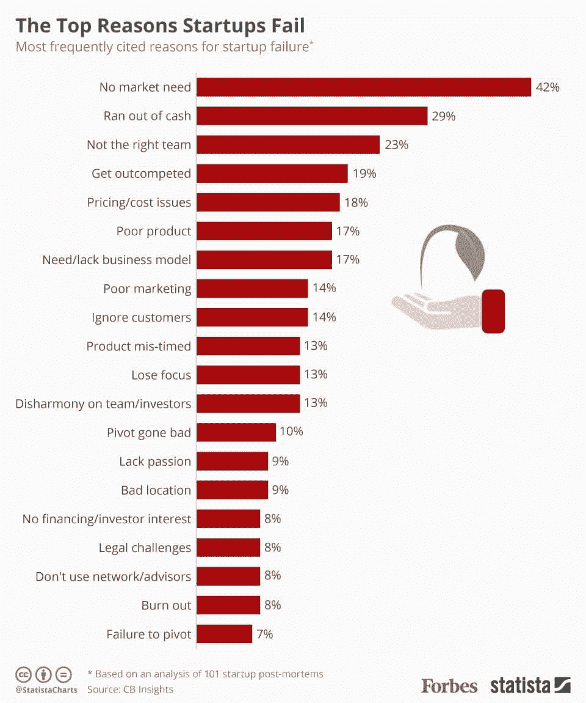

Top reasons startups fails (Image source: [Statista](https://www.statista.com/))

所以，不要让你的侧推注定要在商业解剖台上进行，要确保你正试图用你的产品击中[可识别的目标受众](https://www.socialbakers.com/blog/knowing-your-target-audience-is-key-in-content-marketing)。

如果你不这样做，你会浪费时间和金钱，而赚足够的零花钱买一杯咖啡将是一个奇迹。

那好吧。在开始你的宣传活动之前，确定一个目标受众是必须的，但是你如何开始呢？

考虑以下因素:

*   你的目标买家多大？
*   他们有家庭吗？
*   他们的收入是多少？
*   他们靠什么谋生？

然而，仅有这些人口统计数据是不够的。如果你想真正了解你的目标受众，你需要更深入:

*   痛点。他们在纠结什么？
*   欲望。他们到底想要什么？
*   语言。他们如何描述他们的痛点和他们的愿望？

请记住，找出人们真正的驱动力并不像看起来那么简单。

例如，如果你很了解健身，并且想帮助男性增肌，你需要问问自己，为什么他们首先要增肌。

归根结底，这与实力无关，而是变得更有吸引力，在人们中间获得更高的地位(或者至少他们是这么认为的)。

这意味着当[你在销售你的产品](https://kinsta.com/blog/themeforest-pros-cons/)时，你不仅需要向潜在客户保证它确实会帮助他们增肌，还需要在你的产品——增肌——和获得更高的地位之间建立联系。

如果你研究一下对增肌感兴趣的男性是如何谈论的，你可以让你的营销更加有效(你可以在 Reddit、健身论坛等网站上找到)。).

同样适用于每一个利基市场。人们说他们想“减肥”、“健身”、“赚钱”等等。但是你需要深入挖掘，找出他们真正想要的是什么。

你的目标应该是比你的潜在客户更了解他们自己。一旦你完成了你的研究，使用你所学到的知识来创建一个**客户角色**(或多个角色)。

客户角色是一个虚构的角色，代表你的目标受众(或特定的一部分)。它帮助你更清楚地思考你的业务，做出更好的决策。

你可以用纸笔以传统方式创建你的客户角色，或者你可以使用 HubSpot 的 [Make My Persona](https://www.hubspot.com/make-my-persona) 这样的客户角色生成器。

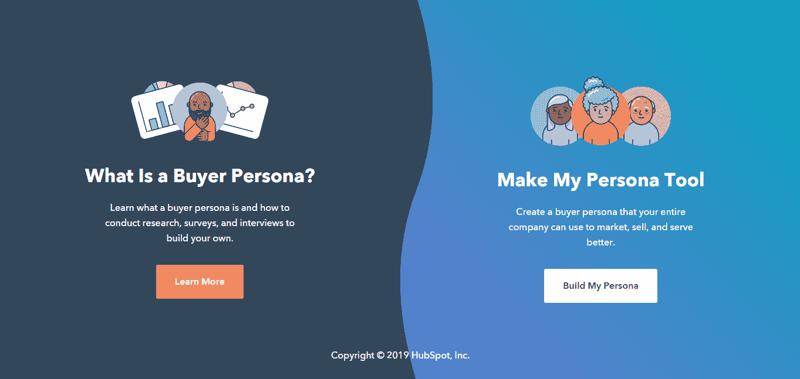

Make my persona

点击**建立我的角色**。您将经历一个多步骤的人物角色构建过程，在此过程中，您将被要求提供有关您的理想客户的信息。这将包括他们的年龄、受教育程度、工作场所细节、信息消费习惯、社交媒体习惯等等。

看看这个名为 Jane 的客户角色:

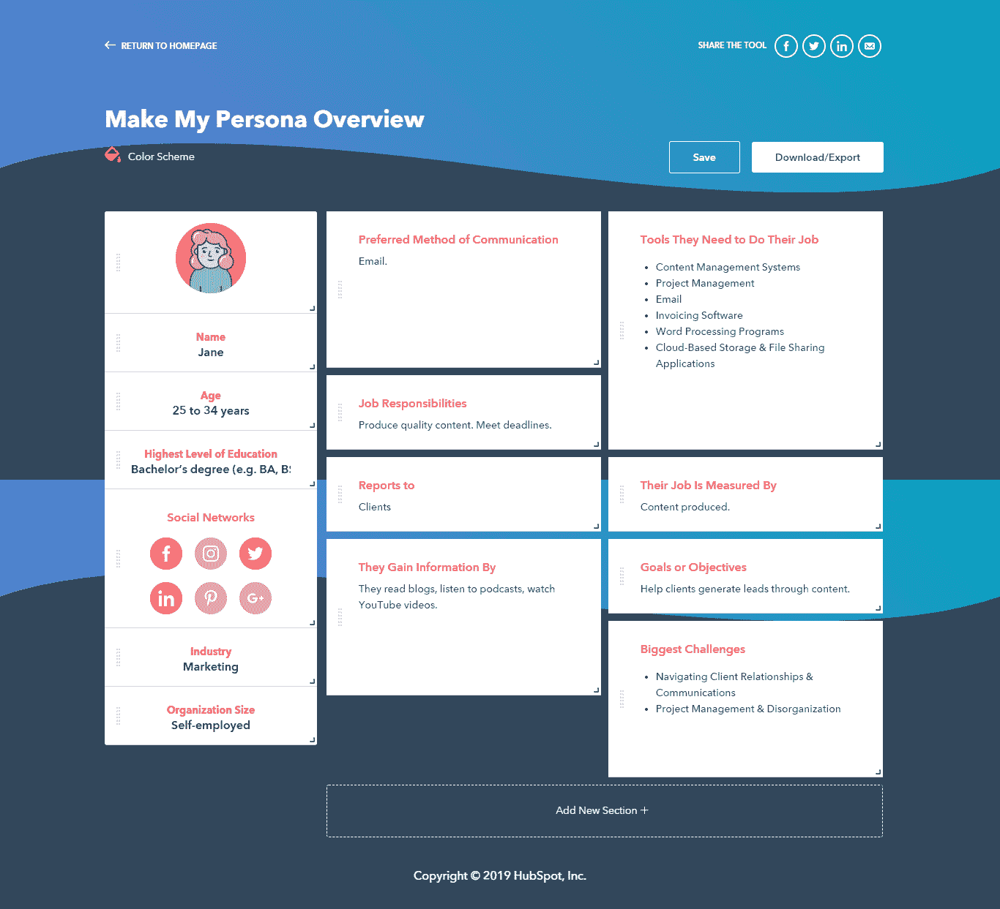

Customer Persona template

这个客户角色缺少痛点和需求，但这是一个很好的起点。

毕竟，与一个虚构的角色联系起来要比与一个具有各种特征的抽象云联系起来容易得多，所以即使是一个非常基本的人物角色也比没有强。随着时间的推移，你可以增加它。

但是，不要让你的客户角色过于刻板或正式。你的目标不是为你的观众创造一个完整的画面，而是为你的副业提供方向。

UserFocus 的 David Travis 博士解释了为什么大多数团队不能在第一轮中创建完整的人物角色[:](https://conversionxl.com/blog/user-personas/)

> “传统的人物角色开始看起来太完了，太定型了。团队足够精明，知道在设计的早期阶段，完全成形的、完整的用户描述是不可能的。相反，他们想要话题的引子。

因此，添加细节，但保持宽松。你的目标受众就那样:一个有一层光环的目标。靶心只是棋盘上的一张小而不完整的图片。现在我们来看看副业…

## 你的副业网站创意#1:销售在线课程

[苏格拉底曾经说过](https://schoolworkhelper.net/quote-analysis-the-unexamined-life-is-not-worth-living/)未经审视的人生不值得过。基于在线教育市场现在和未来的爆炸性增长，现代人同意这一观点。

例证:到 2022 年，电子学习市场预计将激增至[2.438 亿美元。](https://www.statista.com/statistics/501104/worldwide-elearning-market-size/)

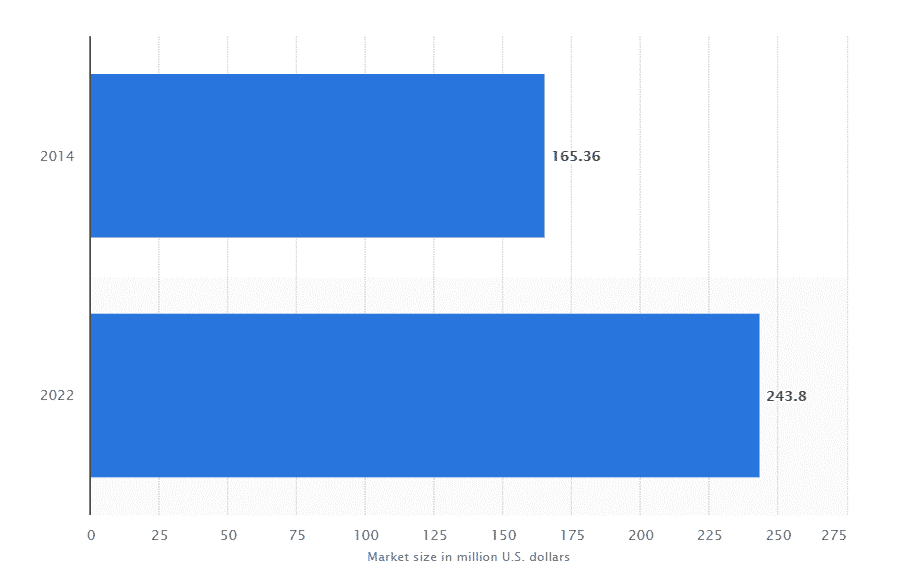

E-learning market in 2014 and 2022

但这个市场不再局限于教授和高等学术机构。每天都有新的企业家加入竞争，为大众提供高质量的教育(价格合理)。

很像水果蛋糕。创建需要大量时间，但一旦你这样做了，收益(或再捐赠)可以持续多年，成为一个适当的常青话题。

幸运的是，在线课程的现行价格比不受欢迎的圣诞小精灵要高得多。事实上，Podia 发现，超过 132，000 笔在线课程销售的平均价格为 182.59 美元。

所以，如果你想要一个可以持续提供并且在 WordPress 网站上容易实现的兼职，看看在线课程就知道了。

这种旁敲侧击是如此有利可图，以至于一门课程可以在一个月内支付一辆全新的现代索纳塔。

至少，这是一个创作者的基于 WordPress 的在线课程正在做的事情，[带来超过 27，000 美元的月收入](https://pjrvs.com/wordpress-course/)。

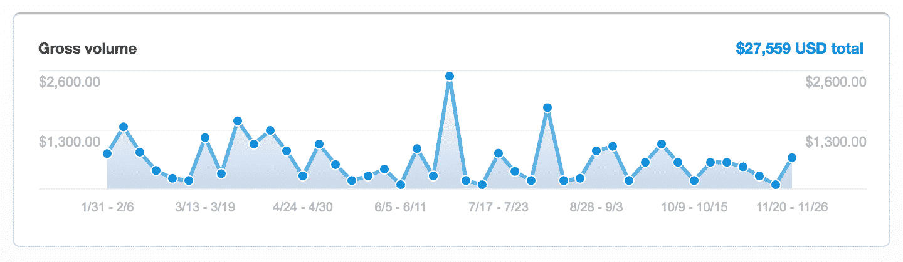

Paul Jarvis’ course revenue

你如何利用这种拥挤的力量？回到你的目标受众和人物角色。你能教他们什么，让他们愿意付钱？他们需要什么才能让自己的生活更健康更幸福？

或者说，你能给他们提供什么，是没有人能提供的？教别人不需要你成为专家，你只需要愿意花时间去指导。

一旦你明白了这一点，选择正确的 WordPress 插件就“只是”问题了。

你可以看看我们列出的[最佳 WordPress 学习管理系统(LMS)插件](https://kinsta.com/blog/wordpress-lms-plugins/)，但以下是亮点:

### LearnDash

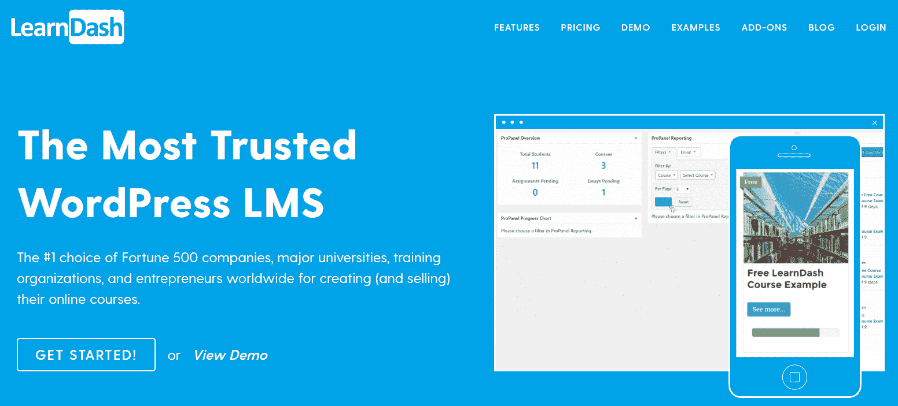

LearnDash

高等学术机构和主要商业巨头都使用, [LearnDash](https://kinsta.com/blog/wordpress-lms-plugins/#learndash) 是一款价格合理的 LMS 解决方案，用于销售在线课程，使您能够创建测验，内置论坛，以及您能想到的所有营销货币化选项。

一年的许可费是 159 美元，但是如果你想在多个网站上运行，价格会涨到 189 美元。

### WP 课件

WP CourseWare

WP 课件是一个很有前途的 LMS 插件，被全球超过 20，000 名用户使用。

它提供了您可能想要的所有功能，从拖放式课程创建界面到点滴式内容、测验到评分书。

他们最便宜的许可证是 129 美元。

### 学习出版社

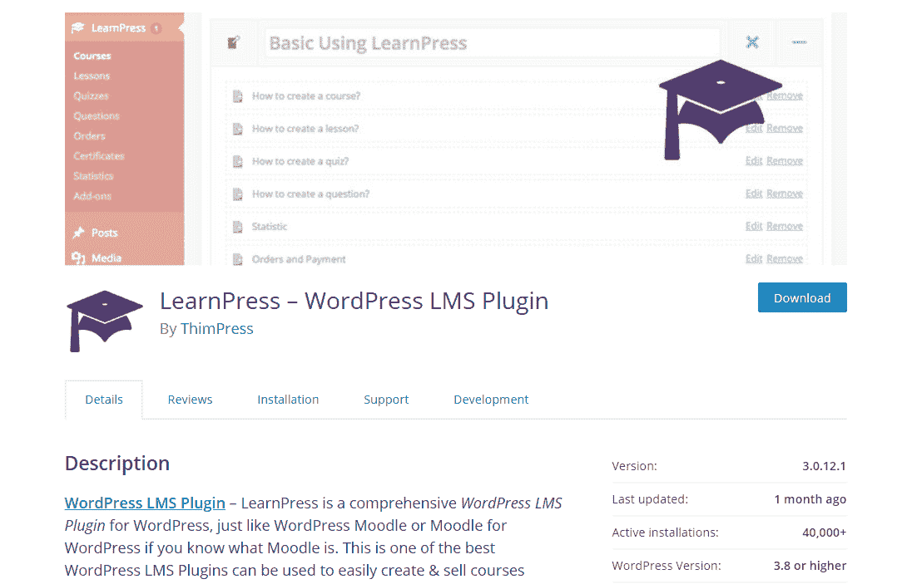

LearnPress

LearnPress 是一个免费插件，提供了许多与 LearnDash 相同的功能。

它与主要的支付网关相集成，允许您创建测验和其他交互式内容，并具有游戏化功能，如积分和徽章，以使您的学生保持兴奋和竞争力。

最重要的是，它可以让你创建[付费会员](https://kinsta.com/blog/hosting-wordpress-membership-sites/)，这恰好是我们的第二个想法。

## 你的副业网站创意#2:创建高级会员

如果在线课程是水果蛋糕，那么高级会员就是马卡龙。

人们愿意为它们付出很多，但它们需要更多的维护。不过，这是一个很好的权衡:虽然在线课程通过多次一次性购买提供收入，但高级会员是经常性收入的来源。

这意味着你可以将银行认可的月收入添加到你的预算中。 [46%的网上购物者](https://www.marketingcharts.com/industries/retail-and-e-commerce-82400)表示在过去一年中拥有订阅服务，其中许多人拥有多次订阅。

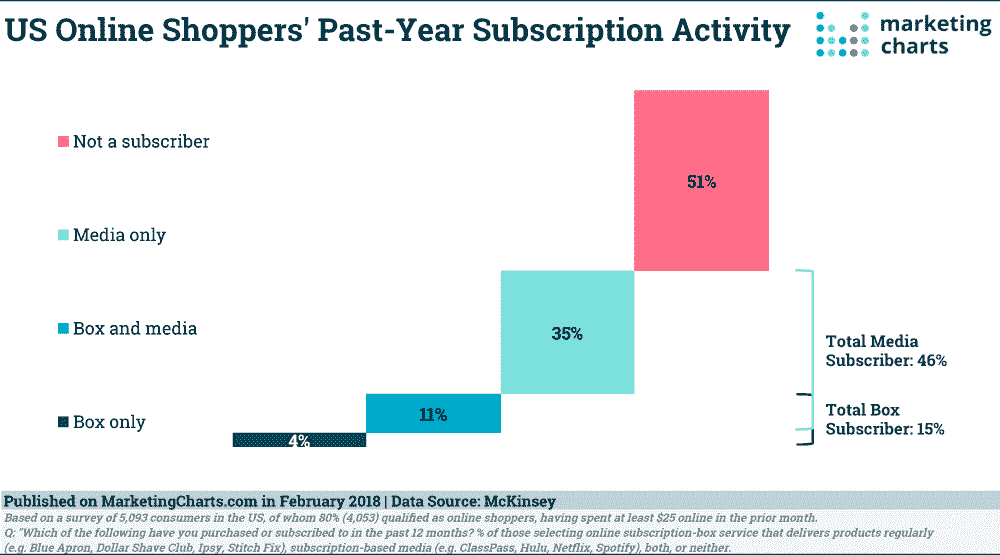

US shoppers’ subscription activity

也就是说，这种旁敲侧击不像上一个那样简单，对于在 WordPress 网站之外举办会员项目的[来说，有很多重要的事情需要记住。](https://kinsta.com/wordpress-membership-website-hosting/)

主要是，你需要一个缓存解决方案。如果你和金斯塔在一起，[我们会帮你搞定](https://kinsta.com/blog/wordpress-cache/)。

那么，这种旁门左道能有多赚钱呢？

视觉媒体教会的创始人以严格的 2500 美元预算开始了他们的会员计划。今天，他们有超过 575 名每月 25 美元或以上的会员。

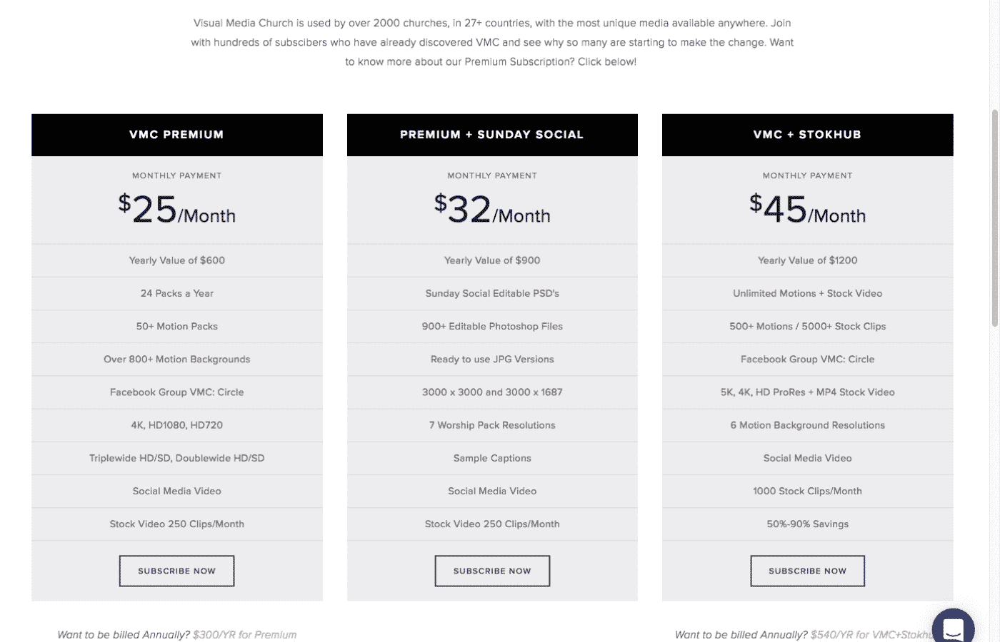

Visual Media Church Case Study

最少一个月将近 15000 美元。这上面的数学非常好。

想出会员计划的点子和为在线课程出点子是一样的。

参考你的人物角色，询问他们能从每月计划中得到什么。他们能从一个由志同道合的人组成的运转良好的社区中受益吗？他们愿意为此买单吗？

或者，如果你是一个内容创作者，你能产生足够的材料来证明其成本吗？如今，一篇博文的平均字数超过 1000 字，所以在你一头扎进去之前，想想你愿意投入多少时间。

如果你愿意投入额外的时间，这里有一些工具可以帮助你开始:

### woo 成员

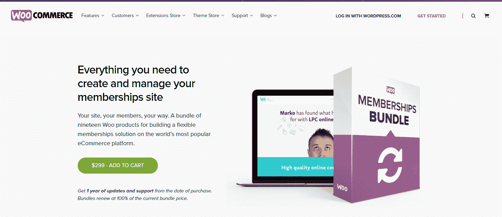

WooMembers

作为两个 WooCommerce 扩展的组合， [WooMembers bundle](https://woocommerce.com/products/woomembers-bundle/) 为你提供了一切你需要的东西，让你可以顺利运营一个会员网站。

亮点包括能够重复收费、限制不同会员级别的内容访问，以及在成为会员的同时销售附加产品(如在线课程)。

### 终极会员专业版

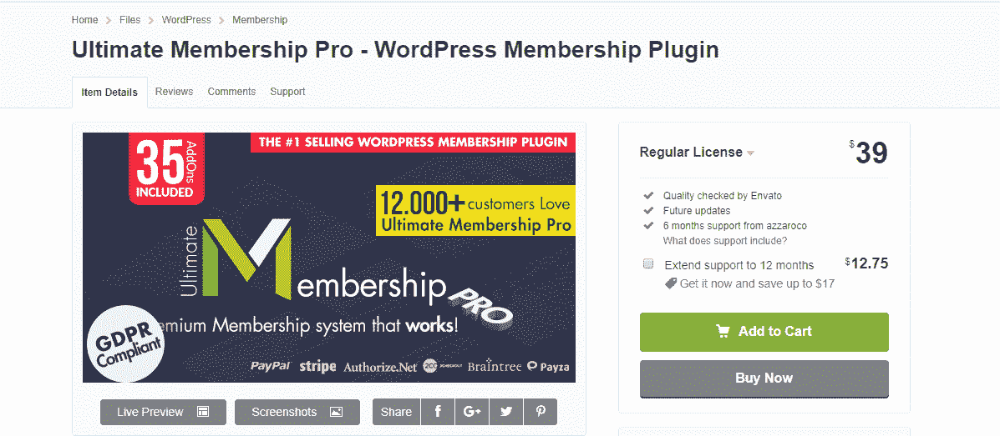

Ultimate Membership Pro

另一方面，Ultimate Membership Pro 拥有超过 10，000 个网站，并与 WooMembers 捆绑包共享功能。

## 注册订阅时事通讯

### 想知道我们是怎么让流量增长超过 1000%的吗？

加入 20，000 多名获得我们每周时事通讯和内部消息的人的行列吧！

[Subscribe Now](#newsletter)

不利的一面是，对这个插件的支持并不像你从 WooCommerce 上得到的那样普遍，关于它的特性的教程也很有限，但是有了这样一个简单的价格点，这种权衡可能只对你的 side-hustle 有用。

### 成员压力

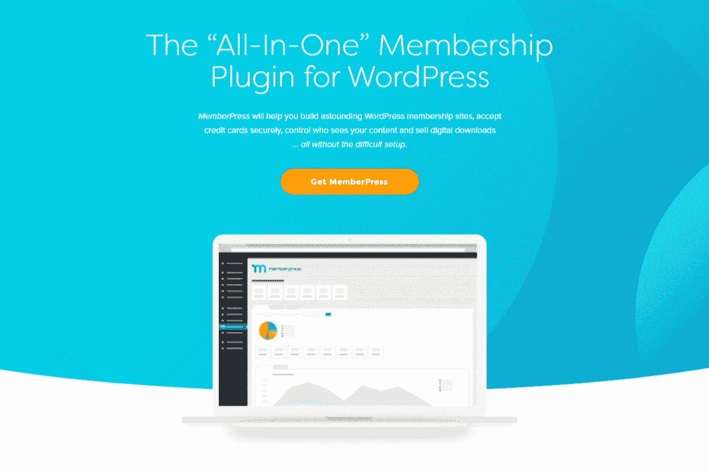

MemberPress

MemberPress 是一个强大的插件，可以让你创建优秀的会员网站。

它很容易设置，具有所有重要的功能，如访问规则，论坛，滴内容，优惠券，分析等。，而且非常安全。

他们的基本计划每年花费 129 美元。

好吧，让我们进入下一个回合。像前两个一样，这种旁敲侧击可以单独进行，也可以与你的其他事业协同进行。这也是我们今天的列表中最简单的，这使它成为完美的关闭。

## 你的网站创意之三:提供数字下载

最后两个副业有很大的潜力，但是它们都需要很多每个人都缺少的东西:时间。

如果你想赚点外快，但又没有时间(或不想)把周末花在这上面，那么[数字下载](https://kinsta.com/blog/wordpress-download-manager/)可能就是你的不二之选。

您可以出售下载内容，如[电子书和模板](https://convertkit.com/digital-product-ideas/):

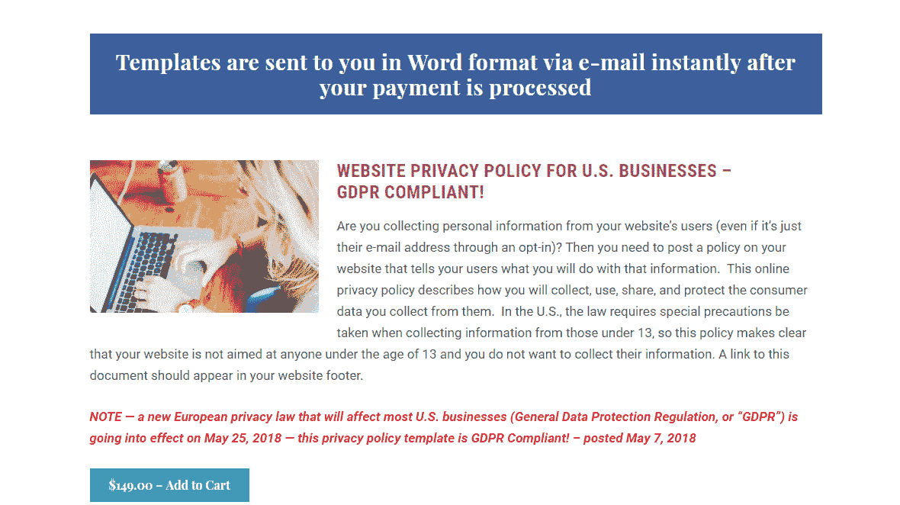

Examples of digital downloads from Autumn Witt Boyd, LLC

或者工作表、食谱、膳食计划、照片包、自定义字体等等。

当谈到可下载的资产时，你的想象力是有限的。尤其是电子书，是一个很好的副业。他们的收入比以往任何时候都要高，这使得印刷书籍更加物有所值。

此外，它们也有利于搜索引擎排名，正如 Chill Insurance 发现的那样，他们的电子书[帮助他们的有机接触(PDF 文件)](https://www.click.co.uk/wp-content/uploads/2018/04/Chill-Case-study-2018.pdf)开花结果。

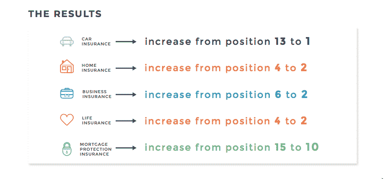

Chill Insurance case study

准备好开始使用数字下载作为你的副业了吗？看看这些插件。

### 轻松的数字下载

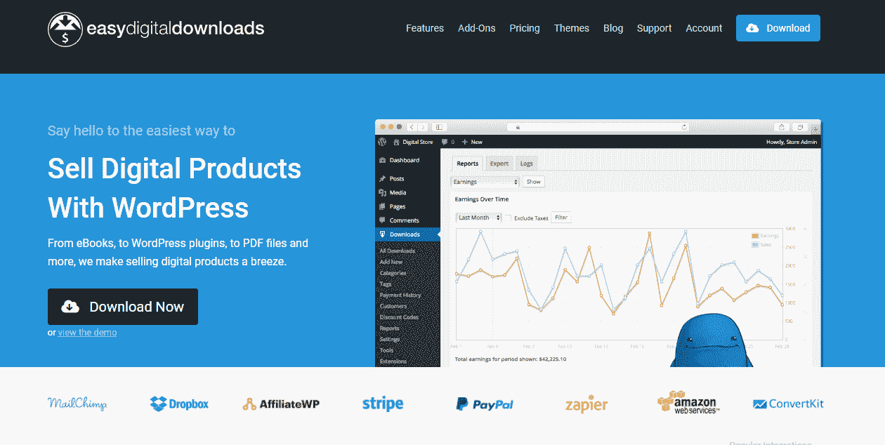

Easy Digital Downloads

也被称为 EDD， [Easy Digital Downloads](https://easydigitaldownloads.com/) 是那些销售数字商品的标准插件之一，它可能会在 WordPress 上出现。

价格将从 99 美元到 499 美元不等，取决于你想要什么，但对于一个侧面的骗局来说，“个人”计划是完美的，给你一切你需要的东西来接受付款，并把你的数字商品送到客户手中。

在 Kinsta，我们是它的忠实粉丝，这就是为什么你可以找到关于你需要了解的 EDD 的详细介绍。

### 伍尔科贸易公司

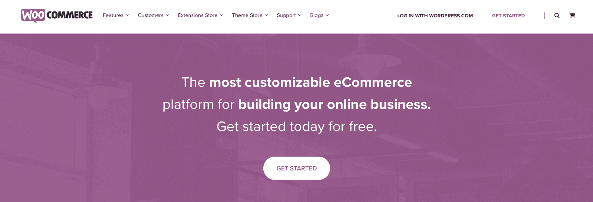

WooCommerce

没错:理论上，你可以使用 WooCommerce 的免费基础插件来销售你的数字下载。

我强调“理论上”,因为如果不添加 [WooCommerce 扩展](https://kinsta.com/blog/woocommerce-extensions/),你将受到限制:如果没有付费的附加组件，你就不能创建产品捆绑包或实现批量下载。如果你想保持低消费，WooCommerce [为数字产品下载提供支持](https://docs.woocommerce.com/document/digital-downloadable-product-handling/)。

在 EDD 和 WooCommerce 之间做出选择不是一件容易的事情，但是对于那些不想在数字下载之外扩张的金钱良知的骗子来说， [WooCommerce 可能是你最好的选择](https://kinsta.com/blog/woocommerce-tutorial/)。

### 工资

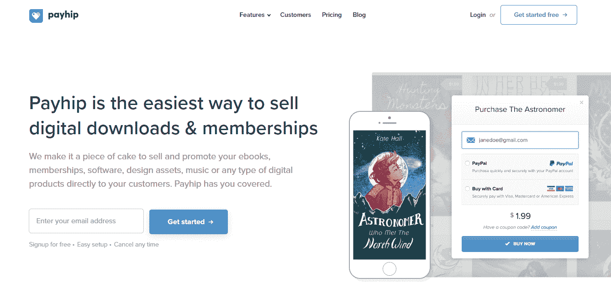

Payhip

[Payhip](https://payhip.com/) 是一个数字下载和会员平台，受到全球 130，000 多家卖家的信任。

它很容易使用，它的结帐是为了增加你的转换率(这很重要！)，而且它有方便的功能，如客户更新、优惠券和一个允许你招募自己的会员的会员系统。

你怎么能在一个低质量、慢速度、蹩脚的主机上发展你的副业呢？我们针对 Kinsta 的速度和增长进行了优化！[查看我们的托管计划](https://kinsta.com/plans/?in-article-cta)

你可以通过选择他们的免费永久计划开始免费使用 Payhip。

## 你的副业网站创意#4:经营一个联盟博客

如果你不熟悉[联盟营销](https://kinsta.com/affiliate-academy/affiliate-marketing-business/)，这是一个很好的方式来打入市场，并建立一个可观的利润，而不会在这个过程中冒风险。

概要是这样的:

一个商人有他们想要出售的产品。出版商(也称为代销商)同意以固定费用或百分比的佣金率将其出售给他们的读者。一旦交易成功，商家就支付佣金。

该代销商为商家做的每一笔新销售都会重复这一循环:

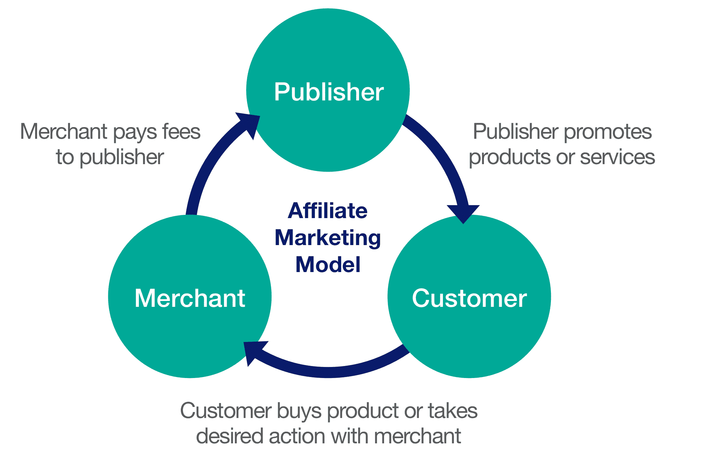

Affiliate Marketing Model (Image source: [eBay](https://partnernetwork.ebay.com/what-is-affiliate-marketing/))

经营一个联盟博客实际上可以是一项成熟的业务，但是如果你只是想作为一个旁门左道的人进入这个行业，你会希望已经有一个固定的受众。

你更有可能获得更好的佣金条件，而且因为你的博客已经有了健康的流量，你可以期待看到比你从头开始更快的支付。

请记住，如果你在美国，你有义务公开你与商家的关系。

大多数人把他们的免责声明放在帖子的顶部:

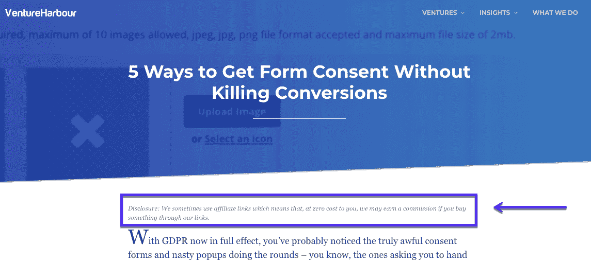

Example of disclaimer at the top

将它们放在帖子的底部也是可以接受的:

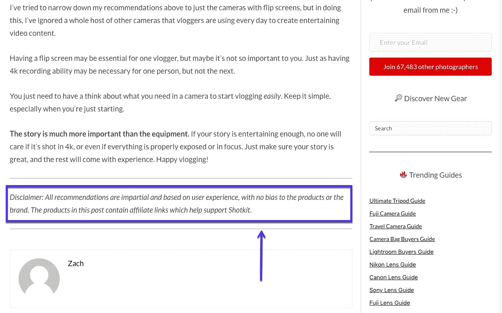

Example of disclaimer at the end of the page

只要不隐瞒或转移观众对你和链接的关系和预期回报的认识，你在哪里披露由你决定。以下是关于如何[撰写完美的关联披露](https://kinsta.com/affiliate-academy/affiliate-disclosures/)的深度指南。

现在，这里有一个关于联盟博客的好消息:这种兼职风险投资的利润可能相当可观。

一个博客作者[用一个产品](https://bloggerspassion.com/affiliate-partnership-case-study/)赚了 16433 美元。

他成功的关键是[制作高质量的内容](https://kinsta.com/blog/long-form-articles/)，支持而不是试图直接销售[你正在推广的产品](https://kinsta.com/blog/how-to-monetize-a-blog/)。

此外，即使作为旁门左道，这也不仅仅是写一份普通的文案和附加一个行动号召。

毕竟，55%的读者只会浏览你的文章 15 秒钟甚至更短。

因此，如果它是通用的，你的机会降落，甜蜜的从属委员会大大下降。

至于如何入门成为联盟博主，节目很少。他们是这样工作的。

### 亚马逊协会

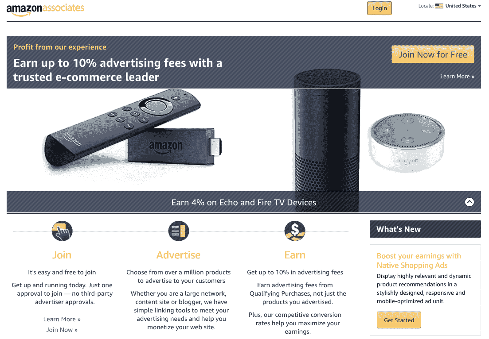

Amazon Associates Homepage

如果你和我一样，你在亚马逊上花了太多时间。你的读者可能也是如此。

因此，亚马逊的联盟项目 [Amazon Associates](https://kinsta.com/affiliate-academy/amazon-affiliate-website/) 是最受博客作者欢迎的项目之一是有道理的。

举个例子:一年之内，一个博客作者在亚马逊的月收入从 50 美元涨到了 2000 美元。

加入亚马逊助理的步骤非常简单。

在申请并获得批准后，你只需在博客帖子中附上一个附属产品的链接，同时透露你可能会赚取佣金，然后等待访问者点击它。

这个项目的美妙之处在于**访问者不一定非要购买你链接的产品**才能赚取佣金。如果他们在饼干放到他们电脑上的 24 小时内从亚马逊买了任何东西，你会因此得到回扣。

因此，尽管他们的佣金率(按产品类别设定)不是最好的…

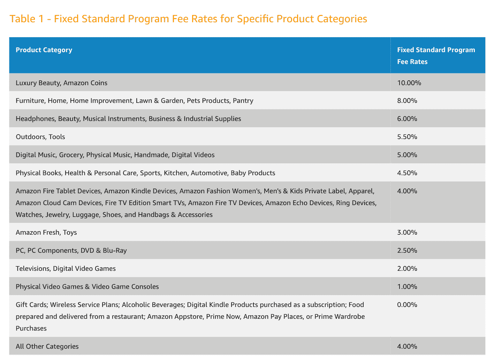

Amazon standard fee rates

亚马逊惊人的高转换率，Prime 会员高达 74%,使其成为博客作者的可靠选择。

但是说到好东西，这里有两个工具你可以用在 Amazon Associates 程序和 WordPress 博客上。

### thirty 附属公司

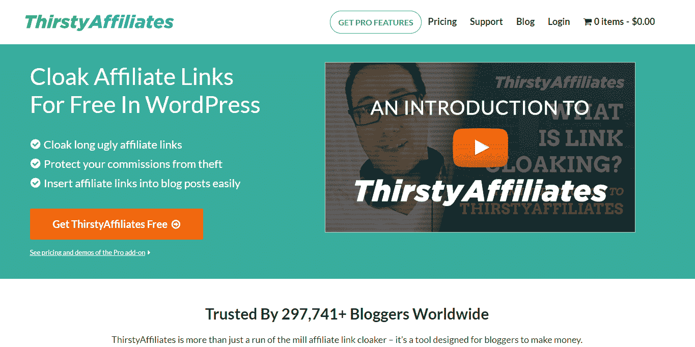

ThirstyAffiliates

免费版 [ThirstyAffiliates](https://thirstyaffiliates.com/) 有大量的功能，使其特别适合与亚马逊合作伙伴结合，包括[、【智能】解锁](https://kinsta.com/affiliate-academy/link-cloaking/)、自动“不跟随”和在新标签编程中打开、机器人排除和基本统计报告。

如果你升级到专业版，单个网站许可证要花 49 美元。

你将获得额外的功能，如 Amazon API reporting，让你从 Amazon 搜索和导入附属链接，地理定位重定向，自动关键字链接，使优化你已经发布的帖子变得轻而易举。

### 亚马逊联盟 WordPress 插件

Amazon Affiliate WordPress Plugin

虽然这个名字有点不准确，但是 [AAWP](https://getaawp.com/) 名副其实。专为亚马逊联盟计划设计，你必须预付大约 50 美元才能开始使用这个插件。

它适用于任何主题，即时创建产品比较表，自动从亚马逊获取产品定价数据，包括[现成的小工具](https://kinsta.com/blog/wordpress-widgets/)等等。

也就是说，这个插件的缺点是它是为 Amazon Associates 设计的，所以如果你在你的博客上管理多个联盟项目，你需要把它和另一个插件结合起来。

或者，如果你想走自己的路，或者只是想让你的联盟计划比写博客和插入链接更复杂一点，你可以创建自己的合作伙伴页面，让品牌来找你。

或者，更好的是，去找他们。

例如，你的博客迎合年轻女性群体吗？如果是这样，Refinery29 就在这里& Now Collective 可能是你的理想选择。

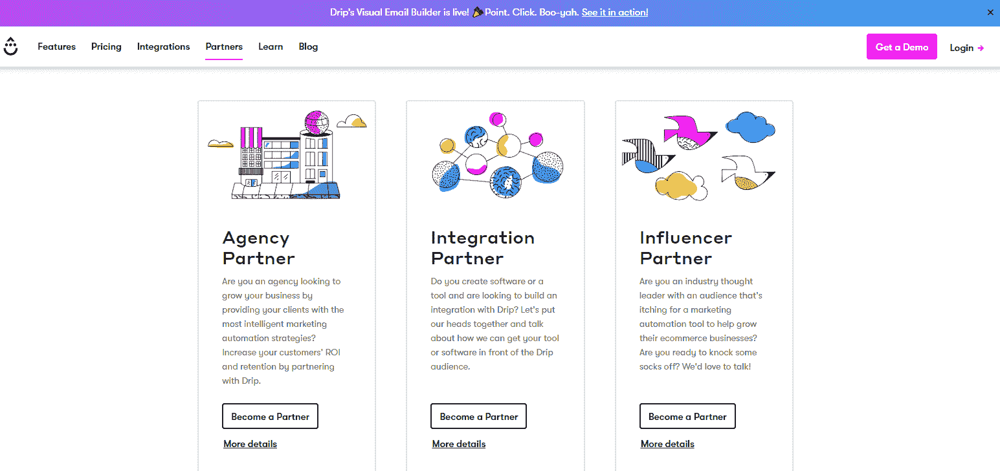

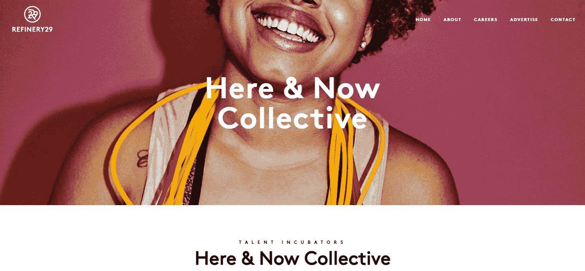

Here & Now Collective’s affiliate program

与更专业的观众或其他营销人员合作？滴滴的联盟计划有一个特殊的类别，只针对[影响者合作伙伴](https://www.drip.com/partners)下的博主。

Drip’s influencer program

这样的例子不胜枚举。寻找要加入的合作伙伴计划可以像搜索你所在领域的相关博客或产品，或者查看你自己喜欢的产品一样简单。

你个人用什么，真正相信什么？这会让阅读你博客的人受益吗？

如果是这样，那么你已经有了潜在的附属关系的基础，可以让这一方为你工作在你的条件。

顺便说一下，Kinsta 的附属计划的条款相当慷慨。只是精神食粮。

## 摘要

兼职不再局限于混音带和拥有 MBA 学位的人。如果你有一个基于这些想法之一的 [WordPress 网站](https://kinsta.com/blog/wordpress-site-examples/)，你可以选择产生额外的零花钱。

在线课程是信息产品中增长最快的商品之一。你可以很容易地在你的 WordPress 网站上用 LMS 插件设置一门课程，并以高价分享你的知识。

付费会员订阅是现代商业的另一个标志。几乎一半的网上购物者报告说在过去的一年里有付费订阅，那么为什么不利用这一点，创建一个高级会员网站呢？

也就是说，在线课程和会员网站都需要你投入大量时间来创建。如果你想创建一个互动社区，他们的维护可能会占用你一周的大量时间。

这就是数字下载发挥作用的地方。出售电子书、工作表、食谱规划、模板、图片集和任何你能想到的网络资产是另一种简单、省时的副业，可以帮助你赚钱。

它也能为你的搜索引擎优化带来一些真正的奇迹。

最后，如果你已经有了一个有读者的博客，联盟博客是另一个非常有利可图的副业。

Amazon Associates 是博客作者最容易加入的项目之一，但是如果你想走自己的路，有很多独立的商家都有合作项目。

这些策略被证明是赚钱的，如果你做得足够好，它们可以有自己的生活。事实上，你的日常工作可能只是副业。

* * *

让你所有的[应用程序](https://kinsta.com/application-hosting/)、[数据库](https://kinsta.com/database-hosting/)和 [WordPress 网站](https://kinsta.com/wordpress-hosting/)在线并在一个屋檐下。我们功能丰富的高性能云平台包括:

*   在 MyKinsta 仪表盘中轻松设置和管理
*   24/7 专家支持
*   最好的谷歌云平台硬件和网络，由 Kubernetes 提供最大的可扩展性
*   面向速度和安全性的企业级 Cloudflare 集成
*   全球受众覆盖全球多达 35 个数据中心和 275 多个 pop

在第一个月使用托管的[应用程序或托管](https://kinsta.com/application-hosting/)的[数据库，您可以享受 20 美元的优惠，亲自测试一下。探索我们的](https://kinsta.com/database-hosting/)[计划](https://kinsta.com/plans/)或[与销售人员交谈](https://kinsta.com/contact-us/)以找到最适合您的方式。