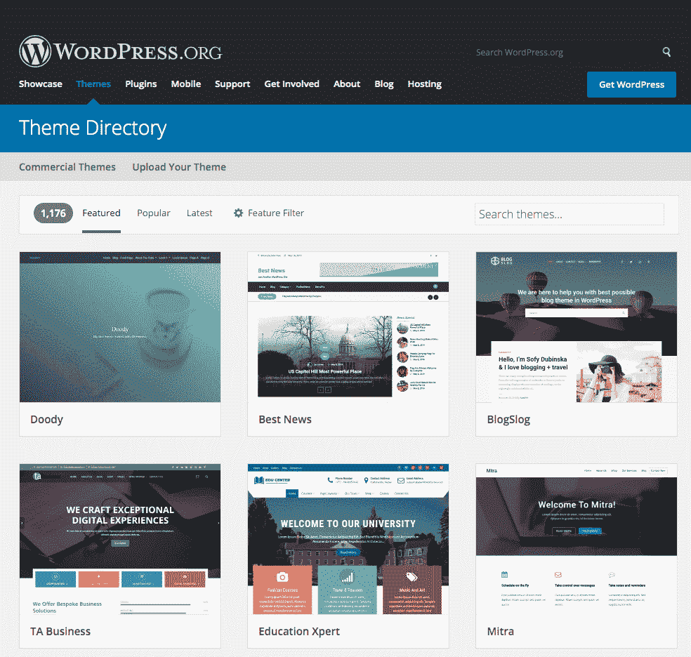
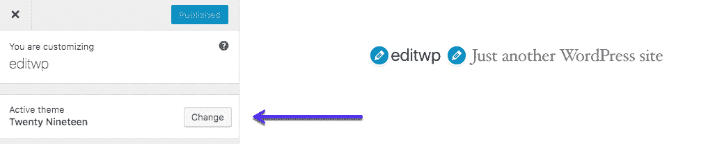
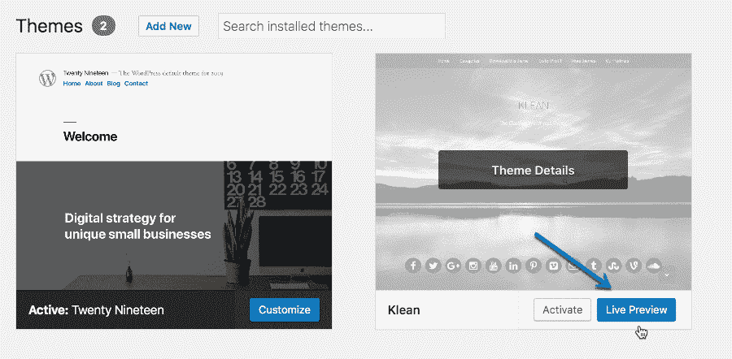
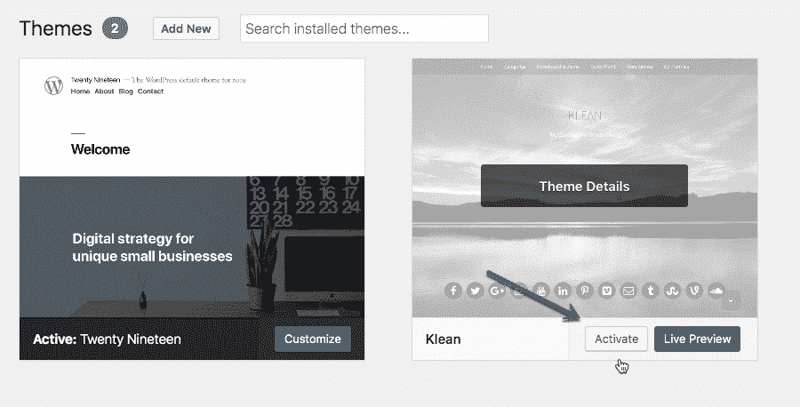
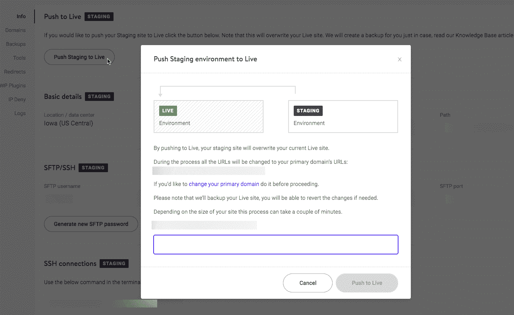

# 如何改变 WordPress 主题(不破坏你的网站)

> 原文：<https://kinsta.com/blog/change-wordpress-theme/>

改变你的主题只需要几分钟(如果你忽略了[选择一个主题需要多长时间)。然而，如果你想安全地做，切换主题变得更加复杂。毕竟，你的活动主题是如此的根深蒂固于你的网站的功能，以至于这种改变有可能打破它。](https://kinsta.com/blog/category/wordpress-plugins-themes/)

因此，在不引入任何新问题的情况下改变主题的过程可能会比仅仅点击*激活*按钮花费更长的时间。但是，如果您遵循一些基本程序，您可以确保您的网站在切换后顺利工作。

## 如何改变 WordPress 主题(不破坏你的网站)

要成功安全地更改你的 WordPress 主题，请遵循以下步骤:

1.  建立你的网站的临时副本
2.  安装您的新主题并预览它
3.  激活您的新主题
4.  解决错误并替换缺失的元素
5.  实时推送你的分期网站

Support

在这篇文章中，我们将解释**为什么改变 WordPress 主题是如此微妙的过程**。然后，我们将讨论安全完成工作所需的五个步骤。我们开始工作吧！

### **更喜欢看[视频版](https://www.youtube.com/watch?v=fs-90fBHENY)？**

## 为什么改变 WordPress 主题是一个微妙的过程

让我们快速浏览一下你可以在你的网站上使用的一些最流行的免费 WordPress 主题:

Most popular WordPress themes

即使没有深入到这些单独的页面中，您也可以看到每个选项之间有许多风格上的差异。因此，当你切换到一个新的主题时，它通常会搞乱你的网站的外观，甚至它的功能，这并不奇怪。

最好的情况是你的新主题只破坏了几个元素，你可以很容易地替换它们或者恢复到以前的状态。然而，你的主题和你的网站设计联系越紧密，换一个新的主题就越有可能产生严重的影响。这可以包括:

*   影响你的网站的一些核心功能(例如，弄乱你的导航栏、联系表单、页面中的重要部分等等。)
*   禁用任何由您之前的主题添加的短代码
*   移除页面上任何特定主题的小工具
*   干扰页面的[模式数据](https://kinsta.com/blog/schema-markup-wordpress/)

根据经验，你使用的主题越复杂，改变它就越困难。例如，如果你使用一个带有自己的[页面生成器](https://kinsta.com/blog/wordpress-page-builders/)的多用途主题，你可能会经历一个非常漫长的过渡。

当然，这并不是说你应该远离复杂的 WordPress 主题。每个网站都是不同的，所以你应该使用最适合你网站特定需求的主题。尽管如此，知道如何安全地改变你的主题是至关重要的，因为无论你现在使用什么类型的主题(或者切换到什么类型的主题)，都会出现问题。

[需要切换到新的 WordPress 主题吗？不要弄乱你网站的外观和功能。😭遵循这 5 个步骤成功改变你的#WordPress 主题！✌️ 点击推文](https://twitter.com/intent/tweet?url=https%3A%2F%2Fkinsta.com%2Fblog%2Fchange-wordpress-theme%2F&via=kinsta&text=Need+to+switch+to+a+new+WordPress+theme%3F+Don%E2%80%99t+mess+up+your+site%E2%80%99s+appearance+and+functionality.+%F0%9F%98%AD+Follow+this+5-step+approach+to+change+your+%23WordPress+theme+successfully%21+%E2%9C%8C%EF%B8%8F&hashtags=wpthemes%2Cwordpress)

## 如何安全地更改你的 WordPress 主题(5 步)

在你做任何事情之前，这是为你的 WordPress 网站创建一个完整备份的绝佳时机。理想情况下，您已经有了大量最近的还原点。然而，改变主题是一件大事，所以你要做好充分的准备，以防出于任何原因需要恢复。

### 第一步:建立你的网站的临时副本

你可以把一个临时环境想象成一个实验室，在公众看到之前，你可以在那里做所有的测试和重要的修改。有了网站的临时副本，你可以毫无畏惧地做出任何你想要的改变。如果你打破了什么东西，你可以很容易地重新开始，不会有任何影响。

如今，许多 WordPress 托管平台为你提供 staging 功能，作为其软件包的一部分。例如，在 Kinsta，你可以[设置一个临时环境](https://kinsta.com/help/staging-environment/)，只需点击几下鼠标:

Create a WordPress staging environment.

因为改变 WordPress 的主题是一个非常微妙的过程，在你的网站中仓促行事是没有意义的。有了 [WordPress staging](https://kinsta.com/wordpress-staging/) ，你将能够看到你的内容在你切换主题后发生了什么，修复任何错误，然后在你准备好的时候将结果发布。

如果您的 web 主机不提供暂存功能，您可以尝试其他选项。例如，你可以[建立一个本地 WordPress 环境](https://kinsta.com/blog/install-wordpress-locally/)，并使用你的备份创建你的网站的副本。

这种方法不太直接，因为你不能像通过网络主机那样容易地在线部署你的本地网站。在这种情况下，当你完成修改后，你需要创建网站的另一个副本，然后[把它上传到你的服务器](https://kinsta.com/blog/restore-wordpress-from-backup/)上。

如果可能，我们建议使用提供[暂存功能](https://kinsta.com/help/restore-wordpress-backup-staging/)的 web 主机。在很多情况下，它可以让你的工作流程变得更加简单，所以这是一个值得优先考虑的特性。

### 第二步:安装你的新主题并预览它

此时，你的 [WordPress staging site](https://kinsta.com/blog/wordpress-staging-site/) 应该已经准备好了。现在是访问它的时候了，[安装你想要使用的新 WordPress 主题](https://kinsta.com/blog/how-to-install-a-wordpress-theme/)。

## 注册订阅时事通讯

### 想知道我们是怎么让流量增长超过 1000%的吗？

加入 20，000 多名获得我们每周时事通讯和内部消息的人的行列吧！

[Subscribe Now](#newsletter)

然而，在你激活主题之前，先去你的仪表板中的*外观>定制*部分。在那里，你可以改变你的 WordPress 站点的外观。更重要的是，你还可以用它来预览你的新主题是什么样子的。

为此，点击左侧边栏中*活动主题*部分旁边的*更改*按钮:

How to change a theme in WordPress

然后，选择您想要测试的主题，并点击其名称下的实时预览按钮:

How to preview a theme in WordPress

之后，一旦你激活了新主题，WordPress 会显示你的主页的样子。现在花一点时间在定制器中检查您的整个网站，并记下任何明显的问题区域或 bug。

如果你发现任何问题，你还不需要担心解决它们。首先，您需要在您的临时站点上激活新主题。

### 第三步:激活你的新主题

你已经知道一旦你切换主题，你的网站会是什么样子，所以是时候开始工作了。关闭定制器，转到*外观>主题*标签。然后，点击*为你的新主题激活*按钮:

How to activate a theme in WordPress

WordPress 可能需要一些时间来处理更改。然后，你会看到你的新主题被激活并准备好了。它现在在您的暂存站点上运行，这意味着是时候确保一切正常工作了。

你的 WordPress 站点需要很长时间才能加载吗？由于 Kinsta 的构建速度堆栈，获得极快的页面加载时间！[查看我们的计划](https://kinsta.com/plans/?in-article-cta)

### 步骤 4:解决错误并替换丢失的元素

根据你上一个主题的特点，你可能需要在这一点上做一些整理。根据我们的经验，这是耗时最长的一步。最终的密集程度将完全取决于这种转变如何影响你的网站。

正如我们之前提到的，改变主题通常会破坏网站的某些部分，包括:

*   特定主题的小部件和短代码
*   [您的导航](https://kinsta.com/blog/website-navigation/)栏和侧边栏
*   页面中的特定部分，通常是由于格式问题或缺少元素
*   你的[图标](https://kinsta.com/knowledgebase/wordpress-favicon/)可能会消失。

你的内容应该还在原处，因为切换主题不会影响你网站的这一部分。你现在需要做的是开始定制你的新主题，直到你的网站看起来像你想要的那样。

当你这么做的时候，你也要确保你没有遗漏任何关键的功能。如果你的新主题不包括你上一个主题提供的一些功能，你可以随时寻找插件来替换它们。

如果[您已经将模式标记](https://kinsta.com/blog/schema-markup-wordpress/)添加到页面中(您应该这样做！)，请记住，您还需要配置您的新主题来正确加载它。但是，如果您使用插件方法来处理模式标记，而不是手动添加数据，那么您应该能够跳过这个任务。
T3】

### 第五步:实时推送你的分期网站

一旦你确定你的网站没有漏洞，并且看起来就像你想要的那样，是时候把它公开了。如果你按照我们的建议安全地使用了一个分期网站，那就意味着你需要将你的分期网站进行直播。换句话说，你将会用新的和改进的暂存副本替换现有的实时网站。

如果你使用你的网站主机的暂存功能，这个过程应该很简单。通常只需[几次点击就能完成工作](https://kinsta.com/help/push-staging-live/):

Kinsta push staging to live

但是请记住，如果你在你的 live 网站上发布了新的内容，同时在它的 staging 副本上调整了你的新主题，这些内容将会被覆盖。因此，在你将你的临时网站上线之前，确保你将所有的新内容都转移到临时网站上。

如果你在本地 WordPress 安装上测试了你的新主题，这个过程将会花费更长的时间。你需要手动备份你的网站，然后上传到你的服务器上。这样做可能有点麻烦，但如果您决定不使用暂存副本，这比处理一个崩溃的网站要麻烦得多。

完成后，您的 live 站点将准备好使用它的新主题！对重要的页面和内容再做一遍是个好主意，这样可以额外确保每个元素都能顺利过渡。

## 摘要

主题非常重要，大多数用户倾向于长时间使用同一个 WordPress 主题。面包屑和模式标记等小东西是你不想忘记的，因为如果你突然改变了一些东西，它们会极大地改变你网站的 UX 和排名。

因此，切换主题有可能造成如此大的破坏，这并不奇怪。如果你想在改变 WordPress 主题时谨慎行事，我建议你遵循以下五个步骤:

1.  建立你的网站的临时副本
2.  安装您的新主题并预览它
3.  激活您的新主题
4.  解决错误并替换丢失的元素。
5.  实时推送你的分期网站

关于如何安全地切换 WordPress 主题，你有什么问题吗？在下面的评论中分享吧！

* * *

让你所有的[应用程序](https://kinsta.com/application-hosting/)、[数据库](https://kinsta.com/database-hosting/)和 [WordPress 网站](https://kinsta.com/wordpress-hosting/)在线并在一个屋檐下。我们功能丰富的高性能云平台包括:

*   在 MyKinsta 仪表盘中轻松设置和管理
*   24/7 专家支持
*   最好的谷歌云平台硬件和网络，由 Kubernetes 提供最大的可扩展性
*   面向速度和安全性的企业级 Cloudflare 集成
*   全球受众覆盖全球多达 35 个数据中心和 275 多个 pop

在第一个月使用托管的[应用程序或托管](https://kinsta.com/application-hosting/)的[数据库，您可以享受 20 美元的优惠，亲自测试一下。探索我们的](https://kinsta.com/database-hosting/)[计划](https://kinsta.com/plans/)或[与销售人员交谈](https://kinsta.com/contact-us/)以找到最适合您的方式。