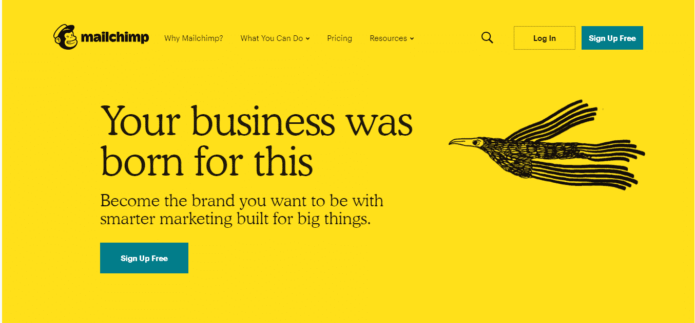
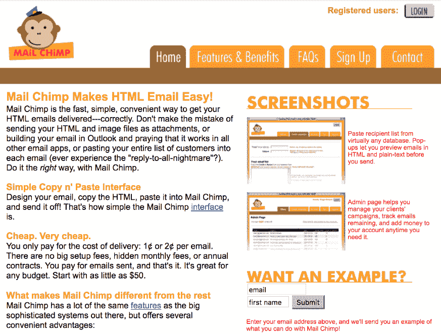
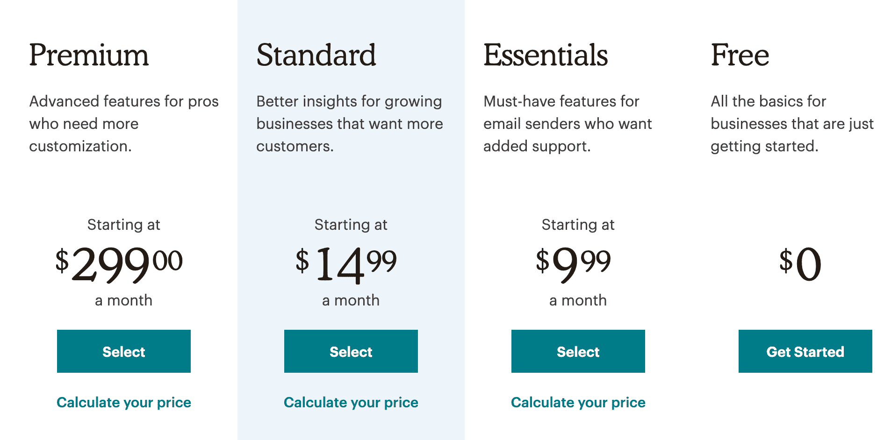
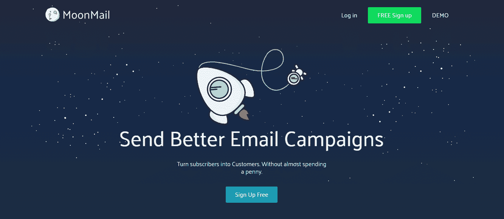
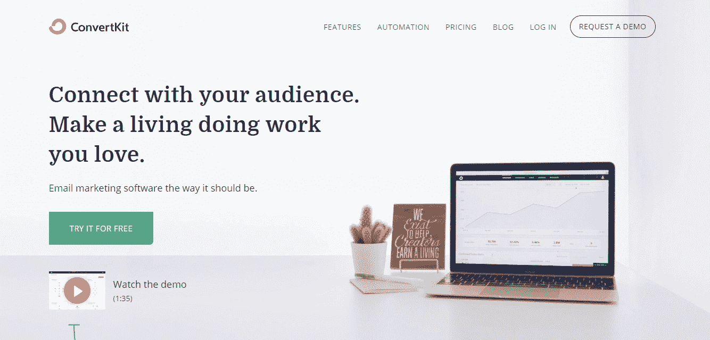
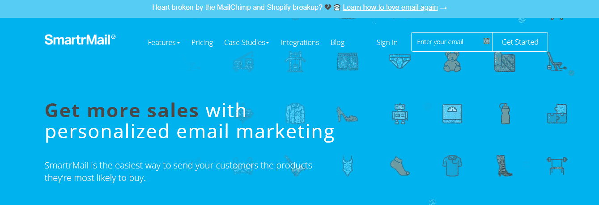
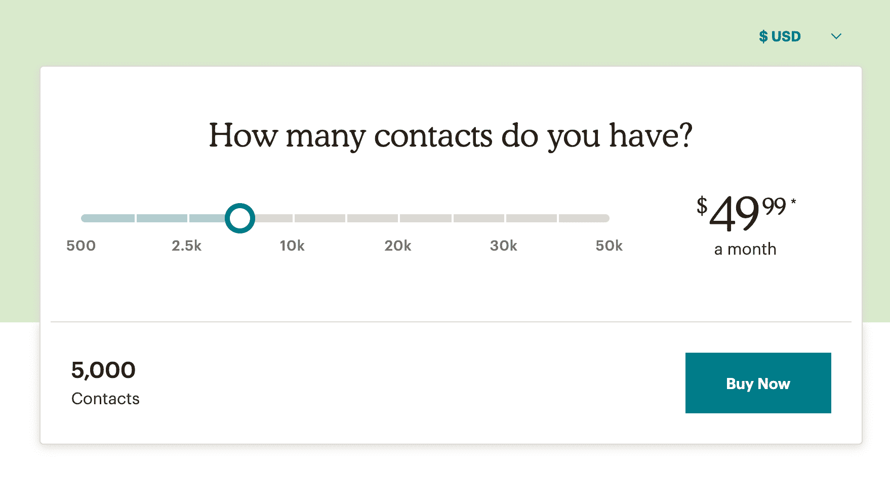

# 初学者指南:如何使用 Mailchimp(建立你的电子邮件列表)

> 原文:[https://kinsta.com/blog/how-to-use-mailchimp/](https://kinsta.com/blog/how-to-use-mailchimp/)

你知道那句话吗？二十年前是种树的最佳时间，第二好的时间是现在。

邮件营销也是一样。开始建立你的清单的最佳时间是你有创业想法的时候。第二好的时间是现在。事实上，早在 2017 年，DMA 就发现花在电子邮件营销上的每 1 英镑(约 1.28 美元)的平均回报是 32.28 英镑(约 41.28 美元)，这是一个令人难以置信的投资回报。

但是说起来容易做起来难。市面上[电子邮件营销软件选项的数量](https://kinsta.com/blog/email-marketing-software/)会让你头晕目眩。你应该选择哪一个？

<link rel="stylesheet" href="https://kinsta.com/wp-content/themes/kinsta/dist/patterns/featured-snippet.css?ver=264ec3d754b6bff57ae9">

## 为什么使用 Mailchimp:

Mailchimp 是世界上最著名和最常用的电子邮件营销软件之一。Mailchimp 由 Ben Chestnut 和 Dan Kurzius 于 2001 年创建，目前拥有超过 2000 万用户，市值 42 亿美元。以下是为什么它是初学者的良好起点:

*   它很容易使用
*   它有所有必要的功能
*   很可靠
*   一开始是免费的
*   它是由一个成熟的企业和忠诚的创始人开发的

Support

今天我们将看看如何使用最流行的电子邮件营销工具之一的 Mailchimp，并向你展示如何使用它来开始建立你的电子邮件列表【T2 今天】。

Mailchimp email marketing tool

 <kinsta-auto-toc heading="Table of Contents" exclude="last" list-style="arrow" selector="h2" count-number="-1">## Mailchimp 是什么？

Mailchimp 是一家电子邮件营销公司，由 Ben Chestnut 和 Dan Kurzius 于 2001 年创立。

<link rel="stylesheet" href="https://kinsta.com/wp-content/themes/kinsta/dist/components/ctas/cta-mini.css?ver=2e932b8aba3918bfb818">

> 需要在这里大声喊出来。Kinsta 太神奇了，我用它做我的个人网站。支持是迅速和杰出的，他们的服务器是 WordPress 最快的。
> 
> <footer class="wp-block-kinsta-client-quote__footer">
> 
> 
> 
> <cite class="wp-block-kinsta-client-quote__cite">Phillip Stemann</cite></footer>

[View plans](https://kinsta.com/plans/)

最初，它只是一个兼职项目，旨在帮助本和丹的网页设计代理客户建立电子邮件列表，在成立的头六年里一直如此，每月仅带来几千美元的收入。

Original Mailchimp (Image source: [Sumo](https://sumo.com/stories/mailchimp-marketing))

然而，在 2007 年，本和丹意识到他们的心已经不在网页设计代理业务上了，并决定全职专注于 Mailchimp。

(建议阅读:[你启动和运行一个成功的 WordPress 代理公司的指南](https://kinsta.com/blog/wordpress-agency/))。

他们没有接受任何外部投资，而是通过将其利润再投资于 it 来为业务增长融资。

从那时起，Mailchimp 已经成为最受欢迎和最知名的电子邮件营销软件之一，最近的变化使其成为一个成熟的营销平台。

[据福布斯](https://www.forbes.com/sites/alexkonrad/2018/10/08/the-new-atlanta-billionaires-behind-an-unlikely-tech-unicorn/)报道，2018 年它拥有 2000 万用户，创造了超过 6 亿美元的收入，价值 42 亿美元。

联合创始人仍然[致力于这项业务，并且无意出售](https://www.forbes.com/sites/alexkonrad/2018/10/08/the-new-atlanta-billionaires-behind-an-unlikely-tech-unicorn/#2354533831a2):

“上市？不值得头疼！”栗子说。卖？创始人看起来难以置信。Kurzius 解释道:“直到今天，我们能帮上忙还是一种有趣的感觉。”。栗宝插话道:“我想让人们看到，过去的 17 年只是一场热身。”
<kinsta-advanced-cta language="en_US" type-int-post="45807" type-int-position="0"></kinsta-advanced-cta>

## Mailchimp 的利与弊

> 当今市场上最好的电子邮件营销软件是什么？

这个问题不可能回答。这完全取决于您的业务需求。所以你真正需要问的是:“哪个邮件营销软件最适合我？”

MailChimp 就像任何其他工具一样，有其优缺点，对某些人来说比对其他人来说更好。如果你好奇的话，**我们在 Kinsta** 使用并喜爱 Mailchimp。

### Mailchimp 的优点

#### 成熟的企业和忠诚的创始人

跟一家羽翼未丰的初创公司合作总是有风险的，因为它随时可能倒闭。

有种东西叫做[林迪效应](https://en.wikipedia.org/wiki/Lindy_effect)。这是一个理论，说的是一个不会腐烂的东西未来的预期寿命和它现在的年龄成正比。所以，举例来说，如果一家公司已经经营了一年，你可以预期它会再经营一年，但如果一家公司像 Mailchimp 一样已经经营了 18 年，你可以预期它会再经营 18 年。

这是一个重要的考虑因素，因为电子邮件营销软件提供商破产会扰乱你的电子邮件营销工作，这可能会让你损失大量的收入。

#### 易于使用，具有所有必要的功能，可靠

18 年的商业生涯也意味着 Mailchimp 拥有一款完美的产品。

当然，软件总是在进步，但他们有时间来设计用户界面(尽管有些人会认为有很大的改进空间，因为学习如何使用 Mailchimp 可能需要一些努力)，添加必要的功能，并确保可交付性。

#### 免费开始

如果你刚刚起步，资金可能已经很紧张，支付 30 美元以上的月订阅费给你的三个订阅者发邮件可能看起来很可笑。

然而，有了 MailChimp，你不必支付任何费用，直到你的电子邮件订户达到 2，000 人，那时你可能会从你的列表中赚到足够的钱，以证明升级到高级计划的费用是合理的。

Mailchimp pricing

### Mailchimp 的缺点

#### 这是一个通用的电子邮件营销软件

Mailchimp 的目标受众似乎是任何想要建立电子邮件列表的人。

他们在撒网这件事上做得很好。无论你是业余爱好者、在线创造者还是电子商务企业家，Mailchimp 都能满足你的需求。

然而，服务如此广泛的目标受众意味着，虽然这是一个不错的解决方案，但它不一定是您的利基市场的最佳解决方案。

例如，如果你是一个只需要最基本的电子邮件营销功能的爱好者，那么 [MoonMail](https://moonmail.io/) 可能是一个更好的选择。

MoonMail

与此同时，如果你是一名在线创作者，那么 ConvertKit 就是为你量身打造的，而[他们的使命](https://convertkit.com/mission/)就是帮助创作者在线谋生。

ConvertKit

如果你有一个电子商务企业，那么你可能想看看 [SmartrMail](https://www.smartrmail.com/) 或 Drip:

SmartrMail

因此，当有合适的选择时，你需要看看使用 Mailchimp 是否有意义。

#### 虽然你可以免费开始使用 Mailchimp，但是随着你的列表的增长，它会变得很贵

Mailchimp 最多有 2000 名免费用户，但之后要花多少钱？

你可以在他们的定价页面上使用成本计算器，计算出当你达到一定数量的用户时，你需要支付的费用。

Mailchimp pricing calculator

Mailchimp 的定价招致了批评，一些人认为这是不公平的。

例如，2017 年自举明星 Pieter Levels 从 Mailchimp 切换到 SendGrind:

> 切换自🐒 [@MailChimp](https://twitter.com/Mailchimp?ref_src=twsrc%5Etfw) 到🐳 [@sendgrid](https://twitter.com/SendGrid?ref_src=twsrc%5Etfw) 我推荐给大家！
> 
> —@ level SiO(@ level SiO)[2017 年 11 月 12 日](https://twitter.com/levelsio/status/929841500766261248?ref_src=twsrc%5Etfw)</kinsta-auto-toc>