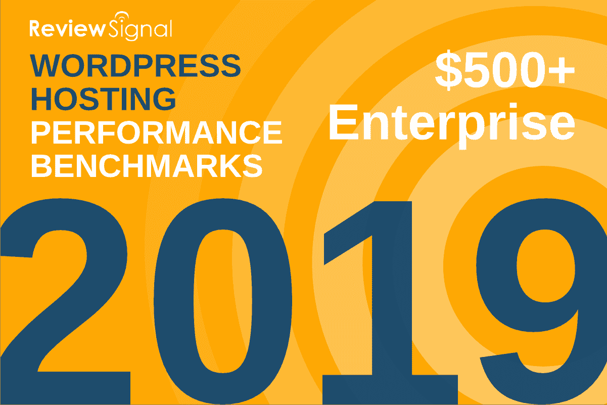
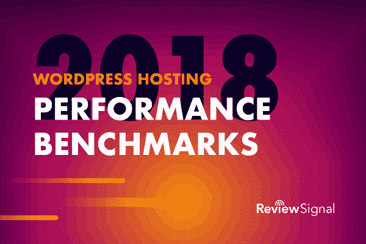
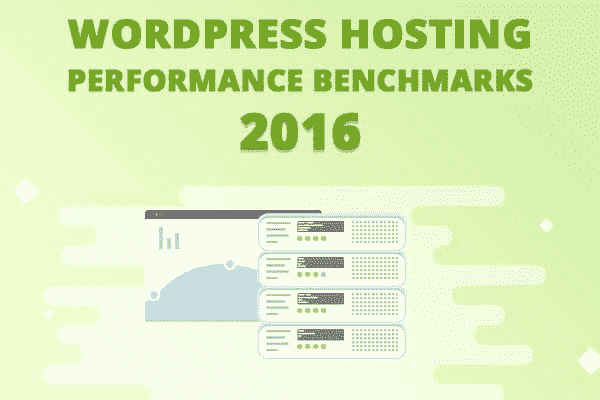
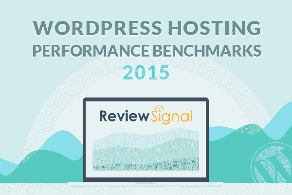
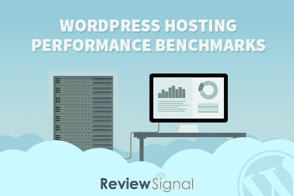

# 2019 年性能指标评测–kin sta 连续 5 年名列榜首

> 原文：<https://kinsta.com/blog/wordpress-performance-benchmarks/>

Review Signal 发布了其年度 [2019 WordPress 主机性能基准](https://reviewsignal.com/blog/wordpress-hosting-performance-benchmarks-2019/)，我们欣喜若狂的是，连续五年来，Kinsta 一直是仅有的两家在每个计划上获得**顶级地位的公司之一，从初创企业一直到企业。**

年复一年，我们证明了我们的托管平台(基于谷歌云平台从头开始构建)是一致的、可靠的，并且是业内最快的平台之一。🚀

说到托管 WordPress 主机，我们的目标之一一直是为我们的客户建立一个一体化的解决方案，使网站管理更加容易。像 [24/7 客户支持](https://kinsta.com/kinsta-support/)，可靠性和正常运行时间也是非常重要的一部分。

但对我们来说，最重要的因素之一是性能，并确保当您的网站流量激增时保持在线。如果主机无法扩展，这可能会为您的企业带来各种各样的成长烦恼。不幸的是，我们的许多客户在最终到达金斯塔之前，都经历了我们所说的“宿主跳跃”多年。迟到总比不到好，对吗？

I’ve been building websites for close to 20 years now. I’ve used my fair share of hosts (~60+). Kinsta is, without a doubt, the [best host](https://kinsta.com/blog/managed-wordpress-hosting/) I have used.Jason Dittberner, Website Engineer
[Trustpilot review](https://www.trustpilot.com/users/5c58af299e83e9bde589ef11)

## TL；博士

对于那些时间紧迫的人，这里有一个简短的总结:

1.  Kinsta 是市场上最快最可靠的 WordPress 主机之一！我们已经连续五年证明了这一点，并将继续这样做。我们是一家[白手起家的公司](https://kinsta.com/blog/bootstrapping-startup/)，不对风投负责。我们的整个平台建立在客户反馈的基础上。
2.  不需要花几千块。Kinsta 各种商家都买得起，而且比竞争对手便宜。我们为您提供**最佳价值、价格和性能**。阅读关于[廉价虚拟主机的真实成本](https://kinsta.com/blog/cheap-wordpress-hosting/)的真相。
3.  我们拥有您和您的开发人员需要的所有功能。你知道吗，Kinsta 每天会检查你的 WordPress 网站 720 次以确保正常运行？如果出现问题，我们的团队会知道。
4.  在追踪一个缓慢的查询或试图找出一个缓慢的插件时遇到困难？在 MyKinsta 仪表板的“工具”部分添加您自己的 New Relic 许可证密钥。
5.  Google 揭秘[SEO 排名前三因素](https://www.searchenginejournal.com/top-3-google-factors/308147/)，你猜怎么着？性能是其中之一。在 2019 年拥有一个缓慢的网站将会严重影响你的底线。

## 查看信号

对于那些可能不熟悉 [Review Signal](http://reviewsignal.com/webhosting) 的人来说，这是一个由 Kevin Ohashi 运营的独立虚拟主机评论网站。由于 Kevin 对细节和深入分析的关注，Review Signal 已经成为基准 WordPress 主机提供商的领先权威之一。事实上，这是他们连续第五年发布这些深入的性能指标评测。

2015 年，我们有幸采访了凯文·奥哈希，其中一个问题是，**“你觉得主机行业有什么令人惊讶的地方吗？”**

多么普遍的可怕。我开始创业是因为，在虚拟主机行业工作了十年之后，仍然没有一个诚实的虚拟主机评论网站让我放心推荐给别人。在运营我的网站 4 年后，很容易理解为什么。

我经常收到虚拟主机公司给我发的邮件，试图贿赂他们，让他们被评为最好的。最糟糕的是，他们中的大多数人甚至不隐藏它。这种行为对他们来说是正常的。因此，最令我惊讶的是，我经常对这个领域中许多公司的行为感到厌恶。这并不是说没有一些很棒的公司，但它们似乎是少数。最糟糕的是，这些欺诈/恶心的策略看起来非常有效，而真正的好人却因此打了一场更糟糕的硬仗。

Kevin OhashiFounder, Review Signal

## 基准设置和测试

在过去的五年里，我们看到了新的名字进入市场，也看到了熟悉的老面孔。一些受欢迎的主机提供商今年也没有被测试，这很可能是因为他们不想被测试。

Kevin 在两个月的时间里使用以下六种工具测试了两个不同的性能属性:**峰值性能**和**一致性**:

*   **LoadStorm:** 用于帮助模拟真实用户负载。
*   **LoadImpact:** 用于测试用户对主页的静态缓存。(Blitz 现已停产，用于 2016 年及之前的测试)
*   **正常运行时间+** **状态发生**:两个正常运行时间监控服务用于测量一致性。
*   **WebPageTest.org:** 用于从不同位置测试整体速度(仅限第一次查看)。
*   **WPPerformanceTester:** 用于基准测试 CPU、MySQL、WP 数据库性能。
*   **Qualysis SSL 报告等级:**检查您的 SSL 服务器等级。见他们的 [SSL 检查工具](https://www.ssllabs.com/ssltest/analyze.html)。2019 年的基准测试中增加了这项测试。

测试是在一个完全相同的 WordPress 虚拟网站上进行的，有完全相同的插件，除非某个特定的提供商的缓存机制需要一个插件。根据不同主机提供商的价格范围和计划，基准报告分为六个不同的层次:

*   < 25 英镑/月层级(Kinsta 在此层级没有计划)
*   25-50 美元/月(Kinsta 在 2017 年推出了 100 美元以下的托管计划)
*   51-100 美元/月层
*   每月 101-200 美元
*   每月 201-500 美元
*   每月 500 美元以上(企业级)

下面我们将总结一下 Kinsta 每年(2019、2018、2016、2015、2014)的表现，以及我们表现出色的几个地方。如果您想深入了解所有的基本细节，我们将提供每个基准测试的链接。

## WordPress 主机性能基准 2019🏆

2019 年，测试了 27 家不同的托管公司，这是迄今为止最多的一年。Kinsta 获得了全面的顶级地位。在过去的 5 年中，我们是仅有的两家在每项计划中都获得顶级地位的公司之一。

顶层是什么意思？Kevin 将这个头衔授予那些在整个测试期间保持 99.9%正常运行时间的托管公司，并且在负载测试期间几乎没有表现出性能下降，主要集中在错误上。

2019 Review Signal hosting performance benchmarks

### 金斯塔的表现

*   **$ 25-50/月层级:**处理负载风暴和负载影响测试，100%正常运行，没有任何问题。
*   **$ 51-100/月层级:**处理负载风暴和负载影响测试，100%正常运行时间无任何问题。
*   **$ 101-200/月层级:**完美的负载风暴和负载影响测试以及 100%的正常运行时间。
*   **$ 201-500/月层级:**处理负载风暴和负载影响测试，100%正常运行时间无任何问题。
*   **$ 500+/月(企业级):**完美的负载风暴和负载影响测试以及 100%的正常运行时间。

查看[Review Signal 2019 基准](https://reviewsignal.com/blog/wordpress-hosting-performance-benchmarks-2019/)中的所有测试。

## WordPress 主机性能基准 2018🏆

2018 年测试了 26 家不同的托管公司。这些基准本应在 2017 年，但被推迟到 2018 年初。

大多数大型共享主机都有流量波的问题，这并不奇怪——毕竟，这也是 WordPress 专门的主机公司最初诞生的原因——但在 2018 年的测试中，你可以清楚地看到许多优质主机也有问题。像 Pantheon、Cloudways 和 [Dreamhost](https://kinsta.com/dreamhost-alternative/) 这样的主机都在某些测试中苦苦挣扎。

2018 Review Signal hosting performance benchmarks

### 金斯塔的表现

*   **$ 51-100/月层级:**处理负载风暴和负载影响测试，100%正常运行时间无任何问题。
*   **$ 101-200/月层级:**完美的负载风暴和负载影响测试以及 100%的正常运行时间。
*   **$ 201-500/月层级:**处理负载风暴和负载影响测试，100%正常运行时间无任何问题。
*   **$ 500+/月(企业级):**完美的负载风暴和负载影响测试以及 100%的正常运行时间。

查看[Review Signal 2018 基准](https://reviewsignal.com/blog/2018/01/30/wordpress-hosting-performance-benchmarks-2018/)中的所有测试。

## 注册订阅时事通讯

### 想知道我们是怎么让流量增长超过 1000%的吗？

加入 20，000 多名获得我们每周时事通讯和内部消息的人的行列吧！

[Subscribe Now](#newsletter)

Kinsta 在企业级有着完美的表现。这就是为什么人们会花大价钱购买企业级主机。Kinsta 在两台显示器上都有完美的 100%正常运行时间。他们在两次负载测试中都没有错误，在负载风暴测试中的响应时间也是最低的。顶级表现是理所应当的。

Kevin OhashiFounder, Review Signal

## 2016 年 WordPress 主机性能指标评测🏆

2016 年测试了 26 家不同的托管公司。Kinsta [在 2017 年推出了 100 美元/月](https://kinsta.com/blog/new-kinsta/)以下的托管计划，因此对于这些测试，我们只被包括在四个层级中。

2016 Review Signal hosting performance benchmarks

### 金斯塔的表现

*   **$ 51-100/月层:**处理负载风暴和闪电测试，99%的正常运行时间没有任何问题。
*   **$ 101-200/月层:**处理负载风暴和闪电测试，99.98%的正常运行时间没有任何问题。
*   **$ 201-500/月层:**处理负载风暴和闪电测试，99.98%的正常运行时间没有任何问题。
*   **$ 500+/月(企业)层:**处理负载风暴和闪电测试，99.98%的正常运行时间没有任何问题。

查看[Review Signal 2016 基准](https://reviewsignal.com/blog/2016/09/14/wordpress-hosting-performance-benchmarks-2016/)中的所有测试。

Kinsta 进行了基本上完美的 LoadStorm 和 Blitz 测试。他们在其他测试中也没有任何缺陷。我不知道该说些什么来称赞他们的表演。

Kevin OhashiFounder, Review Signal

## 2015 年 WordPress 主机性能基准测试🏆

2015 年，测试了 19 家不同的托管公司。这些没有被分成不同的层。测试只是在主机提供商提供的服务器上运行，以检查测试的信号。注:2015 年，Kinsta 没有运行在谷歌云平台上。

Struggling with downtime and WordPress problems? Kinsta is the hosting solution designed to save you time! [Check out our features](https://kinsta.com/features/)

2015 Review Signal hosting performance benchmarks

### 金斯塔的表现

*   处理负载风暴和闪电战测试，问题很少。
*   在所有测试中 100%正常运行。

查看[Review Signal 2015 基准](https://reviewsignal.com/blog/2015/07/28/wordpress-hosting-performance-benchmarks-2015/)中的所有测试。

金斯塔有另一个顶级表演。性能略有下降，但这可能是因为我们测试了不同的产品。Kinsta 去年的测试是一个他们不再提供的共享计划。今年我们测试的是 2GB 的 VPS。专用资源很好，但有时与好邻居共享会给你带来一点额外的好处，这可以解释差异。不管怎样，Kinsta 非常出色地处理了所有测试，并为自己赢得了顶级地位。

Kevin OhashiFounder, Review Signal

## 2014 年 WordPress 主机性能基准测试🏆

2014 年，测试了 19 家不同的托管公司。这些没有被分成不同的层。测试只是在主机提供商提供的服务器上运行，以检查测试的信号。注:2014 年，Kinsta 没有运行在谷歌云平台上。

2014 Review Signal hosting performance benchmarks

### 金斯塔的表现

*   进行了完美的负载风暴测试。
*   在闪电战测试中表现近乎完美。
*   在所有测试中 100%正常运行

查看[Review Signal 2014 年基准](https://reviewsignal.com/blog/2014/11/03/wordpress-hosting-performance-benchmarks-november-2014/)中的所有测试。

A new-comer that jumped straight to the top of the performance tiers. Kinsta’s performance was amazing in the Load Storm 2000 logged in user test. They had the lowest peak response time and zero errors over a 30-minute test. They didn’t struggle with any tests whatsoever and showed zero downtime. Kinsta’s performance was top tier.Kevin OhashiFounder, Review Signal

## 摘要

Kinsta 引以为豪的是，年复一年，我们已经能够证明**我们的托管平台是** **一致、可靠和快速的！**

[Kinsta earned Top Tier status, 5 years in a row on all hosting plans. 🏆 Time after time, we show that our platform is consistent, reliable, and fast! 🚀Click to Tweet](https://twitter.com/intent/tweet?url=https%3A%2F%2Fkinsta.com%2Fblog%2Fwordpress-performance-benchmarks%2F&via=kinsta&text=Kinsta+earned+Top+Tier+status%2C+5+years+in+a+row+on+all+hosting+plans.+%F0%9F%8F%86+Time+after+time%2C+we+show+that+our+platform+is+consistent%2C+reliable%2C+and+fast%21+%F0%9F%9A%80&hashtags=webperf%2Cwebhosting)

我们对过去几年在基础设施方面所做的决策充满信心，并且很高兴看到结果有所回报。我们是第一个专门使用谷歌云平台的托管 WordPress 主机，我们认为我们的测试揭示了这个决定有多重要。

2019 年，我们的一些竞争对手已经跟进。但你可以放心，我们的团队比业内任何人都了解谷歌云平台。我们致力于为您提供最好的环境来发展您的业务，并在竞争中保持领先地位。查看我们的 [Why Us](https://kinsta.com/why-us/) 页面，了解我们与其他主机的区别。

如果您对我们的服务或平台有任何疑问，[请联系我们的技术销售团队](https://kinsta.com/contact-us/)，他们将非常乐意为您提供帮助。或者，如果你已经准备好了，让我们向你展示 Kinsta 的不同之处，[今天就迁移你的站点](https://kinsta.com/plans/)。我们所有的计划都包括一次或多次免费迁移。我们现在甚至有一个交易，根据您的迁移来源，我们将包括无限数量的免费迁移。

* * *

让你所有的[应用程序](https://kinsta.com/application-hosting/)、[数据库](https://kinsta.com/database-hosting/)和 [WordPress 网站](https://kinsta.com/wordpress-hosting/)在线并在一个屋檐下。我们功能丰富的高性能云平台包括:

*   在 MyKinsta 仪表盘中轻松设置和管理
*   24/7 专家支持
*   最好的谷歌云平台硬件和网络，由 Kubernetes 提供最大的可扩展性
*   面向速度和安全性的企业级 Cloudflare 集成
*   全球受众覆盖全球多达 35 个数据中心和 275 多个 pop

在第一个月使用托管的[应用程序或托管](https://kinsta.com/application-hosting/)的[数据库，您可以享受 20 美元的优惠，亲自测试一下。探索我们的](https://kinsta.com/database-hosting/)[计划](https://kinsta.com/plans/)或[与销售人员交谈](https://kinsta.com/contact-us/)以找到最适合您的方式。