# 如何搜寻和捕捉特色片段以获得更多流量

> 原文：<https://kinsta.com/blog/featured-snippets/>

你想让谷歌给你的网站增加[的流量吗？你当然会。但是，如果不生产更多的内容，建立更多的反向链接或者雇佣一个 SEO 专家，你怎么能做到这一点呢？](https://kinsta.com/blog/how-to-drive-traffic-to-your-website/)

两个字:**精选片段。**

在本指南中，我将解释它们是什么，为什么您应该关注它们，并引导您完成进入特色片段的具体步骤。

### TL；DR–如何将特色片段排在第 0 位

以下是我们将分享的关于如何优化特色片段的一些技巧的快速总结:

*   目标基于问题的关键词。
*   使用 Ahrefs 之类的工具检查 SERP 上是否有特色片段，以及它是什么类型(段落、列表、表格等)。
*   保持你的段落和句子相当短。
*   尽可能直接地回答问题。
*   用合乎逻辑的副标题来组织你的内容(H2、H3、H4 等)。
*   使用表格显示任何数据。
*   如果可能的话，将问题包含在答案中。
*   在内容的开头或结尾包含摘要。

现在，让我们深入了解一些有特色的片段。

## 什么是特色片段？

特色片段(也称为零位置)是对用户问题答案的简要总结。它们显示在搜索引擎结果页面(SERPs)的顶部，并且是从网页(希望是从你的网页)中提取的。

这里的目标是为用户提供一个快速直接的问题答案，甚至不需要点击特定的搜索结果/网站。

Support

想知道**怎么做披萨**？给你:

> 需要在这里大声喊出来。Kinsta 太神奇了，我用它做我的个人网站。支持是迅速和杰出的，他们的服务器是 WordPress 最快的。
> 
> <footer class="wp-block-kinsta-client-quote__footer">
> 
> 
> 
> <cite class="wp-block-kinsta-client-quote__cite">Phillip Stemann</cite></footer>

[View plans](https://kinsta.com/plans/)

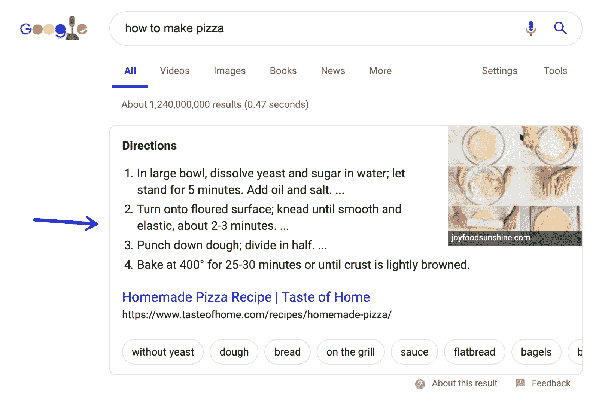

How to make pizza featured snippet

或者你可能想知道预订航班的最佳时间是什么时候:

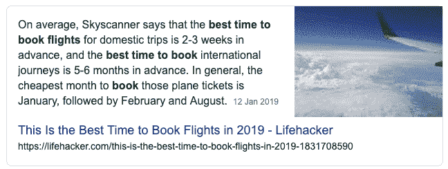

Book flights featured snippet

或者你可能想知道蝙蝠侠的秘密身份是谁:

Batman featured snippet

抱歉剧透！根据谷歌的说法，代码片段是为了*“增强并吸引用户在结果页面上的注意力”*。

## 什么不是特色片段？

让事情变得有点混乱的是，并不是所有出现在搜索引擎结果页面(SERPs)中的特性都是有特色的片段。

对于某些搜索，谷歌可以显示特殊的搜索结果。这些**不是**特色片段，可以包括:

### 丰富的答案

丰富答案(或即时答案)是由谷歌生成的答案，不需要你点击进入一个网站。

这些答案通常涵盖了一些事实，比如天王星有多大，或者帝国大厦有多高，如果你想知道的话，你可以从 381 米到 443 米:

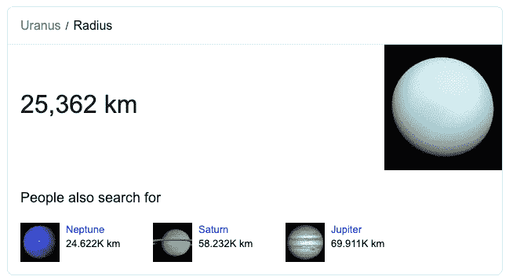

Rich answers

谷歌不会给像这样回答丰富的网站提供信用，因为根据他们的说法，这些信息属于公共领域。

### 知识图表

知识图答案由各种来源生成，出现在 SERPs 的右侧。

搜索品牌、人物或组织会引发以下情况:

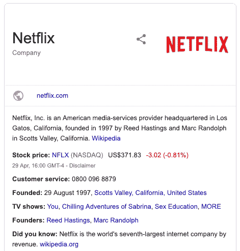

Knowledge Graphs in SERPs

### 丰富的片段

虽然这个包含了 snippet 这个词，但是和 featured snippets 没有任何关系。rich snippet 是对由结构化数据(或[模式标记](https://kinsta.com/blog/schema-markup-wordpress/))支持的有机结果的增强。

通常，你会在电子商务网站上看到这些。目的是通过星级评定、产品可用性和定价信息帮助结果脱颖而出:

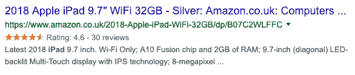

Rich snippet in SERPs

现在我们已经解决了这个问题，你知道实际上有几种不同类型的特色片段吗？

让我们来看看他们:

## 有哪些不同类型的片段？

特色片段有各种形状和大小。老实说，有五种主要类型:

1.  [段落](#paragraphs)
2.  [编号列表](#numbered-lists)
3.  [要点列表](#bullet-point-lists)
4.  [表格](#tables)
5.  [Youtube](#youtube)

### 1.段落片段

段落片段是您将看到的最常见的片段。他们的工作是直接回答搜索者的问题:

Featured snippet paragraph type

通常，这些片段也显示一个图像。然而，这些通常来自不同的来源(不是特色片段中的网站)。

段落片段通常针对包含搜索词的关键字显示，例如:

*   如何
*   怎么办
*   如何获得
*   whois
*   为什么是
*   什么是…

### 2.编号列表片段

当谷歌认为用户希望看到一系列步骤以完成一项任务时，它通常会显示编号列表片段，比如这个片段是关于*如何增强肌肉:*

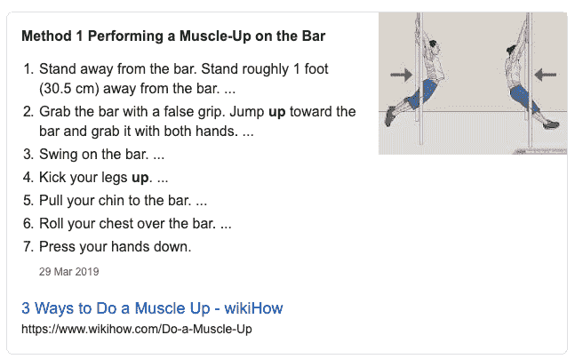

精选片段编号列表

### 3.项目符号列表片段

每个人都喜欢列表帖子，对吗？谷歌也不例外。只要看看这个片段就知道了 [*Looker 工作室模板*](https://sheetsformarketers.com/data-studio-templates/) *:*

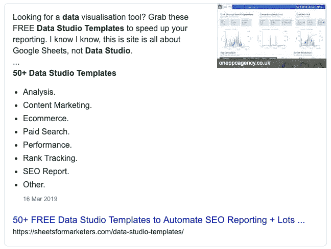

Featured snippets bullet point lists

对于这些有特色的片段，Google 通过提取文章每个部分的标题来格式化要点列表。

### 4.表格片段

虽然不太常见，但 Google 的爬虫可以很好地读取表中的数据。

通常，它不会从表中抓取所有信息。相反，它会将代码片段的数据重新格式化成它认为最有用的格式(为了更好的可读性)。

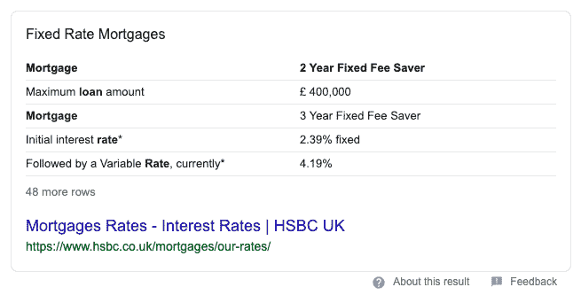

Featured snippets table

以上面的搜索词为例*‘抵押贷款利率’*。如果你看一下获取数据的页面，你会发现谷歌已经删除了很多行&列，以便在代码片段中提供一个简洁的答案。

### 5.YouTube 片段

谷歌不仅可以从网页上构建特色片段，还可以从 YouTube 等网站(如果它认为某个视频最符合查询条件)构建特色片段:

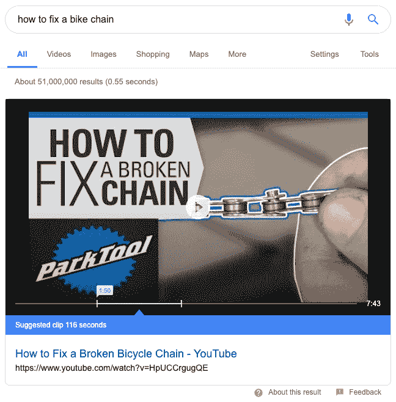

Featured snippets YouTube snippet

对于像*‘如何修理自行车链条’*这样的查询，一个视频结果是有意义的:跟随比阅读博客帖子更有助于你。为搜索者的需求创建内容时需要考虑的一些事情。

## 为什么您应该关注特色片段？(提示:为了获得更多点击)

如果你排在前十名，你很幸运:你有机会进入一个特色片段。

但是有什么好处呢？

好吧，显而易见的一点是你网站的点击量增加了。

根据 Ahrefs 对 200 万个特色片段的研究，8.6%的点击都指向了特色片段。

Average CTR of featured snippets (Image source: Ahrefs)

在某种程度上，当你在精选片段中排名时，你正在从其他有机结果中“窃取”流量。

现在，考虑到显示特色片段的关键词数量超过所有搜索的 12%,这是一个很大的潜在窃取流量。

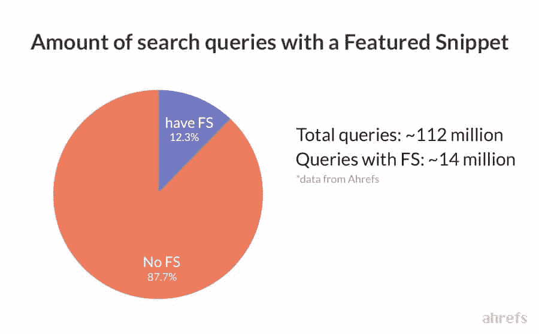

Search queries with featured snippets (Image source: Ahrefs)

追求零位置还有一个额外的好处:

只需对你的内容做一些调整，如果你进入特色片段，你几乎可以立即增加流量。提供你的网站排名很明显。

虽然并不都是好事…

由于这些片段在 SERPs 顶部占据了大量宝贵的空间，它们获得了更多的展示和点击。如果你的网站在他们的网站上，这很好，但是如果你和他们竞争，这就不太好了。

此外，加入这个 SERP 功能可能会导致流量和点击量下降。如果特色片段提供了一个用户问题的答案，而不需要离开 SERPs，你的流量就会受到影响。

毕竟，如果用户的问题在谷歌上已经得到了回答，他们就不需要点击进入你的网站。

这并不是要阻止寻找有特色的片段，只是要让你意识到它们并不是 SEO 的圣杯。

## 如何发现特色片段机会

使用合适的工具，寻找特色片段机会非常容易。当谈到追捕他们，有两种类型的关键字机会在这里:

*   你的网站的关键词已经在第一页上排名了
*   您可以在片段中排名的新关键字机会

让我们更详细地探讨这两个选项:

### 如何找到你已经排名的片段

可以说，赢得特色片段的最快方法是在第一页显示你已经排名的关键词，那里有特色片段。

幸运的是，当你使用像 Ahrefs 这样的工具时，找到这些机会是相当快的。

以下是找到它们的方法:

#### 第一步

前往 [Ahrefs 站点浏览器](https://ahrefs.com/site-explorer/)并进入您的域名。接下来，转到左侧面板中的**有机关键词**。

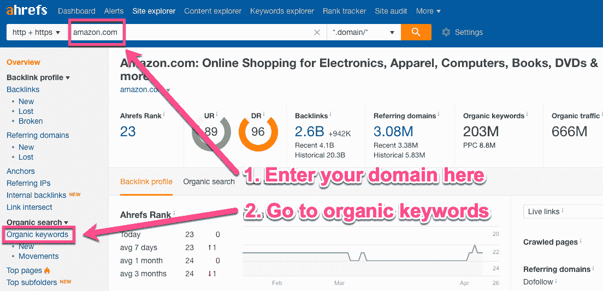

Ahrefs organic keywords

#### 第二步

在这份报告中，你会看到你的域名排名的所有有机关键词。从这里开始，Ahrefs 的关键字过滤选项可以非常容易地找到特色片段。

在页面顶部，点击 **SERP 功能**，选择特色片段并点击应用。

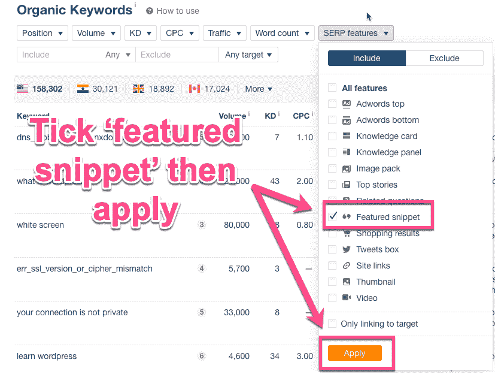

Ahrefs featured snippet

#### 第三步

现在你可以看到你的网站中所有包含特色片段的关键词。

请注意页面旁边的小语音标记符号，这意味着该页面当前显示在代码片段中。尼斯（法国城市名）

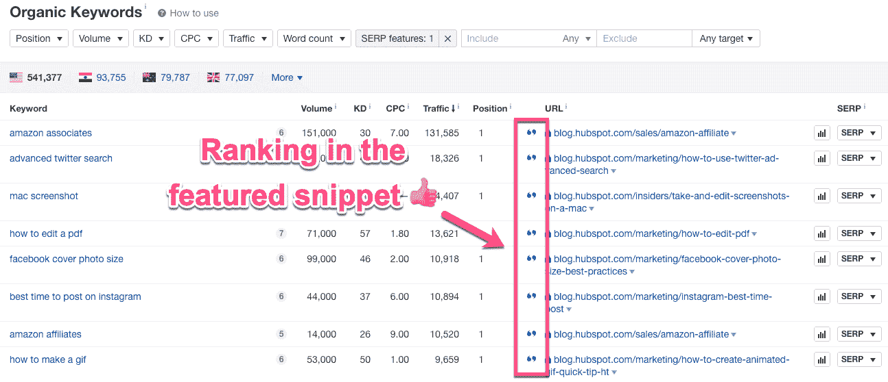

Ahrefs ranking for a featured snippet

#### 第四步

如果你想找到一些**快速获胜的机会**，你可以进一步筛选这个列表。

转到页面顶部的位置过滤器。在“至”框中添加 10，然后点击“应用”。

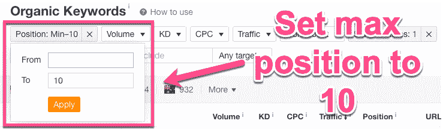

Ahrefs top 10 keywords in SERPs

这将显示您网站上排名第 1-10 位的页面(也称为第一页)，其中还有一个特色片段。

这些是你的速赢机会——它们允许你快速审核你的页面，看看你想要什么样的片段。

## 注册订阅时事通讯

### 想知道我们是怎么让流量增长超过 1000%的吗？

加入 20，000 多名获得我们每周时事通讯和内部消息的人的行列吧！

[Subscribe Now](#newsletter)

### 如何找到新的片段进行排名

好了，我们已经介绍了如何找到你已经排名的特色片段。

现在，让我们来找一些新的:

#### 第一步

回到 Ahrefs，但是这次转到[关键字浏览器工具](https://ahrefs.com/keywords-explorer)。在此添加“种子关键字”。请将此视为您想要制作的内容类型的总体主题:

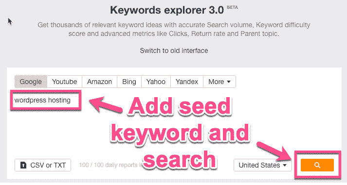

Ahrefs Keyword Explorer tool

#### 第二步

从左侧面板中，选择**短语匹配**。然后，在 SERP 功能下，勾选“特色片段”并应用。

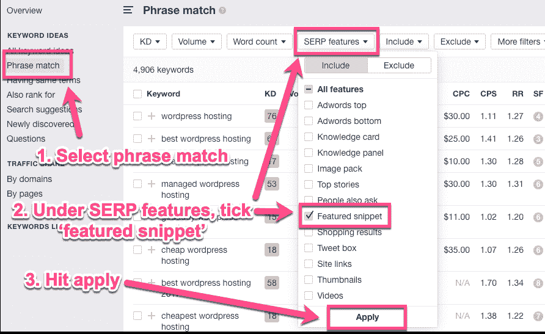

Ahrefs phrase match with featured snippets

#### 第三步

现在，您将有一个新关键字+特色片段机会的漂亮大列表，用于您输入的种子术语。

在这里你还可以做最后一件事。

对于每一个关键词，你可以点击 SERP 下拉菜单来查看什么网站当前在特色片段中。

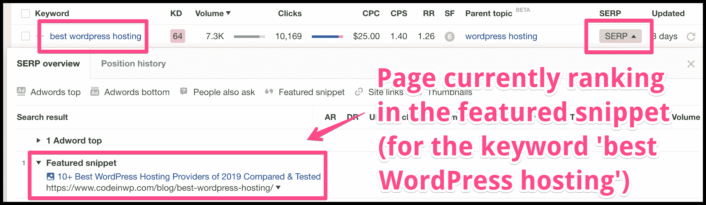

Page ranking for the featured snippet in SERPs

## 如何对特色片段进行排名(3 步)

现在你知道什么是特色片段，不同的类型以及如何找到它们。只剩下一件事了:如何真正得到它们。

让我们先把坏消息说清楚:

为了在精选片段中排名，您需要首先在第一页上排名。

几乎所有的摘录结果都来自排名第一的页面。因此，如果你还没有达到目标，你需要提高你的搜索引擎优化和排名。

确保你的网站加载速度快，写人们想读的内容，跟上谷歌排名因素的速度，为每个页面写独特的元数据，并有一个可靠的 T2 搜索引擎优化清单来发布你的内容。

很明显，为了提高搜索引擎优化性能，优化一个网站还有更多的事情要做，但是这些都是你应该了解的一些基本知识。

好了，让我们开始讨论如何对特色片段进行排名:

### 第一步:做一些基于问题的关键词研究

创作好的内容要从[关键词研究](https://kinsta.com/blog/keyword-research/)开始。以特色片段为目标没有什么不同。

事实上，Ahrefs 发现大多数特色片段是由长尾关键词触发的[。](https://ahrefs.com/blog/featured-snippets-study/)

如果你想知道，长尾关键词是高度集中的搜索查询。一般来说，他们的搜索量较低(但并不总是如此)，但转化的机会较高。

#### 如何快速找到长尾关键词:

去谷歌，输入一个关键词。现在观看自动完成功能为您生成长尾关键词:

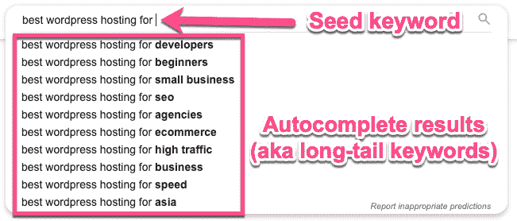

Autocomplete long-tail keywords

将页面向下滚动一点，您将能够选中“人们也会问”框:

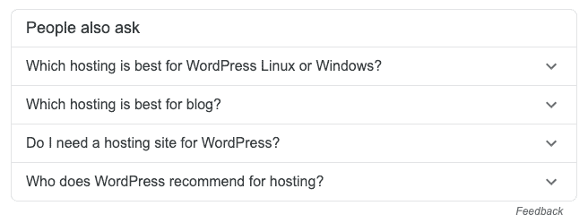

People also ask box in SERPs

然后，就在页面的底部，有一个“相关搜索”框:

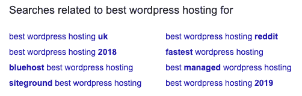

Searches related to box in SERPs

这是一些非常有用的长尾关键词研究，你不用离开谷歌就可以做。

或者，你可以前往 [Ahrefs 关键字浏览器](https://ahrefs.com/keywords-explorer)。添加您的种子关键字，进入所有关键字想法，过滤，只显示 6 个词或更多的关键字。你可以根据你的定位来玩这个数字:

Struggling with downtime and WordPress problems? Kinsta is the hosting solution designed to save you time! [Check out our features](https://kinsta.com/features/)

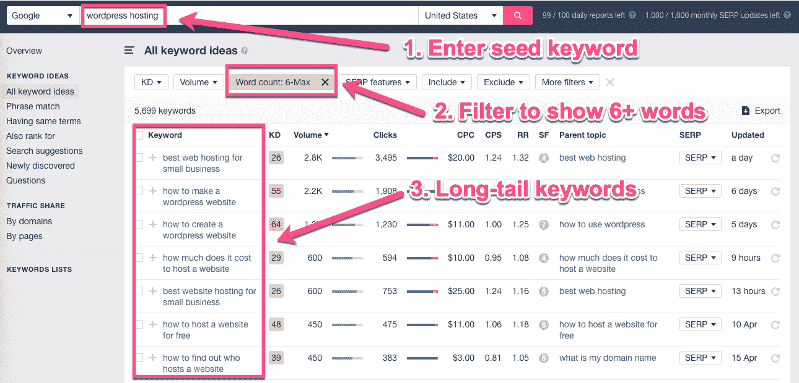

Ahrefs seed keyword

一般来说，特色片段是为了回答问题而设计的。

因此，获得零位置的最佳方法之一是通过进行关键字研究来逆向工程这个目标。

查找与问题相关的关键词，并创建回答这些问题的内容…

#### 回答人们提出的问题

理解你的听众是有帮助的。寻找大量的关键词可能不是对你时间的最好利用。相反，寻找人们真正在问的问题。

像[回答公众](https://answerthepublic.com/)这样的免费工具，可以让你超快的生成长尾问题关键词。

只需输入一个种子关键词(或主题),它就会在一个按类型划分的可视地图中生成人们询问的大量问题。别担心，还有一个 CSV 导出选项:

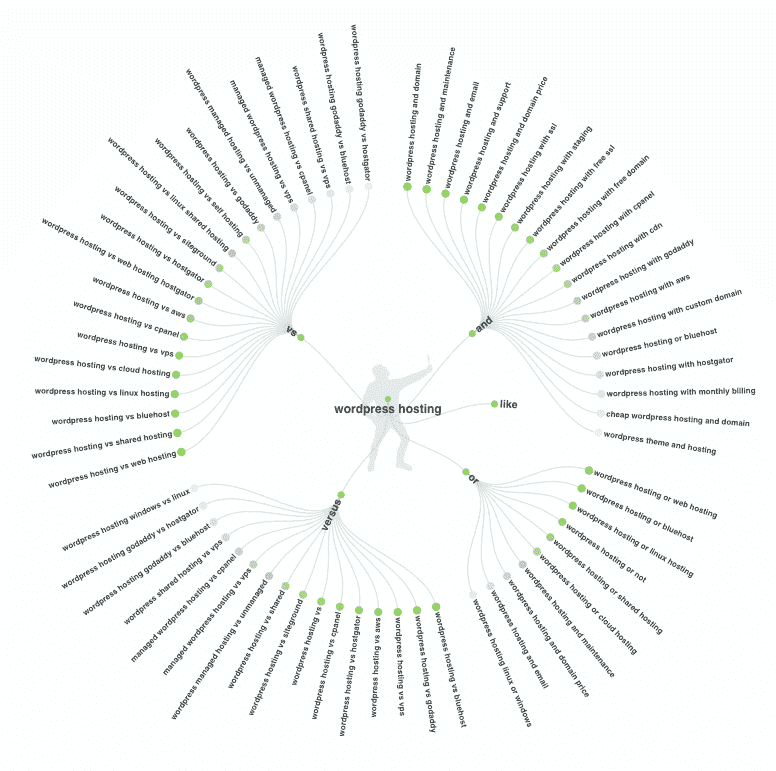

Answer the Public

不要忘记，当涉及到研究人们问的问题时，利用你对目标用户的了解。

他们在网上都去哪里玩？在论坛、Quora、Reddit，还是特定的社交渠道？关键是:去你的潜在客户所在的地方，看看他们在问什么问题。

然后你所要做的就是创建回答这些问题的内容，这说起来容易做起来难。

### 第二步:创建并格式化你的内容(这样谷歌就可以轻松阅读)

知道针对什么关键词，写什么内容，才是成功的一半。为了获得有特色的片段，格式起了很大的作用。

片段倾向于只显示表格或文本的几行。事实上，Moz [分析了 140 万个特色片段](https://moz.com/blog/what-we-learned-analyzing-featured-snippets)，发现一个特色片段段落的最佳长度大致为 **40 到 50 个单词**。

为了最大限度地增加你被关注的机会，你需要用一个介绍性的句子直接回答这个问题，然后在剩下的内容中更深入。

例如，以下是关键字*“什么是目录反向链接”*的特色片段:

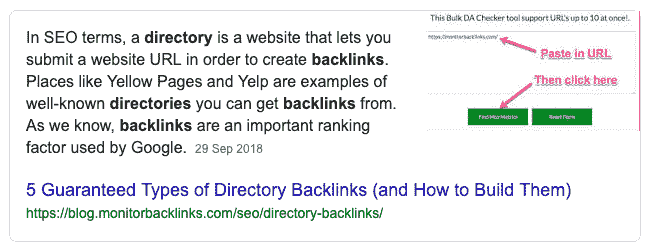

Featured snippet

这个片段直接用几句话回答了问题。如果你随后查看[的实际排名页面](https://blog.monitorbacklinks.com/seo/directory-backlinks/)，你会看到答案就在这里:

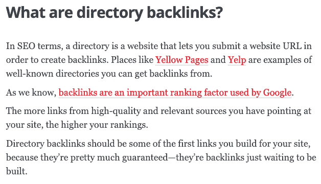

Featured snippet content on the website itself

文章开头的这一部分直接回答了这个问题，接下来的内容会更深入地讨论这个主题。

### 为位置 0 设置内容格式

正确格式化你的内容有两个 SEO 驱动的目标:帮助你的用户阅读它和帮助 Google 阅读它。

首先，你需要用标题和副标题来组织你的内容，并把它分成有逻辑的部分。

你需要使用基本的 HTML 标签来格式化你的页面，这样谷歌就可以有效地抓取它。对于特色片段搜索，您最好的朋友是:

*   问题的`<h2>`和`<h3>`标签，
*   `
`正文文本的段落标签
*   列表项的`<ol>`或`<ul>`和`<li>`。

对于 WordPress，你有 H2、H3、H4 标签以及标准段落(`
`)标签。在这里遵循一个层次，这样你不仅会得到一个自然的流程，而且是一个逻辑的流程。

如果可能的话，你应该在你的副标题中包含关键词，如果可能的话，在页面顶部包含一个内容摘要列表。

比如，我们来简单看一下这篇[如何做一个 app](https://learnappmaking.com/how-to-make-an-app/) 的文章:

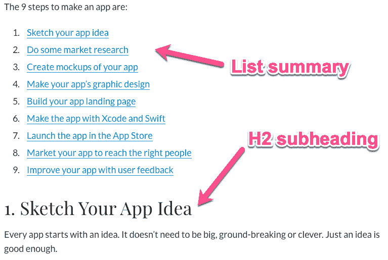

Featured snippet structure

这里是这篇文章标题结构的一个快速概述:

*   **H1—**如何制作应用程序(9 个步骤)
*   H2-1。勾画你的应用理念
*   H2-2。做一些市场调查
*   H2——3。创建你的应用模型
*   **Ect**

这不是文章的全部结构，只是给你一个提示。

总标题(H1)告诉我们和谷歌这个页面是关于什么的。接下来，小标题(H2)详细介绍了速度测试的各个方面。

如果这篇文章想扩展一些信息，它可以使用 H3 的标题，在相关的 H2s 下进行更详细的描述。

这样想，如果有人要略读你的内容，他们能通过阅读副标题来理解文章的整体意思吗？

如果你能自信地回答是，你就在正确的轨道上。

一旦你的标题准备好了，你还需要格式化你内容的主体。这取决于你要展示的信息类型，这里有一些快速而宽松的规则:

*   对于定义或答案，使用段落
*   对于项目列表或多步骤流程，使用项目符号或编号列表
*   对于数据或比较，使用表格

不要忘记，在可能的情况下，使用相关的图片来帮助说明和解释你的答案。

哦，还有一件事:确保你的格式适合你想进入的片段。

### 步骤 3:为您想要的代码片段设置内容格式

我们已经简要地谈到了这一点，但是每种类型的特色片段都需要一些不同的格式。

根据 SEMrush 对 1000 万个 SERPs 的研究，最受欢迎的片段类型是:

*   第 53.2 段
*   列出 35.5%
*   表格 11.5%

下面是 Moz 整理的一些[最佳精选片段长度](https://moz.com/blog/what-we-learned-analyzing-featured-snippets):

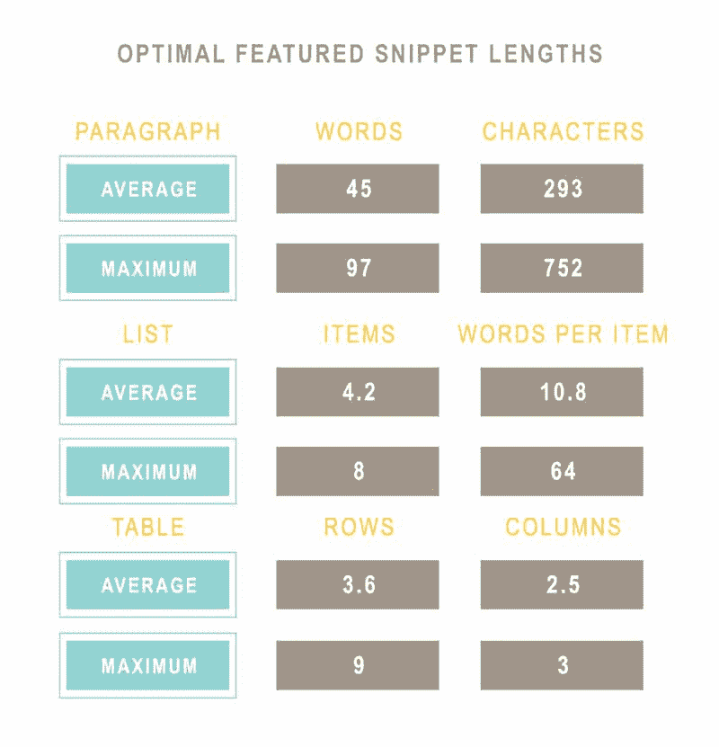

Featured snippet lengths (Image source: Moz)

让我们来了解一下每一种格式需要记住的一些格式技巧:

#### 段落类型特色片段的格式

对于段落片段，谷歌只会显示你内容的摘录。因此，请确保用 40-50 个单词回答问题，并在副标题中包含关键词/问题:

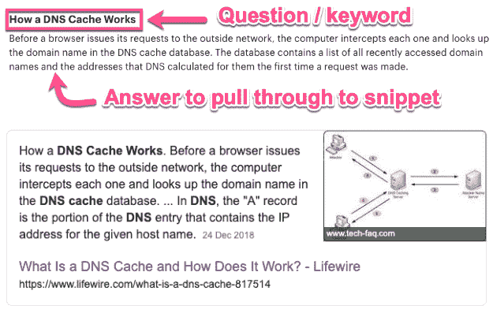

Formatting for paragraph featured snippets

要获得段落中的特色片段答案，您可能需要将内容的格式调整为:

*   将问题包含在副标题中
*   用一段话直接回答问题
*   然后在文章中更详细地讨论。

你希望将最重要的信息(回答问题的信息)放在页面的顶部。然后，随着文章的继续，你可以包括更详细的信息。

#### 列表类型特色片段的格式

为了进入列表类型代码段，您需要确保您的内容以一种逻辑的方式格式化。要么把你的清单项目放在项目符号里，要么放在有组织的副标题里。

为了清楚起见，你可以在你的标题中加入数字，这样就可以清楚地看出有一个逻辑流程:

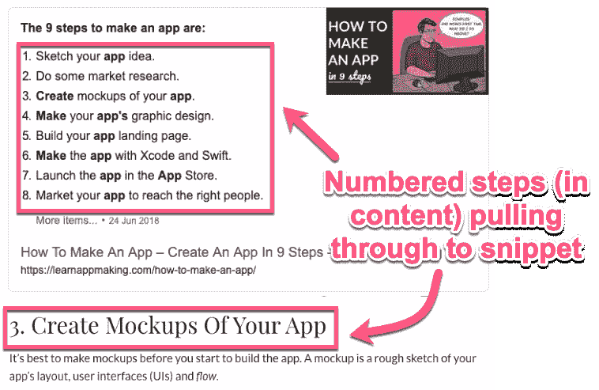

Formatting list type featured snippets

创建列表时，尽量使其长度超过 8 点。为什么？因为这是谷歌将显示的最大值，所以它会添加一个“更多项目”链接。例如:

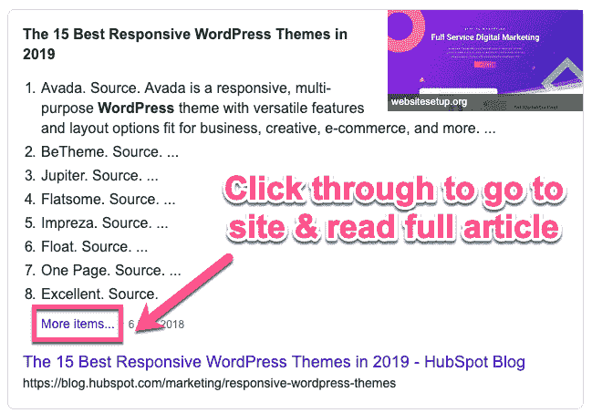

More items link in a featured snippet

这意味着人们将不得不点击你的网站来找出剩下的点。你好交通！

#### 表格类型特色片段的格式

表格特色片段非常适合显示数据。

给自己一个好的开始，把任何对用户有用的数据放在表格中，加上相关的标题，这样就有机会被精选出来。

对于表格片段，Google 最多显示 3 列 9 行。然而，就像列表片段一样，如果你的表有更多，Google 会添加一个点击链接。

搜索*“相机价格”*，会显示以下片段，该片段向链接添加了“另外 11 行”以获取更多数据:

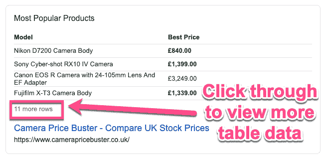

Table featured snippet more rows link

## 摘要

让你的内容在 SERPs 的特色片段中排名可能是一项艰巨的工作。排在前十名的第一位同样是很辛苦的工作。

但是像很多事情一样，一些努力和坚持会有回报的。SEO 是马拉松，不是短跑。如果你已经有了很棒的内容，有特色的片段可能会很快胜出。

现在前进，寻找并捕捉一些有特色的片段。我们很想听听下面的评论。

* * *

让你所有的[应用程序](https://kinsta.com/application-hosting/)、[数据库](https://kinsta.com/database-hosting/)和 [WordPress 网站](https://kinsta.com/wordpress-hosting/)在线并在一个屋檐下。我们功能丰富的高性能云平台包括:

*   在 MyKinsta 仪表盘中轻松设置和管理
*   24/7 专家支持
*   最好的谷歌云平台硬件和网络，由 Kubernetes 提供最大的可扩展性
*   面向速度和安全性的企业级 Cloudflare 集成
*   全球受众覆盖全球多达 35 个数据中心和 275 多个 pop

在第一个月使用托管的[应用程序或托管](https://kinsta.com/application-hosting/)的[数据库，您可以享受 20 美元的优惠，亲自测试一下。探索我们的](https://kinsta.com/database-hosting/)[计划](https://kinsta.com/plans/)或[与销售人员交谈](https://kinsta.com/contact-us/)以找到最适合您的方式。