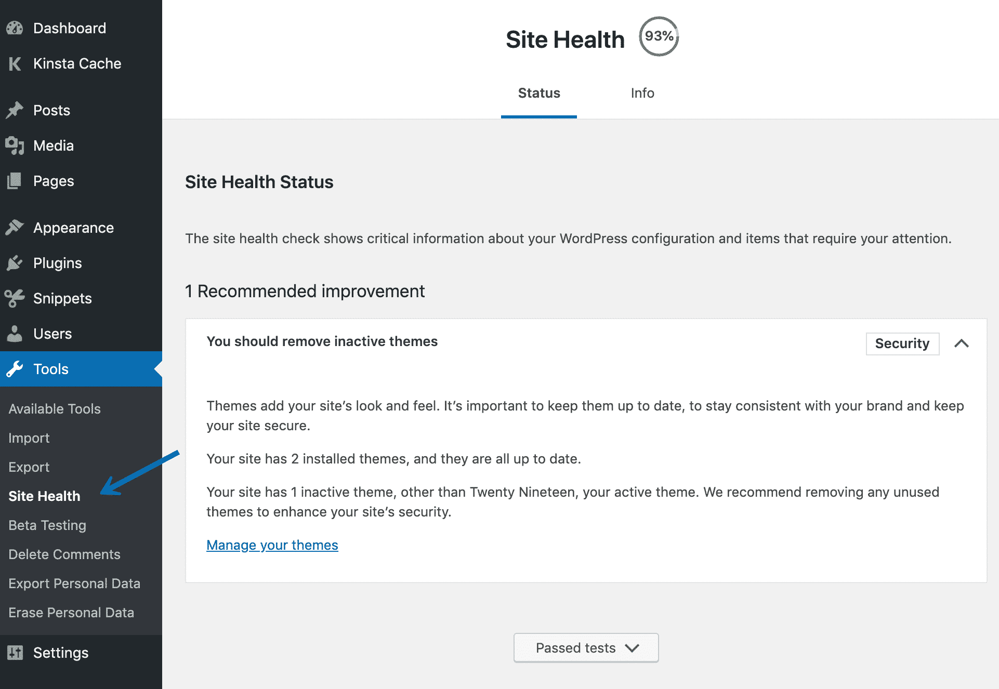
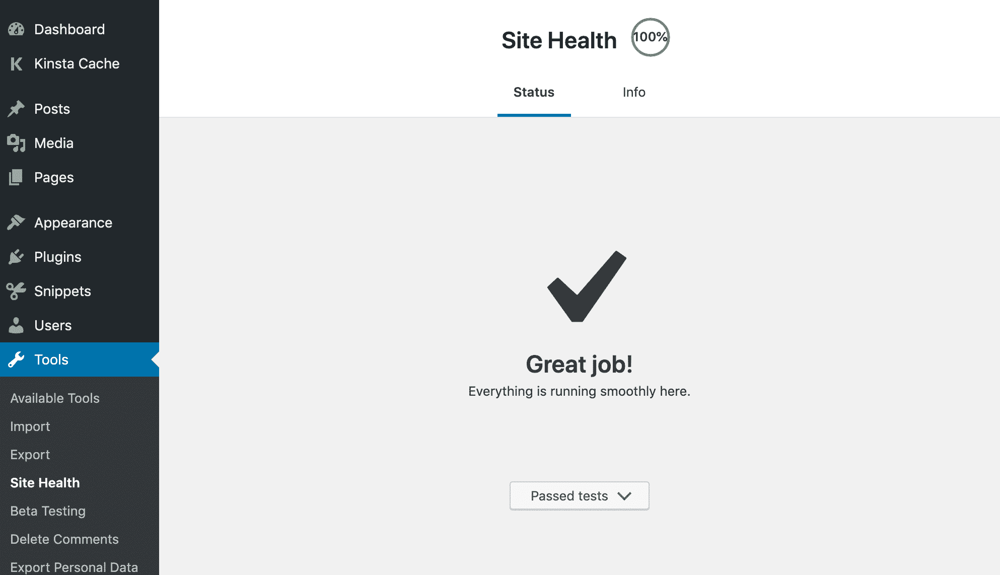
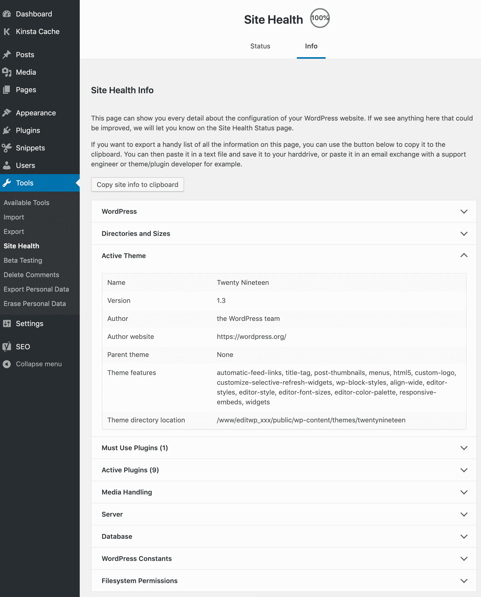
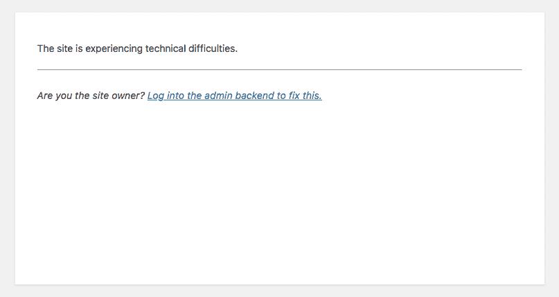
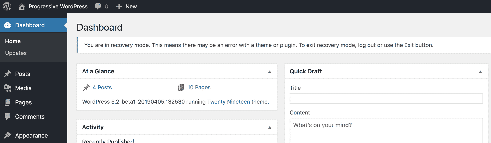
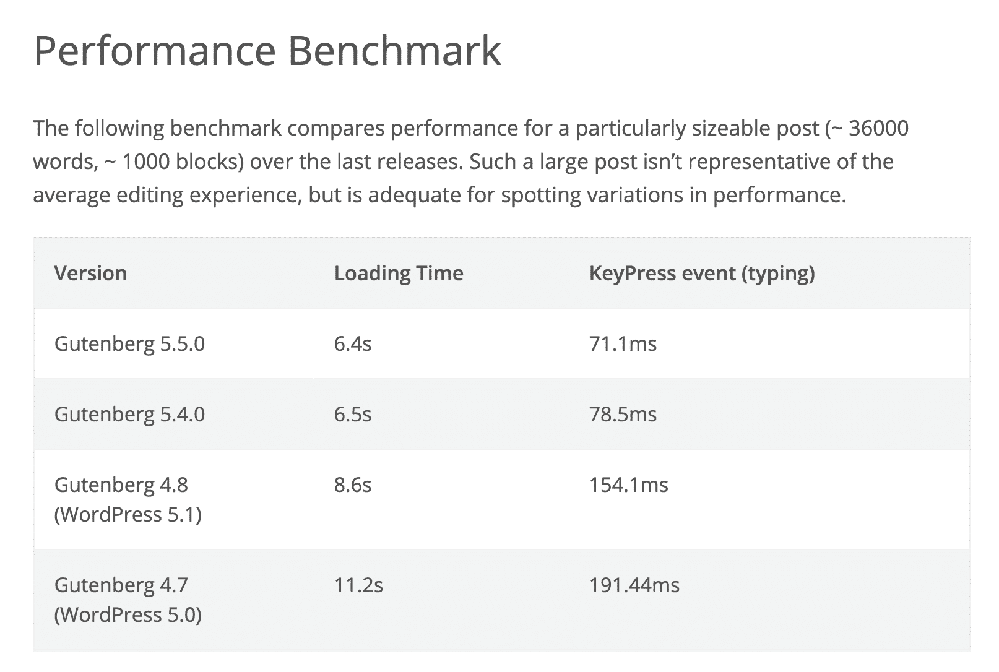
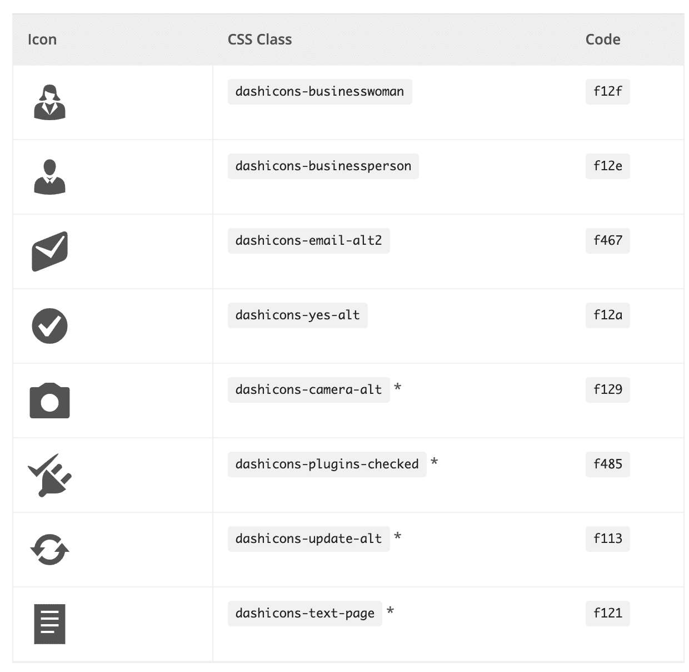
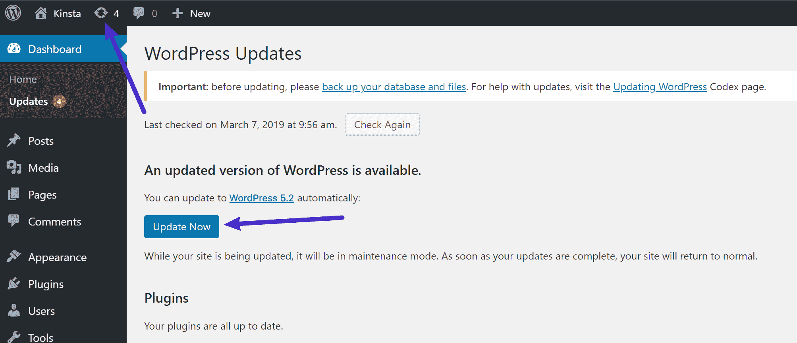
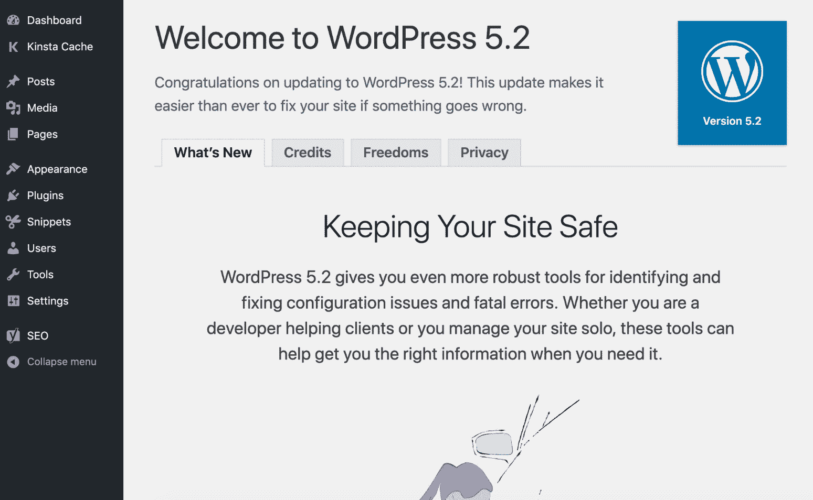

# WordPress 5.2 的新功能(站点健康和 PHP 错误保护)

> 原文：<https://kinsta.com/blog/wordpress-5-2/>

WordPress 5.2“张博”于 2019 年 5 月 7 日正式发布，并提供下载。

这个版本有很多令人兴奋的变化，最大的变化是新的网站健康检查工具，它将有助于教育用户，并为开发人员提供他们需要的基本信息。其他改进包括 PHP 错误保护(更少的死亡白屏)，块编辑器改进，新的图标和表情符号，以及各种开发人员和可访问性更新。

**更新**:[WordPress 5.3 的新功能](https://kinsta.com/blog/wordpress-5-3/)

正如 WordPress 团队描述的那样:

> WordPress 5.2 给了你更强大的工具来识别和修复配置问题和致命错误。无论您是帮助客户的开发人员还是独自管理您的网站，这些工具都可以在您需要时帮助您获得正确的信息。

这是自从在 [WordPress 5.0](https://kinsta.com/blog/wordpress-5-0/) 中推出 WordPress 块编辑器(又名古腾堡)以来的第二个主要版本。下面我们将深入到所有新的改进和最重要的变化，你会发现这个最新的 WordPress 版本。

## 站点运行状况检查

我们在 WordPress 5.1 中看到了第一个网站健康检查功能，当时他们为插件和主题添加了 [PHP 版本兼容性检查](https://kinsta.com/blog/wordpress-5-1/#php-version-compatibility-checks-for-plugins-and-themes)。在 WordPress 5.2 中，他们增加了一个全新的工具，带有两个新的页面来帮助[调试常见的 WordPress 问题](https://kinsta.com/blog/wordpress-debug/)，这些问题是由于服务器和软件配置、PHP 版本等原因造成的。

> Kinsta 把我宠坏了，所以我现在要求每个供应商都提供这样的服务。我们还试图通过我们的 SaaS 工具支持达到这一水平。
> 
> <footer class="wp-block-kinsta-client-quote__footer">
> 
> 
> 
> <cite class="wp-block-kinsta-client-quote__cite">Suganthan Mohanadasan from @Suganthanmn</cite></footer>

[View plans](https://kinsta.com/plans/)

### 站点健康状态

在“工具”→“站点健康”下，有一个名为“状态”的新页面站点健康检查显示了关于你的 WordPress 配置和需要你注意的项目的关键信息。

WordPress Site Health

你可能马上会注意到的一件事是，他们在页面顶部添加了一个基于你的网站通过多少测试的百分比分数等级。有些人对此很不高兴，开发者之间也在讨论是否应该有一个分级系统。主要原因是分数有时会产生额外的问题，因为用户痴迷于 100%的分数。

然而，我们很高兴看到这一点，因为这将有助于提高用户的意识。例如，检查不活跃的插件和主题是很重要的。为什么？

许多人没有意识到，仅仅因为一些东西在你的 WordPress 站点上是不活跃的，并不意味着有人不能执行代码，如果他们直接浏览它。因此，为了保证你的 WordPress 站点的安全，建议完全删除不活跃的主题和插件。

新站点运行状况工具中的测试包括对以下性能和安全相关项目的检查:

#### 性能检查🚀

*   最新的 WordPress 版本
*   [PHP 的最新版本](https://kinsta.com/blog/php-versions/)
*   最新的 SQL server
*   安装了必需的和推荐的 PHP 模块
*   支持 UTF8MB4
*   预定事件
*   工作中的 [HTTP 请求](https://kinsta.com/blog/make-fewer-http-requests/)
*   REST API 可用
*   可以执行回送请求

#### 安全检查🔒

*   仅运行活动主题
*   最新插件
*   HTTPs 连接
*   安全通信
*   调试模式关闭
*   可以和 WordPress.org 交流
*   后台更新正在运行

如果你是 Kinsta 的客户，很容易得到 100 分，因为我们平台上的一切都是最新的。😉

Site Health tool in WordPress – 100% score

测试也可以通过`site_status_tests`过滤，这意味着插件或主题开发者可以添加他们自己的测试，或者删除现有的测试。[查看更多信息](https://make.wordpress.org/core/2019/04/25/site-health-check-in-5-2/)。

### 站点健康信息

在“工具”→“站点健康”下，有另一个名为“信息”的新页面这是一个找到关于你的 WordPress 站点配置的有用调试信息的地方，你可以和开发者、主机提供商等分享。有一个方便的“复制网站信息到剪贴板”按钮，可以让你轻松地抓取信息并粘贴到一个文本文件中，与第三方分享。

WordPress Site Health Info

网站健康信息页面包含数百个关于你的 WordPress 网站的不同数据点。毫无疑问，这个新页面将帮助开发者更快地从用户那里获得他们需要的信息。

这里只是一个很小的快照，你可以很快看到一些非常棒和非常有帮助的细节。

*   WordPress: WordPress 版本，站点语言，用户语言，主页 URL 和站点 URL，永久链接结构，[多站点](https://kinsta.com/blog/wordpress-multisite/)检查，用户数量。
*   **目录和大小:** WordPress 目录位置，大小，上传位置和大小，主题位置和大小，插件位置和大小，数据库大小，总安装大小。
*   **活动主题:**主题名称、版本、作者、作者网站、父主题、主题特征、主题目录位置。
*   **必须使用插件:**当前运行的任何必须使用插件的详细信息，版本号，以及作者姓名。
*   **活动插件:**运行的活动插件，版本号，作者名。
*   **媒体处理:**活动编辑器，ImageMagick 版本号，字符串，资源限制，GD 版本，Ghostscript 版本。
*   **服务器:**服务器架构(如 Linux、Windows 等。)、Web 服务器(如 [Nginx](https://kinsta.com/knowledgebase/what-is-nginx/) 或 [Apache](https://kinsta.com/knowledgebase/what-is-apache/) )、PHP 版本、PHP SAPI、PHP 最大输入变量、时间限制、[内存限制](https://kinsta.com/knowledgebase/wordpress-memory-limit/)、最大输入时间、上传最大文件大小、发布最大大小、cURL 版本、SUHOSIN 状态、Imagick 库状态、[。htaccess 规则](https://kinsta.com/knowledgebase/wordpress-htaccess-file/)。
*   **数据库:**扩展名，服务器版本，客户端版本，数据库用户，主机，名称，前缀。
*   **WordPress 常量:** ABSPATH，WP_HOME，WP_SITEURL，WP_CONTENT_DIR，WP_PLUGIN_DIR，WP_MAX_MEMORY_LIMIT，WP_DEBUG，WP_DEBUG_DISPLAY，WP_DEBUG_LOG，SCRIPT_DEBUG，WP_CACHE，CONCATENATE_SCRIPTS，COMPRESS_SCRIPTS，COMPRESS_CSS，WP_LOCAL_DEV。
*   **文件系统权限:**检查以下目录，看它们是否可写。主要 WordPress 目录，wp-content 目录，上传目录，插件目录，主题目录，必须使用插件目录。

[WordPress 5.2 的新站点健康工具为开发者提供了惊人的调试信息，以更好地帮助用户！👏 点击推文](https://twitter.com/intent/tweet?url=https%3A%2F%2Fkinsta.com%2Fblog%2Fwordpress-5-2%2F&via=kinsta&text=WordPress+5.2%27s+new+Site+Health+tool+provides+amazing+debugging+info+for+developers+to+better+help+users%21+%F0%9F%91%8F&hashtags=WordPress%2Cwebdev)

## PHP 错误保护

WordPress 5.1 最初计划引入一个叫做“致命错误保护”的新功能，这个功能可以在更新 PHP 时防止 WordPress [白屏死机](https://kinsta.com/blog/wordpress-white-screen-of-death/)。然而，由于几个严重的缺陷，这一功能被推迟。现在它已经包含在 WordPress 5.2 中。

有了这种保护，WordPress 将会识别出致命错误的发生，并在 WordPress 管理仪表板中暂停违规的主题或插件，这样你仍然可以登录到你的网站的后端，并(希望)修复问题。对于不太懂技术的用户来说，这是一个很棒的新功能。我们只能说，我们希望这个功能在几年前就添加了！

然而，当测试一个新版本的 PHP 时，我们总是推荐使用一个[阶段环境](https://kinsta.com/help/staging-environment/)。

如果您的网站在升级 PHP 版本时遇到问题，它在前端看起来会像下面的图片，但是您仍然可以登录到后端来解决问题。

Fatal error protection in WordPress 5.2

在后端，你会看到一条消息，让你知道你的 WordPress 站点目前处于恢复模式，可能有一个主题或插件出错。

Admin backend while in recovery mode (Image source: [WordPress.org](https://make.wordpress.org/core/2019/04/16/fatal-error-recovery-mode-in-5-2/))

## 杂项开发人员更新

WordPress 5.2 也为开发者带来了改进；从对 block editor 和隐私政策页面的改进、新的 WordPress hook、对编码标准的更新等等。

### 块编辑器改进

WordPress 5.2 附带的块编辑器 (Gutenberg)有几十处[改进。一些引起了我们的注意:](https://make.wordpress.org/core/2019/04/17/whats-new-in-gutenberg-17th-april/)

*   在 5.0 中，`WP_Screen::is_block_editor()`被引入以允许开发者根据是否加载块编辑器来有条件地执行代码。然而，这个问题在 WordPress 5.2 中已经得到了解决。参见 [#46195](https://core.trac.wordpress.org/ticket/46195) 。
*   媒体和文本块得到了增强。
*   图像和块大小调整器比以前好多了。
*   在加载时间方面有所改进。

Block editor performance in WordPress 5.2 (Image source: [WordPress.org](https://make.wordpress.org/core/2019/04/17/whats-new-in-gutenberg-17th-april/))

### PHP 编码标准更新

WordPress 现在正式推荐你的主机提供商运行 [PHP 5.6 或更高版本](https://wordpress.org/about/requirements/)。好奇的话，Kinsta 最高支持 PHP 7.3！

## 注册订阅时事通讯

### 想知道我们是怎么让流量增长超过 1000%的吗？

加入 20，000 多名获得我们每周时事通讯和内部消息的人的行列吧！

[Subscribe Now](#newsletter)

有了 WordPress 5.2，这意味着开发者可以利用新的编码标准，比如名称空间、匿名函数、短数组语法、短三元语法和条件赋值。如果你是一名开发者，并且已经在 PHP 7 或更高版本上运行了一段时间，这可能不会影响你，但是很高兴看到 WordPress 进行更新。

阅读更多关于编码标准的[更新。](https://make.wordpress.org/core/2019/03/26/coding-standards-updates-for-php-5-6/)

### 隐私更新

WordPress 5.2 为使用隐私政策页面和数据导出的开发者带来了一些改进。

首先是四个新的助手，它们将使定制隐私政策页面变得更加容易:

*   新功能:`is_privacy_policy()`
*   一个新的主题模板文件:`privacy-policy.php`
*   新体类:`.privacy-policy`
*   新菜单项类别:`.menu-item-privacy-policy`

第二个变化与数据导出有关:

用户数据导出不再使用硬编码列表，而是现在使用`wp_kses()`中默认的允许标签列表。新的过滤现在也可用。

在 WordPress 5.2 中阅读更多关于[隐私更新的内容。](https://make.wordpress.org/core/2019/04/24/developer-focused-privacy-updates-in-5-2/)

### 编写 JavaScript 的改进

通过在 [@wordpress/scripts 包](https://www.npmjs.com/package/@wordpress/scripts)中添加 webpack 和 Babel 配置，开发者将不必担心设置复杂的构建工具来编写现代 JavaScript。阅读更多关于 [JavaScript 改进的内容。](https://make.wordpress.org/core/2019/03/25/building-javascript/)

### 新的身体标记挂钩

WordPress 5.2 增加了一个新的`wp_body_open()`钩子，让主题支持在`<body>`元素的开始注入代码。WordPress 团队鼓励主题开发者开始使用这个。阅读更多关于其他[杂项开发者更新](https://make.wordpress.org/core/2019/04/24/miscellaneous-developer-updates-in-5-2/)的信息。

## 新的表情符号和图标

视觉更新方面，WordPress 5.2 有了新的表情符号和大图标。

Struggling with downtime and WordPress problems? Kinsta is the hosting solution designed to save you time! [Check out our features](https://kinsta.com/features/)

### Twemoji 已更新

在 WordPress 5.2 中，添加了最新版本的 [Twemoji](https://blog.emojipedia.org/twemoji-12-0-emoji-changelog/) ，12.0.1。第 12 版包括 230 个新表情符号，包括无障碍表情符号和我们个人最喜欢的树懒。参见 [#46805](https://core.trac.wordpress.org/ticket/46805) 。

Twemoji 12.0

### 新戴世康

图标用来美化你的 WordPress 管理面板。这绝对是更新的时候了，因为自从 WordPress 4.5 以来它们就没有改变过。WordPress 5.2 有 13 个新图标，包括 Instagram，BuddyPress 的一套图标，以及全球包容的旋转地球图标。还增加了 WOFF 2.0 字体文件格式。

WordPress 5.2 dashicons (Image source: [WordPress.org](https://make.wordpress.org/core/2019/04/11/dashicons-in-wordpress-5-2/))

查看新图标的[完整列表。](https://make.wordpress.org/core/2019/04/11/dashicons-in-wordpress-5-2/)

## 显著的可访问性变化

伴随着 WordPress 5.2 而来的是[数量的变化](https://make.wordpress.org/core/2019/04/24/notable-accessibility-changes-in-5-2/)一起工作，为那些使用屏幕阅读器和其他辅助技术的人改善上下文感知和键盘导航流程。

*   文章格式现在在列表中。
*   WordPress 管理栏子菜单上的新链接标记。
*   存档下拉小部件中当前查看的存档现已预先选定。
*   媒体库中添加了新的媒体视图。
*   在“导出个人数据”和“擦除个人数据”页面的数据表中添加了标题。
*   alt 文本字段现在是媒体模式中显示的第一个字段。

## 安全增强措施

[39309 号罚单](https://core.trac.wordpress.org/ticket/39309)于 2017 年开出，描述了 WordPress 基础设施的一个安全问题。基本上，如果有人能够入侵`api.wordpress.org`，他们可以发布虚假更新并控制用户的 WordPress 站点。

因此，从 WordPress 5.2 开始，它现在检查是否存在一个`x-content-signature`头。如果找不到，它会退回到签名文件。不管用什么方法，更新包现在都使用 [Ed25519](https://ed25519.cr.yp.to/) 进行数字签名，并且是 base64 编码的。

## 如何更新到 WordPress 5.2

每个站点都是独一无二的，所以利用[提供的暂存环境](https://kinsta.com/help/staging-environment/)进行所有测试非常重要。有了一个临时环境，你可以在几秒钟内克隆你的站点，然后用你现有的主题和插件测试 WordPress 5.2 来检查兼容性。当然，为了安全起见，你也可以在更新你的网站之前做一个[手动备份](https://kinsta.com/help/wordpress-backups/)。

如果一个登台环境不够，您可以选择为您的 Kinsta 站点安装额外的[高级登台环境](https://kinsta.com/help/premium-staging-environments/)(最多五个)。

要将 WordPress 升级到 5.2，只需点击 WordPress 管理面板上的更新图标。然后点击“立即更新”按钮。当你的网站被更新时，它将处于[维护模式](https://kinsta.com/blog/wordpress-maintenance-mode/)。一旦您的更新完成，您的网站将恢复正常。

Update to WordPress 5.2 in dashboard

只要更新一切顺利，你就会看到“欢迎使用 WordPress 5.2”屏幕。就是这样！又快又简单。

WordPress 5.2 welcome screen

在仪表板中点击后，您还会收到一条消息，提示您将数据库更新到最新版本。只需点击“更新 WordPress 数据库”按钮，你就可以开始了。

Database update required

### WordPress 更新问题疑难解答

每当人们更新 WordPress 的主要版本时，总有一些会遇到问题，这是由于目前市场上同时存在数以千计的不同插件和主题。以下是解决常见问题的几种方法。

*   得到死亡的[白屏？这通常可以通过简单的](https://kinsta.com/blog/wordpress-white-screen-of-death/)[重启 PHP](https://kinsta.com/help/restart-php/) 和[删除你的 WordPress 站点上的整个页面缓存](https://kinsta.com/blog/wordpress-clear-cache/)来解决。
*   试着停用你所有的插件，看看是否能解决你的问题。然后一个一个地重新激活它们，直到你发现哪个插件可能需要开发者的更新。
*   尝试切换到默认的 WordPress 主题，比如 [Twenty Twenty](https://kinsta.com/blog/twenty-twenty-theme/) 。如果这解决了你的问题，你可能需要联系你的主题开发者。
*   排除和[诊断浏览器中的 JavaScript 问题](https://codex.wordpress.org/Using_Your_Browser_to_Diagnose_JavaScript_Errors)。

## 摘要

WordPress 5.2 中有很多令人兴奋的东西！新的站点健康状态信息将**帮助用户了解最佳安全和性能实践**。看到新的百分比分数在这里发挥作用将会很有趣，但不管怎样，它将会提高更多关于运行 PHP 最新版本、删除不活跃的主题和插件等事情的意识。

新的网站健康信息将极大地帮助开发者在与用户合作时立即获得他们需要的信息。这意味着插件和主题开发者以及主机提供商的门票更少。事实上，您可能会看到许多开发人员更新他们的文档，要求您在提交票证之前导出信息屏幕数据。

PHP 错误保护为升级到新版本 PHP 的用户提供了一种方法，以便在出现问题时仍然能够登录。死亡的白屏少了总是好事！

你如何看待 WordPress 5.2？我们希望听到您对新网站健康工具的想法。

* * *

让你所有的[应用程序](https://kinsta.com/application-hosting/)、[数据库](https://kinsta.com/database-hosting/)和 [WordPress 网站](https://kinsta.com/wordpress-hosting/)在线并在一个屋檐下。我们功能丰富的高性能云平台包括:

*   在 MyKinsta 仪表盘中轻松设置和管理
*   24/7 专家支持
*   最好的谷歌云平台硬件和网络，由 Kubernetes 提供最大的可扩展性
*   面向速度和安全性的企业级 Cloudflare 集成
*   全球受众覆盖全球多达 35 个数据中心和 275 多个 pop

在第一个月使用托管的[应用程序或托管](https://kinsta.com/application-hosting/)的[数据库，您可以享受 20 美元的优惠，亲自测试一下。探索我们的](https://kinsta.com/database-hosting/)[计划](https://kinsta.com/plans/)或[与销售人员交谈](https://kinsta.com/contact-us/)以找到最适合您的方式。