# 如何从备份中恢复 WordPress(最简单的方法)

> 原文:[https://kinsta.com/blog/restore-wordpress-from-backup/](https://kinsta.com/blog/restore-wordpress-from-backup/)

不管你有多精通技术，也不管你使用 WordPress 多久；总有一天会出现可怕的错误。有时是用户错误，有时是插件漏洞导致的黑客攻击。如果你不知道如何修复它，或者认为它可能需要很长时间，解决问题的最快和最简单的方法是从备份中恢复 WordPress。毕竟，这就是为什么你有备份，或者你应该。😉

在本指南中，我们将介绍如何使用六种不同的方法从备份中恢复 WordPress。使用其中的一些选项，您可以在几分钟内恢复运行。

 <kinsta-auto-toc heading="Table of Contents" exclude="last" list-style="arrow" selector="h2" count-number="-1">## 了解 WordPress 备份如何工作

在我们深入研究如何从备份中恢复 WordPress 之前，首先理解它们是如何工作的是很重要的。一个标准的 WordPress 备份包含你的网站文件和 MySQL 数据库。但是 WordPress 的备份会根据备份的内容而有所不同。

### WordPress 备份插件

如果你使用的是一个 [WordPress 备份插件](https://kinsta.com/blog/wordpress-backup-plugins/)，通常他们会给你选择只直接保存你的`/wp-content/uploads/`和数据库(有时你的主题和插件文件夹也是)来节省[磁盘空间](https://kinsta.com/blog/disk-usage-wordpress/)。该数据库包含您的所有数据，上传文件夹包含您的重要文件，如您无法通过其他方式恢复的媒体库中的图像。

主题和插件通常可以很容易地重新安装。然而，大多数备份插件会给你选择做任何事情或有限的节省空间。

如果你用的是支持增量备份的备份插件(这是我们推荐的)，它会先做一个完整的站点备份，然后只存储你站点上的修改。这极大地减少了磁盘空间的使用，而且对性能也有很大的好处，因为它不会按照一个循环的时间表一次冲击您的服务器。

<link rel="stylesheet" href="https://kinsta.com/wp-content/themes/kinsta/dist/components/ctas/cta-mini.css?ver=2e932b8aba3918bfb818">

### WordPress 主机的一键式还原点

如果你在你的主机提供商那里有 WordPress 备份，这些通常更像是你网站的快照。你可以把它想象成你 Mac 上的时间机器。大多数[托管的 WordPress 主机](https://kinsta.com/blog/managed-wordpress-hosting/)让你一键恢复到某个时间点。这是目前为止最简单方便的方法！

[Sleep like a baby with Kinsta's six different backup options for your WordPress sites. 🛌Click to Tweet](https://twitter.com/intent/tweet?url=https%3A%2F%2Fkinsta.com%2Fblog%2Frestore-wordpress-from-backup%2F&via=kinsta&text=Sleep+like+a+baby+with+Kinsta%27s+six+different+backup+options+for+your+WordPress+sites.+%F0%9F%9B%8C&hashtags=WordPress%2Cwebdev)

如果你是 Kinsta 的客户，你很幸运，因为我们有一些业界最好的 WordPress 备份选项！我们非常重视数据保留和存储，这就是为什么我们实际上有六种不同类型的备份:

1.  **自动备份**，每 24 小时执行一次，存储 14 天(计划越高，存储时间越长)。
2.  **手动备份您可以随时创建的还原点**。
3.  **系统生成的备份**，当您在 Kinsta 环境中执行重要任务时，会自动创建这些备份。
4.  **完整的可下载备份**，这是一个[存档文件](https://kinsta.com/help/wordpress-backups/#downloadable-backups) ( `.zip`)，包含你的整个 WordPress 站点。存档文件包含您的网站文件以及包含您的[数据库](https://kinsta.com/knowledgebase/wordpress-database/)内容的 SQL 文件。
5.  **外部备份**，允许您[配置自动备份到异地亚马逊 S3 或谷歌云存储桶](https://kinsta.com/help/external-backups/)。
6.  **6 小时备份附加服务**(每个站点每月 50 美元):每 6 小时创建一次备份，24 小时可用。非常适合经常变化的网站。
7.  **每小时备份附加服务**(每个站点每月 100 美元):每小时创建一次备份，24 小时可用。理想的电子商务网站，[会员网站](https://kinsta.com/wordpress-membership-website-hosting/)，以及不断变化的网站。

然后我们更进一步。🤘

Kinsta 还在 24 小时内每 4 小时创建并存储我们基础架构中每台机器的[持久磁盘快照](https://cloud.google.com/compute/docs/disks/create-snapshots)(包含您的备份)，然后在两周内每 24 小时创建并存储一次。然后，Google Cloud Platform 会使用自动校验和在多个位置冗余地存储每个快照的多个副本，以确保数据的完整性。这意味着**快照存储在与最初创建位置不同的数据中心**。

因此，我们强烈建议你考虑一个主机提供商，比如有这些功能的 Kinsta。备份和托管基础架构的整体价值将会收回成本，而不是拼凑另一台主机和一个备份插件。以防你好奇。 **Kinsta 不会将您的备份计入您的总磁盘空间使用量**。
T3】

## 从 MyKinsta 的备份中一键恢复 WordPress

你可以在“MyKinsta”仪表板上从自动、手动或系统生成的备份中轻松恢复你的 WordPress 站点。只需按照下面的步骤。

每个备份都是创建备份时该环境的文件、数据库、重定向和 Nginx 配置的完整快照。当您恢复备份时，对网站文件、数据库、重定向和 Nginx 配置的所有更改都将回滚到创建备份的时间。

### 第一步

首先，登录 [MyKinsta 仪表盘](https://my.kinsta.com/)。转到左边的“站点”,然后点击你需要恢复备份的 WordPress 站点。

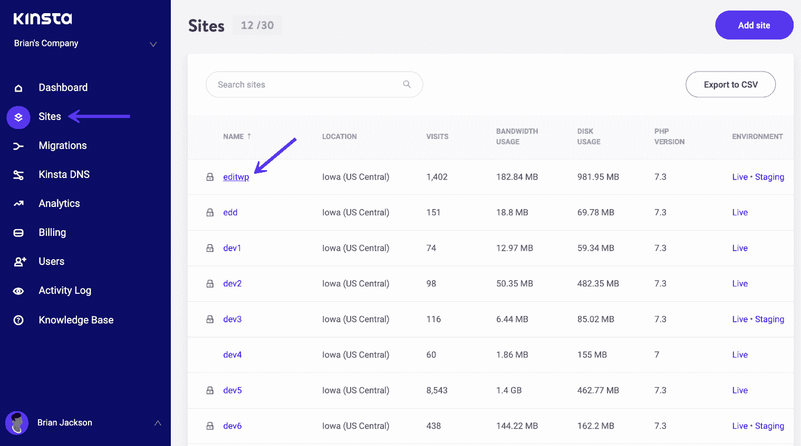

MyKinsta WordPress sites

### 第二步

转到“备份”选项卡，然后你会看到一个不同选项的列表。在这里，您可以在每日、每小时、手动、系统生成和完全可下载备份之间切换。对于本教程，我们将使用自动每日备份。

要恢复备份，只需单击您要恢复的备份旁边的“恢复到”按钮。选择“实时”选项将覆盖您的生产站点。

Restore WordPress from Backup in MyKinsta

### 第三步

然后，您必须通过输入您的站点名称来确认备份恢复。这将**覆盖你的生活环境**。然后点击“恢复”

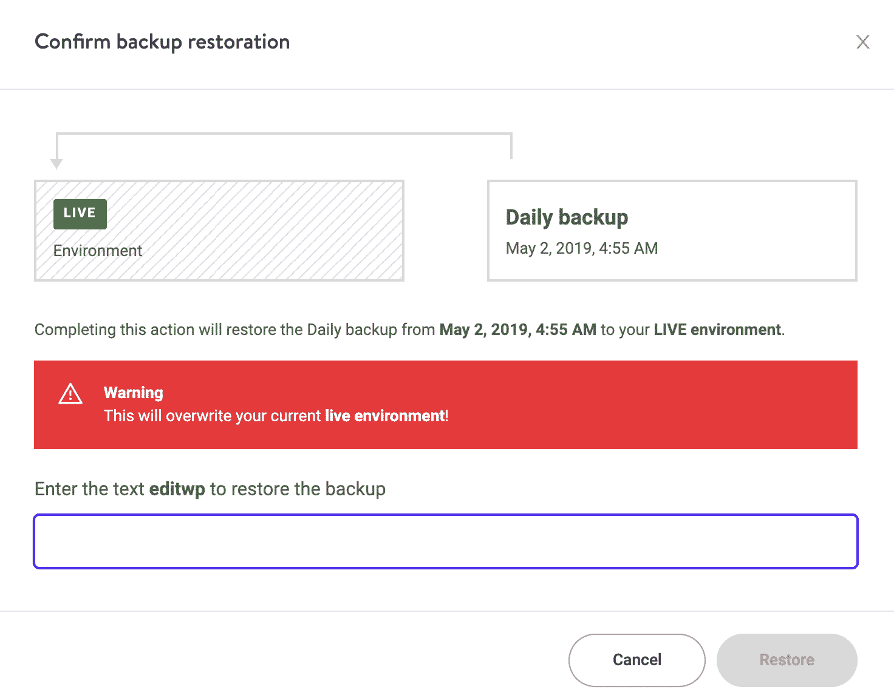

Confirm WordPress backup restoration

这可能需要几分钟时间，具体取决于您的站点有多大。当恢复正在进行时，你将不能访问你的 WordPress 站点的管理面板。您可以离开 MyKinsta 仪表板中的屏幕，因为一旦恢复完成，您就会收到通知。

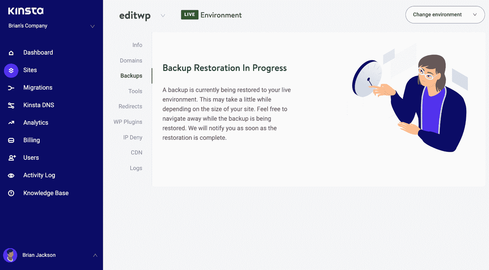

WordPress backup restoration in progress

一旦恢复过程完成，你就可以访问你的 WordPress 站点的管理面板。每当您恢复备份时，都会生成一个新的备份，该备份将反映您的网站在恢复之前的状态。如果您需要撤消恢复，这将非常有用。
<kinsta-advanced-cta language="en_US" type-int-post="44790" type-int-position="1"></kinsta-advanced-cta>

## 一键恢复 WordPress 从备份到暂存

在 Kinsta，你也可以选择从备份中恢复 WordPress，并直接将其推送到你的[暂存环境](https://kinsta.com/help/staging-environment/)中。这可以在许多方面让你的生活更轻松，例如:

1.  更流畅、更灵活的开发体验。
2.  查看您的站点以前是如何工作的，而无需接触您的实时站点。
3.  从以前的备份中恢复和检索信息，而无需修改您的实时站点。

### 第一步

这些步骤本质上和恢复 WordPress 备份是一样的。导航到您的备份，然后单击您要恢复的备份旁边的“恢复到”按钮。这一次，选择“转移”选项，它会将您的备份转移到转移。

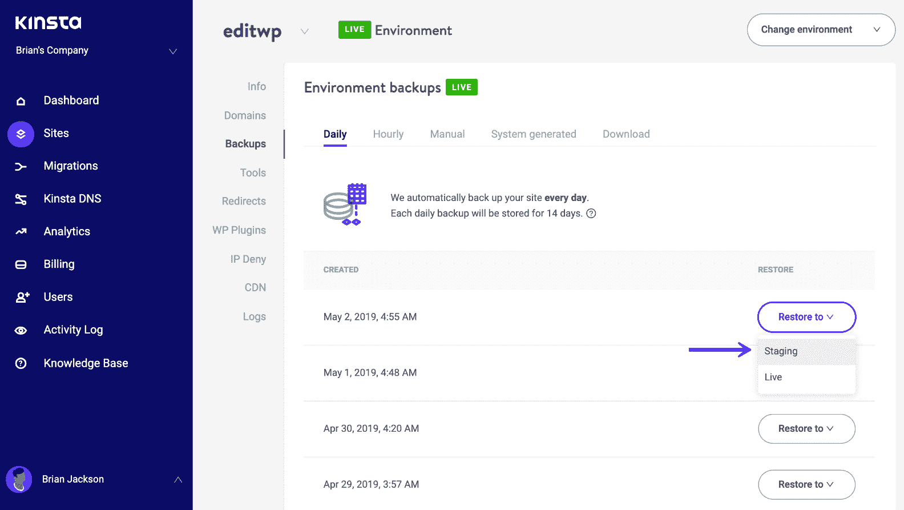

Restore WordPress from backup and push to staging environment

### 第二步

然后，您必须通过输入您的站点名称来确认备份恢复。这将**覆盖您当前的暂存环境**(如果存在，否则将创建一个)。然后点击“恢复”

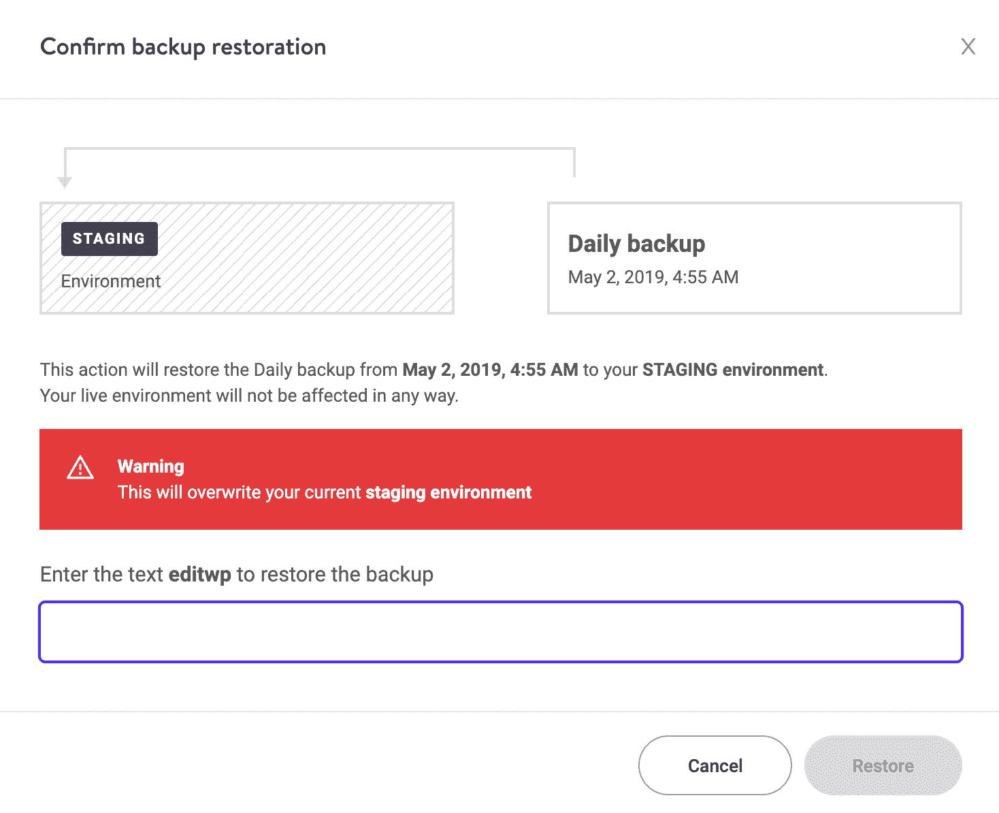

Confirm WordPress backup restoration to staging environment

这可能需要几分钟时间，具体取决于您的站点有多大。然后，您可以访问您的临时站点，它现在有自己的环境，完全独立于您的活动站点。暂存站点，就像备份一样，也不计算你的主机计划的磁盘空间。👍

## 用插件从备份中恢复 WordPress

接下来，我们将向你展示如何使用插件从备份中恢复 WordPress。我们只建议使用支持增量备份的服务器。

增量网站备份是指系统**仅在网站文件和数据库表发生变化**时创建备份。这样做的原因是为了提高您的网站性能，并避免服务器上大量不必要的备份文件。因此，当你的备份插件扫描最近的文件时，如果没有任何变化，最好跳过下一次备份。

以下是我们推荐的四款备份插件:

*   [WP 时间胶囊](https://kinsta.com/blog/wordpress-backup-plugins/#wp-time-capsule)
*   [VaultPress](https://kinsta.com/blog/wordpress-backup-plugins/#vaultpress)
*   [管理 WP](https://kinsta.com/blog/wordpress-backup-plugins/#managewp)
*   [博客金库](https://kinsta.com/blog/wordpress-backup-plugins/#blogvault)

在本教程中，我们将使用 WP 时间胶囊。它有一个免费的全功能版本，你可以使用 30 天。这很好，因为这意味着你可以在承诺之前先尝试一下。

[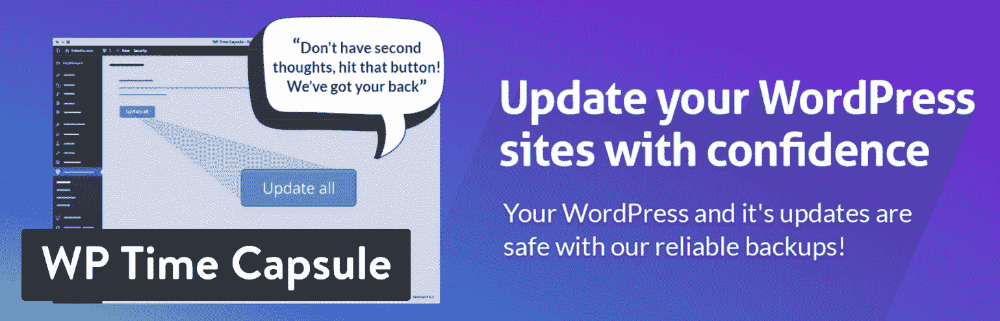](https://wordpress.org/plugins/wp-time-capsule/)

WP Time Capsule WordPress plugin

WP Time Capsule 提供了**增量备份和**恢复。这意味着，通过在备份过程中从不复制文件，只选择那些恢复所需的特定文件，您能够提高站点性能并使恢复更容易。

我们将假设您已经进行了备份。如果你需要帮助从头开始安装，请查看 WP Time Capsule 的[入门指南](https://docs.wptimecapsule.com/article/19-installing-wptc-on-your-wordpress-site)。否则，按照以下步骤从 WP Time Capsule 备份中恢复 WordPress。

### 第一步

登录你的 WordPress 仪表盘，进入“WP 时间胶囊”→“备份”，在日历上选择一个还原点。

注意:如果你不能访问你的 WordPress 管理仪表板(可能目前无法访问)，请看 WP Time Capsule 关于[如何恢复关闭的站点](https://docs.wptimecapsule.com/article/9-restoring-a-website-that-is-down)的解决方案。

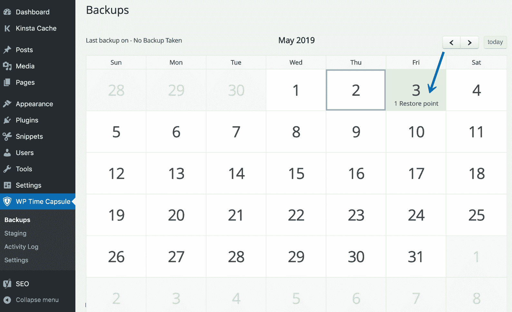

Select WP Time Capsule restore point

### 第二步

然后点击“将站点恢复到此点”他们还能够恢复到他们自己的转移解决方案。

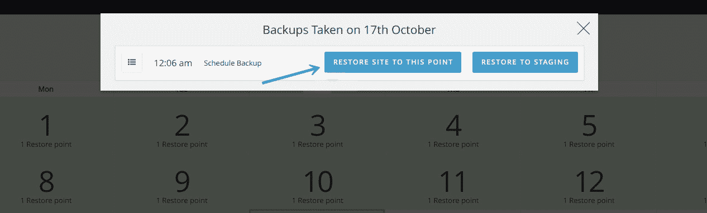

Restore WordPress from backup with WP Time Capsule

就是这样！很简单，对吧？

 ## 注册订阅时事通讯

### 想知道我们是怎么让流量增长超过 1000%的吗？

加入 20，000 多名获得我们每周时事通讯和内部消息的人的行列吧！

[Subscribe Now](#newsletter)

## 用 phpMyAdmin 恢复 WordPress 数据库备份

有时您可能需要手动还原数据库。关于如何使用 phpMyAdmin 恢复 MySQL 数据库，您可以遵循下面的步骤。

phpMyAdmin 是一个免费的开源工具，可以通过你的浏览器获得，用于处理 [MySQL](https://kinsta.com/knowledgebase/what-is-mysql/) 或 [MariaDB](https://kinsta.com/blog/mariadb-vs-mysql/) 的管理。它可以用于各种不同的操作，比如迁移数据库、管理表、索引和执行 SQL 语句。

注意:本教程假设您已经有了一个要导入的备份或导出的`*.sql`文件。如果没有，看看我们的教程如何用 phpMyAdmin 备份你的 mySQL 数据库。

### 第一步

首先，您需要登录 phpMyAdmin。在 Kinsta，我们可以从 MyKinsta 仪表板中轻松访问到 [phpMyAdmin](https://kinsta.com/help/wordpress-phpmyadmin/) 的链接。它位于你的网站的“信息”标签下的“数据库访问”部分。

[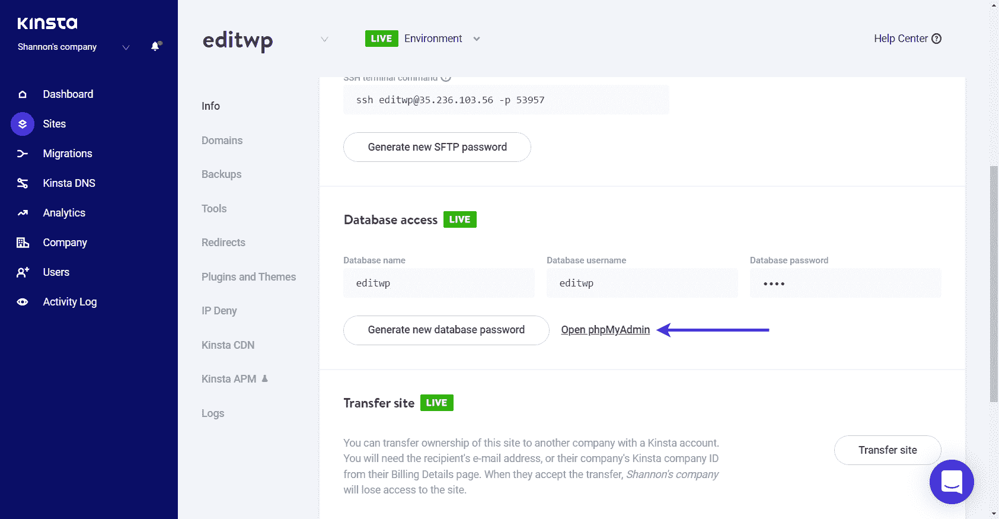](https://kinsta.com/wp-content/uploads/2022/01/mykinsta-open-phpymadmin-button.png)

phpMyAdmin link in MyKinsta dashboard

注意:如果你使用不同的主机提供商，phpMyAdmin 的位置可能会有所不同。您可以查看他们的文档或联系他们的支持团队，询问它的位置。如果您使用 cPanel，phpMyAdmin 可以在“数据库”部分找到。

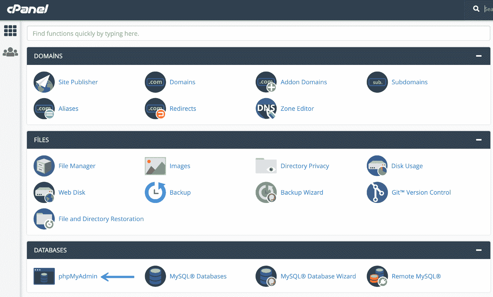

cPanel phpMyAdmin

### 第二步

点击你的 WordPress 数据库。该名称很可能与您的网站名称一致。

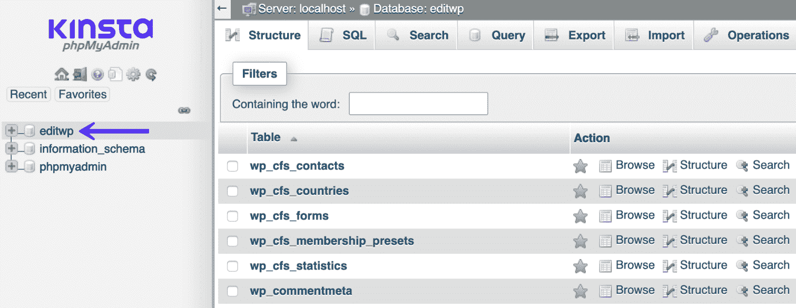

phpMyAdmin WordPress database

### 第三步

点击“导入”标签，然后点击“选择文件”选择您的`*.sql`文件备份/导出。然后点击“开始”

**重要提示:**导入您的`*.sql`文件将会覆盖您数据库的当前内容。确保带一份备份以防万一。如果你不喜欢这样做，请先咨询开发人员。

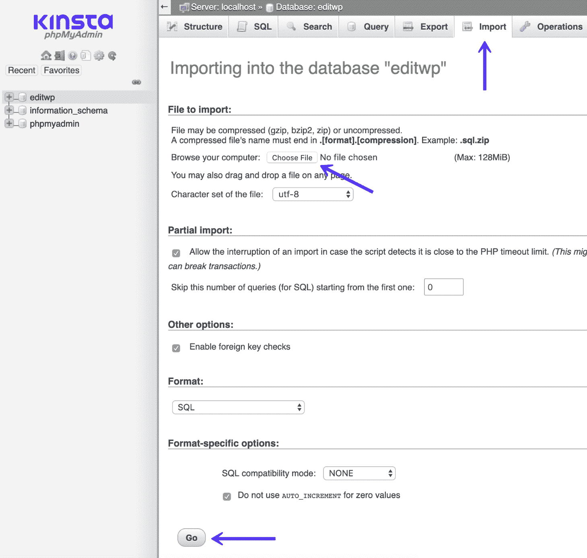

MySQL database import in phpMyAdmin

如果你正在恢复你的数据库，因为你认为你的 WordPress 站点可能被黑客攻击了，我们建议你采取一些额外的步骤。记住，如果你是 Kinsta 的客户， **[我们提供免费的黑客补丁](https://kinsta.com/knowledgebase/malware-security/)！**因此，请务必先联系我们，我们乐意全天候为您提供帮助。

建议阅读:[如何导出一个 WordPress 站点](https://kinsta.com/knowledgebase/export-wordpress-site/)。

### 更改您的数据库密码

如果你的 [WordPress 网站被黑了](https://kinsta.com/blog/wordpress-hacked/)，你应该重置你的 MySQL 数据库密码。在 MyKinsta 仪表板的数据库访问部分，您会发现一个“生成新的数据库密码”选项。当你使用这个时，你的`wp-config.php`文件会自动更新(只要它位于站点根目录，这是默认的)。如果不在根目录下，你可以[手动更新你的 wp-config.php 文件](https://kinsta.com/blog/wp-config-php/)。

Struggling with downtime and WordPress problems? Kinsta is the hosting solution designed to save you time! [Check out our features](https://kinsta.com/features/)

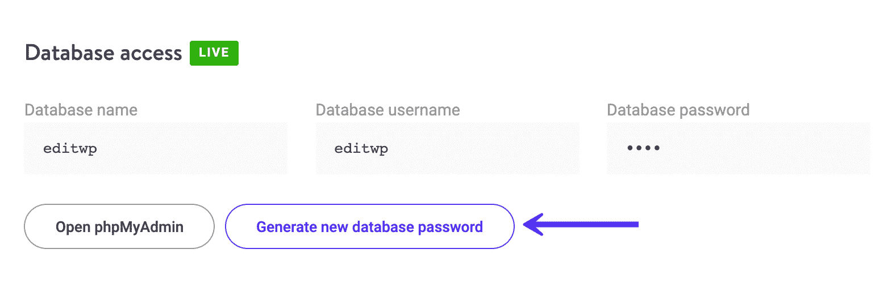

Generate a new database password

### 重新安装 WordPress 核心(空插件，主题)

我们推荐的另一件事是重新安装 WordPress core。这不会影响您的数据(存储在数据库中)或自定义。

*   [如何在保留现有内容的同时从 WordPress 仪表盘重新安装 WordPress](https://kinsta.com/blog/reinstall-wordpress/#dashboard)
*   [如何通过 FTP 手动重新安装 WordPress，同时保留现有内容](https://kinsta.com/blog/reinstall-wordpress/#ftp)
*   [如何通过 WP-CLI 手动重新安装 WordPress，同时保留现有内容](https://kinsta.com/blog/reinstall-wordpress/#wp-cli)

如果你正在处理一个[无效的 WordPress 插件或者主题](https://kinsta.com/blog/nulled-wordpress-plugins-themes/)，你也应该[重新安装它们](https://kinsta.com/blog/reinstall-wordpress/#plugin)，但是使用开发者的合法拷贝。
<kinsta-advanced-cta language="en_US" type-int-post="44790" type-int-position="2"></kinsta-advanced-cta>

## 用 cPanel 恢复 WordPress 数据库备份

如果你和使用 cPanel 的主机提供商在一起，你可以用类似的方式恢复你的 WordPress 数据库。请遵循以下步骤。

### 第一步

登录你的 cPanel 账户，在“文件”部分点击“备份”

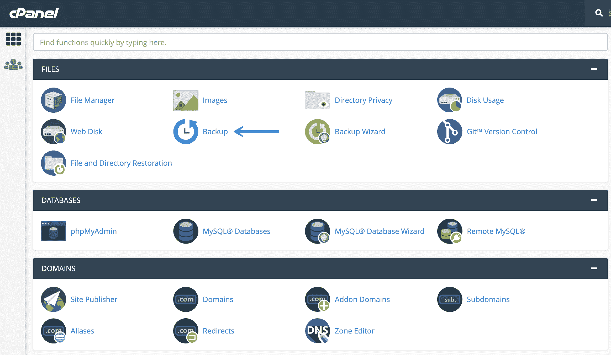

cPanel backup

### 第二步

向下滚动到“恢复 MySQL 数据库备份”点击“选择文件”并选择您的`*.sql`文件备份/导出。然后点击“上传”

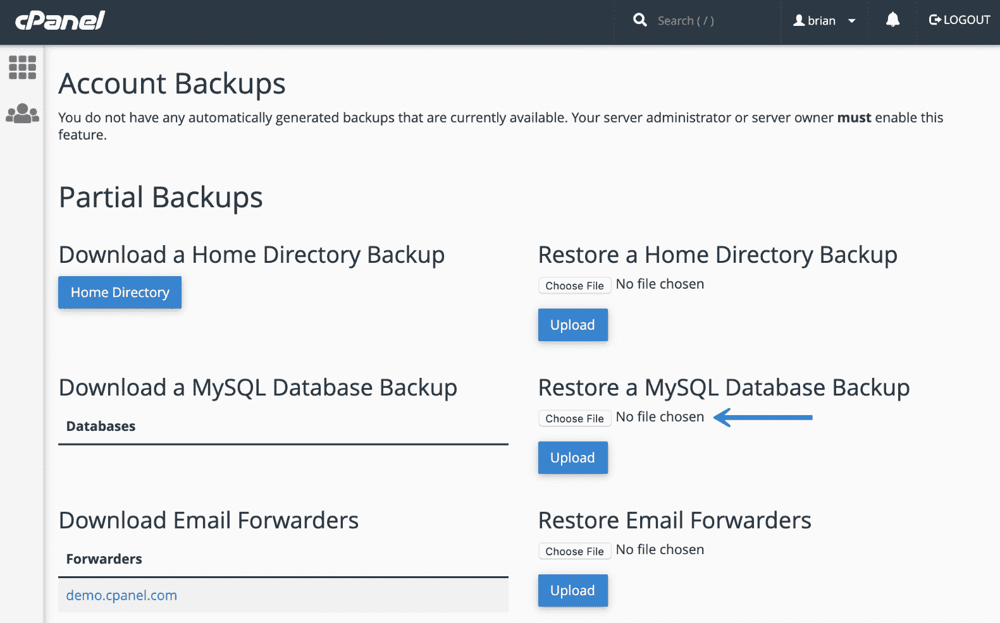

cPanel restore MySQL database backup

## 从仪表板或使用 SFTP 手动恢复 WordPress 文件

如果你需要手动恢复你的 WordPress 文件，这里有两种不同的方法可以使用。

### 从仪表板恢复 WordPress 文件

如果您仍然可以访问您的仪表板，您可以首先尝试这种方法。出奇的简单。

在你的 WordPress 仪表盘中，进入工具条中的“仪表盘”→“更新”。然后点击“立即重新安装”按钮。

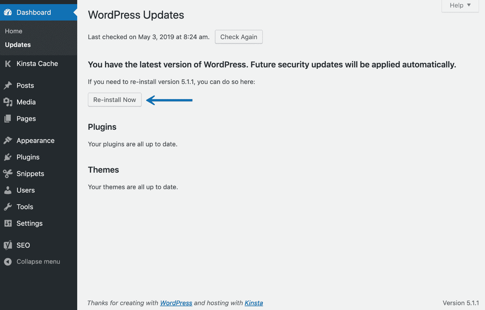

WordPress dashboard re-install now option

一旦你点击按钮，WordPress 将自动下载并重新安装 WordPress 的最新版本。当你从你的仪表板更新 WordPress 时，你实际上只是手动重新运行 WordPress 执行的正常更新过程。

这可能需要几秒钟——但是一旦这个过程完成，你应该已经安装了一个新的 WordPress。

### 使用 SFTP 恢复 WordPress 文件

如果你[因为一个错误而无法访问 WordPress admin](https://kinsta.com/blog/locked-out-of-wordpress-admin/) (或者只是喜欢[而不是 SFTP](https://kinsta.com/knowledgebase/how-to-use-sftp/) )，你可以通过 SFTP 执行类似的过程。你基本上是手动复制 WordPress 会为你做的事情。

以下是这些步骤的简要总结:

1.  下载 WordPress 的最新版本。
2.  提取`.zip`文件。
3.  上传除了`/wp-content/`文件夹以外的所有内容。

#### 第一步

首先，前往 [WordPress。org](https://wordpress.org/download/) 并下载 WordPress 的最新版本。

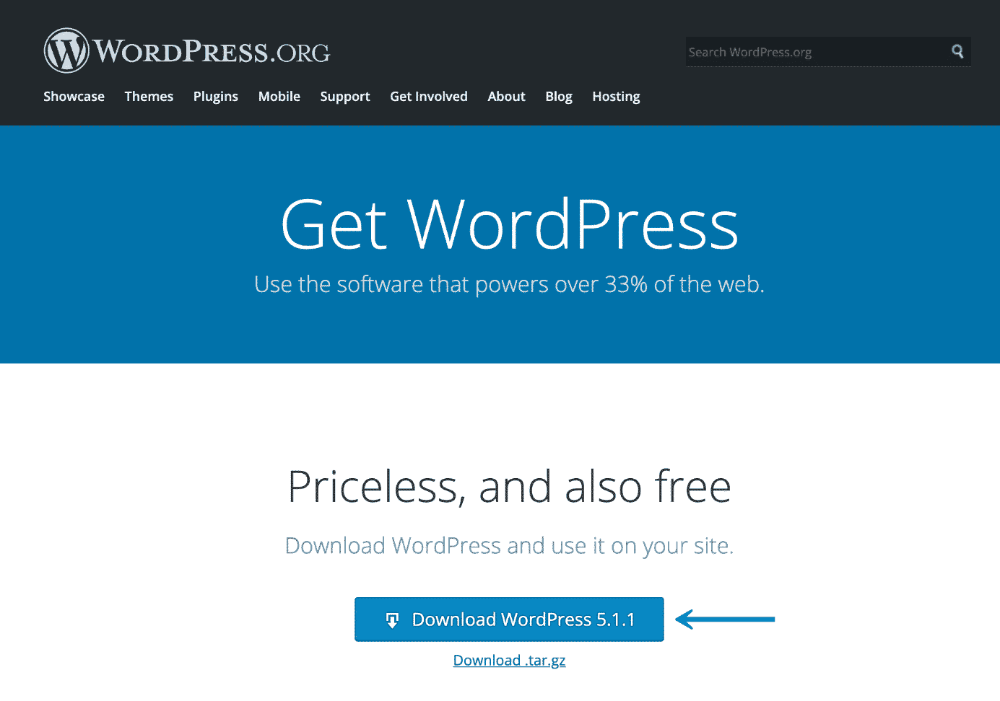

Download the most recent copy of WordPress

#### 第二步

下载完成后，将`.zip`文件的全部内容解压到您的电脑中。然后，**删除**中的`wp-content`文件夹。

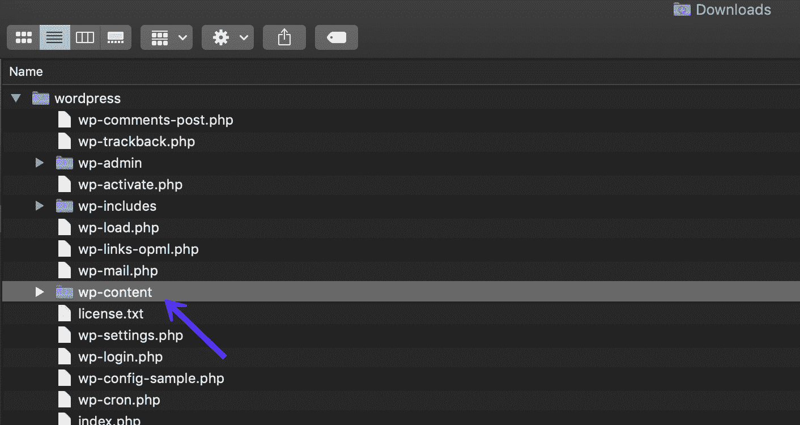

Delete the WordPress wp-content folder

#### 第三步

一旦你完成了这些，[通过 SFTP](https://kinsta.com/knowledgebase/how-to-use-sftp/) 连接到你的主机，上传剩余的文件到你最初安装 WordPress 的文件夹。通常，这是您的根文件夹，名称类似于`public`或`public_html`。

当你开始上传文件时，你的 SFTP 程序会提示你一条类似“目标文件已经存在”的信息发生这种情况时，确保选择**覆盖**选项并继续:

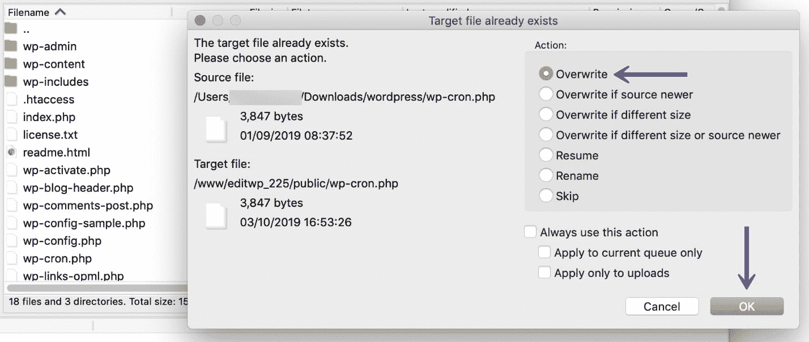

Upload remaining files via SFTP

因为你已经删除了`wp-content`文件夹，这将覆盖所有的核心 WordPress 文件，而不会影响你的任何主题或插件。一旦上传完成，你应该有一个新安装的 WordPress 核心文件的副本，一切都有希望顺利运行。

## 摘要

虽然从备份或文件中恢复 WordPress 通常是一个非常简单的过程，但有时你可能会遇到一些问题。以下是我们看到的一些常见问题，以及如何解决这些问题的链接:

*   [建立数据库连接时出错](https://kinsta.com/blog/error-establishing-a-database-connection/)
*   [内部服务器错误](https://kinsta.com/blog/500-internal-server-error/)
*   [死亡的白屏](https://kinsta.com/blog/wordpress-white-screen-of-death/)
*   [错误连接超时](https://kinsta.com/blog/err_connection_timed_out/)
*   [错误太多重定向](https://kinsta.com/blog/err_too_many_redirects/)
*   [导入/导出用户](https://kinsta.com/knowledgebase/wordpress-export-users/)

不过，如果你是 Kinsta 的客户，你很可能永远不会担心这个问题。我们有六种不同的备份选项，您可以随时通过单击恢复您的站点！如果你的网站碰巧在我们的网络上被黑了，我们的 WordPress 专家团队会免费修复。

当你试图从备份中恢复 WordPress 时，你遇到过其他的提示或事情吗？我们很想在下面的评论中听到它。

* * *

让你所有的[应用程序](https://kinsta.com/application-hosting/)、[数据库](https://kinsta.com/database-hosting/)和 [WordPress 网站](https://kinsta.com/wordpress-hosting/)在线并在一个屋檐下。我们功能丰富的高性能云平台包括:

*   在 MyKinsta 仪表盘中轻松设置和管理
*   24/7 专家支持
*   最好的谷歌云平台硬件和网络，由 Kubernetes 提供最大的可扩展性
*   面向速度和安全性的企业级 Cloudflare 集成
*   全球受众覆盖全球多达 35 个数据中心和 275 多个 pop

在第一个月使用托管的[应用程序或托管](https://kinsta.com/application-hosting/)的[数据库，您可以享受 20 美元的优惠，亲自测试一下。探索我们的](https://kinsta.com/database-hosting/)[计划](https://kinsta.com/plans/)或[与销售人员交谈](https://kinsta.com/contact-us/)以找到最适合您的方式。</kinsta-auto-toc>