# B2B 与 B2C 营销——理解差异是关键

> 原文：<https://kinsta.com/blog/b2b-vs-b2c/>

归根结底，企业对企业(B2B)营销与企业对消费者(B2C)营销并没有太大区别。从表面上看，似乎一个更合乎逻辑，而另一个更感性。然而，你很快就会知道，情况并不总是这样。

但是 B2B 和 B2C 营销有一些很大的不同。这些关键的差异会决定你结果的成败。这并不总是像使用 LinkedIn 或者 T2 脸书那么简单，这取决于你的目标是谁。但是*对你如何瞄准他们，什么有用什么没用，以及你能付多少钱有巨大的影响。*

 *这里有一些 B2B 和 B2C 营销的主要区别，可以让你的营销活动万无一失。

## B2B 营销与 B2C 的共同点比你想象的要多

B2B 营销通常被视为与 B2C 大相径庭。我们将在几分钟后探讨这两者之间的一些关键差异。

B2C 和 B2B 购买真的有那么大的不同吗？

你知道标准论点。成吨的“B2B vs B2C”文章，[就像这篇文章](https://www.thebalancesmb.com/b2b-vs-b2c-marketing-2295828)，说着这样的话

> 购买决策中很少甚至没有个人情绪。

但这是真的吗？毕竟*人*还在买。公司的决策仍然取决于少数人的直觉选择。当你查看数据时，B2B 和 B2C 消费者之间的差异可能并不像最初看起来那样不同。

例如，绝大多数 B2B 购买(84%)仍然是从个人推荐开始的。与所有消费者购买相同，其中 [92%始于可信推荐](http://www.nielsen.com/content/dam/corporate/us/en/newswire/uploads/2009/07/pr_global-study_07709.pdf)。

评论网站对大多数购买也很重要。95%的买家使用它们，而 T2 92%的 B2B 买家更有可能在 T4 阅读评论 T5 后购买 T3。

所以……这些“推荐”发生在 LinkedIn 这样的“专业”网站上。对吗？不对。根据社交媒体审查员 2018 年度行业报告， [91%的 B2B 企业](https://www.statista.com/statistics/259382/social-media-platforms-used-by-b2b-and-b2c-marketers-worldwide/)使用脸书超过 LinkedIn。

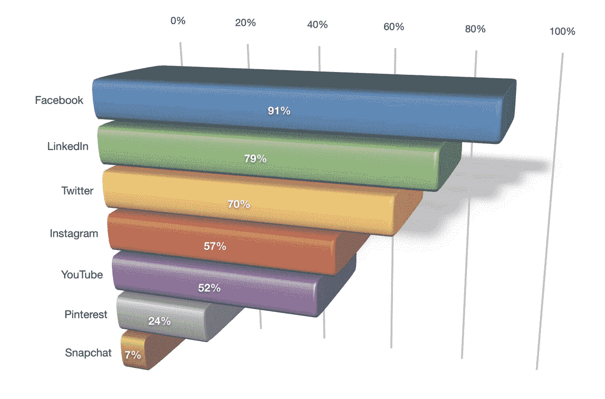

B2B social media platforms (Images source: [Social Media Examiner](https://www.socialmediaexaminer.com/social-media-marketing-industry-report-2018/))

换句话说，B2B 和 B2C 买家的购物方式非常相似。但是……B2B 买家购物没有情绪吧？就像那篇文章说的！

不过，这也不完全正确。事实上，恰恰相反。

其他几项关于 B2B 采购流程的研究表明，软技能对达成交易有多么重要。据[CMO.com](https://www.cmo.com/opinion/articles/2017/8/9/b2b-buying-is-full-of-emotions-ptr-tlp.html#gs.XlPmZI4s)，

> 平均而言，B2B 客户与供应商和服务提供商的情感联系要比消费者多得多。

原来 B2B 买家渴望确定性。而确定性是一种直接来源于建立某种信任(或情感联系)的感觉。

> 我们做出选择背后的原因不容易衡量…

确认 Christoph Becker 为首席营销官，他在 T2 的陀螺公司与金融时报合作研究 B2B 买家。

> 真实的人是部落的，是感性的。现在，营销人员比以往任何时候都更需要关注客户和潜在客户的感受，并以一种让他们既自信又乐观的方式提供服务。

据《哈佛商业评论》报道，这一趋势正变得更加明显:

> 随着 B2B 产品变得越来越商品化，商业客户给购买过程带来的主观的、有时甚至是个人的关注变得越来越重要。事实上，我们的研究表明，在一些购买中，诸如产品是否能提高购买者的声誉或减少焦虑等因素起着很大的作用。

他们强调了贝恩公司所做的关于影响 B2B 购买的所有不同因素的研究，并将它们放在这张漂亮的图表中:

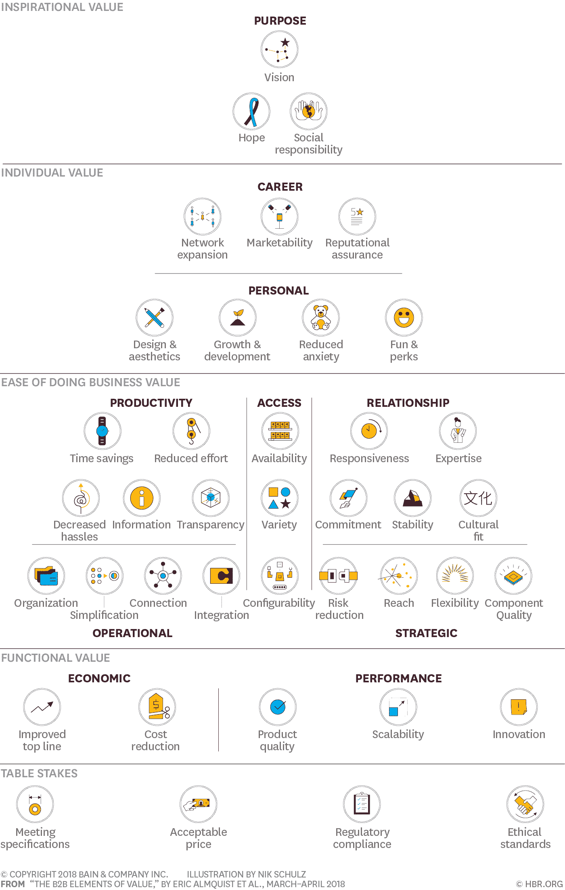

Factors that influence a B2B purchase (Image source: [HBR](https://hbr.org/2018/03/the-b2b-elements-of-value))

当您查看底部时，您会看到典型的考虑因素，如合规性、道德准则、规格和定价。这些是对理性购买者有吸引力的硬而理性的商品。

然而，随着你在金字塔中的位置越来越高，你会很快发现那些客观的衡量标准是如何让位于更主观、更感性的东西的。

换句话说，是的，有一些具体的东西 B2B 购买者期待，以确保供应商或合作伙伴是在正确的球场。但在那之后，更多的是看谁更适合，而不是哪家的价格最低。

同一项研究也支持这一观点。B2B 忠诚度的十大因素中只有三个属于逻辑阵营。其他七个都是植根于情感的主观指标。

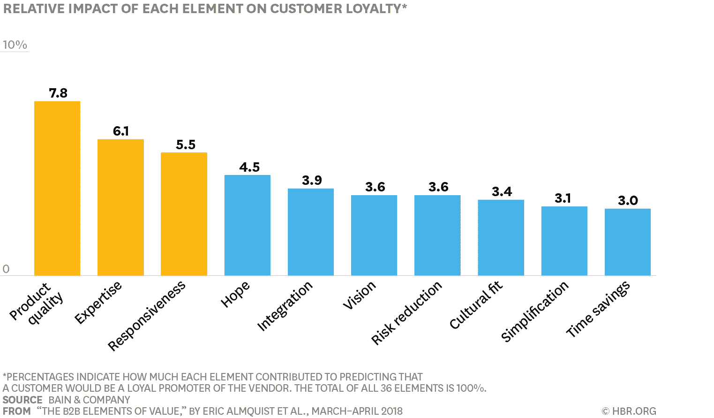

Customer loyalty (Image source: [HBR](https://hbr.org/2018/03/the-b2b-elements-of-value))

因此，整个“B2B 买家购买完全基于逻辑和数字”并不都是真的。这些购买比你想象的更加情绪化。

不同的是，具体来说，这些买家是如何购买的。然后你能做些什么来吸引他们，这包括从你在哪里能找到他们，到你如何吸引他们，到你能花多少钱来获得他们。

这就是我们现在要深入探讨的内容，从做出购买决定所需的时间开始。

## B2B 销售周期比 B2C 长得多(平均而言)

B2C 购买通常不需要那么长时间来实现。

是的，10，000 美元以上的假期可能。5 万美元以上的购车或 50 万美元的房子属于同一阵营。这些购买决定可能需要几周(或几个月)才能实现。

但这些往往是大多数人一生中少有的事件。大多数消费者在一年中购买的东西都在 100 美元左右。而这些往往可以在没有太多思考、研究或深入分析的情况下凭冲动做出。

然而，B2B 采购就不一样了。在一项研究中，至少有 31%的受访者确认 B2B 购买比一年前花费了更多的时间。换句话说，B2B 销售周期可能需要几周或几个月才能展开。

这直接影响到你如何吸引关注，产生线索，甚至推动销售。

以脸书广告为例。我们已经看到 B2B 买家如何更喜欢脸书而不是 LinkedIn。然而，如果是这样的话，为什么那么多企业声称“[脸书的广告不起作用](https://www.inc.com/marla-tabaka/62-of-small-business-owners-say-facebook-ads-dont-work-experts-disagree.html)”？

也许他们只是做错了。他们正试图向丝毫没有购买意愿的冷漠观众推销一项大宗商品。

这就像通过广告卖车一样。是的，你可以像达克斯和 Dealer.com 一样使用它，通过 45，000 的车辆详细页面浏览量来增加曝光率。但是人们也不会真的刷信用卡。你只是想让这些人进入你的停车场或你的商店。

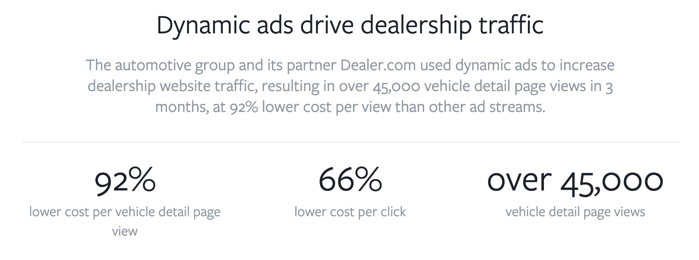

Dynamic ads B2B (Image source: [Facebook](https://www.facebook.com/business/success/darcars))

然而，在你能卖出这笔六位数的新交易之前，B2B 买家不仅需要有一个你能解决的问题，还需要意识到他们首先就有这个问题。

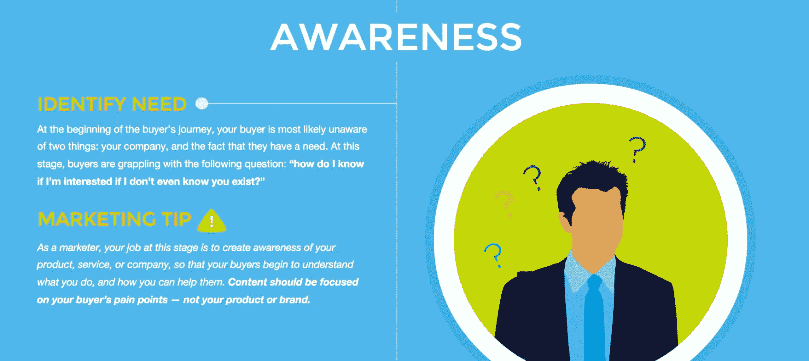

B2B identifying need (Image source: [Pardot](https://www.pardot.com/blog/understanding-buyers-journey-building-awareness/))

在漫长的购买过程中,“买家之旅”变得更加重要。

假设你这周六要去旅行。你要去一个新的城市，所以你需要一个酒店。简单。打开 Expedia，输入日期，按星级排序，查看你的四星级预算范围内的三家酒店，然后扣动扳机。所有这些可能需要一个小时才能完成。

现在，对比一下 B2B 购买流程。同样的步骤会持续几周(而不是几个小时)。

这意味着你需要一个非常非常缓慢的过程，从关注到兴趣再到购买。在网上，这通常意味着很多很多额外的创造价值的内容，所以你的 B2B 前景最终会明白为什么你的成本是其他人的 2 倍(当它到达那个时候)。

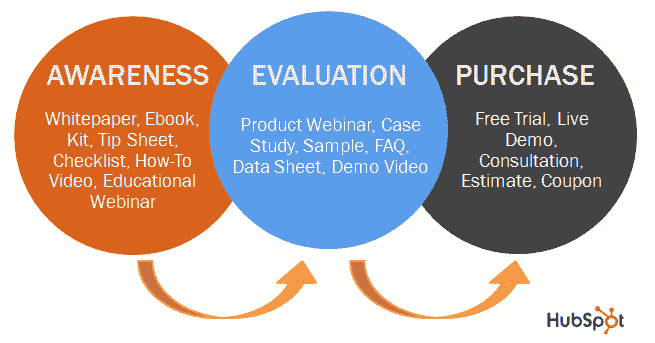

Content in sales funnel (Image source: [HubSpot](https://blog.hubspot.com/blog/tabid/6307/bid/31406/How-to-Map-Lead-Nurturing-Content-to-Each-Stage-in-the-Sales-Cycle.aspx))

所以你可以从一本针对他们生活中出现的最初问题的电子书开始。甚至一些简单的事情，比如如何创建更好的电子邮件营销活动。

B2B Facebook ad (Image source: [Directive](https://directiveconsulting.com/blog/why-b2b-facebook-ads-fail/))

B2B 营销人员下载它，阅读它，并希望与同事分享。然而不幸的是，你不能去硬卖。你不能催促或欺骗 B2B 购买者进行冲动购买。

因此，当你想把它们转变成一个更大的提议(或承诺)时，它需要是一个小得多的步骤，比如一个关于同一主题的深入培训视频。

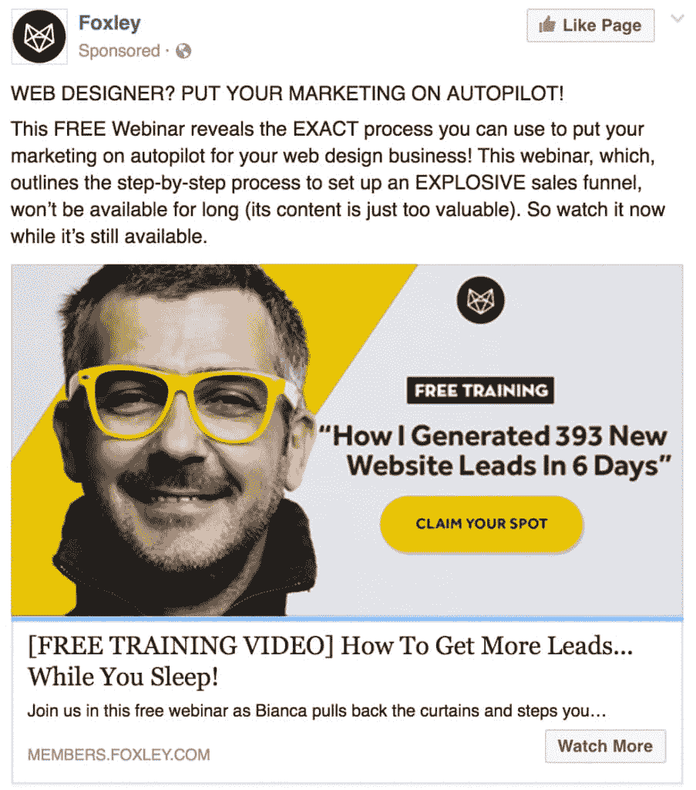

B2B training video Facebook ad (Image source: [Directive](https://directiveconsulting.com/blog/why-b2b-facebook-ads-fail/))

让我们回到脸书广告公司。你没有用广告来销售。你只是用它们把某人从 A 点带到 B 点，然后从 B 点到 c 点。

即使到了“销售”的时候，你通常也不是在销售全套服务。从脸书广告公司到大客户群是非常不可能的。

所以你拿出一个 [*绊网*](https://www.wordstream.com/blog/ws/2017/02/22/vintage-ads)——一个让人无法抗拒的好得难以置信的提议。

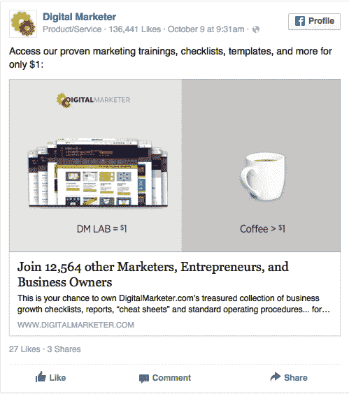

Good offer Facebook ad (Image source: [AdEspresso](https://adespresso.com/blog/facebook-sales-funnel/))

这种低价的、按比例缩小的报价可以帮助 B2B 买家在承诺一笔更大的交易之前先试探你。

## 注册订阅时事通讯

### 想知道我们是怎么让流量增长超过 1000%的吗？

加入 20，000 多名获得我们每周时事通讯和内部消息的人的行列吧！

[Subscribe Now](#newsletter)

概括地说，B2B 和 B2C 交易都存在这种类型的漏斗。两者都有“微转变”，人们做出较小的承诺，帮助他们做出大的购买决定。

但正如你所看到的，更长的 B2B 销售周期意味着更强调将你自己的营销活动分解成可以在几个月内消费的小块。

然而，更长的销售周期并不是两者之间唯一的区别因素。

因为在总收入和交易或订单规模方面，这条线上的金额也会产生涓滴效应，决定您可以成功使用哪些促销渠道。以下是方法。

## B2B 公司可以花比 B2C 更多的钱来获得每个客户

没有比 AdWords 更大的收入驱动力了。没有任何其他营销渠道——无论是在线还是离线——能让你在客户需要的时候，准确地锁定他们想要的东西。

这就是为什么它往往是大多数营销人员的第一个出发点。

但是有一个问题。

显然，不太可能有人会通过搜索引擎上的文字广告进行巨额购买。然而，这不是重点。

这可能看起来违反直觉，但是购买量越大(如 B2B)，AdWords 的表现就越好。

你经常在网上看到这些“AdWords 值多少钱”的指南。大多数网站都提供了一些点击成本(CPC)的明细，或者说你为了让访问者再次访问你的网站而支付的费用。

令人困惑的是，这个数字其实并不那么重要。重要的是你能从每个客户身上赚多少钱。

让我们做一些简单的数学计算，这样你就能明白为什么了。

像这样的 WordStream 指南说，软件点击可能每点击一次花费 30 美元左右。表面上听起来很贵。尤其是如果你想把它比作一个更“便宜”的点击，就像一个当地的泳池爱好者。

但是不要把重点放在那个数字上。关注每次点击给你带来的回报。

例如，如果你的年交易额是 30，000 美元，那么 30 美元的点击费就不算什么。这意味着你有足够的回旋空间来推动数百个线索，因为你只需要几个实际购买就值得了。

假设你刚刚驱动了一个客户，花了 3000 美元做广告。这是一笔好交易还是一笔坏交易？

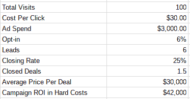

Google AdWords cost

太划算了！

现在，如果你的平均交易规模只有 300 美元。花 3000 美元达成一笔交易值得吗？不，当然不是。

这就是为什么 AdWords 在律师、保险和一系列其他高价服务领域创造了奇迹，尽管“成本”总是很高。

Struggling with downtime and WordPress problems? Kinsta is the hosting solution designed to save you time! [Check out our features](https://kinsta.com/features/)

但是如果你卖一个 100 美元的产品呢？AdWords 可能成本太高。假设你的电子商务商店有 1%的转换率，每次点击只需支付 1 美元左右。

数学有用吗？呃…

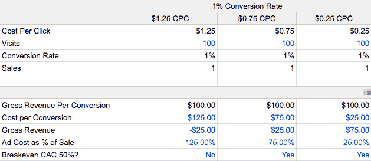

Google Adwords math

可能吧。但是你的时间太紧了。您可以:

1.  增加您的平均订单价值(通过追加销售或交叉销售)，或者
2.  提高你的转化率，或者
3.  找到新的营销渠道！

较大的交易可能需要更长的时间来开发。但是当他们这样做的时候，你通常会在每笔交易中赚更多的钱。 ***这意味着你有能力投资(花费)更多来创造每笔销售。*T3】**

这就是为什么 B2B 公司不需要在脸书“病毒式传播”,但 B2C 公司却经常需要。B2C 公司，一般来说，不可能花那么多钱去获取每个个人客户。

因此，如果他们想要收支平衡并实现盈利，他们需要探索其他选择，以更低的成本接触更多的人。

如果你纯粹专注于广告渠道，这意味着 B2B 公司可以愉快地在 AdWords 上花费，花费，花费，而 B2C 公司可能需要看看脸书或 Instagram 或 Pinterest，在那里他们可能只需要花费几美分(而不是几百美元)就可以接触到每个人。

但是等等，还有呢！

B2C 公司几乎接受任何可以想象的顾客。只要它们不具有破坏性或令人讨厌。因此，他们每条线索的成本将相当于获得每个客户的成本。

B2B 公司可没那个闲心。事实上，他们愿意花更多的钱，推高每条线索的成本，以确保他们没有吸引到错误类型的客户。

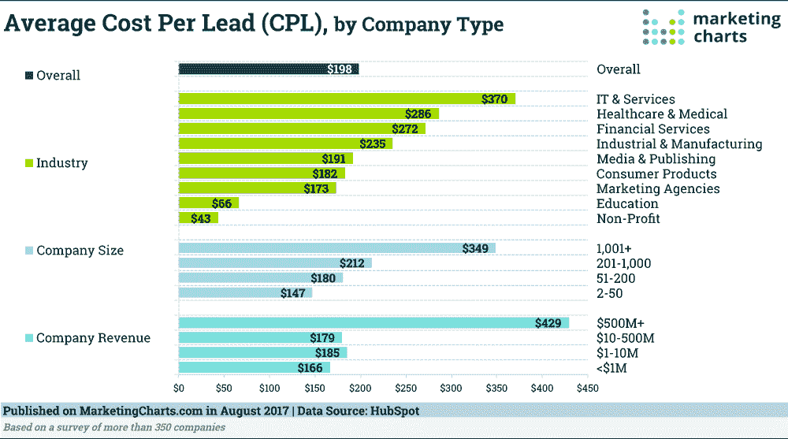

B2B average cost per lead (Image source: [MarketingCharts](https://www.marketingcharts.com/customer-centric/lead-generation-and-management-79707/attachment/hubspot-average-cost-per-lead-aug2017))

一项研究表明，至少有 50%的潜在客户不适合你卖的东西。一半！想象一个 B2C 公司故意不让他们一半的顾客购买。这永远不会发生。

“摩擦”在营销中可能是好的，也可能是坏的。它通常以人们在购买前必须跳过的台阶或“圈”的形式出现。

一般来说，B2C 公司想要的更少，而 B2B 公司可能更乐意。这种细微差别意味着一些策略对一方有利，而对另一方则不那么有利。

举个例子:聊天机器人。每个公司都应该使用它们吗？也许是，也许不是。

消费者希望在五分钟或更短时间内得到答案。B2C 购买往往比 B2B 购买更冲动。这就是为什么更少的“摩擦”通常会转化为更高的转化率，从而更容易或更方便地购买和更快地获得他们的产品。所以，是的，这对他们来说再好不过了。

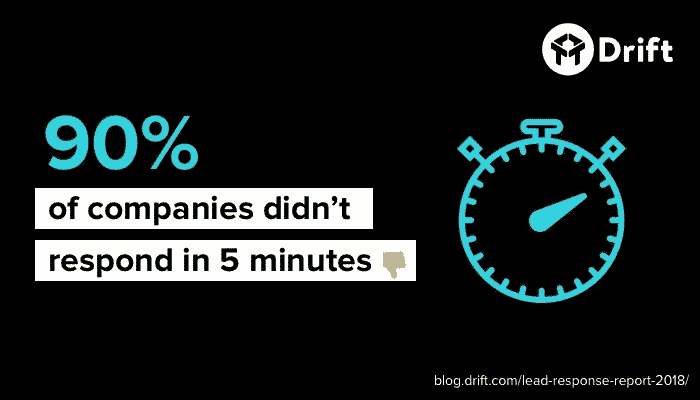

Consumers expect answers (Image source: [Drift](https://blog.drift.com/lead-response-report-2018/))

毕竟 B2C 公司是靠量赚钱的(上一步你已经看到了)。除非他们每个月都有大量的顾客光顾，否则他们不会成长。

上个月有人购买的事实与下个月的新销售毫无关系。因此，他们需要不断创造新的需求，同时降低摩擦，让购买变得尽可能容易。

如果几个“害群之马”通过了呢？没什么大不了的。很有可能你再也不会听到他们的消息了。

相比之下，一家 B2B 公司可能会乐于拥有几个大客户。尤其是那些月复一月自动重复的长期合同。

B2B 公司可能每个季度只需要几个新客户就能增长。所以它们本身不需要体积。他们需要合适的“合适”，或者能在一年(或更长时间)内运作良好的伙伴关系。

这意味着他们可能不想在五分钟内做出回应，或者让消费者对聊天机器人在五分钟内做出回应抱有错误的期望。

相反，营销自动化和您最喜欢的 CRM 中的 [lead scoring 允许他们更好地处理这些长期决策。他们帮助你设置过滤器，只让好的潜在客户通过，同时让“坏的”客户轻松通过。](https://kinsta.com/blog/woocommerce-crm/)

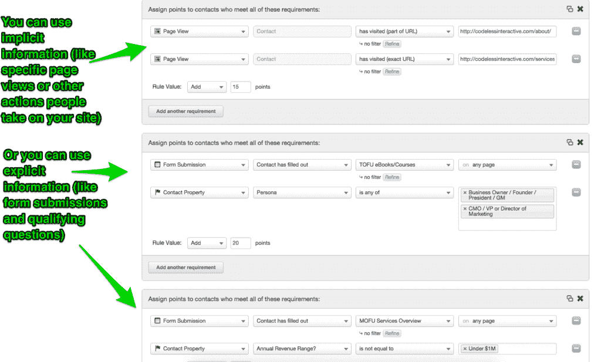

Marketing automation filters

同样的论点甚至可以适用于流量渠道之间的问题，如 SEO 与 PPC。

在 PPC 中，你花 100 美元赚 150 美元。然后你不断地将利润再投资，最终增加销售额。唯一的问题是，为了带来一定的收入，你需要在广告上花多少钱，这两者之间往往存在固定的关系。

[SEO](https://kinsta.com/blog/what-does-seo-stand-for/) ，相比较而言，复合词。

你可能今天花 100 美元，明天就能赚 150 美元。但是一年后呢？你可能花 100 美元产生 300 美元。换句话说，你的投资水平并不一定会增加，以产生更多的钱。

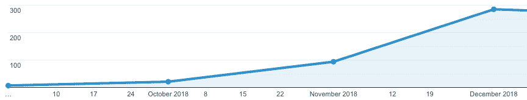

Revenue from leads

随着时间的推移，随着访问者数量的增加，你的每条线索的成本会像石头一样下降。从这个意义上说，它是一种资产，随着时间的推移，它的回报应该会越来越好。

有什么问题吗？这需要更长的时间。广告可以填补你的漏斗明天，但在一个更高的价格点。而今天的 SEO 投资应该会在一两年后占据主导地位。

## 摘要

B2B 营销与 B2C 营销有很大不同。但不完全是你想的那样。

B2B 买家“更有逻辑”的污名并不总是正确的。关于 B2C 客户“更情绪化”的说法也不成立。最终，各种形状和大小的客户都是如此。

然而，B2B 与 B2C 营销之间有一些非常真实的差异。

平均而言， **B2B 销售周期需要更长的时间来完成**。这意味着你用来接触他们的策略需要反映这一现实。他们需要预先提供更多的教育和价值，以帮助所有不同的决策者参与进来。你需要一个微转化的逻辑进程来无缝地引导人们从一个步骤到另一个步骤。

B2B 采购也往往要贵得多。这些昂贵的长期合约意味着 B2B 公司可以更加挑剔，愿意支付更多的钱来获得每一个线索，以确保它们是“正确的”适合。另一方面，B2C 公司通常不太有眼光，因为他们付不起那么多钱(甚至在最初购买后很长时间内不得不与每个客户单独打交道)。

这些差异通过你如何使用不同的营销渠道(如 AdWords 与脸书广告)，甚至从每一个渠道中期待什么(如最初在付费活动上花费更多，甚至以更高的成本，以等待你的时间，直到 SEO 起飞)引起连锁反应。

你的企业的正确答案并不总是非黑即白。但是提前发现这些差异最终会给你带来更好的成功机会。

对 B2B vs B2C 营销有什么想法？请在评论中告诉我们。

* * *

让你所有的[应用程序](https://kinsta.com/application-hosting/)、[数据库](https://kinsta.com/database-hosting/)和 [WordPress 网站](https://kinsta.com/wordpress-hosting/)在线并在一个屋檐下。我们功能丰富的高性能云平台包括:

*   在 MyKinsta 仪表盘中轻松设置和管理
*   24/7 专家支持
*   最好的谷歌云平台硬件和网络，由 Kubernetes 提供最大的可扩展性
*   面向速度和安全性的企业级 Cloudflare 集成
*   全球受众覆盖全球多达 35 个数据中心和 275 多个 pop

在第一个月使用托管的[应用程序或托管](https://kinsta.com/application-hosting/)的[数据库，您可以享受 20 美元的优惠，亲自测试一下。探索我们的](https://kinsta.com/database-hosting/)[计划](https://kinsta.com/plans/)或[与销售人员交谈](https://kinsta.com/contact-us/)以找到最适合您的方式。*