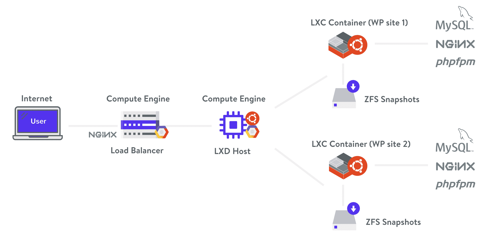
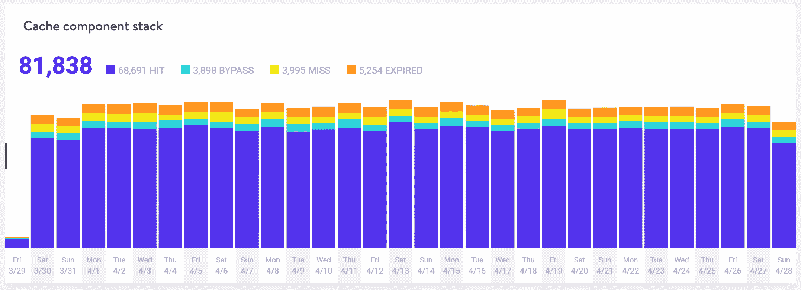
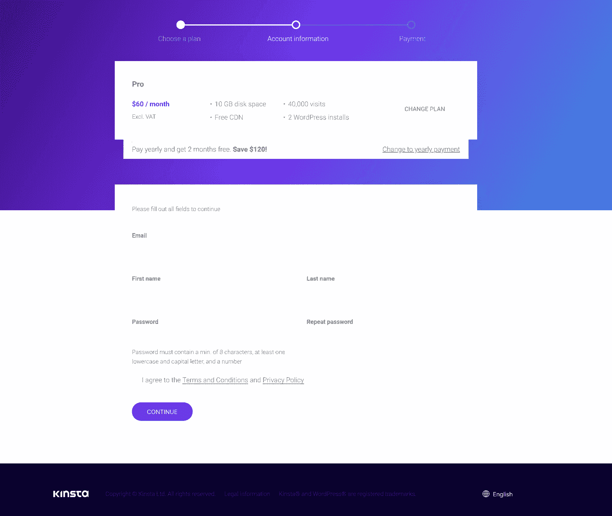
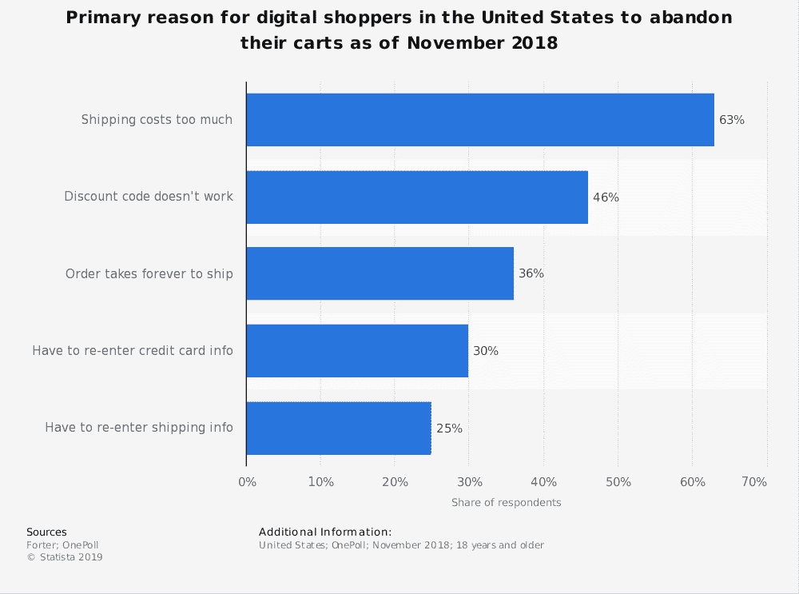
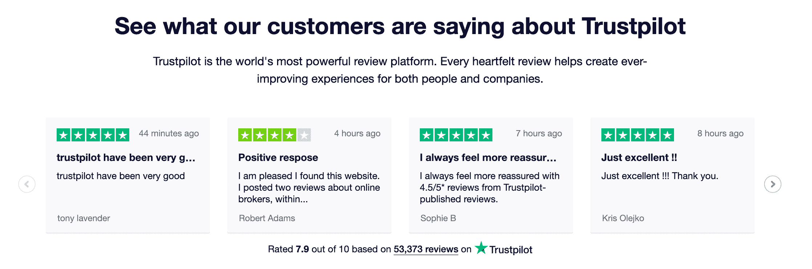
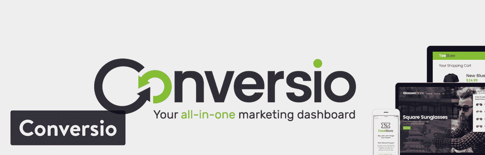

# 如何在你的电子商务网站上减少购物车的废弃

> 原文：<https://kinsta.com/blog/shopping-cart-abandonment/>

放弃购物车在实体店中并不常见。由于网上购物的便利性(或者可能是因为没有人在监视/评判你)，这种考虑只有在具体谈论电子商务商店时才真正相关。

为了正确看待这个电子商务问题，[四辆购物车中有三辆被废弃](https://baymard.com/lists/cart-abandonment-rate),[的废弃购物车率在去年上升了 2%](https://www.barilliance.com/cart-abandonment-rate-statistics/#tab-con-2) 。

[On average, over 70% of your potential customers are abandoning their shopping carts. 😲 See how to fix this on your ecommerce site.Click to Tweet](https://twitter.com/intent/tweet?url=https%3A%2F%2Fkinsta.com%2Fblog%2Fshopping-cart-abandonment%2F&via=kinsta&text=On+average%2C+over+70%25+of+your+potential+customers+are+abandoning+their+shopping+carts.+%F0%9F%98%B2+See+how+to+fix+this+on+your+ecommerce+site.&hashtags=ecommerce%2CWordPress)

放弃购物车是潜在转化的一个主要缺口。例如，据发现，65%的购物车放弃率会留下 97.9%的转化率差距，这平均每年会让营销人员损失 2 到 4 万亿美元。也就是说，Forrester Research 建议[每年损失 18 万亿美元](https://www.abtasty.com/blog/understanding-shopping-cart-abandonment/)。

## 什么是购物车废弃？

放弃购物车是指当您的电子商务网站上的潜在客户正在结账(或至少已经将购物车添加到购物车中)并决定不再购买时。这通常以一段时间内废弃手推车的百分比来衡量。它可能会受到糟糕的用户界面、结账流程、混乱的定价、品牌可信度等的影响。

Support

为了提高转化率，网上购买过程可能很复杂。

一些研究表明，75%放弃购物车的网站访问者计划返回网站进行购物或继续他们的研究。事实上，只有 [2%的顾客](https://www.invespcro.com/blog/the-average-website-conversion-rate-by-industry/)在第一次访问电子商务商店时转化，并且 92%的首次访问者不打算在那时从商店购买任何东西。事实上，在顾客决定从普通企业购买之前，平均需要接触五次。

因此，不要把放弃购物车看作是放弃销售，你应该把它看作是衡量网站访问者最终购买意图的一个指标。

> 需要在这里大声喊出来。Kinsta 太神奇了，我用它做我的个人网站。支持是迅速和杰出的，他们的服务器是 WordPress 最快的。
> 
> <footer class="wp-block-kinsta-client-quote__footer">
> 
> 
> 
> <cite class="wp-block-kinsta-client-quote__cite">Phillip Stemann</cite></footer>

[View plans](https://kinsta.com/plans/)

## 购物车放弃统计

根据 Baymard Institute 的调查，以下是[顾客放弃购物车](https://baymard.com/lists/cart-abandonment-rate)的最常见原因:

*   昂贵的运费(55%)
*   网站希望他们做一个帐户(34%)
*   漫长或复杂的结账流程(26%)
*   不信任有信用卡信息的网站(17%)
*   网站出错/崩溃(17%)
*   没有足够的支付选项(6%)

当然，也可能有其他原因在起作用，例如库存产品不足、品牌忠诚度下降和结账错误。

放弃购物车的其他主要原因包括:

*   拥有一个缓慢的网站。一个慢的网站可以[增加 75%的弃用率](https://www.annexcloud.com/blog/31-shopping-cart-abandonment-statistics-for-2018/)，当你的网站慢的时候忠诚度下降 50%。
*   **顾客只是浏览。** 81%的客户只是浏览电子商务网站，因为他们在进行网上调查，寻找最佳交易。55% [在亚马逊和 Pinterest 上寻找产品](http://www.smartshippingmadeeasy.com/wp-content/uploads/2017/05/consumer-journey-by-channel-advisor.jpg)，79%寻找免费退货运费，71%评估运费和政策。

## 如何减少购物车废弃

就像转化率优化一样，有很多因素可以影响你的购物车放弃率。这里有一些简单的步骤来减少它！

### 1.加速您的电子商务网站

对于任何网站来说，页面速度都是最重要的页面优化工作之一。如果网站加载时间超过 3 秒，客户就会离开。全球速卖通表示，通过将页面的加载时间减少 36%，新客户的订单增加了 10.5%，转化率增加了 27%。另一方面，通过改善 68%的渲染时间、64%的加载时间和 46%的页面权重，Ancestory.com 看到了 [7%的转化率增长](https://www.dropbox.com/s/8rffw1px0yn05gm/Velocity-NY-Jed-Wood-Ancestry-User-Centered-Metrics.pdf?dl=0)。

WooCommerce 网站要求特别高，因为它们会产生大量数据和无法处理的请求，因此需要健壮的 [PHP 和数据库资源](https://kinsta.com/blog/php-benchmarks/)。在选择 [WooCommerce hosting](https://kinsta.com/woocommerce-hosting/) 时，使用基于容器的主机很重要，比如 Kinsta，它是为使用隔离资源进行扩展而构建的。

Kinsta architecture

加速您的网站的其他想法:

*   [优化您的图像](https://kinsta.com/blog/optimize-images-for-web/)。
*   卸载和缓存不同的文件，如 pdf 和 MP3。
*   Cache as much of your content as possible. You can opt for a caching plugin, though there are certain web hosts like Kinsta, which [handles caching for you](https://kinsta.com/blog/wordpress-cache/) (and offers four different types of caching, to boot).

    

    ——命中、未命中、绕过

    

*   使用内容交付网络( [CDN](https://kinsta.com/blog/wordpress-cdn/) )。根据位置的不同，我们已经看到 CDN 将整体加载时间减少了 50%以上！
*   优化你的 WordPress 数据库。当你用标准方法从你的 WordPress 数据库中删除一个插件时，它通常会在你的数据库中留下表格和行，随着时间的推移，这会降低你的网站速度。当你的网站变得太拥挤时，你可以选择[限制帖子的修改](https://kinsta.com/blog/wordpress-revisions/#how-to-limit-revisions-in-wordpress)或者删除旧的。你也可以将表格从 [MyISAM 转换成 InnoDB](https://kinsta.com/knowledgebase/convert-myisam-to-innodb/) ，[清理你的 wp_options 表格](https://kinsta.com/knowledgebase/wp-options-autoloaded-data/)。

如果你真的想深入了解所有的优化技术和技巧，一定要看看我们关于如何加速你的 WordPress 站点的终极指南。

### 2.缩短和简化结账流程

约 21%的购物者表示，他们放弃购物车的原因是因为结账过程太长或令人望而生畏。根据[贝玛研究所](https://baymard.com/lists/cart-abandonment-rate)的研究，通过更好的结账设计，一般的大型电子商务网站可以提高 35.26%的转化率。

简化结账的一些想法:

*   提供一步结账(像亚马逊一样)或者想办法减少结账的必要步骤。
*   **为客人提供结账服务。** [35%的在线交易](https://www.annexcloud.com/blog/31-shopping-cart-abandonment-statistics-for-2018/)通常会被取消，因为网站要求用户在结账前创建一个账户。访问者不想创建用户帐户的一些原因包括隐私、电子邮件收件箱爆满、时间不够以及购买的不确定性。
*   **Strip down and simplify checkout.** This could be done in a number of different ways. For example, Kinsta removes distractions on their checkout page by stripping out the top header. You can also see where you are at in the process as you go.

    

    电子商务结账简体

    

退一步，认真考虑一下你现有的结账流程:要么是自我审计，要么是通过[可用性测试](https://kinsta.com/blog/website-usability-testing/)。有什么特别费解的地方吗？有没有可以消除的字段？测试新的更改，并确保在完全提交之前衡量对您的转换的影响。

### 3.提供替代付款方式

当你开了一家电子商务商店，你就有可能与全世界做生意。了解这一点后，你必须意识到一种[支付方式](https://www.bigcommerce.com/blog/wordpress-payments/)不足以满足不同国家的客户。您可能需要根据您的客户所在的地区，采用多种不同的支付方式。

[Stripe](https://kinsta.com/blog/stripe-vs-paypal/) 和 PayPal(连接到银行账户、借记卡和信用卡)是电子商务商店接受的一些最常见的收款方式。除此之外，可以考虑的新兴替代支付方式包括 Apple Pay、Amazon Pay 和 Google Pay。

## 注册订阅时事通讯

### 想知道我们是怎么让流量增长超过 1000%的吗？

加入 20，000 多名获得我们每周时事通讯和内部消息的人的行列吧！

[Subscribe Now](#newsletter)

使用方形？查看我们的深度对比博文:[条纹 vs 方形](https://kinsta.com/blog/stripe-vs-square/)。

### 4.考虑提供免费运输

据 [Statista](https://www.statista.com/statistics/379508/primary-reason-for-digital-shoppers-to-abandon-carts/) 、**统计，昂贵的运费是人们弃车的首要原因**，但据[履行服务](https://www.efulfillmentservice.com/fast-free-shipping-infographic/)统计，免运费并不是吸引新客户的唯一考虑因素。低价是顾客重游电子商务网站的首要原因。

Reasons shoppers abandon carts

结账时，78%的受访者表示他们更喜欢免费送货而不是加急送货。67%的情况下，客户会选择更便宜的运输方式，而不是最快的运输方式(这代表了 2%的客户)。此外，58%的客户愿意等待 4-7 天才能收到他们在网上购买的商品，但作为在线卖家，你也必须提供一个预期的时间框架或交付日期，以让客户满意。

在被调查者中，58%的人希望免费或打折运输，而 28%的人希望有多种运输选择。

尽管免费或快速运输足以刺激销售增长，但了解这对你的底线的影响是很重要的，因为运输成本会占总成本的 5%或更多。总的来说，大约一半接受调查的中小型企业表示，提供免费运输增加了利润。

作为零售商，找到增加成本和增加销售之间的最佳平衡点很重要。

以下是零售商在运输方面的几种做法:

*   提供标准递送的免费送货服务，但额外收费的高级服务，如加急运输。
*   对低价值产品收取运费，但对高价值产品提供免费运费。
*   使用成本较低的承运商，如果客户选择这些承运商，则提供免费运输。

### 5.通过出色的网站安全性和评论激发信任

如果一个网站看起来没有安全徽章，35%的人会放弃这个网站。

如果您想知道应该使用什么特定的安全徽章，[bay mard 调查](https://baymard.com/blog/site-seal-trust)发现最受信任的徽章是诺顿(35.6%)，其次是迈克菲(22.9%)，TRUSTe (13.2%)和 BBB 认证(13.2%)。

Struggling with downtime and WordPress problems? Kinsta is the hosting solution designed to save you time! [Check out our features](https://kinsta.com/features/)

除了包含安全徽章之外，加入额外的[网站安全功能](https://kinsta.com/blog/wordpress-security/)，如密码加密和 [SSL 证书](https://kinsta.com/knowledgebase/how-ssl-works/)(必须的——[HTTPS](https://kinsta.com/blog/http-to-https/)现在是[谷歌搜索排名因子](https://webmasters.googleblog.com/2014/08/https-as-ranking-signal.html))，这样你的客户就知道你对他们的安全有合理的兴趣，徽章不只是为了展示。

(延伸阅读:[如何给 WooCommerce 添加 SSL 证书](https://kinsta.com/knowledgebase/woocommerce-ssl/))

你也可以通过同行评审帮助顾客克服最初的犹豫，证明你的商店是一个合法的购物场所。84%的人相信在线评论和个人推荐。发挥创意，在你的电子商务网站上发布顾客评论。将您的[最佳点评](https://kinsta.com/blog/best-wordpress-review-plugins/)放在您的结账页面上，以降低潜在客户放弃购物车的几率。

Ecommerce customer reviews (Image source: [TrustPilot Business](https://business.trustpilot.com/))

### 6.提供可靠的移动友好型购物体验

超过一半的全球网络流量来自移动用户。

[76%的](https://www.google.com/url?q=http://www.smartshippingmadeeasy.com/wp-content/uploads/2017/05/consumer-journey-by-channel-advisor.jpg&sa=D&ust=1553640050576000&usg=AFQjCNFj3PqVVHJduFIxM7HEwtF1hkaI8Q) [智能手机用户](https://www.google.com/url?q=http://www.smartshippingmadeeasy.com/wp-content/uploads/2017/05/consumer-journey-by-channel-advisor.jpg&sa=D&ust=1553640050576000&usg=AFQjCNFj3PqVVHJduFIxM7HEwtF1hkaI8Q)会在一天内访问搜索业务；这些搜索中有 28%会导致购买。59%的电子商务网站访问是在移动设备上进行的，移动活动占电子商务收入的 38%。在网上购物最常用的三种设备中，移动设备占[最高弃车率](https://www.barilliance.com/cart-abandonment-rate-statistics/#tab-con-2) (85.65%)，其次是台式机(73.07%)和平板电脑(80.74%)。

你可以采用一种策略来优化手机友好性，包括使用 Google AMP T1，它通过提供一个精简版来让用户快速浏览你的网站。有几个插件可以用来激活这个功能，如【WooCommerce 放大器和 [WP 放大器](https://codecanyon.net/item/wp-amp-accelerated-mobile-pages-for-wordpress-and-woocommerce/16278608)。但是，您也应该对此进行广泛的测试，因为 AMP 有很多问题。

你也会想考虑我们的指南，确保你的 WordPress 网站是为谷歌的移动优先索引优化的。

## 如何用废弃购物车电子邮件修补购物车废弃

如果尽管你在现场尽了最大努力，你的客户仍然以很高的比率放弃他们的购物车，那么有一个好消息:你仍然可以在[废弃购物车电子邮件](https://kinsta.com/blog/abandoned-cart-email/)的帮助下取回它们。

废弃购物车电子邮件很有帮助，也很有效。以下是一些来自 [Moosend](https://blog.moosend.com/) 的废弃购物车电子邮件统计数据:

*   **打开率**:平均 45%的弃车邮件被打开。
*   **点击率** : 21%的邮件被点击。
*   **转化率** : 10.7%的接受者完成了购买。根据 [Barilliance](https://www.barilliance.com/email-marketing-statistics/) 的说法，废弃的购物车邮件可以导致转化率增加 18.64%！

您可以在电子邮件营销提供商和/或[电子商务平台](https://kinsta.com/blog/ecommerce-platforms/)的帮助下创建自己的废弃购物车电子邮件(例如，BigCommerce 提供内置的废弃购物车恢复功能)。

此外，Converio 有助于简化流程:

### 转变

是一家专门针对电子商务商店的电子邮件营销公司。

Conversio WooCommerce plugin

它们允许您发送任何相关的电子商务电子邮件，如收据、废弃购物车电子邮件、跟进电子邮件、产品评论、时事通讯和反馈电子邮件。Conversio 提供了漂亮的预设计电子邮件模板、强大的细分和自动化活动。Conversio 还根据灵活的定价模式收费。

### 废弃购物车电子邮件最佳实践

需要注意的一些关键废弃购物车电子邮件实践:

*   **发送多封电子邮件**。事实上，你应该至少发送两个。最好的营销活动包括发送三封电子邮件(导致平均 18.2%的额外销售额)。一小时内发送第一封邮件。如果你发送一个超过 24 小时，转换率减半。然后，在放弃后 24-36 小时发送第二封邮件，72 小时后发送第三封邮件。
*   提供额外折扣。在每封邮件中提供更大的折扣。上述解决方案能够在您的电子邮件模板中创建动态折扣代码。
*   时机很重要。根据 [Barilliance](https://www.barilliance.com/shopping-cart-abandonment-guide/) 的一项研究，在理想时间发送你的第一封电子邮件可以带来 20.3%的转化率(而在非理想时间的转化率为 12.2%)。这也会影响后续邮件的转换率(最佳时间的转换率为 17.7%，其他时间为 7.7%)。
*   写一个能引起你注意的主题。个性化(通过使用接收者的名字，并根据他们将要购买的东西推荐产品)是值得努力的事情。

## 摘要

电子商务正享受着惊人的增长，但它并没有达到应有的顶点，平均有四分之三的购物车被丢弃。这可以通过理解顾客放弃购物车的原因和[实施战略](https://kinsta.com/blog/abandoned-cart-email/#abandoned-cart-email-templates)来解决你的电子商务网站上的主要问题领域来弥补。

关于购物车废弃，你还有哪些问题？请在下面的评论中留下它们。

* * *

让你所有的[应用程序](https://kinsta.com/application-hosting/)、[数据库](https://kinsta.com/database-hosting/)和 [WordPress 网站](https://kinsta.com/wordpress-hosting/)在线并在一个屋檐下。我们功能丰富的高性能云平台包括:

*   在 MyKinsta 仪表盘中轻松设置和管理
*   24/7 专家支持
*   最好的谷歌云平台硬件和网络，由 Kubernetes 提供最大的可扩展性
*   面向速度和安全性的企业级 Cloudflare 集成
*   全球受众覆盖全球多达 35 个数据中心和 275 多个 pop

在第一个月使用托管的[应用程序或托管](https://kinsta.com/application-hosting/)的[数据库，您可以享受 20 美元的优惠，亲自测试一下。探索我们的](https://kinsta.com/database-hosting/)[计划](https://kinsta.com/plans/)或[与销售人员交谈](https://kinsta.com/contact-us/)以找到最适合您的方式。