# 如何在 2022 年将博客货币化(13 种盈利方式)

> 原文：<https://kinsta.com/blog/how-to-monetize-a-blog/>

创建博客并从中获利从未像今天这样简单。

不久前，创建一个网站需要花费数千甚至数万美元来建立和维护。网站赚钱同样困难。PayPal 还处于起步阶段，Stripe 还不存在，电子邮件营销也远没有现在这么灵活。

然而今天，你只需要几百美元就可以在 WordPress 上创建、维护一个博客并从中获利(这取决于你需要做什么)。但是仅仅因为现在用你的博客赚钱更容易，并不意味着大多数博客作者也是这样。

根据 ConvertKit 的 2017 年[博客状态报告](https://convertkit.com/reports/blogging/)，专业博客作者去年的平均利润为 138，064 美元，而业余博客作者(占受访者的 86%)的平均利润仅为 9，497 美元。

这太可怕了，尤其是当你想到大多数博客作者开博客是为了自己当老板，辞掉枯燥的朝八晚五的工作。

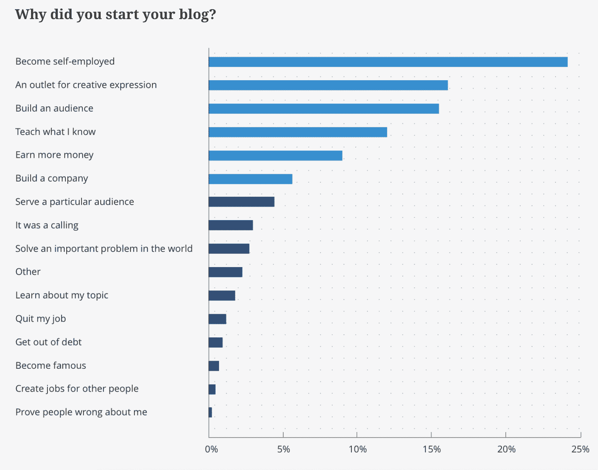

Why did you start your blog? (Image source: [ConvertKit](https://convertkit.com/reports/blogging/motivation/))

那么，你是如何从一个业余博主变成一个年收入达到六位数的职业博主的呢？

嗯，你需要一个[坚实的营销计划](https://kinsta.com/learn/content-marketing/)，这包括内容、[、有利可图的利基](https://kinsta.com/blog/website-ideas/)，以及一个伟大的货币化战略。

你还需要做一些快速的数学运算。

## 你应该什么时候开始将你的博客货币化？

从你的博客中赚钱，没有一个具体的数字来说明有多少流量或多大的电子邮件列表，因为这完全取决于你卖什么和你怎么卖。

(建议阅读:[我的网站值多少钱？](https://kinsta.com/blog/how-much-is-my-website-worth/)和 [77 为你的网站带来流量的成熟策略](https://kinsta.com/blog/how-to-drive-traffic-to-your-website/)。

然而，首先弄清楚两件事会对你有很大帮助:

1.  **获得稳定的流量**:你不需要数万名访客，但一个月至少有 1000 名访客意味着你在做正确的事情。
2.  增加你的电子邮件列表:再次强调，你不需要做任何疯狂的事情。我们将向你展示一些人的例子，他们有一个很小的清单，但仍然把它用在他们的优势上。

现在这两件事很重要，但最重要的是，有效地将你的博客货币化是关于数字的。

例如，如果你需要从你的博客中赚 6000 美元，你可以:

*   向 30 个人推销一个 200 美元的产品(比如说一门课程)。
*   向 10 个人推销 600 美元的课程。
*   [成为提供经常性佣金的品牌的附属合作伙伴](https://kinsta.com/ebooks/wordpress/increase-affiliate-commissions/)(以您自己的速度达到 6000 美元)。
*   甚至向客户咨询收费 6000 美元。

货币化是数学，不是魔术。

这并不意味着货币化的关键是简单地提高你所卖东西的价格。相反，这意味着你应该**选择一个与你的博客现在所处的位置或者你希望它在未来所处的位置相一致的盈利策略**。

在这篇文章中，我们将向你展示如何通过博客赚钱，无论你是一个月有数千的浏览量，还是刚刚起步。

我们将展示一些其他博主在不同领域从自己的博客中获得收入的可靠策略，并教你如何在自己的博客中做同样的事情。

[货币化是数学，不是魔术。🧙‍♂️:但是你需要选择一个符合你目标的策略。 点击推文](https://twitter.com/intent/tweet?url=https%3A%2F%2Fkinsta.com%2Fblog%2Fhow-to-monetize-a-blog%2F&via=kinsta&text=Monetization+is+math%2C+not+magic.+%F0%9F%A7%99%E2%80%8D%E2%99%82%EF%B8%8F+But+you+need+to+choose+a+strategy+that+aligns+with+your+goals.&hashtags=blogging%2Cmakemoneyonline)

## 1.在你的领域成为一名自由博客写手

从你的博客中赚钱的最简单的方法之一就是**成为一名自由撰稿人**为你所在领域更著名的博客工作。

想想看，你开博客可能是因为你在这方面有经验/知识，所以为什么不利用这一点呢？

企业正在寻找能够创造[内容来推动其营销](https://kinsta.com/learn/content-marketing/)的人，那么谁能比拥有该领域知识的人更好地创造这些内容呢？

自由博客作者 Bamidele Onibalusi 利用他的博客 Writers in charging 来展示他的内容营销能力，同时也增加了他的读者。他现在全职为其他企业写博客。

根据 Glassdoor 的数据，美国自由职业者的平均年收入约为 4 万美元。请记住，这个数字受你的经验水平和你写作的领域的影响。

根据编辑自由职业者协会的统计，以下是你在不同领域能挣多少钱:

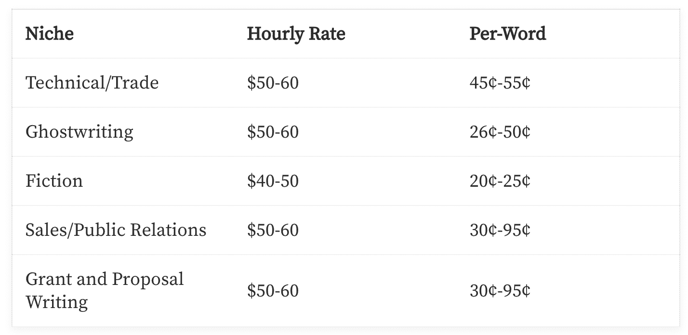

What average freelancer writer makes by niche (Image source: [Contena Community](https://blog.contena.co/how-much-money-do-freelance-writers-make/))

当你开始的时候，你可能不能收取这些费用，但是随着你获得更多的经验和信誉，你的费用会上升。**注意不要在开始时充电太低**。

一篇文章收费 10 美元似乎是获得客户的简单方法，但事实上，随着你的技能受到质疑，这可能会赶走优质客户，更不用说收费这么低会耗尽你继续下去的动力。

既然我们谈到了定价问题，那么最好是按项目收费，而不是按小时收费，因为很难确定你完成一项任务需要多长时间，尤其是当你刚刚开始做自由职业者的时候。

根据项目本身收取费用意味着你会因为完成得更快而得到奖励，而且你的客户从一开始就知道他们会付多少钱。

根据 [WriteWorldwide](https://writeworldwide.com/) 的报道，这里是你作为自由作家的第一年，每个项目可以收取的费用，不考虑你的利基或之前的写作经验。

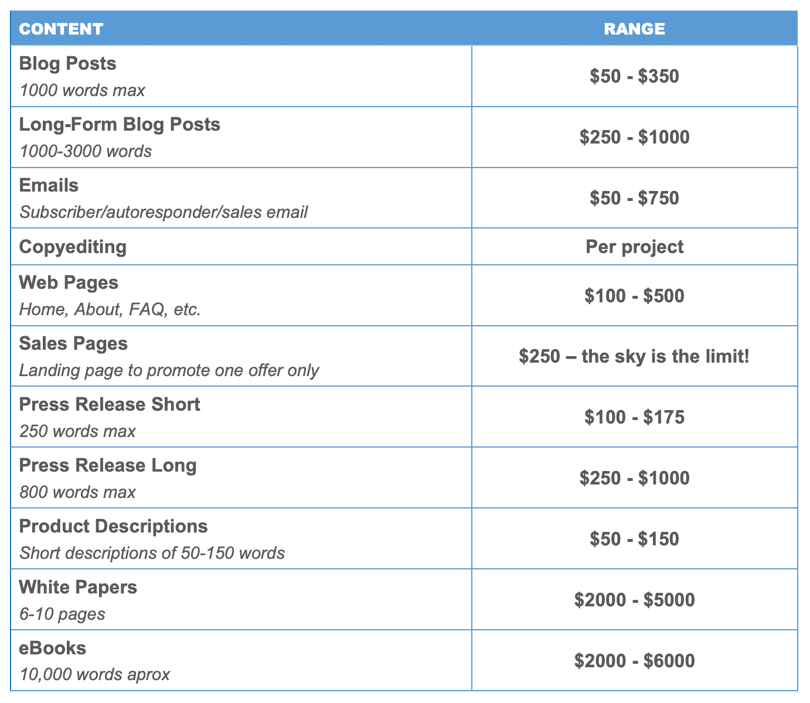

How much to charge for writing (Image source: [Write Worldwide](https://writeworldwide.com/charge-for-your-writing/))

自由写作最好的一点是，你不需要博客上的大量流量就能开始赚钱，所有的企业都真正关心你能写出好的内容。

例如，乔登·罗珀(Jorden Roper)在成为自由作家的第四个月赚了 5000 美元，[詹妮弗·格雷戈里(Jennifer Gregory](http://www.jennifergregorywriter.com/2017/02/28/how-i-earned-over-19k-as-a-freelance-content-marketing-writer-in-february-2017/) 一年从她的自由写作业务中赚了大约六位数。

作为一名自由博客写手，你的工作是创作书面内容，吸引访客访问企业网站，这样一些访客就可以转化为企业的客户。

根据内容营销研究所的 2019 年[报告](https://www.slideshare.net/CMI/b2b-content-marketing-2019-benchmarks-budgets-and-trendsnorth-america?ref=https://contentmarketinginstitute.com/2018/10/research-b2b-audience/)，营销人员将在内容创作上投入更多资金，50%的受访营销人员预计他们的内容营销预算将在 2019 年增加。

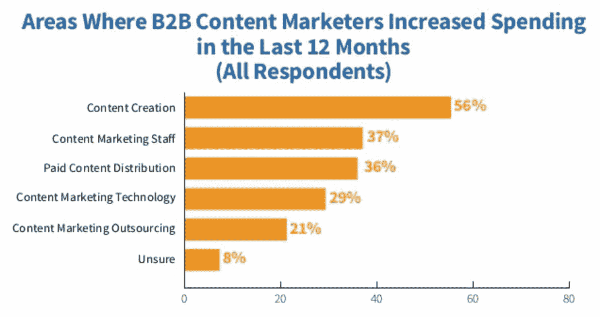

B2B increased spending on content creation (Image source: [CMI SlideShare](https://www.slideshare.net/CMI/b2b-content-marketing-2019-benchmarks-budgets-and-trendsnorth-america?ref=https://contentmarketinginstitute.com/2018/10/research-b2b-audience/))

如果有企业在你的领域赚钱，那么只要这些企业在创造内容，你可以打赌他们需要作家。

请注意，我提到企业必须赚钱。作为一名自由博客作者，你可能犯的最严重的错误之一就是选择一个企业付不起你薪水的利基市场。

例如，写关于艺术的文章可能是你的乐趣所在，你可能有广泛的知识，但是有多少博客会定期付钱给你写这方面的文章呢？

作为一名自由博客作者，盈利的途径是找到合适的市场定位。

测试你的利基市场是否赚钱的一个快速方法是找到至少十个涵盖你想写的利基市场的作家。你可以简单地在 LinkedIn 上用你的关键词搜索。

例如，当我在 LinkedIn 上搜索头衔为“自由职业个人金融作家”的人时，我会得到大约 42 个结果。你也可以在没有引号的情况下进行更广泛的搜索，这会产生更多的结果。

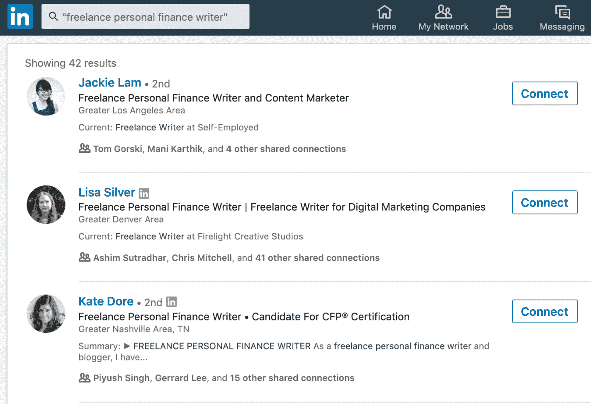

Freelance personal finance writer search on LinkedIn

这是验证你的定位的简单方法。

我们已经确定，作为自由撰稿人，你不需要大量的流量来赚钱，但这并不意味着人们会找到你的博客并雇佣你。

你必须出去推销你的服务。

当你在博客上创作了写作样本，或者在其他博客上发表了客座博文，你就可以开始接触你想为之写作的企业了。

你也可以使用自由职业者市场，如 Upwork、SEOclerks 和 Fiverr。虽然有一些自由作家赚了很多钱，比如 Danny Marguiles 在 Upwork 上一年赚了超过 10 万美元，但这些平台上的大多数自由作家赚的钱很少。

为了避免自由职业者市场的底层竞争，你必须自己完成大部分拓展工作。

### 如何找到可以写作的博客

找到适合你写作的企业或博客的最好方法是简单地在谷歌上搜索与该领域相关的关键词，看看会出现什么。

因为很明显，出现在谷歌前几页的博客在内容营销上投入了大量资金。

例如，如果我正在寻找健身领域的博客，使用“健身博客”这样的简单搜索词，我会看到:

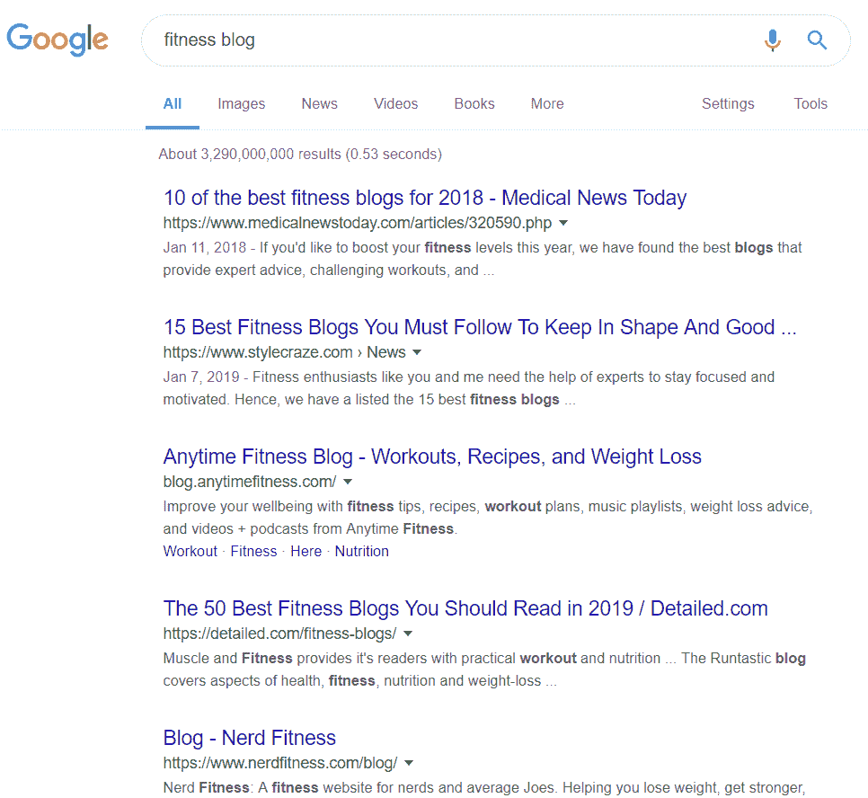

Fitness blog Google search

你也可以搜索与你的特定领域相关的术语，例如，在健身方面，比如“锻炼计划”:

Workout plans Google search

现在你要做的就是联系博客所有者，向他们推销你的自由写作服务。

### 利用你自己的网站

除了寻找新的写作机会，你也应该利用你自己的网站，毕竟你是个作家。

使用[集客营销](https://kinsta.com/blog/inbound-marketing/)和 [SEO 将人们吸引到你的网站](https://kinsta.com/blog/what-does-seo-stand-for/)，在那里你可以向他们提供你的写作和博客服务。

自由作家曼迪·奥斯曼在她的自由职业网站“博客作者”上这样做。

Maddy Osman freelance writing prices

## 2.向你的读者出售电子书

出售电子书是博客作者选择的最受欢迎的博客赚钱方式之一。它非常完美，因为它相对容易创建，而且价格足够合理，大多数访问者都能购买。

但是电子书不仅仅是让博主们快速从他们的博客中赚钱。作为一个博客作者，销售一本电子书可能是测试人们是否对你的报道感兴趣并愿意掏钱购买的最快方法。

电子书也是一种低风险的方式，让你的网站访问者在购买更昂贵的产品之前判断你能带来的价值。

与流行的观点相反，你不需要在你的博客上有大量的流量来用你的书赚钱。例如，David Oudiette 将他在构建登录页面时获得的知识转化成了一本 252 页 39 美元的电子书。

他的博客流量不大，因为当时他所做的只是咨询，但大卫能够从他的电子书中获得超过 13，000 美元的收入。

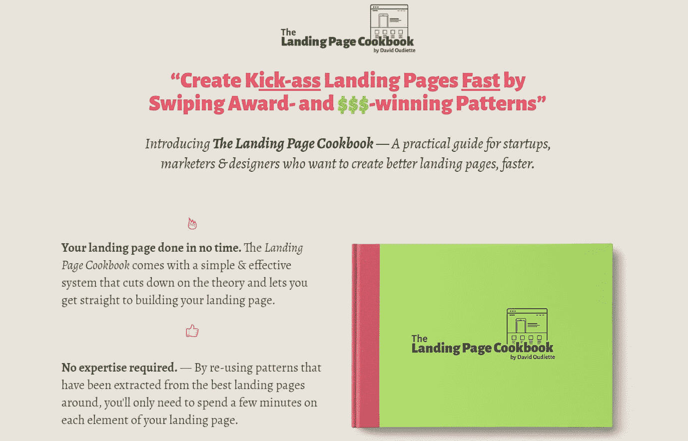

The landing page cookbook ebook (Image source: [your landing page sucks!](https://yourlandingpagesucks.com/))

为了卖出这么多书，大卫必须做以下事情:

*   他向他的博客订阅者询问他们的登陆页面，给他们免费的提示，然后把他们引向他的书。
*   他回答问题并给出关于 Quora 和 Reddit 登陆页面的反馈，然后把他的书作为额外的信息来源。
*   大卫还增加了关于产品搜寻的书。
*   更令人印象深刻的是，大卫·科尔德给企业发电子邮件，在他们的登陆页面上给他们免费反馈，然后他回复并链接到他的书。

所以大卫没有很多流量，但他做了很多工作。

还有泰勒·皮尔森，他在四周内卖出了 5000 多本书，2015 年仅这本书就赚了 6 万多美元。泰勒当时只有 700 名电子邮件订户。

泰勒把他的书的成功归功于几件事:

*   在写作阶段让他的博客粉丝成为测试版读者。
*   创建一个脸书小组与核心读者交流他的书的进展(阅读:[如何创建一个脸书页面](https://kinsta.com/blog/how-to-create-a-facebook-page))。
*   把这本书发给脸书小组的每个人，这样他们就可以在亚马逊上留下诚实的评论。
*   让他名单上的每一个人都知道这本书的进展，这让他们更加投入，并有可能在以后购买。
*   在发布期间和发布之后同步社交媒体消息。
*   向他的每一个 Gmail 联系人发送一封关于他的书的个性化电子邮件。
*   做赠品来推销这本书。

这本书最终成为亚马逊小企业版块的畅销书，剩下的就是历史了。

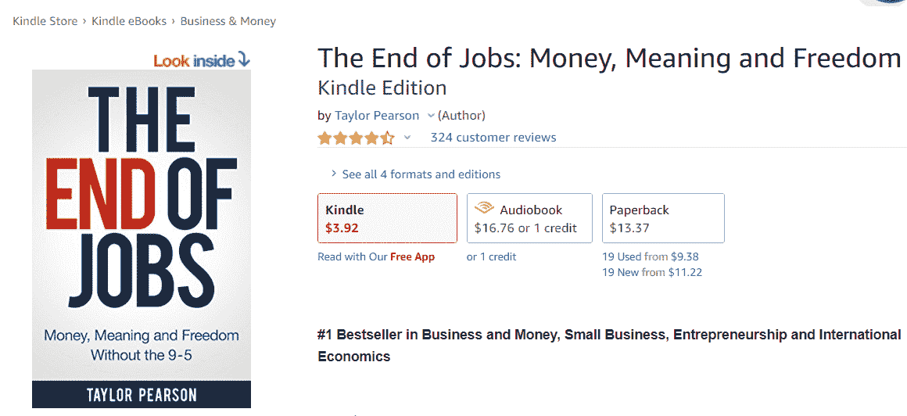

The End of Jobs ebook (Image source: [Amazon](https://www.amazon.com/End-Jobs-Meaning-9-5-ebook/dp/B010L8SYRG/ref=sr_1_1?ie=UTF8&qid=1553463071&sr=8-1&keywords=best+entrepreneur+books&tag=httpfronticom-20))

这两个例子的伟大之处在于，它们表明，有了正确的营销和一本好书，你不需要那么多订户，你当然也不需要成为一名专业作家。

这些作者都没有出版并希望，相反，他们为他们的书起飞做了很多工作。

### 哪里卖你的电子书

然后你可以选择直接在你的博客上或者通过 Gumroad 或者 Podia 这样的平台销售你的电子书。

在你自己的网站上销售你的电子书可能是有利的，因为你可以保留 100%的利润。例如，ShoutMeLoud 的 Harsh Agrawal 在他的网站上有一整块专门用来展示他不同的电子书。

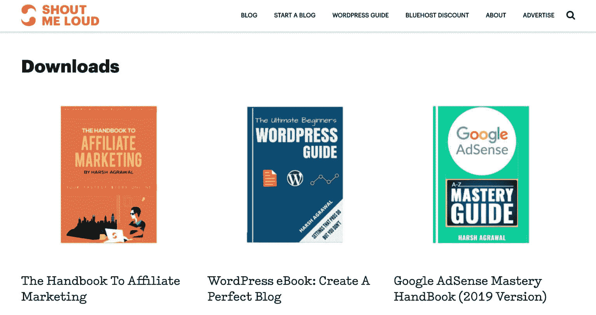

ShoutMeLoud ebooks

你可以用[简易数字下载](https://kinsta.com/blog/easy-digital-downloads/) WordPress 插件轻松创建这样的东西。

如果你选择以亚马逊 Kindle 的形式出版你的电子书，那么你只能保留 70%的利润，但它带来了额外的优势，你卖的书越多，你就可以获得更多的曝光率，从而带来更多的销售。

销售电子书也不局限于某个特定的领域。有关于博客、摄影、健身和任何你能想到的东西的电子书。

例如，如果你有一个教授园艺的博客，你可以出售一本电子书，更详细地教你的读者如何种植他们自己的花园或特定的植物。

你甚至可以重新利用你已经在博客上写的一些内容，然后添加更多的细节和背景。

### 如何制作这本书

如果你没有时间或技能自己写一本书，你可以雇佣代笔人来代笔。

你可以在 LinkedIn 上找到代笔人， [Scripted](https://www.scripted.com/ghostwriters-for-hire) ， [Upwork](https://www.upwork.com/hire/ghostwriters/) ，甚至 [Fiverr](https://www.fiverr.com/gigs/ghostwriter) 。请记住，像任何事情一样，你付出什么就会得到什么。更有经验的代笔会比新手多收你钱。

你也可以用 Canva、Photoshop 和 Snappa 之类的工具自己制作你的书的封面，或者你可以付费使用像 [99designs](https://99designs.com/) 之类的服务，让专业人士为你制作。

## 3.创建和销售在线课程

另一种让你的博客赚钱的方法是出售在线课程。阻碍大多数博客作者创建自己的课程的原因是，他们认为你需要成为某种专家才能教授一门课程。

但这不是真的，你真正要教一门课程所需要的是比你所教的人知道得更多，并且能够以一种人们会从中受益的方式呈现这些信息。

IWT 的 Ramit Sethi 从他开设的课程中赚了数百万美元，不是因为他是一名注册财务规划师，而是因为他帮助人们消除生活中的问题。

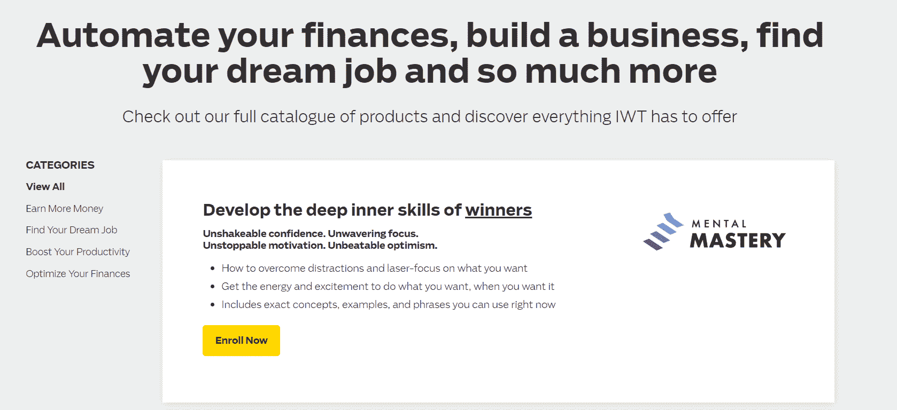

Finance course (Image source: [I Will Teach You To Be Rich](https://www.iwillteachyoutoberich.com/products/))

你不需要成为一名认证的厨师来创建一门教人们如何烹饪的课程。如果你能比大多数人做得更好，并且用一种能真正教会人们如何烹饪的方式来创作你的课程材料，那么就没有什么能阻止你创作你的课程。

参加在线课程的人比以往任何时候都多，到 2025 年，电子学习行业预计将增长到大约 3250 亿美元。

你也不需要成为像 Ramit Sethi 那样的有影响力的人来从你的课程中获得可观的收入。

像约瑟夫·迈克尔这样的人，作为一名新手，教作家如何使用流行的写作软件 Scrivener，赚了 4 万美元。

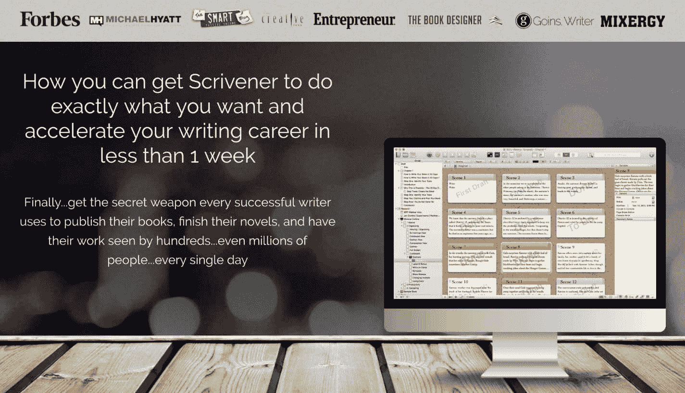

Scrivener course (Image source: [Scrivener Coach LLC](http://learnscrivenerfast.com/))

约瑟夫没有成千上万的访问者或庞大的电子邮件列表。他通过接触有影响力的人并在他演讲的网络研讨会上推广他的课程来推销他的课程。

### 如何想出课程创意

如果你已经有了一个听众，那么你只需要找出一个他们都有的问题，你就可以解决。

### 找出受众需要解决的棘手问题的方法:

*   **发送一份调查:**要想知道你的听众有什么问题，最快的方法就是问他们。您可以通过电子邮件发送一份简单的调查来完成。

下面是 Ramit Sethi 在新年前的一封电子邮件中这样做的一个例子:

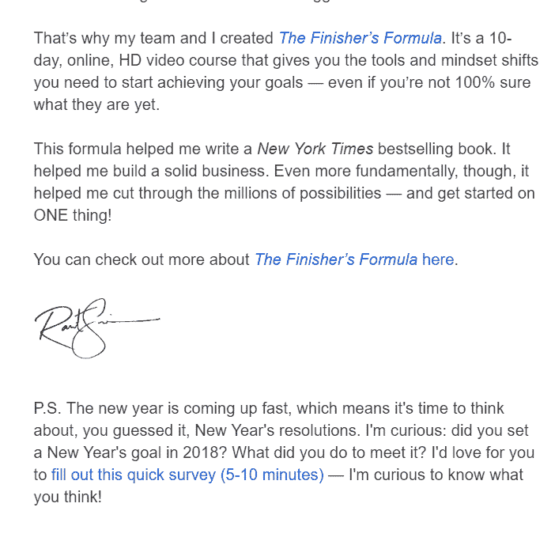

Email survey

*   **阅读博客评论:**如果你关注的话，你的评论区可以成为一个思想的宝库。如果你的博客上没有那么多评论，你可以看看你所在领域的其他博客上的评论。

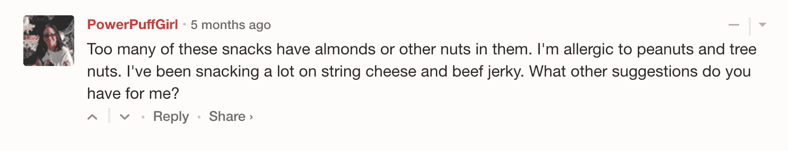

Blog comment (Image source: [Nerd Fitness](https://www.nerdfitness.com/blog/50-keto-snacks-the-ultimate-low-carb-snack-guide/))

然而，如果你没有听众，那么你可以通过头脑风暴来想出一些你比大多数人做得更好的事情。

这里有几个问题可以帮助你解决这个问题:

*   你的朋友称赞你什么？
*   人们找你咨询是为了什么？
*   有什么事情是你身边的人都在抱怨，而你却似乎没有意见的？
*   你从过去的工作中学到了什么？
*   你能比你认识的大多数人做得更好的是什么？

对约瑟夫来说，他知道如何使用 Scrivener，这是大多数人发现太复杂。在你的情况下，它可能是演奏乐器或穿衣。只要你能比大多数人做得更好，你就能把它教给他们。

### 主持你的课程

你可以选择在 [WordPress](https://kinsta.com/blog/wordpress-lms-plugins/) 上用 [LMS 托管 WordPress](https://kinsta.com/wordpress-lms-hosting/) 来托管你的课程，在这种情况下，你可以保留你课程的大部分利润，但是你必须自己设置一切，或者[雇佣一个开发者来帮助你](https://kinsta.com/blog/hire-wordpress-developer/)。

你也可以在第三方平台上开设课程。这些平台要么收取月租费，要么收取销售额的一定比例，作为交换，你可以获得一个更专业的平台来主持你的课程。

#### 你的课程的 WordPress 扩展

*   [WP 课件](https://kinsta.com/blog/wordpress-lms-plugins/#wp-courseware)
*   [LearnDash](https://kinsta.com/blog/wordpress-lms-plugins/#learndash)
*   [电梯门](https://kinsta.com/blog/wordpress-lms-plugins/#lifter-lms)
*   [学习按下](https://kinsta.com/blog/wordpress-lms-plugins/#learnpress)

#### 托管您的课程的第三方平台

*   [Podia](https://www.podia.com/)
*   [可教的](https://teachable.com/)
*   [餐厅](https://kajabi.com/)

## 4.开始辅导/咨询业务

有时，人们想要比书本或课程所能提供的更详细、更个性化的指导，因此他们转向一对一的辅导(或咨询，取决于你提供的服务类型)。

辅导或咨询是一种盈利策略，当大多数成功销售书籍和课程的博客所有者想要创造额外的收入来源时，他们会求助于这种策略。

然而，这不仅仅是针对知名博主的，咨询也可以从一开始就是你的赚钱策略。

教练就像我们已经介绍过的大多数盈利策略一样，你需要运用你的技能和经验来帮助人们解决生活中的问题。

例如，Brennan Dunn 通过营销自动化帮助企业销售更多产品，咨询费约为 9000 美元， [Nagina Abdullah](https://growthlab.com/how-to-make-money-coaching-online/) 每年为想减肥的客户提供超过 10 万美元的辅导。

以下是 Nagina 全年收入的快照:

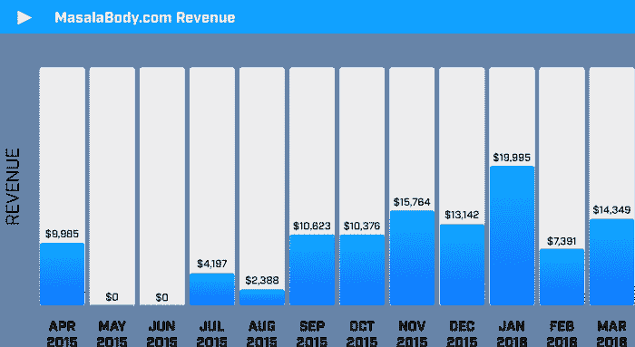

Consulting revenue (Image source: [Growthlab](https://growthlab.com/how-to-make-money-coaching-online/))

如果你已经通过书籍和课程获得了收入，考虑给你的听众提供一对一的咨询。

如果你刚刚起步，咨询的低容量意味着你可以在没有太多流量的情况下开始创收。

对于咨询来说，不仅仅是你创造了多少流量，更多的是获得正确的流量，也就是说，人们需要你的服务并有能力支付给你。

这意味着就你的客户类型关心的话题写有针对性的博客文章，这意味着在你的听众听的播客上发言，并参加他们聚集的活动，以便他们了解你。

## 5.提供付费会员计划

订阅模式的企业越来越受欢迎，以至于有些人开始称之为订阅经济。

从网飞、[虚拟主机提供商](https://kinsta.com/blog/managed-wordpress-hosting/)和[会员网站](https://kinsta.com/wordpress-membership-website-hosting/)的一切都是订阅经济的一部分。

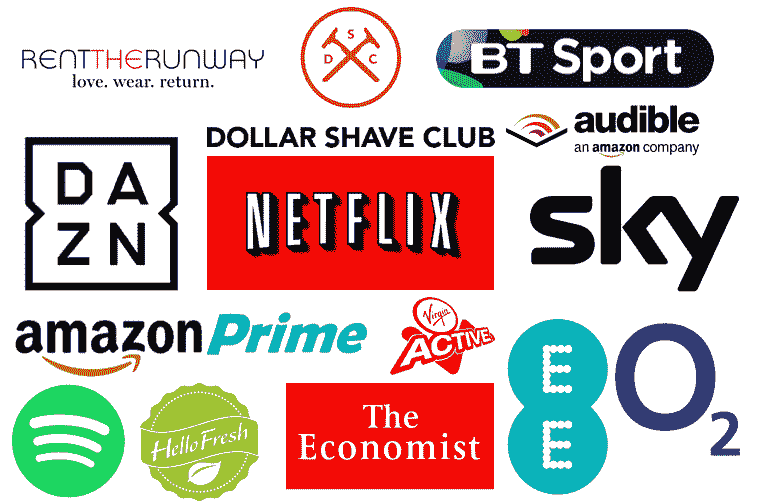

Subscription economy (Image source: [Emma](https://emma-app.com/blog/2018/06/13/subscription-economy-personal-finances/))

[会员网站是您在线业务的一个门户部分](https://kinsta.com/blog/hosting-wordpress-membership-sites/),会员可以按月或按年订阅，享受专属优惠。

你所在社区的人们有着共同的兴趣，他们为之付费的好处可能包括独家文章、建议、报告、网络研讨会、面对面的聚会以及与志同道合的人在一起。

会员网站不仅能让你接触到更多的人，还能给每个人一种社区感和归属感。

我喜欢会员制网站的一点是，无论是否意识到，每个人都是团体的一部分。

这意味着，如果你对某样东西感兴趣，世界之大，互联网之广，你可以找到和你一样的人。

例如，Ryan Levesque 喜欢兰花，并且知道如何种植兰花，因此他创建了[兰花易](http://www.orchidsmadeeasy.com/green-thumb-club.html)网站，向会员提供独家内容，并为他们提供一个平台，让他们能够认识其他兰花爱好者并向他们学习。

瑞安的会员每月支付 9.95 美元，由于他有 1800 名会员，他的收入每月达到 1.8 万美元。

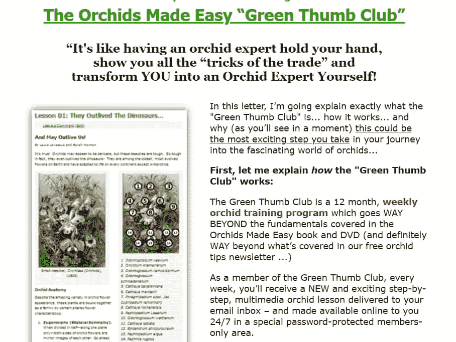

Club (Image source: [Orchids Made Easy](http://www.orchidsmadeeasy.com/green-thumb-club.html))

更好的是，根据你收取的会员费，你可能不需要那么多流量。

Fuzzy yellow balls 的威尔·汉密尔顿(Will Hamilton)教网球运动员如何提高比赛水平，他曾经有 600 名会员每月付给他 25 美元。这超过了 600 人每月 15000 美元的工资，这还是在 2010 年。

你可以[为几乎任何事情创建一个会员网站](https://kinsta.com/blog/wordpress-membership-plugins/),只要你的目标人群有钱并且有奉献精神。

例如，网球运动员投入数小时的练习以变得优秀，所以他们很投入，他们也在网球装备上花钱，所以他们有钱花。

另一个很好的例子是高尔夫球手。高尔夫球手愿意努力提高他们的技术，他们也在设备上花钱。

这可能就是为什么“破八十”的 Sean Ogle 能够在 8 个月内让 150 名会员加入他的高尔夫俱乐部。破 80 会员每年缴纳[250 美元到 500 美元](https://sidehustleschool.com/episode/263/)之间。

如果你有一群忠实的观众，并且已经花钱去改善，那么创建一个会员网站可能是你能做的最有利可图的事情。你可以很容易地从只有几百名会员的地方开始赚几千美元。

说到创建和管理你的会员网站，你可以使用 [WordPress 插件](https://kinsta.com/blog/wordpress-membership-plugins/)或第三方平台。

## 注册订阅时事通讯

### 想知道我们是怎么让流量增长超过 1000%的吗？

加入 20，000 多名获得我们每周时事通讯和内部消息的人的行列吧！

[Subscribe Now](#newsletter)

#### 管理 WordPress 上的会员网站

*   [Learndash](https://kinsta.com/blog/wordpress-membership-plugins/#learndash)
*   [S2 成员](https://kinsta.com/blog/wordpress-membership-plugins/#S2member)
*   [Memberpress](https://kinsta.com/blog/wordpress-membership-plugins/#memberpress)
*   [终极会员职业版](https://kinsta.com/blog/wordpress-membership-plugins/#ultimate-membership-pro)

#### 使用第三方工具管理会员网站

*   [us screen](https://www.uscreen.tv/):如果你主要是视频内容。
*   [Podia](https://www.podia.com/)
*   [餐厅](https://kajabi.com/)
*   [山杏](https://www.wildapricot.com/)

## 6.利用展示广告(横幅广告)赚钱

博客圈里的展示广告充满了仇恨。大多数人认为这是一个糟糕的货币化策略，因为你无法用它做出任何像样的东西。

在大多数情况下，他们是对的，但是展示广告仍然受欢迎是有原因的，尽管它们受到了所有的负面报道。

原因是，他们的工作，是最快的，即使不是最有利可图的方式开始赚钱的网站。

事实上，一些博客从展示广告开始，直到他们找到更有利可图的盈利策略。对一些人来说，最初的几美元给了他们足够的动力继续写博客。

例如，[汽车专家](https://www.carexpert.com.au/)的厄尔布尔士山脉·法拉开始利用他的网站赚钱时，一个朋友烦他把来自[谷歌 Adsense](https://kinsta.com/blog/how-to-add-google-adsense-to-wordpress/) 的展示广告放在他的博客上。这些广告让厄尔布尔士山脉在保住全职工作的同时，从博客上一无所获，到每天稳定地赚到 200 美元。

建议阅读:[2019 年你的网站要考虑的 22 个最佳 AdSense 替代品](https://kinsta.com/blog/adsense-alternatives/)。

厄尔布尔士山脉后来开始直接与支付高达 3 万美元的汽车制造商合作。如果那位朋友没有说服他先用 Adsense 赚钱，这一切都不可能发生。

厄尔布尔士山脉也不是唯一一个在展示广告上获得成功的人，来自 Fat Stacks 的企业家乔恩·戴克斯特拉也是如此。

这是乔恩的广告收入在 30 天内的快照。

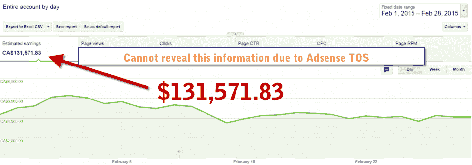

Revenue from display ads (Image source: [Authority Hacker](https://www.authorityhacker.com/display-ads-income/))

对于一个糟糕的货币化策略来说还不错，对吧？

乔恩说，他的 Adsense 成功的秘诀是最佳广告位置，在他拥有的众多网站上为 T2 带来大量流量，并选择展示广告的利基市场。

一个很棒的免费 WordPress 插件是[广告插入器](https://wordpress.org/plugins/ad-inserter/)，你可以用它来优化你的广告位置。有了它，您可以轻松地 A/B 测试您的广告，看看哪个表现更好，它甚至允许您自定义您的广告出现在您的网站上的方式和位置。

例如，如果你想让一个广告出现在你的文章中，但是只出现在前两段内容之后，你可以很容易地做到。

有了广告，你不需要自己的产品来销售，但你需要流量，你能产生的流量越多，你的表现就越好。

当你开始发展你的博客和改进你的内容营销时，广告开始为你工作可能需要一些时间，但最终，你会成功的。

广告甚至不必是永久性的，它可以只是一种临时的用你的博客赚钱的方式，直到你能找到更好的赚钱方式。

但是我们生活在广告拦截器的时代，它们正以负面的方式影响着你的收入。
T3】

## 7.成为代销商

你不可能有一篇关于博客赚钱的文章不提到[联盟营销](https://kinsta.com/affiliate-academy/affiliate-marketing-business/)。这是[博主在线赚钱最常见的方式之一](https://kinsta.com/blog/website-ideas/)。

事实上，联盟营销推动了网络的发展，大约 15%的数字媒体行业收入来自于联盟营销，在美国，联盟营销推动了和电子邮件一样多的电子商务订单。

有了联盟营销，你可以推广其他企业的产品，并从你带来的每一笔销售中获得佣金。

联盟营销人员的工作方式与大多数销售人员相同。他们帮助推广和销售公司的产品，并在有人购买时获得佣金。

以下是其工作原理的直观分析:

How affiliate marketing works (Image source: [HubSpot](https://blog.hubspot.com/marketing/affiliate-marketing-guide))

这真的很简单，比如说你的佣金是每笔销售 5 美元，你让 200 人购买该产品，你就赚了 1000 美元。

吸引人们加入联盟营销的是，你可以搭载一个伟大的产品，并出售给你的观众。

#### 有了联盟营销，你只需要三样东西

1.  利基(这似乎是突然出现了很多不是吗？😉).
2.  附属产品。
3.  以及向其推销产品的受众。

你可以通过写一些与你的领域相关的话题来建立你的读者群，一旦你有了一个读者群，你就可以找到来自联盟网络的产品，比如:

*   [乐天营销](https://rakutenmarketing.com/affiliate?)
*   [亚马逊子公司](https://affiliate-program.amazon.com/)(一定要检查一下 [AAWP WordPress 插件](https://getaawp.com/))
*   [分享销售](https://www.shareasale.com/)
*   [易贝合作伙伴网络](https://partnernetwork.ebay.com/)
*   [点击银行附属机构](http://www.clickbank.com/)

我们在金斯塔也有一个加盟计划。Kinsta 的附属项目提供 10%的终身佣金，许多博主已经通过它获得了大量的被动收入。

你也可以查看你所在领域的其他博客正在推广什么样的联盟产品，并亲自接触这些企业。

有一件事要记住，当你的博客通过联盟营销赚钱时，你应该专注于为你的读者提供价值，而不仅仅是推销产品，这样你就可以销售。

举个例子，最好的代销商甚至不会被认为是代销商。

以 Ryan Robinson 为例，他每月通过博客赚取数万美元的代销商收入。

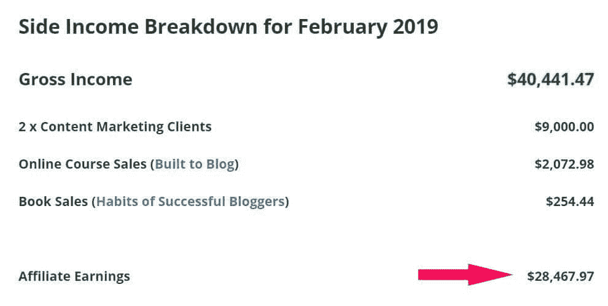

Affiliate earnings (Image source: [Ryan Robinson](https://www.ryrob.com/))

Ryan 为他的读者创造了许多有价值的内容，推销他喜欢和使用的产品感觉像是其中很自然的一部分。

由于越来越多的企业现在有联盟计划，你可以开始推广产品，无论你在什么样的利基。

## 8.通过赞助帖子/评论创收

通过赞助帖子和评论赚钱是博客最不常见的赚钱方式之一，可能是因为你需要大量的流量和信誉来实现它。

有了赞助商的帖子和评论，博客作者将向公司收取费用，让公司在博客上写下他们的产品，并给出他们对产品的看法。产品暴露在博主的观众面前，品牌获得更多曝光和新客户。

当你想到影响者营销时，你的脑海中会迅速浮现出你在 Instagram 和 Youtube 上认识的影响者的图片。

但是在你的博客上写赞助帖子是影响者营销，而且它现在正在爆炸。已经使用影响者营销的企业中，超过 63%的企业计划今年增加支出。

影响者营销已经经历了巨大的增长，预计 2019 年的市场规模约为 65 亿美元。

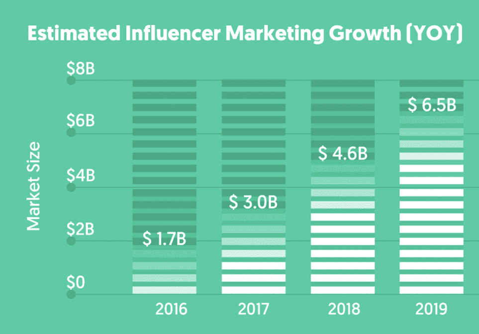

Influencer marketing growth (Image source: [Influencer Marketing Hub](https://influencermarketinghub.com/influencer-marketing-2019-benchmark-report/))

当在你的博客上介绍一个产品时，一定要给出你对它的真实反馈，因为不值得为了几个钱而失去读者的信任。

例如， Michelle Gardner 的《让美分变得有意义》，她在每篇赞助帖子收费 5000 美元，每月从赞助帖子中赚 10000 到 20000 美元，她主要写她自己使用的产品和服务。这样她就能确保她的观众也会喜欢它。

Struggling with downtime and WordPress problems? Kinsta is the hosting solution designed to save you time! [Check out our features](https://kinsta.com/features/)

下面是她在博客上评论的一款产品的评论，说明了我的意思:

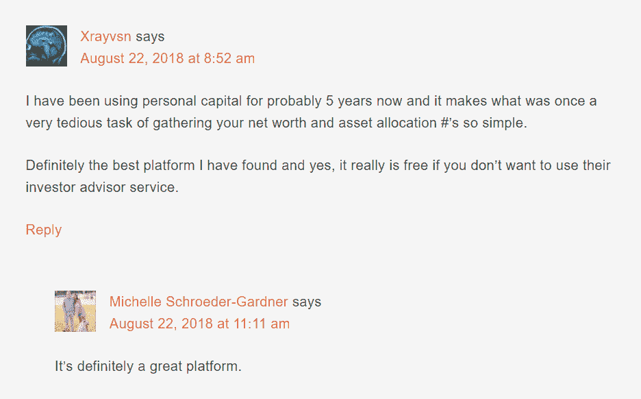

High-quality review engagement (Image source: [Making Sense of Cents](https://www.makingsenseofcents.com/2018/08/personal-capital-review.html))

正如我之前提到的，赞助帖子的唯一缺点是，你需要在网上有一个稳定的存在，然后你才能让公司付给你任何实质性的东西。

公司需要知道，为一个赞助帖子付费会带来销售，从而使投资物有所值。因此，对于新手来说，赞助帖子可能不是最好的赚钱系统，但对于更有经验的博主来说却是很好的。

如果你的博客已经[产生流量](https://kinsta.com/blog/wordpress-seo/)你可以开始接触你已经在使用的产品或服务的利基企业，并提供撰写赞助帖子或评论。

例如，如果你写关于技术的文章，你可以为制造智能门铃、笔记本电脑、照相机等的公司做赞助评论。

Fit Financials 的亚历克西斯施罗德(Alexis Schroeder)写的是健身和个人理财，所以当她开始产生足够的流量时，她就联系了个人理财和健身领域的公司。

亚历克西斯每篇帖子的收费约为 750 至 1500 美元，平均每月仅从这些帖子中就能获得 3000 美元。

## 9.向你的观众销售实物产品

另一种让你的博客赚钱的方法是直接向你的读者销售产品。一些博客作者甚至从仅仅销售一些商品转向在博客旁边推出成熟的电子商务网站。

例如，受欢迎的电子商务商店 [Beardbrand](https://www.beardbrand.com/) 最初是一个博客，创始人 Eric Bandholz 在他开始销售 Beardbrand 今天闻名的胡须美容产品之前写了关于胡须美容的文章。

Eric 将他的胡子博客变成了一项业务，被纽约时报公司的 Shark Tank 专题报道，现在每月收入超过 10 万美元。

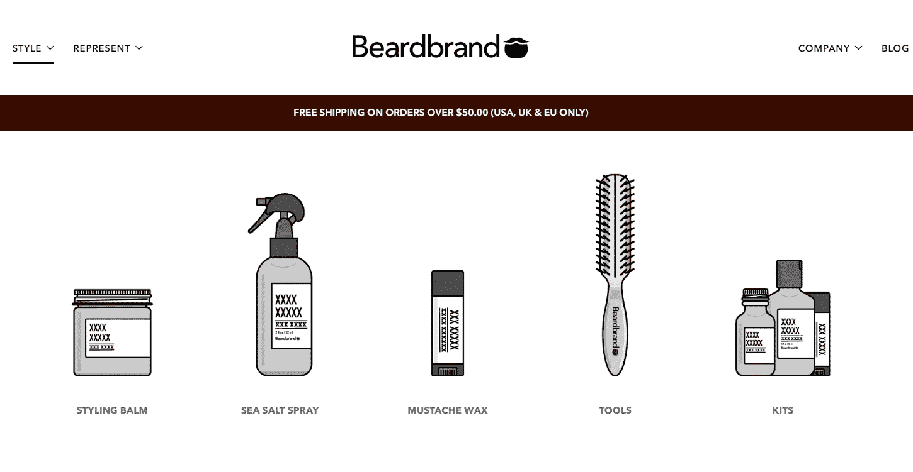

Beardbrand (Image source: [Beardbrand](https://www.beardbrand.com/))

Eric 并不是唯一一个发现向你的读者销售产品是你的博客赚钱的好方法的人。

燕麦片公司的马修·因曼卖与他在博客上画的漫画相关的商品，一年能赚大约 37.5 万美元。

Eric 和 Matthew 都可以通过这种方式从他们的博客中赚钱，因为他们建立了一个专门的社区，真正想要他们提供的东西。

如果你已经建立了一个受众群，最有利可图的赚钱方式之一就是直接向这些人销售产品。

他们已经信任你，因为你迎合他们，你可能比大多数制造商和零售商更了解他们。

Shari Lott 创办了 Spearmint Baby，作为母亲们的博客，随着她在网上的影响力越来越大，她开始更多地了解她的母亲们想要什么。

Shari 推出了 Spearmint LOVE，这是一家销售婴儿服装的电子商务商店，在不到五年的时间里，它发展成为一家在 2016 年赚了 150 万美元的企业。

Baby clothes ecommerce site (Image source: [Spearmint LOVE](https://www.spearmintlove.com/))

如果你已经有了一个观众，那么开始关注他们的问题，看看你是否可以推销一些东西来帮助他们解决问题。

## 10.向你的观众销售数字产品

有时候，解决观众问题的最好方法不是用实体产品，而是用软件和数字下载。

Clay Collins 通过他写的关于优化登陆页面的博客得到了 Leadpages 的想法。当 Clay 开始免费分发登录页面模板时，他发现人们想要更多。

他们想定制它，将其与他们的工具集成，甚至进行分割测试，所以他创建了 Leadpages。这家公司现在有 3800 万美元的资金，每年产生 2500 万美元的收入。

如果你有其他技能，不仅仅是写博客和创作电子书，不要浪费它们。如果你知道如何编码，你可以[创建软件或 WordPress 插件](https://kinsta.com/blog/themeforest-pros-cons/)，然后卖给你现有的观众。

即使你不知道如何编码，你也可以雇佣一个开发人员。网络研讨会 Ninja 的 Omar Zenhom 与他从自由职业者那里雇佣的开发人员一起开发了他产品的第一个版本。

你甚至可以[向你的听众出售数字产品](https://kinsta.com/blog/easy-digital-downloads/)，比如模板、主题，甚至[音频录音](https://kinsta.com/blog/wordpress-audio-players/)，如果这能帮助他们解决他们遇到的问题。

例如， [Relaxing White Noise](https://relaxingwhitenoise.com) 出售帮助听众放松和入睡的音轨。[豪华镜头](http://theluxelens.com/)向摄影师出售 Lightroom 和 Photoshop 模板。相机装备网站 Shotkit [出售 Lightroom](https://shotkit.com/buy-lightroom/) 赚取佣金。

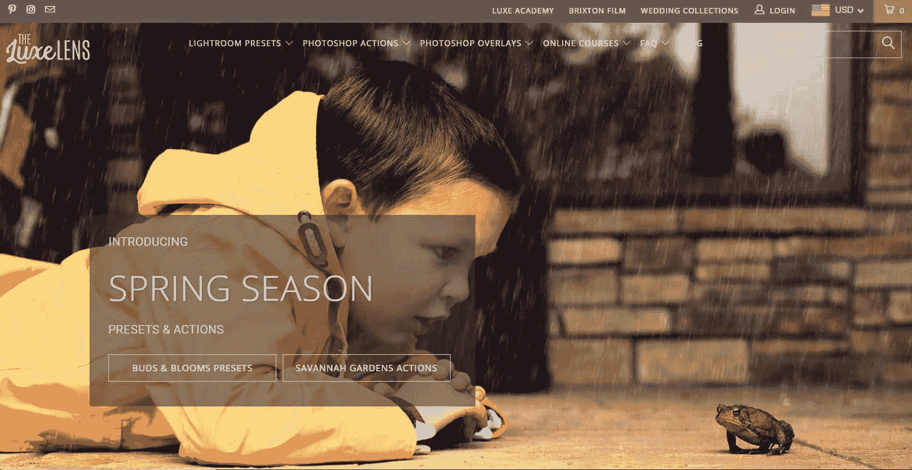

The Luxe Lens

你甚至可以像 lifeismessyandbrilliant 的 Jennifer 一样出售印刷品，她在自己的博客上出售数字规划器和贴纸。

## 11.在你的领域发起一次虚拟峰会

如果你紧跟互联网趋势，那么你可能听说过甚至参加过虚拟峰会。

请记住，虚拟峰会或网络会议不同于网络研讨会。

主要区别在于，虚拟峰会更具互动性和吸引力。它们本质上是你可以在网上参加的会议，有主持人、问答环节和多个演讲者，涵盖一个特定的主题。

现在，虽然虚拟峰会本身通常是免费参加的，但你只能在有限的时间内访问它们。组织者的大部分收入来自销售一种“全权限通行证”,允许与会者随时查看会议材料。

主持[10 万美元发射学校](https://school.tommorkes.com/)峰会的汤姆·莫克在一次峰会后出售所有通行证，赚了 2 万多美元。

$100k Launch School summit

虚拟峰会的主持人也通过在峰会结束后销售相关产品赚钱，如会员计划和关于该主题的课程。

虚拟峰会即使对新手来说也是一个很好的赚钱策略，这是因为你不需要成为一个知名的博主来举办一个虚拟峰会。主要是因为你通过采访你所在领域的其他有影响力的人来提高可信度。

例如，乔恩·舒马赫在发起他的[网络研讨会精通峰会](http://jonschumacher.com/case-study-first-virtual-summit/)时，只有大约 2000 名电子邮件订户。

仅仅 10 天之后，峰会不仅带来了近 26，000 美元的销售额，还为他的电子邮件列表增加了 2，854 名订户。

虚拟峰会存在于你能想到的几乎所有领域。例如，在出版业，有一个[畅销书峰会](http://bestsellersummitonline.com/)，教授如何撰写和出版一本畅销书。

[会员网站峰会](http://membershipsitesuccesssummit.com/)教企业家如何创建和发展一个成功的会员网站。

如果你已经建立了一个听众群，即使人数不多，你也可以通过与你所在领域的有影响力的人合作来创建一个虚拟峰会。

据我所知，在任何领域寻找有影响力的人的最好方法是使用像 Buzzsumo 这样的工具。

你所要做的就是去 Buzzsumo 主页，输入你的关键词。

例如，如果我想举行一个关于图书出版的虚拟峰会，我会在搜索框中输入图书出版。

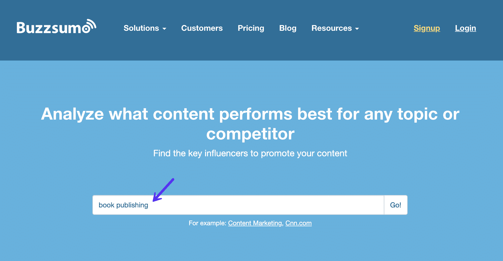

Enter a keyword in Buzzsumo

然后，确保点击“影响者”选项卡:

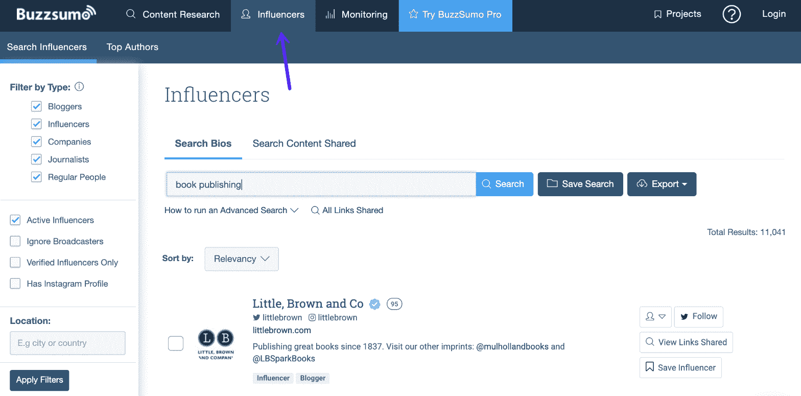

Buzzsumo influencers

然后你可以根据关注者数量、回复率以及任何你认为重要的标准进行过滤。

当你发现你所在领域的有影响力的人时，你可能很想马上联系他们，请他们在你的峰会上发言，但这很少奏效。

相反，在你提出任何要求之前，你要慢慢地和他们建立关系。首先在 Twitter 上关注他们，然后阅读、评论并让客人在他们的博客上发帖。换句话说，你想在提出要求之前传递价值。

## 12.在你的博客上接受捐赠

你也可以通过让你的读者捐款来赚钱。如果你是一个非盈利组织，这一点尤其有效。

你可以用像 Give、Charitable 和 [PayPal 捐款](https://kinsta.com/blog/paypal-donate-button-wordpress/)这样的插件[接受捐款。](https://kinsta.com/blog/wordpress-donation-plugins/)

以下是慈善捐赠插件在[乌干达水项目](https://ugandanwaterproject.com/give/campaigns/)活动页面上的外观:

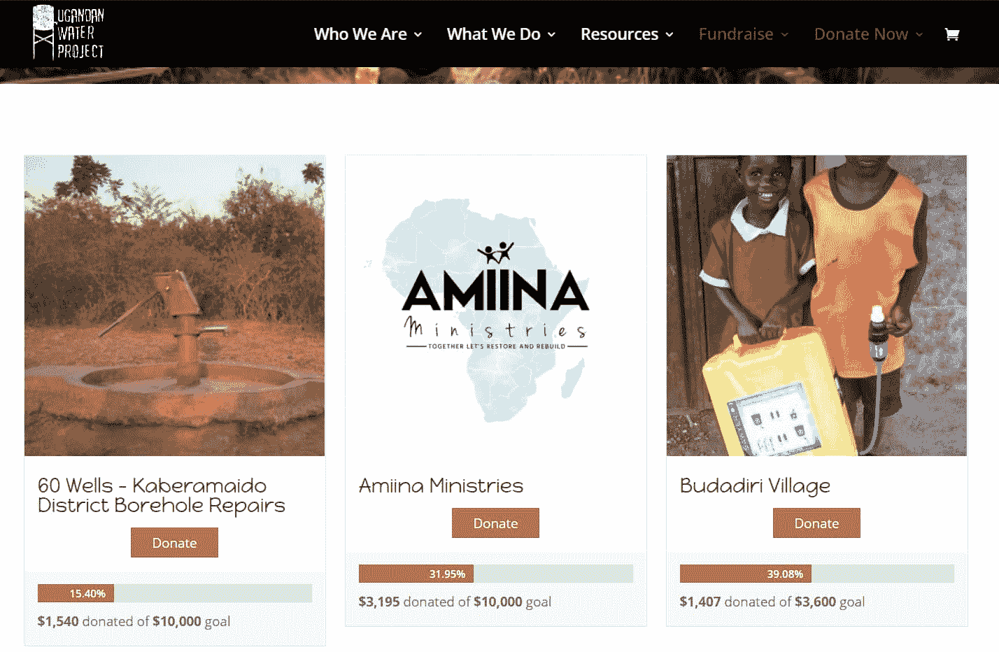

Uganda Water Project

现在，虽然接受捐款是非营利组织的标准，但它们也可以用来赚钱。

你可能会对捐款在博客中的作用持怀疑态度，我也是，直到我开始阅读像《石板星法典》的斯科特·亚历山大这样的博客作者，他每月从 Patreon 上的 410 名粉丝那里赚到 2493 美元。请记住，斯科特只是兼职写博客，他仍然有一份全职工作。

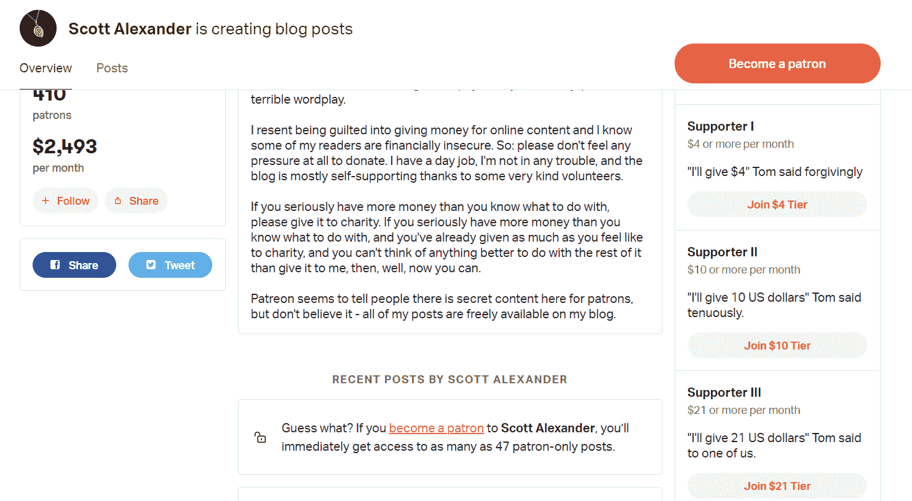

Scott Alexander is creating blog posts (Image source: [Patreon](https://www.patreon.com/user?u=926060))

也有像 Tim Urban 这样的博客作者，他们光是在 Patreon 上就每月赚超过 12k 美元。

这并不意味着任何博客都可以通过捐款赚钱。

我提到的大多数博客都花了相当长的时间才开始从捐款中获得可观的收入。

这是因为你需要有一个真正专注的受众来为你的博客捐款，这需要首先免费提供大量有价值的内容。

例如，Tim Urban 花了 40-80 个小时来写和研究他的博客文章，其中一些文章比人们卖的电子书还要长。

创造他免费赠送的东西需要做很多工作。

他的观众意识到了这一点，他们如此热爱蒂姆的作品，以至于捐款支持他。如果蒂姆每周只写 100 字的文章，他就不可能得到捐款。

### 如何在你的博客上接受捐赠:

到目前为止，我已经指出了人们通过 Patreon 平台或使用 [WordPress 捐赠插件](https://kinsta.com/blog/wordpress-donation-plugins/)接受捐赠的例子。

但是应该用哪个呢？那取决于什么对你最重要。

在 Patreon 上接受捐款可能会更贵，因为他们会收取你收入的 5%的费用，你还必须支付另外 5%的交易费。

作为回报，你有一个平台来处理所有的退款和拒绝付款。此外，接受捐款和管理捐款人也很容易，而且不费吹灰之力。Patreon 甚至有一个 [WordPress 插件](https://wordpress.org/plugins/patreon-connect/)来帮助你从你的博客内容中赚钱。

另一方面，如果你选择使用 WordPress 插件，你将支付更少的费用，但是你必须自己完成大部分的设置。您还必须处理交易错误，并创建一种自己管理捐赠者的方法。

所以本质上，如果你想尽快开始，并且不介意为已经建立的平台支付额外费用，Patreon 是一个很好的选择。如果你不介意自己设立捐款，自己管理捐款人，那么 WordPress 插件非常适合你。

## 13.开始播客

播客现在正在爆炸式增长。根据[付费洞察](https://www.podcastinsights.com/podcast-statistics/)，截至 2019 年 4 月，有超过 **70 万活跃播客**，超过 2900 万集。

世界各地越来越多的人开始听播客。以下是全球收听播客的人口比例:

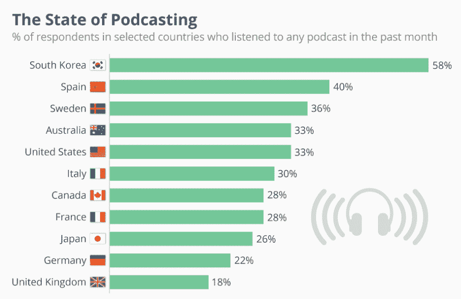

The State of Podcasting (Image source: [Statista](https://www.statista.com/chart/14306/podcast-adoption/))

如果你已经有了一个博客，加入一个播客会是一个非常聪明的方法，通过利用播客的增长来获得更多的流量。

播客是伟大的，尤其是当你是一个新人的时候，因为在你的领域中大多数已经建立的博客都比你有更多的书面内容。

但是有多少人有播客呢？

播客是让 [Entrepreneur on Fire](https://www.eofire.com/) 的约翰·李·杜马斯(John Lee Dumas)从 2012 年的 69879 美元收入增长到 2018 年的 1545090 美元的原因。

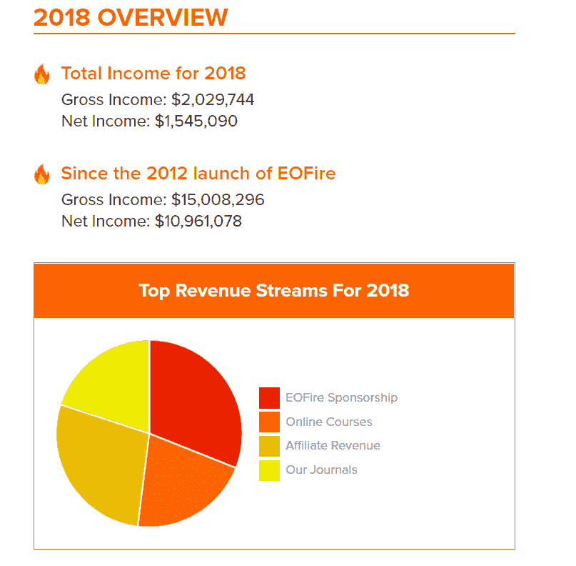

Entrepreneur on Fire podcast ([Fire Nation](https://www.eofire.com/income/))

播客做得非常好，甚至像诺亚·卡根和达伦·罗斯之类的受欢迎的博客现在也在他们的常规博客内容中加入了播客。

播客不仅仅帮助你出名，为你的博客带来更多的流量。这也可以成为你博客的另一个收入来源。

有了足够多的观众，你可以开始在你的播客上销售赞助时段给那些想要接触到你的观众的企业。

Mixergy 的安德鲁·沃纳通过他的播客为公司提供接触企业家观众的机会，从而创造了额外的收入。

这是他采访 Codementor 创始人的两个赞助商:

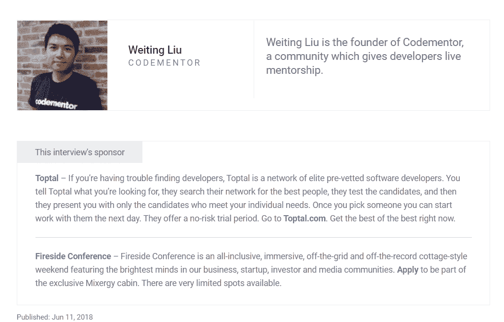

Podcast sponsors (Image source: [Mixergy](https://mixergy.com/interviews/codementor-with-weiting-liu/))

### 在哪里托管你的播客？

开始播客你需要一个地方来存放你的音频文件，就像你的网站一样。

媒体主机是一家允许您存储音频文件的公司，这样听众就可以流式传输和下载这些文件。

播客的一些媒体主机包括:

*   Libsyn
*   布鲁布利
*   Buzzsprout
*   和晶体管

还有一些 WordPress 插件可以帮助你管理甚至托管你的播客，比如[非常简单的播客](https://wordpress.org/plugins/seriously-simple-podcasting/)、[智能播客播放器](https://smartpodcastplayer.com/)和[简单播客出版社](https://simplepodcastpress.com/)。

### 开始播客需要什么

大多数人高估了他们需要什么来开始播客，所以从来没有开始过，但是如果你已经有一台电脑，你只需要一些东西就可以开始了，比如:

*   麦克风:你可以在亚马逊上花 10 美元买到一个麦克风。
*   **一个耳机**:你可能已经有了。
*   **音频编辑软件**:有类似 [GarageBand](https://www.apple.com/mac/garageband/) (Mac)或 [Audacity](https://www.audacityteam.org/) (Windows)的免费选项。
*   播客托管:你可以获得低至每月 12 美元的计划。
*   一个 Skype 或 Zoom 帐户:如果你打算在你的节目中做采访。

就这样，你现在可以开始创作剧集给全世界听了。

## 摘要

正如 ConvertKit 的研究显示的那样，虽然开博客比以往任何时候都容易，但大多数博客作者很难赚钱。除非你能找到适合你博客的赚钱策略，否则光写博客是不会产生收入的。

正如大多数例子所证明的，你不需要那么多的流量或线索就能从你的博客中获得收入。虽然你的定位很重要，但这并不是决定你能否成功的最重要因素。

我们看到人们用网球、胡子、高尔夫、婴儿服装、汽车甚至兰花赚钱。

你真正需要的是理解使你的盈利战略成功所需的数字，以及努力推销你所能提供的东西的决心。

阅读这是第一步，我们希望你现在有策略和工具开始用你的博客赚钱。

关于如何从博客中赚钱，你有其他好的建议吗？如果有，下面分享一下。

* * *

让你所有的[应用程序](https://kinsta.com/application-hosting/)、[数据库](https://kinsta.com/database-hosting/)和 [WordPress 网站](https://kinsta.com/wordpress-hosting/)在线并在一个屋檐下。我们功能丰富的高性能云平台包括:

*   在 MyKinsta 仪表盘中轻松设置和管理
*   24/7 专家支持
*   最好的谷歌云平台硬件和网络，由 Kubernetes 提供最大的可扩展性
*   面向速度和安全性的企业级 Cloudflare 集成
*   全球受众覆盖全球多达 35 个数据中心和 275 多个 pop

在第一个月使用托管的[应用程序或托管](https://kinsta.com/application-hosting/)的[数据库，您可以享受 20 美元的优惠，亲自测试一下。探索我们的](https://kinsta.com/database-hosting/)[计划](https://kinsta.com/plans/)或[与销售人员交谈](https://kinsta.com/contact-us/)以找到最适合您的方式。