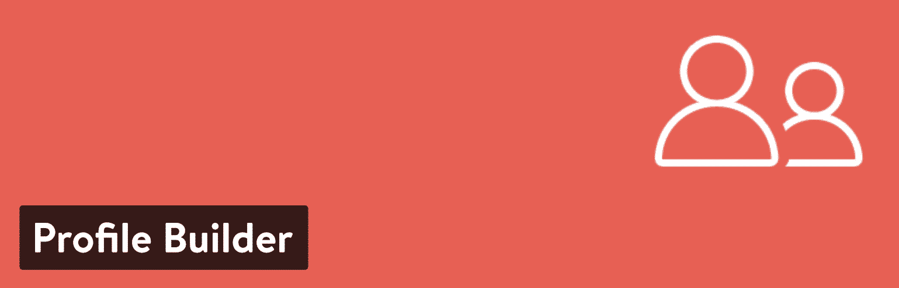
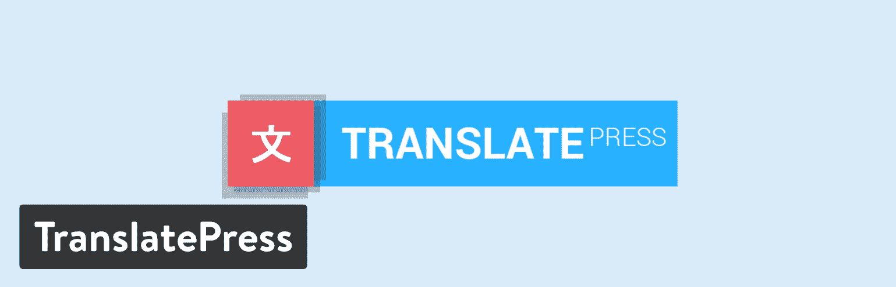

# 金斯塔·金并:阿德里安·斯皮阿克访谈

> 原文:# t0]https://kinta . com/blog/interview-Adrian-spiac/

Adrian Spiac 是 Cozmoslabs 的联合创始人，Cozmoslabs 是一家 WordPress 公司，专注于提供你可以依赖的优质 WordPress 插件。其中包括 Profile Builder，付费会员订阅，以及他们最新的成功之作:TranslatePress。他们的插件在全球超过 100，000 个 WordPress 站点上得到很好的支持、维护和使用。

你可以在推特(Twitter)或领英(LinkedIn)上找到阿德里安。这是我们最近对他的采访，作为我们[金斯塔·金并](https://kinsta.com/?post_type=post&s=kingpin)系列的一部分。

### Q1:你的背景是什么，你是如何开始使用 WordPress 的？

我毕业于电子与电信工程专业，专业是多媒体。我本质上是一个善于分析的人，从 9 年级开始写代码，并很快爱上了它。

我的 WordPress 之旅始于大约 10 年前，当时我与克里斯蒂安(Cristian)合作，并决定创办一家网络开发机构。由于它的简单，WordPress 很快成为我们的主要焦点。我们学到的东西被分享到我们的 [Cozmoslabs](https://www.cozmoslabs.com/) 博客上，这个博客最终成为我们发布所有 WordPress 相关产品的平台。

我们的第一款旗舰产品 Profile Builder ，基本上是一篇博文的最终成果。在注意到试图在前端扩展默认的 WordPress 用户注册同时添加自定义用户字段的局限性后，我们发布了一个关于这个主题的详细教程。

它从我们的读者那里得到了很多反馈，并很快成为我们最受欢迎的博客帖子。几个月后，教程变成了插件，这就是 Profile Builder，我们的前端用户注册和配置文件插件的诞生。

Profile Builder 逐渐增长的收入帮助我们从一家咨询和服务机构转变为一家 100%以产品为导向的公司。

Profile Builder WordPress plugin

### Q2:读者应该知道你最近在 WordPress 做了些什么？

这些天来，我越来越关注建立流程来帮助我们的 WordPress 产品业务的发展。我也在学习更多的授权。

由于我们[每周只工作 4 天](https://www.cozmoslabs.com/67767-growing-wordpress-business-4-day-workweek)(周五休息)，建立结构是保持正轨的关键。

[4-day workweeks add an extra “switched off from work” day. 🗓️ From our experience, that can make all the difference in the world. - @adispiacClick to Tweet](https://twitter.com/intent/tweet?url=https%3A%2F%2Fkinsta.com%2Fblog%2Finterview-adrian-spiac%2F&via=kinsta&text=4-day+workweeks+add+an+extra+%E2%80%9Cswitched+off+from+work%E2%80%9D+day.+%F0%9F%97%93%EF%B8%8F+From+our+experience%2C+that+can+make+all+the+difference+in+the+world.+-+%40adispiac&hashtags=startups%2Cremotework)

然而，最近我更专注于推广我们最新的多语言插件 [TranslatePress](https://translatepress.com/) 。我们也开始在我们的季度[透明报告](https://translatepress.com/category/transparency-reports/)中分享从开发和成长一个新的 WordPress 插件中学到的经验。

TranslatePress WordPress plugin

我偶尔也会参与开发我们的会员插件[付费会员订阅](https://www.cozmoslabs.com/wordpress-paid-member-subscriptions/)，因为对我来说，没有什么比实际编写一个功能更好的了。

与我们的第一个插件类似，付费会员订阅是由我们的 Profile Builder 用户反复请求接受付款和提供付费用户档案而产生的。

创建一个独立的插件，而不是一个附加组件，是一个非常好的举措，因为这个插件发展得非常漂亮，现在它已经是一个成熟的会员解决方案，可以与现有的选项竞争。

### Q3:在职业生涯中，你遇到了哪些挑战？

创业每天都带来不断的挑战。我很幸运能成为一个伟大团队的一员，并且有两个商业伙伴一直支持我。这并不意味着一切都是彩虹和蝴蝶。

## 注册订阅时事通讯

### 想知道我们是怎么让流量增长超过 1000%的吗？

加入 20，000 多名获得我们每周时事通讯和内部消息的人的行列吧！

[Subscribe Now](#newsletter)

一些持续的**斗争围绕着保持一致**。无论是雇佣合适的人，营销你的产品，提供强大的支持还是编写高质量的代码，做正确的事情都很难。也应该如此。

学会说不，放弃控制，倾听而不是说话，更支持是我教育自己要经常做的事情。有时候会很痛苦。

### 在 WordPress 的世界里，有没有什么让你感到惊讶的事情？

社区。我相信这是一种普遍的感觉。我一直对 WordPress 社区的开放性、分享和互相帮助的意愿感到惊讶。

我在当地的 WordCamps 感受到了它的巅峰，因为有足够多的人进行长时间的对话，最终导致更强大的人际互动。

对我们来说，参加甚至赞助单词营是一次很好的团队建设经历。这是我们喜欢做的事情，并将继续定期做。

### Q5:你认为 WordPress 世界的未来会是怎样的？

对我们来说，我们致力于让我们的产品更好、更强大，同时确保我们不会牺牲易用性。我们仍然认为自己是 WordPress 社区的一部分，只要它需要我们。

就 WordPress 的未来而言，真的很难讲。最有可能的是，由于惯性，WordPress 将在接下来的几年里继续增长，页面构建器和模块将在整体用户体验中变得更加集成。

我们可能会看到更多的小众软件即服务企业试图进入该平台不断增长的用户群。还有一些大玩家。

我希望我们能解决的一件事是访问使用数据。现在，WordPress 领域的产品开发者对数据的访问非常有限。适当的使用追踪可以让我们减少猜测，根据事实来改善整体用户体验。

### 你在 WordPress 主机中寻找什么？

对我来说，**可靠性是关键**。知道有人在那里解决任何潜在的问题，快速找到问题的根源，而不用来回传递支持信息。另一件事是安全，知道我的数据是安全和受保护的。

除了这个价格，拥有良好的运行时间和维护良好的基础设施也是选择 WordPress 主机的重要因素。

### 问题 7:当你离开笔记本电脑时，你喜欢做什么？

我非常喜欢钓鱼运动。这对我来说就像冥想，让我完全脱离其他一切，享受自然。我已经参加钓鱼比赛将近 10 年了。

去年我赢得了全国用鱼饵钓鱼的冠军，所以我将作为国家队的一员参加今年在南非举行的世界钓鱼锦标赛。

如你所想，这是一种瘾。不过，这能让我保持理智。😄

除了钓鱼，我真的很喜欢读书。阅读 15-30 分钟已经成为我早晨习惯的一部分很长时间了。它帮助我以一种平衡的方式开始我的一天。

### 问题 8:接下来我们应该采访谁&为什么？

我建议采访 WPZOOM 的 Pavel Ciorici。他是一位才华横溢的企业家，对细节的关注令人印象深刻，我相信读者会从他的见解中受益。

* * *

让你所有的[应用程序](https://kinsta.com/application-hosting/)、[数据库](https://kinsta.com/database-hosting/)和 [WordPress 网站](https://kinsta.com/wordpress-hosting/)在线并在一个屋檐下。我们功能丰富的高性能云平台包括:

*   在 MyKinsta 仪表盘中轻松设置和管理
*   24/7 专家支持
*   最好的谷歌云平台硬件和网络，由 Kubernetes 提供最大的可扩展性
*   面向速度和安全性的企业级 Cloudflare 集成
*   全球受众覆盖全球多达 35 个数据中心和 275 多个 pop

在第一个月使用托管的[应用程序或托管](https://kinsta.com/application-hosting/)的[数据库，您可以享受 20 美元的优惠，亲自测试一下。探索我们的](https://kinsta.com/database-hosting/)[计划](https://kinsta.com/plans/)或[与销售人员交谈](https://kinsta.com/contact-us/)以找到最适合您的方式。